# 第四章：猫和狗

在第二章《你的第一个分类器》中，我们为字符识别任务构建了一个简单的神经网络。我们在这一章的结尾取得了令人称赞的 80%中期准确率。不错的开始，但我们可以做得更好！

本章中，我们将为之前的分类器添加更强大的网络架构。接下来，我们将深入探讨一个更具挑战性的问题——处理 CIFAR-10 数据集中的彩色图像。图像会更加复杂（猫、狗、飞机等），因此我们将使用更强大的工具——具体来说，是卷积神经网络。让我们开始吧。

# 重新审视 notMNIST

让我们从渐进的方式开始，在第二章《你的第一个分类器》中使用的`notMNIST`数据集上尝试技术变更。你可以在阅读本章时编写代码，或者在书籍的代码库中进行操作：

[`github.com/mlwithtf/mlwithtf/blob/master/chapter_02/training.py`](https://github.com/mlwithtf/mlwithtf/blob/master/chapter_02/training.py)

我们将从以下导入开始：

```py
    import sys, os 
    import tensorflow as tf 
    sys.path.append(os.path.realpath('../..')) 
    from data_utils import * 
    from logmanager import * 
    import math
```

这里没有太多实质性的变化。真正的计算能力已经通过`tensorflow`包导入。你会注意到，我们再次使用了之前的`data_utils`工作。然而，我们那里需要做一些更改。

与之前唯一的不同是`math`包，我们将使用它来处理辅助的`math`函数，例如`ceiling`。

# 程序配置

现在，让我们来看一下我们以前的程序配置，如下所示：

```py
    batch_size = 128 
    num_steps = 10000 
    learning_rate = 0.3 
    data_showing_step = 500 
```

这次我们需要更多的配置。以下是我们现在将使用的配置：

```py
 batch_size = 32 
 num_steps = 30000 
 learning_rate = 0.1 
 data_showing_step = 500 
 model_saving_step = 2000 
 log_location = '/tmp/alex_nn_log' 

 SEED = 11215 

 patch_size = 5 
 depth_inc = 4 
 num_hidden_inc = 32 
 dropout_prob = 0.8 
 conv_layers = 3 
 stddev = 0.1 
```

前四个配置是熟悉的：

+   我们仍然会训练一定数量的步骤（`num_steps`），就像以前一样。但你会注意到，步骤数量已经增加。它们将变得更加庞大，因为我们的数据集会更复杂，需要更多的训练。

+   我们稍后会重新审视学习率（`learning_rate`）的细节，但首先你已经熟悉它了。

+   我们将在每五百步时中期回顾结果，这可以通过`data_showing_step`变量轻松控制。

+   最后，`log_location`控制我们 TensorBoard 日志的存储位置。我们在第三章《TensorFlow 工具箱》中已经对它非常熟悉。这一章我们将再次使用它，但这次不再做解释。

下一个配置——**随机种子**（`SEED`）变量——可能会很有帮助。这个变量可以不设置，TensorFlow 会在每次运行时随机化数字。然而，设置一个`seed`变量并且在每次运行中保持一致，将有助于我们在调试系统时保持一致性。如果你使用它（推荐从一开始就使用），你可以将它设置为任何你喜欢的数字：你的生日、纪念日、第一次电话号码或幸运数字。我用的是我心爱的社区的邮政编码。享受那些小事吧。

最后，我们会遇到七个新变量——`batch_size`、`patch_size`、`depth_inc`、`num_hidden_inc`、`conv_layers`、`stddev` 和 `dropout_prob`。这些是我们更新版、更先进的**卷积神经网络**（**CNN**）工作的核心，在我们探讨所使用的网络时，会在具体上下文中引入。

# 理解卷积神经网络

卷积神经网络（CNN）是专为机器学习中的图像处理而设计的更先进的神经网络。与我们之前使用的隐藏层不同，CNN 有一些未完全连接的层。这些卷积层除了宽度和高度外，还有深度。一般原则是，图像是按补丁逐个分析的。我们可以如下可视化图像中的 7x7 补丁：


这反映了一个 32x32 的灰度图像，使用了 7x7 的补丁。以下是从左到右滑动补丁的示例：

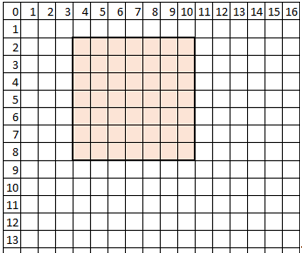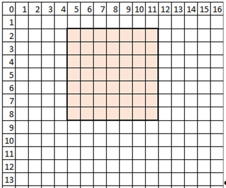

如果这是一张彩色图像，我们会同时在三个相同的层上滑动补丁。

你可能注意到我们每次滑动补丁时，只移动了一个像素。这也是一种配置；我们也可以滑动得更多，也许每次移动两个甚至三个像素。这就是步幅配置。正如你猜测的那样，步幅越大，我们最终覆盖的补丁越少，因此输出层会更小。

矩阵运算，我们在此不作详细讨论，用于将补丁（其完整深度由通道数决定）压缩成一个输出深度列。输出只有一个高度和宽度，但深度很大。随着我们迭代地滑动补丁，深度列的序列形成了一个具有新长度、宽度和高度的块。

此外，还有一种配置在此起作用——图像边缘的填充。如你所想，填充越多，补丁滑动的空间就越大，可以越过图像的边缘。这使得步幅增大，从而输出体积的长度和宽度也更大。你稍后会在代码中看到这个配置，`padding='SAME'` 或 `padding='VALID'`。

让我们来看这些是如何累加的。首先我们选择一个补丁：

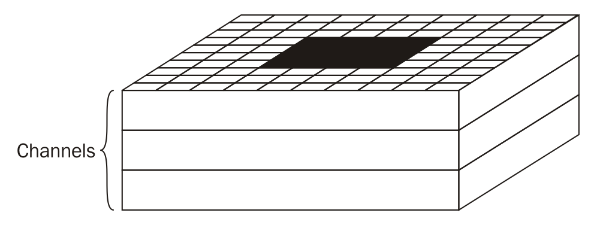

然而，补丁不仅仅是方形的，而是整个深度（针对彩色图像）：


然后我们将其卷积成一个 1x1 的体积，但有深度，如下图所示。结果体积的深度是可配置的，我们将在程序中使用`inct_depth`来设置这个配置：

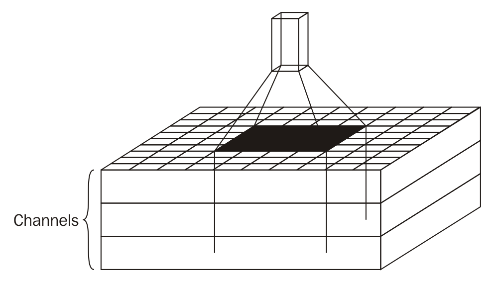

最后，当我们继续滑动补丁时，补丁会多次穿越原始图像，生成多个 1x1xN 的体积，这些将组合成一个体积：

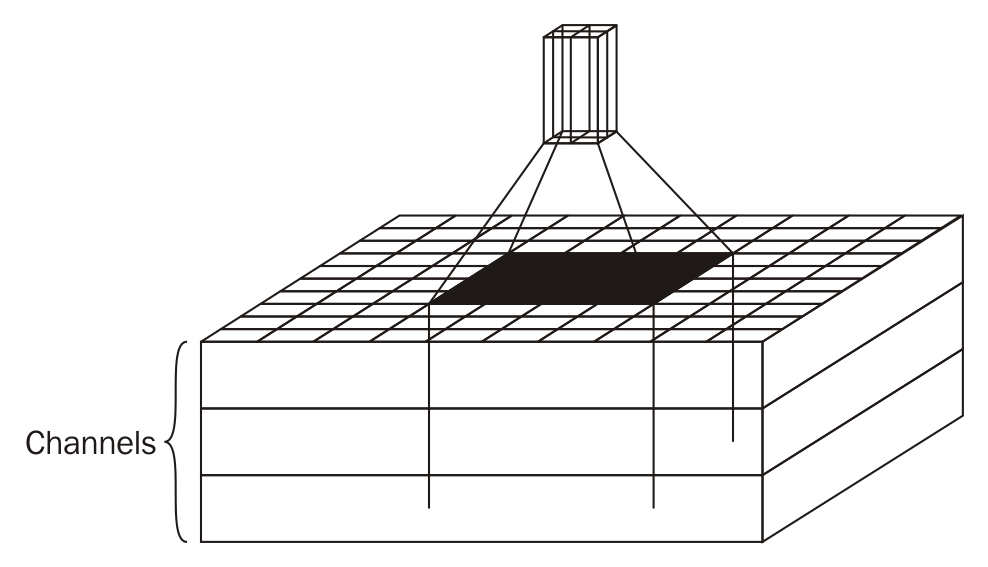

然后我们将其卷积成一个 1x1 的体积。

最后，我们将使用`POOL`操作压缩结果体积的每一层。这里有许多类型，但简单的**最大池化**是最典型的：

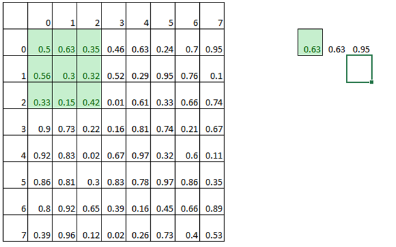

就像我们之前使用的滑动补丁一样，这里会有一个补丁（不过这次我们会取补丁的最大值）和一个步长（这次我们需要一个更大的步长来压缩图像）。我们本质上是在减少图像大小。在这里，我们将使用一个 3x3 的补丁，步长为 2。

# 重新审视配置

现在我们已经介绍了卷积神经网络，让我们重新审视之前遇到的配置：`batch_size`，`patch_size`，`depth_inc`，`num_hidden_inc`，`conv_layers`，`stddev` 和 `dropout_prob`：

+   批量大小（`batch_size`）

+   补丁大小（`patch_size`）

+   深度增量（`depth_inc`）

+   隐藏层增量（`num_hidden_inc`）

+   卷积层（`conv_layers`）

+   标准差（`stddev`）

+   丢弃概率（`dropout_prob`）

# 构建卷积网络

我们将跳过对两个工具函数`reformat`和`accuracy`的解释，因为我们已经在第二章中遇到过它们，*你的第一个分类器*。相反，我们将直接跳到神经网络配置部分。为了比较，以下图展示了我们在第二章中看到的模型，*你的第一个分类器*，接下来的图展示了我们的新模型。我们将在相同的`notMNIST`数据集上运行新模型，看看我们能获得的准确率提升（提示：好消息！）。

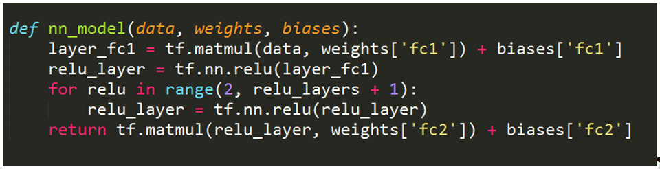

下图是我们的新模型：

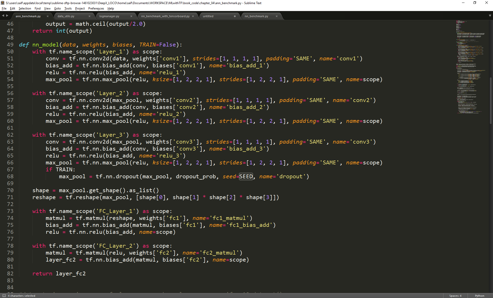

首先，我们将遇到一个`helper`函数，具体如下：

```py
    def fc_first_layer_dimen(image_size, layers): 
       output = image_size 
       for x in range(layers): 
        output = math.ceil(output/2.0) 
       return int(output) 
```

然后，我们将在稍后调用它，如下所示：

```py
    fc_first_layer_dimen(image_size, conv_layers) 
```

`fc_first_layer_dimen`函数计算第一个全连接层的维度。回想一下，CNN 通常使用一系列逐层变小的窗口层。在这里，我们决定将每个卷积层的维度缩小一半。这也说明了为什么输入图像在被 2 的幂次方整除时，事情变得干净而简洁。

现在让我们解析实际的网络。它是通过`nn_model`方法生成的，并在训练模型时稍后调用，在验证集和测试集上进行测试时再次调用。

记得 CNN 通常由以下几层组成：

+   卷积层

+   线性整流单元（ReLU）层

+   池化层

+   全连接层

卷积层通常与**RELU**层配对并重复使用。这正是我们所做的——我们将三个几乎相同的**CONV-RELU**层堆叠在一起。

每一对配对的层如下所示：

```py
    with tf.name_scope('Layer_1') as scope: 
        conv = tf.nn.conv2d(data, weights['conv1'], strides=[1, 1, 
         1, 1], padding='SAME', name='conv1')        
        bias_add = tf.nn.bias_add(conv, biases['conv1'], 
         name='bias_add_1') 
        relu = tf.nn.relu(bias_add, name='relu_1') 
        max_pool = tf.nn.max_pool(relu, ksize=[1, 2, 2, 1], 
         strides=[1, 2, 2, 1], padding='SAME', name=scope)
```

三个几乎相同的层（`Layer_1`、`Layer_2`和`Layer_3`）之间的主要区别在于如何将一个层的输出传递给下一个层。所以，第一层开始时接受数据（图像数据），但第二层开始时接受来自第一层的池化层输出，具体如下：

```py
    conv = tf.nn.conv2d(max_pool, weights['conv2'], strides=[1, 1, 1, 
     1], padding='SAME', name='conv2')
```

同样，第三层开始时接受来自第二层的池化层输出，具体如下：

```py
    conv = tf.nn.conv2d(max_pool, weights['conv3'], strides=[1, 1, 1, 
     1], padding='SAME', name='conv3')
```

三个`CONV`-`RELU`层之间有另一个主要的区别，即这些层被压缩了。你可以通过在每个层声明后使用几个`print`语句来看一下`conv`变量，这可能会有所帮助：

```py
    print "Layer 1 CONV", conv.get_shape() 
    print "Layer 2 CONV", conv.get_shape() 
    print "Layer 3 CONV", conv.get_shape() 
```

这将揭示以下结构：

```py
Layer 1 CONV (32, 28, 28, 4) 
Layer 2 CONV (32, 14, 14, 4) 
Layer 3 CONV (32, 7, 7, 4) 
Layer 1 CONV (10000, 28, 28, 4) 
Layer 2 CONV (10000, 14, 14, 4) 
Layer 3 CONV (10000, 7, 7, 4) 
Layer 1 CONV (10000, 28, 28, 4) 
Layer 2 CONV (10000, 14, 14, 4) 
Layer 3 CONV (10000, 7, 7, 4) 
```

我们用`notMNIST`数据集运行了这个，因此我们将看到原始输入大小为 28x28，这不奇怪。更有趣的是连续层的大小——14x14 和 7x7。注意，连续卷积层的滤波器是如何被压缩的。

让我们让事情变得更有趣，检查整个堆栈。添加以下`print`语句来查看`CONV`、`RELU`和`POOL`层：

```py
 print "Layer 1 CONV", conv.get_shape() 
 print "Layer 1 RELU", relu.get_shape() 
 print "Layer 1 POOL", max_pool.get_shape() 
```

在其他两个`CONV`-`RELU`-`POOL`堆栈后添加类似的语句，你将得到以下输出：

```py
Layer 1 CONV (32, 28, 28, 4) 
Layer 1 RELU (32, 28, 28, 4) 
Layer 1 POOL (32, 14, 14, 4) 
Layer 2 CONV (32, 14, 14, 4) 
Layer 2 RELU (32, 14, 14, 4) 
Layer 2 POOL (32, 7, 7, 4) 
Layer 3 CONV (32, 7, 7, 4) 
Layer 3 RELU (32, 7, 7, 4) 
Layer 3 POOL (32, 4, 4, 4) 
... 
```

我们将忽略来自验证集和测试集实例的输出（它们是相同的，只是由于我们在处理验证集和测试集而不是小批量数据，因此高度是 10000 而不是`32`）。

我们将从输出中看到，`POOL`层如何压缩维度（从`28`到`14`），以及这种压缩如何传递到下一个`CONV`层。在第三个也是最后一个`POOL`层，我们将得到一个 4x4 的大小。

最终`CONV`堆栈中还有一个特性——我们在训练时会使用的`dropout`层，具体如下：

```py
 max_pool = tf.nn.dropout(max_pool, dropout_prob, seed=SEED, 
  name='dropout')
```

这个层利用了我们之前设置的`dropout_prob = 0.8`配置。它随机丢弃该层上的神经元，以通过禁止节点与相邻节点共同适应而防止过拟合；节点永远不能依赖某个特定节点的存在。

让我们继续前进，看看我们的网络。我们会找到一个全连接层，后面跟着一个`RELU`层：

```py
    with tf.name_scope('FC_Layer_1') as scope: 
        matmul = tf.matmul(reshape, weights['fc1'], 
         name='fc1_matmul')       
         bias_add = tf.nn.bias_add(matmul, biases['fc1'], 
         name='fc1_bias_add') 
        relu = tf.nn.relu(bias_add, name=scope) 
```

最后，我们将以一个全连接层结束，具体如下：

```py
    with tf.name_scope('FC_Layer_2') as scope: 
        matmul = tf.matmul(relu, weights['fc2'], 
         name='fc2_matmul')       
        layer_fc2 = tf.nn.bias_add(matmul, biases['fc2'], 
         name=scope)
```

这是卷积网络中的典型做法。通常，我们会以一个全连接的`RELU`层结束，最后是一个全连接层，它保存每个类别的得分。

我们在过程中跳过了一些细节。我们的大多数层都通过三个其他值进行了初始化——`weights`、`biases`和`strides`：

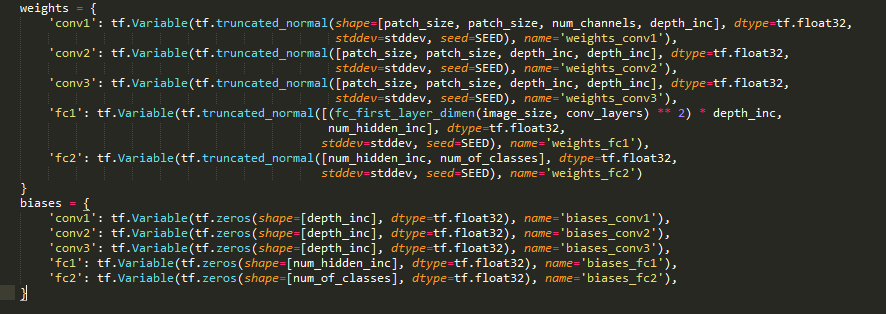

`weights`和`biases`本身是通过其他变量初始化的。我没有说这会很容易。

这里最重要的变量是`patch_size`，它表示我们滑过图像的滤波器大小。回想一下，我们早些时候将其设置为 5，所以我们将使用 5x5 的补丁。我们还将重新介绍我们之前设置的`stddev`和`depth_inc`配置。

# 完成

很可能，到现在为止，你脑海中一定有许多问题——为什么是三个卷积层而不是两个或四个？为什么步幅是 1？为什么补丁大小是 5？为什么最终是全连接层，而不是从全连接层开始？

这里有一定的方法可循。从核心上讲，卷积神经网络（CNN）是围绕图像处理构建的，而补丁则围绕着待提取的特征构建。为什么某些配置效果很好，而其他配置效果不佳，目前尚不完全理解，尽管一些普遍的规则符合直觉。准确的网络架构是通过数千次的试验和许多错误发现、磨练的，并且不断朝着完美的方向迈进。这仍然是一个研究级的任务。

从业者的一般方法是找到一个已经有效的现有架构（例如，AlexNet、GoogLeNet、ResNet），并针对特定数据集进行调整。这就是我们所做的；我们从 AlexNet 开始并进行了调整。也许，这并不令人满足，但它有效，并且在 2016 年仍然是实践的常态。

# 训练日

然而，看到我们的训练过程并了解如何改进我们之前所做的工作，会更加令人满足。

我们将按照如下方式准备训练数据集和标签：

```py
    tf_train_dataset = tf.placeholder(tf.float32, 
    shape=(batch_size, image_size, image_size,   
    num_channels), 
    name='TRAIN_DATASET')    
    tf_train_labels = tf.placeholder(tf.float32, 
    shape=(batch_size, num_of_classes), 
    name='TRAIN_LABEL') 
    tf_valid_dataset = tf.constant(dataset.valid_dataset,   
    name='VALID_DATASET') 
    tf_test_dataset = tf.constant(dataset.test_dataset,  
    name='TEST_DATASET') 
```

然后，我们将运行训练器，如下所示：

```py
    # Training computation. 
    logits = nn_model(tf_train_dataset, weights, biases,  
    True) 
    loss = tf.reduce_mean( 
        tf.nn.softmax_cross_entropy_with_logits(logits, 
         tf_train_labels)) 
    # L2 regularization for the fully connected  
    parameters. 
    regularizers = (tf.nn.l2_loss(weights['fc1']) + 
     tf.nn.l2_loss(biases['fc1']) + 
     tf.nn.l2_loss(weights['fc2']) + 

    tf.nn.l2_loss(biases['fc2'])) 
    # Add the regularization term to the loss. 
    loss += 5e-4 * regularizers 
    tf.summary.scalar("loss", loss) 
```

这与我们在第二章中做的非常相似，*你的第一个分类器*。我们实例化了网络，传入了一组初始权重和偏差，并定义了一个使用训练标签的`loss`函数。然后，我们定义了优化器，目标是最小化该`loss`，如下所示：

```py
    optimizer = tf.train.GradientDescentOptimizer
     (learning_rate).minimize(loss)
```

然后，我们将使用`weights`和`biases`来预测验证集标签，最终是训练集标签：

```py
    train_prediction = tf.nn.softmax(nn_model(tf_train_dataset,  
    weights, biases, TRAIN=False)) 
    valid_prediction = tf.nn.softmax(nn_model(tf_valid_dataset, 
     weights, biases))    test_prediction =  
     tf.nn.softmax(nn_model(tf_test_dataset, 
     weights, biases))
```

完整的训练代码如下：

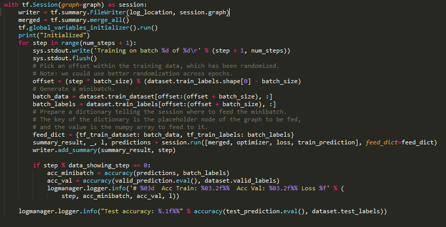

最后，我们将运行会话。我们将使用之前设置的`num_steps`变量，并按块（`batch_size`）遍历训练数据。我们将加载小块的训练数据和相应的标签，并按如下方式运行会话：

```py
    batch_data = dataset.train_dataset[offset:(offset + 
     batch_size), :]   
    batch_labels = dataset.train_labels[offset: 
     (offset + 
     batch_size), :]
```

我们将对小批量数据进行预测，并将其与实际标签进行比较，以计算小批量的准确率。

我们将使用之前声明的`valid_prediction`：

```py
    valid_prediction =   
    tf.nn.softmax(nn_model(tf_valid_dataset, 
     weights, biases))
```

然后，我们将评估验证集的预测结果与实际标签进行比较，如下所示：

```py
    accuracy(valid_prediction.eval(), 
    dataset.valid_labels) 
```

在我们完成所有步骤之后，我们将在测试集上做同样的事情：

```py
    accuracy(test_prediction.eval(), dataset.test_labels)
```

如你所见，实际的训练、验证和测试执行与之前没有太大不同。不同之处在于准确率。注意，我们已经突破了 80%的准确率，进入了测试集准确率的 90%：

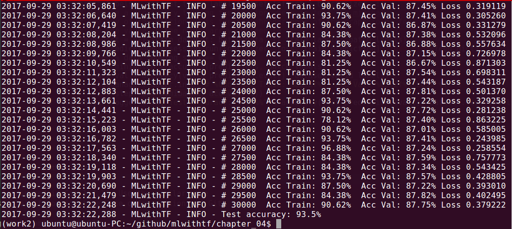

# 实际的猫和狗

我们已经在`notMNIST`数据集上展示了我们新的工具，这很有帮助，因为它为我们提供了与之前更简单网络设置的比较。现在，让我们进阶到一个更困难的问题——实际的猫和狗。

我们将使用 CIFAR-10 数据集。这个数据集中不只有猫和狗，还有 10 个类别——飞机、汽车、鸟、猫、鹿、狗、青蛙、马、船和卡车。与 `notMNIST` 数据集不同，这里有两个主要的复杂性，具体如下：

+   照片中有更多的异质性，包括背景场景

+   这些照片是彩色的

我们之前没有处理过彩色数据集。幸运的是，它与通常的黑白数据集并没有太大区别——我们只需增加一个维度。回想一下，我们之前的 28x28 图像是平面矩阵。现在，我们将有 32x32x3 的矩阵——额外的维度代表每个红色、绿色和蓝色通道的层。这样做确实让数据集的可视化变得更加困难，因为堆叠图像将进入第四维度。所以，我们的训练/验证/测试集现在将是 32x32x3xSET_SIZE 的维度。我们只需要习惯处理那些我们无法在熟悉的 3D 空间中可视化的矩阵。

颜色维度的机制是一样的。就像之前我们有浮动点数字表示灰度的不同深浅，现在我们将有浮动点数字表示红色、绿色和蓝色的不同深浅。

还记得我们如何加载 `notMNIST` 数据集吗？

```py
    dataset, image_size, num_of_classes, num_channels = 
     prepare_not_mnist_dataset() 
```

`num_channels` 变量决定了颜色通道。直到现在，它只有一个通道。

我们将类似地加载 CIFAR-10 数据集，不过这次我们会返回三个通道，如下所示：

```py
    dataset, image_size, num_of_classes, num_channels = 
     prepare_cifar_10_dataset()
```

不要重新发明轮子。

还记得我们如何自动化抓取、提取和准备 `notMNIST` 数据集的过程吗？这在第二章《你的第一个分类器》中讲解过。我们将这些流程函数放进了 `data_utils.py` 文件中，以便将流程代码与实际的机器学习代码分开。拥有这样的清晰分离，并保持干净、通用的函数，可以让我们在当前项目中重用它们。

特别地，我们将重用其中的九个函数，具体如下：

+   `download_hook_function`

+   `download_file`

+   `extract_file`

+   `load_class`

+   `make_pickles`

+   `randomize`

+   `make_arrays`

+   `merge_datasets`

+   `pickle_whole`

回想一下我们如何在一个总的函数 `prepare_not_mnist_dataset` 中使用那些函数，这个函数为我们运行了整个流程。我们之前只是重用了这个函数，为自己节省了不少时间。

让我们为 CIFAR-10 数据集创建一个类似的函数。一般来说，你应该保存自己的流程函数，尝试将它们通用化，独立成一个模块，并在不同项目中重用它们。当你做自己的项目时，这会帮助你专注于关键的机器学习工作，而不是花时间去重建流程。

注意更新版的 `data_utils.py`；我们有一个总的函数叫做 `prepare_cifar_10_dataset`，它将数据集细节和这个新数据集的流程隔离开来，如下所示：

```py
  def prepare_cifar_10_dataset(): 
    print('Started preparing CIFAR-10 dataset') 
    image_size = 32 
    image_depth = 255 
    cifar_dataset_url = 'https://www.cs.toronto.edu/~kriz/cifar-
     10-python.tar.gz' 
    dataset_size = 170498071 
    train_size = 45000 
    valid_size = 5000 
    test_size = 10000 
    num_of_classes = 10 
    num_of_channels = 3 
    pickle_batch_size = 10000 
```

这是之前代码的快速概览：

+   我们将使用 `cifar_dataset_url = 'https://www.cs.toronto.edu/~kriz/cifar-10-python.tar.gz'` 从亚历克斯·克里日夫斯基（Alex Krizhevsky）在多伦多大学的站点获取数据集

+   我们将使用 `dataset_size = 170498071` 来验证我们是否已成功接收到文件，而不是某个被截断的半下载文件

+   我们还将基于对数据集的了解声明一些细节

+   我们将把 60,000 张图片划分为训练集、验证集和测试集，分别包含 `45000`、`5000` 和 `10000` 张图片

+   数据集共有十个类别，因此我们有 `num_of_classes = 10`

+   这些是带有红、绿、蓝三个通道的彩色图像，因此我们有 `num_of_channels = 3`

+   我们知道图片的尺寸是 32x32 像素，因此我们设置 `image_size = 32`，并将其应用于宽度和高度

+   最后，我们知道每个通道的图像深度为 8 位，因此我们设置 `image_depth = 255`

+   数据将被保存到 `/datasets/CIFAR-10/` 目录

就像我们之前处理 `notMNIST` 数据集一样，我们只有在尚未拥有数据集的情况下才会下载它。我们将解压数据集，进行必要的转换，并使用 `pickle_cifar_10` 将预处理后的矩阵保存为 pickle 文件。如果我们找到 `pickle` 文件，就可以使用 `load_cifar_10_from_pickles` 方法重新加载中间数据。

以下是我们将用来保持主方法简洁的三个辅助方法：

+   `pickle_cifar_10`

+   `load_cifar_10_from_pickles`

+   `load_cifar_10_pickle`

函数定义如下：

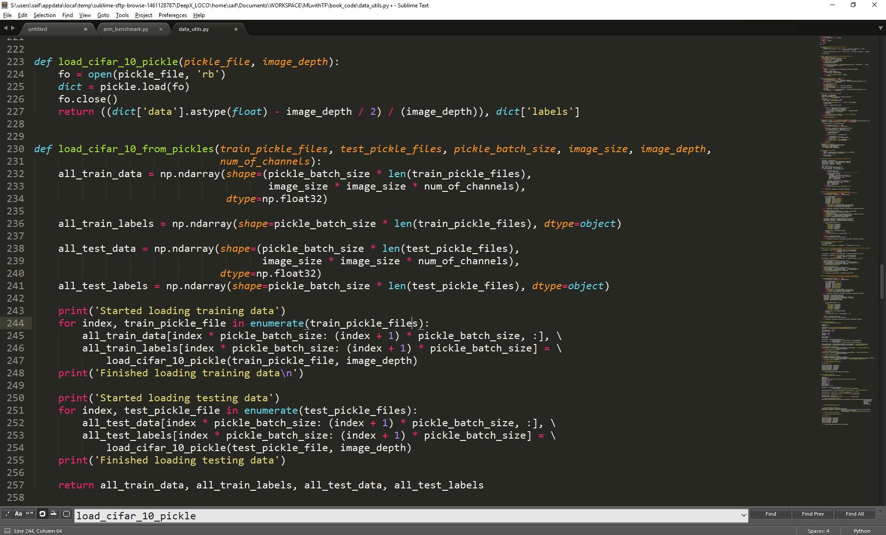

`load_cifar_10_pickle` 方法会分配 NumPy 数组来存储训练和测试数据及其标签，并将现有的 pickle 文件加载到这些数组中。由于我们需要执行两次这个操作，我们将提取出 `load_cifar_10_pickle` 方法，它实际上加载数据并将其中心化：

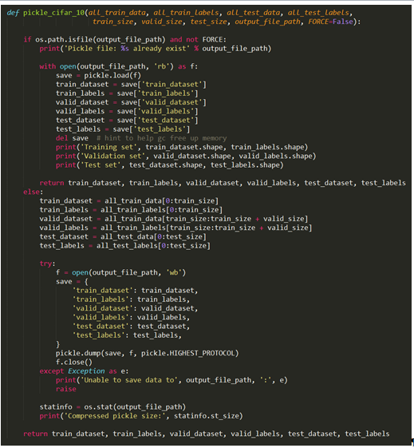

就像之前一样，我们将检查 `pickle` 文件是否已存在，如果存在就加载。如果不存在（即 `else` 部分），我们才会将已准备好的数据保存为 `pickle` 文件。

# 保存模型以供后续使用

为了将 TensorFlow 会话中的变量保存以供将来使用，你可以使用 `Saver()` 函数。我们从创建一个 `saver` 变量开始，紧接着是 `writer` 变量：

```py
    writer = tf.summary.FileWriter(log_location, session.graph)
    saver = tf.train.Saver(max_to_keep=5)
```

然后，在训练循环中，我们将添加以下代码，以便在每次 `model_saving_step` 后保存模型：

```py
 if step % model_saving_step == 0 or step == num_steps + 1: 
   path = saver.save(session, os.path.join(log_location,  
 "model.ckpt"), global_step=step) 
   logmanager.logger.info('Model saved in file: %s' % path) 
```

之后，每当我们想要使用 `saved` 模型恢复模型时，我们可以轻松创建一个新的 `Saver()` 实例并使用 `restore` 函数，如下所示：

```py
 checkpoint_path = tf.train.latest_checkpoint(log_location) 
 restorer = tf.train.Saver() 
 with tf.Session() as sess: 
    sess.run(tf.global_variables_initializer()) 
    restorer.restore(sess, checkpoint_path) 
```

在之前的代码中，我们使用 `tf.train.latest_checkpoint`，这样 TensorFlow 会自动选择最新的模型检查点。然后，我们创建一个新的 `Saver` 实例，命名为 `restore`。最后，我们可以使用 `restore` 函数将 `saved` 模型加载到会话图中：

```py
    restorer.restore(sess, checkpoint_path) 
```

你应该注意到，在运行 `tf.global_variables_initializer` 后，我们必须进行恢复。否则，加载的变量将被初始化器覆盖。

# 使用分类器

现在我们已经增强了分类器，以加载随机图像，接下来我们将选择与训练/测试图像大小和形状完全相同的随机图像。我们需要为这些用户提供的图像添加占位符，因此我们将在适当的位置添加以下行：

```py
 tf_random_dataset = tf.placeholder(tf.float32, shape=(1, 
  image_size, image_size, num_channels),  
 name='RANDOM_DATA')random_prediction =  
 tf.nn.softmax(nn_model(tf_random_dataset, 
  weights, biases))
```

接下来，我们将通过以下命令行参数获取用户提供的图像，并在该图像上运行我们的会话：

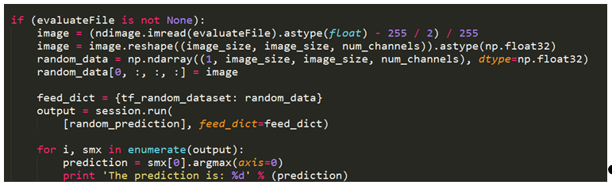

我们将按照与之前几乎相同的顺序进行操作。通过 `-e` 开关运行 `test` 文件将产生额外的输出，如下所示：

```py
    The prediction is: 2 
```

好了！我们刚刚对一个任意图像进行了分类。

# 学到的技能

你应该在本章中学会了这些技能：

+   准备更高级的颜色训练和测试数据

+   设置卷积神经网络图

+   与 CNN 相关的参数和配置

+   创建一个完整的系统，包括 TensorBoard 的钩子

+   导入真实世界数据

# 总结

很棒！我们刚刚建立了一个更高级的分类器，切换了不同的模型，甚至开始将我们的分类器应用于任意模型。正如本章名称所示，我们还训练了系统区分猫和狗。

在下一章中，我们将开始使用序列到序列的模型，并使用 TensorFlow 编写一个英法翻译器。
