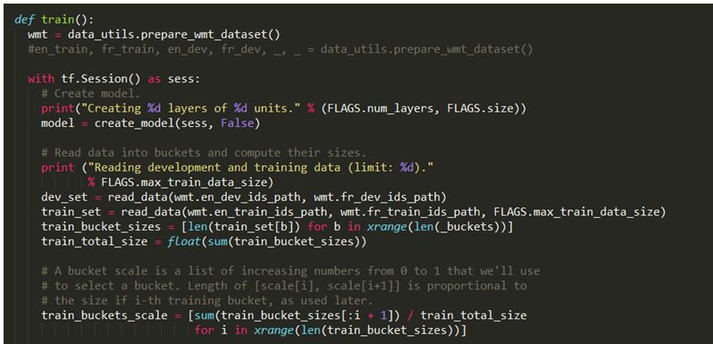

# 第五章：序列到序列模型——你会说法语吗？

到目前为止，我们的工作主要集中在图像上。处理图像是有帮助的，因为结果几乎令人难以置信，进展可以如此快速和简洁。然而，机器学习的世界更为广泛，接下来的几章将涉及这些其他方面。我们将从序列到序列模型开始。结果同样令人惊叹，尽管设置稍微复杂一些，且训练数据集要大得多。

本章将重点介绍以下几个领域：

+   理解序列到序列模型的工作原理

+   理解如何为序列到序列模型提供数据

+   使用序列到序列模型编写英语到法语的翻译器

# 快速预览

是的，你没看错……我们将编写一个英语到法语的翻译器。机器学习前的世界可能会用一系列解析器和规则来翻译单词和短语，但我们的方法将更加优雅、通用且快速。我们将只使用例子，很多例子，来训练我们的翻译器。

这里的任务是找到一个包含足够多英语句子并已翻译成法语的数据集（实际上，它适用于任何语言）。翻译的文章和新闻报道不太有用，因为我们未必能够将一个语言中的具体句子与另一语言的句子逐一对应。因此，我们需要更具创意。幸运的是，像联合国这样的组织常常需要做这种工作——它们需要逐行翻译，以满足其多样化群体的需求。对我们来说，这真是太方便了！

*统计机器翻译研讨会*在 2010 年召开了一次会议，发布了一个很好的训练集包，可以使用。详细信息可见[`www.statmt.org/wmt10/`](http://www.statmt.org/wmt10/)。

我们将仅使用特定的法语文件，如下所示：

+   [`www.statmt.org/wmt10/training-giga-fren.tar`](http://www.statmt.org/wmt10/training-giga-fren.tar)

+   [`www.statmt.org/wmt15/dev-v2.tgz`](http://www.statmt.org/wmt15/dev-v2.tgz)

以下是源数据在英语端的一个摘录：

+   食品——欧洲通胀的隐性问题

+   食品价格飙升是推动欧元区通胀加速的主要因素

+   欧元区 13 个国家的 11 月价格上涨高于预期，10 月的年通胀率为 2.6%，11 月为 3.1%，欧盟卢森堡的统计局报告称

+   官方预测仅为 3%，彭博社报道

+   与美国、英国和加拿大的中央银行不同，**欧洲中央银行**（**ECB**）并未降息，理由是降息结合原材料价格上涨和失业率下降，将引发通货膨胀的螺旋。

+   欧洲中央银行希望将通胀控制在 2%以下，或者在该范围内

+   根据一位分析师的说法，欧洲央行陷入了一个**两难境地**，它需要**降低**通胀，以避免在稍后的阶段采取行动来将其压低。

这里是法语的对应版本：

+   在欧洲，食品价格推动了通胀的失控。

+   欧元区的加速通胀，主要是由于食品价格的快速上涨。

+   11 月，欧元区 13 个国家的价格上涨幅度超过了预测，在 10 月通胀率为 2.6%的情况下，年通胀率达到了 3.1%，欧盟统计局位于卢森堡的办公室表示。

+   官方预测仅为 3 个百分点，彭博社报道。

+   与美国、英国和加拿大的中央银行不同，欧洲中央银行（ECB）没有降低基准利率，称降息将会导致原材料价格上涨和失业率下降，从而引发通胀螺旋。

+   欧洲央行希望将通胀率保持在接近但低于 2%。

+   根据一位分析师的说法，欧洲央行陷入了“Catch 22”：必须“遏制”通胀，以避免稍后对此采取干预措施。

通常，在可能的情况下进行快速的合理性检查是很好的做法，以确保文件确实对齐。我们可以看到两个文件第 7 行都出现了`Catch 22`这一短语，这让我们感到放心。

当然，7 行远远不足以进行统计分析。我们只有通过大量数据才能实现一个优雅、可泛化的解决方案。我们将为训练集获取的海量数据将由 20GB 的文本组成，每行翻译就像前面的摘录一样。

就像我们处理图像数据一样，我们将使用子集进行训练、验证和测试。我们还将定义损失函数并尝试最小化该损失。让我们从数据开始吧。

# 从消防栓里喝水

就像你之前做的那样，你应该从[`github.com/mlwithtf/MLwithTF/`](https://github.com/mlwithtf/MLwithTF/)抓取代码。

我们将专注于`chapter_05`子文件夹，它包含以下三个文件：

+   `data_utils.py`

+   `translate.py`

+   `seq2seq_model.py`

第一个文件处理我们的数据，让我们从这个开始。`prepare_wmt_dataset`函数处理这个问题。它与我们过去抓取图像数据集的方式非常相似，只不过现在我们抓取的是两个数据子集：

+   `giga-fren.release2.fr.gz`

+   `giga-fren.release2.en.gz`

当然，这就是我们想要关注的两种语言。我们即将构建的翻译器的美妙之处在于，它的方式是完全通用的，因此我们可以轻松地为德语或西班牙语等语言创建翻译器。

以下截图展示了特定的代码子集：


接下来，我们将逐行处理之前提到的两个文件，做两件事——创建词汇表并对单个单词进行分词。这些工作将通过`create_vocabulary`和`data_to_token_ids`函数完成，我们稍后会介绍。现在，让我们观察如何在庞大的训练集以及一个小的开发集（`newstest2013.fr`和`dev/newstest2013.en`）上创建词汇表和进行分词：


我们之前使用以下`create_vocabulary`函数创建了一个词汇表。我们将从一个空的词汇映射开始，`vocab = {}`，然后逐行读取数据文件，对每一行，使用基本的分词器创建一个单词桶。（警告：这与后面 ID 函数中的更重要的令牌不应混淆。）

如果我们遇到一个我们词汇表中已有的单词，我们将按如下方式递增它：

```py
    vocab[word] += 1 
```

否则，我们将初始化该单词的计数，如下所示：

```py
    vocab[word] += 1 
```

我们将继续这样做，直到我们的训练数据集中的所有行都处理完毕。接下来，我们将使用`sorted(vocab, key=vocab.get, reverse=True)`按频率对我们的词汇表进行排序。

这很重要，因为我们不会保留每一个单词，我们只会保留*最频繁的 k*个单词，其中*k*是我们定义的词汇表大小（我们将其定义为 40,000，但你可以选择不同的值，看看结果如何变化）：


尽管处理句子和词汇表是直观的，但此时需要更抽象一些——我们将暂时把我们学到的每个词汇单词转换成一个简单的整数。我们将逐行使用`sequence_to_token_ids`函数来完成这项工作：


我们将使用`data_to_token_ids`函数将这种方法应用于整个数据文件，该函数读取我们的训练文件，逐行迭代，并运行`sequence_to_token_ids`函数，然后使用我们的词汇表将每个句子中的单个单词转换为整数：


这让我们处于什么状态呢？我们有了两个仅包含数字的数据集。我们只是暂时将我们的英语到法语的问题转化为一个数字到数字的问题，包含两组将单词映射到词汇表单词的数字序列。

如果我们从`["Brooklyn", "has", "lovely", "homes"]`开始，并生成一个`{"Brooklyn": 1, "has": 3, "lovely": 8, "homes": 17}`的词汇表，那么我们将得到`[1, 3, 8, 17]`。

输出看起来怎样？以下是典型的文件下载：

```py
    ubuntu@ubuntu-PC:~/github/mlwithtf/chapter_05$: python translate.py
    Attempting to download http://www.statmt.org/wmt10/training-giga-  
    fren.tar
    File output path:   
    /home/ubuntu/github/mlwithtf/datasets/WMT/training-giga-fren.tar
    Expected size: 2595102720
    File already downloaded completely!
    Attempting to download http://www.statmt.org/wmt15/dev-v2.tgz
    File output path: /home/ubuntu/github/mlwithtf/datasets/WMT/dev- 
    v2.tgz
    Expected size: 21393583
    File already downloaded completely!
    /home/ubuntu/github/mlwithtf/datasets/WMT/training-giga-fren.tar 
    already extracted to  
    /home/ubuntu/github/mlwithtf/datasets/WMT/train
    Started extracting /home/ubuntu/github/mlwithtf/datasets/WMT/dev- 
    v2.tgz to /home/ubuntu/github/mlwithtf/datasets/WMT
    Finished extracting /home/ubuntu/github/mlwithtf/datasets/WMT/dev-  
    v2.tgz to /home/ubuntu/github/mlwithtf/datasets/WMT
    Started extracting  
    /home/ubuntu/github/mlwithtf/datasets/WMT/train/giga- 
    fren.release2.fixed.fr.gz to  
    /home/ubuntu/github/mlwithtf/datasets/WMT/train/data/giga- 
    fren.release2.fixed.fr
    Finished extracting  
    /home/ubuntu/github/mlwithtf/datasets/WMT/train/giga-
    fren.release2.fixed.fr.gz to 
    /home/ubuntu/github/mlwithtf/datasets/WMT/train/data/giga-  
    fren.release2.fixed.fr
    Started extracting  
    /home/ubuntu/github/mlwithtf/datasets/WMT/train/giga-
    fren.release2.fixed.en.gz to 
    /home/ubuntu/github/mlwithtf/datasets/WMT/train/data/giga- 
    fren.release2.fixed.en
    Finished extracting  
    /home/ubuntu/github/mlwithtf/datasets/WMT/train/giga-
    fren.release2.fixed.en.gz to 
    /home/ubuntu/github/mlwithtf/datasets/WMT/train/data/giga- 
    fren.release2.fixed.en
    Creating vocabulary  
    /home/ubuntu/github/mlwithtf/datasets/WMT/train/data/vocab40000.fr 
    from 
    data /home/ubuntu/github/mlwithtf/datasets/WMT/train/data/giga- 
    fren.release2.fixed.fr
      processing line 100000
      processing line 200000
      processing line 300000
     ...
      processing line 22300000
      processing line 22400000
      processing line 22500000
     Tokenizing data in 
     /home/ubuntu/github/mlwithtf/datasets/WMT/train/data/giga-
     fren.release2.fr
      tokenizing line 100000
      tokenizing line 200000
      tokenizing line 300000
     ...
      tokenizing line 22400000
      tokenizing line 22500000
     Creating vocabulary 
     /home/ubuntu/github/mlwithtf/datasets/WMT/train/data/vocab
     40000.en from data 
     /home/ubuntu/github/mlwithtf/datasets/WMT/train/data/giga-
     fren.release2.en
      processing line 100000
      processing line 200000
      ...
```

我不会重复数据集处理中的英语部分，因为它完全相同。我们将逐行读取庞大的文件，创建词汇表，并逐行对每个语言文件中的单词进行分词。

# 训练日

我们努力的关键是训练，这在我们之前遇到的第二个文件`translate.py`中展示。我们之前回顾过的`prepare_wmt_dataset`函数，当然是起点，它创建了我们的两个数据集并将它们标记为干净的数字。

训练如下开始：



准备好数据后，我们将像往常一样创建一个 TensorFlow 会话，并构建我们的模型。我们稍后会详细介绍模型；现在，先来看一下我们的准备工作和训练循环。

我们稍后会定义开发集和训练集，但现在，我们将定义一个范围从 0 到 1 的浮动分数。这部分没有什么复杂的；真正的工作将在接下来的训练循环中进行。这与我们在之前章节中所做的非常不同，所以需要格外注意。

我们的主要训练循环旨在最小化我们的误差。这里有两个关键的语句。首先是第一个：

```py
    encoder_inputs, decoder_inputs, target_weights = 
     model.get_batch(train_set, bucket_id)
```

第二个关键点如下：

```py
    _, step_loss, _ = model.step(sess, encoder_inputs, decoder_inputs, 
     target_weights, bucket_id, False)
```

`get_batch`函数本质上是用来将这两个序列转换为批量主向量和相关的权重。然后，这些会被用于模型步骤，从而返回我们的损失。

我们并不会直接处理损失，而是使用`perplexity`，它是损失的`e`次方：


每经过*X*步，我们将使用`previous_losses.append(loss)`保存进度，这非常重要，因为我们将比较当前批次的损失与之前的损失。当损失开始上升时，我们将使用以下方式降低学习率：

`sess.run(model.learning_rate_decay_op)`，并在`dev_set`上评估损失，就像我们在之前的章节中使用验证集一样：


当我们运行时，我们会得到以下输出：

```py
    put_count=2530 evicted_count=2000 eviction_rate=0.790514 and 
     unsatisfied allocation rate=0
    global step 200 learning rate 0.5000 step-time 0.94 perplexity 
     1625.06
      eval: bucket 0 perplexity 700.69
      eval: bucket 1 perplexity 433.03
      eval: bucket 2 perplexity 401.39
      eval: bucket 3 perplexity 312.34
    global step 400 learning rate 0.5000 step-time 0.91 perplexity   
     384.01
      eval: bucket 0 perplexity 124.89
      eval: bucket 1 perplexity 176.36
      eval: bucket 2 perplexity 207.67
      eval: bucket 3 perplexity 239.19
    global step 600 learning rate 0.5000 step-time 0.87 perplexity   
     266.71
      eval: bucket 0 perplexity 75.80
      eval: bucket 1 perplexity 135.31
      eval: bucket 2 perplexity 167.71
      eval: bucket 3 perplexity 188.42
    global step 800 learning rate 0.5000 step-time 0.92 perplexity  
     235.76
      eval: bucket 0 perplexity 107.33
      eval: bucket 1 perplexity 159.91
      eval: bucket 2 perplexity 177.93
      eval: bucket 3 perplexity 263.84  
```

我们会在每 200 步看到输出。这是我们使用的约十几个设置之一，它们在文件顶部定义：

```py
 tf.app.flags.DEFINE_float("learning_rate"", 0.5, ""Learning  
                             rate."") 
 tf.app.flags.DEFINE_float("learning_rate_decay_factor"", 0.99, 
                          "Learning rate decays by this much."") 
 tf.app.flags.DEFINE_float("max_gradient_norm"", 5.0, 
                          "Clip gradients to this norm."") 
 tf.app.flags.DEFINE_integer("batch_size"", 64, 
                            "Batch size to use during training."") 
 tf.app.flags.DEFINE_integer("en_vocab_size"", 40000, ""Size ...."") 
 tf.app.flags.DEFINE_integer("fr_vocab_size"", 40000, ""Size  
                              of...."") 
 tf.app.flags.DEFINE_integer("size"", 1024, ""Size of each  
                              model..."") 
 tf.app.flags.DEFINE_integer("num_layers"", 3, ""#layers in the 
                model."")tf.app.flags.DEFINE_string("train_dir"", 
  os.path.realpath(''../../datasets/WMT''), ""Training directory."") 
 tf.app.flags.DEFINE_integer("max_train_data_size"", 0, 
                            "Limit size of training data "") 
 tf.app.flags.DEFINE_integer("steps_per_checkpoint"", 200, 
                            "Training steps to do per 
                             checkpoint."")
```

我们将在构建模型对象时使用这些设置。也就是说，最终的拼图就是模型本身，所以让我们来看一下这个部分。我们将回到我们项目中的第三个也是最后一个文件——`seq2seq_model.py`。

还记得我们在训练开始时创建模型的过程吗？我们定义的大多数参数用于初始化以下模型：

```py
    model = seq2seq_model.Seq2SeqModel( 
      FLAGS.en_vocab_size, FLAGS.fr_vocab_size, _buckets, 
      FLAGS.size, FLAGS.num_layers, FLAGS.max_gradient_norm, 
       FLAGS.batch_size, 
      FLAGS.learning_rate, FLAGS.learning_rate_decay_factor, 
      forward_only=forward_only) 
```

然而，初始化所做的工作在`seq2seq_model.py`中，所以让我们跳到那部分。

你会发现模型非常庞大，这就是为什么我们不逐行解释，而是逐块解释。

第一部分是模型的初始化，通过以下两张图示范：


模型从初始化开始，这会设置所需的参数。我们将跳过这些参数的设置部分，因为我们已经熟悉它们——我们在训练之前就已经自己初始化了这些参数，只需将值传入模型构建语句中，最终通过`self.xyz`赋值将它们传递到内部变量中。

回想一下我们是如何传入每个模型层的大小（size=1024）和层数（3）的。这些非常重要，因为我们在构建权重和偏置（`proj_w` 和 `proj_b`）时用到了它们。权重是* A x B *，其中*A*是层的大小，*B*是目标语言的词汇大小。偏置则仅根据目标词汇的大小传入。

最后，我们从`output_project`元组中获取权重和偏置 - `output_projection = (w, b)` - 并使用转置的权重和偏置来构建我们的`softmax_loss_function`，我们将反复使用它来衡量性能：


接下来的部分是步进函数，如下图所示。前半部分只是错误检查，我们会跳过。最有趣的是使用随机梯度下降法构建输出馈送：


模型的最后部分是`get_batch`函数，如下图所示。我们将通过内联注释解释各个部分：


当我们运行此程序时，我们可以获得一个完美的训练过程，如下所示：

```py
global step 200 learning rate 0.5000 step-time 0.94 perplexity 
  1625.06
   eval: bucket 0 perplexity 700.69
   eval: bucket 1 perplexity 433.03
   eval: bucket 2 perplexity 401.39
   eval: bucket 3 perplexity 312.34
   ...
```

或者，我们可能会发现，在损失持续增加后，我们的学习速率有所降低。无论哪种情况，我们都会在*开发*集上进行测试，直到我们的准确率提高。

# 总结

在本章中，我们介绍了序列到序列网络，并利用一系列已知的逐句翻译作为训练集编写了一个语言翻译器。我们介绍了作为工作基础的循环神经网络（RNN），并可能在训练过程中跨越了大数据的门槛，因为我们使用了一个 20GB 的训练数据集。

接下来，我们将进入表格数据，并对经济和金融数据进行预测。我们将使用之前工作的一部分，以便我们能够迅速开始，具体来说，就是我们迄今为止编写的初始数据管道工作，用于下载和准备训练数据。然而，我们将重点关注时间序列问题，因此这与我们迄今为止所做的图像和文本工作将有很大的不同。
