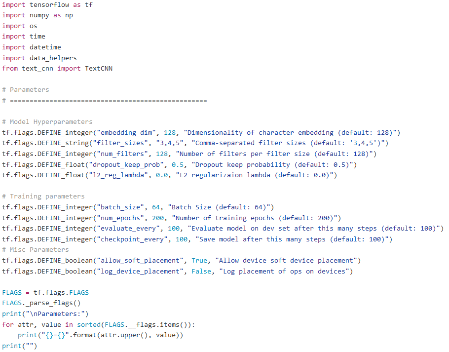
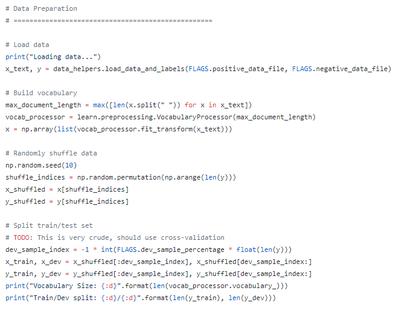
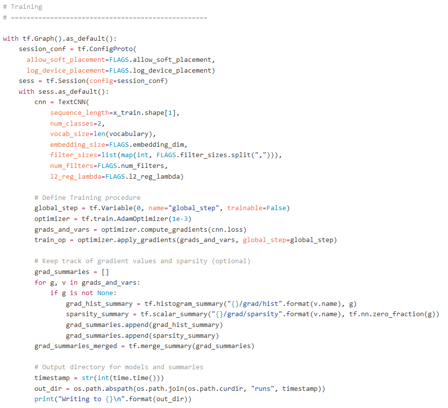
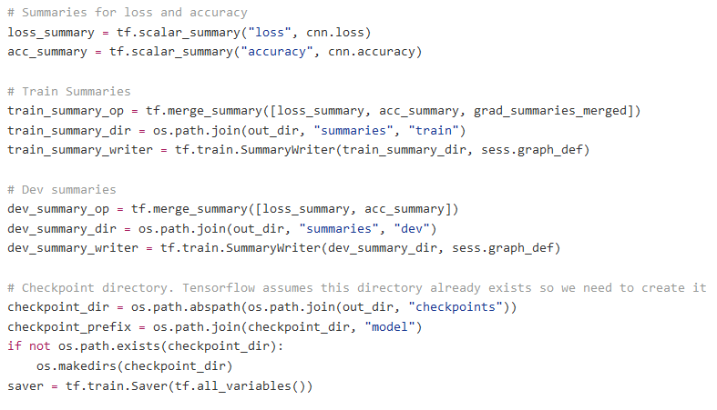
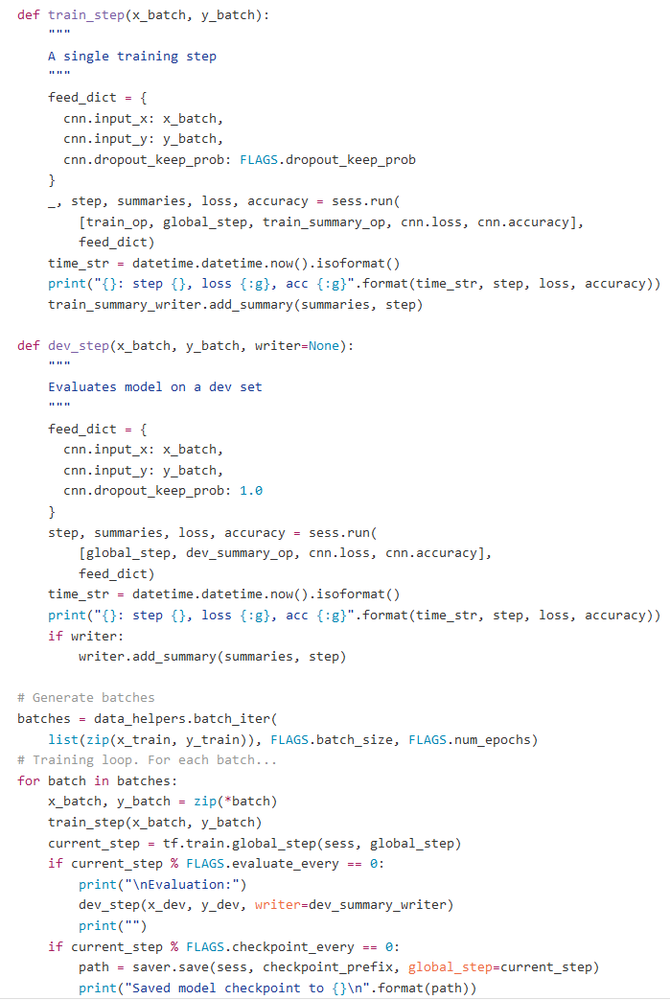
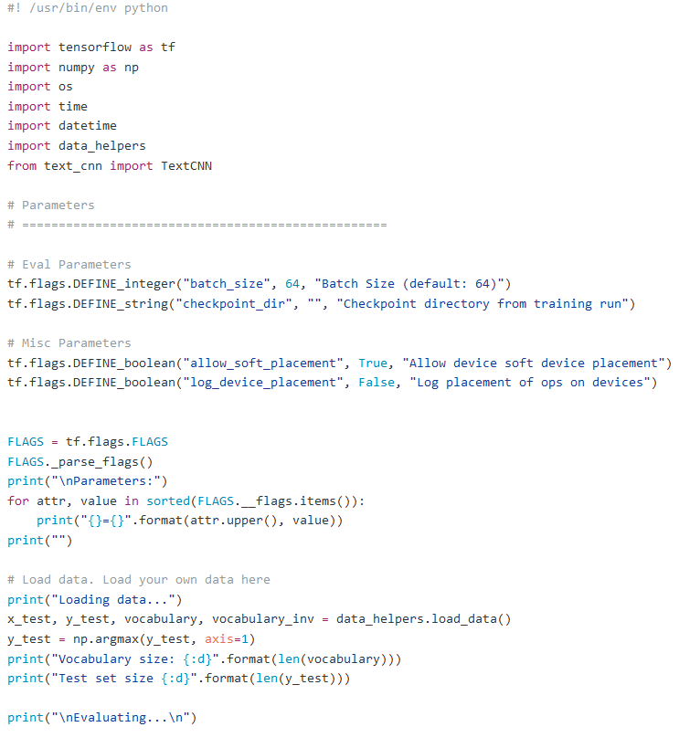
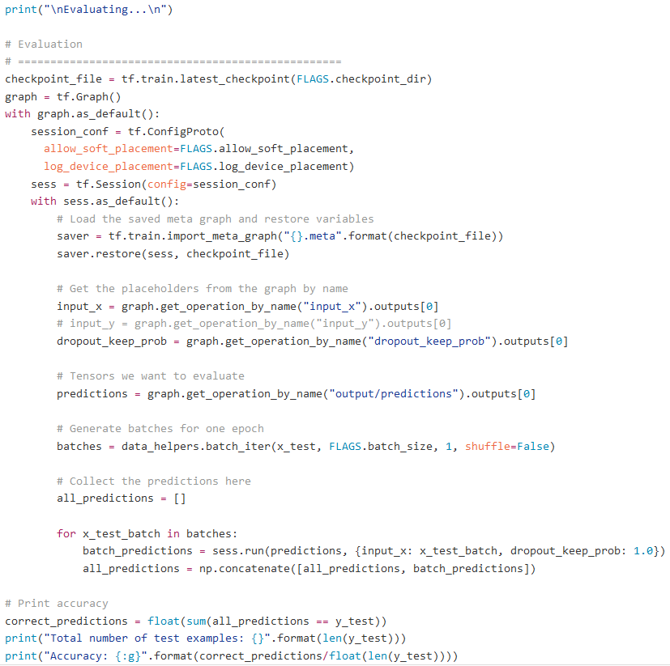
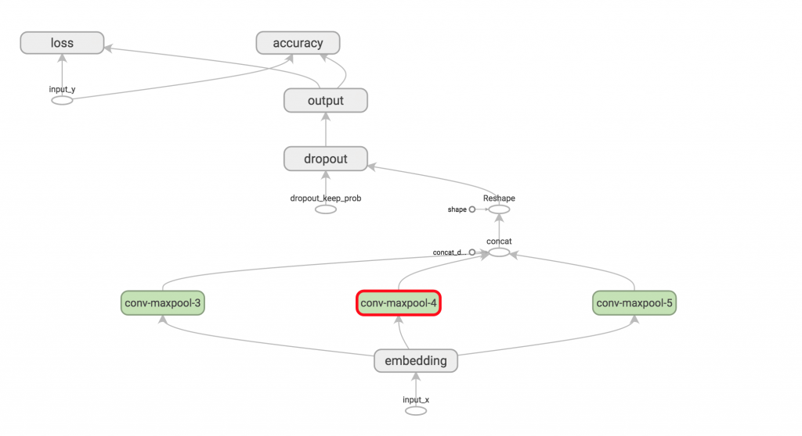

# 第六章：寻找意义

到目前为止，我们主要使用 TensorFlow 进行图像处理，在文本序列处理方面的使用较少。在本章中，我们将重新审视书面文字，寻找文本中的意义。这是通常被称为**自然语言处理**（**NLP**）的一个领域。该领域中的一些活动包括：

+   **情感分析**—这从文本中提取出一般的情感类别，而不提取句子的主题或动作

+   **实体提取**—这从一段文本中提取出主题，例如人、地点和事件

+   **关键词提取**—这从一段文本中提取关键术语

+   **词语关系提取**—这不仅提取实体，还提取与每个实体相关的动作和词性

这仅仅是自然语言处理（NLP）的冰山一角——还有其他技术，并且每种技术的复杂度不同。最初，这看起来有些学术，但考虑到仅这四种技术可以实现的功能，举例如下：

+   阅读新闻并理解新闻的主题（个人、公司、地点等等）

+   获取前面的新闻并理解情感（高兴、伤心、愤怒等等）

+   解析产品评论并理解用户对产品的情感（满意、失望等等）

+   编写一个机器人，以自然语言响应用户的聊天框命令

就像我们之前探讨的机器学习工作一样，设置也需要相当大的努力。在这种情况下，我们将花时间编写脚本，实际从感兴趣的来源抓取文本。

# 额外的设置

需要额外的设置来包含文本处理所需的库。请查看以下几点：

1.  第一个是**Bazel**。在 Ubuntu 上，你需要按照官方教程中的链接来安装 Bazel。[`docs.bazel.build/versions/master/install-ubuntu.html`](https://docs.bazel.build/versions/master/install-ubuntu.html)。在 macOS 上，你可以使用 HomeBrew 来`install bazel`，如下所示：

```py
      $ brew install bazel
```

1.  然后，我们将安装`swig`，它将允许我们包装 C/C++函数，以便在 Python 中调用。在 Ubuntu 上，你可以使用以下命令安装它：

```py
 $ sudo apt-get install swig
```

在 Mac OS 上，我们也将按如下方式使用`brew`安装它：

```py
      $ brew install swig
```

1.  接下来，我们将安装协议缓冲支持，它将使我们能够以比 XML 更高效的方式存储和检索序列化数据。我们特别需要版本`3.3.0`，可以按如下方式安装：

```py
      $ pip install -U protobuf==3.3.0
```

1.  我们的文本分类将以树的形式表示，因此我们需要一个库来在命令行上显示树。我们将按如下方式安装：

```py
      $ pip install asciitree
```

1.  最后，我们需要一个科学计算库。如果你做过图像分类章节，你已经熟悉这个。如果没有，请按如下方式安装**NumPy**：

```py
      $ pip install numpy autograd 
```

完成所有这些之后，我们现在将安装**SyntaxNet**，它为我们的 NLP 工作提供了强大的支持。SyntaxNet 是一个基于 TensorFlow 的开源框架（[`www.tensorflow.org/`](https://www.tensorflow.org/)），提供了基础功能。谷歌用英语训练了一个 SyntaxNet 模型，并命名为**Parsey McParseface**，该模型将包含在我们的安装中。我们将能够训练我们自己的、更好或更特定的英语模型，或者在其他语言中进行训练。

训练数据始终是一个挑战，因此我们将从使用预训练的英语模型 Parsey McParseface 开始。

那么，让我们抓取该包并进行配置，命令行如下所示：

```py
$ git clone --recursive https://github.com/tensorflow/models.git
$ cd models/research/syntaxnet/tensorflow
$ ./configure
```

最后，让我们按如下方式测试系统：

```py
$ cd ..
$ bazel test ...
```

这将需要一些时间，请耐心等待。如果你严格按照所有指示操作，所有测试都会通过。可能会出现一些如下的错误：

+   如果你发现`bazel`无法下载某个包，你可以尝试使用以下命令，并再次运行测试命令：

```py
      $ bazel clean --expunge
```

+   如果你遇到一些测试失败，我们建议你将以下内容添加到`home`目录中的`.bazelrc`文件，以便获得更多的错误信息用于调试：

```py
 test --test_output=errors
```

+   如果你遇到错误`Tensor already registered`，你需要按照 Github 问题中的解决方案操作：[`github.com/tensorflow/models/issues/2355`](https://github.com/tensorflow/models/issues/2355)。

现在，让我们进行一个更常规的测试。我们提供一个英文句子，看看它是如何被解析的：

```py
$ echo 'Faaris likes to feed the kittens.' | bash  
./syntaxnet/demo.sh
```

我们通过 echo 语句输入一个句子，并将其传递到接受来自控制台标准输入的`syntaxnet`演示脚本中。请注意，为了让示例更有趣，我将使用一个不常见的名字，比如`Faaris`。运行这个命令将产生大量的调试信息，显示如下。我省略了堆栈跟踪，使用了省略号（`...`）：

```py
    I syntaxnet/term_frequency_map.cc:101] Loaded 46 terms from 
 syntaxnet/models/parsey_mcparseface/label-map.
    I syntaxnet/embedding_feature_extractor.cc:35] Features: input.digit 
 input.hyphen; input.prefix(length="2") input(1).prefix(length="2") 
 input(2).prefix(length="2") input(3).prefix(length="2") input(-
 1).prefix(length="2")...
    I syntaxnet/embedding_feature_extractor.cc:36] Embedding names: 
 other;prefix2;prefix3;suffix2;suffix3;words
    I syntaxnet/embedding_feature_extractor.cc:37] Embedding dims: 
 8;16;16;16;16;64
    I syntaxnet/term_frequency_map.cc:101] Loaded 46 terms from 
 syntaxnet/models/parsey_mcparseface/label-map.
    I syntaxnet/embedding_feature_extractor.cc:35] Features: 
 stack.child(1).label stack.child(1).sibling(-1).label stack.child(-
 1)....
    I syntaxnet/embedding_feature_extractor.cc:36] Embedding names: 
 labels;tags;words
    I syntaxnet/embedding_feature_extractor.cc:37] Embedding dims: 
 32;32;64
    I syntaxnet/term_frequency_map.cc:101] Loaded 49 terms from 
 syntaxnet/models/parsey_mcparseface/tag-map.
    I syntaxnet/term_frequency_map.cc:101] Loaded 64036 terms from 
 syntaxnet/models/parsey_mcparseface/word-map.
    I syntaxnet/term_frequency_map.cc:101] Loaded 64036 terms from 
 syntaxnet/models/parsey_mcparseface/word-map.
    I syntaxnet/term_frequency_map.cc:101] Loaded 49 terms from 
 syntaxnet/models/parsey_mcparseface/tag-map.
    INFO:tensorflow:Building training network with parameters: 
 feature_sizes: [12 20 20] domain_sizes: [   49    51 64038]
    INFO:tensorflow:Building training network with parameters: 
 feature_sizes: [2 8 8 8 8 8] domain_sizes: [    5 10665 10665  8970  
 8970 64038]
    I syntaxnet/term_frequency_map.cc:101] Loaded 46 terms from 
 syntaxnet/models/parsey_mcparseface/label-map.
    I syntaxnet/embedding_feature_extractor.cc:35] Features: 
 stack.child(1).label stack.child(1).sibling(-1).label stack.child(-
 1)....
    I syntaxnet/embedding_feature_extractor.cc:36] Embedding names: 
 labels;tags;words
    I syntaxnet/embedding_feature_extractor.cc:37] Embedding dims: 
 32;32;64
    I syntaxnet/term_frequency_map.cc:101] Loaded 49 terms from 
 syntaxnet/models/parsey_mcparseface/tag-map.
    I syntaxnet/term_frequency_map.cc:101] Loaded 64036 terms from 
 syntaxnet/models/parsey_mcparseface/word-map.
    I syntaxnet/term_frequency_map.cc:101] Loaded 49 terms from 
 syntaxnet/models/parsey_mcparseface/tag-map.
    I syntaxnet/term_frequency_map.cc:101] Loaded 46 terms from 
 syntaxnet/models/parsey_mcparseface/label-map.
    I syntaxnet/embedding_feature_extractor.cc:35] Features: input.digit 
 input.hyphen; input.prefix(length="2") input(1).prefix(length="2") 
 input(2).prefix(length="2") input(3).prefix(length="2") input(-
 1).prefix(length="2")...
    I syntaxnet/embedding_feature_extractor.cc:36] Embedding names: 
 other;prefix2;prefix3;suffix2;suffix3;words
    I syntaxnet/embedding_feature_extractor.cc:37] Embedding dims: 
 8;16;16;16;16;64
    I syntaxnet/term_frequency_map.cc:101] Loaded 64036 terms from 
 syntaxnet/models/parsey_mcparseface/word-map.
    INFO:tensorflow:Processed 1 documents
    INFO:tensorflow:Total processed documents: 1
    INFO:tensorflow:num correct tokens: 0
    INFO:tensorflow:total tokens: 7
    INFO:tensorflow:Seconds elapsed in evaluation: 0.12, eval metric: 
 0.00%
    INFO:tensorflow:Processed 1 documents
    INFO:tensorflow:Total processed documents: 1
    INFO:tensorflow:num correct tokens: 1
    INFO:tensorflow:total tokens: 6
    INFO:tensorflow:Seconds elapsed in evaluation: 0.47, eval metric: 
 16.67%
    INFO:tensorflow:Read 1 documents
    Input: Faaris likes to feed the kittens .
    Parse:
    likes VBZ ROOT
     +-- Faaris NNP nsubj
     +-- feed VB xcomp
     |   +-- to TO aux
     |   +-- kittens NNS dobj
     |       +-- the DT det
     +-- . . punct
```

最后一部分，从`Input:`开始，是最有趣的部分，也是我们在程序化使用这个基础时将消费的输出。注意这个句子是如何被分解为词性和实体-动作-对象的配对？我们看到的一些词性标记包括：`nsubj`、`xcomp`、`aux`、`dobj`、`det`和`punct`。其中一些标记是显而易见的，而另一些则不然。如果你喜欢深入研究，我们建议你查阅斯坦福依赖层次结构：[`nlp-ml.io/jg/software/pac/standep.html`](https://nlp-ml.io/jg/software/pac/standep.html)。

在继续之前，我们再尝试一个句子：

```py
Input: Stop speaking so loudly and be quiet !
Parse:
Stop VB ROOT
+-- speaking VBG xcomp
|   +-- loudly RB advmod
|       +-- so RB advmod
|       +-- and CC cc
|       +-- quiet JJ conj
|           +-- be VB cop
+-- ! . punct
```

同样，在这里我们会发现模型在解析这个短语时表现得相当好。你也可以尝试自己的一些例子。

接下来，让我们实际训练一个模型。训练 SyntaxNet 相对简单，因为它是一个已编译的系统。到目前为止，我们通过标准输入（STDIO）输入了数据，但我们也可以输入一份文本语料库。记得我们安装的协议缓冲库吗？现在我们将使用它来编辑源文件——`syntaxnet/models/parsey_mcparseface/context.pbtxt`。

此外，我们将根据以下代码段，改变数据源，使用其他训练源或我们自己的数据源：

```py
 input { 
  name: 'wsj-data' 
  record_format: 'conll-sentence' 
  Part { 
    file_pattern: './wsj.conll' 
   } 
 } 
 input { 
  name: 'wsj-data-tagged' 
  record_format: 'conll-sentence' 
  Part { 
    file_pattern: './wsj-tagged.conll' 
   } 
 } 
```

这就是我们将训练的数据集；然而，做得比原生训练模型 Parsey McParseface 更好将是相当具有挑战性的。所以让我们使用一个有趣的数据集，训练一个新的模型——一个**卷积神经网络**（**CNN**）来处理文本。

我有点偏爱我的母校，所以我们将使用康奈尔大学计算机科学系编制的电影评论数据。数据集可以在以下网址获取：

[`www.cs.cornell.edu/people/pabo/movie-review-data/`](http://www.cs.cornell.edu/people/pabo/movie-review-data/)。

我们首先会下载并处理电影评论数据集，然后在其上进行训练，最后基于该数据集进行评估。

我们的所有代码都可以在以下链接找到—— [`github.com/dennybritz/cnn-text-classification-tf`](https://github.com/dennybritz/cnn-text-classification-tf)

这段代码的灵感来自于 Yoon Kim 关于 CNN 在句子分类中的应用的论文，由谷歌的 Denny Britz 实现并维护。接下来，我们将逐步解析代码，看看 Denny Britz 是如何实现该网络的。

我们从图 1 开始，使用常见的帮助程序。这里唯一的新成员是数据帮助程序，它会下载并准备这个特定的数据集，如下图所示：



我们开始定义参数。现在，训练参数应该非常熟悉——它们定义了每次遍历时处理的批次大小以及我们将进行的训练轮数或完整运行次数。我们还会定义评估进度的频率（这里是每 100 步）以及保存模型检查点的频率（以便评估和重新继续训练）。接下来，在图 2 中，我们有加载和准备数据集的代码，如下所示：



然后，我们将查看代码中的训练部分：



图 3 展示了我们实例化我们的 CNN——一个自然语言 CNN，并使用之前定义的部分参数。我们还设置了启用 TensorBoard 可视化的代码。

图 4 展示了我们为 TensorBoard 捕获的更多项——训练集和评估集的损失和准确率：



接下来，在图 5 中，我们将定义训练和评估方法，这些方法与我们在图像处理中的方法非常相似。我们将接收一组训练数据和标签，并将其存储在字典中。然后，我们将在数据字典上运行 TensorFlow 会话，捕获返回的性能指标。

我们将在顶部设置方法，然后按批次遍历训练数据，对每批数据应用训练和评估方法。

在特定的间隔，我们还会保存检查点，以便进行可选的评估：



我们可以运行这个，并且在仅使用 CPU 的机器上经过一小时的训练后，得到一个训练好的模型。训练好的模型将被存储为一个检查点文件，然后可以输入到图 6 所示的评估程序中：



评估程序只是一个使用示例，但我们还是来了解一下它。我们将从典型的导入和参数设置开始。在这里，我们还将检查点目录作为输入，并加载一些测试数据；不过，您应该使用自己的数据。

接下来，让我们查看以下图形：



我们将从检查点文件开始，只需加载它并从中重新创建一个 TensorFlow 会话。这使我们能够针对刚刚训练的模型进行评估，并反复使用它。

接下来，我们将批量运行测试数据。在常规使用中，我们不会使用循环或批次，但由于我们有一个相当大的测试数据集，因此我们将以循环方式进行处理。

我们将简单地对每一组测试数据运行会话，并保存返回的预测结果（负面与正面）。以下是一些示例正面评论数据：

```py
 insomnia loses points when it surrenders to a formulaic bang-bang , 
 shoot-em-up scene at the conclusion . but the performances of pacino 
 , williams , and swank keep the viewer wide-awake all the way through 
 .
    what might have been readily dismissed as the tiresome rant of an 
 aging filmmaker still thumbing his nose at convention takes a 
 surprising , subtle turn at the midway point .
    at a time when commercialism has squeezed the life out of whatever 
 idealism american moviemaking ever had , godfrey reggio's career 
 shines like a lonely beacon .
    an inuit masterpiece that will give you goosebumps as its uncanny 
 tale of love , communal discord , and justice unfolds .
    this is popcorn movie fun with equal doses of action , cheese , ham 
 and cheek ( as well as a serious debt to the road warrior ) , but it 
 feels like unrealized potential
    it's a testament to de niro and director michael caton-jones that by 
 movie's end , we accept the characters and the film , flaws and all .
    performances are potent , and the women's stories are ably intercut 
 and involving .
    an enormously entertaining movie , like nothing we've ever seen 
 before , and yet completely familiar .
    lan yu is a genuine love story , full of traditional layers of 
 awakening and ripening and separation and recovery .
    your children will be occupied for 72 minutes .
    pull[s] off the rare trick of recreating not only the look of a 
 certain era , but also the feel .
    twohy's a good yarn-spinner , and ultimately the story compels .
    'tobey maguire is a poster boy for the geek generation . '
     . . . a sweetly affecting story about four sisters who are coping , 
 in one way or another , with life's endgame .
    passion , melodrama , sorrow , laugther , and tears cascade over the 
 screen effortlessly . . .
    road to perdition does display greatness , and it's worth seeing . 
 but it also comes with the laziness and arrogance of a thing that 
 already knows it's won .
```

类似地，我们有负面数据。它们都位于 `data` 文件夹中，分别为 `rt-polarity.pos` 和 `rt-polarity.neg`。

这是我们使用的网络架构：



它与我们用于图像的架构非常相似。事实上，整个过程看起来非常相似，实际上也是如此。这些技术的美妙之处在于它们的广泛适用性。

让我们先查看训练输出，其结果如下：

```py
$ ./train.py
...
2017-06-15T04:42:08.793884: step 30101, loss 0, acc 1
2017-06-15T04:42:08.934489: step 30102, loss 1.54599e-07, acc 1
2017-06-15T04:42:09.082239: step 30103, loss 3.53902e-08, acc 1
2017-06-15T04:42:09.225435: step 30104, loss 0, acc 1
2017-06-15T04:42:09.369348: step 30105, loss 2.04891e-08, acc 1
2017-06-15T04:42:09.520073: step 30106, loss 0.0386909, acc 
0.984375
2017-06-15T04:42:09.676975: step 30107, loss 8.00917e-07, acc 1
2017-06-15T04:42:09.821703: step 30108, loss 7.83049e-06, acc 1
...
2017-06-15T04:42:23.220202: step 30199, loss 1.49012e-08, acc 1
2017-06-15T04:42:23.366740: step 30200, loss 5.67226e-05, acc 1

Evaluation:
2017-06-15T04:42:23.781196: step 30200, loss 9.74802, acc 0.721
...
Saved model checkpoint to /Users/saif/Documents/BOOK/cnn-text-
classification-tf/runs/1465950150/checkpoints/model-30200
```

现在让我们看一下评估步骤：

```py
$ ./eval.py –eval_train --checkpoint_dir==./runs/1465950150/checkpoints/

Parameters:
ALLOW_SOFT_PLACEMENT=True
BATCH_SIZE=64
CHECKPOINT_DIR=/Users/saif/Documents/BOOK/cnn-text-classification-
tf/runs/1465950150/checkpoints/
LOG_DEVICE_PLACEMENT=False

Loading data...
Vocabulary size: 18765
Test set size 10662
Evaluating...
Total number of test examples: 10662
Accuracy: 0.973832 
```

在我们所拥有的数据集上，这个准确度相当不错。下一步将是将训练好的模型应用于常规使用。可能有一些有趣的实验，可以从其他来源获取电影评论数据，比如 IMDB 或 Amazon。由于数据未必已经标记，我们可以使用正面百分比作为网站之间的一般一致性指标。

然后我们可以将模型应用于实际场景。假设你是一个产品制造商，你可以实时追踪来自各种来源的所有评论，并筛选出高度负面的评论。然后，你的现场代表可以尝试解决这些问题。可能性是无限的，因此我们提出了一个有趣的项目，结合了我们学到的两项内容。

编写一个 Twitter 流读取器，获取每条推文并提取推文的主题。对于特定的一组主题，比如公司，评估推文是积极的还是消极的。创建积极和消极百分比的运行指标，评估不同时间尺度下的主题。

# 学到的技能

在本章中，您应该已经学会了以下技能：

+   设置更高级的 TensorFlow 库，包括那些需要 Bazel 驱动编译的库

+   处理文本数据

+   将 RNN 和 CNN 应用于文本而非图像

+   使用保存的模型评估文本

+   使用预构建的库来提取句子结构细节

+   基于正面和负面情感将文本分类

# 摘要

太棒了！我们刚刚将对神经网络的理解应用到文本中，以便理解语言。这是一个了不起的成就，因为完全自动化可以实现大规模处理。即使某些评估不完全正确，从统计学角度来看，我们依然手握一项强大的工具，这同样是使用相同的构建模块构建的。
