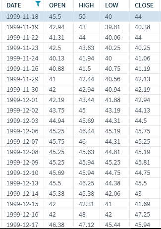
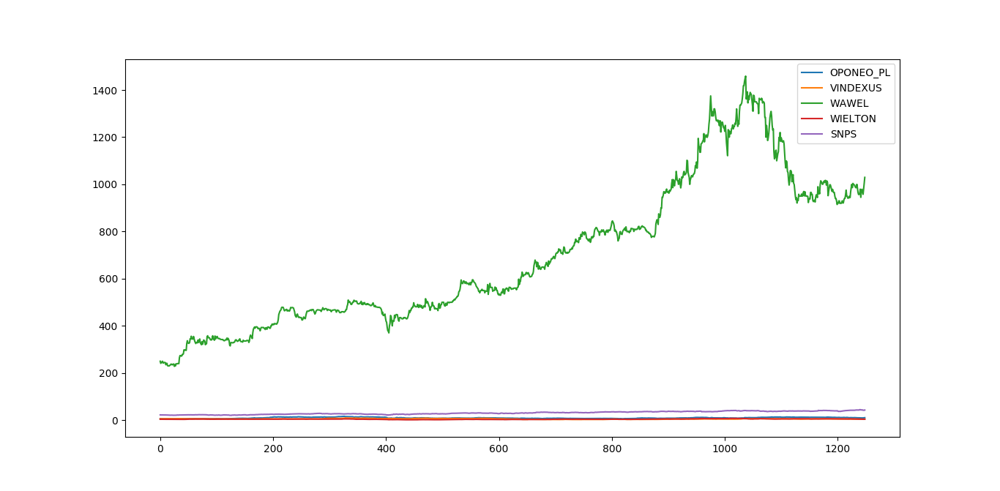
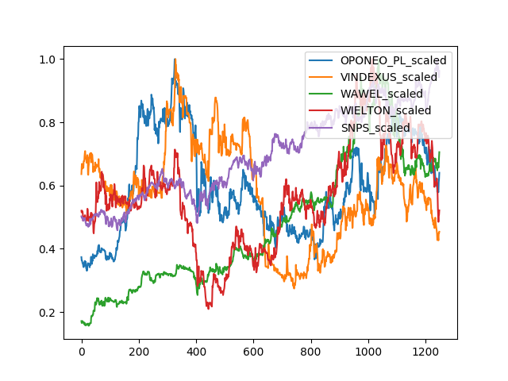
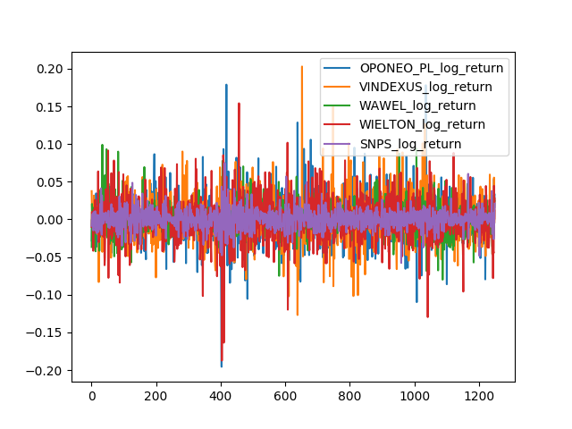

# 第七章：利用机器学习赚钱

到目前为止，我们主要使用 TensorFlow 进行图像处理，并在较小程度上进行文本序列处理。在本章中，我们将处理一种特定类型的表格数据：时间序列数据。

时间序列数据来自许多领域，通常有一个共同点——唯一不断变化的字段是时间或序列字段。这在许多领域中都很常见，尤其是在经济学、金融、健康、医学、环境工程和控制工程中。我们将在本章中通过例子来深入探讨，但关键点是要记住顺序很重要。与前几章我们可以自由打乱数据不同，时间序列数据如果被随意打乱就会失去意义。一个额外的复杂性是数据本身的可获取性；如果我们拥有的数据仅限于当前时刻且没有进一步的历史数据可供获取，那么再多的数据收集也无法生成更多数据——你只能受到基于时间的可用性限制。

幸运的是，我们将深入探讨一个数据量庞大的领域：金融世界。我们将探索一些对冲基金和其他复杂投资者可能使用时间序列数据的方式。

本章将涵盖以下主题：

+   什么是时间序列数据及其特殊属性

+   投资公司在其定量和机器学习驱动的投资努力中可能使用的输入类型和方法

+   金融时间序列数据及其获取方式；我们还将获取一些实时金融数据

+   修改后的卷积神经网络在金融中的应用

# 输入和方法

投资公司的内部专有交易团队采用多种手段进行投资、交易和赚钱。相对不受监管的对冲基金使用更加广泛、更有趣和更复杂的投资手段。有些投资基于直觉或大量思考，另一些则主要基于过滤、算法或信号。两种方法都可以，但我们当然会关注后一种方法。

在定量方法中，有许多技术；其中一些如下：

+   基于估值

+   基于异常和信号

+   基于外部信号

+   基于过滤和分段的队列分析

其中一些方法将使用传统的机器学习技术，如 K-近邻算法、朴素贝叶斯和支持向量机。特别是队列分析，几乎非常适合 KNN 类型的方法。

另一个流行的技术是情感分析和基于群众情绪的信号。我们在上一章中讨论了这一点，当时我们通过分析文本情感，并将段落分类为基本类别：正面、负面、开心、生气等等。想象一下，如果我们收集了更多的数据，并过滤出所有涉及特定股票的数据，我们就能得到股票的情绪倾向。现在，想象一下如果我们拥有一种广泛的（可能是全球性的）、大流量且高速度的文本来源——其实你不需要想象，这一切在过去十年已经成为现实。Twitter 通过 API 提供他们的*firehose*数据，Facebook 也是，其他一些社交媒体平台也同样如此。事实上，一些对冲基金会消耗整个 Twitter 和 Facebook 的数据流，并试图从中提取关于股票、市场板块、商品等的公众情绪。然而，这是一种外部的基于自然语言处理（NLP）信号的投资策略，实践者们用它来预测时间序列的方向性和/或强度。

在本章中，我们将使用内部指标，利用时间序列本身来预测时间序列中的未来数据。预测实际的未来数据实际上是一项非常困难的任务，结果发现，这并不是完全必要的。通常，只需一个方向性的观点就足够了。方向性的观点与运动的强度结合起来会更好。

对于许多类型的投资，甚至连观点本身可能也不能给你完全的保证，平均来看，做得比错得稍多一些就足够了。想象一下每次投掷硬币下注一分钱——如果你能 51%的时间猜对，并且能够玩成千上万次，这可能足以让你盈利，因为你赚得比亏得多。

这一切对基于机器学习的努力来说是一个好兆头，虽然我们可能对我们的答案没有 100%的信心，但从统计上来看，我们可能具有很强的预测能力。归根结底，我们希望领先一步，因为即使是微小的优势，也能通过成千上万次的循环被放大，从而带来可观的利润。

# 获取数据

让我们首先获取一些数据。为了本章的目的，我们将使用 Quandl 的数据，Quandl 一直是技术精通的独立投资者的长期最爱。Quandl 通过多种机制提供许多股票的数据。一个简单的机制是通过 URL API。要获取例如 Google 股票的数据，我们可以点击[`www.quandl.com/api/v3/datasets/WIKI/GOOG/data.json`](https://www.quandl.com/api/v3/datasets/WIKI/GOOG/data.json)。类似地，我们可以将`GOOG`替换为其他指数代码，以获取其他股票的数据。

通过 Python 自动化这个过程是相当容易的；我们将使用以下代码来实现：

```py
import requests 

API_KEY = '<your_api_key>' 

start_date = '2010-01-01' 
end_date = '2015-01-01' 
order = 'asc' 
column_index = 4 

stock_exchange = 'WIKI' 
index = 'GOOG' 

data_specs = 'start_date={}&end_date={}&order={}&column_index={}&api_key={}' 
   .format(start_date, end_date, order, column_index, API_KEY) 
base_url = "https://www.quandl.com/api/v3/datasets/{}/{}/data.json?" + data_specs 
stock_data = requests.get(base_url.format(stock_exchange, index)).json()
```

因此，在这里，`stock_data`变量中将包含从 WIKI/GOOG 获取的股票数据，数据来源于格式化的 URL，日期范围为`2010-01-01`到`2015-01-01`。`column_index = 4`变量告诉服务器仅获取历史数据中的收盘值。

请注意，你可以在你的 GitHub 仓库中找到本章的代码—([`github.com/saifrahmed/MLwithTF/tree/master/book_code/chapter_07`](https://github.com/saifrahmed/MLwithTF/tree/master/book_code/chapter_07))。

那么，什么是这些收盘值呢？股票价格每天都会波动。它们以某个特定值开盘，在一天内达到一定的最高值和最低值，最终在一天结束时以某个特定值收盘。下图展示了股票价格在一天内的变化：



所以，在股票开盘后，你可以投资它们并购买股票。到一天结束时，你将根据所买股票的收盘值获得利润或亏损。投资者使用不同的技术来预测哪些股票在特定的日子里有上涨潜力，并根据他们的分析进行投资。

# 接近问题

在本章中，我们将研究股票价格是否会根据其他时区市场的涨跌而涨跌（这些市场的收盘时间比我们想投资的股票早）。我们将分析来自欧洲市场的数据，这些市场的收盘时间比美国股市早大约 3 或 4 小时。我们将从 Quandl 获取以下欧洲市场的数据：

+   `WSE/OPONEO_PL`

+   `WSE/VINDEXUS`

+   `WSE/WAWEL`

+   `WSE/WIELTON`

我们将预测接下来美国市场的收盘涨跌：WIKI/SNPS。

我们将下载所有市场数据，查看下载的市场收盘值图表，并修改数据以便可以在我们的网络上进行训练。然后，我们将看到我们的网络在假设下的表现。

本章中使用的代码和分析技术灵感来源于 Google Cloud Datalab 笔记本，地址为[`github.com/googledatalab/notebooks/blob/master/samples/TensorFlow/Machine%20Learning%20with%20Financial%20Data.ipynbhere`](https://github.com/googledatalab/notebooks/blob/master/samples/TensorFlow/Machine%20Learning%20with%20Financial%20Data.ipynb)。

步骤如下：

1.  下载所需数据并进行修改。

1.  查看原始数据和修改后的数据。

1.  从修改后的数据中提取特征。

1.  准备训练并测试网络。

1.  构建网络。

1.  训练。

1.  测试。

# 下载和修改数据

在这里，我们将从`codes`变量中提到的来源下载数据，并将其放入我们的`closings`数据框中。我们将存储原始数据、`scaled`数据和`log_return`：

```py
codes = ["WSE/OPONEO_PL", "WSE/VINDEXUS", "WSE/WAWEL", "WSE/WIELTON", "WIKI/SNPS"] 
closings = pd.DataFrame() 
for code in codes: 
    code_splits = code.split("/") 
    stock_exchange = code_splits[0] 
    index = code_splits[1] 
    stock_data = requests.get(base_url.format(stock_exchange,  
    index)).json() 
    dataset_data = stock_data['dataset_data'] 
    data = np.array(dataset_data['data']) 
    closings[index] = pd.Series(data[:, 1].astype(float)) 
    closings[index + "_scaled"] = closings[index] / 
     max(closings[index]) 
    closings[index + "_log_return"] = np.log(closings[index] / closings[index].shift()) 
closings = closings.fillna(method='ffill')  # Fill the gaps in data 
```

我们将数据缩放，使得股票值保持在`0`和`1`之间；这有助于与其他股票值进行最小化比较。它将帮助我们看到股票相对于其他市场的趋势，并使得视觉分析更为简便。

对数回报帮助我们获取市场涨跌图，相较于前一天的数据。

现在，让我们看看我们的数据长什么样。

# 查看数据

以下代码片段将绘制我们下载并处理的数据：

```py
def show_plot(key="", show=True): 
    fig = plt.figure() 
    fig.set_figwidth(20) 
    fig.set_figheight(15) 
    for code in codes: 
        index = code.split("/")[1] 
        if key and len(key) > 0: 
            label = "{}_{}".format(index, key) 
        else: 
            label = index 
        _ = plt.plot(closings[label], label=label) 

    _ = plt.legend(loc='upper right') 
    if show: 
        plt.show() 

show = True 
show_plot("", show=show) 
show_plot("scaled", show=show) 
show_plot("log_return", show=show) 
```

原始市场数据转换为收盘值。正如你在这里看到的，**WAWEL**的值比其他市场大几个数量级：



WAWEL 的收盘值在视觉上减少了其他市场数据的趋势。我们将缩放这些数据，这样我们可以更清楚地看到。请看以下截图：



缩放后的市场值帮助我们更好地可视化趋势。现在，让我们看看`log_return`的样子：



对数回报是市场的收盘值

# 提取特征

现在，我们将提取所需的特征来训练和测试我们的数据：

```py
feature_columns = ['SNPS_log_return_positive', 'SNPS_log_return_negative'] 
for i in range(len(codes)): 
    index = codes[i].split("/")[1] 
    feature_columns.extend([ 
        '{}_log_return_1'.format(index), 
        '{}_log_return_2'.format(index), 
        '{}_log_return_3'.format(index) 
    ]) 
features_and_labels = pd.DataFrame(columns=feature_columns) 
closings['SNPS_log_return_positive'] = 0 
closings.ix[closings['SNPS_log_return'] >= 0, 'SNPS_log_return_positive'] = 1 
closings['SNPS_log_return_negative'] = 0 
closings.ix[closings['SNPS_log_return'] < 0, 'SNPS_log_return_negative'] = 1 
for i in range(7, len(closings)): 
    feed_dict = {'SNPS_log_return_positive': closings['SNPS_log_return_positive'].ix[i], 
        'SNPS_log_return_negative': closings['SNPS_log_return_negative'].ix[i]} 
    for j in range(len(codes)): 
        index = codes[j].split("/")[1] 
        k = 1 if j == len(codes) - 1 else 0 
        feed_dict.update({'{}_log_return_1'.format(index): closings['{}_log_return'.format(index)].ix[i - k], 
                '{}_log_return_2'.format(index): closings['{}_log_return'.format(index)].ix[i - 1 - k], 
                '{}_log_return_3'.format(index): closings['{}_log_return'.format(index)].ix[i - 2 - k]}) 
    features_and_labels = features_and_labels.append(feed_dict, ignore_index=True) 
```

我们将所有特征和标签存储在`features_and_label`变量中。`SNPS_log_return_positive`和`SNPS_log_return_negative`键分别存储 SNPS 的对数回报为正和负的点。如果为真，则为`1`，如果为假，则为`0`。这两个键将作为网络的标签。

其他键用于存储过去三天的其他市场值（对于 SNPS，由于今天的值无法获取，我们还需要存储前 3 天的数据）。

# 为训练和测试做准备

现在，我们将把特征分成`train`和`test`子集。我们不会随机化我们的数据，因为在金融市场的时间序列中，数据是以规律的方式每天提供的，我们必须按原样使用它。你不能通过训练未来的数据来预测过去的行为，因为那样毫无意义。我们总是对股票市场的未来行为感兴趣：

```py
features = features_and_labels[features_and_labels.columns[2:]] 
labels = features_and_labels[features_and_labels.columns[:2]] 
train_size = int(len(features_and_labels) * train_test_split) 
test_size = len(features_and_labels) - train_size 
train_features = features[:train_size] 
train_labels = labels[:train_size] 
test_features = features[train_size:] 
test_labels = labels[train_size:]
```

# 构建网络

用于训练我们时间序列的网络模型如下所示：

```py
sess = tf.Session() 
num_predictors = len(train_features.columns) 
num_classes = len(train_labels.columns) 
feature_data = tf.placeholder("float", [None, num_predictors]) 
actual_classes = tf.placeholder("float", [None, 2]) 
weights1 = tf.Variable(tf.truncated_normal([len(codes) * 3, 50], stddev=0.0001)) 
biases1 = tf.Variable(tf.ones([50])) 
weights2 = tf.Variable(tf.truncated_normal([50, 25], stddev=0.0001)) 
biases2 = tf.Variable(tf.ones([25])) 
weights3 = tf.Variable(tf.truncated_normal([25, 2], stddev=0.0001)) 
biases3 = tf.Variable(tf.ones([2])) 
hidden_layer_1 = tf.nn.relu(tf.matmul(feature_data, weights1) + biases1) 
hidden_layer_2 = tf.nn.relu(tf.matmul(hidden_layer_1, weights2) + biases2) 
model = tf.nn.softmax(tf.matmul(hidden_layer_2, weights3) + biases3) 
cost = -tf.reduce_sum(actual_classes * tf.log(model)) 
train_op1 = tf.train.AdamOptimizer(learning_rate=0.0001).minimize(cost) 
init = tf.initialize_all_variables() 
sess.run(init) 
correct_prediction = tf.equal(tf.argmax(model, 1), tf.argmax(actual_classes, 1)) 
accuracy = tf.reduce_mean(tf.cast(correct_prediction, "float")) 
```

这只是一个简单的网络，包含两个隐藏层。

# 训练

现在，让我们来训练我们的网络：

```py
for i in range(1, 30001): 
    sess.run(train_op1, feed_dict={feature_data: train_features.values, 
            actual_classes: train_labels.values.reshape(len(train_labels.values), 2)}) 
    if i % 5000 == 0: 
        print(i, sess.run(accuracy, feed_dict={feature_data: train_features.values, 
                actual_classes: train_labels.values.reshape(len(train_labels.values), 2)})) 
```

# 测试

我们的网络测试结果如下所示：

```py
feed_dict = { 
    feature_data: test_features.values, 
    actual_classes: test_labels.values.reshape(len(test_labels.values), 2) 
} 
tf_confusion_metrics(model, actual_classes, sess, feed_dict) 
```

# 进一步探讨

假设你刚刚训练了一个优秀的分类器，展示了对市场的某些预测能力，那么你应该开始交易吗？就像我们迄今为止做的其他机器学习项目一样，你需要在独立的测试集上进行测试。在过去，我们通常会将数据分成以下三个集合：

+   训练集

+   开发集，也叫验证集

+   测试集

我们可以做类似于当前工作的事情，但金融市场为我们提供了一个额外的资源——持续的数据流！

我们可以使用早期获取的数据源继续拉取更多的数据；从本质上来说，我们拥有一个不断扩展、看不见的数据集！当然，这也取决于我们使用的数据频率——如果我们使用的是日数据，那么这需要一段时间才能完成。如果使用的是小时数据或每分钟数据，就会更容易，因为我们会更快地获得更多的数据。基于报价量的逐笔数据通常会更好。

由于可能涉及真实的资金，大多数人通常会进行模拟交易——基本上是几乎实时地运行系统，但实际上并不花费任何资金，而只是跟踪系统在真实环境下的表现。如果这一方法有效，下一步将是进行真实交易，也就是说，使用真实的资金（通常是小额资金用于测试系统）。

# 个人的实际考虑

假设你训练了一个不错的分类器，并且在盲测或实时数据集上也展示了良好的结果，那么现在应该开始交易吗？虽然理论上是可能的，但并不那么简单。以下是一些原因：

+   **历史数据分析与实时数据流**：历史数据通常是经过清洗的，接近完美，但实时数据则没有这样的优势。你将需要编写代码来评估数据流并剔除可能不可靠的数据。

+   **买卖价差**：这是新手面临的最大惊讶。市场上实际上有两个价格：一个是你可以买入的价格，另一个是你可以卖出的价格。你并不是在看到的典型市场价格下同时进行买卖（那只是买卖双方的最后碰撞点，称为最后成交价）。买入持仓后立即卖出会因为这个差价而亏损，所以从净利润来看，你已经处于亏损状态。

+   **交易成本**：这可以低至每笔交易 1 美元，但它仍然是一个障碍，需要在策略能盈利之前克服。

+   **税务问题**：这通常被忽视，可能是因为税务意味着净收益，而这通常是一件好事。

+   **退出能力**：仅仅因为理论上可以卖出，并不意味着实际上有市场可以买入你的持仓，而且即便有市场，也可能无法一次性卖出全部持仓。猜猜看？还需要更多的编码。这一次，你需要查看买盘价格、这些价格的成交量以及订单簿的深度。

+   **成交量和流动性**：仅仅因为信号告诉你买入，并不意味着市场上有足够的成交量可供购买；你可能只看到订单簿顶部的价格，而底下实际的成交量很少。更多的编码仍然是必要的！

+   **与交易 API 的集成**：调用库很简单，但涉及资金时就不那么容易了。你需要交易协议、API 协议等。然而，成千上万的个人已经做过了，Interactive Brokers 是寻求 API 进行买卖持仓的最受欢迎的经纪商。方便的是，他们也提供一个 API 来提供市场数据。

# 学到的技能

在本章中，你应该已经学习了以下技能：

+   理解时间序列数据

+   为时间序列数据设置管道

+   集成原始数据

+   创建训练集和测试集

+   实际考虑因素

# 总结

对金融数据的机器学习与我们使用的其他数据并无不同，事实上，我们使用的网络与处理其他数据集时相同。我们还有其他可用的选项，但总体方法保持不变。特别是在进行资金交易时，我们会发现，周围的代码相对于实际的机器学习代码部分会变得更大。

在下一章，我们将探讨如何将机器学习应用于医学领域。
