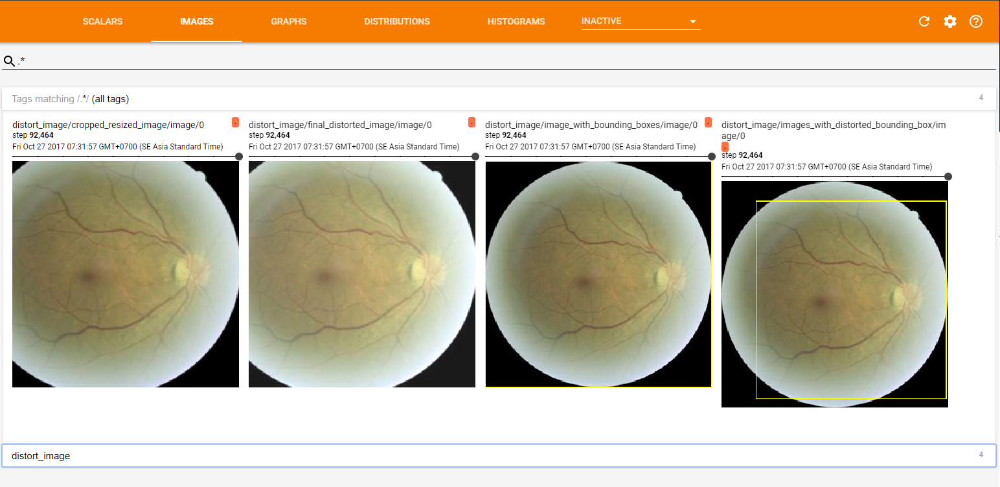

# 第八章：现在医生来接诊

到目前为止，我们已经使用深度网络处理了图像、文本和时间序列数据。虽然大多数示例都很有趣且相关，但它们并不具备企业级的标准。现在，我们将挑战一个企业级问题——医学诊断。我们之所以称之为企业级问题，是因为医学数据具有一些在大型企业外部不常见的属性，比如专有数据格式、大规模原生数据、不方便的类别数据和非典型特征。

本章将涵盖以下主题：

+   医学影像文件及其特性

+   处理大规模图像文件

+   从典型医学文件中提取类别数据

+   使用“预训练”的网络进行非医学数据的应用

+   扩展训练以适应医学数据的规模

获取医学数据本身就是一项挑战，因此我们将依赖于一个受欢迎的网站，所有读者都应该熟悉——Kaggle。虽然有许多医学数据集可以免费访问，但大多数都需要繁琐的注册过程才能访问它们。许多数据集仅在医学影像处理领域的特定子社区中公开，而且大多数都需要特定的提交流程。Kaggle 可能是最规范化的医学影像数据集来源，同时也有非医学数据集供你尝试。我们将特别关注 Kaggle 的糖尿病视网膜病变检测挑战。

+   你可以在此查看数据集：[`www.kaggle.com/c/diabetic-retinopathy-detection/data`](https://www.kaggle.com/c/diabetic-retinopathy-detection/data)

数据集包含训练集和盲测集。训练集用于训练我们的网络，测试集则用于在 Kaggle 网站上提交我们的网络结果。

由于数据量相当大（训练集为 32GB，测试集为 49GB），它们都被划分成多个约 8GB 的 ZIP 文件。

这里的测试集是盲测集——我们不知道它们的标签。这是为了确保我们的网络训练结果在提交测试集时具有公平性。

就训练集而言，其标签存储在`trainLabels.csv`文件中。

# 挑战

在我们深入代码之前，请记住，大多数机器学习的工作都有两个简单的目标之一——分类或排序。在许多情况下，分类本身也是一种排序，因为我们最终选择排名最高的分类（通常是概率）。我们在医学影像方面的探索也不例外——我们将把图像分类为以下两个二元类别之一：

+   疾病状态/阳性

+   正常状态/阴性

或者，我们将把它们分类为多个类别，或者对它们进行排序。在糖尿病视网膜病变的情况下，我们将按以下方式对其进行排名：

+   类别 0: 无糖尿病视网膜病变

+   类别 1: 轻度

+   类别 2: 中度

+   类别 3: 严重

+   类别 4: 广泛的糖尿病视网膜病变

通常，这被称为评分。Kaggle 友好地为参与者提供了超过 32 GB 的训练数据，其中包含超过 35,000 张图片。测试数据集甚至更大——达到了 49 GB。目标是使用已知评分对这 35,000+ 张图像进行训练，并为测试集提出评分。训练标签看起来是这样的：

| **图像** | **级别** |
| --- | --- |
| `10_left` | 0 |
| `10_right` | 0 |
| `13_left` | 0 |
| `13_right` | 0 |
| `15_left` | 1 |
| `15_right` | 2 |
| `16_left` | 4 |
| `16_right` | 4 |
| `17_left` | 0 |
| `17_right` | 1 |

这里有些背景——糖尿病视网膜病变是一种眼内视网膜的疾病，因此我们有左眼和右眼的评分。我们可以将它们视为独立的训练数据，或者我们可以稍后发挥创意，将它们考虑在一个更大的单一患者的背景下。让我们从简单的开始并逐步迭代。

到现在为止，你可能已经熟悉了将一组数据划分为训练集、验证集和测试集的过程。这对我们使用过的一些标准数据集来说效果不错，但这个数据集是一个竞赛的一部分，并且是公开审计的，所以我们不知道答案！这很好地反映了现实生活。有一个小问题——大多数 Kaggle 竞赛允许你提出答案并告诉你你的总评分，这有助于学习和设定方向。它也有助于他们和社区了解哪些用户表现良好。

由于测试标签是盲测的，我们需要改变之前做过的两件事：

+   我们将需要一个用于内部开发和迭代的流程（我们可能会将训练集分成训练集、验证集和测试集）。我们将需要另一个用于外部测试的流程（我们可能会找到一个有效的设置，运行它在盲测集上，或者首先重新训练整个训练集）。

+   我们需要以非常特定的格式提交正式提案，将其提交给独立审计员（在此案例中为 Kaggle），并根据进展情况进行评估。以下是一个示例提交的样式：

| **图像** | **级别** |
| --- | --- |
| `44342_left` | 0 |
| `44342_right` | 1 |
| `44344_left` | 2 |
| `44344_right` | 2 |
| `44345_left` | 0 |
| `44345_right` | 0 |
| `44346_left` | 4 |
| `44346_right` | 3 |
| `44350_left` | 1 |
| `44350_right` | 1 |
| `44351_left` | 4 |
| `44351_right` | 4 |

不出所料，它看起来和训练标签文件非常相似。你可以在这里提交你的内容：

[`www.kaggle.com/c/diabetic-retinopathy-detection/submithttps://www.kaggle.com/c/diabetic-retinopathy-detection/submit`](https://www.kaggle.com/c/diabetic-retinopathy-detection/submit%20%20)

你需要登录才能打开上述链接。

# 数据

让我们开始看看数据。打开一些示例文件并准备好迎接惊讶——这些既不是 28x28 的手写字块，也不是带有猫脸的 64x64 图标。这是一个来自现实世界的真实数据集。事实上，图像的大小甚至不一致。欢迎来到现实世界。

你会发现图像的大小从每边 2,000 像素到接近 5,000 像素不等！这引出了我们第一个实际任务——创建一个训练**管道**。管道将是一组步骤，抽象掉生活中的艰难现实，并生成一组干净、一致的数据。

# 管道

我们将智能地进行处理。Google 使用其 `TensorFlow` 库中的不同网络制作了许多管道模型结构。我们要做的是从这些模型结构和网络中选择一个，并根据我们的需求修改代码。

这很好，因为我们不会浪费时间从零开始构建管道，也不必担心集成 TensorBoard 可视化工具，因为它已经包含在 Google 的管道模型中。

我们将从这里使用一个管道模型：

[`github.com/tensorflow/models/`](https://github.com/tensorflow/models/)

如你所见，这个仓库中有许多由 TensorFlow 制作的不同模型。你可以深入了解一些与自然语言处理（NLP）、递归神经网络及其他主题相关的模型。如果你想理解复杂的模型，这是一个非常好的起点。

对于本章，我们将使用**Tensorflow-Slim 图像分类模型库**。你可以在这里找到这个库：

[`github.com/tensorflow/models/tree/master/research/slim`](https://github.com/tensorflow/models/tree/master/research/slim)

网站上已经有很多详细信息，解释了如何使用这个库。他们还告诉你如何在分布式环境中使用该库，并且如何利用多 GPU 来加速训练时间，甚至部署到生产环境中。

使用这个的最佳之处在于，他们提供了预训练的模型快照，你可以利用它显著减少训练网络的时间。因此，即使你有较慢的 GPU，也不必花费数周的时间来训练这么大的网络，便可达到一个合理的训练水平。

这叫做模型的微调，你只需要提供一个不同的数据集，并告诉网络重新初始化网络的最终层以便重新训练它们。此外，你还需要告诉它数据集中有多少个输出标签类。在我们的案例中，有五个独特的类别，用于识别不同等级的**糖尿病视网膜病变**（**DR**）。

预训练的快照可以在这里找到：

[`github.com/tensorflow/models/tree/master/research/slim#Pretrained`](https://github.com/tensorflow/models/tree/master/research/slim#Pretrained)

如你在上面的链接中所见，他们提供了许多可以利用的预训练模型。他们使用了`ImageNet`数据集来训练这些模型。`ImageNet`是一个标准数据集，包含 1,000 个类别，数据集大小接近 500 GB。你可以在这里了解更多：

[`image-net.org/`](http://image-net.org/)

# 理解管道

首先，开始将`models`仓库克隆到你的计算机中：

```py
git clone https://github.com/tensorflow/models/
```

现在，让我们深入了解从 Google 模型仓库中获得的管道。

如果你查看仓库中这个路径前缀(`models/research/slim`)的文件夹，你会看到名为`datasets`、`deployment`、`nets`、`preprocessing`和`scripts`的文件夹；这些文件涉及生成模型、训练和测试管道，以及与训练`ImageNet`数据集相关的文件，还有一个名为`flowers`**的数据集**。

我们将使用`download_and_convert_data.py`来构建我们的 DR 数据集。这个`图像分类模型`库是基于`slim`库构建的。在这一章中，我们将微调在`nets/inception_v3.py`中定义的 Inception 网络（稍后我们会详细讨论网络的规格和概念），其中包括计算损失函数、添加不同的操作、构建网络等内容。最后，`train_image_classifier.py`和`eval_image_classifier.py`文件包含了为我们的网络创建训练和测试管道的通用程序。

对于这一章，由于网络的复杂性，我们使用基于 GPU 的管道来训练网络。如果你想了解如何在你的机器上安装适用于 GPU 的 TensorFlow，请参考本书中的附录 A，*高级安装*部分。此外，你的机器中应该有大约**120 GB**的空间才能运行此代码。你可以在本书代码文件的`Chapter 8`文件夹中找到最终的代码文件。

# 准备数据集

现在，让我们开始准备网络的数据集。

对于这个 Inception 网络，我们将使用`TFRecord`类来管理我们的数据集。经过预处理后的输出数据集文件将是 proto 文件，`TFRecord`可以读取这些文件，它只是以序列化格式存储的我们的数据，以便更快的读取速度。每个 proto 文件内包含一些信息，如图像的大小和格式。

我们这样做的原因是，数据集的大小太大，我们不能将整个数据集加载到内存（RAM）中，因为它会占用大量空间。因此，为了高效使用内存，我们必须分批加载图像，并删除当前没有使用的已经加载的图像。

网络将接收的输入大小是 299x299。因此，我们将找到一种方法，首先将图像大小缩小到 299x299，以便得到一致的图像数据集。

在减少图像大小后，我们将制作 proto 文件，稍后可以将这些文件输入到我们的网络中，网络将对我们的数据集进行训练。

你需要首先从这里下载五个训练 ZIP 文件和标签文件：

[`www.kaggle.com/c/diabetic-retinopathy-detection/data`](https://www.kaggle.com/c/diabetic-retinopathy-detection/data)

不幸的是，Kaggle 仅允许通过账户下载训练的 ZIP 文件，因此无法像之前章节那样自动化下载数据集文件的过程。

现在，假设你已经下载了所有五个训练 ZIP 文件和标签文件，并将它们存储在名为 `diabetic` 的文件夹中。`diabetic` 文件夹的结构将如下所示：

+   `diabetic`

    +   `train.zip.001`

    +   `train.zip.002`

    +   `train.zip.003`

    +   `train.zip.004`

    +   `train.zip.005`

    +   `trainLabels.csv.zip`

为了简化项目，我们将手动使用压缩软件进行解压。解压完成后，`diabetic` 文件夹的结构将如下所示：

+   `diabetic`

    +   `train`

    +   ` 10_left.jpeg`

    +   `10_right.jpeg`

    +   ...

    +   `trainLabels.csv`

    +   `train.zip.001`

    +   `train.zip.002`

    +   ` train.zip.003`

    +   ` train.zip.004`

    +   `train.zip.005`

    +   `trainLabels.csv.zip`

在这种情况下，`train` 文件夹包含所有 .zip 文件中的图像，而 `trainLabels.csv` 文件包含每张图像的真实标签。

模型库的作者提供了一些示例代码，用于处理一些流行的图像分类数据集。我们的糖尿病问题也可以用相同的方法来解决。因此，我们可以遵循处理其他数据集（如 `flower` 或 `MNIST` 数据集）的代码。我们已经在本书的 [`github.com/mlwithtf/mlwithtf/`](https://github.com/mlwithtf/mlwithtf/) 库中提供了修改代码，便于处理糖尿病数据集。

你需要克隆仓库并导航到 `chapter_08` 文件夹。你可以按照以下方式运行 `download_and_convert_data.py` 文件：

```py
python download_and_convert_data.py --dataset_name diabetic --dataset_dir D:\\datasets\\diabetic
```

在这种情况下，我们将使用 `dataset_name` 为 `diabetic`，而 `dataset_dir` 是包含 `trainLabels.csv` 和 `train` 文件夹的文件夹。

它应该能够顺利运行，开始将数据集预处理成适合的 (299x299) 格式，并在新创建的 `tfrecords` 文件夹中生成一些 `TFRecord` 文件。下图展示了 `tfrecords` 文件夹的内容：


# 解释数据准备过程

现在，让我们开始编写数据预处理的代码。从现在开始，我们将展示我们对 `tensorflow/models` 原始库所做的修改。基本上，我们将处理 `flowers` 数据集的代码作为起点，并对其进行修改以满足我们的需求。

在 `download_and_convert_data.py` 文件中，我们在文件开头添加了一行新的代码：

```py
from datasets import download_and_convert_diabetic 
and a new else-if clause to process the dataset_name "diabetic" at line 69: 
  elif FLAGS.dataset_name == 'diabetic': 
      download_and_convert_diabetic.run(FLAGS.dataset_dir)
```

使用这段代码，我们可以调用 `datasets` 文件夹中的 `download_and_convert_diabetic.py` 文件中的 `run` 方法。这是一种非常简单的方法，用于分离多个数据集的预处理代码，但我们仍然可以利用 `image classification` 库的其他部分。

`download_and_convert_diabetic.py` 文件是对 `download_and_convert_flowers.py` 文件的复制，并对其进行了修改，以准备我们的糖尿病数据集。

在 `download_and_convert_diabetic.py` 文件的 `run` 方法中，我们做了如下更改：

```py
  def run(dataset_dir): 
    """Runs the download and conversion operation. 

    Args: 
      dataset_dir: The dataset directory where the dataset is stored. 
    """ 
    if not tf.gfile.Exists(dataset_dir): 
        tf.gfile.MakeDirs(dataset_dir) 

    if _dataset_exists(dataset_dir): 
        print('Dataset files already exist. Exiting without re-creating   
        them.') 
        return 

    # Pre-processing the images. 
    data_utils.prepare_dr_dataset(dataset_dir) 
    training_filenames, validation_filenames, class_names =   
    _get_filenames_and_classes(dataset_dir) 
    class_names_to_ids = dict(zip(class_names,    
    range(len(class_names)))) 

    # Convert the training and validation sets. 
    _convert_dataset('train', training_filenames, class_names_to_ids,   
    dataset_dir) 
    _convert_dataset('validation', validation_filenames,    
    class_names_to_ids, dataset_dir) 

    # Finally, write the labels file: 
    labels_to_class_names = dict(zip(range(len(class_names)),    
    class_names)) 
    dataset_utils.write_label_file(labels_to_class_names, dataset_dir) 

    print('\nFinished converting the Diabetic dataset!')
```

在这段代码中，我们使用了来自 `data_utils` 包的 `prepare_dr_dataset`，该包在本书仓库的根目录中准备好。稍后我们会看这个方法。然后，我们修改了 `_get_filenames_and_classes` 方法，以返回 `training` 和 `validation` 的文件名。最后几行与 `flowers` 数据集示例相同：

```py
  def _get_filenames_and_classes(dataset_dir): 
    train_root = os.path.join(dataset_dir, 'processed_images', 'train') 
    validation_root = os.path.join(dataset_dir, 'processed_images',   
    'validation') 
    class_names = [] 
    for filename in os.listdir(train_root): 
        path = os.path.join(train_root, filename) 
        if os.path.isdir(path): 
            class_names.append(filename) 

    train_filenames = [] 
    directories = [os.path.join(train_root, name) for name in    
    class_names] 
    for directory in directories: 
        for filename in os.listdir(directory): 
            path = os.path.join(directory, filename) 
            train_filenames.append(path) 

    validation_filenames = [] 
    directories = [os.path.join(validation_root, name) for name in    
    class_names] 
    for directory in directories: 
        for filename in os.listdir(directory): 
            path = os.path.join(directory, filename) 
            validation_filenames.append(path) 
    return train_filenames, validation_filenames, sorted(class_names) 
```

在前面的这个方法中，我们查找了 `processed_images/train` 和 `processed/validation` 文件夹中的所有文件名，这些文件夹包含了在 `data_utils.prepare_dr_dataset` 方法中预处理过的图像。

在 `data_utils.py` 文件中，我们编写了 `prepare_dr_dataset(dataset_dir)` 函数，负责整个数据的预处理工作。

让我们首先定义必要的变量来链接到我们的数据：

```py
num_of_processing_threads = 16 
dr_dataset_base_path = os.path.realpath(dataset_dir) 
unique_labels_file_path = os.path.join(dr_dataset_base_path, "unique_labels_file.txt") 
processed_images_folder = os.path.join(dr_dataset_base_path, "processed_images") 
num_of_processed_images = 35126 
train_processed_images_folder = os.path.join(processed_images_folder, "train") 
validation_processed_images_folder = os.path.join(processed_images_folder, "validation") 
num_of_training_images = 30000 
raw_images_folder = os.path.join(dr_dataset_base_path, "train") 
train_labels_csv_path = os.path.join(dr_dataset_base_path, "trainLabels.csv")
```

`num_of_processing_threads` 变量用于指定在预处理数据集时我们希望使用的线程数，正如你可能已经猜到的那样。我们将使用多线程环境来加速数据预处理。随后，我们指定了一些目录路径，用于在预处理时将数据存放在不同的文件夹中。

我们将提取原始形式的图像，然后对它们进行预处理，将其转换为适当的一致格式和大小，之后，我们将使用 `download_and_convert_diabetic.py` 文件中的 `_convert_dataset` 方法从处理过的图像生成 `tfrecords` 文件。之后，我们将这些 `tfrecords` 文件输入到训练和测试网络中。

正如我们在前一部分所说的，我们已经提取了 `dataset` 文件和标签文件。现在，既然我们已经提取了所有数据并将其存储在机器中，我们将开始处理图像。来自 DR 数据集的典型图像如下所示：


我们想要做的是去除这些多余的黑色空间，因为它对我们的网络来说并不必要。这将减少图像中的无关信息。之后，我们会将这张图像缩放成一个 299x299 的 JPG 图像文件。

我们将对所有训练数据集重复此过程。

剪裁黑色图像边框的函数如下所示：

```py
  def crop_black_borders(image, threshold=0):
     """Crops any edges below or equal to threshold

     Crops blank image to 1x1.

     Returns cropped image.

     """
     if len(image.shape) == 3:
         flatImage = np.max(image, 2)
     else:
         flatImage = image
     assert len(flatImage.shape) == 2

     rows = np.where(np.max(flatImage, 0) > threshold)[0]
     if rows.size:
         cols = np.where(np.max(flatImage, 1) > threshold)[0]
         image = image[cols[0]: cols[-1] + 1, rows[0]: rows[-1] + 1]
     else:
         image = image[:1, :1]

     return image 
```

这个函数接收图像和一个灰度阈值，低于此值时，它会去除图像周围的黑色边框。

由于我们在多线程环境中执行所有这些处理，我们将按批次处理图像。要处理一个图像批次，我们将使用以下函数：

```py
  def process_images_batch(thread_index, files, labels, subset):

     num_of_files = len(files)

     for index, file_and_label in enumerate(zip(files, labels)):
         file = file_and_label[0] + '.jpeg'
         label = file_and_label[1]

         input_file = os.path.join(raw_images_folder, file)
         output_file = os.path.join(processed_images_folder, subset,   
         str(label), file)

         image = ndimage.imread(input_file)
         cropped_image = crop_black_borders(image, 10)
         resized_cropped_image = imresize(cropped_image, (299, 299, 3),   
         interp="bicubic")
         imsave(output_file, resized_cropped_image)

         if index % 10 == 0:
             print("(Thread {}): Files processed {} out of  
             {}".format(thread_index, index, num_of_files)) 
```

`thread_index` 告诉我们调用该函数的线程 ID。处理图像批次的多线程环境在以下函数中定义：

```py
   def process_images(files, labels, subset):

     # Break all images into batches with a [ranges[i][0], ranges[i] 
     [1]].
     spacing = np.linspace(0, len(files), num_of_processing_threads +  
     1).astype(np.int)
     ranges = []
     for i in xrange(len(spacing) - 1):
         ranges.append([spacing[i], spacing[i + 1]])

     # Create a mechanism for monitoring when all threads are finished.
     coord = tf.train.Coordinator()

     threads = []
     for thread_index in xrange(len(ranges)):
         args = (thread_index, files[ranges[thread_index] 
         [0]:ranges[thread_index][1]],
                 labels[ranges[thread_index][0]:ranges[thread_index] 
                 [1]],
                 subset)
         t = threading.Thread(target=process_images_batch, args=args)
         t.start()
         threads.append(t)

     # Wait for all the threads to terminate.
     coord.join(threads) 
```

为了从所有线程中获取最终结果，我们使用一个 `TensorFlow` 类，`tf.train.Coordinator()`，它的 `join` 函数负责处理所有线程的最终处理点。

对于线程处理，我们使用`threading.Thread`，其中`target`参数指定要调用的函数，`args`参数指定目标函数的参数。

现在，我们将处理训练图像。训练数据集分为训练集（30,000 张图像）和验证集（5,126 张图像）。

总的预处理过程如下所示：

```py
def process_training_and_validation_images():
     train_files = []
     train_labels = []

     validation_files = []
     validation_labels = []

     with open(train_labels_csv_path) as csvfile:
         reader = csv.DictReader(csvfile)
         for index, row in enumerate(reader):
             if index < num_of_training_images:
                 train_files.extend([row['image'].strip()])
                 train_labels.extend([int(row['level'].strip())])
             else:
                 validation_files.extend([row['image'].strip()])

   validation_labels.extend([int(row['level'].strip())])

     if not os.path.isdir(processed_images_folder):
         os.mkdir(processed_images_folder)

     if not os.path.isdir(train_processed_images_folder):
         os.mkdir(train_processed_images_folder)

     if not os.path.isdir(validation_processed_images_folder):
         os.mkdir(validation_processed_images_folder)

     for directory_index in range(5):
         train_directory_path =   
    os.path.join(train_processed_images_folder,   
    str(directory_index))
         valid_directory_path =   
   os.path.join(validation_processed_images_folder,  
   str(directory_index))

         if not os.path.isdir(train_directory_path):
             os.mkdir(train_directory_path)

         if not os.path.isdir(valid_directory_path):
             os.mkdir(valid_directory_path)

     print("Processing training files...")
     process_images(train_files, train_labels, "train")
     print("Done!")

     print("Processing validation files...")
     process_images(validation_files, validation_labels,  
     "validation")
     print("Done!")

     print("Making unique labels file...")
     with open(unique_labels_file_path, 'w') as unique_labels_file:
         unique_labels = ""
         for index in range(5):
             unique_labels += "{}\n".format(index)
         unique_labels_file.write(unique_labels)

     status = check_folder_status(processed_images_folder, 
     num_of_processed_images,
     "All processed images are present in place",
     "Couldn't complete the image processing of training and  
     validation files.")

     return status 
```

现在，我们将查看准备数据集的最后一个方法，即在`download_and_convert_diabetic.py`文件中调用的`_convert_dataset`方法：

```py
def _get_dataset_filename(dataset_dir, split_name, shard_id): 
    output_filename = 'diabetic_%s_%05d-of-%05d.tfrecord' % ( 
        split_name, shard_id, _NUM_SHARDS) 
    return os.path.join(dataset_dir, output_filename) 
def _convert_dataset(split_name, filenames, class_names_to_ids, dataset_dir): 
    """Converts the given filenames to a TFRecord dataset. 

    Args: 
      split_name: The name of the dataset, either 'train' or  
     'validation'. 
      filenames: A list of absolute paths to png or jpg images. 
      class_names_to_ids: A dictionary from class names (strings) to  
      ids 
        (integers). 
      dataset_dir: The directory where the converted datasets are  
     stored. 
    """ 
    assert split_name in ['train', 'validation'] 

    num_per_shard = int(math.ceil(len(filenames) /  
    float(_NUM_SHARDS))) 

    with tf.Graph().as_default(): 
        image_reader = ImageReader() 

        with tf.Session('') as sess: 

            for shard_id in range(_NUM_SHARDS): 
                output_filename = _get_dataset_filename( 
                    dataset_dir, split_name, shard_id) 

                with tf.python_io.TFRecordWriter(output_filename)
                as   
                tfrecord_writer: 
                    start_ndx = shard_id * num_per_shard 
                    end_ndx = min((shard_id + 1) * num_per_shard,  
                    len(filenames)) 
                    for i in range(start_ndx, end_ndx): 
                        sys.stdout.write('\r>> Converting image  
                         %d/%d shard %d' % ( 
                            i + 1, len(filenames), shard_id)) 
                        sys.stdout.flush() 

                        # Read the filename: 
                        image_data =  
                    tf.gfile.FastGFile(filenames[i], 'rb').read() 
                        height, width =          
                    image_reader.read_image_dims(sess, image_data) 

                        class_name =  
                     os.path.basename(os.path.dirname(filenames[i])) 
                        class_id = class_names_to_ids[class_name] 

                        example = dataset_utils.image_to_tfexample( 
                            image_data, b'jpg', height, width,   
                             class_id) 

                 tfrecord_writer.write(example.SerializeToString()) 

                  sys.stdout.write('\n') 
                  sys.stdout.flush() 
```

在前面的函数中，我们将获取图像文件名，并将它们存储在`tfrecord`文件中。我们还会将`train`和`validation`文件拆分为多个`tfrecord`文件，而不是只使用一个文件来存储每个分割数据集。

现在，数据处理已经完成，我们将正式将数据集形式化为`slim.dataset`的实例。数据集来自`Tensorflow Slim`。在`datasets/diabetic.py`文件中，你将看到一个名为`get_split`的方法，如下所示：

```py
_FILE_PATTERN = 'diabetic_%s_*.tfrecord' 
SPLITS_TO_SIZES = {'train': 30000, 'validation': 5126} 
_NUM_CLASSES = 5 
_ITEMS_TO_DESCRIPTIONS = { 
    'image': 'A color image of varying size.', 
    'label': 'A single integer between 0 and 4', 
} 
def get_split(split_name, dataset_dir, file_pattern=None, reader=None): 
  """Gets a dataset tuple with instructions for reading flowers. 
  Args: 
    split_name: A train/validation split name. 
    dataset_dir: The base directory of the dataset sources. 
    file_pattern: The file pattern to use when matching the dataset sources. 
      It is assumed that the pattern contains a '%s' string so that the split 
      name can be inserted. 
    reader: The TensorFlow reader type. 
  Returns: 
    A `Dataset` namedtuple. 
  Raises: 
    ValueError: if `split_name` is not a valid train/validation split. 
  """ 
  if split_name not in SPLITS_TO_SIZES: 
    raise ValueError('split name %s was not recognized.' % split_name) 

  if not file_pattern: 
    file_pattern = _FILE_PATTERN 
  file_pattern = os.path.join(dataset_dir, file_pattern % split_name) 

  # Allowing None in the signature so that dataset_factory can use the default. 
  if reader is None: 
    reader = tf.TFRecordReader 

  keys_to_features = { 
      'image/encoded': tf.FixedLenFeature((), tf.string, default_value=''), 
      'image/format': tf.FixedLenFeature((), tf.string, default_value='png'), 
      'image/class/label': tf.FixedLenFeature( 
          [], tf.int64, default_value=tf.zeros([], dtype=tf.int64)), 
  } 
  items_to_handlers = { 
      'image': slim.tfexample_decoder.Image(), 
      'label': slim.tfexample_decoder.Tensor('image/class/label'), 
  } 
  decoder = slim.tfexample_decoder.TFExampleDecoder( 
      keys_to_features, items_to_handlers) 

  labels_to_names = None 
  if dataset_utils.has_labels(dataset_dir): 
    labels_to_names = dataset_utils.read_label_file(dataset_dir) 

  return slim.dataset.Dataset( 
      data_sources=file_pattern, 
      reader=reader, 
      decoder=decoder, 
      num_samples=SPLITS_TO_SIZES[split_name], 
      items_to_descriptions=_ITEMS_TO_DESCRIPTIONS, 
      num_classes=_NUM_CLASSES, 
      labels_to_names=labels_to_names) 
```

之前的方法将在训练和评估过程中被调用。我们将创建一个`slim.dataset`的实例，包含关于我们的`tfrecord`文件的信息，以便它可以自动解析二进制文件。此外，我们还可以使用`slim.dataset.Dataset`，结合`DatasetDataProvider`，通过 Tensorflow Slim 来并行读取数据集，从而提高训练和评估的效率。

在开始训练之前，我们需要从`Tensorflow Slim 图像分类`库中下载 Inception V3 的预训练模型，这样我们就可以利用 Inception V3 的性能，而无需从头开始训练。

预训练快照可以在这里找到：

[`github.com/tensorflow/models/tree/master/research/slim#Pretrained`](https://github.com/tensorflow/models/tree/master/research/slim#Pretrained)

在本章中，我们将使用 Inception V3，因此我们需要下载`inception_v3_2016_08_28.tar.gz`文件，并解压缩它以获得名为`inception_v3.ckpt`的检查点文件。

# 训练过程

现在，让我们继续进行模型的训练和评估。

训练脚本位于`train_image_classifer.py`文件中。由于我们遵循了该库的工作流程，因此可以保持该文件不变，并使用以下命令运行训练过程：

```py
python train_image_classifier.py --train_dir=D:\datasets\diabetic\checkpoints --dataset_name=diabetic --dataset_split_name=train --dataset_dir=D:\datasets\diabetic\tfrecords --model_name=inception_v3 --checkpoint_path=D:\datasets\diabetic\checkpoints\inception_v3\inception_v3.ckpt --checkpoint_exclude_scopes=InceptionV3/Logits,InceptionV3/AuxLogits --trainable_scopes=InceptionV3/Logits,InceptionV3/AuxLogits --learning_rate=0.000001 --learning_rate_decay_type=exponential 
```

在我们的设置中，我们已经让训练过程运行了一整夜。现在，我们将运行训练好的模型，通过验证过程来查看其效果。

# 验证过程

你可以使用以下命令运行验证过程：

```py
python eval_image_classifier.py --alsologtostderr --checkpoint_path=D:\datasets\diabetic\checkpoints\model.ckpt-92462 --dataset_name=diabetic --dataset_split_name=validation --dataset_dir=D:\datasets\diabetic\tfrecords --model_name=inception_v3

```


如你所见，当前的准确率大约是 75%。在*进一步探索*部分，我们将给出一些提高准确率的建议。

现在，我们将查看 TensorBoard，来可视化训练过程。

# 使用 TensorBoard 可视化输出

现在，我们将使用 TensorBoard 来可视化训练结果。

首先，你需要将`command-line`目录更改为包含检查点的文件夹。在我们的例子中，它是上一条命令中的`train_dir`参数，`D:\datasets\diabetic\checkpoints`。然后，你应该运行以下命令：

```py
tensorboard -logdir .
```

以下是我们运行 TensorBoard 时的输出：


前面的图像显示了包含 RMSprop 优化器的节点，用于训练网络以及它所包含的用于 DR 分类输出的一些 logits。下一张截图展示了作为输入的图像及其预处理和修改：



在此截图中，你可以看到训练过程中网络输出的图形：


这张截图显示了训练过程中网络的总原始损失：


# Inception 网络

Inception 网络的主要概念是将不同的卷积操作结合在同一层中。通过将 7x7、5x5、3x3 和 1x1 的卷积组合在一起，传递给下一层。通过这种方式，网络可以提取更多的特征，从而提高准确性。以下是 Google Inception V3 网络的示意图。你可以尝试访问`chapter_08/nets/inception_v3.py`中的代码。


该图像来自[`github.com/tensorflow/models/blob/master/research/inception/g3doc/inception_v3_architecture.png`](https://github.com/tensorflow/models/blob/master/research/inception/g3doc/inception_v3_architecture.png)

# 继续深入

我们从运行该网络中得到的结果是在验证集上的准确率为 75%。这并不算很好，因为该网络的使用非常关键。在医学中，错误的余地非常小，因为人的健康状况直接关系到生命。

为了提高准确性，我们需要定义不同的评估标准。你可以在这里阅读更多内容：

[`en.wikipedia.org/wiki/Confusion_matrix`](https://en.wikipedia.org/wiki/Confusion_matrix)

同时，你可以平衡数据集。现在的数据集是不平衡的，病人数量远少于正常患者。因此，网络对正常患者特征更加敏感，而对病人特征较不敏感。

为了修复这个问题，我们可以对数据集进行 SMOTE 处理。SMOTE 基本上是通过复制较少频繁类别的数据（例如水平或垂直翻转图像、改变饱和度等）来创建一个平衡的数据集。SMOTE 代表**合成少数类过采样技术**。

这是一本关于该主题的优秀读物：

[`www.jair.org/media/953/live-953-2037-jair.pdf`](https://www.jair.org/media/953/live-953-2037-jair.pdf)

# 其他医学数据挑战

可以理解的是，医疗数据不像其他数据集那样容易发布，因此公开领域的数据集要少得多。这一情况正在缓慢改变，但与此同时，以下是一些你可以尝试的公开数据集和相关挑战。需要注意的是，许多挑战已经被克服，但幸运的是，它们仍然继续发布数据集。

# ISBI 大奖挑战

ISBI 是国际生物医学影像学大会，这是一个推动本章中所述工作的受欢迎的会议场所。他们的年度会议通常会向学术界提出多个挑战。2016 年他们提出了几个挑战。

一个受欢迎的挑战是 AIDA-E：内窥镜图像分析检测异常。挑战网站是[`isbi-aida.grand-challenge.org/`](http://isbi-aida.grand-challenge.org/)。

另一个受欢迎的挑战是淋巴结中的癌症转移检测，涉及病理数据。挑战网站是[`camelyon16.grand-challenge.org/`](http://camelyon16.grand-challenge.org/)。

在放射学方面，2016 年一个受欢迎的挑战是数据科学碗挑战赛，聚焦心脏病诊断。该挑战名为*转变我们诊断心脏病的方式*，目标是对心脏磁共振成像（MRI）数据的部分进行分割，以衡量心脏泵血量，这一数据被用作心脏健康的代理指标。挑战网站及数据集为[`www.datasciencebowl.com/competitions/transforming-how-we-diagnose-heart-disease/`](http://www.datasciencebowl.com/competitions/transforming-how-we-diagnose-heart-disease/)。

另一个受欢迎的放射学数据集是 Lung Image Database Consortium（LIDC）中的**计算机断层扫描**（**CT**）数据，属于 LIDC-IDRI 图像集。这是一个诊断和肺癌筛查胸部 CT 扫描的数据集。有趣的是，除了图像级别的类别外，该数据集还标注了病变的实际位置。

这两个放射学竞赛还有两个有趣的原因：

+   它们包括三维**体积**数据，本质上是由二维图像组成的有序堆叠，这些图像共同构成了一个实际的空间。

+   它们包括**分割**任务，在这些任务中，你需要将图像或体积的某些部分分类到特定类别。这是一个常见的分类挑战，不同之处在于我们还尝试对图像中的特征进行定位。在一种情况下，我们尝试定位特征并指出它的位置（而不是对整个图像进行分类），在另一种情况下，我们则尝试将一个区域进行分类，以此来衡量一个区域的大小。

我们稍后会更多地讨论如何处理体积数据，但目前你已经有了一些非常有趣和多样化的数据集可以使用。

# 阅读医疗数据

尽管存在挑战，但糖尿病视网膜病变挑战并不像想象中那么复杂。实际图像是以 JPEG 格式提供的，但大多数医学数据并非 JPEG 格式。它们通常是容器格式，如 DICOM。DICOM 代表 **医学中的数字成像与通信**，并且有多个版本和变体。它包含医学图像，但也有头数据。头数据通常包括一般的病人和研究数据，但它还可以包含其他几十个自定义字段。如果你幸运的话，它也会包含诊断信息，你可以将其作为标签。

DICOM 数据为我们之前讨论的流程增加了一个步骤，因为现在我们需要读取 DICOM 文件，提取头信息（并希望包括类/标签数据），并提取底层图像。DICOM 并不像 JPEG 或 PNG 那么容易使用，但也不算太复杂。它需要一些额外的包。

由于我们几乎所有的工作都是用 Python 完成的，因此让我们使用一个用于 DICOM 处理的 `Python` 库。最流行的是 **pydicom**，可以在[`github.com/darcymason/pydicom`](https://github.com/darcymason/pydicom)找到。

文档可以在[`pydicom.readthedocs.io/en/stable/getting_started.html`](https://pydicom.readthedocs.io/en/stable/getting_started.html)获取。

应注意，`pip` 安装当前存在问题，因此必须从源代码仓库克隆并通过设置脚本进行安装，才能使用。

来自文档的一个简短摘录将有助于我们理解如何处理 `DICOM` 文件：

```py
>>> import dicom 
>>> plan = dicom.read_file("rtplan.dcm") 
>>> plan.PatientName 
'Last^First^mid^pre' 
>>> plan.dir("setup")    # get a list of tags with "setup" somewhere in the name 
['PatientSetupSequence'] 
>>> plan.PatientSetupSequence[0] 
(0018, 5100) Patient Position                    CS: 'HFS' 
(300a, 0182) Patient Setup Number                IS: '1' 
(300a, 01b2) Setup Technique Description         ST: '' 
```

这看起来可能有些凌乱，但这正是你在处理医学数据时应该预期的交互方式。更糟糕的是，每个供应商通常将相同的数据，甚至是基本数据，放入略有不同的标签中。行业中的典型做法就是“到处看看！”我们通过以下方式转储整个标签集来做到这一点：

```py
>>> ds 
(0008, 0012) Instance Creation Date              DA: '20030903' 
(0008, 0013) Instance Creation Time              TM: '150031' 
(0008, 0016) SOP Class UID                       UI: RT Plan Storage 
(0008, 0018) Diagnosis                        UI: Positive  
(0008, 0020) Study Date                          DA: '20030716' 
(0008, 0030) Study Time                          TM: '153557' 
(0008, 0050) Accession Number                    SH: '' 
(0008, 0060) Modality                            CS: 'RTPLAN'
```

假设我们在寻找诊断信息。我们会查看几个标签文件，尝试看看诊断是否始终出现在标签`(0008, 0018) Diagnosis`下，如果是，我们通过从大部分训练集中提取这个字段来验证我们的假设，看它是否始终被填充。如果是的话，我们就可以进入下一步。如果不是，我们需要重新开始并查看其他字段。从理论上讲，数据提供者、经纪人或供应商可以提供这些信息，但从实际情况来看，这并不那么简单。

下一步是查看值域。这一点非常重要，因为我们希望看到我们的类的表现。理想情况下，我们会得到一个干净的值集合，例如{`Negative`, `Positive`}，但实际上，我们通常会得到一条长尾的脏值。所以，典型的做法是遍历每一张图片，并统计每个遇到的唯一值域值，具体如下：

```py
>>> import dicom, glob, os 
>>> os.chdir("/some/medical/data/dir") 
>>> domains={} 
>>> for file in glob.glob("*.dcm"): 
>>>    aMedFile = dicom.read_file(file) 
>>>    theVal=aMedFile.ds[0x10,0x10].value 
>>>    if domains[theVal]>0: 
>>>       domains[theVal]= domains[theVal]+1 
>>>    else: 
>>>       domains[theVal]=1 
```

在这一点上，最常见的发现是，99%的领域值存在于少数几个领域值之间（如*正向*和*负向*），而剩下的 1%的领域值是脏数据（如*正向，但待审阅*，*@#Q#$%@#$%*，或*已发送重新阅读*）。最简单的方法是丢弃这些长尾数据——只保留好的数据。如果有足够的训练数据，这尤其容易做到。

好的，我们已经提取了类信息，但我们仍然需要提取实际的图像。我们可以按照以下步骤进行：

```py
>>> import dicom 
>>> ds=dicom.read_file("MR_small.dcm") 
>>> ds.pixel_array 
array([[ 905, 1019, 1227, ...,  302,  304,  328], 
       [ 628,  770,  907, ...,  298,  331,  355], 
       [ 498,  566,  706, ...,  280,  285,  320], 
       ..., 
       [ 334,  400,  431, ..., 1094, 1068, 1083], 
       [ 339,  377,  413, ..., 1318, 1346, 1336], 
       [ 378,  374,  422, ..., 1369, 1129,  862]], dtype=int16) 
>>> ds.pixel_array.shape 
(64, 64)
```

不幸的是，这仅仅给了我们一个原始的像素值矩阵。我们仍然需要将其转换为可读的格式（理想情况下是 JPEG 或 PNG）。我们将按以下步骤进行下一步操作：


接下来，我们将把图像缩放到我们需要的比特长度，并使用另一个库将矩阵写入文件，该库专门用于将数据写入目标格式。在我们的例子中，我们将使用 PNG 输出格式，并使用`png`库将其写入。这意味着需要额外的导入：

```py
import os 
from pydicom import dicomio 
import png 
import errno 
import fnmatch
```

我们将这样导出：


# 学到的技能

你应该在本章中学到这些技能：

+   处理晦涩难懂且专有的医学影像格式

+   处理大型图像文件，这是医学图像的一个常见特征

+   从医疗文件中提取类数据

+   扩展我们现有的管道以处理异构数据输入

+   应用在非医学数据上预训练的网络

+   扩展训练以适应新数据集。

# 总结

在本章中，我们为医学诊断这一企业级问题创建了一个深度神经网络，用于图像分类问题。此外，我们还引导你完成了读取 DICOM 数字医学影像数据的过程，为进一步研究做准备。在下一章，我们将构建一个可以通过学习用户反馈自我改进的生产系统。
