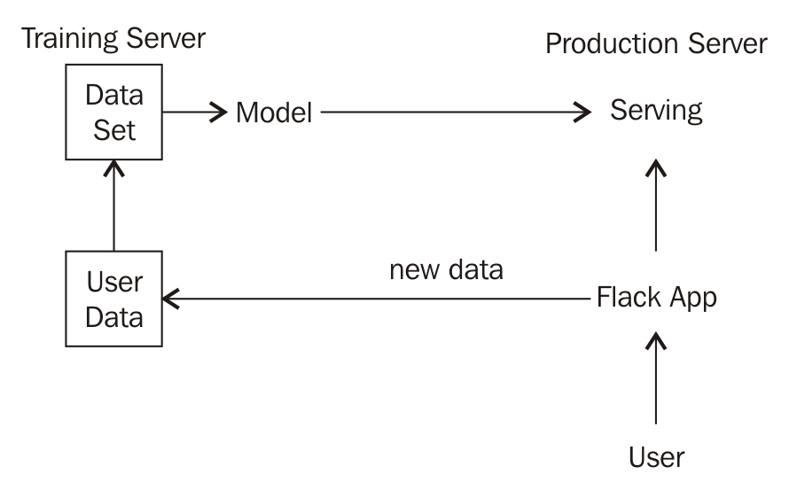
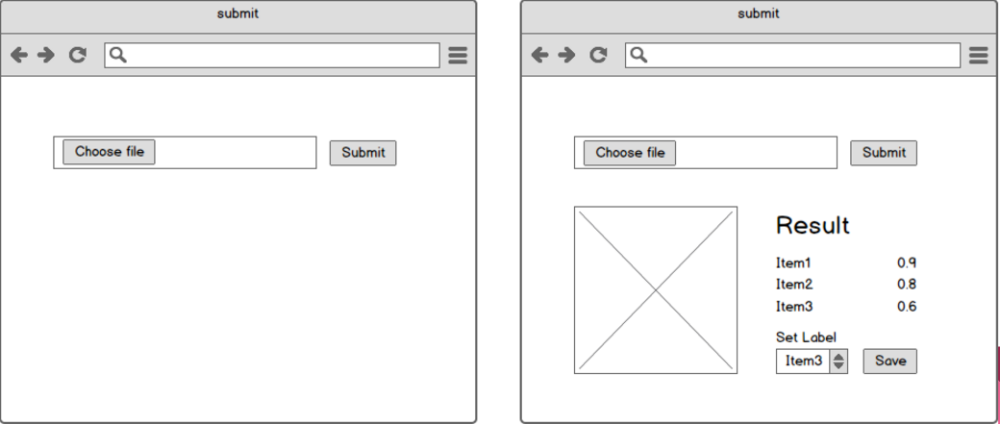
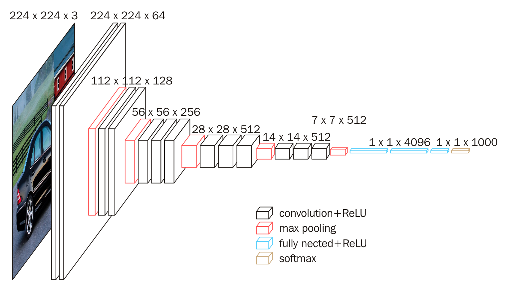
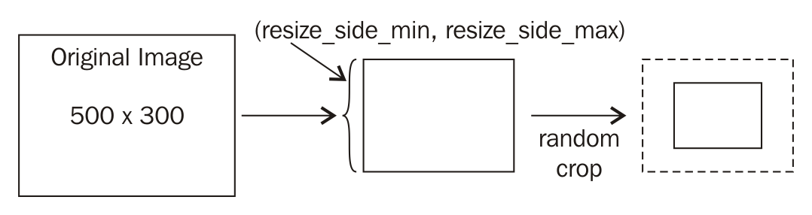

# 第九章：自适应巡航控制 - 自动化

在本章中，我们将创建一个生产系统，从训练到提供模型服务。我们的系统将能够区分 37 种不同的狗和猫品种。用户可以向我们的系统上传图像并接收结果。系统还可以从用户那里接收反馈，并每天自动进行训练以改善结果。

本章将重点讲解以下几个方面：

+   如何将迁移学习应用到新数据集

+   如何使用 TensorFlow Serving 提供生产模型服务

+   创建一个通过众包标注数据集并在用户数据上自动微调模型的系统

# 系统概览

以下图表提供了我们系统的概述：



在这个系统中，我们将使用一个初始数据集在训练服务器上训练一个卷积神经网络模型。然后，模型将在生产服务器上通过 TensorFlow Serving 提供服务。在生产服务器上，会有一个 Flask 服务器，允许用户上传新图像并在模型出现错误时修正标签。在一天的某个特定时间，训练服务器将会将所有用户标记过的图像与当前数据集合并，以自动微调模型并将其发送到生产服务器。以下是允许用户上传并接收结果的网页界面框架：



# 设置项目

在本章中，我们将微调一个已经在 `ImageNet` 数据上训练过的 VGG 模型，该数据集有 1,000 个类别。我们已经提供了一个包含预训练 VGG 模型和一些实用文件的初始项目。你可以去下载 [`github.com/mlwithtf/mlwithtf/tree/master/chapter_09`](https://github.com/mlwithtf/mlwithtf/tree/master/chapter_09) 上的代码。

在 `chapter-09` 文件夹中，你将看到以下结构：

```py
- data
--VGG16.npz
- samples_data
- production
- utils
--__init__.py
--debug_print.py
- README.md
```

有两个文件是你需要理解的：

+   `VGG16.npz` 是从 Caffe 模型导出的预训练模型。第十一章，*深入学习 - 21 个问题* 将展示如何从 Caffe 模型创建这个文件。在本章中，我们将把它作为模型的初始值。你可以从 `chapter_09` 文件夹中的 `README.md` 下载此文件。

+   `production` 是我们创建的 Flask 服务器，用作用户上传和修正模型的网页接口。

+   `debug_print.py` 包含了一些我们将在本章中使用的方法，用于理解网络结构。

+   `samples_data` 包含了一些我们将在本章中使用的猫、狗和汽车的图像。

# 加载预训练模型以加速训练

在这一节中，我们将专注于在 TensorFlow 中加载预训练模型。我们将使用由牛津大学的 K. Simonyan 和 A. Zisserman 提出的 VGG-16 模型。

VGG-16 是一个非常深的神经网络，具有许多卷积层，后面接着最大池化层和全连接层。在`ImageNet`挑战中，VGG-16 模型在 1000 类图像的验证集上的 Top-5 分类错误率为 8.1%（单尺度方法）：



首先，在`project`目录中创建一个名为`nets.py`的文件。以下代码定义了 VGG-16 模型的图：

```py
    import tensorflow as tf 
    import numpy as np 

    def inference(images): 
    with tf.name_scope("preprocess"): 
        mean = tf.constant([123.68, 116.779, 103.939],  
    dtype=tf.float32, shape=[1, 1, 1, 3], name='img_mean') 
        input_images = images - mean 
    conv1_1 = _conv2d(input_images, 3, 3, 64, 1, 1,   
    name="conv1_1") 
    conv1_2 = _conv2d(conv1_1, 3, 3, 64, 1, 1, name="conv1_2") 
    pool1 = _max_pool(conv1_2, 2, 2, 2, 2, name="pool1") 

    conv2_1 = _conv2d(pool1, 3, 3, 128, 1, 1, name="conv2_1") 
    conv2_2 = _conv2d(conv2_1, 3, 3, 128, 1, 1, name="conv2_2") 
    pool2 = _max_pool(conv2_2, 2, 2, 2, 2, name="pool2") 

    conv3_1 = _conv2d(pool2, 3, 3, 256, 1, 1, name="conv3_1") 
    conv3_2 = _conv2d(conv3_1, 3, 3, 256, 1, 1, name="conv3_2") 
    conv3_3 = _conv2d(conv3_2, 3, 3, 256, 1, 1, name="conv3_3") 
    pool3 = _max_pool(conv3_3, 2, 2, 2, 2, name="pool3") 

    conv4_1 = _conv2d(pool3, 3, 3, 512, 1, 1, name="conv4_1") 
    conv4_2 = _conv2d(conv4_1, 3, 3, 512, 1, 1, name="conv4_2") 
    conv4_3 = _conv2d(conv4_2, 3, 3, 512, 1, 1, name="conv4_3") 
    pool4 = _max_pool(conv4_3, 2, 2, 2, 2, name="pool4") 

    conv5_1 = _conv2d(pool4, 3, 3, 512, 1, 1, name="conv5_1") 
    conv5_2 = _conv2d(conv5_1, 3, 3, 512, 1, 1, name="conv5_2") 
    conv5_3 = _conv2d(conv5_2, 3, 3, 512, 1, 1, name="conv5_3") 
    pool5 = _max_pool(conv5_3, 2, 2, 2, 2, name="pool5") 

    fc6 = _fully_connected(pool5, 4096, name="fc6") 
    fc7 = _fully_connected(fc6, 4096, name="fc7") 
    fc8 = _fully_connected(fc7, 1000, name='fc8', relu=False) 
    outputs = _softmax(fc8, name="output") 
    return outputs 
```

在上述代码中，有一些事项需要注意：

+   `_conv2d`、`_max_pool`、`_fully_connected`和`_softmax`是分别定义卷积层、最大池化层、全连接层和 softmax 层的方法。我们稍后将实现这些方法。

+   在`preprocess`命名空间中，我们定义了一个常量张量`mean`，它会从输入图像中减去。这是 VGG-16 模型训练时所用的均值向量，用于将图像的均值调整为零。

+   接下来，我们使用这些参数定义卷积层、最大池化层和全连接层。

+   在`fc8`层中，我们不对输出应用 ReLU 激活，而是将输出送入`softmax`层，以计算 1000 个类别的概率。

现在，我们将在`nets.py`文件中实现`_conv2d`、`_max_pool`、`_fully_connected`和`_softmax`方法。

以下是`_conv2d`和`_max_pool`方法的代码：

```py
 def _conv2d(input_data, k_h, k_w, c_o, s_h, s_w, name, relu=True,  
 padding="SAME"): 
    c_i = input_data.get_shape()[-1].value 
    convolve = lambda i, k: tf.nn.conv2d(i, k, [1, s_h, s_w, 1],  
 padding=padding) 
    with tf.variable_scope(name) as scope: 
        weights = tf.get_variable(name="kernel", shape=[k_h, k_w,  
 c_i, c_o], 

 initializer=tf.truncated_normal_initializer(stddev=1e-1,  
 dtype=tf.float32)) 
        conv = convolve(input_data, weights) 
        biases = tf.get_variable(name="bias", shape=[c_o],  
 dtype=tf.float32, 

 initializer=tf.constant_initializer(value=0.0)) 
        output = tf.nn.bias_add(conv, biases) 
        if relu: 
            output = tf.nn.relu(output, name=scope.name) 
        return output 
 def _max_pool(input_data, k_h, k_w, s_h, s_w, name,  
 padding="SAME"): 
    return tf.nn.max_pool(input_data, ksize=[1, k_h, k_w, 1], 
                          strides=[1, s_h, s_w, 1], padding=padding,  
 name=name) 
```

如果你阅读过第四章，*猫和狗*，大部分上面的代码是自解释的，但仍有一些行需要稍作解释：

+   `k_h`和`k_w`是卷积核的高度和宽度。

+   `c_o`表示通道输出，即卷积层特征图的数量。

+   `s_h`和`s_w`是`tf.nn.conv2d`和`tf.nn.max_pool`层的步幅参数。

+   使用`tf.get_variable`代替`tf.Variable`，因为在加载预训练权重时我们还需要再次使用`get_variable`。

实现`fully_connected`层和`softmax`层非常简单：

```py
 def _fully_connected(input_data, num_output, name, relu=True): 
    with tf.variable_scope(name) as scope: 
        input_shape = input_data.get_shape() 
        if input_shape.ndims == 4: 
            dim = 1 
            for d in input_shape[1:].as_list(): 
                dim *= d 
            feed_in = tf.reshape(input_data, [-1, dim]) 
        else: 
            feed_in, dim = (input_data, input_shape[-1].value) 
        weights = tf.get_variable(name="kernel", shape=[dim,  
 num_output], 

 initializer=tf.truncated_normal_initializer(stddev=1e-1,  
 dtype=tf.float32)) 
        biases = tf.get_variable(name="bias", shape=[num_output], 
 dtype=tf.float32, 

 initializer=tf.constant_initializer(value=0.0)) 
        op = tf.nn.relu_layer if relu else tf.nn.xw_plus_b 
        output = op(feed_in, weights, biases, name=scope.name) 
        return output 
 def _softmax(input_data, name): 
    return tf.nn.softmax(input_data, name=name) 
```

使用`_fully_connected`方法时，我们首先检查输入数据的维度，以便将输入数据重塑为正确的形状。然后，使用`get_variable`方法创建`weights`和`biases`变量。最后，我们检查`relu`参数，决定是否应使用`tf.nn.relu_layer`或`tf.nn.xw_plus_b`对输出应用`relu`。`tf.nn.relu_layer`将计算`relu(matmul(x, weights) + biases)`，而`tf.nn.xw_plus_b`则只计算`matmul(x, weights) + biases`。

本节的最后一个方法用于将预训练的`caffe`权重加载到已定义的变量中：

```py
   def load_caffe_weights(path, sess, ignore_missing=False): 
    print("Load caffe weights from ", path) 
    data_dict = np.load(path).item() 
    for op_name in data_dict: 
        with tf.variable_scope(op_name, reuse=True): 
            for param_name, data in   
    data_dict[op_name].iteritems(): 
                try: 
                    var = tf.get_variable(param_name) 
                    sess.run(var.assign(data)) 
                except ValueError as e: 
                    if not ignore_missing: 
                        print(e) 
                        raise e 
```

为了理解这个方法，我们必须了解数据是如何存储在预训练模型`VGG16.npz`中的。我们创建了一段简单的代码来打印预训练模型中的所有变量。你可以将以下代码放在`nets.py`的末尾，并使用 Python `nets.py`运行：

```py
    if __name__ == "__main__": 
    path = "data/VGG16.npz" 
    data_dict = np.load(path).item() 
    for op_name in data_dict: 
        print(op_name) 
        for param_name, data in     ].iteritems(): 
            print("\t" + param_name + "\t" + str(data.shape)) 
```

这里是一些结果的代码行：

```py
conv1_1
    weights (3, 3, 3, 64)
    biases  (64,)
conv1_2
    weights (3, 3, 64, 64)
    biases  (64,)
```

如你所见，`op_name`是层的名称，我们可以通过`data_dict[op_name]`访问每层的`weights`和`biases`。

让我们来看一下`load_caffe_weights`：

+   我们使用`tf.variable_scope`和`reuse=True`参数，以便我们能获取图中定义的`weights`和`biases`的准确变量。之后，我们运行 assign 方法为每个变量设置数据。

+   如果变量名称未定义，`get_variable`方法将会抛出`ValueError`。因此，我们将使用`ignore_missing`变量来决定是否抛出错误。

# 测试预训练模型

我们已经创建了一个 VGG16 神经网络。在这一部分，我们将尝试使用预训练模型对汽车、猫和狗进行分类，以检查模型是否已成功加载。

在`nets.py`文件中，我们需要将当前的`__main__`代码替换为以下代码：

```py
    import os 
    from utils import debug_print 
    from scipy.misc import imread, imresize 

    if __name__ == "__main__": 
    SAMPLES_FOLDER = "samples_data" 
    with open('%s/imagenet-classes.txt' % SAMPLES_FOLDER, 'rb') as   
    infile: 
     class_labels = map(str.strip, infile.readlines()) 

    inputs = tf.placeholder(tf.float32, [None, 224, 224, 3],   
    name="inputs") 
    outputs = inference(inputs) 

    debug_print.print_variables(tf.global_variables()) 
    debug_print.print_variables([inputs, outputs]) 

    with tf.Session() as sess: 
     load_caffe_weights("data/VGG16.npz", sess,   
    ignore_missing=False) 

        files = os.listdir(SAMPLES_FOLDER) 
        for file_name in files: 
            if not file_name.endswith(".jpg"): 
                continue 
            print("=== Predict %s ==== " % file_name) 
            img = imread(os.path.join(SAMPLES_FOLDER, file_name),  
            mode="RGB") 
            img = imresize(img, (224, 224)) 

            prob = sess.run(outputs, feed_dict={inputs: [img]})[0] 
            preds = (np.argsort(prob)[::-1])[0:3] 

            for p in preds: 
                print class_labels[p], prob[p]
```

在前面的代码中，有几件事需要注意：

+   我们使用`debug_print`.`print_variables`辅助方法，通过打印变量名称和形状来可视化所有变量。

+   我们定义了一个名为`inputs`的占位符，形状为`[None, 224, 224, 3]`，这是 VGG16 模型所需的输入大小：

```py
      We get the model graph with outputs = inference(inputs). 
```

+   在`tf.Session()`中，我们调用`load_caffe_weights`方法并设置`ignore_missing=False`，以确保能够加载预训练模型的所有权重和偏置。

+   图片使用`scipy`中的`imread`和`imresize`方法加载和调整大小。然后，我们使用带有`feed_dict`字典的` sess.run`方法，并接收预测结果。

+   以下是我们在章节开始时提供的`samples_data`中`car.jpg`、`cat.jpg`和`dog.jpg`的预测结果：

```py
    == Predict car.jpg ==== 
    racer, race car, racing car 0.666172
    sports car, sport car 0.315847
    car wheel 0.0117961
    === Predict cat.jpg ==== 
    Persian cat 0.762223
    tabby, tabby cat 0.0647032
    lynx, catamount 0.0371023
    === Predict dog.jpg ==== 
    Border collie 0.562288
    collie 0.239735
    Appenzeller 0.0186233
```

上述结果是这些图像的准确标签。这意味着我们已经成功加载了在 TensorFlow 中的预训练 VGG16 模型。在下一部分，我们将向你展示如何在我们的数据集上微调模型。

# 为我们的数据集训练模型

在这一部分，我们将演示如何创建数据集、微调模型以及导出模型以供生产使用。

# Oxford-IIIT Pet 数据集简介

Oxford-IIIT Pet 数据集包含 37 种犬类和猫类，每个类别有 200 张图像，图像的尺度、姿势和光照变化较大。标注数据包含物种、头部位置和每张图片的像素分割。在我们的应用中，我们只使用物种名称作为模型的类别名称：


# 数据集统计

以下是狗狗和猫咪品种的数据集：

1.  狗狗品种：

| **品种** | **总数** |
| --- | --- |
| 美国斗牛犬 | 200 |
| 美国比特犬 | 200 |
| 巴吉犬 | 200 |
| 小猎兔犬 | 200 |
| 拳师犬 | 199 |
| 吉娃娃 | 200 |
| 英国可卡犬 | 196 |
| 英国猎狐犬 | 200 |
| 德国短毛指示犬 | 200 |
| 大比利犬 | 200 |
| 哈瓦那犬 | 200 |
| 日本狆犬 | 200 |
| 凯斯犬 | 199 |
| 莱昂贝格犬 | 200 |
| 迷你雪达犬 | 200 |
| 纽芬兰犬 | 196 |
| 博美犬 | 200 |
| 哈巴狗 | 200 |
| 圣伯纳犬 | 200 |
| 萨摩耶犬 | 200 |
| 苏格兰梗 | 199 |
| 柴犬 | 200 |
| 斯塔福郡斗牛梗 | 189 |
| 小麦梗 | 200 |
| 约克夏梗 | 200 |
| **总计** | **4978** |

1.  猫品种：

| **品种** | **数量** |
| --- | --- |
| 阿比西尼亚猫 | 198 |
| 孟加拉猫 | 200 |
| 伯曼猫 | 200 |
| 孟买猫 | 184 |
| 英国短毛猫 | 200 |
| 埃及猫 | 190 |
| 缅因猫 | 200 |
| 波斯猫 | 200 |
| 拉格多尔猫 | 200 |
| 俄罗斯蓝猫 | 200 |
| 暹罗猫 | 199 |
| 无毛猫 | 200 |
| **总计** | **2371** |

1.  宠物总数：

| **家族** | **数量** |
| --- | --- |
| 猫 | 2371 |
| 狗 | 4978 |
| **总计** | **7349** |

# 下载数据集

我们可以从牛津大学的网站[`www.robots.ox.ac.uk/~vgg/data/pets/`](http://www.robots.ox.ac.uk/~vgg/data/pets/)获取数据集。我们需要下载数据集和真实标签数据，分别命名为`images.tar.gz`和`annotations.tar.gz`。我们将 TAR 文件存储在`data/datasets`文件夹中，并解压所有`.tar`文件。确保`data`文件夹具有以下结构：

```py
- data
-- VGG16.npz
-- datasets
---- annotations
------ trainval.txt
---- images
------ *.jpg
```

# 准备数据

在开始训练过程之前，我们需要将数据集预处理为更简单的格式，以便在进一步的自动微调中使用。

首先，我们在`project`文件夹中创建一个名为`scripts`的 Python 包。然后，我们创建一个名为`convert_oxford_data.py`的 Python 文件，并添加以下代码：

```py
    import os 
    import tensorflow as tf 
    from tqdm import tqdm 
    from scipy.misc import imread, imsave 

    FLAGS = tf.app.flags.FLAGS 

    tf.app.flags.DEFINE_string( 
    'dataset_dir', 'data/datasets', 
    'The location of Oxford IIIT Pet Dataset which contains    
     annotations and images folders' 
    ) 

    tf.app.flags.DEFINE_string( 
    'target_dir', 'data/train_data', 
    'The location where all the images will be stored' 
    ) 

    def ensure_folder_exists(folder_path): 
    if not os.path.exists(folder_path): 
        os.mkdir(folder_path) 
    return folder_path 

    def read_image(image_path): 
    try: 
        image = imread(image_path) 
        return image 
    except IOError: 
        print(image_path, "not readable") 
    return None 
```

在这段代码中，我们使用`tf.app.flags.FLAGS`来解析参数，以便轻松定制脚本。我们还创建了两个`helper`方法来创建目录和读取图像。

接下来，我们添加以下代码，将 Oxford 数据集转换为我们喜欢的格式：

```py
 def convert_data(split_name, save_label=False): 
    if split_name not in ["trainval", "test"]: 
    raise ValueError("split_name is not recognized!") 
    target_split_path =  
    ensure_folder_exists(os.path.join(FLAGS.target_dir, split_name)) 
    output_file = open(os.path.join(FLAGS.target_dir, split_name +  
    ".txt"), "w") 

    image_folder = os.path.join(FLAGS.dataset_dir, "images") 
    anno_folder = os.path.join(FLAGS.dataset_dir, "annotations") 

    list_data = [line.strip() for line in open(anno_folder + "/" +  
    split_name + ".txt")] 

    class_name_idx_map = dict() 
    for data in tqdm(list_data, desc=split_name): 
      file_name,class_index,species,breed_id = data.split(" ") 
      file_label = int(class_index) - 1 

      class_name = "_".join(file_name.split("_")[0:-1]) 
      class_name_idx_map[class_name] = file_label 

      image_path = os.path.join(image_folder, file_name + ".jpg") 
      image = read_image(image_path) 
      if image is not None: 
      target_class_dir =  
       ensure_folder_exists(os.path.join(target_split_path,    
       class_name)) 
      target_image_path = os.path.join(target_class_dir,  
       file_name + ".jpg") 
            imsave(target_image_path, image) 
            output_file.write("%s %s\n" % (file_label,  
            target_image_path)) 

    if save_label: 
        label_file = open(os.path.join(FLAGS.target_dir,  
        "labels.txt"), "w") 
        for class_name in sorted(class_name_idx_map,  
        key=class_name_idx_map.get): 
        label_file.write("%s\n" % class_name) 

 def main(_): 
    if not FLAGS.dataset_dir: 
    raise ValueError("You must supply the dataset directory with  
    --dataset_dir") 

    ensure_folder_exists(FLAGS.target_dir) 
    convert_data("trainval", save_label=True) 
    convert_data("test") 

 if __name__ == "__main__": 
    tf.app.run() 
```

现在，我们可以使用以下代码运行`scripts`：

```py
python scripts/convert_oxford_data.py --dataset_dir data/datasets/ --target_dir data/train_data.
```

脚本读取 Oxford-IIIT 数据集的真实标签`data`，并在`data/train_data`中创建一个新的`dataset`，其结构如下：

```py
- train_data
-- trainval.txt
-- test.txt
-- labels.txt
-- trainval
---- Abyssinian
---- ...
-- test
---- Abyssinian
---- ...
```

让我们稍微讨论一下这些内容：

+   `labels.txt`包含了我们数据集中 37 个物种的列表。

+   `trainval.txt`包含了我们将在训练过程中使用的图像列表，格式为`<class_id> <image_path>`。

+   `test.txt`包含了我们将用来检验模型准确度的图像列表。`test.txt`的格式与`trainval.txt`相同。

+   `trainval`和`test`文件夹包含 37 个子文件夹，这些文件夹分别是每个类别的名称，且每个类别的所有图像都包含在相应的文件夹中。

# 设置训练和测试的输入管道

TensorFlow 允许我们创建一个可靠的输入管道，方便快速的训练。在这一部分中，我们将实现`tf.TextLineReader`来读取训练和测试文本文件。我们将使用`tf.train.batch`来并行读取和预处理图像。

首先，我们需要在`project`目录中创建一个名为`datasets.py`的新 Python 文件，并添加以下代码：

```py
    import tensorflow as tf 
    import os 

    def load_files(filenames): 
    filename_queue = tf.train.string_input_producer(filenames) 
    line_reader = tf.TextLineReader() 
    key, line = line_reader.read(filename_queue) 
    label, image_path = tf.decode_csv(records=line, 

    record_defaults=[tf.constant([], dtype=tf.int32),   
    tf.constant([], dtype=tf.string)], 
                                      field_delim=' ') 
    file_contents = tf.read_file(image_path) 
    image = tf.image.decode_jpeg(file_contents, channels=3) 

    return image, label 
```

在`load_files`方法中，我们使用`tf.TextLineReader`读取文本文件的每一行，例如`trainval.txt`和`test.txt`。`tf.TextLineReader`需要一个字符串队列来读取数据，因此我们使用`tf.train.string_input_producer`来存储文件名。之后，我们将行变量传入`tf.decode_cvs`，以便获取`label`和`filename`。图片可以通过`tf.image.decode_jpeg`轻松读取。

现在我们已经能够加载图片，我们可以继续进行，创建`image`批次和`label`批次用于`training`。

在`datasets.py`中，我们需要添加一个新方法：

```py
 def input_pipeline(dataset_dir, batch_size, num_threads=8,   
    is_training=True, shuffle=True): 
    if is_training: 
        file_names = [os.path.join(dataset_dir, "trainval.txt")] 
    else: 
        file_names = [os.path.join(dataset_dir, "test.txt")] 
    image, label = load_files(file_names) 

    image = preprocessing(image, is_training) 

    min_after_dequeue = 1000 
    capacity = min_after_dequeue + 3 * batch_size 
    if shuffle: 
     image_batch, label_batch = tf.train.shuffle_batch( 
     [image, label], batch_size, capacity,  
     min_after_dequeue, num_threads 
      ) 
    else: 
        image_batch, label_batch = tf.train.batch( 
            [image, label], batch_size, num_threads, capacity 
            ) 
    return image_batch, label_batch
```

我们首先使用`load_files`方法加载`image`和`label`。然后，我们通过一个新的预处理方法处理图片，该方法稍后将实现。最后，我们将`image`和`label`传入`tf.train.shuffle_batch`进行训练，并通过`tf.train.batch`进行测试：

```py
 def preprocessing(image, is_training=True, image_size=224,  
 resize_side_min=256, resize_side_max=312): 
    image = tf.cast(image, tf.float32) 

    if is_training: 
        resize_side = tf.random_uniform([], minval=resize_side_min,  
        maxval=resize_side_max+1, dtype=tf.int32) 
        resized_image = _aspect_preserving_resize(image,  
        resize_side) 

        distorted_image = tf.random_crop(resized_image, [image_size,  
        image_size, 3]) 

        distorted_image =  
        tf.image.random_flip_left_right(distorted_image) 

        distorted_image =  
        tf.image.random_brightness(distorted_image, max_delta=50) 

        distorted_image = tf.image.random_contrast(distorted_image,  
        lower=0.2, upper=2.0) 

        return distorted_image 
    else: 
        resized_image = _aspect_preserving_resize(image, image_size) 
        return tf.image.resize_image_with_crop_or_pad(resized_image,  
        image_size, image_size)
```

在训练和测试中，预处理有两种不同的方法。在训练中，我们需要增强数据，以从当前数据集中创建更多的训练数据。预处理方法中使用了几种技术：

+   数据集中的图片可能有不同的分辨率，但我们只需要 224x224 的图片。因此，在执行`random_crop`之前，我们需要将图像调整为合适的大小。下图描述了裁剪是如何工作的。`_aspect_preserving_resize`方法将稍后实现：



+   在裁剪图片后，我们通过`tf.image.random_flip_left_right`、`tf.image.random_brightness`和`tf.image.random_contrast`对图片进行失真处理，从而生成新的训练样本。

+   在测试过程中，我们只需要通过`_aspect_preserving_resize`和`tf.image.resize_image_with_crop_or_pad`来调整图片大小。`tf.image.resize_image_with_crop_or_pad`允许我们对图像进行中心裁剪或填充，以匹配目标的`width`和`height`。

现在，我们需要将最后两个方法添加到`datasets.py`中，如下所示：

```py
    def _smallest_size_at_least(height, width, smallest_side): 
      smallest_side = tf.convert_to_tensor(smallest_side,   
      dtype=tf.int32) 

      height = tf.to_float(height) 
      width = tf.to_float(width) 
      smallest_side = tf.to_float(smallest_side) 

      scale = tf.cond(tf.greater(height, width), 
                    lambda: smallest_side / width, 
                    lambda: smallest_side / height) 
      new_height = tf.to_int32(height * scale) 
      new_width = tf.to_int32(width * scale) 
      return new_height, new_width 

    def _aspect_preserving_resize(image, smallest_side): 
      smallest_side = tf.convert_to_tensor(smallest_side,   
      dtype=tf.int32) 
      shape = tf.shape(image) 
      height = shape[0] 
      width = shape[1] 
      new_height, new_width = _smallest_size_at_least(height, width,   
      smallest_side) 
      image = tf.expand_dims(image, 0) 
      resized_image = tf.image.resize_bilinear(image, [new_height,   
      new_width], align_corners=False) 
      resized_image = tf.squeeze(resized_image) 
      resized_image.set_shape([None, None, 3]) 
      return resized_image 
```

到目前为止，我们已经做了很多工作来准备`dataset`和`input`管道。在接下来的部分中，我们将为我们的`dataset`、`loss`、`accuracy`和`training`操作定义模型，以执行`training`过程。

# 定义模型

我们的应用程序需要对`37`类狗和猫进行分类。VGG16 模型支持 1,000 种不同的类别。在我们的应用中，我们将重用所有层直到`fc7`层，并从头开始训练最后一层。为了使模型输出`37`个类别，我们需要修改`nets.py`中的推理方法，如下所示：

```py
    def inference(images, is_training=False): 
    # 
    # All the code before fc7 are not modified. 
    # 
    fc7 = _fully_connected(fc6, 4096, name="fc7") 
    if is_training: 
        fc7 = tf.nn.dropout(fc7, keep_prob=0.5) 
    fc8 = _fully_connected(fc7, 37, name='fc8-pets', relu=False) 
    return fc8
```

+   我们向方法中添加了一个新参数`is_training`。在`fc7`层之后，如果推理是训练过程，我们将添加一个`tf.nn.dropout`层。这个 dropout 层有助于模型在面对未见过的数据时更好地正则化，并避免过拟合。

+   `fc8`层的输出数量从 1,000 改为 37。此外，`fc8`层的名称必须更改为另一个名称；在这种情况下，我们选择`fc8-pets`。如果不更改`fc8`层的名称，`load_caffe_weights`仍然会找到新层并分配原始权重，而这些权重的大小与我们新的`fc8`层不同。

+   推理方法最后的`softmax`层也被移除了，因为我们稍后将使用的`loss`函数只需要未经归一化的输出。

# 定义训练操作

我们将在一个新的 Python 文件`models.py`中定义所有操作。首先，让我们创建一些操作来计算`loss`和`accuracy`：

```py
 def compute_loss(logits, labels): 
   labels = tf.squeeze(tf.cast(labels, tf.int32)) 

   cross_entropy =   
   tf.nn.sparse_softmax_cross_entropy_with_logits(logits=logits,    
   labels=labels) 
   cross_entropy_mean = tf.reduce_mean(cross_entropy) 
   tf.add_to_collection('losses', cross_entropy_mean) 

   return tf.add_n(tf.get_collection('losses'),    
   name='total_loss') 

 def compute_accuracy(logits, labels): 
   labels = tf.squeeze(tf.cast(labels, tf.int32)) 
   batch_predictions = tf.cast(tf.argmax(logits, 1), tf.int32) 
   predicted_correctly = tf.equal(batch_predictions, labels) 
   accuracy = tf.reduce_mean(tf.cast(predicted_correctly,   
   tf.float32)) 
   return accuracy
```

在这些方法中，`logits`是模型的输出，`labels`是来自`dataset`的真实数据。在`compute_loss`方法中，我们使用`tf.nn.sparse_softmax_cross_entropy_with_logits`，因此我们不需要通过`softmax`方法对`logits`进行归一化。此外，我们也不需要将`labels`转换为一个热编码向量。在`compute_accuracy`方法中，我们通过`tf.argmax`将`logits`中的最大值与`labels`进行比较，从而得到`accuracy`。

接下来，我们将定义`learning_rate`和`optimizer`的操作：

```py
 def get_learning_rate(global_step, initial_value, decay_steps,          
   decay_rate): 
   learning_rate = tf.train.exponential_decay(initial_value,   
   global_step, decay_steps, decay_rate, staircase=True) 
   return learning_rate 

 def train(total_loss, learning_rate, global_step, train_vars): 

   optimizer = tf.train.AdamOptimizer(learning_rate) 

   train_variables = train_vars.split(",") 

   grads = optimizer.compute_gradients( 
       total_loss, 
       [v for v in tf.trainable_variables() if v.name in   
       train_variables] 
       ) 
   train_op = optimizer.apply_gradients(grads,   
   global_step=global_step) 
   return train_op 
```

在`train`方法中，我们配置了`optimizer`仅对`train_vars`字符串中定义的某些变量进行`compute`和应用`gradients`。这样，我们只更新最后一层`fc8`的`weights`和`biases`，而冻结其他层。`train_vars`是一个包含通过逗号分隔的变量列表的字符串，例如`models/fc8-pets/weights:0,models/fc8-pets/biases:0`。

# 执行训练过程

现在我们已经准备好训练模型了。让我们在`scripts`文件夹中创建一个名为`train.py`的 Python 文件。首先，我们需要为`training`过程定义一些参数：

```py
 import tensorflow as tf 
 import os 
 from datetime import datetime 
 from tqdm import tqdm 

 import nets, models, datasets 

 # Dataset 
 dataset_dir = "data/train_data" 
 batch_size = 64 
 image_size = 224 

 # Learning rate 
 initial_learning_rate = 0.001 
 decay_steps = 250 
 decay_rate = 0.9 

 # Validation 
 output_steps = 10  # Number of steps to print output 
 eval_steps = 20  # Number of steps to perform evaluations 

 # Training 
 max_steps = 3000  # Number of steps to perform training 
 save_steps = 200  # Number of steps to perform saving checkpoints 
 num_tests = 5  # Number of times to test for test accuracy 
 max_checkpoints_to_keep = 3 
 save_dir = "data/checkpoints" 
 train_vars = 'models/fc8-pets/weights:0,models/fc8-pets/biases:0' 

 # Export 
 export_dir = "/tmp/export/" 
 export_name = "pet-model" 
 export_version = 2 
```

这些变量是不言自明的。接下来，我们需要定义一些用于`training`的操作，如下所示：

```py
 images, labels = datasets.input_pipeline(dataset_dir, batch_size,   
 is_training=True) 
 test_images, test_labels = datasets.input_pipeline(dataset_dir,  
 batch_size, is_training=False) 

 with tf.variable_scope("models") as scope: 
    logits = nets.inference(images, is_training=True) 
    scope.reuse_variables() 
    test_logits = nets.inference(test_images, is_training=False) 

 total_loss = models.compute_loss(logits, labels) 
 train_accuracy = models.compute_accuracy(logits, labels) 
 test_accuracy = models.compute_accuracy(test_logits, test_labels) 

 global_step = tf.Variable(0, trainable=False) 
 learning_rate = models.get_learning_rate(global_step,  
 initial_learning_rate, decay_steps, decay_rate) 
 train_op = models.train(total_loss, learning_rate, global_step,  
 train_vars) 

 saver = tf.train.Saver(max_to_keep=max_checkpoints_to_keep) 
 checkpoints_dir = os.path.join(save_dir,  
 datetime.now().strftime("%Y-%m-%d_%H-%M-%S")) 
 if not os.path.exists(save_dir): 
    os.mkdir(save_dir) 
 if not os.path.exists(checkpoints_dir): 
    os.mkdir(checkpoints_dir) 
```

这些操作是通过调用我们在`datasets.py`、`nets.py`和`models.py`中定义的方法创建的。在这段代码中，我们为训练创建了一个输入管道，并为测试创建了另一个管道。之后，我们创建了一个新的`variable_scope`，命名为`models`，并通过`nets.inference`方法创建了`logits`和`test_logits`。你必须确保添加了`scope.reuse_variables`，因为我们希望在测试中重用训练中的`weights`和`biases`。最后，我们创建了一个`saver`和一些目录，以便每隔`save_steps`保存检查点。

`training`过程的最后一部分是`training`循环：

```py
 with tf.Session() as sess: 
    sess.run(tf.global_variables_initializer()) 
    coords = tf.train.Coordinator() 
    threads = tf.train.start_queue_runners(sess=sess, coord=coords) 

    with tf.variable_scope("models"): 
       nets.load_caffe_weights("data/VGG16.npz", sess,  
       ignore_missing=True) 

    last_saved_test_accuracy = 0 
    for i in tqdm(range(max_steps), desc="training"): 
                  _, loss_value, lr_value = sess.run([train_op,    
                  total_loss,  learning_rate]) 

      if (i + 1) % output_steps == 0: 
          print("Steps {}: Loss = {:.5f} Learning Rate =  
          {}".format(i + 1, loss_value, lr_value)) 

      if (i + 1) % eval_steps == 0: 
          test_acc, train_acc, loss_value =  
          sess.run([test_accuracy, train_accuracy, total_loss]) 
          print("Test accuracy {} Train accuracy {} : Loss =  
          {:.5f}".format(test_acc, train_acc, loss_value)) 

      if (i + 1) % save_steps == 0 or i == max_steps - 1: 
          test_acc = 0 
          for i in range(num_tests): 
              test_acc += sess.run(test_accuracy) 
          test_acc /= num_tests 
      if test_acc > last_saved_test_accuracy: 
            print("Save steps: Test Accuracy {} is higher than  
            {}".format(test_acc, last_saved_test_accuracy)) 
             last_saved_test_accuracy = test_acc 
             saved_file = saver.save(sess, 

     os.path.join(checkpoints_dir, 'model.ckpt'), 
                  global_step=global_step) 
          print("Save steps: Save to file %s " % saved_file) 
      else: 
          print("Save steps: Test Accuracy {} is not higher  
                than {}".format(test_acc, last_saved_test_accuracy)) 

    models.export_model(checkpoints_dir, export_dir, export_name,  
    export_version) 

    coords.request_stop() 
    coords.join(threads) 
```

`training`循环很容易理解。首先，我们加载预训练的`VGG16`模型，并将`ignore_missing`设置为`True`，因为我们之前更改了`fc8`层的名称。然后，我们循环`max_steps`步，在每`output_steps`步时打印`loss`，每`eval_steps`步时打印`test_accuracy`。每`save_steps`步，我们检查并保存检查点，如果当前的测试准确率高于之前的准确率。我们仍然需要创建`models.export_model`，以便在`training`之后导出模型供服务使用。不过，在继续之前，你可能想要先检查一下`training`过程是否正常工作。让我们注释掉以下这一行：

```py
    models.export_model(checkpoints_dir, export_dir, export_name,  
    export_version) 
```

然后，使用以下命令运行`training`脚本：

```py
python scripts/train.py
```

这是控制台中的一些输出。首先，我们的脚本加载了预训练的模型。然后，它会输出`loss`：

```py
('Load caffe weights from ', 'data/VGG16.npz')
training:   0%|▏                | 9/3000 [00:05<24:59,  1.99it/s]
Steps 10: Loss = 31.10747 Learning Rate = 0.0010000000475
training:   1%|▎                | 19/3000 [00:09<19:19,  2.57it/s]
Steps 20: Loss = 34.43741 Learning Rate = 0.0010000000475
Test accuracy 0.296875 Train accuracy 0.0 : Loss = 31.28600
training:   1%|▍                | 29/3000 [00:14<20:01,  2.47it/s]
Steps 30: Loss = 15.81103 Learning Rate = 0.0010000000475
training:   1%|▌                | 39/3000 [00:18<19:42,  2.50it/s]
Steps 40: Loss = 14.07709 Learning Rate = 0.0010000000475
Test accuracy 0.53125 Train accuracy 0.03125 : Loss = 20.65380  
```

现在，让我们停止`training`并取消注释`export_model`方法。我们需要`models.export_model`方法将最新的模型（具有最高测试准确率）导出到名为`export_name`、版本为`export_version`的`export_dir`文件夹中。

# 为生产环境导出模型

```py
 def export_model(checkpoint_dir, export_dir, export_name,  
 export_version): 
    graph = tf.Graph() 
    with graph.as_default(): 
        image = tf.placeholder(tf.float32, shape=[None, None, 3]) 
        processed_image = datasets.preprocessing(image,  
        is_training=False) 
        with tf.variable_scope("models"): 
         logits = nets.inference(images=processed_image,  
          is_training=False) 

        model_checkpoint_path =  
        get_model_path_from_ckpt(checkpoint_dir) 
        saver = tf.train.Saver() 

        config = tf.ConfigProto() 
        config.gpu_options.allow_growth = True 
        config.gpu_options.per_process_gpu_memory_fraction = 0.7 

        with tf.Session(graph=graph) as sess: 
            saver.restore(sess, model_checkpoint_path) 
            export_path = os.path.join(export_dir, export_name,  
            str(export_version)) 
            export_saved_model(sess, export_path, image, logits) 
            print("Exported model at", export_path)
```

在`export_model`方法中，我们需要创建一个新的图表来在生产中运行。在生产中，我们不需要像`training`那样的所有变量，也不需要输入管道。然而，我们需要使用`export_saved_model`方法导出模型，具体如下：

```py
 def export_saved_model(sess, export_path, input_tensor,  
 output_tensor): 
    from tensorflow.python.saved_model import builder as  
 saved_model_builder 
    from tensorflow.python.saved_model import signature_constants 
    from tensorflow.python.saved_model import signature_def_utils 
    from tensorflow.python.saved_model import tag_constants 
    from tensorflow.python.saved_model import utils 
    builder = saved_model_builder.SavedModelBuilder(export_path) 

    prediction_signature = signature_def_utils.build_signature_def( 
        inputs={'images': utils.build_tensor_info(input_tensor)}, 
        outputs={ 
            'scores': utils.build_tensor_info(output_tensor) 
        }, 
        method_name=signature_constants.PREDICT_METHOD_NAME) 

    legacy_init_op = tf.group( 
        tf.tables_initializer(), name='legacy_init_op') 
    builder.add_meta_graph_and_variables( 
        sess, [tag_constants.SERVING], 
        signature_def_map={ 
          'predict_images': 
           prediction_signature, 
        }, 
        legacy_init_op=legacy_init_op) 

    builder.save() 
```

通过这种方法，我们可以为生产环境创建一个模型的元图。我们将在后面的部分介绍如何在生产中提供模型服务。现在，让我们运行`scripts`，在 3000 步后自动训练并导出：

```py
python scripts/train.py
```

在我们的系统中，使用 Core i7-4790 CPU 和一块 TITAN-X GPU，训练过程需要 20 分钟才能完成。以下是我们控制台中的最后几条输出：

```py
Steps 3000: Loss = 0.59160 Learning Rate = 0.000313810509397
Test accuracy 0.659375 Train accuracy 0.853125: Loss = 0.25782
Save steps: Test Accuracy 0.859375 is not higher than 0.921875
training: 100%|██████████████████| 3000/3000 [23:40<00:00,  1.27it/s]
    I tensorflow/core/common_runtime/gpu/gpu_device.cc:975] Creating TensorFlow device (/gpu:0) -> (device: 0, name: GeForce GTX TITAN X, pci bus id: 0000:01:00.0)
    ('Exported model at', '/home/ubuntu/models/pet-model/1')
```

很棒！我们有一个具有 92.18%测试准确率的模型。我们还得到了一个导出的模型文件（.pb 格式）。`export_dir`文件夹将具有以下结构：

```py
- /home/ubuntu/models/
-- pet_model
---- 1
------ saved_model.pb
------ variables
```

# 在生产环境中提供模型服务

在生产中，我们需要创建一个端点，用户可以通过该端点发送图像并接收结果。在 TensorFlow 中，我们可以轻松地使用 TensorFlow Serving 来提供我们的模型服务。在本节中，我们将安装 TensorFlow Serving，并创建一个 Flask 应用，允许用户通过 Web 界面上传他们的图像。

# 设置 TensorFlow Serving

在你的生产服务器中，你需要安装 TensorFlow Serving 及其前提条件。你可以访问 TensorFlow Serving 的官方网站：[`tensorflow.github.io/serving/setup`](https://tensorflow.github.io/serving/setup)。接下来，我们将使用 TensorFlow Serving 提供的标准 TensorFlow 模型服务器来提供模型服务。首先，我们需要使用以下命令构建`tensorflow_model_server`：

```py
bazel build   
//tensorflow_serving/model_servers:tensorflow_model_server
```

将训练服务器中的`/home/ubuntu/models/pet_model`文件夹中的所有文件复制到生产服务器中。在我们的设置中，我们选择`/home/ubuntu/productions`作为存放所有生产模型的文件夹。`productions`文件夹将具有以下结构：

```py
- /home/ubuntu/productions/
-- 1
---- saved_model.pb
---- variables
```

我们将使用`tmux`来保持模型服务器的运行。让我们通过以下命令安装`tmux`：

```py
sudo apt-get install tmux
```

使用以下命令运行`tmux`会话：

```py
tmux new -s serving
```

在`tmux`会话中，让我们切换到`tensorflow_serving`目录并运行以下命令：

```py
    bazel-bin/tensorflow_serving/model_servers/tensorflow_model_server --port=9000 --model_name=pet-model --model_base_path=/home/ubuntu/productions
```

控制台的输出应如下所示：

```py
    2017-05-29 13:44:32.203153: I external/org_tensorflow/tensorflow/cc/saved_model/loader.cc:274] Loading SavedModel: success. Took 537318 microseconds.
    2017-05-29 13:44:32.203243: I tensorflow_serving/core/loader_harness.cc:86] Successfully loaded servable version {name: pet-model version: 1}
    2017-05-29 13:44:32.205543: I tensorflow_serving/model_servers/main.cc:298] Running ModelServer at 0.0.0.0:9000 ...  
```

如你所见，模型在主机`0.0.0.0`和端口`9000`上运行。在下一节中，我们将创建一个简单的 Python 客户端，通过 gRPC 将图像发送到该服务器。

你还应该注意，当前在生产服务器上使用的是 CPU 进行服务。使用 GPU 构建 TensorFlow Serving 超出了本章的范围。如果你更倾向于使用 GPU 进行服务，可以阅读附录 A*，高级安装*，它解释了如何构建支持 GPU 的 TensorFlow 和 TensorFlow Serving。

# 运行和测试模型

在项目仓库中，我们已经提供了一个名为`production`的包。在这个包中，我们需要将`labels.txt`文件复制到我们的`dataset`中，创建一个新的 Python 文件`client.py`，并添加以下代码：

```py
    import tensorflow as tf 
    import numpy as np 
    from tensorflow_serving.apis import prediction_service_pb2,     
    predict_pb2 
    from grpc.beta import implementations 
    from scipy.misc import imread 
    from datetime import datetime 

    class Output: 
    def __init__(self, score, label): 
        self.score = score 
        self.label = label 

    def __repr__(self): 
        return "Label: %s Score: %.2f" % (self.label, self.score) 

    def softmax(x): 
    return np.exp(x) / np.sum(np.exp(x), axis=0) 

    def process_image(path, label_data, top_k=3): 
    start_time = datetime.now() 
    img = imread(path) 

    host, port = "0.0.0.0:9000".split(":") 
    channel = implementations.insecure_channel(host, int(port)) 
    stub =  
    prediction_service_pb2.beta_create_PredictionService_stub(channel) 

    request = predict_pb2.PredictRequest() 
    request.model_spec.name = "pet-model" 
    request.model_spec.signature_name = "predict_images" 

    request.inputs["images"].CopyFrom( 
        tf.contrib.util.make_tensor_proto( 
            img.astype(dtype=float), 
            shape=img.shape, dtype=tf.float32 
        ) 
    ) 

    result = stub.Predict(request, 20.) 
    scores =    
    tf.contrib.util.make_ndarray(result.outputs["scores"])[0] 
    probs = softmax(scores) 
    index = sorted(range(len(probs)), key=lambda x: probs[x],  
    reverse=True) 

    outputs = [] 
    for i in range(top_k): 
        outputs.append(Output(score=float(probs[index[i]]),  
        label=label_data[index[i]])) 

    print(outputs) 
    print("total time", (datetime.now() -   
    start_time).total_seconds()) 
    return outputs 

    if __name__ == "__main__": 
    label_data = [line.strip() for line in   
    open("production/labels.txt", 'r')] 
    process_image("samples_data/dog.jpg", label_data) 
    process_image("samples_data/cat.jpg", label_data) 
```

在此代码中，我们创建了一个`process_image`方法，该方法将从图片路径读取图像，并使用一些 TensorFlow 方法创建张量，然后通过 gRPC 将其发送到模型服务器。我们还创建了一个`Output`类，以便我们可以轻松地将其返回给`caller`方法。在方法结束时，我们打印输出和总时间，以便我们可以更轻松地调试。我们可以运行此 Python 文件，看看`process_image`是否有效：

```py
python production/client.py
```

输出应如下所示：

```py
    [Label: saint_bernard Score: 0.78, Label: american_bulldog Score: 0.21, Label: staffordshire_bull_terrier Score: 0.00]
    ('total time', 14.943942)
    [Label: Maine_Coon Score: 1.00, Label: Ragdoll Score: 0.00, Label: Bengal Score: 0.00]
    ('total time', 14.918235)
```

我们得到了正确的结果。然而，每张图片的处理时间几乎是 15 秒。原因是我们正在使用 CPU 模式的 TensorFlow Serving。如前所述，你可以在附录 A 中构建支持 GPU 的 TensorFlow Serving，*高级安装*。如果你跟随那个教程，你将得到以下结果：

```py
    [Label: saint_bernard Score: 0.78, Label: american_bulldog Score: 0.21, Label: staffordshire_bull_terrier Score: 0.00]
    ('total time', 0.493618)
    [Label: Maine_Coon Score: 1.00, Label: Ragdoll Score: 0.00, Label: Bengal Score: 0.00]
    ('total time', 0.023753)
```

第一次调用时的处理时间是 493 毫秒。然而，之后的调用时间将只有大约 23 毫秒，比 CPU 版本快得多。

# 设计 Web 服务器

在本节中，我们将设置一个 Flask 服务器，允许用户上传图片，并在模型出错时设置正确的标签。我们已经在生产包中提供了所需的代码。实现带有数据库支持的 Flask 服务器超出了本章的范围。在本节中，我们将描述 Flask 的所有要点，以便你能更好地跟随和理解。

允许用户上传和修正标签的主要流程可以通过以下线框图进行描述。

该流程通过以下路由实现：

| **路由** | **方法** | **描述** |
| --- | --- | --- |
| `/` | GET | 此路由返回一个网页表单，供用户上传图片。 |
| `/upload_image` | POST | 这个路由从 POST 数据中获取图像，将其保存到上传目录，并调用 `client.py` 中的 `process_image` 来识别图像并将结果保存到数据库。 |
| `/results<result_id>` | GET | 这个路由返回数据库中对应行的结果。 |
| `/results<result_id>` | POST | 这个路由将用户的标签保存到数据库，以便我们可以稍后微调模型。 |
| `/user-labels` | GET | 这个路由返回所有用户标注图像的列表。在微调过程中，我们会调用此路由获取标注图像的列表。 |
| `/model` | POST | 这个路由允许从训练服务器启动微调过程，提供一个新的训练模型。此路由接收压缩模型的链接、版本号、检查点名称以及模型名称。 |
| `/model` | GET | 这个路由返回数据库中最新的模型。微调过程将调用此路由来获取最新的模型并从中进行微调。 |

我们应该在 `tmux` 会话中运行此服务器，使用以下命令：

```py
tmux new -s "flask"
python production/server.py
```

# 测试系统

现在，我们可以通过 `http://0.0.0.0:5000` 访问服务器。

首先，你会看到一个表单，用来选择并提交一张图像。

网站会被重定向到 `/results` 页面，显示对应的图像及其结果。用户标签字段为空。页面底部也有一个简短的表单，你可以提交模型的更正标签。

# 在生产环境中进行自动微调

在运行系统一段时间后，我们将拥有一些用户标注的图像。我们将创建一个微调过程，使其每天自动运行，并使用新数据微调最新的模型。

让我们在 `scripts` 文件夹中创建一个名为 `finetune.py` 的文件。

# 加载用户标注的数据

首先，我们将添加代码以从生产服务器下载所有用户标注的图像：

```py
    import tensorflow as tf 
    import os 
    import json 
    import random 
    import requests 
    import shutil 
    from scipy.misc import imread, imsave 
    from datetime import datetime 
    from tqdm import tqdm 

    import nets, models, datasets 

    def ensure_folder_exists(folder_path): 
    if not os.path.exists(folder_path): 
        os.mkdir(folder_path) 
    return folder_path 

    def download_user_data(url, user_dir, train_ratio=0.8): 
    response = requests.get("%s/user-labels" % url) 
    data = json.loads(response.text) 

    if not os.path.exists(user_dir): 
        os.mkdir(user_dir) 
    user_dir = ensure_folder_exists(user_dir) 
    train_folder = ensure_folder_exists(os.path.join(user_dir,   
    "trainval")) 
    test_folder = ensure_folder_exists(os.path.join(user_dir,   
    "test")) 

    train_file = open(os.path.join(user_dir, 'trainval.txt'), 'w') 
    test_file = open(os.path.join(user_dir, 'test.txt'), 'w') 

    for image in data: 
        is_train = random.random() < train_ratio 
        image_url = image["url"] 
        file_name = image_url.split("/")[-1] 
        label = image["label"] 
        name = image["name"] 

        if is_train: 
          target_folder =  
          ensure_folder_exists(os.path.join(train_folder, name)) 
        else: 
          target_folder =   
          ensure_folder_exists(os.path.join(test_folder, name)) 

        target_file = os.path.join(target_folder, file_name) +   
        ".jpg" 

        if not os.path.exists(target_file): 
            response = requests.get("%s%s" % (url, image_url)) 
            temp_file_path = "/tmp/%s" % file_name 
            with open(temp_file_path, 'wb') as f: 
                for chunk in response: 
                    f.write(chunk) 

            image = imread(temp_file_path) 
            imsave(target_file, image) 
            os.remove(temp_file_path) 
            print("Save file: %s" % target_file) 

        label_path = "%s %s\n" % (label, target_file) 
        if is_train: 
            train_file.write(label_path) 
        else: 
            test_file.write(label_path) 
```

在 `download_user_data` 中，我们调用 `/user-labels` 端点获取用户标注图像的列表。JSON 的格式如下：

```py
   [ 
    { 
     "id": 1,  
     "label": 0,  
     "name": "Abyssinian",  
     "url": "/uploads/2017-05-23_14-56-45_Abyssinian-cat.jpeg" 
    },  
    { 
     "id": 2,  
      "label": 32,  
      "name": "Siamese",  
     "url": "/uploads/2017-05-23_14-57-33_fat-Siamese-cat.jpeg" 
    } 
   ] 
```

在这个 JSON 中，`label` 是用户选择的标签，URL 是用来下载图像的链接。对于每一张图像，我们会将其下载到 `tmp` 文件夹，并使用 `scipy` 中的 `imread` 和 `imsave` 来确保图像是 JPEG 格式。我们还会创建 `trainval.txt` 和 `test.txt` 文件，和训练数据集中的文件一样。

# 对模型进行微调

为了微调模型，我们需要知道哪个是最新的模型及其对应的检查点，以恢复 `weights` 和 `biases`。因此，我们调用 `/model` 端点来获取检查点名称和版本号：

```py
    def get_latest_model(url): 
    response = requests.get("%s/model" % url) 
    data = json.loads(response.text) 
    print(data) 
    return data["ckpt_name"], int(data["version"]) 
```

响应的 JSON 应该是这样的：

```py
    { 
     "ckpt_name": "2017-05-26_02-12-49",  
     "id": 10,  
     "link": "http://1.53.110.161:8181/pet-model/8.zip",  
     "name": "pet-model",  
     "version": 8 
    } 
```

现在，我们将实现微调模型的代码。让我们从一些参数开始：

```py
    # Server info 
    URL = "http://localhost:5000" 
    dest_api = URL + "/model" 

    # Server Endpoints 
    source_api = "http://1.53.110.161:8181" 

    # Dataset 
    dataset_dir = "data/train_data" 
    user_dir = "data/user_data" 
    batch_size = 64 
    image_size = 224 

    # Learning rate 
    initial_learning_rate = 0.0001 
    decay_steps = 250 
    decay_rate = 0.9 

    # Validation 
    output_steps = 10  # Number of steps to print output 
    eval_steps = 20  # Number of steps to perform evaluations 

    # Training 
    max_steps = 3000  # Number of steps to perform training 
    save_steps = 200  # Number of steps to perform saving    
    checkpoints 
    num_tests = 5  # Number of times to test for test accuracy 
    max_checkpoints_to_keep = 1 
    save_dir = "data/checkpoints" 
    train_vars = 'models/fc8-pets/weights:0,models/fc8- 
    pets/biases:0' 

    # Get the latest model 
    last_checkpoint_name, last_version = get_latest_model(URL) 
    last_checkpoint_dir = os.path.join(save_dir,   
    last_checkpoint_name) 

    # Export 
    export_dir = "/home/ubuntu/models/" 
    export_name = "pet-model" 
    export_version = last_version + 1 
```

然后，我们将实现微调循环。在以下代码中，我们调用 `download_user_data` 来下载所有用户标注的图像，并将 `user_dir` 传递给 `input_pipeline`，使其能够加载新图像：

```py
    # Download user-labels data 
    download_user_data(URL, user_dir) 

    images, labels = datasets.input_pipeline(dataset_dir,     
    batch_size, is_training=True, user_dir=user_dir) 
    test_images, test_labels =    
    datasets.input_pipeline(dataset_dir, batch_size,    
    is_training=False, user_dir=user_dir) 

     with tf.variable_scope("models") as scope: 
     logits = nets.inference(images, is_training=True) 
     scope.reuse_variables() 
     test_logits = nets.inference(test_images, is_training=False) 

    total_loss = models.compute_loss(logits, labels) 
    train_accuracy = models.compute_accuracy(logits, labels) 
    test_accuracy = models.compute_accuracy(test_logits,  
    test_labels) 

    global_step = tf.Variable(0, trainable=False) 
    learning_rate = models.get_learning_rate(global_step,      
    initial_learning_rate, decay_steps, decay_rate) 
    train_op = models.train(total_loss, learning_rate,  
    global_step, train_vars) 

    saver = tf.train.Saver(max_to_keep=max_checkpoints_to_keep) 
    checkpoint_name = datetime.now().strftime("%Y-%m-%d_%H-%M-%S") 
    checkpoints_dir = os.path.join(save_dir, checkpoint_name) 
    if not os.path.exists(save_dir): 
      os.mkdir(save_dir) 
    if not os.path.exists(checkpoints_dir): 
      os.mkdir(checkpoints_dir) 

    with tf.Session() as sess: 
      sess.run(tf.global_variables_initializer()) 
      coords = tf.train.Coordinator() 
      threads = tf.train.start_queue_runners(sess=sess,   
      coord=coords) 

    saver.restore(sess,  
    models.get_model_path_from_ckpt(last_checkpoint_dir)) 
    sess.run(global_step.assign(0)) 

    last_saved_test_accuracy = 0 
    for i in range(num_tests): 
        last_saved_test_accuracy += sess.run(test_accuracy) 
    last_saved_test_accuracy /= num_tests 
    should_export = False 
    print("Last model test accuracy    
    {}".format(last_saved_test_accuracy)) 
    for i in tqdm(range(max_steps), desc="training"): 
        _, loss_value, lr_value = sess.run([train_op, total_loss,   
        learning_rate]) 

     if (i + 1) % output_steps == 0: 
       print("Steps {}: Loss = {:.5f} Learning Rate =   
       {}".format(i + 1, loss_value, lr_value)) 

        if (i + 1) % eval_steps == 0: 
          test_acc, train_acc, loss_value =  
          sess.run([test_accuracy, train_accuracy, total_loss]) 
            print("Test accuracy {} Train accuracy {} : Loss =  
            {:.5f}".format(test_acc, train_acc, loss_value)) 

        if (i + 1) % save_steps == 0 or i == max_steps - 1: 
          test_acc = 0 
          for i in range(num_tests): 
            test_acc += sess.run(test_accuracy) 
            test_acc /= num_tests 

        if test_acc > last_saved_test_accuracy: 
          print("Save steps: Test Accuracy {} is higher than  
          {}".format(test_acc, last_saved_test_accuracy)) 
          last_saved_test_accuracy = test_acc 
          saved_file = saver.save(sess, 

        os.path.join(checkpoints_dir, 'model.ckpt'), 
                                        global_step=global_step) 
                should_export = True 
                print("Save steps: Save to file %s " % saved_file) 
            else: 
                print("Save steps: Test Accuracy {} is not higher  
       than {}".format(test_acc, last_saved_test_accuracy)) 

    if should_export: 
        print("Export model with accuracy ",  
        last_saved_test_accuracy) 
        models.export_model(checkpoints_dir, export_dir,   
        export_name, export_version) 
        archive_and_send_file(source_api, dest_api,  
        checkpoint_name, export_dir, export_name, export_version) 
      coords.request_stop() 
      coords.join(threads)
```

其他部分与训练循环非常相似。但是，我们不是从`caffe`模型中加载权重，而是使用最新模型的检查点，并运行测试多次以获取其测试准确性。

在微调循环的末尾，我们需要一个名为`archive_and_send_file`的新方法来从`exported`模型创建归档，并将链接发送到生产服务器：

```py
    def make_archive(dir_path): 
    return shutil.make_archive(dir_path, 'zip', dir_path) 

    def archive_and_send_file(source_api, dest_api, ckpt_name,    
    export_dir, export_name, export_version): 
    model_dir = os.path.join(export_dir, export_name,    
    str(export_version)) 
    file_path = make_archive(model_dir) 
    print("Zip model: ", file_path) 

    data = { 
        "link": "{}/{}/{}".format(source_api, export_name,  
     str(export_version) + ".zip"), 
        "ckpt_name": ckpt_name, 
        "version": export_version, 
        "name": export_name, 
    } 
     r = requests.post(dest_api, data=data) 
    print("send_file", r.text) 
```

您应该注意，我们创建了一个带有`source_api`参数的链接，这是指向训练服务器的链接，`http://1.53.110.161:8181`。我们将设置一个简单的 Apache 服务器来支持此功能。但是，在现实中，我们建议您将归档模型上传到云存储，如 Amazon S3。现在，我们将展示使用 Apache 的最简单方法。

我们需要使用以下命令安装 Apache：

```py
sudo apt-get install apache2
```

现在，在`/etc/apache2/ports.conf`中，第 6 行，我们需要添加此代码以使`apache2`监听端口`8181`：

```py
    Listen 8181 
```

然后，在`/etc/apache2/sites-available/000-default.conf`的开头添加以下代码以支持从`/home/ubuntu/models`目录下载：

```py
    <VirtualHost *:8181> 
      DocumentRoot "/home/ubuntu/models" 
      <Directory /> 
        Require all granted 
      </Directory> 
    </VirtualHost> 
```

最后，我们需要重新启动`apache2`服务器：

```py
sudo service apache2 restart
```

到目前为止，我们已经设置了所有执行微调所需的代码。在第一次运行微调之前，我们需要向`/model`端点发送`POST`请求，以获取关于我们第一个模型的信息，因为我们已经将模型复制到生产服务器。

在`project`代码库中，让我们运行`finetune`脚本：

```py
python scripts/finetune.py
```

控制台中的最后几行将如下所示：

```py
    Save steps: Test Accuracy 0.84 is higher than 0.916875
    Save steps: Save to file data/checkpoints/2017-05-29_18-46-43/model.ckpt-2000
    ('Export model with accuracy ', 0.916875000000004)
    2017-05-29 18:47:31.642729: I tensorflow/core/common_runtime/gpu/gpu_device.cc:977] Creating TensorFlow device (/gpu:0) -> (device: 0, name: GeForce GTX TITAN X, pci bus id: 0000:01:00.0)
    ('Exported model at', '/home/ubuntu/models/pet-model/2')
    ('Zip model: ', '/home/ubuntu/models/pet-model/2.zip')
    ('send_file', u'{\n  "ckpt_name": "2017-05-29_18-46-43", \n  "id": 2, \n  "link": "http://1.53.110.161:8181/pet-model/2.zip", \n  "name": "pet-model", \n  "version": 2\n}\n')
```

正如您所见，新模型的测试准确率为 91%。该模型也被导出并存档到`/home/ubuntu/models/pet-model/2.zip`。代码还在调用`/model`端点将链接发布到生产服务器。在生产服务器的 Flask 应用日志中，我们将得到以下结果：

```py
('Start downloading', u'http://1.53.110.161:8181/pet-model/2.zip')
('Downloaded file at', u'/tmp/2.zip')
('Extracted at', u'/home/ubuntu/productions/2')
127.0.0.1 - - [29/May/2017 18:49:05] "POST /model HTTP/1.1" 200 -
```

这意味着我们的 Flask 应用程序已从训练服务器下载了`2.zip`文件，并将其内容提取到`/home/ubuntu/productions/2`。在 TensorFlow Serving 的 tmux 会话中，您还将获得以下结果：

```py
    2017-05-29 18:49:06.234808: I tensorflow_serving/core/loader_harness.cc:86] Successfully loaded servable version {name: pet-model version: 2}
    2017-05-29 18:49:06.234840: I tensorflow_serving/core/loader_harness.cc:137] Quiescing servable version {name: pet-model version: 1}
    2017-05-29 18:49:06.234848: I tensorflow_serving/core/loader_harness.cc:144] Done quiescing servable version {name: pet-model version: 1}
    2017-05-29 18:49:06.234853: I tensorflow_serving/core/loader_harness.cc:119] Unloading servable version {name: pet-model version: 1}
    2017-05-29 18:49:06.240118: I ./tensorflow_serving/core/simple_loader.h:226] Calling MallocExtension_ReleaseToSystem() with 645327546
    2017-05-29 18:49:06.240155: I tensorflow_serving/core/loader_harness.cc:127] Done unloading servable version {name: pet-model version: 1}
```

此输出表明 TensorFlow 模型服务器已成功加载`pet-model`的`version 2`并卸载了`version 1`。这也意味着我们已经为在训练服务器上训练并通过`/model`端点发送到生产服务器的新模型提供了服务。

# 设置每天运行的 cron 任务

最后，我们需要设置每天运行的微调，并自动将新模型上传到服务器。我们可以通过在训练服务器上创建`crontab`轻松实现这一点。

首先，我们需要运行`crontab`命令：

```py
crontab -e
```

然后，我们只需添加以下行来定义我们希望`finetune.py`运行的时间：

```py
0 3 * * * python /home/ubuntu/project/scripts/finetune.py
```

正如我们所定义的，Python 命令将每天凌晨 3 点运行。

# 总结

在本章中，我们实现了一个完整的真实生产环境，从训练到服务深度学习模型。我们还在 Flask 应用中创建了一个 web 界面，用户可以上传他们的图像并获得结果。我们的模型可以每天自动进行微调，以提高系统的质量。以下是一些你可以考虑的改进方案：

+   模型和检查点应保存在云存储中。

+   Flask 应用和 TensorFlow Serving 应由另一个更好的进程管理系统来管理，例如 Supervisor。

+   应该有一个 web 界面，供团队审批用户选择的标签。我们不应完全依赖用户来决定训练集。

+   TensorFlow Serving 应该构建为支持 GPU 以实现最佳性能。
