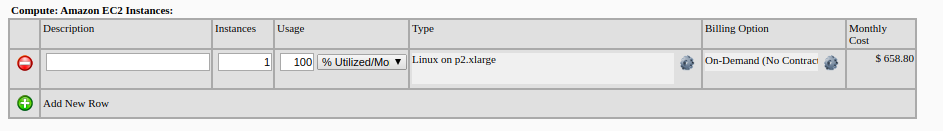
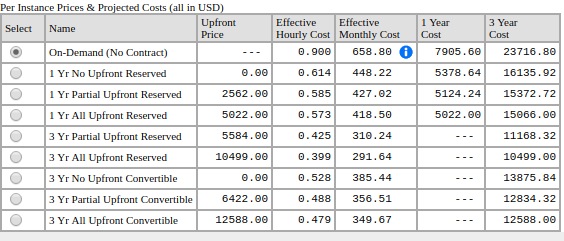
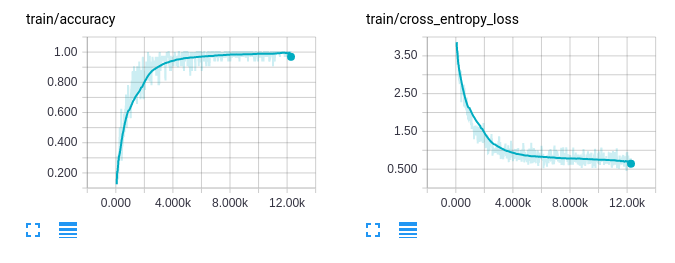
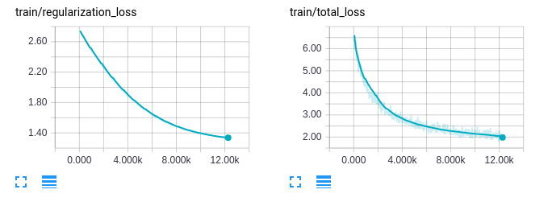
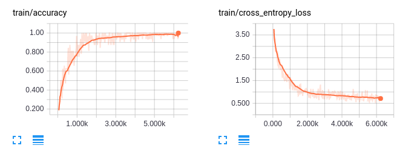
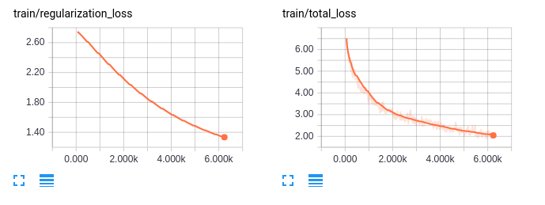
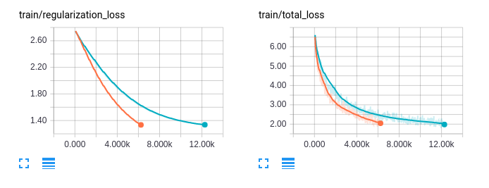
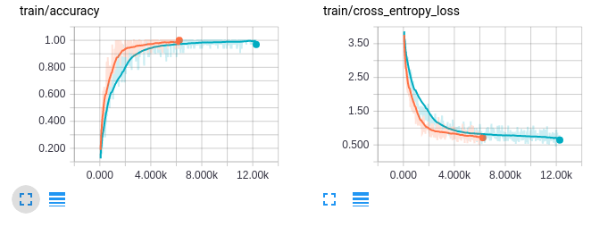

# 第十章：实时启用并扩展

在本章中，我们将深入了解 **Amazon Web Services**（**AWS**）以及如何创建深度神经网络来解决视频动作识别问题。我们将展示如何使用多个 GPU 加速训练。章末，我们将简要介绍 Amazon Mechanical Turk 服务，它允许我们收集标签并纠正模型的结果。

# 快速浏览 Amazon Web Services

**Amazon Web Services**（**AWS**）是最受欢迎的云平台之一，由 Amazon.com 开发。它提供许多服务，包括云计算、存储、数据库服务、内容分发以及其他功能。在本节中，我们将重点关注亚马逊 EC2 上的虚拟服务器服务。Amazon EC2 允许我们创建多个服务器，这些服务器可以支持模型的服务并进行训练。当涉及到为最终用户提供模型服务时，你可以阅读第九章，*巡航控制 - 自动化*，以了解 TensorFlow Serving。在训练中，Amazon EC2 提供了许多实例类型供我们使用。我们可以使用它们的 CPU 服务器来运行我们的网络机器人，从互联网上收集数据。还有几种实例类型配备了多个 NVIDIA GPU。

亚马逊 EC2 提供了多种实例类型，以适应不同的使用场景。这些实例类型分为五类，具体如下：

+   通用型

+   计算优化

+   内存优化

+   存储优化

+   加速计算实例

前四类最适合运行后端服务器。加速计算实例配备了多个 NVIDIA GPU，可用于为模型提供服务并用高端 GPU 训练新模型。共有三种实例类型——P2、G2 和 F1。

# P2 实例

P2 实例配备高性能的 NVIDIA K80 GPU，每个 GPU 拥有 2,496 个 CUDA 核心和 12 GB 的 GPU 内存。P2 实例有三种型号，具体见下表：

| **型号** | **GPU 数量** | **vCPU** | **内存 (GB)** | **GPU 内存 (GB)** |
| --- | --- | --- | --- | --- |
| p2.xlarge | 1 | 4 | 61 | 12 |
| p2.8xlarge | 8 | 32 | 488 | 96 |
| p2.16xlarge | 16 | 64 | 732 | 192 |

这些配备大容量 GPU 内存的型号最适合用于训练模型。更多的 GPU 内存可以让我们使用更大的批量大小和更多参数的神经网络来训练模型。

# G2 实例

G2 实例配备高性能的 NVIDIA GPU，每个 GPU 拥有 1,536 个 CUDA 核心和 4 GB 的 GPU 内存。G2 实例有两种型号，具体见下表：

| **型号** | **GPU 数量** | **vCPU** | **内存 (GB)** | **SSD 存储 (GB)** |
| --- | --- | --- | --- | --- |
| g2.2xlarge | 1 | 8 | 15 | 1 x 60 |
| g2.8xlarge | 4 | 32 | 60 | 2 x 120 |

这些模型只有 4 GB 的 GPU 内存，因此在训练上有所限制。然而，4 GB 的 GPU 内存通常足够将模型服务于最终用户。一个重要因素是，G2 实例比 P2 实例便宜得多，这使得我们可以在负载均衡器下部署多个服务器，以实现高可扩展性。

# F1 实例

F1 实例支持**现场可编程门阵列**（**FPGAs**）。F1 有两种型号，如下表所示：

| **型号** | **GPU** | **vCPU** | **内存(GB)** | **SSD 存储 (GB)** |
| --- | --- | --- | --- | --- |
| f1.2xlarge | 1 | 8 | 122 | 470 |
| f1.16xlarge | 8 | 64 | 976 | 4 x 940 |

拥有高内存和计算能力的 FPGA 在深度学习领域前景广阔。然而，TensorFlow 和其他流行的深度学习库并不支持 FPGA。因此，在下一节中，我们将只介绍 P2 和 G2 实例的价格。

# 定价

让我们在[`aws.amazon.com/emr/pricing/`](https://aws.amazon.com/emr/pricing/)探索这些实例的定价。

亚马逊 EC2 提供三种实例定价选项——按需实例、预留实例和 Spot 实例：

+   按需实例使你能够不受干扰地运行服务器。如果你只打算使用实例几天或几周，它非常合适。

+   预留实例允许你以显著的折扣预定一个一或三年的实例，相比按需实例更具成本优势。如果你想将服务器用于生产环境，它非常合适。

+   Spot 实例允许你对服务器进行竞标。你可以选择每小时实例的最大支付价格。这可以帮助你节省大量费用。然而，如果有人出价高于你的价格，这些实例可能会随时被终止。如果你的系统能够处理中断或你只是想探索服务，那么这种类型适合你。

亚马逊提供了一个网站来计算每月账单。你可以在[`calculator.s3.amazonaws.com/index.html`](http://calculator.s3.amazonaws.com/index.html)查看。

你可以点击“添加新行”按钮并选择一个实例类型。

在下图中，我们选择了一个 p2.xlarge 服务器。写作时该服务器一个月的价格为$658.80：



现在点击“Billing Option”列。你将看到一个 p2.xlarge 服务器的预留实例价格：



还有许多其他实例类型。我们建议你查看其他类型并选择最适合你需求的服务器。

在下一节中，我们将创建一个新的模型，使用 TensorFlow 执行视频动作识别。我们还将利用多 GPU 提高训练性能。

# 应用程序概览

人体动作识别是计算机视觉和机器学习中一个非常有趣的问题。解决这一问题有两种流行的方式，即**静态图像动作识别**和**视频动作识别**。在静态图像动作识别中，我们可以微调一个从 ImageNet 预训练的模型，并基于静态图像对动作进行分类。你可以回顾前几章以获得更多信息。在本章中，我们将创建一个能够从视频中识别人体动作的模型。在本章结束时，我们将展示如何使用多 GPU 来加速训练过程。

# 数据集

有许多可用的数据集，我们可以在训练过程中使用，具体如下：

+   UCF101 ([`crcv.ucf.edu/data/UCF101.php`](http://crcv.ucf.edu/data/UCF101.php))是一个包含 101 个动作类别的真实动作视频数据集。该数据集共有 13,320 个视频，涵盖了 101 个动作类别，因此它成为许多研究论文的理想选择。

+   ActivityNet ([`activity-net.org/`](http://activity-net.org/))是一个用于理解人体活动的大型数据集。该数据集包含 200 个类别，总计 648 小时以上的视频，每个类别大约有 100 个视频。

+   Sports-1M ([`cs.stanford.edu/people/karpathy/deepvideo/`](http://cs.stanford.edu/people/karpathy/deepvideo/))是另一个用于体育识别的大型数据集。该数据集总共有 1,133,158 个视频，并标注了 487 个体育标签。

在本章中，我们将使用 UCF101 进行训练过程。我们还建议你尝试将本章讨论的技术应用于一个大型数据集，以充分利用多 GPU 训练。

# 准备数据集和输入管道

UCF101 数据集包含 101 个动作类别，如篮球投篮、弹吉他和冲浪。我们可以从[`crcv.ucf.edu/data/UCF101.php`](http://crcv.ucf.edu/data/UCF101.php)下载该数据集。

在网站上，你需要下载名为`UCF101.rar`的 UCF101 数据集，并下载名为`UCF101TrainTestSplits-RecognitionTask.zip`的动作识别训练/测试数据集划分。在进入下一节之前，你需要解压数据集，接下来我们将对视频进行预处理，然后进行训练。

# 对视频进行预处理以用于训练

UCF101 包含 13,320 个视频片段，固定帧率为 25 FPS，分辨率为 320 x 240。所有视频片段均以 AVI 格式存储，因此在 TensorFlow 中使用起来不太方便。因此，在本节中，我们将从所有视频中提取视频帧并保存为 JPEG 文件。我们只会以固定帧率 4 FPS 提取视频帧，这样可以减少网络的输入大小。

在我们开始实现代码之前，需要从[`mikeboers.github.io/PyAV/installation.html`](https://mikeboers.github.io/PyAV/installation.html)安装 av 库。

首先，在 `root` 文件夹中创建一个名为 `scripts` 的 Python 包。然后，在 `scripts/convert_ucf101.py` 路径下创建一个新的 Python 文件。在新创建的文件中，添加第一个代码来导入并定义一些参数，如下所示：

```py
 import av 
 import os 
 import random 
 import tensorflow as tf 
 from tqdm import tqdm 

 FLAGS = tf.app.flags.FLAGS 
 tf.app.flags.DEFINE_string( 
    'dataset_dir', '/mnt/DATA02/Dataset/UCF101', 
    'The folder that contains the extracted content of UCF101.rar' 
 ) 

 tf.app.flags.DEFINE_string( 
    'train_test_list_dir',   
 '/mnt/DATA02/Dataset/UCF101/ucfTrainTestlist', 
    'The folder that contains the extracted content of  
 UCF101TrainTestSplits-RecognitionTask.zip' 
 ) 

 tf.app.flags.DEFINE_string( 
    'target_dir', '/home/ubuntu/datasets/ucf101', 
    'The location where all the images will be stored' 
 ) 

 tf.app.flags.DEFINE_integer( 
    'fps', 4, 
    'Framerate to export' 
 ) 

 def ensure_folder_exists(folder_path): 
    if not os.path.exists(folder_path): 
        os.mkdir(folder_path) 

    return folder_path 
```

在上述代码中，`dataset_dir` 和 `train_test_list_dir` 分别是包含 `UCF101.rar` 和 `UCF101TrainTestSplits-RecognitionTask.zip` 提取内容的文件夹的位置。`target_dir` 是存储所有训练图像的文件夹。`ensure_folder_exists` 是一个 `utility` 函数，用于在文件夹不存在时创建该文件夹。

接下来，让我们定义 Python 代码的 `main` 函数：

```py
 def main(_): 
    if not FLAGS.dataset_dir: 
        raise ValueError("You must supply the dataset directory with  
 --dataset_dir") 

    ensure_folder_exists(FLAGS.target_dir) 
    convert_data(["trainlist01.txt", "trainlist02.txt",  
 "trainlist03.txt"], training=True) 
    convert_data(["testlist01.txt", "testlist02.txt",  
 "testlist03.txt"], training=False) 

 if __name__ == "__main__": 
    tf.app.run() 
```

在 `main` 函数中，我们创建了 `target_dir` 文件夹，并调用了我们稍后将创建的 `convert_data` 函数。`convert_data` 函数接受数据集中的训练/测试文本文件列表和一个布尔值 `training`，指示文本文件是否用于训练过程。

以下是某个文本文件中的一些行：

```py
ApplyEyeMakeup/v_ApplyEyeMakeup_g08_c01.avi 1
ApplyEyeMakeup/v_ApplyEyeMakeup_g08_c02.avi 1
ApplyEyeMakeup/v_ApplyEyeMakeup_g08_c03.avi 1
```

每一行文本文件包含 `video` 文件的路径和正确的标签。在这种情况下，我们有三个来自 `ApplyEyeMakeup` 类别的视频路径，这是数据集中第一个类别。

这里的主要思想是我们读取每一行文本文件，提取视频帧并将其保存为 JPEG 格式，并保存提取文件的路径和对应的标签，供后续训练使用。以下是 `convert_data` 函数的代码：

```py
 def convert_data(list_files, training=False): 
    lines = [] 
    for txt in list_files: 
        lines += [line.strip() for line in  
 open(os.path.join(FLAGS.train_test_list_dir, txt))] 

    output_name = "train" if training else "test" 

    random.shuffle(lines) 

    target_dir = ensure_folder_exists(os.path.join(FLAGS.target_dir,  
 output_name)) 
    class_index_file = os.path.join(FLAGS.train_test_list_dir,  
 "classInd.txt") 
    class_index = {line.split(" ")[1].strip(): int(line.split(" ") 
 [0]) - 1 for line in open(class_index_file)} 

    with open(os.path.join(FLAGS.target_dir, output_name + ".txt"),  
 "w") as f: 
        for line in tqdm(lines): 
            if training: 
                filename, _ = line.strip().split(" ") 
            else: 
                filename = line.strip() 
            class_folder, video_name = filename.split("/") 

            label = class_index[class_folder] 
            video_name = video_name.replace(".avi", "") 
            target_class_folder =  
 ensure_folder_exists(os.path.join(target_dir, class_folder)) 
            target_folder =  
 ensure_folder_exists(os.path.join(target_class_folder, video_name)) 

            container = av.open(os.path.join(FLAGS.dataset_dir,  
            filename)) 
            frame_to_skip = int(25.0 / FLAGS.fps) 
            last_frame = -1 
            frame_index = 0 
            for frame in container.decode(video=0): 
                if last_frame < 0 or frame.index > last_frame +  
                frame_to_skip: 
                    last_frame = frame.index 
                    image = frame.to_image() 
                    target_file = os.path.join(target_folder,  
                   "%04d.jpg" % frame_index) 
                    image.save(target_file) 
                    frame_index += 1 
            f.write("{} {} {}\n".format("%s/%s" % (class_folder,  
           video_name), label, frame_index)) 

    if training: 
        with open(os.path.join(FLAGS.target_dir, "label.txt"), "w")  
        as f: 
            for class_name in sorted(class_index,  
            key=class_index.get): 
                f.write("%s\n" % class_name) 
```

上面的代码很简单。我们从文本文件中加载视频路径，并使用 `av` 库打开 AVI 文件。然后，我们使用 `FLAGS.fps` 控制每秒需要提取多少帧。你可以通过以下命令运行 `scripts/convert_ucf101.py` 文件：

```py
python scripts/convert_ucf101.py
```

整个过程大约需要 30 分钟来转换所有视频片段。最后，`target_dir` 文件夹将包含以下文件：

```py
label.txt  test  test.txt  train  train.txt
```

在 `train.txt` 文件中，行的格式如下：

```py
Punch/v_Punch_g25_c03 70 43
Haircut/v_Haircut_g20_c01 33 36
BrushingTeeth/v_BrushingTeeth_g25_c02 19 33
Nunchucks/v_Nunchucks_g03_c04 55 36
BoxingSpeedBag/v_BoxingSpeedBag_g16_c04 17 21
```

这个格式可以理解如下：

```py
<Folder location of the video> <Label> <Number of frames in the folder>  
```

有一件事你必须记住，那就是 `train.txt` 和 `test.txt` 中的标签是从 0 到 100 的。然而，UCF101 中的标签是从 1 到 101 的。这是因为 TensorFlow 中的 `sparse_softmax_cross_entropy` 函数要求类别标签从 0 开始。

# 使用 RandomShuffleQueue 的输入管道

如果你已经阅读过第九章，*定速巡航 - 自动化*，你会知道我们可以使用 TensorFlow 中的 TextLineReader 来简单地逐行读取文本文件，并利用这一行直接在 TensorFlow 中读取图像。然而，当数据仅包含文件夹位置和标签时，事情变得更加复杂。而且，我们只想从一个文件夹中选择一部分帧。例如，如果帧数是 30，我们只想选择 10 帧用于训练，我们会从 0 到 20 随机选择一个起始帧，然后从那里选择 10 帧。因此，在本章中，我们将使用另一种机制，在纯 Python 中对视频帧进行采样，并将选择的帧路径放入`RandomShuffleQueue`中进行训练。我们还使用`tf.train.batch_join`来利用多个预处理线程进行训练。

首先，在`root`文件夹中创建一个新的 Python 文件，命名为`utils.py`，并添加以下代码：

```py
def lines_from_file(filename, repeat=False): 
    with open(filename) as handle: 
        while True: 
            try: 
                line = next(handle) 
                yield line.strip() 
            except StopIteration as e: 
                if repeat: 
                    handle.seek(0) 
                else: 
                    raise 

if __name__ == "__main__": 
    data_reader = lines_from_file("/home/ubuntu/datasets/ucf101/train.txt", repeat=True) 

    for i in range(15): 
        print(next(data_reader)) 
```

在这段代码中，我们创建了一个名为`lines_from_file`的`generator`函数，用于逐行读取文本文件。我们还添加了一个`repeat`参数，以便当`generator`函数读取到文件末尾时，可以从头开始重新读取文本。

我们添加了一个主程序部分，你可以尝试运行它，看看`generator`是如何工作的：

```py
python utils.py 
```

现在，在`root`文件夹中创建一个新的 Python 文件，命名为`datasets.py`，并添加以下代码：

```py
 import tensorflow as tf 
 import cv2 
 import os 
 import random 

 from tensorflow.python.ops import data_flow_ops 
 from utils import lines_from_file 

 def sample_videos(data_reader, root_folder, num_samples,  
 num_frames): 
    image_paths = list() 
    labels = list() 
    while True: 
        if len(labels) >= num_samples: 
            break 
        line = next(data_reader) 
        video_folder, label, max_frames = line.strip().split(" ") 
        max_frames = int(max_frames) 
        label = int(label) 
        if max_frames > num_frames: 
            start_index = random.randint(0, max_frames - num_frames) 
            frame_paths = list() 
            for index in range(start_index, start_index +  
 num_frames): 
                frame_path = os.path.join(root_folder, video_folder,  
 "%04d.jpg" % index) 
                frame_paths.append(frame_path) 
            image_paths.append(frame_paths) 
            labels.append(label) 
    return image_paths, labels 

 if __name__ == "__main__": 
    num_frames = 5 
    root_folder = "/home/ubuntu/datasets/ucf101/train/" 
    data_reader =  
 lines_from_file("/home/ubuntu/datasets/ucf101/train.txt",  
 repeat=True) 
 image_paths, labels = sample_videos(data_reader,  
 root_folder=root_folder, 
 num_samples=3,  
 num_frames=num_frames) 
    print("image_paths", image_paths) 
    print("labels", labels) 
```

`sample_videos`函数易于理解。它将接收来自`lines_from_file`函数的`generator`对象，并使用`next`函数获取所需的样本。你可以看到，我们使用了`random.randint`方法来随机化起始帧的位置。

你可以运行主程序部分，使用以下命令查看`sample_videos`如何工作：

```py
python datasets.py
```

到目前为止，我们已经将数据集文本文件读取到`image_paths`和`labels`变量中，它们是 Python 列表。在后续的训练过程中，我们将使用 TensorFlow 中的内建`RandomShuffleQueue`来将`image_paths`和`labels`入队。

现在，我们需要创建一个方法，在训练过程中使用它从`RandomShuffleQueue`获取数据，在多个线程中进行预处理，并将数据传送到`batch_join`函数中，以创建一个用于训练的迷你批次。

在`dataset.py`文件中，添加以下代码：

```py
 def input_pipeline(input_queue, batch_size=32, num_threads=8,  
 image_size=112): 
    frames_and_labels = [] 
    for _ in range(num_threads): 
        frame_paths, label = input_queue.dequeue() 
        frames = [] 
        for filename in tf.unstack(frame_paths): 
            file_contents = tf.read_file(filename) 
            image = tf.image.decode_jpeg(file_contents) 
            image = _aspect_preserving_resize(image, image_size) 
            image = tf.image.resize_image_with_crop_or_pad(image,  
            image_size, image_size) 
            image = tf.image.per_image_standardization(image) 
            image.set_shape((image_size, image_size, 3)) 
            frames.append(image) 
        frames_and_labels.append([frames, label]) 

    frames_batch, labels_batch = tf.train.batch_join( 
        frames_and_labels, batch_size=batch_size, 
        capacity=4 * num_threads * batch_size, 
    ) 
    return frames_batch, labels_batch 
```

在这段代码中，我们准备了一个名为`frames_and_labels`的数组，并使用`num_threads`迭代的 for 循环。这是一种非常方便的方式，能够在预处理过程中添加多线程支持。在每个线程中，我们将调用`input_queue`的`dequeue`方法来获取`frame_paths`和`label`。从前一节的`sample_video`函数中，我们知道`frame_paths`是一个选定视频帧的列表。因此，我们使用另一个 for 循环来遍历每一帧。在每一帧中，我们读取、调整大小并进行图像标准化。这部分与第九章的代码类似，*巡航控制 - 自动化*。在输入管道的末尾，我们添加了带有`batch_size`参数的`frames_and_labels`。返回的`frames_batch`和`labels_batch`将用于后续的训练流程。

最后，你需要添加以下代码，其中包含`_aspect_preserving_resize`函数：

```py
 def _smallest_size_at_least(height, width, smallest_side): 
    smallest_side = tf.convert_to_tensor(smallest_side,  
 dtype=tf.int32) 

    height = tf.to_float(height) 
    width = tf.to_float(width) 
    smallest_side = tf.to_float(smallest_side) 

    scale = tf.cond(tf.greater(height, width), 
                    lambda: smallest_side / width, 
                    lambda: smallest_side / height) 
    new_height = tf.to_int32(height * scale) 
    new_width = tf.to_int32(width * scale) 
    return new_height, new_width 

 def _aspect_preserving_resize(image, smallest_side): 
    smallest_side = tf.convert_to_tensor(smallest_side,  
 dtype=tf.int32) 
    shape = tf.shape(image) 
    height = shape[0] 
    width = shape[1] 
    new_height, new_width = _smallest_size_at_least(height, width,  
 smallest_side) 
    image = tf.expand_dims(image, 0) 
    resized_image = tf.image.resize_bilinear(image, [new_height,  
 new_width], align_corners=False) 
    resized_image = tf.squeeze(resized_image) 
    resized_image.set_shape([None, None, 3]) 
    return resized_image 
```

这段代码与第九章中的代码相同，*巡航控制 - 自动化*。

在下一节中，我们将创建一个深度神经网络架构，使用该架构执行 101 个类别的视频动作识别。

# 神经网络架构

在本章中，我们将创建一个神经网络，该网络将接受 10 帧视频作为输入，并输出 101 个动作类别的概率。我们将基于 TensorFlow 中的 conv3d 操作来创建该神经网络。这个网络的灵感来源于 D. Tran 等人的研究《使用 3D 卷积网络学习时空特征》。然而，我们简化了模型，使其在本章中更容易解释。我们还使用了一些 Tran 等人未提及的技术，例如批量归一化和 dropout。

现在，创建一个名为`nets.py`的新 Python 文件，并添加以下代码：

```py
 import tensorflow as tf 
 from utils import print_variables, print_layers 
 from tensorflow.contrib.layers.python.layers.layers import  
 batch_norm 
 def inference(input_data, is_training=False): 
    conv1 = _conv3d(input_data, 3, 3, 3, 64, 1, 1, 1, "conv1") 
    pool1 = _max_pool3d(conv1, 1, 2, 2, 1, 2, 2, "pool1") 

    conv2 = _conv3d(pool1, 3, 3, 3, 128, 1, 1, 1, "conv2") 
    pool2 = _max_pool3d(conv2, 2, 2, 2, 2, 2, 2, "pool2") 

    conv3a = _conv3d(pool2, 3, 3, 3, 256, 1, 1, 1, "conv3a") 
    conv3b = _conv3d(conv3a, 3, 3, 3, 256, 1, 1, 1, "conv3b") 
    pool3 = _max_pool3d(conv3b, 2, 2, 2, 2, 2, 2, "pool3") 

    conv4a = _conv3d(pool3, 3, 3, 3, 512, 1, 1, 1, "conv4a") 
    conv4b = _conv3d(conv4a, 3, 3, 3, 512, 1, 1, 1, "conv4b") 
    pool4 = _max_pool3d(conv4b, 2, 2, 2, 2, 2, 2, "pool4") 

    conv5a = _conv3d(pool4, 3, 3, 3, 512, 1, 1, 1, "conv5a") 
    conv5b = _conv3d(conv5a, 3, 3, 3, 512, 1, 1, 1, "conv5b") 
    pool5 = _max_pool3d(conv5b, 2, 2, 2, 2, 2, 2, "pool5") 

    fc6 = _fully_connected(pool5, 4096, name="fc6") 
    fc7 = _fully_connected(fc6, 4096, name="fc7") 
    if is_training: 
        fc7 = tf.nn.dropout(fc7, keep_prob=0.5) 
    fc8 = _fully_connected(fc7, 101, name='fc8', relu=False) 

    endpoints = dict() 
    endpoints["conv1"] = conv1 
    endpoints["pool1"] = pool1 
    endpoints["conv2"] = conv2 
    endpoints["pool2"] = pool2 
    endpoints["conv3a"] = conv3a 
    endpoints["conv3b"] = conv3b 
    endpoints["pool3"] = pool3 
    endpoints["conv4a"] = conv4a 
    endpoints["conv4b"] = conv4b 
    endpoints["pool4"] = pool4 
    endpoints["conv5a"] = conv5a 
    endpoints["conv5b"] = conv5b 
    endpoints["pool5"] = pool5 
    endpoints["fc6"] = fc6 
    endpoints["fc7"] = fc7 
    endpoints["fc8"] = fc8 

    return fc8, endpoints 

 if __name__ == "__main__": 
    inputs = tf.placeholder(tf.float32, [None, 10, 112, 112, 3],  
 name="inputs") 
    outputs, endpoints = inference(inputs) 

    print_variables(tf.global_variables()) 
    print_variables([inputs, outputs]) 
    print_layers(endpoints) 
```

在`inference`函数中，我们`调用 _conv3d`、`_max_pool3d`和`_fully_connected`来创建网络。这与之前章节中用于图像的 CNN 网络没有太大区别。在函数的末尾，我们还创建了一个名为`endpoints`的字典，它将在主部分中用于可视化网络架构。

接下来，让我们添加`_conv3d`和`_max_pool3d`函数的代码：

```py
 def _conv3d(input_data, k_d, k_h, k_w, c_o, s_d, s_h, s_w, name,  
 relu=True, padding="SAME"): 
    c_i = input_data.get_shape()[-1].value 
    convolve = lambda i, k: tf.nn.conv3d(i, k, [1, s_d, s_h, s_w,  
 1], padding=padding) 
    with tf.variable_scope(name) as scope: 
        weights = tf.get_variable(name="weights",  
 shape=[k_d, k_h, k_w, c_i, c_o], 
 regularizer = tf.contrib.layers.l2_regularizer(scale=0.0001), 

 initializer=tf.truncated_normal_initializer(stddev=1e-1,  
 dtype=tf.float32)) 
        conv = convolve(input_data, weights) 
        biases = tf.get_variable(name="biases",  
 shape=[c_o], dtype=tf.float32, 
 initializer = tf.constant_initializer(value=0.0)) 
        output = tf.nn.bias_add(conv, biases) 
        if relu: 
            output = tf.nn.relu(output, name=scope.name) 
        return batch_norm(output) 

 def _max_pool3d(input_data, k_d, k_h, k_w, s_d, s_h, s_w, name,  
 padding="SAME"): 
    return tf.nn.max_pool3d(input_data,  
 ksize=[1, k_d, k_h, k_w, 1], 
 strides=[1, s_d, s_h, s_w, 1], padding=padding, name=name) 
```

这段代码与之前的章节相似。然而，我们使用了内置的`tf.nn.conv3d`和`tf.nn.max_pool3d`函数，而不是针对图像的`tf.nn.conv2d`和`tf.nn.max_pool3d`函数。因此，我们需要添加`k_d`和`s_d`参数，以提供关于滤波器深度的信息。此外，我们将从头开始训练这个网络，而不是使用任何预训练模型。因此，我们需要使用`batch_norm`函数将批量归一化添加到每一层。

让我们添加全连接层的代码：

```py
 def _fully_connected(input_data, num_output, name, relu=True): 
    with tf.variable_scope(name) as scope: 
        input_shape = input_data.get_shape() 
        if input_shape.ndims == 5: 
            dim = 1 
            for d in input_shape[1:].as_list(): 
                dim *= d 
            feed_in = tf.reshape(input_data, [-1, dim]) 
        else: 
            feed_in, dim = (input_data, input_shape[-1].value) 
        weights = tf.get_variable(name="weights",  
 shape=[dim, num_output],  
 regularizer = tf.contrib.layers.l2_regularizer(scale=0.0001),                                   
 initializer=tf.truncated_normal_initializer(stddev=1e-1,  
 dtype=tf.float32)) 
        biases = tf.get_variable(name="biases", 
 shape=[num_output], dtype=tf.float32, 

 initializer=tf.constant_initializer(value=0.0)) 
        op = tf.nn.relu_layer if relu else tf.nn.xw_plus_b 
        output = op(feed_in, weights, biases, name=scope.name) 
        return batch_norm(output) 
```

这个函数与我们使用图像时的有所不同。首先，我们检查 `input_shape.ndims` 是否等于 5，而不是 4。其次，我们将批量归一化添加到输出中。

最后，让我们打开 `utils.py` 文件并添加以下 `utility` 函数：

```py
 from prettytable import PrettyTable 
 def print_variables(variables): 
    table = PrettyTable(["Variable Name", "Shape"]) 
    for var in variables: 
        table.add_row([var.name, var.get_shape()]) 
    print(table) 
    print("") 

 def print_layers(layers): 
    table = PrettyTable(["Layer Name", "Shape"]) 
    for var in layers.values(): 
        table.add_row([var.name, var.get_shape()]) 
    print(table) 
    print("") 
```

现在我们可以运行 `nets.py` 来更好地理解网络的架构：

```py
    python nets.py
```

在控制台结果的第一部分，你将看到如下表格：

```py
    +------------------------------------+---------------------+
    |           Variable Name            |        Shape        |
    +------------------------------------+---------------------+
    |          conv1/weights:0           |   (3, 3, 3, 3, 64)  |
    |           conv1/biases:0           |        (64,)        |
    |       conv1/BatchNorm/beta:0       |        (64,)        |
    |   conv1/BatchNorm/moving_mean:0    |        (64,)        |
    | conv1/BatchNorm/moving_variance:0  |        (64,)        |
    |               ...                  |         ...         |
    |           fc8/weights:0            |     (4096, 101)     |
    |            fc8/biases:0            |        (101,)       |
    |        fc8/BatchNorm/beta:0        |        (101,)       |
    |    fc8/BatchNorm/moving_mean:0     |        (101,)       |
    |  fc8/BatchNorm/moving_variance:0   |        (101,)       |
    +------------------------------------+---------------------+ 
```

这些是网络中 `variables` 的形状。如你所见，每一层都有三个带有 `BatchNorm` 文本的 `variables` 被添加进去。这些 `variables` 增加了网络需要学习的总参数。然而，由于我们将从头开始训练，没有批量归一化的情况下，训练网络将更加困难。批量归一化还提高了网络对未见数据的正则化能力。

在控制台的第二个表格中，你将看到如下表格：

```py
    +---------------------------------+----------------------+
    |          Variable Name          |        Shape         |
    +---------------------------------+----------------------+
    |             inputs:0            | (?, 10, 112, 112, 3) |
    | fc8/BatchNorm/batchnorm/add_1:0 |       (?, 101)       |
    +---------------------------------+----------------------+
```

这些是网络的输入和输出的形状。如你所见，输入包含 10 帧大小为 (112, 112, 3) 的视频帧，输出包含一个 101 个元素的向量。

在最后的表格中，你将看到输出在每一层经过网络时形状的变化：

```py
    +------------------------------------+-----------------------+
    |             Layer Name             |         Shape         |
    +------------------------------------+-----------------------+
    |  fc6/BatchNorm/batchnorm/add_1:0   |       (?, 4096)       |
    |  fc7/BatchNorm/batchnorm/add_1:0   |       (?, 4096)       |
    |  fc8/BatchNorm/batchnorm/add_1:0   |        (?, 101)       |
    |               ...                  |         ...           |
    | conv1/BatchNorm/batchnorm/add_1:0  | (?, 10, 112, 112, 64) |
    | conv2/BatchNorm/batchnorm/add_1:0  |  (?, 10, 56, 56, 128) |
    +------------------------------------+-----------------------+
```

在前面的表格中，我们可以看到 `conv1` 层的输出与输入的大小相同，而 `conv2` 层的输出由于最大池化的作用发生了变化。

现在，让我们创建一个新的 Python 文件，命名为 `models.py`，并添加以下代码：

```py
 import tensorflow as tf 

 def compute_loss(logits, labels): 
    labels = tf.squeeze(tf.cast(labels, tf.int32)) 

    cross_entropy =  
 tf.nn.sparse_softmax_cross_entropy_with_logits(logits=logits,  
 labels=labels) 
    cross_entropy_loss= tf.reduce_mean(cross_entropy) 
    reg_loss =  
 tf.reduce_mean(tf.get_collection(tf.GraphKeys.REGULARIZATION_LOSSES 
 )) 

    return cross_entropy_loss + reg_loss, cross_entropy_loss,  
 reg_loss 

 def compute_accuracy(logits, labels): 
    labels = tf.squeeze(tf.cast(labels, tf.int32)) 
    batch_predictions = tf.cast(tf.argmax(logits, 1), tf.int32) 
    predicted_correctly = tf.equal(batch_predictions, labels) 
    accuracy = tf.reduce_mean(tf.cast(predicted_correctly,  
    tf.float32)) 
    return accuracy 

 def get_learning_rate(global_step, initial_value, decay_steps,  
 decay_rate): 
    learning_rate = tf.train.exponential_decay(initial_value,  
    global_step, decay_steps, decay_rate, staircase=True) 
    return learning_rate 

 def train(total_loss, learning_rate, global_step): 
    optimizer = tf.train.AdamOptimizer(learning_rate) 
    train_op = optimizer.minimize(total_loss, global_step) 
    return train_op 
```

这些函数创建计算 `loss`、`accuracy`、`learning rate` 的操作，并执行训练过程。这与前一章相同，因此我们不再解释这些函数。

现在，我们有了训练网络以识别视频动作所需的所有函数。在下一部分中，我们将开始在单个 GPU 上的训练过程，并在 TensorBoard 上可视化结果。

# 单 GPU 训练过程

在脚本包中，创建一个名为 `train.py` 的新 Python 文件。我们将首先定义一些参数，如下所示：

```py
 import tensorflow as tf 
 import os 
 import sys 
 from datetime import datetime 
 from tensorflow.python.ops import data_flow_ops 

 import nets 
 import models 
 from utils import lines_from_file 
 from datasets import sample_videos, input_pipeline 

 # Dataset 
 num_frames = 16 
 train_folder = "/home/ubuntu/datasets/ucf101/train/" 
 train_txt = "/home/ubuntu/datasets/ucf101/train.txt" 

 # Learning rate 
 initial_learning_rate = 0.001 
 decay_steps = 1000 
 decay_rate = 0.7 

 # Training 
 image_size = 112 
 batch_size = 24 
 num_epochs = 20 
 epoch_size = 28747 

 train_enqueue_steps = 100 
 min_queue_size = 1000 

 save_steps = 200  # Number of steps to perform saving checkpoints 
 test_steps = 20  # Number of times to test for test accuracy 
 start_test_step = 50 

 max_checkpoints_to_keep = 2 
 save_dir = "/home/ubuntu/checkpoints/ucf101" 
```

这些参数不言自明。现在，我们将定义一些用于训练的操作：

```py
 train_data_reader = lines_from_file(train_txt, repeat=True) 

 image_paths_placeholder = tf.placeholder(tf.string, shape=(None,  
 num_frames), name='image_paths') 
 labels_placeholder = tf.placeholder(tf.int64, shape=(None,),  
 name='labels') 

 train_input_queue =  
 data_flow_ops.RandomShuffleQueue(capacity=10000, 

 min_after_dequeue=batch_size, 
 dtypes= [tf.string, tf.int64], 
 shapes= [(num_frames,), ()]) 

 train_enqueue_op =  
 train_input_queue.enqueue_many([image_paths_placeholder,  
 labels_placeholder]) 

 frames_batch, labels_batch = input_pipeline(train_input_queue,   
 batch_size=batch_size, image_size=image_size) 

 with tf.variable_scope("models") as scope: 
    logits, _ = nets.inference(frames_batch, is_training=True) 

 total_loss, cross_entropy_loss, reg_loss =  
 models.compute_loss(logits, labels_batch) 
 train_accuracy = models.compute_accuracy(logits, labels_batch) 

 global_step = tf.Variable(0, trainable=False) 
 learning_rate = models.get_learning_rate(global_step,  
 initial_learning_rate, decay_steps, decay_rate) 
 train_op = models.train(total_loss, learning_rate, global_step) 
```

在这段代码中，我们从文本文件中获取一个 `generator` 对象。然后，我们创建两个占位符用于 `image_paths` 和 `labels`，它们将被加入到 `RandomShuffleQueue` 中。我们在 `datasets.py` 中创建的 `input_pipeline` 函数将接收 `RandomShuffleQueue` 并返回一批 `frames` 和标签。最后，我们创建操作来计算损失、准确率，并执行训练操作。

我们还希望记录训练过程并在 TensorBoard 中可视化它。所以，我们将创建一些摘要：

```py
 tf.summary.scalar("learning_rate", learning_rate) 
 tf.summary.scalar("train/accuracy", train_accuracy) 
 tf.summary.scalar("train/total_loss", total_loss) 
 tf.summary.scalar("train/cross_entropy_loss", cross_entropy_loss) 
 tf.summary.scalar("train/regularization_loss", reg_loss) 

 summary_op = tf.summary.merge_all() 

 saver = tf.train.Saver(max_to_keep=max_checkpoints_to_keep) 
 time_stamp = datetime.now().strftime("single_%Y-%m-%d_%H-%M-%S") 
 checkpoints_dir = os.path.join(save_dir, time_stamp) 
 summary_dir = os.path.join(checkpoints_dir, "summaries") 

 train_writer = tf.summary.FileWriter(summary_dir, flush_secs=10) 

 if not os.path.exists(save_dir): 
    os.mkdir(save_dir) 
 if not os.path.exists(checkpoints_dir): 
    os.mkdir(checkpoints_dir) 
 if not os.path.exists(summary_dir): 
    os.mkdir(summary_dir) 
```

`saver` 和 `train_writer` 分别负责保存检查点和摘要。现在，让我们通过创建 `session` 并执行训练循环来完成训练过程：

```py
 config = tf.ConfigProto() 
 config.gpu_options.allow_growth = True 

 with tf.Session(config=config) as sess: 
    coords = tf.train.Coordinator() 
    threads = tf.train.start_queue_runners(sess=sess, coord=coords) 

    sess.run(tf.global_variables_initializer()) 

    num_batches = int(epoch_size / batch_size) 

    for i_epoch in range(num_epochs): 
        for i_batch in range(num_batches): 
            # Prefetch some data into queue 
            if i_batch % train_enqueue_steps == 0: 
                num_samples = batch_size * (train_enqueue_steps + 1) 

                image_paths, labels =  
 sample_videos(train_data_reader, root_folder=train_folder, 

 num_samples=num_samples, num_frames=num_frames) 
                print("\nEpoch {} Batch {} Enqueue {}  
 videos".format(i_epoch, i_batch, num_samples)) 

                sess.run(train_enqueue_op, feed_dict={ 
                    image_paths_placeholder: image_paths, 
                    labels_placeholder: labels 
                }) 

            if (i_batch + 1) >= start_test_step and (i_batch + 1) %  
 test_steps == 0: 
                _, lr_val, loss_val, ce_loss_val, reg_loss_val,  
 summary_val, global_step_val, train_acc_val = sess.run([ 
                    train_op, learning_rate, total_loss,  
 cross_entropy_loss, reg_loss, 
                    summary_op, global_step, train_accuracy 
                ]) 
                train_writer.add_summary(summary_val, 
 global_step=global_step_val) 

                print("\nEpochs {}, Batch {} Step {}: Learning Rate  
 {} Loss {} CE Loss {} Reg Loss {} Train Accuracy {}".format( 
                    i_epoch, i_batch, global_step_val, lr_val,  
 loss_val, ce_loss_val, reg_loss_val, train_acc_val 
                )) 
            else: 
                _ = sess.run(train_op) 
                sys.stdout.write(".") 
                sys.stdout.flush() 

          if (i_batch + 1) > 0 and (i_batch + 1) % save_steps ==  0: 
                saved_file = saver.save(sess, 

 os.path.join(checkpoints_dir, 'model.ckpt'), 
                                        global_step=global_step) 
                print("Save steps: Save to file %s " % saved_file) 

    coords.request_stop() 
    coords.join(threads) 
```

这段代码非常直接。我们将使用 `sample_videos` 函数获取图像路径和标签的列表。然后，我们将调用 `train_enqueue_op` 操作将这些图像路径和标签添加到 `RandomShuffleQueue` 中。之后，训练过程可以通过使用 `train_op` 来运行，而无需使用 `feed_dict` 机制。

现在，我们可以通过在 `root` 文件夹中运行以下命令来启动训练过程：

```py
export PYTHONPATH=.
python scripts/train.py
```

如果您的 GPU 内存不足以处理批大小为 32 时，您可能会看到 `OUT_OF_MEMORY` 错误。在训练过程中，我们创建了一个会话并设置了 `gpu_options.allow_growth`，因此您可以尝试更改 `batch_size` 来有效使用您的 GPU 内存。

训练过程需要几个小时才能收敛。我们将通过 TensorBoard 查看训练过程。

在您选择保存检查点的目录中，运行以下命令：

```py
tensorboard --logdir .
```

现在，打开您的 web 浏览器并导航至 `http://localhost:6006`：



使用单个 GPU 的正则化损失和总损失如下：



如您在这些图像中所见，训练准确率大约经过 10,000 步达到了训练数据的 100% 准确率。这 10,000 步在我们的机器上花费了 6 小时，您的配置可能会有所不同。

训练损失在下降，如果我们训练更长时间，它可能会进一步减少。然而，训练准确率在 10,000 步后几乎没有变化。

现在，让我们进入本章最有趣的部分。我们将使用多个 GPU 进行训练，并观察这对训练的帮助。

# 多 GPU 训练流程

在我们的实验中，我们将使用我们定制的机器，而不是 Amazon EC2。但是，您可以在任何有 GPU 的服务器上获得相同的结果。在本节中，我们将使用两块 Titan X GPU，每块 GPU 的批大小为 32。这样，我们可以在一个步骤中处理最多 64 个视频，而不是单 GPU 配置下的 32 个视频。

现在，让我们在 `scripts` 包中创建一个名为 `train_multi.py` 的新 Python 文件。在这个文件中，添加以下代码以定义一些参数：

```py
 import tensorflow as tf 
 import os 
 import sys 
 from datetime import datetime 
 from tensorflow.python.ops import data_flow_ops 

 import nets 
 import models 
 from utils import lines_from_file 
 from datasets import sample_videos, input_pipeline 

 # Dataset 
 num_frames = 10 
 train_folder = "/home/aiteam/quan/datasets/ucf101/train/" 
 train_txt = "/home/aiteam/quan/datasets/ucf101/train.txt" 

 # Learning rate 
 initial_learning_rate = 0.001 
 decay_steps = 1000 
 decay_rate = 0.7 

 # Training 
 num_gpu = 2 

 image_size = 112 
 batch_size = 32 * num_gpu 
 num_epochs = 20 
 epoch_size = 28747 

 train_enqueue_steps = 50 

 save_steps = 200  # Number of steps to perform saving checkpoints 
 test_steps = 20  # Number of times to test for test accuracy 
 start_test_step = 50 

 max_checkpoints_to_keep = 2 
 save_dir = "/home/aiteam/quan/checkpoints/ucf101" 
```

这些参数与之前的 `train.py` 文件相同，唯一不同的是 `batch_size`。在本实验中，我们将使用数据并行策略，通过多个 GPU 进行训练。因此，批大小不再使用 32，而是使用 64。然后，我们将批次拆分成两部分，每部分由一块 GPU 处理。之后，我们将结合两块 GPU 的梯度来更新网络的权重和偏差。

接下来，我们将使用与之前相同的操作，具体如下：

```py
 train_data_reader = lines_from_file(train_txt, repeat=True) 

 image_paths_placeholder = tf.placeholder(tf.string, shape=(None,  
 num_frames), name='image_paths') 
 labels_placeholder = tf.placeholder(tf.int64, shape=(None,),  
 name='labels') 

 train_input_queue =  
 data_flow_ops.RandomShuffleQueue(capacity=10000, 

 min_after_dequeue=batch_size, 
 dtypes= [tf.string, tf.int64], 
 shapes= [(num_frames,), ()]) 

 train_enqueue_op =  
 train_input_queue.enqueue_many([image_paths_placeholder,  
 labels_placeholder]) 

 frames_batch, labels_batch = input_pipeline(train_input_queue,  
 batch_size=batch_size, image_size=image_size) 

 global_step = tf.Variable(0, trainable=False) 
 learning_rate = models.get_learning_rate(global_step,  
 initial_learning_rate, decay_steps, decay_rate) 
 ```

现在，不再使用 `models.train` 创建训练操作，

我们将创建一个优化器，并在每个 GPU 上计算梯度。

```py 
 optimizer = tf.train.AdamOptimizer(learning_rate=learning_rate) 

 total_gradients = [] 

 frames_batch_split = tf.split(frames_batch, num_gpu) 
 labels_batch_split = tf.split(labels_batch, num_gpu) 
 for i in range(num_gpu): 
    with tf.device('/gpu:%d' % i): 
        with tf.variable_scope(tf.get_variable_scope(), reuse=(i >  
 0)): 
            logits_split, _ = nets.inference(frames_batch_split[i],  
 is_training=True) 
            labels_split = labels_batch_split[i] 
            total_loss, cross_entropy_loss, reg_loss =  
 models.compute_loss(logits_split, labels_split) 
            grads = optimizer.compute_gradients(total_loss) 
            total_gradients.append(grads) 
            tf.get_variable_scope().reuse_variables() 

 with tf.device('/cpu:0'): 
    gradients = models.average_gradients(total_gradients) 
    train_op = optimizer.apply_gradients(gradients, global_step) 

    train_accuracy = models.compute_accuracy(logits_split,   
 labels_split) 
```

梯度将在每个 GPU 上计算，并添加到名为 `total_gradients` 的列表中。最终的梯度将在 CPU 上使用 `average_gradients` 计算，我们将很快创建这个函数。然后，通过调用优化器的 `apply_gradients` 来创建训练操作。

现在，让我们在 `root` 文件夹中的 `models.py` 文件中添加以下函数来计算 `average_gradient`：

```py
 def average_gradients(gradients): 
    average_grads = [] 
    for grad_and_vars in zip(*gradients): 
        grads = [] 
        for g, _ in grad_and_vars: 
            grads.append(tf.expand_dims(g, 0)) 

        grad = tf.concat(grads, 0) 
        grad = tf.reduce_mean(grad, 0) 

        v = grad_and_vars[0][1] 
        grad_and_var = (grad, v) 
        average_grads.append(grad_and_var) 
    return average_grads 
```

现在，在 `train_multi.py` 文件中，我们将创建 `saver` 和 `summaries` 操作，用来保存 `checkpoints` 和 `summaries`，就像以前一样：

```py
 tf.summary.scalar("learning_rate", learning_rate) 
 tf.summary.scalar("train/accuracy", train_accuracy) 
 tf.summary.scalar("train/total_loss", total_loss) 
 tf.summary.scalar("train/cross_entropy_loss", cross_entropy_loss) 
 tf.summary.scalar("train/regularization_loss", reg_loss) 

 summary_op = tf.summary.merge_all() 

 saver = tf.train.Saver(max_to_keep=max_checkpoints_to_keep) 
 time_stamp = datetime.now().strftime("multi_%Y-%m-%d_%H-%M-%S") 
 checkpoints_dir = os.path.join(save_dir, time_stamp) 
 summary_dir = os.path.join(checkpoints_dir, "summaries") 

 train_writer = tf.summary.FileWriter(summary_dir, flush_secs=10) 

 if not os.path.exists(save_dir): 
    os.mkdir(save_dir) 
 if not os.path.exists(checkpoints_dir): 
    os.mkdir(checkpoints_dir) 
 if not os.path.exists(summary_dir): 
    os.mkdir(summary_dir) 
```

最后，让我们添加训练循环来训练网络：

```py
 config = tf.ConfigProto(allow_soft_placement=True) 
 config.gpu_options.allow_growth = True 

 sess = tf.Session(config=config) 
 coords = tf.train.Coordinator() 
 threads = tf.train.start_queue_runners(sess=sess, coord=coords) 

 sess.run(tf.global_variables_initializer()) 

 num_batches = int(epoch_size / batch_size) 

 for i_epoch in range(num_epochs): 
    for i_batch in range(num_batches): 
        # Prefetch some data into queue 
        if i_batch % train_enqueue_steps == 0: 
            num_samples = batch_size * (train_enqueue_steps + 1) 
            image_paths, labels = sample_videos(train_data_reader,  
 root_folder=train_folder, 

 num_samples=num_samples, num_frames=num_frames) 
            print("\nEpoch {} Batch {} Enqueue {} 
 videos".format(i_epoch, i_batch, num_samples)) 

            sess.run(train_enqueue_op, feed_dict={ 
                image_paths_placeholder: image_paths, 
                labels_placeholder: labels 
            }) 

        if (i_batch + 1) >= start_test_step and (i_batch + 1) %  
 test_steps == 0: 
            _, lr_val, loss_val, ce_loss_val, reg_loss_val, 
 summary_val, global_step_val, train_acc_val = sess.run([ 
                train_op, learning_rate, total_loss, 
 cross_entropy_loss, reg_loss, 
                summary_op, global_step, train_accuracy 
            ]) 
            train_writer.add_summary(summary_val,  
 global_step=global_step_val) 

            print("\nEpochs {}, Batch {} Step {}: Learning Rate {} 
 Loss {} CE Loss {} Reg Loss {} Train Accuracy {}".format( 
                i_epoch, i_batch, global_step_val, lr_val, loss_val, 
 ce_loss_val, reg_loss_val, train_acc_val 
            )) 
        else: 
            _ = sess.run([train_op]) 
            sys.stdout.write(".") 
            sys.stdout.flush() 

        if (i_batch + 1) > 0 and (i_batch + 1) % save_steps == 0: 
            saved_file = saver.save(sess, 
                                    os.path.join(checkpoints_dir,  
 'model.ckpt'), 
                                    global_step=global_step) 
            print("Save steps: Save to file %s " % saved_file) 

 coords.request_stop() 
 coords.join(threads) 
```

训练循环与之前类似，不同之处在于我们为会话配置添加了 `allow_soft_placement=True` 选项。这个选项将允许 TensorFlow 在必要时更改 `variables` 的位置。

现在，我们可以像之前一样运行训练脚本：

```py
python scripts/train_multi.py
```

经过几小时的训练后，我们可以查看 TensorBoard 来比较结果：



图 04—多个 GPU 训练过程在 Tensorboard 上的绘图

如你所见，在我们的计算机上，多个 GPU 训练大约经过 6000 步后，约四小时内达到了 100% 的准确率。这几乎将训练时间缩短了一半。

现在，让我们看看这两种训练策略的对比：



图 05—在 TensorBoard 上，单个 GPU 和多个 GPU 结果并排对比的绘图

橙色线表示多个 GPU 的结果，蓝色线表示单个 GPU 的结果。我们可以看到，多个 GPU 设置比单个 GPU 更早地实现了更好的结果，虽然差异不大。然而，随着 GPU 数量的增加，我们可以实现更快的训练。在 Amazon EC2 的 P1 实例上，甚至有 8 个和 16 个 GPU。如果我们在大规模数据集上进行训练，例如 ActivityNet 或 Sports 1M，多个 GPU 的训练优势将更加明显，因为单个 GPU 需要很长时间才能收敛。

在下一部分，我们将快速了解另一个 Amazon 服务——机械土耳其。

# 机械土耳其概览

机械土耳其是一项服务，允许我们创建和管理在线人类智能任务，这些任务将由人类工作者完成。很多任务是人类比计算机更擅长的。因此，我们可以利用这项服务来支持我们的机器学习系统。

你可以在 [`www.mturk.com`](https://www.mturk.com) 查看这个系统。这里是该服务的网站：


下面是一些你可以用来支持机器学习系统的任务示例：

+   **数据集标注**：你通常会有很多未标记的数据，可以利用机械土耳其帮助你为机器学习工作流构建一致的真实标签。

+   **生成数据集**：你可以让工作人员构建大量的训练数据。例如，我们可以要求工作人员为自然语言系统创建文本翻译或聊天句子。你还可以要求他们为评论标注情感。

除了标注，Mechanical Turk 还可以清理你凌乱的数据集，使其准备好进行训练、数据分类和元数据标注。你甚至可以使用此服务让他们评判你的系统输出。

# 总结

我们已经查看了 Amazon EC2 服务，了解我们可以使用多少种服务器类型。然后，我们创建了一个神经网络，在单个 GPU 上进行人类视频动作识别。之后，我们应用了数据并行策略来加速训练过程。最后，我们简要了解了 Mechanical Turk 服务。我们希望你能够利用这些服务将你的机器学习系统提升到一个更高的水平。
