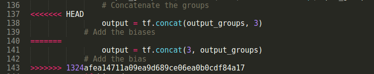
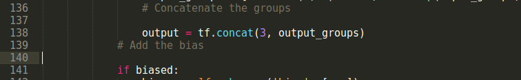
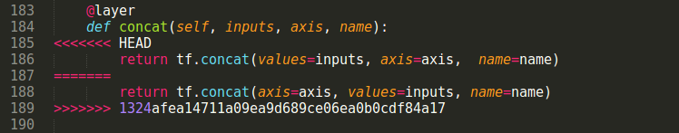
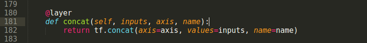

# 第十一章：更深入 - 21 个问题

在本章中，我们将介绍 21 个实际生活中的问题，您可以使用深度学习和 TensorFlow 来解决。我们将从讨论一些公共的大规模数据集和竞赛开始。然后，我们将展示一些精彩的 TensorFlow 项目。我们还将介绍一些在其他深度学习框架中完成的有趣项目，以便您获得灵感并实现自己的 TensorFlow 解决方案。最后，我们将介绍一种简单的技术，将 Caffe 模型转换为 TensorFlow 模型，并介绍如何使用高级 TensorFlow 库 TensorFlow-Slim。

在本章中，我们将讨论以下主题：

+   大规模公共数据集和竞赛

+   精彩的 TensorFlow 项目

+   一些其他框架的深度学习启发项目

+   将 Caffe 模型转换为 TensorFlow 模型

+   介绍 TensorFlow-Slim

# 数据集和挑战

在本节中，我们将向您展示一些流行的数据集和竞赛。

# 问题 1 - ImageNet 数据集

项目链接: [`image-net.org/`](http://image-net.org/)

**ImageNet** 是一个大型视觉识别挑战赛，自 2010 年以来每年举办一次。数据集按照 WorkNet 层级结构进行组织。数据集中包含超过一千万个带有手动标注标签的图像 URL，以指示图片中的物体。至少有一百万张图像包括了边界框。

ImageNet 挑战赛每年举办一次，评估算法在以下三个问题中的表现：

+   1,000 个类别的物体定位。

+   200 个完全标注类别的目标检测。

+   30 个完全标注类别的视频目标检测。2017 年 7 月 17 日，2017 年挑战赛的结果公布，出现了许多先进且有趣的算法。

# 问题 2 - COCO 数据集

项目链接: [`mscoco.org/`](http://mscoco.org/)

COCO 是一个用于图像识别、分割和标注的数据集，由微软赞助。该数据集中有 80 个对象类别，包含超过 300,000 张图片和 200 万个实例。每年还会举办检测、标注和关键点的挑战赛。

# 问题 3 - Open Images 数据集

项目链接: [`github.com/openimages/dataset`](https://github.com/openimages/dataset)

Open Images 是谷歌推出的一个新数据集，包含超过九百万个 URL，涵盖超过 6000 个类别。每张图像都经过谷歌的视觉模型处理，并由人工验证。截至 2017 年 7 月 20 日，该数据集还包含超过两百万个边界框标注，涵盖 600 多个物体。

不同之处在于，Open Images 涵盖了比其他数据集更多的现实生活中的物体，这在开发现实应用时非常有用。

# 问题 4 - YouTube-8M 数据集

项目链接: [`research.google.com/youtube8m/`](https://research.google.com/youtube8m/)

YouTube-8M 是谷歌提供的一个大规模视频数据集，包含 700 万个视频 URL，涵盖 4,716 个类别和 450,000 小时的视频。谷歌还提供了预计算的先进音视频特征，可以让你基于这些特征轻松构建模型。从原始视频进行训练可能需要数周，这在正常情况下是不现实的。该数据集的目标是实现视频理解、表示学习、噪声数据建模、迁移学习和视频领域适应。

# 问题 5 - AudioSet 数据集

项目链接：[`research.google.com/audioset/`](https://research.google.com/audioset/)

AudioSet 是谷歌提供的一个大规模音频事件数据集，包含 632 个音频事件类别，并收录了超过 210 万条人工标注的音频片段。音频类别涵盖了从人类和动物的声音到乐器声以及常见的日常环境声音。利用该数据集，你可以构建一个系统，用于音频事件识别，支持音频理解、安全应用等众多领域。

# 问题 6 - LSUN 挑战赛

项目链接：[`lsun.cs.princeton.edu/2017/`](http://lsun.cs.princeton.edu/2017/)

LSUN 挑战赛提供了一个大规模的场景理解数据集，涵盖了三个主要问题：

+   场景分类

+   街景图像的分割任务

+   显著性预测

在场景分类问题中，算法的预期输出是图像中最可能的场景类别。撰写时，有 10 个不同的类别，如卧室、教室和餐厅。在分割问题中，你可以尝试解决像素级分割和特定实例的分割。在显著性预测问题中，目标是预测人在场景图像中的注视位置。

# 问题 7 - MegaFace 数据集

项目链接：[`megaface.cs.washington.edu/`](http://megaface.cs.washington.edu/)

MegaFace 提供了一个大规模的人脸识别数据集。MegaFace 数据集分为三部分：

+   训练集

+   测试集

+   干扰样本

**训练集**包含 470 万张照片，涵盖 672,057 个独特身份。**测试集**包含来自 FaceScrub 和 FGNet 数据集的图像。**干扰集**包含 100 万张照片，来自 690,572 个独特用户。目前，MegaFace 网站上有两个挑战。在挑战 1 中，你可以使用任何数据集进行训练，并通过 100 万个干扰样本来测试你的方法。你的方法需要区分一组已知的人，并将干扰样本分类为未知的人。在挑战 2 中，你将使用包含 672K 独特身份的训练集进行训练，并通过 100 万个干扰样本进行测试。MegaFace 是目前（撰写时）最大的人脸识别数据集。

# 问题 8 - 2017 数据科学大赛挑战

项目链接：[`www.kaggle.com/c/data-science-bowl-2017`](https://www.kaggle.com/c/data-science-bowl-2017)

Data Science Bowl 2017 是一个价值百万美元的挑战，专注于肺癌检测。在数据集中，您将获得超过一千张高风险患者的 CT 图像。此挑战的目标是创建一个自动化系统，能够判断患者是否会在一年内被诊断为肺癌。这是一个非常有趣且重要的项目，未来能够拯救成千上万的人。

# 问题 9 - 星际争霸游戏数据集

项目链接: [`github.com/TorchCraft/StarData`](https://github.com/TorchCraft/StarData)

这是截至本书写作时最大的《星际争霸——母巢之战》重放数据集。该数据集包含了超过 60,000 场游戏，大小为 365GB，1535 百万帧，496 百万玩家动作。这个数据集最适合那些想要研究 AI 游戏玩法的人。

# 基于 TensorFlow 的项目

在本节中，我们将介绍几个在 TensorFlow 中实现并开源在 Github 上的问题。我们建议你看看这些项目，学习如何提升你的 TensorFlow 技能。

# 问题 10 - 人体姿态估计

项目链接: [`github.com/eldar/pose-tensorflow`](https://github.com/eldar/pose-tensorflow)

该项目是人类姿态估计中 Deep Cut 和 ArtTrack 的开源实现。该项目的目标是共同解决检测和姿态估计任务。我们可以将这种方法应用于各种场景，如安防中的人脸检测或人体动作理解。该项目还为进一步的人体形状估计研究提供了很好的起点，应用领域包括虚拟试穿或服装推荐。

# 问题 11 - 目标检测 - YOLO

项目链接: [`github.com/thtrieu/darkflow`](https://github.com/thtrieu/darkflow)

目标检测是计算机视觉中的一个有趣问题。解决这个问题的方法有很多。YOLO，由 Joseph Redmon 等人提出，是其中一种最先进的技术。YOLO 使用深度神经网络实现实时目标检测。YOLO 的第 2 版可以实时识别多达 9,000 种不同的物体，并具有很高的准确性。原始的 YOLO 项目是用 darknet 框架编写的。

在 TensorFlow 中，有一个很棒的 YOLO 实现，叫做 **darkflow**。darkflow 仓库甚至提供了一个工具，可以让你将模型导出并在移动设备上部署。

# 问题 12 - 目标检测 - Faster RCNN

项目链接: [`github.com/smallcorgi/Faster-RCNN_TF`](https://github.com/smallcorgi/Faster-RCNN_TF)

Faster RCNN 是另一种用于目标检测的最先进方法。该方法提供了高精度的结果，并且激发了许多其他问题的方法。Faster RCNN 的推理速度不如 YOLO 快。然而，如果你需要高精度的检测结果，可能会想要考虑使用 Faster RCNN。

# 问题 13 - 人物检测 - tensorbox

项目链接：[`github.com/Russell91/TensorBox`](https://github.com/Russell91/TensorBox)

Tensorbox 是 Russell Stewart 和 Mykhaylo Andriluka 提出的一个方法的 TensorFlow 实现。这个方法的目标与前面提到的几种方法稍有不同。Tensorbox 侧重于解决人群人物检测的问题。它们使用一个递归的 LSTM 层来生成边界框的序列，并定义了一种新的损失函数，这个损失函数作用于检测结果集合。

# 问题 14 - Magenta

项目链接：[`github.com/tensorflow/magenta`](https://github.com/tensorflow/magenta)

Magenta 是 Google Brain 团队的一个项目，专注于使用深度学习进行音乐和艺术生成。这是一个非常活跃的代码库，涵盖了许多有趣问题的实现，比如图像风格化、旋律生成或生成草图。你可以访问以下链接，获取 Magenta 的模型：

[`github.com/tensorflow/magenta/tree/master/magenta/models`](https://github.com/tensorflow/magenta/tree/master/magenta/models)

# 问题 15 - Wavenet

项目链接：[`github.com/ibab/tensorflow-wavenet`](https://github.com/ibab/tensorflow-wavenet)

WaveNet 是 Google Deep Mind 提出的用于音频生成的神经网络架构。WaveNet 被训练生成原始音频波形，并在语音合成和音频生成中取得了良好的结果。根据 Deep Mind 的说法，WaveNet 在英语和普通话的语音合成任务中，将传统方法和人类水平表现之间的差距缩小了超过 50%。

# 问题 16 - Deep Speech

项目链接：[`github.com/mozilla/DeepSpeech`](https://github.com/mozilla/DeepSpeech)

Deep Speech 是一个开源的语音转文本引擎，基于百度的研究论文。语音转文本是一个非常有趣的问题，Deep Speech 是解决这一问题的最先进方法之一。通过 Mozilla 提供的 TensorFlow 实现，你甚至可以学习如何在多台机器上使用 TensorFlow。然而，仍然存在一个问题，即个人研究人员无法访问与大公司相同的大规模语音转文本数据集。因此，尽管我们可以使用 Deep Speech 或自己实现它，但仍然很难为生产环境提供一个良好的模型。

# 有趣的项目

在本节中，我们将向你展示一些在其他深度学习框架中实现的有趣项目。这些项目在解决非常困难的问题上取得了显著的成果。你可能会想挑战自己，将这些方法实现到 TensorFlow 中。

# 问题 17 - 交互式深度着色 - iDeepColor

项目链接：[`richzhang.github.io/ideepcolor/`](https://richzhang.github.io/ideepcolor/)

互动深度图像着色是 Richard Zhang、Jun-Yan Zun 等人正在开展的研究，旨在实现用户引导的图像着色。在该系统中，用户可以为图像中的某些点提供几种颜色提示，网络将根据用户的输入以及从大规模数据中学到的语义信息传播颜色。这种着色可以通过单次前向传播实时执行。

# 问题 18 - 微小面部检测器

项目链接：[`github.com/peiyunh/tiny`](https://github.com/peiyunh/tiny)

本项目是由 Peiyun Hu 和 Deva Ramanan 提出的面部检测器，专注于识别图像中的小面部。虽然大多数面部检测器只关注图像中的大物体，但这一微小面部检测方法能够处理非常小的面部，并且与之前的方法相比，在 WIDER FACE 数据集上减少了两倍的错误率。

# 问题 19 - 人物搜索

项目链接：[`github.com/ShuangLI59/person_search`](https://github.com/ShuangLI59/person_search)

本项目是 Tong Xiao 等人提出的论文的实现，专注于人物检测和重新识别问题。该项目可用于视频监控。现有的人物重新识别方法主要假设人物已经被裁剪并对齐。然而，在现实场景中，人物检测算法可能无法完美地提取人物的裁剪区域，从而降低识别准确性。在本项目中，作者在受 Faster RCNN 启发的全新架构中联合解决检测和识别问题。当前项目使用 Caffe 深度学习框架实现。

# 问题 20 - 面部识别 - MobileID

项目链接：[`github.com/liuziwei7/mobile-id`](https://github.com/liuziwei7/mobile-id)

本项目提供了一种极快的面部识别系统，能够以 250 帧每秒的速度运行，同时保持高准确性。该模型通过使用最先进的面部识别系统 DeepID 的输出进行训练。然而，移动 ID 模型的运算速度极快，适用于处理能力和内存受限的情况。

# 问题 21 - 问答系统 - DrQA

项目链接：[`github.com/facebookresearch/DrQA`](https://github.com/facebookresearch/DrQA)

DrQA 是 Facebook 推出的一个开放领域问答系统。DrQA 专注于解决*机器阅读*任务，在该任务中，模型会试图理解维基百科文档，并为用户的任何问题提供答案。当前项目是用 PyTorch 实现的。你可能会对在 TensorFlow 中实现我们自己的解决方案感兴趣。

# Caffe 到 TensorFlow

在这一部分，我们将向你展示如何利用来自 Caffe Model Zoo 的多个预训练模型([`github.com/BVLC/caffe/wiki/Model-Zoo`](https://github.com/BVLC/caffe/wiki/Model-Zoo))。这里有许多适用于不同任务的 Caffe 模型，涵盖各种架构。将这些模型转换为 TensorFlow 后，你可以将其作为你架构的一部分，或者可以针对不同任务微调我们的模型。使用这些预训练模型作为初始权重是训练的有效方法，而不是从头开始训练。我们将展示如何使用 Saumitro Dasgupta 提供的`caffe-to-tensorflow`方法，详见[`github.com/ethereon/caffe-tensorflow`](https://github.com/ethereon/caffe-tensorflow)。

然而，Caffe 和 TensorFlow 之间有很多差异。这项技术仅支持 Caffe 中一部分层类型。即便如此，仍有一些 Caffe 架构，如 ResNet、VGG 和 GoogLeNet，已被该项目的作者验证。

首先，我们需要使用`git clone`命令克隆`caffe-tensorflow`仓库：

```py
ubuntu@ubuntu-PC:~/github$ git clone https://github.com/ethereon/caffe-tensorflow
Cloning into 'caffe-tensorflow'...
remote: Counting objects: 479, done.
remote: Total 479 (delta 0), reused 0 (delta 0), pack-reused 479
Receiving objects: 100% (510/510), 1.71 MiB | 380.00 KiB/s, done.
Resolving deltas: 100% (275/275), done.
Checking connectivity... done.
```

然后，我们需要切换到`caffe-to-tensorflow`目录，并运行转换的 Python 脚本，以查看一些帮助消息：

```py
cd caffe-tensorflow
python convert.py -h
The resulting console will look like this:
usage: convert.py [-h] [--caffemodel CAFFEMODEL]
                  [--data-output-path DATA_OUTPUT_PATH]
                  [--code-output-path CODE_OUTPUT_PATH] [-p PHASE]
                  def_path

positional arguments:
def_path              Model definition (.prototxt) path

optional arguments:
  -h, --help            show this help message and exit
  --caffemodel CAFFEMODEL
                        Model data (.caffemodel) path
  --data-output-path DATA_OUTPUT_PATH
                        Converted data output path
  --code-output-path CODE_OUTPUT_PATH
                        Save generated source to this path
  -p PHASE, --phase PHASE
                        The phase to convert: test (default) or train
```

根据此帮助消息，我们可以了解`convert.py`脚本的参数。总结来说，我们将使用这个`convert.py`脚本，通过标志`code-output-path`在 TensorFlow 中创建网络架构，并通过标志`data-output-path`转换预训练权重。

在开始转换模型之前，我们需要从该项目的贡献者那里获取一些拉取请求。当前的主分支存在一些问题，我们无法使用最新版本的 TensorFlow（本文写作时为 1.3 版）和 python-protobuf（本文写作时为 3.4.0 版）。因此，我们将通过以下拉取请求获取代码：

[`github.com/ethereon/caffe-tensorflow/pull/105`](https://github.com/ethereon/caffe-tensorflow/pull/105)

[`github.com/ethereon/caffe-tensorflow/pull/133`](https://github.com/ethereon/caffe-tensorflow/pull/133)

你需要打开上述链接查看拉取请求是否已合并。如果它仍然处于`open`状态，你需要遵循下一部分。否则，你可以跳过已合并的`pull`请求。

首先，我们将获取拉取请求`105`中的代码：

```py
ubuntu@ubuntu-PC:~/github$ git pull origin pull/105/head
remote: Counting objects: 33, done.
remote: Total 33 (delta 8), reused 8 (delta 8), pack-reused 25
Unpacking objects: 100% (33/33), done.
From https://github.com/ethereon/caffe-tensorflow
* branch            refs/pull/105/head -> FETCH_HEAD
Updating d870c51..ccd1a52
Fast-forward
.gitignore                               |  5 +++++
convert.py                               |  8 ++++++++
examples/save_model/.gitignore           | 11 ++++++++++
examples/save_model/READMD.md            | 17 ++++++++++++++++
examples/save_model/__init__.py          |  0
examples/save_model/save_model.py        | 51 ++++++++++++++++++++++++++++++++++++++++++++++
kaffe/caffe/{caffepb.py => caffe_pb2.py} |  0
kaffe/caffe/resolver.py                  |  4 ++--
kaffe/tensorflow/network.py              |  8 ++++----
9 files changed, 98 insertions(+), 6 deletions(-)
create mode 100644 examples/save_model/.gitignore
create mode 100644 examples/save_model/READMD.md
create mode 100644 examples/save_model/__init__.py
create mode 100755 examples/save_model/save_model.py
rename kaffe/caffe/{caffepb.py => caffe_pb2.py} (100%)
```

然后，从拉取请求`133`开始：

```py
- git pull origin pull/133/head
remote: Counting objects: 31, done.
remote: Total 31 (delta 20), reused 20 (delta 20), pack-reused 11
Unpacking objects: 100% (31/31), done.
From https://github.com/ethereon/caffe-tensorflow
* branch            refs/pull/133/head -> FETCH_HEAD
Auto-merging kaffe/tensorflow/network.py
CONFLICT (content): Merge conflict in kaffe/tensorflow/network.py
Auto-merging .gitignore
CONFLICT (content): Merge conflict in .gitignore
Automatic merge failed; fix conflicts and then commit the result.
```

如你所见，`kaffe/tensorflow/network.py`文件中存在一些冲突。我们将向你展示如何解决这些`冲突`，如下所示。

首先，我们将在第 137 行解决冲突：



我们将从第 137 行到第 140 行删除 HEAD 部分。最终结果将如下所示：



接下来，我们将在第 185 行解决冲突：



我们还需要从第 185 行到第 187 行删除 HEAD 部分。最终结果将如下所示：



在`caffe-to-tensorflow`目录中，有一个名为 examples 的目录，包含了 MNIST 和 ImageNet 挑战的代码和数据。我们将向您展示如何使用 MNIST 模型。ImageNet 挑战与之大致相同。

首先，我们将使用以下命令将 MNIST 架构从 Caffe 转换为 TensorFlow：

```py
    ubuntu@ubuntu-PC:~/github$ python ./convert.py examples/mnist/lenet.prototxt --code-output-path=./mynet.py
    The result will look like this:

    ------------------------------------------------------------
        WARNING: PyCaffe not found!
        Falling back to a pure protocol buffer implementation.
        * Conversions will be drastically slower.
        * This backend is UNTESTED!
    ------------------------------------------------------------

    Type                 Name                                          Param               Output
    ----------------------------------------------------------------------------------------------
    Input                data                                             --      (64, 1, 28, 28)
    Convolution          conv1                                            --     (64, 20, 24, 24)
    Pooling              pool1                                            --     (64, 20, 12, 12)
    Convolution          conv2                                            --       (64, 50, 8, 8)
    Pooling              pool2                                            --       (64, 50, 4, 4)
    InnerProduct         ip1                                              --      (64, 500, 1, 1)
    InnerProduct         ip2                                              --       (64, 10, 1, 1)
    Softmax              prob                                             --       (64, 10, 1, 1)
    Converting data...
    Saving source...
    Done.
```

接下来，我们将使用以下命令将预训练的 MNIST Caffe 模型`examples/mnist/lenet_iter_10000.caffemodel`转换为 TensorFlow：

```py
 ubuntu@ubuntu-PC:~/github$ python ./convert.py  
 examples/mnist/lenet.prototxt --caffemodel  
 examples/mnist/lenet_iter_10000.caffemodel --data-output- 
 path=./mynet.npy
```

结果如下所示：

```py
    ------------------------------------------------------------
        WARNING: PyCaffe not found!
        Falling back to a pure protocol buffer implementation.
        * Conversions will be drastically slower.
        * This backend is UNTESTED!
    ------------------------------------------------------------

    Type                 Name                                          Param               Output
    ----------------------------------------------------------------------------------------------
    Input                data                                             --      (64, 1, 28, 28)
    Convolution          conv1                                 
(20, 1, 5, 5)     (64, 20, 24, 24)
    Pooling              pool1                                            --     (64, 20, 12, 12)
    Convolution          conv2                               
 (50, 20, 5, 5)       (64, 50, 8, 8)
    Pooling              pool2                                            --       (64, 50, 4, 4)
    InnerProduct         ip1                                   
   (500, 800)      (64, 500, 1, 1)
    InnerProduct         ip2                                      
 (10, 500)       (64, 10, 1, 1)
    Softmax              prob                                             --       (64, 10, 1, 1)
    Converting data...
    Saving data...
    Done.
```

如您所见，这些命令将在当前目录中创建一个名为`mynet.py`的 Python 文件和一个名为`mynet.npy`的`numpy`文件。我们还需要将当前目录添加到`PYTHONPATH`，以便后续代码可以导入`mynet.py`：

```py
ubuntu@ubuntu-PC:~/github$ export PYTHONPATH=$PYTHONPATH:.
ubuntu@ubuntu-PC:~/github$ python examples/mnist/finetune_mnist.py
....
('Iteration: ', 900, 0.0087626642, 1.0)
('Iteration: ', 910, 0.018495116, 1.0)
('Iteration: ', 920, 0.0029206357, 1.0)
('Iteration: ', 930, 0.0010091728, 1.0)
('Iteration: ', 940, 0.071255416, 1.0)
('Iteration: ', 950, 0.045163739, 1.0)
('Iteration: ', 960, 0.005758767, 1.0)
('Iteration: ', 970, 0.012100354, 1.0)
('Iteration: ', 980, 0.12018739, 1.0)
('Iteration: ', 990, 0.079262167, 1.0)
```

每行中的最后两个数字是微调过程的损失和准确率。您可以看到，使用来自 Caffe 模型的预训练权重，微调过程可以轻松达到 100% 的准确率。

现在，我们将查看`finetune_mnist.py`文件，看看如何使用预训练权重。

首先，他们使用以下代码导入`mynet` python：

```py
    from mynet import LeNet as MyNet  
```

然后，他们为`images`和`labels`创建了一些占位符，并使用层`ip2`计算`loss`，如下所示：

```py
 images = tf.placeholder(tf.float32, [None, 28, 28, 1]) 
 labels = tf.placeholder(tf.float32, [None, 10]) 
 net = MyNet({'data': images}) 

 ip2 = net.layers['ip2'] 
 pred = net.layers['prob'] 

 loss =  
 tf.reduce_mean(tf.nn.softmax_cross_entropy_with_logits(logits=ip2,  
 labels=labels), 0) 
 Finally, they load the numpy file into the graph, using the load  
 method in the network class. 
 with tf.Session() as sess: 
    # Load the data 
    sess.run(tf.global_variables_initializer()) 
    net.load('mynet.npy', sess) 
```

之后，微调过程将独立于 Caffe 框架进行。

# TensorFlow-Slim

TensorFlow-Slim 是一个轻量级库，用于在 TensorFlow 中定义、训练和评估复杂模型。使用 TensorFlow-Slim 库，我们可以通过提供许多高级层、变量和正则化器，轻松构建、训练和评估模型。我们建议您查看以下链接中的 TensorFlow-Slim 库：[`github.com/tensorflow/tensorflow/tree/master/tensorflow/contrib/slim`](https://github.com/tensorflow/tensorflow/tree/master/tensorflow/contrib/slim)

还提供了许多使用 TensorFlow-Slim 的预训练模型。您可以通过以下链接利用高级 TensorFlow 层和模型：

[`github.com/tensorflow/tensorflow/tree/master/tensorflow/contrib/slim`](https://github.com/tensorflow/tensorflow/tree/master/tensorflow/contrib/slim)

# 总结

在本章中，我们提供了许多有趣的挑战和问题，您可以尝试解决并从中学习，以提升您的 TensorFlow 技能。在本章末尾，我们还指导您将 Caffe 模型转换为 TensorFlow，并向您介绍了高级 TensorFlow 库 TensorFlow-Slim。
