# 第十二章：高级安装

深度学习涉及大量的矩阵乘法，**图形处理单元**（**GPU**）是学习深度学习时非常重要的方面。没有 GPU，实验过程可能需要一天或更长时间。有了良好的 GPU，我们可以快速迭代深度学习网络和大型训练数据集，并在短时间内运行多个实验。使用 TensorFlow 时，我们可以轻松地在单个 GPU 或多个 GPU 上工作。然而，一旦涉及到 GPU，大多数机器学习平台的安装过程都非常复杂。

本章将讨论 GPU，并重点介绍逐步 CUDA 设置和基于 GPU 的 TensorFlow 安装。我们将从安装 Nvidia 驱动程序、CUDA 工具包和 cuDNN 库开始。然后，我们将使用`pip`安装支持 GPU 的 TensorFlow。最后，我们将展示如何使用 Anaconda 进一步简化安装过程。

# 安装

本章将以一台配备 Nvidia Titan X GPU 的 Ubuntu 16.06 计算机为例进行操作。

我们建议您使用 Ubuntu 14.04 或 16.06 版本，以避免出现其他问题。

GPU 的选择超出了本章的范围。然而，您必须选择一款具有高内存容量的 Nvidia 设备，以便与 CPU 相比充分发挥 GPU 的优势。目前，AMD 的 GPU 尚未被 TensorFlow 和大多数其他深度学习框架官方支持。在撰写本文时，Windows 可以在 Python 3.5 或 Python 3.6 上使用 TensorFlow 的 GPU 版本。然而，从 TensorFlow 1.2 版本开始，TensorFlow 不再支持 macOS 上的 GPU。如果您使用的是 Windows，我们建议您按照以下链接的官方教程进行操作：[`www.tensorflow.org/install/install_windows`](https://www.tensorflow.org/install/install_windows)。

# 安装 Nvidia 驱动程序

在 Ubuntu 中安装 Nvidia 驱动程序有多种方法。本节将展示使用专有 GPU 驱动程序 PPA 的最简单方法，PPA 提供稳定的 Nvidia 图形驱动程序更新。

首先，打开终端并运行以下命令，将`PPA`添加到 Ubuntu 中：

```py
sudo add-apt-repository ppa:graphics-drivers/ppa
sudo apt update  
```

现在，我们需要选择一个 Nvidia 驱动程序版本进行安装。运行以下命令查看您机器上的最新版本：

```py
sudo apt-cache search nvidia
```

上述命令的结果可能如下所示：

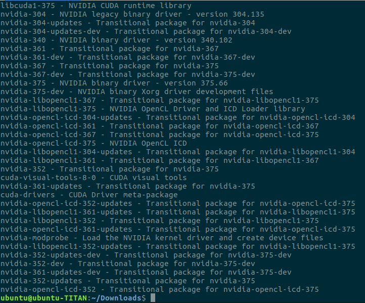

如你所见，我机器上的最新驱动程序是 375.66，它与文本中的 NVIDIA 二进制驱动程序行对齐。现在，我们可以使用以下命令安装 Nvidia 驱动程序版本 375.66：

```py
sudo apt-get install nvidia-375 
```

上述命令的结果可能如下所示：

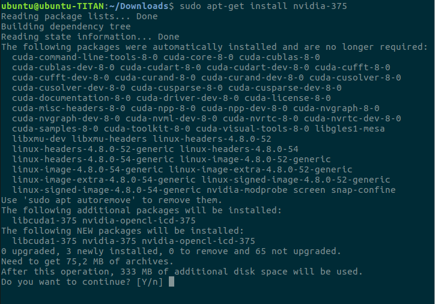

安装完成后，您应该会看到如下屏幕：

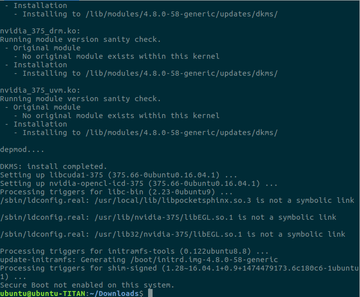

现在，我们将安装 Nvidia 的 CUDA 工具包。

# 安装 CUDA 工具包

首先，我们需要打开 Nvidia 网站以下载 CUDA 工具包。访问 [`developer.nvidia.com/cuda-downloads`](https://developer.nvidia.com/cuda-downloads)。你将看到如下屏幕：

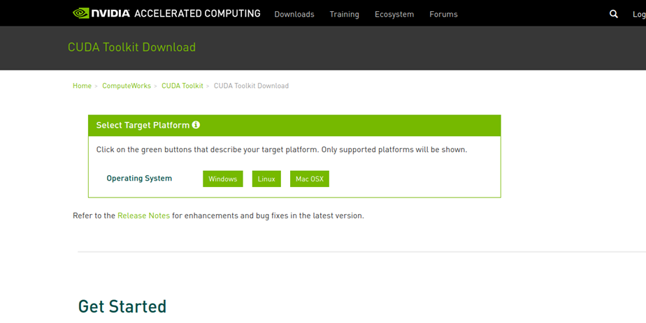

然后，选择 Linux | x86_64 | Ubuntu | 16.04 | runfile(local)，如下面的截图所示：

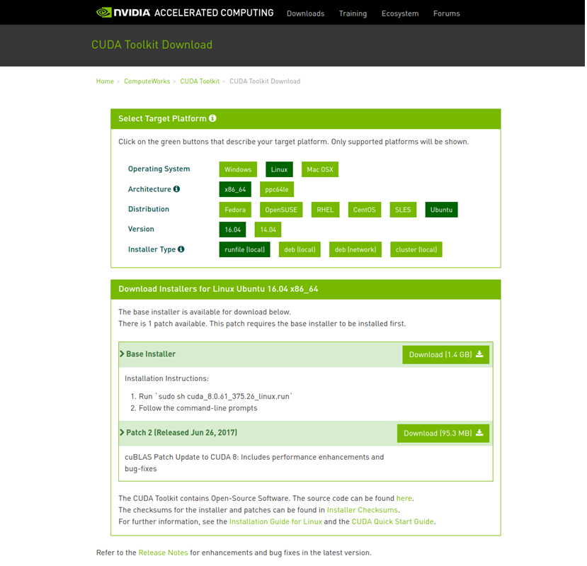

接下来，点击“下载 (1.4 GB)”按钮以下载安装程序。安装程序大小为 1.4 GB，下载可能需要一些时间。下载完成后，打开终端，切换到包含安装程序的文件夹，并运行以下命令：

```py
sudo sh cuda_8.0.61_375.26_linux.run
```

在命令行提示符中，你将看到最终用户许可协议：

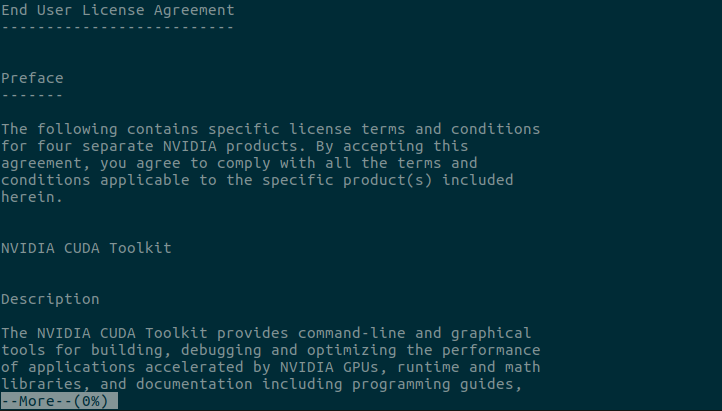

你可以使用方向键在协议中导航。否则，你可以按 `:q` 并看到以下屏幕：

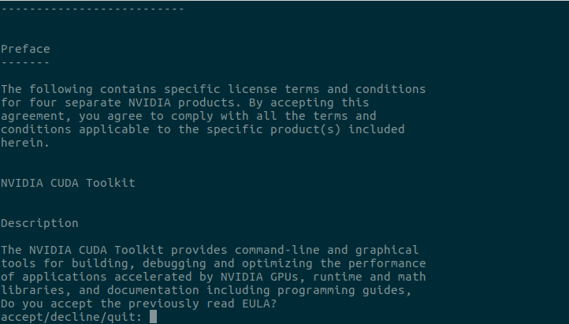

现在，你可以输入 `accept` 来接受协议。之后，你需要回答一些问题，如下图所示：

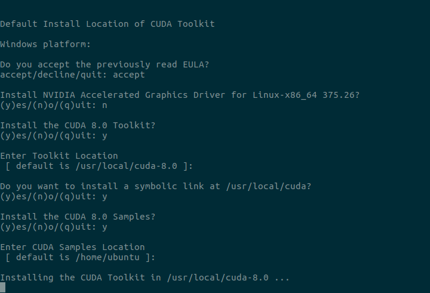

你可能注意到，在此提示中我们不会安装 Nvidia 驱动程序，因为我们已经在上一节中安装了最新的驱动程序。当安装完成时，你将看到如下屏幕：

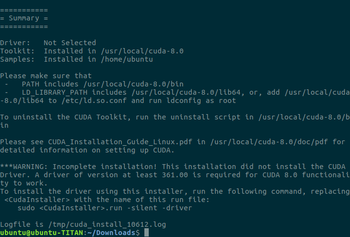

现在，打开你的 `~/.bashrc` 文件，并在文件末尾添加以下行：

```py
    export LD_LIBRARY_PATH=$LD_LIBRARY_PATH:/usr/local/cuda/lib64/ 
```

我们已经成功将 CUDA 工具包安装到机器上。你可以尝试以下命令查看你的显卡信息：

```py
nvidia-smi
```

我们机器上的结果如下所示：

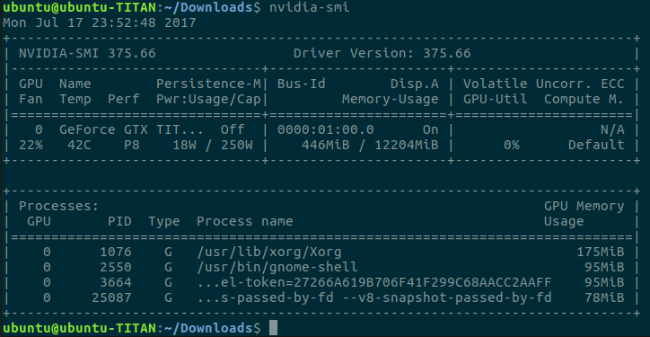

# 安装 cuDNN

为了使用支持 GPU 的 TensorFlow，你需要安装一个名为 cuDNN 的 Nvidia 库。首先，你需要访问 Nvidia 网站，并从 [`developer.nvidia.com/cudnn`](https://developer.nvidia.com/cudnn) 下载 cuDNN 库。

你可能需要注册一个新的 Nvidia 账户。在你登录 Nvidia 网站并打开 cuDNN 链接后，你将看到如下屏幕：

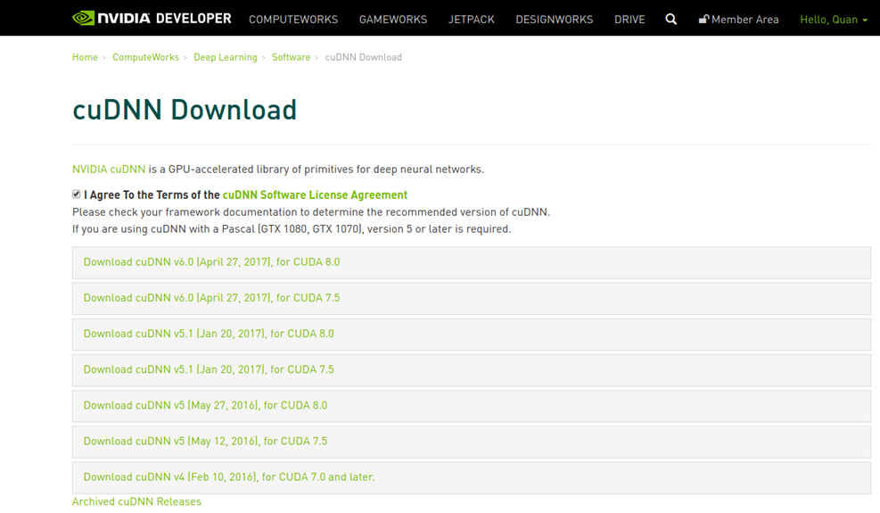

如你所见，cuDNN 有多个版本，我们将使用适用于 CUDA 8.0 的 cuDNN v5.1，这是 TensorFlow 所需的 cuDNN 版本。现在，你可以点击 cuDNN v5.1 Library for Linux 链接来下载该库：

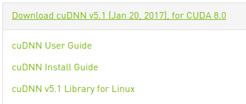

你可以继续使用终端，并使用以下命令在你的机器上安装 cuDNN：

```py
tar -xf cudnn-8.0-linux-x64-v5.1.tgz 
cd cuda
sudo cp -P include/cudnn.h /usr/include/
sudo cp -P lib64/libcudnn* /usr/lib/x86_64-linux-gnu/
sudo chmod a+r /usr/lib/x86_64-linux-gnu/libcudnn*
```

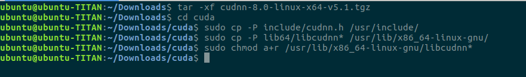

# 安装 TensorFlow

设置完成后，我们可以通过 `pip` 工具轻松安装支持 GPU 的 TensorFlow，具体命令如下：

```py
sudo pip install tensorflow-gpu
```

命令的结果应该如下所示：

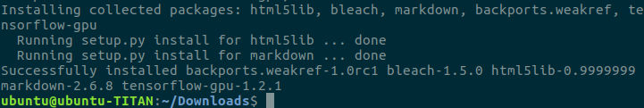

# 验证支持 GPU 的 TensorFlow

现在，您可以在命令行中输入 `python`，并输入以下 Python 命令来查看 TensorFlow 是否能识别您的 GPU：

```py
    import tensorflow as tf 
    tf.Session()
```

结果应该如下图所示：

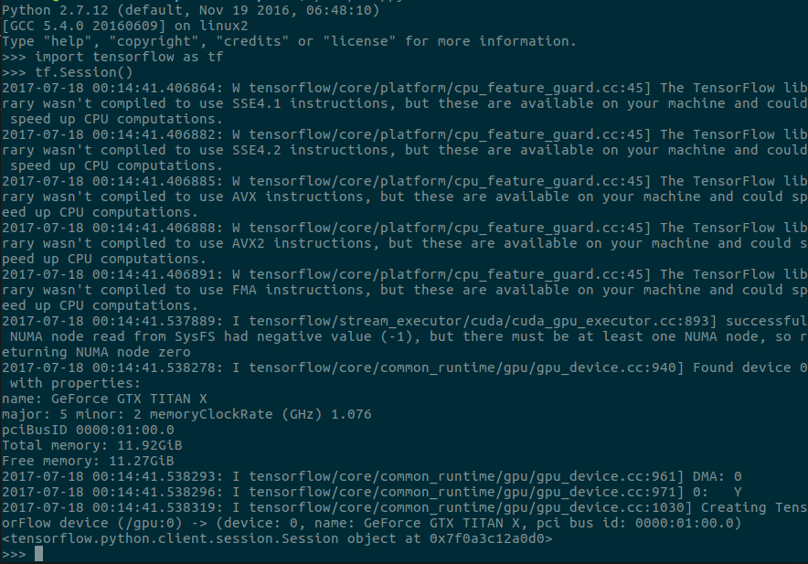

恭喜！TensorFlow 现在可以与您的 GPU 配合使用了。我们的 GPU 被识别为 GeForce GTX TITAN X，具有 11.92 GB 内存。在接下来的部分，我们将展示推荐的多版本 TensorFlow 和库（如 OpenCV）共存的方法。

# 使用 Anaconda 配合 TensorFlow

在工作中，您可能会遇到需要在同一台机器上使用多个版本的 TensorFlow 的情况，例如 TensorFlow 1.0 或 TensorFlow 1.2。我们可能需要在 Python 2.7 或 3.0 上使用 TensorFlow。通过之前的安装，我们已经成功将 TensorFlow 安装在系统的 Python 中。现在，我们将展示如何使用 Anaconda 在同一台机器上创建多个工作环境。使用 Anaconda，我们甚至可以使用不同版本的其他流行库，如 `OpenCV`、`NumPy` 和 `scikit-learn`。

首先，我们需要从 [`conda.io/miniconda.html`](https://conda.io/miniconda.html) 下载并安装 miniconda。在我们的例子中，我们选择 Python 2.7 64 位 bash 安装包，因为我们希望将 Python 2.7 作为默认 Python。然而，我们稍后可以创建使用 Python 2.7 或 Python 3 的环境。我们需要运行以下命令来启动安装程序：

```py
bash Miniconda3-latest-Linux-x86_64.sh
```

我们需要接受最终用户许可协议：

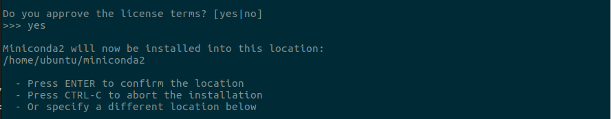

之后，我们可以继续安装。结果应该如下所示：

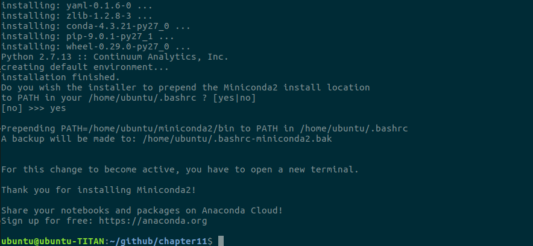

最后，我们需要加载 `.bashrc` 文件以启动 Anaconda：

```py
source ~/.bashrc
```

在本章的源代码中，我们已经提供了一些环境配置，您可以使用这些配置来创建所需的环境。

这是一个使用 Python 2.7、OpenCV 3 和 TensorFlow 1.2.1（支持 GPU）的环境。配置文件名为 `env2.yml`：

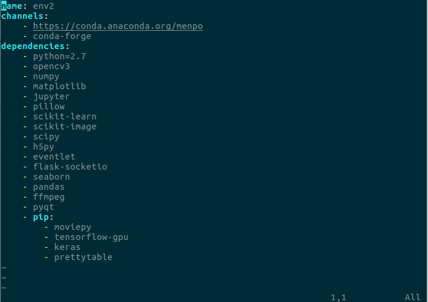

您可以轻松地将 `python=2.7` 更改为 `python=3`，将 `opencv3` 更改为 `opencv`，以分别使用 Python 3 和 OpenCV 2.4。

现在，让我们运行以下命令来创建环境：

```py
conda env create -f env2.yml
```

结果应该如下所示：

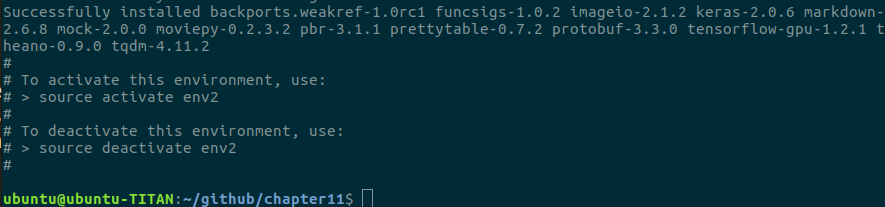

接下来，您可以输入 `source activate env2` 来激活环境。

最后，我们需要像之前一样验证 TensorFlow：

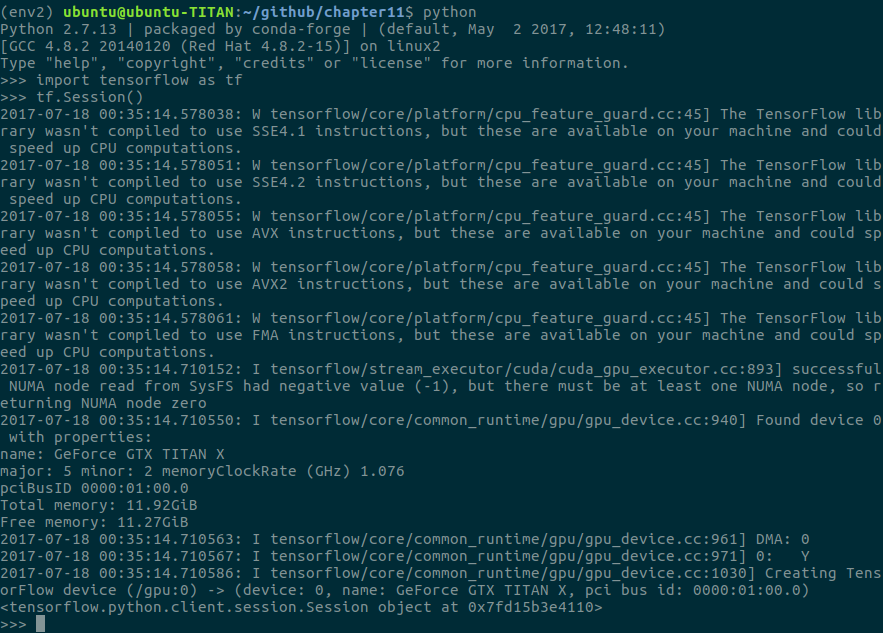

您可能会注意到前面图片左上角的 (env2)。它显示了当前环境的名称。第二行的 Python 版本是 2.7.13，并且是由 conda-forge 打包的。

现在，您可以创建多个不同的环境以供工作流使用。以下是一个名为 env3 的环境示例，包含 Python 3 和 OpenCV 2.4：

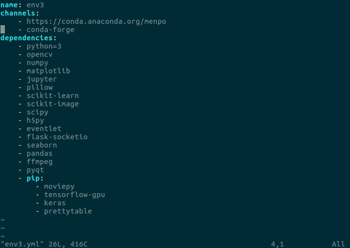

# 总结

在本章中，我们讨论了在机器学习工作流中使用 GPU 的优势，特别是在深度学习中。接着，我们展示了 Nvidia 驱动程序、CUDA 工具包、cuDNN 和支持 GPU 的 TensorFlow 的逐步安装过程。我们还介绍了我们推荐的工作流，以便使用多个版本的 TensorFlow 和其他库。
