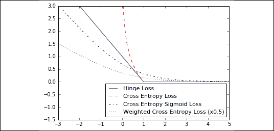

# 第二章：TensorFlow 方式

在*第一章*，*TensorFlow 2.x 入门*中，我们介绍了 TensorFlow 如何创建张量并使用变量。在本章中，我们将介绍如何使用急切执行将这些对象组合在一起，从而动态地设置计算图。基于此，我们可以设置一个简单的分类器，并查看其表现如何。

另外，请记住，本书当前和更新后的代码可以在 GitHub 上在线获取，地址为[`github.com/PacktPublishing/Machine-Learning-Using-TensorFlow-Cookbook`](https://github.com/PacktPublishing/Machine-Learning-Using-TensorFlow-Cookbook)。

在本章中，我们将介绍 TensorFlow 操作的关键组件。然后，我们将把它们结合起来，创建一个简单的分类器并评估结果。在本章结束时，你应该已学到以下内容：

+   使用急切执行的操作

+   分层嵌套操作

+   使用多层

+   实现损失函数

+   实现反向传播

+   批量训练和随机训练

+   将所有内容结合在一起

让我们开始处理越来越复杂的配方，展示 TensorFlow 处理和解决数据问题的方法。

# 使用急切执行的操作

感谢*第一章*，*TensorFlow 2.x 入门*，我们已经能够创建 TensorFlow 中的对象，如变量。现在，我们将介绍针对这些对象的操作。为了做到这一点，我们将返回到急切执行，并通过一个新的基本配方展示如何操作矩阵。本配方及后续配方仍然是基础的，但在本章过程中，我们将把这些基础配方结合起来形成更复杂的配方。

## 准备开始

首先，我们加载 TensorFlow 和 NumPy，如下所示：

```py
import TensorFlow as tf
import NumPy as np 
```

这就是我们开始所需的一切；现在我们可以继续进行。

## 如何操作...

在这个例子中，我们将使用到目前为止学到的内容，将列表中的每个数字发送到 TensorFlow 命令进行计算并打印输出。

首先，我们声明我们的张量和变量。在所有可能的将数据传递给变量的方式中，我们将创建一个 NumPy 数组来传递给变量，然后将其用于操作：

```py
x_vals = np.array([1., 3., 5., 7., 9.])
x_data = tf.Variable(x_vals, dtype=tf.float32)
m_const = tf.constant(3.)
operation = tf.multiply(x_data, m_const)
for result in operation:
    print(result.NumPy()) 
```

上述代码的输出结果如下：

```py
3.0 
9.0 
15.0 
21.0 
27.0 
```

一旦你习惯了使用 TensorFlow 变量、常量和函数，就会自然而然地从 NumPy 数组数据开始，逐步构建数据结构和操作，并在过程中测试它们的结果。

## 它是如何工作的...

使用急切执行，TensorFlow 会立即评估操作值，而不是操作符号句柄，这些句柄指向计算图中的节点，后者将在之后编译和执行。因此，你可以直接遍历乘法操作的结果，并使用 `.NumPy` 方法打印出返回的 NumPy 对象，这个方法会从 TensorFlow 张量中返回一个 NumPy 对象。

# 分层嵌套操作

在这个示例中，我们将学习如何将多个操作结合起来工作；了解如何将操作串联在一起非常重要。这将为我们的网络设置分层操作进行执行。在这个示例中，我们将用两个矩阵乘以一个占位符，并执行加法操作。我们将输入两个以三维 NumPy 数组形式表示的矩阵。

这是另一个简单的示例，给你一些关于如何使用 TensorFlow 编写代码的灵感，利用函数或类等常见结构，提高代码的可读性和模块化性。即使最终产品是一个神经网络，我们依然在编写计算机程序，并且应该遵循编程最佳实践。

## 准备工作

和往常一样，我们只需要导入 TensorFlow 和 NumPy，代码如下：

```py
import TensorFlow as tf
import NumPy as np 
```

我们现在准备好继续进行我们的示例。

## 如何实现…

我们将输入两个大小为`3` x `5`的 NumPy 数组。我们将每个矩阵与大小为`5` x `1`的常量相乘，得到一个大小为`3` x `1`的矩阵。接着，我们将这个结果与一个`1` x `1`的矩阵相乘，最终得到一个`3` x `1`的矩阵。最后，我们在末尾加上一个`3` x `1`的矩阵，代码如下：

1.  首先，我们创建要输入的数据和相应的占位符：

    ```py
    my_array = np.array([[1., 3., 5., 7., 9.], 
                         [-2., 0., 2., 4., 6.], 
                         [-6., -3., 0., 3., 6.]]) 
    x_vals = np.array([my_array, my_array + 1])
    x_data = tf.Variable(x_vals, dtype=tf.float32) 
    ```

1.  然后，我们创建用于矩阵乘法和加法的常量：

    ```py
    m1 = tf.constant([[1.], [0.], [-1.], [2.], [4.]]) 
    m2 = tf.constant([[2.]]) 
    a1 = tf.constant([[10.]]) 
    ```

1.  接下来，我们声明要立即执行的操作。作为好的编程实践，我们创建执行所需操作的函数：

    ```py
    def prod1(a, b):
        return tf.matmul(a, b)
    def prod2(a, b):
        return tf.matmul(a, b) 
    def add1(a, b):
        return tf.add(a, b) 
    ```

1.  最后，我们嵌套我们的函数并显示结果：

    ```py
    result = add1(prod2(prod1(x_data, m1), m2), a1)
    print(result.NumPy()) 
    [[ 102.] 
     [  66.] 
     [  58.]] 
    [[ 114.] 
     [  78.] 
     [  70.]] 
    ```

使用函数（以及类，我们将进一步介绍）将帮助你编写更清晰的代码。这使得调试更加高效，并且便于代码的维护和重用。

## 它是如何工作的…

借助即时执行，我们不再需要使用那种"万事俱备"的编程风格（指的是将几乎所有内容都放在程序的全局作用域中；详情请见[`stackoverflow.com/questions/33779296/what-is-exact-meaning-of-kitchen-sink-in-programming`](https://stackoverflow.com/questions/33779296/what-is-exact-meaning-of-kitchen-sink-in-programming)）这种风格在使用 TensorFlow 1.x 时非常常见。目前，你可以选择采用函数式编程风格或面向对象编程风格，就像我们在这个简短示例中展示的那样，你可以将所有操作和计算按逻辑合理的方式排列，使其更易理解：

```py
class Operations():  
    def __init__(self, a):
        self.result = a
    def apply(self, func, b):
        self.result = func(self.result, b)
        return self

operation = (Operations(a=x_data)
             .apply(prod1, b=m1)
             .apply(prod2, b=m2)
             .apply(add1, b=a1))
print(operation.result.NumPy()) 
```

类比函数更能帮助你组织代码并提高重用性，这得益于类继承。

## 还有更多…

在这个示例中，我们需要在运行数据之前声明数据形状并知道操作的结果形状。并非所有情况下都如此。可能会有一维或二维我们事先不知道的情况，或者某些维度在数据处理过程中会发生变化。为此，我们将可以变化（或未知）的维度标记为`None`。

例如，要初始化一个具有未知行数的变量，我们将写下以下行，然后我们可以分配任意行数的值：

```py
v = tf.Variable(initial_value=tf.random.normal(shape=(1, 5)),
                shape=tf.TensorShape((None, 5)))
v.assign(tf.random.normal(shape=(10, 5))) 
```

矩阵乘法具有灵活的行数是可以接受的，因为这不会影响我们操作的安排。当我们将数据馈送给多个大小批次时，这将在后续章节中非常方便。

虽然使用`None`作为维度允许我们使用可变大小的维度，但我建议在填写维度时尽可能明确。如果我们的数据大小预先已知，则应将该大小明确写入维度中。建议将`None`用作维度的使用限制在数据的批大小（或者我们同时计算的数据点数）。

# 处理多层

现在我们已经涵盖了多个操作，接下来我们将讨论如何连接各层，这些层中有数据通过它们传播。在本示例中，我们将介绍如何最佳连接各层，包括自定义层。我们将生成和使用的数据将代表小随机图像。最好通过一个简单的示例理解这种操作，并看看如何使用一些内置层执行计算。我们将探讨的第一层称为**移动窗口**。我们将在二维图像上执行一个小的移动窗口平均值，然后第二层将是一个自定义操作层。

移动窗口对与时间序列相关的所有内容都非常有用。尽管有专门用于序列的层，但在分析 MRI 扫描（神经影像）或声谱图时，移动窗口可能会很有用。

此外，我们将看到计算图可能变得很大，难以查看。为了解决这个问题，我们还将介绍如何命名操作并为层创建作用域。

## 准备工作

首先，您必须加载常用的包 - NumPy 和 TensorFlow - 使用以下内容：

```py
import TensorFlow as tf
import NumPy as np 
```

现在让我们继续进行配方。这次事情变得更加复杂和有趣。

## 如何做...

我们按以下步骤进行。

首先，我们用 NumPy 创建我们的示例二维图像。这个图像将是一个 4x4 像素的图像。我们将在四个维度上创建它；第一个和最后一个维度将具有大小为`1`（我们保持批维度不同，以便您可以尝试更改其大小）。请注意，某些 TensorFlow 图像函数将操作四维图像。这四个维度是图像编号、高度、宽度和通道，为了使它与一个通道的图像兼容，我们将最后一个维度明确设置为`1`，如下所示：

```py
batch_size = [1]
x_shape = [4, 4, 1]
x_data = tf.random.uniform(shape=batch_size + x_shape) 
```

要创建跨我们的 4x4 图像的移动窗口平均值，我们将使用一个内置函数，该函数将在形状为 2x2 的窗口上卷积一个常数。我们将使用的函数是`conv2d()`；这个函数在图像处理和 TensorFlow 中经常使用。

此函数对我们指定的窗口和滤波器进行分段乘积。我们还必须在两个方向上指定移动窗口的步幅。在这里，我们将计算四个移动窗口的平均值：左上角、右上角、左下角和右下角的四个像素。我们通过创建一个 `2` x `2` 窗口，并且在每个方向上使用长度为 `2` 的步幅来实现这一点。为了取平均值，我们将 `2` x `2` 窗口与常数 `0.25` 做卷积，如下所示：

```py
def mov_avg_layer(x):
    my_filter = tf.constant(0.25, shape=[2, 2, 1, 1]) 
    my_strides = [1, 2, 2, 1] 
    layer = tf.nn.conv2d(x, my_filter, my_strides, 
                         padding='SAME', name='Moving_Avg_Window')
    return layer 
```

请注意，我们还通过函数的 name 参数将此层命名为 `Moving_Avg_Window`。

要计算卷积层的输出大小，我们可以使用以下公式：输出 = (`W` – `F` + 2`P`)/`S` + 1)，其中 `W` 是输入大小，`F` 是滤波器大小，`P` 是零填充，`S` 是步幅。

现在，我们定义一个自定义层，该层将操作移动窗口平均值的 `2` x `2` 输出。自定义函数将首先将输入乘以另一个 `2` x `2` 矩阵张量，然后将每个条目加 `1`。之后，我们对每个元素取 sigmoid，并返回 `2` x `2` 矩阵。由于矩阵乘法仅适用于二维矩阵，我们需要去除大小为 `1` 的图像的额外维度。TensorFlow 可以使用内置的 `squeeze()` 函数来完成这一点。在这里，我们定义了新的层：

```py
 def custom_layer(input_matrix): 
        input_matrix_sqeezed = tf.squeeze(input_matrix) 
        A = tf.constant([[1., 2.], [-1., 3.]]) 
        b = tf.constant(1., shape=[2, 2]) 
        temp1 = tf.matmul(A, input_matrix_sqeezed) 
        temp = tf.add(temp1, b) # Ax + b 
        return tf.sigmoid(temp) 
```

现在，我们必须安排网络中的两个层。我们将通过依次调用一个层函数来完成这一点，如下所示：

```py
first_layer = mov_avg_layer(x_data) 
second_layer = custom_layer(first_layer) 
```

现在，我们只需将 `4` x `4` 图像输入函数中。最后，我们可以检查结果，如下所示：

```py
print(second_layer)

tf.Tensor(
[[0.9385519  0.90720266]
 [0.9247799  0.82272065]], shape=(2, 2), dtype=float32) 
```

现在让我们更深入地了解它是如何工作的。

## 工作原理...

第一层被命名为 `Moving_Avg_Window`。第二层是称为 `Custom_Layer` 的一组操作。这两个层处理的数据首先在左侧被折叠，然后在右侧被扩展。正如示例所示，您可以将所有层封装到函数中并依次调用它们，以便后续层处理前一层的输出。

# 实现损失函数

对于这个示例，我们将介绍在 TensorFlow 中可以使用的一些主要损失函数。损失函数是机器学习算法的关键组成部分。它们衡量模型输出与目标（真实）值之间的距离。

为了优化我们的机器学习算法，我们需要评估结果。在 TensorFlow 中，评估结果取决于指定的损失函数。损失函数告诉 TensorFlow 模型输出与目标结果的好坏程度。在大多数情况下，我们会有一组数据和一个目标，用于训练我们的算法。损失函数比较目标和预测（它衡量模型输出与目标真实值之间的距离），并提供两者之间的数值量化。

## 准备工作

我们首先启动一个计算图，并加载 `matplotlib`，一个 Python 绘图包，如下所示：

```py
import matplotlib.pyplot as plt 
import TensorFlow as tf 
```

既然我们已经准备好绘制图表了，让我们毫不拖延地进入配方部分。

## 如何实现...

首先，我们将讨论回归的损失函数，这意味着预测一个连续的因变量。首先，我们将创建一个预测序列和目标作为张量。我们将在`-1`和`1`之间的 500 个 x 值上输出结果。有关输出的图表，请参见*如何工作...*部分。使用以下代码：

```py
x_vals = tf.linspace(-1., 1., 500) 
target = tf.constant(0.) 
```

L2 范数损失也称为欧几里得损失函数。它只是与目标的距离的平方。在这里，我们将假设目标为零来计算损失函数。L2 范数是一个很好的损失函数，因为它在接近目标时非常曲线，算法可以利用这一事实在接近零时更慢地收敛。我们可以按如下方式实现：

```py
def l2(y_true, y_pred):
    return tf.square(y_true - y_pred) 
```

TensorFlow 有一个内置的 L2 范数形式，叫做`tf.nn.l2_loss()`。这个函数实际上是 L2 范数的一半。换句话说，它与之前的函数相同，只是除以了 2。

L1 范数损失也称为**绝对损失函数**。它不对差异进行平方处理，而是取绝对值。L1 范数比 L2 范数更适合处理离群值，因为它对较大值的陡峭度较低。需要注意的问题是，L1 范数在目标处不平滑，这可能导致算法无法很好地收敛。它的形式如下所示：

```py
def l1(y_true, y_pred):
    return tf.abs(y_true - y_pred) 
```

伪-Huber 损失是**Huber 损失函数**的连续且平滑的近似。这个损失函数试图通过在接近目标时采用 L1 和 L2 范数的优点，并且对于极端值更加平缓，来结合这两者。它的形式取决于一个额外的参数`delta`，它决定了它的陡峭度。我们将绘制两个形式，*delta1 = 0.25*和*delta2 = 5*，以显示差异，如下所示：

```py
def phuber1(y_true, y_pred):
    delta1 = tf.constant(0.25) 
    return tf.multiply(tf.square(delta1), tf.sqrt(1\. +  
                        tf.square((y_true - y_pred)/delta1)) - 1.) 
def phuber2(y_true, y_pred):
    delta2 = tf.constant(5.) 
    return tf.multiply(tf.square(delta2), tf.sqrt(1\. +  
                        tf.square((y_true - y_pred)/delta2)) - 1.) 
```

现在，我们将继续讨论分类问题的损失函数。分类损失函数用于评估在预测分类结果时的损失。通常，我们模型的输出是一个介于`0`和`1`之间的实数值。然后，我们选择一个阈值（通常选择 0.5），如果结果大于该阈值，则将结果分类为该类别。接下来，我们将考虑针对分类输出的各种损失函数。

首先，我们需要重新定义我们的预测值`(x_vals)`和`target`。我们将保存输出并在下一部分进行绘制。使用以下代码：

```py
x_vals = tf.linspace(-3., 5., 500) 
target = tf.fill([500,], 1.) 
```

Hinge 损失主要用于支持向量机，但也可以用于神经网络。它用于计算两个目标类别之间的损失，`1` 和 -`1`。在以下代码中，我们使用目标值`1`，因此我们的预测值越接近`1`，损失值就越低：

```py
def hinge(y_true, y_pred):
    return tf.maximum(0., 1\. - tf.multiply(y_true, y_pred)) 
```

二分类情况下的交叉熵损失有时也被称为**逻辑损失函数**。当我们预测 `0` 或 `1` 两个类别时，便会使用该函数。我们希望衡量实际类别（`0` 或 `1`）与预测值之间的距离，预测值通常是介于 `0` 和 `1` 之间的实数。为了衡量这个距离，我们可以使用信息理论中的交叉熵公式，如下所示：

```py
def xentropy(y_true, y_pred):
    return (- tf.multiply(y_true, tf.math.log(y_pred)) -   
          tf.multiply((1\. - y_true), tf.math.log(1\. - y_pred))) 
```

Sigmoid 交叉熵损失与之前的损失函数非常相似，不同之处在于我们在将 `x` 值代入交叉熵损失之前，使用 sigmoid 函数对其进行转换，如下所示：

```py
def xentropy_sigmoid(y_true, y_pred):
    return tf.nn.sigmoid_cross_entropy_with_logits(labels=y_true,  
                                                   logits=y_pred) 
```

加权交叉熵损失是 sigmoid 交叉熵损失的加权版本。我们对正类目标进行加权。作为示例，我们将正类目标的权重设为 `0.5`，如下所示：

```py
def xentropy_weighted(y_true, y_pred):
    weight = tf.constant(0.5) 
    return tf.nn.weighted_cross_entropy_with_logits(labels=y_true,
                                                    logits=y_pred,  
                                                pos_weight=weight) 
```

Softmax 交叉熵损失适用于非归一化的输出。该函数用于在目标类别只有一个而不是多个时，计算损失。因此，该函数通过 softmax 函数将输出转换为概率分布，然后根据真实的概率分布计算损失函数，如下所示：

```py
def softmax_xentropy(y_true, y_pred):
    return tf.nn.softmax_cross_entropy_with_logits(labels=y_true,                                                    logits=y_pred)

unscaled_logits = tf.constant([[1., -3., 10.]]) 
target_dist = tf.constant([[0.1, 0.02, 0.88]])
print(softmax_xentropy(y_true=target_dist,                        y_pred=unscaled_logits))
[ 1.16012561] 
```

稀疏 softmax 交叉熵损失与 softmax 交叉熵损失几乎相同，区别在于目标不是概率分布，而是表示哪个类别是`true`的索引。我们传入的是该类别的索引，而不是一个稀疏的全零目标向量，其中有一个值是`1`，如下所示：

```py
def sparse_xentropy(y_true, y_pred):
    return tf.nn.sparse_softmax_cross_entropy_with_logits(
                                                    labels=y_true,
                                                    logits=y_pred) 
unscaled_logits = tf.constant([[1., -3., 10.]]) 
sparse_target_dist = tf.constant([2]) 
print(sparse_xentropy(y_true=sparse_target_dist,  
                      y_pred=unscaled_logits))
[ 0.00012564] 
```

现在让我们通过将这些损失函数绘制在图上，进一步理解它们是如何工作的。

## 它是如何工作的...

以下是如何使用`matplotlib`绘制回归损失函数：

```py
x_vals = tf.linspace(-1., 1., 500) 
target = tf.constant(0.) 
funcs = [(l2, 'b-', 'L2 Loss'),
         (l1, 'r--', 'L1 Loss'),
         (phuber1, 'k-.', 'P-Huber Loss (0.25)'),
         (phuber2, 'g:', 'P-Huber Loss (5.0)')]
for func, line_type, func_name in funcs:
    plt.plot(x_vals, func(y_true=target, y_pred=x_vals), 
             line_type, label=func_name)
plt.ylim(-0.2, 0.4) 
plt.legend(loc='lower right', prop={'size': 11}) 
plt.show() 
```

我们从前面的代码中得到以下图示：


图 2.1：绘制不同的回归损失函数

以下是如何使用`matplotlib`绘制不同的分类损失函数：

```py
x_vals = tf.linspace(-3., 5., 500)  
target = tf.fill([500,], 1.)
funcs = [(hinge, 'b-', 'Hinge Loss'),
         (xentropy, 'r--', 'Cross Entropy Loss'),
         (xentropy_sigmoid, 'k-.', 'Cross Entropy Sigmoid Loss'),
         (xentropy_weighted, 'g:', 'Weighted Cross Enropy Loss            (x0.5)')]
for func, line_type, func_name in funcs:
    plt.plot(x_vals, func(y_true=target, y_pred=x_vals), 
             line_type, label=func_name)
plt.ylim(-1.5, 3) 
plt.legend(loc='lower right', prop={'size': 11}) 
plt.show() 
```

我们从前面的代码中得到以下图示：



图 2.2：分类损失函数的绘图

每条损失曲线都为神经网络优化提供了不同的优势。接下来我们将进一步讨论这些内容。

## 还有更多...

这里有一张表格，总结了我们刚刚以图形方式描述的不同损失函数的属性和优点：

| 损失函数 | 用途 | 优势 | 缺点 |
| --- | --- | --- | --- |
| L2 | 回归 | 更稳定 | 鲁棒性差 |
| L1 | 回归 | 更具鲁棒性 | 稳定性差 |
| 伪-Huber | 回归 | 更具鲁棒性和稳定性 | 多了一个参数 |
| Hinge | 分类 | 在支持向量机（SVM）中创建最大间隔 | 损失无界，受异常值影响 |
| 交叉熵 | 分类 | 更稳定 | 损失无界，鲁棒性差 |

剩余的分类损失函数都与交叉熵损失的类型有关。交叉熵 Sigmoid 损失函数适用于未缩放的 logits，并且优先于计算 Sigmoid 损失，然后计算交叉熵损失，因为 TensorFlow 有更好的内置方法来处理数值边缘情况。Softmax 交叉熵和稀疏 softmax 交叉熵也是如此。

这里描述的大多数分类损失函数适用于两类预测。可以通过对每个预测/目标求和来将其扩展到多类。

在评估模型时，还有许多其他指标可供参考。以下是一些需要考虑的其他指标列表：

| 模型指标 | 描述 |
| --- | --- |
| R-squared (决定系数) | 对于线性模型，这是因变量方差中由独立数据解释的比例。对于具有较多特征的模型，请考虑使用调整后的 R-squared。 |
| 均方根误差 | 对于连续模型，这衡量了预测值与实际值之间的差异，通过平均平方误差的平方根。 |
| 混淆矩阵 | 对于分类模型，我们查看预测类别与实际类别的矩阵。完美的模型在对角线上有所有计数。 |
| 召回率 | 对于分类模型而言，这是真正例占所有预测正例的比例。 |
| 精确度 | 对于分类模型而言，这是真正例占所有实际正例的比例。 |
| F-score | 对于分类模型而言，这是精确度和召回率的调和平均值。 |

在选择正确的指标时，您必须同时评估您要解决的问题（因为每个指标的行为会有所不同，并且根据手头的问题，一些损失最小化策略对我们的问题可能比其他更好），并且对神经网络的行为进行实验。

# 实施反向传播

使用 TensorFlow 的好处之一是它可以跟踪操作并根据反向传播自动更新模型变量。在这个教程中，我们将介绍如何在训练机器学习模型时利用这一方面。

## 准备就绪

现在，我们将介绍如何以使得损失函数最小化的方式改变模型中的变量。我们已经学会了如何使用对象和操作，以及如何创建损失函数来衡量预测与目标之间的距离。现在，我们只需告诉 TensorFlow 如何通过网络反向传播错误，以便更新变量，使损失函数最小化。这通过声明一个优化函数来实现。一旦声明了优化函数，TensorFlow 将遍历计算图中的所有计算，找出反向传播项。当我们输入数据并最小化损失函数时，TensorFlow 将相应地修改网络中的变量。

对于这个食谱，我们将做一个非常简单的回归算法。我们将从一个正态分布中采样随机数，均值为 1，标准差为 0.1。然后，我们将这些数字通过一次操作，操作是将它们乘以一个权重张量，然后加上一个偏置张量。由此，损失函数将是输出和目标之间的 L2 范数。我们的目标将与输入高度相关，因此任务不会太复杂，但该食谱会非常具有示范性，并且可以轻松地用于更复杂的问题。

第二个例子是一个非常简单的二分类算法。在这里，我们将从两个正态分布中生成 100 个数字，*N(-3,1)* 和 *N(3,1)*。所有来自 *N(-3, 1)* 的数字将属于目标类别 `0`，而所有来自 *N(3, 1)* 的数字将属于目标类别 `1`。用于区分这些类别的模型（它们是完全可分的）将再次是一个线性模型，并根据 sigmoid 交叉熵损失函数进行优化，因此，首先对模型结果进行 sigmoid 转换，然后计算交叉熵损失函数。

虽然指定合适的学习率有助于算法的收敛，但我们还必须指定一种优化类型。从前面的两个例子中，我们使用的是标准的梯度下降法。这是通过 `tf.optimizers.SGD` TensorFlow 函数实现的。

## 如何操作...

我们将从回归示例开始。首先，我们加载通常伴随我们食谱的数值 Python 库，`NumPy` 和 `TensorFlow`：

```py
import NumPy as np 
import TensorFlow as tf 
```

接下来，我们创建数据。为了使一切易于复制，我们希望将随机种子设置为特定值。我们将在我们的食谱中始终重复这一点，这样我们就能精确获得相同的结果；你可以自己检查，通过简单地更改种子数值，随机性是如何影响食谱中的结果的。

此外，为了确保目标和输入有很好的相关性，可以绘制这两个变量的散点图：

```py
np.random.seed(0)
x_vals = np.random.normal(1, 0.1, 100).astype(np.float32) 
y_vals = (x_vals * (np.random.normal(1, 0.05, 100) - 0.5)).astype(np.float32)
plt.scatter(x_vals, y_vals)
plt.show() 
```


图 2.3：x_vals 和 y_vals 的散点图

我们将网络的结构（类型为 *bX + a* 的线性模型）添加为一个函数：

```py
def my_output(X, weights, biases):
    return tf.add(tf.multiply(X, weights), biases) 
```

接下来，我们将我们的 L2 损失函数添加到网络的结果中进行应用：

```py
def loss_func(y_true, y_pred):
    return tf.reduce_mean(tf.square(y_pred - y_true)) 
```

现在，我们必须声明一种方法来优化图中的变量。我们声明一个优化算法。大多数优化算法需要知道在每次迭代中应该走多远。这种距离由学习率控制。设置正确的值对于我们处理的问题是特定的，因此我们只能通过实验来找到合适的设置。无论如何，如果我们的学习率太高，算法可能会超过最小值，但如果学习率太低，算法可能会需要太长时间才能收敛。

学习率对收敛有很大影响，我们将在本节末尾再次讨论它。虽然我们使用的是标准的梯度下降算法，但还有许多其他替代选择。例如，有些优化算法的操作方式不同，取决于问题的不同，它们可以达到更好的或更差的最优解。关于不同优化算法的全面概述，请参见 Sebastian Ruder 在 *另见* 部分列出的文章：

```py
my_opt = tf.optimizers.SGD(learning_rate=0.02) 
```

关于最优学习率的理论有很多。这是机器学习算法中最难解决的问题之一。有关学习率与特定优化算法之间关系的好文章，列在此食谱末尾的 *另见* 部分。

现在，我们可以初始化网络变量（`weights` 和 `biases`），并设置一个记录列表（命名为 `history`），以帮助我们可视化优化步骤：

```py
tf.random.set_seed(1)
np.random.seed(0)
weights = tf.Variable(tf.random.normal(shape=[1])) 
biases = tf.Variable(tf.random.normal(shape=[1])) 
history = list() 
```

最后一步是循环我们的训练算法，并告诉 TensorFlow 进行多次训练。我们将训练 100 次，并在每 25 次迭代后打印结果。为了训练，我们将选择一个随机的 `x` 和 `y` 输入，并将其输入到图中。TensorFlow 会自动计算损失，并略微调整权重和偏置，以最小化损失：

```py
for i in range(100): 
    rand_index = np.random.choice(100) 
    rand_x = [x_vals[rand_index]] 
    rand_y = [y_vals[rand_index]]
    with tf.GradientTape() as tape:
        predictions = my_output(rand_x, weights, biases)
        loss = loss_func(rand_y, predictions)
    history.append(loss.NumPy())
    gradients = tape.gradient(loss, [weights, biases])
    my_opt.apply_gradients(zip(gradients, [weights, biases]))
    if (i + 1) % 25 == 0: 
        print(f'Step # {i+1} Weights: {weights.NumPy()} Biases: {biases.NumPy()}')
        print(f'Loss = {loss.NumPy()}') 
Step # 25 Weights: [-0.58009654] Biases: [0.91217995]
Loss = 0.13842473924160004
Step # 50 Weights: [-0.5050226] Biases: [0.9813488]
Loss = 0.006441597361117601
Step # 75 Weights: [-0.4791306] Biases: [0.9942327]
Loss = 0.01728087291121483
Step # 100 Weights: [-0.4777394] Biases: [0.9807473]
Loss = 0.05371852591633797 
```

在循环中，`tf.GradientTape()` 使 TensorFlow 能够追踪计算过程，并计算相对于观测变量的梯度。`GradientTape()` 范围内的每个变量都会被监控（请记住，常量不会被监控，除非你明确使用命令 `tape.watch(constant)` 来监控它）。一旦完成监控，你可以计算目标相对于一组源的梯度（使用命令 `tape.gradient(target, sources)`），并获得一个渐变的急切张量，可以应用于最小化过程。此操作会自动通过用新值更新源（在我们的例子中是 `weights` 和 `biases` 变量）来完成。

当训练完成后，我们可以可视化优化过程在连续梯度应用下的变化：

```py
plt.plot(history)
plt.xlabel('iterations')
plt.ylabel('loss')
plt.show() 
```


图 2.4：我们方法中 L2 损失随迭代的变化

到这个阶段，我们将介绍简单分类示例的代码。我们可以使用相同的 TensorFlow 脚本，做一些更新。记住，我们将尝试找到一组最优的权重和偏置，使得数据能够分成两类。

首先，我们从两个不同的正态分布 `N(-3, 1)` 和 `N(3, 1)` 拉取数据。我们还将生成目标标签，并可视化这两类如何在我们的预测变量上分布：

```py
np.random.seed(0)
x_vals = np.concatenate((np.random.normal(-3, 1, 50), 
                         np.random.normal(3, 1, 50))
                    ).astype(np.float32) 
y_vals = np.concatenate((np.repeat(0., 50), np.repeat(1., 50))).astype(np.float32) 
plt.hist(x_vals[y_vals==1], color='b')
plt.hist(x_vals[y_vals==0], color='r')
plt.show() 
```


图 2.5：x_vals 上的类别分布

由于这个问题的特定损失函数是 Sigmoid 交叉熵，我们更新我们的损失函数：

```py
def loss_func(y_true, y_pred):
    return tf.reduce_mean(
        tf.nn.sigmoid_cross_entropy_with_logits(labels=y_true, 
                                                logits=y_pred)) 
```

接下来，我们初始化变量：

```py
tf.random.set_seed(1)
np.random.seed(0)
weights = tf.Variable(tf.random.normal(shape=[1])) 
biases = tf.Variable(tf.random.normal(shape=[1])) 
history = list() 
```

最后，我们对一个随机选择的数据点进行了数百次循环，并相应地更新了`weights`和`biases`变量。像之前一样，每进行 25 次迭代，我们会打印出变量的值和损失值：

```py
for i in range(100):    
    rand_index = np.random.choice(100) 
    rand_x = [x_vals[rand_index]] 
    rand_y = [y_vals[rand_index]]
    with tf.GradientTape() as tape:
        predictions = my_output(rand_x, weights, biases)
        loss = loss_func(rand_y, predictions)
    history.append(loss.NumPy())
    gradients = tape.gradient(loss, [weights, biases])
    my_opt.apply_gradients(zip(gradients, [weights, biases]))
    if (i + 1) % 25 == 0: 
        print(f'Step {i+1} Weights: {weights.NumPy()} Biases: {biases.NumPy()}')
        print(f'Loss = {loss.NumPy()}')
Step # 25 Weights: [-0.01804185] Biases: [0.44081175]
Loss = 0.5967269539833069
Step # 50 Weights: [0.49321094] Biases: [0.37732077]
Loss = 0.3199256658554077
Step # 75 Weights: [0.7071932] Biases: [0.32154965]
Loss = 0.03642747551202774
Step # 100 Weights: [0.8395616] Biases: [0.30409005]
Loss = 0.028119442984461784 
```

一个图表，也可以在这种情况下，揭示优化过程的进展：

```py
plt.plot(history)
plt.xlabel('iterations')
plt.ylabel('loss')
plt.show() 
```


图 2.6：我们方法中通过迭代的 Sigmoid 交叉熵损失

图表的方向性很清晰，尽管轨迹有些崎岖，因为我们一次只学习一个示例，从而使学习过程具有决定性的随机性。图表还可能指出需要稍微降低学习率的必要性。

## 它是如何工作的...

总结和解释一下，对于这两个示例，我们做了以下操作：

1.  我们创建了数据。两个示例都需要将数据加载到计算网络所用的特定变量中。

1.  我们初始化了变量。我们使用了一些随机高斯值，但初始化本身是一个独立的话题，因为最终的结果可能在很大程度上取决于我们如何初始化网络（只需在初始化前更改随机种子即可找到答案）。

1.  我们创建了一个损失函数。回归使用了 L2 损失，分类使用了交叉熵损失。

1.  我们定义了一个优化算法。两个算法都使用了梯度下降法。

1.  我们遍历了随机数据样本，以逐步更新我们的变量。

## 还有更多...

正如我们之前提到的，优化算法对学习率的选择很敏感。总结这一选择的影响非常重要，可以简明扼要地表述如下：

| 学习率大小 | 优点/缺点 | 用途 |
| --- | --- | --- |
| **较小的学习率** | 收敛较慢，但结果更准确 | 如果解不稳定，首先尝试降低学习率 |
| **较大的学习率** | 准确性较低，但收敛速度较快 | 对于某些问题，有助于防止解停滞 |

有时，标准的梯度下降算法可能会被卡住或显著变慢。这可能发生在优化停留在鞍点的平坦区域时。为了解决这个问题，解决方案是考虑动量项，它加上了上一步梯度下降值的一部分。你可以通过在`tf.optimizers.SGD`中设置动量和 Nesterov 参数，以及你的学习率，来实现这个解决方案（详细信息请参见 [`www.TensorFlow.org/api_docs/python/tf/keras/optimizers/SGD`](https://www.TensorFlow.org/api_docs/python/tf/keras/optimizers/SGD)）。

另一种变体是对我们模型中每个变量的优化器步骤进行变化。理想情况下，我们希望对移动较小的变量采取较大的步长，对变化较快的变量采取较小的步长。我们不会深入探讨这种方法的数学原理，但这种思想的常见实现被称为**Adagrad 算法**。该算法考虑了变量梯度的整个历史。在 TensorFlow 中，这个函数被称为 `AdagradOptimizer()` ([`www.TensorFlow.org/api_docs/python/tf/keras/optimizers/Adagrad`](https://www.TensorFlow.org/api_docs/python/tf/keras/optimizers/Adagrad))。

有时，Adagrad 会因为考虑到整个历史而过早地将梯度推到零。解决这个问题的方法是限制我们使用的步数。这就是**Adadelta 算法**。我们可以通过使用 `AdadeltaOptimizer()` 函数来应用这一方法 ([`www.TensorFlow.org/api_docs/python/tf/keras/optimizers/Adadelta`](https://www.TensorFlow.org/api_docs/python/tf/keras/optimizers/Adadelta))。

还有一些其他不同梯度下降算法的实现。关于这些，请参阅 TensorFlow 文档 [`www.TensorFlow.org/api_docs/python/tf/keras/optimizers`](https://www.TensorFlow.org/api_docs/python/tf/keras/optimizers)。

## 另见

关于优化算法和学习率的一些参考文献，请参阅以下论文和文章：

+   本章的食谱如下：

    +   **实现损失函数**部分。

    +   **实现反向传播**部分。

+   **Kingma, D., Jimmy, L. Adam**:  *随机优化方法。ICLR* 2015 [`arxiv.org/pdf/1412.6980.pdf`](https://arxiv.org/pdf/1412.6980.pdf)

+   **Ruder, S.**  *梯度下降优化算法概述*。2016 [`arxiv.org/pdf/1609.04747v1.pdf`](https://arxiv.org/pdf/1609.04747v1.pdf)

+   **Zeiler, M.**  *ADADelta: 一种自适应学习率方法*。2012 [`arxiv.org/pdf/1212.5701.pdf`](https://arxiv.org/pdf/1212.5701.pdf)

# 使用批量和随机训练

当 TensorFlow 根据反向传播更新我们的模型变量时，它可以处理从单个数据观察（如我们在之前的食谱中所做的）到一次处理大量数据的情况。仅处理一个训练示例可能导致非常不稳定的学习过程，而使用过大的批量则可能在计算上非常昂贵。选择合适的训练类型对于使我们的机器学习算法收敛到一个解非常关键。

## 准备工作

为了让 TensorFlow 计算反向传播所需的变量梯度，我们必须在一个或多个样本上测量损失。随机训练每次只处理一个随机抽样的数据-目标对，就像我们在前面的示例中所做的那样。另一个选择是一次处理一大部分训练样本，并对梯度计算进行损失平均。训练批次的大小可以有所不同，最大可以包括整个数据集。这里，我们将展示如何将之前使用随机训练的回归示例扩展为批量训练。

我们将首先加载 `NumPy`、`matplotlib` 和 `TensorFlow`，如下所示：

```py
import matplotlib as plt 
import NumPy as np 
import TensorFlow as tf 
```

现在我们只需编写脚本并在 *如何做...* 部分中测试我们的配方。

## 如何做...

我们从声明批次大小开始。这将是我们一次性通过计算图输入的观察数据量：

```py
batch_size = 20 
```

接下来，我们只需对之前用于回归问题的代码进行一些小的修改：

```py
np.random.seed(0)
x_vals = np.random.normal(1, 0.1, 100).astype(np.float32) 
y_vals = (x_vals * (np.random.normal(1, 0.05, 100) - 0.5)).astype(np.float32)
def loss_func(y_true, y_pred):
    return tf.reduce_mean(tf.square(y_pred - y_true))
tf.random.set_seed(1)
np.random.seed(0)
weights = tf.Variable(tf.random.normal(shape=[1])) 
biases = tf.Variable(tf.random.normal(shape=[1])) 
history_batch = list()
for i in range(50):    
    rand_index = np.random.choice(100, size=batch_size) 
    rand_x = [x_vals[rand_index]] 
    rand_y = [y_vals[rand_index]]
    with tf.GradientTape() as tape:
        predictions = my_output(rand_x, weights, biases)
        loss = loss_func(rand_y, predictions)
    history_batch.append(loss.NumPy())
    gradients = tape.gradient(loss, [weights, biases])
    my_opt.apply_gradients(zip(gradients, [weights, biases]))
    if (i + 1) % 25 == 0: 
        print(f'Step # {i+1} Weights: {weights.NumPy()} \
              Biases: {biases.NumPy()}')
        print(f'Loss = {loss.NumPy()}') 
```

自从上一个示例以来，我们已经学会了在网络和成本函数中使用矩阵乘法。此时，我们只需要处理由更多行组成的输入，即批量而非单个样本。我们甚至可以将其与之前的方法进行比较，后者我们现在可以称之为随机优化：

```py
tf.random.set_seed(1)
np.random.seed(0)
weights = tf.Variable(tf.random.normal(shape=[1])) 
biases = tf.Variable(tf.random.normal(shape=[1])) 
history_stochastic = list()
for i in range(50):    
    rand_index = np.random.choice(100, size=1) 
    rand_x = [x_vals[rand_index]] 
    rand_y = [y_vals[rand_index]]
    with tf.GradientTape() as tape:
        predictions = my_output(rand_x, weights, biases)
        loss = loss_func(rand_y, predictions)
    history_stochastic.append(loss.NumPy())
    gradients = tape.gradient(loss, [weights, biases])
    my_opt.apply_gradients(zip(gradients, [weights, biases]))
    if (i + 1) % 25 == 0: 
        print(f'Step # {i+1} Weights: {weights.NumPy()} \
              Biases: {biases.NumPy()}')
        print(f'Loss = {loss.NumPy()}') 
```

运行代码后，将使用批量数据重新训练我们的网络。此时，我们需要评估结果，获取一些关于它如何工作的直觉，并反思这些结果。让我们继续进入下一部分。

## 它是如何工作的...

批量训练和随机训练在优化方法和收敛性方面有所不同。找到合适的批量大小可能是一个挑战。为了观察批量训练和随机训练在收敛上的差异，建议你调整批次大小至不同的水平。

两种方法的视觉对比能更好地解释，使用批量训练如何在这个问题上得到与随机训练相同的优化结果，尽管在过程中波动较少。以下是生成同一回归问题的随机训练和批量损失图的代码。请注意，批量损失曲线更加平滑，而随机损失曲线则更加不稳定：

```py
plt.plot(history_stochastic, 'b-', label='Stochastic Loss') 
plt.plot(history_batch, 'r--', label='Batch Loss') 
plt.legend(loc='upper right', prop={'size': 11}) 
plt.show() 
```


图 2.7：使用随机优化和批量优化时的 L2 损失比较

现在我们的图表显示了一个更平滑的趋势线。存在的波动问题可以通过降低学习率和调整批次大小来解决。

## 还有更多...

| 训练类型 | 优势 | 劣势 |
| --- | --- | --- |
| 随机训练 | 随机性有助于摆脱局部最小值 | 通常需要更多的迭代才能收敛 |
| 批量训练 | 更快地找到最小值 | 计算所需资源更多 |

# 将一切结合在一起

在本节中，我们将结合迄今为止的所有内容，并创建一个用于鸢尾花数据集的分类器。鸢尾花数据集在*第一章*《TensorFlow 入门》中的*与数据源一起使用*部分中有更详细的描述。我们将加载该数据并创建一个简单的二分类器，用于预测一朵花是否为鸢尾花 setosa。需要明确的是，这个数据集有三种花卉，但我们只预测一朵花是否为某种单一的品种，即鸢尾花 setosa 或非 setosa，从而使我们得到一个二分类器。

## 准备开始

我们将首先加载所需的库和数据，然后相应地转换目标数据。首先，我们加载所需的库。对于鸢尾花数据集，我们需要 TensorFlow Datasets 模块，这是我们在之前的例子中没有用到的。请注意，我们还在这里加载了`matplotlib`，因为我们接下来想要绘制结果图：

```py
import matplotlib.pyplot as plt 
import NumPy as np 
import TensorFlow as tf 
import TensorFlow_datasets as tfds 
```

## 如何操作...

作为起点，我们首先使用全局变量声明我们的批次大小：

```py
batch_size = 20 
```

接下来，我们加载鸢尾花数据集。我们还需要将目标数据转换为`1`或`0`，表示该目标是否为 setosa。由于鸢尾花数据集中 setosa 的标记为`0`，我们将把所有目标值为`0`的标签改为`1`，其他值则改为`0`。我们还将只使用两个特征，花瓣长度和花瓣宽度。这两个特征分别是数据集每行中的第三和第四个条目：

```py
iris = tfds.load('iris', split='train[:90%]', W)
iris_test = tfds.load('iris', split='train[90%:]', as_supervised=True)
def iris2d(features, label):
    return features[2:], tf.cast((label == 0), dtype=tf.float32)
train_generator = (iris
                   .map(iris2d)
                   .shuffle(buffer_size=100)
                   .batch(batch_size)
                  )
test_generator = iris_test.map(iris2d).batch(1) 
```

如前一章所示，我们使用 TensorFlow 的数据集函数加载数据并执行必要的转换，通过创建一个数据生成器动态地向网络提供数据，而不是将数据保存在内存中的 NumPy 矩阵中。第一步，我们加载数据，并指定要将其拆分（使用参数`split='train[:90%]'`和`split='train[90%:]'`）。这样我们可以保留数据集的 10%作为模型评估所用，使用未参与训练阶段的数据。

我们还指定了参数`as_supervised=True`，该参数将允许我们在遍历数据集时，将数据作为特征和标签的元组进行访问。

现在，我们通过应用连续的转换，将数据集转换为一个可迭代的生成器。我们打乱数据，定义生成器返回的批次大小，最重要的是，我们应用一个自定义函数，过滤并同时转换数据集返回的特征和标签。

然后，我们定义线性模型。该模型将采用通常的形式 *bX+a*。请记住，TensorFlow 内置了带有 sigmoid 函数的损失函数，因此我们只需要在 sigmoid 函数之前定义模型的输出：

```py
def linear_model(X, A, b):
    my_output = tf.add(tf.matmul(X, A), b) 
    return tf.squeeze(my_output) 
```

现在，我们使用 TensorFlow 内置的`sigmoid_cross_entropy_with_logits()`函数添加 sigmoid 交叉熵损失函数：

```py
def xentropy(y_true, y_pred):
    return tf.reduce_mean(
        tf.nn.sigmoid_cross_entropy_with_logits(labels=y_true, 
                                                logits=y_pred)) 
```

我们还必须告诉 TensorFlow 如何通过声明优化方法来优化我们的计算图。我们将希望最小化交叉熵损失。我们还选择了`0.02`作为我们的学习率：

```py
my_opt = tf.optimizers.SGD(learning_rate=0.02) 
```

现在，我们将使用 300 次迭代来训练我们的线性模型。我们将输入所需的三个数据点：花瓣长度、花瓣宽度和目标变量。每 30 次迭代，我们会打印变量的值：

```py
tf.random.set_seed(1)
np.random.seed(0)
A = tf.Variable(tf.random.normal(shape=[2, 1])) 
b = tf.Variable(tf.random.normal(shape=[1]))
history = list()
for i in range(300):
    iteration_loss = list()
    for features, label in train_generator:
        with tf.GradientTape() as tape:
            predictions = linear_model(features, A, b)
            loss = xentropy(label, predictions)
        iteration_loss.append(loss.NumPy())
        gradients = tape.gradient(loss, [A, b])
        my_opt.apply_gradients(zip(gradients, [A, b]))
    history.append(np.mean(iteration_loss))
    if (i + 1) % 30 == 0:
        print(f'Step # {i+1} Weights: {A.NumPy().T} \
              Biases: {b.NumPy()}')
        print(f'Loss = {loss.NumPy()}')
Step # 30 Weights: [[-1.1206311  1.2985772]] Biases: [1.0116111]
Loss = 0.4503694772720337
…
Step # 300 Weights: [[-1.5611029   0.11102282]] Biases: [3.6908474]
Loss = 0.10326375812292099 
```

如果我们绘制损失与迭代次数的关系图，我们可以从损失随时间平滑减少的趋势中看出，线性模型的学习过程相对简单：

```py
plt.plot(history)
plt.xlabel('iterations')
plt.ylabel('loss')
plt.show() 
```


图 2.8：Iris setosa 数据的交叉熵误差

我们将通过检查在保留的测试数据上的表现来结束。本次我们仅取测试数据集中的示例。如预期的那样，得到的交叉熵值与训练时的值相似：

```py
predictions = list()
labels = list()
for features, label in test_generator:
    predictions.append(linear_model(features, A, b).NumPy())
    labels.append(label.NumPy()[0])

test_loss = xentropy(np.array(labels), np.array(predictions)).NumPy()
print(f"test cross-entropy is {test_loss}")
test cross-entropy is 0.10227929800748825 
```

下一组命令提取模型变量并在图表上绘制这条线：

```py
coefficients = np.ravel(A.NumPy())
intercept = b.NumPy()
# Plotting batches of examples
for j, (features, label) in enumerate(train_generator):
    setosa_mask = label.NumPy() == 1
    setosa = features.NumPy()[setosa_mask]
    non_setosa = features.NumPy()[~setosa_mask]
    plt.scatter(setosa[:,0], setosa[:,1], c='red', label='setosa')
    plt.scatter(non_setosa[:,0], non_setosa[:,1], c='blue', label='Non-setosa')
    if j==0:
        plt.legend(loc='lower right')
# Computing and plotting the decision function
a = -coefficients[0] / coefficients[1]
xx = np.linspace(plt.xlim()[0], plt.xlim()[1], num=10000)
yy = a * xx - intercept / coefficients[1]
on_the_plot = (yy > plt.ylim()[0]) & (yy < plt.ylim()[1])
plt.plot(xx[on_the_plot], yy[on_the_plot], 'k--')
plt.xlabel('Petal Length') 
plt.ylabel('Petal Width') 
plt.show() 
```

结果图表位于*它是如何工作的...*一节中，我们还讨论了所获得结果的有效性和可重现性。

## 它是如何工作的...

我们的目标是通过仅使用花瓣宽度和花瓣长度，在 Iris setosa 点和其他两种物种之间拟合一条直线。如果我们绘制这些点，并用一条线将分类为零的区域与分类为一的区域分开，我们可以看到我们已经实现了这一目标：


图 2.9：Iris setosa 和非 setosa 的花瓣宽度与花瓣长度关系图；实线是我们在 300 次迭代后获得的线性分隔线

分隔线的定义方式取决于数据、网络架构和学习过程。不同的初始情况，甚至由于神经网络权重的随机初始化，可能会为你提供稍微不同的解决方案。

## 还有更多...

虽然我们成功地实现了用一条线分隔两个类别的目标，但这可能不是最适合分隔两个类别的模型。例如，在添加新观察数据后，我们可能会发现我们的解决方案不能很好地分隔这两个类别。随着我们进入下一章，我们将开始处理那些通过提供测试、随机化和专用层来解决这些问题的方案，这些方法将增强我们方案的泛化能力。

## 另见

+   关于 Iris 数据集的更多信息，请参见文档：[`archive.ics.uci.edu/ml/datasets/iris`](https://archive.ics.uci.edu/ml/datasets/iris)。

+   如果你想更深入了解机器学习算法的决策边界绘制，我们强烈推荐 Navoneel Chakrabarty 在 Medium 上发表的这篇精彩文章：[`towardsdatascience.com/decision-boundary-visualization-a-z-6a63ae9cca7d`](https://towardsdatascience.com/decision-boundary-visualization-a-z-6a63ae9cca7d)
