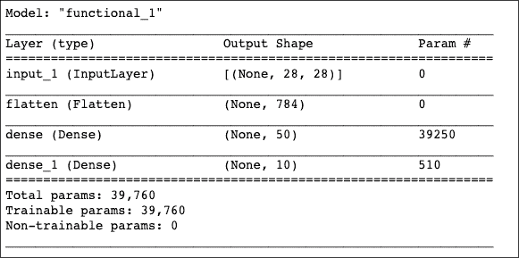
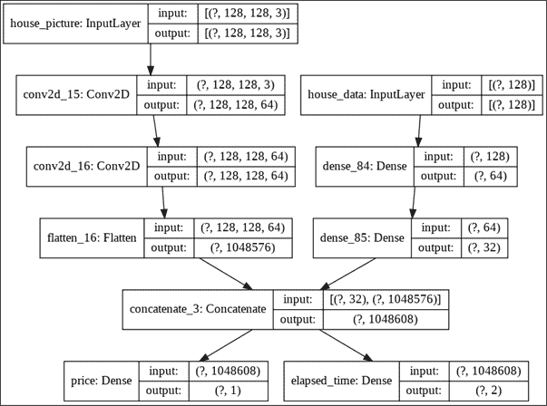

# 第三章：Keras

本章将重点介绍名为 Keras 的高层 TensorFlow API。

本章结束时，您应该对以下内容有更好的理解：

+   Keras 顺序 API

+   Keras 功能 API

+   Keras 子类化 API

+   Keras 预处理 API

# 介绍

在上一章中，我们讲解了 TensorFlow 的基础知识，现在我们已经能够设置计算图。本章将介绍 Keras，一个用 Python 编写的高层神经网络 API，支持多个后端，TensorFlow 是其中之一。Keras 的创建者是法国软件工程师兼 AI 研究员 François Chollet，他最初为个人使用而开发 Keras，直到 2015 年开源。Keras 的主要目标是提供一个易于使用且易于访问的库，以便快速实验。

TensorFlow v1 存在可用性问题，特别是 API 庞大且有时令人困惑。例如，TensorFlow v1 提供了两个高层 API：

+   Estimator API（在 1.1 版本中添加）用于在本地主机或分布式环境中训练模型。

+   Keras API 在之后的版本（1.4.0 发布）中被添加，并旨在用于快速原型设计。

随着 TensorFlow v2 的发布，Keras 成为官方高层 API。Keras 可以扩展并适应不同的用户需求，从研究到应用开发，从模型训练到部署。Keras 提供四大优势：易于使用（不牺牲灵活性和性能）、模块化、可组合、可扩展。

TensorFlow Keras API 与 Keras API 相同。然而，Keras 在 TensorFlow 后端中的实现已针对 TensorFlow 进行了优化。它集成了 TensorFlow 特有的功能，如急切执行、数据管道和 Estimator。

Keras 作为独立库与 Keras 作为 TensorFlow 集成的实现之间的区别仅在于导入方式。

这是导入 Keras API 规范的命令：

```py
import keras 
```

这是 TensorFlow 对 Keras API 规范的实现：

```py
import tensorflow as tf
from tensorflow import keras 
```

现在，让我们从发现 Keras 的基本构建块开始。

# 理解 Keras 层

Keras 层是 Keras 模型的基本构建块。每一层接收数据作为输入，执行特定任务，并返回输出。

Keras 包括广泛的内置层：

+   **核心层：**Dense、Activation、Flatten、Input、Reshape、Permute、RepeatVector、SpatialDropOut 等。

+   **卷积层用于卷积神经网络：**Conv1D、Conv2D、SeparableConv1D、Conv3D、Cropping2D 等。

+   **池化**层执行下采样操作以减少特征图：MaxPooling1D、AveragePooling2D 和 GlobalAveragePooling3D。

+   **循环层用于循环神经网络处理循环或序列数据：**RNN、SimpleRNN、GRU、LSTM、ConvLSTM2D 等。

+   **嵌入层**，仅用作模型中的第一层，将正整数转换为固定大小的稠密向量。

+   **合并层：** 加法、减法、乘法、平均值、最大值、最小值等多种操作。

+   **高级激活层：** LeakyReLU、PReLU、Softmax、ReLU 等。

+   **批量归一化层**，它会在每个批次中归一化前一层的激活值。

+   **噪声层：** GaussianNoise、GaussianDropout 和 AlphaDropout。

+   **层封装器：** TimeDistributed 将层应用于输入的每个时间切片，Bidirectional 是 RNN 的双向封装器。

+   **局部连接层：** LocallyConnected1D 和 LocallyConnected2D。它们的工作方式类似于 Conv1D 或 Conv2D，但不共享权重。

我们还可以按照本章中 Keras 子类化 API 部分的说明编写自己的 Keras 层。

## 准备开始

首先，我们将回顾一些在所有 Keras 层中常见的方法。这些方法对于了解层的配置和状态非常有用。

## 如何操作...

1.  让我们从层的权重开始。权重可能是层中最重要的概念；它决定了输入对输出的影响程度，表示了层的状态。`get_weights()` 函数返回层的权重，以 NumPy 数组的列表形式：

    ```py
    layer.get_weights() 
    ```

    `set_weights()` 方法可以通过一组 Numpy 数组来设置层的权重：

    ```py
    layer.set_weights(weights) 
    ```

1.  正如我们将在 Keras 函数式 API 配方中解释的那样，有时神经网络的拓扑结构不是线性的。在这种情况下，层可以在网络中多次使用（共享层）。如果层是单一节点（无共享层），我们可以通过这个命令轻松获得层的输入和输出：

    ```py
    layer.input
    layer.output 
    ```

    或者如果层包含多个节点，可以使用这个：

    ```py
    layer.get_input_at(node_index)
    layer.get_output_at(node_index) 
    ```

1.  如果层是单一节点（无共享层），我们还可以通过这个命令轻松获得层的输入和输出形状：

    ```py
    layer.input_shape
    layer.output_shape 
    ```

    或者如果层包含多个节点，可以使用这个：

    ```py
    layer.get_input_shape_at(node_index)
    layer.get_output_shape_at(node_index) 
    ```

1.  现在，我们将讨论层的配置。由于相同的层可能会实例化多次，配置中不包括权重或连接信息。`get_config()` 函数返回一个字典，包含层的配置：

    ```py
    layer.get_config() 
    ```

    `from_config()` 方法用于实例化层的配置：

    ```py
    layer.from_config(config) 
    ```

    请注意，层配置存储在关联数组（Python 字典）中，这是一种将键映射到值的数据结构。

## 它是如何工作的...

层是模型的构建模块。Keras 提供了广泛的构建层和有用的方法，让你更深入地了解模型的工作原理。

使用 Keras，我们可以通过三种方式构建模型：使用 Sequential、Functional 或 Subclassing API。稍后我们会看到，只有最后两种 API 允许访问层。

## 另见

有关 Keras 层 API 的一些参考文档，请参见以下文档：

+   Keras 层 API 文档：[`keras.io/layers/about-keras-layers/`](https://keras.io/layers/about-keras-layers/)

+   TensorFlow Keras 层 API 文档： [`www.tensorflow.org/api_docs/python/tf/keras/layers`](https://www.tensorflow.org/api_docs/python/tf/keras/layers)

# 使用 Keras Sequential API

Keras 的主要目标是简化深度学习模型的创建。Sequential API 允许我们创建顺序模型，这是一种线性堆叠的层。通过逐层连接的模型可以解决许多问题。要创建一个顺序模型，我们需要实例化一个 Sequential 类，创建一些模型层并将它们添加进去。

我们将从创建顺序模型开始，到编译、训练和评估步骤，最后实现模型的预测。在这个配方结束时，您将拥有一个可以在生产中部署的 Keras 模型。

## 准备工作

本文将介绍创建顺序模型的主要方法，并使用 Keras Sequential API 组装层来构建模型。

首先，我们加载 TensorFlow 和 NumPy，如下所示：

```py
import tensorflow as tf
from tensorflow import keras
from keras.layers import Dense
import numpy as np 
```

我们准备好继续解释如何实现它。

## 如何实现...

1.  首先，我们将创建一个顺序模型。Keras 提供了两种等效的方式来创建顺序模型。我们首先通过将层实例的列表作为数组传递给构造函数来开始。我们将通过输入以下代码构建一个多类分类器（10 个类别）完全连接的模型，也称为多层感知机。

    ```py
    model = tf.keras.Sequential([
        # Add a fully connected layer with 1024 units to the model
        tf.keras.layers.Dense(1024, input_dim=64),
        # Add an activation layer with ReLU activation function
        tf.keras.layers.Activation('relu'),
        # Add a fully connected layer with 256 units to the model
        tf.keras.layers.Dense(256),
        # Add an activation layer with ReLU activation function
        tf.keras.layers.Activation('relu'),
        # Add a fully connected layer with 10 units to the model
        tf.keras.layers.Dense(10),
        # Add an activation layer with softmax activation function
        tf.keras.layers.Activation('softmax')
    ]) 
    ```

    创建顺序模型的另一种方式是实例化一个 Sequential 类，然后通过`.add()`方法添加层。

    ```py
    model = tf.keras.Sequential()
    # Add a fully connected layer with 1024 units to the model
    model.add(tf.keras.layers.Dense(1024, input_dim=64))
    # Add an activation layer with ReLU activation function
    model.add(tf.keras.layers.Activation(relu))
    # Add a fully connected layer with 256 units to the model
    model.add(tf.keras.layers.Dense(256))
    # Add an activation layer with ReLU activation function
    model.add(tf.keras.layers.Activation('relu'))
    # Add a fully connected Layer with 10 units to the model
    model.add(tf.keras.layers.Dense(10))
    # Add an activation layer with softmax activation function
    model.add(tf.keras.layers.Activation('softmax')) 
    ```

1.  让我们仔细看看层的配置。`tf.keras.layers` API 提供了许多内置层，并且还提供了创建我们自己的层的 API。在大多数情况下，我们可以将这些参数设置为层的构造函数：

    +   我们可以通过指定内置函数的名称或可调用对象来添加激活函数。该函数决定一个神经元是否应该被激活。默认情况下，层没有激活函数。以下是创建带有激活函数的层的两种方式。请注意，您不需要运行以下代码，这些层未分配给变量。

        ```py
        # Creation of a dense layer with a sigmoid activation function:
        Dense(256, activation='sigmoid')
        # Or:
        Dense(256, activation=tf.keras.activations.sigmoid) 
        ```

    +   我们还可以通过传递内置初始化器的字符串标识符或可调用对象来指定初始权重（内核和偏置）的初始化策略。内核默认设置为“Glorot uniform”初始化器，偏置设置为零。

        ```py
        # A dense layer with a kernel initialized to a truncated normal distribution:
        Dense(256, kernel_initializer='random_normal')
        # A dense layer with a bias vector initialized with a constant value of 5.0:
        Dense(256, bias_initializer=tf.keras.initializers.Constant(value=5)) 
        ```

    +   我们还可以为内核和偏置指定正则化器，如 L1（也称为 Lasso）或 L2（也称为 Ridge）正则化。默认情况下，不应用正则化。正则化器旨在通过惩罚具有大权重的模型来防止过拟合。这些惩罚被纳入网络优化的损失函数中。

        ```py
        # A dense layer with L1 regularization of factor 0.01 applied to the kernel matrix:
        Dense(256, kernel_regularizer=tf.keras.regularizers.l1(0.01))
        # A dense layer with L2 regularization of factor 0.01 applied to the bias vector:
        Dense(256, bias_regularizer=tf.keras.regularizers.l2(0.01)) 
        ```

1.  在 Keras 中，强烈建议为第一层设置输入形状。然而，与表面上看起来的不同，输入层不是一层，而是一个张量。它的形状必须与我们的训练数据相同。以下层将执行自动形状推断；它们的形状是根据前一层的单元计算出来的。

    每种类型的层需要输入特定维度的张量，因此有不同的方法来指定输入形状，具体取决于层的种类。在这里，我们将重点介绍 Dense 层，因此我们将使用`input_dim`参数。由于权重的形状取决于输入的大小，如果没有预先指定输入形状，模型将没有权重：模型没有被构建。在这种情况下，你无法调用`Layer`类的任何方法，例如`summary`、`layers`、`weights`等。

    在这个示例中，我们将创建包含 64 个特征的数据集，并处理每批 10 个样本。我们的输入数据的形状是（10,64），即（`batch_size`，`number_of_features`）。默认情况下，Keras 模型定义为支持任何批次大小，因此批次大小不是强制性的。我们只需要通过`input_dim`参数为第一层指定特征数量。

    ```py
    Dense(256, input_dim=(64)) 
    ```

    然而，为了效率的考虑，我们可以通过`batch_size`参数强制设置批次大小。

    ```py
     Dense(256, input_dim=(64), batch_size=10) 
    ```

1.  在学习阶段之前，我们的模型需要进行配置。通过`compile`方法来完成这一配置。我们需要指定：

    +   用于训练我们神经网络的优化算法。我们可以从`tf.keras.optimizers`模块传递一个优化器实例。例如，我们可以使用`tf.keras.optimizers.RMSprop`的实例，或者使用字符串`'RMSprop'`，它是一个实现了`RMSprop`算法的优化器。

    +   一个损失函数，也叫做目标函数或优化得分函数，目的是最小化模型。它可以是现有损失函数的名称（例如`categorical_crossentropy`或`mse`），一个符号化的 TensorFlow 损失函数（如`tf.keras.losses.MAPE`），或一个自定义的损失函数，它接收两个张量（真实张量和预测张量）并为每个数据点返回一个标量。

    +   用于评估我们模型性能的度量列表，这些度量不会在模型训练过程中使用。我们可以传递字符串名称或来自`tf.keras.metrics`模块的可调用函数。

    +   如果你想确保模型以急切执行的方式进行训练和评估，可以将`run_eagerly`参数设置为 true。

    请注意，图形通过`compile`方法最终确定。

    现在，我们将使用 Adam 优化器来编译模型，采用类别交叉熵损失并显示准确率度量。

    ```py
    model.compile(
        optimizer="adam", 
        loss="categorical_crossentropy",
        metrics=["accuracy"]
    ) 
    ```

1.  现在，我们将生成三个包含 64 个特征的玩具数据集，数据值为随机生成。其中一个用于训练模型（2,000 个样本），另一个用于验证（500 个样本），最后一个用于测试（500 个样本）。

    ```py
    data = np.random.random((2000, 64))
    labels = np.random.random((2000, 10))
    val_data = np.random.random((500, 64))
    val_labels = np.random.random((500, 10))
    test_data = np.random.random((500, 64))
    test_labels = np.random.random((500, 10)) 
    ```

1.  在模型配置完成后，通过调用`fit`方法开始学习阶段。训练配置由以下三个参数完成：

    +   我们必须设置训练轮次，即遍历整个输入数据的迭代次数。

    +   我们需要指定每个梯度的样本数，称为`batch_size`参数。请注意，如果总样本数不能被批次大小整除，则最后一批次的样本可能较小。

    +   我们可以通过设置`validation_data`参数（一个包含输入和标签的元组）来指定验证数据集。这个数据集可以方便地监控模型的性能。在每个训练周期结束时，损失和度量会在推理模式下计算。

    现在，我们将通过调用`fit`方法在我们的玩具数据集上训练模型：

    ```py
    model.fit(data, labels, epochs=10, batch_size=50,
              validation_data=(val_data, val_labels)) 
    ```

1.  接下来，我们将在测试数据集上评估我们的模型。我们将调用`model.evaluate`函数，它预测模型在测试模式下的损失值和度量值。计算是按批次进行的。它有三个重要参数：输入数据、目标数据和批次大小。此函数为给定输入预测输出，然后计算`metrics`函数（在`model.compile`中根据目标数据指定），并返回计算后的度量值作为输出。

    ```py
    model.evaluate(data, labels, batch_size=50) 
    ```

1.  我们也可以仅使用模型进行预测。`tf.keras.Model.predict`方法仅接受数据作为输入并返回预测结果。以下是如何预测提供数据的最后一层推理输出，结果以 NumPy 数组形式呈现：

    ```py
    result = model.predict(data, batch_size=50) 
    ```

    分析这个模型的性能在这个示例中并不重要，因为我们使用的是随机生成的数据集。

    现在，让我们继续分析这个示例。

## 它是如何工作的...

Keras 提供了 Sequential API 来创建由一系列线性堆叠的层组成的模型。我们可以将层实例的列表作为数组传递给构造函数，或者使用`add`方法。

Keras 提供了不同种类的层。它们大多数共享一些常见的构造参数，如`activation`、`kernel_initializer`和`bias_initializer`，以及`kernel_regularizer`和`bias_regularizer`。

注意延迟构建模式：如果没有在第一层指定输入形状，当第一次将模型应用于输入数据时，或者调用`fit`、`eval`、`predict`和`summary`等方法时，模型才会被构建。图形在调用`compile`方法时最终确定，该方法在学习阶段之前配置模型。然后，我们可以评估模型或进行预测。

## 另见

关于 Keras Sequential API 的一些参考资料，请访问以下网站：

+   tf.keras.Sequential 模型 API 文档: [`www.tensorflow.org/api_docs/python/tf/keras/Sequential`](https://www.tensorflow.org/api_docs/python/tf/keras/Sequential)

+   Keras Sequential 模型 API 文档: [`keras.io/models/sequential/`](https://keras.io/models/sequential/)

# 使用 Keras 函数式 API

Keras Sequential API 在大多数情况下非常适合开发深度学习模型。然而，这个 API 有一些限制，例如线性拓扑结构，可以通过函数式 API 来克服。需要注意的是，许多高效的网络都基于非线性拓扑结构，如 Inception、ResNet 等。

函数式 API 允许定义具有非线性拓扑结构、多个输入、多个输出、残差连接的复杂模型，以及具有非顺序流动的共享和可重用层。

深度学习模型通常是一个有向无环图（DAG）。功能 API 是一种构建层图的方式，它比`tf.keras.Sequential` API 创建更灵活的模型。

## 准备工作

本实例将涵盖创建功能模型的主要方式，使用可调用模型、操作复杂的图拓扑、共享层，并最终引入使用 Keras 顺序 API 的“层节点”概念。

一如既往，我们只需要按如下方式导入 TensorFlow：

```py
import tensorflow as tf
from tensorflow import keras
from keras.layers import Input, Dense, TimeDistributed
import keras.models 
```

我们准备好继续解释如何实现这一点。

## 如何做到这一点...

让我们开始构建一个功能模型，用于识别 MNIST 手写数字数据集。我们将从灰度图像中预测手写数字。

### 创建功能模型

1.  首先，我们将加载 MNIST 数据集。

    ```py
    mnist = tf.keras.datasets.mnist
    (X_mnist_train, y_mnist_train), (X_mnist_test, y_mnist_test) = mnist.load_data() 
    ```

1.  然后，我们将创建一个 28x28 维度的输入节点。记住，在 Keras 中，输入层并不是一个层，而是一个张量，我们必须为第一个层指定输入形状。这个张量的形状必须与我们的训练数据形状一致。默认情况下，Keras 模型被定义为支持任何批次大小，因此批次大小不是必需的。`Input()`用于实例化 Keras 张量。

    ```py
    inputs = tf.keras.Input(shape=(28,28)) 
    ```

1.  然后，我们将使用以下命令对大小为(28,28)的图像进行展平操作。这将生成一个包含 784 个像素的数组。

    ```py
    flatten_layer = keras.layers.Flatten() 
    ```

1.  我们将通过在`inputs`对象上调用`flatten_layer`来在层图中添加一个新的节点：

    ```py
    flatten_output = flatten_layer(inputs) 
    ```

    “层调用”操作就像是从`inputs`到`flatten_layer`绘制一条箭头。我们正在“传递”输入到展平层，结果是它产生了输出。层实例是可调用的（在张量上）并返回一个张量。

1.  然后，我们将创建一个新的层实例：

    ```py
    dense_layer = tf.keras.layers.Dense(50, activation='relu') 
    ```

1.  我们将添加一个新节点：

    ```py
    dense_output = dense_layer(flatten_output) 
    ```

1.  为了构建一个模型，多个层将被堆叠。在这个示例中，我们将添加另一个`dense`层来进行 10 个类别之间的分类任务：

    ```py
    predictions = tf.keras.layers.Dense(10, activation='softmax')(dense_output) 
    ```

1.  输入张量和输出张量用于定义模型。模型是一个由一个或多个输入层和一个或多个输出层构成的函数。模型实例形式化了计算图，描述数据如何从输入流向输出。

    ```py
    model = keras.Model(inputs=inputs, outputs=predictions) 
    ```

1.  现在，我们将打印模型的摘要。

    ```py
    model.summary() 
    ```

1.  这将产生如下输出：

    图 3.1：模型摘要

1.  这样的模型可以通过与 Keras 顺序模型中相同的`compile, fit`、`evaluate`和`predict`方法进行训练和评估。

    ```py
    model.compile(optimizer='sgd',
                 loss='sparse_categorical_crossentropy',
                 metrics=['accuracy'])
    model.fit(X_mnist_train, y_mnist_train,
              validation_data=(X_mnist_train, y_mnist_train),
              epochs=10) 
    ```

在这个实例中，我们使用功能 API 构建了一个模型。

### 使用像层这样的可调用模型

让我们深入了解功能 API 与可调用模型的细节。

1.  使用功能 API，重复使用训练好的模型变得非常容易：任何模型都可以通过在张量上调用它作为一层来处理。我们将重用前面定义的模型作为一层，以便查看其实现效果。它是一个用于 10 个类别的分类器。该模型返回 10 个概率值：每个类别一个概率值。这被称为 10 分类 softmax。因此，通过调用上述模型，模型将为每个输入预测 10 个类别中的一个。

    ```py
    x = Input(shape=(784,))
    # y will contain the prediction for x
    y = model(x) 
    ```

    请注意，通过调用一个模型，我们不仅仅是重用模型架构，我们还在重用它的权重。

1.  如果我们面临一个序列问题，使用功能性 API 创建模型将变得非常简单。例如，假设我们不是处理一张图片，而是处理由多张图片组成的视频。我们可以通过使用 `TimeDistributed` 层包装器，将图像分类模型转变为视频分类模型，仅需一行代码。这个包装器将我们的前一个模型应用于输入序列的每一个时间切片，换句话说，就是应用于视频的每一帧图像。

    ```py
    from keras.layers import TimeDistributed
    # Input tensor for sequences of 50 timesteps,
    # Each containing a 28x28 dimensional matrix.
    input_sequences = tf.keras.Input(shape=(10, 28, 28))
    # We will apply the previous model to each sequence so one for each timestep.
    # The MNIST model returns a vector with 10 probabilities (one for each digit).
    # The TimeDistributed output will be a sequence of 50 vectors of size 10.
    processed_sequences = tf.keras.layers.TimeDistributed(model)(input_sequences) 
    ```

我们已经看到，模型像层一样是可以调用的。现在，我们将学习如何创建具有非线性拓扑的复杂模型。

### 创建一个具有多个输入和输出的模型

功能性 API 使得操作大量交织的数据流变得简单，具有多个输入输出和非线性连接拓扑。这些是顺序 API 无法处理的，顺序 API 无法创建具有非顺序连接或多个输入输出的模型。

让我们来看一个例子。我们将构建一个系统，用于预测特定房子的价格和销售前的经过时间。

该模型将有两个输入：

+   关于房子的资料，例如卧室数量、房屋大小、空调、内置厨房等。

+   房子的最新照片

这个模型将有两个输出：

+   销售前的经过时间（两个类别——慢或快）

+   预测价格

1.  为了构建这个系统，我们将从构建第一个模块开始，用于处理关于房子的表格数据。

    ```py
    house_data_inputs = tf.keras.Input(shape=(128,), name='house_data')
    x = tf.keras.layers.Dense(64, activation='relu')(house_data_inputs)
    block_1_output = tf.keras.layers.Dense(32, activation='relu')(x) 
    ```

1.  然后，我们将构建第二个模块来处理房子的图像数据。

    ```py
    house_picture_inputs = tf.keras.Input(shape=(128,128,3), name='house_picture')
    x = tf.keras.layers.Conv2D(64, 3, activation='relu', padding='same')(house_picture_inputs)
    x = tf.keras.layers.Conv2D(64, 3, activation='relu', padding='same')(x)
    block_2_output = tf.keras.layers.Flatten()(x) 
    ```

1.  现在，我们将通过拼接将所有可用特征合并为一个大的向量。

    ```py
    x = tf.keras.layers.concatenate([block_1_output, block_2_output]) 
    ```

1.  然后，我们将在特征上加一个用于价格预测的逻辑回归。

    ```py
    price_pred = tf.keras.layers.Dense(1, name='price', activation='relu')(x) 
    ```

1.  接着，我们将在特征上加一个时间分类器。

    ```py
    time_elapsed_pred = tf.keras.layers.Dense(2, name='elapsed_time', activation='softmax')(x) 
    ```

1.  现在，我们将构建模型。

    ```py
    model = keras.Model([house_data_inputs, house_picture_inputs],
                       [price_pred, time_elapsed_pred],
                       name='toy_house_pred') 
    ```

1.  现在，我们将绘制模型图。

    ```py
    keras.utils.plot_model(model, 'multi_input_and_output_model.png', show_shapes=True) 
    ```

1.  这将产生以下输出：

    图 3.2：具有多个输入和输出的模型图

在这个示例中，我们使用功能性 API 创建了一个复杂模型，具有多个输入输出，用于预测特定房子的价格和销售前的经过时间。现在，我们将引入共享层的概念。

### 共享层

一些模型在其架构内多次重用相同的层。这些层实例学习与层图中多个路径对应的特征。共享层通常用于对来自相似空间的输入进行编码。

为了在不同的输入之间共享一个层（包括权重），我们只需实例化该层一次，并将其应用于我们需要的多个输入。

让我们考虑两种不同的文本序列。我们将对这两个具有相似词汇的序列应用相同的嵌入层。

```py
# Variable-length sequence of integers
text_input_a = tf.keras.Input(shape=(None,), dtype='int32')
# Variable-length sequence of integers
text_input_b = tf.keras.Input(shape=(None,), dtype='int32')
# Embedding for 1000 unique words mapped to 128-dimensional vectors
shared_embedding = tf.keras.layers.Embedding(1000, 128)
# Reuse the same layer to encode both inputs
encoded_input_a = shared_embedding(text_input_a)
encoded_input_b = shared_embedding(text_input_b) 
```

在这个例子中，我们已经学习了如何在同一个模型中多次重用一个层。现在，我们将介绍提取和重用层的概念。

### 在层的图中提取和重用节点

在本章的第一个例子中，我们看到一个层是一个实例，它以一个张量作为参数并返回另一个张量。一个模型是由多个层实例组成的。这些层实例是通过它们的输入和输出张量相互连接的对象。每次我们实例化一个层时，该层的输出是一个新的张量。通过向层添加一个“节点”，我们将输入和输出张量连接起来。

层的图是一个静态数据结构。通过 Keras 函数式 API，我们可以轻松访问和检查模型。

`tf.keras.application` 模块包含具有预训练权重的现成架构。

1.  让我们去下载 ResNet 50 预训练模型。

    ```py
    resnet = tf.keras.applications.resnet.ResNet50() 
    ```

1.  然后，我们将通过查询图数据结构来显示模型的中间层：

    ```py
    intermediate_layers = [layer.output for layer in resnet.layers] 
    ```

1.  然后，我们将通过查询图数据结构来显示模型的前 10 个中间层：

    ```py
    intermediate_layers[:10] 
    ```

1.  这将产生以下输出：

    ```py
     [<tf.Tensor 'input_7:0' shape=(None, 224, 224, 3) dtype=float32>,
     <tf.Tensor 'conv1_pad/Pad:0' shape=(None, 230, 230, 3) dtype=float32>,
     <tf.Tensor 'conv1_conv/BiasAdd:0' shape=(None, 112, 112, 64) dtype=float32>,
     <tf.Tensor 'conv1_bn/cond/Identity:0' shape=(None, 112, 112, 64) dtype=float32>,
     <tf.Tensor 'conv1_relu/Relu:0' shape=(None, 112, 112, 64) dtype=float32>,
     <tf.Tensor 'pool1_pad/Pad:0' shape=(None, 114, 114, 64) dtype=float32>,
     <tf.Tensor 'pool1_pool/MaxPool:0' shape=(None, 56, 56, 64) dtype=float32>,
     <tf.Tensor 'conv2_block1_1_conv/BiasAdd:0' shape=(None, 56, 56, 64) dtype=float32>,
     <tf.Tensor 'conv2_block1_1_bn/cond/Identity:0' shape=(None, 56, 56, 64) dtype=float32>,
     <tf.Tensor 'conv2_block1_1_relu/Relu:0' shape=(None, 56, 56, 64) dtype=float32>] 
    ```

1.  现在，我们将选择所有特征层。我们将在卷积神经网络章节中详细讲解。

    ```py
    feature_layers = intermediate_layers[:-2] 
    ```

1.  然后，我们将重用这些节点来创建我们的特征提取模型。

    ```py
    feat_extraction_model = keras.Model(inputs=resnet.input, outputs=feature_layers) 
    ```

深度学习模型的一个有趣的好处是，它可以在类似的预测建模问题上部分或完全重复使用。这种技术称为“迁移学习”：通过减少训练时间，它显著提高了训练阶段的效果，并增强了模型在相关问题上的表现。

新的模型架构基于预训练模型中的一个或多个层。预训练模型的权重可以作为训练过程的起点。它们可以是固定的、微调的，或者在学习阶段完全适应。实现迁移学习的两种主要方法是权重初始化和特征提取。别担心，我们稍后会在本书中详细讲解。

在这个例子中，我们加载了基于 VGG19 架构的预训练模型。我们从这个模型中提取了节点，并在新模型中重用了它们。

## 它是如何工作的...

Keras 顺序 API 在绝大多数情况下是合适的，但仅限于创建逐层模型。函数式 API 更加灵活，允许提取和重用节点、共享层，并创建具有多个输入和多个输出的非线性模型。需要注意的是，许多高性能的网络基于非线性拓扑结构。

在这个例子中，我们已经学习了如何使用 Keras 函数式 API 构建模型。这些模型的训练和评估使用与 Keras 顺序模型相同的 `compile`、`fit`、`evaluate` 和 `predict` 方法。

我们还看了如何将训练好的模型作为层进行重用，如何共享层，以及如何提取并重用节点。最后一种方法在迁移学习技术中被使用，能够加速训练并提高性能。

## 还有更多……

由于我们可以访问每一层，使用 Keras 函数式 API 构建的模型具有一些特定功能，如模型绘图、整模型保存等。

使用函数式 API 构建的模型可能会很复杂，因此这里有一些提示，帮助你避免在过程中抓狂：

+   命名层：在展示模型图的摘要和图表时，这将非常有用。

+   分离子模型：将每个子模型视为一个乐高积木，最后我们将它们与其他子模型一起组合。

+   查看层摘要：使用 `summary` 方法查看每一层的输出。

+   查看图形绘图：使用 `plot` 方法显示并检查层之间的连接。

+   一致的变量命名：对输入和输出层使用相同的变量名，避免复制粘贴错误。

## 另见

关于 Keras 函数式 API 的一些参考资料，访问以下网站：

+   Keras 函数式 API 文档： [`keras.io/getting-started/functional-api-guide/`](https://keras.io/getting-started/functional-api-guide/)

+   `tf.keras.Model` API： [`www.tensorflow.org/api_docs/python/tf/keras/Model`](https://www.tensorflow.org/api_docs/python/tf/keras/Model )

+   机器学习大师： [`machinelearningmastery.com/keras-functional-api-deep-learning/`](https://machinelearningmastery.com/keras-functional-api-deep-learning/)

+   在 TensorFlow 内部：tf.Keras 由 François Chollet 提供（第一部分）[`www.youtube.com/watch?v=UYRBHFAvLSs`](https://www.youtube.com/watch?v=UYRBHFAvLSs)

+   在 TensorFlow 内部：tf.Keras（第二部分）[`www.youtube.com/watch?v=uhzGTijaw8A`](https://www.youtube.com/watch?v=uhzGTijaw8A)

# 使用 Keras 子类化 API

Keras 基于面向对象设计原则。因此，我们可以继承 `Model` 类并创建我们的模型架构定义。

Keras 子类化 API 是 Keras 提出的第三种构建深度神经网络模型的方法。

这个 API 完全可定制，但这种灵活性也带来了复杂性！所以，请系好安全带，它比顺序 API 或函数式 API 更难使用。

但你可能会想，如果这个 API 使用起来这么难，我们为什么还需要它。某些模型架构和一些自定义层可能会非常具有挑战性。一些研究人员和开发人员希望完全控制他们的模型以及训练模型的方式。子类化 API 提供了这些功能。让我们深入了解细节。

## 准备工作

在这里，我们将介绍使用 Keras 子类化 API 创建自定义层和自定义模型的主要方法。

首先，我们加载 TensorFlow，如下所示：

```py
import tensorflow as tf
from tensorflow import keras 
```

我们已准备好继续解释如何操作。

## 如何操作……

我们从创建我们的层开始。

### 创建自定义层

正如 *理解 Keras 层* 部分所解释的那样，Keras 通过其层化 API 提供了各种内置的层，如全连接层、卷积层、循环层和归一化层。

所有层都是 `Layer` 类的子类，并实现了这些方法：

+   `build` 方法，用于定义层的权重。

+   `call` 方法，指定层执行的从输入到输出的转换。

+   `compute_output_shape` 方法，如果该层修改了输入的形状。这样 Keras 就可以执行自动的形状推断。

+   `get_config` 和 `from_config` 方法，如果该层被序列化和反序列化。

1.  让我们将理论付诸实践。首先，我们将为自定义全连接层创建一个子类层：

    ```py
    class MyCustomDense(tf.keras.layers.Layer):
        # Initialize this class with the number of units
        def __init__(self, units):
            super(MyCustomDense, self).__init__()
            self.units = units

        # Define the weights and the bias
        def build(self, input_shape):
            self.w = self.add_weight(shape=(input_shape[-1], self.units),
                                initializer='random_normal',
                                trainable=True)
            self.b = self.add_weight(shape=(self.units,),
                                initializer='random_normal',
                                trainable=True)

        # Applying this layer transformation to the input tensor
        def call(self, inputs):
            return tf.matmul(inputs, self.w) + self.b

        # Function to retrieve the configuration
        def get_config(self):
            return {'units': self.units} 
    ```

1.  然后，我们将使用前一步创建的 `MyCustomDense` 层来创建模型：

    ```py
    # Create an input layer
    inputs = keras.Input((12,4))
    # Add an instance of MyCustomeDense layer
    outputs = MyCustomDense(2)(inputs)
    # Create a model
    model = keras.Model(inputs, outputs)
    # Get the model config
    config = model.get_config() 
    ```

1.  接下来，我们将从配置文件重新加载模型：

    ```py
    new_model = keras.Model.from_config(config, 
                                  custom_objects={'MyCustomDense': MyCustomDense}) 
    ```

在这个食谱中，我们已经创建了我们的 `Layer` 类。现在，我们将创建我们的模型。

### 创建自定义模型

通过子类化 `tf.keras.Model` 类，我们可以构建一个完全可定制的模型。

我们在 `__init__` 方法中定义我们的层，并通过实现 `call` 方法完全控制模型的前向传播。`training` 布尔参数可以用来指定训练阶段和推理阶段期间的不同行为。

1.  首先，我们将加载 MNIST 数据集并对灰度进行归一化：

    ```py
    mnist = tf.keras.datasets.mnist
    (X_mnist_train, y_mnist_train), (X_mnist_test, y_mnist_test) = mnist.load_data()
    train_mnist_features = X_mnist_train/255
    test_mnist_features = X_mnist_test/255 
    ```

1.  让我们创建一个 `Model` 的子类，用于识别 MNIST 数据：

    ```py
    class MyMNISTModel(tf.keras.Model):
        def __init__(self, num_classes):
            super(MyMNISTModel, self).__init__(name='my_mnist_model')
            self.num_classes = num_classes
            self.flatten_1 = tf.keras.layers.Flatten()
            self.dropout = tf.keras.layers.Dropout(0.1)
            self.dense_1 = tf.keras.layers.Dense(50, activation='relu')
            self.dense_2 = tf.keras.layers.Dense(10, activation='softmax')
        def call(self, inputs, training=False):
            x = self.flatten_1(inputs)
            # Apply dropout only during the training phase
            x = self.dense_1(x)
            if training:
                x = self.dropout(x, training=training)
            return self.dense_2(x) 
    ```

1.  现在，我们将实例化模型并处理训练：

    ```py
    my_mnist_model = MyMNISTModel(10)
    # Compile
    my_mnist_model.compile(optimizer='sgd',
                          loss='sparse_categorical_crossentropy',
                          metrics=['accuracy'])
    # Train
    my_mnist_model.fit(train_features, y_train,
                      validation_data=(test_features, y_test),
                      epochs=10) 
    ```

## 它是如何工作的……

子类化 API 是深度学习从业者使用面向对象的 Keras 设计原则构建层或模型的一种方式。如果你的模型无法使用 Sequential 或 Functional API 实现，我们建议使用此 API。尽管这种方式的实现可能会很复杂，但在某些情况下仍然非常有用，了解如何在 Keras 中实现层和模型对于所有开发者和研究人员来说都是非常有趣的。

## 另见

关于 Keras 子类化 API 的一些参考，见以下教程、论文和文章：

+   使用 Keras 编写自定义层和模型：[`www.tensorflow.org/guide/keras/custom_layers_and_models`](https://www.tensorflow.org/guide/keras/custom_layers_and_models)

+   编写你自己的 Keras 层：[`keras.io/layers/writing-your-own-keras-layers/`](https://keras.io/layers/writing-your-own-keras-layers/)

# 使用 Keras 预处理 API

Keras 预处理 API 汇集了数据处理和数据增强的模块。该 API 提供了处理序列、文本和图像数据的工具。数据预处理是机器学习和深度学习中的一个重要步骤，它将原始数据转换、转换或编码为适合学习算法理解、有效且有用的格式。

## 准备工作

本食谱将介绍 Keras 提供的一些预处理方法，用于处理序列、文本和图像数据。

如往常一样，我们只需导入 TensorFlow 如下：

```py
import tensorflow as tf
from tensorflow import keras
import numpy as np
from tensorflow.keras.preprocessing.sequence import TimeseriesGenerator, pad_sequences, skipgrams, make_sampling_table
from tensorflow.keras.preprocessing.text import text_to_word_sequence, one_hot, hashing_trick, Tokenizer
from tensorflow.keras.models import Sequential
from tensorflow.keras.layers import Dense 
```

我们准备好继续解释如何做了。

## 如何做…

让我们从序列数据开始。

### 序列预处理

序列数据是有序的数据，如文本或时间序列。因此，时间序列由按时间顺序排列的一系列数据点定义。

#### 时间序列生成器

Keras 提供了处理序列数据（如时间序列数据）的实用工具。它接收连续的数据点，并使用时间序列参数（如步幅、历史长度等）进行转换，返回一个 TensorFlow 数据集实例。

1.  让我们使用一个玩具时间序列数据集，包含 10 个整数值：

    ```py
    series = np.array([i for i in range(10)])
    print(series) 
    ```

1.  这导致以下输出：

    ```py
    array([0, 1, 2, 3, 4, 5, 6, 7, 8, 9]) 
    ```

1.  我们希望根据最后五个滞后观测值预测下一个值。因此，我们将定义一个生成器，并将 `length` 参数设置为 5。此参数指定输出序列的长度（以时间步为单位）：

    ```py
    generator = TimeseriesGenerator(data = series,
                                   targets = series,
                                   length=5,
                                   batch_size=1,
                                   shuffle=False,
                                   reverse=False) 
    ```

1.  我们希望生成由 5 个滞后观测组成的样本，用于预测，而玩具时间序列数据集包含 10 个值。因此，生成的样本数为 5：

    ```py
    # number of samples
    print('Samples: %d' % len(generator)) 
    ```

1.  接下来，我们将显示每个样本的输入和输出，并检查数据是否准备就绪：

    ```py
    for i in range(len(generator)):
        x, y = generator[i]
        print('%s => %s' % (x, y)) 
    ```

1.  这导致以下输出：

    ```py
    [[0 1 2 3 4]] => [5]
    [[1 2 3 4 5]] => [6]
    [[2 3 4 5 6]] => [7]
    [[3 4 5 6 7]] => [8]
    [[4 5 6 7 8]] => [9] 
    ```

1.  现在，我们将创建并编译一个模型：

    ```py
    model = Sequential()
    model.add(Dense(10, activation='relu', input_dim=5))
    model.add(Dense(1))
    model.compile(optimizer='adam', loss='mse') 
    ```

1.  然后，我们将通过将生成器作为输入数据来训练模型：

    ```py
    model.fit(generator, epochs=10) 
    ```

使用深度学习方法准备时间序列数据可能非常具有挑战性。但幸运的是，Keras 提供了一个生成器，可以帮助我们将单变量或多变量时间序列数据集转换为准备用于训练模型的数据结构。该生成器提供了许多选项来准备数据，如洗牌、采样率、起始和结束偏移量等。建议查阅官方 Keras API 获取更多详细信息。

现在，我们将专注于如何准备可变长度输入序列的数据。

#### 填充序列

处理序列数据时，每个样本的长度通常不同。为了使所有序列适合所需的长度，解决方案是对它们进行填充。比定义的序列长度短的序列在每个序列的末尾（默认）或开头填充值。否则，如果序列大于所需长度，则截断序列。

1.  让我们从四个句子开始：

    ```py
    sentences = [["What", "do", "you", "like", "?"],
                 ["I", "like", "basket-ball", "!"],
                 ["And", "you", "?"],
                 ["I", "like", "coconut", "and", "apple"]] 
    ```

1.  首先，我们将构建词汇查找表。我们将创建两个字典，一个用于从单词到整数标识符的转换，另一个反之。

    ```py
    text_set = set(np.concatenate(sentences))
    vocab_to_int = dict(zip(text_set, range(len(text_set))))
    int_to_vocab = {vocab_to_int[word]:word for word in vocab_to_int.keys()} 
    ```

1.  然后，在构建词汇查找表之后，我们将句子编码为整数数组。

    ```py
    encoded_sentences = []
    for sentence in sentences:
        encoded_sentence = [vocab_to_int[word] for word in sentence]
        encoded_sentences.append(encoded_sentence)
    encoded_sentences 
    ```

1.  这导致以下输出：

    ```py
    [[8, 4, 7, 6, 0], [5, 6, 2, 3], [10, 7, 0], [5, 6, 1, 9, 11]] 
    ```

1.  现在，我们将使用 `pad_sequences` 函数轻松地截断和填充序列到一个公共长度。默认情况下，启用了序列前填充。

    ```py
    pad_sequences(encoded_sentences) 
    ```

1.  这导致以下输出：

    ```py
    array([[ 8,  4,  7,  6,  0],
           [ 0,  5,  6,  2,  3],
           [ 0,  0, 10,  7,  0],
           [ 5,  6,  1,  9, 11]], dtype=int32) 
    ```

1.  然后，我们将激活序列后填充，并将 `maxlen` 参数设置为所需的长度 – 这里是 7。

    ```py
    pad_sequences(encoded_sentences, maxlen = 7) 
    ```

1.  这导致以下输出：

    ```py
    array([[ 0,  0,  8,  4,  7,  6,  0],
           [ 0,  0,  0,  5,  6,  2,  3],
           [ 0,  0,  0,  0, 10,  7,  0],
           [ 0,  0,  5,  6,  1,  9, 11]], dtype=int32) 
    ```

1.  序列的长度也可以裁剪为所需的长度——此处为 3。默认情况下，该函数会从每个序列的开头移除时间步长。

    ```py
    pad_sequences(encoded_sentences, maxlen = 3) 
    ```

1.  这将产生以下输出：

    ```py
    array([[ 7,  6,  0],
           [ 6,  2,  3],
           [10,  7,  0],
           [ 1,  9, 11]], dtype=int32) 
    ```

1.  将截断参数设置为`post`，以便从每个序列的末尾移除时间步长。

    ```py
    pad_sequences(encoded_sentences, maxlen = 3, truncating='post') 
    ```

1.  这将产生以下输出：

    ```py
    array([[ 8,  4,  7],
           [ 5,  6,  2],
           [10,  7,  0],
           [ 5,  6,  1]], dtype=int32) 
    ```

当我们希望列表中的所有序列具有相同长度时，填充非常有用。

在接下来的章节中，我们将介绍一种非常流行的文本预处理技术。

#### Skip-grams

Skip-grams 是自然语言处理中的一种无监督学习技术。它为给定的单词找到最相关的单词，并预测该单词的上下文单词。

Keras 提供了`skipgrams`预处理函数，它接收一个整数编码的单词序列，并返回定义窗口中每对单词的相关性。如果一对单词相关，样本为正样本，相关标签设置为 1。否则，样本被认为是负样本，标签设置为 0。

一例胜千言。让我们以这个句子为例：“I like coconut and apple，”选择第一个单词作为我们的“上下文单词”，并使用窗口大小为二。我们将上下文单词“I”与指定窗口中的单词配对。所以，我们有两个单词对`(I, like)`和`(I, coconut)`，这两者的值都为 1。

让我们将理论付诸实践：

1.  首先，我们将把一个句子编码为单词索引的列表：

    ```py
    sentence = "I like coconut and apple"
    encoded_sentence = [vocab_to_int[word] for word in sentence.split()]
    vocabulary_size = len(encoded_sentence) 
    ```

1.  然后，我们将调用`skipgrams`函数，窗口大小为 1：

    ```py
    pairs, labels = skipgrams(encoded_sentence, 
                              vocabulary_size, 
                              window_size=1,
                              negative_samples=0) 
    ```

1.  现在，我们将打印结果：

    ```py
    for i in range(len(pairs)):
        print("({:s} , {:s} ) -> {:d}".format(
              int_to_vocab[pairs[i][0]], 
              int_to_vocab[pairs[i][1]], 
              labels[i])) 
    ```

1.  这将产生以下输出：

    ```py
    (coconut , and ) -> 1
    (apple , ! ) -> 0
    (and , coconut ) -> 1
    (apple , and ) -> 1
    (coconut , do ) -> 0
    (like , I ) -> 1
    (and , apple ) -> 1
    (like , coconut ) -> 1
    (coconut , do ) -> 0
    (I , like ) -> 1
    (coconut , like ) -> 1
    (and , do ) -> 0
    (like , coconut ) -> 0
    (I , ! ) -> 0
    (like , ! ) -> 0
    (and , coconut ) -> 0 
    ```

请注意，非单词在词汇表中由索引 0 表示，并将被跳过。我们建议读者参考 Keras API，了解更多关于填充的细节。

现在，让我们介绍一些文本数据预处理的技巧。

### 文本预处理

在深度学习中，我们不能直接将原始文本输入到网络中。我们必须将文本编码为数字，并提供整数作为输入。我们的模型将生成整数作为输出。这个模块提供了文本输入预处理的工具。

#### 将文本拆分为单词序列

Keras 提供了`text_to_word_sequence`方法，将序列转换为单词或标记的列表。

1.  让我们使用这个句子：

    ```py
    sentence = "I like coconut , I like apple" 
    ```

1.  然后，我们将调用将句子转换为单词列表的方法。默认情况下，该方法会根据空格拆分文本。

    ```py
    text_to_word_sequence(sentence, lower=False) 
    ```

1.  这将产生以下输出：

    ```py
    ['I', 'like', 'coconut', 'I', 'like', 'apple'] 
    ```

1.  现在，我们将`lower`参数设置为`True`，文本将被转换为小写：

    ```py
    text_to_word_sequence(sentence, lower=True, filters=[]) 
    ```

1.  这将产生以下输出：

    ```py
    ['i', 'like', 'coconut', ',', 'i', 'like', 'apple'] 
    ```

请注意，默认情况下，`filter`参数会过滤掉一系列字符，如标点符号。在我们上一次的代码执行中，我们移除了所有预定义的过滤器。

让我们继续使用一种方法来编码单词或类别特征。

#### Tokenizer

`Tokenizer`类是文本分词的实用工具类。它是深度学习中准备文本的首选方法。

这个类的输入参数为：

+   要保留的最大词数。只有最常见的词会根据词频被保留。

+   用于过滤的字符列表。

+   一个布尔值，用于决定是否将文本转换为小写字母。

+   用于分词的分隔符。

1.  让我们从这句话开始：

    ```py
    sentences = [["What", "do", "you", "like", "?"],
                 ["I", "like", "basket-ball", "!"],
                 ["And", "you", "?"],
                 ["I", "like", "coconut", "and", "apple"]] 
    ```

1.  现在，我们将创建一个`Tokenizer`实例，并对前述句子进行拟合：

    ```py
    # create the tokenizer
    t = Tokenizer()
    # fit the tokenizer on the documents
    t.fit_on_texts(sentences) 
    ```

1.  分词器创建了文档的几部分信息。我们可以获得一个字典，包含每个词的计数。

    ```py
    print(t.word_counts) 
    ```

1.  这会产生以下输出：

    ```py
    OrderedDict([('what', 1), ('do', 1), ('you', 2), ('like', 3), ('?', 2), ('i', 2), ('basket-ball', 1), ('!', 1), ('and', 2), ('coconut', 1), ('apple', 1)]) 
    ```

1.  我们还可以获得一个字典，包含每个词出现在多少个文档中：

    ```py
    print(t.document_count) 
    ```

1.  这会产生以下输出：

    ```py
    4 
    ```

1.  一个字典包含每个词的唯一整数标识符：

    ```py
    print(t.word_index) 
    ```

1.  这会产生以下输出：

    ```py
    {'like': 1, 'you': 2, '?': 3, 'i': 4, 'and': 5, 'what': 6, 'do': 7, 'basket-ball': 8, '!': 9, 'coconut': 10, 'apple': 11} 
    ```

1.  用于拟合`Tokenizer`的独特文档数量。

    ```py
    print(t.word_docs) 
    ```

1.  这会产生以下输出：

    ```py
    defaultdict(<class 'int'>, {'do': 1, 'like': 3, 'what': 1, 'you': 2, '?': 2, '!': 1, 'basket-ball': 1, 'i': 2, 'and': 2, 'coconut': 1, 'apple': 1}) 
    ```

1.  现在，我们已经准备好编码文档，感谢`texts_to_matrix`函数。这个函数提供了四种不同的文档编码方案，用来计算每个标记的系数。

    让我们从二进制模式开始，它返回文档中每个标记是否存在。

    ```py
    t.texts_to_matrix(sentences, mode='binary') 
    ```

1.  这会产生以下输出：

    ```py
     [[0\. 1\. 1\. 1\. 0\. 0\. 1\. 1\. 0\. 0\. 0\. 0.]
     [0\. 1\. 0\. 0\. 1\. 0\. 0\. 0\. 1\. 1\. 0\. 0.]
     [0\. 0\. 1\. 1\. 0\. 1\. 0\. 0\. 0\. 0\. 0\. 0.]
     [0\. 1\. 0\. 0\. 1\. 1\. 0\. 0\. 0\. 0\. 1\. 1.]] 
    ```

1.  `Tokenizer` API 提供了另一种基于词频的模式——它返回文档中每个词的计数：

    ```py
    t.texts_to_matrix(sentences, mode='count') 
    ```

1.  这会产生以下输出：

    ```py
    [[0\. 1\. 1\. 1\. 0\. 0\. 1\. 1\. 0\. 0\. 0\. 0.]
     [0\. 1\. 0\. 0\. 1\. 0\. 0\. 0\. 1\. 1\. 0\. 0.]
     [0\. 0\. 1\. 1\. 0\. 1\. 0\. 0\. 0\. 0\. 0\. 0.]
     [0\. 1\. 0\. 0\. 1\. 1\. 0\. 0\. 0\. 0\. 1\. 1.]] 
    ```

请注意，我们也可以使用`tfidf`模式或频率模式。前者返回每个词的词频-逆文档频率分数，后者返回文档中每个词的频率，且与文档中的总词数相关。

`Tokenizer` API 可以拟合训练数据集并对训练、验证和测试数据集中的文本数据进行编码。

在本节中，我们介绍了一些在训练和预测之前准备文本数据的技术。

现在，让我们继续准备并增强图像。

### 图像预处理

数据预处理模块提供了一套实时数据增强工具，用于图像数据。

在深度学习中，神经网络的性能通常通过训练数据集中的示例数量来提高。

Keras 预处理 API 中的`ImageDataGenerator`类允许从训练数据集中创建新数据。它不应用于验证或测试数据集，因为其目的是通过合理的新图像扩展训练数据集中的示例数量。这种技术称为数据增强。请注意不要将数据准备与数据归一化或图像调整大小混淆，后者适用于所有与模型交互的数据。数据增强包括图像处理领域的许多变换，例如旋转、水平和垂直偏移、水平和垂直翻转、亮度调整等。

策略可能会根据任务的不同而有所不同。例如，在 MNIST 数据集中，它包含了手写数字的图像，应用水平翻转没有意义。除了数字 8 之外，这种变换是不合适的。

而在婴儿照片的情况下，应用这种变换是有意义的，因为图像可能是从左边或右边拍摄的。

1.  让我们将理论付诸实践，对`CIFAR10`数据集进行数据增强。我们将首先下载`CIFAR`数据集。

    ```py
    # Load CIFAR10 Dataset
    (x_cifar10_train, y_cifar10_train), (x_cifar10_test, y_cifar10_test) = tf.keras.datasets.cifar10.load_data() 
    ```

1.  现在，我们将创建一个图像数据生成器，应用水平翻转、0 到 15 度之间的随机旋转，以及在宽度和高度方向上平移 3 个像素。

    ```py
    datagen = tf.keras.preprocessing.image.ImageDataGenerator(
        rotation_range=15,
        width_shift_range=3,
        height_shift_range=3,
        horizontal_flip=True) 
    ```

1.  创建训练数据集的迭代器。

    ```py
    it= datagen.flow(x_cifar10_train, y_cifar10_train, batch_size = 32) 
    ```

1.  创建一个模型并编译它。

    ```py
    model = tf.keras.models.Sequential([
       tf.keras.layers.Conv2D(filters=32, kernel_size=3, padding="same", activation="relu", input_shape=[32, 32, 3]),
       tf.keras.layers.Conv2D(filters=32, kernel_size=3, padding="same", activation="relu"),
       tf.keras.layers.MaxPool2D(pool_size=2),
       tf.keras.layers.Conv2D(filters=64, kernel_size=3, padding="same", activation="relu"),
       tf.keras.layers.Conv2D(filters=64, kernel_size=3, padding="same", activation="relu"),
       tf.keras.layers.MaxPool2D(pool_size=2),
       tf.keras.layers.Flatten(),
       tf.keras.layers.Dense(128, activation="relu"),
       tf.keras.layers.Dense(10, activation="softmax")
    ])
    model.compile(loss="sparse_categorical_crossentropy",
                 optimizer=tf.keras.optimizers.SGD(lr=0.01),
                 metrics=["accuracy"]) 
    ```

1.  通过调用`fit`方法来处理训练。请注意设置`step_per_epoch`参数，该参数指定一个 epoch 包含的样本批次数。

    ```py
    history = model.fit(it, epochs=10,
                        steps_per_epoch=len(x_cifar10_train) / 32,
                        validation_data=(x_cifar10_test,                                           y_cifar10_test)) 
    ```

使用图像数据生成器，我们通过创建新图像扩展了原始数据集的大小。通过更多的图像，深度学习模型的训练效果可以得到提升。

## 它是如何工作的...

Keras 预处理 API 允许转换、编码和增强神经网络的数据。它使得处理序列、文本和图像数据变得更加容易。

首先，我们介绍了 Keras Sequence 预处理 API。我们使用时间序列生成器将单变量或多变量时间序列数据集转换为适合训练模型的数据结构。然后，我们重点介绍了可变长度输入序列的数据准备，即填充（padding）。最后，我们以 skip-gram 技术结束这一部分，skip-gram 可以为给定单词找到最相关的词，并预测该单词的上下文词。

然后，我们介绍了 Keras 文本预处理 API，它提供了一个完整的解决方案来处理自然语言。我们学习了如何将文本拆分为单词，并使用二进制、词频计数、`tfidf` 或频率模式对单词进行标记化。

最后，我们重点介绍了使用`ImageDataGenerator`的图像预处理 API，这是增加训练数据集大小并处理图像的一个实际优势。

## 另见

关于 Keras 预处理 API 的一些参考资料，请访问以下网站：

+   序列预处理 Keras API：[`keras.io/preprocessing/sequence/`](http://keras.io/preprocessing/sequence/)

+   文本处理 Keras API：[`keras.io/preprocessing/text/`](https://keras.io/preprocessing/text/)

+   关于句法和语义词汇相似性的更多信息：Tomas Mikolov、Kai Chen、Greg Corrado 和 Jeffrey Dean。（2013）。高效估算词向量表示 [`arxiv.org/pdf/1301.3781v3.pdf`](https://arxiv.org/pdf/1301.3781v3.pdf)

+   图像预处理 Keras API：[`keras.io/preprocessing/image/`](http://keras.io/preprocessing/image/)

+   更多数据图像增强的示例：[`machinelearningmastery.com/how-to-configure-image-data-augmentation-when-training-deep-learning-neural-networks/`](https://machinelearningmastery.com/how-to-configure-image-data-augmentation-when-training-deep-learning-neural-networks/)
