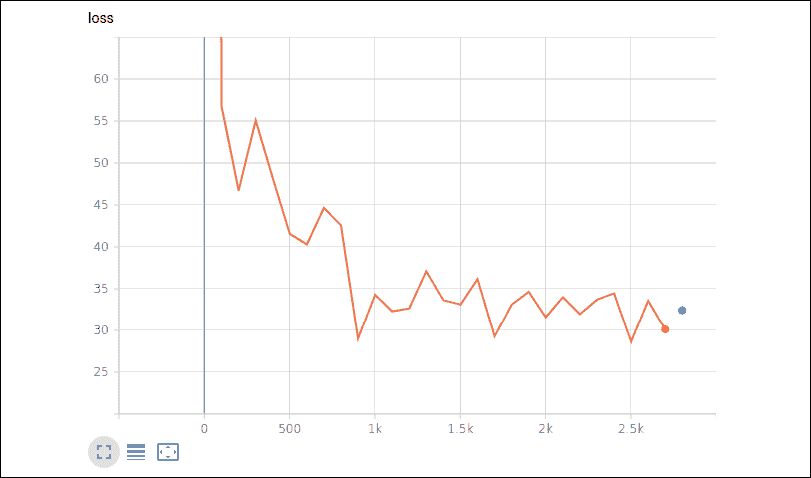

# 第四章：线性回归

线性回归可能是统计学、机器学习和科学领域中最重要的算法之一。它是最广泛使用的算法之一，理解如何实现它及其不同变种非常重要。线性回归相较于许多其他算法的一个优势是它非常易于解释。我们为每个特征得到一个数字（系数），这个数字直接表示该特征如何影响目标（即所谓的因变量）。

例如，如果你需要预测一栋房子的售价，并且你获得了一组包含房屋特征的历史销售数据（例如地块大小、房屋质量和状况的指标，以及离市中心的距离），你可以轻松地应用线性回归。你可以通过几步获得一个可靠的估算器，所得模型也容易理解并向他人解释。事实上，线性回归首先估算一个基准值，即截距，然后为每个特征估算一个乘法系数。每个系数可以将每个特征转化为预测的正向或负向部分。通过将基准值和所有系数转化后的特征相加，你可以得到最终预测。因此，在我们的房屋售价预测问题中，你可能会得到一个正系数表示地块大小，这意味着较大的地块会卖得更贵，而离市中心的负系数则表示位于郊区的房产市场价值较低。

使用 TensorFlow 计算此类模型快速、适合大数据，并且更容易投入生产，因为它可以通过检查权重向量进行普遍的解释。

在本章中，我们将向你介绍如何通过 Estimators 或 Keras 在 TensorFlow 中实现线性回归的配方，并进一步提供更为实用的解决方案。事实上，我们将解释如何使用不同的损失函数进行调整，如何正则化系数以实现特征选择，以及如何将回归应用于分类、非线性问题和具有高基数的类别变量（高基数指的是具有许多独特值的变量）。

请记住，所有的代码都可以在 GitHub 上找到，链接：[`github.com/PacktPublishing/Machine-Learning-Using-TensorFlow-Cookbook`](https://github.com/PacktPublishing/Machine-Learning-Using-TensorFlow-Cookbook)。

在本章中，我们将介绍涉及线性回归的配方。我们从使用矩阵求解线性回归的数学公式开始，然后转向使用 TensorFlow 范式实现标准线性回归及其变体。我们将涵盖以下主题：

+   学习 TensorFlow 回归方法

+   将 Keras 模型转化为 Estimator

+   理解线性回归中的损失函数

+   实现 Lasso 和 Ridge 回归

+   实现逻辑回归

+   求助于非线性解决方案

+   使用 Wide & Deep 模型

本章结束时，你会发现，使用 TensorFlow 创建线性模型（以及一些非线性模型）非常简单，利用提供的配方可以轻松完成。

# 学习 TensorFlow 中的线性回归方法

线性回归中的统计方法，使用矩阵和数据分解方法，非常强大。无论如何，TensorFlow 有另一种方式来解决回归问题中的斜率和截距系数。TensorFlow 可以通过迭代方式解决这些问题，即逐步学习最佳的线性回归参数，以最小化损失，就像我们在前面的章节中所看到的配方一样。

有趣的是，实际上在处理回归问题时，你不需要从零开始编写所有代码：Estimators 和 Keras 可以帮助你完成这项工作。Estimators 位于 `tf.estimator` 中，这是 TensorFlow 的一个高级 API。

Estimators 在 TensorFlow 1.3 中首次引入（见 [`github.com/tensorflow/tensorflow/releases/tag/v1.3.0-rc2`](https://github.com/tensorflow/tensorflow/releases/tag/v1.3.0-rc2)）作为 "**现成 Estimators**"，这些是预先制作的特定程序（例如回归模型或基本神经网络），旨在简化训练、评估、预测以及模型导出以供服务使用。使用现成的程序有助于以更简单、更直观的方式进行开发，而低级 API 则用于定制或研究解决方案（例如，当你想要测试你在论文中找到的解决方案时，或当你的问题需要完全定制的方法时）。此外，Estimators 可以轻松部署到 CPU、GPU 或 TPU 上，也可以在本地主机或分布式多服务器环境中运行，而无需对模型进行任何额外的代码更改，这使得它们适用于生产环境的现成使用场景。这也是 Estimators 不会在短期内从 TensorFlow 中消失的原因，即使 Keras，正如上一章所介绍的，是 TensorFlow 2.x 的主要高级 API。相反，更多的支持和开发将致力于 Keras 和 Estimators 之间的集成，你将很快在我们的配方中看到，如何轻松地将 Keras 模型转化为你自己的自定义 Estimators。

开发 Estimator 模型涉及四个步骤：

1.  使用 `tf.data` 函数获取数据

1.  实例化特征列

1.  实例化并训练 Estimator

1.  评估模型性能

在我们的配方中，我们将探索这四个步骤，并为每个步骤提供可重用的解决方案。

## 准备工作

在这个配方中，我们将循环遍历数据点的批次，并让 TensorFlow 更新斜率和 y 截距。我们将使用波士顿房价数据集，而不是生成的数据。

波士顿住房数据集来源于 Harrison, D. 和 Rubinfeld, D.L. 的论文 *Hedonic Housing Prices and the Demand for Clean Air*（《环境经济学与管理学杂志》，第 5 卷，第 81-102 页，1978 年），该数据集可以在许多分析包中找到（例如 scikit-learn 中），并且存在于 UCI 机器学习库以及原始的 StatLib 存档（http://lib.stat.cmu.edu/datasets/boston）。这是一个经典的回归问题数据集，但并非简单数据集。例如，样本是有顺序的，如果你没有随机打乱样本，进行训练/测试集划分时可能会产生无效且有偏的模型。

详细来说，数据集由 1970 年波士顿人口普查中的 506 个普查区组成，包含 21 个变量，涉及可能影响房地产价值的各个方面。目标变量是房屋的中位数货币价值，单位为千美元。在这些可用的特征中，有一些非常明显的特征，如房间数量、建筑物年龄和邻里犯罪水平，还有一些不那么明显的特征，如污染浓度、附近学校的可用性、高速公路的接入情况和距离就业中心的远近。

回到我们的解决方案，具体来说，我们将找到一个最优特征集，帮助我们估算波士顿的房价。在下一节讨论不同损失函数对这一问题的影响之前，我们还将展示如何从 Keras 函数开始创建一个回归 Estimator，在 TensorFlow 中进行自定义，这为解决不同问题提供了重要的自定义选项。

## 如何操作...

我们按以下步骤继续进行：

我们首先加载必要的库，然后使用 pandas 函数将数据加载到内存中。接下来，我们将预测变量与目标变量（MEDV，中位房价）分开，并将数据划分为训练集和测试集：

```py
import tensorflow as tf 
import numpy as np
import pandas as pd
import tensorflow_datasets as tfds
tfds.disable_progress_bar()
housing_url = 'http://archive.ics.uci.edu/ml/machine-learning-databases/housing/housing.data'
path = tf.keras.utils.get_file(housing_url.split("/")[-1], housing_url)
columns = ['CRIM', 'ZN', 'INDUS', 'CHAS', 'NOX', 'RM', 'AGE',            'DIS', 'RAD', 'TAX', 'PTRATIO', 'B', 'LSTAT', 'MEDV']
data = pd.read_table(path, delim_whitespace=True, 
                     header=None, names=columns)
np.random.seed(1)
train = data.sample(frac=0.8).copy()
y_train = train['MEDV']
train.drop('MEDV', axis=1, inplace=True)
test = data.loc[~data.index.isin(train.index)].copy()
y_test = test['MEDV']
test.drop('MEDV', axis=1, inplace=True) 
```

接下来，我们为我们的方案声明两个关键函数：

1.  `make_input_fn` 是一个函数，用于从转换为 Python 字典的 pandas DataFrame（特征作为键，值为特征向量的 pandas Series）创建一个 `tf.data` 数据集。它还提供批量大小定义和随机打乱功能。

1.  `define_feature_columns` 是一个函数，用于将每一列的名称映射到特定的 `tf.feature_column` 转换。`tf.feature_column` 是一个 TensorFlow 模块 ([`www.tensorflow.org/api_docs/python/tf/feature_column`](https://www.tensorflow.org/api_docs/python/tf/feature_column))，提供能够以适当方式处理各种数据的函数，以便将其输入到神经网络中。

`make_input_fn` 函数用于实例化两个数据函数，一个用于训练（数据被打乱，批量大小为 256，设置为消耗 1400 个周期），一个用于测试（设置为单个周期，无打乱，因此顺序保持原样）。

`define_feature_columns`函数用于通过`numeric_column`函数（[`www.tensorflow.org/api_docs/python/tf/feature_column/numeric_column`](https://www.tensorflow.org/api_docs/python/tf/feature_column/numeric_column)）映射数值变量，通过`categorical_column_with_vocabulary_list`（[`www.tensorflow.org/api_docs/python/tf/feature_column/categorical_column_with_vocabulary_list`](https://www.tensorflow.org/api_docs/python/tf/feature_column/categorical_column_with_vocabulary_list)）映射类别变量。两者都会告诉我们的估算器如何以最佳方式处理这些数据：

```py
learning_rate = 0.05 
def make_input_fn(data_df, label_df, num_epochs=10, 
                  shuffle=True, batch_size=256):

    def input_function():
        ds = tf.data.Dataset.from_tensor_slices((dict(data_df), label_df))
        if shuffle:
            ds = ds.shuffle(1000)
        ds = ds.batch(batch_size).repeat(num_epochs)
        return ds

    return input_function
def define_feature_columns(data_df, categorical_cols, numeric_cols):
    feature_columns = []

    for feature_name in numeric_cols:              
        feature_columns.append(tf.feature_column.numeric_column(
             feature_name, dtype=tf.float32))

    for feature_name in categorical_cols:
        vocabulary = data_df[feature_name].unique()
        feature_columns.append(
                                                                   tf.feature_column.categorical_column_with_vocabulary_list(
                                                 feature_name, vocabulary))
    return feature_columns
categorical_cols = ['CHAS', 'RAD']
numeric_cols = ['CRIM', 'ZN', 'INDUS',  'NOX', 'RM', 'AGE', 'DIS', 'TAX', 'PTRATIO', 'B', 'LSTAT']
feature_columns = define_feature_columns(data, categorical_cols, numeric_cols)
train_input_fn = make_input_fn(train, y_train, num_epochs=1400)
test_input_fn = make_input_fn(test, y_test, num_epochs=1, shuffle=False) 
```

接下来的步骤是实例化线性回归模型的估算器。我们将回顾线性模型的公式，*y = aX + b*，这意味着存在一个截距值的系数，然后对于每个特征或特征转换（例如，类别数据是独热编码的，因此每个变量值都有一个单独的系数）也会有一个系数：

```py
linear_est = tf.estimator.LinearRegressor(feature_columns=feature_columns) 
```

现在，我们只需要训练模型并评估其性能。使用的指标是均方根误差（越小越好）：

```py
linear_est.train(train_input_fn)
result = linear_est.evaluate(test_input_fn)
print(result) 
```

以下是报告的结果：

```py
INFO:tensorflow:Loss for final step: 25.013594.
...
INFO:tensorflow:Finished evaluation at 2020-05-11-15:48:16
INFO:tensorflow:Saving dict for global step 2800: average_loss = 32.715736, global_step = 2800, label/mean = 22.048513, loss = 32.715736, prediction/mean = 21.27578 
```

在这里是个很好的地方，可以注意如何判断模型是否出现了过拟合或欠拟合。如果我们的数据被分为测试集和训练集，并且在训练集上的表现优于测试集，则说明我们正在过拟合数据。如果准确率在测试集和训练集上都在增加，则说明模型欠拟合，我们应该继续训练。

在我们的案例中，训练结束时的平均损失为 25.0。我们的测试集平均损失为 32.7，这意味着我们可能已经过拟合，应该减少训练的迭代次数。

我们可以可视化估算器在训练数据时的表现，以及它与测试集结果的比较。这需要使用 TensorBoard（[`www.tensorflow.org/tensorboard/`](https://www.tensorflow.org/tensorboard/)），TensorFlow 的可视化工具包，稍后在本书中将详细讲解。

无论如何，你只需使用`4\. Linear Regression with TensorBoard.ipynb`笔记本，而不是`4\. Linear Regression.ipynb`版本，就可以重现这些可视化内容。两者都可以在本书的 GitHub 仓库中找到，链接为[`github.com/PacktPublishing/Machine-Learning-Using-TensorFlow-Cookbook`](https://github.com/PacktPublishing/Machine-Learning-Using-TensorFlow-Cookbook)。



图 4.1：回归估算器训练损失的 TensorBoard 可视化

可视化结果显示，估计器快速拟合了问题，并在 1,000 个观测批次后达到了最佳值。随后，它围绕已达到的最小损失值波动。由蓝点表示的测试性能接近最佳值，从而证明即使是在未见过的示例上，模型也表现稳定。

## 它是如何工作的……

调用适当 TensorFlow 功能的估计器，从数据函数中筛选数据，并根据匹配的特征名称和`tf.feature_column`函数将数据转换为适当的形式，完成了整个工作。剩下的就是检查拟合情况。实际上，估计器找到的最佳拟合线并不保证就是最优拟合线。是否收敛到最优拟合线取决于迭代次数、批量大小、学习率和损失函数。始终建议在训练过程中观察损失函数，因为这有助于排查问题或调整超参数。

## 还有更多……

如果你想提高线性模型的性能，交互特征可能是关键。这意味着你在两个变量之间创建组合，而这个组合比单独的特征更能解释目标。在我们的波士顿住房数据集中，结合房屋的平均房间数和某个地区低收入人群的比例，可以揭示更多关于邻里类型的信息，并帮助推断该地区的住房价值。我们通过将它们传递给`tf.feature_column.crossed_column`函数来组合这两个特征。估计器在接收这些输出作为特征的一部分时，会自动创建这个交互特征：

```py
def create_interactions(interactions_list, buckets=5):
    interactions = list()
    for (a, b) in interactions_list:
        interactions.append(tf.feature_column.crossed_column([a, b], hash_bucket_size=buckets))
    return interactions
derived_feature_columns = create_interactions([['RM', 'LSTAT']])
linear_est = tf.estimator.LinearRegressor(feature_columns=feature_columns+derived_feature_columns)
linear_est.train(train_input_fn)
result = linear_est.evaluate(test_input_fn)
print(result) 
```

这里是训练损失和相应测试集结果的图表。


图 4.2：带有交互特征的回归模型的 TensorBoard 图

观察现在的拟合速度比之前更快、更稳定，这表明我们为模型提供了更多有用的特征（交互特征）。

另一个有用的配方函数适用于处理预测：估计器将其作为字典返回。一个简单的函数将把所有内容转换为更有用的预测数组：

```py
def dicts_to_preds(pred_dicts):
    return np.array([pred['predictions'] for pred in pred_dicts])
preds = dicts_to_preds(linear_est.predict(test_input_fn))
print(preds) 
```

将预测结果作为数组有助于你以比字典更方便的方式重用和导出结果。

# 将 Keras 模型转化为估计器

到目前为止，我们已经使用了`tf.estimator`模块中特定的 Estimators 来解决我们的线性回归模型。这具有明显的优势，因为我们的模型大部分是自动运行的，并且我们可以轻松地在云端（如 Google 提供的 Google Cloud Platform）和不同类型的服务器（基于 CPU、GPU 和 TPU）上进行可伸缩的部署。然而，通过使用 Estimators，我们可能会缺乏模型架构的灵活性，而这正是 Keras 模块化方法所要求的，我们在前一章中已经讨论过。在这个配方中，我们将通过展示如何将 Keras 模型转换为 Estimators 来解决这个问题，从而同时利用 Estimators API 和 Keras 的多样性。

## 准备工作

我们将使用与前一配方中相同的波士顿住房数据集，同时还将利用`make_input_fn`函数。与之前一样，我们需要导入我们的核心包：

```py
import tensorflow as tf 
import numpy as np
import pandas as pd
import tensorflow_datasets as tfds
tfds.disable_progress_bar() 
```

我们还需要从 TensorFlow 导入 Keras 模块。

```py
import tensorflow.keras as keras 
```

将`tf.keras`导入为`keras`还允许您轻松地重用之前使用独立 Keras 包编写的任何脚本。

## 如何操作...

我们的第一步将是重新定义创建特征列的函数。事实上，现在我们必须为我们的 Keras 模型指定一个输入，这是在原生 Estimators 中不需要的，因为它们只需要一个`tf.feature`函数来映射特征：

```py
def define_feature_columns_layers(data_df, categorical_cols, numeric_cols):
    feature_columns = []
    feature_layer_inputs = {}

    for feature_name in numeric_cols:
        feature_columns.append(tf.feature_column.numeric_column(feature_name, dtype=tf.float32))
        feature_layer_inputs[feature_name] = tf.keras.Input(shape=(1,), name=feature_name)

    for feature_name in categorical_cols:
        vocabulary = data_df[feature_name].unique()
        cat = tf.feature_column.categorical_column_with_vocabulary_list(feature_name, vocabulary)
        cat_one_hot = tf.feature_column.indicator_column(cat)
        feature_columns.append(cat_one_hot)
        feature_layer_inputs[feature_name] = tf.keras.Input(shape=(1,), name=feature_name, dtype=tf.int32)

    return feature_columns, feature_layer_inputs 
```

互动也是一样的。在这里，我们还需要定义将由我们的 Keras 模型使用的输入（在本例中是独热编码）：

```py
def create_interactions(interactions_list, buckets=5):
    feature_columns = []

    for (a, b) in interactions_list:
        crossed_feature = tf.feature_column.crossed_column([a, b], hash_bucket_size=buckets)
        crossed_feature_one_hot = tf.feature_column.indicator_column(crossed_feature)
        feature_columns.append(crossed_feature_one_hot)

    return feature_columns 
```

准备好必要的输入后，我们可以开始模型本身。这些输入将被收集在一个特征层中，该层将数据传递给一个`batchNormalization`层，该层将自动标准化数据。然后数据将被导向输出节点，该节点将生成数值输出。

```py
def create_linreg(feature_columns, feature_layer_inputs, optimizer):
    feature_layer = keras.layers.DenseFeatures(feature_columns)
    feature_layer_outputs = feature_layer(feature_layer_inputs)
    norm = keras.layers.BatchNormalization()(feature_layer_outputs)
    outputs = keras.layers.Dense(1, kernel_initializer='normal', activation='linear')(norm)

    model = keras.Model(inputs=[v for v in feature_layer_inputs.values()], outputs=outputs)
    model.compile(optimizer=optimizer, loss='mean_squared_error')
    return model 
```

在此时，已经设置了所有必要的输入，新函数被创建，我们可以运行它们：

```py
categorical_cols = ['CHAS', 'RAD']
numeric_cols = ['CRIM', 'ZN', 'INDUS',  'NOX', 'RM', 'AGE', 'DIS', 'TAX', 'PTRATIO', 'B', 'LSTAT']
feature_columns, feature_layer_inputs = define_feature_columns_layers(data, categorical_cols, numeric_cols)
interactions_columns = create_interactions([['RM', 'LSTAT']])
feature_columns += interactions_columns
optimizer = keras.optimizers.Ftrl(learning_rate=0.02)
model = create_linreg(feature_columns, feature_layer_inputs, optimizer) 
```

现在我们已经获得了一个工作的 Keras 模型。我们可以使用`model_to_estimator`函数将其转换为 Estimator。这需要为 Estimator 的输出建立一个临时目录：

```py
import tempfile
def canned_keras(model):
    model_dir = tempfile.mkdtemp()
    keras_estimator = tf.keras.estimator.model_to_estimator(
        keras_model=model, model_dir=model_dir)
    return keras_estimator
estimator = canned_keras(model) 
```

将 Keras 模型转换为 Estimator 后，我们可以像以前一样训练模型并评估结果。

```py
train_input_fn = make_input_fn(train, y_train, num_epochs=1400)
test_input_fn = make_input_fn(test, y_test, num_epochs=1, shuffle=False)
estimator.train(train_input_fn)
result = estimator.evaluate(test_input_fn)
print(result) 
```

当我们使用 TensorBoard 绘制拟合过程时，我们将观察到训练轨迹与之前 Estimators 获得的轨迹非常相似：


图 4.3：使用 Keras 线性 Estimator 进行训练

Canned Keras Estimators 确实是将 Keras 用户定义解决方案的灵活性与 Estimators 高性能训练和部署结合在一起的快速而健壮的方法。

## 工作原理...

`model_to_estimator`函数并不是 Keras 模型的包装器。相反，它解析你的模型并将其转换为静态 TensorFlow 图，从而实现分布式训练和模型扩展。

## 还有更多...

使用线性模型的一个重要优势是能够探索其权重，并了解哪个特征对我们获得的结果产生了影响。每个系数会告诉我们，鉴于输入在批处理层被标准化，特征相对于其他特征的影响（系数在绝对值上是可以比较的），以及它是增加还是减少结果（根据正负符号）：

```py
weights = estimator.get_variable_value('layer_with_weights-1/kernel/.ATTRIBUTES/VARIABLE_VALUE')
print(weights) 
```

无论如何，如果我们从模型中提取权重，我们会发现无法轻松解释它们，因为它们没有标签且维度不同，因为`tf.feature`函数应用了不同的转换。

我们需要一个函数来提取从特征列中正确的标签，因为在将它们输入到预设估算器之前，我们已经将它们映射过：

```py
def extract_labels(feature_columns):
    labels = list()
    for col in feature_columns:
        col_config = col.get_config()
        if 'key' in col_config:
            labels.append(col_config['key'])
        elif 'categorical_column' in col_config:
            if col_config['categorical_column']['class_name']=='VocabularyListCategoricalColumn':
                key = col_config['categorical_column']['config']['key']
                for item in col_config['categorical_column']['config']['vocabulary_list']:
                     labels.append(key+'_val='+str(item))
            elif col_config['categorical_column']['class_name']=='CrossedColumn':
                keys = col_config['categorical_column']['config']['keys']
                for bucket in range(col_config['categorical_column']['config']['hash_bucket_size']):
                    labels.append('x'.join(keys)+'_bkt_'+str(bucket))
    return labels 
```

该函数仅适用于 TensorFlow 2.2 或更高版本，因为在早期的 TensorFlow 2.x 版本中，`get_config`方法在`tf.feature`对象中并不存在。

现在，我们可以提取所有标签，并有意义地将每个输出中的权重与其相应的特征匹配：

```py
labels = extract_labels(feature_columns)
for label, weight in zip(labels, weights):
    print(f"{label:15s} : {weight[0]:+.2f}") 
```

一旦你得到了权重，就可以通过观察每个系数的符号和大小，轻松地得出每个特征对结果的贡献。然而，特征的尺度可能会影响大小，除非你事先通过减去均值并除以标准差对特征进行了统计标准化。

# 理解线性回归中的损失函数

了解损失函数对算法收敛性的影响非常重要。在这里，我们将说明 L1 和 L2 损失函数如何影响线性回归的收敛性和预测。这是我们对预设 Keras 估算器进行的第一次自定义。本章的更多配方将在此基础上通过添加更多功能来增强该初始估算器。

## 准备工作

我们将使用与前面配方中相同的波士顿房价数据集，并使用以下函数：

```py
* define_feature_columns_layers
* make_input_fn
* create_interactions 
```

然而，我们将更改损失函数和学习率，看看收敛性如何变化。

## 如何实现...

我们按如下方式继续配方：

程序的开始与上一个配方相同。因此，我们加载必要的包，并且如果波士顿房价数据集尚不可用，我们将下载它：

```py
import tensorflow as tf 
import tensorflow.keras as keras
import numpy as np
import pandas as pd
import tensorflow_datasets as tfds
tfds.disable_progress_bar() 
```

之后，我们需要重新定义`create_linreg`，通过添加一个新的参数来控制损失类型。默认值仍然是均方误差（L2 损失），但现在在实例化预设估算器时可以轻松更改：

```py
def create_linreg(feature_columns, feature_layer_inputs, optimizer, 
                  loss='mean_squared_error', 
                  metrics=['mean_absolute_error']):
    feature_layer = keras.layers.DenseFeatures(feature_columns)
    feature_layer_outputs = feature_layer(feature_layer_inputs)
    norm = keras.layers.BatchNormalization()(feature_layer_outputs)
    outputs = keras.layers.Dense(1, kernel_initializer='normal', 
                                 activation='linear')(norm)

    model = keras.Model(inputs=[v for v in feature_layer_inputs.values()], 
                        outputs=outputs)
    model.compile(optimizer=optimizer, loss=loss, metrics=metrics)
    return model 
```

这样做之后，我们可以通过使用不同学习率的`Ftrl`优化器显式地训练我们的模型，更适合 L1 损失（我们将损失设置为平均绝对误差）：

```py
categorical_cols = ['CHAS', 'RAD']
numeric_cols = ['CRIM', 'ZN', 'INDUS',  'NOX', 'RM', 'AGE', 'DIS', 'TAX', 'PTRATIO', 'B', 'LSTAT']
feature_columns, feature_layer_inputs = define_feature_columns_layers(data, categorical_cols, numeric_cols)
interactions_columns = create_interactions([['RM', 'LSTAT']])
feature_columns += interactions_columns
optimizer = keras.optimizers.Ftrl(learning_rate=0.02)
model = create_linreg(feature_columns, feature_layer_inputs, optimizer,
                      loss='mean_absolute_error', 
                      metrics=['mean_absolute_error',                                'mean_squared_error'])
estimator = canned_keras(model)
train_input_fn = make_input_fn(train, y_train, num_epochs=1400)
test_input_fn = make_input_fn(test, y_test, num_epochs=1, shuffle=False)
estimator.train(train_input_fn)
result = estimator.evaluate(test_input_fn)
print(result) 
```

这是我们通过切换到 L1 损失函数得到的结果：

```py
{'loss': 3.1208777, 'mean_absolute_error': 3.1208777, 'mean_squared_error': 27.170328, 'global_step': 2800} 
```

我们现在可以使用 TensorBoard 来可视化训练过程中的性能：


图 4.4：均方误差优化

结果图显示了均方误差的良好下降，直到 400 次迭代后减慢，并在 1,400 次迭代后趋于稳定，形成一个平台。

## 如何运作……

在选择损失函数时，我们还必须选择一个相应的学习率，以确保其与我们的问题匹配。在这里，我们测试了两种情况，第一种是采用 L2，第二种是首选 L1。

如果我们的学习率较小，收敛过程将需要更多时间。然而，如果学习率过大，我们的算法可能会无法收敛。

## 还有更多……

为了理解发生了什么，我们应当观察大学习率和小学习率对**L1 范数**和**L2 范数**的作用。如果学习率过大，L1 可能会停滞在次优结果，而 L2 可能会得到更差的性能。为了可视化这一点，我们将查看关于两种范数的学习步长的一维表示，如下所示：


图 4.5：L1 和 L2 范数在较大和较小学习率下的表现

如前所示，小学习率确实能保证更好的优化结果。较大的学习率与 L2 不太适用，但可能对 L1 证明是次优的，因为它会在一段时间后停止进一步优化，而不会造成更大的损害。

# 实现 Lasso 和 Ridge 回归

有几种方法可以限制系数对回归输出的影响。这些方法被称为正则化方法，其中最常见的两种正则化方法是 Lasso 和 Ridge 回归。在本食谱中，我们将讲解如何实现这两种方法。

## 准备工作

Lasso 和 Ridge 回归与普通线性回归非常相似，不同之处在于我们在公式中加入了正则化项，以限制斜率（或偏斜率）。这背后可能有多个原因，但常见的一个原因是我们希望限制对因变量有影响的特征数量。

## 如何操作……

我们按照以下步骤继续进行：

我们将再次使用波士顿房价数据集，并按照之前的食谱设置函数。特别是，我们需要`define_feature_columns_layers`、`make_input_fn` 和 `create_interactions`。我们再次首先加载库，然后定义一个新的 `create_ridge_linreg`，在其中我们使用`keras.regularizers.l2`作为我们密集层的`regularizer`来设置一个新的 Keras 模型：

```py
import tensorflow as tf 
import tensorflow.keras as keras
import numpy as np
import pandas as pd
import tensorflow_datasets as tfds
tfds.disable_progress_bar()
def create_ridge_linreg(feature_columns, feature_layer_inputs, optimizer, 
                        loss='mean_squared_error', 
                        metrics=['mean_absolute_error'],
                        l2=0.01):

    regularizer = keras.regularizers.l2(l2)
    feature_layer = keras.layers.DenseFeatures(feature_columns)
    feature_layer_outputs = feature_layer(feature_layer_inputs)
    norm = keras.layers.BatchNormalization()(feature_layer_outputs)
    outputs = keras.layers.Dense(1, 
                                 kernel_initializer='normal', 
                                 kernel_regularizer = regularizer, 
                                 activation='linear')(norm)

    model = keras.Model(inputs=[v for v in feature_layer_inputs.values()],                         outputs=outputs)
    model.compile(optimizer=optimizer, loss=loss, metrics=metrics)
    return model 
```

完成这些后，我们可以再次运行之前的线性模型，并使用 L1 损失来观察结果的改进：

```py
categorical_cols = ['CHAS', 'RAD']
numeric_cols = ['CRIM', 'ZN', 'INDUS',  'NOX', 'RM', 'AGE', 'DIS', 'TAX', 'PTRATIO', 'B', 'LSTAT']
feature_columns, feature_layer_inputs = define_feature_columns_layers(data, categorical_cols, numeric_cols)
interactions_columns = create_interactions([['RM', 'LSTAT']])
feature_columns += interactions_columns
optimizer = keras.optimizers.Ftrl(learning_rate=0.02)
model = create_ridge_linreg(feature_columns, feature_layer_inputs, optimizer,
                      loss='mean_squared_error', 
                      metrics=['mean_absolute_error',                                'mean_squared_error'],
                           l2=0.01)
estimator = canned_keras(model)
train_input_fn = make_input_fn(train, y_train, num_epochs=1400)
test_input_fn = make_input_fn(test, y_test, num_epochs=1, shuffle=False)
estimator.train(train_input_fn)
result = estimator.evaluate(test_input_fn)
print(result) 
```

这是 Ridge 回归的结果：

```py
{'loss': 25.903751, 'mean_absolute_error': 3.27314, 'mean_squared_error': 25.676477, 'global_step': 2800} 
```

此外，这里是使用 TensorBoard 进行训练的图表：


图 4.6：Ridge 回归训练损失

我们也可以通过创建一个新函数来复制 L1 正则化：

```py
create_lasso_linreg.
def create_lasso_linreg(feature_columns, feature_layer_inputs, optimizer, 
                        loss='mean_squared_error', metrics=['mean_absolute_error'],
                        l1=0.001):

    regularizer = keras.regularizers.l1(l1)
    feature_layer = keras.layers.DenseFeatures(feature_columns)
    feature_layer_outputs = feature_layer(feature_layer_inputs)
    norm = keras.layers.BatchNormalization()(feature_layer_outputs)
    outputs = keras.layers.Dense(1, 
                                 kernel_initializer='normal', 
                                 kernel_regularizer = regularizer, 
                                 activation='linear')(norm)

    model = keras.Model(inputs=[v for v in feature_layer_inputs.values()], outputs=outputs)
    model.compile(optimizer=optimizer, loss=loss, metrics=metrics)
    return model
categorical_cols = ['CHAS', 'RAD']
numeric_cols = ['CRIM', 'ZN', 'INDUS',  'NOX', 'RM', 'AGE', 'DIS', 'TAX', 'PTRATIO', 'B', 'LSTAT']
feature_columns, feature_layer_inputs = define_feature_columns_layers(data, categorical_cols, numeric_cols)
interactions_columns = create_interactions([['RM', 'LSTAT']])
feature_columns += interactions_columns
optimizer = keras.optimizers.Ftrl(learning_rate=0.02)
model = create_lasso_linreg(feature_columns, feature_layer_inputs, optimizer,
                      loss='mean_squared_error', 
                      metrics=['mean_absolute_error',                                'mean_squared_error'],
                           l1=0.001)
estimator = canned_keras(model)
train_input_fn = make_input_fn(train, y_train, num_epochs=1400)
test_input_fn = make_input_fn(test, y_test, num_epochs=1, shuffle=False)
estimator.train(train_input_fn)
result = estimator.evaluate(test_input_fn)
print(result) 
```

这是从 L1 Lasso 回归得到的结果：

```py
{'loss': 24.616476, 'mean_absolute_error': 3.1985352, 'mean_squared_error': 24.59167, 'global_step': 2800} 
```

此外，这里是训练损失的图表：


图 4.7：Lasso 回归训练损失

比较 Ridge 和 Lasso 方法时，我们注意到它们在训练损失方面没有太大差异，但测试结果偏向 Lasso。这可能是由于一个噪声变量必须被排除，才能让模型得到改进，因为 Lasso 会定期从预测估计中排除无用的变量（通过赋予它们零系数），而 Ridge 只是对它们进行下调权重。

## 它是如何工作的...

我们通过向线性回归的损失函数添加一个连续的 Heaviside 阶跃函数来实现 Lasso 回归。由于阶跃函数的陡峭性，我们必须小心步长。如果步长太大，模型将无法收敛。关于 Ridge 回归，请参见下一节所需的更改。

## 还有更多...

弹性网回归是一种回归方法，通过将 Lasso 回归与 Ridge 回归结合，在损失函数中添加 L1 和 L2 正则化项。

实现弹性网回归很简单，跟随前两个方法，因为你只需更改正则化器。

我们只需创建一个 `create_elasticnet_linreg` 函数，它将 L1 和 L2 强度的值作为参数传入：

```py
def create_elasticnet_linreg(feature_columns, feature_layer_inputs, 
                             optimizer,                         
                             loss='mean_squared_error', 
                             metrics=['mean_absolute_error'],
                             l1=0.001, l2=0.01):

    regularizer = keras.regularizers.l1_l2(l1=l1, l2=l2)
    feature_layer = keras.layers.DenseFeatures(feature_columns)
    feature_layer_outputs = feature_layer(feature_layer_inputs)
    norm = keras.layers.BatchNormalization()(feature_layer_outputs)
    outputs = keras.layers.Dense(1, 
                                 kernel_initializer='normal', 
                                 kernel_regularizer = regularizer, 
                                 activation='linear')(norm)

    model = keras.Model(inputs=[v for v in feature_layer_inputs.values()], 
                        outputs=outputs)
    model.compile(optimizer=optimizer, loss=loss, metrics=metrics)
    return model 
```

最后，我们重新运行从数据开始的完整训练步骤，并评估模型的性能：

```py
categorical_cols = ['CHAS', 'RAD']
numeric_cols = ['CRIM', 'ZN', 'INDUS',  'NOX', 'RM', 'AGE', 'DIS', 'TAX', 'PTRATIO', 'B', 'LSTAT']
feature_columns, feature_layer_inputs = define_feature_columns_layers(data, categorical_cols, numeric_cols)
interactions_columns = create_interactions([['RM', 'LSTAT']])
feature_columns += interactions_columns
optimizer = keras.optimizers.Ftrl(learning_rate=0.02)
model = create_elasticnet_linreg(feature_columns, feature_layer_inputs,                                  optimizer,
                                 loss='mean_squared_error', 
                                 metrics=['mean_absolute_error',
                                          'mean_squared_error'],
                                 l1=0.001, l2=0.01)
estimator = canned_keras(model)
train_input_fn = make_input_fn(train, y_train, num_epochs=1400)
test_input_fn = make_input_fn(test, y_test, num_epochs=1, shuffle=False)
estimator.train(train_input_fn)
result = estimator.evaluate(test_input_fn)
print(result) 
```

这是得到的结果：

```py
{'loss': 24.910872, 'mean_absolute_error': 3.208289, 'mean_squared_error': 24.659771, 'global_step': 2800} 
```

这是 ElasticNet 模型的训练损失图：


图 4.8：ElasticNet 训练损失

获得的测试结果与 Ridge 和 Lasso 相差不大，位于它们之间。如前所述，问题在于从数据集中去除变量以提高性能，正如我们现在所看到的，Lasso 模型是最适合执行这一任务的。

# 实现逻辑回归

对于本教程，我们将实现逻辑回归，利用乳腺癌威斯康星数据集（[`archive.ics.uci.edu/ml/datasets/Breast+Cancer+Wisconsin+(Diagnostic)`](https://archive.ics.uci.edu/ml/datasets/Breast+Cancer+Wisconsin+(Diagnostic)))来预测乳腺癌的概率。我们将从基于乳腺肿块的**细针穿刺**（**FNA**）图像计算得到的特征中预测诊断结果。FNA 是一个常见的乳腺癌检测方法，通过小量组织活检进行，活检样本可以在显微镜下进行检查。

该数据集可以直接用于分类模型，无需进一步转换，因为目标变量由 357 个良性病例和 212 个恶性病例组成。这两个类别的样本数并不完全相同（在进行二分类回归模型时，这是一个重要要求），但它们的差异并不极端，使我们能够构建一个简单的例子并使用普通准确率来评估模型。

请记得检查你的类别是否平衡（换句话说，是否具有大致相同数量的样本），否则你需要采取特定的方法来平衡样本，例如应用权重，或者你的模型可能会提供不准确的预测（如果你需要更多细节，可以参考以下 Stack Overflow 问题：[`datascience.stackexchange.com/questions/13490/how-to-set-class-weights-for-imbalanced-classes-in-keras`](https://datascience.stackexchange.com/questions/13490/how-to-set-class-weights-for-imbalanced-classes-in-keras)）。

## 准备工作

逻辑回归是一种将线性回归转化为二分类的方法。这是通过将线性输出转换为一个 sigmoid 函数来实现的，该函数将输出值缩放到 0 和 1 之间。目标值是 0 或 1，表示一个数据点是否属于某个类别。由于我们预测的是一个 0 到 1 之间的数值，当预测值超过指定的阈值时，预测结果被分类为类别 1，否则为类别 0。对于本例，我们将阈值设置为 0.5，这样分类就变得和四舍五入输出一样简单。

在分类时，无论如何，有时候你需要控制自己犯的错误，这对于医疗应用（比如我们提出的这个例子）尤其重要，但对于其他应用（例如保险或银行领域的欺诈检测），这也是一个值得关注的问题。事实上，在分类时，你会得到正确的预测结果，但也会有**假阳性**和**假阴性**。假阳性是模型在预测为阳性（类别 1）时，真实标签却为阴性所产生的错误。假阴性则是模型将实际为阳性的样本预测为阴性。

在使用 0.5 阈值来决定类别（正类或负类）时，实际上你是在平衡假阳性和假阴性的期望值。实际上，根据你的问题，假阳性和假阴性错误可能会有不同的后果。例如，在癌症检测的情况下，显然你绝对不希望发生假阴性错误，因为这意味着将一个实际患病的病人误判为健康，可能导致生命危险。

通过设置更高或更低的分类阈值，你可以在假阳性和假阴性之间进行权衡。较高的阈值将导致更多的假阴性，而假阳性较少。较低的阈值将导致较少的假阴性，但假阳性更多。对于我们的示例，我们将使用 0.5 的阈值，但请注意，阈值也是你需要考虑的因素，尤其是在模型的实际应用中。

## 如何实现...

我们按照以下步骤继续进行示例：

我们首先加载库并从互联网恢复数据：

```py
import tensorflow as tf 
import tensorflow.keras as keras
import numpy as np
import pandas as pd
import tensorflow_datasets as tfds
tfds.disable_progress_bar()
breast_cancer = 'https://archive.ics.uci.edu/ml/machine-learning-databases/breast-cancer-wisconsin/breast-cancer-wisconsin.data'
path = tf.keras.utils.get_file(breast_cancer.split("/")[-1], breast_cancer)
columns = ['sample_code', 'clump_thickness', 'cell_size_uniformity',
           'cell_shape_uniformity',
           'marginal_adhesion', 'single_epithelial_cell_size',
           'bare_nuclei', 'bland_chromatin',
           'normal_nucleoli', 'mitoses', 'class']
data = pd.read_csv(path, header=None, names=columns, na_values=[np.nan, '?'])
data = data.fillna(data.median())
np.random.seed(1)
train = data.sample(frac=0.8).copy()
y_train = (train['class']==4).astype(int)
train.drop(['sample_code', 'class'], axis=1, inplace=True)
test = data.loc[~data.index.isin(train.index)].copy()
y_test = (test['class']==4).astype(int)
test.drop(['sample_code', 'class'], axis=1, inplace=True) 
```

接下来，我们指定逻辑回归函数。与我们之前的线性回归模型相比，主要的修改是将单个输出神经元的激活函数从`linear`改为`sigmoid`，这就足够让我们得到一个逻辑回归模型，因为我们的输出将是一个概率值，范围从 0.0 到 1.0：

```py
def create_logreg(feature_columns, feature_layer_inputs, optimizer, 
                  loss='binary_crossentropy', metrics=['accuracy'],
                  l2=0.01):

    regularizer = keras.regularizers.l2(l2)
    feature_layer = keras.layers.DenseFeatures(feature_columns)
    feature_layer_outputs = feature_layer(feature_layer_inputs)
    norm = keras.layers.BatchNormalization()(feature_layer_outputs)
    outputs = keras.layers.Dense(1, 
                                 kernel_initializer='normal', 
                                 kernel_regularizer = regularizer, 
                                 activation='sigmoid')(norm)

    model = keras.Model(inputs=[v for v in feature_layer_inputs.values()], outputs=outputs)
    model.compile(optimizer=optimizer, loss=loss, metrics=metrics)
    return model 
```

最后，我们运行我们的程序：

```py
categorical_cols = []
numeric_cols = ['clump_thickness', 'cell_size_uniformity', 'cell_shape_uniformity',
                'marginal_adhesion', 'single_epithelial_cell_size', 'bare_  nuclei',
                'bland_chromatin',
                'normal_nucleoli', 'mitoses']
feature_columns, feature_layer_inputs = define_feature_columns_layers(data, categorical_cols, numeric_cols)
optimizer = keras.optimizers.Ftrl(learning_rate=0.007)
model = create_logreg(feature_columns, feature_layer_inputs, optimizer, l2=0.01)
estimator = canned_keras(model)
train_input_fn = make_input_fn(train, y_train, num_epochs=300, batch_size=32)
test_input_fn = make_input_fn(test, y_test, num_epochs=1, shuffle=False)
estimator.train(train_input_fn)
result = estimator.evaluate(test_input_fn)
print(result) 
```

下面是我们逻辑回归的准确率报告：

```py
{'accuracy': 0.95, 'loss': 0.16382739, 'global_step': 5400} 
```

此外，你可以在这里找到损失图：


图 4.9：逻辑回归模型的 TensorBoard 训练损失图

通过几个命令，我们在准确率和损失方面取得了不错的结果，尽管目标类别略有不平衡（良性病例比恶性病例更多）。

## 它是如何工作的...

逻辑回归的预测基于 sigmoid 曲线，若要相应地修改我们之前的线性模型，我们只需要切换到 sigmoid 激活函数。

## 还有更多...

当你在进行多类或多标签预测时，你不需要通过不同类型的**一对多**（**OVA**）策略来扩展二分类模型，而只需要扩展输出节点的数量，以匹配你需要预测的类别数。使用带有 sigmoid 激活函数的多个神经元，你将得到一个多标签方法，而使用 softmax 激活函数，你将获得一个多类预测。你将在本书的后续章节中找到更多的示例，说明如何使用简单的 Keras 函数来实现这一点。

# 寻求非线性解决方案

线性模型具有较强的可接近性和可解释性，因为特征列与回归系数之间存在一对一的关系。然而，有时候你可能希望尝试非线性解法，以检查更复杂的模型是否能更好地拟合你的数据，并以更专业的方式解决你的预测问题。**支持向量机**（**SVMs**）是一种与神经网络竞争了很长时间的算法，且由于最近在大规模核机器的随机特征方面的进展，它们仍然是一个可行的选择（Rahimi, Ali; Recht, Benjamin. Random features for large-scale kernel machines. In: *Advances in neural information processing systems*. 2008\. 第 1177-1184 页）。在本示例中，我们展示了如何利用 Keras 获得非线性解法来解决分类问题。

## 准备工作

我们仍然会使用之前示例中的函数，包括`define_feature_columns_layers`和`make_input_fn`。和逻辑回归示例一样，我们将继续使用乳腺癌数据集。和以前一样，我们需要加载以下包：

```py
import tensorflow as tf 
import tensorflow.keras as keras
import numpy as np
import pandas as pd
import tensorflow_datasets as tfds
tfds.disable_progress_bar() 
```

到目前为止，我们已经准备好继续执行这个步骤。

## 如何做…

除了之前的包外，我们还专门导入了`RandomFourierFeatures`函数，它可以对输入进行非线性变换。根据损失函数，`RandomFourierFeatures`层可以逼近基于核的分类器和回归器。之后，我们只需要应用我们通常的单输出节点并获取预测结果。

根据你使用的 TensorFlow 2.x 版本，你可能需要从不同的模块导入它：

```py
try:
    from tensorflow.python.keras.layers.kernelized import RandomFourierFeatures
except:
    # from TF 2.2
    from tensorflow.keras.layers.experimental import RandomFourierFeatures 
```

现在我们开发`create_svc`函数。它包含了一个 L2 正则化项用于最终的全连接节点，一个用于输入的批归一化层，以及一个插入其中的`RandomFourierFeatures`层。在这个中间层中，产生了非线性特征，你可以通过设置`output_dim`参数来确定层生成的非线性交互的数量。当然，你可以通过增加 L2 正则化值来对比在设置较高`output_dim`值后出现的过拟合，从而实现更多的正则化：

```py
def create_svc(feature_columns, feature_layer_inputs, optimizer, 
               loss='hinge', metrics=['accuracy'],
               l2=0.01, output_dim=64, scale=None):

    regularizer = keras.regularizers.l2(l2)
    feature_layer = keras.layers.DenseFeatures(feature_columns)
    feature_layer_outputs = feature_layer(feature_layer_inputs)
    norm = keras.layers.BatchNormalization()(feature_layer_outputs)
    rff = RandomFourierFeatures(output_dim=output_dim, scale=scale, kernel_initializer='gaussian')(norm)
    outputs = keras.layers.Dense(1, 
                                 kernel_initializer='normal', 
                                 kernel_regularizer = regularizer, 
                                 activation='sigmoid')(rff)

    model = keras.Model(inputs=[v for v in feature_layer_inputs.values()], outputs=outputs)
    model.compile(optimizer=optimizer, loss=loss, metrics=metrics)
    return model 
```

和之前的示例一样，我们定义了不同的列，设置了模型和优化器，准备了输入函数，最后我们训练并评估结果：

```py
categorical_cols = []
numeric_cols = ['clump_thickness', 'cell_size_uniformity', 'cell_shape_uniformity',
                'marginal_adhesion', 'single_epithelial_cell_size', 'bare_nuclei', 'bland_chromatin',
                'normal_nucleoli', 'mitoses']
feature_columns, feature_layer_inputs = define_feature_columns_layers(data, categorical_cols, numeric_cols)
optimizer = keras.optimizers.Adam(learning_rate=0.00005)
model = create_svc(feature_columns, feature_layer_inputs, optimizer, 
                   loss='hinge', l2=0.001, output_dim=512)
estimator = canned_keras(model)
train_input_fn = make_input_fn(train, y_train, num_epochs=500, batch_size=512)
test_input_fn = make_input_fn(test, y_test, num_epochs=1, shuffle=False)
estimator.train(train_input_fn)
result = estimator.evaluate(test_input_fn)
print(result) 
```

这里是报告的准确度。为了获得更好的结果，你需要尝试不同的`RandomFourierFeatures`层的输出维度和正则化项的组合：

```py
{'accuracy': 0.95 'loss': 0.7390725, 'global_step': 1000} 
```

这是来自 TensorBoard 的损失图：


图 4.10：基于 RandomFourierFeatures 的模型的损失图

由于我们使用了比平常更大的批次，图形的效果确实相当好。由于任务的复杂性（需要训练大量的神经元），通常更大的批次会比较小的批次效果更好。

## 它是如何工作的…

随机傅里叶特征是一种近似支持向量机（SVM）核函数的方法，从而实现更低的计算复杂度，并使得这种方法在神经网络实现中也变得可行。如果你需要更深入的解释，可以阅读本文开头引用的原始论文，或者你可以参考这个非常清晰的 Stack Exchange 回答：[`stats.stackexchange.com/questions/327646/how-does-a-random-kitchen-sink-work#327961`](https://stats.stackexchange.com/questions/327646/how-does-a-random-kitchen-sink-work#327961)。

## 还有更多……

根据损失函数的不同，你可以得到不同的非线性模型：

+   **铰链损失**将你的模型设定为支持向量机（SVM）。

+   **逻辑损失**将你的模型转化为核逻辑回归模型（分类性能几乎与支持向量机（SVM）相同，但核逻辑回归可以提供类别概率）。

+   **均方误差**将你的模型转化为一个核回归模型。

由你决定首先尝试哪种损失函数，并决定如何设置来自随机傅里叶变换的输出维度。一般建议是，你可以从较多的输出节点开始，并逐步测试减少节点数量是否能改善结果。

# 使用宽深模型

线性模型相较于复杂模型有一个巨大优势：它们高效且易于解释，即使在你使用多个特征且特征之间存在相互作用时也如此。谷歌研究人员提到这一点作为**记忆化**的力量，因为你的线性模型将特征与目标之间的关联记录为单一系数。另一方面，神经网络具备**泛化**的力量，因为在其复杂性中（它们使用多个权重层并且相互关联每个输入），它们能够近似描述支配过程结果的一般规则。

宽深模型，如谷歌研究人员所构想的那样（[`arxiv.org/abs/1606.07792`](https://arxiv.org/abs/1606.07792)），能够融合记忆化和泛化，因为它们将线性模型（应用于数值特征）与泛化（应用于稀疏特征，例如编码为稀疏矩阵的类别特征）结合在一起。因此，名称中的**宽**指的是回归部分，**深**指的是神经网络部分：


图 4.11：宽模型（线性模型）如何与神经网络在宽深模型中融合（摘自 Cheng, Heng-Tze 等人的论文《Wide & deep learning for recommender systems》，《第 1 届深度学习推荐系统研讨会论文集》，2016 年）。

这样的结合可以在处理推荐系统问题时取得最佳结果（例如 Google Play 中展示的推荐系统）。Wide & Deep 模型在推荐问题中表现最好，因为每个部分处理的是正确类型的数据。**宽度**部分处理与用户特征相关的特征（密集的数值特征、二进制指示符或它们在交互特征中的组合），这些特征相对稳定；而**深度**部分处理表示先前软件下载的特征字符串（稀疏输入在非常大的矩阵中），这些特征随着时间变化而更为不稳定，因此需要一种更复杂的表示方式。

## 准备工作

实际上，Wide & Deep 模型同样适用于许多其他数据问题，推荐系统是它们的专长，且此类模型在 Estimators 中已经很容易获得（见[`www.tensorflow.org/api_docs/python/tf/estimator/DNNLinearCombinedEstimator`](https://www.tensorflow.org/api_docs/python/tf/estimator/DNNLinearCombinedEstimator)）。在这个示例中，我们将使用一个混合数据集，**成人数据集**([`archive.ics.uci.edu/ml/datasets/Adult`](https://archive.ics.uci.edu/ml/datasets/Adult))。该数据集也被广泛称为**人口普查数据集**，其目的是预测基于人口普查数据，您的年收入是否超过 5 万美元。可用的特征种类非常多样，从与年龄相关的连续值，到具有大量类别的变量，包括职业。然后，我们将使用每种不同类型的特征，输入到 Wide & Deep 模型的正确部分。

## 如何操作...

我们首先从 UCI 存档中下载成人数据集：

```py
census_dir = 'https://archive.ics.uci.edu/ml/machine-learning-databases/adult/'
train_path = tf.keras.utils.get_file('adult.data', census_dir + 'adult.data')
test_path = tf.keras.utils.get_file('adult.test', census_dir + 'adult.test')
columns = ['age', 'workclass', 'fnlwgt', 'education', 'education_num',
           'marital_status', 'occupation', 'relationship', 'race',  
           'gender', 'capital_gain', 'capital_loss', 'hours_per_week', 
           'native_country', 'income_bracket']
train_data = pd.read_csv(train_path, header=None, names=columns)
test_data = pd.read_csv(test_path, header=None, names=columns, skiprows=1) 
```

然后，我们根据需要选择特征子集，并提取目标变量，将其从字符串类型转换为整数类型：

```py
predictors = ['age', 'workclass', 'education', 'education_num',
              'marital_status', 'occupation', 'relationship', 'gender']
y_train = (train_data.income_bracket==' >50K').astype(int)
y_test = (test_data.income_bracket==' >50K.').astype(int)
train_data = train_data[predictors]
test_data = test_data[predictors] 
```

该数据集需要额外处理，因为某些字段存在缺失值。我们通过用均值替换缺失值来处理这些数据。作为一般规则，我们必须在将数据输入 TensorFlow 模型之前，填补所有缺失的数据：

```py
train_data[['age', 'education_num']] = train_data[['age', 'education_num']].fillna(train_data[['age', 'education_num']].mean())
test_data[['age', 'education_num']] = test_data[['age', 'education_num']].fillna(train_data[['age', 'education_num']].mean()) 
```

现在，我们可以通过正确的 `tf.feature_column` 函数来定义列：

+   **数值列**：处理数值型数据（如年龄）

+   **分类列**：处理分类值，当唯一类别数量较少时（如性别） 

+   **嵌入**：处理当唯一类别数量较多时的分类值，将分类值映射到一个密集的低维数值空间

我们还定义了一个函数，用于简化分类列和数值列之间的交互：

```py
def define_feature_columns(data_df, numeric_cols, categorical_cols, categorical_embeds, dimension=30):
    numeric_columns = []
    categorical_columns = []
    embeddings = []

    for feature_name in numeric_cols:
        numeric_columns.append(tf.feature_column.numeric_column(feature_name, dtype=tf.float32))

    for feature_name in categorical_cols:
        vocabulary = data_df[feature_name].unique()
        categorical_columns.append(tf.feature_column.categorical_column_with_vocabulary_list(feature_name, vocabulary))

    for feature_name in categorical_embeds:
        vocabulary = data_df[feature_name].unique()
        to_categorical = tf.feature_column.categorical_column_with_vocabulary_list(feature_name, 
                                                          vocabulary)
embeddings.append(tf.feature_column.embedding_column(to_categorical, 
                                                        dimension=dimension))

    return numeric_columns, categorical_columns, embeddings
def create_interactions(interactions_list, buckets=10):
    feature_columns = []

    for (a, b) in interactions_list:
        crossed_feature = tf.feature_column.crossed_column([a, b],                                             hash_bucket_size=buckets)
        crossed_feature_one_hot = tf.feature_column.indicator_column(                                                     crossed_feature)
        feature_columns.append(crossed_feature_one_hot)

    return feature_columns 
```

现在所有函数已经定义完毕，我们将不同的列进行映射，并添加一些有意义的交互（例如将教育与职业进行交叉）。我们通过设置维度参数，将高维分类特征映射到一个固定的 32 维低维数值空间：

```py
numeric_columns, categorical_columns, embeddings = define_feature_columns(train_data, 
                                                                          numeric_cols=['age', 'education_num'], 
                                                                          categorical_cols=['gender'], 
                                                                          categorical_embeds=['workclass', 'education',
                                                                                              'marital_status', 'occupation', 
                                                                                              'relationship'], 
                                                                          dimension=32)
interactions = create_interactions([['education', 'occupation']], buckets=10) 
```

映射完特征后，我们将它们输入到我们的估计器中（参见[`www.tensorflow.org/api_docs/python/tf/estimator/DNNLinearCombinedClassifier`](https://www.tensorflow.org/api_docs/python/tf/estimator/DNNLinearCombinedClassifier)），并指定由宽部分处理的特征列和由深部分处理的特征列。对于每个部分，我们还指定优化器（通常线性部分使用 Ftrl，深部分使用 Adam），并且对于深部分，我们指定隐藏层的架构，作为一个神经元数量的列表：

```py
estimator = tf.estimator.DNNLinearCombinedClassifier(
    # wide settings
    linear_feature_columns=numeric_columns+categorical_columns+interactions,    linear_optimizer=keras.optimizers.Ftrl(learning_rate=0.0002),
    # deep settings
    dnn_feature_columns=embeddings,
    dnn_hidden_units=[1024, 256, 128, 64],
    dnn_optimizer=keras.optimizers.Adam(learning_rate=0.0001)) 
```

然后，我们继续定义输入函数（与本章其他食谱中所做的没有不同）：

```py
def make_input_fn(data_df, label_df, num_epochs=10, shuffle=True, batch_size=256):

    def input_function():
        ds = tf.data.Dataset.from_tensor_slices((dict(data_df), label_df))
        if shuffle:
            ds = ds.shuffle(1000)
        ds = ds.batch(batch_size).repeat(num_epochs)
        return ds

    return input_function 
```

最后，我们训练 Estimator 1,500 步并在测试数据上评估结果：

```py
train_input_fn = make_input_fn(train_data, y_train, 
                               num_epochs=100, batch_size=256)
test_input_fn = make_input_fn(test_data, y_test, 
                              num_epochs=1, shuffle=False)
estimator.train(input_fn=train_input_fn, steps=1500)
results = estimator.evaluate(input_fn=test_input_fn)
print(results) 
```

我们在测试集上获得了约 0.83 的准确率，这是通过使用 Estimator 的 evaluate 方法报告的：

```py
{'accuracy': 0.83391684, 'accuracy_baseline': 0.76377374, 'auc': 0.88012385, 'auc_precision_recall': 0.68032277, 'average_loss': 0.35969484, 'label/mean': 0.23622628, 'loss': 0.35985297, 'precision': 0.70583993, 'prediction/mean': 0.21803579, 'recall': 0.5091004, 'global_step': 1000} 
```

这是训练损失和测试估计（蓝点）的图示：


图 4.12：Wide & Deep 模型的训练损失和测试估计

对于完整的预测概率，我们只需从 Estimator 使用的字典数据类型中提取它们。`predict_proba`函数将返回一个 NumPy 数组，包含正类（收入超过 50K 美元）和负类的概率，分别位于不同的列中：

```py
def predict_proba(predictor):
    preds = list()
    for pred in predictor:
        preds.append(pred['probabilities'])
    return np.array(preds)
predictions = predict_proba(estimator.predict(input_fn=test_input_fn)) 
```

## 它是如何工作的...

Wide & Deep 模型代表了一种将线性模型与更复杂的神经网络方法结合使用的方式。与其他 Estimator 一样，这个 Estimator 也非常简单易用。该方法在其他应用中的成功关键，绝对在于定义输入数据函数并将特征与`tf.features_columns`中更合适的函数进行映射。
