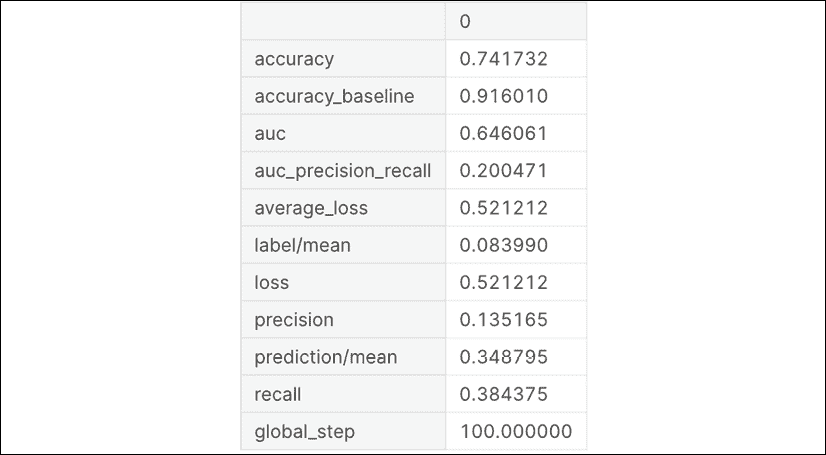
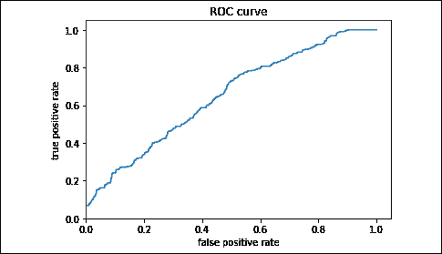
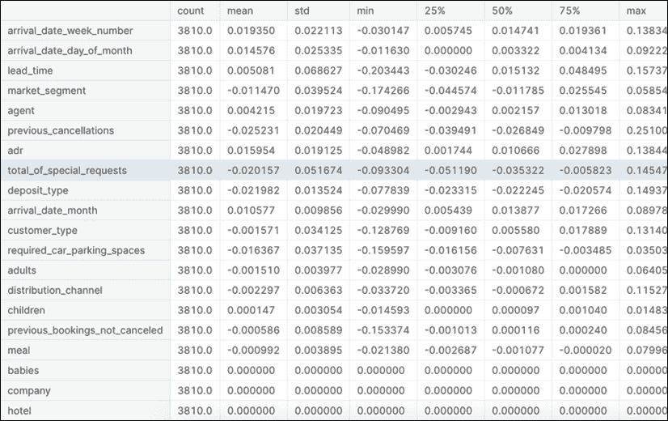
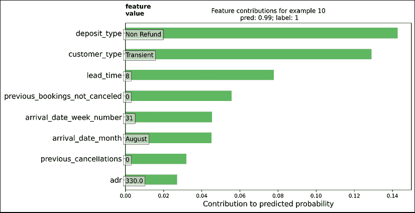
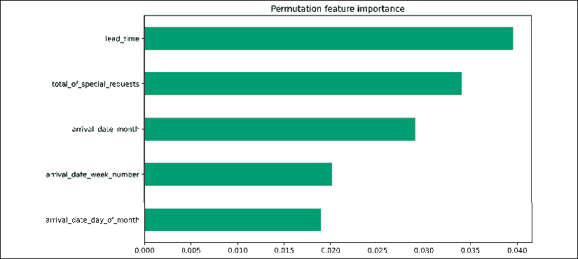
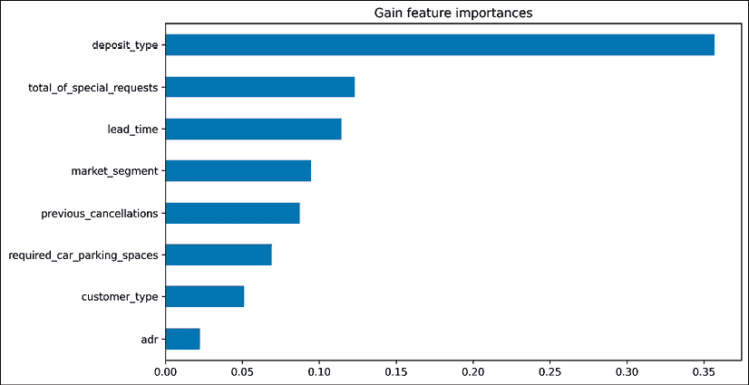
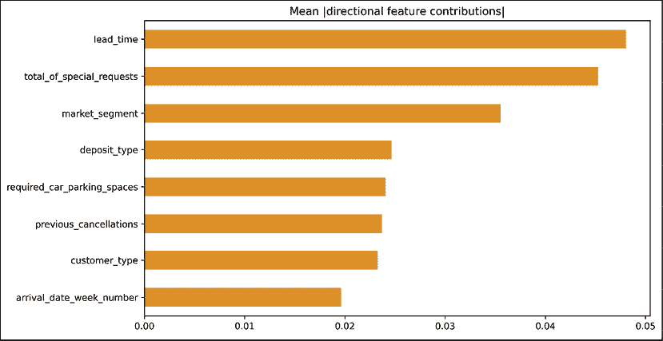

# 第五章：梯度提升树

本章介绍了梯度提升树：**TensorFlow**（**TF**）的方法。它是一类机器学习算法，通过一组弱预测模型（通常是决策树）生成预测模型。该模型以阶段性方式构建，并通过使用任意（可微）损失函数来进行泛化。梯度提升树是一类非常流行的算法，因为它们可以并行化（在树构建阶段），本地处理缺失值和异常值，并且需要最少的数据预处理。

# 引言

在本章中，我们简要展示了如何使用`BoostedTreesClassifier`处理二分类问题。我们将应用这种技术解决一个实际的商业问题，使用一个流行的教育数据集：预测哪些顾客可能会取消他们的预订。这个问题的数据——以及其他几个商业问题——以表格格式存在，通常包含多种不同的特征类型：数值型、类别型、日期等。在缺乏复杂领域知识的情况下，梯度提升方法是创建一个可解释的、即开即用的解决方案的不错选择。在接下来的部分，将通过代码演示相关的建模步骤：数据准备、结构化为函数、通过`tf.estimator`功能拟合模型，以及结果的解释。

## 如何实现...

我们首先加载必要的包：

```py
import tensorflow as tf
import numpy as np
import pandas as pd
from IPython.display import clear_output
from matplotlib import pyplot as plt
import matplotlib.pyplot as plt
import seaborn as sns
sns_colors = sns.color_palette('colorblind')
from numpy.random import uniform, seed
from scipy.interpolate import griddata
from matplotlib.font_manager import FontProperties
from sklearn.metrics import roc_curve 
```

原则上，类别变量可以简单地重新编码为整数（使用如`LabelEncoder`之类的函数），而梯度提升模型也能很好地工作——数据预处理的这些最小要求是树集成方法流行的原因之一。然而，在本案例中，我们希望集中展示模型的可解释性，因此我们要分析各个指标的值。基于这个原因，我们创建了一个在 TF 友好的格式中执行独热编码的函数：

```py
def one_hot_cat_column(feature_name, vocab):
    return tf.feature_column.indicator_column(
    tf.feature_column.categorical_column_with_vocabulary_list(feature_name,                                                               vocab)) 
```

如引言中所述，在这个案例中，我们将使用以下网址提供的酒店取消数据集：

[`www.sciencedirect.com/science/article/pii/S2352340918315191`](https://www.sciencedirect.com/science/article/pii/S2352340918315191)

我们选择这个数据集是因为它对于读者可能遇到的典型商业预测问题来说相当现实：数据中包含时间维度，并且有数值型和类别型特征。同时，它也相当干净（没有缺失值），这意味着我们可以专注于实际的建模，而不是数据处理：

```py
xtrain = pd.read_csv('../input/hotel-booking-                              demand/hotel_bookings.csv')
xtrain.head(3) 
```

数据集有时间维度，因此可以基于`reservation_status_date`进行自然的训练/验证集划分：

```py
xvalid = xtrain.loc[xtrain['reservation_status_date'] >= '2017-08-01']
xtrain = xtrain.loc[xtrain['reservation_status_date'] < '2017-08-01'] 
```

将特征与目标分开：

```py
ytrain, yvalid = xtrain['is_canceled'], xvalid['is_canceled']
xtrain.drop('is_canceled', axis = 1, inplace = True)
xvalid.drop('is_canceled', axis = 1, inplace = True) 
```

我们将列分为数值型和类别型，并以 TF 期望的格式进行编码。我们跳过一些可能改善模型性能的列，但由于它们的特性，它们引入了泄露的风险：在训练中可能改善模型性能，但在对未见数据进行预测时会失败。在我们的案例中，其中一个变量是 `arrival_date_year`：如果模型过于依赖这个变量，当我们提供一个更远未来的数据集时（该变量的特定值显然会缺失），模型将会失败。

我们从训练数据中去除一些额外的变量——这个步骤可以在建模过程之前基于专家判断进行，或者可以通过自动化方法进行。后一种方法将包括运行一个小型模型并检查全局特征的重要性：如果结果显示某一个非常重要的特征主导了其他特征，它可能是信息泄露的潜在来源：

```py
xtrain.drop(['arrival_date_year','assigned_room_type', 'booking_changes', 'reservation_status', 'country', 'days_in_waiting_list'], axis =1, inplace = True)
num_features = ["lead_time","arrival_date_week_number",               
                "arrival_date_day_of_month",
                "stays_in_weekend_nights",                   
                "stays_in_week_nights","adults","children",
                "babies","is_repeated_guest", "previous_cancellations",
                "previous_bookings_not_canceled","agent","company",
                "required_car_parking_spaces",                 
                "total_of_special_requests", "adr"]
cat_features = ["hotel","arrival_date_month","meal","market_segment",
                "distribution_channel","reserved_room_type",                  
                "deposit_type","customer_type"]
def one_hot_cat_column(feature_name, vocab):
    return tf.feature_column.indicator_column(
      tf.feature_column.categorical_column_with_vocabulary_list(                                                feature_name,
                                                vocab))
feature_columns = []
for feature_name in cat_features:
    # Need to one-hot encode categorical features.
    vocabulary = xtrain[feature_name].unique()
    feature_columns.append(one_hot_cat_column(feature_name, vocabulary))
for feature_name in num_features:
    feature_columns.append(tf.feature_column.numeric_column(feature_name,
                                           dtype=tf.float32)) 
```

下一步是为提升树算法创建输入函数：我们指定如何将数据读入模型，用于训练和推理。我们使用 `tf.data` API 中的 `from_tensor_slices` 方法直接从 pandas 读取数据：

```py
NUM_EXAMPLES = len(ytrain)
def make_input_fn(X, y, n_epochs=None, shuffle=True):

    def input_fn():

        dataset = tf.data.Dataset.from_tensor_slices((dict(X), y))
        if shuffle:

            dataset = dataset.shuffle(NUM_EXAMPLES)
        # For training, cycle thru dataset as many times as need (n_epochs=None).
        dataset = dataset.repeat(n_epochs)
        # In memory training doesn't use batching.
        dataset = dataset.batch(NUM_EXAMPLES)
        return dataset
    return input_fn
# Training and evaluation input functions.
train_input_fn = make_input_fn(xtrain, ytrain)
eval_input_fn = make_input_fn(xvalid, yvalid, shuffle=False,                                                 n_epochs=1) 
```

现在我们可以构建实际的 BoostedTrees 模型。我们设置了一个最小的参数列表（`max_depth` 是其中一个最重要的参数）——在定义中没有指定的参数将保持默认值，这些可以通过文档中的帮助函数查找。

```py
params = {
  'n_trees': 125,
  'max_depth': 5,
  'n_batches_per_layer': 1,
  'center_bias': True
}
est = tf.estimator.BoostedTreesClassifier(feature_columns, **params)
# Train model.
est.train(train_input_fn, max_steps=100) 
```

一旦我们训练好一个模型，就可以根据不同的评估指标来评估其性能。`BoostedTreesClassifier` 包含一个 `evaluate` 方法，输出涵盖了广泛的可能指标；使用哪些指标进行指导取决于具体应用，但默认输出的指标已经能让我们从多个角度评估模型（例如，如果我们处理的是一个高度不平衡的数据集，`auc` 可能会有些误导，此时我们应该同时评估损失值）。更详细的说明，请参考文档：[`www.tensorflow.org/api_docs/python/tf/estimator/BoostedTreesClassifier`](https://www.tensorflow.org/api_docs/python/tf/estimator/BoostedTreesClassifier)：

```py
# Evaluation
results = est.evaluate(eval_input_fn)
pd.Series(results).to_frame() 
```

你看到的结果应该是这样的：



```py
pred_dicts = list(est.predict(eval_input_fn))
probs = pd.Series([pred['probabilities'][1] for pred in pred_dicts]) 
```

我们可以在不同的泛化层次上评估结果——以下给出全球性和局部性差异的具体说明。我们从**接收者操作特征**（**ROC**）曲线开始：这是一种图形，显示了分类模型在所有可能分类阈值下的性能。我们绘制假阳性率与真正阳性率的关系：一个随机分类器会表现为从 (0,0) 到 (1,1) 的对角线，越远离这种情况，朝左上角移动，我们的分类器就越好：

```py
fpr, tpr, _ = roc_curve(yvalid, probs)
plt.plot(fpr, tpr)
plt.title('ROC curve')
plt.xlabel('false positive rate')
plt.ylabel('true positive rate')
plt.xlim(0,); plt.ylim(0,); plt.show() 
```



图 5.1：训练分类器的 ROC 曲线

局部可解释性指的是对模型在单个示例层面的预测的理解：我们将创建并可视化每个实例的贡献。这对于需要向具有技术认知多样性的观众解释模型预测时尤其有用。我们将这些值称为**方向性特征贡献**（**DFC**）：

```py
pred_dicts = list(est.experimental_predict_with_explanations(eval_input_fn))
# Create DFC Pandas dataframe.
labels = yvalid.values
probs = pd.Series([pred['probabilities'][1] for pred in pred_dicts])
df_dfc = pd.DataFrame([pred['dfc'] for pred in pred_dicts])
df_dfc.describe().T 
```



完整的 DFC 数据框的总结初看起来可能有些让人不知所措，实际上，通常我们会关注某些列的子集。每一行展示的是特征（第一行的`arrival_date_week_number`，第二行的`arrival_date_day_of_month`，依此类推）在验证集中的所有观测值的方向性贡献的汇总统计（如`mean`、`std`等）。

## 它是如何工作的……

以下代码块演示了提取某个记录的预测特征贡献所需的步骤。为了方便和可重用，我们首先定义了一个绘制选定记录的函数（为了更容易解释，我们希望使用不同的颜色绘制特征重要性，具体取决于它们的贡献是正向还是负向）：

```py
def _get_color(value):
    """To make positive DFCs plot green, negative DFCs plot red."""
    green, red = sns.color_palette()[2:4]
    if value >= 0: return green
    return red
def _add_feature_values(feature_values, ax):
    """Display feature's values on left of plot."""
    x_coord = ax.get_xlim()[0]
    OFFSET = 0.15
    for y_coord, (feat_name, feat_val) in enumerate(feature_values.                                                    items()):
        t = plt.text(x_coord, y_coord - OFFSET, '{}'.format(feat_val),                                                     size=12)
        t.set_bbox(dict(facecolor='white', alpha=0.5))
    from matplotlib.font_manager import FontProperties
    font = FontProperties()
    font.set_weight('bold')
    t = plt.text(x_coord, y_coord + 1 - OFFSET, 'feature\nvalue',
    fontproperties=font, size=12)
def plot_example(example):
  TOP_N = 8 # View top 8 features.
  sorted_ix = example.abs().sort_values()[-TOP_N:].index  # Sort by magnitude.
  example = example[sorted_ix]
  colors = example.map(_get_color).tolist()
  ax = example.to_frame().plot(kind='barh',
                          color=[colors],
                          legend=None,
                          alpha=0.75,
                          figsize=(10,6))
  ax.grid(False, axis='y')
  ax.set_yticklabels(ax.get_yticklabels(), size=14)
  # Add feature values.
  _add_feature_values(xvalid.iloc[ID][sorted_ix], ax)
  return ax 
```

定义好样板代码后，我们可以以一种直接的方式绘制特定记录的详细图表：

```py
ID = 10
example = df_dfc.iloc[ID]  # Choose ith example from evaluation set.
TOP_N = 8  # View top 8 features.
sorted_ix = example.abs().sort_values()[-TOP_N:].index
ax = plot_example(example)
ax.set_title('Feature contributions for example {}\n pred: {:1.2f}; label: {}'.format(ID, probs[ID], labels[ID]))
ax.set_xlabel('Contribution to predicted probability', size=14)
plt.show() 
```

输出如下：



图 5.2：不同特征对预测概率的贡献

除了分析单个观测值的特征相关性外，我们还可以从全局（聚合）角度进行分析。全局可解释性指的是对模型整体的理解：我们将提取并可视化基于增益的特征重要性和置换特征重要性，同时也会展示聚合的 DFC。

基于增益的特征重要性衡量在对特定特征进行切分时损失变化，而置换特征重要性是通过评估模型在评估集上的表现来计算的，方法是将每个特征依次打乱，并将模型表现的变化归因于被打乱的特征。

通常，置换特征重要性比基于增益的特征重要性更为优选，尽管在潜在预测变量的度量尺度或类别数量不同，以及特征之间存在相关性时，二者的方法都可能不可靠。

计算置换特征重要性的函数如下：

```py
def permutation_importances(est, X_eval, y_eval, metric, features):
    """Column by column, shuffle values and observe effect on eval set.
    source: http://explained.ai/rf-importance/index.html
    A similar approach can be done during training. See "Drop-column importance"
    in the above article."""
    baseline = metric(est, X_eval, y_eval)
    imp = []
    for col in features:
        save = X_eval[col].copy()
        X_eval[col] = np.random.permutation(X_eval[col])
        m = metric(est, X_eval, y_eval)
        X_eval[col] = save
        imp.append(baseline - m)
    return np.array(imp)
def accuracy_metric(est, X, y):
    """TensorFlow estimator accuracy."""
    eval_input_fn = make_input_fn(X,
                                  y=y,
                                  shuffle=False,
                                  n_epochs=1)
    return est.evaluate(input_fn=eval_input_fn)['accuracy'] 
```

我们使用以下函数来显示最相关的列：

```py
features = CATEGORICAL_COLUMNS + NUMERIC_COLUMNS
importances = permutation_importances(est, dfeval, y_eval, accuracy_metric,
                                      features)
df_imp = pd.Series(importances, index=features)
sorted_ix = df_imp.abs().sort_values().index
ax = df_imp[sorted_ix][-5:].plot(kind='barh', color=sns_colors[2], figsize=(10, 6))
ax.grid(False, axis='y')
ax.set_title('Permutation feature importance')
plt.show() 
```

这将为你输出如下结果：



图 5.3：不同特征的置换特征重要性

我们使用以下函数以相同的方式显示增益特征重要性列：

```py
importances = est.experimental_feature_importances(normalize=True)
df_imp = pd.Series(importances)
# Visualize importances.
N = 8
ax = (df_imp.iloc[0:N][::-1]
    .plot(kind='barh',
          color=sns_colors[0],
          title='Gain feature importances',
          figsize=(10, 6)))
ax.grid(False, axis='y') 
```

这将为你输出如下结果：



图 5.4：不同特征的增益特征重要性

DFCs 的绝对值可以被平均，以理解全局层面的影响：

```py
dfc_mean = df_dfc.abs().mean()
N = 8
sorted_ix = dfc_mean.abs().sort_values()[-N:].index  # Average and sort by absolute.
ax = dfc_mean[sorted_ix].plot(kind='barh',
                       color=sns_colors[1],
                       title='Mean |directional feature contributions|',
                       figsize=(10, 6))
ax.grid(False, axis='y') 
```

这将输出以下结果：



图 5.5: 不同特征的平均方向性特征贡献

在这个教程中，我们介绍了 `GradientBoostingClassifier` 的 TensorFlow 实现：一种灵活的模型架构，适用于广泛的表格数据问题。我们构建了一个模型来解决一个实际的业务问题：预测客户可能会取消酒店预订的概率，在这个过程中，我们介绍了 TF Boosted Trees 管道的所有相关组件：

+   为模型准备数据

+   使用 `tf.estimator` 配置 `GradientBoostingClassifier`

+   评估特征重要性和模型可解释性，既要从全局层面，也要从局部层面

## 另见

有大量文章介绍梯度提升算法家族：

+   一篇精彩的 Medium 博文：[`medium.com/analytics-vidhya/introduction-to-the-gradient-boosting-algorithm-c25c653f826b`](https://medium.com/analytics-vidhya/introduction-to-the-gradient-boosting-algorithm-c25c653f826b)

+   官方 XGBoost 文档: [`xgboost.readthedocs.io/en/latest/tutorials/model.html`](https://xgboost.readthedocs.io/en/latest/tutorials/model.html)

+   LightGBM 文档: [`papers.nips.cc/paper/6907-lightgbm-a-highly-efficient-gradient-boosting-decision-tree.pdf`](https://papers.nips.cc/paper/6907-lightgbm-a-highly-efficient-gradient-boosting-decision-tree.pdf)
