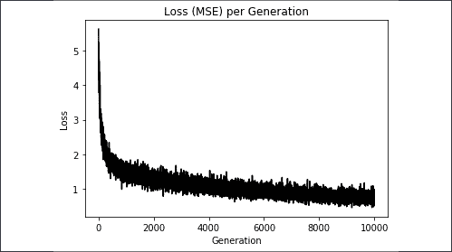

# 第六章：神经网络

在本章中，我们将介绍神经网络以及如何在 TensorFlow 中实现它们。后续大部分章节将基于神经网络，因此学习如何在 TensorFlow 中使用它们是非常重要的。

神经网络目前在图像和语音识别、阅读手写字、理解文本、图像分割、对话系统、自动驾驶汽车等任务中创下了纪录。虽然这些任务将在后续章节中涵盖，但介绍神经网络作为一种通用、易于实现的机器学习算法是很重要的，这样我们后面可以进一步展开。

神经网络的概念已经存在了几十年。然而，直到最近，由于处理能力、算法效率和数据规模的进步，我们才有足够的计算能力来训练大型网络，因此神经网络才开始获得广泛关注。

神经网络本质上是一系列操作应用于输入数据矩阵的过程。这些操作通常是加法和乘法的组合，之后应用非线性函数。我们已经见过的一个例子是逻辑回归，这在*第四章*、*线性回归*中有所讨论。逻辑回归是各个偏斜特征乘积的和，之后应用非线性的 sigmoid 函数。神经网络通过允许任意组合的操作和非线性函数进行更广泛的泛化，这包括应用绝对值、最大值、最小值等。

神经网络中最重要的技巧叫做**反向传播**。反向传播是一种允许我们根据学习率和损失函数输出更新模型变量的过程。我们在*第三章*、*Keras*和*第四章*、*线性回归*中都使用了反向传播来更新模型变量。

关于神经网络，另一个需要注意的重要特性是非线性激活函数。由于大多数神经网络只是加法和乘法操作的组合，它们无法对非线性数据集进行建模。为了解决这个问题，我们将在神经网络中使用非线性激活函数。这将使神经网络能够适应大多数非线性情况。

需要记住的是，正如我们在许多已介绍的算法中看到的，神经网络对我们选择的超参数非常敏感。在本章中，我们将探讨不同学习率、损失函数和优化过程的影响。

还有一些我推荐的学习神经网络的资源，它们会更深入、更详细地讲解这个话题：

+   描述反向传播的开创性论文是 Yann LeCun 等人所写的*Efficient Back Prop*。PDF 文件位于这里：[`yann.lecun.com/exdb/publis/pdf/lecun-98b.pdf`](http://yann.lecun.com/exdb/publis/pdf/lecun-98b.pdf)。

+   CS231，*卷积神经网络与视觉识别*，由斯坦福大学提供。课程资源可以在这里找到：[`cs231n.stanford.edu/`](http://cs231n.stanford.edu/)。

+   CS224d，*自然语言处理的深度学习*，由斯坦福大学提供。课程资源可以在这里找到：[`cs224d.stanford.edu/`](http://cs224d.stanford.edu/)。

+   *深度学习*，由 MIT 出版社出版的书籍。Goodfellow 等，2016 年。本书可以在这里找到：[`www.deeplearningbook.org`](http://www.deeplearningbook.org)。

+   在线书籍 *神经网络与深度学习* 由 Michael Nielsen 编写，可以在这里找到：[`neuralnetworksanddeeplearning.com/`](http://neuralnetworksanddeeplearning.com/)。

+   对于更务实的方法和神经网络的介绍，Andrej Karpathy 写了一个很棒的总结，里面有 JavaScript 示例，叫做 *黑客的神经网络指南*。该文可以在这里找到：[`karpathy.github.io/neuralnets/`](http://karpathy.github.io/neuralnets/)。

+   另一个很好的总结深度学习的网站是 *深度学习入门*，由 Ian Goodfellow、Yoshua Bengio 和 Aaron Courville 编写。该网页可以在这里找到：[`randomekek.github.io/deep/deeplearning.html`](http://randomekek.github.io/deep/deeplearning.html)。

我们将从介绍神经网络的基本概念开始，然后逐步深入到多层网络。在最后一节，我们将创建一个神经网络，学习如何玩井字游戏。

在本章中，我们将覆盖以下内容：

+   实现操作门

+   与门和激活函数的工作

+   实现单层神经网络

+   实现不同的层

+   使用多层神经网络

+   改善线性模型的预测

+   学习玩井字游戏

读者可以在 [`github.com/PacktPublishing/Machine-Learning-Using-TensorFlow-Cookbook`](https://github.com/PacktPublishing/Machine-Learning-Using-TensorFlow-Cookbook) 上找到本章的所有代码，并在 Packt 的代码库中找到：[`github.com/PacktPublishing/Machine-Learning-Using-TensorFlow-Cookbook`](https://github.com/PacktPublishing/Machine-Learning-Using-TensorFlow-Cookbook)。

# 实现操作门

神经网络最基本的概念之一是它作为操作门的功能。在本节中，我们将从乘法运算作为门开始，然后再考虑嵌套的门操作。

## 准备工作

我们将实现的第一个操作门是 `f`(`x`) = `a` · `x`：


为了优化这个门，我们将 `a` 输入声明为变量，并将`x`作为我们模型的输入张量。这意味着 TensorFlow 会尝试改变 `a` 的值，而不是 `x` 的值。我们将创建损失函数，它是输出值和目标值之间的差异，目标值为 50。

第二个嵌套的操作门将是 `f`(`x`) = `a` · `x` + `b`：


再次，我们将声明 `a` 和 `b` 为变量，`x` 为我们模型的输入张量。我们再次优化输出，使其趋向目标值 50。需要注意的有趣之处在于，第二个示例的解并不是唯一的。有许多不同的模型变量组合都能使输出为 50。对于神经网络，我们并不太在意中间模型变量的值，而更关注最终的输出值。

## 如何操作...

为了在 TensorFlow 中实现第一个运算门 `f`(`x`) = `a` · `x`，并将输出训练到值 50，请按照以下步骤操作：

1.  首先，通过以下方式加载 TensorFlow：

    ```py
    import tensorflow as tf 
    ```

1.  现在我们需要声明我们的模型变量和输入数据。我们将输入数据设为 5，这样乘数因子将是 10（即 5*10=50），具体如下：

    ```py
    a = tf.Variable(4.)
    x_data = tf.keras.Input(shape=(1,))
    x_val = 5. 
    ```

1.  接下来，我们创建一个 Lambda 层来计算操作，并创建一个具有以下输入的功能性 Keras 模型：

    ```py
    multiply_layer = tf.keras.layers.Lambda(lambda x:tf.multiply(a, x))
    outputs = multiply_layer(x_data)
    model = tf.keras.Model(inputs=x_data, outputs=outputs, name="gate_1") 
    ```

1.  现在，我们将声明我们的优化算法为随机梯度下降，具体如下：

    ```py
    optimizer=tf.keras.optimizers.SGD(0.01) 
    ```

1.  现在，我们可以优化我们的模型输出，使其趋向目标值 50。我们将使用损失函数作为输出与目标值 50 之间的 L2 距离。我们通过不断输入值 5 并反向传播损失来更新模型变量，使其趋向 10，具体如下所示：

    ```py
    print('Optimizing a Multiplication Gate Output to 50.')
    for i in range(10):

        # Open a GradientTape.
        with tf.GradientTape() as tape:

            # Forward pass.
            mult_output = model(x_val)

            # Loss value as the difference between
            # the output and a target value, 50.
            loss_value = tf.square(tf.subtract(mult_output, 50.))

        # Get gradients of loss with reference to the variable "a" to adjust.
        gradients = tape.gradient(loss_value, a)

        # Update the variable "a" of the model.
        optimizer.apply_gradients(zip([gradients], [a]))

        print("{} * {} = {}".format(a.numpy(), x_val, a.numpy() * x_val)) 
    ```

1.  前面的步骤应该会得到以下输出：

    ```py
    Optimizing a Multiplication Gate Output to 50\. 
    7.0 * 5.0 = 35.0 
    8.5 * 5.0 = 42.5 
    9.25 * 5.0 = 46.25 
    9.625 * 5.0 = 48.125 
    9.8125 * 5.0 = 49.0625 
    9.90625 * 5.0 = 49.5312 
    9.95312 * 5.0 = 49.7656 
    9.97656 * 5.0 = 49.8828 
    9.98828 * 5.0 = 49.9414 
    9.99414 * 5.0 = 49.9707 
    ```

    接下来，我们将对嵌套的两个运算门 `f`(`x`) = `a` · `x` + `b` 进行相同的操作。

1.  我们将以与前一个示例完全相同的方式开始，但会初始化两个模型变量，`a` 和 `b`，具体如下：

    ```py
    import tensorflow as tf
    # Initialize variables and input data
    x_data = tf.keras.Input(dtype=tf.float32, shape=(1,))
    x_val = 5.
    a = tf.Variable(1., dtype=tf.float32)
    b = tf.Variable(1., dtype=tf.float32)
    # Add a layer which computes f(x) = a * x
    multiply_layer = tf.keras.layers.Lambda(lambda x:tf.multiply(a, x))
    # Add a layer which computes f(x) = b + x
    add_layer = tf.keras.layers.Lambda(lambda x:tf.add(b, x))
    res = multiply_layer(x_data)
    outputs = add_layer(res)
    # Build the model
    model = tf.keras.Model(inputs=x_data, outputs=outputs, name="gate_2")
    # Optimizer
    optimizer=tf.keras.optimizers.SGD(0.01) 
    ```

1.  我们现在优化模型变量，将输出训练到目标值 50，具体如下所示：

    ```py
    print('Optimizing two Gate Output to 50.')
    for i in range(10):

        # Open a GradientTape.
        with tf.GradientTape(persistent=True) as tape:

            # Forward pass.
            two_gate_output = model(x_val)

            # Loss value as the difference between
            # the output and a target value, 50.
            loss_value = tf.square(tf.subtract(two_gate_output, 50.))

        # Get gradients of loss with reference to 
        # the variables "a" and "b" to adjust.
        gradients_a = tape.gradient(loss_value, a)
        gradients_b = tape.gradient(loss_value , b)

        # Update the variables "a" and "b" of the model.
        optimizer.apply_gradients(zip([gradients_a, gradients_b], [a, b]))

        print("Step: {} ==> {} * {} + {}= {}".format(i, a.numpy(),
                                                     x_val, b.numpy(),
                                                     a.numpy()*x_val+b.numpy())) 
    ```

1.  前面的步骤应该会得到以下输出：

    ```py
    Optimizing Two Gate Output to 50\. 
    5.4 * 5.0 + 1.88 = 28.88 
    7.512 * 5.0 + 2.3024 = 39.8624 
    8.52576 * 5.0 + 2.50515 = 45.134 
    9.01236 * 5.0 + 2.60247 = 47.6643 
    9.24593 * 5.0 + 2.64919 = 48.8789 
    9.35805 * 5.0 + 2.67161 = 49.4619 
    9.41186 * 5.0 + 2.68237 = 49.7417 
    9.43769 * 5.0 + 2.68754 = 49.876 
    9.45009 * 5.0 + 2.69002 = 49.9405 
    9.45605 * 5.0 + 2.69121 = 49.9714 
    ```

需要注意的是，第二个示例的解并不是唯一的。这在神经网络中并不那么重要，因为所有参数都被调整以减少损失。这里的最终解将取决于 `a` 和 `b` 的初始值。如果这些值是随机初始化的，而不是设为 1，我们会看到每次迭代后模型变量的最终值不同。

## 它是如何工作的...

我们通过 TensorFlow 的隐式反向传播实现了计算门的优化。TensorFlow 跟踪我们模型的操作和变量值，并根据我们的优化算法规范和损失函数的输出进行调整。

我们可以继续扩展运算门，同时跟踪哪些输入是变量，哪些输入是数据。这一点非常重要，因为 TensorFlow 会调整所有变量以最小化损失，但不会更改数据。

能够隐式跟踪计算图并在每次训练步骤中自动更新模型变量，是 TensorFlow 的一个重要特点，这也使得它非常强大。

# 与门和激活函数的工作

现在，我们可以将操作门连接在一起，我们希望通过激活函数运行计算图输出。在本节中，我们将介绍常见的激活函数。

## 准备工作

在本节中，我们将比较并对比两种不同的激活函数：**sigmoid**和**rectified linear unit**（**ReLU**）。回顾一下，这两个函数由以下方程给出：


在这个例子中，我们将创建两个单层神经网络，它们具有相同的结构，唯一不同的是一个使用 sigmoid 激活函数，另一个使用 ReLU 激活函数。损失函数将由与 0.75 的 L2 距离决定。我们将随机提取批处理数据，然后优化输出使其趋向 0.75。

## 如何操作...

我们按以下步骤进行操作：

1.  我们将从加载必要的库开始。这也是我们可以提到如何在 TensorFlow 中设置随机种子的好时机。由于我们将使用 NumPy 和 TensorFlow 的随机数生成器，因此我们需要为两者设置随机种子。设置相同的随机种子后，我们应该能够复制结果。我们通过以下输入来实现：

    ```py
    import tensorflow as tf 
    import numpy as np 
    import matplotlib.pyplot as plt 
    tf.random.set_seed(5)
    np.random.seed(42) 
    ```

1.  现在，我们需要声明我们的批处理大小、模型变量和数据模型输入。我们的计算图将包括将正态分布数据输入到两个相似的神经网络中，这两个网络仅在末端的激活函数上有所不同，如下所示：

    ```py
    batch_size = 50 
    x_data = tf.keras.Input(shape=(1,))
    x_data = tf.keras.Input(shape=(1,))
    a1 = tf.Variable(tf.random.normal(shape=[1,1], seed=5))
    b1 = tf.Variable(tf.random.uniform(shape=[1,1], seed=5))
    a2 = tf.Variable(tf.random.normal(shape=[1,1], seed=5))
    b2 = tf.Variable(tf.random.uniform(shape=[1,1], seed=5)) 
    ```

1.  接下来，我们将声明我们的两个模型，sigmoid 激活模型和 ReLU 激活模型，如下所示：

    ```py
    class MyCustomGateSigmoid(tf.keras.layers.Layer):

     def __init__(self, units, a1, b1):
       super(MyCustomGateSigmoid, self).__init__()
       self.units = units
       self.a1 = a1
       self.b1 = b1
     # Compute f(x) = sigmoid(a1 * x + b1)
     def call(self, inputs):
       return tf.math.sigmoid(inputs * self.a1 + self.b1)
    # Add a layer which computes f(x) = sigmoid(a1 * x + b1)
    my_custom_gate_sigmoid = MyCustomGateSigmoid(units=1, a1=a1, b1=b1)
    output_sigmoid = my_custom_gate_sigmoid(x_data)
    # Build the model
    model_sigmoid = tf.keras.Model(inputs=x_data, outputs=output_sigmoid, name="gate_sigmoid")
    class MyCustomGateRelu(tf.keras.layers.Layer):

     def __init__(self, units, a2, b2):
       super(MyCustomGateRelu, self).__init__()
       self.units = units
       self.a2 = a2
       self.b2 = b2
     # Compute f(x) = relu(a2 * x + b2)
     def call(self, inputs):
       return tf.nn.relu(inputs * self.a2 + self.b2)
    # Add a layer which computes f(x) = relu(a2 * x + b2)
    my_custom_gate_relu = MyCustomGateRelu(units=1, a2=a2, b2=b2)
    outputs_relu = my_custom_gate_relu(x_data)
    # Build the model
    model_relu = tf.keras.Model(inputs=x_data, outputs=outputs_relu, name="gate_relu") 
    ```

1.  现在我们需要声明我们的优化算法并初始化变量，如下所示：

    ```py
    optimizer=tf.keras.optimizers.SGD(0.01) 
    ```

1.  现在，我们将对两个模型进行 750 次迭代训练，如下所示的代码块所示。损失函数将是模型输出与 0.75 的 L2 范数平均值。我们还将保存损失输出和激活输出值，稍后用于绘图：

    ```py
    # Run loop across gate
    print('\n Optimizing Sigmoid AND Relu Output to 0.75')
    loss_vec_sigmoid = []
    loss_vec_relu = []
    activation_sigmoid = []
    activation_relu = []
    for i in range(500):

        rand_indices = np.random.choice(len(x), size=batch_size)
        x_vals = np.transpose([x[rand_indices]])
        # Open a GradientTape.
        with tf.GradientTape(persistent=True) as tape:

            # Forward pass.
            output_sigmoid = model_sigmoid(x_vals)
            output_relu = model_relu(x_vals)

            # Loss value as the difference as the difference between
            # the output and a target value, 0.75.
            loss_sigmoid = tf.reduce_mean(tf.square(tf.subtract(output_sigmoid, 0.75)))
            loss_vec_sigmoid.append(loss_sigmoid)
            loss_relu = tf.reduce_mean(tf.square(tf.subtract(output_relu, 0.75)))
            loss_vec_relu.append(loss_relu)

        # Get gradients of loss_sigmoid with reference to the variable "a1" and "b1" to adjust.
        gradients_a1 = tape.gradient(loss_sigmoid, my_custom_gate_sigmoid.a1)
        gradients_b1 = tape.gradient(loss_sigmoid , my_custom_gate_sigmoid.b1)

        # Get gradients of loss_relu with reference to the variable "a2" and "b2" to adjust.
        gradients_a2 = tape.gradient(loss_relu, my_custom_gate_relu.a2)
        gradients_b2 = tape.gradient(loss_relu , my_custom_gate_relu.b2)

        # Update the variable "a1" and "b1" of the model.
        optimizer.apply_gradients(zip([gradients_a1, gradients_b1], [my_custom_gate_sigmoid.a1, my_custom_gate_sigmoid.b1]))

        # Update the variable "a2" and "b2" of the model.
        optimizer.apply_gradients(zip([gradients_a2, gradients_b2], [my_custom_gate_relu.a2, my_custom_gate_relu.b2]))

        output_sigmoid = model_sigmoid(x_vals)
        output_relu = model_relu(x_vals)

        activation_sigmoid.append(np.mean(output_sigmoid))
        activation_relu.append(np.mean(output_relu))

        if i%50==0:
            print('sigmoid = ' + str(np.mean(output_sigmoid)) + ' relu = ' + str(np.mean(output_relu))) 
    ```

1.  要绘制损失和激活输出，我们需要输入以下代码：

    ```py
    plt.plot(activation_sigmoid, 'k-', label='Sigmoid Activation') 
    plt.plot(activation_relu, 'r--', label='Relu Activation') 
    plt.ylim([0, 1.0]) 
    plt.title('Activation Outputs') 
    plt.xlabel('Generation') 
    plt.ylabel('Outputs') 
    plt.legend(loc='upper right') 
    plt.show() 
    plt.plot(loss_vec_sigmoid, 'k-', label='Sigmoid Loss') 
    plt.plot(loss_vec_relu, 'r--', label='Relu Loss') 
    plt.ylim([0, 1.0]) 
    plt.title('Loss per Generation') 
    plt.xlabel('Generation') 
    plt.ylabel('Loss') 
    plt.legend(loc='upper right') 
    plt.show() 
    ```

激活输出需要如以下图所示进行绘制：


图 6.1：具有 sigmoid 激活函数的网络与具有 ReLU 激活函数的网络的计算图输出

这两个神经网络具有相似的架构和目标（0.75），但使用了两种不同的激活函数：sigmoid 和 ReLU。需要注意的是，ReLU 激活网络比 sigmoid 激活网络更快速地收敛到 0.75 这一目标，如下图所示：


图 6.2：该图展示了 sigmoid 和 ReLU 激活网络的损失值。注意 ReLU 损失在迭代初期的极端情况

## 它是如何工作的...

由于 ReLU 激活函数的形式，它比 sigmoid 函数更频繁地返回零值。我们将这种行为视为一种稀疏性。这种稀疏性加速了收敛速度，但却失去了对梯度的控制。另一方面，sigmoid 函数具有非常好的梯度控制，且不像 ReLU 激活函数那样会产生极端值，以下表格进行了说明：

| 激活函数 | 优势 | 劣势 |
| --- | --- | --- |
| Sigmoid | 输出较少极端 | 收敛较慢 |
| ReLU | 快速收敛 | 可能产生极端输出值 |

## 还有更多内容...

在本节中，我们比较了 ReLU 激活函数和 sigmoid 激活函数在神经网络中的表现。虽然有许多其他激活函数常用于神经网络，但大多数都属于以下两类：第一类包含类似 sigmoid 函数形状的函数，如 arctan、hypertangent、Heaviside 阶跃函数等；第二类包含类似 ReLU 函数形状的函数，如 softplus、leaky ReLU 等。我们在本节中讨论的关于比较这两种函数的大部分内容，适用于这两类激活函数。然而，值得注意的是，激活函数的选择对神经网络的收敛性和输出有很大影响。

# 实现一个单层神经网络

我们已经具备了实施神经网络所需的所有工具，因此在本节中，我们将创建一个在`Iris`数据集上运行的单层神经网络。

## 准备工作

在本节中，我们将实现一个具有一个隐藏层的神经网络。理解全连接神经网络大多数基于矩阵乘法是非常重要的。因此，确保数据和矩阵的维度正确对齐也很重要。

由于这是一个回归问题，我们将使用**均方误差**（**MSE**）作为损失函数。

## 如何操作...

我们按如下步骤继续操作：

1.  为了创建计算图，我们将从加载以下必要的库开始：

    ```py
    import matplotlib.pyplot as plt
    import numpy as np
    import tensorflow as tf
    from sklearn import datasets 
    ```

1.  现在，我们将加载`Iris`数据集，并通过以下代码将长度存储为目标值：

    ```py
    iris = datasets.load_iris() 
    x_vals = np.array([x[0:3] for x in iris.data]) 
    y_vals = np.array([x[3] for x in iris.data]) 
    ```

1.  由于数据集较小，我们希望设置一个种子，使得结果可复现，具体如下：

    ```py
    seed = 3 
    tf.set_random_seed(seed) 
    np.random.seed(seed) 
    ```

1.  为了准备数据，我们将创建一个 80-20 的训练集和测试集拆分，并通过 min-max 缩放将`x`特征规范化到`0`和`1`之间，具体如下所示：

    ```py
    train_indices = np.random.choice(len(x_vals), round(len(x_vals)*0.8), replace=False) 
    test_indices = np.array(list(set(range(len(x_vals))) - set(train_indices))) 
    x_vals_train = x_vals[train_indices] 
    x_vals_test = x_vals[test_indices] 
    y_vals_train = y_vals[train_indices] 
    y_vals_test = y_vals[test_indices]
    def normalize_cols(m): 
        col_max = m.max(axis=0) 
        col_min = m.min(axis=0) 
        return (m-col_min) / (col_max - col_min) 
    x_vals_train = np.nan_to_num(normalize_cols(x_vals_train)) 
    x_vals_test = np.nan_to_num(normalize_cols(x_vals_test)) 
    ```

1.  现在，我们将声明批次大小和数据模型输入，具体代码如下：

    ```py
    batch_size = 50 
    x_data = tf.keras.Input(dtype=tf.float32, shape=(3,)) 
    ```

1.  关键部分是用适当的形状声明我们的模型变量。我们可以声明我们隐藏层的大小为任意大小；在下面的代码块中，我们设置它为五个隐藏节点：

    ```py
    hidden_layer_nodes = 5
    a1 = tf.Variable(tf.random.normal(shape=[3,hidden_layer_nodes], seed=seed)) 
    b1 = tf.Variable(tf.random.normal(shape=[hidden_layer_nodes], seed=seed))   
    a2 = tf.Variable(tf.random.normal(shape=[hidden_layer_nodes,1], seed=seed)) 
    b2 = tf.Variable(tf.random.normal(shape=[1], seed=seed)) 
    ```

1.  现在我们将分两步声明我们的模型。第一步将创建隐藏层的输出，第二步将创建模型的`final_output`，如下所示：

    请注意，我们的模型从三个输入特征到五个隐藏节点，最后到一个输出值。

    ```py
    hidden_output = tf.keras.layers.Lambda(lambda x: tf.nn.relu(tf.add(tf.matmul(x, a1), b1)))
    final_output = tf.keras.layers.Lambda(lambda x: tf.nn.relu(tf.add(tf.matmul(x, a2), b2)))
    model = tf.keras.Model(inputs=x_data, outputs=output, name="1layer_neural_network") 
    ```

1.  现在我们将使用以下代码声明优化算法：

    ```py
    optimizer = tf.keras.optimizers.SGD(0.005) 
    ```

1.  接下来，我们循环执行训练迭代。我们还将初始化两个列表，用于存储我们的`train`和`test_loss`函数。在每个循环中，我们还希望从训练数据中随机选择一个批次，以适应模型，如下所示：

    ```py
    # First we initialize the loss vectors for storage. 
    loss_vec = []
    test_loss = []
    for i in range(500):
        rand_index = np.random.choice(len(x_vals_train), size=batch_size)
        rand_x = x_vals_train[rand_index]
        rand_y = np.transpose([y_vals_train[rand_index]])

        # Open a GradientTape.
        with tf.GradientTape(persistent=True) as tape:

            # Forward pass.
            output = model(rand_x)

            # Apply loss function (MSE)
            loss = tf.reduce_mean(tf.square(rand_y - output))
            loss_vec.append(np.sqrt(loss))       

        # Get gradients of loss with reference to the variables to adjust.
        gradients_a1 = tape.gradient(loss, a1)
        gradients_b1 = tape.gradient(loss, b1)
        gradients_a2 = tape.gradient(loss, a2)
        gradients_b2 = tape.gradient(loss, b2)

        # Update the variables of the model.
        optimizer.apply_gradients(zip([gradients_a1, gradients_b1, gradients_a2, gradients_b2], [a1, b1, a2, b2]))

        # Forward pass.
        output_test = model(x_vals_test)
        # Apply loss function (MSE) on test
        loss_test = tf.reduce_mean(tf.square(np.transpose([y_vals_test]) - output_test))
        test_loss.append(np.sqrt(loss_test))

        if (i+1)%50==0:
            print('Generation: ' + str(i+1) + '. Loss = ' + str(np.mean(loss)))
            print('Generation: ' + str(i+1) + '. Loss = ' + str(temp_loss)) 
    ```

1.  我们可以用`matplotlib`和以下代码绘制损失：

    ```py
    plt.plot(loss_vec, 'k-', label='Train Loss') 
    plt.plot(test_loss, 'r--', label='Test Loss') 
    plt.title('Loss (MSE) per Generation') 
    plt.xlabel('Generation') 
    plt.ylabel('Loss') 
    plt.legend(loc='upper right') 
    plt.show() 
    ```

我们继续通过绘制以下图表来进行本次实验：

（img/B16254_06_07.png）

图 6.3：我们绘制了训练集和测试集的损失（MSE）

注意，我们还可以看到训练集的损失不像测试集那样平滑。这是由于两个原因：首先，我们使用的批量大小比测试集小，尽管差距不大；第二个原因是我们在训练集上训练，而测试集不影响模型的变量。

## 工作原理...

我们的模型现在已经被可视化为神经网络图，如下所示：

（img/B16254_06_08.png）

图 6.4：神经网络图

前面的图是我们的神经网络的可视化，隐藏层有五个节点。我们输入三个值：**sepal length**（**S.L.**）、**sepal width**（**S.W.**）和**petal length**（**P.L.**）。目标将是花瓣宽度。总共，模型中将有 26 个变量。

# 实现不同的层

重要的是要知道如何实现不同的层。在前面的示例中，我们实现了全连接层。在这个示例中，我们将进一步扩展我们对各种层的了解。

## 准备工作

我们已经探讨了如何连接数据输入和完全连接的隐藏层，但是在 TensorFlow 中还有更多类型的内置函数可用作层。最常用的层是卷积层和最大池层。我们将展示如何在一维数据和二维数据上创建和使用这些层。首先，我们将看看如何在一维数据上使用这些层，然后是二维数据。

尽管神经网络可以以任何方式分层，但最常见的设计之一是首先使用卷积层和全连接层创建特征。如果然后有太多的特征，常见的做法是使用最大池层。

在这些层之后，通常会引入非线性层作为激活函数。**卷积神经网络**（**CNNs**），我们将在*第八章*中讨论，通常具有卷积层、最大池化层和激活层。

## 如何操作...

我们将首先查看一维数据。我们需要为这个任务生成一个随机数据数组，操作步骤如下：

1.  我们将首先加载所需的库，如下所示：

    ```py
    import tensorflow as tf 
    import numpy as np 
    ```

1.  现在我们将初始化一些参数，并使用以下代码创建输入数据层：

    ```py
    data_size = 25
    conv_size = 5
    maxpool_size = 5
    stride_size = 1
    num_outputs = 5
    x_input_1d = tf.keras.Input(dtype=tf.float32, shape=(data_size,1), name="input_layer") 
    ```

1.  接下来，我们将定义一个卷积层，如下所示：

    对于我们的示例数据，批处理大小为`1`，宽度为`1`，高度为`25`，通道大小为`1`。还请注意，我们可以通过`output_size=(W-F+2P)/S+1`公式来计算卷积层的输出尺寸，其中`W`是输入尺寸，`F`是滤波器尺寸，`P`是填充尺寸，`S`是步幅尺寸。

    ```py
    my_conv_output = tf.keras.layers.Conv1D(kernel_size=(conv_size),
                                            filters=data_size, 
                                            strides=stride_size, 
                                            padding="VALID",
                                                           name="convolution_layer")(x_input_1d) 
    ```

1.  接下来，我们添加一个 ReLU 激活层，如下所示：

    ```py
    my_activation_output = tf.keras.layers.ReLU(name="activation_layer")(my_conv_output) 
    ```

1.  现在我们将添加一个最大池化层。这个层将在我们的一维向量上创建一个`maxpool`，并在一个移动窗口中应用。对于这个例子，我们将初始化它，使宽度为 5，如下所示：

    TensorFlow 的`maxpool`参数与卷积层的非常相似。虽然`maxpool`参数没有滤波器，但它有大小、步幅和填充选项。由于我们有一个宽度为 5 的窗口，并且使用有效填充（没有零填充），所以我们的输出数组将少 4 个元素。

    ```py
    my_maxpool_output = tf.keras.layers.MaxPool1D(strides=stride_size,
                                                                     pool_size=maxpool_size,
                                                  padding='VALID',
                                                  name="maxpool_layer")(my_activation_output) 
    ```

1.  我们将连接的最后一层是全连接层。在这里，我们将使用一个密集层，如下所示的代码块：

    ```py
    my_full_output = tf.keras.layers.Dense(units=num_outputs,
                                           name="fully_connected_layer")(my_maxpool_output) 
    ```

1.  现在我们将创建模型，并打印每一层的输出，如下所示：

    ```py
    print('>>>> 1D Data <<<<')
    model_1D = tf.keras.Model(inputs=x_input_1d, outputs=my_full_output, name="model_1D")
    model_1D.summary()
    # Input
    print('\n== input_layer ==')
    print('Input = array of length %d' % (x_input_1d.shape.as_list()[1]))
    # Convolution 
    print('\n== convolution_layer ==')
    print('Convolution w/ filter, length = %d, stride size = %d, results in an array of length %d' % 
          (conv_size,stride_size,my_conv_output.shape.as_list()[1]))
    # Activation 
    print('\n== activation_layer ==')
    print('Input = above array of length %d' % (my_conv_output.shape.as_list()[1]))
    print('ReLU element wise returns an array of length %d' % (my_activation_output.shape.as_list()[1]))
    # Max Pool 
    print('\n== maxpool_layer ==')
    print('Input = above array of length %d' % (my_activation_output.shape.as_list()[1]))
    print('MaxPool, window length = %d, stride size = %d, results in the array of length %d' %
         (maxpool_size,stride_size,my_maxpool_output.shape.as_list()[1]))
    # Fully Connected 
    print('\n== fully_connected_layer ==')
    print('Input = above array of length %d' % (my_maxpool_output.shape.as_list()[1]))
    print('Fully connected layer on all 4 rows with %d outputs' % 
          (my_full_output.shape.as_list()[1])) 
    ```

1.  前面的步骤应该会生成以下输出：

    ```py
    >>>> 1D Data <<<<
    Model: "model_1D"
    _________________________________________________________________
    Layer (type)                 Output Shape              Param #   
    =================================================================
    input_layer (InputLayer)     [(None, 25, 1)]           0         
    _________________________________________________________________
    convolution_layer (Conv1D)   (None, 21, 25)            150       
    _________________________________________________________________
    activation_layer (ReLU)      (None, 21, 25)            0         
    _________________________________________________________________
    maxpool_layer (MaxPooling1D) (None, 17, 25)            0         
    _________________________________________________________________
    fully_connected_layer (Dense (None, 17, 5)             130       
    =================================================================
    Total params: 280
    Trainable params: 280
    Non-trainable params: 0
    _________________________________________________________________
    == input_layer ==
    Input = array of length 25
    == convolution_layer ==
    Convolution w/ filter, length = 5, stride size = 1, results in an array of length 21
    == activation_layer ==
    Input = above array of length 21
    ReLU element wise returns an array of length 21
    == maxpool_layer ==
    Input = above array of length 21
    MaxPool, window length = 5, stride size = 1, results in the array of length 17
    == fully_connected_layer ==
    Input = above array of length 17
    Fully connected layer on all 4 rows with 17 outputs 
    ```

一维数据对神经网络来说非常重要。时间序列、信号处理和一些文本嵌入都被认为是一维数据，并且在神经网络中被频繁使用。

现在我们将考虑相同类型的层，但对于二维数据，顺序是等效的：

1.  我们将首先初始化变量，如下所示：

    ```py
    row_size = 10
    col_size = 10
    conv_size = 2
    conv_stride_size = 2
    maxpool_size = 2
    maxpool_stride_size = 1
    num_outputs = 5 
    ```

1.  然后我们将初始化输入数据层。由于我们的数据已经有了高度和宽度，我们只需要在两个维度上扩展它（批处理大小为 1，通道大小为 1），如下所示：

    ```py
    x_input_2d = tf.keras.Input(dtype=tf.float32, shape=(row_size,col_size, 1), name="input_layer_2d") 
    ```

1.  就像一维示例中一样，现在我们需要添加一个二维卷积层。对于滤波器，我们将使用一个随机的 2x2 滤波器，步幅为 2，方向上都为 2，并使用有效填充（换句话说，不使用零填充）。由于我们的输入矩阵是 10x10，因此卷积输出将是 5x5，如下所示：

    ```py
    my_convolution_output_2d = tf.keras.layers.Conv2D(kernel_size=(conv_size),
                                                      filters=conv_size,
                                                      strides=conv_stride_size,
                                                      padding="VALID",
                                                      name="convolution_layer_2d")(x_input_2d) 
    ```

1.  接下来，我们添加一个 ReLU 激活层，如下所示：

    ```py
    my_activation_output_2d = tf.keras.layers.ReLU(name="activation_layer_2d")(my_convolution_output_2d) 
    ```

1.  我们的最大池化层与一维情况非常相似，唯一不同的是我们需要为最大池化窗口和步幅声明宽度和高度。在我们的例子中，我们将在所有空间维度上使用相同的值，因此我们将设置整数值，如下所示：

    ```py
    my_maxpool_output_2d = tf.keras.layers.MaxPool2D(strides=maxpool_stride_size,
                                                  pool_size=maxpool_size,
                                                  padding='VALID',
                                                  name="maxpool_layer_2d")(my_activation_output_2d) 
    ```

1.  我们的全连接层与一维输出非常相似。我们使用一个稠密层，具体如下：

    ```py
    my_full_output_2d = tf.keras.layers.Dense(units=num_outputs,

    name="fully_connected_layer_2d")(my_maxpool_output_2d) 
    ```

1.  现在我们将创建模型，并打印每一层的输出，具体如下：

    ```py
    print('>>>> 2D Data <<<<')
    model_2D = tf.keras.Model(inputs=x_input_2d, outputs=my_full_output_2d, name="model_2D")
    model_2D.summary()
    # Input 
    print('\n== input_layer ==')
    print('Input = %s array' % (x_input_2d.shape.as_list()[1:3]))
    # Convolution
    print('\n== convolution_layer ==')
    print('%s Convolution, stride size = [%d, %d] , results in the %s array' % 
          ([conv_size,conv_size],conv_stride_size,conv_stride_size,my_convolution_output_2d.shape.as_list()[1:3]))
    # Activation
    print('\n== activation_layer ==')
    print('Input = the above %s array' % (my_convolution_output_2d.shape.as_list()[1:3]))
    print('ReLU element wise returns the %s array' % (my_activation_output_2d.shape.as_list()[1:3]))
    # Max Pool
    print('\n== maxpool_layer ==')
    print('Input = the above %s array' % (my_activation_output_2d.shape.as_list()[1:3]))
    print('MaxPool, stride size = [%d, %d], results in %s array' % 
          (maxpool_stride_size,maxpool_stride_size,my_maxpool_output_2d.shape.as_list()[1:3]))
    # Fully Connected
    print('\n== fully_connected_layer ==')
    print('Input = the above %s array' % (my_maxpool_output_2d.shape.as_list()[1:3]))
    print('Fully connected layer on all %d rows results in %s outputs' % 
          (my_maxpool_output_2d.shape.as_list()[1],my_full_output_2d.shape.as_list()[3]))
    feed_dict = {x_input_2d: data_2d} 
    ```

1.  上述步骤应该会得到以下输出：

    ```py
    >>>> 2D Data <<<<
    Model: "model_2D"
    _________________________________________________________________
    Layer (type)                 Output Shape              Param #   
    =================================================================
    input_layer_2d (InputLayer)  [(None, 10, 10, 1)]       0         
    _________________________________________________________________
    convolution_layer_2d (Conv2D (None, 5, 5, 2)           10        
    _________________________________________________________________
    activation_layer_2d (ReLU)   (None, 5, 5, 2)           0         
    _________________________________________________________________
    maxpool_layer_2d (MaxPooling (None, 4, 4, 2)           0         
    _________________________________________________________________
    fully_connected_layer_2d (De (None, 4, 4, 5)           15        
    =================================================================
    Total params: 25
    Trainable params: 25
    Non-trainable params: 0
    _________________________________________________________________
    == input_layer ==
    Input = [10, 10] array
    == convolution_layer ==
    [2, 2] Convolution, stride size = [2, 2] , results in the [5, 5] array
    == activation_layer ==
    Input = the above [5, 5] array
    ReLU element wise returns the [5, 5] array
    == maxpool_layer ==
    Input = the above [5, 5] array
    MaxPool, stride size = [1, 1], results in [4, 4] array
    == fully_connected_layer ==
    Input = the above [4, 4] array
    Fully connected layer on all 4 rows results in 5 outputs 
    ```

## 它是如何工作的...

我们现在应该知道如何在 TensorFlow 中使用卷积层和最大池化层，处理一维和二维数据。不管输入的形状如何，我们最终都会得到相同大小的输出。这对于展示神经网络层的灵活性非常重要。本节还应再次提醒我们，形状和大小在神经网络操作中的重要性。

# 使用多层神经网络

我们将通过在低出生体重数据集上使用多层神经网络，应用我们对不同层的知识于实际数据。

## 准备工作

现在我们知道如何创建神经网络并处理层，我们将应用这种方法来预测低出生体重数据集中的出生体重。我们将创建一个有三层隐藏层的神经网络。低出生体重数据集包括实际出生体重和一个指示变量，表明给定的出生体重是否高于或低于 2500 克。在这个示例中，我们将目标设为实际出生体重（回归），然后查看分类结果的准确性。最终，我们的模型应该能够判断出生体重是否低于 2500 克。

## 如何操作...

我们按照以下步骤继续操作：

1.  我们将开始加载库，具体如下：

    ```py
    import tensorflow as tf
    import matplotlib.pyplot as plt
    import csv
    import random
    import numpy as np
    import requests
    import os 
    ```

1.  我们将使用`requests`模块从网站加载数据。之后，我们将把数据拆分为感兴趣的特征和目标值，具体如下：

    ```py
    # name of data file
    birth_weight_file = 'birth_weight.csv'
    # download data and create data file if file does not exist in current directory
    if not os.path.exists(birth_weight_file):
        birthdata_url = 'https://github.com/PacktPublishing/Machine-Learning-Using-TensorFlow-Cookbook/blob/master/ch6/06_Using_Multiple_Layers/birth_weight.csv'
        birth_file = requests.get(birthdata_url)
        birth_data = birth_file.text.split('\r\n')
        birth_header = birth_data[0].split('\t')
        birth_data = [[float(x) for x in y.split('\t') if 
                                            len(x)>=1] 
    for y in birth_data[1:] if len(y)>=1]
        with open(birth_weight_file, "w") as f:
            writer = csv.writer(f)
            writer.writerows([birth_header])
            writer.writerows(birth_data)
            f.close()
    # read birth weight data into memory
    birth_data = []
    with open(birth_weight_file, newline='') as csvfile:
        csv_reader = csv.reader(csvfile)
        birth_header = next(csv_reader)
        for row in csv_reader:
            birth_data.append(row)
    birth_data = [[float(x) for x in row] for row in birth_data]
    # Extract y-target (birth weight)
    y_vals = np.array([x[8] for x in birth_data])
    # Filter for features of interest
    cols_of_interest = ['AGE', 'LWT', 'RACE', 'SMOKE', 'PTL', 'HT', 'UI']
    x_vals = np.array([[x[ix] for ix, feature in enumerate(birth_header) if feature in cols_of_interest] for x in birth_data]) 
    ```

1.  为了帮助结果的可重复性，我们现在需要为 NumPy 和 TensorFlow 设置随机种子。然后我们声明我们的批处理大小，具体如下：

    ```py
    # make results reproducible
    seed = 3
    np.random.seed(seed)
    tf.random.set_seed(seed)
    # set batch size for training
    batch_size = 150 
    ```

1.  接下来，我们将数据分割为 80-20 的训练集和测试集。之后，我们需要对输入特征进行归一化，使其值在 0 到 1 之间，采用最小-最大缩放，具体如下：

    ```py
    train_indices = np.random.choice(len(x_vals), round(len(x_vals)*0.8), replace=False)
    test_indices = np.array(list(set(range(len(x_vals))) - set(train_indices)))
    x_vals_train = x_vals[train_indices]
    x_vals_test = x_vals[test_indices]
    y_vals_train = y_vals[train_indices]
    y_vals_test = y_vals[test_indices]
    # Record training column max and min for scaling of non-training data
    train_max = np.max(x_vals_train, axis=0)
    train_min = np.min(x_vals_train, axis=0)
    # Normalize by column (min-max norm to be between 0 and 1)
    def normalize_cols(mat, max_vals, min_vals):
        return (mat - min_vals) / (max_vals - min_vals)
    x_vals_train = np.nan_to_num(normalize_cols(x_vals_train, train_max, train_min))
    x_vals_test = np.nan_to_num(normalize_cols(x_vals_test, train_max, train_min)) 
    ```

    对输入特征进行归一化是一种常见的特征转换方法，尤其对于神经网络特别有用。如果我们的数据在 0 到 1 之间进行中心化，这将有助于激活函数的收敛。

1.  由于我们有多个具有相似初始化变量的层，现在我们需要创建一个函数来初始化权重和偏置。我们使用以下代码完成此任务：

    ```py
    # Define Variable Functions (weights and bias)
    def init_weight(shape, st_dev):
        weight = tf.Variable(tf.random.normal(shape, stddev=st_dev))
        return(weight)

    def init_bias(shape, st_dev):
        bias = tf.Variable(tf.random.normal(shape, stddev=st_dev))
        return(bias) 
    ```

1.  现在我们需要初始化我们的输入数据层。将有七个输入特征，输出将是出生体重（以克为单位）：

    ```py
    x_data = tf.keras.Input(dtype=tf.float32, shape=(7,)) 
    ```

1.  全连接层将用于所有三个隐藏层，每个层都会使用三次。为了避免重复代码，我们将创建一个层函数，以便在初始化模型时使用，具体如下：

    ```py
    # Create a fully connected layer:
    def fully_connected(input_layer, weights, biases):
        return tf.keras.layers.Lambda(lambda x: tf.nn.relu(tf.add(tf.matmul(x, weights), biases)))(input_layer) 
    ```

1.  现在是时候创建我们的模型了。对于每一层（以及输出层），我们将初始化一个权重矩阵、一个偏置矩阵和全连接层。对于这个示例，我们将使用大小分别为 25、10 和 3 的隐藏层：

    我们使用的模型将有 522 个变量需要拟合。为了得到这个数字，我们可以看到在数据和第一个隐藏层之间有 7*25+25=200 个变量。如果我们继续这样加总，我们会得到 200+260+33+4=497 个变量。这比我们在逻辑回归模型中使用的九个变量要大得多。

    ```py
    #--------Create the first layer (25 hidden nodes)--------
    weight_1 = init_weight(shape=[7,25], st_dev=5.0)
    bias_1 = init_bias(shape=[25], st_dev=10.0)
    layer_1 = fully_connected(x_data, weight_1, bias_1)
    #--------Create second layer (10 hidden nodes)--------
    weight_2 = init_weight(shape=[25, 10], st_dev=5.0)
    bias_2 = init_bias(shape=[10], st_dev=10.0)
    layer_2 = fully_connected(layer_1, weight_2, bias_2)
    #--------Create third layer (3 hidden nodes)--------
    weight_3 = init_weight(shape=[10, 3], st_dev=5.0)
    bias_3 = init_bias(shape=[3], st_dev=10.0)
    layer_3 = fully_connected(layer_2, weight_3, bias_3)
    #--------Create output layer (1 output value)--------
    weight_4 = init_weight(shape=[3, 1], st_dev=5.0)
    bias_4 = init_bias(shape=[1], st_dev=10.0)
    final_output = fully_connected(layer_3, weight_4, bias_4)
    model = tf.keras.Model(inputs=x_data, outputs=final_output, name="multiple_layers_neural_network") 
    ```

1.  接下来，我们将声明优化器（使用 Adam 优化算法），并循环执行训练迭代。我们将使用 L1 损失函数（绝对值）。我们还将初始化两个列表，用于存储我们的`train`和`test_loss`函数。在每次循环中，我们还希望随机选择一批训练数据进行模型拟合，并在每 25 代时打印状态，如下所示：

    ```py
    # Declare Adam optimizer
    optimizer = tf.keras.optimizers.Adam(0.025)
    # Training loop
    loss_vec = []
    test_loss = []
    for i in range(200):
        rand_index = np.random.choice(len(x_vals_train), size=batch_size)
        rand_x = x_vals_train[rand_index]
        rand_y = np.transpose([y_vals_train[rand_index]])

        # Open a GradientTape.
        with tf.GradientTape(persistent=True) as tape:

            # Forward pass.
            output = model(rand_x)

            # Apply loss function (MSE)
            loss = tf.reduce_mean(tf.abs(rand_y - output))
            loss_vec.append(loss)       

        # Get gradients of loss with reference to the weights and bias variables to adjust.
        gradients_w1 = tape.gradient(loss, weight_1)
        gradients_b1 = tape.gradient(loss, bias_1)
        gradients_w2 = tape.gradient(loss, weight_2)
        gradients_b2 = tape.gradient(loss, bias_2)
        gradients_w3 = tape.gradient(loss, weight_3)
        gradients_b3 = tape.gradient(loss, bias_3)
        gradients_w4 = tape.gradient(loss, weight_4)
        gradients_b4 = tape.gradient(loss, bias_4)

        # Update the weights and bias variables of the model.
        optimizer.apply_gradients(zip([gradients_w1, gradients_b1, gradients_w2, gradients_b2,
                                      gradients_w3, gradients_b3, gradients_w4, gradients_b4], 
                                      [weight_1, bias_1, weight_2, bias_2, weight_3, bias_3, weight_4, bias_4]))

        # Forward pass.
        output_test = model(x_vals_test)
        # Apply loss function (MSE) on test
        temp_loss = tf.reduce_mean(tf.abs(np.transpose([y_vals_test]) - output_test))
        test_loss.append(temp_loss)

        if (i+1) % 25 == 0:
            print('Generation: ' + str(i+1) + '. Loss = ' + str(loss.numpy())) 
    ```

1.  上一步应该会得到如下输出：

    ```py
    Generation: 25\. Loss = 1921.8002
    Generation: 50\. Loss = 1453.3898
    Generation: 75\. Loss = 987.57074
    Generation: 100\. Loss = 709.81696
    Generation: 125\. Loss = 508.625
    Generation: 150\. Loss = 541.36774
    Generation: 175\. Loss = 539.6093
    Generation: 200\. Loss = 441.64032 
    ```

1.  以下是一个代码片段，它使用`matplotlib`绘制训练和测试损失：

    ```py
    plt.plot(loss_vec, 'k-', label='Train Loss') 
    plt.plot(test_loss, 'r--', label='Test Loss') 
    plt.title('Loss per Generation') 
    plt.xlabel('Generation') 
    plt.ylabel('Loss') 
    plt.legend(loc='upper right') 
    plt.show() 
    ```

    我们通过绘制以下图表继续进行该步骤：

    

    图 6.5：在上图中，我们绘制了为预测出生体重（单位：克）而训练的神经网络的训练和测试损失。注意，大约经过 30 代后，我们已经得到一个很好的模型。

1.  现在，我们需要输出训练和测试的回归结果，并通过创建一个指示器来将它们转化为分类结果，判断它们是否高于或低于 2,500 克。为了找出模型的准确性，我们需要使用以下代码：

    ```py
    # Model Accuracy
    actuals = np.array([x[0] for x in birth_data])
    test_actuals = actuals[test_indices]
    train_actuals = actuals[train_indices]
    test_preds = model(x_vals_test)
    train_preds = model(x_vals_train)
    test_preds = np.array([1.0 if x < 2500.0 else 0.0 for x in test_preds])
    train_preds = np.array([1.0 if x < 2500.0 else 0.0 for x in train_preds])
    # Print out accuracies
    test_acc = np.mean([x == y for x, y in zip(test_preds, test_actuals)])
    train_acc = np.mean([x == y for x, y in zip(train_preds, train_actuals)])
    print('On predicting the category of low birthweight from regression output (<2500g):')
    print('Test Accuracy: {}'.format(test_acc))
    print('Train Accuracy: {}'.format(train_acc)) 
    ```

1.  上一步应该会得到如下输出：

    ```py
    Test Accuracy: 0.7631578947368421
    Train Accuracy: 0.7880794701986755 
    ```

正如你所看到的，训练集准确率和测试集准确率都相当不错，且模型没有出现欠拟合或过拟合的情况。

## 它是如何工作的...

在本步骤中，我们创建了一个回归神经网络，具有三个完全连接的隐藏层，用于预测低出生体重数据集的出生体重。在下一个步骤中，我们将尝试通过将逻辑回归模型转变为多层神经网络来改进它。

# 改进线性模型的预测

在本步骤中，我们将通过提高低出生体重预测的准确性来改进我们的逻辑回归模型。我们将使用神经网络。

## 准备就绪

对于本步骤，我们将加载低出生体重数据，并使用具有两个隐藏层的神经网络，这些隐藏层采用 sigmoid 激活函数来拟合低出生体重的概率。

## 怎么做...

我们按以下步骤继续进行：

1.  我们首先加载库并初始化我们的计算图，如下所示：

    ```py
    import matplotlib.pyplot as plt 
    import numpy as np 
    import tensorflow as tf 
    import requests 
    import os.path
    import csv 
    ```

1.  接下来，我们加载、提取并规范化数据，方法与前面的步骤相同，不同的是这里我们将使用低出生体重指标变量作为目标，而不是实际出生体重，如下所示：

    ```py
    # Name of data file
    birth_weight_file = 'birth_weight.csv'
    birthdata_url = 'https://github.com/PacktPublishing/Machine-Learning-Using-TensorFlow-Cookbook/blob/master/ch6/06_Using_Multiple_Layers/birth_weight.csv'
    # Download data and create data file if file does not exist in current directory
    if not os.path.exists(birth_weight_file):
        birth_file = requests.get(birthdata_url)
        birth_data = birth_file.text.split('\r\n')
        birth_header = birth_data[0].split('\t')
        birth_data = [[float(x) for x in y.split('\t') if len(x) >= 1]
                      for y in birth_data[1:] if len(y) >= 1]
        with open(birth_weight_file, "w") as f:
            writer = csv.writer(f)
            writer.writerows([birth_header])
            writer.writerows(birth_data) 
    # read birth weight data into memory
    birth_data = []
    with open(birth_weight_file, newline='') as csvfile:
        csv_reader = csv.reader(csvfile)
        birth_header = next(csv_reader)
        for row in csv_reader:
            birth_data.append(row)
    birth_data = [[float(x) for x in row] for row in birth_data]
    # Pull out target variable
    y_vals = np.array([x[0] for x in birth_data])
    # Pull out predictor variables (not id, not target, and not birthweight)
    x_vals = np.array([x[1:8] for x in birth_data])

    train_indices = np.random.choice(len(x_vals), round(len(x_vals)*0.8), replace=False) 
    test_indices = np.array(list(set(range(len(x_vals))) - set(train_indices))) 
    x_vals_train = x_vals[train_indices] 
    x_vals_test = x_vals[test_indices] 
    y_vals_train = y_vals[train_indices] 
    y_vals_test = y_vals[test_indices] 

    def normalize_cols(m, col_min=np.array([None]), col_max=np.array([None])):
        if not col_min[0]:
            col_min = m.min(axis=0)
        if not col_max[0]:
            col_max = m.max(axis=0)
        return (m - col_min) / (col_max - col_min), col_min, col_max
    x_vals_train, train_min, train_max = np.nan_to_num(normalize_cols(x_vals_train))
    x_vals_test, _, _ = np.nan_to_num(normalize_cols(x_vals_test, train_min, train_max)) 
    ```

1.  接下来，我们需要声明批量大小、种子（以确保结果可重复）以及输入数据层，如下所示：

    ```py
    batch_size = 90 
    seed = 98
    np.random.seed(seed)
    tf.random.set_seed(seed)
    x_data = tf.keras.Input(dtype=tf.float64, shape=(7,)) 
    ```

1.  如前所述，我们现在需要声明初始化变量和模型中各层的函数。为了创建一个更好的逻辑函数，我们需要创建一个函数，它返回输入层上的逻辑层。换句话说，我们将使用一个完全连接的层，并为每一层返回一个 sigmoid 元素。需要记住的是，我们的损失函数将包含最终的 sigmoid，因此我们希望在最后一层中指定不返回输出的 sigmoid，如下所示：

    ```py
    # Create variable definition
    def init_variable(shape):
        return(tf.Variable(tf.random.normal(shape=shape, dtype="float64", seed=seed)))
    # Create a logistic layer definition
    def logistic(input_layer, multiplication_weight, bias_weight, activation = True):

        # We separate the activation at the end because the loss function will
        # implement the last sigmoid necessary
        if activation:
            return tf.keras.layers.Lambda(lambda x: tf.nn.sigmoid(tf.add(tf.matmul(x, multiplication_weight), bias_weight)))(input_layer)
        else:
            return tf.keras.layers.Lambda(lambda x: tf.add(tf.matmul(x, multiplication_weight), bias_weight))(input_layer) 
    ```

1.  现在我们将声明三层（两层隐藏层和一层输出层）。我们将从为每一层初始化权重和偏置矩阵开始，并定义各层操作，如下所示：

    ```py
    # First logistic layer (7 inputs to 14 hidden nodes)
    A1 = init_variable(shape=[7,14])
    b1 = init_variable(shape=[14])
    logistic_layer1 = logistic(x_data, A1, b1)
    # Second logistic layer (14 hidden inputs to 5 hidden nodes)
    A2 = init_variable(shape=[14,5])
    b2 = init_variable(shape=[5])
    logistic_layer2 = logistic(logistic_layer1, A2, b2)
    # Final output layer (5 hidden nodes to 1 output)
    A3 = init_variable(shape=[5,1])
    b3 = init_variable(shape=[1])
    final_output = logistic(logistic_layer2, A3, b3, activation=False)
    # Build the model
    model = tf.keras.Model(inputs=x_data, outputs=final_output, name="improving_linear_reg_neural_network") 
    ```

1.  接下来，我们定义损失函数（交叉熵）并声明优化算法，如下所示：

    ```py
    # Loss function (Cross Entropy loss)
    def cross_entropy(final_output, y_target):
        return tf.reduce_mean(tf.nn.sigmoid_cross_entropy_with_logits(logits=final_output, labels=y_target)) 
    # Declare optimizer
    optimizer = tf.keras.optimizers.Adam(0.002) 
    ```

    交叉熵是一种衡量概率之间距离的方法。在这里，我们希望衡量确定性（0 或 1）与我们模型的概率（0 < x < 1）之间的差异。TensorFlow 通过内置的 sigmoid 函数实现交叉熵。这一点也很重要，因为它是超参数调优的一部分，我们更有可能找到适合当前问题的最佳损失函数、学习率和优化算法。为了简洁起见，本食谱中不包括超参数调优。

1.  为了评估和比较我们的模型与之前的模型，我们需要在图中创建一个预测和准确性操作。这将允许我们输入整个测试集并确定准确性，如下所示：

    ```py
    # Accuracy
    def compute_accuracy(final_output, y_target):
        prediction = tf.round(tf.nn.sigmoid(final_output))
        predictions_correct = tf.cast(tf.equal(prediction, y_target), tf.float32)
        return tf.reduce_mean(predictions_correct) 
    ```

1.  我们现在准备开始我们的训练循环。我们将训练 1,500 代，并保存模型损失以及训练和测试集的准确性，以便稍后绘制图表。我们的训练循环通过以下代码启动：

    ```py
    # Training loop
    loss_vec = []
    train_acc = []
    test_acc = []
    for i in range(1500):
        rand_index = np.random.choice(len(x_vals_train), size=batch_size)
        rand_x = x_vals_train[rand_index]
        rand_y = np.transpose([y_vals_train[rand_index]])

         # Open a GradientTape.
        with tf.GradientTape(persistent=True) as tape:

            # Forward pass.
            output = model(rand_x)

            # Apply loss function (Cross Entropy loss)
            loss = cross_entropy(output, rand_y)
            loss_vec.append(loss)
        # Get gradients of loss with reference to the weights and bias variables to adjust.
        gradients_A1 = tape.gradient(loss, A1)
        gradients_b1 = tape.gradient(loss, b1)
        gradients_A2 = tape.gradient(loss, A2)
        gradients_b2 = tape.gradient(loss, b2)
        gradients_A3 = tape.gradient(loss, A3)
        gradients_b3 = tape.gradient(loss, b3)

        # Update the weights and bias variables of the model.
        optimizer.apply_gradients(zip([gradients_A1, gradients_b1,gradients_A2, gradients_b2, gradients_A3, gradients_b3], 
                                      [A1, b1, A2, b2, A3, b3]))

        temp_acc_train = compute_accuracy(model(x_vals_train), np.transpose([y_vals_train]))
        train_acc.append(temp_acc_train)

        temp_acc_test = compute_accuracy(model(x_vals_test), np.transpose([y_vals_test]))
        test_acc.append(temp_acc_test)

        if (i+1)%150==0:
            print('Loss = ' + str(loss.numpy())) 
    ```

1.  前面的步骤应产生以下输出：

    ```py
    Loss = 0.5885411040188063
    Loss = 0.581099555117532
    Loss = 0.6071769535895101
    Loss = 0.5043174136225906
    Loss = 0.5023625777095964
    Loss = 0.485112570717733
    Loss = 0.5906992621835641
    Loss = 0.4280814147901789
    Loss = 0.5425164697605331
    Loss = 0.35608561907724867 
    ```

1.  以下代码块展示了如何使用`matplotlib`绘制交叉熵损失以及训练集和测试集的准确性：

    ```py
    # Plot loss over time 
    plt.plot(loss_vec, 'k-') 
    plt.title('Cross Entropy Loss per Generation') 
    plt.xlabel('Generation') 
    plt.ylabel('Cross Entropy Loss') 
    plt.show() 
    # Plot train and test accuracy 
    plt.plot(train_acc, 'k-', label='Train Set Accuracy') 
    plt.plot(test_acc, 'r--', label='Test Set Accuracy') 
    plt.title('Train and Test Accuracy') 
    plt.xlabel('Generation') 
    plt.ylabel('Accuracy') 
    plt.legend(loc='lower right') 
    plt.show() 
    ```

    我们获得了每代的交叉熵损失图，如下所示：

    

图 6.6：1,500 次迭代的训练损失

在大约 150 代之后，我们已经达到了一个不错的模型。随着训练的继续，我们可以看到在剩余的迭代中几乎没有什么提升，如下图所示：


图 6.7：训练集和测试集的准确性

如你在前面的图中所见，我们很快得到了一个不错的模型。

## 它是如何工作的...

在考虑使用神经网络建模数据时，必须权衡其优缺点。虽然我们的模型比之前的模型收敛得更快，也许准确率更高，但这也有代价；我们训练了更多的模型变量，过拟合的风险也更大。要检查是否发生了过拟合，我们需要查看训练集和测试集的准确率。如果训练集的准确率持续增加，而测试集的准确率保持不变或稍有下降，我们可以假设发生了过拟合。

为了应对欠拟合，我们可以增加模型的深度或训练更多的迭代次数。为了应对过拟合，我们可以增加数据量或在模型中加入正则化技术。

还需要注意的是，我们的模型变量不像线性模型那样具有可解释性。神经网络模型的系数比线性模型更难解释，因为它们用来解释模型中各特征的重要性。

# 学习玩井字棋

为了展示神经网络的适应性，我们现在尝试使用神经网络来学习井字棋的最优走法。在这一过程中，我们已知井字棋是一个确定性游戏，且最优走法已被确定。

## 准备开始

为了训练我们的模型，我们将使用一组棋盘位置，并在其后附上多个不同棋盘的最优回应。通过仅考虑在对称性方面不同的棋盘位置，我们可以减少训练的棋盘数量。井字棋棋盘的非恒等变换包括 90 度、180 度和 270 度的旋转（无论方向）、水平反射和垂直反射。基于这一思想，我们将使用一份包含最优走法的棋盘简短清单，应用两个随机变换，然后将其输入到神经网络进行学习。

由于井字棋是一个确定性游戏，值得注意的是，先手的一方应该要么获胜，要么与对方平局。我们希望模型能够对我们的走法做出最优回应，并最终导致平局。

如果我们使用 1 表示 X，-1 表示 O，0 表示空格，那么下图展示了如何将棋盘位置和最优走法视为数据行：


图 6.8：这里，我们展示了如何将棋盘和最优走法视为数据行。请注意，X = 1，O = -1，空格为 0，并且我们从 0 开始索引。

除了模型损失外，为了检查模型的表现，我们将执行两项操作。我们首先要做的检查是从训练集中移除一个位置和最优走法的数据行。这将帮助我们判断神经网络模型是否能够推广到它未见过的走法。评估模型的第二种方法是最终与它进行一局对弈。

可以在 GitHub 的目录中找到此食谱的所有可能棋盘和最优走法列表，网址为[`github.com/PacktPublishing/Machine-Learning-Using-TensorFlow-Cookbook/tree/master/ch6/08_Learning_Tic_Tac_Toe`](https://github.com/PacktPublishing/Machine-Learning-Using-TensorFlow-Cookbook/tree/master/ch6/08_Lea)，或者在 Packt 的仓库中找到[`github.com/PacktPublishing/Machine-Learning-Using-TensorFlow-Cookbook`](https://github.com/PacktPublishing/Machine-Learning-Using-TensorFlow-Cookbook)。

## 如何做到这一点...

我们按照以下步骤继续进行：

1.  我们需要首先加载此脚本所需的库，代码如下：

    ```py
    import tensorflow as tf
    import matplotlib.pyplot as plt
    import csv
    import numpy as np
    import random 
    ```

1.  接下来，我们声明用于训练模型的批次大小，代码如下：

    ```py
    batch_size = 50 
    ```

1.  为了使得可视化棋盘变得更加简单，我们将创建一个函数，输出带有 X 和 O 的井字棋棋盘。可以通过以下代码实现：

    ```py
     def print_board(board):
        symbols = ['O', ' ', 'X']
        board_plus1 = [int(x) + 1 for x in board]
        board_line1 = ' {} | {} | 
                               {}'.format(symbols[board_plus1[0]],
                                          symbols[board_plus1[1]],
                                          symbols[board_plus1[2]])
        board_line2 = ' {} | {} | 
                               {}'.format(symbols[board_plus1[3]],
                                          symbols[board_plus1[4]],
                                          symbols[board_plus1[5]])
        board_line3 = ' {} | {} | 
                               {}'.format(symbols[board_plus1[6]],
                                          symbols[board_plus1[7]],
                                          symbols[board_plus1[8]])
        print(board_line1)
        print('___________')
        print(board_line2)
        print('___________')
        print(board_line3) 
    ```

1.  现在，我们需要创建一个函数，返回一个新棋盘和一个在变换下的最优响应位置。可以通过以下代码实现：

    ```py
    def get_symmetry(board, response, transformation): 
        ''' 
        :param board: list of integers 9 long: 
         opposing mark = -1 
         friendly mark = 1 
         empty space = 0 
        :param transformation: one of five transformations on a 
                                                board: 
         rotate180, rotate90, rotate270, flip_v, flip_h 
        :return: tuple: (new_board, new_response) 
        ''' 

        if transformation == 'rotate180': 
            new_response = 8 - response 
            return board[::-1], new_response 

        elif transformation == 'rotate90': 
            new_response = [6, 3, 0, 7, 4, 1, 8, 5, 2].index(response) 
            tuple_board = list(zip(*[board[6:9], board[3:6], board[0:3]])) 
            return [value for item in tuple_board for value in item], new_response 

        elif transformation == 'rotate270': 
            new_response = [2, 5, 8, 1, 4, 7, 0, 3, 6].index(response) 
            tuple_board = list(zip(*[board[0:3], board[3:6], board[6:9]]))[::-1] 
            return [value for item in tuple_board for value in item], new_response 

        elif transformation == 'flip_v': 
            new_response = [6, 7, 8, 3, 4, 5, 0, 1, 2].index(response) 
            return board[6:9] +  board[3:6] + board[0:3], new_response 

        elif transformation == 'flip_h': 
        # flip_h = rotate180, then flip_v 
            new_response = [2, 1, 0, 5, 4, 3, 8, 7, 6].index(response) 
            new_board = board[::-1] 
            return new_board[6:9] +  new_board[3:6] + new_board[0:3], new_response 

        else: 
            raise ValueError('Method not implmented.') 
    ```

1.  棋盘列表及其最优响应存储在一个`.csv`文件中，该文件位于 GitHub 仓库中的目录，网址为[`github.com/nfmcclure/tensorflow_cookbook`](https://github.com/nfmcclure/tensorflow_cookbook) 或 Packt 仓库中的[`github.com/PacktPublishing/TensorFlow-Machine-Learning-Cookbook-Second-Edition`](https://github.com/PacktPublishing/TensorFlow-Machine-Learning-Cookbook-Second-Edition)。我们将创建一个函数，加载包含棋盘和响应的文件，并将其存储为一个元组列表，代码如下：

    ```py
    def get_moves_from_csv(csv_file): 
        ''' 
        :param csv_file: csv file location containing the boards w/ responses 
        :return: moves: list of moves with index of best response 
        ''' 
        moves = [] 
        with open(csv_file, 'rt') as csvfile: 
            reader = csv.reader(csvfile, delimiter=',') 
            for row in reader: 
                moves.append(([int(x) for x in                              row[0:9]],int(row[9]))) 
        return moves 
    ```

1.  现在，我们需要将所有部分结合起来，创建一个函数，返回一个随机变换的棋盘和响应。可以通过以下代码实现：

    ```py
    def get_rand_move(moves, rand_transforms=2): 
        # This function performs random transformations on a board. 
        (board, response) = random.choice(moves) 
        possible_transforms = ['rotate90', 'rotate180', 'rotate270', 'flip_v', 'flip_h'] 
        for i in range(rand_transforms): 
            random_transform = random.choice(possible_transforms) 
            (board, response) = get_symmetry(board, response, random_transform) 
        return board, response 
    ```

1.  接下来，我们加载数据并创建一个训练集，代码如下：

    ```py
    moves = get_moves_from_csv('base_tic_tac_toe_moves.csv') 
    # Create a train set: 
    train_length = 500 
    train_set = [] 
    for t in range(train_length): 
        train_set.append(get_rand_move(moves)) 
    ```

1.  请记住，我们要从训练集中删除一个棋盘和最优响应，看看模型是否能够泛化并做出最佳决策。以下棋盘的最佳走法是将棋子放在索引位置 6：

    ```py
    test_board = [-1, 0, 0, 1, -1, -1, 0, 0, 1] 
    train_set = [x for x in train_set if x[0] != test_board] 
    ```

1.  现在我们可以初始化权重和偏置，并创建我们的模型：

    ```py
    def init_weights(shape): 
        return tf.Variable(tf.random_normal(shape)) 
    A1 = init_weights([9, 81])
    bias1 = init_weights([81])
    A2 = init_weights([81, 9])
    bias2 = init_weights([9]) 
    ```

1.  现在，我们创建我们的模型。请注意，我们在以下模型中没有包含`softmax()`激活函数，因为它已包含在损失函数中：

    ```py
    # Initialize input data
    X = tf.keras.Input(dtype=tf.float32, batch_input_shape=[None, 9])
    hidden_output = tf.keras.layers.Lambda(lambda x: tf.nn.sigmoid(tf.add(tf.matmul(x, A1), bias1)))(X)
    final_output = tf.keras.layers.Lambda(lambda x: tf.add(tf.matmul(x, A2), bias2))(hidden_output)
    model = tf.keras.Model(inputs=X, outputs=final_output, name="tic_tac_toe_neural_network") 
    ```

1.  接下来，我们将声明优化器，代码如下：

    ```py
    optimizer = tf.keras.optimizers.SGD(0.025) 
    ```

1.  现在，我们可以使用以下代码进行神经网络的训练循环。请注意，我们的`loss`函数将是最终输出对数（未经标准化）的平均 softmax：

    ```py
    # Initialize variables 
    loss_vec = []
    for i in range(10000):
        rand_indices = np.random.choice(range(len(train_set)), batch_size, replace=False)
        batch_data = [train_set[i] for i in rand_indices]
        x_input = [x[0] for x in batch_data]
        y_target = np.array([y[1] for y in batch_data])
        # Open a GradientTape.
        with tf.GradientTape(persistent=True) as tape:
            # Forward pass.
            output = model(np.array(x_input, dtype=float))
            # Apply loss function (Cross Entropy loss)
            loss = tf.reduce_mean(tf.nn.sparse_softmax_cross_entropy_with_logits(logits=output, labels=y_target))
            loss_vec.append(loss)
        # Get gradients of loss with reference to the weights and bias variables to adjust.
        gradients_A1 = tape.gradient(loss, A1)
        gradients_b1 = tape.gradient(loss, bias1)
        gradients_A2 = tape.gradient(loss, A2)
        gradients_b2 = tape.gradient(loss, bias2)
        # Update the weights and bias variables of the model.
        optimizer.apply_gradients(zip([gradients_A1, gradients_b1, gradients_A2, gradients_b2],
                                      [A1, bias1, A2, bias2]))
        if i % 500 == 0:
            print('Iteration: {}, Loss: {}'.format(i, loss)) 
    ```

1.  以下是绘制模型训练过程中损失的代码：

    ```py
    plt.plot(loss_vec, 'k-', label='Loss') 
    plt.title('Loss (MSE) per Generation') 
    plt.xlabel('Generation') 
    plt.ylabel('Loss') 
    plt.show() 
    ```

    我们应该得到以下每代的损失曲线：

    

    图 6.9：井字棋训练集在 10,000 次迭代后的损失

    在前面的图表中，我们绘制了训练步骤中的损失曲线。

1.  为了测试模型，我们需要查看它在从训练集移除的测试板上的表现。我们希望模型能够泛化并预测移动的最优索引，即索引编号 6。大多数时候，模型会成功，如下所示：

    ```py
    test_boards = [test_board] 
    logits = model.predict(test_boards)
    predictions = tf.argmax(logits, 1)
    print(predictions) 
    ```

1.  前面的步骤应该会得到以下输出：

    ```py
    [6] 
    ```

1.  为了评估我们的模型，我们需要与训练好的模型对战。为此，我们必须创建一个函数来检查是否获胜。这样，程序就能知道何时停止请求更多的移动。可以通过以下代码实现：

    ```py
    def check(board): 
        wins = [[0,1,2], [3,4,5], [6,7,8], [0,3,6], [1,4,7], [2,5,8], [0,4,8], [2,4,6]] 
        for i in range(len(wins)): 
            if board[wins[i][0]]==board[wins[i][1]]==board[wins[i][2]]==1.: 
                return 1 
            elif board[wins[i][0]]==board[wins[i][1]]==board[wins[i][2]]==-1.: 
                return 1 
        return 0 
    ```

1.  现在我们可以循环并与模型进行游戏。我们从一个空白的棋盘开始（全为零），然后让用户输入一个索引（0-8）表示要下的位置，然后将其输入模型进行预测。对于模型的移动，我们选择最大的可用预测，并且该位置必须是空的。从这场游戏中，我们可以看到我们的模型并不完美，如下所示：

    ```py
    game_tracker = [0., 0., 0., 0., 0., 0., 0., 0., 0.]
    win_logical = False
    num_moves = 0
    while not win_logical:
        player_index = input('Input index of your move (0-8): ')
        num_moves += 1
        # Add player move to game
        game_tracker[int(player_index)] = 1.

        # Get model's move by first getting all the logits for each index
        [potential_moves] = model(np.array([game_tracker], dtype=float))
        # Now find allowed moves (where game tracker values = 0.0)
        allowed_moves = [ix for ix, x in enumerate(game_tracker) if x == 0.0]
        # Find best move by taking argmax of logits if they are in allowed moves
        model_move = np.argmax([x if ix in allowed_moves else -999.0 for ix, x in enumerate(potential_moves)])

        # Add model move to game
        game_tracker[int(model_move)] = -1.
        print('Model has moved')
        print_board(game_tracker)
        # Now check for win or too many moves
        if check(game_tracker) == -1 or num_moves >= 5:
            print('Game Over!')
            win_logical = True
        elif check(game_tracker) == 1:
            print('Congratulations, You won!')
            win_logical = True 
    ```

1.  前面的步骤应该会得到以下交互式输出：

    ```py
    Input index of your move (0-8):  4
    Model has moved
       |   |  
    ___________
       | X |  
    ___________
       |   | O
    Input index of your move (0-8):  6
    Model has moved
     O |   |  
    ___________
       | X |  
    ___________
     X |   | O
    Input index of your move (0-8):  2
    Model has moved
     O |   | X
    ___________
       | X |  
    ___________
     X | O | O
    Congratulations, You won! 
    ```

如你所见，人类玩家很快且轻松地战胜了机器。

## 它是如何工作的...

在这一部分，我们训练了一个神经网络，通过输入棋盘位置和一个九维向量来玩井字游戏，并预测最优反应。我们只需要输入几个可能的井字游戏棋盘，并对每个棋盘应用随机变换来增加训练集的大小。

为了测试我们的算法，我们移除了一个特定棋盘的所有实例，并查看我们的模型是否能够泛化并预测最优反应。最后，我们与模型进行了一场样本游戏。这个模型还不完美。我们可以通过使用更多数据或应用更复杂的神经网络架构来改进它。但更好的做法是改变学习的类型：与其使用监督学习，我们更应该使用基于强化学习的方法。
