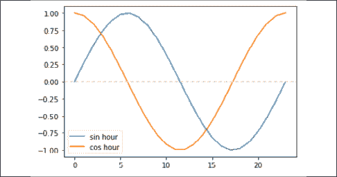
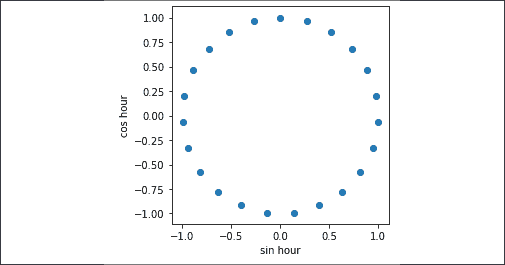
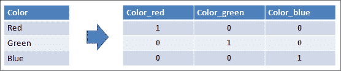
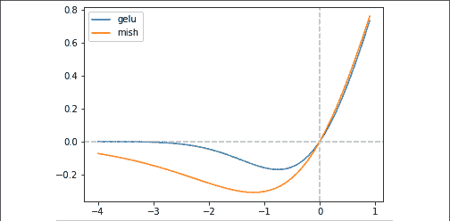
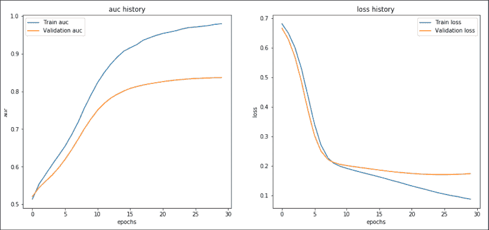

# 第七章：使用表格数据进行预测

目前可以轻松找到的大多数数据并不是由图像或文本文件组成，而是由关系型表格构成，每个表格可能包含数字、日期和简短文本，这些数据可以结合在一起。这是因为基于关系模型（可以通过某些列的值作为连接键将数据表结合在一起）的数据库应用得到了广泛采用。如今，这些表格是表格数据的主要来源，因此也带来了一些挑战。

下面是应用**深度神经网络**（**DNNs**）于表格数据时常见的挑战：

+   混合特征数据类型

+   数据以稀疏格式呈现（零值数据多于非零值数据），这对于 DNN 找到最优解并不是最理想的情况。

+   目前尚未出现最先进的架构，只有一些不同的最佳实践。

+   针对单一问题可用的数据比常见的图像识别问题要少。

+   非技术人员会产生怀疑，因为与更简单的机器学习算法相比，DNN 在表格数据上的可解释性较差。

+   通常情况下，DNN 并不是表格数据的最佳解决方案，因为梯度提升方法（如 LightGBM、XGBoost 和 CatBoost）可能表现得更好。

即使这些挑战看起来相当困难，也请不要气馁。将深度神经网络（DNN）应用于表格数据时的挑战确实是严峻的，但另一方面，机会也同样巨大。斯坦福大学兼职教授、深度学习专家[安德鲁·吴](https://www.coursera.org/instructor/andrewng)最近表示：“**深度学习在用户众多的消费互联网公司中得到了极大的应用，因而产生了大量数据，但要突破到其他行业，那里的数据集较小，我们现在需要针对小数据的更好技术。**”

在本章中，我们将向你介绍一些处理小型表格数据的最佳方法，使用的是 TensorFlow。在此过程中，我们将使用 TensorFlow、Keras，以及两个专门的机器学习包：pandas（[`pandas.pydata.org/`](https://pandas.pydata.org/)）和 scikit-learn（[`scikit-learn.org/stable/index.html`](https://scikit-learn.org/stable/index.html)）。在前几章中，我们经常使用 TensorFlow Datasets（[`www.tensorflow.org/datasets`](https://www.tensorflow.org/datasets)）和专门用于特征列的层（[`www.tensorflow.org/api_docs/python/tf/feature_column`](https://www.tensorflow.org/api_docs/python/tf/feature_column)）。我们本可以在这一章中重复使用它们，但那样我们就会错过一些只有 scikit-learn 才能提供的有趣转换，而且交叉验证也会变得困难。

此外，考虑到使用 scikit-learn 如果你在比较不同算法在某个问题上的表现，并且需要标准化一个数据准备管道，不仅适用于 TensorFlow 模型，还适用于其他更经典的机器学习和统计模型。

为了安装 pandas 和 scikit-learn（如果你使用的是 Anaconda，它们应该已经安装在你的系统中），请按照以下指南操作：

+   对于 pandas: [`pandas.pydata.org/docs/getting_started/install.html`](https://pandas.pydata.org/docs/getting_started/install.html)

+   对于 scikit-learn: [`scikit-learn.org/stable/install.html`](https://scikit-learn.org/stable/install.html)

本章我们将讨论一系列专注于从表格数据中学习的方法，这些数据以表格形式组织，行表示观察结果，列表示每个特征的观察值。

表格数据是大多数机器学习算法的常见输入数据，但对于 DNN 来说并不常见，因为 DNN 在处理其他类型的数据（如图像和文本）时表现更好。

针对表格数据的深度学习方法需要解决一些问题，比如数据异质性，这些问题并非主流，并且需要使用许多常见的机器学习策略，比如交叉验证，而这些策略在 TensorFlow 中目前尚未实现。

本章结束时，你应当掌握以下内容：

+   处理数值数据

+   处理日期数据

+   处理类别数据

+   处理有序数据

+   处理高卡特性类别数据

+   完成所有处理步骤

+   设置数据生成器

+   为表格数据创建自定义激活函数

+   对难题进行测试运行

我们立即开始学习如何处理数值数据。你会惊讶于这些方法在许多表格数据问题中的有效性。

# 处理数值数据

我们将从准备数值数据开始。你有数值数据时，数据是：

+   你的数据是浮动数字表示的

+   你的数据是整数，并且有一定数量的唯一值（否则，如果只有少数值按顺序排列，你正在处理的是有序变量，如排名）。

+   你的整数数据并不代表一个类别或标签（否则你正在处理一个**类别变量**）。

在处理数值数据时，有几种情况可能会影响 DNN 处理数据时的性能：

+   缺失数据（NULL 或 NaN 值，甚至 INF 值）会导致 DNN 完全无法工作。

+   常数值会导致计算变慢，并干扰每个神经元已经提供的偏差。

+   偏斜分布

+   非标准化数据，尤其是带有极端值的数据

在将数值数据输入神经网络之前，你必须确保所有这些问题已经得到妥善处理，否则你可能会遇到错误或学习过程无法正常进行。

## 准备工作

为了解决所有潜在问题，我们将主要使用来自 scikit-learn 的专门函数。在开始我们的配方之前，我们将把它们导入到环境中：

```py
import numpy as np
import pandas as pd
try:
    from sklearn.impute import IterativeImputer
except:
    from sklearn.experimental import enable_iterative_imputer
    from sklearn.impute import IterativeImputer
from sklearn.ensemble import ExtraTreesRegressor
from sklearn.impute import SimpleImputer
from sklearn.preprocessing import StandardScaler, QuantileTransformer
from sklearn.feature_selection import VarianceThreshold
from sklearn.pipeline import Pipeline 
```

为了测试我们的配方，我们将使用一个简单的 3x4 表格，其中一些列包含 NaN 值，还有一些常数列不包含 NaN 值：

```py
example = pd.DataFrame([[1, 2, 3, np.nan], [1, 3, np.nan, 4], [1, 2, 2, 2]], columns = ['a', 'b', 'c', 'd']) 
```

## 如何操作…

我们的配方将基于我们相对于以下内容的指示构建一个 scikit-learn 管道：

+   一个特征被保留的最小可接受方差，否则你可能会将不需要的常量引入网络，进而阻碍学习过程（`variance_threshold` 参数）

+   用作填充缺失值的基准策略是什么（`imputer` 参数，默认设置为用特征的均值替代缺失值），以便完成输入矩阵，使矩阵乘法成为可能（这是神经网络中的基本计算）

+   我们是否应该使用基于所有数值数据缺失值的更复杂的填充策略（`multivariate_imputer` 参数），因为有时候数据点并非随机缺失，其他变量可能提供你所需的信息以进行正确的估计

+   是否添加一个二进制特征，标示每个特征的缺失值位置，这是一个好的策略，因为你通常可以通过缺失模式找到有用的信息（`add_indicator` 参数）

+   是否对变量的分布进行转换，以强制它们接近对称分布（`quantile_transformer` 参数，默认为 `normal`），因为网络将从对称的数据分布中学习得更好

+   我们是否应该基于统计归一化来重新缩放输出，即在去除均值后除以标准差（`scaler` 参数，默认为 `True`）

现在，考虑到这些，让我们按照以下方式构建我们的管道：

```py
def assemble_numeric_pipeline(variance_threshold=0.0, 
                              imputer='mean', 
                              multivariate_imputer=False, 
                              add_indicator=True,
                              quantile_transformer='normal',
                              scaler=True):
    numeric_pipeline = []
    if variance_threshold is not None:
        if isinstance(variance_threshold, float):
            numeric_pipeline.append(('var_filter', 
                                    VarianceThreshold(threshold=variance_threshold)))
        else:
            numeric_pipeline.append(('var_filter',
                                     VarianceThreshold()))
    if imputer is not None:
        if multivariate_imputer is True:
            numeric_pipeline.append(('imputer', 
                                     IterativeImputer(estimator=ExtraTreesRegressor(n_estimators=100, n_jobs=-2), 
                                                      initial_strategy=imputer,
                                                      add_indicator=add_indicator)))
        else:
            numeric_pipeline.append(('imputer', 
                                     SimpleImputer(strategy=imputer, 
                                                   add_indicator=add_indicator)
                                    )
                                   )
    if quantile_transformer is not None:
        numeric_pipeline.append(('transformer',
                                 QuantileTransformer(n_quantiles=100, 
                                                     output_distribution=quantile_transformer, 
                                                     random_state=42)
                                )
                               )
    if scaler is not None:
        numeric_pipeline.append(('scaler', 
                                 StandardScaler()
                                )
                               )
    return Pipeline(steps=numeric_pipeline) 
```

我们现在可以通过指定我们的转换偏好来创建我们的数值管道：

```py
numeric_pipeline = assemble_numeric_pipeline(variance_threshold=0.0, 
                              imputer='mean', 
                              multivariate_imputer=False, 
                              add_indicator=True,
                              quantile_transformer='normal',
                              scaler=True) 
```

我们可以立即在示例上尝试我们新的函数，首先应用`fit`方法，然后应用`transform`方法：

```py
numeric_pipeline.fit(example)
np.round(numeric_pipeline.transform(example), 3) 
```

这是生成的输出 NumPy 数组：

```py
array([[-0.707,  1.225, -0\.   , -0.707,  1.414],
       [ 1.414, -0\.   ,  1.225,  1.414, -0.707],
       [-0.707, -1.225, -1.225, -0.707, -0.707]]) 
```

如你所见，所有原始数据已经完全转换，所有缺失值都已被替换。

## 它是如何工作的…

如前所述，我们使用 scikit-learn 以便与其他机器学习解决方案进行比较，并且因为在构建此配方时涉及到一些独特的 scikit-learn 函数：

+   `VarianceThreshold` ([`scikit-learn.org/stable/modules/generated/sklearn.feature_selection.VarianceThreshold.html`](https://scikit-learn.org/stable/modules/generated/sklearn.feature_selection.VarianceThreshold.html))

+   `IterativeImputer` ([`scikit-learn.org/stable/modules/generated/sklearn.impute.IterativeImputer.html`](https://scikit-learn.org/stable/modules/generated/sklearn.impute.IterativeImputer.html))

+   `SimpleImputer` ([`scikit-learn.org/stable/modules/generated/sklearn.impute.SimpleImputer.html`](https://scikit-learn.org/stable/modules/generated/sklearn.impute.SimpleImputer.html))

+   `QuantileTransformer` ([`scikit-learn.org/stable/modules/generated/sklearn.preprocessing.QuantileTransformer.html`](https://scikit-learn.org/stable/modules/generated/sklearn.preprocessing.QuantileTransformer.html))

+   `StandardScaler` ([`scikit-learn.org/stable/modules/generated/sklearn.preprocessing.StandardScaler.html`](https://scikit-learn.org/stable/modules/generated/sklearn.preprocessing.StandardScaler.html))

+   `Pipeline` ([`scikit-learn.org/stable/modules/generated/sklearn.pipeline.Pipeline.html`](https://scikit-learn.org/stable/modules/generated/sklearn.pipeline.Pipeline.html))

对于每个函数，您会找到一个指向 scikit-learn 文档的链接，提供关于该函数如何工作的详细信息。解释为什么 scikit-learn 方法对于这个配方（以及本章中您将找到的其他配方）如此重要至关重要。

处理图像或文本时，通常不需要为训练数据和测试数据定义特定的处理过程。这是因为您对两者应用的是确定性的转换。例如，在图像处理中，您只需将像素值除以 255 来进行标准化。

然而，对于表格数据，您需要更复杂的转换，并且这些转换完全不是确定性的，因为它们涉及学习和记住特定的参数。例如，当使用均值填充一个特征的缺失值时，您首先需要从训练数据中计算均值。然后，您必须对任何新的数据应用相同的填充值（不能重新计算新数据的均值，因为这些新数据可能来自稍有不同的分布，可能与您的 DNN 所学的值不匹配）。

所有这些都涉及跟踪从训练数据中学习到的许多参数。scikit-learn 可以帮助您，因为当您使用 `fit` 方法时，它会学习并存储从训练数据中推导出的所有参数。使用 `transform` 方法，您将使用通过 fit 学到的参数对任何新数据（或相同的训练数据）应用转换。

## 还有更多…

scikit-learn 函数通常返回一个 NumPy 数组。如果没有进行进一步的特征创建，使用输入列标记返回的数组并没有问题。不幸的是，由于我们创建的转换管道，这种情况并不成立：

+   方差阈值将移除无用的特征

+   缺失值填充将创建缺失的二进制指示器

我们实际上可以通过检查拟合的管道，找出哪些列已经被移除，哪些内容已经从原始数据中添加。可以创建一个函数来自动执行这一操作：

```py
def derive_numeric_columns(df, pipeline):
    columns = df.columns
    if 'var_filter' in pipeline.named_steps:
        threshold = pipeline.named_steps.var_filter.threshold
        columns = columns[pipeline.named_steps.var_filter.variances_>threshold]
    if 'imputer' in pipeline.named_steps:
        missing_cols = pipeline.named_steps.imputer.indicator_.features_
        if len(missing_cols) > 0:
            columns = columns.append(columns[missing_cols] + '_missing')
    return columns 
```

当我们在示例中尝试时：

```py
derive_numeric_columns(example, numeric_pipeline) 
```

我们获得一个包含剩余列和二进制指示符的 pandas 索引（由原始特征的名称和 `_missing` 后缀表示）：

```py
Index(['b', 'c', 'd', 'c_missing', 'd_missing'], dtype='object') 
```

跟踪你在转换列时的操作，可以帮助你在需要调试转换后的数据时，以及在使用像 shap ([`github.com/slundberg/shap`](https://github.com/slundberg/shap)) 或 lime ([`github.com/marcotcr/lime`](https://github.com/marcotcr/lime)) 等工具解释 DNN 工作原理时提供帮助。

这个配方应该能满足你关于数值数据的所有需求。现在，让我们继续探索日期和时间。

# 处理日期

日期在数据库中非常常见，特别是在处理未来估算的预测（如销售预测）时，它们显得不可或缺。神经网络无法直接处理日期，因为它们通常以字符串形式表示。因此，你必须通过分离日期的数值元素来转换它们，一旦你将日期拆分成它的组成部分，你就得到了一些数字，任何神经网络都能轻松处理这些数字。然而，某些时间元素是周期性的（例如天、月、小时、星期几），低数字和高数字实际上是相邻的。因此，你需要使用正弦和余弦函数，这将使这些周期性数字以一种 DNN 可以理解和正确解释的格式呈现。

## 准备工作

由于我们需要编写一个使用 fit/transform 操作的类，这是 scikit-learn 中典型的操作方式，我们从 scikit-learn 导入 `BaseEstimator` 和 `TransformerMixin` 类进行继承。这个继承将帮助我们使我们的代码与 scikit-learn 的所有其他函数完美兼容：

```py
from sklearn.base import BaseEstimator, TransformerMixin 
```

为了测试，我们还准备了一个包含日期的字符串形式的示例数据集，采用日/月/年格式：

```py
example = pd.DataFrame({'date_1': ['04/12/2018', '05/12/2019',  
                                   '07/12/2020'],
                        'date_2': ['12/5/2018', '15/5/2015', 
                                   '18/5/2016'],
                        'date_3': ['25/8/2019', '28/8/2018', 
                                   '29/8/2017']}) 
```

提供的示例非常简短和简单，但它应该能说明我们在处理时的所有相关要点。

## 如何操作……

这一次我们将设计我们自己的类 `DateProcessor`。实例化该类后，它可以选择一个 pandas DataFrame，并将每个日期筛选并处理成一个新的 DataFrame，供 DNN 处理。

这个过程一次处理一个日期，提取日期、星期几、月份和年份（另外，还包括小时和分钟），并使用正弦和余弦变换对所有周期性时间进行转换：

```py
class DateProcessor(BaseEstimator, TransformerMixin):
    def __init__(self, date_format='%d/%m/%Y', hours_secs=False):
        self.format = date_format
        self.columns = None
        self.time_transformations = [
            ('day_sin', lambda x: np.sin(2*np.pi*x.dt.day/31)),
            ('day_cos', lambda x: np.cos(2*np.pi*x.dt.day/31)),
            ('dayofweek_sin', 
                      lambda x: np.sin(2*np.pi*x.dt.dayofweek/6)),
            ('dayofweek_cos', 
                      lambda x: np.cos(2*np.pi*x.dt.dayofweek/6)),
            ('month_sin', 
                      lambda x: np.sin(2*np.pi*x.dt.month/12)),
            ('month_cos', 
                      lambda x: np.cos(2*np.pi*x.dt.month/12)),
            ('year', 
                      lambda x: (x.dt.year - x.dt.year.min()                          ) / (x.dt.year.max() - x.dt.year.min()))
        ]
        if hours_secs:
            self.time_transformations = [
                ('hour_sin', 
                      lambda x: np.sin(2*np.pi*x.dt.hour/23)),
                ('hour_cos', 
                      lambda x: np.cos(2*np.pi*x.dt.hour/23)),
                ('minute_sin', 
                      lambda x: np.sin(2*np.pi*x.dt.minute/59)),
                ('minute_cos', 
                      lambda x: np.cos(2*np.pi*x.dt.minute/59))
            ] + self.time_transformations

    def fit(self, X, y=None, **fit_params):
        self.columns = self.transform(X.iloc[0:1,:]).columns
        return self

    def transform(self, X, y=None, **fit_params):
        transformed = list()
        for col in X.columns:
            time_column = pd.to_datetime(X[col],
                                   format=self.format)
            for label, func in self.time_transformations:
                transformed.append(func(time_column))
                transformed[-1].name += '_' + label
        transformed = pd.concat(transformed, axis=1)
        return transformed

    def fit_transform(self, X, y=None, **fit_params):
        self.fit(X, y, **fit_params)
        return self.transform(X) 
```

现在我们已经将配方编写成 `DateProcessor` 类的形式，让我们进一步探索它的内部工作原理。

## 它是如何工作的……

整个类的关键是通过 pandas `to_datetime` 函数进行的转换，它将任何表示日期的字符串转换为 `datetime64[ns]` 类型。

`to_datetime`之所以有效，是因为你提供了一个模板（`format`参数），用来将字符串转换为日期。有关如何定义该模板的完整指南，请访问[`docs.python.org/3/library/datetime.html#strftime-and-strptime-behavior`](https://docs.python.org/3/library/datetime.html#strftime-and-strptime-behavior)。

当你需要拟合和转换数据时，类会自动将所有日期处理成正确的格式，并进一步使用正弦和余弦函数进行变换：

```py
DateProcessor().fit_transform(example) 
```

一些变换结果是显而易见的，但有些与周期时间相关的变换可能会让人感到困惑。我们花点时间探讨它们如何运作以及为什么会这样。

## 还有更多……

这个类不会返回时间元素的原始提取结果，如小时、分钟或天数，而是首先通过正弦变换，然后是余弦变换来转换它们。让我们绘制出它如何转换 24 小时，以便更好地理解这个方法：

```py
import matplotlib.pyplot as plt
sin_time = np.array([[t, np.sin(2*np.pi*t/23)] for t in range(0, 24)])
cos_time = np.array([[t, np.cos(2*np.pi*t/23)] for t in range(0, 24)])
plt.plot(sin_time[:,0], sin_time[:,1], label='sin hour')
plt.plot(cos_time[:,0], cos_time[:,1], label='cos hour')
plt.axhline(y=0.0, linestyle='--', color='lightgray')
plt.legend()
plt.show() 
```

这是你将得到的图：



图 7.1：正弦和余弦变换后的小时时间绘图

从图中，我们可以看出一天的开始和结束是如何重合的，从而完成时间周期的闭环。每个变换也会返回相同的值，对于几个不同的小时来说都是如此。这就是为什么我们应该同时使用正弦和余弦的原因；如果你同时使用这两者，每个时间点都会有一对不同的正弦和余弦值，因此你可以精确地检测你在连续时间中的位置。通过将正弦和余弦值绘制成散点图，这一点也可以通过可视化方式进行解释：

```py
ax = plt.subplot()
ax.set_aspect('equal')
ax.set_xlabel('sin hour')
ax.set_ylabel('cos hour')
plt.scatter(sin_time[:,1], cos_time[:,1])
plt.show() 
```

这是结果：



图 7.2：将小时时间的正弦和余弦变换结合到散点图中

就像时钟一样，小时被绘制在一个圆圈中，每个小时是分开的、独立的，但却是完整的周期连续体。

# 处理分类数据

字符串通常在表格数据中表示分类数据。分类特征中的每个唯一值代表一个质量，指的是我们正在检查的示例（因此，我们认为这些信息是**定性的**，而数字信息是**定量的**）。从统计学角度看，每个唯一值被称为**水平**，而分类特征被称为**因子**。有时你会看到用于分类的数字代码（标识符），当定性信息之前已被编码为数字时，但处理方式不会改变：信息是数字值，但应该当作分类数据处理。

由于你不知道每个分类特征中每个唯一值与特征中其他值的关系（如果你提前将值分组或排序，实际上是在表达你对数据的假设），你可以将每个唯一值视为一个独立的值。因此，你可以从每个唯一的分类值中推导出创建二进制特征的想法。这个过程被称为独热编码（one-hot encoding），它是最常见的数据处理方法，可以使得分类数据适用于深度神经网络（DNN）和其他机器学习算法。

比如，如果你有一个分类变量，其中包含红色、蓝色和绿色这些唯一值，你可以将它转化为三个独立的二进制变量，每个变量唯一地表示一个值，如下图所示：



然而，这种方法对 DNN 来说存在一个问题。当你的分类变量拥有过多的取值（通常超过 255 个）时，所得到的二进制派生特征不仅数量过多，导致数据集变得庞大，而且还携带很少的信息，因为大部分数值将是零（我们称这种情况为**稀疏数据**）。稀疏数据对 DNN 有一定问题，因为当数据中有过多的零时，反向传播效果不好，因为信息的缺失会导致信号在网络中传播时无法产生有意义的变化。

因此，我们根据分类变量的唯一值数量区分低基数和高基数的分类变量，并且只对我们认为基数较低的分类变量进行处理（通常如果唯一值少于 255 个，我们认为它是低基数，但你也可以选择一个更低的阈值，比如 64、32，甚至是 24）。

## 准备工作

我们导入 scikit-learn 的独热编码函数，并准备一个简单的示例数据集，其中包含字符串和数值形式的分类数据：

```py
from sklearn.preprocessing import OneHotEncoder
example = pd.DataFrame([['car', 1234], ['house', 6543], 
                  ['tree', 3456]], columns=['object', 'code']) 
```

现在我们可以继续执行方案了。

## 如何操作…

我们准备一个可以将数字转换为字符串的类，使用它后，每个数值型分类特征将与字符串一样进行处理。然后，我们准备好我们的方案，这个方案是一个 scikit-learn 管道，结合了我们的字符串转换器和独热编码（我们不会忘记通过将缺失值转换为唯一值来自动处理缺失数据）。

```py
class ToString(BaseEstimator, TransformerMixin):
    def fit(self, X, y=None, **fit_params):
        return self
    def transform(self, X, y=None, **fit_params):
        return X.astype(str)
    def fit_transform(self, X, y=None, **fit_params):
        self.fit(X, y, **fit_params)
        return self.transform(X)

categorical_pipeline = Pipeline(steps=[
         ('string_converter', ToString()),
         ('imputer', SimpleImputer(strategy='constant', 
                                   fill_value='missing')),
         ('onehot', OneHotEncoder(handle_unknown='ignore'))]) 
```

尽管代码片段很简短，但它实际上实现了很多功能。我们来理解它是如何工作的。

## 它是如何工作的…

像我们之前看到的其他方法一样，我们只需要拟合并转换我们的示例：

```py
categorical_pipeline.fit_transform(example).todense() 
```

由于返回的数组是稀疏的（即在数据集中零值占主导的特殊格式），我们可以使用 `.todense` 方法将其转换回我们常用的 NumPy 数组格式。

## 还有更多内容…

独热编码通过将每个类别的唯一值转换为自己的变量，生成许多新特征。为了给它们打标签，我们必须检查我们使用的 scikit-learn 独热编码实例，并从中提取标签：

```py
def derive_ohe_columns(df, pipeline):
    return [str(col) + '_' + str(lvl) 
         for col, lvls in zip(df.columns,      
         pipeline.named_steps.onehot.categories_) for lvl in lvls] 
```

例如，在我们的示例中，现在我们可以通过调用以下函数来弄清楚每个新特征所代表的含义：

```py
derive_ohe_columns(example, categorical_pipeline) 
```

结果为我们提供了有关原始特征和由二元变量表示的独特值的指示：

```py
['object_car',
 'object_house',
 'object_tree',
 'code_1234',
 'code_3456',
 'code_6543'] 
```

正如你所看到的，结果同时提供了原始特征和由二元变量表示的独特值的指示。

# 处理序数数据

序数数据（例如，排名或评论中的星级）无疑更像数字数据，而不是类别数据，但我们必须首先考虑一些差异，然后才能将其直接作为数字来处理。类别数据的问题在于，你可以将其作为数字数据处理，但在标度中一个点与下一个点之间的距离，可能不同于下一个点与再下一个点之间的距离（从技术上讲，步骤可能不同）。这是因为序数数据并不代表数量，而只是表示顺序。另一方面，我们也将它视为类别数据，因为类别是独立的，而这样做会丧失顺序中隐含的信息。处理序数数据的解决方案就是将它视为数字和类别变量的组合。

## 准备工作

首先，我们需要从 scikit-learn 导入`OrdinalEncoder`函数，它将帮助我们对序数值进行数字化编码，即使它们是文本形式（例如，序数等级“差、中等、好”）：

```py
from sklearn.preprocessing import OrdinalEncoder 
```

然后，我们可以使用包含按序信息并记录为字符串的两个特征来准备我们的示例：

```py
example = pd.DataFrame([['first', 'very much'], 
                        ['second', 'very little'], 
                        ['third', 'average']],
                       columns = ['rank', 'importance']) 
```

再次强调，示例只是一个玩具数据集，但它应该能帮助我们测试这个配方所展示的功能。

## 如何做……

到这个阶段，我们可以准备两个流水线。第一个流水线将处理序数数据，将其转换为有序的数字（该转换将保留原始特征的顺序）。第二个转换将对序数数据进行独热编码（这种转换将保留序数等级之间的步长信息，但不保留它们的顺序）。正如在本章前面“处理日期”配方中所述，对于你要在 DNN 中处理序数数据来说，来自原始数据的仅有两部分信息就足够了：

```py
oe = OrdinalEncoder(categories=[['first', 'second', 'third'],  
                     ['very much', 'average', 'very little']])
categorical_pipeline = Pipeline(steps=[
            ('string_converter', ToString()),
            ('imputer', SimpleImputer(strategy='constant', 
                                      fill_value='missing')),
            ('onehot', OneHotEncoder(handle_unknown='ignore'))]) 
```

由于这个配方主要由 scikit-learn 流水线组成，所以它对你来说应该是相当熟悉的。让我们深入了解它，了解更多的工作原理。

## 它是如何工作的……

你所需要做的就是单独操作这些转换，然后将生成的向量堆叠在一起：

```py
np.hstack((oe.fit_transform(example), categorical_pipeline.fit_transform(example).todense())) 
```

这是我们示例的结果：

```py
matrix([[0., 0., 1., 0., 0., 0., 0., 1.],
        [1., 2., 0., 1., 0., 0., 1., 0.],
        [2., 1., 0., 0., 1., 1., 0., 0.]]) 
```

列可以通过之前看到的`derive_ohe_columns`函数轻松推导出来：

```py
example.columns.tolist() + derive_ohe_columns(example, categorical_pipeline) 
```

这是包含转换后的列名的列表：

```py
['rank',
 'importance',
 'rank_first',
 'rank_second',
 'rank_third',
 'importance_average',
 'importance_very little',
 'importance_very much'] 
```

通过将覆盖数值部分的变量与有序变量的唯一值结合起来，我们现在应该能够利用来自数据的所有真实信息。

# 处理高基数类别数据

在处理高基数类别特征时，我们可以使用前面提到的独热编码策略。然而，我们可能会遇到一些问题，因为生成的矩阵过于稀疏（许多零值），从而阻碍了我们的深度神经网络（DNN）收敛到一个好的解，或者使数据集变得不可处理（因为稀疏矩阵变为密集矩阵后可能占用大量内存）。

最好的解决方案是将它们作为数值标签特征传递给我们的深度神经网络（DNN），并让 Keras 嵌入层来处理它们（[`www.tensorflow.org/api_docs/python/tf/keras/layers/Embedding`](https://www.tensorflow.org/api_docs/python/tf/keras/layers/Embedding)）。嵌入层实际上是一个权重矩阵，可以将高基数类别输入转换为低维度的数值输出。它本质上是一个加权线性组合，其权重经过优化，以将类别转换为最佳帮助预测过程的数字。

在幕后，嵌入层将你的类别数据转换为独热编码向量，这些向量成为一个小型神经网络的输入。这个小型神经网络的目的是将输入混合并组合成一个较小的输出层。该层执行的独热编码仅适用于数值标签的类别（不适用于字符串），因此正确转换我们的高基数类别数据是至关重要的。

scikit-learn 包提供了 `LabelEncoder` 函数作为一种可能的解决方案，但这种方法存在一些问题，因为它无法处理之前未见过的类别，也无法在拟合/转换模式下正常工作。我们的方案需要将其封装并使其适用于为 Keras 嵌入层生成正确的输入和信息。

## 准备工作

在这个方案中，我们需要重新定义 scikit-learn 中的 `LabelEncoder` 函数，并使其适用于拟合/转换过程：

```py
from sklearn.preprocessing import LabelEncoder 
```

由于我们需要模拟一个高基数类别变量，我们将使用一个简单脚本创建的随机唯一值（由字母和数字组成）。这将使我们能够测试更多的示例：

```py
import string
import random
def random_id(length=8):
    voc = string.ascii_lowercase + string.digits
    return ''.join(random.choice(voc) for i in range(length))
example = pd.DataFrame({'high_cat_1': [random_id(length=2) 
                                       for i in range(500)], 
                        'high_cat_2': [random_id(length=3) 
                                       for i in range(500)], 
                        'high_cat_3': [random_id(length=4) 
                                       for i in range(500)]}) 
```

这是我们随机示例生成器的输出：


第一列包含一个两字母代码，第二列使用三个字母，最后一列使用四个字母。

## 如何做到这一点……

在这个方案中，我们将准备另一个 scikit-learn 类。它扩展了现有的 `LabelEncoder` 函数，因为它能够自动处理缺失值。它记录了原始类别值与其对应的数值之间的映射关系，并且在转换时，它能够处理之前未见过的类别，将它们标记为未知：

```py
class LEncoder(BaseEstimator, TransformerMixin):

    def __init__(self):
        self.encoders = dict()
        self.dictionary_size = list()
        self.unk = -1

    def fit(self, X, y=None, **fit_params):
        for col in range(X.shape[1]):
            le = LabelEncoder()
            le.fit(X.iloc[:, col].fillna('_nan'))
            le_dict = dict(zip(le.classes_, 
                               le.transform(le.classes_)))

            if '_nan' not in le_dict:
                max_value = max(le_dict.values())
                le_dict['_nan'] = max_value

            max_value = max(le_dict.values())
            le_dict['_unk'] = max_value

            self.unk = max_value
            self.dictionary_size.append(len(le_dict))
            col_name = X.columns[col]
            self.encoders[col_name] = le_dict

        return self

    def transform(self, X, y=None, **fit_params):
        output = list()
        for col in range(X.shape[1]):
            col_name = X.columns[col]
            le_dict = self.encoders[col_name]
            emb = X.iloc[:, col].fillna('_nan').apply(lambda x: 
                           le_dict.get(x, le_dict['_unk'])).values
            output.append(pd.Series(emb, 
                                name=col_name).astype(np.int32))
        return output
    def fit_transform(self, X, y=None, **fit_params):
        self.fit(X, y, **fit_params)
        return self.transform(X) 
```

就像我们迄今为止看到的其他类一样，`LEncoder`有一个拟合方法，能够存储信息以供将来使用，还有一个转换方法，基于之前拟合到训练数据时存储的信息应用转换。

## 它是如何工作的……

在实例化标签编码器后，我们只需拟合并转换我们的示例，将每个类别特征转化为一系列数字标签：

```py
le = LEncoder()
le.fit_transform(example) 
```

完成所有编码以实现配方后，这个类的执行确实简单明了。

## 还有更多……

为了让 Keras 嵌入层正常工作，我们需要指定高基数类别变量的输入大小。通过访问我们示例中的`le.dictionary_size`，我们在示例变量中有`412`、`497`和`502`个不同的值：

```py
le.dictionary_size 
```

在我们的示例中，示例变量分别有`412`、`497`和`502`个不同的值：

```py
[412, 497, 502] 
```

这个数字包括**缺失**和**未知**标签，即使在我们拟合的示例中没有缺失或未知元素。

# 完成所有处理

现在我们已经完成了处理不同类型表格数据的配方，在本配方中，我们将把所有内容封装到一个类中，这个类可以轻松处理所有的 fit/transform 操作，输入为 pandas DataFrame，并明确指定要处理的列以及处理方式。

## 准备好

由于我们将结合多个转换，我们将利用 scikit-learn 的`FeatureUnion`函数，这是一个可以轻松地将它们拼接在一起的函数：

```py
from sklearn.pipeline import FeatureUnion 
```

作为测试数据集，我们将简单地合并之前使用过的所有测试数据：

```py
example = pd.concat([
pd.DataFrame([[1, 2, 3, np.nan], [1, 3, np.nan, 4],[1, 2, 2, 2]], 
             columns = ['a', 'b', 'c', 'd']),
pd.DataFrame({'date_1': ['04/12/2018', '05/12/2019','07/12/2020'],
              'date_2': ['12/5/2018', '15/5/2015', '18/5/2016'],
              'date_3': ['25/8/2019', '28/8/2018', '29/8/2017']}),
pd.DataFrame([['first', 'very much'], ['second', 'very little'],   
              ['third', 'average']], 
             columns = ['rank', 'importance']),
pd.DataFrame([['car', 1234], ['house', 6543], ['tree', 3456]], 
             columns=['object', 'code']),
pd.DataFrame({'high_cat_1': [random_id(length=2) 
                             for i in range(3)], 
              'high_cat_2': [random_id(length=3) 
                             for i in range(3)], 
              'high_cat_3': [random_id(length=4) 
                             for i in range(3)]})
], axis=1) 
```

至于我们的玩具数据集，我们只需将迄今为止使用过的所有数据集合并在一起。

## 如何做到……

本配方的包装类已拆分为多个部分，以帮助您更好地检查和学习代码。第一部分包含初始化，它有效地整合了本章迄今为止所有看到的配方：

```py
class TabularTransformer(BaseEstimator, TransformerMixin):

    def instantiate(self, param):
        if isinstance(param, str):
            return [param]
        elif isinstance(param, list):
            return param
        else:
            return None

    def __init__(self, numeric=None, dates=None, 
                 ordinal=None, cat=None, highcat=None,
                 variance_threshold=0.0, missing_imputer='mean',  
                 use_multivariate_imputer=False,
                 add_missing_indicator=True, 
                 quantile_transformer='normal', scaler=True,
                 ordinal_categories='auto', 
                 date_format='%d/%m/%Y', hours_secs=False):

        self.numeric = self.instantiate(numeric)
        self.dates = self.instantiate(dates)
        self.ordinal = self.instantiate(ordinal)
        self.cat  = self.instantiate(cat)
        self.highcat = self.instantiate(highcat)
        self.columns = None
        self.vocabulary = None 
```

在记录了所有包装器的关键参数之后，我们继续检查它的所有独立部分。请不要忘记，这些代码片段都属于同一个`__init__`方法，我们仅仅是重新使用之前看到的配方，因此关于这些代码片段的任何细节，请参考之前的配方。

这里我们记录了数字管道：

```py
 self.numeric_process = assemble_numeric_pipeline(
                    variance_threshold=variance_threshold, 
                    imputer=missing_imputer, 
                    multivariate_imputer=use_multivariate_imputer, 
                    add_indicator=add_missing_indicator,
                    quantile_transformer=quantile_transformer,
                    scaler=scaler) 
```

之后，我们记录与管道处理时间相关的特征：

```py
 self.dates_process = DateProcessor(
                   date_format=date_format, hours_secs=hours_secs) 
```

现在轮到有序变量了：

```py
 self.ordinal_process = FeatureUnion(
                [('ordinal', 
                 OrdinalEncoder(categories=ordinal_categories)),
                 ('categorial',   
                 Pipeline(steps=[('string_converter', ToString()),
                 ('imputer', 
                 SimpleImputer(strategy='constant', 
                               fill_value='missing')),
                 ('onehot', 
                 OneHotEncoder(handle_unknown='ignore'))]))]) 
```

我们以分类管道作为结尾，包括低类别和高类别的管道：

```py
 self.cat_process = Pipeline(steps=[
              ('string_converter', ToString()),
              ('imputer', SimpleImputer(strategy='constant', 
                                        fill_value='missing')),
              ('onehot', OneHotEncoder(handle_unknown='ignore'))])
        self.highcat_process = LEncoder() 
```

下一部分涉及拟合。根据不同的变量类型，将应用相应的拟合过程，新的处理或生成的列将记录在`.columns`索引列表中：

```py
 def fit(self, X, y=None, **fit_params):
        self.columns = list()
        if self.numeric:
            self.numeric_process.fit(X[self.numeric])
            self.columns += derive_numeric_columns(
                               X[self.numeric], 
                               self.numeric_process).to_list()
        if self.dates:
            self.dates_process.fit(X[self.dates])
            self.columns += self.dates_process.columns.to_list()
        if self.ordinal:
            self.ordinal_process.fit(X[self.ordinal])
            self.columns += self.ordinal + derive_ohe_columns(
                      X[self.ordinal], 
                      self.ordinal_process.transformer_list[1][1])
        if self.cat:
            self.cat_process.fit(X[self.cat])
            self.columns += derive_ohe_columns(X[self.cat], 
                                               self.cat_process)
        if self.highcat:
            self.highcat_process.fit(X[self.highcat])
            self.vocabulary = dict(zip(self.highcat,  
                            self.highcat_process.dictionary_size))
            self.columns = [self.columns, self.highcat]
        return self 
```

`transform`方法提供了所有的转换和矩阵连接，以返回一个包含处理后数据的数组列表，第一个元素是数值部分，后面是代表高基数类别变量的数值标签向量：

```py
 def transform(self, X, y=None, **fit_params):
        flat_matrix = list()
        if self.numeric:
            flat_matrix.append(
                   self.numeric_process.transform(X[self.numeric])
                              .astype(np.float32))
        if self.dates:
            flat_matrix.append(
                   self.dates_process.transform(X[self.dates])
                              .values
                              .astype(np.float32))
        if self.ordinal:
            flat_matrix.append(
                   self.ordinal_process.transform(X[self.ordinal])
                              .todense()
                              .astype(np.float32))
        if self.cat:
            flat_matrix.append(
                   self.cat_process.transform(X[self.cat])
                              .todense()
                              .astype(np.float32))
        if self.highcat:
            cat_vectors = self.highcat_process.transform(
                                                  X[self.highcat])
            if len(flat_matrix) > 0:
                return [np.hstack(flat_matrix)] + cat_vectors
            else:
                return cat_vectors
        else:
            return np.hstack(flat_matrix) 
```

最后，我们设置了`fit_transform`方法，它依次执行 fit 和 transform 操作：

```py
 def fit_transform(self, X, y=None, **fit_params):
        self.fit(X, y, **fit_params)
        return self.transform(X) 
```

现在我们已经完成了所有的封装工作，可以看看它是如何工作的。

## 它是如何工作的……

在我们的测试中，我们根据列的类型将列名的列表赋值给变量：

```py
numeric_vars = ['a', 'b', 'c', 'd']
date_vars = ['date_1', 'date_2', 'date_3']
ordinal_vars = ['rank', 'importance']
cat_vars = ['object', 'code']
highcat_vars = ['high_cat_1', 'high_cat_2', 'high_cat_3']
tt = TabularTransformer(numeric=numeric_vars, dates=date_vars, 
                        ordinal=ordinal_vars, cat=cat_vars, 
                        highcat=highcat_vars) 
```

在实例化了`TabularTransformer`并将需要处理的变量映射到它们的类型后，我们开始拟合并转换我们的示例数据集：

```py
input_list = tt.fit_transform(example) 
```

结果是一个 NumPy 数组的列表。我们可以通过遍历它们并打印它们的形状，来检查输出的组成：

```py
print([(item.shape, item.dtype) for item in input_list]) 
```

打印的结果显示第一个元素是一个较大的数组（所有过程的结合结果，除了高基数类别变量的部分）：

```py
[((3, 40), dtype('float32')), ((3,), dtype('int32')), ((3,), dtype('int32')), ((3,), dtype('int32'))] 
```

我们的 DNN 现在可以期望一个列表作为输入，其中第一个元素是数值矩阵，接下来的元素是要传递给类别嵌入层的向量。

## 还有更多内容……

为了能够追溯每个列和向量的名称，`TabularTransformer`有一个`columns`方法，`tt.columns`，可以调用。`TabularTransformer`还可以调用`tt.vocabulary`来获取关于类别变量维度的信息，这对于正确设置网络中嵌入层的输入形状是必需的。返回的结果是一个字典，其中列名是键，字典的大小是值：

```py
{'high_cat_1': 5, 'high_cat_2': 5, 'high_cat_3': 5} 
```

现在我们已经有了这两个方法来追踪变量名（`tt.columns`）和定义高基数变量的词汇（`tt.vocabulary`），我们距离一个完整的深度学习框架已经只差一步，用于处理表格数据的深度学习。

# 设置数据生成器

在我们尝试在一个难度较大的测试任务上使用我们的框架之前，还缺少一个关键成分。前面的步骤展示了一个`TabularTransformer`，它可以有效地将 pandas DataFrame 转化为 DNN 可以处理的数值数组。然而，这个步骤只能一次性处理所有数据。下一步是提供一种方法，能够创建不同大小的数据批次。这可以通过使用`tf.data`或 Keras 生成器来实现，并且由于我们在本书之前已经探讨了许多`tf.data`的例子，这次我们将为 Keras 生成器准备代码，使其能够在 DNN 学习时动态生成随机批次。

## 准备工作

我们的生成器将继承自`Sequence`类：

```py
from tensorflow.keras.utils import Sequence 
```

`Sequence` 类是拟合数据序列的基础对象，要求你实现自定义的 `__getitem__`（返回完整批次）和 `__len__`（报告完成一个周期所需的批次数）方法。

## 如何实现…

我们现在编写一个名为 `DataGenerator` 的新类，继承自 Keras 的 `Sequence` 类：

```py
class DataGenerator(Sequence):
    def __init__(self, X, y,
                 tabular_transformer=None,
                 batch_size=32, 
                 shuffle=False,
                 dict_output=False
                 ):

        self.X = X
        self.y = y
        self.tbt = tabular_transformer
        self.tabular_transformer = tabular_transformer
        self.batch_size = batch_size
        self.shuffle = shuffle
        self.dict_output = dict_output
        self.indexes = self._build_index()
        self.on_epoch_end()
        self.item = 0

    def _build_index(self):
        return np.arange(len(self.y))

    def on_epoch_end(self):
        if self.shuffle:
            np.random.shuffle(self.indexes)

    def __len__(self):
        return int(len(self.indexes) / self.batch_size) + 1

    def __iter__(self):
        for i in range(self.__len__()):
            self.item = i
            yield self.__getitem__(index=i)

        self.item = 0

    def __next__(self):
        return self.__getitem__(index=self.item)

    def __call__(self):
        return self.__iter__()

    def __data_generation(self, selection):
        if self.tbt is not None:
            if self.dict_output:
                dct = {'input_'+str(j) : arr for j, 
                        arr in enumerate(
                  self.tbt.transform(self.X.iloc[selection, :]))}
                return dct, self.y[selection]
            else:
                return self.tbt.transform(
                     self.X.iloc[selection, :]), self.y[selection]
        else:
            return self.X.iloc[selection, :], self.y[selection]

    def __getitem__(self, index):
        indexes = self.indexes[
                  index*self.batch_size:(index+1)*self.batch_size]
        samples, labels = self.__data_generation(indexes)
        return samples, labels, [None] 
```

生成器已经设置好。接下来让我们进入下一部分，详细探索它是如何工作的。

## 它是如何工作的…

除了 `__init__` 方法，该方法实例化类的内部变量外，`DataGenerator` 类还包括以下方法：

+   `_build_index`：用于创建提供数据的索引

+   `on_epoch_end`：在每个周期结束时，这个方法将随机打乱数据

+   `__len__`：报告完成一个周期所需的批次数

+   `__iter__`：使该类成为可迭代对象

+   `__next__`：调用下一个批次

+   `__call__`：返回 `__iter__` 方法的调用

+   `__data_generation`：在这里，`TabularTransformer` 对数据批次进行操作，返回转换后的输出（作为数组列表或数组字典返回）

+   `__getitem__`：将数据拆分成批次，并调用 `__data_generation` 方法进行转换

这完成了最后一块拼图。通过使用最后两个配方，你只需填写几个参数，就可以将任何混合变量的表格数据完全转换并交付给 TensorFlow 模型。在接下来的两个配方中，我们将为你提供一些特定的技巧，以帮助我们的 DNN 更好地处理表格数据，并且我们将展示一个来自著名 Kaggle 竞赛的完整示例。

# 为表格数据创建自定义激活函数

对于图像和文本数据来说，由于数据是稀疏的，在 DNN 处理表格数据时反向传播误差更加困难。虽然 ReLU 激活函数广泛使用，但已经发现新的激活函数在这种情况下表现更好，可以提高网络性能。这些激活函数包括 SeLU、GeLU 和 Mish。由于 SeLU 已经包含在 Keras 和 TensorFlow 中（参见 [`www.tensorflow.org/api_docs/python/tf/keras/activations/selu`](https://www.tensorflow.org/api_docs/python/tf/keras/activations/selu) 和 [`www.tensorflow.org/api_docs/python/tf/nn/selu`](https://www.tensorflow.org/api_docs/python/tf/nn/selu)），在这个配方中我们将使用 GeLU 和 Mish 激活函数。

## 准备工作

你需要导入常见的模块：

```py
from tensorflow import keras as keras
import numpy as np
import matplotlib.pyplot as plt 
```

我们已经添加了 `matplotlib`，可以绘制这些新激活函数的工作效果，并了解它们有效性的原因。

## 如何实现…

GeLU 和 Mish 的数学公式已在它们的原始论文中定义，您可以在其中找到详细信息：

+   *高斯误差线性单元（GELUs）*：[`arxiv.org/abs/1606.08415`](https://arxiv.org/abs/1606.08415)

+   *Mish, 一种自正则化的* *非单调神经激活函数*：[`arxiv.org/abs/1908.08681`](https://arxiv.org/abs/1908.08681)

下面是翻译成代码的公式：

```py
def gelu(x):
    return 0.5 * x * (1 + tf.tanh(tf.sqrt(2 / np.pi) * 
                        (x + 0.044715 * tf.pow(x, 3))))
keras.utils.get_custom_objects().update(
                         {'gelu': keras.layers.Activation(gelu)})
def mish(inputs):
    return inputs * tf.math.tanh(tf.math.softplus(inputs))
keras.utils.get_custom_objects().update(
                         {'mish': keras.layers.Activation(mish)}) 
```

这个方法有趣的地方在于 `get_custom_objects` 是一个函数，允许你在自定义的 TensorFlow 对象中记录新的函数，并且可以轻松地在层参数中将其作为字符串调用。你可以通过查看 TensorFlow 文档了解更多关于自定义对象的工作原理：[`www.tensorflow.org/api_docs/python/tf/keras/utils/get_custom_objects`](https://www.tensorflow.org/api_docs/python/tf/keras/utils/get_custom_objects)。

## 它是如何工作的…

我们可以通过绘制正负输入与其输出的关系来了解这两个激活函数是如何工作的。使用 matplotlib 的几个命令将帮助我们进行可视化：

```py
gelu_vals = list()
mish_vals = list()
abscissa = np.arange(-4, 1, 0.1)
for val in abscissa:
    gelu_vals.append(gelu(tf.cast(val, tf.float32)).numpy())
    mish_vals.append(mish(tf.cast(val, tf.float32)).numpy())

plt.plot(abscissa, gelu_vals, label='gelu')
plt.plot(abscissa, mish_vals, label='mish')
plt.axvline(x=0.0, linestyle='--', color='darkgray')
plt.axhline(y=0.0, linestyle='--', color='darkgray')
plt.legend()
plt.show() 
```

运行代码后，你应该得到以下图形：



图 7.3：GeLU 和 Mish 激活函数从输入到输出的映射

与 ReLU 激活函数类似，输入从零开始到正数的部分会被直接映射为输出（保持正激活时的线性关系）。有趣的部分出现在输入小于零时，实际上，因为它不像 ReLU 那样被抑制。在 GeLU 和 Mish 激活函数中，负输入的输出是经过抑制的变换，当输入非常负时会趋近于零。这避免了神经元“死亡”的问题，因为负输入仍然可以传递信息，也避免了神经元饱和的问题，因为过于负的值会被关闭。

通过不同的策略，GeLU 和 Mish 激活函数都能处理和传播负输入。这使得负输入的梯度是有定义的，并且不会对网络造成伤害。

# 在一个困难问题上进行测试

本章中，我们提供了一些有效处理表格数据的技巧。每个技巧本身并不是一个完整的解决方案，而是一个拼图的一部分。当这些部分组合在一起时，你可以获得出色的结果。在这最后一个技巧中，我们将展示如何将所有技巧结合起来，成功完成一个困难的 Kaggle 挑战。

Kaggle 竞赛 *Amazon.com – Employee Access Challenge* ([`www.kaggle.com/c/amazon-employee-access-challenge`](https://www.kaggle.com/c/amazon-employee-access-challenge)) 是一个因涉及高基数变量而著名的竞赛，也是比较梯度提升算法的一个重要基准。该竞赛的目的是开发一个模型，根据员工的角色和活动预测是否应该给予其访问特定资源的权限。结果应该以可能性形式给出。作为预测因子，你将使用不同的 ID 代码，这些代码对应于你正在评估访问权限的资源类型、员工在组织中的角色以及推荐经理。

## 准备工作

和往常一样，我们先导入 TensorFlow 和 Keras：

```py
import tensorflow as tf
import tensorflow.keras as keras 
```

使用基于顺序的数据生成器可能会触发 TensorFlow 2.2 中的一些错误。这是由于启用执行（eager execution），因此作为预防措施，我们必须为此配方禁用它：

```py
tf.compat.v1.disable_eager_execution() 
```

为了获取亚马逊数据集，最佳且最快的方法是安装**CatBoost**，一种使用数据集作为基准的梯度提升算法。如果它还没有安装在你的环境中，你可以通过运行`pip install catboost`命令轻松安装：

```py
from catboost.datasets import amazon
X, Xt = amazon()
y = X["ACTION"].apply(lambda x: 1 if x == 1 else 0).values
X.drop(["ACTION"], axis=1, inplace=True) 
```

由于测试数据（已上传至`Xt`变量）包含未标记的目标变量，我们将只使用`X`变量中的训练数据。

## 如何实现…

首先，我们将定义此问题的 DNN 架构。由于问题只涉及具有高基数的分类变量，我们从为每个特征设置输入和嵌入层开始。

我们首先为每个特征定义一个输入，其中数据流入网络，然后每个输入被导入到其各自的嵌入层。输入的大小根据特征的唯一值数量来确定，输出的大小则基于输入大小的对数。每个嵌入层的输出随后传递到空间丢弃层（由于嵌入层会返回一个矩阵，空间丢弃层会将整个矩阵的列置空），然后进行展平。最后，所有展平后的结果被连接成一个单一的层。从此，数据必须通过两个带丢弃层的全连接层，最终到达输出响应节点，该节点是一个经过 sigmoid 激活的节点，返回一个概率作为答案：

```py
def dnn(categorical_variables, categorical_counts,
        feature_selection_dropout=0.2, categorical_dropout=0.1,
        first_dense = 256, second_dense = 256, 
        dense_dropout = 0.2, 
        activation_type=gelu):

    categorical_inputs = []
    categorical_embeddings = []

    for category in categorical_variables:
        categorical_inputs.append(keras.layers.Input(
                 shape=[1], name=category))
        category_counts = categorical_counts[category]
        categorical_embeddings.append(
            keras.layers.Embedding(category_counts+1, 
                      int(np.log1p(category_counts)+1), 
                      name = category +  
                              "_embed")(categorical_inputs[-1]))

    def flatten_dropout(x, categorical_dropout):
        return keras.layers.Flatten()(
            keras.layers.SpatialDropout1D(categorical_dropout)(x))

    categorical_logits = [flatten_dropout(cat_emb, 
                                          categorical_dropout) 
                          for cat_emb in categorical_embeddings]
    categorical_concat = keras.layers.Concatenate(
                  name = "categorical_concat")(categorical_logits)
    x = keras.layers.Dense(first_dense,  
                   activation=activation_type)(categorical_concat)
    x = keras.layers.Dropout(dense_dropout)(x)  
    x = keras.layers.Dense(second_dense, 
                   activation=activation_type)(x)
    x = keras.layers.Dropout(dense_dropout)(x)
    output = keras.layers.Dense(1, activation="sigmoid")(x)
    model = keras.Model(categorical_inputs, output)

    return model 
```

该架构仅适用于分类数据。它将每个分类输入（预期为单个整数编码）传入一个嵌入层，嵌入层的输出是一个降维向量（其维度通过启发式方法`int(np.log1p(category_counts)+1)`计算得出）。接着应用`SpatialDropout1D`，最后将输出展平。`SpatialDropout1D`会去除输出矩阵一行中的所有连接，去掉所有通道中的一些信息。所有分类变量的输出将被连接并传递到一系列带 GeLU 激活和丢弃层的全连接层。最后，输出一个单一的 sigmoid 节点（因此你可以得到[0,1]范围内的概率输出）。

定义完架构后，我们将定义评分函数，取自 scikit-learn，并使用 TensorFlow 中的`tf.py_function`将它们转换为 Keras 可以使用的函数（[`www.tensorflow.org/api_docs/python/tf/py_function`](https://www.tensorflow.org/api_docs/python/tf/py_function)），这是一个包装器，可以将任何函数转化为一个一次可微分的 TensorFlow 操作，并可以进行即时执行。

作为得分函数，我们使用平均精度和 ROC AUC。这两者都能帮助我们了解在二分类问题上的表现，告诉我们预测的概率与真实值之间的接近程度。有关 ROC AUC 和平均精度的更多信息，请参见 scikit-learn 文档中的[`scikit-learn.org/stable/modules/generated/sklearn.metrics.average_precision_score.html`](https://scikit-learn.org/stable/modules/generated/sklearn.metrics.average_precision_score.html)和[`scikit-learn.org/stable/modules/generated/sklearn.metrics.roc_auc_score.html#sklearn.metrics.roc_auc_score`](https://scikit-learn.org/stable/modules/generated/sklearn.metrics.roc_auc_score.html#sklearn.metrics.roc_auc_score)。

我们还实例化了一个简单的绘图函数，可以绘制在训练过程中记录的选定误差和得分度量，既适用于训练集也适用于验证集：

```py
from sklearn.metrics import average_precision_score, roc_auc_score
def mAP(y_true, y_pred):
    return tf.py_function(average_precision_score, 
                          (y_true, y_pred), tf.double)
def auc(y_true, y_pred):
    try:
        return tf.py_function(roc_auc_score, 
                              (y_true, y_pred), tf.double)
    except: 
        return 0.5
def compile_model(model, loss, metrics, optimizer):
    model.compile(loss=loss, metrics=metrics, optimizer=optimizer)
    return model
def plot_keras_history(history, measures):
    """
    history: Keras training history
    measures = list of names of measures
    """
    rows = len(measures) // 2 + len(measures) % 2
    fig, panels = plt.subplots(rows, 2, figsize=(15, 5))
    plt.subplots_adjust(top = 0.99, bottom=0.01, 
                        hspace=0.4, wspace=0.2)
    try:
        panels = [item for sublist in panels for item in sublist]
    except:
        pass
    for k, measure in enumerate(measures):
        panel = panels[k]
        panel.set_title(measure + ' history')
        panel.plot(history.epoch, history.history[measure], 
                   label="Train "+measure)
        panel.plot(history.epoch, history.history["val_"+measure], 
                   label="Validation "+measure)
        panel.set(xlabel='epochs', ylabel=measure)
        panel.legend()

    plt.show(fig) 
```

此时，你需要设置训练阶段。考虑到样本数量有限以及你需要测试你的解决方案，使用交叉验证是最好的选择。scikit-learn 中的`StratifiedKFold`函数将为你提供完成此任务的正确工具。

在`StratifiedKFold`中，你的数据会随机（你可以提供一个种子值以确保可重复性）被划分为`k`个部分，每一部分的目标变量比例与原始数据中的比例相同。

这些`k`拆分被用来生成`k`个训练测试，这些测试可以帮助你推断你所设置的 DNN 架构的表现。事实上，在进行`k`次实验时，*除了一个*拆分，其余的都被用来训练模型，而那个被保留的拆分则每次都用于测试。这确保了你有`k`个测试，都是在未用于训练的拆分上进行的。

这种方法，尤其是在训练样本较少时，比选择单一的测试集来验证模型更为优越，因为通过抽取测试集，你可能会发现一个与训练集分布不同的样本。此外，使用单一的测试集也有可能导致过拟合。如果你反复测试不同的解决方案，最终可能会找到一个非常适合测试集的解决方案，但这个解决方案并不一定具有泛化能力。

让我们在这里实践一下：

```py
from sklearn.model_selection import StratifiedKFold
SEED = 0
FOLDS = 3
BATCH_SIZE = 512
skf = StratifiedKFold(n_splits=FOLDS, 
                      shuffle=True, 
                      random_state=SEED)
roc_auc = list()
average_precision = list()
categorical_variables = X.columns.to_list()
for fold, (train_idx, test_idx) in enumerate(skf.split(X, y)):

    tt = TabularTransformer(highcat = categorical_variables)
    tt.fit(X.iloc[train_idx])   
    categorical_levels = tt.vocabulary

    model = dnn(categorical_variables,
                categorical_levels, 
                feature_selection_dropout=0.1,
                categorical_dropout=0.1,
                first_dense=64,
                second_dense=64,
                dense_dropout=0.1,
                activation_type=mish)

    model = compile_model(model, 
                          keras.losses.binary_crossentropy, 
                          [auc, mAP], 
                          tf.keras.optimizers.Adam(learning_rate=0.0001))

    train_batch = DataGenerator(X.iloc[train_idx], 
                                y[train_idx],
                                tabular_transformer=tt,
                                batch_size=BATCH_SIZE,
                                shuffle=True)

    val_X, val_y = tt.transform(X.iloc[test_idx]), y[test_idx]

    history = model.fit(train_batch,
                        validation_data=(val_X, val_y),
                        epochs=30,
                        class_weight=[1.0, 
                                   (np.sum(y==0) / np.sum(y==1))],
                        verbose=2)

    print("\nFOLD %i" % fold)
    plot_keras_history(history, measures=['auc', 'loss'])

    preds = model.predict(val_X, verbose=0, 
                          batch_size=1024).flatten()
    roc_auc.append(roc_auc_score(y_true=val_y, y_score=preds))
    average_precision.append(average_precision_score(
                                 y_true=val_y, y_score=preds))

print(f"mean cv roc auc {np.mean(roc_auc):0.3f}")
print(f"mean cv ap {np.mean(average_precision):0.3f}") 
```

该脚本会为每个折叠执行训练和验证测试，并存储结果，这些结果将帮助你正确评估你在表格数据上的深度神经网络（DNN）表现。

## 它是如何工作的……

每个折叠将打印出一张图，详细展示 DNN 在训练集和验证集上的表现，包括对数损失和 ROC AUC：



图 7.4：DNN 在训练集和验证集上的表现

所有的折叠都有类似的轨迹，在训练和验证曲线在 5 个 epoch 之后明显分离，并且在 15 个 epoch 后差距扩大，暗示训练阶段可能存在一定的过拟合。通过修改你的 DNN 架构，并改变如学习率或优化算法等参数，你可以放心地进行实验，尝试获得更好的结果，因为交叉验证过程可以确保你做出正确的决策。
