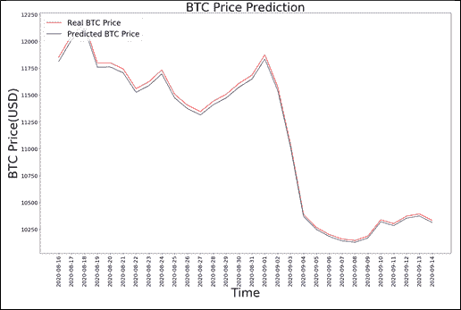

# 第九章：循环神经网络

**循环神经网络**（**RNN**）是建模顺序数据的现代主要方法。架构类名中的“循环”一词指的是当前步骤的输出成为下一步的输入（可能还会作为后续步骤的输入）。在序列中的每个元素上，模型都会同时考虑当前的输入和它对前面元素的“记忆”。

**自然语言处理**（**NLP**）任务是 RNN 的主要应用领域之一：如果你正在阅读这一句，你就是通过前面出现的词来理解每个词的上下文。基于 RNN 的 NLP 模型可以利用这种方式实现生成任务，如新文本创作，也可以完成预测任务，如情感分类或机器翻译。

在本章中，我们将涵盖以下主题：

+   文本生成

+   情感分类

+   时间序列 – 股票价格预测

+   开放领域问答

我们要处理的第一个主题是文本生成：它很容易演示我们如何使用 RNN 生成新内容，因此可以作为一个温和的 RNN 入门。

# 文本生成

演示 RNN 强大功能的最著名应用之一是生成新文本（我们将在稍后的 Transformer 架构章节中回到这个应用）。

在这个实例中，我们将使用**长短期记忆**（**LSTM**）架构——一种流行的 RNN 变体——来构建文本生成模型。LSTM 这个名字来源于它们开发的动机：传统的 RNN 在处理长依赖关系时会遇到困难（即所谓的梯度消失问题），而 LSTM 通过其架构解决了这一问题。LSTM 模型通过维持一个单元状态和一个“携带”信息来确保信号（以梯度的形式）在序列处理时不会丢失。在每个时间步，LSTM 模型会联合考虑当前的单词、携带的信息和单元状态。

这个主题本身并不简单，但出于实际应用考虑，完全理解结构设计并非必需。只需记住，LSTM 单元允许将过去的信息在稍后的时间点重新注入。

我们将使用纽约时报评论和标题数据集（[`www.kaggle.com/aashita/nyt-comments`](https://www.kaggle.com/aashita/nyt-comments)）来训练我们的模型，并利用它生成新的标题。我们选择这个数据集是因为它的中等规模（该方法不需要强大的工作站即可复现）和易获取性（Kaggle 是免费开放的，而一些数据源只能通过付费墙访问）。

## 如何实现...

和往常一样，首先我们导入必要的包。

```py
import tensorflow as tf
from tensorflow import keras 
# keras module for building LSTM 
from keras.preprocessing.sequence import pad_sequences
from keras.layers import Embedding, LSTM, Dense
from keras.preprocessing.text import Tokenizer
from keras.callbacks import EarlyStopping
from keras.models import Sequential
import keras.utils as ku 
```

我们希望确保我们的结果是可复现的——由于 Python 深度学习生态系统内的相互依赖关系，我们需要初始化多个随机机制。

```py
import pandas as pd
import string, os 
import warnings
warnings.filterwarnings("ignore")
warnings.simplefilter(action='ignore', category=FutureWarning) 
```

下一步是从 Keras 本身导入必要的功能：

```py
from keras.preprocessing.sequence import pad_sequences
from keras.layers import Embedding, LSTM, Dense
from keras.preprocessing.text import Tokenizer
from keras.callbacks import EarlyStopping
from keras.models import Sequential
import keras.utils as ku 
```

最后，通常来说，定制化代码执行过程中显示的警告级别是方便的——尽管这未必总是符合纯粹主义者的最佳实践标准——这主要是为了处理围绕给 DataFrame 子集分配值的普遍警告：在当前环境下，清晰展示代码比遵守生产环境中的编码标准更为重要：

```py
import warnings
warnings.filterwarnings("ignore")
warnings.simplefilter(action='ignore', category=FutureWarning) 
```

我们将定义一些函数，以便后续简化代码。首先，让我们清理文本：

```py
def clean_text(txt):
    txt = "".join(v for v in txt if v not in string.punctuation).lower()
    txt = txt.encode("utf8").decode("ascii",'ignore')
    return txt 
```

我们将使用一个封装器，围绕内置的 TensorFlow 分词器，操作如下：

```py
def get_sequence_of_tokens(corpus):
    ## tokenization
    tokenizer.fit_on_texts(corpus)
    total_words = len(tokenizer.word_index) + 1

    ## convert data to sequence of tokens 
    input_sequences = []
    for line in corpus:
        token_list = tokenizer.texts_to_sequences([line])[0]
        for i in range(1, len(token_list)):
            n_gram_sequence = token_list[:i+1]
            input_sequences.append(n_gram_sequence)
    return input_sequences, total_words 
```

一个常用的步骤是将模型构建步骤封装到函数中：

```py
def create_model(max_sequence_len, total_words):
    input_len = max_sequence_len - 1
    model = Sequential()

    model.add(Embedding(total_words, 10, input_length=input_len))
    model.add(LSTM(100))
    model.add(Dense(total_words, activation='softmax'))
    model.compile(loss='categorical_crossentropy', optimizer='adam')

    return model 
```

以下是对序列进行填充的一些模板代码（在实际应用中，这部分的作用会变得更加清晰）：

```py
def generate_padded_sequences(input_sequences):
    max_sequence_len = max([len(x) for x in input_sequences])
    input_sequences = np.array(pad_sequences(input_sequences,                       maxlen=max_sequence_len, padding='pre'))

    predictors, label = input_sequences[:,:-1],input_sequences[:,-1]
    label = ku.to_categorical(label, num_classes=total_words)
    return predictors, label, max_sequence_len 
```

最后，我们创建一个函数，用来从已拟合的模型生成文本：

```py
def generate_text(seed_text, next_words, model, max_sequence_len):
    for _ in range(next_words):
        token_list = tokenizer.texts_to_sequences([seed_text])[0]
        token_list = pad_sequences([token_list],                      maxlen=max_sequence_len-1, padding='pre')
        predicted = model.predict_classes(token_list, verbose=0)

        output_word = ""
        for word,index in tokenizer.word_index.items():
            if index == predicted:
                output_word = word
                break
        seed_text += " "+output_word
    return seed_text.title() 
```

下一步是加载我们的数据集（`break` 子句作为快速方法，只选择文章数据集，而不包括评论数据集）：

```py
curr_dir = '../input/'
all_headlines = []
for filename in os.listdir(curr_dir):
    if 'Articles' in filename:
        article_df = pd.read_csv(curr_dir + filename)
        all_headlines.extend(list(article_df.headline.values))
        break
all_headlines[:10] 
```

我们可以按如下方式检查前几个元素：

```py
['The Opioid Crisis Foretold',
 'The Business Deals That Could Imperil Trump',
 'Adapting to American Decline',
 'The Republicans' Big Senate Mess',
 'States Are Doing What Scott Pruitt Won't',
 'Fake Pearls, Real Heart',
 'Fear Beyond Starbucks',
 'Variety: Puns and Anagrams',
 'E.P.A. Chief's Ethics Woes Have Echoes in His Past',
 'Where Facebook Rumors Fuel Thirst for Revenge'] 
```

正如现实中大多数文本数据的情况一样，我们需要清理输入文本。为了简单起见，我们仅进行基础的预处理：去除标点符号并将所有单词转换为小写：

```py
corpus = [clean_text(x) for x in all_headlines] 
```

清理操作后，前 10 行的数据如下所示：

```py
corpus[:10]
['the opioid crisis foretold',
 'the business deals that could imperil trump',
 'adapting to american decline',
 'the republicans big senate mess',
 'states are doing what scott pruitt wont',
 'fake pearls real heart',
 'fear beyond starbucks',
 'variety puns and anagrams',
 'epa chiefs ethics woes have echoes in his past',
 'where facebook rumors fuel thirst for revenge'] 
```

下一步是分词。语言模型要求输入数据以序列的形式呈现——给定一个由单词（词元）组成的序列，生成任务的关键在于预测上下文中下一个最可能的词元。我们可以利用 Keras 的 `preprocessing` 模块中内置的分词器。

清理后，我们对输入文本进行分词：这是从语料库中提取单独词元（单词或术语）的过程。我们利用内置的分词器来提取词元及其相应的索引。每个文档都会转化为一系列词元：

```py
tokenizer = Tokenizer()
inp_sequences, total_words = get_sequence_of_tokens(corpus)
inp_sequences[:10]
[[1, 708],
 [1, 708, 251],
 [1, 708, 251, 369],
 [1, 370],
 [1, 370, 709],
 [1, 370, 709, 29],
 [1, 370, 709, 29, 136],
 [1, 370, 709, 29, 136, 710],
 [1, 370, 709, 29, 136, 710, 10],
 [711, 5]] 
```

像 `[1,708]`、`[1,708, 251]` 这样的向量表示从输入数据生成的 n-grams，其中整数是该词元在从语料库生成的总体词汇表中的索引。

我们已经将数据集转化为由词元序列组成的格式——这些序列的长度可能不同。有两种选择：使用 RaggedTensors（这在用法上稍微复杂一些）或者将序列长度统一，以符合大多数 RNN 模型的标准要求。为了简化展示，我们选择后者方案：使用 `pad_sequence` 函数填充短于阈值的序列。这一步与将数据格式化为预测值和标签的步骤容易结合：

```py
predictors, label, max_sequence_len =                              generate_padded_sequences(inp_sequences) 
```

我们利用简单的 LSTM 架构，使用 Sequential API：

1.  输入层：接收分词后的序列

1.  LSTM 层：使用 LSTM 单元生成输出——为了演示，我们默认取 100 作为值，但此参数（以及其他多个参数）是可定制的

1.  Dropout 层：我们对 LSTM 输出进行正则化，以减少过拟合的风险

1.  输出层：生成最可能的输出标记：

    ```py
    model = create_model(max_sequence_len, total_words)
    model.summary()
    _________________________________________________________________
    Layer (type)                 Output Shape              Param #   
    =================================================================
    embedding_1 (Embedding)      (None, 23, 10)            31340     
    _________________________________________________________________
    lstm_1 (LSTM)                (None, 100)               44400     
    _________________________________________________________________
    dense_1 (Dense)              (None, 3134)              316534    
    =================================================================
    Total params: 392,274
    Trainable params: 392,274
    Non-trainable params: 0
    _________________________________________________________________ 
    ```

现在我们可以使用标准的 Keras 语法训练我们的模型：

```py
model.fit(predictors, label, epochs=100, verbose=2) 
```

现在我们有了一个拟合的模型，我们可以检查其性能：基于种子文本，我们的 LSTM 生成的标题有多好？我们通过对种子文本进行分词、填充序列，并将其传入模型来获得预测结果：

```py
print (generate_text("united states", 5, model, max_sequence_len))
United States Shouldnt Sit Still An Atlantic
print (generate_text("president trump", 5, model, max_sequence_len))
President Trump Vs Congress Bird Moving One
print (generate_text("joe biden", 8, model, max_sequence_len))
Joe Biden Infuses The Constitution Invaded Canada Unique Memorial Award
print (generate_text("india and china", 8, model, max_sequence_len))
India And China Deal And The Young Think Again To It
print (generate_text("european union", 4, model, max_sequence_len))
European Union Infuses The Constitution Invaded 
```

正如你所看到的，即使使用相对简单的设置（一个中等大小的数据集和一个基础模型），我们也能生成看起来相当真实的文本。当然，进一步的微调将允许生成更复杂的内容，这将是我们在*第十章*中讨论的内容，*Transformers*。

## 另见

网上有多个优秀的资源可以学习 RNN：

+   要了解一个很好的介绍——并且有很棒的例子——请参阅 Andrej Karpathy 的文章：[`karpathy.github.io/2015/05/21/rnn-effectiveness/`](http://karpathy.github.io/2015/05/21/rnn-effectiveness/)

+   可以在 [`github.com/kjw0612/awesome-rnn`](https://github.com/kjw0612/awesome-rnn) 找到一个精选资源列表（教程、代码库）

+   另一个很好的介绍可以在 [`medium.com/@humble_bee/rnn-recurrent-neural-networks-lstm-842ba7205bbf`](https://medium.com/@humble_bee/rnn-recurrent-neural-networks-lstm-842ba7205bbf) 找到

# 情感分类

自然语言处理（NLP）中的一个常见任务是情感分类：根据文本片段的内容，识别其中表达的情感。实际应用包括评论分析、调查回复、社交媒体评论或健康护理材料。

我们将在 [`www-cs.stanford.edu/people/alecmgo/papers/TwitterDistantSupervision09.pdf`](https://www-cs.stanford.edu/people/alecmgo/papers/TwitterDistantSupervision09.pdf) 中介绍的 Sentiment140 数据集上训练我们的网络，该数据集包含 160 万条带有三类标注的推文：负面、中立和正面。为了避免本地化问题，我们对编码进行标准化（最好从控制台级别进行，而不是在笔记本内进行）。逻辑如下：原始数据集包含原始文本，这些文本——由于其固有性质——可能包含非标准字符（例如，表情符号，这在社交媒体通信中显然很常见）。我们希望将文本转换为 UTF8——这是英语 NLP 的事实标准。最快的方法是使用 Linux 命令行功能：

+   `Iconv` 是一个标准的工具，用于在编码之间进行转换

+   `-f` 和 `-t` 标志分别表示输入编码和目标编码

+   `-o` 指定输出文件：

```py
iconv -f LATIN1 -t UTF8 training.1600000.processed.noemoticon.csv -o training_cleaned.csv 
```

## 如何实现...

我们首先按如下方式导入必要的包：

```py
import json
import tensorflow as tf
import csv
import random
import numpy as np
import pandas as pd
import matplotlib.pyplot as plt
from tensorflow.keras.preprocessing.text import Tokenizer
from tensorflow.keras.preprocessing.sequence import pad_sequences
from tensorflow.keras.utils import to_categorical
from tensorflow.keras import regularizers 
```

接下来，我们定义模型的超参数：

+   嵌入维度是我们将使用的词嵌入的大小。在本食谱中，我们将使用 GloVe：一种无监督学习算法，基于维基百科和 Gigaword 的合并语料库的词共现统计信息进行训练。得到的（英文）单词向量为我们提供了有效的文本表示方式，通常称为嵌入。

+   `max_length`和`padding_type`是指定如何填充序列的参数（见前面的食谱）。

+   `training_size`指定了目标语料库的大小。

+   `test_portion`定义了我们将作为保留数据使用的数据比例。

+   `dropout_val`和`nof_units`是模型的超参数：

```py
embedding_dim = 100
max_length = 16
trunc_type='post'
padding_type='post'
oov_tok = "<OOV>"
training_size=160000
test_portion=.1
num_epochs = 50
dropout_val = 0.2
nof_units = 64 
```

让我们将模型创建步骤封装成一个函数。我们为我们的分类任务定义了一个相当简单的模型——一个嵌入层，后接正则化、卷积、池化，再加上 RNN 层：

```py
def create_model(dropout_val, nof_units):

    model = tf.keras.Sequential([
    tf.keras.layers.Embedding(vocab_size+1, embedding_dim, input_length=max_length, weights=[embeddings_matrix], trainable=False),
    tf.keras.layers.Dropout(dropout_val),
    tf.keras.layers.Conv1D(64, 5, activation='relu'),
    tf.keras.layers.MaxPooling1D(pool_size=4),
    tf.keras.layers.LSTM(nof_units),
    tf.keras.layers.Dense(1, activation='sigmoid')
    ])
    model.compile(loss='binary_crossentropy',optimizer='adam',                  metrics=['accuracy'])
    return model 
```

收集我们将用于训练的语料库内容：

```py
num_sentences = 0
with open("../input/twitter-sentiment-clean-dataset/training_cleaned.csv") as csvfile:
    reader = csv.reader(csvfile, delimiter=',')
    for row in reader:
        list_item=[]
        list_item.append(row[5])
        this_label=row[0]
        if this_label=='0':
            list_item.append(0)
        else:
            list_item.append(1)
        num_sentences = num_sentences + 1
        corpus.append(list_item) 
```

转换为句子格式：

```py
sentences=[]
labels=[]
random.shuffle(corpus)
for x in range(training_size):
    sentences.append(corpus[x][0])
    labels.append(corpus[x][1])
    Tokenize the sentences:
tokenizer = Tokenizer()
tokenizer.fit_on_texts(sentences)
word_index = tokenizer.word_index
vocab_size = len(word_index)
sequences = tokenizer.texts_to_sequences(sentences) 
```

使用填充规范化句子长度（见前一节）：

```py
padded = pad_sequences(sequences, maxlen=max_length, padding=padding_type, truncating=trunc_type) 
```

将数据集划分为训练集和保留集：

```py
split = int(test_portion * training_size)
test_sequences = padded[0:split]
training_sequences = padded[split:training_size]
test_labels = labels[0:split]
training_labels = labels[split:training_size] 
```

在使用基于 RNN 的模型进行 NLP 应用时，一个关键步骤是`embeddings`矩阵：

```py
embeddings_index = {};
with open('../input/glove6b/glove.6B.100d.txt') as f:
    for line in f:
        values = line.split();
        word = values[0];
        coefs = np.asarray(values[1:], dtype='float32');
        embeddings_index[word] = coefs;
embeddings_matrix = np.zeros((vocab_size+1, embedding_dim));
for word, i in word_index.items():
    embedding_vector = embeddings_index.get(word);
    if embedding_vector is not None:
        embeddings_matrix[i] = embedding_vector; 
```

在所有准备工作完成后，我们可以设置模型：

```py
model = create_model(dropout_val, nof_units)
model.summary()
Model: "sequential"
_________________________________________________________________
Layer (type)                 Output Shape              Param #   
=================================================================
embedding (Embedding)        (None, 16, 100)           13877100  
_________________________________________________________________
dropout (Dropout)            (None, 16, 100)           0         
_________________________________________________________________
conv1d (Conv1D)              (None, 12, 64)            32064     
_________________________________________________________________
max_pooling1d (MaxPooling1D) (None, 3, 64)             0         
_________________________________________________________________
lstm (LSTM)                  (None, 64)                33024     
_________________________________________________________________
dense (Dense)                (None, 1)                 65        
=================================================================
Total params: 13,942,253
Trainable params: 65,153
Non-trainable params: 13,877,100
_________________________________________________________________ 
```

训练按常规方式进行：

```py
num_epochs = 50
history = model.fit(training_sequences, training_labels, epochs=num_epochs, validation_data=(test_sequences, test_labels), verbose=2)
Train on 144000 samples, validate on 16000 samples
Epoch 1/50
144000/144000 - 47s - loss: 0.5685 - acc: 0.6981 - val_loss: 0.5454 - val_acc: 0.7142
Epoch 2/50
144000/144000 - 44s - loss: 0.5296 - acc: 0.7289 - val_loss: 0.5101 - val_acc: 0.7419
Epoch 3/50
144000/144000 - 42s - loss: 0.5130 - acc: 0.7419 - val_loss: 0.5044 - val_acc: 0.7481
Epoch 4/50
144000/144000 - 42s - loss: 0.5017 - acc: 0.7503 - val_loss: 0.5134 - val_acc: 0.7421
Epoch 5/50
144000/144000 - 42s - loss: 0.4921 - acc: 0.7563 - val_loss: 0.5025 - val_acc: 0.7518
Epoch 6/50
144000/144000 - 42s - loss: 0.4856 - acc: 0.7603 - val_loss: 0.5003 - val_acc: 0.7509 
```

我们还可以通过可视化来评估模型的质量：

```py
acc = history.history['acc']
val_acc = history.history['val_acc']
loss = history.history['loss']
val_loss = history.history['val_loss']
epochs = range(len(acc))
plt.plot(epochs, acc, 'r', label='Training accuracy')
plt.plot(epochs, val_acc, 'b', label='Validation accuracy')
plt.title('Training and validation accuracy')
plt.legend()
plt.figure()
plt.plot(epochs, loss, 'r', label='Training Loss')
plt.plot(epochs, val_loss, 'b', label='Validation Loss')
plt.title('Training and validation loss')
plt.legend()
plt.show() 
```


图 9.1：训练准确率与验证准确率随训练轮次变化


图 9.2：训练损失与验证损失随训练轮次变化

正如我们从两个图表中看到的，模型在有限的训练轮次后已经取得了不错的表现，并且在此之后稳定下来，只有少量波动。潜在的改进包括早停法，并扩大数据集的规模。

## 另见

有兴趣了解 RNN 在情感分类中的应用的读者可以查阅以下资源：

+   TensorFlow 文档教程：[`www.tensorflow.org/tutorials/text/text_classification_rnn`](https://www.tensorflow.org/tutorials/text/text_classification_rnn)

+   [`link.springer.com/chapter/10.1007/978-3-030-28364-3_49`](https://link.springer.com/chapter/10.1007/978-3-030-28364-3_49) 是众多展示将 RNN 应用于情感检测的文章之一，其中包含了大量的参考文献。

+   GloVe 文档可以在 [`nlp.stanford.edu/projects/glove/`](https://nlp.stanford.edu/projects/glove/) 找到

# 股票价格预测

像 RNN 这样的顺序模型非常适合时间序列预测——其中一个最为宣传的应用是金融数量的预测，尤其是不同金融工具的价格预测。在本食谱中，我们展示了如何将 LSTM 应用于时间序列预测问题。我们将重点关注比特币的价格——最受欢迎的加密货币。

需要说明的是：这是一个基于流行数据集的演示示例。它并不打算作为任何形式的投资建议；建立一个在金融领域适用的可靠时间序列预测模型是一项具有挑战性的工作，超出了本书的范围。

## 如何做...

我们首先导入必要的包：

```py
import numpy as np 
import pandas as pd 
from matplotlib import pyplot as plt
from keras.models import Sequential
from keras.layers import Dense
from keras.layers import LSTM
from sklearn.preprocessing import MinMaxScaler 
```

我们任务的通用参数是预测的未来范围和网络的超参数：

```py
prediction_days = 30
nof_units =4 
```

如前所述，我们将把模型创建步骤封装到一个函数中。它接受一个参数`units`，该参数是 LSTM 内单元的维度：

```py
def create_model(nunits):
    # Initialising the RNN
    regressor = Sequential()
    # Adding the input layer and the LSTM layer
    regressor.add(LSTM(units = nunits, activation = 'sigmoid', input_shape = (None, 1)))
    # Adding the output layer
    regressor.add(Dense(units = 1))
    # Compiling the RNN
    regressor.compile(optimizer = 'adam', loss = 'mean_squared_error')

    return regressor 
```

现在我们可以开始加载数据，并采用常见的时间戳格式。为了演示的目的，我们将预测每日平均价格——因此需要进行分组操作：

```py
# Import the dataset and encode the date
df = pd.read_csv("../input/bitcoin-historical-data/bitstampUSD_1-min_data_2012-01-01_to_2020-09-14.csv")
df['date'] = pd.to_datetime(df['Timestamp'],unit='s').dt.date
group = df.groupby('date')
Real_Price = group['Weighted_Price'].mean() 
```

下一步是将数据分为训练期和测试期：

```py
df_train= Real_Price[:len(Real_Price)-prediction_days]
df_test= Real_Price[len(Real_Price)-prediction_days:] 
```

理论上可以避免预处理，但在实践中它有助于加速收敛：

```py
training_set = df_train.values
training_set = np.reshape(training_set, (len(training_set), 1))
sc = MinMaxScaler()
training_set = sc.fit_transform(training_set)
X_train = training_set[0:len(training_set)-1]
y_train = training_set[1:len(training_set)]
X_train = np.reshape(X_train, (len(X_train), 1, 1)) 
```

拟合模型非常简单：

```py
regressor = create_model(nunits = nof_unit)
regressor.fit(X_train, y_train, batch_size = 5, epochs = 100)
Epoch 1/100
3147/3147 [==============================] - 6s 2ms/step - loss: 0.0319
Epoch 2/100
3147/3147 [==============================] - 3s 928us/step - loss: 0.0198
Epoch 3/100
3147/3147 [==============================] - 3s 985us/step - loss: 0.0089
Epoch 4/100
3147/3147 [==============================] - 3s 1ms/step - loss: 0.0023
Epoch 5/100
3147/3147 [==============================] - 3s 886us/step - loss: 3.3583e-04
Epoch 6/100
3147/3147 [==============================] - 3s 957us/step - loss: 1.0990e-04
Epoch 7/100
3147/3147 [==============================] - 3s 830us/step - loss: 1.0374e-04
Epoch 8/100 
```

通过拟合模型，我们可以在预测范围内生成一个预测，记得要反转我们的标准化处理，以便将值还原到原始尺度：

```py
test_set = df_test.values
inputs = np.reshape(test_set, (len(test_set), 1))
inputs = sc.transform(inputs)
inputs = np.reshape(inputs, (len(inputs), 1, 1))
predicted_BTC_price = regressor.predict(inputs)
predicted_BTC_price = sc.inverse_transform(predicted_BTC_price) 
```

这是我们预测结果的样子：

```py
plt.figure(figsize=(25,15), dpi=80, facecolor='w', edgecolor='k')
ax = plt.gca()  
plt.plot(test_set, color = 'red', label = 'Real BTC Price')
plt.plot(predicted_BTC_price, color = 'blue', label = 'Predicted BTC Price')
plt.title('BTC Price Prediction', fontsize=40)
df_test = df_test.reset_index()
x=df_test.index
labels = df_test['date']
plt.xticks(x, labels, rotation = 'vertical')
for tick in ax.xaxis.get_major_ticks():
    tick.label1.set_fontsize(18)
for tick in ax.yaxis.get_major_ticks():
    tick.label1.set_fontsize(18)
plt.xlabel('Time', fontsize=40)
plt.ylabel('BTC Price(USD)', fontsize=40)
plt.legend(loc=2, prop={'size': 25})
plt.show() 
```



图 9.3：实际价格和预测价格随时间变化

总体而言，很明显，即使是一个简单的模型也能生成合理的预测——但有一个重要的警告：这种方法仅在环境保持稳定的情况下有效，即过去和现在的值之间的关系随着时间的推移保持稳定。如果出现体制变化或突发干预，价格可能会受到显著影响，例如，如果某个主要司法管辖区限制了加密货币的使用（正如过去十年所发生的情况）。这种情况可以建模，但需要更复杂的特征工程方法，并且超出了本章的范围。

# 开放领域问答

**问答**（**QA**）系统旨在模拟人类在网上搜索信息的过程，并通过机器学习方法提高提供答案的准确性。在这个示例中，我们将演示如何使用 RNN 预测关于维基百科文章的长短答案。我们将使用 Google 的自然问题数据集，并且在[`ai.google.com/research/NaturalQuestions/visualization`](https://ai.google.com/research/NaturalQuestions/visualization)上可以找到一个非常好的可视化工具，帮助理解 QA 背后的思想。

基本思想可以总结如下：对于每一对文章-问题对，你必须预测/选择从*文章中直接提取*的长答案和短答案：

+   长答案是指回答问题的较长一段文字——通常是几句话或一段话。

+   简短的回答可能是一个句子或短语，甚至在某些情况下是简单的 YES/NO。简短的答案总是包含在或作为某个合理长答案的子集。

+   给定的文章可以（并且通常会）允许长*和*短答案，具体取决于问题。

本章所展示的配方改编自 Xing Han Lu 公开的代码：[`www.kaggle.com/xhlulu`](https://www.kaggle.com/xhlulu)。

## 如何做...

正如往常一样，我们首先加载必要的包。这次我们使用 fasttext 嵌入来表示（可以从[`fasttext.cc/`](https://fasttext.cc/)获取）。其他流行的选择包括 GloVe（在情感分析部分使用）和 ELMo（[`allennlp.org/elmo`](https://allennlp.org/elmo)）。在 NLP 任务的性能方面没有明显的优劣之分，所以我们会根据需要切换选择，以展示不同的可能性：

```py
import os
import json
import gc
import pickle
import numpy as np
import pandas as pd
from tqdm import tqdm_notebook as tqdm
from tensorflow.keras.models import Model
from tensorflow.keras.layers import Input, Dense, Embedding, SpatialDropout1D, concatenate, Masking
from tensorflow.keras.layers import LSTM, Bidirectional, GlobalMaxPooling1D, Dropout
from tensorflow.keras.preprocessing import text, sequence
from tqdm import tqdm_notebook as tqdm
import fasttext
from tensorflow.keras.models import load_model 
```

一般设置如下：

```py
embedding_path = '/kaggle/input/fasttext-crawl-300d-2m-with-subword/crawl-300d-2m-subword/crawl-300d-2M-subword.bin' 
```

我们的下一步是添加一些样板代码，以便之后简化代码流。由于当前任务比之前的任务稍微复杂一些（或不太直观），我们将更多的准备工作封装在数据集构建函数中。由于数据集的大小，我们仅加载训练数据的一个子集，并从中采样带有负标签的数据：

```py
def build_train(train_path, n_rows=200000, sampling_rate=15):
    with open(train_path) as f:
        processed_rows = []
        for i in tqdm(range(n_rows)):
            line = f.readline()
            if not line:
                break
            line = json.loads(line)
            text = line['document_text'].split(' ')
            question = line['question_text']
            annotations = line['annotations'][0]
            for i, candidate in enumerate(line['long_answer_candidates']):
                label = i == annotations['long_answer']['candidate_index']
                start = candidate['start_token']
                end = candidate['end_token']
                if label or (i % sampling_rate == 0):
                    processed_rows.append({
                        'text': " ".join(text[start:end]),
                        'is_long_answer': label,
                        'question': question,
                        'annotation_id': annotations['annotation_id']
                    })
        train = pd.DataFrame(processed_rows)

        return train
def build_test(test_path):
    with open(test_path) as f:
        processed_rows = []
        for line in tqdm(f):
            line = json.loads(line)
            text = line['document_text'].split(' ')
            question = line['question_text']
            example_id = line['example_id']
            for candidate in line['long_answer_candidates']:
                start = candidate['start_token']
                end = candidate['end_token']
                processed_rows.append({
                    'text': " ".join(text[start:end]),
                    'question': question,
                    'example_id': example_id,
                    'sequence': f'{start}:{end}'
                })
        test = pd.DataFrame(processed_rows)

    return test 
```

使用下一个函数，我们训练一个 Keras tokenizer，将文本和问题编码成整数列表（分词），然后将它们填充到固定长度，形成一个用于文本的单一 NumPy 数组，另一个用于问题：

```py
def compute_text_and_questions(train, test, tokenizer):
    train_text = tokenizer.texts_to_sequences(train.text.values)
    train_questions = tokenizer.texts_to_sequences(train.question.values)
    test_text = tokenizer.texts_to_sequences(test.text.values)
    test_questions = tokenizer.texts_to_sequences(test.question.values)

    train_text = sequence.pad_sequences(train_text, maxlen=300)
    train_questions = sequence.pad_sequences(train_questions)
    test_text = sequence.pad_sequences(test_text, maxlen=300)
    test_questions = sequence.pad_sequences(test_questions)

    return train_text, train_questions, test_text, test_questions 
```

与基于 RNN 的 NLP 模型一样，我们需要一个嵌入矩阵：

```py
def build_embedding_matrix(tokenizer, path):
    embedding_matrix = np.zeros((tokenizer.num_words + 1, 300))
    ft_model = fasttext.load_model(path)
    for word, i in tokenizer.word_index.items():
        if i >= tokenizer.num_words - 1:
            break
        embedding_matrix[i] = ft_model.get_word_vector(word)

    return embedding_matrix 
```

接下来是我们的模型构建步骤，用一个函数包装起来：

1.  我们构建了两个 2 层的双向 LSTM，一个用于读取问题，另一个用于读取文本。

1.  我们将输出连接起来，并将其传递到一个全连接层：

1.  我们在输出上使用 sigmoid：

```py
def build_model(embedding_matrix):
    embedding = Embedding(
        *embedding_matrix.shape, 
        weights=[embedding_matrix], 
        trainable=False, 
        mask_zero=True
    )

    q_in = Input(shape=(None,))
    q = embedding(q_in)
    q = SpatialDropout1D(0.2)(q)
    q = Bidirectional(LSTM(100, return_sequences=True))(q)
    q = GlobalMaxPooling1D()(q)

    t_in = Input(shape=(None,))
    t = embedding(t_in)
    t = SpatialDropout1D(0.2)(t)
    t = Bidirectional(LSTM(150, return_sequences=True))(t)
    t = GlobalMaxPooling1D()(t)

    hidden = concatenate([q, t])
    hidden = Dense(300, activation='relu')(hidden)
    hidden = Dropout(0.5)(hidden)
    hidden = Dense(300, activation='relu')(hidden)
    hidden = Dropout(0.5)(hidden)

    out1 = Dense(1, activation='sigmoid')(hidden)

    model = Model(inputs=[t_in, q_in], outputs=out1)
    model.compile(loss='binary_crossentropy', optimizer='adam')
    return model 
```

使用我们定义的工具包，我们可以构建数据集，具体如下：

```py
directory = '../input/tensorflow2-question-answering/'
train_path = directory + 'simplified-nq-train.jsonl'
test_path = directory + 'simplified-nq-test.jsonl'
train = build_train(train_path)
test = build_test(test_path) 
```

这就是数据集的样子：

```py
train.head() 
```


```py
tokenizer = text.Tokenizer(lower=False, num_words=80000)
for text in tqdm([train.text, test.text, train.question, test.question]):
    tokenizer.fit_on_texts(text.values)
train_target = train.is_long_answer.astype(int).values
train_text, train_questions, test_text, test_questions = compute_text_and_questions(train, test, tokenizer)
del train 
```

现在我们可以构建模型本身：

```py
embedding_matrix = build_embedding_matrix(tokenizer, embedding_path)
model = build_model(embedding_matrix)
model.summary()
Model: "functional_1"
__________________________________________________________________________________________________
Layer (type)                    Output Shape         Param #     Connected to                     
==================================================================================================
input_1 (InputLayer)            [(None, None)]       0                                            
__________________________________________________________________________________________________
input_2 (InputLayer)            [(None, None)]       0                                            
__________________________________________________________________________________________________
embedding (Embedding)           (None, None, 300)    24000300    input_1[0][0]                    
                                                                 input_2[0][0]                    
__________________________________________________________________________________________________
spatial_dropout1d (SpatialDropo (None, None, 300)    0           embedding[0][0]                  
__________________________________________________________________________________________________
spatial_dropout1d_1 (SpatialDro (None, None, 300)    0           embedding[1][0]                  
__________________________________________________________________________________________________
bidirectional (Bidirectional)   (None, None, 200)    320800      spatial_dropout1d[0][0]          
__________________________________________________________________________________________________
bidirectional_1 (Bidirectional) (None, None, 300)    541200      spatial_dropout1d_1[0][0]        
__________________________________________________________________________________________________
global_max_pooling1d (GlobalMax (None, 200)          0           bidirectional[0][0]              
__________________________________________________________________________________________________
global_max_pooling1d_1 (GlobalM (None, 300)          0           bidirectional_1[0][0]            
__________________________________________________________________________________________________
concatenate (Concatenate)       (None, 500)          0           global_max_pooling1d[0][0]       
                                                                 global_max_pooling1d_1[0][0]     
__________________________________________________________________________________________________
dense (Dense)                   (None, 300)          150300      concatenate[0][0]                
__________________________________________________________________________________________________
dropout (Dropout)               (None, 300)          0           dense[0][0]                      
__________________________________________________________________________________________________
dense_1 (Dense)                 (None, 300)          90300       dropout[0][0]                    
__________________________________________________________________________________________________
dropout_1 (Dropout)             (None, 300)          0           dense_1[0][0]                    
__________________________________________________________________________________________________
dense_2 (Dense)                 (None, 1)            301         dropout_1[0][0]                  
==================================================================================================
Total params: 25,103,201
Trainable params: 1,102,901
Non-trainable params: 24,000,300
__________________________________________________________________________________________________ 
```

接下来的步骤是拟合，按照通常的方式进行：

```py
train_history = model.fit(
    [train_text, train_questions], 
    train_target,
    epochs=2,
    validation_split=0.2,
    batch_size=1024
) 
```

现在，我们可以构建一个测试集，来查看我们生成的答案：

```py
directory = '/kaggle/input/tensorflow2-question-answering/'
test_path = directory + 'simplified-nq-test.jsonl'
test = build_test(test_path)
submission = pd.read_csv("../input/tensorflow2-question-answering/sample_submission.csv")
test_text, test_questions = compute_text_and_questions(test, tokenizer) 
```

我们生成实际的预测：

```py
test_target = model.predict([test_text, test_questions], batch_size=512)
test['target'] = test_target
result = (
    test.query('target > 0.3')
    .groupby('example_id')
    .max()
    .reset_index()
    .loc[:, ['example_id', 'PredictionString']]
)
result.head() 
```


正如你所看到的，LSTM 使我们能够处理一些相当抽象的任务，比如回答不同类型的问题。这个配方的核心工作是在数据格式化为合适的输入格式，并在之后对结果进行后处理——实际的建模过程与前几章中的方法非常相似。

# 总结

在本章中，我们展示了 RNN 的不同功能。它们能够在一个统一的框架内处理多种具有顺序性任务（文本生成与分类、时间序列预测以及问答）。在下一章，我们将介绍 transformer：这一重要的架构类别使得在自然语言处理问题上取得了新的最先进成果。
