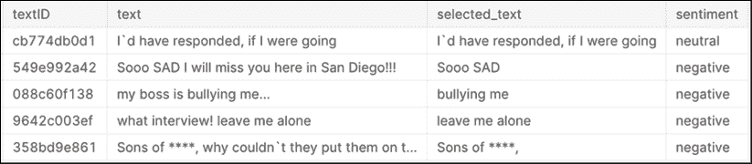
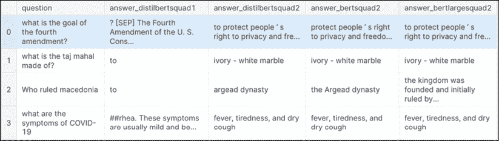

# 第十章：Transformers

Transformers 是 Google 在 2017 年提出的深度学习架构，旨在处理序列数据，用于下游任务，如翻译、问答或文本摘要。这样，它们旨在解决与*第九章*《*循环神经网络*》中讨论的 RNNs 类似的问题，但 Transformers 具有显著优势，因为它们不需要按顺序处理数据。除此之外，这使得更高程度的并行化成为可能，从而加速了训练过程。

由于其灵活性，Transformers 可以在大量未标记的数据上进行预训练，然后再针对其他任务进行微调。这些预训练模型的两大主要类型是**双向编码器表示的 Transformers**（**BERT**）和**生成预训练 Transformers**（**GPT**）。

在本章中，我们将涵盖以下主题：

+   文本生成

+   情感分析

+   文本分类：讽刺检测

+   问答

我们将首先展示 GPT-2 的文本生成能力——这是最受广大用户使用的 Transformers 架构之一。虽然情感分析也可以由 RNNs 处理（如前一章所示），但正是生成能力最能清晰地展示 Transformers 在自然语言处理中的影响。

# 文本生成

第一个 GPT 模型是在 2018 年由 OpenAI 的 Radford 等人发布的论文中介绍的——它展示了生成性语言模型如何通过在大量多样的连续文本语料库上进行预训练，获得知识并处理长程依赖关系。随后几年发布了两个继任模型（在更大语料库上训练）：2019 年的 GPT-2（15 亿参数）和 2020 年的 GPT-3（1750 亿参数）。为了在演示能力和计算需求之间取得平衡，我们将使用 GPT-2——截至本文编写时，GPT-3 的 API 访问受到限制。

我们将通过展示如何基于给定提示生成自己的文本，来开始使用 GPT-2 模型，而不进行任何微调。

## 我们该如何进行？

我们将利用由 Hugging Face 创建的优秀 Transformers 库（[`huggingface.co/`](https://huggingface.co/)）。它抽象了构建过程中的多个组件，使我们能够专注于模型性能和预期表现。

像往常一样，我们首先加载所需的包：

```py
#get deep learning basics
import tensorflow as tf 
```

Transformers 库的一个优势——也是其流行的原因之一——是我们可以轻松下载特定模型（并且还可以定义合适的分词器）：

```py
from transformers import TFGPT2LMHeadModel, GPT2Tokenizer
tokenizer = GPT2Tokenizer.from_pretrained("gpt2-large")
GPT2 = TFGPT2LMHeadModel.from_pretrained("gpt2-large", pad_token_id=tokenizer.eos_token_id) 
```

通常，固定随机种子是一个好主意，以确保结果的可重复性：

```py
# settings
#for reproducability
SEED = 34
tf.random.set_seed(SEED)
#maximum number of words in output text
MAX_LEN = 70 
```

有关 Transformer 中解码器架构的详细描述，请参阅本节末尾的*另见*部分——现在，我们将重点关注解码方式，它是使用 GPT-2 模型时最重要的决策之一。下面，我们将回顾一些可用的方法。

使用**贪心搜索**，预测具有最高概率的单词作为序列中的下一个单词：

```py
input_sequence = "There are times when I am really tired of people, but I feel lonely too." 
```

一旦我们有了输入序列，就将其编码，然后调用`decode`方法：

```py
# encode context the generation is conditioned on
input_ids = tokenizer.encode(input_sequence, return_tensors='tf')
# generate text until the output length (which includes the context length) reaches 70
greedy_output = GPT2.generate(input_ids, max_length = MAX_LEN)
print("Output:\n" + 100 * '-')
print(tokenizer.decode(greedy_output[0], skip_special_tokens = True))
Output:
----------------------------------------------------------------------------------------------------
There are times when I am really tired of people, but I feel lonely too. I feel like I'm alone in the world. I feel like I'm alone in my own body. I feel like I'm alone in my own mind. I feel like I'm alone in my own heart. I feel like I'm alone in my own mind 
```

如你所见，结果仍有改进空间：模型开始自我重复，因为高概率词汇掩盖了低概率词汇，使其无法探索更多样化的组合。

一种简单的解决方法是**束搜索**：我们跟踪备选变体，从而使得更多的比较成为可能：

```py
# set return_num_sequences > 1
beam_outputs = GPT2.generate(
    input_ids, 
    max_length = MAX_LEN, 
    num_beams = 5, 
    no_repeat_ngram_size = 2, 
    num_return_sequences = 5, 
    early_stopping = True
)
print('')
print("Output:\n" + 100 * '-')
# now we have 5 output sequences
for i, beam_output in enumerate(beam_outputs):
      print("{}: {}".format(i, tokenizer.decode(beam_output, skip_special_      tokens=True)))
Output:
----------------------------------------------------------------------------------------------------
0: There are times when I am really tired of people, but I feel lonely too. I don't know what to do with myself."
"I feel like I can't do anything right now," she said. "I'm so tired."
1: There are times when I am really tired of people, but I feel lonely too. I don't know what to do with myself."
"I feel like I can't do anything right now," she says. "I'm so tired."
2: There are times when I am really tired of people, but I feel lonely too. I don't know what to do with myself."
"I feel like I can't do anything right now," she says. "I'm not sure what I'm supposed to be doing with my life."
3: There are times when I am really tired of people, but I feel lonely too. I don''t know what to do with myself.""
"I feel like I can't do anything right now," she says. "I'm not sure what I'm supposed to be doing."
4: There are times when I am really tired of people, but I feel lonely too. I don't know what to do with myself."
"I feel like I can't do anything right now," she says. "I'm not sure what I should do." 
```

这确实更加多样化——信息相同，但至少从风格上来看，表达方式有所不同。

接下来，我们可以探索采样——不确定性解码。我们并不严格按照路径来找到具有最高概率的最终文本，而是根据条件概率分布随机选择下一个单词。这个方法有可能生成不连贯的胡言乱语，因此我们使用`temperature`参数，它会影响概率质量分布：

```py
# use temperature to decrease the sensitivity to low probability candidates
sample_output = GPT2.generate(
                             input_ids, 
                             do_sample = True, 
                             max_length = MAX_LEN, 
                             top_k = 0, 
                             temperature = 0.2
)
print("Output:\n" + 100 * '-')
print(tokenizer.decode(sample_output[0], skip_special_tokens = True))
Output:
----------------------------------------------------------------------------------------------------
There are times when I am really tired of people, but I feel lonely too. I feel like I'm alone in my own world. I feel like I'm alone in my own life. I feel like I'm alone in my own mind. I feel like I'm alone in my own heart. I feel like I'm alone in my own 
```

稍微有点诗意地说，若我们提高温度，会发生什么呢？

```py
sample_output = GPT2.generate(
                             input_ids, 
                             do_sample = True, 
                             max_length = MAX_LEN, 
                             top_k = 0, 
                             temperature = 0.8
)
print("Output:\n" + 100 * '-')
print(tokenizer.decode(sample_output[0], skip_special_tokens = True))
Output:
----------------------------------------------------------------------------------------------------
There are times when I am really tired of people, but I feel lonely too. I find it strange how the people around me seem to be always so nice. The only time I feel lonely is when I'm on the road. I can't be alone with my thoughts.
What are some of your favourite things to do in the area 
```

这变得更加有趣，尽管它仍然有点像思路流——这或许是可以预见的，考虑到我们提示词的内容。让我们探索更多调优输出的方法。

在**Top-K 采样**中，选择最有可能的前*k*个单词，并将整个概率质量转移到这*k*个单词上。因此，我们并不增加高概率词汇出现的机会或减少低概率词汇的机会，而是直接将低概率词汇完全移除：

```py
#sample from only top_k most likely words
sample_output = GPT2.generate(
                             input_ids, 
                             do_sample = True, 
                             max_length = MAX_LEN, 
                             top_k = 50
)
print("Output:\n" + 100 * '-')
print(tokenizer.decode(sample_output[0], skip_special_tokens = True), '...')
Output:
----------------------------------------------------------------------------------------------------
There are times when I am really tired of people, but I feel lonely too. I go to a place where you can feel comfortable. It's a place where you can relax. But if you're so tired of going along with the rules, maybe I won't go. You know what? Maybe if I don't go, you won''t ... 
```

这似乎是朝着正确方向迈出的步伐。我们能做得更好吗？

Top-P 采样（也叫做核采样）类似于 Top-K 采样，但不是选择最有可能的前*k*个单词，而是选择概率总和大于*p*的最小单词集合，然后将整个概率质量转移到该集合中的单词上。这里的主要区别是，Top-K 采样中，单词集合的大小是静态的（显然），而在 Top-P 采样中，集合的大小可以变化。要使用这种采样方法，我们只需设置`top_k = 0`并选择一个`top_p`值：

```py
#sample only from 80% most likely words
sample_output = GPT2.generate(
                             input_ids, 
                             do_sample = True, 
                             max_length = MAX_LEN, 
                             top_p = 0.8, 
                             top_k = 0
)
print("Output:\n" + 100 * '-')
print(tokenizer.decode(sample_output[0], skip_special_tokens = True), '...')
Output:
----------------------------------------------------------------------------------------------------
There are times when I am really tired of people, but I feel lonely too. I feel like I should just be standing there, just sitting there. I know I'm not a danger to anybody. I just feel alone." ... 
```

我们可以结合这两种方法：

```py
#combine both sampling techniques
sample_outputs = GPT2.generate(
                              input_ids,
                              do_sample = True, 
                              max_length = 2*MAX_LEN,                              #to test how long we can generate and it be coherent
                              #temperature = .7,
                              top_k = 50, 
                              top_p = 0.85, 
                              num_return_sequences = 5
)
print("Output:\n" + 100 * '-')
for i, sample_output in enumerate(sample_outputs):
    print("{}: {}...".format(i, tokenizer.decode(sample_output, skip_    special_tokens = True)))
    print('')
Output:
----------------------------------------------------------------------------------------------------
0: There are times when I am really tired of people, but I feel lonely too. I don't feel like I am being respected by my own country, which is why I am trying to change the government."
In a recent video posted to YouTube, Mr. Jaleel, dressed in a suit and tie, talks about his life in Pakistan and his frustration at his treatment by the country's law enforcement agencies. He also describes how he met a young woman from California who helped him organize the protest in Washington.
"She was a journalist who worked with a television channel in Pakistan," Mr. Jaleel says in the video. "She came to my home one day,...
1: There are times when I am really tired of people, but I feel lonely too. It's not that I don't like to be around other people, but it's just something I have to face sometimes.
What is your favorite thing to eat?
The most favorite thing I have eaten is chicken and waffles. But I love rice, soups, and even noodles. I also like to eat bread, but I like it a little bit less.
What is your ideal day of eating?
It varies every day. Sometimes I want to eat at home, because I'm in a house with my family. But then sometimes I just have to have some sort...
2: There are times when I am really tired of people, but I feel lonely too. I think that there is something in my heart that is trying to be a better person, but I don't know what that is."
So what can be done?
"I want people to take the time to think about this," says Jorja, who lives in a small town outside of Boston.
She has been thinking a lot about her depression. She wants to make a documentary about it, and she wants to start a blog about it.
"I want to make a video to be a support system for people who are going through the same thing I was going through...
3: There are times when I am really tired of people, but I feel lonely too.
I want to be able to take good care of myself. I am going to be a very good person, even if I am lonely.
So, if it's lonely, then I will be happy. I will be a person who will be able to have good care of myself.
I have made this wish.
What is my hope? What is my goal? I want to do my best to be able to meet it, but…
"Yuu, what are you saying, Yuu?"
"Uwa, what is it?"
I...
4: There are times when I am really tired of people, but I feel lonely too. The only person I really love is my family. It's just that I'm not alone."
-Juan, 24, a student
A study from the European Economic Area, a free trade area between the EU and Iceland, showed that there are 2.3 million EU citizens living in Iceland. Another survey in 2014 showed that 1.3 million people in Iceland were employed.
The government is committed to making Iceland a country where everyone can live and work.
"We are here to help, not to steal," said one of the people who drove up in a Volkswagen.
... 
```

显然，更复杂的方法设置可以给我们带来相当令人印象深刻的结果。让我们进一步探索这个方向——我们将使用从 OpenAI 的 GPT-2 网站上获取的提示词，并将其输入完整的 GPT-2 模型。这种对比将让我们了解本地（较小）模型与用于原始演示的大型模型之间的表现差异：

```py
MAX_LEN = 500
prompt1 = 'In a shocking finding, scientist discovered a herd of unicorns living in a remote, previously unexplored valley, in the Andes Mountains. Even more surprising to the researchers was the fact that the unicorns spoke perfect English.'
input_ids = tokenizer.encode(prompt1, return_tensors='tf')
sample_outputs = GPT2.generate(
                              input_ids,
                              do_sample = True, 
                              max_length = MAX_LEN,                              #to test how long we can generate and it be coherent
                              #temperature = .8,
                              top_k = 50, 
                              top_p = 0.85 
                              #num_return_sequences = 5
)
print("Output:\n" + 100 * '-')
for i, sample_output in enumerate(sample_outputs):
    print("{}: {}...".format(i, tokenizer.decode(sample_output, skip_    special_tokens = True)))
    print('')
Output:
----------------------------------------------------------------------------------------------------
0: In a shocking finding, scientist discovered a herd of unicorns living in a remote, previously unexplored valley, in the Andes Mountains. Even more surprising to the researchers was the fact that the unicorns spoke perfect English.
This is the first time a herd of unicorns have been discovered in the Andes Mountains, a vast region stretching from the Himalayas to the Andes River in Bolivia.
According to the BBC, the unicorns were spotted by a small group of researchers on a private expedition, but they were the only ones that came across the bizarre creatures.
It was later learned that these were not the wild unicorns that were spotted in the wild in recent years, but rather a domesticated variety of the species.
Although they do not speak English, they do carry their own unique language, according to the researchers, who have named it "Ungla."
The herd of unicorns, which was discovered by a small group of researchers, is the first of its kind discovered in the Andes Mountains. It is thought that the herd of wild unicorns were introduced to the area hundreds of years ago by a local rancher who was attempting to make a profit from the animals.
Although they do not speak English, they do carry their own unique language, according to the researchers, who have named it "Ungla."
The researchers claim that the unicorns have only been sighted in the Andes Mountains, where they can be seen throughout the mountains of South America.
While the unicorns do not speak English, they do carry their own unique language, according to the researchers, who have named it "Ungla."
Ungla is a highly intelligent, cooperative species with a high level of social and cognitive complexity, and is capable of displaying sophisticated behaviors.
They are a particularly unique species, because they are capable of surviving in extreme conditions for long periods of time and without being fed or watered.
The team believes that the species was probably domesticated in the Andes Mountains, where it could not survive in its natural habitat.
"We can see from the genetics that the animals were probably domesticated in the Andes Mountains where they could not survive in their natural habitat and with water and food sources," said Professor David Catt, from the University of Cambridge, who led the study.
"So these were animals that would have been... 
```

作为对比，这是完整模型的输出：

## 输出：

0*: 在一项* *震惊的发现中，科学家们在安第斯山脉的一个偏远、以前未被探索的山谷中发现了一群独角兽。更令研究人员惊讶的是，这些独角兽能说一口流利的英语。*

*“这不仅是一个科学发现，它也是一个非常重要的发现，因为它将使我们能够进一步研究这个* *现象，”哥伦比亚**国家人类学与历史研究所**（**INAH**）的乔治·利亚马斯博士在一份声明中说道。*

*“我们之前发现人类曾用人类的声音与动物交流。在这种情况下，动物正在与我们交流。换句话说，这是动物交流领域的一个突破，”利亚马斯补充道……*

*在另一个例子中，似乎模型作者的担忧是有道理的：GPT-2 确实能够生成假新闻故事。*

```py
prompt2 = 'Miley Cyrus was caught shoplifting from Abercrombie and Fitch on Hollywood Boulevard today.'
input_ids = tokenizer.encode(prompt2, return_tensors='tf')
sample_outputs = GPT2.generate(
                              input_ids,
                              do_sample = True, 
                              max_length = MAX_LEN,                              #to test how long we can generate and it be coherent
                              #temperature = .8,
                              top_k = 50, 
                              top_p = 0.85
                              #num_return_sequences = 5
)
print("Output:\n" + 100 * '-')
for i, sample_output in enumerate(sample_outputs):
    print("{}: {}...".format(i, tokenizer.decode(sample_output, skip_    special_tokens = True)))
    print('')
Output:
----------------------------------------------------------------------------------------------------
0: Miley Cyrus was caught shoplifting from Abercrombie and Fitch on Hollywood Boulevard today. In a video captured by one of her friends, the singer is seen grabbing her bag, but then quickly realizing the merchandise she has to leave is too expensive to be worth a $1.99 purchase.
The video has already gone viral, and while the celebrity is certainly guilty of breaking the law (even if she can't be accused of stealing for a second time), there's one aspect of the situation that should make the most sense. It's just like the shopping situation in the movie The Fast and the Furious, where Michael Corleone is caught in possession of counterfeit designer clothing.
This time around, though, the situation involves Cyrus. It's not a copy, per se. It's actually a replica, a pair of a black and white Nike Air Force 1s, a colorway she wore in her music video.
It seems that the actress is caught by a friend who had gotten her a pair of those sneakers when she was in school, so this is no surprise to her. After all, there was a video of her stealing from her own store back in 2012, when she was a freshman at New York University.
It's not that there's anything wrong with the product. If the merchandise is in good shape, that's all that matters. But there are a few things that should come to mind when it comes to these shoes.
For one, the fabric is incredibly thin. The fabric is so thin that the upper actually makes the shoes look like they're made of leather. There's even a thin layer of plastic between the upper and the shoe.
Secondly, the material isn't even a shoe. It's just a piece of leather. It's not actually a leather shoe at all, even though it's made of the same material as the other items on the show. It's just a piece of leather. And it's not the kind of leather that would actually hold up in a fight.
This is something that should be familiar to anyone who's ever shopped at the store. If you go into the store looking for a pair of new Nike Air Force 1s, and the salesperson is just selling you a piece of leather, you're going to get disappointed. That's the nature of these shoes.
In addition to the aforementioned "stolen" footwear, Miley Cyrus... 
```

## 输出：

*0：麦莉·赛勒斯今天在好莱坞大道上被抓到从阿贝克朗比和费奇商店偷东西。有人看到她试穿了三件裙子，然后试图走出商店。*

*阿贝克朗比是这位明星常去的几家店之一。*

*这位歌手在今天中午过后被看到走进位于西好莱坞的阿贝克朗比与费奇商店，随后离开了商店。*

*这位明星目前正在澳大利亚和新西兰进行巡演，参加 2 月 28 日的《X Factor》演出……*

那么，像托尔金这样的文学经典，怎么样？

```py
prompt3 = 'Legolas and Gimli advanced on the orcs, raising their weapons with a harrowing war cry'
input_ids = tokenizer.encode(prompt3, return_tensors='tf')
sample_outputs = GPT2.generate(
                              input_ids,
                              do_sample = True, 
                              max_length = MAX_LEN,                              #to test how long we can generate and it be coherent
                              #temperature = .8,
                              top_k = 50, 
                              top_p = 0.85 
                              #num_return_sequences = 5
)
print("Output:\n" + 100 * '-')
for i, sample_output in enumerate(sample_outputs):
    print("{}: {}...".format(i, tokenizer.decode(sample_output, skip_    special_tokens = True)))
    print('')
Output:
----------------------------------------------------------------------------------------------------
0: Legolas and Gimli advanced on the orcs, raising their weapons with a harrowing war cry, and they roared their battle cries as they charged the orcs with their spears and arrows. They reached the front of the line, where the enemy were gathered, and they fell upon them with a hail of fire and arrows, slaying many orcs and wounding others. The battle raged on for a long time, and eventually the two sides met and fought for a long time more. The orcs fell and the two armies were victorious. The orcs were killed and the two armies were victorious.
The two armies fought one last time in battle. Gimli slew many of the orcs and led his men to safety. They went to the city and took it. When they returned, Sauron's servants were waiting to kill them. The two armies fought again, and the battle raged on for a long time more. Gimli slew many of the orcs and led his men to safety. They went to the city and took it. When they returned, Sauron's servants were waiting to kill them. The two armies fought again, and the battle raged on for a long time more. Gimli slew many of the orcs and led his men to safety. They went to the city and took it. When they returned, Sauron's servants were waiting to kill them. The two armies fought again, and the battle raged on for a long time more. Gimli slew many of the orcs and led his men to safety. They went to the city and took it. When they returned, Sauron's servants were waiting to kill them. The two armies fought again, and the battle raged on for a long time more. Gimli slew many of the orcs and led his men to safety. They went to the city and took it. When they returned, Sauron's servants were waiting to kill them. The two armies fought again, and the battle raged on for a long time more. Gimli slew many of the orcs and led his men to safety. They went to the city and took it. When they returned, Sauron's servants were waiting to kill them. The two armies fought again, and the battle raged on for a long time more. Gimli slew many of the orcs and led his men to safety. They went to the city and took it. When they returned, Sauron's servants were waiting to kill them. The two armies fought again, and the battle raged on for a... 
```

## 输出：

*0：莱戈拉斯和金雳带着一声刺耳的战吼向兽人进军，举起了他们的武器。*

*然后，兽人* *发动了进攻。*

*伟大的兽人战争团在战斗声中前进。他们骄傲地佩戴着武器，俯视着他们的敌人。*

*远处，可以听见兽人低声喊着命令。*

*但战斗还没有结束。兽人的斧头和战锤猛烈地击打敌军，就像他们是一支万人的军队一样，斧头砍中了兽人，使他们流血。*

*在这场大屠杀中，精灵领袖阿拉贡大喊道：“来吧，勇士们，让我们与兽人战斗！”*

如上面的例子所示，一个未经微调的 GPT-2 模型（即开箱即用）已经能够生成看似合理的长篇文本。评估这种技术未来对传播领域的影响仍然是一个开放且极具争议的问题：一方面，对于假新闻泛滥的恐惧是完全有理由的（见上面的麦莉·赛勒斯故事）。这尤其令人担忧，因为大规模自动检测生成文本是一个极具挑战性的话题。另一方面，GPT-2 的文本生成能力对于创意工作者可能非常有帮助：无论是风格实验还是讽刺，一个由 AI 驱动的写作助手可以提供巨大的帮助。

## 另见

网络上有多个关于 GPT-2 文本生成的优秀资源：

+   介绍该模型的原始 OpenAI 文章：

    [`openai.com/blog/better-language-models/`](https://openai.com/blog/better-language-models/ )

+   顶级 GPT-2 开源项目：

    [`awesomeopensource.com/projects/gpt-2`](https://awesomeopensource.com/projects/gpt-2 )

+   Hugging Face 文档：

    [`huggingface.co/blog/how-to-generate`](https://huggingface.co/blog/how-to-generate )

    [`huggingface.co/transformers/model_doc/gpt2.html`](https://huggingface.co/transformers/model_doc/gpt2.html )

# 情感分析

在本节中，我们将演示如何使用 DistilBERT（BERT 的轻量版本）来处理情感分析中的常见问题。我们将使用 Kaggle 比赛中的数据（[`www.kaggle.com/c/tweet-sentiment-extraction`](https://www.kaggle.com/c/tweet-sentiment-extraction)）：给定一条推文及其情感（积极、中立或消极），参与者需要识别出定义该情感的推文部分。情感分析通常在商业中应用，作为帮助数据分析师评估公众舆论、进行详细市场调研和跟踪客户体验的系统的一部分。一个重要的应用领域是医疗：可以根据患者的交流模式评估不同治疗对其情绪的影响。

## 我们该如何进行？

和往常一样，我们首先加载必要的包。

```py
import pandas as pd
import re
import numpy as np
np.random.seed(0)
import matplotlib.pyplot as plt
%matplotlib inline
import keras
from keras.preprocessing.sequence import pad_sequences
from keras.layers import Input, Dense, LSTM, GRU, Embedding
from keras.layers import Activation, Bidirectional, GlobalMaxPool1D, GlobalMaxPool2D, Dropout
from keras.models import Model
from keras import initializers, regularizers, constraints, optimizers, layers
from keras.preprocessing import text, sequence
from keras.callbacks import ModelCheckpoint
from keras.callbacks import EarlyStopping
from keras.optimizers import RMSprop, adam
import nltk
from nltk.corpus import stopwords
from nltk.tokenize import word_tokenize
from nltk.stem import WordNetLemmatizer,PorterStemmer
import seaborn as sns
import transformers
from transformers import AutoTokenizer
from tokenizers import BertWordPieceTokenizer
from keras.initializers import Constant
from keras.wrappers.scikit_learn import KerasClassifier
from sklearn.model_selection import GridSearchCV
from sklearn.metrics import accuracy_score
from collections import Counter
stop=set(stopwords.words('english'))
import os 
```

为了简化代码，我们定义了一些帮助函数来清理文本：去除网站链接、星号遮蔽的 NSFW 词汇和表情符号。

```py
def basic_cleaning(text):
    text=re.sub(r'https?://www\.\S+\.com','',text)
    text=re.sub(r'[^A-Za-z|\s]','',text)
    text=re.sub(r'\*+','swear',text) #capture swear words that are **** out
    return text
def remove_html(text):
    html=re.compile(r'<.*?>')
    return html.sub(r'',text)
# Reference : https://gist.github.com/slowkow/7a7f61f495e3dbb7e3d767f97bd7304b
def remove_emoji(text):
    emoji_pattern = re.compile("["
                           u"\U0001F600-\U0001F64F"  # emoticons
                           u"\U0001F300-\U0001F5FF"  # symbols & pictographs
                           u"\U0001F680-\U0001F6FF"  # transport & map symbols
                           u"\U0001F1E0-\U0001F1FF"  # flags (iOS)
                           u"\U00002702-\U000027B0"
                           u"\U000024C2-\U0001F251"
                           "]+", flags=re.UNICODE)
    return emoji_pattern.sub(r'', text)
def remove_multiplechars(text):
    text = re.sub(r'(.)\1{3,}',r'\1', text)
    return text
def clean(df):
    for col in ['text']:#,'selected_text']:
        df[col]=df[col].astype(str).apply(lambda x:basic_cleaning(x))
        df[col]=df[col].astype(str).apply(lambda x:remove_emoji(x))
        df[col]=df[col].astype(str).apply(lambda x:remove_html(x))
        df[col]=df[col].astype(str).apply(lambda x:remove_multiplechars(x))
    return df
def fast_encode(texts, tokenizer, chunk_size=256, maxlen=128):    
    tokenizer.enable_truncation(max_length=maxlen)
    tokenizer.enable_padding(max_length=maxlen)
    all_ids = []

    for i in range(0, len(texts), chunk_size):
        text_chunk = texts[i:i+chunk_size].tolist()
        encs = tokenizer.encode_batch(text_chunk)
        all_ids.extend([enc.ids for enc in encs])

    return np.array(all_ids)
def preprocess_news(df,stop=stop,n=1,col='text'):
    '''Function to preprocess and create corpus'''
    new_corpus=[]
    stem=PorterStemmer()
    lem=WordNetLemmatizer()
    for text in df[col]:
        words=[w for w in word_tokenize(text) if (w not in stop)]

        words=[lem.lemmatize(w) for w in words if(len(w)>n)]

        new_corpus.append(words)

    new_corpus=[word for l in new_corpus for word in l]
    return new_corpus 
```

加载数据。

```py
df = pd.read_csv('/kaggle/input/tweet-sentiment-extraction/train.csv')
df.head() 
```



图 10.1：推文情感分析数据示例

上面的快照展示了我们将关注分析的一个数据样本：完整文本、关键短语及其相关的情感（积极、消极或中立）。

我们继续进行相对标准的数据预处理：

1.  `basic_cleaning` – 用于去除网站 URL 和非字符内容，并将*脏话替换为 swear 一词。

1.  `remove_html`。

1.  `remove_emojis`。

1.  `remove_multiplechars` – 该函数用于处理当一个单词中有超过 3 个连续字符时，例如，wayyyyy。该函数会去除其中的多余字母，保留一个。

```py
df.dropna(inplace=True)
df_clean = clean(df) 
```

对于标签，我们进行独热编码，将它们分词，并转换为序列。

```py
df_clean_selection = df_clean.sample(frac=1)
X = df_clean_selection.text.values
y = pd.get_dummies(df_clean_selection.sentiment)
tokenizer = text.Tokenizer(num_words=20000)
tokenizer.fit_on_texts(list(X))
list_tokenized_train = tokenizer.texts_to_sequences(X)
X_t = sequence.pad_sequences(list_tokenized_train, maxlen=128) 
```

DistilBERT 是 BERT 的轻量版本：它的参数比 BERT 少 40%，但性能达到 BERT 的 97%。对于本例，我们主要使用它的分词器和嵌入矩阵。虽然该矩阵是可训练的，但为了减少训练时间，我们不使用这个选项。

```py
tokenizer = transformers.AutoTokenizer.from_pretrained("distilbert-base-uncased")  ## change it to commit
# Save the loaded tokenizer locally
save_path = '/kaggle/working/distilbert_base_uncased/'
if not os.path.exists(save_path):
    os.makedirs(save_path)
tokenizer.save_pretrained(save_path)
# Reload it with the huggingface tokenizers library
fast_tokenizer = BertWordPieceTokenizer('distilbert_base_uncased/vocab.txt', lowercase=True)
fast_tokenizer
X = fast_encode(df_clean_selection.text.astype(str), fast_tokenizer, maxlen=128)
transformer_layer = transformers.TFDistilBertModel.from_pretrained('distilbert-base-uncased')
embedding_size = 128 input_ = Input(shape=(100,)) 
inp = Input(shape=(128, )) 
embedding_matrix=transformer_layer.weights[0].numpy() 
x = Embedding(embedding_matrix.shape[0], embedding_matrix.shape[1],embeddings_initializer=Constant(embedding_matrix),trainable=False)(inp) 
```

我们按常规步骤定义模型。

```py
x = Bidirectional(LSTM(50, return_sequences=True))(x) 
x = Bidirectional(LSTM(25, return_sequences=True))(x) 
x = GlobalMaxPool1D()(x) x = Dropout(0.5)(x) 
x = Dense(50, activation='relu', kernel_regularizer='L1L2')(x) 
x = Dropout(0.5)(x) 
x = Dense(3, activation='softmax')(x) 
model_DistilBert = Model(inputs=[inp], outputs=x)
model_DistilBert.compile(loss='categorical_crossentropy',optimizer='adam',metrics=['accuracy'])
model_DistilBert.summary()
Model: "model_1"
_________________________________________________________________
Layer (type)                 Output Shape              Param #   
=================================================================
input_2 (InputLayer)         (None, 128)               0         
_________________________________________________________________
embedding_1 (Embedding)      (None, 128, 768)          23440896  
_________________________________________________________________
bidirectional_1 (Bidirection (None, 128, 100)          327600    
_________________________________________________________________
bidirectional_2 (Bidirection (None, 128, 50)           25200     
_________________________________________________________________
global_max_pooling1d_1 (Glob (None, 50)                0         
_________________________________________________________________
dropout_1 (Dropout)          (None, 50)                0         
_________________________________________________________________
dense_1 (Dense)              (None, 50)                2550      
_________________________________________________________________
dropout_2 (Dropout)          (None, 50)                0         
_________________________________________________________________
dense_2 (Dense)              (None, 3)                 153       
=================================================================
Total params: 23,796,399
Trainable params: 355,503
Non-trainable params: 23,440,896
_________________________________________________________________ 
```

现在我们可以拟合模型了：

```py
model_DistilBert.fit(X,y,batch_size=32,epochs=10,validation_split=0.1)
Train on 24732 samples, validate on 2748 samples
Epoch 1/10
24732/24732 [==============================] - 357s 14ms/step - loss: 1.0516 - accuracy: 0.4328 - val_loss: 0.8719 - val_accuracy: 0.5466
Epoch 2/10
24732/24732 [==============================] - 355s 14ms/step - loss: 0.7733 - accuracy: 0.6604 - val_loss: 0.7032 - val_accuracy: 0.6776
Epoch 3/10
24732/24732 [==============================] - 355s 14ms/step - loss: 0.6668 - accuracy: 0.7299 - val_loss: 0.6407 - val_accuracy: 0.7354
Epoch 4/10
24732/24732 [==============================] - 355s 14ms/step - loss: 0.6310 - accuracy: 0.7461 - val_loss: 0.5925 - val_accuracy: 0.7478
Epoch 5/10
24732/24732 [==============================] - 347s 14ms/step - loss: 0.6070 - accuracy: 0.7565 - val_loss: 0.5817 - val_accuracy: 0.7529
Epoch 6/10
24732/24732 [==============================] - 343s 14ms/step - loss: 0.5922 - accuracy: 0.7635 - val_loss: 0.5817 - val_accuracy: 0.7584
Epoch 7/10
24732/24732 [==============================] - 343s 14ms/step - loss: 0.5733 - accuracy: 0.7707 - val_loss: 0.5922 - val_accuracy: 0.7638
Epoch 8/10
24732/24732 [==============================] - 343s 14ms/step - loss: 0.5547 - accuracy: 0.7832 - val_loss: 0.5767 - val_accuracy: 0.7627
Epoch 9/10
24732/24732 [==============================] - 346s 14ms/step - loss: 0.5350 - accuracy: 0.7870 - val_loss: 0.5767 - val_accuracy: 0.7584
Epoch 10/10
24732/24732 [==============================] - 346s 14ms/step - loss: 0.5219 - accuracy: 0.7955 - val_loss: 0.5994 - val_accuracy: 0.7580 
```

从上述输出可以看出，模型收敛得相当快，并且在验证集上的准确率在 10 次迭代后已经达到了 76%。进一步微调超参数和更长时间的训练可以提高性能，但即使在这个水平，经过训练的模型——例如，通过 TensorFlow Serving——也能为商业应用中的情感分析逻辑提供有价值的补充。

## 另见

最好的起点是 Hugging Face 的文档：[`curiousily.com/posts/sentiment-analysis-with-bert-and-hugging-face-using-pytorch-and-python/`](https://curiousily.com/posts/sentiment-analysis-with-bert-and-hugging-face-using-pytorch-and-python/)。

# 开放领域问题回答

给定一段文本及与该文本相关的问题，**问题回答**（**QA**）的概念是确定回答该问题的文本子集。这是应用 Transformer 架构成功的许多任务之一。Transformers 库有多个预训练的 QA 模型，可以在没有数据集进行微调的情况下应用（这是一种零样本学习形式）。

然而，不同的模型在不同的示例上可能会失败，了解原因可能是有益的。在本节中，我们将展示 TensorFlow 2.0 的 GradientTape 功能：它允许我们记录对一组变量进行自动微分的操作。为了解释模型在给定输入上的输出，我们可以：

+   对输入进行一热编码——与整数令牌（通常在此上下文中使用）不同，一热编码表示是可微分的

+   实例化 GradientTape 并监视我们的输入变量

+   计算通过模型的前向传播

+   获取我们感兴趣的输出的梯度（例如，特定类别的 logit），相对于*监视的*输入

+   使用标准化梯度作为解释

本节中的代码改编自 Fast Forward Labs 发布的结果：[`experiments.fastforwardlabs.com/`](https://experiments.fastforwardlabs.com/)。

## 我们如何开始？

```py
import os
import zipfile
import shutil
import urllib.request
import logging
import lzma
import json
import matplotlib.pyplot as plt
import numpy as np
import pandas as pd
import time
import tensorflow as tf
from transformers import AutoTokenizer, TFAutoModelForQuestionAnswering, TFBertForMaskedLM, TFBertForQuestionAnswering 
```

和往常一样，我们需要一些样板代码：首先编写一个用于获取预训练 QA 模型的函数。

```py
def get_pretrained_squad_model(model_name):

    model, tokenizer = None, None

    if model_name == "distilbertsquad1":        
        tokenizer = AutoTokenizer.from_pretrained("distilbert-base-cased-distilled-squad",use_fast=True)
        model = TFBertForQuestionAnswering.from_pretrained("distilbert-base-cased-distilled-squad", from_pt=True)

    elif model_name == "distilbertsquad2": 
        tokenizer = AutoTokenizer.from_pretrained("twmkn9/distilbert-base-uncased-squad2",use_fast=True)
        model = TFAutoModelForQuestionAnswering.from_pretrained("twmkn9/distilbert-base-uncased-squad2", from_pt=True)

    elif model_name == "bertsquad2": 
        tokenizer = AutoTokenizer.from_pretrained("deepset/bert-base-cased-squad2",use_fast=True)
        model = TFBertForQuestionAnswering.from_pretrained("deepset/bert-base-cased-squad2", from_pt=True)

    elif model_name == "bertlargesquad2": 
        tokenizer = AutoTokenizer.from_pretrained("bert-base-uncased",use_fast=True)
        model = TFBertForQuestionAnswering.from_pretrained("deepset/bert-large-uncased-whole-word-masking-squad2", from_pt=True)

    elif model_name == "albertbasesquad2": 
        tokenizer = AutoTokenizer.from_pretrained("twmkn9/albert-base-v2-squad2",use_fast=True)
        model = TFBertForQuestionAnswering.from_pretrained("twmkn9/albert-base-v2-squad2", from_pt=True)

    elif model_name == "distilrobertasquad2": 
        tokenizer = AutoTokenizer.from_pretrained("twmkn9/distilroberta-base-squad2",use_fast=True)
        model = TFBertForQuestionAnswering.from_pretrained("twmkn9/
distilroberta-base-squad2", from_pt=True)

    elif model_name == "robertasquad2": 
        tokenizer = AutoTokenizer.from_pretrained("deepset/roberta-base-squad2",use_fast=True)
        model = TFAutoModelForQuestionAnswering.from_pretrained("deepset/roberta-base-squad2", from_pt=True)

    elif model_name == "bertlm":

        tokenizer = AutoTokenizer.from_pretrained("bert-base-uncased",                                                  use_fast=True)
        model = TFBertForMaskedLM.from_pretrained("bert-base-uncased",                                                   from_pt=True)
    return model, tokenizer 
```

确定答案的范围。

```py
def get_answer_span(question, context, model, tokenizer): 
    inputs = tokenizer.encode_plus(question, context, return_tensors="tf", add_special_tokens=True, max_length=512) 
    answer_start_scores, answer_end_scores = model(inputs)  
    answer_start = tf.argmax(answer_start_scores, axis=1).numpy()[0] 
    answer_end = (tf.argmax(answer_end_scores, axis=1) + 1).numpy()[0]  
    print(tokenizer.convert_tokens_to_string(inputs["input_ids"][0][answer_start:answer_end]))
    return answer_start, answer_end 
```

我们需要一些用于数据准备的函数。

```py
def clean_tokens(gradients, tokens, token_types):

    """
      Clean the tokens and gradients gradients
      Remove "[CLS]","[CLR]", "[SEP]" tokens
      Reduce (mean) gradients values for tokens that are split ##
    """

    token_holder = []
    token_type_holder = []    
    gradient_holder = []     
    i = 0

    while i < len(tokens):
        if (tokens[i] not in ["[CLS]","[CLR]", "[SEP]"]):
            token = tokens[i]              
            conn = gradients[i]               
            token_type = token_types[i]

            if i < len(tokens)-1 :
                if tokens[i+1][0:2] == "##":
                    token = tokens[i]
                    conn = gradients[i]  
                    j = 1
                    while i < len(tokens)-1 and tokens[i+1][0:2] == "##":                        
                        i +=1 
                        token += tokens[i][2:]
                        conn += gradients[i]   
                        j+=1
                    conn = conn /j 
            token_holder.append(token)
            token_type_holder.append(token_type)
            gradient_holder.append(conn)

        i +=1

    return  gradient_holder,token_holder, token_type_holder
def get_best_start_end_position(start_scores, end_scores):

    answer_start = tf.argmax(start_scores, axis=1).numpy()[0] 
    answer_end = (tf.argmax(end_scores, axis=1) + 1).numpy()[0] 
    return answer_start, answer_end
def get_correct_span_mask(correct_index, token_size):

    span_mask = np.zeros((1, token_size))
    span_mask[0, correct_index] = 1
    span_mask = tf.constant(span_mask, dtype='float32')

    return span_mask 

def get_embedding_matrix(model):

    if "DistilBert" in type(model).__name__:
        return model.distilbert.embeddings.word_embeddings
    else:
        return model.bert.embeddings.word_embeddings
def get_gradient(question, context, model, tokenizer): 

    """Return gradient of input (question) wrt to model output span prediction 
      Args:
          question (str): text of input question
          context (str): text of question context/passage
          model (QA model): Hugging Face BERT model for QA transformers.modeling_tf_distilbert.TFDistilBertForQuestionAnswering, transformers.modeling_tf_bert.TFBertForQuestionAnswering
          tokenizer (tokenizer): transformers.tokenization_bert.BertTokenizerFast 
      Returns:
            (tuple): (gradients, token_words, token_types, answer_text)
    """
    embedding_matrix = get_embedding_matrix(model)  
    encoded_tokens =  tokenizer.encode_plus(question, context, add_special_tokens=True, return_token_type_ids=True, return_tensors="tf")
    token_ids = list(encoded_tokens["input_ids"].numpy()[0])
    vocab_size = embedding_matrix.get_shape()[0]
    # convert token ids to one hot. We can't differentiate wrt to int token ids hence the need for one hot representation
    token_ids_tensor = tf.constant([token_ids], dtype='int32')
    token_ids_tensor_one_hot = tf.one_hot(token_ids_tensor, vocab_size) 

    with tf.GradientTape(watch_accessed_variables=False) as tape:

        # (i) watch input variable
        tape.watch(token_ids_tensor_one_hot)

        # multiply input model embedding matrix; allows us do backprop wrt one hot input 
        inputs_embeds = tf.matmul(token_ids_tensor_one_hot,embedding_matrix)  
        # (ii) get prediction
        start_scores,end_scores = model({"inputs_embeds": inputs_embeds, "token_type_ids": encoded_tokens["token_type_ids"], "attention_mask": encoded_tokens["attention_mask"] })
        answer_start, answer_end = get_best_start_end_position(start_scores, end_scores)
        start_output_mask = get_correct_span_mask(answer_start, len(token_ids))
        end_output_mask = get_correct_span_mask(answer_end, len(token_ids))
        # zero out all predictions outside of the correct span positions; we want to get gradients wrt to just these positions
        predict_correct_start_token = tf.reduce_sum(start_scores *                                                     start_output_mask)
        predict_correct_end_token = tf.reduce_sum(end_scores *                                                   end_output_mask) 
        # (iii) get gradient of input with respect to both start and end output
        gradient_non_normalized = tf.norm(
            tape.gradient([predict_correct_start_token, predict_correct_end_token], token_ids_tensor_one_hot),axis=2)
        # (iv) normalize gradient scores and return them as "explanations"
        gradient_tensor = (
            gradient_non_normalized /
            tf.reduce_max(gradient_non_normalized)
        )
        gradients = gradient_tensor[0].numpy().tolist()
        token_words = tokenizer.convert_ids_to_tokens(token_ids) 
        token_types = list(encoded_tokens["token_type_ids"].numpy()[0])
        answer_text = tokenizer.decode(token_ids[answer_start:answer_end])
        return  gradients,  token_words, token_types,answer_text
def explain_model(question, context, model, tokenizer, explain_method = "gradient"):    
    if explain_method == "gradient":        
        return get_gradient(question, context, model, tokenizer) 
```

最后进行绘图：

```py
def plot_gradients(tokens, token_types, gradients, title): 

    """ Plot  explanations
    """
    plt.figure(figsize=(21,3)) 
    xvals = [ x + str(i) for i,x in enumerate(tokens)]
    colors =  [ (0,0,1, c) for c,t in zip(gradients, token_types) ]
    edgecolors = [ "black" if t==0 else (0,0,1, c)  for c,t in zip(gradients, token_types) ]
    # colors =  [  ("r" if t==0 else "b")  for c,t in zip(gradients, token_types) ]    
    plt.tick_params(axis='both', which='minor', labelsize=29)    
    p = plt.bar(xvals, gradients, color=colors, linewidth=1, edgecolor=edgecolors)    
    plt.title(title)     
    p=plt.xticks(ticks=[i for i in range(len(tokens))], labels=tokens, fontsize=12,rotation=90) 
```

我们将比较一小部分模型在不同问题上的表现。

```py
questions = [
    { "question": "what is the goal of the fourth amendment?  ", "context": "The Fourth Amendment of the U.S. Constitution provides that '[t]he right of the people to be secure in their persons, houses, papers, and effects, against unreasonable searches and seizures, shall not be violated, and no Warrants shall issue, but upon probable cause, supported by Oath or affirmation, and particularly describing the place to be searched, and the persons or things to be seized.'The ultimate goal of this provision is to protect people's right to privacy and freedom from unreasonable intrusions by the government. However, the Fourth Amendment does not guarantee protection from all searches and seizures, but only those done by the government and deemed unreasonable under the law." },
    { "question": ""what is the taj mahal made of?", "context": "The Taj Mahal is an ivory-white marble mausoleum on the southern bank of the river Yamuna in the Indian city of Agra. It was commissioned in 1632 by the Mughal emperor Shah Jahan (reigned from 1628 to 1658) to house the tomb of his favourite wife, Mumtaz Mahal; it also houses the tomb of Shah Jahan himself. The tomb is the centrepiece of a 17-hectare (42-acre) complex, which includes a mosque and a guest house, and is set in formal gardens bounded on three sides by a crenellated wall. Construction of the mausoleum was essentially completed in 1643, but work continued on other phases of the project for another 10 years. The Taj Mahal complex is believed to have been completed in its entirety in 1653 at a cost estimated at the time to be around 32 million rupees, which in 2020 would be approximately 70 billion rupees (about U.S. $916 million). The construction project employed some 20,000 artisans under the guidance of a board of architects led by the court architect to the emperor. The Taj Mahal was designated as a UNESCO World Heritage Site in 1983 for being the jewel of Muslim art in India and one of the universally admired masterpieces of the world's heritage. It is regarded by many as the best example of Mughal architecture and a symbol of India's rich history. The Taj Mahal attracts 7–8 million visitors a year and in 2007, it was declared a winner of the New 7 Wonders of the World (2000–2007) initiative." },
    { "question": "Who ruled macedonia ", "context": "Macedonia was an ancient kingdom on the periphery of Archaic and Classical Greece, and later the dominant state of Hellenistic Greece. The kingdom was founded and initially ruled by the Argead dynasty, followed by the Antipatrid and Antigonid dynasties. Home to the ancient Macedonians, it originated on the northeastern part of the Greek peninsula. Before the 4th century BC, it was a small kingdom outside of the area dominated by the city-states of Athens, Sparta and Thebes, and briefly subordinate to Achaemenid Persia" },
    { "question": "what are the symptoms of COVID-19", "context": "COVID-19 is the infectious disease caused by the most recently discovered coronavirus. This new virus and disease were unknown before the outbreak began in Wuhan, China, in December 2019\. The most common symptoms of COVID-19 are fever, tiredness, and dry cough. Some patients may have aches and pains, nasal congestion, runny nose, sore throat or diarrhea. These symptoms are usually mild and begin gradually. Some people become infected but don't develop any symptoms and don't feel unwell. Most people (about 80%) recover from the disease without needing special treatment. Around 1 out of every 6 people who gets COVID-19 becomes seriously ill and develops difficulty breathing. Older people, and those with underlying medical problems like high blood pressure, heart problems or diabetes, are more likely to develop serious illness. People with fever, cough and difficulty breathing should seek medical attention." },
]
model_names = ["distilbertsquad1","distilbertsquad2","bertsquad2","bertlargesquad2"]
result_holder = []
for model_name in model_names:
    bqa_model, bqa_tokenizer = get_pretrained_squad_model(model_name)

    for row in questions:

        start_time = time.time() 
        question, context = row["question"], row["context"] 
        gradients, tokens, token_types, answer  = explain_model(question, context, bqa_model, bqa_tokenizer) 
        elapsed_time = time.time() - start_time
        result_holder.append({"question": question,  "context":context, "answer": answer, "model": model_name, "runtime": elapsed_time})
result_df = pd.DataFrame(result_holder) 
```

格式化结果以便于检查。

```py
question_df = result_df[result_df["model"] == "bertsquad2"].reset_index()[["question"]]
df_list = [question_df]
for model_name in model_names:

    sub_df = result_df[result_df["model"] == model_name].reset_index()[["answer", "runtime"]]
    sub_df.columns = [ (col_name + "_" + model_name)  for col_name in                                                             sub_df.columns]
    df_list.append(sub_df)

jdf = pd.concat(df_list, axis=1)
answer_cols = ["question"] + [col for col in jdf.columns if 'answer' in col]
jdf[answer_cols] 
```



图 10.2：展示不同模型生成的答案的样本记录

从结果数据中我们可以观察到，即使在这个样本数据集上，模型之间也存在明显的差异：

+   DistilBERT（SQUAD1）能回答 5/8 个问题，正确 2 个

+   DistilBERT（SQUAD2）能回答 7/8 个问题，正确 7 个

+   BERT base 能回答 5/8 个问题，正确 5 个

+   BERT large 能回答 7/8 个问题，正确 7 个

```py
runtime_cols = [col for col in jdf.columns if 'runtime' in col] 
mean_runtime = jdf[runtime_cols].mean()
print("Mean runtime per model across 4 question/context pairs")
print(mean_runtime)
Mean runtime per model across 4 question/context pairs
runtime_distilbertsquad1    0.202405
runtime_distilbertsquad2    0.100577
runtime_bertsquad2          0.266057
runtime_bertlargesquad2     0.386156
dtype: float64 
```

基于上述结果，我们可以对基于 BERT 的问答模型的工作原理获得一些洞见：

+   在 BERT 模型无法生成答案的情况下（例如，它只给出 CLS 标记），几乎没有输入的标记具有高的归一化梯度分数。这表明在使用的指标方面还有改进的空间——可以超越解释分数，并可能将其与模型置信度分数结合，以获得更完整的情境概览。

+   分析基础版和大版本 BERT 模型的性能差异表明，应该进一步研究性能提升与推理时间延长之间的权衡（更好的性能对比更长的推理时间）。

+   考虑到我们在选择评估数据集时可能存在的问题，一个可能的结论是，DistilBERT（在 SQuAD2 上训练）比基础 BERT 表现更好——这凸显了使用 SQuAD1 作为基准存在的问题。
