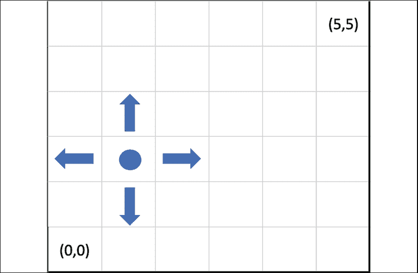
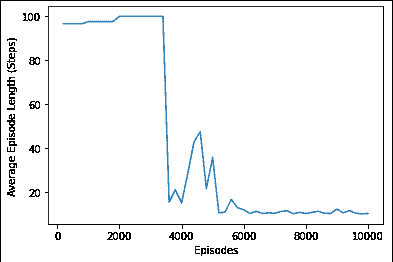
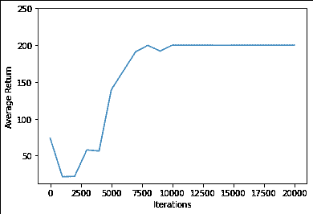
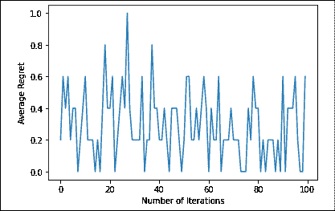

# 第十一章：使用 TensorFlow 和 TF-Agents 进行强化学习

TF-Agents 是一个用于 **强化学习**（**RL**）的 **TensorFlow**（**TF**）库。通过提供多个模块化组件，TF-Agents 使得各种算法的设计和实现变得更加简单，这些组件对应 RL 问题的核心部分：

+   一个智能体在 **环境** 中操作，并通过处理每次选择动作时收到的信号来进行学习。在 TF-Agents 中，环境通常用 Python 实现，并用 TF 包装器封装，以便高效并行化。

+   **策略** 将环境中的观测映射为动作的分布。

+   **驱动器** 在环境中执行策略，经过指定的步数（也叫 **回合**）。

+   **回放缓冲区** 用于存储在环境中执行策略的经验（智能体在动作空间中的轨迹，以及相关的奖励）；训练时，会查询缓冲区中的一部分轨迹。

基本思路是将我们讨论的每个问题转化为一个 RL 问题，然后将各个组件映射到 TF-Agents 对应的部分。在本章中，我们将展示如何使用 TF-Agents 来解决一些简单的 RL 问题：

+   GridWorld 问题

+   OpenAI Gym 环境

+   多臂强盗问题用于内容个性化

展示 TF-Agents 中强化学习能力的最佳方式是通过一个玩具问题：GridWorld 是一个很好的选择，因为它具有直观的几何结构和易于理解的动作，尽管如此，它仍然是一个合适的目标，我们可以研究智能体为达成目标而采取的最佳路径。

# GridWorld

本节中的代码改编自 [`github.com/sachag678`](https://github.com/sachag678)。

我们首先展示在 GridWorld 环境中基本的 TF-Agents 功能。RL 问题最好在游戏（我们有一套明确的规则和完全可观察的环境）或像 GridWorld 这样的玩具问题中研究。一旦基本概念在一个简化但不简单的环境中得到了清晰的定义，我们就可以转向逐步更具挑战性的情境。

第一步是定义一个 GridWorld 环境：这是一个 6x6 的方形棋盘，智能体从 (0,0) 开始，终点在 (5,5)，智能体的目标是找到从起点到终点的路径。可能的动作包括上/下/左/右移动。如果智能体到达终点，它将获得 100 的奖励，并且如果智能体在 100 步内没有到达终点，游戏将结束。这里提供了一个 GridWorld “地图”的示例：



图 11.1：GridWorld “地图”

现在我们理解了要处理的内容，让我们构建一个模型，从 **(0,0)** 找到通向 **(5,5)** 的路径。

## 我们该如何进行？

和往常一样，我们首先加载必要的库：

```py
import tensorflow as tf
import numpy as np
from tf_agents.environments import py_environment, tf_environment, tf_py_environment, utils, wrappers, suite_gym
from tf_agents.specs import array_spec
from tf_agents.trajectories import trajectory,time_step as ts
from tf_agents.agents.dqn import dqn_agent
from tf_agents.networks import q_network
from tf_agents.drivers import dynamic_step_driver
from tf_agents.metrics import tf_metrics, py_metrics
from tf_agents.policies import random_tf_policy
from tf_agents.replay_buffers import tf_uniform_replay_buffer
from tf_agents.utils import common
from tf_agents.drivers import py_driver, dynamic_episode_driver
from tf_agents.utils import common
import matplotlib.pyplot as plt 
```

TF-Agents 是一个积极开发中的库，因此尽管我们尽力保持代码更新，但在你运行这段代码时，某些导入可能需要修改。

一个关键步骤是定义智能体将要操作的环境。通过继承`PyEnvironment`类，我们指定`init`方法（动作和观察定义）、重置/终止状态的条件以及移动机制：

```py
class GridWorldEnv(py_environment.PyEnvironment):
# the _init_ contains the specifications for action and observation
    def __init__(self):
        self._action_spec = array_spec.BoundedArraySpec(
            shape=(), dtype=np.int32, minimum=0, maximum=3, name='action')
        self._observation_spec = array_spec.BoundedArraySpec(
            shape=(4,), dtype=np.int32, minimum=[0,0,0,0],                            maximum=[5,5,5,5], name='observation')
        self._state=[0,0,5,5] #represent the (row, col, frow, fcol) of the player and the finish
        self._episode_ended = False
    def action_spec(self):
        return self._action_spec
    def observation_spec(self):
        return self._observation_spec
# once the same is over, we reset the state
    def _reset(self):
        self._state=[0,0,5,5]
        self._episode_ended = False
        return ts.restart(np.array(self._state, dtype=np.int32))
# the _step function handles the state transition by applying an action to the current state to obtain a new one
    def _step(self, action):
        if self._episode_ended:
            return self.reset()
        self.move(action)
        if self.game_over():
            self._episode_ended = True
        if self._episode_ended:
            if self.game_over():
                reward = 100
            else:
                reward = 0
            return ts.termination(np.array(self._state, dtype=np.int32),             reward)
        else:
            return ts.transition(
                np.array(self._state, dtype=np.int32), reward=0,                 discount=0.9)
    def move(self, action):
        row, col, frow, fcol = self._state[0],self._state[1],self._        state[2],self._state[3]
        if action == 0: #down
            if row - 1 >= 0:
                self._state[0] -= 1
        if action == 1: #up
            if row + 1 < 6:
                self._state[0] += 1
        if action == 2: #left
            if col - 1 >= 0:
                self._state[1] -= 1
        if action == 3: #right
            if col + 1 < 6:
                self._state[1] += 1
    def game_over(self):
        row, col, frow, fcol = self._state[0],self._state[1],self._        state[2],self._state[3]
        return row==frow and col==fcol
def compute_avg_return(environment, policy, num_episodes=10):
    total_return = 0.0
    for _ in range(num_episodes):
        time_step = environment.reset()
        episode_return = 0.0
        while not time_step.is_last():
            action_step = policy.action(time_step)
            time_step = environment.step(action_step.action)
            episode_return += time_step.reward
            total_return += episode_return
    avg_return = total_return / num_episodes
    return avg_return.numpy()[0]
def collect_step(environment, policy):
    time_step = environment.current_time_step()
    action_step = policy.action(time_step)
    next_time_step = environment.step(action_step.action)
    traj = trajectory.from_transition(time_step, action_step, next_time_step)
    # Add trajectory to the replay buffer
    replay_buffer.add_batch(traj) 
```

我们有以下初步设置：

```py
# parameter settings
num_iterations = 10000  
initial_collect_steps = 1000  
collect_steps_per_iteration = 1  
replay_buffer_capacity = 100000  
fc_layer_params = (100,)
batch_size = 128 # 
learning_rate = 1e-5  
log_interval = 200  
num_eval_episodes = 2  
eval_interval = 1000 
```

我们首先创建环境并将其封装，以确保它们在 100 步后终止：

```py
train_py_env = wrappers.TimeLimit(GridWorldEnv(), duration=100)
eval_py_env = wrappers.TimeLimit(GridWorldEnv(), duration=100)
train_env = tf_py_environment.TFPyEnvironment(train_py_env)
eval_env = tf_py_environment.TFPyEnvironment(eval_py_env) 
```

对于这个任务，我们将使用**深度 Q 网络**（**DQN**）智能体。这意味着我们需要首先定义网络及其关联的优化器：

```py
q_net = q_network.QNetwork(
        train_env.observation_spec(),
        train_env.action_spec(),
        fc_layer_params=fc_layer_params)
optimizer = tf.compat.v1.train.AdamOptimizer(learning_rate=learning_rate) 
```

如上所示，TF-Agents 库正在积极开发中。目前版本适用于 TF > 2.3，但它最初是为 TensorFlow 1.x 编写的。此改编中使用的代码是基于先前版本开发的，因此为了兼容性，我们需要使用一些不太优雅的解决方法，例如以下代码：

```py
train_step_counter = tf.compat.v2.Variable(0) 
```

定义智能体：

```py
tf_agent = dqn_agent.DqnAgent(
        train_env.time_step_spec(),
        train_env.action_spec(),
        q_network=q_net,
        optimizer=optimizer,
        td_errors_loss_fn = common.element_wise_squared_loss,
        train_step_counter=train_step_counter)
tf_agent.initialize()
eval_policy = tf_agent.policy
collect_policy = tf_agent.collect_policy 
```

接下来的步骤是创建回放缓冲区和回放观察者。前者用于存储训练用的（动作，观察）对：

```py
replay_buffer = tf_uniform_replay_buffer.TFUniformReplayBuffer(
        data_spec = tf_agent.collect_data_spec,
        batch_size = train_env.batch_size,
        max_length = replay_buffer_capacity)
print("Batch Size: {}".format(train_env.batch_size))
replay_observer = [replay_buffer.add_batch]
train_metrics = [
            tf_metrics.NumberOfEpisodes(),
            tf_metrics.EnvironmentSteps(),
            tf_metrics.AverageReturnMetric(),
            tf_metrics.AverageEpisodeLengthMetric(),
] 
```

然后我们从回放缓冲区创建数据集，以便可以进行迭代：

```py
dataset = replay_buffer.as_dataset(
            num_parallel_calls=3,
            sample_batch_size=batch_size,
    num_steps=2).prefetch(3) 
```

最后的准备工作是创建一个驱动程序，模拟游戏中的智能体，并将（状态，动作，奖励）元组存储在回放缓冲区中，同时还需要存储若干个度量：

```py
driver = dynamic_step_driver.DynamicStepDriver(
            train_env,
            collect_policy,
            observers=replay_observer + train_metrics,
    num_steps=1)
iterator = iter(dataset)
print(compute_avg_return(eval_env, tf_agent.policy, num_eval_episodes))
tf_agent.train = common.function(tf_agent.train)
tf_agent.train_step_counter.assign(0)
final_time_step, policy_state = driver.run() 
```

完成准备工作后，我们可以运行驱动程序，从数据集中获取经验，并用它来训练智能体。为了监控/记录，我们会在特定间隔打印损失和平均回报：

```py
episode_len = []
step_len = []
for i in range(num_iterations):
    final_time_step, _ = driver.run(final_time_step, policy_state)
    experience, _ = next(iterator)
    train_loss = tf_agent.train(experience=experience)
    step = tf_agent.train_step_counter.numpy()
    if step % log_interval == 0:
        print('step = {0}: loss = {1}'.format(step, train_loss.loss))
        episode_len.append(train_metrics[3].result().numpy())
        step_len.append(step)
        print('Average episode length: {}'.format(train_metrics[3].                                                  result().numpy()))
    if step % eval_interval == 0:
        avg_return = compute_avg_return(eval_env, tf_agent.policy,                                        num_eval_episodes)
        print('step = {0}: Average Return = {1}'.format(step, avg_return)) 
```

一旦代码成功执行，你应该看到类似以下的输出：

```py
step = 200: loss = 0.27092617750167847 Average episode length: 96.5999984741211 step = 400: loss = 0.08925052732229233 Average episode length: 96.5999984741211 step = 600: loss = 0.04888586699962616 Average episode length: 96.5999984741211 step = 800: loss = 0.04527277499437332 Average episode length: 96.5999984741211 step = 1000: loss = 0.04451741278171539 Average episode length: 97.5999984741211 step = 1000: Average Return = 0.0 step = 1200: loss = 0.02019939199090004 Average episode length: 97.5999984741211 step = 1400: loss = 0.02462056837975979 Average episode length: 97.5999984741211 step = 1600: loss = 0.013112186454236507 Average episode length: 97.5999984741211 step = 1800: loss = 0.004257255233824253 Average episode length: 97.5999984741211 step = 2000: loss = 78.85380554199219 Average episode length: 100.0 step = 2000:
Average Return = 0.0 step = 2200: loss = 0.010012316517531872 Average episode length: 100.0 step = 2400: loss = 0.009675763547420502 Average episode length: 100.0 step = 2600: loss = 0.00445540901273489 Average episode length: 100.0 step = 2800: loss = 0.0006154756410978734 
```

尽管训练过程的输出很详细，但并不适合人类阅读。不过，我们可以通过可视化来观察智能体的进展：

```py
plt.plot(step_len, episode_len)
plt.xlabel('Episodes')
plt.ylabel('Average Episode Length (Steps)')
plt.show() 
```

这将为我们提供以下图表：



图 11.2：每集平均长度与集数的关系

图表展示了我们模型的进展：在前 4000 集后，平均每集时长出现大幅下降，表明我们的智能体在达到最终目标时所需时间越来越少。

## 另见

有关自定义环境的文档可以参考[`www.tensorflow.org/agents/tutorials/2_environments_tutorial`](https://www.tensorflow.org/agents/tutorials/2_environments_tutorial)。

强化学习（RL）是一个庞大的领域，甚至是一个简单的介绍也超出了本书的范围。但对于那些有兴趣了解更多的人，最好的推荐是经典的 Sutton 和 Barto 书籍：[`incompleteideas.net/book/the-book.html`](http://incompleteideas.net/book/the-book.html)

# 倾斜摆杆（CartPole）

在本节中，我们将使用 Open AI Gym，这是一个包含可以通过强化学习方法解决的非平凡基础问题的环境集。我们将使用 CartPole 环境。智能体的目标是学习如何在移动的小车上保持一根杆子平衡，可能的动作包括向左或向右移动：


图 11.3：CartPole 环境，黑色小车平衡着一根长杆

现在我们了解了环境，接下来让我们构建一个模型来平衡一个杆子。

## 我们该如何进行呢？

我们首先安装一些前提条件并导入必要的库。安装部分主要是为了确保我们能够生成训练智能体表现的可视化效果：

```py
!sudo apt-get install -y xvfb ffmpeg
!pip install gym
!pip install 'imageio==2.4.0'
!pip install PILLOW
!pip install pyglet
!pip install pyvirtualdisplay
!pip install tf-agents
from __future__ import absolute_import, division, print_function
import base64
import imageio
import IPython
import matplotlib
import matplotlib.pyplot as plt
import numpy as np
import PIL.Image
import pyvirtualdisplay
import tensorflow as tf
from tf_agents.agents.dqn import dqn_agent
from tf_agents.drivers import dynamic_step_driver
from tf_agents.environments import suite_gym
from tf_agents.environments import tf_py_environment
from tf_agents.eval import metric_utils
from tf_agents.metrics import tf_metrics
from tf_agents.networks import q_network
from tf_agents.policies import random_tf_policy
from tf_agents.replay_buffers import tf_uniform_replay_buffer
from tf_agents.trajectories import trajectory
from tf_agents.utils import common
tf.compat.v1.enable_v2_behavior()
# Set up a virtual display for rendering OpenAI gym environments.
display = pyvirtualdisplay.Display(visible=0, size=(1400, 900)).start() 
```

和之前一样，我们定义了一些我们玩具问题的超参数：

```py
num_iterations = 20000 
initial_collect_steps = 100  
collect_steps_per_iteration = 1  
replay_buffer_max_length = 100000  
# parameters of the neural network underlying at the core of an agent
batch_size = 64  
learning_rate = 1e-3  
log_interval = 200  
num_eval_episodes = 10  
eval_interval = 1000 
```

接下来，我们继续定义我们问题的函数。首先计算一个策略在环境中固定时间段内的平均回报（以回合数为衡量标准）：

```py
def compute_avg_return(environment, policy, num_episodes=10):
  total_return = 0.0
  for _ in range(num_episodes):
    time_step = environment.reset()
    episode_return = 0.0
    while not time_step.is_last():
      action_step = policy.action(time_step)
      time_step = environment.step(action_step.action)
      episode_return += time_step.reward
    total_return += episode_return
  avg_return = total_return / num_episodes
  return avg_return.numpy()[0] 
```

收集单个步骤及相关数据聚合的样板代码如下：

```py
def collect_step(environment, policy, buffer):
  time_step = environment.current_time_step()
  action_step = policy.action(time_step)
  next_time_step = environment.step(action_step.action)
  traj = trajectory.from_transition(time_step, action_step, next_time_step)
  # Add trajectory to the replay buffer
  buffer.add_batch(traj)
def collect_data(env, policy, buffer, steps):
  for _ in range(steps):
    collect_step(env, policy, buffer) 
```

如果一张图片值千言万语，那么视频一定更好。为了可视化我们智能体的表现，我们需要一个渲染实际动画的函数：

```py
def embed_mp4(filename):
  """Embeds an mp4 file in the notebook."""
  video = open(filename,'rb').read()
  b64 = base64.b64encode(video)
  tag = '''
  <video width="640" height="480" controls>
    <source src="img/mp4;base64,{0}" type="video/mp4">
  Your browser does not support the video tag.
  </video>'''.format(b64.decode())
  return IPython.display.HTML(tag)
def create_policy_eval_video(policy, filename, num_episodes=5, fps=30):
  filename = filename + ".mp4"
  with imageio.get_writer(filename, fps=fps) as video:
    for _ in range(num_episodes):
      time_step = eval_env.reset()
      video.append_data(eval_py_env.render())
      while not time_step.is_last():
        action_step = policy.action(time_step)
        time_step = eval_env.step(action_step.action)
        video.append_data(eval_py_env.render())
  return embed_mp4(filename) 
```

在初步工作完成后，我们可以开始真正地设置我们的环境：

```py
env_name = 'CartPole-v0'
env = suite_gym.load(env_name)
env.reset() 
```

在 CartPole 环境中，适用以下内容：

+   一个观察是一个包含四个浮动数值的数组：

    +   小车的位置和速度

    +   杆子的角位置和速度

+   奖励是一个标量浮动值

+   一个动作是一个标量整数，只有两个可能的值：

    +   0 — "向左移动"

    +   1 — "向右移动"

和之前一样，分开训练和评估环境，并应用包装器：

```py
train_py_env = suite_gym.load(env_name)
eval_py_env = suite_gym.load(env_name)
train_env = tf_py_environment.TFPyEnvironment(train_py_env)
eval_env = tf_py_environment.TFPyEnvironment(eval_py_env) 
```

定义构成我们智能体学习算法基础的网络：一个神经网络，根据环境的观察作为输入，预测所有动作的预期回报（通常在强化学习文献中称为 Q 值）：

```py
fc_layer_params = (100,)
q_net = q_network.QNetwork(
    train_env.observation_spec(),
    train_env.action_spec(),
    fc_layer_params=fc_layer_params)
optimizer = tf.compat.v1.train.AdamOptimizer(learning_rate=learning_rate)
train_step_counter = tf.Variable(0) 
```

有了这个，我们可以实例化一个 DQN 智能体：

```py
agent = dqn_agent.DqnAgent(
    train_env.time_step_spec(),
    train_env.action_spec(),
    q_network=q_net,
    optimizer=optimizer,
    td_errors_loss_fn=common.element_wise_squared_loss,
    train_step_counter=train_step_counter)
agent.initialize() 
```

设置策略——主要用于评估和部署的策略，以及用于数据收集的次要策略：

```py
eval_policy = agent.policy
collect_policy = agent.collect_policy 
```

为了进行一个不算很复杂的比较，我们还将创建一个随机策略（顾名思义，它是随机执行的）。然而，这展示了一个重要的观点：策略可以独立于智能体创建：

```py
random_policy = random_tf_policy.RandomTFPolicy(train_env.time_step_spec(), train_env.action_spec()) 
```

为了从策略中获得一个动作，我们调用 `policy.action(time_step)` 方法。`time_step` 包含来自环境的观察。这个方法返回一个策略步骤，这是一个包含三个组件的命名元组：

+   **动作**：要执行的动作（向左移动或向右移动）

+   **状态**：用于有状态（基于 RNN）的策略

+   **信息**：辅助数据，例如动作的对数概率：

```py
example_environment = tf_py_environment.TFPyEnvironment(
    suite_gym.load('CartPole-v0'))
time_step = example_environment.reset() 
```

重放缓冲区跟踪从环境中收集的数据，这些数据用于训练：

```py
replay_buffer = tf_uniform_replay_buffer.TFUniformReplayBuffer(
    data_spec=agent.collect_data_spec,
    batch_size=train_env.batch_size,
    max_length=replay_buffer_max_length) 
```

对于大多数代理，`collect_data_spec` 是一个命名元组，称为**轨迹**（Trajectory），它包含关于观察、动作、奖励以及其他项的规格。

我们现在利用随机策略来探索环境：

```py
collect_data(train_env, random_policy, replay_buffer, initial_collect_steps) 
```

现在，代理可以通过管道访问重放缓冲区。由于我们的 DQN 代理需要当前观察和下一次观察来计算损失，因此管道一次会采样两行相邻数据（`num_steps = 2`）：

```py
dataset = replay_buffer.as_dataset(
    num_parallel_calls=3, 
    sample_batch_size=batch_size, 
    num_steps=2).prefetch(3)
iterator = iter(dataset) 
```

在训练部分，我们在两个步骤之间切换：从环境中收集数据并用它来训练 DQN：

```py
agent.train = common.function(agent.train)
# Reset the train step
agent.train_step_counter.assign(0)
# Evaluate the agent's policy once before training.
avg_return = compute_avg_return(eval_env, agent.policy, num_eval_episodes)
returns = [avg_return]
for _ in range(num_iterations):
  # Collect a few steps using collect_policy and save to the replay buffer.
  collect_data(train_env, agent.collect_policy, replay_buffer, collect_steps_per_iteration)
  # Sample a batch of data from the buffer and update the agent's network.
  experience, unused_info = next(iterator)
  train_loss = agent.train(experience).loss
  step = agent.train_step_counter.numpy()
  if step % log_interval == 0:
    print('step = {0}: loss = {1}'.format(step, train_loss))
  if step % eval_interval == 0:
    avg_return = compute_avg_return(eval_env, agent.policy, num_eval_episodes)
    print('step = {0}: Average Return = {1}'.format(step, avg_return))
    returns.append(avg_return) 
```

代码块的（部分）输出如下。快速回顾一下，`step` 是训练过程中的迭代次数，`loss` 是深度网络中驱动代理逻辑的损失函数值，`Average Return` 是当前运行结束时的奖励：

```py
step = 200: loss = 4.396056175231934
step = 400: loss = 7.12950325012207
step = 600: loss = 19.0213623046875
step = 800: loss = 45.954856872558594
step = 1000: loss = 35.900394439697266
step = 1000: Average Return = 21.399999618530273
step = 1200: loss = 60.97482681274414
step = 1400: loss = 8.678962707519531
step = 1600: loss = 13.465248107910156
step = 1800: loss = 42.33995056152344
step = 2000: loss = 42.936370849609375
step = 2000: Average Return = 21.799999237060547 
```

每次迭代包含 200 个时间步，保持杆子竖立会得到 1 分奖励，因此每一轮的最大奖励为 200：



图 11.4：每次迭代的平均回报

从前面的图表中可以看出，代理大约需要 1 万次迭代才能发现一个成功的策略（其中有一些波动，正如奖励曲线中的 U 形模式所示）。之后，奖励趋于稳定，算法能够每次成功完成任务。

我们还可以通过视频观察代理的表现。关于随机策略，您可以尝试以下操作：

```py
create_policy_eval_video(random_policy, "random-agent") 
```

而关于已经训练的策略，您可以尝试以下操作：

```py
create_policy_eval_video(agent.policy, "trained-agent") 
```

## 另请参阅

Open AI Gym 环境文档可以在[`gym.openai.com/`](https://gym.openai.com/)找到。

# MAB

在概率论中，**多臂赌博机**（**MAB**）问题指的是一种情境，其中有限的资源必须在多个竞争的选择之间分配，以最大化某种形式的长期目标。这个名称来源于用于制定模型第一版的类比。假设我们有一个赌徒，面前是一排老虎机，他必须决定选择哪些老虎机进行游戏，玩多少次，以及以什么顺序进行。在强化学习（RL）中，我们将其表述为一个代理（agent），该代理希望平衡探索（获得新知识）和开发（基于已经获得的经验优化决策）。这种平衡的目标是在一段时间内最大化总奖励。

MAB 是一个简化的强化学习问题：代理采取的动作不会影响环境的后续状态。这意味着不需要建模状态转移，不需要为过去的动作分配奖励，也不需要提前规划以到达奖励状态。MAB 代理的目标是确定一个策略，使得随时间推移能够最大化累积奖励。

主要挑战是有效应对探索与利用的难题：如果我们总是尝试利用期望奖励最高的动作，就有可能错过那些通过更多探索可以发现的更好的动作。

本示例中使用的设置来源于 Vowpal Wabbit 教程，网址为[`vowpalwabbit.org/tutorials/cb_simulation.html`](https://vowpalwabbit.org/tutorials/cb_simulation.html)。

在本节中，我们将模拟个性化在线内容的问题：Tom 和 Anna 在一天中的不同时间访问网站并查看一篇文章。Tom 早上喜欢政治，下午喜欢音乐，而 Anna 早上喜欢体育或政治，下午喜欢政治。将这个问题用多臂赌博机（MAB）术语表述，这意味着：

+   上下文是一个包含{用户，时间段}的对。

+   可能的动作是新闻主题{政治、体育、音乐、食物}。

+   如果用户在此时看到他们感兴趣的内容，则奖励为 1，否则为 0。

目标是最大化通过用户的**点击率**（**CTR**）衡量的奖励。

## 我们该怎么做呢？

像往常一样，我们首先加载必要的包：

```py
!pip install tf-agents
import abc
import numpy as np
import tensorflow as tf
from tf_agents.agents import tf_agent
from tf_agents.drivers import driver
from tf_agents.environments import py_environment
from tf_agents.environments import tf_environment
from tf_agents.environments import tf_py_environment
from tf_agents.policies import tf_policy
from tf_agents.specs import array_spec
from tf_agents.specs import tensor_spec
from tf_agents.trajectories import time_step as ts
from tf_agents.trajectories import trajectory
from tf_agents.trajectories import policy_step
tf.compat.v1.reset_default_graph()
tf.compat.v1.enable_resource_variables()
tf.compat.v1.enable_v2_behavior()
nest = tf.compat.v2.nest
from tf_agents.bandits.agents import lin_ucb_agent
from tf_agents.bandits.environments import stationary_stochastic_py_environment as sspe
from tf_agents.bandits.metrics import tf_metrics
from tf_agents.drivers import dynamic_step_driver
from tf_agents.replay_buffers import tf_uniform_replay_buffer
import matplotlib.pyplot as plt 
```

我们接下来定义一些超参数，这些参数将在后续使用：

```py
batch_size = 2
num_iterations = 100 
steps_per_loop = 1 
```

我们需要的第一个函数是一个上下文采样器，用于生成来自环境的观察值。由于我们有两个用户和一天中的两个时间段，实际上是生成两元素二进制向量：

```py
def context_sampling_fn(batch_size):
  def _context_sampling_fn():
    return np.random.randint(0, 2, [batch_size, 2]).astype(np.float32)
  return _context_sampling_fn 
```

接下来，我们定义一个通用函数来计算每个臂的奖励：

```py
class CalculateReward(object):

    """A class that acts as linear reward function when called."""
    def __init__(self, theta, sigma):
        self.theta = theta
        self.sigma = sigma
    def __call__(self, x):
        mu = np.dot(x, self.theta)
        #return np.random.normal(mu, self.sigma)
        return (mu > 0) + 0 
```

我们可以使用该函数来定义每个臂的奖励。这些奖励反映了在本食谱开头描述的偏好集：

```py
arm0_param = [2, -1]
arm1_param = [1, -1] 
arm2_param = [-1, 1] 
arm3_param = [ 0, 0] 
arm0_reward_fn = CalculateReward(arm0_param, 1)
arm1_reward_fn = CalculateReward(arm1_param, 1)
arm2_reward_fn = CalculateReward(arm2_param, 1)
arm3_reward_fn = CalculateReward(arm3_param, 1) 
```

我们函数设置的最后一部分涉及计算给定上下文的最优奖励：

```py
def compute_optimal_reward(observation):
    expected_reward_for_arms = [
      tf.linalg.matvec(observation, tf.cast(arm0_param, dtype=tf.float32)),
      tf.linalg.matvec(observation, tf.cast(arm1_param, dtype=tf.float32)),
      tf.linalg.matvec(observation, tf.cast(arm2_param, dtype=tf.float32)),
      tf.linalg.matvec(observation, tf.cast(arm3_param, dtype=tf.float32))
    ]
    optimal_action_reward = tf.reduce_max(expected_reward_for_arms, axis=0)

    return optimal_action_reward 
```

为了本示例的目的，我们假设环境是静态的；换句话说，偏好在时间上没有变化（这在实际场景中不一定成立，取决于你关注的时间范围）：

```py
environment = tf_py_environment.TFPyEnvironment(
    sspe.StationaryStochasticPyEnvironment(
        context_sampling_fn(batch_size),
        [arm0_reward_fn, arm1_reward_fn, arm2_reward_fn, arm3_reward_fn],
        batch_size=batch_size)) 
```

我们现在准备实例化一个实现赌博机算法的代理。我们使用预定义的`LinUCB`类；像往常一样，我们定义观察值（两个元素，表示用户和时间），时间步长和动作规范（四种可能内容类型之一）：

```py
observation_spec = tensor_spec.TensorSpec([2], tf.float32)
time_step_spec = ts.time_step_spec(observation_spec)
action_spec = tensor_spec.BoundedTensorSpec(
    dtype=tf.int32, shape=(), minimum=0, maximum=2)
agent = lin_ucb_agent.LinearUCBAgent(time_step_spec=time_step_spec,
                                     action_spec=action_spec) 
```

多臂赌博机（MAB）设置的一个关键组成部分是遗憾，它被定义为代理实际获得的奖励与**oracle 策略**的期望奖励之间的差异：

```py
regret_metric = tf_metrics.RegretMetric(compute_optimal_reward) 
```

我们现在可以开始训练我们的代理。我们运行训练循环`num_iterations`次，每次执行`steps_per_loop`步。找到这些参数的合适值通常是要在更新的时效性和训练效率之间找到平衡：

```py
replay_buffer = tf_uniform_replay_buffer.TFUniformReplayBuffer(
    data_spec=agent.policy.trajectory_spec,
    batch_size=batch_size,
    max_length=steps_per_loop)
observers = [replay_buffer.add_batch, regret_metric]
driver = dynamic_step_driver.DynamicStepDriver(
    env=environment,
    policy=agent.collect_policy,
    num_steps=steps_per_loop * batch_size,
    observers=observers)
regret_values = []
for _ in range(num_iterations):
    driver.run()
    loss_info = agent.train(replay_buffer.gather_all())
    replay_buffer.clear()
    regret_values.append(regret_metric.result()) 
```

我们可以通过绘制后续迭代中的遗憾（负奖励）来可视化实验结果：

```py
plt.plot(regret_values)
plt.ylabel('Average Regret')
plt.xlabel('Number of Iterations') 
```

这将为我们绘制出以下图表：



图 11.5：训练过的 UCB 代理随时间的表现

如前图所示，在初始学习阶段（在第 30 次迭代附近的遗憾出现峰值），代理会不断改进，提供期望的内容。过程中有很多变化，表明即便在一个简化的环境下——两个用户——高效个性化仍然是一个挑战。改进的可能方向包括更长时间的训练，或者调整 DQN 代理，使其能够采用更复杂的逻辑来进行预测。

## 另见

相关的强盗算法及其环境的广泛集合可以在*TF-Agents 文档库*中找到：[`github.com/tensorflow/agents/tree/master/tf_agents/bandits/agents/examples/v2`](https://github.com/tensorflow/agents/tree/master/tf_agents/bandits/agents/examples/v2)。

对上下文多臂强盗问题感兴趣的读者可以参考*Sutton 和 Barto*的书中的相关章节：[`web.stanford.edu/class/psych209/Readings/SuttonBartoIPRLBook2ndEd.pdf`](https://web.stanford.edu/class/psych209/Readings/SuttonBartoIPRLBook2ndEd.pdf)。
