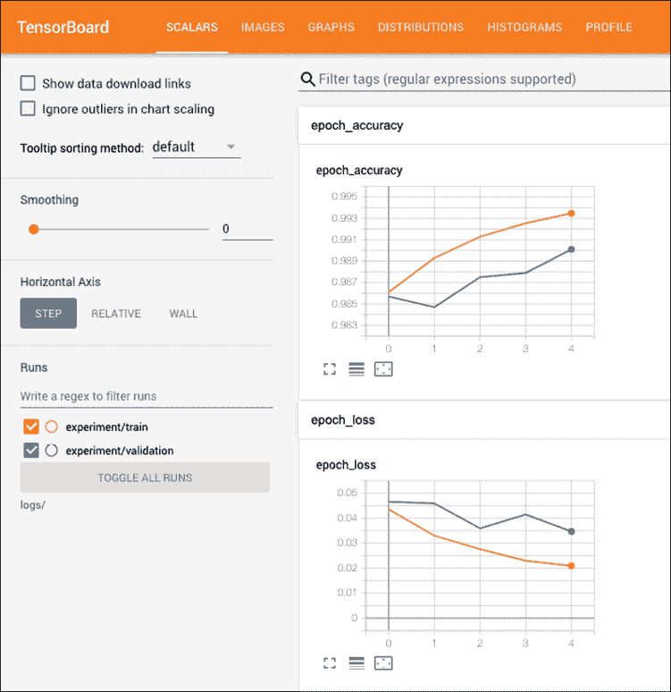
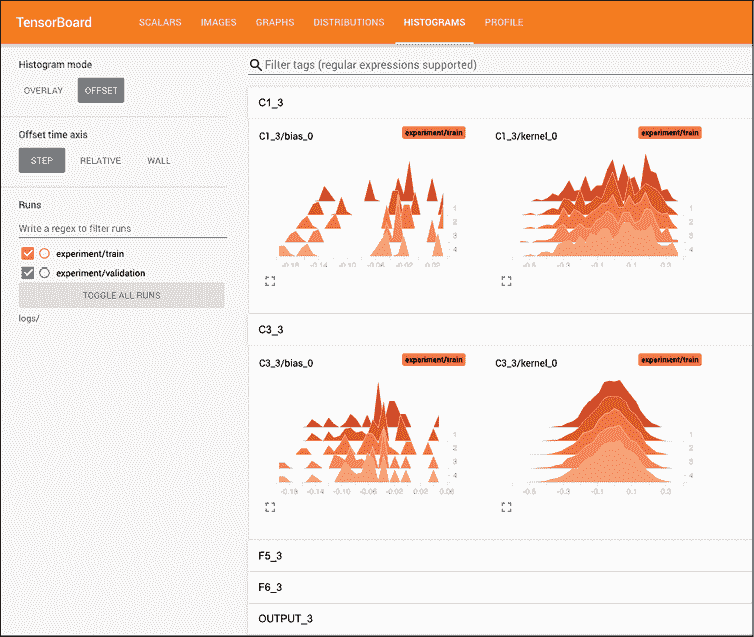
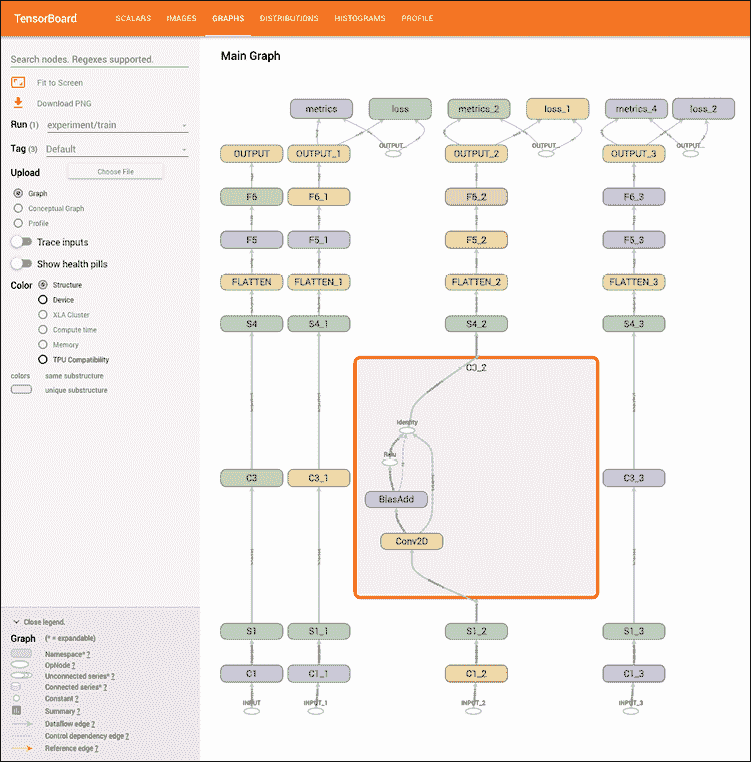
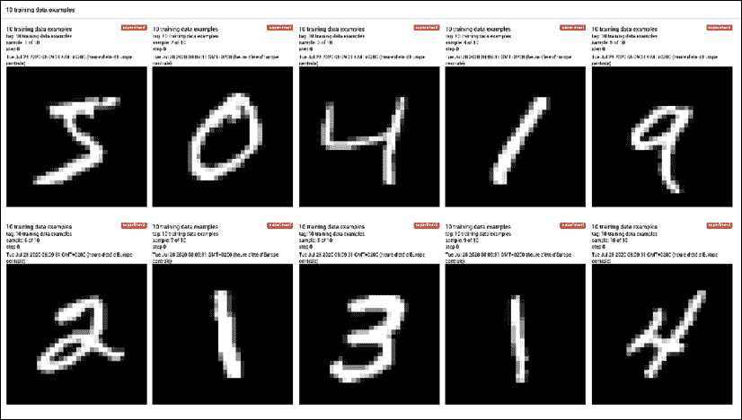
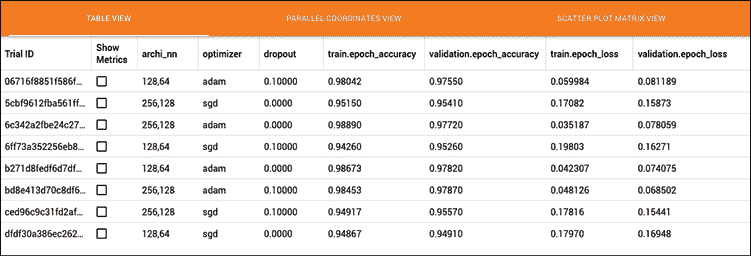
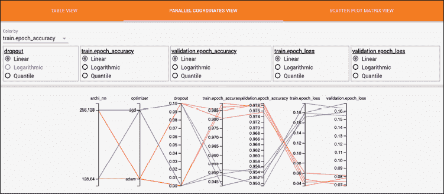
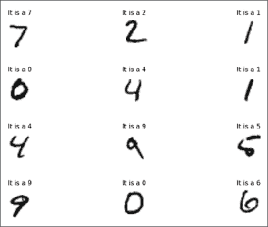
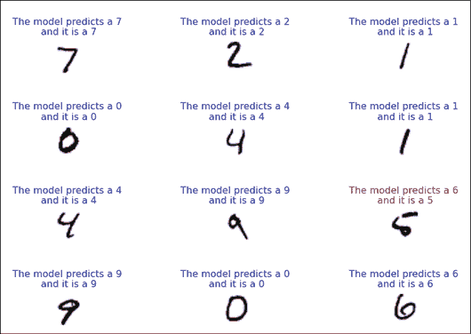

# 第十二章：将 TensorFlow 应用到生产环境

在本书中，我们已经看到 TensorFlow 能够实现许多模型，但 TensorFlow 能做的远不止这些。本章将向你展示其中的一些内容。在本章中，我们将涵盖以下主题：

+   在 TensorBoard 中可视化图表

+   使用 TensorBoard 的 HParams 进行超参数调优

+   使用 tf.test 实现单元测试

+   使用多个执行器

+   使用 tf.distribute.strategy 进行 TensorFlow 并行化

+   保存和恢复 TensorFlow 模型

+   使用 TensorFlow Serving

我们将首先展示如何使用 TensorBoard 的各个方面，TensorBoard 是 TensorFlow 自带的一个功能。这个工具允许我们即使在模型训练过程中，也能可视化总结指标、图表和图像。接下来，我们将展示如何编写适用于生产环境的代码，重点是单元测试、多处理单元的训练分配，以及高效的模型保存和加载。最后，我们将通过将模型托管为 REST 端点，解决机器学习服务方案。

# 在 TensorBoard 中可视化图表

监控和排查机器学习算法可能是一项艰巨的任务，尤其是在你必须等待训练完成后才能知道结果的情况下。为了应对这种情况，TensorFlow 提供了一个计算图可视化工具，称为**TensorBoard**。借助 TensorBoard，我们可以在训练过程中可视化图表和重要数值（如损失、准确率、批次训练时间等）。

## 准备工作

为了展示我们如何使用 TensorBoard 的各种方式，我们将重新实现*第八章*中*卷积神经网络*章节里的*入门 CNN 模型*配方中的 MNIST 模型。然后，我们将添加 TensorBoard 回调并拟合模型。我们将展示如何监控数值、值集的直方图，如何在 TensorBoard 中创建图像，以及如何可视化 TensorFlow 模型。

## 如何实现...

1.  首先，我们将加载脚本所需的库：

    ```py
    import tensorflow as tf
    import numpy as np
    import datetime 
    ```

1.  现在我们将重新实现 MNIST 模型：

    ```py
    (x_train, y_train), (x_test, y_test) = tf.keras.datasets.mnist.load_data()
    x_train = x_train.reshape(-1, 28, 28, 1)
    x_test = x_test.reshape(-1, 28, 28, 1)
    # Padding the images by 2 pixels since in the paper input images were 32x32
    x_train = np.pad(x_train, ((0,0),(2,2),(2,2),(0,0)), 'constant')
    x_test = np.pad(x_test, ((0,0),(2,2),(2,2),(0,0)), 'constant')
    # Normalize
    x_train = x_train / 255
    x_test = x_test/ 255
    # Set model parameters
    image_width = x_train[0].shape[0]
    image_height = x_train[0].shape[1]
    num_channels = 1 # grayscale = 1 channel
    # Training and Test data variables
    batch_size = 100
    evaluation_size = 500
    generations = 300
    eval_every = 5
    # Set for reproducible results
    seed = 98
    np.random.seed(seed)
    tf.random.set_seed(seed)
    # Declare the model
    input_data = tf.keras.Input(dtype=tf.float32, shape=(image_width,image_height, num_channels), name="INPUT")
    # First Conv-ReLU-MaxPool Layer
    conv1 = tf.keras.layers.Conv2D(filters=6,
                                   kernel_size=5,
                                   padding='VALID',
                                   activation="relu",
                                   name="C1")(input_data)
    max_pool1 = tf.keras.layers.MaxPool2D(pool_size=2,
                                          strides=2, 
                                          padding='SAME',
                                          name="S1")(conv1)
    # Second Conv-ReLU-MaxPool Layer
    conv2 = tf.keras.layers.Conv2D(filters=16,
                                   kernel_size=5,
                                   padding='VALID',
                                   strides=1,
                                   activation="relu",
                                   name="C3")(max_pool1)
    max_pool2 = tf.keras.layers.MaxPool2D(pool_size=2,
                                          strides=2, 
                                          padding='SAME',
                                          name="S4")(conv2)
    # Flatten Layer
    flatten = tf.keras.layers.Flatten(name="FLATTEN")(max_pool2)
    # First Fully Connected Layer
    fully_connected1 = tf.keras.layers.Dense(units=120,
                                             activation="relu",
                                             name="F5")(flatten)
    # Second Fully Connected Layer
    fully_connected2 = tf.keras.layers.Dense(units=84,
                                             activation="relu",
                                             name="F6")(fully_connected1)
    # Final Fully Connected Layer
    final_model_output = tf.keras.layers.Dense(units=10,
                                               activation="softmax",
                                               name="OUTPUT"
                                               )(fully_connected2)

    model = tf.keras.Model(inputs= input_data, outputs=final_model_output) 
    ```

1.  接下来，我们将使用稀疏类别交叉熵损失和 Adam 优化器编译模型。然后，我们将展示总结：

    ```py
    model.compile(
        optimizer="adam", 
        loss="sparse_categorical_crossentropy",
        metrics=["accuracy"]
    )
    model.summary() 
    ```

1.  我们将为每次运行创建一个带时间戳的子目录。总结写入器将把`TensorBoard`日志写入这个文件夹：

    ```py
    log_dir="logs/experiment-" + datetime.datetime.now().strftime("%Y%m%d-%H%M%S") 
    ```

1.  接下来，我们将实例化一个`TensorBoard`回调并将其传递给`fit`方法。训练阶段的所有日志将存储在此目录中，并可以立即在`TensorBoard`中查看：

    ```py
    tensorboard_callback = tf.keras.callbacks.TensorBoard(log_dir=log_dir, 
                                                          write_images=True,
                                                          histogram_freq=1 )
    model.fit(x=x_train, 
              y=y_train, 
              epochs=5,
              validation_data=(x_test, y_test), 
              callbacks=[tensorboard_callback]) 
    ```

1.  然后我们通过运行以下命令启动`TensorBoard`应用程序：

    ```py
    $ tensorboard --logdir="logs" 
    ```

1.  然后我们在浏览器中导航到以下链接：`http://127.0.0.0:6006`。如果需要，我们可以通过传递`--port 6007`命令（例如，在 6007 端口运行）来指定不同的端口。我们还可以通过在笔记本中运行`%tensorboard --logdir="logs"`命令来启动 TensorBoard。请记住，TensorBoard 将在你的程序运行时可见。

1.  我们可以通过 TensorBoard 的标量视图快速且轻松地可视化和比较多个实验的度量。在默认情况下，TensorBoard 会在每个训练周期记录度量和损失。我们可以使用以下参数通过每个批次更新该频率：`update_freq='batch'`。我们还可以使用参数 `write_images=True` 将模型权重可视化为图像，或者使用 `histogram_freq=1` 以直方图的形式（每个周期计算）显示偏差和权重。

1.  这是标量视图的截图：

    图 12.1：训练和测试损失随着时间推移而减少，而训练和测试准确度则增加

1.  这里，我们展示如何通过直方图摘要可视化权重和偏差。通过此仪表板，我们可以绘制非标量张量（如权重和偏差）在不同时间点的多个直方图可视化。这样，我们就能看到这些值是如何随时间变化的：

    图 12.2：在 TensorBoard 中通过直方图视图可视化权重和偏差

1.  现在，我们将通过 TensorFlow 的图形仪表板可视化 TensorFlow 模型，仪表板通过不同的视图展示模型。该仪表板不仅可以可视化操作级别的图，还可以显示概念级别的图。操作级图展示了 Keras 模型以及指向其他计算节点的额外边缘，而概念级图仅展示 Keras 模型。这些视图可以帮助我们快速检查并比较我们的设计，并理解 TensorFlow 模型结构。

1.  这里，我们展示如何可视化操作级别的图：

    图 12.3：TensorBoard 中的操作级图

1.  通过添加 TensorBoard 回调，我们可以可视化损失、度量、模型权重作为图像等内容。但我们也可以使用 `tf.summary` 模块来写入可以在 TensorFlow 中可视化的摘要数据。首先，我们需要创建一个 `FileWriter`，然后就可以写入直方图、标量、文本、音频或图像摘要。在这里，我们将使用图像摘要 API 来写入图像，并在 TensorBoard 中进行可视化：

    ```py
    # Create a FileWriter for the timestamped log directory.
    file_writer = tf.summary.create_file_writer(log_dir)
    with file_writer.as_default():
        # Reshape the images and write image summary.
        images = np.reshape(x_train[0:10], (-1, 32, 32, 1))
        tf.summary.image("10 training data examples", images, max_outputs=10, step=0) 
    ```



图 12.4：在 TensorBoard 中可视化图像

请注意，不要过于频繁地将图像摘要写入 TensorBoard。例如，如果我们在 10,000 次训练中每次都写入一次图像摘要，那么将生成 10,000 张图像的摘要数据。这会非常迅速地占用磁盘空间。

## 工作原理...

在本节中，我们在 MNIST 数据集上实现了一个 CNN 模型。我们添加了 TensorBoard 回调并训练了模型。然后，我们使用 TensorFlow 的可视化工具来监控数值和数值集合的直方图，进而可视化模型图等。

请记住，我们可以通过命令行启动 TensorBoard，如食谱中所示，但也可以通过使用 `%tensorboard` 魔法命令在笔记本中启动它。

## 另见

关于 TensorBoard API 的一些参考资料，请访问以下网站：

+   官方的 TensorBoard 指南：[`www.tensorflow.org/tensorboard/get_started`](https://www.tensorflow.org/tensorboard/get_started)

+   TensorFlow 摘要 API：[`www.tensorflow.org/api_docs/python/tf/summary`](https://www.tensorflow.org/api_docs/python/tf/summary)

## 还有更多...

TensorBoard.dev 是 Google 提供的免费托管服务。其目的是轻松托管、跟踪和分享机器学习实验给任何人。在我们启动实验后，只需将 TensorBoard 日志上传到 TensorBoard 服务器。然后，分享链接，任何拥有该链接的人都可以查看我们的实验。请注意不要上传敏感数据，因为上传的 TensorBoard 数据集是公开的，所有人都可以看到。

# 使用 TensorBoard 的 HParams 管理超参数调优

在机器学习项目中调优超参数可能是一项真正的挑战。这个过程是迭代的，并且可能需要很长时间来测试所有的超参数组合。但幸运的是，HParams——一个 TensorBoard 插件，来拯救我们。它允许我们通过测试找到最佳的超参数组合。

## 准备工作

为了说明 HParams 插件如何工作，我们将使用一个在 MNIST 数据集上的顺序模型实现。我们将配置 HParams，并比较几个超参数组合，以找到最佳的超参数优化。

## 如何操作...

1.  首先，我们将加载脚本所需的库：

    ```py
    import tensorflow as tf
    from tensorboard.plugins.hparams import api as hp
    import numpy as np
    import datetime 
    ```

1.  接下来，我们将加载并准备 MNIST 数据集：

    ```py
    (x_train, y_train), (x_test, y_test) = tf.keras.datasets.mnist.load_data()
    # Normalize
    x_train = x_train / 255
    x_test = x_test/ 255
    ## Set model parameters
    image_width = x_train[0].shape[0]
    image_height = x_train[0].shape[1]
    num_channels = 1 # grayscale = 1 channel 
    ```

1.  然后，对于每个超参数，我们将定义要测试的值列表或区间。在这一部分，我们将介绍三个超参数：每层单元数、Dropout 率和优化器：

    ```py
    HP_ARCHITECTURE_NN = hp.HParam('archi_nn', 
    hp.Discrete(['128,64','256,128']))
    HP_DROPOUT = hp.HParam('dropout', hp.RealInterval(0.0, 0.1))
    HP_OPTIMIZER = hp.HParam('optimizer', hp.Discrete(['adam', 'sgd'])) 
    ```

1.  该模型将是一个顺序模型，包含五层：一个展平层，接着是一个全连接层，一个 Dropout 层，再是另一个全连接层，最后是一个具有 10 个单元的输出层。训练函数将接收一个包含超参数组合的 HParams 字典作为参数。由于我们使用的是 Keras 模型，我们在 fit 方法中添加了 HParams Keras 回调来监控每次实验。对于每次实验，插件将记录超参数组合、损失值和指标。如果需要监控其他信息，我们还可以添加一个 Summary File Writer：

    ```py
    def train_model(hparams, experiment_run_log_dir):

        nb_units = list(map(int, hparams[HP_ARCHITECTURE_NN].split(",")))

        model = tf.keras.models.Sequential()
        model.add(tf.keras.layers.Flatten(name="FLATTEN"))
        model.add(tf.keras.layers.Dense(units=nb_units[0], activation="relu", name="D1"))
        model.add(tf.keras.layers.Dropout(hparams[HP_DROPOUT], name="DROP_OUT"))
        model.add(tf.keras.layers.Dense(units=nb_units[1], activation="relu", name="D2"))
        model.add(tf.keras.layers.Dense(units=10, activation="softmax", name="OUTPUT"))

        model.compile(
            optimizer=hparams[HP_OPTIMIZER], 
            loss="sparse_categorical_crossentropy",
            metrics=["accuracy"]
        )

        tensorboard_callback = tf.keras.callbacks.TensorBoard(log_dir=experiment_run_log_dir)
        hparams_callback = hp.KerasCallback(experiment_run_log_dir, hparams)

        model.fit(x=x_train, 
                  y=y_train, 
                  epochs=5,
                  validation_data=(x_test, y_test),
                  callbacks=[tensorboard_callback, hparams_callback]
                 )
    model = tf.keras.Model(inputs= input_data, outputs=final_model_output) 
    ```

1.  接下来，我们将对所有超参数进行迭代：

    ```py
    for archi_nn in HP_ARCHITECTURE_NN.domain.values:
        for optimizer in HP_OPTIMIZER.domain.values:
            for dropout_rate in (HP_DROPOUT.domain.min_value, HP_DROPOUT.domain.max_value):
                hparams = {
                    HP_ARCHITECTURE_NN : archi_nn, 
                    HP_OPTIMIZER: optimizer,
                    HP_DROPOUT : dropout_rate
                }

                experiment_run_log_dir="logs/experiment-" + datetime.datetime.now().strftime("%Y%m%d-%H%M%S")

                train_model(hparams, experiment_run_log_dir) 
    ```

1.  然后，我们通过运行此命令启动 TensorBoard 应用程序：

    ```py
    $ tensorboard --logdir="logs" 
    ```

1.  然后，我们可以快速而轻松地在 HParams 表格视图中可视化结果（超参数和指标）。如果需要，左侧面板可以应用过滤器和排序：

    图 12.5：在 TensorBoard 中可视化的 HParams 表格视图

1.  在平行坐标视图中，每个轴表示一个超参数或指标，每次运行由一条线表示。这个可视化方法可以快速识别出最佳的超参数组合：

图 12.6：在 TensorBoard 中可视化的 HParams 平行坐标视图

使用 TensorBoard HParams 是一种简单且富有洞察力的方式，可以识别最佳超参数，并帮助管理你在 TensorFlow 中的实验。

## 另见

有关 HParams TensorBoard 插件的参考，请访问以下网站：

+   官方 TensorBoard 指南：[`www.tensorflow.org/tensorboard/hyperparameter_tuning_with_hparams`](https://www.tensorflow.org/tensorboard/hyperparameter_tuning_with_hparams)

# 实现单元测试

测试代码可以加速原型开发，提高调试效率，快速变更，并且使得代码共享变得更容易。TensorFlow 2.0 提供了`tf.test`模块，我们将在本节中介绍它。

## 准备工作

在编写 TensorFlow 模型时，单元测试可以帮助检查程序功能。这对我们很有帮助，因为当我们想对程序单元进行修改时，测试可以确保这些修改不会以未知的方式破坏模型。在 Python 中，主要的测试框架是`unittest`，但 TensorFlow 提供了自己的测试框架。在本节中，我们将创建一个自定义层类，并实现一个单元测试，演示如何在 TensorFlow 中编写单元测试。

## 如何操作...

1.  首先，我们需要加载必要的库，如下所示：

    ```py
    import tensorflow as tf
    import numpy as np 
    ```

1.  然后，我们需要声明我们的自定义门控函数，应用`f(x) = a1 * x + b1`：

    ```py
    class MyCustomGate(tf.keras.layers.Layer):

        def __init__(self, units, a1, b1):
            super(MyCustomGate, self).__init__()
            self.units = units
            self.a1 = a1
            self.b1 = b1
        # Compute f(x) = a1 * x + b1
        def call(self, inputs):
            return inputs * self.a1 + self.b1 
    ```

1.  接下来，我们创建一个继承自`tf.test.TestCase`类的单元测试类。`setup`方法是一个`hook`方法，在每个`test`方法之前被调用。`assertAllEqual`方法检查预期输出和计算输出是否相等：

    ```py
    class MyCustomGateTest(tf.test.TestCase):
        def setUp(self):
            super(MyCustomGateTest, self).setUp()
            # Configure the layer with 1 unit, a1 = 2 et b1=1
            self.my_custom_gate = MyCustomGate(1,2,1)
        def testMyCustomGateOutput(self):
            input_x = np.array([[1,0,0,1],
                               [1,0,0,1]])
            output = self.my_custom_gate(input_x)
            expected_output = np.array([[3,1,1,3], [3,1,1,3]])
            self.assertAllEqual(output, expected_output) 
    ```

1.  现在我们需要在脚本中加入一个`main()`函数，用于运行所有单元测试：

    ```py
    tf.test.main() 
    ```

1.  从终端运行以下命令。我们应该会得到如下输出：

    ```py
    $ python3 01_implementing_unit_tests.py
    ...
    [       OK ] MyCustomGateTest.testMyCustomGateOutput
    [ RUN      ] MyCustomGateTest.test_session
    [  SKIPPED ] MyCustomGateTest.test_session
    ----------------------------------------------------------------------
    Ran 2 tests in 0.016s
    OK (skipped=1) 
    ```

我们实现了一个测试并且通过了。不要担心那两个`test_session`测试——它们是虚拟测试。

请注意，许多专门为 TensorFlow 量身定制的断言可以在`tf.test` API 中找到。

## 它是如何工作的...

在这一部分，我们使用`tf.test` API 实现了一个 TensorFlow 单元测试，它与 Python 的单元测试非常相似。记住，单元测试有助于确保代码按预期功能运行，增加共享代码的信心，并使得可重复性更容易实现。

## 另见

有关`tf.test`模块的参考，请访问以下网站：

+   官方 TensorFlow 测试 API：[`www.tensorflow.org/api_docs/python/tf/test`](https://www.tensorflow.org/api_docs/python/tf/test)

# 使用多个执行器

你可能知道，TensorFlow 有许多特性，包括计算图，它们天生适合并行计算。计算图可以在不同的处理器之间拆分，也可以在不同的批次之间进行处理。我们将在本节中讨论如何在同一台机器上访问不同的处理器。

## 准备工作

在本教程中，我们将向您展示如何访问同一系统上的多个设备并在其上进行训练。设备是 CPU 或加速单元（GPU、TPU），TensorFlow 可以在其上运行操作。这是非常常见的情况：除了 CPU，机器可能还有一个或多个 GPU 可以共享计算负载。如果 TensorFlow 能够访问这些设备，它将通过贪婪过程自动将计算分配到多个设备。然而，TensorFlow 也允许程序通过命名范围位置指定哪些操作将在哪个设备上执行。

在本教程中，我们将向您展示不同的命令，这些命令将允许您访问系统上的各种设备；我们还将演示如何查找 TensorFlow 正在使用的设备。请记住，一些功能仍然是实验性的，可能会发生变化。

## 如何实现...

1.  为了查找 TensorFlow 为哪些操作使用了哪些设备，我们将通过设置`tf.debugging.set_log_device_placement`为`True`来激活设备分配日志。如果 TensorFlow 操作同时支持 CPU 和 GPU 设备，该操作将在默认情况下执行在 GPU 设备上（如果 GPU 可用）：

    ```py
    tf.debugging.set_log_device_placement(True)
    a = tf.constant([1.0, 2.0, 3.0, 4.0, 5.0, 6.0], shape=[2, 3], name='a')
    b = tf.constant([1.0, 2.0, 3.0, 4.0, 5.0, 6.0], shape=[3, 2], name='b')
    c = tf.matmul(a, b)
    Executing op Reshape in device /job:localhost/replica:0/task:0/device:GPU:0
    Executing op Reshape in device /job:localhost/replica:0/task:0/device:GPU:0
    Executing op MatMul in device /job:localhost/replica:0/task:0/device:GPU:0 
    ```

1.  我们还可以使用张量设备属性来返回该张量将分配到的设备名称：

    ```py
    a = tf.constant([1.0, 2.0, 3.0, 4.0, 5.0, 6.0], shape=[2, 3], name='a')
    print(a.device)
    b = tf.constant([1.0, 2.0, 3.0, 4.0, 5.0, 6.0], shape=[3, 2], name='b')
    print(b.device)
    Executing op Reshape in device /job:localhost/replica:0/task:0/device:GPU:0
    Executing op MatMul in device /job:localhost/replica:0/task:0/device:GPU:0 
    ```

1.  默认情况下，TensorFlow 会自动决定如何在计算设备（CPU 和 GPU）之间分配计算，有时我们需要通过创建`tf.device`函数的设备上下文来选择要使用的设备。在此上下文中执行的每个操作都会使用所选设备：

    ```py
    tf.debugging.set_log_device_placement(True)
    with tf.device('/device:CPU:0'):
        a = tf.constant([1.0, 2.0, 3.0, 4.0, 5.0, 6.0], shape=[2, 3], name='a')
        b = tf.constant([1.0, 2.0, 3.0, 4.0, 5.0, 6.0], shape=[3, 2], name='b')
        c = tf.matmul(a, b)
    Executing op Reshape in device /job:localhost/replica:0/task:0/device:CPU:0
    Executing op Reshape in device /job:localhost/replica:0/task:0/device:CPU:0
    Executing op MatMul in device /job:localhost/replica:0/task:0/device:CPU:0 
    ```

1.  如果我们将`matmul`操作移出上下文，如果有可用的 GPU 设备，则该操作将在 GPU 设备上执行：

    ```py
    tf.debugging.set_log_device_placement(True)
    with tf.device('/device:CPU:0'):
        a = tf.constant([1.0, 2.0, 3.0, 4.0, 5.0, 6.0], shape=[2, 3], name='a')
        b = tf.constant([1.0, 2.0, 3.0, 4.0, 5.0, 6.0], shape=[3, 2], name='b')
    c = tf.matmul(a, b)
    Executing op Reshape in device /job:localhost/replica:0/task:0/device:CPU:0
    Executing op Reshape in device /job:localhost/replica:0/task:0/device:CPU:0
    Executing op MatMul in device /job:localhost/replica:0/task:0/device:GPU:0 
    ```

1.  在使用 GPU 时，TensorFlow 会自动占用 GPU 内存的大部分。虽然这通常是期望的行为，但我们可以采取措施更加谨慎地分配 GPU 内存。虽然 TensorFlow 永远不会释放 GPU 内存，但我们可以通过设置 GPU 内存增长选项，逐步增加其分配，直到达到最大限制（仅在需要时）。注意，物理设备初始化后不能修改：

    ```py
    gpu_devices = tf.config.list_physical_devices('GPU')
    if gpu_devices:
        try:
            tf.config.experimental.set_memory_growth(gpu_devices[0], True)
        except RuntimeError as e:
            # Memory growth cannot be modified after GPU has been initialized
            print(e) 
    ```

1.  如果我们想要对 TensorFlow 使用的 GPU 内存设置硬性限制，我们还可以创建一个虚拟 GPU 设备并设置分配到该虚拟 GPU 的最大内存限制（单位：MB）。注意，虚拟设备初始化后不能修改：

    ```py
    gpu_devices = tf.config.list_physical_devices('GPU')
    if gpu_devices:
        try:
    tf.config.experimental.set_virtual_device_configuration(gpu_devices[0],
                                                       [tf.config.experimental.VirtualDeviceConfiguration(memory_limit=1024)])
        except RuntimeError as e:
            # Memory growth cannot be modified after GPU has been initialized
            print(e) 
    ```

1.  我们还可以通过单个物理 GPU 来模拟虚拟 GPU 设备。通过以下代码可以实现：

    ```py
    gpu_devices = tf.config.list_physical_devices('GPU')
    if gpu_devices:
        try:
            tf.config.experimental.set_virtual_device_configuration(gpu_devices[0],
                                                       [tf.config.experimental.VirtualDeviceConfiguration(memory_limit=1024),
                                                        tf.config.experimental.VirtualDeviceConfiguration(memory_limit=1024) ])
        except RuntimeError as e:
            # Memory growth cannot be modified after GPU has been initialized
            print(e) 
    ```

1.  有时我们可能需要编写稳健的代码来判断是否有可用的 GPU。TensorFlow 有一个内置函数，可以测试 GPU 是否可用。当我们希望在 GPU 可用时利用它并将特定操作分配给它时，这非常有帮助。通过以下代码可以实现：

    ```py
    if tf.test.is_built_with_cuda(): 
        <Run GPU specific code here> 
    ```

1.  如果我们需要将特定操作分配给 GPU，可以输入以下代码。这将执行简单的计算，并将操作分配给主 CPU 和两个辅助 GPU：

    ```py
    if tf.test.is_built_with_cuda():
        with tf.device('/cpu:0'):
            a = tf.constant([1.0, 3.0, 5.0], shape=[1, 3])
            b = tf.constant([2.0, 4.0, 6.0], shape=[3, 1])

            with tf.device('/gpu:0'):
                c = tf.matmul(a,b)
                c = tf.reshape(c, [-1])

            with tf.device('/gpu:1'):
                d = tf.matmul(b,a)
                flat_d = tf.reshape(d, [-1])

            combined = tf.multiply(c, flat_d)
        print(combined)
    Num GPUs Available:  2
    Executing op Reshape in device /job:localhost/replica:0/task:0/device:CPU:0
    Executing op Reshape in device /job:localhost/replica:0/task:0/device:CPU:0
    Executing op MatMul in device /job:localhost/replica:0/task:0/device:GPU:0
    Executing op Reshape in device /job:localhost/replica:0/task:0/device:GPU:0
    Executing op MatMul in device /job:localhost/replica:0/task:0/device:GPU:1
    Executing op Reshape in device /job:localhost/replica:0/task:0/device:GPU:1
    Executing op Mul in device /job:localhost/replica:0/task:0/device:CPU:0
    tf.Tensor([  88\.  264\.  440\.  176\.  528\.  880\.  264\.  792\. 1320.], shape=(9,), dtype=float32) 
    ```

我们可以看到，前两个操作已在主 CPU 上执行，接下来的两个操作在第一个辅助 GPU 上执行，最后两个操作在第二个辅助 GPU 上执行。

## 工作原理...

当我们希望为 TensorFlow 操作设置特定设备时，我们需要了解 TensorFlow 如何引用这些设备。TensorFlow 中的设备名称遵循以下约定：

| 设备 | 设备名称 |
| --- | --- |
| 主 CPU | `/device:CPU:0` |
| 主 GPU | `/GPU:0` |
| 第二 GPU | `/job:localhost/replica:0/task:0/device:GPU:1` |
| 第三 GPU | `/job:localhost/replica:0/task:0/device:GPU:2` |

请记住，TensorFlow 将 CPU 视为一个独立的处理器，即使该处理器是一个多核处理器。所有核心都被包装在`/device:CPU:0`中，也就是说，TensorFlow 默认确实使用多个 CPU 核心。

## 还有更多...

幸运的是，现在在云端运行 TensorFlow 比以往任何时候都更容易。许多云计算服务提供商提供 GPU 实例，这些实例拥有主 CPU 和强大的 GPU。请注意，获得 GPU 的简单方法是通过 Google Colab 运行代码，并在笔记本设置中将 GPU 设置为硬件加速器。

# 并行化 TensorFlow

训练模型可能非常耗时。幸运的是，TensorFlow 提供了几种分布式策略来加速训练，无论是针对非常大的模型还是非常大的数据集。本食谱将向我们展示如何使用 TensorFlow 分布式 API。

## 准备中

TensorFlow 分布式 API 允许我们通过将模型复制到不同节点并在不同数据子集上进行训练来分布式训练。每个策略支持一个硬件平台（多个 GPU、多个机器或 TPU），并使用同步或异步训练策略。在同步训练中，每个工作节点在不同的数据批次上训练，并在每一步汇聚它们的梯度。而在异步模式下，每个工作节点独立训练数据，变量异步更新。请注意，目前 TensorFlow 仅支持上面描述的数据并行性，根据路线图，它很快将支持模型并行性。当模型太大，无法放入单个设备时，就需要将模型分布到多个设备上进行训练。本例将介绍该 API 提供的镜像策略。

## 如何实现...

1.  首先，我们将加载该食谱所需的库，如下所示：

    ```py
    import tensorflow as tf
    import tensorflow_datasets as tfds 
    ```

1.  我们将创建两个虚拟 GPU：

    ```py
    # Create two virtual GPUs
    gpu_devices = tf.config.list_physical_devices('GPU')
    if gpu_devices:
        try:
            tf.config.experimental.set_virtual_device_configuration(gpu_devices[0],
                                                       [tf.config.experimental.VirtualDeviceConfiguration(memory_limit=1024),
                                                        tf.config.experimental.VirtualDeviceConfiguration(memory_limit=1024) ])
        except RuntimeError as e:
            # Memory growth cannot be modified after GPU has been initialized
            print(e) 
    ```

1.  接下来，我们将通过`tensorflow_datasets` API 加载 MNIST 数据集，如下所示：

    ```py
    datasets, info = tfds.load('mnist', with_info=True, as_supervised=True)
    mnist_train, mnist_test = datasets['train'], datasets['test'] 
    ```

1.  然后，我们将准备数据：

    ```py
    def normalize_img(image, label):
      """Normalizes images: `uint8` -> `float32`."""
      return tf.cast(image, tf.float32) / 255., label
    mnist_train = mnist_train.map(
        normalize_img, num_parallel_calls=tf.data.experimental.AUTOTUNE)
    mnist_train = mnist_train.cache()
    mnist_train = mnist_train.shuffle(info.splits['train'].num_examples)
    mnist_train = mnist_train.prefetch(tf.data.experimental.AUTOTUNE)
    mnist_test = mnist_test.map(
        normalize_img, num_parallel_calls=tf.data.experimental.AUTOTUNE)
    mnist_test = mnist_test.cache()
    mnist_test = mnist_test.prefetch(tf.data.experimental.AUTOTUNE) 
    ```

1.  我们现在准备应用镜像策略。这个策略的目标是在同一台机器上的所有 GPU 上复制模型。每个模型在不同的批次数据上进行训练，并应用同步训练策略：

    ```py
    mirrored_strategy = tf.distribute.MirroredStrategy() 
    ```

1.  接下来，我们检查是否有两个设备对应于在本示例开始时创建的两个虚拟 GPU，如下所示：

    ```py
    print('Number of devices: {}'.format(mirrored_strategy.num_replicas_in_sync)) 
    ```

1.  然后，我们将定义批量大小的值。给数据集的批量大小就是全局批量大小。全局批量大小是每个副本的所有批量大小的总和。所以，我们需要使用副本的数量来计算全局批量大小：

    ```py
    BATCH_SIZE_PER_REPLICA = 128
    BATCH_SIZE = BATCH_SIZE_PER_REPLICA * mirrored_strategy.num_replicas_in_sync
    mnist_train = mnist_train.batch(BATCH_SIZE)
    mnist_test = mnist_test.batch(BATCH_SIZE) 
    ```

1.  接下来，我们将使用镜像策略作用域定义并编译我们的模型。请注意，所有在作用域内创建的变量都会在所有副本之间镜像：

    ```py
    with mirrored_strategy.scope():
        model = tf.keras.Sequential()
        model.add(tf.keras.layers.Flatten(name="FLATTEN"))
        model.add(tf.keras.layers.Dense(units=128 , activation="relu", name="D1"))
        model.add(tf.keras.layers.Dense(units=64 , activation="relu", name="D2"))
        model.add(tf.keras.layers.Dense(units=10, activation="softmax", name="OUTPUT"))

        model.compile(
            optimizer="sgd", 
            loss="sparse_categorical_crossentropy",
            metrics=["accuracy"]
        ) 
    ```

1.  一旦编译完成，我们就可以像平常一样拟合之前的模型：

    ```py
    model.fit(mnist_train, 
              epochs=10,
              validation_data= mnist_test
              ) 
    ```

使用策略作用域是分布式训练所需要做的唯一事情。

## 它是如何工作的…

使用分布式 TensorFlow API 非常简单。你需要做的就是分配作用域。然后，可以手动或自动将操作分配给工作节点。请注意，我们可以轻松切换不同的策略。

这是一些分布式策略的简要概述：

+   TPU 策略类似于镜像策略，但它运行在 TPU 上。

+   多工作节点镜像策略与镜像策略非常相似，但模型在多台机器上进行训练，可能配有多个 GPU。我们需要指定跨设备通信。

+   中央存储策略在一台机器上使用同步模式并配备多个 GPU。变量不进行镜像，而是放置在 CPU 上，操作会复制到所有本地 GPU 上。

+   参数服务器策略是在一组机器上实现的。一些机器担任工作节点角色，另一些则担任参数服务器角色。工作节点进行计算，参数服务器存储模型的变量。

## 另见

有关 `tf.distribute.Strategy` 模块的一些参考，请访问以下网站：

+   TensorFlow 分布式训练: [`www.tensorflow.org/guide/distributed_training`](https://www.tensorflow.org/guide/distributed_training)

+   `tf.distribute` API: [`www.tensorflow.org/api_docs/python/tf/distribute`](https://www.tensorflow.org/api_docs/python/tf/distribute)

## 还有更多…

在这个示例中，我们刚刚使用了镜像策略，并通过 Keras API 执行了程序。请注意，当在图模式下使用时，TensorFlow 分布式 API 的效果比在急切模式下要好。

这个 API 更新速度很快，因此请随时查阅官方文档，了解在什么场景下支持哪些分布式策略（Keras API、自定义训练循环或 Estimator API）。

# 保存和恢复 TensorFlow 模型

如果我们想在生产环境中使用机器学习模型，或者将我们训练好的模型用于迁移学习任务，我们必须保存我们的模型。在本节中，我们将概述一些保存和恢复权重或整个模型的方法。

## 准备工作

在本篇中，我们将总结几种保存 TensorFlow 模型的方法。我们将涵盖保存和恢复整个模型、仅保存权重以及模型检查点的最佳方式。

## 如何操作...

1.  我们首先加载必要的库：

    ```py
    import tensorflow as tf 
    ```

1.  接下来，我们将使用 Keras Sequential API 构建一个 MNIST 模型：

    ```py
    (x_train, y_train), (x_test, y_test) = tf.keras.datasets.mnist.load_data()
    # Normalize
    x_train = x_train / 255
    x_test = x_test/ 255
    model = tf.keras.Sequential()
    model.add(tf.keras.layers.Flatten(name="FLATTEN"))
    model.add(tf.keras.layers.Dense(units=128 , activation="relu", name="D1"))
    model.add(tf.keras.layers.Dense(units=64 , activation="relu", name="D2"))
    model.add(tf.keras.layers.Dense(units=10, activation="softmax", name="OUTPUT"))

    model.compile(optimizer="sgd", 
                  loss="sparse_categorical_crossentropy",
                  metrics=["accuracy"]
                 )
    model.fit(x=x_train, 
              y=y_train, 
              epochs=5,
              validation_data=(x_test, y_test)
             ) 
    ```

1.  然后，我们将使用推荐的格式保存整个模型为磁盘上的 SavedModel 格式。此格式保存模型图和变量：

    ```py
    model.save("SavedModel") 
    ```

1.  在磁盘上创建一个名为 `SavedModel` 的目录。它包含一个 TensorFlow 程序，`saved_model.pb` 文件；`variables` 目录，包含所有参数的确切值；以及 `assets` 目录，包含 TensorFlow 图使用的文件：

    ```py
    SavedModel
    |_ assets
    |_ variables
    |_ saved_model.pb 
    ```

    请注意，`save()` 操作也接受其他参数。可以根据模型的复杂性以及传递给 `save` 方法的签名和选项创建额外的目录。

1.  接下来，我们将恢复我们保存的模型：

    ```py
    model2 = tf.keras.models.load_model("SavedModel") 
    ```

1.  如果我们更倾向于将模型保存为 H5 格式，我们可以传递一个以 `.h5` 结尾的文件名，或者添加 `save_format="h5"` 参数：

    ```py
    model.save("SavedModel.h5")
    model.save("model_save", save_format="h5") 
    ```

1.  我们还可以使用 `ModelCheckpoint` 回调来将整个模型或仅仅是权重保存到检查点结构中，间隔一定的训练周期。这个回调会被添加到 `fit` 方法中的 `callback` 参数中。在下面的配置中，模型的权重会在每个 epoch 后被保存：

    ```py
    checkpoint_callback = tf.keras.callbacks.ModelCheckpoint(filepath="./checkpoint",save_weights_only=True, save_freq='epoch')
    model.fit(x=x_train, 
              y=y_train, 
              epochs=5,
              validation_data=(x_test, y_test),
              callbacks=[checkpoint_callback]
             ) 
    ```

1.  我们稍后可以加载整个模型或仅加载权重，以便继续训练。在这里，我们将重新加载权重：

    ```py
    model.load_weights("./checkpoint") 
    ```

现在，您已经准备好保存和恢复整个模型、仅保存权重或模型检查点。

## 工作原理...

在本节中，我们提供了几种保存和恢复整个模型或仅保存权重的方法。这使得您能够将模型投入生产，或避免从头开始重新训练一个完整的模型。我们还介绍了如何在训练过程中以及训练后保存模型。

## 另见

关于这个主题的一些参考资料，请访问以下网站：

+   官方训练检查点指南: [`www.tensorflow.org/guide/checkpoint`](https://www.tensorflow.org/guide/checkpoint)

+   官方 SavedModel 格式指南: [`www.tensorflow.org/guide/saved_model`](https://www.tensorflow.org/guide/saved_model)

+   `tf.saved_model` API: [`www.tensorflow.org/api_docs/python/tf/saved_model/save`](https://www.tensorflow.org/api_docs/python/tf/saved_model/save)

+   Keras 模型检查点 API: [`www.tensorflow.org/api_docs/python/tf/keras/callbacks/ModelCheckpoint`](https://www.tensorflow.org/api_docs/python/tf/keras/callbacks/ModelCheckpoint)

# 使用 TensorFlow Serving

在本节中，我们将向您展示如何在生产环境中提供机器学习模型。我们将使用**TensorFlow 扩展**（**TFX**）平台的 TensorFlow Serving 组件。TFX 是一个 MLOps 工具，旨在为可扩展和高性能的模型任务构建完整的端到端机器学习管道。TFX 管道由一系列组件组成，涵盖数据验证、数据转换、模型分析和模型服务等内容。在这个教程中，我们将重点介绍最后一个组件，它支持模型版本控制、多个模型等功能。

## 准备开始

本节开始时，建议您阅读官方文档和 TFX 网站上的简短教程，网址为[`www.tensorflow.org/tfx`](https://www.tensorflow.org/tfx)。

在本例中，我们将构建一个 MNIST 模型，保存它，下载 TensorFlow Serving 的 Docker 镜像，运行它，并向 REST 服务器发送 POST 请求以获取一些图像预测。

## 如何操作...

1.  在这里，我们将像之前一样开始，先加载必要的库：

    ```py
    import tensorflow as tf
    import numpy as np
    import requests
    import matplotlib.pyplot as plt
    import json 
    ```

1.  我们将使用 Keras 的 Sequential API 构建一个 MNIST 模型：

    ```py
    (x_train, y_train), (x_test, y_test) = tf.keras.datasets.mnist.load_data()
    # Normalize
    x_train = x_train / 255
    x_test = x_test/ 255
    model = tf.keras.Sequential()
    model.add(tf.keras.layers.Flatten(name="FLATTEN"))
    model.add(tf.keras.layers.Dense(units=128 , activation="relu", name="D1"))
    model.add(tf.keras.layers.Dense(units=64 , activation="relu", name="D2"))
    model.add(tf.keras.layers.Dense(units=10, activation="softmax", name="OUTPUT"))

    model.compile(optimizer="sgd", 
                  loss="sparse_categorical_crossentropy",
                  metrics=["accuracy"]
                 )
    model.fit(x=x_train, 
              y=y_train, 
              epochs=5,
              validation_data=(x_test, y_test)
             ) 
    ```

1.  然后，我们将把模型保存为 SavedModel 格式，并为每个版本的模型创建一个目录。TensorFlow Serving 需要特定的目录结构，并且模型必须以 SavedModel 格式保存。每个模型版本应导出到给定路径下的不同子目录中。这样，当我们调用服务器进行预测时，就可以轻松指定我们想要使用的模型版本：

    图 12.7：TensorFlow Serving 期望的目录结构截图

    上面的截图展示了所需的目录结构。在该结构中，我们有定义好的数据目录`my_mnist_model`，后跟模型版本号`1`。在版本号目录下，我们保存 protobuf 模型和一个`variables`文件夹，其中包含需要保存的变量。

    我们需要注意，在数据目录中，TensorFlow Serving 会查找整数编号的文件夹。TensorFlow Serving 会自动启动并获取最大整数编号下的模型。这意味着，要部署一个新模型，我们需要将其标记为版本 2，并放入一个新的文件夹，该文件夹也标记为 2。TensorFlow Serving 随后会自动识别该模型。

1.  然后，我们将通过 Docker 安装 TensorFlow Serving。如果需要，我们建议读者访问官方 Docker 文档，以获取 Docker 安装说明。

    第一步是拉取最新的 TensorFlow Serving Docker 镜像：

    ```py
    $ docker pull tensorflow/serving 
    ```

1.  现在，我们将启动一个 Docker 容器：将 REST API 端口 8501 映射到主机的 8501 端口，使用之前创建的模型`my_mnist_model`，将其绑定到模型的基本路径`/models/my_mnist_model`，并将环境变量`MODEL_NAME`设置为`my_mnist_model`：

    ```py
    $ docker run -p 8501:8501 \
      --mount type=bind,source="$(pwd)/my_mnist_model/",target=/models/my_mnist_model \
      -e MODEL_NAME=my_mnist_model -t tensorflow/serving 
    ```

1.  然后，我们将显示图像进行预测：

    ```py
    num_rows = 4
    num_cols = 3
    plt.figure(figsize=(2`2`num_cols, 2*num_rows))
    for row in range(num_rows):
        for col in range(num_cols):
            index = num_cols * row + col
            image = x_test[index]
            true_label = y_test[index]
            plt.subplot(num_rows, 2*num_cols, 2*index+1)
            plt.imshow(image.reshape(28,28), cmap="binary")
            plt.axis('off')
            plt.title('\n\n It is a {}'.format(y_test[index]), fontdict={'size': 16})
    plt.tight_layout()
    plt.show() 
    ```

    

1.  现在，我们可以将二进制数据提交到`<host>:8501`并获取 JSON 响应，显示结果。我们可以通过任何机器和任何编程语言来完成此操作。这样做非常有用，因为不必依赖客户端拥有 TensorFlow 的本地副本。

    在这里，我们将向我们的服务器发送 POST 预测请求并传递图像。服务器将返回每个图像对应的 10 个概率，表示每个数字（从`0`到`9`）的概率：

    ```py
    json_request = '{{ "instances" : {} }}'.format(x_test[0:12].tolist())
    resp = requests.post('http://localhost:8501/v1/models/my_mnist_model:predict', data=json_request, headers = {"content-type": "application/json"})
    print('response.status_code: {}'.format(resp.status_code))     
    print('response.content: {}'.format(resp.content))
    predictions = json.loads(resp.text)['predictions'] 
    ```

1.  接下来，我们将展示我们图像的预测结果：

    ```py
    num_rows = 4
    num_cols = 3
    plt.figure(figsize=(2`2`num_cols, 2*num_rows))
    for row in range(num_rows):
        for col in range(num_cols):
            index = num_cols * row + col
            image = x_test[index]
            predicted_label = np.argmax(predictions[index])
            true_label = y_test[index]
            plt.subplot(num_rows, 2*num_cols, 2*index+1)
            plt.imshow(image.reshape(28,28), cmap="binary")
            plt.axis('off')
            if predicted_label == true_label:
                color = 'blue'
            else:
                color = 'red'
            plt.title('\n\n The model predicts a {} \n and it is a {}'.format(predicted_label, true_label), fontdict={'size': 16}, color=color)
    plt.tight_layout()
    plt.show() 
    ```

    现在，让我们看一下 16 个预测的可视化表示：

    

## 它是如何工作的…

机器学习团队专注于创建机器学习模型，而运维团队则专注于部署模型。MLOps 将 DevOps 原则应用于机器学习。它将软件开发的最佳实践（如注释、文档、版本控制、测试等）带入数据科学领域。MLOps 的目标是消除生产模型的机器学习团队与部署模型的运维团队之间的隔阂。

在这个示例中，我们只关注使用 TFX Serving 组件来提供模型，但 TFX 是一个 MLOps 工具，可以构建完整的端到端机器学习管道。我们只鼓励读者探索这个平台。

还有许多其他解决方案可以用于提供模型，如 Kubeflow、Django/Flask，或者 AWS SageMaker、GCP AI 平台或 Azure ML 等托管云服务。

## 还有更多…

本章未涵盖的架构工具和资源链接如下：

+   **使用 TensorFlow Serving** **与 Docker**: [`www.tensorflow.org/serving/docker`](https://www.tensorflow.org/serving/docker)

+   **使用 TensorFlow Serving** **与 Kubernetes**: [`www.tensorflow.org/tfx/serving/serving_kubernetes`](https://www.tensorflow.org/tfx/serving/serving_kubernetes)

+   **安装** **TensorFlow Serving**: [`www.tensorflow.org/tfx/tutorials/serving/rest_simple`](https://www.tensorflow.org/tfx/tutorials/serving/rest_simple)

+   **TensorFlow** **扩展**: [`www.tensorflow.org/tfx`](https://www.tensorflow.org/tfx)

+   **Kubeflow – Kubernetes 的机器学习工具包**: [`www.kubeflow.org/`](https://www.kubeflow.org/)

+   **GCP AI** **平台**: [`cloud.google.com/ai-platform`](https://cloud.google.com/ai-platform)

+   **AWS** **SageMaker**: [`aws.amazon.com/fr/sagemaker/`](https://aws.amazon.com/fr/sagemaker/)

+   **Azure** **ML**: [`azure.microsoft.com/services/machine-learning/`](https://azure.microsoft.com/services/machine-learning/)

| **分享您的经验**感谢您花时间阅读本书。如果您喜欢本书，请帮助其他人找到它。请在[`www.amazon.com/dp/1800208863`](https://www.amazon.com/dp/1800208863)留下评论 |
| --- |
