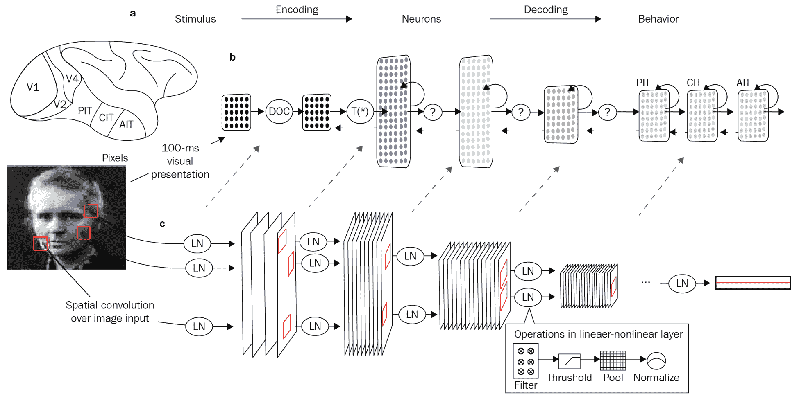

# 第一章：人工智能的概念和基础

本章作为整本书的序章以及书中相关概念的引导。我们将在足够高的层次上理解这些概念，以便我们能够理解本书中的构建内容。

我们将通过比较人工智能、机器学习和深度学习来理解**人工智能**（**AI**）的整体结构及其构建块，因为这些术语可以互换使用。接着，我们将浏览人工神经网络（ANNs）的历史、演变和原理。然后，我们将深入了解 ANNs 和深度学习的基本概念和术语，这些将在全书中使用。之后，我们将简要了解 TensorFlow Playground，以巩固我们对 ANNs 的理解。最后，我们将以关于在哪里获取人工智能和 ANN 原理的更深理论参考的思考来结束本章，具体如下：

+   人工智能与机器学习与深度学习

+   人工智能的演变

+   人工神经网络（ANNs）的机制

+   生物神经元

+   人工神经元的工作原理

+   激活函数与成本函数

+   梯度下降、反向传播和 softmax

+   TensorFlow Playground

# 人工智能与机器学习与深度学习

**人工智能**（AI）并不是一个新术语，因为我们在线阅读了大量相关文章，并且有许多基于该主题的电影。所以，在我们进一步讨论之前，先退一步，从实践者的角度理解人工智能及其常见的术语。我们将清晰地区分机器学习、深度学习和人工智能，因为这些术语经常被交替使用：


人工智能是可以嵌入到机器中的能力，使得机器能够执行具有人的智能特征的任务。这些任务包括看见和识别物体、听见并区分声音、理解和领会语言以及其他类似的任务。

**机器学习**（**ML**）是人工智能（AI）的一个子集，涵盖了使这些类人任务成为可能的技术。因此，从某种意义上讲，机器学习是实现人工智能的手段。

本质上，如果我们不使用机器学习来实现这些任务，那么我们实际上是在试图编写数百万行复杂的代码，包括循环、规则和决策树。

机器学习赋予了机器在没有明确编程的情况下进行学习的能力。因此，机器学习不再是为每个可能的场景硬编码规则，而是通过提供任务执行方式和不应执行方式的示例来进行学习。然后，机器学习系统根据这些数据进行训练，以便它能自我学习。

ML 是一种人工智能方法，通过它我们可以完成诸如分组或聚类、分类、推荐、预测和数据预测等任务。常见的例子包括垃圾邮件分类、股市预测、天气预报等。

**深度学习** 是机器学习中的一种特殊技术，它模仿了人类大脑的生物结构，并通过神经网络来完成类似人类的任务。这是通过使用人工神经网络（ANNs）——一种通过算法堆叠解决问题的技术——来构建像大脑一样的神经网络，从而以类人甚至更高效的能力解决问题。

这些层通常被称为**深度网络**（深层架构），每一层都有一个可以训练解决的特定问题。目前，深度学习领域正处于前沿技术，应用包括自动驾驶、Alexa 和 Siri、机器视觉等。

在本书中，我们将执行使用这些深度网络（deepnets）构建的任务和应用，并通过构建我们自己的深度网络架构来解决使用案例。

# 人工智能的发展

要理解我们当前在人工智能领域所能做到的事情，我们需要对模仿人类大脑的概念的起源有一个基本的了解，并且了解这个概念是如何发展到如今，通过机器我们能够轻松解决视觉和语言任务，且具有类似人类的能力。

一切始于 1959 年，当时哈佛的几位科学家 Hubel 和 Wiesel 通过监测猫的大脑初级视觉皮层，进行猫视觉系统的实验。

**初级视觉皮层** 是大脑中位于后脑勺的一群神经元，负责处理视觉信息。它是大脑接收来自眼睛输入信号的第一部分，类似于人类大脑如何处理视觉信息。

科学家们从向猫展示复杂的图像（例如鱼、狗和人类）开始，并观察猫的初级视觉皮层。令他们失望的是，初期没有从初级视觉皮层得到任何反应。因此，令他们惊讶的是，在某次实验中，当他们移除幻灯片时，黑暗的边缘形成，导致一些神经元在初级视觉皮层中激活。


他们偶然发现，初级视觉皮层中的这些个体神经元或脑细胞会对不同特定方向的条形或黑暗边缘做出反应。这导致了一个理解：哺乳动物的大脑每个神经元处理的信息量非常小，随着信息从一个神经元传递到另一个神经元，越复杂的形状、边缘、曲线和阴影逐渐被理解。因此，这些持有非常基础信息的独立神经元需要一同激活，才能理解一个完整而复杂的图像。

之后，关于如何模仿哺乳动物大脑的进展曾一度停滞，直到 1980 年，福岛提出了神经认知网络（neocognitron）。**神经认知网络** 的灵感来自于一个想法：我们应该能够通过许多非常简单的表现形式，创造出越来越复杂的表现形式——就像哺乳动物的大脑一样！

以下是福岛（Fukushima）提出的神经认知网络（Neocognitron）工作原理的示意图：



他提出，为了识别你的祖母，初级视觉皮层中有许多神经元被激活，每个细胞或神经元理解你祖母最终图像的一个抽象部分。这些神经元以顺序、并行和协同的方式工作，最后会激活一个“祖母细胞”或神经元，只有在看到你的祖母时它才会被激活。

快进到今天（2010-2018），在 Yoshua Bengio、Yann LeCun 和 Geoffrey Hinton 的贡献下，他们被广泛称为*深度学习之父*。他们为我们今天所工作的 AI 领域做出了巨大的贡献。他们催生了机器学习的一种全新方法，其中特征工程被自动化。

不直接告诉算法它应该寻找什么，而是通过给它提供大量的例子让它自己搞清楚这一点，是最新的发展。这个原理的类比就像是教一个孩子区分苹果和橙子。我们会向孩子展示苹果和橙子的图片，而不仅仅是描述这两种水果的特征，比如形状、颜色、大小等。

以下图示展示了机器学习和深度学习的区别：


这是传统机器学习与使用神经网络（深度学习）进行机器学习的主要区别。在传统机器学习中，我们提供特征和标签，而在使用人工神经网络时，我们让算法自己解码特征。

我们生活在一个激动人心的时代，这个时代我们与深度学习之父共同度过，甚至在 Stack Exchange 等地方的在线交流中，我们还能看到 Yann LeCun 和 Geoffrey Hinton 的贡献。这就像是生活在尼古拉斯·奥托（内燃机的发明者）时代，并且向他写信，正是他启动了我们至今仍在演变的汽车革命。而未来 AI 的潜力将使汽车革命相形见绌。确实是一个令人兴奋的时代！

# 人工神经网络的机制

在本节中，我们将了解构建我们自己 AI 项目所需的基本要素。我们将掌握深度学习技术中常用的术语。

本节旨在提供高层次的基本理论，帮助你获得足够的洞察力，从而能够构建自己的深度神经网络，调整它们，并理解构建最先进的神经网络所需的条件。

# 生物神经元

我们之前讨论过生物大脑如何成为人工神经网络（ANN）的灵感来源。大脑由数百亿个独立的单元或细胞组成，这些单元被称为**神经元**。

以下图示展示了一个**神经元**，它有多个输入信号进入，称为**树突**。还有一个从细胞体输出的信号，称为**轴突**：


树突将信息带入神经元，而轴突则允许处理后的信息从神经元流出。但实际上，有成千上万的树突将输入以微小电荷的形式传递给神经元。如果这些由树突携带的微小电荷对神经元主体的总电荷产生影响，或超过某个阈值，那么轴突将会触发。

现在我们了解了生物神经元的工作原理，接下来我们将理解人工神经元是如何工作的。

# 人工神经元的工作原理

就像生物大脑一样，人工神经网络（ANN）由独立的单元组成，这些单元被称为神经元。像生物神经元一样，人工神经元也有一个进行计算的主体，并且有许多输入馈送到细胞体或神经元：


例如，假设我们有三个输入到神经元。每个输入携带一个 0 或 1 的二进制值。我们有一个从主体流出的输出，它也携带一个 0 或 1 的二进制值。对于这个示例，神经元决定我今天是否应该吃蛋糕。也就是说，如果我应该吃蛋糕，神经元应输出 1；如果不该吃蛋糕，则输出 0：


在我们的示例中，三个输入代表了决定我是否应该吃蛋糕的三个因素。每个因素都有一个重要性权重；例如，第一个因素是 **昨天我做了有氧运动**，权重为 2。第二个因素是 **昨天我去了健身房**，权重为 3。第三个因素是 **这是一个吃蛋糕的场合**，权重为 6。

神经元的主体对输入进行一些计算，比如将所有这些输入相加并检查它们是否超过某个阈值：


所以，对于这个示例，我们设定阈值为 4。如果输入权重的总和超过阈值，则神经元输出 1，表示我可以吃蛋糕。

这可以表示为一个方程式：

** **

这里适用以下内容：

+   *Xi* 是第一个输入因素，*昨天我做了有氧运动*。

+   *Wi* 是第一个输入因素 *Xi* 的权重。在我们的示例中，*Wi = 2*。

+   *Xii* 是第二个输入因素，*昨天我去了健身房*。

+   *Wii* 是第二个输入因素 *Xii* 的权重。在我们的示例中，*Wii = 3*。

+   *Xiii* 是第三个输入因素，*这是一个吃蛋糕的场合*。

+   *Wiii* 是第三个输入因素 *Xiii* 的权重。在我们的示例中，*Wiii= 6*。

+   *阈值* 为 4。

现在，让我们用这个神经元来决定在三种不同的情况下我是否可以吃蛋糕。

# 情境 1

我想吃蛋糕，昨天我去了健身房，但我没有做有氧运动，也不是吃蛋糕的场合：


这里适用以下内容：

+   *Xi* 是第一个输入因素，*昨天我做了有氧运动*。现在，*Xi = 0*，因为这是假的。

+   *Wi* 是第一个输入因素 *Xi* 的权重。在我们的例子中，*Wi = 2*。

+   *Xii* 是第二个输入因素 *我昨天去了健身房*。现在，*Xii = 1*，因为这是正确的。

+   *Wii* 是第二个输入因素 *Xii* 的权重。在我们的例子中，*Wii* = 3。

+   *Xiii* 是第三个输入因素，*这时是吃蛋糕的时机*。现在，*Xiii = 0*，因为这个条件是错误的。

+   *Wiii* 是第三个输入因素 *Xiii* 的权重。在我们的例子中，*Wiii* = 6。

+   *threshold* 是 4。

我们知道神经元计算以下方程：


对于场景 1，方程将转化为以下形式：


这等于这个：


*3 ≥ 4* 是假的，所以它输出 0，这意味着我不应该吃蛋糕。

# 场景 2

我想吃蛋糕，而且今天是我的生日，但我没有做有氧运动，也没有去健身房：


这里，以下条件成立：

+   *Xi* 是第一个输入因素，*我昨天做了有氧运动*。现在，*Xi = 0*，因为这个因素是错误的。

+   *Wi* 是第一个输入因素 *Xi* 的权重。在我们的例子中，*Wi = 2*。

+   *Xii* 是第二个输入因素 *我昨天去了健身房*。现在，*Xii = 0*，因为这个因素是错误的。

+   *Wii* 是第二个输入因素 *Xii* 的权重。在我们的例子中，*Wii* = 3。

+   *Xiii* 是第三个输入因素，*这时是吃蛋糕的时机*。现在，*Xiii = 1*，这个因素为真。

+   *Wiii* 是第三个输入因素 *Xiii* 的权重。在我们的例子中，*Wiii* = 6。

+   *threshold* 是 4。

我们知道神经元计算以下方程：


对于场景 2，方程将转化为以下形式：


这将给我们以下输出：


*6 ≥ 4* 为真，所以它输出 1，这意味着我可以吃蛋糕。

# 场景 3

我想吃蛋糕，我昨天做了有氧运动并去了健身房，但这也不是吃蛋糕的时机：


这里，以下条件成立：

+   *Xi* 是第一个输入因素 *我昨天做了有氧运动*。现在，*Xi = 1*，因为这个因素为真。

+   *Wi* 是第一个输入因素 *Xi* 的权重。在我们的例子中，*Wi = 2*。

+   *Xii* 是第二个输入因素，*我昨天去了健身房*。现在，*Xii = 1*，因为这个因素为真。

+   *Wii* 是第二个输入因素 *Xii* 的权重。在我们的例子中，*Wii* = 3。

+   *Xiii* 是第三个输入因素，*这时是吃蛋糕的时机*。现在，*Xiii = 0*，因为这个因素是错误的。

+   *Wiii* 是第三个输入因素 *Xiii* 的权重。在我们的例子中，*Wiii* = 6。

+   *threshold* 是 4。

我们知道神经元计算以下方程：


对于场景 3，方程将转化为以下形式：


这给我们以下方程：


*5 ≥ 4* 为真，所以它触发 1，这意味着我可以吃蛋糕。

从之前的三个场景中，我们看到一个单一的人工神经元是如何工作的。这个单元也叫做**感知机**。感知机本质上处理二进制输入，计算总和，然后与阈值进行比较，最终给出二进制输出。

为了更好地理解感知机（perceptron）是如何工作的，我们可以将前面的方程式转化为一个更通用的形式，以便解释。

假设为了简化起见，只有一个输入因素：

****

假设*阈值 = b*。我们的方程式如下：

****

它现在变成了这样：


它也可以写作！[](img/d3f7ba54-6bfa-4cc9-a9b2-6ab7de85e569.png)，然后输出`1`否则`0`*。

这里适用以下规则：

+   `w`是输入的**权重**。

+   `b`是阈值，称为**偏置**。

这条规则总结了感知机神经元的工作原理。

就像哺乳动物的大脑一样，人工神经网络由许多这样的感知机组成，它们被堆叠并分层在一起。在下一部分，我们将了解这些神经元如何在人工神经网络中协同工作。

# 人工神经网络（ANN）

就像生物神经元一样，人工神经元也并不是孤立存在的。它们存在于一个由其他神经元组成的网络中。基本上，神经元通过互相传递信息来存在；一些神经元的输出是其他神经元的输入。

在任何人工神经网络（ANN）中，第一个层被称为**输入层**。这些输入是真实值，比如我们之前示例中的带权重的因素（*w.x*）。从输入层传递的总和值会传播到下一层的每个神经元。该层的神经元进行计算并将它们的输出传递到下一层，以此类推：


接收来自所有前一层神经元的输入并将其输出传递给下一层所有神经元的层叫做**密集层**。由于这一层连接着前一层和下一层的所有神经元，它也常被称为**全连接层**。

输入和计算从一层流向下一层，最终结束于**输出层**，它给出了整个人工神经网络的最终估计值。

输入层和输出层之间的层被称为**隐藏层**，因为这些隐藏层内神经元的值对从业者来说是未知的，完全是一个黑箱。

随着层数的增加，你会增加网络的抽象程度，进而提高网络解决更复杂问题的能力。当隐藏层超过三层时，就被称为深度网络（deepnet）。

所以，如果这是一个机器视觉任务，那么第一层隐藏层将寻找边缘，下一层会寻找角落，再下一层寻找曲线和简单的形状，以此类推：


因此，问题的复杂性可以决定所需的层数；更多的层会导致更多的抽象。这些层可以非常深，达到 1,000 层或更多，也可以非常浅，只有大约六层。增加隐藏层的数量不一定能得到更好的结果，因为抽象可能是多余的。

到目前为止，我们已经看到如何将人工神经元堆叠在一起形成神经网络。但我们已经看到，感知机神经元只能接受二进制输入，并且只给出二进制输出。但在实践中，基于感知机思想做事情会出现问题。这个问题就是通过激活函数来解决的。

# 激活函数

我们现在知道，人工神经网络（ANN）是通过堆叠单个计算单元（称为感知机）来创建的。我们也已经看到感知机是如何工作的，并将其总结为*输出 1，如果*！[](img/87250af0-6998-4cbb-b723-de4fc5b87ba3.png)**。

也就是说，它根据权重`w`和偏置`b`的值，输出`1`或`0`。

让我们看一下下面的图表，以了解为什么仅仅输出`1`或`0`会出现问题。以下是一个简单感知机的图表，只有一个输入，`x`：


为了简单起见，假设！[](img/9105c1c0-e7e4-4706-8721-579dc2c88c01.png)，其中适用以下情况：

+   `w` 是输入的权重，`x`，`b` 是偏置。

+   `a` 是输出，可以是`1`或`0`。

在这里，当`z`的值发生变化时，输出`a`会在某个点从`0`变为`1`。正如你所看到的，输出`a`的变化是突然和剧烈的：


这意味着，对于某些小的变化，，我们会得到输出`a`的剧烈变化。如果每个感知机都有如此剧烈的变化，那么它会导致网络不稳定，因此网络无法学习。

因此，为了使网络更高效、更稳定，我们需要减缓每个感知机学习的方式。换句话说，我们需要消除从`0`到`1`的突变，转而进行更渐进的变化：


这是通过激活函数来实现的。激活函数是应用于感知机的函数，使其不再输出`0`或`1`，而是输出介于`0`和`1`之间的任何值。

这意味着每个神经元可以通过使用更小的变化来更慢地学习，并且能够以更大的细节进行学习，。激活函数可以被看作是转换函数，用于将二进制值转换为介于给定最小值和最大值之间的更小的值序列。

有多种方法可以将二进制输出转化为一系列值，分别是 Sigmoid 函数、**tanh** 函数和 ReLU 函数。我们现在将快速浏览这些激活函数。

# Sigmoid 函数

**Sigmoid 函数**是一个数学函数，对于任何输入，它都会输出一个介于 0 和 1 之间的值：


这里， 和 。

让我们通过一些简单的代码更好地理解 Sigmoid 函数。如果你没有安装 Python，没关系：我们现在将使用一个在线替代方案，网址是 [`www.jdoodle.com/python-programming-online`](https://www.jdoodle.com/python-programming-online)。我们将在 第二章 *创建一个房地产价格预测移动应用* 中从零开始进行完整的设置。目前，让我们继续使用这个在线替代方案。

一旦我们加载了页面 [`www.jdoodle.com/python-programming-online`](https://www.jdoodle.com/python-programming-online)，我们可以逐步浏览代码并理解 Sigmoid 函数：

1.  首先，让我们导入 `math` 库，这样我们就可以使用指数函数：

```py
from   math   import  e
```

1.  接下来，让我们定义一个名为 `sigmoid` 的函数，基于之前的公式：

```py
def sigmoid ( x ):    
    return 1 / ( 1 + e **- x )
```

1.  假设我们的 `z` 非常小，比如 `-10`，因此该函数将输出一个非常小且接近 0 的数字：

```py
sigmoid(-10) 
4.539786870243442e-05
```

1.  如果 `z` 非常大，比如 `10000`，那么该函数将输出最大可能值 1：

```py
sigmoid(10000)  
1.0
```

因此，Sigmoid 函数将任何值 `z` 转换为介于 0 和 1 之间的值。当 Sigmoid 激活函数在神经元上使用时，而不是传统的感知机算法，我们得到的就是所谓的 **Sigmoid 神经元**：

# Tanh 函数

与 Sigmoid 神经元类似，我们可以应用一个名为 tanh(`z`) 的激活函数，它将任何值转换为介于 -1 和 1 之间的值。

使用这个激活函数的神经元被称为**tanh 神经元**：


# ReLU 函数

然后有一个激活函数，称为 **修正线性单元**，**ReLU(z)**，它将任何值 `z` 转换为 0 或大于 0 的值。换句话说，它将小于 0 的任何值输出为 0，而将大于 0 的任何值输出为其本身：


简要总结我们目前的理解，感知机是传统的、过时的神经元，在实际应用中很少使用。它们非常适合帮助我们简单理解底层原理；然而，由于输出值的剧烈变化，它们存在快速学习的问题。

我们使用激活函数来减少学习速度，并确定 `z` 或  的细微变化。让我们总结一下这些激活函数：

+   **sigmoid 神经元** 是使用 sigmoid 激活函数的神经元，它将输出转化为介于 0 和 1 之间的值。

+   **tanh 神经元** 是使用 tanh 激活函数的神经元，它将输出转化为介于 -1 和 1 之间的值。

+   **ReLU 神经元** 是使用 ReLU 激活函数的神经元，它将输出转化为 0 或任何大于 0 的值。

Sigmoid 函数在实际中被使用，但与 tanh 和 ReLU 函数相比较慢。tanh 和 ReLU 函数是常用的激活函数。ReLU 函数也被认为是最先进的，通常是构建人工神经网络（ANN）时首选的激活函数。

以下是常用的激活函数列表：


在本书中的项目中，我们将主要使用 sigmoid、tanh 或 ReLU 神经元来构建人工神经网络（ANN）。

# 代价函数

快速回顾一下，我们已经了解了基本的感知机工作原理及其局限性。然后，我们看到激活函数如何克服了感知机的缺陷，从而诞生了今天使用的其他神经元类型。

现在，我们将探讨如何判断神经元的输出是否错误。任何类型的神经元要学习，都需要知道何时输出了错误的值以及错误的幅度。衡量神经网络错误的最常见方法是使用代价函数。

**代价函数** 定量化了神经元输出与我们需要的输出之间的差异。常用的两种代价函数是均方误差和交叉熵。

# 均方误差

**均方误差**（**MSE**）也被称为二次代价函数，因为它使用平方差来衡量误差的大小：


这里，适用以下公式：

+   `a` 是来自人工神经网络（ANN）的输出

+   `y` 是期望的输出

+   `n` 是使用的样本数

代价函数相当直接。例如，考虑一个只有一个样本的单神经元（*n=1*）。如果期望的输出是 2 (*y=2*)，而神经元的输出是 3 (*a=3*)，则 MSE 如下所示：


类似地，如果期望的输出是 3 (*y=3*)，而神经元输出是 2 (*a=2*)，那么 MSE 如下所示：


因此，均方误差（MSE）量化了神经元所犯错误的大小。MSE 的问题之一是，当网络中的数值变得很大时，学习会变得很慢。换句话说，当权重（`w`）和偏差（`b`）或 `z` 很大时，学习会变得非常慢。请记住，我们讨论的是人工神经网络（ANN）中的成千上万个神经元，这就是为什么当学习变得缓慢并最终停滞时，不再有任何进一步的学习。

# 交叉熵

**交叉熵** 是一种基于导数的函数，因为它使用了一个特别设计的方程的导数，该方程如下所示：


交叉熵使得当预期输出和实际输出之间的差距较大时，网络可以更快地学习。换句话说，错误越大，它越能帮助网络加速学习。我们将通过一些简单的代码来理解这一点。

和之前一样，如果你没有安装 Python，可以使用在线替代工具，网址为 [`www.jdoodle.com/python-programming-online`](https://www.jdoodle.com/python-programming-online)。我们将在第二章《创建一个房地产价格预测 *移动应用*》中讲解安装和设置。请按照以下步骤，了解网络如何通过交叉熵学习：

1.  首先，让我们导入 `math` 库，以便使用 `log` 函数：

```py
from numpy import log  
```

1.  接下来，让我们定义一个名为 `cross_entropy` 的函数，基于前面的公式：

```py
def cross_entropy(y,a): 
    return -1 *(y*log(a)+(1-y)*log (1-a))
```

1.  例如，考虑一个只有一个样本的单个神经元（*n=1*）。假设预期输出是 `0` (*y=0*)，而神经元的输出是 `0.01` (*a=0.01*)：

```py
cross_entropy(0, 0.01)
```

输出结果如下：

```py
0.010050335853501451
```

由于预期输出和实际输出值非常小，结果的成本也非常小。

同样地，如果预期输出和实际输出值非常大，那么结果的成本仍然很小：

```py
cross_entropy(1000,999.99) 
```

输出结果如下：

```py
0.010050335853501451
```

同样地，如果预期输出与实际输出之间的差距很大，那么结果的成本也会很大：

```py
cross_entropy(0,0.9) 
```

输出结果如下：

```py
2.3025850929940459
```

因此，预期输出与实际输出之间的差异越大，学习速度就越快。通过使用交叉熵，我们可以获得网络的误差，同时，权重和偏差的大小并不重要，有助于网络更快地学习。

# 梯度下降

到目前为止，我们已经涵盖了基于激活函数使用的不同类型的神经元。我们已经讨论了如何使用成本函数来量化神经元输出的误差。现在，我们需要一个机制来解决这个误差。

网络能够学习输出接近预期或期望输出值的机制被称为 **梯度下降**。梯度下降是机器学习中常用的一种方法，用于寻找最低成本。

为了理解梯度下降，让我们使用我们迄今为止一直在使用的单个神经元方程：


这里，以下公式适用：

+   `x`是输入

+   `w`是输入的权重

+   `b`是输入的偏置

梯度下降可以表示如下：


最初，神经元通过为`w`和`b`分配随机值来开始。从那时起，神经元需要调整`w`和`b`的值，以便降低或减少误差或成本（交叉熵）。

对交叉熵（成本函数）求导，会导致`w`和`b`朝着最低成本的方向逐步变化。换句话说，**梯度下降**尝试找到网络输出与预期输出之间的最佳线。

权重会根据一个叫做**学习率**的参数进行调整。学习率是调整神经元权重的值，以使输出更接近预期输出。

请记住，这里我们只用了一个单一的参数；这是为了让事情更容易理解。实际上，考虑到降低成本，会有成千上万的参数需要考虑。

# 反向传播——一种让神经网络学习的方法

太好了！我们已经走了很长一段路，从观察生物学神经元，到研究神经元类型，再到确定准确性并纠正神经元的学习。只剩下一个问题：*整个神经网络如何一起学习？*

**反向传播**是一种非常聪明的方式，使梯度下降能够遍及整个网络的所有层。反向传播利用微积分中的链式法则，使得信息可以在网络中前后传递：


原则上，输入参数和权重的信息会通过网络传播，猜测预期输出，然后整体的不准确性通过网络的各层进行反向传播，以便调整权重并重新猜测输出。

这个学习的单一循环叫做**训练步骤**或**迭代**。每次迭代都是在输入训练样本的一批数据上进行的。每批样本中的样本数叫做**批量大小**。当所有的输入样本都经历了一次迭代或训练步骤，那么这就叫做一个**周期**。

举个例子，假设有 100 个训练样本，每次迭代或训练步骤中，网络使用 10 个样本来学习。那么，我们可以说批量大小是 10，并且它需要 10 次迭代才能完成一个周期。如果每个批次的样本是独特的，也就是说每个样本至少被网络使用一次，那么这就是一个周期。

这种预测输出和成本在网络中前后传播的方式就是网络如何学习的过程。

在我们的实践环节中，我们将重新讨论训练步骤、周期、学习率、交叉熵、批量大小等内容。

# Softmax

我们已经到达本章的最后一个概念性主题。我们已经讨论了神经元类型、成本函数、梯度下降，最后是应用梯度下降跨越网络的机制，使得在多次迭代中学习成为可能。

之前，我们看到了 ANN 的输入层和密集层或隐藏层：


**Softmax**是一种特殊的神经元，用于输出层中描述各输出的概率：


为了理解 softmax 方程及其概念，我们将使用一些代码。像以前一样，现在你可以使用任何在线 Python 编辑器来跟随代码。

首先，从`math`库中导入指数方法：

```py
     from math import exp 
```

为了这个例子，假设这个网络被设计为分类三个可能的标签：`A`、`B`和`C`。假设从前面的层有三个信号输入到 softmax（-1，1，5）：

```py
    a=[-1.0,1.0,5.0]

```

解释如下：

+   第一个信号表明输出应该是`A`，但信号较弱，其值为-1。

+   第二个信号表明输出应该是`B`，并且略强，值为 1。

+   第三个信号最强，表明输出应该是`C`，其值为 5。

这些表示的值是对预期输出的置信度度量。

现在，我们来查看 softmax 中第一个信号的分子，猜测输出是`A`：


在这里，`M`是表示输出应该是`A`的输出信号强度：

```py
exp(a[0]) # taking the first element of a[-1,1,5] which represents A

0.36787944117144233
```

接下来，这是 softmax 中第二个信号的分子，猜测输出是`B`：


在这里，`M`是表示输出应该是`B`的输出信号强度：

```py
exp(a[0]) # taking the second element of a[-1,1,5] which represents B

2.718281828459045
```

最后，这是 softmax 中第二个信号的分子，猜测输出是`C`：


在这里，`M`是表示输出应该是`C`的输出信号强度：

```py
exp(a[2]) 
# taking the third element of a[-1,1,5] which represents C

148.4131591025766
```

我们可以观察到，表示的置信度值总是大于 0，并且结果会被指数级放大。

现在，让我们解释 softmax 函数的分母，它是每个信号值的指数和：


让我们为 softmax 函数写一些代码：

```py
sigma = exp ( a [ 0 ]) + exp ( a [ 1 ]) + exp ( a [ 2 ]) 
sigma

151.49932037220708
```

因此，第一个信号正确的概率如下：

```py
exp(a[0])/sigma

0.0024282580295913376
```

这意味着`A`的概率不到 1%。

同样，第三个信号正确的概率如下：

```py
exp(a[2])/sigma

0.9796292071670795
```

这意味着预期输出是`C`的概率超过 97%。

本质上，softmax 接受一个加权信号，表示某个类别预测的置信度，并输出一个介于 0 到 1 之间的概率分数，针对所有这些类别。

很棒！我们已经掌握了实现项目所需的基本高层理论。接下来，我们将通过探索 TensorFlow Playground 来总结我们对这些概念的理解。

# TensorFlow Playground

在我们开始使用 TensorFlow Playground 之前，让我们快速回顾一下基本概念。这将帮助我们更好地理解 TensorFlow Playground。

神经网络的灵感来源于生物大脑，而大脑中的最小单元是 **神经元**。

**感知器（Perceptron）** 是一种基于生物神经元概念的神经元。感知器基本上处理二进制输入和输出，这使得它在实际应用中不太可行。此外，由于其二进制性质，它对输入的微小变化会产生剧烈的输出变化，因此学习速度过快，无法提供细节。

**激活函数** 用于解决感知器的问题。这催生了其他类型的神经元，这些神经元处理介于 0 到 1、-1 到 1 等区间之间的值，而不仅仅是 0 或 1。

**人工神经网络（ANNs）** 由这些堆叠在各层中的神经元组成。它包括输入层、密集层或全连接层，以及输出层。

**代价函数**，如均方误差（MSE）和交叉熵（cross entropy），是衡量神经元输出误差大小的方式。

**梯度下降** 是一种机制，通过它，神经元可以学习输出更接近期望或目标输出的值。

**反向传播** 是一种非常聪明的方法，它使梯度下降在网络中的所有层中得以实现。

每次反向传播或预测输出与成本在网络中的迭代过程称为 **训练步骤**。

**学习率** 是在每次训练步骤中调整神经元权重的值，以使输出更接近期望的输出。

**Softmax** 是一种特殊的神经元，它接受一个加权信号，表示某个类别预测的置信度，并为所有这些类别输出一个介于 0 到 1 之间的概率值。

现在，我们可以访问 TensorFlow Playground：[`Playground.tensorflow.org`](https://playground.tensorflow.org)。TensorFlow Playground 是一个在线工具，用于可视化人工神经网络（ANN）或深度网络的运行，是一个很好的地方，可以直观地重复我们在概念上学到的内容。

现在，废话不多说，让我们开始使用 TensorFlow Playground。页面加载完成后，您将看到一个仪表板，可以创建自己的神经网络来解决预定义的分类问题。以下是默认页面及其各个部分的截图：


让我们来看一下这个截图中的各个部分：

+   第一部分：数据部分显示了选择预构建问题的选项，用于构建和可视化网络。第一个问题是选择的，基本上是区分蓝点和橙点。在下面，还有将数据分为训练集和测试集的控制项。还有一个参数用于设置批次大小。批次大小是每次训练步骤中输入到网络进行学习的样本数量。

+   第二部分：特征部分表示输入参数的数量。在这种情况下，选择了两个特征作为输入特征。

+   第三部分：隐藏层部分是我们可以创建隐藏层以增加复杂度的地方。这里还有控制项可以增加或减少每个隐藏层或全连接层中的神经元数量。在这个示例中，有两个隐藏层，分别包含 4 个和 2 个神经元。

+   第四部分：输出部分是我们可以看到损失或代价图表的地方，同时还可视化网络分离红点和蓝点的学习效果。

+   第五部分：这是调整网络调优参数的控制面板。它有一个小部件可以启动、暂停和刷新网络的训练。在它旁边是一个计数器，显示经过的训练轮数。接下来是学习率，表示权重调整的常数。然后是选择在神经元中使用的激活函数。最后，有一个选项可以指示可视化的问题类型，即分类或回归。在这个示例中，我们正在可视化一个分类任务。

+   目前我们将忽略正则化和正则化率，因为我们尚未以概念性的方式讲解这些术语。我们将在书中的后续部分介绍这些术语，当时会更容易理解它们的目的。

现在我们准备开始使用 TensorFlow Playground。我们将从第一个数据集开始，调整以下调优参数：

+   学习率 = 0.01

+   激活函数 = Tanh

+   正则化 = 无

+   正则化率 = 0

+   问题类型 = 分类

+   数据 = Circle

+   训练数据与测试数据的比例 = 50%

+   批次大小 = 10

+   特征 = X[1] 和 X[2]

+   两个隐藏/全连接层；第一个层有 4 个神经元，第二个层有 2 个神经元

现在通过点击仪表盘左上角的播放按钮开始训练。从播放/暂停按钮向右移动，我们可以看到已经经过的训练轮数。在大约 200 轮时，暂停训练并观察输出部分：


仪表盘的关键观察点如下：

+   我们可以在仪表盘的右侧看到网络的性能图。测试和训练损失分别是网络在测试和训练过程中的代价。如前所述，目标是最小化代价。

+   在下方，您将看到一个可视化图，展示了网络如何将蓝色点从橙色点中分离或分类。

+   如果我们将鼠标指针悬停在任何神经元上，我们可以看到该神经元已学会如何将蓝色点和橙色点分开。话虽如此，我们来仔细看看第二层的两个神经元，看看它们在这个任务中学到了什么。

+   当我们将鼠标悬停在第二层的第一个神经元上时，我们可以看到这个神经元已经很好地学会了当前的任务。相比之下，第二层的第二个神经元学到的任务知识较少。

+   这引出了从神经元中出来的虚线：它们是神经元的对应权重。蓝色虚线表示正权重，而橙色虚线表示负权重。它们通常被称为**张量**。

另一个关键观察是，第二层中的第一个神经元输出的张量信号比第二个神经元强。这表明该神经元在将蓝色和橙色点分离的整体任务中的影响力，而且当我们看到它与最终结果的可视化对比时，这一点非常明显。

现在，牢记我们在本章中学到的所有术语，我们可以通过改变参数来进行试验，看看这如何影响整个网络。甚至可以添加新的层和神经元。

TensorFlow Playground 是一个很好的地方，可以重温 ANNs 的基本原理和核心概念。

# 总结

到目前为止，我们已经在高层次上涵盖了基本概念，这足以让我们欣赏本书中将要做的实际操作。拥有概念性的理解已经足够让我们开始构建 AI 模型，但更深入的理解也是非常有用的。

在下一章中，我们将设置构建 AI 应用程序的环境，并创建一个小型的 Android 和 iOS 移动应用，能够使用基于 Keras 和 TensorFlow 构建的模型来预测房价。

# 进一步阅读

这里有一份资源列表，可以作为参考，以帮助我们更好地理解并深入探索 AI 和深度学习的概念：

+   *Neural Networks and deep learning*，[`neuralnetworksanddeeplearning.com/`](http://neuralnetworksanddeeplearning.com/)

+   Michael Taylor 的*Make Your Own Neural Network: An In-depth Visual Introduction For Beginners*，[`www.amazon.in/Machine-Learning-Neural-Networks-depth-ebook/dp/B075882XCP`](https://www.amazon.in/Machine-Learning-Neural-Networks-depth-ebook/dp/B075882XCP)

+   Tariq Rashid 的*Make Your Own Neural Network*，[`www.amazon.in/Make-Your-Own-Neural-Network-ebook/dp/B01EER4Z4G`](https://www.amazon.in/Make-Your-Own-Neural-Network-ebook/dp/B01EER4Z4G)

+   Nick Bostrom 的*Superintelligence*，[`en.wikipedia.org/wiki/Superintelligence:_Paths,_Dangers,_Strategies`](https://en.wikipedia.org/wiki/Superintelligence:_Paths,_Dangers,_Strategies)

+   Pedro Domingos 的*《大师算法》*，[`en.wikipedia.org/wiki/The_Master_Algorithm`](https://en.wikipedia.org/wiki/The_Master_Algorithm)

+   *《深度学习》*，[`www.deeplearningbook.org/`](http://www.deeplearningbook.org/)
