# 第二章：创建一个房地产价格预测移动应用

在上一章，我们讲解了理论基础；而本章将会介绍所有工具和库的设置。

首先，我们将设置环境，构建一个 Keras 模型，用于通过房地产数据预测房价。接着，我们将使用 Flask 构建一个 RESTful API 来提供此模型。然后，我们将为 Android 设置环境，并创建一个应用，该应用将调用此 RESTful API，根据房地产的特征预测房价。最后，我们将在 iOS 上重复相同的操作。

本章的重点是设置、工具、库，并应用在第一章中学到的概念，*人工智能概念与基础*。此用例设计简洁，但足够灵活，可以适应类似的用例。通过本章的学习，你将能轻松创建用于预测或分类任务的移动应用。

本章将涵盖以下内容：

+   设置人工智能环境

+   使用 Keras 和 TensorFlow 构建 ANN 模型进行预测

+   将模型作为 API 提供

+   创建一个 Android 应用来预测房价

+   创建一个 iOS 应用来预测房价

# 设置人工智能 环境

首先需要做的事情是安装 Python。我们将在本书中使用 Python 进行所有的**人工智能**（**AI**）任务。有两种方式可以安装 Python，一种是通过[`www.python.org/downloads/`](https://www.python.org/downloads/)提供的可执行文件下载安装，另一种是通过 Anaconda 安装。我们将采用后一种方式，也就是使用 Anaconda。

# 下载并安装 Anaconda

现在，让我们访问 Anaconda 的官方安装页面([`conda.io/docs/user-guide/install/index.html#regular-installation`](https://conda.io/docs/user-guide/install/index.html#regular-installation))，并根据你的操作系统选择合适的安装选项：

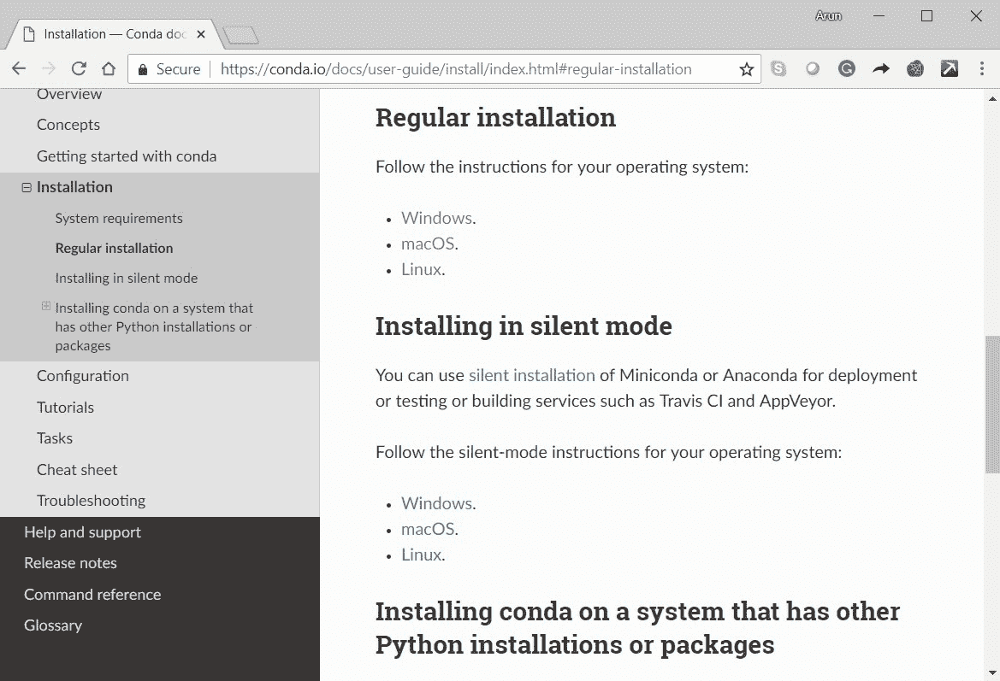

按照文档中的说明操作，安装过程需要一些时间。

安装完成后，让我们测试一下安装情况。打开命令提示符，输入`conda list`命令。你应该能看到一个包含所有已安装库和包的列表，这些库和包是通过 Anaconda 安装的：

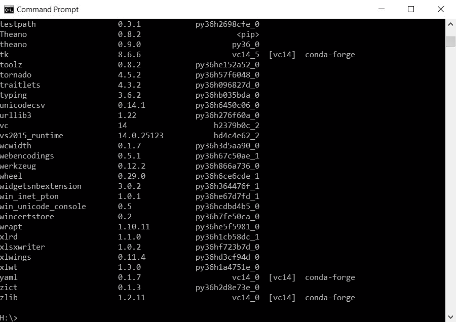

如果没有得到这个输出，请参考我们之前查看的官方文档页面，并重试。

# Anaconda 的优点

让我们讨论使用包管理工具的一些优点：

+   Anaconda 允许我们创建环境以安装库和包。这个环境完全独立于操作系统或管理员库。这意味着我们可以为特定项目创建自定义版本的库的用户级环境，从而帮助我们以最小的努力在不同操作系统之间迁移项目。

+   Anaconda 可以拥有多个环境，每个环境都有不同版本的 Python 和支持库。这样可以避免版本不匹配，并且不受操作系统中现有包和库的影响。

+   Anaconda 预装了大多数数据科学相关任务所需的包和库，包括一个非常流行的交互式 Python 编辑器——Jupyter Notebook。在本书中，我们将大量使用 Jupyter Notebook，特别是在需要交互式编码任务时。

# 创建 Anaconda 环境

我们将创建一个名为`ai-projects`的环境，使用 Python 版本 3.6。所有的依赖项都将安装在这个环境中：

```py
conda create -n ai-projects python=3.6 anaconda
```

现在，继续并接受你看到的提示，你应该看到如下的输出：

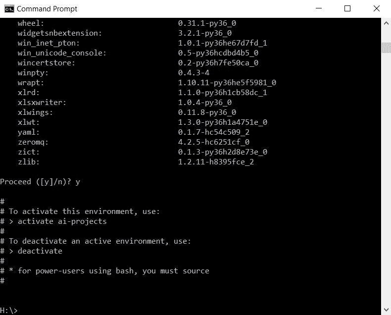

在我们开始安装依赖项之前，我们需要使用`activate ai-projects`命令激活我们刚刚创建的环境，如果你使用的是 bash shell，可以输入`source activate ai-projects`。提示符会发生变化，表明环境已被激活：

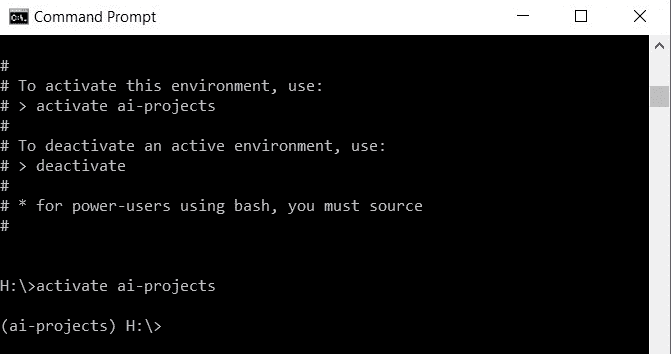

# 安装依赖项

首先，让我们安装 TensorFlow。它是一个开源框架，用于构建**人工神经网络**（**ANN**）：

```py
pip install tensorflow
```

你应该看到以下输出，表示安装成功：

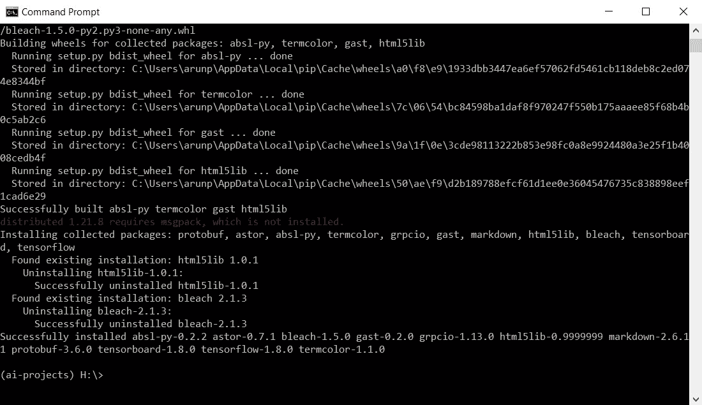

我们还可以手动检查安装情况。在命令行输入`python`打开 Python 提示符。进入 Python 提示符后，输入`import tensorflow`并按*Enter*。你应该看到以下输出：

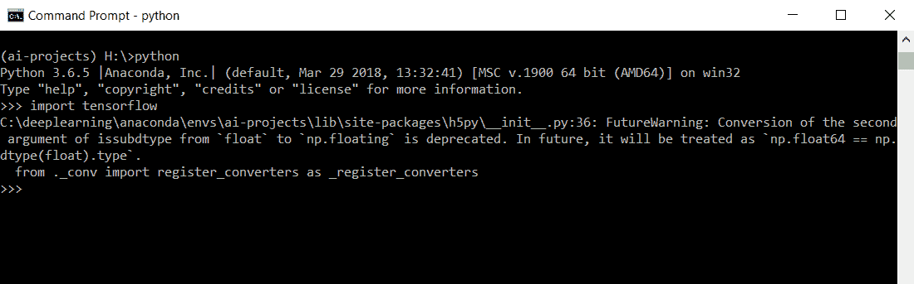

输入`exit()`返回到默认命令行，记住我们仍然在`ai-projects` conda 环境中。

接下来，我们将安装 Keras，它是 TensorFlow 的一个封装器，使得设计深度神经网络更加直观。我们继续使用`pip`命令：

```py
pip install keras
```

安装成功后，我们应该看到以下输出：

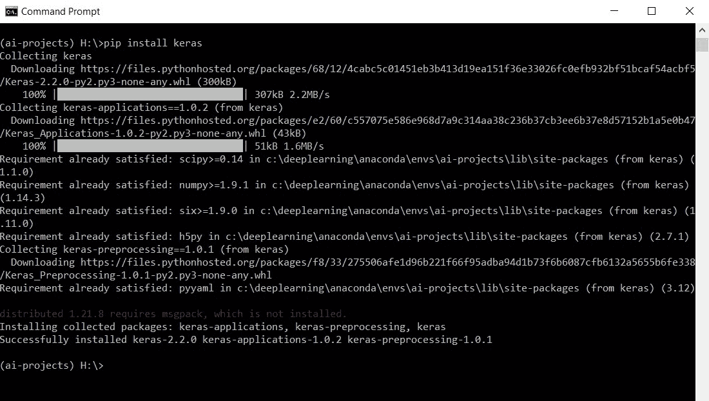

要手动检查安装情况，在命令行输入`python`打开 Python 提示符。进入 Python 提示符后，输入`import keras`并按*Enter*。你应该看到以下输出，没有错误。请注意，输出中提到 Keras 正在使用 TensorFlow 作为其后端：

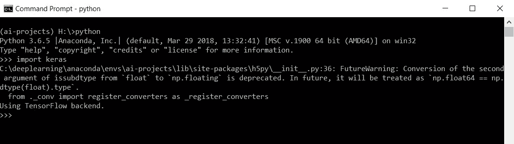

太好了！我们现在已经安装了创建我们自己神经网络所需的主要依赖项。接下来，让我们构建一个 ANN 来预测房地产价格。

# 使用 Keras 和 TensorFlow 构建用于预测的 ANN 模型

现在我们已经安装了必要的库，让我们创建一个名为`aibook`的文件夹，在其中创建另一个名为`chapter2`的文件夹。将本章的所有代码移动到`chapter2`文件夹中。确保 conda 环境仍然处于激活状态（提示符将以环境名称开头）：

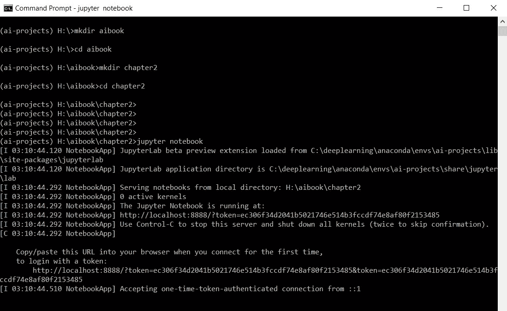

一旦进入`chapter2`文件夹，输入`jupyter notebook`。这将在浏览器中打开一个交互式 Python 编辑器。

在右上角使用“New”下拉菜单创建一个新的 Python 3 笔记本：

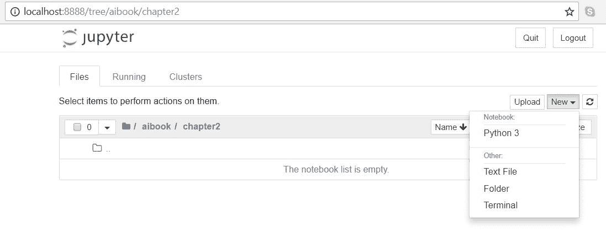

我们现在准备使用 Keras 和 TensorFlow 构建第一个 ANN 模型，用于预测房地产价格：

1.  导入我们为此练习所需的所有库。使用第一个单元格导入所有库并运行它。这里是我们将使用的四个主要库：

+   +   `pandas`：我们用它来读取数据并将其存储在数据框中

    +   `sklearn`：我们用它来标准化数据和进行 k 折交叉验证

    +   `keras`：我们用它来构建顺序神经网络

    +   `numpy`：我们使用`numpy`进行所有数学和数组操作

让我们导入这些库：

```py
import numpy
import pandas as pd
from keras.models import Sequential
from keras.layers import Dense
from keras import optimizers
from keras.wrappers.scikit_learn import KerasRegressor
from sklearn.model_selection import cross_val_score
from sklearn.model_selection import KFold
from sklearn.preprocessing import StandardScaler
from sklearn.pipeline import Pipeline
```

1.  使用`pandas`加载房地产数据：

```py
dataframe = pd.read_csv("housing.csv", sep=',', header=0)
dataset = dataframe.values
```

1.  要查看特征变量、目标变量以及数据的几行，请输入以下内容：

```py
dataframe.head()
```

这个输出将是几行`dataframe`，如以下截图所示：

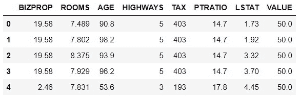

数据集有八列，每列的详细信息如下：

+   BIZPROP：每个城镇的非零售商业用地比例

+   ROOMS：每个住宅的平均房间数

+   AGE：建于 1940 年之前的自有住房单位的比例

+   HIGHWAYS：通往放射状高速公路的可达性指数

+   TAX：每$10,000 的全额财产税率

+   PTRATIO：每个城镇的师生比

+   LSTAT：低社会阶层人口的百分比

+   VALUE：拥有者自住住房的中位数价值，单位为千美元（目标变量）

在我们的应用场景中，我们需要预测 VALUE 列，因此我们需要将数据框分为特征和目标值。我们将使用 70/30 的分割比例，即 70%的数据用于训练，30%的数据用于测试：

```py
features = dataset[:,0:7]
target = dataset[:,7]
```

此外，为了确保我们能重现结果，我们为随机生成设置一个种子。这个随机函数在交叉验证时用于随机抽样数据：

```py
# fix random seed for reproducibility 
seed = 9 
numpy.random.seed(seed)
```

现在我们准备构建我们的人工神经网络（ANN）：

1.  创建一个具有简单且浅层架构的顺序神经网络。

1.  创建一个名为`simple_shallow_seq_net()`的函数，定义神经网络的架构：

```py
def simple_shallow_seq_net():
   # create a sequential ANN 
    model = Sequential() 
    model.add(Dense(7, input_dim=7, kernel_initializer='normal', activation='sigmoid')) 
    model.add(Dense(1, kernel_initializer='normal')) 
    sgd = optimizers.SGD(lr=0.01) 
    model.compile(loss='mean_squared_error', optimizer=sgd) 
    return model
```

1.  该函数执行以下操作：

```py
model = Sequential()
```

1.  创建一个顺序模型——顺序模型是一个通过线性堆叠的层构建的 ANN 模型：

```py
model.add(Dense(7, input_dim=7, kernel_initializer='normal', activation='sigmoid'))
```

1.  在这里，我们向这个顺序网络添加了一个具有七个神经元的稠密层或全连接层。此层接受具有`7`个特征的输入（因为有七个输入或特征用于预测房价），这由`input_dim`参数指示。此层所有神经元的权重都使用随机正态分布初始化，这由`kernel_initializer`参数指示。同样，此层所有神经元使用 sigmoid 激活函数，这由`activation`参数指示：

```py
model.add(Dense(1, kernel_initializer='normal'))
```

1.  添加一个使用随机正态分布初始化的单神经元层：

```py
sgd = optimizers.SGD(lr=0.01)
```

1.  设置网络使用**标量梯度下降**（**SGD**）进行学习，通常作为`optimizers`指定。我们还表明网络将在每一步学习中使用学习率（`lr`）为`0.01`：

```py
model.compile(loss='mean_squared_error', optimizer=sgd)
```

1.  指示网络需要使用**均方误差**（**MSE**）代价函数来衡量模型的误差幅度，并使用 SGD 优化器从模型的错误率或损失中学习：

```py
return model
```

最后，该函数返回一个具有定义规范的模型。

下一步是设置一个用于可重现性的随机种子；此随机函数用于将数据分成训练和验证集。使用的方法是 k-fold 验证，其中数据随机分为 10 个子集进行训练和验证：

```py
seed = 9 
kfold = KFold(n_splits=10, random_state=seed)
```

现在，我们需要适应这个模型以预测数值（在这种情况下是房价），因此我们使用`KerasRegressor`。`KerasRegressor`是一个 Keras 包装器，用于访问`sklearn`中的回归估计器模型：

```py
estimator = KerasRegressor(build_fn=simple_shallow_seq_netl, epochs=100, batch_size=50, verbose=0)
```

注意以下事项：

+   我们将`simple_shallow_seq_net`作为参数传递，以指示返回模型的函数。

+   `epochs`参数表示每个样本需要至少经过网络`100`次。

+   `batch_size`参数表示在每次学习周期中，网络同时使用`50`个训练样本。

下一步是训练和跨验证数据子集，并打印 MSE，这是评估模型表现的度量：

```py
results = cross_val_score(estimator, features, target, cv=kfold) 
print("simple_shallow_seq_model:(%.2f) MSE" % (results.std()))
```

这将输出 MSE - 如您所见，这个值相当高，我们需要尽可能地降低它：

```py
simple_shallow_seq_net:(163.41) MSE
```

保存这个模型以备后用：

```py
estimator.fit(features, target)
estimator.model.save('simple_shallow_seq_net.h5')
```

很好，我们已经建立并保存了第一个用于预测房地产价格的神经网络。我们接下来的努力是改进这个神经网络。在调整网络参数之前，首先尝试的是在标准化数据并使用它时提高其性能（降低 MSE）：

```py
estimators = [] 
estimators.append(('standardize', StandardScaler())) 
estimators.append(('estimator', KerasRegressor(build_fn=simple_shallow_seq_net, epochs=100, batch_size=50, verbose=0))) 
pipeline = Pipeline(estimators)
```

在上述代码中，我们创建了一个流水线来标准化数据，然后在每个学习周期中使用它。在以下代码块中，我们训练和交叉评估神经网络：

```py
results = cross_val_score(pipeline, features, target, cv=kfold) 
print("simple_std_shallow_seq_net:(%.2f) MSE" % (results.std()))
```

这将输出比以前好得多的 MSE，因此标准化和使用数据确实产生了差异：

```py
simple_std_shallow_seq_net:(65.55) MSE
```

保存这个模型与之前略有不同，因为我们使用了`pipeline`来拟合模型：

```py
pipeline.fit(features, target) 
pipeline.named_steps['estimator'].model.save('standardised_shallow_seq_net.h5')
```

现在，让我们调整一下我们的网络，看看能否获得更好的结果。我们可以从创建一个更深的网络开始。我们将增加隐藏层或全连接层的数量，并在交替的层中使用`sigmoid`和`tanh`激活函数：

```py
def deep_seq_net(): 
    # create a deep sequential model 
    model = Sequential() 
    model.add(Dense(7, input_dim=7, kernel_initializer='normal', activation='sigmoid')) 
    model.add(Dense(7,activation='tanh')) 
    model.add(Dense(7,activation='sigmoid')) 
    model.add(Dense(7,activation='tanh')) 
    model.add(Dense(1, kernel_initializer='normal')) 
    sgd = optimizers.SGD(lr=0.01) 
    model.compile(loss='mean_squared_error', optimizer=sgd) 
    return model
```

下一个代码块用于标准化训练数据中的变量，然后将浅层神经网络模型拟合到训练数据中。创建管道并使用标准化数据拟合模型：

```py
estimators = [] 
estimators.append(('standardize', StandardScaler())) estimators.append(('estimator', KerasRegressor(build_fn=deep_seq_net, epochs=100, batch_size=50, verbose=0))) 
pipeline = Pipeline(estimators)
```

现在，我们需要在数据的各个子集上交叉验证拟合模型并打印均方误差（MSE）：

```py
results = cross_val_score(pipeline, features, target, cv=kfold) 
print("simple_std_shallow_seq_net:(%.2f) MSE" % (results.std()))
```

这将输出一个比我们之前创建的浅层网络更好的 MSE：

```py
deep_seq_net:(58.79) MSE
```

保存模型以便后续使用：

```py
pipeline.fit(features, target) 
pipeline.named_steps['estimator'].model.save('deep_seq_net.h5')
```

因此，当我们增加网络的深度（层数）时，结果会更好。现在，让我们看看当我们加宽网络时会发生什么，也就是说，增加每一层中神经元（节点）的数量。我们定义一个深而宽的网络来解决这个问题，将每一层的神经元数增加到`21`。此外，这次我们将在隐藏层中使用`relu`和`sigmoid`激活函数：

```py
def deep_and_wide_net(): 
    # create a sequential model 
    model = Sequential() 
    model.add(Dense(21, input_dim=7, kernel_initializer='normal', activation='relu')) 
    model.add(Dense(21,activation='relu')) 
    model.add(Dense(21,activation='relu')) 
    model.add(Dense(21,activation='sigmoid')) 
    model.add(Dense(1, kernel_initializer='normal')) 
    sgd = optimizers.SGD(lr=0.01) 
    model.compile(loss='mean_squared_error', optimizer=sgd) 
    return model
```

下一个代码块用于标准化训练数据中的变量，然后将深而宽的神经网络模型拟合到训练数据中：

```py
estimators = [] 
estimators.append(('standardize', StandardScaler())) 
estimators.append(('estimator', KerasRegressor(build_fn=deep_and_wide_net, epochs=100, batch_size=50, verbose=0))) 
pipeline = Pipeline(estimators)
```

现在，我们需要在数据的各个子集上交叉验证拟合模型并打印均方误差（MSE）：

```py
results = cross_val_score(pipeline, features, target, cv=kfold) 
print("deep_and_wide_model:(%.2f) MSE" % (results.std()))
```

这次，MSE 再次优于我们之前创建的网络。这是一个很好的例子，展示了更深的网络和更多的神经元如何更好地抽象问题：

```py
deep_and_wide_net:(34.43) MSE
```

最后，保存网络以便后续使用。保存的网络模型将在下一节中使用，并通过 REST API 提供服务：

```py
pipeline.fit(features, target) 
pipeline.named_steps['estimator'].model.save('deep_and_wide_net.h5')
```

到目前为止，我们已经能够利用各种网络架构构建一个用于预测的序列神经网络。作为练习，尝试以下内容：

+   尝试调整网络的形状；玩玩网络的深度和宽度，看看它如何影响输出结果

+   尝试不同的激活函数（[`keras.io/activations/`](https://keras.io/activations/)）

+   尝试不同的初始化器，这里我们只使用了随机正态初始化器（[`keras.io/initializers/`](https://keras.io/initializers/)）

+   我们在这里使用的数据是为了演示该技术，因此可以尝试在其他数据集上使用上述技术进行预测的不同用例（[`data.world/datasets/prediction`](https://data.world/datasets/prediction)）

我们将在第四章，*构建一个用于分类花卉物种的机器视觉移动应用程序*中了解更多关于优化器和正则化器的知识，这些是你可以用来调整网络的其他参数。我们创建 ANN 模型的完整代码作为 Python 笔记本文件，名为`sequence_networks_for_prediction.ipynb`。

# 将模型作为 API 提供服务

现在我们已经创建了一个预测模型，接下来需要通过 RESTful API 来服务这个模型。为此，我们将使用一个轻量级的 Python 框架 Flask：[`flask.pocoo.org/`](http://flask.pocoo.org/)。

如果我们的 conda 环境中尚未安装 `Flask` 库，首先安装它：

```py
pip install Flask
```

# 构建一个简单的 API 来添加两个数字

现在我们将构建一个非常简单的 API，以掌握 `Flask` 库和框架。这个 API 将接受一个包含两个数字的 JSON 对象，并返回这两个数字的和作为响应。

从 Jupyter 主页面打开一个新的 notebook：

1.  导入我们需要的所有库，并创建一个应用实例：

```py
from flask import Flask, request 
app = Flask(__name__)
```

1.  使用 `route()` 装饰器创建 RESTful API 的首页：

```py
@app.route('/') 
def hello_world(): 
 return 'This is the Index page'
```

1.  使用 `route()` 装饰器创建一个 `POST` API 来添加两个数字。这个 API 接受一个包含要添加的数字的 JSON 对象：

```py
@app.route('/add', methods=['POST']) 
def add(): 
    req_data = request.get_json() 
    number_1 = req_data['number_1'] 
    number_2 = req_data['number_2'] 
    return str(int(number_1)+int(number_2))
```

保存 Python notebook，并使用文件菜单将其下载为 Python 文件。将 Python 文件放置在与模型文件相同的目录中。

启动一个新的命令终端，进入包含此 Python 文件和模型的文件夹。确保激活 conda 环境，并运行以下命令启动一个服务器来运行简单的 API：

+   如果你在使用 Windows，输入以下命令：

```py
set FLASK_APP=simple_api
```

+   如果你不是在使用 Windows，输入以下命令：

```py
export FLASK_APP=simple_api
```

然后输入以下命令：

```py
flask run
```

当服务器启动时，你应该看到以下输出：

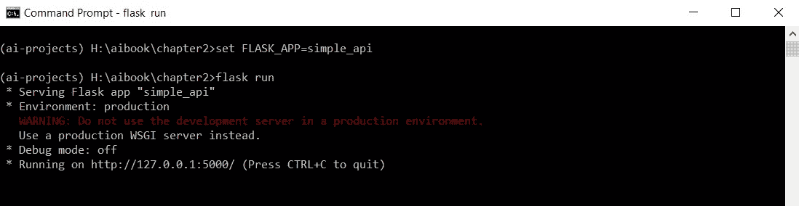

打开浏览器，将此地址粘贴到 URL 栏中以访问首页：`http://127.0.0.1:5000/`。以下是输出：

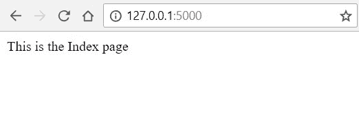

接下来，我们将使用 `curl` 来访问添加两个数字的 `POST` API。打开一个新的终端，并输入以下 curl 命令来测试 `/add` API。此示例中要添加的数字是 `1` 和 `2`，并作为 JSON 对象传递：

```py
curl -i -X POST -H "Content-Type: application/json" -d "{\"number_1\":\"1\",\"number_2\":\"2\"}" http://127.0.0.1:5000/add
```

如果没有错误，我们将收到一个包含数字和的响应：

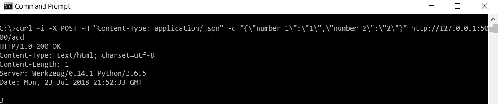

简单 API 的完整代码可以在名为 `simple_api.ipynb` 的 Python notebook 文件中找到，也可以在名为 `simple_api.py` 的 Python 文件中找到。

# 构建一个 API 来预测使用保存的模型进行房地产价格预测

现在我们已经了解了 `Flask` 的工作原理，我们需要实现一个 API 来服务我们之前构建的模型。启动一个新的 Jupyter Notebook 并按照以下步骤操作：

1.  导入所需的 Python 模块并创建一个 Flask 应用实例：

```py
from flask import Flask, request 
from keras.models import load_model
from keras import backend as K

import numpy 
app = Flask(__name__)
```

1.  使用 `route()` 装饰器为 RESTful API 创建 `Index page`：

```py
@app.route('/') 
def hello_world(): 
    return 'Index page'
```

1.  创建一个 `POST` API 来预测房价，使用 `route()` 装饰器。该 API 接受一个包含预测房价所需所有特征的 JSON 对象：

```py
@app.route('/predict', methods=['POST']) 
def add(): 
    req_data = request.get_json() 
     bizprop = req_data['bizprop'] 
    rooms = req_data['rooms'] 
    age = req_data['age'] 
    highways = req_data['highways'] 
    tax = req_data['tax'] 
    ptratio = req_data['ptratio'] 
    lstat = req_data['lstat'] 
    # This is where we load the actual saved model into new variable. 
    deep_and_wide_net = load_model('deep_and_wide_net.h5') 
    # Now we can use this to predict on new data 
    value = deep_and_wide_net.predict_on_batch(numpy.array([[bizprop, rooms, age  ,  highways   , tax   ,  ptratio  ,   lstat]], dtype=float)) 
    K.clear_session()

    return str(value)
```

保存 Python notebook，并使用文件菜单将其下载为 Python 文件。将 Python 文件放置在与模型文件相同的目录中。

启动新的命令终端并转到包含此 Python 文件和模型的文件夹。确保激活 conda 环境并运行以下内容以启动运行简单 API 的服务器：

+   如果您使用的是 Windows，请输入以下内容：

```py
set FLASK_APP=predict_api
```

+   如果您不使用 Windows，请使用以下内容：

```py
export FLASK_APP= predict_api
```

然后输入以下内容：

```py
flask run
```

接下来，我们将使用 `curl` 访问预测房价的 `POST` API。打开新的终端并输入以下 `curl` 命令以测试 `/predict` API。我们可以将要用作模型输入的特征作为 JSON 对象传递：

```py
curl -i -X POST -H "Content-Type: application/json" -d "{\"bizprop\":\"1\",\"rooms\":\"2\",\"age\":\"1\",\"highways\":\"1\",\"tax\":\"1\",\"ptratio\":\"1\",\"lstat\":\"1\"}" http://127.0.0.1:5000/predict
```

这将输出根据提供的特征预测的房价：

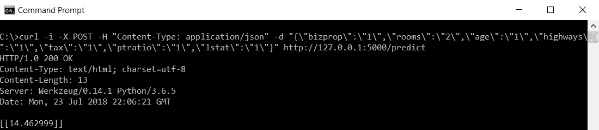

就这样！我们刚刚构建了一个 API 来提供我们的预测模型，并使用 `curl` 进行了测试。预测 API 的完整代码以 Python 笔记本 `predict_api.ipynb` 和 Python 文件 `simple_api.py` 的形式提供。

接下来，我们将看到如何制作一个移动应用程序，该应用程序将使用托管我们模型的 API。我们将首先创建一个使用预测 API 的 Android 应用程序，然后在 iOS 应用程序上重复相同的任务。

# 创建一个 Android 应用程序来预测房价

在本节中，我们将通过 Android 应用程序的 RESTful API 消耗模型。本节的目的是演示模型如何被 Android 应用程序消耗和使用。在这里，我们假设您熟悉 Java 编程的基础知识。相同的方法也可以用于任何类似的用例，甚至是 Web 应用程序。本节涵盖以下步骤：

+   下载并安装 Android Studio

+   创建一个具有单个屏幕的新 Android 项目

+   设计屏幕布局

+   添加接受输入功能

+   添加消耗模型提供的 RESTful API 功能

+   附加说明

# 下载并安装 Android Studio

Android Studio 是用于 Android 应用开发的开发环境和沙盒。所有我们的 Android 项目都将使用 Android Studio 制作。我们可以使用 Android Studio 创建、设计和测试应用程序，然后再发布它们。

前往官方 Android Studio 下载页面，[`developer.android.com/studio/`](https://developer.android.com/studio/)，并选择与您操作系统匹配的版本。在本例中，我们使用的是 Windows 可执行文件：

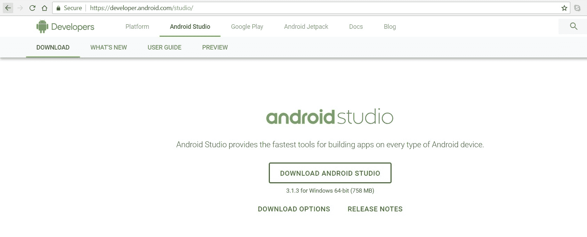

下载可执行文件后，运行以开始安装过程。您将看到逐步安装菜单选项。选择“下一步”并继续安装过程。在安装步骤中，大多数选项都将选择默认设置。

# 创建一个具有单个屏幕的新 Android 项目

现在我们已经安装了 Android Studio，我们将创建一个简单的应用程序来根据某些输入估算房地产的价格。

一旦启动 Android Studio，它将提供一个菜单来开始创建项目。点击“开始一个新的 Android Studio 项目”选项：

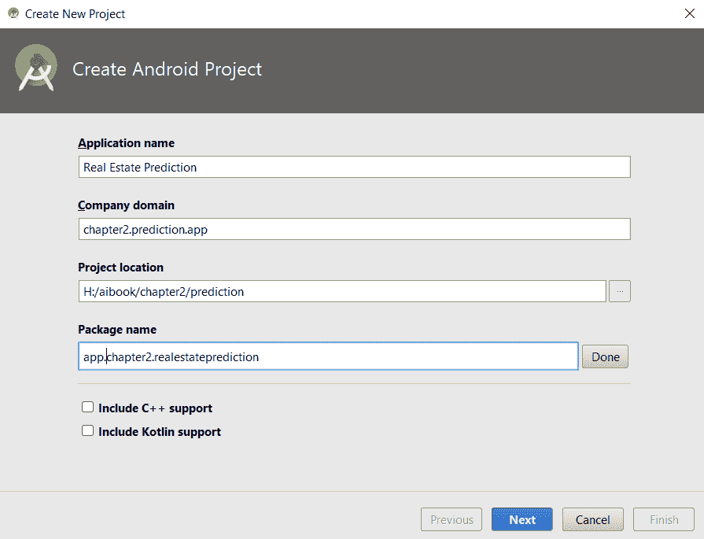

下一个对话框是选择应用名称和项目位置。选择你想要的，并点击下一步：


接下来，选择应用程序要运行的目标版本：

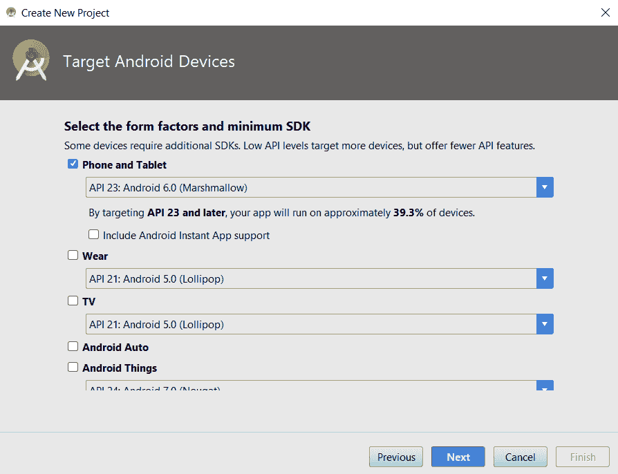

然后选择一个应用屏幕；在这种情况下，选择一个空白活动：

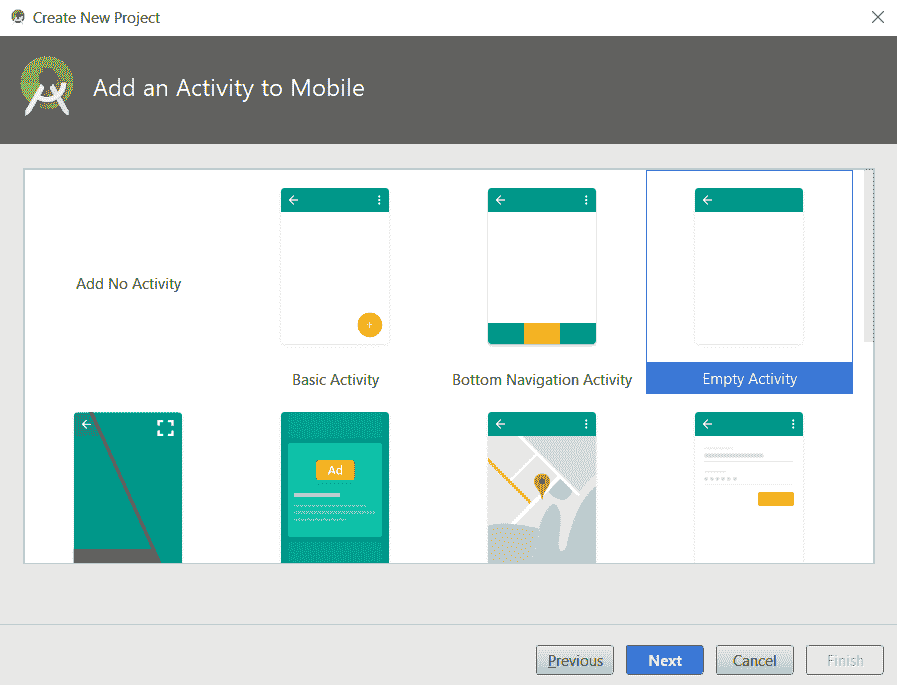

选择屏幕或活动名称以及相应的布局或活动屏幕的设计名称：

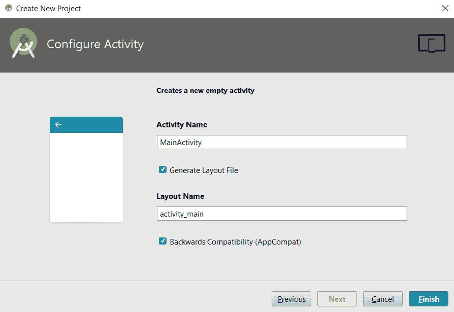

在构建完成后，项目应该会在几秒钟内加载。在项目结构中，有三个主要文件夹：

+   manifests：这个文件夹包含了用于权限和应用版本管理的 manifest 文件。

+   java：这个文件夹包含了所有的 Java 代码文件（java|app|chapter2|realestateprediction|MainActivity.java）。

+   res：这个文件夹包含了应用程序中使用的所有布局文件和媒体文件（res|layout|activity_main.xml）：

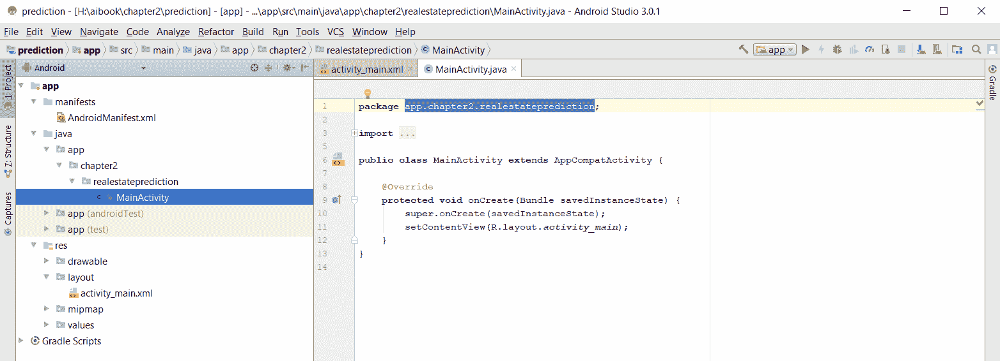

# 设计屏幕的布局

让我们设计一个屏幕，接受我们创建的模型的输入因素。屏幕将有七个输入框来接受这些因素，一个按钮和一个输出文本框来显示预测结果：

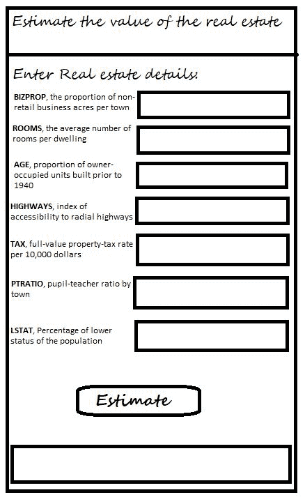

浏览到 res 文件夹中的 layout 文件夹，并选择 activity_layout.xml 文件在编辑面板中打开。选择底部的 Text 选项以查看现有的布局 XML：

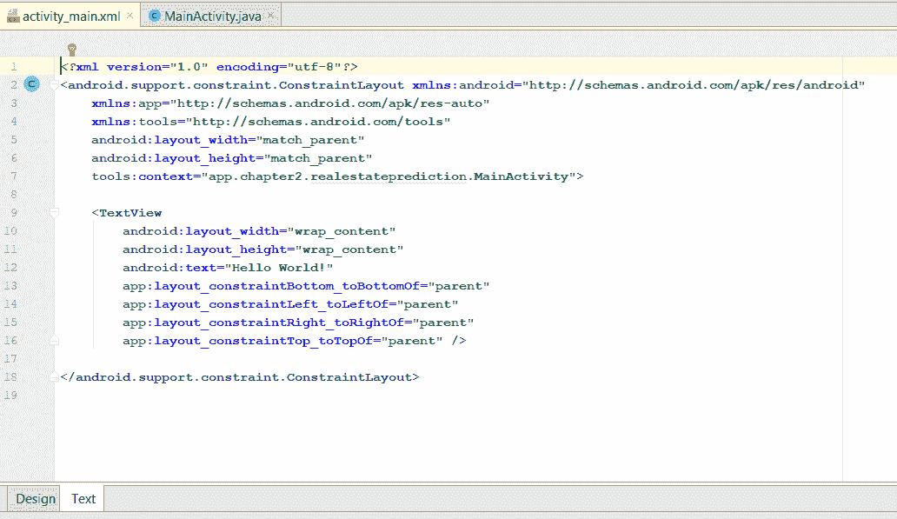

现在，替换现有的 XML 代码，使用新的设计模板。请参考 Android 文件夹中的 activity_layout.xml 代码文件以查看完整的设计模板。以下仅是 XML 代码模板的骨架参考：

```py
*<?*xml version="1.0" encoding="utf-8"*?>* <ScrollView 
     android:layout_width="match_parent"
     android:layout_height="match_parent"
     android:fillViewport="true">   
     <RelativeLayout
         android:layout_width="match_parent"
         android:layout_height="match_parent"
         > 
         <TextView
             android:id="@+id/bizprop"/>
         <EditText
             android:id="@+id/bizprop-edit"/>
         <TextView
             android:id="@+id/rooms"/>
         <EditText
             android:id="@+id/rooms-edit"/>
         <TextView
             android:id="@+id/age"/>
         <EditText
             android:id="@+id/age-edit"/>
         <TextView
             android:id="@+id/highways"/>
         <EditText
             android:id="@+id/highways-edit"/>
         <TextView
             android:id="@+id/tax"/>
         <EditText
             android:id="@+id/tax-edit"/>
         <TextView
             android:id="@+id/ptratio"/>
         <EditText
             android:id="@+id/ptratio-edit"/>
         <TextView
             android:id="@+id/lstat"/>
         <EditText
             android:id="@+id/lstat-edit"/>
         <Button
             android:id="@+id/button"/>
         <TextView
             android:id="@+id/value"/>
     </RelativeLayout>
 </ScrollView>
```

在这里，我们设计了一个布局来接受七个因素作为输入，具体如下：

+   BIZPROP：每个城镇非零售商业用地的比例

+   ROOMS：每个住宅的平均房间数

+   *`A`***GE**：1940 年之前建成的业主自住单元的比例

+   **HIGHWAYS**：通往辐射状高速公路的可达性指数

+   **TAX**：每$10,000 的全值财产税率

+   **PTRATIO**：每个城镇的学生与教师比例

+   **LSTAT**：低社会阶层人口的比例

还有一个按钮和一个文本框用于显示输出。当点击按钮时，预测值将显示出来。

要查看活动的设计，可以在顶部菜单栏的**run**菜单中选择运行应用程序选项。第一次运行时，环境会提示你创建一个虚拟设备来测试你的应用程序。你可以创建一个**Android 虚拟设备**（**AVD**）或使用传统的方法，即使用 USB 线将你的 Android 手机连接到 PC，这样你就可以直接在设备上运行输出：

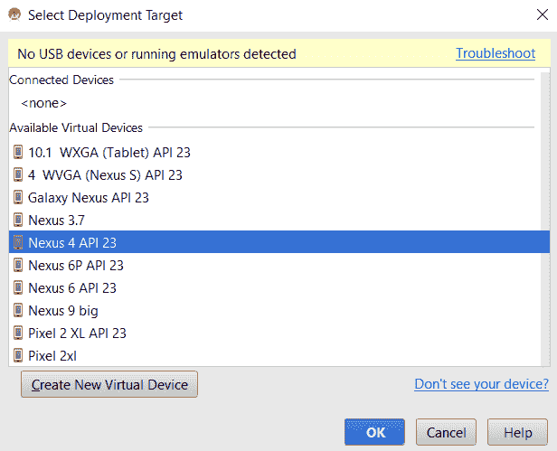

当应用在设备或 AVD 模拟器上启动时，你应该能看到滚动布局的设计：

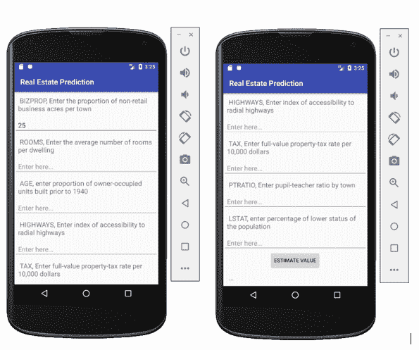

# 添加一个功能来接受输入

现在，我们需要接受输入并创建一个映射来保存这些值。然后，我们将把这个映射转换为一个 JSON 对象，以便它可以作为数据传递给`POST` API 请求。

浏览到`MainActivity.java`文件并在 Android Studio 的编辑面板中打开它。声明以下类变量：

```py
 private EditText bizprop, rooms, age, highways, tax, ptratio, lstat;
 private Button estimate;
 private TextView value;
```

你会看到一个名为`onCreate()`的函数已经创建。将以下代码添加到`onCreate()`函数中，以初始化布局元素：

```py
 bizprop = (EditText) findViewById(R.id.*bizprop_edit*);
 rooms = (EditText) findViewById(R.id.*rooms_edit*);
 age = (EditText) findViewById(R.id.*age_edit*);
 highways = (EditText) findViewById(R.id.*highways_edit*);
 tax = (EditText) findViewById(R.id.*tax_edit*);
 ptratio = (EditText) findViewById(R.id.*ptratio_edit*);
 lstat = (EditText) findViewById(R.id.*lstat_edit*);
 value =  (TextView) findViewById(R.id.*value*);
 estimate = (Button) findViewById(R.id.*button*);
```

现在，向 Java 类中添加另一个名为`makeJSON()`的函数。这个函数接受来自编辑框的值，并返回我们需要传递的 JSON 对象，以供 API 调用使用：

```py
public JSONObject makeJSON() {

     JSONObject jObj = new JSONObject();
     try {

         jObj.put("bizprop", bizprop.getText().toString());
         jObj.put("rooms",  rooms.getText().toString());
         jObj.put("age",  age.getText().toString());
         jObj.put("tax",  tax.getText().toString() );
         jObj.put("highways",  highways.getText().toString());
         jObj.put("ptratio",  ptratio.getText().toString());
         jObj.put("lstat", lstat.getText().toString());

     } catch (Exception e) {
         System.*out*.println("Error:" + e);
     }

     Log.`i`("", jObj.toString());

     return jObj;
 }
```

# 添加一个功能来调用提供模型的 RESTful API

现在，我们需要在按钮点击时提交数据给 API。为此，我们需要以下辅助函数：

+   `ByPostMethod`: 接受一个 URL 作为`String`并返回一个`InputStream`作为响应。这个函数接受我们使用 Flask 框架创建的服务器 URL 字符串，并返回来自服务器的响应流：

```py
InputStream ByPostMethod(String ServerURL) {

     InputStream DataInputStream = null;
     try {
         URL url = new URL(ServerURL);

         HttpURLConnection connection = (HttpURLConnection)
         url.openConnection();
         connection.setDoOutput(true);
         connection.setDoInput(true);
         connection.setInstanceFollowRedirects(false);
         connection.setRequestMethod("POST");
         connection.setRequestProperty("Content-Type", "application/json");
         connection.setRequestProperty("charset", "utf-8");
         connection.setUseCaches (false);
         DataOutputStream dos = new DataOutputStream(connection.getOutputStream());
         dos.writeBytes(makeJSON().toString());
         *//flushes data output stream.* dos.flush();
         dos.close();
         *//Getting HTTP response code* int response = connection.getResponseCode();
         *//if response code is 200 / OK then read Inputstream
         //HttpURLConnection.HTTP_OK is equal to 200* if(response == HttpURLConnection.*HTTP_OK*) {
             DataInputStream = connection.getInputStream();
         }

     } catch (Exception e) {
         Log.`e`("ERROR CAUGHT", "Error in GetData", e);
     }
     return DataInputStream;

 }
```

+   `ConvertStreamToString`: 这个函数接受`InputStream`并返回响应的`String`。前一个函数返回的输入流将被此函数处理为字符串对象：

```py
String ConvertStreamToString(InputStream stream) {

     InputStreamReader isr = new InputStreamReader(stream);
     BufferedReader reader = new BufferedReader(isr);
     StringBuilder response = new StringBuilder();

     String line = null;
     try {

         while ((line = reader.readLine()) != null) {
             response.append(line);
         }

     } catch (IOException e) {
         Log.`e`("ERROR CAUGHT", "Error in ConvertStreamToString", e);
     } catch (Exception e) {
         Log.`e`("ERROR CAUGHT", "Error in ConvertStreamToString", e);
     } finally {

         try {
             stream.close();

         } catch (IOException e) {
             Log.`e`("ERROR CAUGHT", "Error in ConvertStreamToString", e);

         } catch (Exception e) {
             Log.`e`("ERROR CAUGHT", "Error in ConvertStreamToString", e);
         }
     }
     return response.toString();
 }
```

+   `DisplayMessage`: 这个函数更新文本框内容，显示响应，即预测值：

```py
public void DisplayMessage(String a) 
{

     value.setText(a);
 }
```

需要注意的是，在 Android 上进行网络调用时，最佳实践是将其放在单独的线程中，以避免阻塞主**用户界面**（**UI**）线程。因此，我们将编写一个名为`MakeNetworkCall`的内部类来实现这一点：

```py
private class MakeNetworkCall extends AsyncTask<String, Void, String> {

     @Override
     protected void onPreExecute() {
         super.onPreExecute();
         DisplayMessage("Please Wait ...");
     }

     @Override
     protected String doInBackground(String... arg) {

         InputStream is = null;
         String URL = "http://10.0.2.2:5000/predict";
         Log.`d`("ERROR CAUGHT", "URL: " + URL);
         String res = "";

         is = ByPostMethod(URL);

         if (is != null) {
             res = ConvertStreamToString(is);
         } else {
             res = "Something went wrong";
         }
         return res;
     }

     protected void onPostExecute(String result) {
         super.onPostExecute(result);

         DisplayMessage(result);
         Log.`d`("COMPLETED", "Result: " + result);
     }
 }
```

请注意，我们使用了`http://10.0.2.2:5000/predict`而不是`http://127.0.0.1:5000/predict`。这是因为在 Android 中，当我们使用模拟器时，它通过`10.0.2.2`访问本地主机，而不是`127.0.0.1`。由于示例是在模拟器中运行的，因此我们使用了`10.0.2.2`。

最后，我们需要添加一个功能，当按钮被点击时调用 API。因此，在`oncreate()`方法中，在按钮初始化后插入以下代码。这将启动一个后台线程，在按钮点击时访问 API：

```py
estimate.setOnClickListener(new View.OnClickListener() {
     @Override
     public void onClick(View v) {
         Log.`i`("CHECK", "CLICKED");

         new MakeNetworkCall().execute("http://10.0.2.2:5000/predict", "Post");
     }
 });
```

我们需要在`AndroidManifest.xml`文件中添加使用互联网的权限。将以下代码放入`<manifest>`标签内：

```py
<uses-permission android:name="android.permission.INTERNET"></uses-permission>
```

别忘了运行你的 Flask 应用。如果你还没有运行，请确保在激活的 conda 环境中运行它：

```py
set FLASK_APP=predict_api

flask run
```

这就是在 Android 上运行和测试应用所需的所有代码。现在，在模拟器中运行应用，输入屏幕上的信息，点击 ESTIMATE VALUE 按钮，你将立即获得结果：

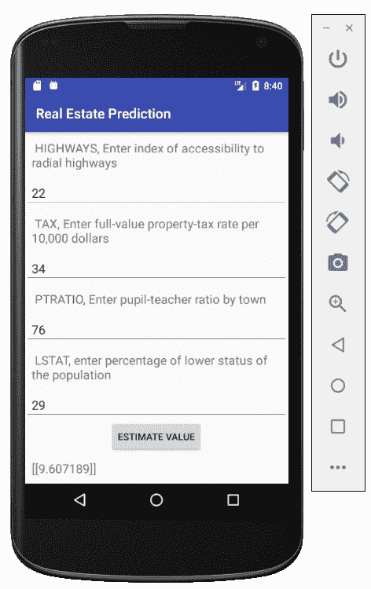

# 额外说明

这是一个演示，展示了如何在 Android 设备上使用构建的 AI 模型。话虽如此，仍有许多其他任务可以添加到现有的应用程序中：

+   改进 UI 设计

+   添加输入检查以验证输入的数据

+   托管 Flask 应用程序（Heroku、AWS 等）

+   发布应用程序

所有这些任务都与我们的核心 AI 主题无关，因此可以作为读者的练习来处理。

# 创建一个用于预测房价的 iOS 应用程序

在本节中，我们将通过 iOS 应用程序通过 RESTful API 来使用模型。本节的目的是展示如何通过 iOS 应用程序使用和消费模型。这里假设您已经熟悉 Swift 编程。相同的方法可以用于任何类似的用例。以下是本节所涵盖的步骤：

+   下载并安装 Xcode

+   创建一个单屏幕的 iOS 项目

+   设计屏幕的布局

+   添加接受输入的功能

+   添加功能以消费提供模型的 RESTful API

+   附加说明

# 下载并安装 Xcode

您需要一台 Mac（macOS 10.11.5 或更高版本）来开发本书中实现的 iOS 应用程序。此外，需要安装 Xcode 的最新版本才能运行这些代码，因为它包含了设计、开发和调试任何应用所必需的所有功能。

要下载最新版本的 Xcode，请按以下步骤操作：

1.  打开 Mac 上的 App Store（默认在 Dock 中）。

1.  在搜索框中输入`Xcode`，它位于右上角。然后按下回车键。

1.  搜索结果中的第一个就是 Xcode 应用程序。

1.  点击“获取”，然后点击“安装应用程序”。

1.  输入您的 Apple ID 和密码。

1.  Xcode 将被下载到您的`/Applications`目录中。

# 创建一个单屏幕的 iOS 项目

Xcode 包含多个内置应用程序模板。我们将从一个基本模板开始：单视图应用程序。从`/Applications`目录中打开 Xcode 以创建一个新项目。

如果您第一次启动 Xcode，它可能会要求您同意所有用户协议。按照这些提示操作，直到 Xcode 安装并准备好在您的系统上启动。

启动 Xcode 后，以下窗口将会出现：

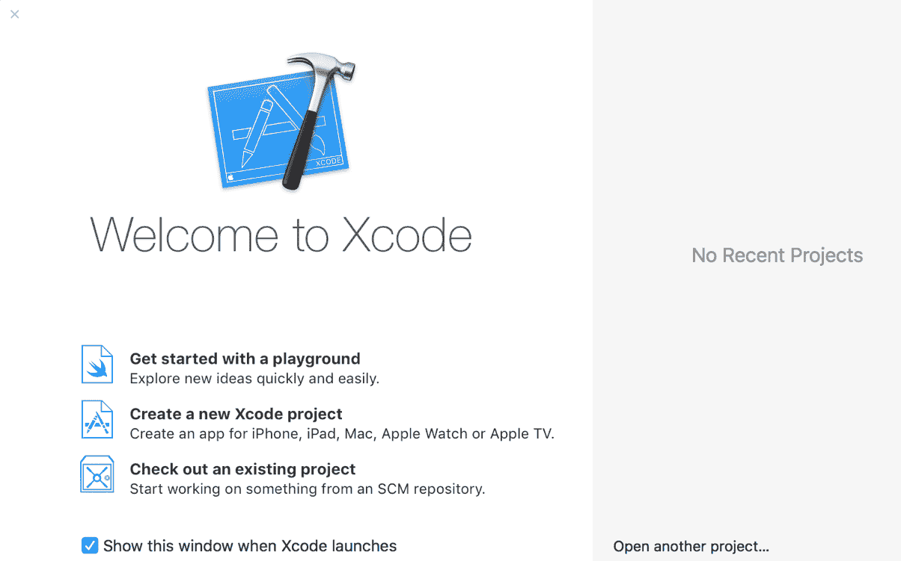

点击“创建一个新的 Xcode 项目”。将会打开一个新窗口，显示一个对话框，允许我们选择所需的模板：

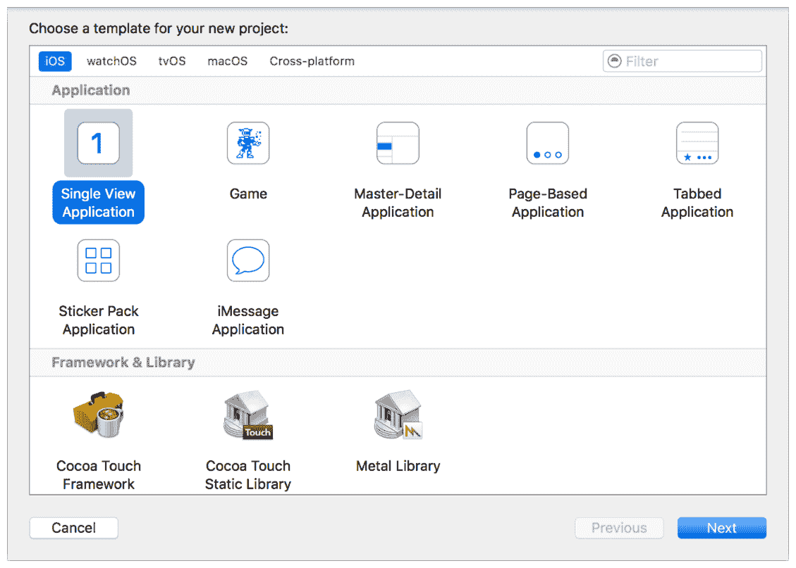

选择模板后，会弹出一个对话框。在这里，您需要为您的应用程序命名，您可以使用以下值。您还可以选择一些附加选项来配置您的项目：

+   **产品名称**：Xcode 将使用您输入的产品名称来命名项目和应用程序。

+   **团队**：如果没有填写值，请将团队设置为“无”。

+   **组织名称**：这是一个可选字段。您可以输入您的组织名称或您的名字。您也可以选择将此选项留空。

+   **组织标识符**：如果您有组织标识符，请使用该值。如果没有，请使用`com.example`。

+   **捆绑标识符**：此值是根据您的产品名称和组织标识符自动生成的。

+   **语言**：Swift。

+   **设备**：通用。一个在 iPhone 和 iPad 上都能运行的应用程序被认为是通用应用程序。

+   **使用核心数据**：我们不需要核心数据。因此，它保持未选中。

+   **包含单元测试**：我们需要包含单元测试。因此，这个选项将被选中。

+   **包含 UI 测试**：我们不需要包含任何 UI 测试。因此，这个选项保持未选中。

现在，点击下一步。一个对话框将出现，您需要选择一个位置来保存您的项目。保存项目后，点击创建。您的新项目将由 Xcode 在工作区窗口中打开。

# 设计屏幕的布局

让我们设计一个屏幕，用于接收我们创建的模型因子的输入。该屏幕将有七个输入框用于接收因子，一个按钮，以及一个输出文本框来显示预测结果：


让我们来处理应用所需的故事板。什么是故事板？故事板展示了内容的屏幕及其之间的过渡。它为我们提供了应用程序 UI 的视觉表现。我们可以使用**所见即所得**（**WYSIWYG**）编辑器，在这里我们可以实时看到更改。

要打开故事板，请在项目导航器中选择`Main.storyboard`选项。这将打开一个画布，我们可以在其中设计屏幕。现在我们可以添加元素并设计画布：

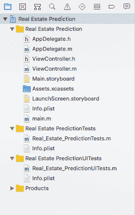

也可以使用编码来代替拖放方法。为此，从定义作为输入使用的文本字段开始，放在`ViewController`类中：

```py
@interface ViewController ()<UITextFieldDelegate>
{
 UITextField* bizropfeild,*roomsfeild,*agefeild,*highwaysfeild,*taxfeild,*ptratiofeild,*lstatfeild;
}
@end
```

然后，在`CreateView`方法中，我们实现每个文本字段的设计。以下是前两个文本字段的示例；其余文本字段可以采用相同的方法。完成的项目代码可以在`chapter2_ios_prediction`文件夹中找到。

首先，创建一个标题文本字段，`估算房地产价值`：

```py
UILabel *headerLabel = [[UILabel alloc]initWithFrame:CGRectMake(10, 20, self.view.frame.size.width-20, 25)];
 headerLabel.font = [UIFont fontWithName:@"SnellRoundhand-Black" size:20]; //custom font
 headerLabel.backgroundColor = [UIColor clearColor];
 headerLabel.textColor = [UIColor blackColor];
 headerLabel.textAlignment = NSTextAlignmentCenter;
 headerLabel.text=@"Estimate the value of real estate";
 [self.view addSubview:headerLabel];

 UIView *sepratorLine =[[UIView alloc]initWithFrame:CGRectMake(0, 50, self.view.frame.size.width, 5)];
 sepratorLine.backgroundColor=[UIColor blackColor];
 [self.view addSubview:sepratorLine];
```

接下来，创建另一个文本字段，`输入房地产详细信息`：

```py
UILabel *detailLabel = [[UILabel alloc]initWithFrame:CGRectMake(10, 55, self.view.frame.size.width-20, 25)];
 detailLabel.font = [UIFont fontWithName:@"SnellRoundhand-Black" size:18]; //custom font
 detailLabel.backgroundColor = [UIColor clearColor];
 detailLabel.textColor = [UIColor blackColor];
 detailLabel.textAlignment = NSTextAlignmentLeft;
 detailLabel.text=@"Enter real estate details";
 [self.view addSubview:detailLabel];
```

接下来，创建一个字段，用于输入非零售业务面积比例：

```py
 UILabel *bizropLabel = [[UILabel alloc]initWithFrame:CGRectMake(5, 85, self.view.frame.size.width-150, 35)];
 bizropLabel.font = [UIFont fontWithName:@"TimesNewRomanPSMT" size:12]; //custom font
 bizropLabel.backgroundColor = [UIColor clearColor];
 bizropLabel.numberOfLines=2;
 bizropLabel.textColor = [UIColor blackColor];
 bizropLabel.textAlignment = NSTextAlignmentLeft;
 bizropLabel.text=@"Bizrope, The proportion of non-retail business acres per town";
 [self.view addSubview:bizropLabel];

 bizropfeild = [[UITextField alloc] initWithFrame:CGRectMake(self.view.frame.size.width-140, 85, 130, 35)];
 bizropfeild.delegate=self;
 bizropfeild.layer.borderColor=[UIColor blackColor].CGColor;
 bizropfeild.layer.borderWidth=1.0;
 [self.view addSubview:bizropfeild];

```

现在创建一个字段，用于输入每个住宅的平均房间数：

```py
UILabel *roomsLabel = [[UILabel alloc]initWithFrame:CGRectMake(5, 125, self.view.frame.size.width-150, 35)];
 roomsLabel.font = [UIFont fontWithName:@"TimesNewRomanPSMT" size:12]; //custom font
 roomsLabel.backgroundColor = [UIColor clearColor];
 roomsLabel.numberOfLines=2;
 roomsLabel.textColor = [UIColor blackColor];
 roomsLabel.textAlignment = NSTextAlignmentLeft;
 roomsLabel.text=@"ROOMS, the average number of rooms per dwelling";
 [self.view addSubview:roomsLabel];

 roomsfeild = [[UITextField alloc] initWithFrame:CGRectMake(self.view.frame.size.width-140, 125, 130, 35)];
 roomsfeild.delegate=self;
 roomsfeild.layer.borderColor=[UIColor blackColor].CGColor;
 roomsfeild.layer.borderWidth=1.0;
 [self.view addSubview:roomsfeild];
```

然后，创建一个按钮来调用 API：

```py
UIButton *estimateButton = [UIButton buttonWithType:UIButtonTypeRoundedRect];
 [estimateButton addTarget:self action:@selector(estimateAction)
 forControlEvents:UIControlEventTouchUpInside];
 estimateButton.layer.borderColor=[UIColor blackColor].CGColor;
 estimateButton.layer.borderWidth=1.0;
 [estimateButton setTitle:@"Estimate" forState:UIControlStateNormal];
 [estimateButton setTitleColor:[UIColor blackColor] forState:UIControlStateNormal];
 estimateButton.frame = CGRectMake(self.view.frame.size.width/2-80, 375, 160.0, 40.0);
 [self.view addSubview:estimateButton];
```

# 添加接受输入的功能

在这里，所有来自文本字段的输入都被打包成一个`NSString`对象，并用于请求的`POST`正文中：

```py
NSString *userUpdate =[NSString stringWithFormat:@"bizprop=%@&rooms=%@&age=%@&highways=%@&tax=%@&ptratio=%@&lstat=%@",bizropfeild.text,roomsfeild.text,agefeild.text,highwaysfeild.text,taxfeild.text,ptratiofeild.text,lstatfeild.text];
```

# 添加一个功能来调用提供模型的 RESTful API

现在我们需要使用`NSURLSession`对象，通过活动屏幕中的输入来调用 RESTful API：

```py
//create the Method "GET" or "POST"
 [urlRequest setHTTPMethod:@"POST"];
 //Convert the String to Data
 NSData *data1 = [userUpdate dataUsingEncoding:NSUTF8StringEncoding];
 //Apply the data to the body
 [urlRequest setHTTPBody:data1];
 NSURLSession *session = [NSURLSession sharedSession];
 NSURLSessionDataTask *dataTask = [session dataTaskWithRequest:urlRequest completionHandler:^(NSData *data, NSURLResponse *response, NSError *error) { }
```

最后，显示从 API 接收到的响应中的输出：

```py
NSHTTPURLResponse *httpResponse = (NSHTTPURLResponse *)response;
 if(httpResponse.statusCode == 200)
 {
 NSError *parseError = nil;
 NSDictionary *responseDictionary = [NSJSONSerialization JSONObjectWithData:data options:0 error:&parseError];
 NSLog(@"The response is - %@",responseDictionary);
UILabel *outputLabel = [[UILabel alloc]initWithFrame:CGRectMake(5, 325, self.view.frame.size.width-150, 35)];
 outputLabel.font = [UIFont fontWithName:@"TimesNewRomanPSMT" size:12]; //custom font
 outputLabel.backgroundColor = [UIColor clearColor];
 outputLabel.numberOfLines=2;
 outputLabel.textColor = [UIColor blackColor];
 outputLabel.textAlignment = NSTextAlignmentLeft;
 outputLabel.text = [responseDictionary valueForKey:@""];
 [self.view addSubview:outputLabel];
 }
```

该应用现在可以运行，并准备在模拟器上进行测试。

# 附加说明

这展示了我们如何在 iOS 设备上使用 AI 模型。话虽如此，现有应用中还有很多可以添加的任务：

+   改进 UI 设计

+   添加输入检查以验证输入的数据

+   托管 Flask 应用（Heroku、AWS 等）

+   发布应用

所有这些任务与我们的核心 AI 主题无关，因此可以作为读者的练习来处理。安卓和 iOS 应用的完整代码和项目文件分别命名为`chapter2_android_prediction`和`chapter2_ios_prediction`。

# 总结

在本章中，我们探索了基本的顺序网络，并在移动设备上使用了它。在下一章，我们将探讨一种特殊类型的网络——**卷积神经网络**（**CNN**）。CNN 是最常用于机器视觉的网络类型。下一章的目标是熟悉机器视觉，并构建我们自己的定制 CNN。
