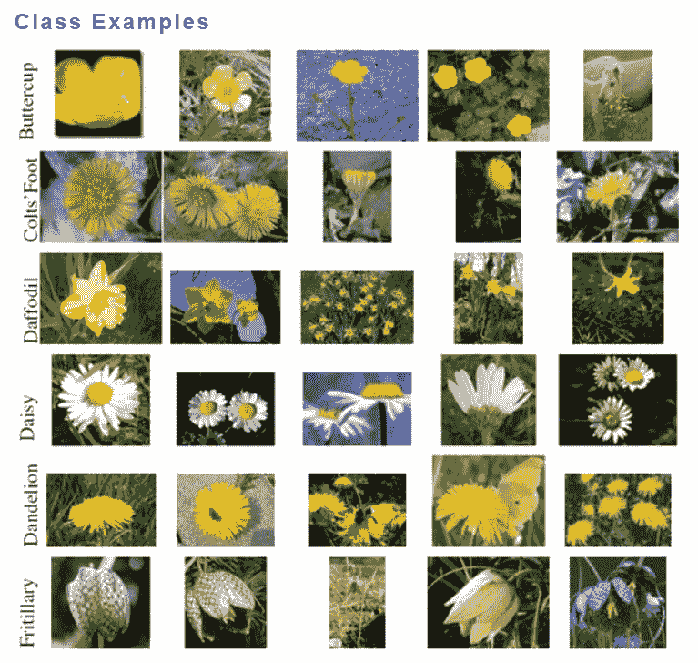
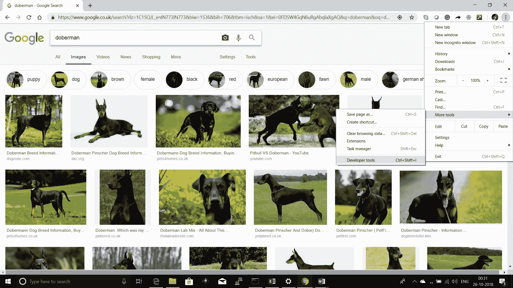
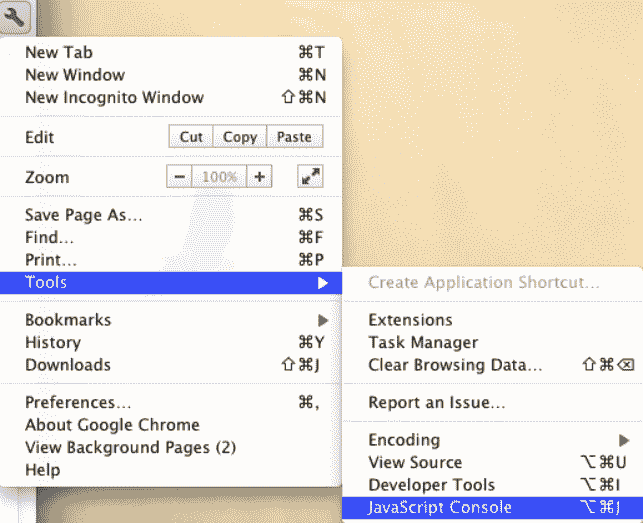
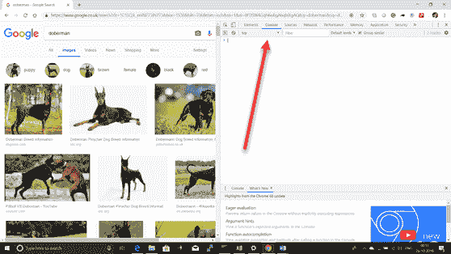
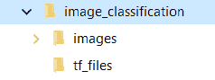
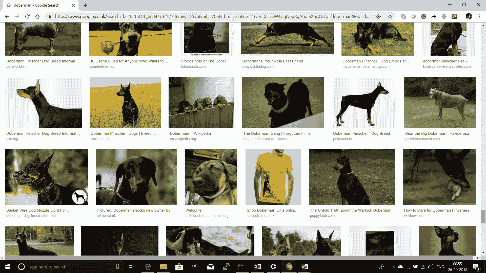
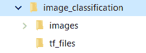
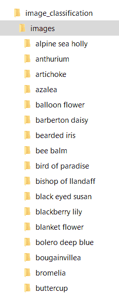
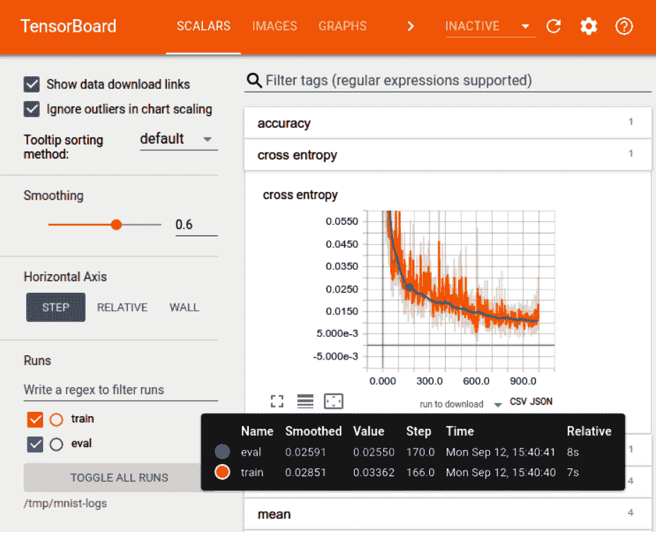

# 第四章：创建一个机器视觉移动应用程序来分类花的种类

在这一章中，我们将利用我们在前几章中学到的理论知识来创建一个可以分类特定花种的移动应用程序。通过使用您的移动摄像头对着花拍照，该应用程序将分析图像并尽力猜测出那种花的种类。这是我们把对卷积神经网络（**CNN**）的理解付诸实践的地方。我们还将学习更多关于使用 TensorFlow 以及一些工具如 TensorBoard 的内容。但在我们深入研究之前，让我们先谈谈一些事情。

在本章中，我们使用一些可能不为所有人熟悉的术语，因此让我们确保我们对它们的含义有一致的理解。

在本章中，我们将涵盖以下主题：

+   CoreML 与 TensorFlow Lite 的对比

+   什么是 MobileNet

+   用于图像分类的数据集

+   创建您自己的图像数据集

+   使用 TensorFlow 构建模型

+   运行 TensorBoard

# CoreML 与 TensorFlow Lite 的对比

在机器学习领域，有两个努力（截至撰写本文时）正在进行，旨在改善移动 AI 体验。而不是将 AI 或 ML 处理转移到云端和数据中心，更快的选择是在设备本身上处理数据。为了做到这一点，模型必须已经预先训练好，这意味着它可能并不完全训练用于您要使用的目的。

在这个领域，苹果的努力（iOS）称为**Core ML**，而谷歌的（Android）称为**TensorFlow Lite**。让我们简要讨论一下两者。

# CoreML

Apple 的 CoreML 框架提供了大量的神经网络类型。这使得开发人员可以在开发应用程序时尝试不同的设计。摄像头和麦克风数据只是可以用于诸如图像识别、自然语言处理等领域的两个可以利用的区域。有几个预训练模型开发人员可以直接使用，并根据需要进行调整。

# TensorFlow Lite

TensorFlow Lite 是 TensorFlow 的本地设备版本，意味着它设计用于在您的移动设备上运行。截至撰写本文时，它仍处于预发布状态，因此很难与 CoreML 进行直接比较。我们需要等待并看看最终提供的功能。目前，只需知道在移动设备上有两个选项可供选择的本地 AI 和机器学习。

# 什么是 MobileNet？

在深入之前，我们先来谈谈你在本章中会经常听到的一个术语——**MobileNets**。你可能会问，什么是 MobileNet？简而言之，它是一种专门为移动设备和嵌入式视觉应用设计的架构。在这些设备上，处理这类任务的计算能力有限，因此迫切需要一种比桌面环境中使用的解决方案更好的方法。

**MobileNet**架构由 Google 提出，简要来说：

1.  使用深度可分离卷积。与使用普通卷积的神经网络相比，这显著减少了参数的数量，结果就是所谓的**轻量级深度神经网络**。

1.  **深度卷积**，随后是**点卷积**，替代了正常的卷积过程。

为了简化问题，我们将本章分为以下两个部分：

+   **图像分类数据集**：在这一节中，我们将探索可用于图像分类的各种数据集（所有这些数据集都可以在线获得）。我们还将讨论如何在必要时创建我们自己的数据集。

+   **使用 TensorFlow 构建模型**：在这一节中，我们将使用 TensorFlow 来训练我们的分类模型。我们通过使用一个名为**MobileNet**的预训练模型来实现这一点。MobileNets 是一系列为 TensorFlow 设计的移动优先计算机视觉模型，旨在在考虑设备上有限资源的情况下最大化准确性。

+   此外，我们将研究如何将输出模型转换为 `.tflite` 格式，该格式可用于其他移动或嵌入式设备。TFLite 代表 TensorFlow Lite。你可以通过任何互联网搜索引擎了解更多关于 TensorFlow Lite 的信息。

# 图像分类数据集

对于我们的花卉分类示例，我们将使用牛津大学的**视觉几何组**（**VGG**）图像数据集。该数据集可以通过以下链接访问：[`www.robots.ox.ac.uk/~vgg/data/`](http://www.robots.ox.ac.uk/~vgg/data/)。

VGG 是曾在以往的 ImageNet 竞赛中获胜的部门。像 VGG14 和 VGG16 这样的预训练模型是由该部门构建的，它们分别在 2014 年和 2016 年获得了胜利。这些数据集被 VGG 用于训练和评估他们所构建的模型。

花卉数据集可以在页面的精细识别数据集部分找到，此外还有纹理和宠物数据集。点击“Flower Category Datasets”，或使用以下链接访问 VGG 的花卉数据集，[`www.robots.ox.ac.uk/~vgg/data/flowers/`](http://www.robots.ox.ac.uk/~vgg/data/flowers/)。

在这里，你可以找到两个数据集，一个包含 17 种不同的花卉，另一个包含 102 种不同的花卉。你可以根据它们在教程中的易用性，或者根据你所能使用的处理方法选择其中的一个。

使用更大的数据集意味着训练时间会更长，训练前的数据处理时间也会更长；因此，我们建议你谨慎选择。

这里是你将在此处找到的图像子集。正如你所看到的，文件夹名称与我们在本章稍后会用到的完全一致：



除了我们上面提到的图像外，下面是一些额外的链接，若你将来需要类似分类用途的图像数据，可以使用它们：

+   **CVonline 数据集**: [`homepages.inf.ed.ac.uk/rbf/CVonline/Imagedbase.htm`](http://homepages.inf.ed.ac.uk/rbf/CVonline/Imagedbase.htm)

+   **CVpapers 数据集**: [`www.cvpapers.com/datasets.html`](http://www.cvpapers.com/datasets.html)

+   **图像数据集**: [`wiki.fast.ai/index.php/Image_Datasets`](http://wiki.fast.ai/index.php/Image_Datasets)

+   **深度学习数据集**: [`deeplearning.net/datasets/`](http://deeplearning.net/datasets/)

+   **COCO 数据集**: [`cocodataset.org/#home`](http://cocodataset.org/#home)

+   **ImageNet 数据集**: [`www.image-net.org/`](http://www.image-net.org/)

+   **开放图像数据集**: [`storage.googleapis.com/openimages/web/index.html`](https://storage.googleapis.com/openimages/web/index.html)

+   **Kaggle 数据集**: [`www.kaggle.com/datasets?sortBy=relevance&group=featured&search=image`](https://www.kaggle.com/datasets?sortBy=relevance&group=featured&search=image)

+   **开放数据集**: [`skymind.ai/wiki/open-datasets`](https://skymind.ai/wiki/open-datasets)

+   **维基百科**: [`en.wikipedia.org/wiki/List_of_datasets_for_machine_learning_research#Object_detection_and_recognition`](https://en.wikipedia.org/wiki/List_of_datasets_for_machine_learning_research#Object_detection_and_recognition)

# 使用 Google 图片创建你自己的图像数据集

假设因为某种原因，我们需要确定一张图片是什么狗，但电脑上没有现成的图片。我们该怎么办呢？或许最简单的方法是打开 Google Chrome 并在线搜索图片。

以 Doberman 犬为例，假设我们对 Doberman 犬感兴趣。只需打开 Google Chrome 并搜索**doberman**的图片，如下所示：

1.  **搜索 Doberman 犬的图片**: 搜索后，得到以下结果：



1.  **打开 JavaScript 控制台**: 你可以在 Chrome 的右上角菜单中找到 JavaScript 控制台：



点击“更多工具”，然后选择“开发者工具”：


确保选择“控制台”标签页，如下所示：



1.  **使用 JavaScript**：继续向下滚动，直到你认为已经有足够的图像用于你的用例。完成后，返回到开发者工具中的 Console 标签，然后复制并粘贴以下脚本：

```py
//the jquery  is pulled down in the JavaScript console
var script = document.createElement('script');
script.src = "https://ajax.googleapis.com/ajax/libs/jquery/2.2.0/jquery.min.js";
document.getElementsByTagName('head')[0].appendChild(script);
//Let us get the URLs
var urls = $('.rg_di .rg_meta').map(function() { return JSON.parse($(this).text()).ou; });
// Now, we will write the URls one per line to file
var textToSave = urls.toArray().join('\n');
var hiddenElement = document.createElement('a');
hiddenElement.href = 'data:attachment/text,' + encodeURI(textToSave);
hiddenElement.target = '_blank';
hiddenElement.download = 'urls.txt';
hiddenElement.click();
```

这段代码会收集所有图像的 URL，并将它们保存到名为`urls.txt`的文件中，该文件位于你的默认`Downloads`目录。

1.  **使用 Python 下载图像**：现在，我们将使用 Python 从`urls.txt`读取图像的 URL，并将所有图像下载到一个文件夹中：



这可以通过以下步骤轻松完成：

1.  打开 Python 笔记本，复制并粘贴以下代码以下载图像：

```py
# We will start by importing the required pacages
from imutils import paths
import argparse
import requests
import cv2
import os
```

1.  导入后，开始构造参数，并且构造后解析参数非常重要：

```py
ap = argparse.ArgumentParser()
ap.add_argument("-u", "--urls", required=True,
help="path to file containing image URLs")
ap.add_argument("-o", "--output", required=True,
help="path to output directory of images")
args = vars(ap.parse_args())
```

1.  下一步包括从输入文件中获取 URL 列表，并计算下载的图像总数：

```py
rows = open(args["urls"]).read().strip().split("\n")
total = 0
# URLs are looped in
for url in rows:
try:
# Try downloading the image
r = requests.get(url, timeout=60)
#The image is then saved to the disk
p = os.path.sep.join([args["output"], "{}.jpg".format(
str(total).zfill(8))])
f = open(p, "wb")
f.write(r.content)
f.close()
#The counter is updated
print("[INFO] downloaded: {}".format(p))
total += 1
```

1.  在下载过程中，需要处理抛出的异常：

```py
print("[INFO] error downloading {}...skipping".format(p))
```

1.  下载的图像路径需要循环遍历：

```py
for imagePath in paths.list_images(args["output"])
```

1.  现在，决定图像是否应该被删除，并据此初始化：

```py
delete = False
```

1.  需要加载图像。让我们尝试执行此操作：

```py
image = cv2.imread(imagePath)
```

1.  如果我们未能正确加载图像，由于图像为`None`，则应该将其从磁盘中删除：

```py
if image is None:
delete = True
```

1.  此外，如果 OpenCV 无法加载图像，这意味着图像已损坏，应当删除该图像：

```py
except:
print("Except")
delete = True
```

1.  最后进行检查，查看图像是否已被删除：

```py
if delete:
print("[INFO] deleting {}".format(imagePath))
os.remove(imagePath)
```

1.  完成后，让我们将此笔记本下载为 Python 文件并命名为`image_download.py`。确保将`urls.txt`文件放置在与你刚刚创建的 Python 文件相同的文件夹中。这一点非常重要。

1.  接下来，我们需要执行刚刚创建的 Python 文件。我们将通过使用命令行来执行，如下所示（确保`path`变量指向你的 Python 位置）：

```py
Image_download.py --urls urls.txt --output Doberman
```

执行此命令后，图像将被下载到名为 Doberman 的文件夹中。完成后，你应该能看到所有在 Google Chrome 中查看到的杜宾犬图像，类似于以下所示的图像：



选择所需的文件夹以保存图像，如下所示：



就这样，我们现在拥有了一个充满杜宾犬图像的文件夹。相同的方法可以应用于创建任何其他类型类别的文件夹。

可能会有一些来自 Google 图像结果的图像是不需要的。确保浏览图像并移除任何不想要的图像。

# 从视频创建自定义数据集的替代方法

有时我们通过互联网找到的图像可能无法满足我们的需求，或者我们根本找不到任何图像。这可能是由于数据的独特性、当前的用例、版权限制、所需分辨率等原因造成的。在这种情况下，另一种方法是记录需要的物体的视频，提取符合要求的视频帧，并将每一帧保存为单独的图像。我们该如何操作呢？

假设我们有一种皮肤病，无法在网上找到相关信息。我们需要对这种皮肤病进行分类。然而，为了做到这一点，我们需要一张该皮肤病的图像。因此，我们可以拍摄这张皮肤病的录像，并将视频文件保存为一个文件。为了讨论的方便，我们假设我们将视频保存为文件名`myvideo.mp4`。

完成后，我们可以使用以下 Python 脚本将视频分解为图像，并将其保存到一个文件夹中。此函数将接受视频文件的路径，根据频率将视频分解为帧，并将相应的图像保存到指定的输出位置。以下是该函数的完整代码：

```py
import sys
import argparse
import os
import cv2
import numpy as np
print(cv2.__version__)
```

这个函数接受视频文件的路径，根据频率将视频分解为帧，并将相应的图像保存到指定的输出位置：

```py
def extractImages(pathIn, pathOut):
count = 0
vidcap = cv2.VideoCapture(pathIn)
success,image = vidcap.read()
success = True
while success:
vidcap.set(cv2.CAP_PROP_POS_MSEC,(count*10)) # Adjust frequency of frames here
success,image = vidcap.read()
print ('Read a new frame: ', success)
#Once we identify the last frame, stop there
image_last = cv2.imread("frame{}.png".format(count-1))
if np.array_equal(image,image_last):
break
cv2.imwrite( os.path.join("frames","frame{:d}.jpg".format(count)), image) # save frame as JPEG file
count = count + 1
pathIn = "myvideo.mp4"
pathOut = ""
extractImages(pathIn, pathOut)
```

如上所述，这将在当前文件夹中根据设置的频率保存视频的每一帧。运行此脚本后，您将创建好您的图像数据集，并可以使用所需的图像。

# 使用 TensorFlow 构建模型

现在，我们已经了解了获取所需图像的几种方法，或者在没有图像的情况下创建我们自己的图像，接下来我们将使用 TensorFlow 为我们的花卉用例创建分类模型：

1.  **创建文件夹结构**：首先，让我们为我们的花卉分类用例创建所需的文件夹结构。首先，创建一个名为`image_classification`的主文件夹。在`image_classification`文件夹内，创建两个文件夹：`images`和`tf_files`。`images`文件夹将包含模型训练所需的图像，而`tf_files`文件夹将在运行时保存所有生成的 TensorFlow 特定文件。

1.  **下载图像**：接下来，我们需要下载适用于我们用例的特定图像。以**花卉**为例，我们的图像将来自我们之前讨论过的 VGG 数据集页面。

请随意使用您自己的数据集，但请确保每个类别都有单独的文件夹。将下载的图像数据集放在`images`文件夹内。

例如，完整的文件夹结构将如下所示：



1.  **创建 Python 脚本**：在这一步，我们将创建构建模型所需的 TensorFlow 代码。在主`image_classification`文件夹中创建一个名为`retrain.py`的 Python 文件。

完成这些后，以下代码块应被复制并使用。我们将过程分解为几个步骤，以便描述发生了什么：

1.  以下代码块是完整的脚本内容，应该放入`retrain.py`中：

```py
from __future__ import absolute_import
from __future__ import division
from __future__ import print_function
import argparse
import collections
from datetime import datetime
import hashlib
import os.path
import random
import re
import sys
import tarfile
import numpy as np
from six.moves import urllib
import tensorflow as tf
from tensorflow.python.framework import graph_util
from tensorflow.python.framework import tensor_shape
from tensorflow.python.platform import gfile
from tensorflow.python.util import compat
FLAGS = None
MAX_NUM_IMAGES_PER_CLASS = 2 ** 27 - 1 # ~134M
```

1.  接下来，我们需要准备图像，以便它们可以进行训练、验证和测试：

```py
result = collections.OrderedDict()
sub_dirs = [
os.path.join(image_dir,item)
for item in gfile.ListDirectory(image_dir)]
sub_dirs = sorted(item for item in sub_dirs
if gfile.IsDirectory(item))
for sub_dir in sub_dirs:
```

我们要做的第一件事是从存储图像的目录路径中检索图像。我们将使用这些图像，通过您之前下载并安装的模型来创建模型图。

下一步是通过创建所谓的**瓶颈文件**来初始化瓶颈。**瓶颈**是一个非正式术语，用来指代最终输出层之前的那一层，该层负责实际的分类。（TensorFlow Hub 将其称为**图像特征向量**。）这一层经过训练，输出的值足够让分类器使用，以便区分它被要求识别的所有类别。这意味着它必须是图像的有意义且紧凑的总结，因为它必须包含足够的信息，让分类器能够在一小组值中做出正确的选择。

每个图像都需要有瓶颈值，这是非常重要的。如果每个图像的瓶颈值不可用，我们将不得不手动创建它们，因为这些值在未来训练图像时会被需要。强烈建议缓存这些值，以便以后加快处理速度。因为每个图像在训练过程中都会被多次重复使用，并且计算每个瓶颈值会花费大量时间，所以将这些瓶颈值缓存到磁盘上可以避免重复计算，从而加速过程。默认情况下，瓶颈值会存储在`/tmp/bottleneck`目录中（除非作为参数指定了新的目录）。

当我们检索瓶颈值时，我们将基于缓存中存储的图像文件名来检索它们。如果对图像进行了扭曲处理，可能会在检索瓶颈值时遇到困难。启用扭曲的最大缺点是瓶颈缓存不再有用，因为输入图像永远不会被完全重复使用。这直接导致了训练过程时间的延长，因此强烈建议在对模型基本满意时再启用扭曲处理。如果您遇到问题，我们已经在本书的 GitHub 仓库中提供了一种方法来获取带有扭曲的图像的瓶颈值。

请注意，我们首先将扭曲的图像数据转化为 NumPy 数组。

接下来，我们需要对图像进行推理。这需要一个训练好的目标检测模型，并通过使用两个内存副本来完成。

我们的下一步是对图像进行失真处理。失真处理如裁剪、缩放和亮度是以百分比的形式给出的，这些百分比值控制每种失真在每个图像上应用的程度。合理的做法是从每种失真值 5 或 10 开始，然后通过实验确定哪些对模型有帮助，哪些没有。

接下来，我们需要基于准确性和损失来总结我们的模型。我们将使用 TensorBoard 可视化工具进行分析。如果你还不知道，TensorFlow 提供了一套名为 TensorBoard 的可视化工具，它可以帮助你可视化 TensorFlow 图，绘制执行过程中的变量，并展示其他数据，如通过图的图像。以下是一个 TensorBoard 仪表盘的示例：



我们的下一步是将模型保存到文件中，并设置一个目录路径，用于写入 TensorBoard 的摘要。

在这一点上，我们需要指出`create_model_info`函数，它将返回模型信息。在下面的示例中，我们处理的是 MobileNet 和 Inception_v3 架构。稍后你将看到我们如何处理这些架构之外的其他架构：

```py
def create_model_info(architecture):
architecture = architecture.lower()
if architecture == 'inception_v3':
# pylint: disable=line-too-long
data_url = 'http://download.tensorflow.org/models/image/imagenet/inception-2015-12-05.tgz'
# pylint: enable=line-too-long
bottleneck_tensor_name = 'pool_3/_reshape:0'
bottleneck_tensor_size = 2048
input_width = 299
input_height = 299
input_depth = 3
resized_input_tensor_name = 'Mul:0'
model_file_name = 'classify_image_graph_def.pb'
input_mean = 128
input_std = 128
elif architecture.startswith('mobilenet_'):
parts = architecture.split('_')
if len(parts) != 3 and len(parts) != 4:
tf.logging.error("Couldn't understand architecture name '%s'",
architecture)
return None
version_string = parts[1]
if (version_string != '1.0' and version_string != '0.75' and
version_string != '0.50' and version_string != '0.25'):
tf.logging.error(
""""The Mobilenet version should be '1.0', '0.75', '0.50', or '0.25',
but found '%s' for architecture '%s'""",
version_string, architecture)
return None
size_string = parts[2]
if (size_string != '224' and size_string != '192' and
size_string != '160' and size_string != '128'):
tf.logging.error(
"""The Mobilenet input size should be '224', '192', '160', or '128',
but found '%s' for architecture '%s'""",
size_string, architecture)
return None
if len(parts) == 3:
is_quantized = False
```

如果上述参数返回为 false，意味着我们遇到了一个意外的架构。如果发生这种情况，我们需要执行以下代码块来获取结果。在此示例中，我们处理的既不是 MobileNet 也不是 Inception_V3，默认将使用 MobileNet 的版本 1：

```py
else:
if parts[3] != 'quantized':
tf.logging.error(
"Couldn't understand architecture suffix '%s' for '%s'", parts[3],
architecture)
return None
is_quantized = True
data_url = 'http://download.tensorflow.org/models/mobilenet_v1_'
data_url += version_string + '_' + size_string + '_frozen.tgz'
bottleneck_tensor_name = 'MobilenetV1/Predictions/Reshape:0'
bottleneck_tensor_size = 1001
input_width = int(size_string)
input_height = int(size_string)
input_depth = 3
resized_input_tensor_name = 'input:0'
if is_quantized:
model_base_name = 'quantized_graph.pb'
else:
model_base_name = 'frozen_graph.pb'
model_dir_name = 'mobilenet_v1_' + version_string + '_' + size_string
model_file_name = os.path.join(model_dir_name, model_base_name)
input_mean = 127.5
input_std = 127.5
else:
tf.logging.error("Couldn't understand architecture name '%s'", architecture)
raise ValueError('Unknown architecture', architecture)
return {
'data_url': data_url,
'bottleneck_tensor_name': bottleneck_tensor_name,
'bottleneck_tensor_size': bottleneck_tensor_size,
'input_width': input_width,
'input_height': input_height,
'input_depth': input_depth,
'resized_input_tensor_name': resized_input_tensor_name,
'model_file_name': model_file_name,
'input_mean': input_mean,
'input_std': input_std,
}
==============================================================
```

另一个重要的事项是，我们需要在处理后解码图像的 JPEG 数据。下面的`add_jpeg_decoding`函数是一个完整的代码片段，通过调用`tf.image.decode_jpeg`函数来实现这一功能：

```py
def add_jpeg_decoding(input_width, input_height, input_depth, input_mean,
input_std):
jpeg_data = tf.placeholder(tf.string, name='DecodeJPGInput')
decoded_image = tf.image.decode_jpeg(jpeg_data, channels=input_depth)
decoded_image_as_float = tf.cast(decoded_image, dtype=tf.float32)
decoded_image_4d = tf.expand_dims(decoded_image_as_float, 0)
resize_shape = tf.stack([input_height, input_width])
resize_shape_as_int = tf.cast(resize_shape, dtype=tf.int32)
resized_image = tf.image.resize_bilinear(decoded_image_4d,
resize_shape_as_int)
offset_image = tf.subtract(resized_image, input_mean)
mul_image = tf.multiply(offset_image, 1.0 / input_std)
return jpeg_data, mul_image
```

这里是我们的`main`函数，展示了它的全部内容。基本上，我们做了以下操作：

+   设置我们的日志级别为`INFO`

+   准备文件系统以供使用

+   创建我们的模型信息

+   下载并提取我们的数据

```py
def main(_):
tf.logging.set_verbosity(tf.logging.INFO)
prepare_file_system()
model_info = create_model_info(FLAGS.architecture)
if not model_info:
tf.logging.error('Did not recognize architecture flag')
return -1
maybe_download_and_extract(model_info['data_url'])
graph, bottleneck_tensor, resized_image_tensor = (
create_model_graph(model_info))
image_lists = create_image_lists(FLAGS.image_dir, FLAGS.testing_percentage,
FLAGS.validation_percentage)
```

上述`retrain.py`文件可以作为本书附带资源进行下载。

# 运行 TensorBoard

要运行 TensorBoard，请使用以下命令：

```py
tensorboard --logdir=path/to/log-directory
```

其中`logdir`指向存储序列化数据的目录。如果该目录包含子目录，并且这些子目录也包含序列化数据，TensorBoard 将可视化所有这些运行的数据显示。一旦 TensorBoard 开始运行，请在浏览器中访问`localhost:6006`来查看 TensorBoard 及其相关数据。

对于那些想要深入了解 TensorBoard 的读者，请查看以下教程：[`www.tensorflow.org/tensorboard/r1/summaries`](https://www.tensorflow.org/tensorboard/r1/summaries)。

# 总结

在这一章中，我们在这个小章节中完成了很多内容。我们首先理解了可用于图像分类的各种数据集，以及如果我们找不到符合要求的图像时，如何获取或创建图像。接着，我们将章节分为两个不同的部分。在第一部分，我们学习了如何创建我们自己的图像数据集。在第二部分，我们学习了如何使用 TensorFlow 构建模型。

在下一章，我们将通过使用各种 TensorFlow 库来进一步扩展我们的 TensorFlow 知识，构建一个机器学习模型，该模型将预测汽车的车身损伤。
