# 第五章：使用 TensorFlow 构建一个预测汽车损坏的 ML 模型

在本章中，我们将建立一个系统，通过分析照片使用**迁移学习**来检测车辆的损坏程度。这样的解决方案将有助于降低保险索赔成本，并简化车主的流程。如果系统被正确实施，在理想的情况下，用户将上传一组损坏车辆的照片，照片将经过损伤评估，保险索赔将自动处理。

在实施这种用例的完美解决方案中涉及许多风险和挑战。首先，存在多种未知条件可能导致车辆损坏。我们不了解室外环境、周围物体、区域内的光线以及事故前车辆的质量。通过所有这些障碍并找出问题的共同解决方案是具有挑战性的。这是任何基于计算机视觉的场景中的常见问题。

在本章中，我们将涵盖以下主题：

+   迁移学习基础知识

+   图像数据集收集

+   设置一个 Web 应用程序

+   训练我们自己的 TensorFlow 模型

+   搭建一个消费模型的 Web 应用程序

# 迁移学习基础知识

为了实现汽车损坏预测系统，我们将基于 TensorFlow 构建我们自己的机器学习（**ML**）模型，用于车辆数据集。现代识别模型需要数百万个参数。我们需要大量时间和数据来从头开始训练新模型，以及数百个**图形处理单元**（**GPUs**）或**张量处理单元**（**TPUs**）运行数小时。

通过使用已经训练好的现有模型和在其上重新训练我们自己的分类器，**迁移学习**使这项任务变得更加容易。在我们的示例中，我们将使用**MobileNet**模型的特征提取能力。即使我们不能达到 100%的准确率，这在许多情况下仍然有效，特别是在手机上，我们没有重型资源的情况下。我们甚至可以在典型的笔记本电脑上轻松训练这个模型数小时，即使没有 GPU。该模型是在配备 2.6 GHz 英特尔 i5 处理器和 8 GB 内存的 MacBook Pro 上构建的。

在深度学习中，**迁移学习**是最流行的方法之一，其中一个为一项任务开发的模型被重用于另一个不同任务的模型上。在基于计算机视觉的任务或基于**自然语言处理**（**NLP**）的任务中，我们可以利用预训练模型作为第一步，前提是我们拥有非常有限的计算资源和时间。

在典型的基于计算机视觉的问题中，神经网络尝试在其初始级别层中检测边缘，在中间级别层中检测形状，并在最终级别层中检测更具体的特征。通过迁移学习，我们将使用初始和中间级别的层，并仅重新训练最终级别的层。

举个例子，如果我们有一个训练用于识别苹果的模型，我们可以将其重用于检测水瓶。在初始层中，模型已被训练识别物体，因此我们只需重新训练最后几层。这样，我们的模型就能学到如何区分水瓶与其他物体。这个过程可以通过下图看到：

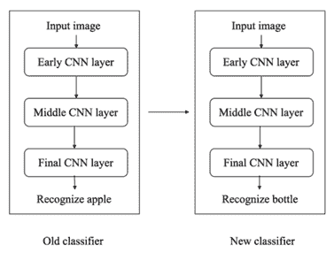

通常，我们需要大量数据来训练我们的模型，但大多数时候我们没有足够的相关数据。这时迁移学习就派上用场了，它允许你用很少的数据来训练模型。

如果你之前的分类器是使用 TensorFlow 开发并训练的，你可以重复使用相同的模型，并重新训练其中一些层以适应新的分类器。这是完全可行的，但前提是从旧任务中学到的特征具有更通用的性质。例如，你不能将为文本分类器开发的模型直接用于图像分类任务。此外，两个模型的输入数据大小必须一致。如果大小不匹配，我们需要添加一个额外的预处理步骤来调整输入数据的大小。

# 迁移学习方法

让我们深入探讨迁移学习的不同方法。可能有不同的名称用于描述这些方法，但概念保持一致：

1.  **使用预训练模型**：目前有很多预训练模型可以满足你基本的深度学习研究需求。在本书中，我们使用了很多预训练模型，并从中得出我们的结果。

1.  **训练一个可重用的模型**：假设你想解决问题 A，但你没有足够的数据来实现目标。为了解决这个问题，我们有另一个问题 B，其中有足够的数据。在这种情况下，我们可以为问题 B 开发一个模型，并将该模型作为问题 A 的起点。是否需要重用所有层或仅重用某些层，取决于我们所解决问题的类型。

1.  **特征提取**：通过深度学习，我们可以提取数据集的特征。大多数时候，特征是由开发者手工设计的。神经网络有能力学习哪些特征需要传递，哪些特征不需要传递。例如，我们只会使用初始层来检测特征的正确表示，而不会使用输出层，因为它可能过于特定于某个特定任务。我们将简单地将数据输入网络，并使用其中一个中间层作为输出层。

有了这个，我们将开始使用 TensorFlow 构建我们的模型。

# 构建 TensorFlow 模型

构建你自己的自定义模型需要遵循一个逐步的过程。首先，我们将使用 TensorFlow Hub 来通过预训练模型输入图像。

要了解更多关于 TensorFlow Hub 的信息，请参考[`www.tensorflow.org/hub`](https://www.tensorflow.org/hub)。

# 安装 TensorFlow

在写这本书时，TensorFlow r1.13 版本已经发布。同时，2.0.0 版本也处于 Alpha 阶段，但我们将使用稳定版本。TensorFlow Hub 依赖于可以通过`pip`安装的 TensorFlow 库，如下所示：

```py
$ pip install tensorflow
$ pip install tensorflow-hub
```

当`tensorflow`库安装完成后，我们需要在训练过程开始之前收集我们的图像数据集。在开始训练之前，我们需要考虑很多因素。

# 训练图像

在本节中，我们将收集图像并将其按类别整理在各自的文件夹中。

选择自己图像数据集的几个常见步骤如下：

1.  首先，你需要为每个想要识别的图像类别至少准备 100 张照片。模型的准确性与数据集中的图像数量成正比。

1.  你需要确保图像集中的图像更具相关性。例如，如果你拍摄了一组背景单一的图像，比如所有图像的背景都是白色且拍摄于室内，而用户需要识别具有干扰背景（例如拍摄于户外、背景五颜六色）的物体，那么这样做并不会提高准确性。

1.  选择具有多样背景的图像。例如，如果你只选择了具有两种背景颜色的图像，那么你的预测将倾向于这两种颜色，而不是图像中的物体。

1.  尝试将较大的类别拆分为更小的子类。例如，你可以使用“猫”，“狗”或“老虎”来代替“动物”。

1.  确保选择所有包含你想识别的物体的输入图像。例如，如果你有一个识别狗的应用，我们就不会使用汽车、建筑物或山脉的图片作为输入图像。在这种情况下，最好为无法识别的图像设置一个独立的分类器。

1.  确保正确标记图像。例如，将花朵标记为茉莉花时，图片中可能会包含整株植物或背景中有人物。当输入图像中有干扰物体时，我们算法的准确性会有所不同。假设你从 Google 图片搜索中获取了一些食物图片，这些图片具有可重复使用的许可，因此在收集图像用于训练模型时，务必确保这些图像符合许可要求。你可以通过在 Google 图片搜索中输入关键词，并根据可重复使用的使用权筛选图片来实现。点击搜索栏下方的工具按钮即可找到此选项。

我们在本章中收集了一些互联网图片用于教学目的。详细信息将在下一节中讨论。

# 构建我们自己的模型

在这里，我们将使用 TensorFlow 构建自己的机器学习模型，分析车辆的损坏程度。我们需要小心选择数据集，因为它在损伤评估阶段起着至关重要的作用。以下是我们将遵循的构建模型的步骤：

1.  查找损坏车辆的图像数据集。

1.  根据损坏程度对图像进行分类。首先，我们需要识别图中的物体实际上是一辆车。为此，我们需要有两类图像集，一类包含有车的图像，另一类不包含车。然后，我们还需要三个类别来确定车的损坏等级，分别是高、中、低三个等级。确保每个类别下至少有 1,000 张图像。数据集准备好后，我们就可以开始训练模型了。

1.  我们将使用 TensorFlow 训练我们的模型。

1.  我们将构建一个 Web 应用程序来分析车辆的损坏程度。

1.  更新结果。

# 使用我们自己的图像重新训练

我们现在将使用`retrain.py`脚本，该脚本位于我们的项目目录中。

使用`curl`下载此脚本，如下所示：

```py
mkdir -/Chapter5/images
cd -/Chapter5/images
curl -LO https://github.com/tensorflow/hub/raw/master/examples/image_retraining/ retrain.py
python retrain.py --image_dir ./images/
```

在训练开始之前，有几个参数必须传递给训练脚本并查看。

一旦数据集准备好，我们需要着手改善结果。我们可以通过调整学习过程中的步骤数来实现这一点。

最简单的方法是使用以下代码：

```py
--how_many_training_steps = 4000
```

当步骤数增加时，准确率的提高速度会变慢，并且准确率在达到某个点之后将停止提高。你可以通过实验来决定什么对你来说最有效。

# 架构

MobileNet 是一个较小、低功耗、低延迟的模型，旨在满足移动设备的限制。在我们的应用中，我们从 MobileNet 数据集中选择了以下架构作为参数之一，如下代码所示，用于在构建模型时获得更好的准确性基准：

```py
--architecture=" mobilenet_v2_1.4_224"
```

网络的功率和延迟随着**乘法累加**（**MACs**）的数量而增长，MACs 衡量的是融合的乘法和加法操作的数量，如下所示：

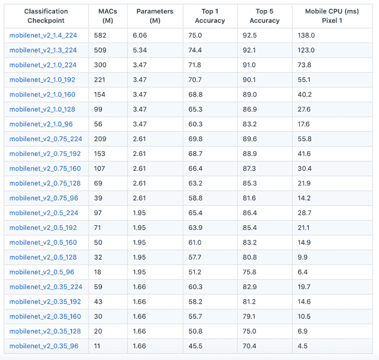

你可以从[`github.com/tensorflow/models/tree/master/research/slim/nets/mobilenet`](https://github.com/tensorflow/models/tree/master/research/slim/nets/mobilenet)下载模型。

# 扭曲

我们可以通过在训练过程中提供困难的输入图像来提高结果。训练图像可以通过随机裁剪、亮度调节和形变等方式生成。这将有助于生成一个有效的训练数据集。

然而，启用扭曲存在一个缺点，因为瓶颈缓存没有用处。因此，输入图像没有被重用，导致训练时间增加。这里有多种方式启用扭曲，如下所示：

```py
--random_crop
--random_scale
--random_brightness
```

这在所有情况下并不一定有用。例如，在数字分类系统中，它没有什么帮助，因为翻转和扭曲图像在生成可能的输出时并不合理。

# 超参数

我们可以尝试更多的参数，看看额外的参数是否有助于提高结果。

按照以下项目符号中给出的形式指定它们。超参数的解释如下：

+   `--learning_rate`：这个参数控制在训练过程中最终层的更新。如果这个值较小，训练将需要更多的时间。不过，这不一定总是能帮助提高准确性。

+   `--train_batch_size`：这个参数帮助控制在训练过程中用于估算最终层更新的图像数量。一旦图像准备好，脚本会将它们分成三个不同的集合。最大的集合用于训练。这种划分主要有助于防止模型识别输入图像中不必要的模式。如果一个模型使用特定背景模式进行训练，当面对带有新背景的图像时，它就无法给出正确的结果，因为它记住了输入图像中的不必要信息。这就是**过拟合**。

+   `--testing_percentage` 和 `--validation_percentage` 标志：为了避免过拟合，我们将 80%的数据保留在主训练集中。这些数据中的 10%用于在训练过程中进行验证，最后的 10%用于测试模型。

+   `--validation_batch_size`：我们可以看到验证的准确性在每次迭代中有所波动。

如果你是新手，你可以在不修改这些参数的情况下运行默认值。让我们开始构建我们的模型。为此，我们需要训练图像数据。

# 图像数据集收集

对于我们的实验，我们需要汽车在良好状态和损坏状态下的数据集。如果你有符合隐私政策的数据源，那么这里是一个很好的起点。否则，我们需要找到一种方法来在数据集上构建我们的模型。现在有多个公开的数据集可供使用。如果没有类似数据模型的现有参考，我们需要开始构建自己的数据集，因为这可能是一个耗时且重要的步骤，能够帮助我们获得更好的结果。

我们将使用一个简单的 Python 脚本从 Google 下载图像。只要确保你筛选的是可重用的图像。我们不鼓励使用那些带有不可重用许可证的图片。

使用 Python 脚本，我们将从 Google 拉取并保存图像，然后使用一个库来完成相同的任务。这一步是构建任何机器学习模型的最基础步骤之一。

我们将使用一个叫做**Beautiful Soup**的 Python 库来从互联网抓取图像。

# Beautiful Soup 简介

Beautiful Soup 是一个 Python 库，用于从 HTML 和 XML 文件中提取数据。它在涉及抓取的项目中非常有用。使用这个库，我们可以导航、搜索和修改 HTML 和 XML 文件。

这个库解析你提供的任何内容，并对数据进行树形遍历。你可以要求库找到所有 URL 匹配 `google.com` 的链接，找到所有类为 bold 的链接，或者找到所有包含粗体文本的表头。

有几个特性使它非常有用，具体如下：

1.  Beautiful Soup 提供了一些简单的方法和 Pythonic 风格的习惯用法，用于遍历、搜索和修改解析树。解析树是一个工具包，用于解剖文档并提取所需内容。我们可以减少编写应用程序的代码量。

1.  Beautiful Soup 自动将传入的文档转换为 Unicode，并将传出的文档转换为 UTF-8。除非文档没有指定编码且 Beautiful Soup 无法检测到任何编码，否则我们无需考虑编码问题。然后，我们只需要指定原始编码。

1.  Beautiful Soup 可以与流行的 Python 解析器一起使用，如 `lxml` ([`lxml.de/`](https://lxml.de/)) 和 `html5lib` ([`github.com/html5lib/`](https://github.com/html5lib/))，并允许你尝试不同的解析策略，或者在灵活性和速度之间做出权衡。

1.  Beautiful Soup 通过提取所需信息来节省你的时间，从而让你的工作更轻松。

这是代码的简单版本：

```py
import argparse
import json
import itertools
import logging
import re
import os
import uuid
import sys
from urllib.request import urlopen, Request
from bs4 import BeautifulSoup
#logger will be useful for your debugging need
def configure_logging():
logger = logging.getLogger()
logger.setLevel(logging.DEBUG)
handler = logging.StreamHandler()
handler.setFormatter(
logging.Formatter('[%(asctime)s %(levelname)s %(module)s]: %(message)s'))
logger.addHandler(handler)
return logger
logger = configure_logging()
```

设置用户代理以避免 403 错误代码：

```py

REQUEST_HEADER = {
'User-Agent': "Mozilla/5.0 (Windows NT 6.1; WOW64) AppleWebKit/537.36 (KHTML, like Gecko) Chrome/43.0.2357.134 Safari/537.36"}
def get_soup(url, header):
response = urlopen(Request(url, headers=header))
return BeautifulSoup(response, 'html.parser')
# initialize place for links
def get_query_url(query):
return "https://www.google.co.in/search?q=%s&source=lnms&tbm=isch" % query
# pull out specific data through navigating into source data tree
def extract_images_from_soup(soup):
image_elements = soup.find_all("div", {"class": "rg_meta"})
metadata_dicts = (json.loads(e.text) for e in image_elements)
link_type_records = ((d["ou"], d["ity"]) for d in metadata_dicts)
return link_type_records
```

传入你想提取的图像数量。默认情况下，Google 提供 100 张图像：

```py

def extract_images(query, num_images):
url = get_query_url(query)
logger.info("Souping")
soup = get_soup(url, REQUEST_HEADER)
logger.info("Extracting image urls")
link_type_records = extract_images_from_soup(soup)
return itertools.islice(link_type_records, num_images)
def get_raw_image(url):
req = Request(url, headers=REQUEST_HEADER)
resp = urlopen(req)
return resp.read()
```

保存所有下载的图像及其扩展名，如以下代码块所示：

```py
def save_image(raw_image, image_type, save_directory):
extension = image_type if image_type else 'jpg'
file_name = str(uuid.uuid4().hex) + "." + extension
save_path = os.path.join(save_directory, file_name)
with open(save_path, 'wb+') as image_file:
image_file.write(raw_image)
def download_images_to_dir(images, save_directory, num_images):
for i, (url, image_type) in enumerate(images):
try:
logger.info("Making request (%d/%d): %s", i, num_images, url)
raw_image = get_raw_image(url)
save_image(raw_image, image_type, save_directory)
except Exception as e:
logger.exception(e)
def run(query, save_directory, num_images=100):
query = '+'.join(query.split())
logger.info("Extracting image links")
images = extract_images(query, num_images)
logger.info("Downloading images")
download_images_to_dir(images, save_directory, num_images)
logger.info("Finished")
#main method to initiate the scrapper
def main():
parser = argparse.ArgumentParser(description='Scrape Google images')
#change the search term here
parser.add_argument('-s', '--search', default='apple', type=str, help='search term')
```

在这里更改图像数量参数。默认情况下它设置为 1，如以下代码所示：

```py
parser.add_argument('-n', '--num_images', default=1, type=int, help='num images to save')
#change path according to your need
parser.add_argument('-d', '--directory', default='/Users/karthikeyan/Downloads/', type=str, help='save directory')
args = parser.parse_args()
run(args.search, args.directory, args.num_images)
if __name__ == '__main__':
main()
```

将脚本保存为 Python 文件，然后通过执行以下命令运行代码：

```py
python imageScrapper.py --search "alien" --num_images 10 --directory "/Users/Karthikeyan/Downloads"
```

使用更好的库进行 Google 图像抓取，包括更多可配置的选项。我们将使用 [`github.com/hardikvasa/google-images-download`](https://github.com/hardikvasa/google-images-download)。

这是一个命令行 Python 程序，用于在 Google 图像上搜索关键词或关键短语，并可选择将图像下载到你的计算机。你也可以从另一个 Python 文件调用此脚本。

这是一个小型且可以立即运行的程序。如果你只想每个关键词下载最多 100 张图像，它不需要任何依赖。如果你想要每个关键词超过 100 张图像，那么你需要安装 `Selenium` 库以及 **ChromeDriver**。详细说明在 *故障排除* 部分提供。

你可以使用一个拥有更多实用选项的库。

如果你偏好基于命令行的安装方式，可以使用以下代码：

```py
$ git clone https://github.com/hardikvasa/google-images-download.git
$ cd google-images-download && sudo python setup.py install
```

另外，你也可以通过 `pip` 安装这个库：

```py
$ pip install google_images_download
```

如果通过 `pip` 安装或使用 **命令行语言解释器** (**CLI**) 安装，可以使用以下命令：

```py
$ googleimagesdownload [Arguments...]
```

如果是从 `github.com` 的 UI 下载的，请解压下载的文件，进入 `google_images_download` 目录，并使用以下命令之一：

```py
$ python3 google_images_download.py [Arguments...] 
$ python google_images_download.py [Arguments...]
```

如果您想从另一个 Python 文件中使用此库，请使用以下命令：

```py
from google_images_download import google_images_download
response = google_images_download.googleimagesdownload()
 absolute_image_paths = response.download({<Arguments...>})
```

您可以直接从命令行传递参数，如下所示，或者通过配置文件传递参数。

您可以通过配置文件传递多个记录。以下示例由两组记录组成。代码将遍历每一条记录，并根据传递的参数下载图片。

以下是配置文件的示例：

```py
{
 "Records": [
 {
 "keywords": "apple",
 "limit": 55,
 "color": "red",
 "print_urls": true
 },
 {
 "keywords": "oranges",
 "limit": 105,
 "size": "large",
 "print_urls": true
 }
 ]
 }
```

# 示例

如果您从另一个 Python 文件调用此库，以下是来自 Google 的示例代码：

```py
_images_download import google_images_download 

#importing the library

response = google_images_download.googleimagesdownload() 

#class instantiation

arguments = {"keywords":"apple, beach, cat","limit":30,"print_urls":True} #creating list of arguments
paths = response.download(arguments) #passing the arguments to the function
print(paths)

#printing absolute paths of the downloaded images
```

如果您是通过配置文件传递参数，只需传递 `config_file` 参数，并指定您的 **JSON** 文件名：

```py
$ googleimagesdownload -cf example.json
```

以下是使用关键词和限制参数的简单示例：

```py
$ googleimagesdownload --keywords "apple, beach, cat" --limit 20
```

使用后缀关键词可以指定主关键词后的词语。例如，如果关键词是 `car`，而后缀关键词是 `red` 和 `blue`，则会先搜索红色的汽车，再搜索蓝色的汽车：

```py
$ googleimagesdownload --k "car" -sk 'yellow,blue,green' -l 10
```

要使用简化命令，请使用以下代码：

```py
$ googleimagesdownload -k "apple, beach, cat" -l 20
```

要下载具有特定图像扩展名或格式的图片，请使用以下代码：

```py
$ googleimagesdownload --keywords "logo" --format svg
```

要为图片使用颜色过滤器，请使用以下代码：

```py
$ googleimagesdownload -k "playground" -l 20 -co red
```

要使用非英语关键词进行图片搜索，请使用以下代码：

```py
$ googleimagesdownload -k "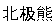" -l 5
```

要从 Google 图片链接下载图片，请使用以下代码：

```py
$ googleimagesdownload -k "sample" -u <google images page URL>
```

要将图片保存到特定的主目录（而不是 `Downloads`）中，请使用以下代码：

```py
$ googleimagesdownload -k "boat" -o "boat_new"
```

要下载图像 URL 中的单张图片，请使用以下代码：

```py
$ googleimagesdownload --keywords "baloons" --single_image <URL of the images>
```

要下载具有大小和类型约束的图片，请使用以下代码：

```py
$ googleimagesdownload --keywords "baloons" --size medium --type animated
```

要下载具有特定使用权的图片，请使用以下代码：

```py
$ googleimagesdownload --keywords "universe" --usage_rights labeled-for-reuse
```

要下载具有特定颜色类型的图片，请使用以下代码：

```py
$ googleimagesdownload --keywords "flowers" --color_type black-and-white
```

要下载具有特定纵横比的图片，请使用以下代码：

```py
$ googleimagesdownload --keywords "universe" --aspect_ratio panoramic
```

要下载与您提供的图像 URL 中的图片相似的图像（即反向图片搜索），请使用以下代码：

```py
$ googleimagesdownload -si <image url> -l 10
```

要根据给定关键词从特定网站或域名下载图片，请使用以下代码：

```py
$ googleimagesdownload --keywords "universe" --specific_site google.com
```

图片将下载到它们各自的子目录中，位于您所在文件夹的主目录内（无论是您提供的目录，还是 `Downloads`）。

现在，我们需要开始准备我们的数据集。

# 数据集准备

我们需要构建四个不同的数据集。对于汽车损坏检测，我们将考虑所有可能的输入。它可以是一辆状况良好的车，或一辆不同损坏程度的车，或者也可以是与车无关的图像。

我们将按照以下截图中所示的方式操作：

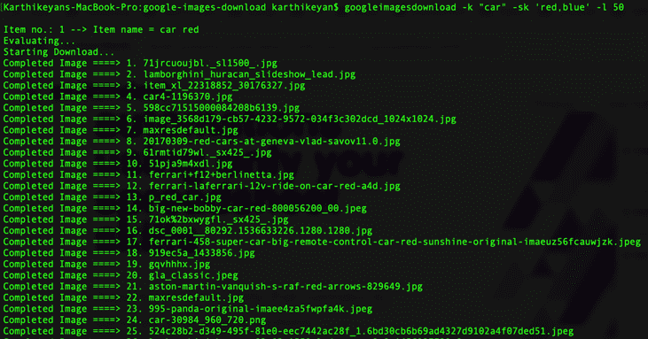

这是用于识别严重损坏汽车的数据集：

```py
googleimagesdownload -k "heavily damaged car" -sk 'red,blue,white,black,green,brown,pink,yellow' -l 500
```

下面是一些为识别严重损坏的红色汽车所捕获的示例图片：

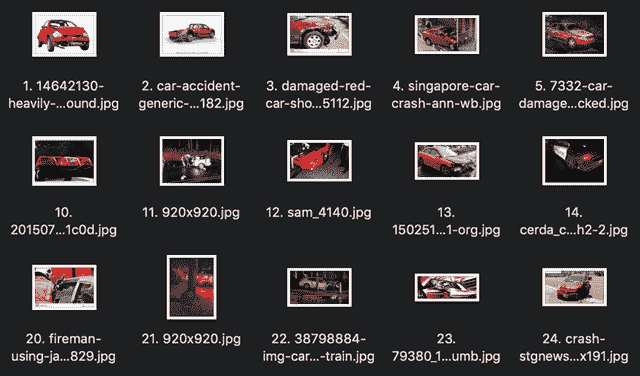

这是一些捕获到的有严重损坏的蓝色汽车的示例图片：

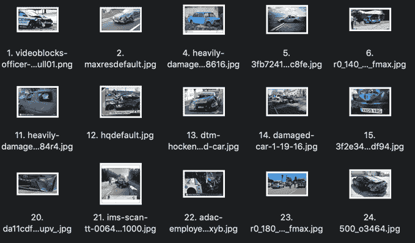

我们还拥有另一组轻微损坏的汽车图像：

```py
googleimagesdownload -k "car dent" -sk 'red,blue,white,black,green,brown,pink,yellow' -l 500
```

这是一些捕获到的有凹痕的红色汽车的示例图片：

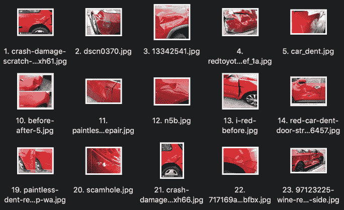

这是一些捕获到的有凹痕的蓝色汽车的示例图片：

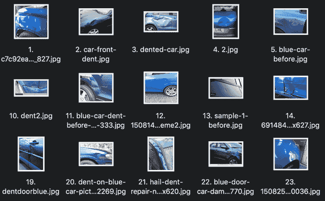

以下命令可用于检索没有任何损坏的普通汽车数据集：

```py
googleimagesdownload -k "car" -l 500
```

这是一些捕获到的红色汽车的示例图片：

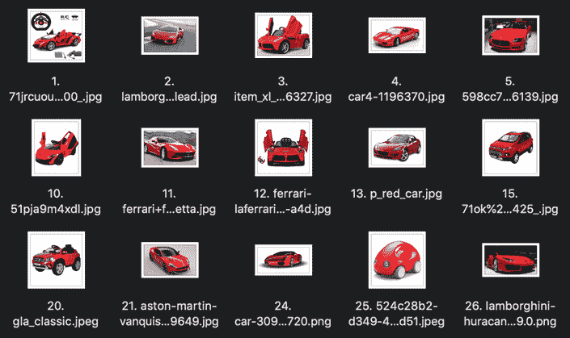

这是一些捕获到的蓝色汽车的示例图片：

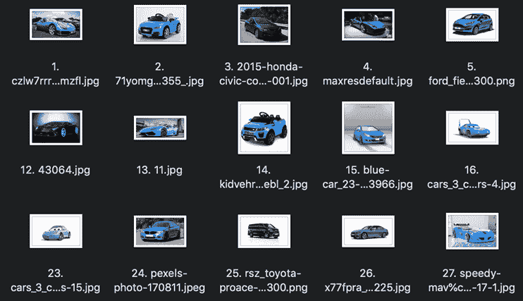

以下命令可用于检索不属于汽车的随机物体：

```py
googleimagesdownload -k "bike,flight,home,road,tv" -l 500
```

这是一些捕获到的自行车的示例图片：

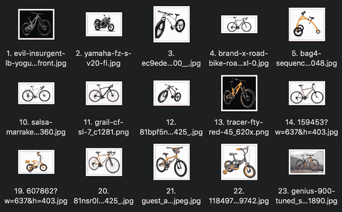

这是一些捕获到的航班的示例图片：

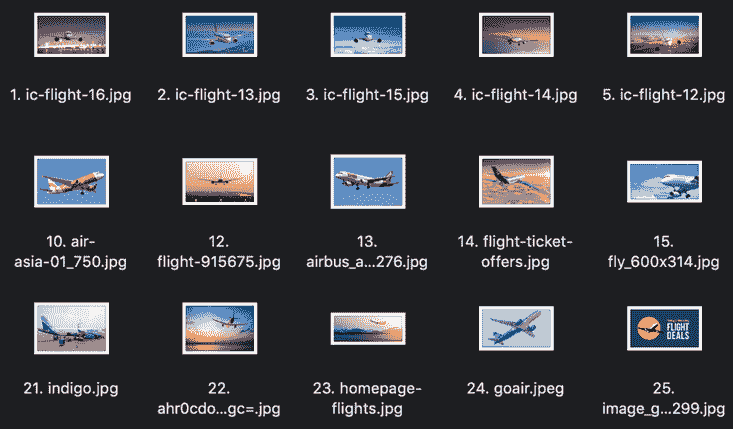

一旦每个数据集有了 500 张图片，就可以开始训练了。在理想条件下，每个数据集至少应有 1,000 张图片。

我们面临的主要问题是去除噪声数据。对于我们的示例，我们将手动进行这一操作。以下是我们列出的一些示例图像，它们可能是噪声数据，不提供有效输入，因此无法用于构建数据模型：

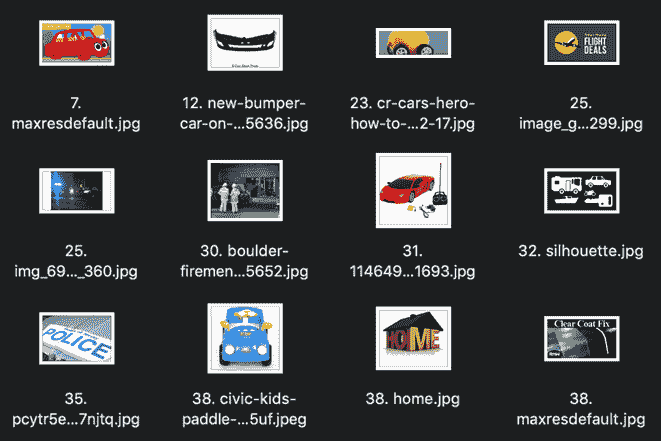

一旦我们准备好了所有的图像数据集，就可以开始处理我们的四大类了。目前，所有图像都按颜色和类别分开，如下面的截图所示：

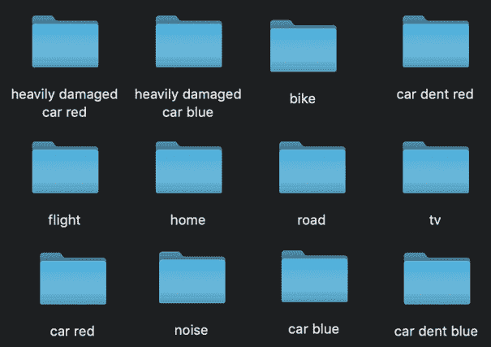

我们将把它们分为`损坏汽车`、`有凹痕的汽车`、`汽车`和`非汽车`：

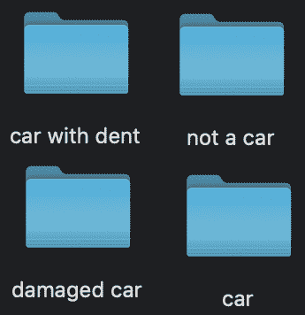

# 运行训练脚本

在讨论完所有与参数相关的细节后，我们可以开始使用下载的脚本进行训练：

```py
python retrain.py \
--bottleneck_dir=./ \
--how_many_training_steps=4000 \
--model_dir=./ \
--output_graph=./retrained_graph.pb \
--output_labels=retrained_labels.txt \
--architecture=" mobilenet_v2_1.4_224" \
--image_dir=/Users/karthikeyan/Documents/ /book/Chapter5/images
```

根据我们的处理器性能以及图像数量，脚本训练可能会需要更长时间。对我来说，50 个不同类别的汽车，每个类别包含 10,000 张图片，训练花费了超过 10 小时。一旦脚本完成，我们将在输出中得到 TensorFlow 模型。

# 设置一个 Web 应用程序

我们将使用**Flask**框架来构建一个简单的应用程序，以检测汽车的损坏。

想了解更多关于 Flask 的信息，请参考[`www.fullstackpython.com/flask.html`](https://www.fullstackpython.com/flask.html)。

我们在这里不会深入讲解 Flask 的基础知识。相反，我们只是将我们的模型与 Flask 中现有的文件上传示例结合起来。

文件的结构如下面的截图所示：

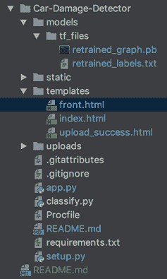

这里是`app.py`中的内容列表：

```py
import os
import glob
from classify import prediction
import tensorflow as tf
import thread
import time
from flask import Flask, render_template, request, redirect, url_for, send_from_directory,flash
from werkzeug import secure_filename
app = Flask(__name__)
app.config['UPLOAD_FOLDER'] = 'uploads/'
app.config['ALLOWED_EXTENSIONS'] = set(['jpg', 'jpeg'])
app.config['SECRET_KEY'] = '7d441f27d441f27567d441f2b6176a'
def allowed_file(filename):
return '.' in filename and \
filename.rsplit('.', 1)[1] in app.config['ALLOWED_EXTENSIONS']
@app.route('/')
def index():
return render_template('index.html')
@app.route('/upload', methods=['POST'])
def upload():
file = request.files['file']
if file and allowed_file(file.filename):
filename = secure_filename(file.filename)
filename = str(len(os.listdir(app.config['UPLOAD_FOLDER']))+1)+'.jpg'
file_name_full_path = os.path.join(app.config['UPLOAD_FOLDER'], filename)
file.save(file_name_full_path)
return render_template('upload_success.html')
@app.route('/uploads/<filename>')
def uploaded_file(filename):
return send_from_directory(app.config['UPLOAD_FOLDER'],
filename)
@app.route('/claim', methods=['POST'])
def predict():
list_of_files = glob.glob('/Users/karthikeyan/Documents/code/play/acko/cardamage/Car-Damage-Detector/uploads/*.jpg') # * means all if need specific format then *.csv
latest_file = max(list_of_files, key=os.path.getctime)
print(latest_file)
image_path = latest_file
```

下一段代码帮助我们打印输出：

```py
#print(max(glob.glob(r'uploads\*.jpg'), key=os.path.getmtime))
with tf.Graph().as_default():
human_string, score= prediction(image_path)
print('model one value' + str(human_string))
print('model one value' + str(score))
if (human_string == 'car'):
label_text = 'This is not a damaged car with confidence ' + str(score) + '%. Please upload a damaged car image'
print(image_path)
return render_template('front.html', text = label_text, filename="http://localhost:5000/uploads/"+os.path.basename(image_path))
elif (human_string == 'low'):
label_text = 'This is a low damaged car with '+ str(score) + '% confidence.'
print(image_path)
```

打印图像路径后，继续执行以下代码：

```py

return render_template('front.html', text = label_text, filename="http://localhost:5000/uploads/"+os.path.basename(image_path))
elif (human_string == 'high'):
label_text = 'This is a high damaged car with '+ str(score) + '% confidence.'
print(image_path)
return render_template('front.html', text = label_text, filename="http://localhost:5000/uploads/"+os.path.basename(image_path))
elif (human_string == 'not'):
label_text = 'This is not the image of a car with confidence ' + str(score) + '%. Please upload the car image.'
print(image_path)
return render_template('front.html', text = label_text, filename="http://localhost:5000/uploads/"+os.path.basename(image_path))
def cleanDirectory(threadName,delay):
```

`while` 循环从这里开始：

```py
while True:
time.sleep(delay)
print ("Cleaning Up Directory")
filelist = [ f for f in (os.listdir(app.config['UPLOAD_FOLDER'])) ]
for f in filelist:
#os.remove("Uploads/"+f)
os.remove(os.path.join(app.config['UPLOAD_FOLDER'], f))
if __name__ == '__main__':
try:
_thread.start_new_thread( cleanDirectory, ("Cleaning Thread", 99999999, ) )
except:
print("Error: unable to start thread" )
app.run()
Classify.py does the model classification using TensorFlow.
import tensorflow as tf
import sys
import os
import urllib
```

禁用 TensorFlow 编译警告：

```py
os.environ['TF_CPP_MIN_LOG_LEVEL']='2'
import tensorflow as tf
def prediction(image_path):
image_data = tf.gfile.FastGFile(image_path, 'rb').read()
print(image_path)
label_lines = [line.rstrip() for line
in tf.gfile.GFile(r"./models/tf_files/retrained_labels.txt")]
with tf.gfile.FastGFile(r"./models/tf_files/retrained_graph.pb", 'rb') as f:
graph_def = tf.GraphDef()
graph_def.ParseFromString(f.read())
_ = tf.import_graph_def(graph_def, name='')
with tf.Session() as sess:
```

一旦将 `image_data` 作为输入传递给图表，我们就会得到第一次预测：

```py
softmax_tensor = sess.graph.get_tensor_by_name('final_result:0')
predictions = sess.run(softmax_tensor, \
{'DecodeJpeg/contents:0': image_data})
top_k = predictions[0].argsort()[-len(predictions[0]):][::-1]
for node_id in top_k:
count = 1
human_string = label_lines[node_id]
score = predictions[0][node_id]
print(count)
count += 1
print('%s (score = %.5f)' % (human_string, score))
score = (round((score * 100), 2))
return human_string,score
```

控制器 Python 文件与前端 HTML 文件排布在一起：

```py
 <!DOCTYPE html>
 <html lang="en">
 <head>
 <meta charset="utf-8">
 <meta name="viewport" content="width=device-width, initial-scale=1, shrink-to-fit=no">
 <meta name="description" content="">
 <meta name="author" content="Karthikeyan NG">
 <title>Damage Estimator</title>
 <!-- Bootstrap core CSS -->
 <link href="{{ url_for('static', filename='vendor/bootstrap/css/bootstrap.min.css') }}" rel="stylesheet"/>
 <!-- Custom fonts for this template -->
 <link href="{{ url_for('static', filename='vendor/font-awesome/css/font-awesome.min.css') }}" rel="stylesheet" type="text/css"/>
 <link href='https://fonts.googleapis.com/css?family=Open+Sans:300italic,400italic,600italic,700italic,800italic,400,300,600,700,800' rel='stylesheet' type='text/css'>
 <link href='https://fonts.googleapis.com/css?family=Merriweather:400,300,300italic,400italic,700,700italic,900,900italic' rel='stylesheet' type='text/css'>
 <!-- Plugin CSS -->
 <link href="{{ url_for('static', filename='vendor/magnific-popup/magnific-popup.css') }}" rel="stylesheet" />
 <!-- Custom styles for this template -->
 <link href="{{ url_for('static', filename='css/creative.min.css') }}" rel="stylesheet" />
 </head>
 <body id="page-top">
 <!-- Navigation -->
 <nav class="navbar navbar-expand-lg navbar-light fixed-top" id="mainNav">
 <a class="navbar-brand" href="#page-top">Damage Estimator</a>
 <button class="navbar-toggler navbar-toggler-right" type="button" data-toggle="collapse" data-target="#navbarResponsive" aria-controls="navbarResponsive" aria-expanded="false" aria-label="Toggle navigation">
 <span class="navbar-toggler-icon"></span>
 </button>
 <div class="collapse navbar-collapse" id="navbarResponsive">
 </div>
 </nav>
 <section class="bg-primary" id="about">
 <div class="container">
 <div class="row">
 <div class="col-lg-8 mx-auto text-center">
 <h2 class="section-heading text-white">Do you have a damaged vehicle?</h2>
 <hr class="light">
 <p class="text-faded">Machine Learning allows for a classification process that is automated and makes lesser error. Besides risk group classification, Deep Learning algorithms can be applied to images of vehicle damage, allowing for automated claim classification.</p>
 <br/>
 <div class="contr"><h4 class="section-heading text-white">Select the file (image) and Upload</h4></div>
 <br/>
 <form action="upload" method="post" enctype="multipart/form-data">
 <div class="form-group">
 <input type="file" name="file" class="file">
 <div class="input-group col-xs-12">
 <span class="input-group-addon"><i class="glyphicon glyphicon-picture"></i></span>
 <input type="text" class="form-control input-lg" disabled placeholder="Upload Image">
 <span class="input-group-btn">
 <button class="browse btn btn-primary input-lg" type="button"><i class="glyphicon glyphicon-search"></i> Browse</button>
 </span>
 </div>
 </div>
 <input type="submit" class="btn btn-primary" value="Upload"><br /><br />
 </form>
 </div>
 </div>
 </section>
```

接着上一个脚本，让我们为核心 JavaScript 设置 Bootstrap：

```py
 <!-- Bootstrap core JavaScript -->
 <script src="img/jquery.min.js') }}"></script>
 <script src="img/popper.min.js') }}"></script>
 <script src="img/bootstrap.min.js') }}"></script>
 <!-- Plugin JavaScript -->
 <script src="img/jquery.easing.min.js') }}"></script>
 <script src="img/scrollreveal.min.js') }}"></script>
 <script src="img/jquery.magnific-popup.min.js') }}"></script>
 <!-- Custom scripts for this template -->
 <script src="img/creative.min.js') }}"></script>
 <script>
 $(document).on('click', '.browse', function(){
 var file = $(this).parent().parent().parent().find('.file');
 file.trigger('click');
 });
 $(document).on('change', '.file', function(){
 $(this).parent().find('.form-control').val($(this).val().replace(/C:\\fakepath\\/i, ''));
 });
 </script>
 </body>
 </html>
```

你可以直接从 GitHub 仓库拉取文件的其余内容。一旦文件结构准备好，你可以通过命令行运行应用程序，如下所示：

```py
$ python app.py
```

现在，启动你的浏览器并访问 `http://localhost:5000/`：

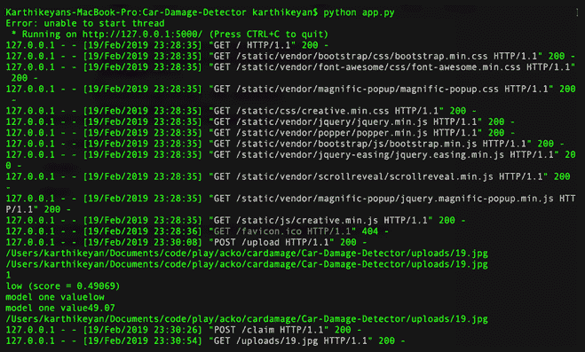

以下是应用程序中的一些截图。

这是运行应用程序后的主页：


这是上传图片后的屏幕：


这是显示一辆轻微受损汽车的截图：

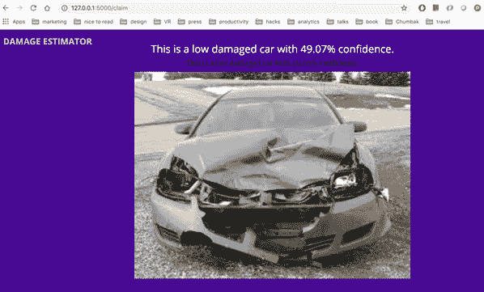

由于我们的数据集规模非常小，上面的截图中的数据可能不准确。

以下是一个截图，显示了一个预测汽车的模型，但该模型没有显示出汽车：

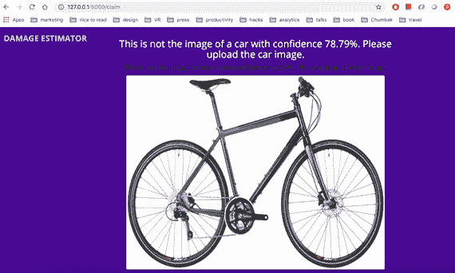

# 总结

在本章节中，我们已经学习了如何从零开始构建一个模型，并使用 TensorFlow 进行训练。

拥有这些知识后，我们可以在接下来的章节中开始构建更多基于 Android 和 iOS 的应用程序。
