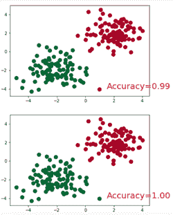
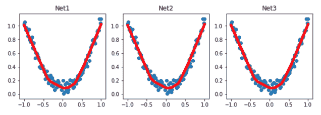

# 第六章：PyTorch 在 NLP 和 RNN 上的实验

在本章中，我们将深入研究 PyTorch 库在 **自然语言处理**（**NLP**）和其他实验中的应用。然后，我们将把开发的模型转换为可以在 Android 或 iOS 应用中使用的格式，使用 TensorFlow 和 CoreML。

在本章中，我们将覆盖以下主题：

+   PyTorch 特性和安装简介

+   在 PyTorch 中使用变量

+   构建我们自己的模型网络

+   分类 **递归神经网络**（**RNN**）

+   自然语言处理

# PyTorch

PyTorch 是一个基于 Python 的库，用于执行与 GPU 相关的科学计算操作。它通过加速实验来帮助运行生产级生态系统并分布式训练库。它还提供了两个高级特性：张量计算和基于磁带的自动求导系统构建神经网络。

# PyTorch 的特性

PyTorch 提供了一个端到端的深度学习系统。它的特点如下：

+   **Python 使用**：PyTorch 不仅仅是 C++ 框架的 Python 绑定。它深度集成于 Python，因此可以与其他流行的库和框架一起使用。

+   **工具和库**：它在计算机视觉和强化学习领域拥有一个活跃的研究人员和开发者社区。

+   **灵活的前端**：包括易于使用的混合模式支持，在急切模式下加速速度并实现无缝切换到图模式，以及在 C++ 运行时的功能性和优化。

+   **云支持**：支持所有主要的云平台，允许使用预构建的镜像进行无缝开发和扩展，以便能够作为生产级应用运行。

+   **分布式训练**：包括通过原生支持异步执行操作和点对点（p2p）通信来优化性能，这样我们可以同时访问 C++ 和 Python。

+   **原生支持 ONNX**：我们可以将模型导出为标准的 **Open Neural Network Exchange** (**ONNX**) 格式，以便在其他平台、运行时和可视化工具中访问。

# 安装 PyTorch

在编写本书时，有一个稳定版本的 PyTorch 可用，即 1.0。如果你想亲自体验最新的代码库，还可以选择使用每日预览构建版。你需要根据你的包管理器安装相应的依赖项。**Anaconda** 是推荐的包管理器，它会自动安装所有依赖项。**LibTorch** 仅适用于 C++。以下是安装 PyTorch 时可用的安装选项网格：


上面的截图指定了在编写本书时使用的包网格。你可以根据硬件配置的可用性选择任何一个包网格。

要安装 PyTorch 并启动 Jupyter Notebook，请运行以下命令：

```py
python --version
sudo brew install python3
brew install python3
pip3 install --upgrade pip
pip3 install jupyter
jupyter notebook
```

PyTorch 的安装过程如下图所示：


当你启动 Jupyter Notebook 时，一个新的浏览器会话会打开，显示一个空白的笔记本，如下所示：


让我们先了解一下 PyTorch 的基础。

# PyTorch 基础

现在 PyTorch 已经安装完成，我们可以开始实验了。我们将从 `torch` 和 `numpy` 开始。

从顶部菜单创建一个新的笔记本，并包含以下代码：

```py
# first basic understanding on PyTorch 
# book: AI for Mobile application projects

import torch
import numpy as np

# convert numpy to tensor or vise versa
numpy_data = np.arange(8).reshape((2, 4))
torch_data = torch.from_numpy(numpy_data)
#convert tensor to array
tensor2array = torch_data.numpy()

#Print the results
print
(
 '\nnumpy array:', numpy_data, # [[0 1 2 3], [4 5 6 7]]
 '\ntorch tensor:', torch_data, # 0 1 2 3\n 4 5 6 7 [torch.LongTensor of size 2x3]
 '\ntensor to array:', tensor2array, # [[0 1 2 3], [4 5 6 7]]
)
```

现在，让我们进行一些数学运算：

```py
# abs method on numpy
numpy_data = [-1, -2, 1, 2]
tensor = torch.FloatTensor(numpy_data) # 32-bit floating point

#print the results
print
(
 '\nabs',
 '\nnumpy: ', np.abs(numpy_data), # [1 2 1 2]
 '\ntorch: ', torch.abs(tensor) # [1 2 1 2]
)

# sin method on numpy
#print the results
print
(
 '\nsin',
 '\nnumpy: ', np.sin(numpy_data), # [-0.84147098 -0.90929743 0.84147098 0.90929743]
 '\ntorch: ', torch.sin(tensor) # [-0.8415 -0.9093 0.8415 0.9093]
)
```

让我们计算均值方法并打印结果：

```py

#print the results
print
(
 '\nmean',
 '\nnumpy: ', np.mean(data), # 0.0
 '\ntorch: ', torch.mean(tensor) # 0.0
)

# matrix multiplication with numpy
numpy_data = [[1,2], [3,4]]
tensor = torch.FloatTensor(numpy_data) # 32-bit floating point
# correct method and print the results
print(
 '\nmatrix multiplication (matmul)',
 '\nnumpy: ', np.matmul(numpy_data, numpy_data), # [[7, 10], [15, 22]]
 '\ntorch: ', torch.mm(tensor, tensor) # [[7, 10], [15, 22]]
)
```

以下代码展示了数学运算的输出：

```py
numpy array: [[0 1 2 3]
 [4 5 6 7]] 
torch tensor: tensor([[0, 1, 2, 3],
        [4, 5, 6, 7]]) 
tensor to array: [[0 1 2 3]
 [4 5 6 7]]

abs 
numpy:  [1 2 1 2] 
torch:  tensor([1., 2., 1., 2.])

sin 
numpy:  [-0.84147098 -0.90929743  0.84147098  0.90929743] 
torch:  tensor([-0.8415, -0.9093,  0.8415,  0.9093])

mean 
numpy:  0.0 
torch:  tensor(0.)

matrix multiplication (matmul) 
numpy:  [[ 7 10]
 [15 22]] 
torch:  tensor([[ 7., 10.],
        [15., 22.]])
```

现在，让我们来看看如何在 PyTorch 中使用不同的变量。

# 在 PyTorch 中使用变量

`torch` 中的变量用于构建计算图。每当一个变量被计算时，它都会构建一个计算图。这个计算图用于连接所有的计算步骤（节点），最终当误差反向传播时，会同时计算所有变量的修改范围（梯度）。相比之下，`tensor` 并不具备这种能力。我们将通过一个简单的例子来探讨这种差异：

```py
import torch
from torch.autograd import Variable

# Variable in torch is to build a computational graph,
# So torch does not have placeholder, torch can just pass variable to the computational graph.

tensor = torch.FloatTensor([[1,2,3],[4,5,6]]) # build a tensor
variable = Variable(tensor, requires_grad=True) # build a variable, usually for compute gradients

print(tensor) # [torch.FloatTensor of size 2x3]
print(variable) # [torch.FloatTensor of size 2x3]

# till now the tensor and variable looks similar.
# However, the variable is a part of the graph, it's a part of the auto-gradient.

#Now we will calculate the mean value on tensor(X²)
t_out = torch.mean(tensor*tensor)

#Now we will calculate the mean value on variable(X²)
v_out = torch.mean(variable*variable) 
```

现在，我们将打印所有参数的结果：

```py

#print the results
print(t_out)
print(v_out) 
#result will be 7.5

v_out.backward() # backpropagation from v_out
# v_out = 1/4 * sum(variable*variable)
# the gradients with respect to the variable, 

#Let's print the variable gradient

print(variable.grad)
'''
 0.5000 1.0000
 1.5000 2.0000
'''

print("Resultant data in the variable: "+str(variable)) # this is data in variable

"""
Variable containing:
 1 2
 3 4
We will consider the variable as a FloatTensor
[torch.FloatTensor of size 2x2]
"""

print(variable.data) # this is data in tensor format
"""
 1 2
 3 4
We will consider the variable as FloatTensor
[torch.FloatTensor of size 2x2]
"""

#we will print the result in the numpy format
print(variable.data.numpy()) 
"""
[[ 1\. 2.]
 [ 3\. 4.]]
"""
```

以下是前面代码块的输出：

```py
tensor([[1., 2., 3.],
        [4., 5., 6.]])
tensor([[1., 2., 3.],
        [4., 5., 6.]], requires_grad=True)
tensor(15.1667)
tensor(15.1667, grad_fn=<MeanBackward1>)
tensor([[0.3333, 0.6667, 1.0000],
        [1.3333, 1.6667, 2.0000]])
Data in the variabletensor([[1., 2., 3.],
        [4., 5., 6.]], requires_grad=True)
tensor([[1., 2., 3.],
        [4., 5., 6.]])
[[1\. 2\. 3.]
 [4\. 5\. 6.]]
```

现在，让我们尝试使用 `matplotlib` 在图表上绘制数据。

# 在图表上绘制值

让我们做一个简单的程序，将值绘制在图表上。为此，使用以下代码：

```py
#This line is necessary to print the output inside jupyter notebook
%matplotlib inline

import torch
import matplotlib.pyplot as plt
import torch.nn.functional as F
from torch.autograd import Variable

# dummy data for the example
#lets declare linspace
x = torch.linspace(-5, 5, 200) # x data (tensor), shape=(100, 1)
x = Variable(x)
#call numpy array to plot the results 
x_np = x.data.numpy() 
```

以下代码块列出了一些激活方法：

```py

#RelU function
y_relu = torch.relu(x).data.numpy()
#sigmoid method
y_sigmoid = torch.sigmoid(x).data.numpy()
#tanh method
y_tanh = torch.tanh(x).data.numpy()
#softplus method
y_softplus = F.softplus(x).data.numpy() # there's no softplus in torch
# y_softmax = torch.softmax(x, dim=0).data.numpy() softmax is an activation function and it deals with probability
```

使用 `matplotlib` 激活函数：

```py

#we will plot the activation function with matplotlib
plt.figure(1, figsize=(8, 6))
plt.subplot(221)
plt.plot(x_np, y_relu, c='red', label='relu')
plt.ylim((-1, 5))
plt.legend(loc='best')

#sigmoid activation function
plt.subplot(222)
plt.plot(x_np, y_sigmoid, c='red', label='sigmoid')
plt.ylim((-0.2, 1.2))
plt.legend(loc='best')

#tanh activation function
plt.subplot(223)
plt.plot(x_np, y_tanh, c='red', label='tanh')
plt.ylim((-1.2, 1.2))
plt.legend(loc='best')

#softplus activation function
plt.subplot(224)
plt.plot(x_np, y_softplus, c='red', label='softplus')
plt.ylim((-0.2, 6))
plt.legend(loc='best')

#call the show method to draw the graph on screen
plt.show()
```

让我们在图表上绘制这些值，如下所示：


请注意，前面代码的第一行是必须的，用于在 Jupyter Notebook 中绘制图表。如果你是直接从终端运行 Python 文件，可以省略代码的第一行。

# 构建我们自己的模型网络

在这一部分，我们将通过一步步的示例使用 PyTorch 构建我们自己的网络。

让我们从线性回归开始，作为起点。

# 线性回归

线性回归可能是任何人在学习机器学习时接触的第一个方法。线性回归的目标是找到一个或多个特征（自变量）与一个连续的目标变量（因变量）之间的关系，这可以在以下代码中看到。

导入所有必要的库并声明所有必要的变量：

```py
%matplotlib inline

#Import all the necessary libraries
import torch
import torch.nn.functional as F
import matplotlib.pyplot as plt

#we will define data points for both x-axis and y-axis
# x data (tensor), shape=(100, 1)
x = torch.unsqueeze(torch.linspace(-1, 1, 100), dim=1) 
# noisy y data (tensor), shape=(100, 1)
y = x.pow(2) + 0.2*torch.rand(x.size()) 

# torch can only train on Variable, so convert them to Variable
# x, y = Variable(x), Variable(y)

# plt.scatter(x.data.numpy(), y.data.numpy())
# plt.show()
```

我们将定义线性回归类，并运行一个简单的 `nn` 来解释回归：

```py

class Net(torch.nn.Module):
 def __init__(self, n_feature, n_hidden, n_output):
 super(Net, self).__init__()
 self.hidden = torch.nn.Linear(n_feature, n_hidden) # hidden layer
 self.predict = torch.nn.Linear(n_hidden, n_output) # output layer

def forward(self, x):
 x = F.relu(self.hidden(x)) # activation function for hidden layer
 x = self.predict(x) # linear output
 return x

net = Net(n_feature=1, n_hidden=10, n_output=1) # define the network
print(net) # net architecture

optimizer = torch.optim.SGD(net.parameters(), lr=0.2)
loss_func = torch.nn.MSELoss() # this is for regression mean squared loss

plt.ion() # something about plotting

for t in range(200):
 prediction = net(x) # input x and predict based on x
 loss = loss_func(prediction, y) # must be (1\. nn output, 2\. target)
 optimizer.zero_grad() # clear gradients for next train
 loss.backward() # backpropagation, compute gradients
 optimizer.step() # apply gradients
 if t % 50 == 0:
```

现在我们将看到如何绘制图表并展示学习过程：

```py
     plt.cla()
     plt.scatter(x.data.numpy(), y.data.numpy())
     plt.plot(x.data.numpy(), prediction.data.numpy(), 'r-', lw=5)
     plt.text(0.5, 0, 'Loss=%.4f' % loss.data.numpy(), fontdict={'size': 20, 'color': 'black'})
     plt.pause(0.1)

plt.ioff()
plt.show()
```

让我们将这段代码的输出绘制到图表上，如下所示：


最终的图表如下所示，其中损失（即预测输出与实际输出之间的偏差）为 0.01：


现在，我们将开始使用 PyTorch 进行更深入的应用案例。

# 分类

分类问题运行神经网络模型以对输入进行分类。例如，它将衣物的图像分类为裤子、上衣和衬衫。当我们向分类模型提供更多输入时，它将预测输出的结果值。

一个简单的示例是将电子邮件过滤为*垃圾邮件*或*非垃圾邮件*。分类要么根据训练集预测分类标签，要么在分类新数据时使用的分类属性来预测分类标签（类别标签）。有许多分类模型，如朴素贝叶斯、随机森林、决策树和逻辑回归。

在这里，我们将处理一个简单的分类问题。为此，使用以下代码：

```py
%matplotlib inline

import torch
import torch.nn.functional as F
import matplotlib.pyplot as plt

# torch.manual_seed(1) # reproducible

# make fake data
n_data = torch.ones(100, 2)
x0 = torch.normal(2*n_data, 1) # class0 x data (tensor), shape=(100, 2)
y0 = torch.zeros(100) # class0 y data (tensor), shape=(100, 1)
x1 = torch.normal(-2*n_data, 1) # class1 x data (tensor), shape=(100, 2)
y1 = torch.ones(100) # class1 y data (tensor), shape=(100, 1)
x = torch.cat((x0, x1), 0).type(torch.FloatTensor) # shape (200, 2) FloatTensor = 32-bit floating
y = torch.cat((y0, y1), ).type(torch.LongTensor) # shape (200,) LongTensor = 64-bit integer

class Net(torch.nn.Module):
 def __init__(self, n_feature, n_hidden, n_output):
 super(Net, self).__init__()
 self.hidden = torch.nn.Linear(n_feature, n_hidden) # hidden layer
 self.out = torch.nn.Linear(n_hidden, n_output) # output layer

def forward(self, x):
 x = F.relu(self.hidden(x)) # activation function for hidden layer
 x = self.out(x)
 return x

net = Net(n_feature=2, n_hidden=10, n_output=2) # define the network
print(net) # net architecture

optimizer = torch.optim.SGD(net.parameters(), lr=0.02)
loss_func = torch.nn.CrossEntropyLoss() # the target label is NOT an one-hotted

plt.ion() # something about plotting

for t in range(100):
 out = net(x) # input x and predict based on x
 loss = loss_func(out, y) # must be (1\. nn output, 2\. target), the target label is NOT one-hotted

optimizer.zero_grad() # clear gradients for next train
 loss.backward() # backpropagation, compute gradients
 optimizer.step() # apply gradients

if t % 10 == 0:
```

现在，让我们绘制图表并显示学习过程：

```py
 plt.cla()
 prediction = torch.max(out, 1)[1]
 pred_y = prediction.data.numpy()
 target_y = y.data.numpy()
 plt.scatter(x.data.numpy()[:, 0], x.data.numpy()[:, 1], c=pred_y, s=100, lw=0, cmap='RdYlGn')
 accuracy = float((pred_y == target_y).astype(int).sum()) / float(target_y.size)
 plt.text(1.5, -4, 'Accuracy=%.2f' % accuracy, fontdict={'size': 20, 'color': 'red'})
 plt.pause(0.1)

plt.ioff()
plt.show()
```

上述代码的输出如下：

```py
Net(
  (hidden): Linear(in_features=2, out_features=10, bias=True)
  (out): Linear(in_features=10, out_features=2, bias=True)
)

```

我们将只从输出中选取几个图形，如以下截图所示：


你可以看到随着迭代步骤数的增加，准确度水平也有所提升：


我们可以在执行的最后一步达到 1.00 的准确度水平：



# 使用 torch 构建简单神经网络

当需要启发式方法来解决问题时，神经网络是必不可少的。让我们通过以下示例来探索一个基本的神经网络：

```py
import torch
import torch.nn.functional as F

# replace following class code with an easy sequential network
class Net(torch.nn.Module):
 def __init__(self, n_feature, n_hidden, n_output):
 super(Net, self).__init__()
 self.hidden = torch.nn.Linear(n_feature, n_hidden) # hidden layer
 self.predict = torch.nn.Linear(n_hidden, n_output) # output layer

def forward(self, x):
 x = F.relu(self.hidden(x)) # activation function for hidden layer
 x = self.predict(x) # linear output
 return x

net1 = Net(1, 10, 1)
```

以下是构建网络的最简单且最快的方法：

```py
 net2 = torch.nn.Sequential(
 torch.nn.Linear(1, 10),
 torch.nn.ReLU(),
 torch.nn.Linear(10, 1)
)

print(net1) # net1 architecture
"""
Net (
 (hidden): Linear (1 -> 10)
 (predict): Linear (10 -> 1)
)
"""

print(net2) # net2 architecture
"""
Sequential (
 (0): Linear (1 -> 10)
 (1): ReLU ()
 (2): Linear (10 -> 1)
)
"""
```

上述代码的输出如下：

```py
Net(
  (hidden): Linear(in_features=1, out_features=10, bias=True)
  (predict): Linear(in_features=10, out_features=1, bias=True)
)
Sequential(
  (0): Linear(in_features=1, out_features=10, bias=True)
  (1): ReLU()
  (2): Linear(in_features=10, out_features=1, bias=True)
)

Out[1]:
'\nSequential (\n  (0): Linear (1 -> 10)\n  (1): ReLU ()\n  (2): Linear (10 -> 1)\n)\n'
```

# 在网络上保存和重新加载数据

让我们看看一个保存网络数据然后恢复数据的示例：

```py
%matplotlib inline

import torch
import matplotlib.pyplot as plt

# torch.manual_seed(1) # reproducible

# fake data
x = torch.unsqueeze(torch.linspace(-1, 1, 100), dim=1) # x data (tensor), shape=(100, 1)
y = x.pow(2) + 0.2*torch.rand(x.size()) # noisy y data (tensor), shape=(100, 1)

# The code below is deprecated in Pytorch 0.4\. Now, autograd directly supports tensors
# x, y = Variable(x, requires_grad=False), Variable(y, requires_grad=False)

def save():
 # save net1
 net1 = torch.nn.Sequential(
 torch.nn.Linear(1, 10),
 torch.nn.ReLU(),
 torch.nn.Linear(10, 1)
 )
 optimizer = torch.optim.SGD(net1.parameters(), lr=0.5)
 loss_func = torch.nn.MSELoss()

for t in range(100):
 prediction = net1(x)
 loss = loss_func(prediction, y)
 optimizer.zero_grad()
 loss.backward()
 optimizer.step()

# plot result
 plt.figure(1, figsize=(10, 3))
 plt.subplot(131)
 plt.title('Net1')
 plt.scatter(x.data.numpy(), y.data.numpy())
 plt.plot(x.data.numpy(), prediction.data.numpy(), 'r-', lw=5)
```

保存网络的两种方式：

```py
 torch.save(net1, 'net.pkl') # save entire net
 torch.save(net1.state_dict(), 'net_params.pkl') # save only the parameters

def restore_net():
 # restore entire net1 to net2
 net2 = torch.load('net.pkl')
 prediction = net2(x)

# plot result
 plt.subplot(132)
 plt.title('Net2')
 plt.scatter(x.data.numpy(), y.data.numpy())
 plt.plot(x.data.numpy(), prediction.data.numpy(), 'r-', lw=5)

def restore_params():
 # restore only the parameters in net1 to net3
 net3 = torch.nn.Sequential(
 torch.nn.Linear(1, 10),
 torch.nn.ReLU(),
 torch.nn.Linear(10, 1)
 )

# copy net1's parameters into net3
 net3.load_state_dict(torch.load('net_params.pkl'))
 prediction = net3(x)
```

绘制结果：

```py
# plot result
 plt.subplot(133)
 plt.title('Net3')
 plt.scatter(x.data.numpy(), y.data.numpy())
 plt.plot(x.data.numpy(), prediction.data.numpy(), 'r-', lw=5)
 plt.show()

# save net1
save()

# restore entire net (may slow)
restore_net()

# restore only the net parameters
restore_params()
```

代码的输出将类似于以下图表所示的图形：



# 批量运行

Torch 帮助你通过`DataLoader`来组织数据。我们可以使用它通过批量训练来打包数据。我们可以将自己的数据格式（例如 NumPy 数组或其他格式）加载到 Tensor 中，并进行包装。

以下是一个数据集的示例，其中随机数以批量的形式被引入数据集并进行训练：

```py
import torch
import torch.utils.data as Data

torch.manual_seed(1) # reproducible

BATCH_SIZE = 5

x = torch.linspace(1, 10, 10) # this is x data (torch tensor)
y = torch.linspace(10, 1, 10) # this is y data (torch tensor)

torch_dataset = Data.TensorDataset(x, y)
loader = Data.DataLoader(
 dataset=torch_dataset, # torch TensorDataset format
 batch_size=BATCH_SIZE, # mini batch size
 shuffle=True, # random shuffle for training
 num_workers=2, # subprocesses for loading data
)

def show_batch():
 for epoch in range(3): # train entire dataset 3 times
 for step, (batch_x, batch_y) in enumerate(loader): # for each training step
 # train your data...
 print('Epoch: ', epoch, '| Step: ', step, '| batch x: ',
 batch_x.numpy(), '| batch y: ', batch_y.numpy())

if __name__ == '__main__':
 show_batch()
```

代码的输出如下：

```py
Epoch:  0 | Step:  0 | batch x:  [ 5\.  7\. 10\.  3\.  4.] | batch y:  [6\. 4\. 1\. 8\. 7.]
Epoch:  0 | Step:  1 | batch x:  [2\. 1\. 8\. 9\. 6.] | batch y:  [ 9\. 10\.  3\.  2\.  5.]
Epoch:  1 | Step:  0 | batch x:  [ 4\.  6\.  7\. 10\.  8.] | batch y:  [7\. 5\. 4\. 1\. 3.]
Epoch:  1 | Step:  1 | batch x:  [5\. 3\. 2\. 1\. 9.] | batch y:  [ 6\.  8\.  9\. 10\.  2.]
Epoch:  2 | Step:  0 | batch x:  [ 4\.  2\.  5\.  6\. 10.] | batch y:  [7\. 9\. 6\. 5\. 1.]
Epoch:  2 | Step:  1 | batch x:  [3\. 9\. 1\. 8\. 7.] | batch y:  [ 8\.  2\. 10\.  3\.  4.]
```

# 优化算法

在我们实现神经网络时，总是存在关于应该使用哪种优化算法以获得更好输出的疑问。这是通过修改关键参数，如**权重**和**偏差**值来完成的。

这些算法用于最小化（或最大化）误差（`E`(`x`)），它依赖于内部参数。它们用于计算从模型中使用的预测变量（`x`）集得出的目标结果（`Y`）。

现在，让我们通过以下示例来看看不同类型的算法：

```py
%matplotlib inline

import torch
import torch.utils.data as Data
import torch.nn.functional as F
import matplotlib.pyplot as plt

# torch.manual_seed(1) # reproducible

LR = 0.01
BATCH_SIZE = 32
EPOCH = 12

# dummy dataset
x = torch.unsqueeze(torch.linspace(-1, 1, 1000), dim=1)
y = x.pow(2) + 0.1*torch.normal(torch.zeros(*x.size()))

# plot dataset
plt.scatter(x.numpy(), y.numpy())
plt.show()
```

将数据集放入 torch 数据集：

```py
torch_dataset = Data.TensorDataset(x, y)
loader = Data.DataLoader(dataset=torch_dataset, batch_size=BATCH_SIZE, shuffle=True, num_workers=2,)

# default network
class Net(torch.nn.Module):
 def __init__(self):
 super(Net, self).__init__()
 self.hidden = torch.nn.Linear(1, 20) # hidden layer
 self.predict = torch.nn.Linear(20, 1) # output layer

def forward(self, x):
 x = F.relu(self.hidden(x)) # activation function for hidden layer
 x = self.predict(x) # linear output
 return x

if __name__ == '__main__':
 # different nets
 net_SGD = Net()
 net_Momentum = Net()
 net_RMSprop = Net()
 net_Adam = Net()
 nets = [net_SGD, net_Momentum, net_RMSprop, net_Adam]

# different optimizers
 opt_SGD = torch.optim.SGD(net_SGD.parameters(), lr=LR)
 opt_Momentum = torch.optim.SGD(net_Momentum.parameters(), lr=LR, momentum=0.8)
 opt_RMSprop = torch.optim.RMSprop(net_RMSprop.parameters(), lr=LR, alpha=0.9)
 opt_Adam = torch.optim.Adam(net_Adam.parameters(), lr=LR, betas=(0.9, 0.99))
 optimizers = [opt_SGD, opt_Momentum, opt_RMSprop, opt_Adam]

loss_func = torch.nn.MSELoss()
 losses_his = [[], [], [], []] # record loss
```

训练模型并进行多个周期：

```py

 for epoch in range(EPOCH):
 print('Epoch: ', epoch)
 for step, (b_x, b_y) in enumerate(loader): # for each training step
 for net, opt, l_his in zip(nets, optimizers, losses_his):
 output = net(b_x) # get output for every net
 loss = loss_func(output, b_y) # compute loss for every net
 opt.zero_grad() # clear gradients for next train
 loss.backward() # backpropagation, compute gradients
 opt.step() # apply gradients
 l_his.append(loss.data.numpy()) # loss recoder

labels = ['SGD', 'Momentum', 'RMSprop', 'Adam']
 for i, l_his in enumerate(losses_his):
 plt.plot(l_his, label=labels[i])
 plt.legend(loc='best')
 plt.xlabel('Steps')
 plt.ylabel('Loss')
 plt.ylim((0, 0.2))
 plt.show()
```

执行上述代码块的输出显示在以下图表中：


Epoch 计数的输出将如下所示：

```py
Epoch: 0
Epoch:  1
Epoch:  2
Epoch:  3
Epoch:  4
Epoch:  5
Epoch:  6
Epoch:  7
Epoch:  8
Epoch:  9
Epoch:  10
Epoch:  11
```

我们将绘制所有优化器，并将它们表示在图表中，如下所示：


在下一部分，我们将讨论 RNN。

# 循环神经网络

使用 RNN 时，与前馈神经网络不同，我们可以利用内部记忆按顺序处理输入。在 RNN 中，节点之间的连接沿时间序列形成一个有向图。这有助于将任务分配给 RNN，处理大量未分割且互相关联的语音或字符识别。

# MNIST 数据库

**MNIST** 数据库包含 60,000 个手写数字。此外，还有一个由 10,000 个数字组成的测试数据集。虽然它是 NIST 数据集的一个子集，但该数据集中的所有数字都进行了大小标准化，并且已经居中在一个 28 x 28 像素的图像中。这里，每个像素的值为 0-255，表示其灰度值。

MNIST 数据集可以在 [`yann.lecun.com/exdb/mnist/`](http://yann.lecun.com/exdb/mnist/) 找到。

NIST 数据集可以在 [`www.nist.gov/srd/nist-special-database-19`](https://www.nist.gov/srd/nist-special-database-19) 找到。

# RNN 分类

在这里，我们将看一个例子，展示如何构建一个 RNN 来识别 MNIST 数据库中的手写数字：

```py
import torch
from torch import nn
import torchvision.datasets as dsets
import torchvision.transforms as transforms
import matplotlib.pyplot as plt

# torch.manual_seed(1) # reproducible

# Hyper Parameters
EPOCH = 1 # train the training data n times, to save time, we just train 1 epoch
BATCH_SIZE = 64
TIME_STEP = 28 # rnn time step / image height
INPUT_SIZE = 28 # rnn input size / image width
LR = 0.01 # learning rate
DOWNLOAD_MNIST = True # set to True if haven't download the data

# Mnist digital dataset
train_data = dsets.MNIST(
 root='./mnist/',
 train=True, # this is training data
 transform=transforms.ToTensor(), # Converts a PIL.Image or numpy.ndarray to
 # torch.FloatTensor of shape (C x H x W) and normalize in the range [0.0, 1.0]
 download=DOWNLOAD_MNIST, # download it if you don't have it
)

```

绘制一个示例：

```py

print(train_data.train_data.size()) # (60000, 28, 28)
print(train_data.train_labels.size()) # (60000)
plt.imshow(train_data.train_data[0].numpy(), cmap='gray')
plt.title('%i' % train_data.train_labels[0])
plt.show()

# Data Loader for easy mini-batch return in training
train_loader = torch.utils.data.DataLoader(dataset=train_data, batch_size=BATCH_SIZE, shuffle=True)
```

将测试数据转换为变量，选择 2000 个样本加速测试：

```py

test_data = dsets.MNIST(root='./mnist/', train=False, transform=transforms.ToTensor())
test_x = test_data.test_data.type(torch.FloatTensor)[:2000]/255\. # shape (2000, 28, 28) value in range(0,1)
test_y = test_data.test_labels.numpy()[:2000] # covert to numpy array

class RNN(nn.Module):
 def __init__(self):
 super(RNN, self).__init__()

self.rnn = nn.LSTM( # if use nn.RNN(), it hardly learns
 input_size=INPUT_SIZE,
 hidden_size=64, # rnn hidden unit
 num_layers=1, # number of rnn layer
 batch_first=True, # input & output will has batch size as 1s dimension. e.g. (batch, time_step, input_size)
 )

self.out = nn.Linear(64, 10)

def forward(self, x):
 # x shape (batch, time_step, input_size)
 # r_out shape (batch, time_step, output_size)
 # h_n shape (n_layers, batch, hidden_size)
 # h_c shape (n_layers, batch, hidden_size)
 r_out, (h_n, h_c) = self.rnn(x, None) # None represents zero initial hidden state

# choose r_out at the last time step
 out = self.out(r_out[:, -1, :])
 return out

rnn = RNN()
print(rnn)

optimizer = torch.optim.Adam(rnn.parameters(), lr=LR) # optimize all cnn parameters
loss_func = nn.CrossEntropyLoss() # the target label is not one-hotted

```

训练和测试不同的 Epoch：

```py
for epoch in range(EPOCH):
 for step, (b_x, b_y) in enumerate(train_loader): # gives batch data
 b_x = b_x.view(-1, 28, 28) # reshape x to (batch, time_step, input_size)

output = rnn(b_x) # rnn output
 loss = loss_func(output, b_y) # cross entropy loss
 optimizer.zero_grad() # clear gradients for this training step
 loss.backward() # backpropagation, compute gradients
 optimizer.step() # apply gradients

if step % 50 == 0:
 test_output = rnn(test_x) # (samples, time_step, input_size)
 pred_y = torch.max(test_output, 1)[1].data.numpy()
 accuracy = float((pred_y == test_y).astype(int).sum()) / float(test_y.size)
 print('Epoch: ', epoch, '| train loss: %.4f' % loss.data.numpy(), '| test accuracy: %.2f' % accuracy)

# print 10 predictions from test data
test_output = rnn(test_x[:10].view(-1, 28, 28))
pred_y = torch.max(test_output, 1)[1].data.numpy()
print(pred_y, 'prediction number')
print(test_y[:10], 'real number')
```

需要下载并解压以下文件以训练图像：

```py
Downloading http://yann.lecun.com/exdb/mnist/train-images-idx3-ubyte.gz to ./mnist/MNIST/raw/train-images-idx3-ubyte.gz
100.1%
Extracting ./mnist/MNIST/raw/train-images-idx3-ubyte.gz
Downloading http://yann.lecun.com/exdb/mnist/train-labels-idx1-ubyte.gz to ./mnist/MNIST/raw/train-labels-idx1-ubyte.gz
113.5%
Extracting ./mnist/MNIST/raw/train-labels-idx1-ubyte.gz
Downloading http://yann.lecun.com/exdb/mnist/t10k-images-idx3-ubyte.gz to ./mnist/MNIST/raw/t10k-images-idx3-ubyte.gz
100.4%
Extracting ./mnist/MNIST/raw/t10k-images-idx3-ubyte.gz
Downloading http://yann.lecun.com/exdb/mnist/t10k-labels-idx1-ubyte.gz to ./mnist/MNIST/raw/t10k-labels-idx1-ubyte.gz
180.4%
Extracting ./mnist/MNIST/raw/t10k-labels-idx1-ubyte.gz
Processing...
Done!
torch.Size([60000, 28, 28])
torch.Size([60000])
/usr/local/lib/python3.7/site-packages/torchvision/datasets/mnist.py:53: UserWarning: train_data has been renamed data
  warnings.warn("train_data has been renamed data")
/usr/local/lib/python3.7/site-packages/torchvision/datasets/mnist.py:43: UserWarning: train_labels has been renamed targets
 warnings.warn("train_labels has been renamed targets")
```

上述代码的输出结果如下：


让我们通过以下代码进一步处理：

```py
/usr/local/lib/python3.7/site-packages/torchvision/datasets/mnist.py:58: UserWarning: test_data has been renamed data
  warnings.warn("test_data has been renamed data")
/usr/local/lib/python3.7/site-packages/torchvision/datasets/mnist.py:48: UserWarning: test_labels has been renamed targets
  warnings.warn("test_labels has been renamed targets")

RNN(
  (rnn): LSTM(28, 64, batch_first=True)
  (out): Linear(in_features=64, out_features=10, bias=True)
)
```

Epoch 输出结果如下：

```py
Epoch:  0 | train loss: 2.3156 | test accuracy: 0.12
Epoch:  0 | train loss: 1.1875 | test accuracy: 0.57
Epoch:  0 | train loss: 0.7739 | test accuracy: 0.68
Epoch:  0 | train loss: 0.8689 | test accuracy: 0.73
Epoch:  0 | train loss: 0.5322 | test accuracy: 0.83
Epoch:  0 | train loss: 0.3657 | test accuracy: 0.83
Epoch:  0 | train loss: 0.2960 | test accuracy: 0.88
Epoch:  0 | train loss: 0.3869 | test accuracy: 0.90
Epoch:  0 | train loss: 0.1694 | test accuracy: 0.92
Epoch:  0 | train loss: 0.0869 | test accuracy: 0.93
Epoch:  0 | train loss: 0.2825 | test accuracy: 0.91
Epoch:  0 | train loss: 0.2392 | test accuracy: 0.94
Epoch:  0 | train loss: 0.0994 | test accuracy: 0.91
Epoch:  0 | train loss: 0.3731 | test accuracy: 0.94
Epoch:  0 | train loss: 0.0959 | test accuracy: 0.94
Epoch:  0 | train loss: 0.1991 | test accuracy: 0.95
Epoch:  0 | train loss: 0.0711 | test accuracy: 0.94
Epoch:  0 | train loss: 0.2882 | test accuracy: 0.96
Epoch:  0 | train loss: 0.4420 | test accuracy: 0.95
[7 2 1 0 4 1 4 9 5 9] prediction number
[7 2 1 0 4 1 4 9 5 9] real number
```

# RNN 循环神经网络 – 回归

现在，我们将处理一个基于 RNN 的回归问题。循环神经网络为神经网络提供了记忆功能。对于序列数据，循环神经网络可以实现更好的效果。在这个例子中，我们将使用 RNN 来预测时间序列数据。

要了解更多关于循环神经网络的信息，请访问 [`iopscience.iop.org/article/10.1209/0295-5075/18/3/003/meta`](https://iopscience.iop.org/article/10.1209/0295-5075/18/3/003/meta)。

以下代码用于逻辑回归：

```py
%matplotlib inline

import torch
from torch import nn
import numpy as np
import matplotlib.pyplot as plt

# torch.manual_seed(1) # reproducible

# Hyper Parameters
TIME_STEP = 10 # rnn time step
INPUT_SIZE = 1 # rnn input size
LR = 0.02 # learning rate

# show data
steps = np.linspace(0, np.pi*2, 100, dtype=np.float32) # float32 for converting torch FloatTensor
x_np = np.sin(steps)
y_np = np.cos(steps)
plt.plot(steps, y_np, 'r-', label='target (cos)')
plt.plot(steps, x_np, 'b-', label='input (sin)')
plt.legend(loc='best')
plt.show()

```

`RNN` 类在以下代码中定义。我们将以线性方式使用 `r_out` 计算预测输出。我们也可以使用 `for` 循环与 `torch.stack` 来计算预测输出：

```py

class RNN(nn.Module):
 def __init__(self):
     super(RNN, self).__init__()

 self.rnn = nn.RNN(
 input_size=INPUT_SIZE,
 hidden_size=32, # rnn hidden unit
 num_layers=1, # number of rnn layer
 batch_first=True, # input & output will have batch size as 1s dimension. e.g. (batch, time_step, input_size)
 )
 self.out = nn.Linear(32, 1)

 def forward(self, x, h_state):
     # x (batch, time_step, input_size)
     # h_state (n_layers, batch, hidden_size)
     # r_out (batch, time_step, hidden_size)
     r_out, h_state = self.rnn(x, h_state)

     outs = [] # save all predictions
     for time_step in range(r_out.size(1)):                                              outs.append(self.out(r_out[:, time_step, :]))
     return torch.stack(outs, dim=1), h_state

//instantiate RNN
rnn = RNN()
print(rnn)
```

输出结果如下：

```py
"""
RNN (
 (rnn): RNN(1, 32, batch_first=True)
 (out): Linear (32 -> 1)
)
"""

```

我们现在需要优化 RNN 参数，如下代码所示，在运行 `for` 循环以进行预测之前：

```py
optimizer = torch.optim.Adam(rnn.parameters(), lr=LR) 
loss_func = nn.MSELoss()
h_state = None
plt.figure(1, figsize=(12, 5))
plt.ion() 
```

以下代码块运行时会呈现动态效果，但在本书中无法展示。我们添加了一些截图帮助你理解这一效果。我们使用 `x` 作为输入的 `sin` 值，`y` 作为输出的拟合 `cos` 值。由于这两条曲线之间存在关系，我们将使用 `sin` 来预测 `cos`：

```py
for step in range(100):
 start, end = step * np.pi, (step+1)*np.pi # time range
 # use sin predicts cos
 steps = np.linspace(start, end, TIME_STEP, dtype=np.float32, endpoint=False) # float32 for converting torch FloatTensor
 x_np = np.sin(steps)
 y_np = np.cos(steps)

 x = torch.from_numpy(x_np[np.newaxis, :, np.newaxis]) # shape (batch, time_step, input_size)
 y = torch.from_numpy(y_np[np.newaxis, :, np.newaxis])

 prediction, h_state = rnn(x, h_state) # rnn output

h_state = h_state.data # repack the hidden state, break the connection from last iteration

 loss = loss_func(prediction, y) # calculate loss
 optimizer.zero_grad() # clear gradients for this training step
 loss.backward() # backpropagation, compute gradients
 optimizer.step() # apply gradients
```

绘制结果：

```py

 plt.plot(steps, y_np.flatten(), 'r-')
 plt.plot(steps, prediction.data.numpy().flatten(), 'b-')
 plt.draw(); plt.pause(0.05)

plt.ioff()
plt.show()
```

前述代码的输出如下：


以下是第 10 次迭代后生成的图形：


以下是第 25 次迭代后生成的图形：


我们不会在这里展示所有 100 次迭代的输出图像，而是直接跳到最终的输出，即第 100 次迭代，如下截图所示：


在接下来的部分，我们将探讨自然语言处理（NLP）。

# 自然语言处理

现在是时候利用 PyTorch 尝试一些自然语言处理技术了。这对那些之前没有在任何深度学习框架中编写代码的人特别有用，尤其是那些对 NLP 核心问题和算法有更好理解的人。

在这一章中，我们将通过简单的小维度示例来观察神经网络训练过程中层权重的变化。一旦你理解了网络的工作原理，就可以尝试自己的模型。

在处理任何基于 NLP 的问题之前，我们需要理解深度学习的基本构件，包括仿射映射、非线性和目标函数。

# 仿射映射

**仿射映射** 是深度学习的基本构件之一，如下所示：


在这种情况下，矩阵由 A 表示，向量由 `x` 和 `b` 表示。`A` 和 `b` 是需要学习的参数，而 `b` 是偏置。

解释这个的简单示例如下：

```py
import torch
import torch.nn as nn
import torch.nn.functional as F
import torch.optim as optim

torch.manual_seed(1)
lin = nn.Linear(6, 3) # maps from R⁶ to R³, parameters A, b
# data is 2x5\. A maps from 6 to 3... can we map "data" under A?
data = torch.randn(2, 6)
print(lin(data)
```

之后，使用以下命令运行程序：

```py
$ python3 torch_nlp.py
```

输出将如下所示：

```py
tensor([[ 1.1105, -0.1102, -0.3235],
        [ 0.4800,  0.1633, -0.2515]], grad_fn=<AddmmBackward>)
```

# 非线性

首先，我们需要明确为什么我们需要非线性。考虑我们有两个仿射映射：`f(x)=Ax+b` 和 `g(x)=Cx+d`。`f(g(x))` 如下所示：


在这里，我们可以看到，当仿射映射组合在一起时，结果仍然是一个仿射映射，其中 *Ad+b* 是一个向量，*AC* 是一个矩阵。

我们可以将神经网络视为一系列仿射组合。以前，仿射层之间可能引入了非线性。但是幸运的是，现在已经不是这样了，这有助于构建更强大且高效的模型。

在使用最常见的函数（如 tanh (x)、σ(x) 和 ReLU (x)）时，我们看到有一些核心的非线性，如下所示的代码块所示：

```py
#let's see more about non-linearities
#Most of the non-linearities in PyTorch are present in torch.functional which we import as F)
# Please make a note that unlike affine maps, there are mostly no parameters in non-linearites 
# That is, they don't have weights that are updated during training.
#This means that during training the weights are not updated.
data = torch.randn(2, 2)
print(data)
print(F.relu(data))
```

上述代码的输出如下：

```py
tensor([[ 0.5848, 0.2149],
 [-0.4090, -0.1663]])
tensor([[0.5848, 0.2149],
 [0.0000, 0.0000]])
```

# 目标函数

目标函数（也称为损失函数或代价函数）将帮助您的网络进行最小化。它通过选择一个训练实例，将其传递通过神经网络，然后计算输出的损失来工作。

损失函数的导数会被更新，以找到模型的参数。例如，如果模型自信地预测了一个答案，而答案结果是错误的，那么计算出的损失将会很高。如果预测答案正确，那么损失较低。

网络如何最小化？

1.  首先，函数将选择一个训练实例

1.  然后，它通过我们的神经网络传递以获得输出

1.  最后，输出的损失被计算出来

在我们的训练示例中，我们需要最小化损失函数，以减少使用实际数据集时错误结果的概率。

# 在 PyTorch 中构建网络组件

在将注意力转向 NLP 之前，在本节中我们将使用非线性激活函数和仿射映射在 PyTorch 中构建一个网络。在这个例子中，我们将学习如何使用 PyTorch 内置的负对数似然（negative log likelihood）来计算损失函数，并使用反向传播更新参数。

请注意，网络的所有组件需要继承自`nn.Module`，并且还需要重写`forward()`方法。考虑到样板代码，这些是我们应该记住的细节。当我们从`nn.Module`继承这些组件时，网络组件会提供相应的功能。

现在，如前所述，我们将看一个例子，其中网络接收一个稀疏的词袋（BoW）表示，输出是一个概率分布到两个标签，即英语和西班牙语。同时，这个模型是逻辑回归的一个例子。

# 使用逻辑回归的 BoW 分类器

概率将被记录在我们的两个标签“英语”和“西班牙语”上，我们生成的模型将映射一个稀疏的 BoW 表示。在词汇表中，我们会为每个词分配一个索引。假设在我们的词汇表中有两个词，即 hello 和 world，它们的索引分别是零和一。例如，对于句子 *hello hello hello hello hello,* 其 BoW 向量是 *[5,0]*。类似地，*hello world world hello world* 的 BoW 向量是 *[2,3]*，以此类推。

通常，它是 *[Count(hello), Count(world)]*。

让我们将 BOW 向量表示为 *x.*

网络的输出如下：


接下来，我们需要通过仿射映射传递输入，然后使用 log softmax：

```py
data = [("El que lee mucho y anda mucho, ve mucho y sabe mucho".split(), "SPANISH"),
 ("The one who reads a lot and walks a lot, sees a lot and knows a lot.".split(), "ENGLISH"),
 ("Nunca es tarde si la dicha es buena".split(), "SPANISH"),
 ("It is never late if the joy is good".split(), "ENGLISH")]

test_data = [("Que cada palo aguante su vela".split(), "SPANISH"),
 ("May every mast hold its own sail".split(), "ENGLISH")]

#each word in the vocabulary is mapped to an unique integer using word_to_ix, and that will be considered as that word's index in BOW

word_to_ix = {}
for sent, _ in data + test_data:
 for word in sent:
 if word not in word_to_ix:
 word_to_ix[word] = len(word_to_ix)
print(word_to_ix)

VOCAB_SIZE = len(word_to_ix)
NUM_LABELS = 2

class BoWClassifier(nn.Module): # inheriting from nn.Module!

def __init__(self, num_labels, vocab_size):

#This calls the init function of nn.Module. The syntax might confuse you, but don't be confused. Remember to do it in nn.module 

 super(BoWClassifier, self).__init__()
```

接下来，我们将定义所需的参数。在这里，这些参数是`A`和`B`，以下代码块解释了进一步所需的实现：

```py
 # let's look at the prarmeters required for affine mapping
 # nn.Linear() is defined using Torch that gives us the affine maps.
#We need to ensure that we understand why the input dimension is vocab_size
 # num_labels is the output
 self.linear = nn.Linear(vocab_size, num_labels)

# Important thing to remember: parameters are not present in the non-linearity log softmax. So, let's now think about that.

def forward(self, bow_vec):
 #first, the input is passed through the linear layer
 #then it is passed through log_softmax
 #torch.nn.functional contains other non-linearities and many other fuctions

 return F.log_softmax(self.linear(bow_vec), dim=1)

def make_bow_vector(sentence, word_to_ix):
 vec = torch.zeros(len(word_to_ix))
 for word in sentence:
 vec[word_to_ix[word]] += 1
 return vec.view(1, -1)

def make_target(label, label_to_ix):
 return torch.LongTensor([label_to_ix[label]])

model = BoWClassifier(NUM_LABELS, VOCAB_SIZE)
```

现在，模型知道了自己的参数。第一个输出是`A`，第二个是`B`，如下所示：

```py
#A component is assigned to a class variable in the __init__ function
# of a module, which was done with the line
# self.linear = nn.Linear(...)

# Then from the PyTorch devs, knowledge of the nn.linear's parameters #is stored by the module (here-BoW Classifier)

for param in model.parameters():
 print(param)

#Pass a BoW vector for running the model
# the code is wrapped since we don't need to train it
torch.no_grad()
with torch.no_grad():
 sample = data[0]
 bow_vector = make_bow_vector(sample[0], word_to_ix)
 log_probs = model(bow_vector)
 print(log_probs)
```

上述代码的输出如下：

```py

{'El': 0, 'que': 1, 'lee': 2, 'mucho': 3, 'y': 4, 'anda': 5, 'mucho,': 6, 've': 7, 'sabe': 8, 'The': 9, 'one': 10, 'who': 11, 'reads': 12, 'a': 13, 'lot': 14, 'and': 15, 'walks': 16, 'lot,': 17, 'sees': 18, 'knows': 19, 'lot.': 20, 'Nunca': 21, 'es': 22, 'tarde': 23, 'si': 24, 'la': 25, 'dicha': 26, 'buena': 27, 'It': 28, 'is': 29, 'never': 30, 'late': 31, 'if': 32, 'the': 33, 'joy': 34, 'good': 35, 'Que': 36, 'cada': 37, 'palo': 38, 'aguante': 39, 'su': 40, 'vela': 41, 'May': 42, 'every': 43, 'mast': 44, 'hold': 45, 'its': 46, 'own': 47, 'sail': 48}
Parameter containing:
tensor([[-0.0347, 0.1423, 0.1145, -0.0067, -0.0954, 0.0870, 0.0443, -0.0923,
 0.0928, 0.0867, 0.1267, -0.0801, -0.0235, -0.0028, 0.0209, -0.1084,
 -0.1014, 0.0777, -0.0335, 0.0698, 0.0081, 0.0469, 0.0314, 0.0519,
 0.0708, -0.1323, 0.0719, -0.1004, -0.1078, 0.0087, -0.0243, 0.0839,
 -0.0827, -0.1270, 0.1040, -0.0212, 0.0804, 0.0459, -0.1071, 0.0287,
 0.0343, -0.0957, -0.0678, 0.0487, 0.0256, -0.0608, -0.0432, 0.1308,
 -0.0264],
 [ 0.0805, 0.0619, -0.0923, -0.1215, 0.1371, 0.0075, 0.0979, 0.0296,
 0.0459, 0.1067, 0.1355, -0.0948, 0.0179, 0.1066, 0.1035, 0.0887,
 -0.1034, -0.1029, -0.0864, 0.0179, 0.1424, -0.0902, 0.0761, -0.0791,
 -0.1343, -0.0304, 0.0823, 0.1326, -0.0887, 0.0310, 0.1233, 0.0947,
 0.0890, 0.1015, 0.0904, 0.0369, -0.0977, -0.1200, -0.0655, -0.0166,
 -0.0876, 0.0523, 0.0442, -0.0323, 0.0549, 0.0462, 0.0872, 0.0962,
 -0.0484]], requires_grad=True)
Parameter containing:
tensor([ 0.1396, -0.0165], requires_grad=True)
tensor([[-0.6171, -0.7755]])
```

我们得到了张量输出值。但是，正如我们从前面的代码中看到的，这些值与对数概率并不对应，无论哪个是`English`，哪个对应的是单词`Spanish`。我们需要训练模型，为此将这些值映射到对数概率是很重要的。

```py
label_to_ix = {"SPANISH": 0, "ENGLISH": 1}
```

那么我们开始训练我们的模型吧。我们首先通过模型传递实例，得到这些对数概率。然后计算损失函数，损失函数计算完成后，我们计算该损失函数的梯度。最后，使用梯度更新参数。PyTorch 中的`nn`包提供了损失函数。我们需要使用 nn.NLLLoss()作为负对数似然损失。优化函数也在`torch.optim`中定义。

在这里，我们将使用**随机梯度下降法**（**SGD**）：

```py
# Pass the BoW vector for running the model
# the code is wrapped since we don't need to train it
torch.no_grad()

with torch.no_grad():
 sample = data[0]
 bow_vector = make_bow_vector(sample[0], word_to_ix)
 log_probs = model(bow_vector)
 print(log_probs)

# We will run this on data that can be tested temporarily, before training, just to check the before and after difference using touch.no_grad():

with torch.no_grad():
 for instance, label in test_data:
 bow_vec = make_bow_vector(instance, word_to_ix)
 log_probs = model(bow_vec)
 print(log_probs)

#The matrix column corresponding to "creo" is printed
print(next(model.parameters())[:, word_to_ix["mucho"]])

loss_function = nn.NLLLoss()
optimizer = optim.SGD(model.parameters(), lr=0.1)
```

我们不想毫无理由地一次次传递训练数据。实际数据集有多个实例，而不仅仅是 2 个。合理的做法是将模型训练在 5 到 30 个 epoch 之间。

以下代码展示了我们示例的范围：

```py
for epoch in range(100):
 for instance, label in data:
 # Firstly, remember that gradients are accumulated by PyTorch
 # It's important that we clear those gradients before each instance
 model.zero_grad()

#The next step is to prepare our BOW vector and the target should be #wrapped in also we must wrap the target in a tensor in the form of an #integer
 # For example, as considered above, if the target word is SPANISH, #then, the integer wrapped should be 0
#The loss function is already trained to understand that when the 0th element among the log probabilities is the one that is in accordance to SPANISH label

 bow_vec = make_bow_vector(instance, word_to_ix)
 target = make_target(label, label_to_ix)

# Next step is to run the forward pass
 log_probs = model(bow_vec)

```

在这里，我们将通过调用函数 optimizer.step()来计算各种因素，如损失、梯度和更新参数：

```py

 loss = loss_function(log_probs, target)
 loss.backward()
 optimizer.step()

with torch.no_grad():
 for instance, label in test_data:
 bow_vec = make_bow_vector(instance, word_to_ix)
 log_probs = model(bow_vec)
 print(log_probs)

# After computing and the results, we see that the index that corresponds to Spanish has gone up, and for English is has gone down!
print(next(model.parameters())[:, word_to_ix["mucho"]])
```

输出如下：

```py

tensor([[-0.7653, -0.6258]])
tensor([[-1.0456, -0.4331]])
tensor([-0.0071, -0.0462], grad_fn=<SelectBackward>)
tensor([[-0.1546, -1.9433]])
tensor([[-0.9623, -0.4813]])
tensor([ 0.4421, -0.4954], grad_fn=<SelectBackward>)
```

# 总结

现在，我们已经基本了解了如何使用 PyTorch 进行基于文本的处理。我们也更清楚了 RNN 是如何工作的，以及如何使用 PyTorch 解决与 NLP 相关的问题。

在接下来的章节中，我们将利用所学的神经网络和 NLP 知识构建应用程序。祝编码愉快！
