# 第七章：使用 WaveNet 模型进行语音转文本的 TensorFlow 移动端实现

在本章中，我们将学习如何使用 WaveNet 模型将音频转换为文本。然后，我们将构建一个模型，使用 Android 应用程序将音频转换为文本。

本章基于 Aaron van den Oord、Sander Dieleman、Heiga Zen、Karen Simonyan、Oriol Vinyals、Alex Graves、Nal Kalchbrenner、Andrew Senior 和 Koray Kavukcuoglu 的论文《*WaveNet: A Generative Model for Raw Audio*》。您可以在[`arxiv.org/abs/1609.03499`](https://arxiv.org/abs/1609.03499)找到这篇论文。

本章将涵盖以下主题：

+   WaveNet 及其工作原理

+   WaveNet 架构

+   使用 WaveNet 构建模型

+   数据集预处理

+   训练 WaveNet 网络

+   将语音 WAV 文件转换为英文文本

+   构建 Android 应用程序

让我们深入探讨 WaveNet 究竟是什么。

# WaveNet

WaveNet 是一个深度生成网络，用于生成原始音频波形。WaveNet 通过模拟人声来生成声音波形。与当前任何现有的语音合成系统相比，这种生成的声音更为自然，缩小了系统与人类表现之间的差距达 50%。

使用单一 WaveNet，我们可以以相同的保真度区分多个说话者。我们还可以根据说话者的身份在不同的说话者之间切换。该模型是自回归的和概率性的，可以在每秒处理成千上万的音频样本时高效训练。单一 WaveNet 能够以相同的保真度捕捉多个不同说话者的特点，并且可以通过条件化说话者身份来在它们之间切换。

如电影《她》中所示，人机交互的长期梦想就是让人类与机器对话。近年来，随着深度神经网络（例如，Google 助手、Siri、Alexa 和 Cortana）的发展，计算机理解语音的能力大幅提高。另一方面，计算机生成语音的过程被称为语音合成或文本转语音。在文本转语音方法中，一个说话者录制大量短音频片段，然后将这些片段拼接成所需的语句。这一过程非常困难，因为我们不能更换说话者。

这一难题促使了对其他生成语音方法的巨大需求，其中生成数据所需的所有信息都存储在模型的参数中。此外，使用输入数据，我们可以控制语音的内容和各种属性。当通过拼接音频片段生成语音时，会生成归属图。

以下是生成的**1 秒**语音归属图：

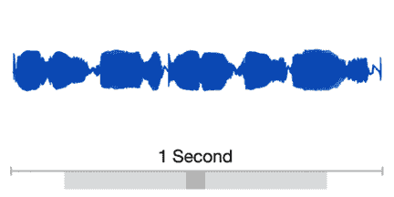

以下是生成的**100 毫秒**语音归属图：

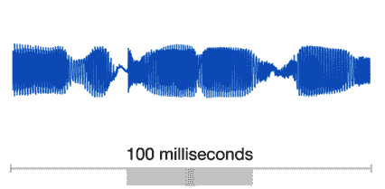

以下是生成**10 毫秒**语音的归因图：

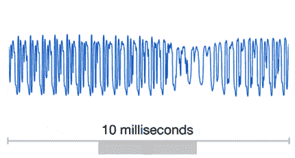

以下是生成**1 毫秒**语音的归因图：

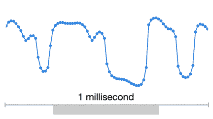

谷歌的**像素递归神经网络**（**PixelRNN**）和**像素卷积神经网络**（**PixelCNN**）模型确保能够生成包含复杂形态的图像——不是一次生成一个像素，而是同时生成整个颜色通道。在任何时刻，一个颜色通道至少需要对每个图像进行一千次预测。通过这种方式，我们可以将二维的 PixelNet 转换为一维的 WaveNet；这一思路如图所示：

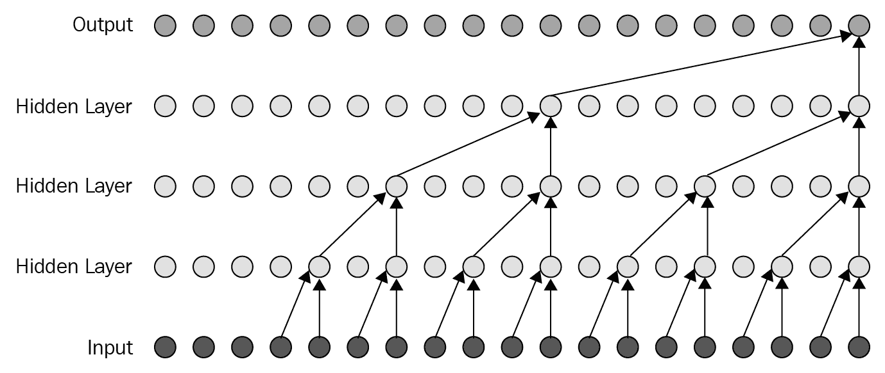

上图展示了 WaveNet 模型的结构。WaveNet 是一个完整的卷积神经网络（CNN），其中卷积层包含多种扩张因子。这些因子帮助 WaveNet 的感受野随着深度的增加呈指数增长，并且有助于覆盖成千上万个时间步长。

在训练过程中，人工语音记录输入序列以创建波形。训练完成后，我们通过从网络中采样生成合成语音。每次采样时，从网络计算出的概率分布中选取一个值。接收到的值作为下一步的输入，然后进行新的预测。在每一步生成这些样本是非常昂贵的；然而，为了生成复杂且逼真的音频，这是必需的。

有关 PixelRNN 的更多信息，请访问[`arxiv.org/pdf/1601.06759.pdf`](https://arxiv.org/pdf/1601.06759.pdf)，而关于*条件图像生成与 PixelCNN 解码器*的信息请访问[`arxiv.org/pdf/1606.05328.pdf`](https://arxiv.org/pdf/1606.05328.pdf)。

# 架构

WaveNet 神经网络的架构通过生成音频和语音合成翻译展示了惊人的效果，因为它直接生成原始音频波形。

当输入包括之前的样本和额外的参数时，网络通过条件概率生成下一个音频样本，输出为音频波形。

作为输入的波形被量化为固定范围的整数。这发生在音频预处理之后。通过对这些整数幅度进行独热编码，生成张量。因此，卷积层仅访问当前和先前的输入，从而减少了通道的维度。

以下是 WaveNet 架构的示意图：

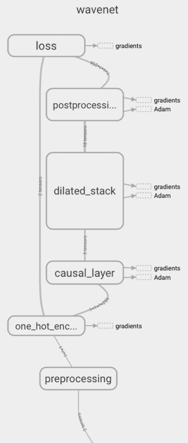

使用一堆因果扩张卷积层来构建网络核心。每一层都是一个带孔的扩张卷积层，仅访问过去和当前的音频样本。

然后，所有层接收到的输出被合并，并通过一系列密集的后处理层，输入到原始通道中。之后，softmax 函数将输出转换为分类分布。

损失函数是通过计算每个时间步的输出与下一个时间步输入之间的交叉熵来得到的。

# WaveNet 中的网络层

在这里，我们将重点介绍生成过滤器大小为 2 的扩张因果卷积网络层。注意，这些概念也适用于更大的过滤器大小。

在此生成过程中，用于计算单个输出值的计算图可以看作是一个二叉树：

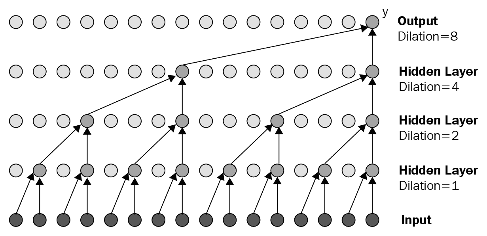

图中底层的**输入**节点是树的叶子节点，而**输出**层是根节点。中间的计算由**输入**层上方的节点表示。图中的边对应于多个矩阵。由于计算是二叉树结构，因此图的总体计算时间为*O(2^L)*。当*L*较大时，计算时间会呈指数级增长。

然而，由于该模型是随着时间反复应用的，因此存在大量的冗余计算，我们可以缓存这些计算以提高生成单个样本的速度。

关键的洞察是这样的——给定图中的某些节点，我们已经拥有计算当前输出所需的所有信息。我们通过类比 RNNs，称这些节点为**递归状态**。这些节点已经被计算过，因此我们所需要做的就是将它们缓存到不同的层中，如下图所示：

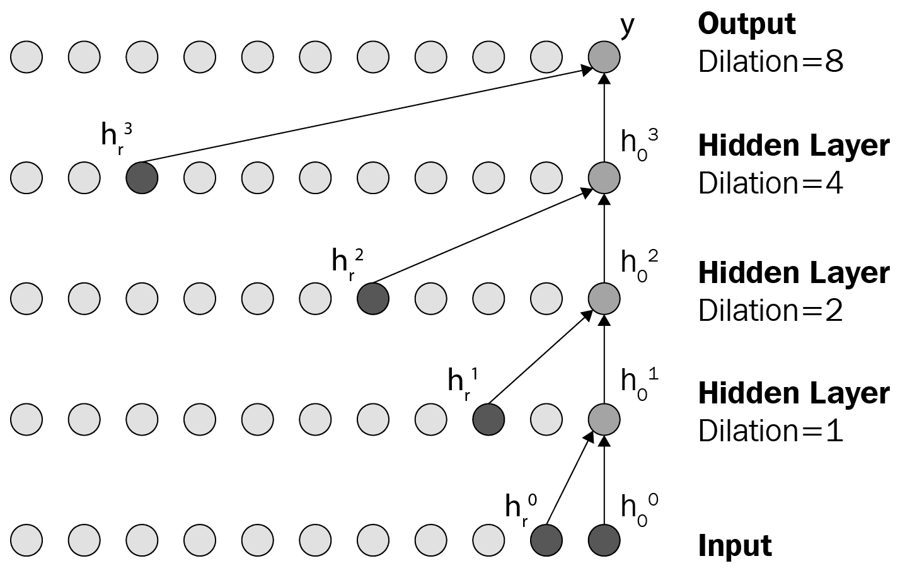

注意，在下一个时间点，我们将需要不同子集的递归状态。因此，我们需要在每一层缓存多个递归状态。我们需要保留的数量等于该层的扩张值，如下图所示：

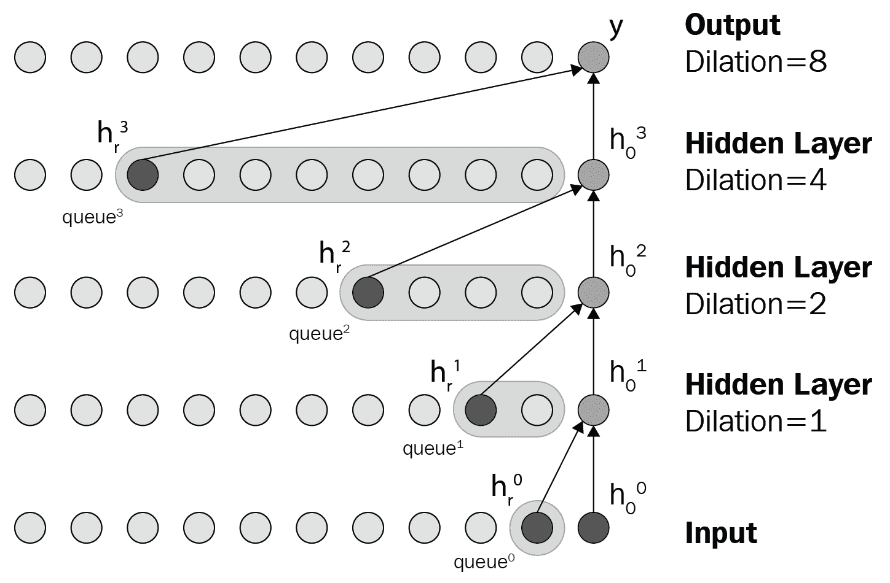

如前图所示，带有箭头标记的地方，递归状态的数量与层中的扩张值相同。

# 算法的组件

构建语音检测器的算法包含两个组件：

+   **生成模型**

+   **卷积队列**

这两个组件在下图中展示：

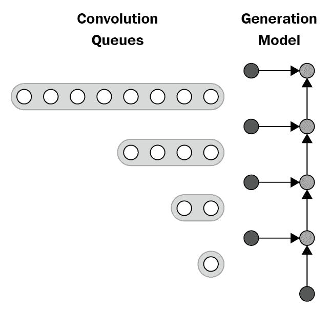

生成模型可以视为 RNN 的一个步骤。它以当前观测值和若干递归状态作为输入，然后计算输出预测和新的递归状态。

卷积队列存储了由下面的层计算得到的新递归状态。

让我们开始构建模型。

# 构建模型

我们将使用 DeepMind 的 WaveNet 实现句子级别的英语语音识别。但是，在构建模型之前，我们需要考虑一些数据点：

+   首先，虽然 WaveNet 论文（在本章开头提供）使用了 TIMIT 数据集进行语音识别实验，但我们将使用免费的 VCTK 数据集代替。

+   其次，论文在扩张卷积层后添加了一个均值池化层进行降采样。我们已经从`.wav`文件中提取了**梅尔频率倒谱系数**（**MFCC**），并删除了最后的均值池化层，因为原始设置在我们的 TitanX **图形处理单元**（**GPU**）上无法运行。

+   第三，由于 TIMIT 数据集具有音素标签，论文使用了两个损失项来训练模型：**音素分类**和**下一个音素预测**。相反，我们将使用单一的**连接时序分类**（**CTC**）损失，因为 VCTK 提供了句子级标签。因此，我们只使用扩张的 Conv1D 层，而没有任何扩张的 Conv1D 层。

+   最后，由于时间限制，我们不会进行定量分析，如**双语评估下游评分**（**BLEU**）得分以及通过结合语言模型的后处理。

# 依赖项

下面是所有需要首先安装的依赖库列表：

+   `tensorflow`

+   `sugartensor`

+   `pandas`

+   `librosa`

+   `scikits.audiolab`

如果你遇到`librosa`库的问题，可以尝试使用`pip`安装`ffmpeg`。

# 数据集

我们使用了 VCTK、LibriSpeech 和 TED-LIUM 发布 2 的数据集。训练集中的句子总数由这三个数据集组成，总计 240,612 个句子。验证集和测试集仅使用 LibriSpeech 和 TED-LIUM 语料库构建，因为 VCTK 语料库没有验证集和测试集。下载每个语料库后，将它们提取到`asset/data/VCTK-Corpus`、`asset/data/LibriSpeech`和`asset/data/TEDLIUM_release2`目录中。

你可以在这里找到这些数据集的链接：*CSTR VCTK 语料库:* [`homepages.inf.ed.ac.uk/jyamagis/page3/page58/page58.html`](http://homepages.inf.ed.ac.uk/jyamagis/page3/page58/page58.html) *LibriSpeech ASR 语料库:* [`www.openslr.org/12`](http://www.openslr.org/12/) *TED-LIUM:* [`www-lium.univ-lemans.fr/en/content/ted-lium-corpus`](https://lium.univ-lemans.fr/en/ted-lium2/)

# 数据集预处理

TED-LIUM 发布 2 数据集提供的是 SPH 格式的音频数据，因此我们应该将其转换为`librosa`库能够处理的格式。为此，请在`asset/data`目录下运行以下命令，将 SPH 格式转换为 WAV 格式：

```py
find -type f -name '*.sph' | awk '{printf "sox -t sph %s -b 16 -t wav %s\n", $0, $0".wav" }' | bash
```

如果你没有安装`sox`，请先安装它。

我们发现训练中的主要瓶颈是磁盘读取时间，因为音频文件的大小。在处理之前，最好将音频文件缩小，以便更快地执行。因此，我们决定将所有音频数据预处理为 MFCC 特征文件，这些文件要小得多。此外，我们强烈建议使用**固态硬盘**（**SSD**），而不是传统硬盘。

在控制台中运行以下命令以预处理整个数据集：

```py
python preprocess.py
```

使用处理过的音频文件，我们现在可以开始训练网络。

# 训练网络

我们将通过执行以下命令开始训练网络：

```py
python train.py ( <== Use all available GPUs )
```

如果你正在使用启用了 CUDA 的机器，请使用以下命令：

```py
CUDA_VISIBLE_DEVICES=0,1 python train.py ( <== Use only GPU 0, 1 )
```

你可以在`asset/train`目录中看到生成的`.ckpt`文件和日志文件。启动`tensorboard--logdir asset/train/log`来监控训练过程。

我们已经在 3 台 Nvidia 1080 Pascal GPU 上训练了这个模型 40 小时，直到达到 50 个纪元，然后选择了验证损失最小的纪元。在我们的例子中，这是第 40 个纪元。如果你看到内存溢出的错误，请在`train.py`文件中将`batch_size`从 16 减少到 4。

每个纪元的 CTC 损失如下：

| **纪元** | **训练集** | **验证集** | **测试集** |
| --- | --- | --- | --- |
| 20 | 79.541500 | 73.645237 | 83.607269 |
| 30 | 72.884180 | 69.738348 | 80.145867 |
| 40 | 69.948266 | 66.834316 | 77.316114 |
| 50 | 69.127240 | 67.639895 | 77.866674 |

在这里，你可以看到训练数据集和测试数据集的值之间的差异。这个差异主要是由于训练数据集的体积更大。

# 测试网络

在训练网络之后，你可以使用以下命令检查验证集或测试集的 CTC 损失：

```py
python test.py --set train|valid|test --frac 1.0(0.01~1.0)
```

如果你只想测试数据集的一部分以进行快速评估，`frac`选项将非常有用。

# 将一个语音 WAV 文件转换成英文文本

接下来，你可以通过执行以下命令将语音 WAV 文件转换为英文文本：

```py
python recognize.py --file 
```

这将把语音 WAV 文件转换为英文句子。

结果将会打印在控制台上；尝试以下命令作为示例：

```py

python recognize.py --file asset/data/LibriSpeech/test-clean/1089/134686/1089-134686-0000.flac
python recognize.py --file asset/data/LibriSpeech/test-clean/1089/134686/1089-134686-0001.flac
python recognize.py --file asset/data/LibriSpeech/test-clean/1089/134686/1089-134686-0002.flac
python recognize.py --file asset/data/LibriSpeech/test-clean/1089/134686/1089-134686-0003.flac
python recognize.py --file asset/data/LibriSpeech/test-clean/1089/134686/1089-134686-0004.flac
```

结果如下：

*他希望晚餐有炖菜，胡萝卜和萝卜，还有破损的土豆和肥羊肉块，放入浓厚的胡椒面调料中，一勺勺地倒进你肚子里。他劝告自己，在早早的夜幕降临后，黄色的灯光会在这里和那里亮起，肮脏的妓院区，嘿，伯蒂，脑袋里有好主意吗？10 号新鲜的内莉在等你，晚安，丈夫。*

真实情况如下：

*他希望晚餐有炖菜，胡萝卜和萝卜，还有破损的土豆和肥羊肉块，放入浓厚的胡椒面调料中，一勺勺地倒进你肚子里。他劝告自己，在早早的夜幕降临后，黄色的灯光会在这里和那里亮起，肮脏的妓院区，嘿，伯蒂，脑袋里有好主意吗？10 号新鲜的内莉在等你，晚安，丈夫。*

正如我们之前提到的，由于没有语言模型，因此在某些情况下会出现大写字母和标点符号误用，或者单词拼写错误。

# 获取模型

与图像问题不同，找到一个提供检查点的语音转文本预训练深度学习模型并不容易。幸运的是，我找到了以下的 WaveNet 语音转文本实现。为了将模型导出以进行压缩，我运行了 Docker 镜像，加载了检查点，并将其写入了协议缓冲文件。运行此操作时，请使用以下命令：

```py
python export_wave_pb.py
```

我们将为推理构建图，加载检查点，并将其写入协议缓冲文件，如下所示：

```py
batch_size = 1 # batch size
voca_size = data.voca_size
x = tf.placeholder(dtype=tf.sg_floatx, shape=(batch_size, None, 20))
# sequence length except zero-padding
seq_len = tf.not_equal(x.sg_sum(axis=2), 0.).sg_int().sg_sum(axis=1)
# encode audio feature
logit = get_logit(x, voca_size)
# ctc decoding
decoded, _ = tf.nn.ctc_beam_search_decoder(logit.sg_transpose(perm=[1, 0, 2]), seq_len, merge_repeated=False)
# to dense tensor
y = tf.add(tf.sparse_to_dense(decoded[0].indices, decoded[0].dense_shape, decoded[0].values), 1, name="output")

with tf.Session() as sess:
 tf.sg_init(sess)
 saver = tf.train.Saver()
 saver.restore(sess, tf.train.latest_checkpoint('asset/train'))

graph = tf.get_default_graph()
input_graph_def = graph.as_graph_def()

with tf.Session() as sess:
 tf.sg_init(sess)
 saver = tf.train.Saver()
 saver.restore(sess, tf.train.latest_checkpoint('asset/train'))
 # Output model's graph details for reference.
 tf.train.write_graph(sess.graph_def, '/root/speech-to-text-wavenet/asset/train', 'graph.txt', as_text=True)
 # Freeze the output graph.
 output_graph_def = graph_util.convert_variables_to_constants(sess,input_graph_def,"output".split(","))
 # Write it into .pb file.
 with tfw.gfile.GFile("/root/speech-to-text-wavenet/asset/train/wavenet_model.pb", "wb") as f:
 f.write(output_graph_def.SerializeToString())
```

接下来，我们需要构建一个 TensorFlow 模型并对其进行量化，以便在移动应用中使用。

# 使用 Bazel 构建 TensorFlow 并量化模型

要使用 TensorFlow 对模型进行量化，你需要安装 Bazel 并克隆 TensorFlow 仓库。我建议创建一个新的虚拟环境，在其中安装和构建 TensorFlow。完成后，你可以运行以下命令：

```py
bazel build tensorflow/tools/graph_transforms:transform_graph
 bazel-bin/tensorflow/tools/graph_transforms/transform_graph \
 --in_graph=/your/.pb/file \
 --outputs="output_node_name" \
 --out_graph=/the/quantized/.pb/file \
 --transforms='quantize_weights'
```

你可以查看 TensorFlow 网站上的官方量化教程，了解变换中的其他选项。量化后，模型大小减小了 75%，从 15.5 MB 降到 4 MB，原因是进行了 8 位转换。由于时间限制，我还没有通过测试集计算字母错误率，以量化量化前后准确率的下降。

关于神经网络量化的详细讨论，Pete Warden 写了一篇很好的文章，名为 *使用 TensorFlow 进行神经网络量化* ([`petewarden.com/2016/05/03/how-to-quantize-neural-networks-with-tensorflow/`](https://petewarden.com/2016/05/03/how-to-quantize-neural-networks-with-tensorflow/))。

请注意，你也可以按照本节中的说明进行完整的 8 位计算图转换。

经过此转换后，模型的大小减少到 5.9 MB，推理时间加倍。这可能是由于 8 位计算没有针对 macOS 平台上的 Intel i5 处理器进行优化，而该平台用于编写应用程序。

现在我们已经有了一个压缩的预训练模型，让我们看看在 Android 上部署该模型还需要做些什么。

# TensorFlow 操作注册

在这里，我们将使用 Bazel 构建 TensorFlow 模型，创建一个 `.so` 文件，该文件可以通过 **Java 原生接口**（**JNI**）调用，并包括我们在预训练 WaveNet 模型推理中需要的所有操作库。我们将在 Android 应用程序中使用构建好的模型。

如需了解更多关于 Bazel 的信息，可以参考以下链接：[`docs.bazel.build/versions/master/bazel-overview.html`](https://docs.bazel.build/versions/master/bazel-overview.html)。

首先，通过取消注释并更新**软件** **开发** **工具包**（**SDK**）和**原生开发工具包**（**NDK**）的路径，编辑克隆的 TensorFlow 仓库中的 WORKSPACE 文件。

接下来，我们需要找出在预训练模型中使用了哪些操作，并生成一个包含这些信息的 `.so` 文件。

首先，运行以下命令：

```py
bazel build tensorflow/python/tools:print_selective_registration_header && \
 bazel-bin/tensorflow/python/tools/print_selective_registration_header \
 --graphs=path/to/graph.pb > ops_to_register.h
```

所有`.pb`文件中的操作将列在`ops_to_register.h`中。

接下来，移动`op_to_register.h`到`/tensorflow/tensorflow/core/framework/`，并运行以下命令：

```py
bazel build -c opt --copt="-DSELECTIVE_REGISTRATION" \
 --copt="-DSUPPORT_SELECTIVE_REGISTRATION" \
 //tensorflow/contrib/android:libtensorflow_inference.so \
 --host_crosstool_top=@bazel_tools//tools/cpp:toolchain \
 --crosstool_top=//external:android/crosstool --cpu=armeabi-v7a
```

不幸的是，虽然我没有收到任何错误消息，但是`.so`文件仍然没有包含在头文件中列出的所有操作：

```py
Modify BUILD in /tensorflow/tensorflow/core/kernels/
```

如果您尚未尝试第一个选项并且已经获取了模型中操作的列表，则可以通过使用`tf.train.write_graph`命令并在终端中键入以下内容来获取操作：

```py
grep "op: " PATH/TO/mygraph.txt | sort | uniq | sed -E 's/^.+"(.+)".?$/\1/g'
```

接下来，在 Android 库部分的`android_extended_ops_group1`或`android_extended_ops_group2`中添加缺失的操作，并使`.so`文件更小化，删除任何不必要的操作。现在，运行以下命令：

```py
bazel build -c opt //tensorflow/contrib/android:libtensorflow_inference.so \
 --crosstool_top=//external:android/crosstool \
 --host_crosstool_top=@bazel_tools//tools/cpp:toolchain \
 --cpu=armeabi-v7a
```

您将在以下位置找到`libtensorflow_inference.so`文件：

```py
bazel-bin/tensorflow/contrib/android/libtensorflow_inference.so
```

请注意，在 Android 上运行此命令时，我们遇到了与`sparse_to_dense`操作相关的错误。如果您希望重复此工作，请在第 153 行将`REGISTER_KERNELS_ALL(int64);`添加到`sparse_to_dense_op.cc`中，并重新编译。

除了`.so`文件外，我们还需要一个 JAR 文件。您可以简单地将其添加到`build.gradle`文件中，如下所示：

```py
allprojects {
 repositories {
     jcenter()
     }
 }

dependencies {
 compile 'org.tensorflow:tensorflow-android:+'
 }

```

或者，您可以运行以下命令：

```py
bazel build //tensorflow/contrib/android:android_tensorflow_inference_java
```

您会在以下代码块中找到该文件：

```py
bazel-bin/tensorflow/contrib/android/libandroid_tensorflow_inference_java.jar

```

现在，将这两个文件移动到您的 Android 项目中。

# 构建一个 Android 应用程序

在本节中，我们将构建一个 Android 应用程序，将用户的语音输入转换为文本。基本上，我们将构建一个语音到文本的转换器。我们已经修改了 TensorFlow 语音示例，放置在 TensorFlow Android 演示库中以供本练习使用。

您可以在[`github.com/tensorflow/tensorflow/tree/master/tensorflow/examples/android`](https://github.com/tensorflow/tensorflow/tree/master/tensorflow/examples/android)找到 TensorFlow Android 演示应用程序。

在演示的`build.gradle`文件实际上帮助您构建`.so`和 JAR 文件。因此，如果您想要使用自己的模型开始演示示例，您只需获取您的操作列表，修改 BUILD 文件，并让`build.gradle`文件处理其余部分。我们将在以下部分详细介绍设置 Android 应用程序的细节。

# 要求

构建 Android 应用程序所需的要求如下：

+   TensorFlow 1.13

+   Python 3.7

+   NumPy 1.15

+   python-speech-features

TensorFlow 链接：[`github.com/tensorflow/tensorflow/releases`](https://github.com/tensorflow/tensorflow/releases)

Python 链接：[`pip.pypa.io/en/stable/installing/`](https://pip.pypa.io/en/stable/installing/)

NumPy 链接：[`docs.scipy.org/doc/numpy-1.13.0/user/install.html`](https://docs.scipy.org/doc/numpy-1.13.0/user/install.html) Python-speech-features 链接：[`github.com/jameslyons/python_speech_features`](https://github.com/jameslyons/python_speech_features)

现在，让我们从头开始构建 Android 应用程序。在此应用程序中，我们将录制音频然后将其转换为文本。

根据您的操作系统设置 Android Studio，方法是访问以下链接：[`developer.android.com/studio/install`](https://developer.android.com/studio/install)。本项目中使用的代码库已从此处提供的 TensorFlow 示例进行修改：[`github.com/tensorflow/tensorflow/tree/master/tensorflow/examples/android.`](https://github.com/tensorflow/tensorflow/tree/master/tensorflow/examples/android)

我们将使用 TensorFlow 示例应用程序并根据我们的需求进行编辑。

添加应用程序名称和公司域名，如下图所示：

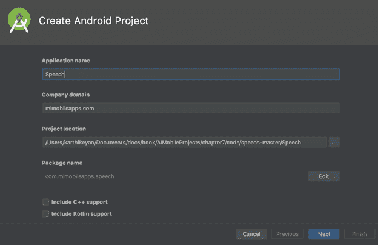

下一步，选择目标 Android 设备的版本。我们将选择最低版本为 API 15：

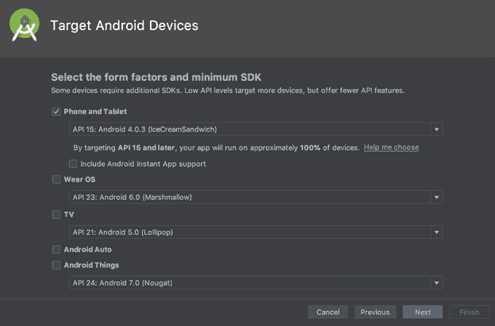

接下来，我们将添加 Empty Activity 或 No Activity：

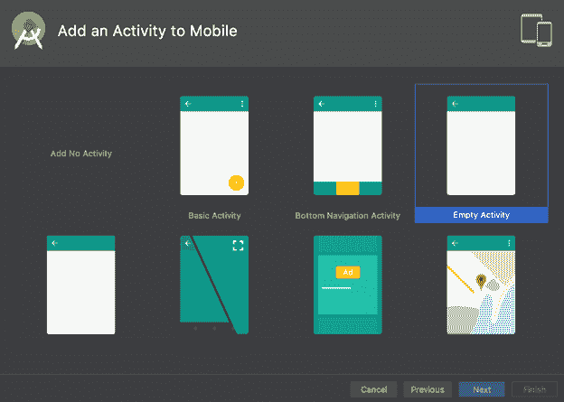

现在，让我们开始添加活动并使用生成的 TensorFlow 模型来获取结果。我们需要启用两个权限，以便在应用程序中使用它们，如下代码块所示：

```py
<manifest xmlns:android="http://schemas.android.com/apk/res/android"
    package="com.mlmobileapps.speech">

    <uses-permission android:name="android.permission.WRITE_EXTERNAL_STORAGE"/>
    <uses-permission android:name="android.permission.RECORD_AUDIO" />

    <uses-sdk
        android:minSdkVersion="25"
        android:targetSdkVersion="25" />

    <application android:allowBackup="true"
        android:debuggable="true"
        android:label="@string/app_name"
        android:icon="@drawable/ic_launcher"
        android:theme="@style/MaterialTheme">

        <activity android:name="org.tensorflow.demo.SpeechActivity"
            android:screenOrientation="portrait"
            android:label="@string/activity_name_speech">
            <intent-filter>
               <action android:name="android.intent.action.MAIN" />
               <category android:name="android.intent.category.LAUNCHER" />
            </intent-filter>
        </activity>
    </application>
</manifest>
```

我们将为应用程序提供一个最小的 UI，包含几个`TextView`组件和一个`Button`：

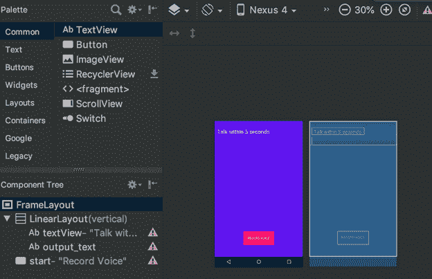

以下 XML 布局模仿了上面截图中的 UI：

```py
<FrameLayout
    xmlns:android="http://schemas.android.com/apk/res/android"
    xmlns:app="http://schemas.android.com/apk/res-auto"
    xmlns:tools="http://schemas.android.com/tools"
    android:layout_width="match_parent"
    android:layout_height="match_parent"
    android:background="#6200EE"
    tools:context="org.tensorflow.demo.SpeechActivity">

    <LinearLayout
        android:layout_width="match_parent"
        android:orientation="vertical"
        android:layout_height="wrap_content">
        <TextView
            android:id="@+id/textView"
            android:layout_width="wrap_content"
            android:layout_height="wrap_content"

            android:layout_gravity="top"
            android:textColor="#fff"
            android:layout_marginLeft="10dp"
            android:layout_marginTop="30dp"
            android:text="Talk within 5 seconds"
            android:textAlignment="center"
            android:textSize="24dp" />

        <TextView
            android:id="@+id/output_text"
            android:layout_width="wrap_content"
            android:layout_height="wrap_content"
            android:textColor="#fff"
            android:layout_gravity="top"
            android:layout_marginLeft="10dp"
            android:layout_marginTop="10dp"
            android:textAlignment="center"
            android:textSize="24dp" />
    </LinearLayout>

    <Button
        android:id="@+id/start"
        android:background="#ff0266"
        android:textColor="#fff"
        android:layout_width="wrap_content"
        android:padding="20dp"
        android:layout_height="wrap_content"
        android:layout_gravity="bottom|center_horizontal"
        android:layout_marginBottom="50dp"
        android:text="Record Voice" />

</FrameLayout>

```

让我们添加语音识别活动的步骤，如下：

```py
@Override
protected void onCreate(Bundle savedInstanceState) {
  // Set up the UI.
  super.onCreate(savedInstanceState);
  setContentView(R.layout.activity_speech);
  startButton = (Button) findViewById(R.id.start);
  startButton.setOnClickListener(
      new View.OnClickListener() {
        @Override
        public void onClick(View view) {
            startRecording();
        }
      });
  outputText = (TextView) findViewById(R.id.output_text);
  // Load the Pretrained WaveNet model.
  inferenceInterface = new TensorFlowInferenceInterface(getAssets(), MODEL_FILENAME);
  requestMicrophonePermission();
}
```

请注意，我们这里不会讨论 Android 的基础知识。

接下来，我们将启动录音机，具体步骤如下：

```py
public synchronized void startRecording() {
  if (recordingThread != null) {
    return;
  }
  shouldContinue = true;
  recordingThread =
      new Thread(
          new Runnable() {
            @Override
            public void run() {
              record();
            }
          });
  recordingThread.start();
}
```

以下代码展示了`record()`方法的实现：

```py
private void record() {
  android.os.Process.setThreadPriority(android.os.Process.THREAD_PRIORITY_AUDIO);

  // Estimate the buffer size we'll need for this device.
  int bufferSize =
      AudioRecord.getMinBufferSize(
              SAMPLE_RATE, AudioFormat.CHANNEL_IN_MONO, AudioFormat.ENCODING_PCM_16BIT);
  if (bufferSize == AudioRecord.ERROR || bufferSize == AudioRecord.ERROR_BAD_VALUE) {
    bufferSize = SAMPLE_RATE * 2;
  }
  short[] audioBuffer = new short[bufferSize / 2];

  AudioRecord record =
      new AudioRecord(
          MediaRecorder.AudioSource.DEFAULT,
          SAMPLE_RATE,
          AudioFormat.CHANNEL_IN_MONO,
          AudioFormat.ENCODING_PCM_16BIT,
          bufferSize);

  if (record.getState() != AudioRecord.STATE_INITIALIZED) {
    Log.e(LOG_TAG, "Audio Record can't initialize!");
    return;
  }

  record.startRecording();

  Log.v(LOG_TAG, "Start recording");

  while (shouldContinue) {
    int numberRead = record.read(audioBuffer, 0, audioBuffer.length);
      Log.v(LOG_TAG, "read: " + numberRead);
    int maxLength = recordingBuffer.length;
    recordingBufferLock.lock();
    try {
        if (recordingOffset + numberRead < maxLength) {
            System.arraycopy(audioBuffer, 0, recordingBuffer, recordingOffset, numberRead);
        } else {
            shouldContinue = false;
        }
      recordingOffset += numberRead;
    } finally {
      recordingBufferLock.unlock();
    }
  }
  record.stop();
  record.release();
  startRecognition();
}
```

以下代码展示了音频识别方法的实现：

```py
public synchronized void startRecognition() {
  if (recognitionThread != null) {
    return;
  }
  shouldContinueRecognition = true;
  recognitionThread =
      new Thread(
          new Runnable() {
            @Override
            public void run() {
              recognize();
            }
          });
  recognitionThread.start();
}

private void recognize() {
  Log.v(LOG_TAG, "Start recognition");

  short[] inputBuffer = new short[RECORDING_LENGTH];
  double[] doubleInputBuffer = new double[RECORDING_LENGTH];
  long[] outputScores = new long[157];
  String[] outputScoresNames = new String[]{OUTPUT_SCORES_NAME};

    recordingBufferLock.lock();
    try {
      int maxLength = recordingBuffer.length;
        System.arraycopy(recordingBuffer, 0, inputBuffer, 0, maxLength);
    } finally {
      recordingBufferLock.unlock();
    }

    // We need to feed in float values between -1.0 and 1.0, so divide the
    // signed 16-bit inputs.
    for (int i = 0; i < RECORDING_LENGTH; ++i) {
      doubleInputBuffer[i] = inputBuffer[i] / 32767.0;
    }

    //MFCC java library.
    MFCC mfccConvert = new MFCC();
    float[] mfccInput = mfccConvert.process(doubleInputBuffer);
    Log.v(LOG_TAG, "MFCC Input======> " + Arrays.toString(mfccInput));

    // Run the model.
    inferenceInterface.feed(INPUT_DATA_NAME, mfccInput, 1, 157, 20);
    inferenceInterface.run(outputScoresNames);
    inferenceInterface.fetch(OUTPUT_SCORES_NAME, outputScores);
    Log.v(LOG_TAG, "OUTPUT======> " + Arrays.toString(outputScores));

    //Output the result.
    String result = "";
    for (int i = 0;i<outputScores.length;i++) {
        if (outputScores[i] == 0)
            break;
        result += map[(int) outputScores[i]];
    }
    final String r = result;
    this.runOnUiThread(new Runnable() {
        @Override
        public void run() {
            outputText.setText(r);
        }
    });
    Log.v(LOG_TAG, "End recognition: " +result);
  }
```

模型通过`TensorFlowInferenceInterface`类运行，如上面的代码所示。

一旦我们完成代码并成功运行，启动应用程序。

在第一次运行时，您需要允许应用程序使用手机的内部麦克风，如下图所示：

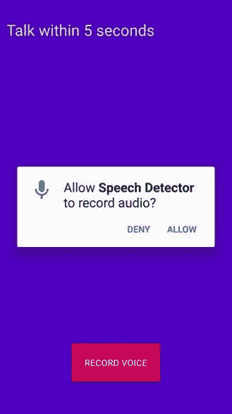

一旦我们授权使用麦克风，点击“录音”按钮并在 5 秒内输入语音。在以下截图中显示了使用印度口音输入`how are you`关键字的两次尝试。对于美国和英国口音效果更好。

第一次尝试如下：


第二次尝试如下：


您应该尝试使用您自己的口音来获取正确的输出。这是开始构建您自己语音检测器的一个非常简单的方法，您可以进一步改进。

# 总结

在本章中，你学习了如何独立构建一个完整的语音检测器。我们详细讨论了 WaveNet 模型的工作原理。有了这个应用，我们可以使一个简单的语音转文本转换器运行；然而，要获得完美的结果，还需要做很多改进和更新。你也可以通过将模型转换为 CoreML，在 iOS 平台上构建相同的应用。

在下一章中，我们将继续构建一个手写数字分类器，使用**修改版国家标准与技术研究所**（**MNIST**）模型。
