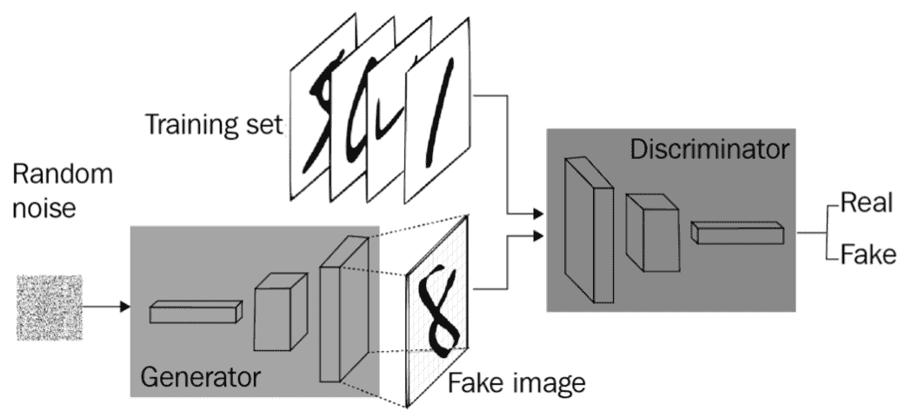
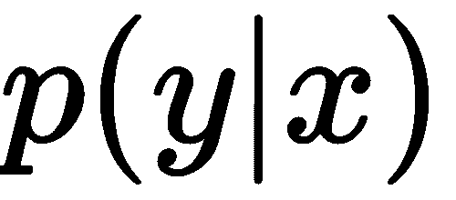
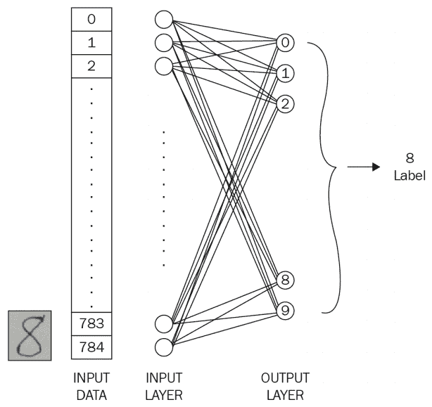
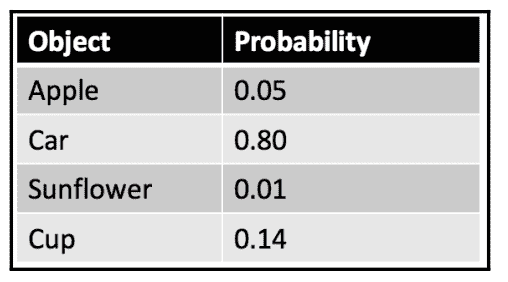
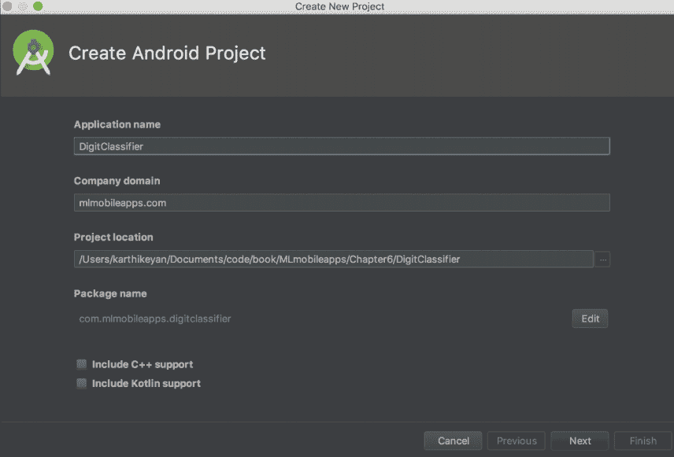
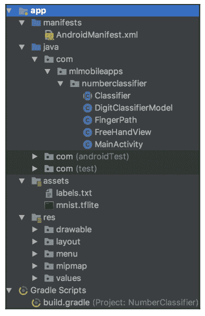
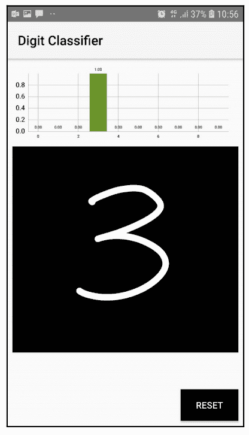
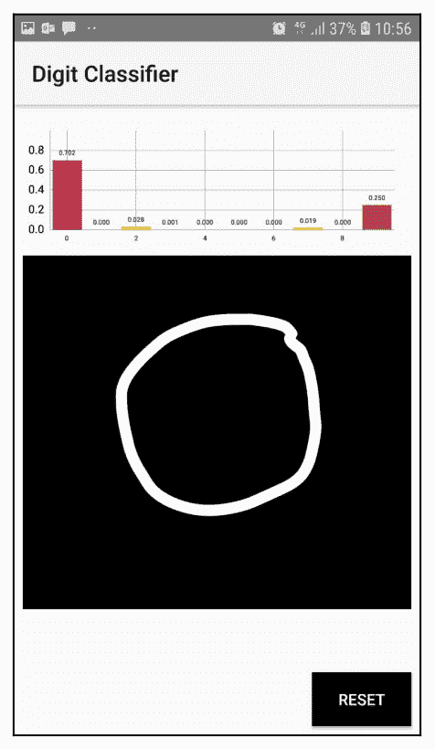
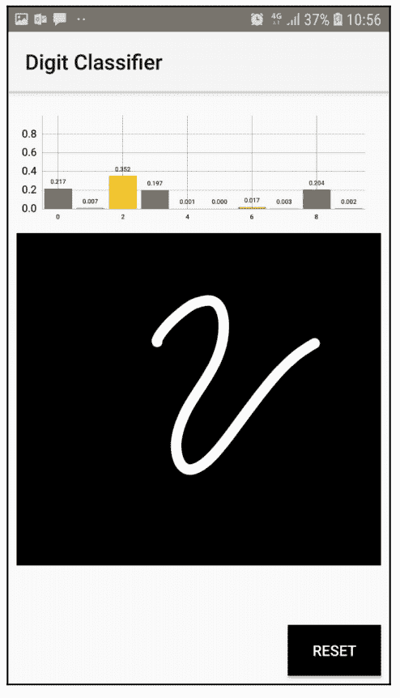
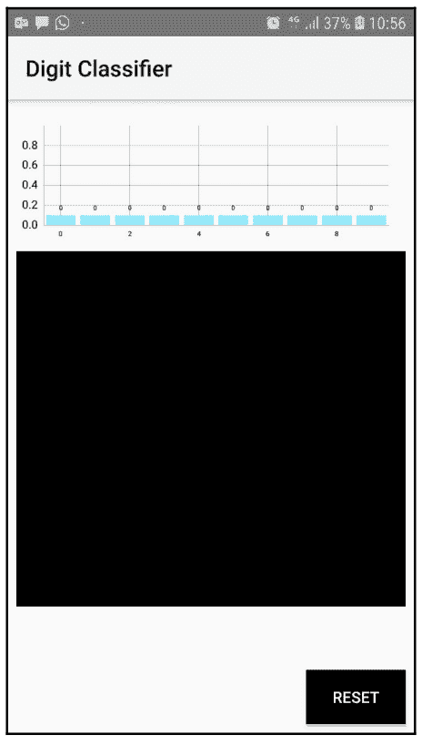

# 第八章：使用 GAN 识别手写数字

在本章中，我们将构建一个安卓应用程序，该程序通过使用对抗学习来检测手写数字并识别数字是什么。我们将使用**修改后的国家标准与技术研究院** (**MNIST**) 数据集进行数字分类。我们还将了解**生成对抗网络** (**GANs**)的基本知识。

在本章中，我们将更详细地探讨以下主题：

+   GAN 简介

+   理解 MNIST 数据库

+   构建 TensorFlow 模型

+   构建安卓应用程序

本应用程序的代码可以在[`github.com/intrepidkarthi/AImobileapps`](https://github.com/intrepidkarthi/AImobileapps)找到。

# GAN 简介

GAN 是一类**机器学习** (**ML**) 算法，用于无监督学习。它们由两个深度神经网络组成，这两个网络相互竞争（因此被称为对抗式）。GAN 是由 Ian Goodfellow 和其他研究人员（包括 Yoshua Bengio）于 2014 年在蒙特利尔大学提出的。

Ian Goodfellow 关于 GAN 的论文可以在[`arxiv.org/abs/1406.2661`](https://arxiv.org/abs/1406.2661)找到。

GAN 具有模拟任何数据的潜力。这意味着 GAN 可以被训练生成任何数据的相似版本，例如图像、音频或文本。下图展示了 GAN 的简单工作流程：



GAN 的工作流程将在接下来的章节中解释。

# 生成算法与判别算法

为了理解 GAN，我们必须知道判别算法和生成算法是如何工作的。判别算法试图预测一个标签并对输入数据进行分类，或者将它们归类到数据所属的类别中。另一方面，生成算法则尝试预测特征，以给出某个特定标签。

例如，一个判别算法可以预测一封邮件是否是垃圾邮件。这里，垃圾邮件是标签之一，邮件中提取的文本被认为是输入数据。如果将标签看作`y`，将输入看作`x`，我们可以将其表示如下：



另一方面，生成算法则尝试预测这些输入特征（在前面的公式中是`x`）的可能性。生成模型关注的是如何获得`x`，而判别模型关注的是`x`与`y`之间的关系。

以 MNIST 数据库为例，生成器将生成图像并传递给判别器。如果图像确实来自 MNIST 数据集，判别器将验证该图像。生成器生成图像的目的是希望它能够通过判别器的验证，即使它是假的（如上图所示）。

# GAN 如何工作

根据我们的示例，我们将假设输入的是数字：

1.  生成器接受随机数作为输入，并返回图像作为输出

1.  输出图像传递给判别器，同时，判别器也从数据集中接收输入

1.  判别器接受真实和假输入图像，并返回一个 0 到 1 之间的概率（其中 1 表示真实性的预测，0 表示假图像的预测）

使用本章中讨论的示例应用程序，我们可以使用相同的步骤，将用户手绘的图像作为假图像之一，并尝试找出其正确性的概率值。

# 理解 MNIST 数据库

MNIST 数据集包含 60,000 个手写数字。它还包含一个由 10,000 个数字组成的测试数据集。虽然它是 NIST 数据集的一个子集，但该数据集中的所有数字都进行了大小归一化，并且已被居中在一个 28 x 28 像素的图像中。在这里，每个像素包含一个 0-255 的值，对应于其灰度值。

MNIST 数据集可以在[`yann.lecun.com/exdb/mnist/`](http://yann.lecun.com/exdb/mnist/)找到。NIST 数据集可以在[`www.nist.gov/srd/nist-special-database-19`](https://www.nist.gov/srd/nist-special-database-19)找到。

# 构建 TensorFlow 模型

在这个应用程序中，我们将构建一个基于 MNIST 数据集的 TensorFlow 模型，并将在我们的 Android 应用程序中使用它。一旦我们有了 TensorFlow 模型，我们将把它转换成 TensorFlow Lite 模型。下载模型并构建 TensorFlow 模型的步骤如下：

这是我们的模型如何工作的架构图。实现这一点的方式如下所示：



使用 TensorFlow，我们可以通过一行 Python 代码下载 MNIST 数据，如下所示：

```py
import tensorflow as tf 
from tensorflow.examples.tutorials.mnist import input_data 
#Reading data 
mnist = input_data.read_data_sets("./data/", one_hot-True) 
```

现在，我们已经下载了 MNIST 数据集。之后，我们将按照之前的代码读取数据。

现在，我们可以运行脚本来下载数据集。我们将从控制台运行该脚本，如下所示：

```py
> python mnist.py 
Successfully downloaded train-images-idx3-ubyte.gz 9912422 bytes. 
Extracting MNIST_data/train-images-idx3-ubyte.gz Successfully downloaded train-labels-idxl-ubyte.gz 28881 bytes. 
Extracting MNIST_data/train -labels -idxl -ubyte.gz 
Successfully downloaded tlOk -images -idx3 -ubyte.gz 1648877 bytes. Extracting MNIST_data/t1Ok -images -idx3 -ubyte.gz 
Successfully downloaded tlOk -labels -idxl -ubyte.gz 4542 bytes. Extracting MNIST_data/t1Ok -labels -idxl -ubyte.gz 
```

一旦我们准备好数据集，我们将添加一些将在应用程序中使用的变量，如下所示：

```py
image_size = 28 
labels_size = 10 
learning_rate = 0.05 
steps_number = 1000 
batch size = 100 
```

我们需要定义这些变量，以控制构建模型时所需的参数，这是 TensorFlow 框架要求的。这个分类过程很简单。28 x 28 图像中存在的像素数量是 784。因此，我们有相应数量的输入层。设置好架构后，我们将训练网络并评估结果，以了解模型的有效性和准确性。

现在，让我们定义在前面的代码块中添加的变量。根据模型处于训练阶段还是测试阶段，不同的数据将传递到分类器中。训练过程需要标签，以便能够将其与当前预测进行匹配。这个变量如下所定义：

```py
 #Define placeholders 
 training_data = tf.placeholder(tf.float32, [None, image_size*image_size]) 
 labels = tf.placeholder(tf.float32, [None, labels_size]) 
```

随着计算图的评估进行，占位符将被填充。在训练过程中，我们调整偏置和权重的值，以提高结果的准确性。为了实现这一目标，我们将定义权重和偏置参数，如下所示：

```py
#Variables to be tuned 
W = tf.Variable(tf.truncated_normal([image_size*image_size, labels_size], stddev=0.1)) 
b = tf.Variable(tf.constant(0.1, shape-[labels_size]))
```

一旦我们有了可以调节的变量，我们就可以一步完成输出层的构建：

```py
#Build the network 
output = tf.matmul(training_data, W) + b
```

我们已经成功地使用训练数据构建了网络的输出层。

# 训练神经网络

通过优化损失，我们可以使训练过程有效。我们需要减少实际标签值与网络预测值之间的差异。定义这种损失的术语是**交叉熵**。

在 TensorFlow 中，交叉熵通过以下方法提供：

```py
tf.nn.softmax_cross_entropy_with_logits
```

该方法将 softmax 应用于模型的预测。Softmax 类似于逻辑回归，输出一个介于 0 和 1.0 之间的小数。例如，电子邮件分类器的逻辑回归输出 0.9 表示邮件为垃圾邮件的概率为 90%，不为垃圾邮件的概率为 10%。所有概率的总和为 1.0，如下表所示：



Softmax 通过神经网络层实现，就在输出层之前。Softmax 层必须与输出层具有相同数量的节点。

损失使用`tf.reduce_mean`方法定义，并且在训练步骤中使用`GradientDescentOptimizer()`方法来最小化损失。如下所示的代码演示了这一过程：

```py
#Defining the loss 
loss =  tf.reduce_mean(tf.nn.softmax_cross_entropy_with_logits(labels-labels, logits-output)) 
# Training step with gradient descent 
train_step = tf.train.GradientDescentOptimizer(learning_rate).minimize(loss) 
```

`GradientDescentOptimizer`方法会通过调整输出中的`w`和`b`（权重和偏置参数）的值，经过多步迭代，直到我们减小损失并更接近准确的预测，具体如下：

```py
# Accuracy calculation 
correct_prediction = tf.equal(tf.argmax(output, 1), tf.argmax(labels, 1)) 
accuracy = tf.reduce_mean(tf.cast(correct_prediction, tf.float32))
```

我们通过初始化会话和变量来开始训练，如下所示：

```py
# Run the training 
sess = tf.InteractiveSession() sess.run(tf.global_variables_initializer())
```

基于之前定义的步数（`steps_number`）参数，算法将循环运行。然后我们将运行优化器，如下所示：

```py
for i in range(steps_number): 
    # Get the next batch input_batch, 
    labels_batch = mnist.train.next_batch(batch_size) 
    feed_dict = {training_data: input_batch, labels: labels_batch}
    # Run the training step 
    train_step.run(feed_dict=feed_dict) 
```

使用 TensorFlow，我们可以衡量算法的准确性并打印准确率值。只要准确度提高并找到停止的阈值，我们可以继续优化，如下所示：

```py
# Print the accuracy progress on the batch every 100 steps 
if i%100 == 0: 
    train_accuracy = accuracy.eval(feed_dict=feed_dict) 
    print("Step %d, batch accuracy %g %%"%(i, train_accuracy*100))
```

一旦训练完成，我们可以评估网络的性能。我们可以使用训练数据来衡量性能，如下所示：

```py
# Evaluate on the test set 
test_accuracy = accuracy.eval(feed_dict=ftraining_data: mnist.test.images, labels: mnist.test.labels}) 
print("Test accuracy: %g %%"%(test_accuracy*100))
```

当我们运行 Python 脚本时，控制台上的输出如下：

```py
Step 0, training batch accuracy 13 % 
Step 100, training batch accuracy 80 % 
Step 200, training batch accuracy 87 % 
Step 300, training batch accuracy 81 % 
Step 400, training batch accuracy 86 % 
Step 500, training batch accuracy 85 % 
Step 600, training batch accuracy 89 % 
Step 700, training batch accuracy 90 % 
Step 800, training batch accuracy 94 % 
Step 900, training batch accuracy: 89.49 % 
Test accuracy 91 %
```

现在，我们的准确率已经达到了 89.2%。当我们尝试进一步优化结果时，准确度反而下降；这就是我们设置阈值停止训练的原因。

让我们为 MNIST 数据集构建 TensorFlow 模型。在 TensorFlow 框架中，提供的脚本将 MNIST 数据集保存为 TensorFlow（`.pb`）模型。相同的脚本附在本应用程序的代码库中。

此应用程序的代码可以在 [`github.com/intrepidkarthi/AImobileapps`](https://github.com/intrepidkarthi/AImobileapps) 找到。

我们将从以下 Python 代码行开始训练模型：

```py
$:python mnist.py 
```

现在我们将运行脚本生成我们的模型。

以下脚本帮助我们通过添加一些额外参数来导出模型：

```py
python mnist.py --export_dir /./mnist_model 
```

可以在时间戳目录 `/./mnist_mode1/` 下找到保存的模型（例如，`/./mnist_model/1536628294/`）。

获得的 TensorFlow 模型将使用 `toco` 转换为 TensorFlow Lite 模型，如下所示：

```py
toco \ 
--input_format=TENSORFLOW_GRAPHDEF 
--output_format=TFLITE \ 
--output_file=./mnist.tflite \
--inference_type=FLOAT \ 
--input_type=FLOAT 
--input_arrays=x \ 
--output_arrays=output 
--input_shapes=1,28,28,1 \ 
--graph_def_file=./mnist.pb 
```

Toco 是一个命令行工具，用于运行 **TensorFlow Lite 优化转换器**（**TOCO**），将 TensorFlow 模型转换为 TensorFlow Lite 模型。上述 `toco` 命令会生成 `mnist.tflite` 作为输出，我们将在下一节中在我们的应用程序中使用它。

# 构建 Android 应用程序

让我们按照我们建立的模型逐步创建 Android 应用程序。我们将从在 Android Studio 中创建一个新项目开始：

1.  在 Android Studio 中创建一个新应用程序：



1.  将创建的 TensorFlow Lite 模型拖到 `assets` 文件夹中，以及 `labels.txt` 文件。我们将从 assets 文件夹中读取模型和标签：



前面的屏幕截图显示了项目中的文件结构。如果需要，我们也可以将模型文件存储在辅助存储器中。

FreeHandView 的一个优点是我们可以创建一个简单的视图，用户可以在其中绘制任意数量的数字。除此之外，屏幕上的条形图将显示检测到的数字的分类。

我们将使用逐步过程来创建分类器。

这是我们将用来绘制数字的 `FreeHandView` 构造方法。我们使用必要的参数初始化 `Paint` 对象，如下所示：

```py
public FreeHandView(Context context, AttributeSet attrs) { 
 super(context, attrs); 
 mPaint = new Paint(); 
 mPaint.setAntiAlias(true); 
 mPaint.setDither(true); 
 mPaint.setColor(DEFAULT_COLOR); 
 mPaint.setStyle(Paint.Style.STROKE); 
 mPaint.setStrokeJoin(Paint.Join.ROUND); 
 mPaint.setStrokeCap(Paint.Cap.ROUND); 
 mPaint.setXfermode(null); mPaint.setAlpha(Oxff); 
 mEmboss = new EmbossMaskFilter(new float[] I1, 1, 1}, 0.4f, 6, 3.5f); 
 mBlur = new BlurMaskFilter(5, BlurMaskFilter.Blur.NORMAL); 
}
```

上述代码块中每个参数的功能如下所述：

+   `mPaint.setAntiAlias(true)`: `setFlags()` 的辅助函数，用于设置或清除 `ANTI_ALIAS_FLAG` 位。抗锯齿会使所绘制内容的边缘更加平滑，但不影响形状的内部。

+   `mPaint.setDither(true)`: `setFlags()` 的辅助函数，用于设置或清除 `DITHER_FLAG` 位。抖动会影响高于设备精度的颜色如何被降低采样。

+   `mPaint.setColor(DEFAULT_COLOR)`: 设置画笔的颜色。

+   `mPaint.setStyle(Paint.Style.STROKE)`: 设置画笔的样式，用于控制如何解释基元的几何图形（除了 `drawBitmap`，它总是假定 `Fill`）。

+   `mPaint.setStrokeJoin(Paint.Join.ROUND)`: 设置画笔的 `Join`。

+   `mPaint.setStrokeCap(Paint.Cap.ROUND)`: 设置画笔的 `Cap`。

+   `mPaint.setXfermode(null)`: 设置或清除传输模式对象。

+   `mPaint.setAlpha(Oxff)`：一个辅助方法，用于 `setColor()`，它仅分配颜色的 `alpha` 值，保持其 `r`、`g` 和 `b` 值不变。

在视图生命周期的 `init()` 方法内部，我们将初始化 `ImageClassifier`，并传入 `BarChart` 对象：

```py
public void init(DisplayMetrics metrics, ImageClassifier classifier, BarChart barChart) { 
 int height = 1000; 
 int width = 1000; 
 mBitmap = Bitmap.createBitmap(width, height, Bitmap.Config.ARGB_8888); 
 mCanvas = new Canvas(mBitmap); 
 currentColor = DEFAULT_COLOR; strokeWidth = BRUSH_SIZE;
 mClassifier = classifier; 
 this.predictionBar = predictionBar; 
 this.barChart = barChart; addValuesToBarEntryLabels(); 
}
```

我们将使用以下库中的图表：[`github.com/PhilJay/MPAndroidChart`](https://github.com/PhilJay/MPAndroidChart)。

我们将初始化 `BarChart` 视图，`x` 轴包含从零到九的数字，`y` 轴包含从 0 到 1.0 的概率值：

```py
BarChart barChart = (BarChart) findViewByld(R.id.barChart); 
 barChart.animateY(3000); 
 barChart.getXAxis().setEnabled(true); 
 barChart.getAxisRight().setEnabled(false); 
 barChart.getAxisLeft().setAxisMinimum(0.0f); // start at zero 
 barChart.getAxisLeft().setAxisMaximum(1.0f); // the axis maximum is 100 
 barChart.getDescription().setEnabled(false); 
 barChart.getLegend().setEnabled(false);
// the labels that should be drawn on the X-Axis final String[] barLabels = new String[]{"0", "1", "2", "3", "4", "5", "6", n7,1, 118n, n9,1}; 

//To format the value as integers
IAxisValueFormatter formatter = new IAxisValueFormatter() {
@Override public String getFormattedValue(float value, AxisBase axis) { 
 return barLabels(int) value); }
};
 barChart.getXAxis().setGranularity(0f); // minimum axis-step (interval) is 1 
 barChart.getXAxis().setValueFormatter(formatter); 
 barChart.getXAxis().setPosition(XAxis.XAxisPosition.BOTTOM); 
 barChart.getXAxis().setTextSize(5f);
```

一旦我们初始化了 `BarChart` 视图，我们将调用视图生命周期中的 `OnDraw()` 方法，按照用户手指的移动路径绘制笔画。`OnDraw()` 方法是视图生命周期方法的一部分，一旦 `BarChart` 视图初始化完成，就会被调用。

在 `OnDraw` 方法中，我们将跟踪用户的手指移动，并将相同的动作绘制到画布上，如下所示：

```py
@Override protected void onDraw(Canvas canvas) {
 canvas.save(); 
 mCanvas.drawColor(backgroundColor); 
 for (FingerPath fp : paths) { 
 mPaint.setColor(fp.color); 
 mPaint.setStrokeWidth(fp.strokeWidth); 
 mPaint.setMaskFilter(null);
    if (fp.emboss) 
     mPaint.setMaskFilter(mEmboss); 
    else if (fp.blur) 
     mPaint.setMaskFilter(mBlur);
    mCanvas.drawPath(fp.path, mPaint); 
 }
 canvas.drawBitmap(mBitmap, 0, 0, mBitmapPaint); canvas. restore(); 
}
```

在 `onTouchEvent()` 方法中，我们可以通过移动、抬起和按下事件跟踪用户的手指位置，并基于此触发相应的动作。这是视图生命周期中的一个方法，用于跟踪事件。当你触摸手机时，会根据手指的移动触发三个事件。在 `action_down` 和 `action_move` 的情况下，我们将处理事件，在视图上绘制手指的移动轨迹，使用初始的画笔对象属性。当 `action_up` 事件被触发时，我们会将视图保存为文件，并将文件图像传递给分类器识别数字。之后，我们将使用 `BarChart` 视图表示概率值。这些步骤如下：

```py
@Override public boolean onTouchEvent(MotionEvent event) { 
 float x = event.getX(); 
 float y = event.getY(); 
 BarData exampleData; 
 switch(event.getAction()) { 
     case MotionEvent.ACTION_DOWN : 
     touchStart(x, y); 
     invalidate(); 
     break; 
     case MotionEvent.ACTION_MOVE : 
     touchMove(x, y); 
     invalidate(); 
     break; 
     case MotionEvent.ACTION_UP : 
     touchUp();
    Bitmap scaledBitmap = Bitmap.createScaledBitmap(mBitmap,         mClassifier.getImageSizeX(), mClassifier.getImageSizeY(), true); 
     Random rng = new Random(); 
     try { 
     File mFile; 
     mFile = this.getContext().getExternalFilesDir(String.valueOf (rng.nextLong() + ".png")); 
     FileOutputStream pngFile = new FileOutputStream(mFile); 
     } 
    catch (Exception e){ } 
     //scaledBitmap.compress(Bitmap.CompressFormat.PNG, 90, pngFile); 
     Float prediction = mClassifier.classifyFrame(scaledBitmap); 
     exampleData = updateBarEntry(); 
     barChart.animateY(1000, Easing.EasingOption.EaseOutQuad); 
     XAxis xAxis = barChart.getXAxis(); 
     xAxis.setValueFormatter(new IAxisValueFormatter() {
     @Override public String getFormattedValue(float value, AxisBase axis) {
         return xAxisLabel.get((int) value); 
     });
    barChart.setData(exampleData); 
     exampleData.notifyDataChanged(); // let the data know a // dataset changed 
     barChart.notifyDataSetChanged(); // let the chart know it's // data changed 
     break; 
     } 
 return true; 
}
```

在 `ACTION_UP` 动作中，有一个 `updateBarEntry()` 方法调用。在这里，我们调用分类器来获取结果的概率值。这个方法还会根据分类器的结果更新 `BarChart` 视图，如下所示：

```py
 public BarData updateBarEntry() { 
     ArrayList<BarEntry> mBarEntry = new ArrayList<>(); 
     for (int j = 0; j < 10; ++j) { 
         mBarEntry.add(new BarEntry(j, mClassifier.getProbability(j))); 
     } 
     BarDataSet mBarDataSet = new BarDataSet(mBarEntry, "Projects"); 
     mBarDataSet.setColors(ColorTemplate.COLORFUL_COLORS); 
     BarData mBardData = new BarData(mBarDataSet); 
     return mBardData; 
 }
```

FreeHandView 看起来像这样，并附有一个空的柱状图：

![通过这个，我们将添加一个模块来识别手写数字并进行分类。# 数字分类器现在，让我们编写分类器。1.  首先，我们将加载模型文件。这个方法从 assets 文件夹读取模型并将其加载到内存中：```py/** Memory-map the model file in Assets. */ private MappedByteBuffer loadModelFile(Activity activity) throws I0Exception {     AssetFileDescriptor fileDescriptor = activity.getAssets().openFd(getModelPath());     FilelnputStream inputStream = new FileInputStream(fileDescriptor.getFileDescriptor());     FileChannel fileChannel = inputStream.getChannel();     long startOffset = fileDescriptor.getStartOffset();     long declaredLength = fileDescriptor.getDeclaredLength();         return fileChannel.map(FileChannel.MapMode.READ_ONLY, startOffset, declaredLength); }```1.  现在，让我们逐步编写 TensorFlow Lite 分类器。这是我们从数字分类器获得结果的地方。一旦我们接收到保存的文件图像作为用户输入，位图将被转换为字节缓冲区，以便在模型上运行推理。一旦接收到输出，所花费的时间将通过 `SystemClock` 时间来记录：```py/** Classifies a frame from the preview stream. */ public float classifyFrame(Bitmap bitmap) {     if (tflite == null){     Log.e(TAG, "classifier has not been initialized; Skipped.");     return 0.5f;     } convertBitmapToByteBuffer(bitmap); // Here's where the classification happens!!! long startTime = SystemClock.uptimeMillis(); runlnference(); long endTime = SystemClock.uptimeMillis(); Log.d(TAG, "Timecost to run model inference: " + Long.toString(endTime - startTime)); return getProbability(0); }```1.  `runlnference()` 方法调用了`tflite`中的 `run` 方法，如下所示：```py@Override protected void runlnference() {     tflite.run(imgData, labelProbArray); }```1.  接下来，让我们从 `MainActivity` 启动应用程序，在此处初始化 `barChart` 视图。初始化 `barChart` 视图时需要设置 `x` 和 `y` 轴，并使用以下值：```pyBARENTRY = new ArrayList<>(); initializeBARENTRY();Bardataset = new BarDataSet(BARENTRY, "project"); BARDATA = new BarData(Bardataset); barChart.setData(BARDATA); ```1.  在 `MainActivity` 的 `OnCreate()` 方法中初始化 FreeHandView 以开始分类：```pypaintView.init(metrics, classifier, barChart);```1.  当你达到 1.00 的概率值时，算法能够以 100% 的准确度识别该数字。以下是一个示例：

1.  在某些情况下，分类会因为部分匹配而降低概率，以下截图展示了这种情况：



1.  还有其他情况，概率会出现多个部分匹配。以下截图展示了这种情况：



任何此类情况都需要对模型进行更严格的训练。

1.  点击 RESET 按钮将清除视图，以便你重新绘制。我们将使用以下代码行来实现此功能：

```py
resetButton.setOnClickListener(new View.OnClickListener() {
 public void onClick(View v) { 
 paintView.clear(); 
 }
}) ;
```

一旦点击 RESET 按钮，前面的代码会清除 FreeHandView 区域，如下所示：



你还可以通过写入数字以外的字符并检查条形图上的输出性能，来验证应用程序是否正常工作。

在本节中，我们学习了应用程序如何对手绘的不同数字进行分类，并提供这些数字是否正确的概率。

# 摘要

使用这个 Android 应用程序，我们可以学习如何使用 TensorFlow Lite 编写一个手写分类器。随着更多手写字母数据集的加入，我们应该能够使用 GANs 识别任何语言的字母。

在下一章中，我们将构建一个情感分析模型，并在其基础上构建一个应用程序。
