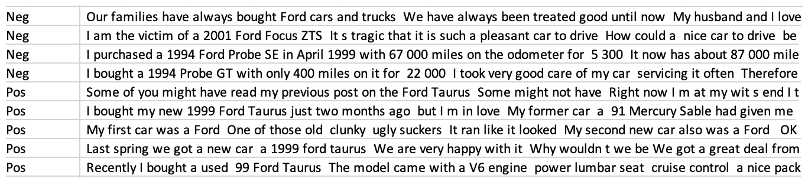
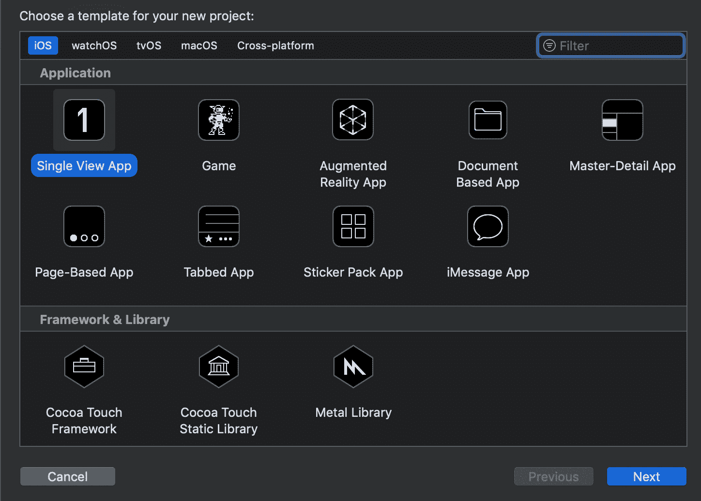
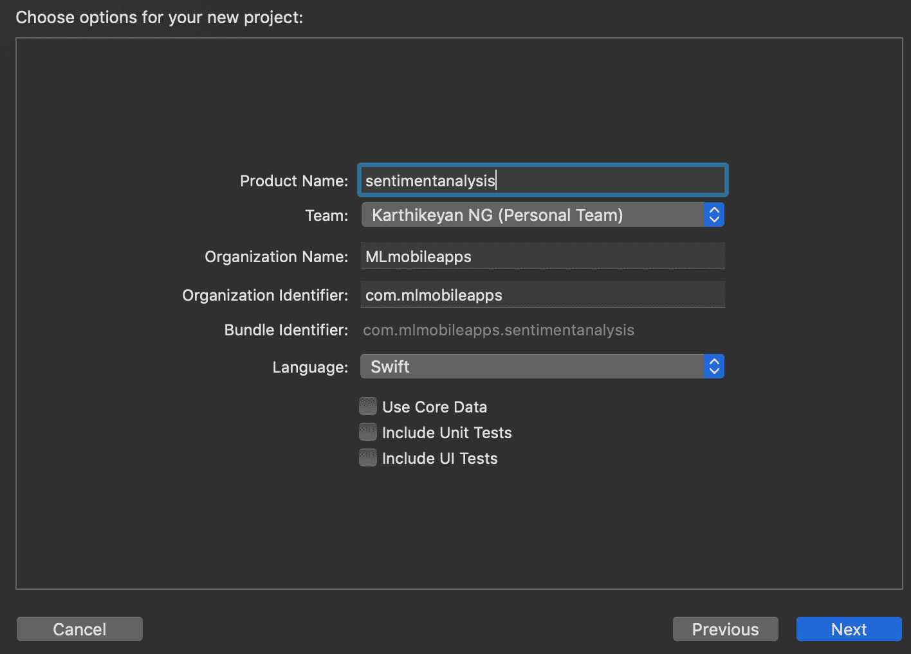
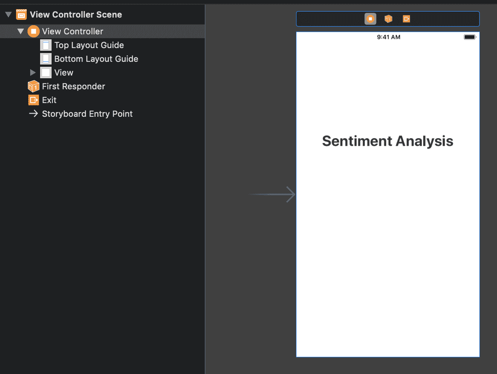
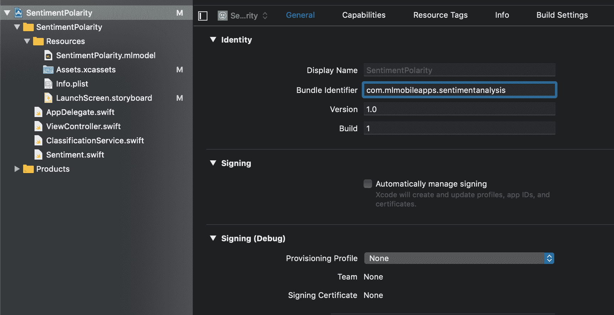
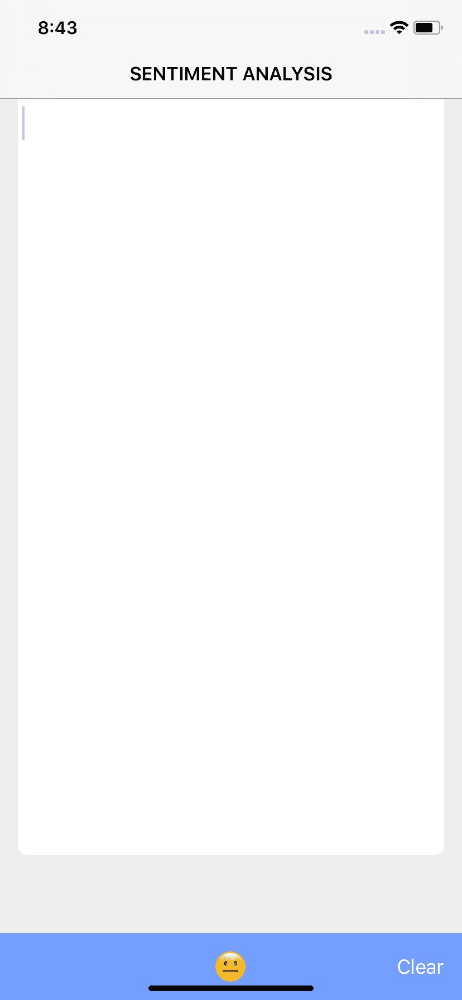
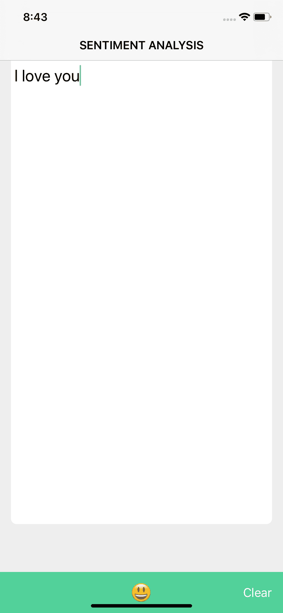
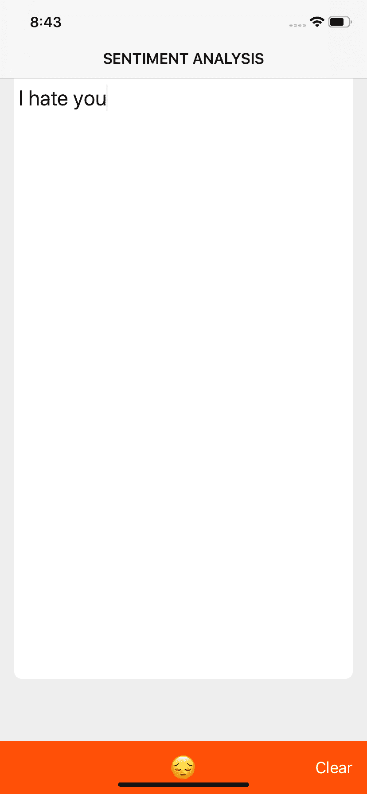
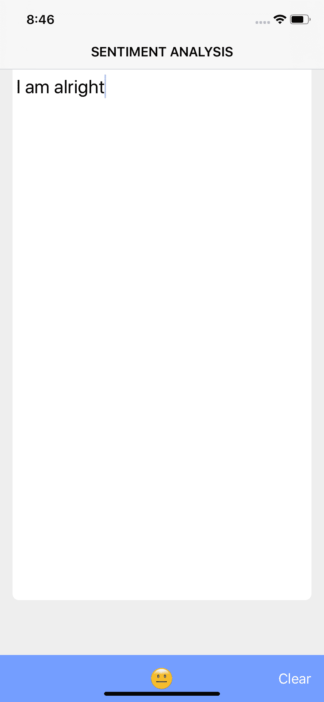

# 第九章：使用 LinearSVC 进行文本情感分析

在这一章中，我们将构建一个 iOS 应用程序，通过用户输入对文本和图像进行情感分析。我们将使用现有的数据模型，这些模型是通过使用 LinearSVC 为同一目的构建的，并将这些模型转换为核心**机器学习**（**ML**）模型，以便在我们的应用程序中更易于使用。

情感分析是识别任何给定数据（如文本、图像、音频或视频）所激发的情感或观点的过程。情感分析有很多应用场景。即使现在，政党也能轻松识别出选民的普遍心态，他们还有潜力改变这一心态。

让我们来看看如何从现有的数据集中构建我们自己的情感分析 ML 模型。在这一章中，我们将探讨以下主题：

+   使用 scikit-learn 构建 ML 模型

+   **线性支持向量分类**（**LinearSVC**）

+   构建一个 iOS 应用程序

# 使用 scikit-learn 构建 ML 模型

在这一部分中，我们将构建我们自己的模型。有现成的数据集可供使用，这些数据集与 Twitter 动态数据相关，主题是产品和电影评论。你可以选择适合你自己的数据集；在这一章中，我们将选择一个包含客户评论的数据集。

一个包含正面和负面客户评论的数据集可以在[`boston.lti.cs.cmu.edu/classes/95-865-K/HW/HW3/`](http://boston.lti.cs.cmu.edu/classes/95-865-K/HW/HW3/)找到。你可以通过以下链接下载该数据集：[`boston.lti.cs.cmu.edu/classes/95-865-K/HW/HW3/epinions3.zip`](http://boston.lti.cs.cmu.edu/classes/95-865-K/HW/HW3/epinions3.zip)。

上述数据集包含有关产品的正面和负面反馈，如下图所示：



我们将使用 scikit-learn 管道和 LinearSVC 来训练数据集。让我们更详细地了解这两者。

# Scikit-learn

这是一个基于 **NumPy**、**SciPy** 和 **Matplotlib** 构建的数据挖掘和数据分析 Python 库。它有助于解决与分类、回归、聚类和降维相关的 ML 问题。

# scikit-learn 管道

scikit-learn 管道的主要目的是将 ML 步骤组合在一起。可以通过交叉验证来设置各种参数。scikit-learn 提供了一系列转换器，用于数据预处理（数据清理）、核近似（扩展）、无监督的降维（减少）和特征提取（生成）。该管道包含一系列转换器，并最终产生一个估算器。

管道按顺序应用一系列变换，然后是最终的估算器。在管道中，`fit` 和 `transform` 方法在中间步骤中实现。`fit` 方法仅在管道操作的最后由最终估算器实现。为了缓存管道中的变换器，使用了 `memory` 参数。

用于分类的估算器是一个 Python 对象，它实现了方法的 fit (`x`, `y`) 和 predict (`T`) 值。例如，`class sklearn.svm.SVC` 实现了 SVC。模型的参数作为估算器构造函数的参数传递。scikit-learn 中的 `memory` 类具有 `class sklearn.utils.Memory(*args, **kwargs)` 签名。它有缓存、清除、减少、评估和格式化内存对象的方法。`cache` 方法用于计算函数的返回值。返回的对象是一个 `MemorizedFunc` 对象，它的行为类似于一个函数，并提供额外的方法用于缓存查找和管理。`cache` 方法接受诸如 `func=None, ignore=None, verbose=None, mmap_mode=False` 等参数。

`class signature` 管道如下：

```py
class sklearn.pipeline.Pipeline(steps, memory=None)
```

接下来，让我们看看下一个重要组件。

# LinearSVC

scikit-learn 库中的一个类是 LinearSVC，它支持稀疏和密集类型的输入。使用一对多方案处理多类支持。LinearSVC 类似于 SVC，其中参数为 `kernel = linear`，但在 LinearSVC 中使用的是 `liblinear` 来实现该参数，而不是 SVC 中使用的 `libvsm`。这为我们提供了更多选择惩罚和损失函数的灵活性，并且有助于更好地对大量样本进行缩放。

`class` 签名如下：

```py
class sklearn.svm.LinearSVC(penalty=’l2’, loss=’squared_hinge’, dual=True, tol=0.0001, C=1.0, multi_class=’ovr’, fit_intercept=True, intercept_scaling=1, class_weight=None, verbose=0, random_state=None, max_iter=1000)
```

现在是时候开始构建我们的模型了，具体如下：

1.  我们将从导入所有必要的库开始，具体如下：

```py
import re
import coremltools
import pandas as pd
import numpy as np
from nltk.corpus import stopwords
from nltk import word_tokenize
from string import punctuation
from sklearn.feature_extraction import DictVectorizer
from sklearn.pipeline import Pipeline
from sklearn.svm import LinearSVC
from sklearn.model_selection import GridSearchCV
```

`re` 库是提供匹配操作的正则表达式库，使得处理文本数据变得更加容易。`nltk` 库用于根据我们的需求格式化文本，而 `sklearn` 提供了所需的机器学习工具。`coremltools` 库帮助我们将 `sklearn` 模型转换为 Core ML 模型。

1.  现在，让我们开始读取输入，具体如下：

```py
# Read reviews from CSV
reviews = pd.read_csv('epinions.csv')
reviews = reviews.as_matrix()[:, :]
print "%d reviews in dataset" % len(reviews)
```

上述代码读取了 CSV 文件，并将其转换为一个包含所有行和列的 `numpy` 数组。现在，我们已经准备好数据集，可以开始从数据中提取特征。

1.  现在，让我们进行特征选择，具体如下：

```py
# Create features
def features(sentence):
 stop_words = stopwords.words('english') + list(punctuation)
 words = word_tokenize(sentence)
 words = [w.lower() for w in words]
 filtered = [w for w in words if w not in stop_words and not    
             w.isdigit()]
 words = {}
 for word in filtered:
     if word in words:
         words[word] += 1.0
     else:
         words[word] = 1.0
 return words
```

1.  我们将从向量化 `features` 函数开始。然后，我们将提取 DataFrame 中每个句子的特征，并将它们存储在 `X` 变量中。之后，我们将设置目标变量。目标变量将是输出。在我们的案例中，我们将为每个句子获取一个标签，指示其中的情感：

```py
# Vectorize the features function
features = np.vectorize(features)
# Extract the features for the whole dataset
X = features(reviews[:, 1])
# Set the targets
y = reviews[:, 0]
```

1.  在我们的例子中，我们将创建一个包含`DictVectorizer`和`LinearSVC`的管道。`DictVectorizer`，顾名思义，将字典转换为向量。我们选择了`GridSearchCV`来从一系列通过参数网格化的模型中选择最佳模型：

```py
# Do grid search
clf = Pipeline([("dct", DictVectorizer()), ("svc", LinearSVC())])
params = {
 "svc__C": [1e15, 1e13, 1e11, 1e9, 1e7, 1e5, 1e3, 1e1, 1e-1, 1e-3,  
            1e-5]
}
gs = GridSearchCV(clf, params, cv=10, verbose=2, n_jobs=-1)
gs.fit(X, y)
model = gs.best_estimator_
```

1.  然后，我们将打印出结果，如下所示：

```py
# Print results
print model.score(X, y)
print "Optimized parameters: ", model
print "Best CV score: ", gs.best*score*
```

1.  现在，我们可以将 scikit-learn 模型转换为`mlmodel`，如下所示：

```py
# Convert to CoreML model
coreml_model = coremltools.converters.sklearn.convert(model)
coreml_model.short_description = 'Sentiment analysis AI projects.'
coreml_model.input_description['input'] = 'Features extracted from 
                                           the text.'
coreml_model.output_description['classLabel'] = 'The most likely polarity (positive or negative or neutral), for the given input.'
coreml_model.output_description['classProbability'] = 'The probabilities for each class label, for the given input.'
coreml_model.save('Sentiment.mlmodel')
```

一旦我们有了模型，就可以开始构建应用程序了。

# 构建 iOS 应用程序

让我们开始构建 iOS 应用程序，使用在上一阶段构建的模型。该模型将根据输入文本的性质（积极、中性或消极）预测输出。

要构建此应用程序，应使用 Xcode 版本 10.1：

1.  创建一个新的项目，选择**单视图应用**，如以下截图所示：



1.  在**下一**屏幕上提到我们的应用程序名称。

1.  在下一个向导屏幕上，为你的应用程序选择一个合适的名称。

1.  填写其余的字段，包括组织名称以及组织标识符。

1.  我们在此应用程序中不使用核心数据，因此跳过该选项。

1.  让我们从在 Xcode 中创建一个新应用开始。以下截图展示了如何在 Xcode 中创建一个新项目：



1.  接下来，创建一个故事板，如以下截图所示：



1.  一旦你选择了保存应用程序的文件位置，你将能够看到带有新应用程序信息的“常规”选项卡，如以下截图所示：



1.  我们将创建一个简单的 UI，在底部放置一个按钮来显示情感：

```py
//initialize Ui components
private lazy var textView: UITextView = self.makeTextView()   private lazy var accessoryView = UIView()
private lazy var resultLabel: UILabel = self.makeResultLabel()    private lazy var clearButton: UIButton = self.makeClearButton()
private let padding = CGFloat(16)
private var textViewBottomConstraint: NSLayoutConstraint?
```

1.  我们将定义`sentiments`作为枚举类型，如下所示：

```py
enum Sentiment {
     case neutral
     case positive
     case negative
    var emoji: String {
        switch self {
         case .neutral:
         return ""
         case .positive:
         return ""
         case .negative:
         return ""
     }
 }
    var color: UIColor? {
         switch self {
             case .neutral:
             return UIColor(named: "NeutralColor")
             case .positive:
             return UIColor(named: "PositiveColor")
             case .negative:
             return UIColor(named: "NegativeColor")
         }
     }
}
```

1.  让我们编写`ClassificationService`来获取我们构建的模型的结果：

```py
  //variables initialization
  private let options: NSLinguisticTagger.Options = [.omitWhitespace, .omitPunctuation, .omitOther]
  private lazy var tagger: NSLinguisticTagger = .init(
    tagSchemes: NSLinguisticTagger.availableTagSchemes(forLanguage: "en"),
    options: Int(self.options.rawValue)
  )

private extension ClassificationService {
 func features(from text: String) -> [String: Double] {
     var wordCounts = [String: Double]()
     tagger.string = text
     let range = NSRange(location: 0, length: text.utf16.count)
     // let's tokenize the input text and count the sentence
     tagger.enumerateTags(in: range, scheme: .nameType, options: options) { _, tokenRange, _, _ in
         let token = (text as NSString).substring(with: tokenRange).lowercased()
         // Skip small words
         guard token.count >= 3 else {
         return
         }
         if let value = wordCounts[token] {
             wordCounts[token] = value + 1.0
         } else {
             wordCounts[token] = 1.0
         }
     }
 return wordCounts
 }
```

1.  输入被传递到`prediction`方法，以将语句过滤为`positive`、`negative`或`neutral`情感：

```py
func predictSentiment(from text: String) -> Sentiment {
 do {
 let inputFeatures = features(from: text)
 // Make prediction only with 2 or more words
 guard inputFeatures.count > 1 else {
 throw Error.featuresMissing
 }
 let output = try model.prediction(input: inputFeatures)
     switch output.classLabel {
         case "Positive":
             return .positive
         case "Negative":
             return .negative
         default:
             return .neutral
             }
 } catch {
     return .neutral
     }
 }
}
```

1.  让我们通过初始化`view`组件来编写`ViewController`，如下所示：

```py
override func viewDidLoad() {
 super.viewDidLoad()
 title = "Sentiment Analysis".uppercased()
 view.backgroundColor = UIColor(named: "BackgroundColor")
 view.addSubview(textView)
 accessoryView.frame = CGRect(x: 0, y: 0, width: view.frame.size.width, height: 60)
 accessoryView.addSubview(resultLabel)
 accessoryView.addSubview(clearButton)
 textView.inputAccessoryView = accessoryView
NotificationCenter.default.addObserver(
 self,
 selector: #selector(keyboardDidShow(notification:)),
 name: .UIKeyboardDidShow,
 object: nil
 )
 setupConstraints()
 //Show default sentiment as neutral
 show(sentiment: .neutral)
 }
```

1.  按钮和标签上的初始`setupConstraints`定义如下：

```py
func setupConstraints() {
 //input textview 
 textView.translatesAutoresizingMaskIntoConstraints = false
 textView.topAnchor.constraint(equalTo: view.topAnchor, constant: 80).isActive = true
 textView.leadingAnchor.constraint(equalTo: view.leadingAnchor, constant: padding).isActive = true
 textView.trailingAnchor.constraint(equalTo: view.trailingAnchor, constant: -padding).isActive = true
 textViewBottomConstraint = textView.bottomAnchor.constraint(equalTo: view.bottomAnchor)
 textViewBottomConstraint?.isActive = true

//result label at the bottom
 resultLabel.translatesAutoresizingMaskIntoConstraints = false
 resultLabel.centerXAnchor.constraint(equalTo: accessoryView.centerXAnchor).isActive = true
 resultLabel.centerYAnchor.constraint(equalTo: accessoryView.centerYAnchor).isActive = true

//Clear button at the bottom right
 clearButton.translatesAutoresizingMaskIntoConstraints = false
 clearButton.trailingAnchor.constraint(
 equalTo: accessoryView.trailingAnchor,
 constant: -padding
 ).isActive = true
 clearButton.centerYAnchor.constraint(equalTo: accessoryView.centerYAnchor).isActive = true
 }
```

1.  定义`Show()`方法，如下所示：

```py
private func show(sentiment: Sentiment) {                                  accessoryView.backgroundColor = sentiment.color    
         resultLabel.text = sentiment.emoji
 }
```

1.  让我们在模拟器上运行应用程序。你可以在以下截图中看到输出：



1.  现在，让我们使用不同的输入来运行我们的应用程序并获取输出，如下所示：



1.  使用相同输出的消极输入示例语句显示在以下截图中：



1.  使用中性文本的示例输入显示在以下截图中：



在这里，我们能够从给定的文本输入中获取情感。现在，你可以通过改进现有模型，进一步提升模型的效果。

你可以在多个来源中深入探索如何在图像上识别情感。一个示例应用是 *Fine-tuning CNNs for Visual Sentiment Prediction*。你可以在 [`github.com/imatge-upc/sentiment-2017-imavis`](https://github.com/imatge-upc/sentiment-2017-imavis) 阅读关于这个应用的详细信息。

# 总结

到此为止，你应该能够构建自己的 TensorFlow 模型，并将其转换为 Core ML 模型，以便在 iOS 应用中使用。相同的 TensorFlow 模型可以转换为 TensorFlow Lite 模型，然后可以在 Android 应用或 iOS 应用中使用。现在，你可以开始这个任务并尝试不同的结果。话虽如此，我们现在准备进入下一章。

在下一章，你将使用本书中学到的知识，继续探索如何构建自己的应用。
