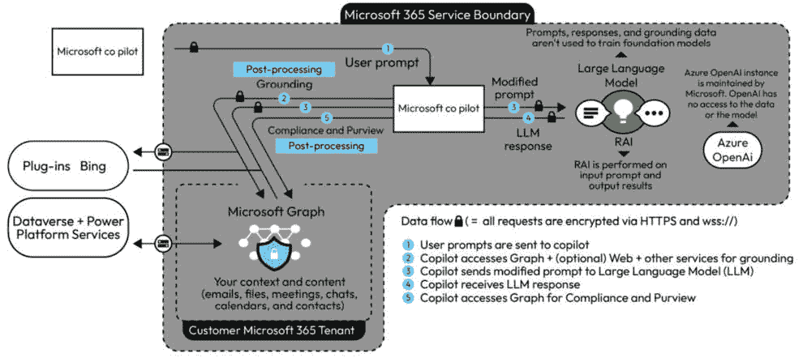

# 第一章：微软 Dynamics 365 AI 架构与基础

欢迎来到*第二章*，我们将深入探讨微软 Dynamics 365 AI 的架构和基础元素。通过从第一章中获得广泛的理解，现在是时候研究构成这个平台既灵活又强大的结构组件了。本章旨在阐明 Dynamics 365 AI 是如何设计和构建的，以及其各种元素是如何结合在一起，提供一致、智能的商业解决方案的。

我们将涵盖以下主要内容：

+   微软 Dynamics 365 AI 架构概述

+   关键组件及其交互

+   集成考虑事项和最佳实践

本章的第一部分，*微软 Dynamics 365 AI 架构概述*，是对使 Dynamics 365 AI 有效运行的核心理念框架的详细介绍。我们将探讨基于云的架构、其模块化以及它是如何设计用于可扩展性和灵活性的。这个基础将帮助你更好地理解平台如何为广泛的商业应用提供具体和集成解决方案。

接下来，我们进入第二部分，*关键组件及其交互*，我们将剖析 Dynamics 365 AI 的基本部分。我们将讨论各种模块和功能，它们的相互依赖性以及它们如何相互作用，以创造无缝的 AI 驱动体验。无论是数据分析、预测算法还是客户参与工具，理解这些交互对于充分利用平台潜力至关重要。

本章的结尾，*集成考虑事项和最佳实践*部分将提供如何将 Dynamics 365 AI 最佳地集成到现有系统中的实用建议。在这里，我们将探讨组织在集成过程中面临的典型挑战，并分享专家指导以克服这些障碍。从数据迁移到软件兼容性和安全考虑，这一部分将为你准备一个平稳高效的实施过程。

在本章结束时，你应该对 Dynamics 365 AI 的架构和基础元素有一个坚实的理解，这将为你提供在自身商业环境中实施和优化这个强大工具所需的知识。

# 微软 Dynamics 365 AI 架构概述

理解 Microsoft Dynamics 365 AI 的架构就像解锁了一个极其复杂的机器的蓝图。通过分析其各个部分、它们是如何连接的以及它们的指定功能，我们可以理解整个机器是如何运作的。这种理解对于计划利用该平台全部功能的企业领导者、IT 专业人士和解决方案架构师至关重要。本节详细探讨了构成 Dynamics 365 AI 平台的基础技术结构和组件。

下图提供了一个图解概述：

图 2.1 – 架构概述

## 基于云的架构

Dynamics 365 AI 的核心是基于云的架构，这使得平台能够从云计算带来的可扩展性、灵活性和易于访问中受益。这种模式简化了部署过程，降低了基础设施成本，并使与其他云服务的无缝集成成为可能。鉴于 AI 通常需要大量的计算能力，原生云使得 Dynamics 365 AI 能够按需利用资源，从而有效地处理大规模数据处理和机器学习任务。

## AI 技术集成

Dynamics 365 AI 的一个显著特点是它将各种 AI 技术，如机器学习、**自然语言处理**（NLP）和认知服务无缝集成。机器学习模型为系统的分析和预测能力提供动力，实现数据驱动的洞察。NLP 允许与用户进行智能交互，增强聊天机器人和虚拟代理的功能。认知服务，包括计算机视觉和其他 AI 能力，为系统增加了另一层智能，进一步使企业能够在各个接触点收集和解释数据。

## 模块化组件和微服务

架构以模块化方式设计，具有离散的组件和服务，这些组件和服务被构建来执行特定任务，但可以无缝交互和集成。这种模块化设计遵循微服务架构模式，确保每个组件松散耦合、独立部署，并围绕特定的业务能力组织。这种结构不仅使根据特定业务需求定制系统变得更加容易，而且提高了整个平台的可维护性和可扩展性。

## 数据管理和存储

Dynamics 365 AI 利用微软的 Azure Data Lake 提供可扩展和安全的存储解决方案。这确保了平台能够管理大量结构化和非结构化数据，鉴于人工智能算法数据密集型的特性，这是一个关键需求。Azure Data Lake 旨在进行高速数据分析，使其成为 Dynamics 365 AI 实时分析需求的理想选择。

## 安全性和合规性

随着数据成为新的石油，保护数据至关重要。Dynamics 365 AI 平台采用了与微软严格的合规标准相一致的安全措施。加密协议、访问控制和持续监控是一些内置功能，确保数据完整性和保密性。

## API 和 SDK

Dynamics 365 AI 提供了一套 API 和 SDK，以实现与其他平台和服务的定制和集成。这种灵活性对于可能已经拥有技术堆栈或具有超出标准功能独特需求的企业至关重要。

## 实时分析引擎

另一个关键组件是实时分析引擎，旨在提供即时见解并促进快速决策。该引擎经过优化，能够在实时执行复杂计算，转化为企业可以立即利用的行动见解。

## 流线型用户界面

不可忽视用户界面在架构中的重要性。Dynamics 365 AI 仪表板设计得直观，能够以易于理解的方式呈现复杂的数据分析，确保用户可以轻松与系统交互并提取所需见解。

## 基础设施弹性和容错性

该平台考虑到弹性，具备自动故障转移、负载均衡和灾难恢复等功能。这确保了 Dynamics 365 AI 系统不仅强大，而且可靠，这对于追求持续运营的企业来说是一个至关重要的考虑因素。

## 可扩展性和未来证明

最后，该架构旨在可扩展，能够融入未来人工智能和机器学习领域的进步。随着技术领域的演变，Dynamics 365 AI 平台准备适应变化，确保提供未来证明的解决方案，能够直面新兴的商业挑战。

总结来说，Dynamics 365 AI 的架构是一个精心设计的系统，它集成了多种人工智能技术和商业模块，以提供强大、可扩展和智能的商业解决方案。它代表了如何通过架构的复杂性来实际应用人工智能解决现实世界的商业问题。这种全面的理解应该能为你提供探索这些元素如何协同工作以提供强大的商业见解并推动智能决策过程的基础知识。

# 关键组件及其交互

虽然 了解 Dynamics 365 AI 的整体架构奠定了基础，但深入研究其基本组件及其交互，使我们更深入地了解了这个卓越平台的操作机制。这些组件包括数据存储、AI 模型、认知服务和集成接口。在本节中，我们将探讨这些部分如何进行沟通、协作以及协同工作，以在商业生态系统中实现机器学习、高级分析和智能自动化。

## 数据存储 – 人工智能的基石

在 Dynamics 365 AI 中，数据存储通过微软的 **Azure Data Lake** 得以实现，这是一个可扩展且安全的基于云的存储库，专为数据分析设计。然而，它不仅仅是一个存放数据的地方；它是一个活跃的组件，与其他系统部分进行交互。Azure Data Lake 作为基础层，从各种来源（包括物联网设备、CRM 系统甚至外部 API）收集原始数据。一旦收集到数据，就会进行预处理，为后续分析做好准备。数据存储不是一个被动的存储库，而是一个积极的参与者，与其他组件（如 AI 模型）进行通信，以促进实时分析和预测洞察。

## AI 模型 – 分析引擎

Dynamics 365 AI 功能的核心是其各种机器学习模型。这些模型从 Azure Data Lake 处处理数据，并运行一系列计算以生成可操作的洞察。这些可能包括从制造环境中的预测性维护计划到零售环境中的客户行为分析。AI 模型被训练来解释数据中的复杂模式，然后通过 API 将其输出发送到其他组件，如仪表板或第三方应用程序。这些模型不断从新数据中学习，调整和优化其算法以实现更好的未来预测，使它们成为系统动态、不断改进的引擎。

## 认知服务 – 添加智能层

微软的 **认知服务** 在增强 Dynamics 365 AI 功能方面发挥着关键作用。这是一系列预构建的算法和模型，增加了自然语言处理、计算机视觉和情感分析等功能。例如，通过使用语言理解服务，客户服务聊天机器人可以更有效地理解用户查询，而情感分析可以帮助衡量客户满意度。这些服务与数据存储和 AI 模型紧密交互，因为它们通常需要访问大量数据以实现最佳性能，并且可能还需要 AI 模型的分析能力来完成更复杂的任务。

## 集成接口 – 连接组织

在任何复杂的系统中，不同组件之间的无缝集成至关重要。Dynamics 365 AI 通过一套强大的 API 和 SDK 实现这一点，这些 API 和 SDK 作为其原生组件和外部系统之间的交互层。这使得企业能够将 Dynamics 365 AI 集成到现有的技术堆栈中，甚至通过连接到专门的第三方服务来扩展其功能。无论是从 ERP 系统中提取数据到 Azure Data Lake，还是将分析洞察推送到外部商业智能工具，集成接口都能使其顺利实现。这些 API 和 SDK 被设计成安全且快速，为组件交互提供可靠的渠道。

## 跨组件协作——互动的交响曲

那么，这些组件是如何协同工作的呢？想象一个场景，一家零售企业想要预测未来的销售趋势。来自 POS 系统的原始销售数据存储在 Azure Data Lake 中。AI 模型分析这些数据以识别模式和趋势，并可能通过认知服务添加解释层，例如客户情绪。一旦分析完成，洞察将通过仪表板提供给决策者，或通过 API 发送到外部的 BI 工具。在整个过程中，每个组件都扮演着一定的角色，正是它们良好的协调互动带来了最终结果。

## 商业赋能——最终目标

这些组件的融合旨在为企业提供他们需要的工具，使他们能够更加数据驱动、高效和智能。这样一套复杂的组件协同工作，企业可以提取有价值的见解，提高运营效率，并最终做出更好的决策。这种综合视角可以帮助企业优化各个方面的内容，从供应链管理到客户关系，从而在当今数据驱动的市场中提供竞争优势。

## 可扩展性和适应性——为增长而设计

因为这些组件都在基于云的模块化环境中运行，所以扩展规模或适应新的业务需求非常容易。需要添加更多数据存储或整合新的机器学习模型吗？该架构允许进行此类调整而不会造成中断，确保随着业务增长，Dynamics 365 AI 的功能也能相应增长。

## 组件间的安全性和合规性

由于数据在多个组件中流动，从存储到 AI 模型，保持高水平的安全性和合规性至关重要。微软确保数据在传输和静止状态下都得到加密，API 和 SDK 有健全的认证协议。这种跨组件的安全保障确保了业务关键数据的完整性和机密性。

最后，值得注意的是，微软对 AI 和云计算的承诺体现在对所有这些组件的定期更新和改进上。新的机器学习模型、认知服务的增强或 API 的更新都可能作为其更新周期的一部分出现，为商业提供不断改进、最先进的 AI 生态系统。

总结来说，Dynamics 365 AI 生态系统是由多个组件构成的复杂而和谐的协调——每个组件都贡献其独特的功能，但作为一个整体协同工作。本节为您提供了关于数据存储、AI 模型、认知服务和集成接口如何协同工作以提供高级分析、机器学习和智能自动化的全面理解。这种集成方法确保企业能够提取有价值的见解，有效地优化运营。掌握这些知识后，您将准备好掌握 Dynamics 365 AI 带来的卓越功能和适应性。

# 集成考虑和最佳实践

集成往往是采用任何新技术时的关键障碍，Dynamics 365 AI 也不例外。然而，其架构和组件都是考虑到集成而设计的，这使得组织能够无缝地将它整合到现有的技术堆栈中。本节旨在提供有关如何有效地将 Dynamics 365 AI 集成到现有系统和工作流程中的实用见解。这些主题包括数据集成、安全措施、可扩展性和性能优化。这些领域对于最大化 Dynamics 365 AI 的效用和避免可能阻碍您的 AI 驱动计划的常见陷阱至关重要。

## 数据集成 – 起始点

有效的数据集成是所有 AI 活动的基础。在深入研究机器学习模型或高级分析之前，您需要确保数据能够无缝地从现有的系统流入 Dynamics 365 AI 环境。为此，请使用连接器将您当前的数据库、ERP 系统或 CRM 平台连接到 Azure Data Lake，这是 Dynamics 365 AI 的主要数据存储组件。这些连接器可以是预构建的或定制的，应根据您的具体需求进行选择。实施批处理和实时数据传输协议，以确保 AI 模型始终使用最新信息工作，从而提高洞察力和预测的准确性。

## 安全措施 – 不可协商

安全性不仅仅是一个考虑因素，而是一个强制性的要求，尤其是在将新的组件如 Dynamics 365 AI 集成到现有架构中时。使用如 OAuth2 这样的强大身份验证机制，并采用加密来保护数据在传输和静止状态下的安全。根据您的行业遵守 GDPR 或 HIPAA 也是至关重要的。平台固有的安全功能可以通过额外的防火墙、虚拟专用云或其他安全措施得到补充，以保护敏感数据。记住，一个被破坏的系统可能会抵消通过 AI 实现的所有效率提升。

## 可扩展性——规划增长

Dynamics 365 AI 作为原生云服务，提供了出色的可扩展性选项，但主动规划这一点至关重要。如果预计您的数据需求将呈指数级增长，请确保在 Azure Data Lake 中分配足够的资源，并相应调整机器学习模型。评估不同组件的价格层，以确保扩展不会导致预算超支。在模拟的高负载下测试系统，也将让您了解其性能边界，帮助您做出何时以及如何扩展的明智决策。

## 性能优化——充分利用您的系统

一个良好集成的 Dynamics 365 AI 系统不仅应该是安全和可扩展的，还应该高效运行。性能优化涉及微调各种设置，从 Azure Data Lake 中的数据摄取速率到机器学习模型的处理能力。使用性能指标来识别瓶颈，然后调整配置或分配额外资源来解决问题。Azure 内部的工具可以帮助您实时监控性能，从而进行及时干预，确保系统平稳运行。

## 文档和培训——人的因素

虽然这往往被忽视，但为您的集成过程提供全面的文档可能非常有价值。这将作为您当前团队以及任何需要理解该系统的未来员工的指南。培训团队了解新集成的 Dynamics 365 AI 组件的细微差别同样至关重要。您的 AI 创新能否有效，取决于管理它们的人。

## 集成的迭代性质

最后，理解集成不是一个一次性任务，而是一个持续的过程至关重要。随着 Dynamics 365 AI 接收更新以及您组织的需求发展，持续的调整将是必需的。采用敏捷方法，并不断迭代您的集成策略，以适应这些变化。

总结来说，Dynamics 365 AI 的有效集成是多方面的，需要在不同领域如数据集成、安全性、可扩展性和性能等方面进行勤奋的计划和执行。通过理解和实施这些领域的最佳实践，你不仅确保了 AI 与现有系统的无缝结合；你还使你的组织能够从 Dynamics 365 AI 投资中获得最大收益。本节为你提供了应对这一集成复杂性的实用知识，并充分利用 Dynamics 365 AI 为你的组织带来的全部潜力。

通过 Microsoft Dynamics 365 AI 的架构和集成之旅是全面的，深入探讨了支撑这一强大套件的复杂但高度适应的结构。从对其底层架构的理解开始，我们穿越了关键组件及其相互作用，触及了数据存储、AI 模型和认知服务等关键要素。这些组件不是孤立的运作；它们的真正力量在于它们的协同运作，推动分析、机器学习和智能自动化，以生成可操作的业务洞察。

# 摘要

数据集成已经成为一个关键环节和基础步骤，必须精确处理以确保整个系统按预期运行。没有有效的数据集成，即使是最高级的 AI 模型和分析引擎也可能无法达到预期效果。安全措施也被证明是不可协商的，它不仅影响系统的可靠性，还影响其符合法律和行业特定要求。

接下来，可扩展性和性能优化是两个决定你的 Dynamics 365 AI 实施长期成功的关键考虑因素。可扩展性确保你的系统能够随着你的业务增长而增长，性能优化则保证这种增长以高效、成本效益的方式进行。这两个方面如果管理得当，可以为你的业务提供竞争优势，确保你的技术投资带来最大回报。

最后，我们不应忘记人的因素——将操作和管理这一系统的员工。培训和全面的文档可以决定你的 Dynamics 365 AI 组件的有效性，无论它们集成得有多好。

总结来说，强调与 Dynamics 365 AI 相关的一切的迭代性质是很重要的。随着你的业务发展，你的需求和这项技术本身也会发展。跟上最新的更新和最佳实践可以确保你继续充分利用 Dynamics 365 AI 的全部力量。

本章旨在为您提供全面的理解和实践指导，以有效地将 Dynamics 365 AI 集成到现有的系统中。现在，您已经准备好从理论转向可操作的步骤，利用 Dynamics 365 AI 的功能来推动组织中的智能决策和运营卓越。

# 问题

1.  Dynamics 365 AI 架构中数据集成的重要性是什么？

1.  安全措施在 Dynamics 365 AI 中扮演什么角色？

1.  为什么可扩展性和性能优化对 Dynamics 365 AI 的实施至关重要？

1.  人员培训、文档等人的因素在 Dynamics 365 AI 的有效实施中具有什么意义？

# 答案

1.  数据集成是 Dynamics 365 AI 有效运行的基础。没有有效的数据集成，即使是先进的 AI 模型和分析引擎也可能无法提供准确和可操作的观点。它作为连接各个组件的纽带，确保了无缝的运行。

1.  安全措施是 Dynamics 365 AI 不可或缺的组成部分，它影响系统的可信度和法律合规性。实施强大的安全协议确保数据安全和 AI 模型的完整性，最终影响 Dynamics 365 AI 系统的整体有效性和合规性。

1.  可扩展性确保 Dynamics 365 AI 系统可以随着业务增长而增长，适应增加的数据负载和更复杂的分析需求。性能优化确保这种增长以高效和成本效益的方式进行。共同，它们可以提供竞争优势并确保技术投资的最大回报。

1.  人的因素可以决定 Dynamics 365 AI 的有效性。对于将操作和管理系统的员工来说，充分的培训和全面的文档是必不可少的。适当的培训确保 Dynamics 365 AI 的能力得到充分利用，系统以最佳效果运行。
