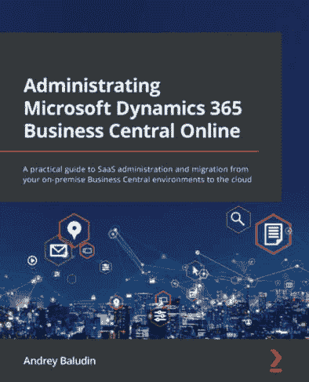
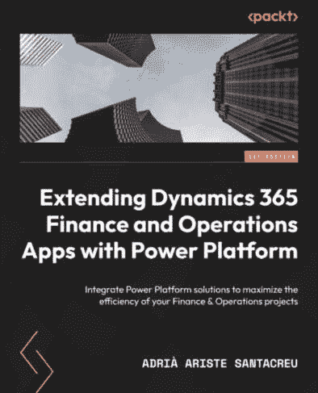

[packtpub.com](http://packtpub.com)

订阅我们的在线数字图书馆，全面访问超过 7,000 本书和视频，以及行业领先的工具，帮助您规划个人发展并提升职业生涯。更多信息，请访问我们的网站。

# 第十二章：为什么订阅？

+   使用来自 4,000 多位行业专业人士的实用电子书和视频，节省学习时间，更多时间编码

+   通过为您量身定制的技能计划提高学习效果

+   每月免费获得一本电子书或视频

+   完全可搜索，便于轻松访问关键信息

+   复制粘贴、打印和收藏内容

您知道 Packt 为每本书都提供电子书版本，并提供 PDF 和 ePub 文件吗？您可以在 [packtpub.com](http://packtpub.com) 升级到电子书版本，并且作为印刷版书籍的顾客，您有权获得电子书副本的折扣。有关更多信息，请联系我们 customercare@packtpub.com。

在 [www.packtpub.com](http://www.packtpub.com)，您还可以阅读一系列免费技术文章，订阅各种免费通讯，并享受 Packt 书籍和电子书的独家折扣和优惠。

# 您可能还会喜欢的其他书籍

如果您喜欢这本书，您可能对 Packt 出版的以下其他书籍也感兴趣：

[(https://packt.link/1803234806)]

**管理 Microsoft Dynamics 365 Business Central 在线**

Andrey Baludin

ISBN: 978-1-80323-480-9

+   管理不同的 Business Central 环境、其状态和更新，并创建新环境

+   了解如何从备份部署 SaaS 环境

+   分析环境遥测及其操作，并了解如何使用 Application Insights 设置扩展遥测

+   探索如何获取有关租户容量限制及其资源使用情况的信息

+   设置云迁移并将您的数据从本地迁移到 SaaS

+   使用 API 自动化管理和迁移流程

[(https://packt.link/1801811598)]

**使用 Power Platform 扩展 Dynamics 365 Finance and Operations Apps**

Adrià Ariste Santacreu

ISBN: 978-1-80181-159-0

+   掌握将 Dynamics 365 F&O 与 Dataverse 集成的技巧

+   发现使用 Power Automate 与 Dynamics 365 F&O 的好处

+   理解 Power Apps 作为扩展 Dynamics 365 F&O 功能的手段

+   培养您的技能以实现 Azure Data Lake Storage 用于 Power BI 报告

+   探索 AI Builder 以及其与 Power Automate 流和 Power Apps 的集成

+   了解 Dataverse 和 Power Platform 的环境管理、治理和应用生命周期管理 (ALM)

# Packt 正在寻找像您这样的作者

如果你有兴趣成为 Packt 的作者，请访问[authors.packtpub.com](http://authors.packtpub.com)并今天申请。我们与成千上万的开发者和技术专业人士合作，就像你一样，帮助他们将见解分享给全球科技社区。你可以提交一般申请，申请我们正在招募作者的特定热门话题，或者提交你自己的想法。

# 分享你的想法。

现在你已经完成了《Microsoft Dynamics 365 AI for Business Insights》，我们非常乐意听听你的想法！如果你在亚马逊购买了这本书，请[点击此处直接进入该书的亚马逊评论页面](https://packt.link/r/180181094X)并分享你的反馈或在该购买网站上留下评论。

你的评价对我们和科技社区都非常重要，这将帮助我们确保我们提供高质量的内容。

# 下载本书的免费 PDF 副本。

感谢您购买这本书！

你喜欢在路上阅读，但无法携带你的印刷书籍到处走？

你的电子书购买是否与你的选择设备不兼容？

别担心，现在每购买一本 Packt 书籍，你都可以免费获得该书的 DRM 免费 PDF 版本。

在任何地方、任何设备上阅读。直接从你最喜欢的技术书籍中搜索、复制和粘贴代码到你的应用程序中。

优惠远不止这些，你还可以获得独家折扣、时事通讯和每日邮箱中的精彩免费内容。

按照以下简单步骤获取优惠：

1.  扫描下面的二维码或访问以下链接。

[`packt.link/free-ebook/978-1-80181-094-4`](https://packt.link/free-ebook/978-1-80181-094-4)

1.  提交你的购买证明。

1.  就这些！我们将直接将你的免费 PDF 和其他优惠发送到你的邮箱。
