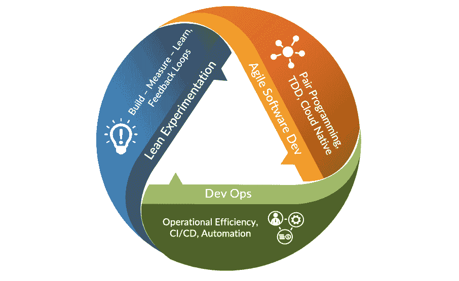

# 第一章：现代平台工程简介

在本书中，我们将深入探索平台工程的变革性世界，在这里，尖端技术和创新流程汇聚一堂，加速软件开发和交付，以前所未有的速度创造商业价值。这一领域已成为塑造数字景观的关键力量，使组织能够更加敏捷、高效和具有竞争力。在这里，你将深入了解平台工程的战略重要性和技术基础，使其成为现代 IT 战略不可或缺的一部分。本章将带你进行一次激动人心的旅程，了解平台工程的演变、原则和战略意义，提供可操作的知识，以增强你的运营和发展能力。

在本章中，我们将探讨三个关键领域，这些领域揭示了平台工程的兴起和相关性。首先，我们将追溯其演变和定义时刻——描绘出将其定位为现代技术组织变革性力量的历史发展。接下来，我们将研究精益、敏捷和 DevOps 之间的相互作用，揭示这些方法如何协同工作，增强平台工程的价值和影响。最后，我们将深入探讨其战略商业重要性，强调采用平台工程原则的规模竞争优势和令人信服的商业案例。

我们将涵盖以下主要主题：

+   什么是平台工程？

+   通过 DevOps 革命改变数字景观

+   DevOps 向平台工程的演变

+   对现有技术的简要分析

+   可操作的要点

准备好掌握在企业管理平台工程复杂性的知识洞察，为你的组织在软件开发和业务价值创造方面带来变革性影响奠定基础。

# 技术要求

本章没有技术要求。对精益、敏捷和 DevOps 原则的基本理解，以及对你的组织客户价值主张和软件开发生命周期的洞察，将有助于将本章中提出的战略讨论和洞察置于适当的背景中。

# 什么是平台工程？

在技术和客户需求动态交汇的地方，一个强大的新范式已经出现，它从根本上重新定义了软件开发和运营的轮廓：**平台工程**。这一创新学科预示着变革性的转变，通过使组织能够精确、可扩展和高效地利用技术，重新构想数字景观。

在其核心，**平台**是一套统一的数字工具和共享基础设施，旨在通过可重复和标准化的流程来创造价值。平台整合了核心组件，例如**内部开发者平台**（**IDPs**），它为开发者提供自助工具来管理他们的工作流程；**基础设施即代码**（**IaC**）用于一致性和声明性基础设施管理；以及自动化的 CI/CD 管道，这些管道能够实现安全的软件供应链并加速高质量应用的交付。

平台工程通过统一开发者和 IT 运维团队围绕共享、标准化和可扩展的基础设施，确保更快和更可靠的软件交付，在此基础上构建。这一学科强调自动化、一致性和自助服务功能，减少运营摩擦，并使团队能够专注于创新而不是管理复杂性。

与像生成式 AI 一样，它通过适应和学习大量数据集来提供定制化和情境感知的输出，平台工程依赖于迭代反馈和响应性。这两个学科都创造了一个促进创新、效率和敏捷性的环境，使组织能够精确和快速地满足动态需求。

例如，生成式 AI 在个性化内容创作领域的革命中发挥了关键作用，它通过学习大量数据集来为用户提供定制化和情境感知的推荐。同样，平台工程在可扩展云平台创建中得到了应用，其系统、工具和流程不断演变，以使团队能够精确和快速地满足不断变化的需求。

就像生成式 AI 通过抽象复杂性来提供直观的解决方案一样，平台工程简化了复杂的发展工作流程，使团队能够更容易地专注于创新而不是运营障碍。两者都依赖于持续的反馈——生成式 AI 通过迭代学习来优化输出，而平台工程则积极寻求并利用持续的反馈循环来优化开发体验和运营结果。

通过填补空白、简化过渡和提升性能，平台工程与 DevOps 建立了协同关系，他们的结合优势放大了人类的创造力和生产力。在当今快节奏的数字景观中，这种共享的适应性至关重要。正如生成式 AI 能够快速产生针对特定挑战的解决方案，平台工程也为团队提供了灵活性，以应对技术和市场变化，确保企业保持韧性、相关性和竞争力。

全球企业都在面临跟上快速发展的数字时代的重大挑战。平台工程，就像生成式人工智能一样，提供了学习和适应的能力，这在如此高度动态的环境中至关重要。平台工程提供的灵活性使得团队能够快速调整策略，以应对市场需求和技术进步，确保他们保持相关性和竞争力。

这种创建和维护软件的方法基于几个基本原理，其中最重要的是确保平台简单易用。这种简单性是解锁软件开发全部潜力的关键。平台的真正美不在于它的复杂性，而在于它如何满足将使用它的人的需求。理解和解决这些需求是有效软件开发的核心。例如，一个设计良好的平台应该显示出开发者生产力的可衡量改进、缩短交付软件的周期时间、提高部署频率，并保持低**平均恢复时间**（**MTTR**）——这些都是其满足用户需求有效性的明确指标。平台采用率和开发者满意度等指标也可以提供有关平台如何满足其预期目的的宝贵见解。

在选择适合工作的正确工具时，选择性至关重要。并非每个工具都适合每个工作，拥有过多的选择可能会使选择最佳工具变得困难。平台工程建议仔细选择少量适合当前任务且与企业目标一致的工具。这种有针对性的方法确保平台满足功能需求，同时优化资源利用，实现运营卓越，并培养持续改进和协作的文化。

平台工程的有效实施需要一种重视反馈并强调持续改进的文化。这种方法营造了一个协作的环境，开发者拥有必要的工具和工作流程来创建和部署与用户产生共鸣的应用程序。然而，需要注意的是，这些平台的成功基本上取决于正确的利用、定期的更新和对反馈的开放态度。

采用这种方法的企业的架构不仅简化了软件的创建和维护，而且还能推动他们在数字化旅程中前进。因此，组织必须明白，他们使用的工具的有效性取决于使用它们的人。通过赋予开发者充分利用这些平台的能力，企业可以实现他们的目标，并保持竞争优势。

我们对平台工程的基础定义

平台工程是连接价值创造和价值管理的学科。它为开发人员和 IT 运维团队提供了一个共享的、标准化的和可扩展的基础设施平台，使软件交付更快、更可靠。

它包括创建和维护支持整个软件开发和部署生命周期的自助工具、服务和平台，从编码到构建、测试、部署和运营。

在以下章节中，我们将深入探讨平台工程对技术进步的影响。这一叙述以协作、自动化和坚定不移的效率承诺为特点，所有这些目标都是为了改善软件开发和运营体验。通过理解平台工程，我们可以策划一场深刻的数字化转型，其影响深远，其利益丰厚，民主化创新并加速通往卓越的旅程。

当我们探索 DevOps 革命的复杂性时，我们还将审视平台工程的演变和战略意义，以及它与 DevOps 的关系。通过这样做，我们将揭示构成这一学科成为现代企业战略基本要素的层次。通过比较分析和可操作的见解，我们邀请您重新想象您技术基础设施的可能性，并拥抱将引领数字 mastery 新时代的原则。

这不仅仅是一章；这是一次邀请，踏上一次承诺重新定义软件开发和运营边界的旅程。在这个过程中，它将重新定义在数字化转型时代真正敏捷的含义。

# 通过 DevOps 革命改变数字景观

技术进步的历史中，充满了重新定义商业价值创造过程的标志性时刻。在软件开发和运营中，DevOps 代表了哲学上的一个根本转变，推动了文化和技术的转型。它不仅仅是流程的简化，而是从根本上改变了我们体验和互动技术的方式。DevOps 是一种强大的工具，它提高了生产力、创新和用户体验。它是现代商业战略的一个关键组成部分，也是数字时代成功的关键驱动力。

在一个被快速技术进步主导的时代，DevOps 的出现被视为一个分水岭，反映了软件开发、交付和维护方式的范式转变。在核心上，DevOps 不仅仅是一套实践或工具；它代表了一种文化和专业运动，体现了软件开发人员和 IT 专业人员之间的整合、沟通和协作的哲学。通过拥抱 DevOps，企业可以解锁显著的好处，包括更快的上市时间、提高的软件质量和增强的客户满意度。

DevOps 成功的关键在于**CALMS**模型，该模型定义了 DevOps 的核心原则，即**文化**、**自动化**、**精益**实践、**度量**和**共享**的组合。此模型强调培养协作文化、自动化重复性任务、通过精益原则优化工作流程以及使用指标推动持续改进的重要性。跨团队共享知识和工具，为透明度和集体责任奠定了基础，确保组织的每个部分都朝着共同的目标努力。CALMS 模型通过将这些原则嵌入到 DevOps 转型的结构中，彻底改变了数字景观，使企业能够快速适应不断变化的需求。

除了 CALMS 之外，**持续集成**（**CI**）和**持续部署**（**CD**）等实践是 DevOps 的支柱。CI 使开发者能够频繁地将他们的代码集成到一个共享的仓库中，其中自动测试确保每一步的质量。CD 扩展了这种自动化，无缝地将更改部署到生产环境中，减少了人为错误，并确保了更快的上市时间。此外，基础设施即代码（IaC）通过将基础设施视为可编程代码，彻底改变了配置管理，促进了环境间的统一性、可扩展性和可重复性。

这些实践与 CALMS 原则相结合，体现了 DevOps 的技术和文化卓越性，从根本上重塑了软件开发和交付的方式。它们共同创造了一个框架，加速了创新，增强了协作，并推动了可衡量的商业价值，为平台工程作为这一变革旅程的下一进化步骤奠定了基础。

## DevOps 的历史——文化和技术的复兴

DevOps 的出现是软件开发运营方面对更大协作、渐进式进步和适应性迫切需求的结果。尽管敏捷软件开发运动取得了成功，但创建与实施之间仍然存在脱节，导致效率低下和延误。术语“DevOps”是由来自比利时的 IT 顾问帕特里克·德博伊斯在 2009 年的首届 DevOpsDays 会议上提出的。这一事件通过促进一种以合作为首要任务、打破壁垒的文化，成为 IT 行业全球复兴的催化剂。DevOps 旨在创造一个软件构建、测试和发布可以快速、频繁且可靠进行的氛围。通过将开发人员（Dev）和 IT 运营人员（Ops）在统一哲学下——并且重要的是，在同一团队中——结合起来，DevOps 旨在培养持续交付、创新和可靠性的文化。DevOps 的重要性在于其能够弥合开发人员和 IT 运营之间的差距，为组织实现其全部潜力铺平道路。

除了其文化影响之外，DevOps 深刻地塑造了现代技术架构。该运动对快速、迭代交付的强调为采用微服务架构铺平了道路，使团队能够独立开发和部署应用程序的模块化组件。与此相辅相成的是容器化技术的兴起，如 Docker 和 Kubernetes，它们确保了跨环境的持续部署并简化了云原生系统的可扩展性。这些创新展示了 DevOps 如何重塑工作流程并重新定义软件系统的设计和运营。

敏捷软件开发的原则深刻影响了 DevOps 的基础。敏捷引入了迭代进步和跨职能协作的理念，DevOps 将其扩展到运营领域。这种敏捷与 DevOps 之间的互动为组织如何处理整个软件开发生命周期的方式奠定了基础。

## 《敏捷宣言》

DevOps 的起源可以追溯到 2000 年代初，当时敏捷宣言寻求改变传统的软件开发实践。最初，敏捷实践成为常态，但软件开发的操作方面需要迎头赶上，导致在业务价值交付方面出现了显著的不平衡。虽然开发者享受到了新的灵活性，但运维人员仍然使用与敏捷精神不相符的过时方法。最重要的是，运维团队往往缺乏了解他们的努力如何有助于实现整体业务目标，导致操作执行与业务寻求提供的战略价值之间出现脱节。这导致了所建内容与业务需求之间的不匹配。这种不断扩大的差距凸显了采取更统一、更全面的软件生命周期管理方法的迫切需要。

敏捷框架，如 Scrum 和 Kanban，在塑造早期软件开发实践中发挥了关键作用，强调了适应性和团队协作的力量。Scrum 引入了如冲刺计划、每日站立会议和回顾等结构化流程，使团队能够以可管理的增量迭代地规划和交付工作。Kanban 通过提供可视化的工作流程管理方法来补充这一点，通过工作在进度中的限制来促进持续交付和减少瓶颈。这些框架赋予了开发团队迅速响应变化优先级和增量交付价值的能力，突显了团队合作在软件开发中的力量。

然而，尽管敏捷革命性地改变了开发实践，但它最初未能解决 IT 的操作方面。现在，开发团队在频繁发布方面变得熟练，但他们往往将工作转交给仍然受传统、僵化流程束缚的运维团队。正如你可以想象的那样，部署频率的增加极大地压倒了运维团队，因为他们没有准备好应对这种快速变化。这种速度上的差异导致了瓶颈和脱节，因为运维团队成为稳定性的守门人，而开发者则推动持续创新。

对软件开发和运维采取统一方法的需求变得越来越明显。这种优先级冲突的动态突显了弥合开发者和运维人员之间差距、促进协作以及建立能够无缝整合两个领域的工作流程的重要性。这种脱节带来的挑战催生了 DevOps，这是一种变革性的方法，将弥合这些差距，重新定义软件生命周期管理，并为一个效率更高、协调一致的新时代奠定基础。

## 弥合差距——DevOps 的诞生

开发团队和运维团队之间的分歧凸显了关键的低效，而仅仅依靠敏捷实践是无法解决的。虽然敏捷赋予了开发者快速迭代和频繁交付更新的能力，但运维团队往往面临着无法适应这种快速变化的系统。这种不匹配和缺乏共同目标导致了瓶颈、发布延迟，并削弱了提供一致客户价值的能力。解决这些挑战需要一种变革性的方法，将开发和运维统一到一个协调和协作的工作流程中。

DevOps 作为这种变革性解决方案出现，通过将开发和运维在共同目标下对齐来弥合差距。在其核心，DevOps 代表了一种文化转变，它促进了协作、同理心和共同责任，使跨职能团队能够共同拥有软件交付的生命周期。这种统一的哲学消除了隔阂，重新定义了工作流程，使团队能够快速、可靠地交付高质量的软件，同时保持系统稳定性。

除去文化因素，DevOps 引入了对通过关键指标衡量性能改进的新关注点。部署频率成为敏捷性的核心指标，反映了团队将代码交付到生产环境中的速度。MTTR 强调了运营弹性，衡量了在事件发生后恢复服务所需的时间。这些指标为组织提供了可量化的基准，以评估和改进其 DevOps 实践，确保技术性能与业务成果之间的一致性。

2009 年举办的首次 DevOpsDays 会议，由 Patrick Debois 领导，标志着塑造 DevOps 运动的关键时刻。它汇集了从业者分享想法、工具和经验，培养了一种社区感，并推动了 DevOps 原则的采用。这一哲学的核心原则是“*快速失败，快速学习*”，它将失败重新定义为成长的机会。通过嵌入自动化测试、持续集成和主动监控等实践，DevOps 使团队能够早期识别和解决问题，最小化中断并加速交付周期。

DevOps 不仅仅是一套实践，它是一种转变团队对待软件开发和运维心态的思维模式。通过结合文化变革、自动化和可衡量的成功，DevOps 已成为现代软件交付中敏捷性、可扩展性和创新的关键推动者。随着组织继续应对数字化转型带来的复杂性，DevOps 成为推动运营卓越和实现业务目标的重要框架。

## 里程碑和增长

我们可以通过一系列显著里程碑来追踪 DevOps 的旅程，这些里程碑展示了其不断增长的经验成熟度。CI/CD 管道的采用标志着 DevOps 方法的开始。CI/CD 管道提供的自动化框架增强了部署的一致性和速度。随着云计算的出现，DevOps 实践得到了进一步的加强，微服务架构变得可行。云平台的高度灵活性和可扩展性使组织能够在开发策略上更加细致和敏捷。多年来，DevOps 不仅达到了新的高度，而且已经融入了 IT 文化的织体。DevOps 的演变对 IT 运营产生了深远的影响，并已成为寻求实现业务敏捷性和创新的组织的关键推动力。

DevOps 的采用被一系列里程碑所标记，这些里程碑突出了其实践的成熟：

+   **CI/CD**: CI/CD 实践的整合是 DevOps 演变过程中的第一步。通过实现自动化测试和交付，CI/CD 有助于最小化人工错误并加速发布周期。CI/CD 管道提高了部署频率，确保了更快、更可靠的更新，并提供自动化测试以早期发现问题，减少缺陷并提高整体软件质量。

+   **自动化**: 自动化已扩展到 CI/CD 之外，包括基础设施即代码（IaC）、配置管理和主动监控。Jenkins、Puppet 和 Ansible 等工具成为 DevOps 工具箱中的主流，简化了 IT 基础设施的部署和管理。IaC 使团队能够通过代码定义和管理基础设施，确保跨环境配置的一致性，并使基础设施变更可追溯和可重复。主动监控工具如 Prometheus 和 Nagios 使团队能够在问题影响用户之前检测并解决它们，从而提高系统可靠性。这些实践共同减少了人工干预，加速了资源分配，并使快速故障恢复成为可能，显著提高了运营效率。

+   **云计算**: 云计算的采用是 DevOps 的一个重要里程碑。它提供了按需扩展基础设施的灵活性，并支持了 DevOps 的快速、迭代开发理念。无服务器架构和 Kubernetes 等云原生技术提供了卓越的弹性和自我修复能力。无服务器解决方案使团队能够专注于部署应用程序而无需管理基础设施，而 Kubernetes 作为一个容器编排平台，优化了资源利用并自动化了故障恢复以减少停机时间。这些进步还通过按使用付费的模型增强了成本管理，允许组织根据实时需求动态调整资源。

+   **微服务架构**：DevOps 实践也与微服务架构的兴起紧密相关。通过将单体应用程序分解成更小、可独立部署的服务，组织实现了更高的灵活性和弹性。这种架构使团队能够独立地开发、测试和部署单个服务，从而缩短部署时间并最小化更改或故障对整体系统的影响。结合 Docker 等容器化技术和 Kubernetes 等编排平台，微服务架构支持可扩展性和故障隔离，使应用程序能够更有效地处理动态工作负载。这种模块化方法使组织能够更快地交付功能并保持高系统可用性。

+   **DevSecOps**：随着网络安全威胁的加剧，将安全实践整合到 DevOps 中，称为**DevSecOps**，变得至关重要。这一演变强调了从一开始就将安全融入软件开发生命周期的必要性。DevSecOps 自动化了安全任务，如漏洞扫描、合规性检查和静态代码分析，确保潜在威胁在早期就被识别和缓解。Snyk、Black Duck 和 Aqua Security 等工具无缝集成到 CI/CD 管道中，使安全成为开发的一部分，而不会减慢交付速度。这种主动方法确保了应用程序的安全性，同时保持了现代 DevOps 实践的速度和敏捷性。

DevOps 对商业的影响是变革性的。实施 DevOps 实践的公司在部署频率、降低变更失败率和减少故障后的 MTTR 方面都取得了显著改进。DevOps 通过培养优先考虑协作和责任感的文化，使企业能够更加敏捷和快速响应市场需求和客户需求。DevOps 不仅仅是一种方法，它是一种挑战企业重新思考和重新构思软件开发和交付方法的心态。在当今快节奏的数字景观中，拥抱 DevOps 对于保持竞争力并向客户提供价值至关重要。

## 精益、敏捷和 DevOps 之间的相互作用

精益方法论通过消除浪费和培养持续改进的文化，为最大化价值交付提供基础。精益实践，如持续改进（Kaizen），强调增量、持续的改进，鼓励团队识别和解决工作流程中的低效。使用看板（Kanban）这一视觉管理系统，有助于团队保持对正在进行中的工作的清晰度，优先处理任务，并确保价值交付的稳定流动。如循环时间（完成单个任务所需的时间）和领先时间（任务启动到交付的时间）等指标是衡量流程效率并识别瓶颈的重要工具。这些实践和指标与敏捷和 DevOps 原则相一致，并提供可操作的见解，以推动更好的决策。

精益通过消除浪费和优化流程奠定基础，确保每个流程步骤都能为客户带来价值。敏捷在此基础上通过将工作分解为可管理的增量，并专注于适应性和客户反馈来构建。共同作用，它们拆除了传统的僵化，创造了一个 DevOps 可以茁壮成长的环境。

DevOps 结合了精益的效率和敏捷的灵活性，弥合了开发和运营之间的差距，将整个软件生命周期封装在一起。通过强调自动化、持续交付和协作，DevOps 加速了敏捷反馈循环，同时保持精益对流程的关注，从而实现更快、更可靠的价值交付。

在实践中，将精益对价值流和流程的关注、敏捷的迭代开发以及 DevOps 的协作文化相结合，将带来变革性的商业影响。成功融合这三种方法的组织可以期待在应对市场变化、交付高质量产品和实现客户满意度方面的能力显著加速。

*图 1**.1* 展示了精益、敏捷和 DevOps 如何交织在一起，突出了加速商业价值的协同、协作关系。这种统一体现在一个持续的循环中，一个效率、创新和适应性的良性循环，它增强了软件开发的每个阶段和交付。精益消除浪费和优化流程的原则通过简化流程和优先考虑价值驱动活动来奠定基础。敏捷通过迭代反馈循环培养适应性，从而完善和塑造开发以满足不断变化的需求。DevOps 将这些努力转化为操作，嵌入自动化和协作以确保无缝交付和可扩展性。这些实践相互强化，形成一个动态系统，持续推动改进和创新。

图 1.1：精益、敏捷和 DevOps 之间的相互作用

精益方法学是这个持续价值交付周期的核心。它基于精益实验的原则，涉及**构建-度量-学习**的过程，强调反馈循环。精益的驱动力是基于客户反馈和数据做出明智的决策，以确保每一项努力都能对最终目标产生有意义的贡献。它侧重于用更少的资源创造更多价值，消除生产中的浪费，并简化商业的各个方面。

接下来，敏捷软件开发需要实施诸如结对编程、**测试驱动开发**（**TDD**）和云原生方法等关键实践。敏捷软件开发依赖于协作、迭代进步和适应变化的能力。敏捷方法通过促进适应性规划和持续改进来消除变革的障碍。客户需求和用户体验成为重点，而人际沟通和反馈比僵化的流程和广泛的文档更受重视。

DevOps 闭合循环，通过其关注运营效率、持续集成/持续部署（CI/CD）和自动化，代表了精益和敏捷的最终成果。它将敏捷的协作和迭代性质与精益的效率重点相结合。它简化了从开发到运营的过渡，减少了将变更引入生产所需的时间。通过自动化重复性任务，DevOps 释放了人力资源，使其能够专注于创新和解决问题，从而实现更快、更可靠的软件交付。

在这个综合模型中，每种方法都为下一个方法提供输入，形成一个自我增强的反馈循环。精益为敏捷的原则提供信息，而敏捷塑造了 DevOps 的实践。反过来，DevOps 使得精益原则能够更广泛、更有效地应用。这种协同效应导致组织能力超过其各部分的总和——能够快速、大规模地提供卓越的价值。这种关系的循环性质成为提供持续价值并适应技术和商业快速变化的强大模型。

## 重要的案例研究

以下案例研究展示了 DevOps 对各个行业的影响，突出了其变革力量和改善效率、安全性和交付速度的有效性。研究这些例子提供了关于实施 DevOps 的挑战和益处的宝贵见解，以及其有可能彻底改变业务运营的潜力。

+   **全球医疗保健转型**：COVID-19 大流行对世界产生了重大影响，导致我们与环境以及彼此互动的根本性转变。全球医疗保健行业面临着前所未有的挑战，影响了医疗服务提供者、支付者和医疗设备制造商。那些考虑数字化转型战略的组织必须迅速适应，以符合新的健康协议并提供无接触、以数字优先的患者体验。医疗保健行业经历了 DevOps 转型，以改进其流程并数字化医疗保健服务。挑战在于将 DevOps 集成到一个非软件中心的环境中，但组织已经成功创建了用于精准医疗数据分析的定制软件应用程序。本案例研究突出了 DevOps 加速软件交付和提升服务质量的可能性，即使在传统上不专注于软件开发的组织中也是如此。

+   **金融服务行业的 DevOps 采用**：金融服务行业，包括金融科技和传统金融公司，在采用 DevOps 方面取得了重大进展，克服了与遗留基础设施和文化抵制相关的挑战。该行业采用 DevOps 实践的成熟度得到了认可，其好处包括更好的发布节奏、更快的部署、以及改进的安全性和合规性。本案例研究突出了 DevOps 在应对金融服务独特的 IT 需求和限制方面的行业影响。

+   **Flickr**：作为早期采用者之一，Flickr 的开发团队以其每天十次部署的口号著名，展示了 DevOps 能够为软件开发带来的敏捷性。

+   **Netflix**：Netflix 转向 DevOps 模型支持了其向微服务架构和云的过渡，使其能够快速扩展并成为今天的流媒体巨头。

+   **Etsy**：Etsy 的 DevOps 转型提高了他们的部署频率，从每周两次增加到每天多次，增强了他们快速迭代产品的能力。

这些案例研究共同展示了 DevOps 在各个行业中的变革性影响，突出了该方法在应对独特挑战和推动服务交付、运营效率和产品质量显著改进方面的适应性和有效性。

# DevOps 到平台工程的演变

平台工程的演变是一个适应性和前瞻性的故事，它作为 DevOps 运动开创的实践和哲学的自然发展。随着组织寻求扩展其 DevOps 实践，它们遇到了重大挑战。虽然将开发、测试、安全和运维整合到单个团队中提高了敏捷性和协作，但这种方法在规模上变得越来越昂贵且不可持续。此外，随着每个团队针对其本地环境进行优化，全局层面出现了不一致性，导致工具碎片化、工作流程不同以及 DevOps 团队的孤立孤岛。以下是 DevOps 和平台工程的高级比较：

| **重点领域** | **DevOps** | **平台工程** |
| --- | --- | --- |
| **主要关注点** | 桥接开发和运维之间的差距，以实现持续交付 | 提供标准化平台，使团队能够高效地构建、部署和运行软件 |
| **所有权** | 开发和运维在整个软件生命周期中的共同责任 | 平台集中所有权，确保跨团队的一致性、可靠性和可扩展性 |
| **团队结构** | 分布式团队，具有跨职能角色，结合开发、运维、QA，有时还有安全 | 专注于为产品团队创建自助服务能力的专用平台团队 |
| **主要责任** |

+   持续集成/持续部署（CI/CD）管道

+   基础设施自动化

+   监控和可观察性

+   事件响应

|

+   构建和维护自助服务平台

+   标准化基础设施和工具

+   自动化工作流程

+   支持多团队协作

|

| **范围** | 团队或项目特定，通常专注于交付单一产品或服务 | 组织范围，旨在支持多个团队和产品，提供统一平台 |
| --- | --- | --- |
| **挑战** | 由于成本和针对本地需求的团队优化导致的可扩展性问题 | 通过集中、可重用的解决方案解决可扩展性问题，以最小化重复工作 |
| **关键指标** | 部署频率、平均修复时间、前置时间、变更失败率 | 平台采用率、开发者满意度、系统可用性、运营成本效率 |
| **工具和做法** | 持续集成/持续部署（例如，Jenkins 和 GitLab CI）、基础设施即代码（例如，Terraform）、可观察性工具（例如，Prometheus） | 容器编排（例如，Kubernetes）、平台 API、声明式部署的 GitOps、渐进式交付工具（例如，Argo Rollouts）和高级监控工具（例如，Grafana） |

表 1.1：DevOps 和平台工程的比较

理解从 DevOps 到平台工程的这一演变至关重要；它突出了仅仅扩展 DevOps 实践不足以满足现代软件开发需求的原因。平台工程通过提供集中化、标准化的平台来解决这些挑战，这些平台能够实现一致、可扩展和成本效益的开发和运营。这一转变使组织拥有了在当今快速发展的数字经济中繁荣发展的强大基础设施和工具。

## 从 CI/CD 到自动化和云技术

CI/CD 的初步尝试代表了平台工程成为主流的早期阶段。这些实践是 DevOps 的基础，强调了在**软件开发生命周期**（**SDLC**）中实现系统化自动化的必要性。随着 CI/CD 的日益深入，其关注点扩展到包括 GitOps、基础设施即代码（IaC）、配置管理、渐进式交付和主动监控，为基础设施管理的全面自动化奠定了基础。从 CI/CD 到更广泛的自动化实践的演变，凸显了 IT 角色的重要转变——从基础设施的守门人转变为创新的推动者。Terraform、Ansible 和 Kubernetes 等工具成为这个新时代的同义词，使团队能够更高效、更可靠地管理复杂系统。

平台工程通过采用渐进式交付等高级方法，在 CI/CD 等基础 DevOps 实践中构建，实现了逐步和安全的发布，通过金丝雀或蓝绿部署等技术。此外，**GitOps**已成为平台工程的核心，允许团队通过版本控制的存储库声明式地管理基础设施，确保一致性和自动化部署。这些创新与 Kubernetes 等容器编排工具相结合，提高了平台工程在复杂系统中提供可扩展、可靠和高效解决方案的能力。

云计算的发展标志着平台工程演变过程中的又一个重要里程碑。凭借其固有的可扩展性、灵活性和多样化的服务，云平台为 DevOps 实践提供了繁荣发展的完美环境。云能够抽象出底层基础设施的复杂性，这对开发者来说是一大福音，使他们能够专注于软件开发，而无需被运营问题所困扰。

云技术的采用推动了向微服务架构的转变，使组织能够在更细粒度、更独立的组件中开发、部署和扩展应用程序。这种架构风格进一步体现了平台工程的原则，强调敏捷性、弹性和应用开发去中心化。

随着云计算和自动化领域的成熟，对管理这些复杂性的严谨方法的需求导致了平台工程（Platform Engineering）的正式化。我们将平台工程（Platform Engineering）定义为一种学科，它为开发者和 IT 运维团队提供共享、标准化和可扩展的基础设施平台，以实现更快、更可靠的软件交付。

在其核心，平台工程（Platform Engineering）弥合了软件开发和基础设施管理之间的差距。它包括设计和管理支持软件开发和部署生命周期每个阶段的自助工具、服务和平台——从编码和构建到测试、部署和持续运营。

平台工程（Platform Engineering）的核心在于关注人的因素——提升开发体验和运营效率。平台工程（Platform Engineering）致力于减少或消除开发过程中的摩擦，使开发者尽可能无缝地将工作带入生产。这不仅加速了创新的步伐，还培养了一种协作和共同负责的文化。

通过提供强大、可扩展且对开发者友好的平台，平台工程（Platform Engineering）使组织能够充分利用其技术栈的潜力，推动运营效率，并使新特性和产品的上市时间更快。

## 平台工程（Platform Engineering）——商业转型的* mise en place*

平台工程（Platform Engineering）的本质与烹饪原则中的* mise en place* 相似——这是一种既严谨又富有创造性的实践。它涉及对烹饪所需的食材和工具进行细致的准备和组织，确保厨师在寻找资源时不会被中断，能够专注于创作的艺术。同样，在平台工程（Platform Engineering）中，这种准备包括建立自助服务能力、创建标准化的基础设施和工具，以及自动化工作流程。这些实践确保了必要的工具、环境和流程随时可用，使开发者和运维人员能够专注于高效地交付高质量的软件。

平台工程（Platform Engineering）在云原生时代基于这些原则，以简化软件开发和部署。通过细致地组织工具和工作流程，它消除了运营瓶颈，使开发者能够专注于编写创新、高质量的代码，而不会被基础设施复杂性所拖累。

就像厨师准备食材并安排厨房以实现最佳流程一样，平台工程（Platform Engineering）负责整理技术栈和简化操作流程。这种准备不仅仅是关于便利性；它关乎创造一个能够孕育创意的空间，让软件工程师能够达到一种*流畅*的状态，从而加速生产力和创新。

通过平台工程的严谨纪律和精益、敏捷和 DevOps 的战略应用，企业能够应对不断加速的技术变革步伐。这种方法确保了，就像在最好的厨房里一样，一切井然有序，赋予团队高效有效地交付商业价值和取悦客户的能力。

平台工程在扩展和实施敏捷性、自动化和协作原则方面发挥着至关重要的作用。它提供了一个框架，在这个框架内，DevOps 实践可以应用于大型组织和复杂系统，确保 DevOps 承诺的敏捷性不会因基础设施和运营复杂性而受阻。

## 平台工程对企业战略的重要性

平台工程已成为企业创新的关键驱动因素。其战略意义贯穿于现代企业，作为运营资产和关键竞争优势。一个组织的平台工程能力决定了其在快速技术变革中的敏捷性和弹性。

平台工程通过自动化基础设施的提供和部署来加速实验周期。诸如自动化测试、回滚机制和 A/B 测试等实践使团队能够快速且安全地验证想法，减少反馈时间并确保更可靠的成果。AWS Lambda、Google Cloud Build 和 Azure DevOps 等云服务增强了这些能力，使无缝扩展和与 CI/CD 管道的集成成为可能。通过培养实验文化，平台工程使企业能够更快地创新并降低风险。

这一基于流程简化和快速迭代的基石，使企业能够将重点转移到最重要的事情上——交付客户价值。随着基础设施复杂性的逐渐淡出背景，组织获得了在竞争环境中茁壮成长的敏捷性。为了做到这一点，企业必须优先考虑平台工程的战略方法。这包括众多好处，以下是一些：

+   **推动敏捷性和创新**：平台工程是企业的变革者。它使公司能够将敏捷性融入其 DNA，允许他们快速转向并持续创新。通过抽象化基础设施和软件交付的复杂性，平台工程简化了开发过程，使公司能够缩短从想法产生到执行的时间。为 DevOps 设计的平台成为新产品和服务的发射台，使公司在市场上获得竞争优势。在当今快节奏的商业环境中，快速转向的能力对于成功至关重要。平台工程为企业提供了快速移动并保持领先于竞争对手的敏捷性。

+   **培养效率与合作的文化**：平台工程哲学培养了一种协作文化，打破壁垒，鼓励团队构建和维护能够预测并按未来需求扩展的平台。推广对这些平台的共同所有权，培养了一种团结、目标和效率感，这对于 DevOps 模式的繁荣至关重要。这种方法使团队能够共同朝着共同目标努力，最终在应对不断变化的企业需求时，提高创新性和敏捷性。

+   **提升开发者体验**：平台工程通过创造一个促进创造力、生产力和创新的氛围，对于优化开发者体验至关重要。提供标准化的工具、基于角色的访问控制（**RBAC**）和简化的 API 集成，减少了认知负荷，使开发者能够专注于创建创新软件。这些平台的自助服务特性赋予开发者自主权，使他们能够获取资源、部署应用程序和访问标准化的工作流程，而无需传统 IT 运营中通常遇到的瓶颈。这种赋权转化为更高的效率和生产力，带来可衡量的商业效益。结果是，开发者体验无缝、高效，旨在最大化生产力，最终导致更好的软件产品、更快的上市时间和更高的客户满意度。

+   **确保弹性和可靠性**：稳健的平台工程策略将弹性和可靠性置于首位。这意味着创建能够承受增加的需求、快速自动地从故障中恢复并保持服务高可用性的系统。连续性和可靠性对于确保不间断的运营和维持客户信任至关重要，这些是任何成功企业的重要因素。实现这些品质需要一个精心计划和执行的平台工程策略，能够预测和缓解潜在问题，最终导致更稳定和高效的架构。

+   **简化合规性与安全性**：随着监管环境持续演变，网络攻击的威胁日益普遍，平台工程已成为现代商业的基石。通过在平台层面实施合规性检查和安全协议，组织可以确保这些关键考虑因素不是事后考虑，而是从一开始就融入开发过程。这种积极的合规性和安全方法不仅保护企业免受潜在的安全漏洞和罚款，而且加强其作为值得信赖实体的声誉。在当今环境中，企业必须认识到，采取全面的平台工程方法不再是可选的，而是生存的必要条件。

+   **推动经济效率**：平台工程的重要性是多方面的，其显著的经济影响是其基础。通过优化资源利用和自动化常规任务，它推动成本节约和运营效率。它还将资本支出转化为运营支出，提供一种更敏捷和可扩展的财务模型，与数字服务消费的变量性质相吻合。因此，平台工程成为一项战略力量，使企业能够在提高其底线的同时，同时增强其竞争优势。

平台工程是现代企业敏捷性和创新的支柱，为企业提供一个可扩展的基础，以适应和超越数字化驱动的市场。它超越了运营支持，成为追求市场相关性和客户满意度的关键盟友。

通过将平台工程视为战略要务，您将创建强大、有弹性的基础设施，加速您的从构思到交付的旅程，确保您的企业在数字时代生存并繁荣。解锁效率，实现无缝协作，营造一个开发者和运维人员共同工作的环境，推动您的企业走向一个适应性和速度与您的品牌同义的未来。

接下来，让我们考察一些可以帮助推动商业价值并成为企业创新战略驱动者的技术。

# 对现有技术的简要分析

支持平台工程和 DevOps 的技术生态系统丰富多样，每个工具和平台都携带着自己的一套优势和权衡。在本分析中，我们将仔细审查关键技术、其功能、集成简便性和与 DevOps 原则的一致性。这项分析绝非全面，只需看看**云原生计算基金会**（**CNCF**）的景观（[`landscape.cncf.io`](https://landscape.cncf.io)），就能体会到数字生态系统的复杂性。

然而，采用和管理大量工具会带来重大挑战。随着工具以非标准化的方式相互连接，依赖性管理变得越来越困难，通常会导致集成复杂性和运营效率低下。组织经常遇到诸如工作流程碎片化、互操作性不足和工具蔓延等问题，这些问题可能会阻碍规模化和标准化实践的尝试。解决这些挑战是平台工程的核心，它强调构建具有凝聚力的平台，在标准化流程下抽象和统一这些工具。

为了导航这种复杂性，我们制定了一套标准，这些标准反映了 DevOps 环境中平台工程的目标和挑战。这些标准作为评估和选择能够推动运营效率和创新、同时最小化复杂性的技术的框架。

## 有效的平台工程标准

为了客观评估众多技术，我们制定了一套标准，这些标准反映了 DevOps 环境中平台工程的目标和挑战。这些标准借鉴了 CNCF 平台工程成熟度模型([`tag-app-delivery.cncf.io/whitepapers/platform-eng-maturity-model/`](https://tag-app-delivery.cncf.io/whitepapers/platform-eng-maturity-model/))，该模型为评估组织间平台工程实践成熟度提供了一个稳健的框架。在此基础上，我们扩展了其基础原则，包括确保平台在实际企业场景中有效性的关键标准：

+   **集成与兼容性**：技术如何与现有工具和平台集成？兼容性对于无缝工作流程和最小化干扰至关重要。

+   **可扩展性**：技术能否随着企业的发展而增长？可扩展性确保了技术可以在组织演变时适应这种增长，而无需进行重大改造。

+   **用户体验**：技术对涉及的各种利益相关者来说有多直观、易用？积极的用户体验对于采用和生产率至关重要。

+   **自动化能力**：技术在多大程度上自动化了流程？自动化是 DevOps 的基石，旨在减少人工劳动。

+   **安全和合规性**：技术是否有助于或阻碍遵守安全最佳实践和法规？安全和合规性加强了企业的防御系统，确保遵守严格的监管标准和最佳实践。

+   **社区和支持**：技术周围是否有强大的社区和支持框架？社区的力量可以表明技术的弹性和潜在的演变能力。

现在我们已经知道了有效平台工程的标准，让我们来看看一些推动企业创新并提升平台工程的热门技术。

## 热门技术

以这些标准为指南，以下技术经常处于平台工程和 DevOps 环境的前沿：

**版本控制系统**（**VCSs**）：版本控制是任何开发过程的核心。像**Git**（**GitHub**或**GitLab**）这样的工具因其分布式架构和分支功能而变得无处不在，促进了协作和灵活性。其他替代品，如**Bitbucket**、**Subversion**（**SVN**）和**Mercurial**，提供了不同的版本控制模型，以满足不同的偏好和项目需求。这些工具的选择往往取决于项目的规模、团队的熟悉程度以及特定的工作流程要求。近年来，**GitOps**的兴起标志着范式转变，将版本控制的作用扩展到基础设施管理。通过利用基于 Git 的工作流程来定义和管理基础设施作为代码，GitOps 确保了声明性配置、可追溯的更改和自动部署，将版本控制直接与现代 DevOps 实践相结合。这种方法提高了操作一致性，并通过共享的、以 Git 为中心的工作流程连接开发和运营。

+   **CI/CD 工具**：CI/CD 工具是 DevOps 工作流程的动脉。**Jenkins**凭借其广泛的插件生态系统，在适应性方面脱颖而出。**GitLab**、**Github Actions**和**CircleCI**为基于 Git 的工作流程提供集成解决方案，满足寻求简化、即插即用体验的团队。现代工具如**ArgoCD**通过结合 GitOps 原则扩展 CI/CD，实现声明性应用程序部署和跨 Kubernetes 集群的无缝配置管理。CI/CD 工具的选择取决于管道复杂性、定制需求以及与更广泛的开发和基础设施工作流程的集成要求。

+   **基础设施即代码平台**：基础设施即代码（IaC）彻底改变了基础设施的提供和管理方式。**Terraform**凭借其声明性语言，在多云环境中表现出色，而**AWS CloudFormation**通常是 AWS 特定资源的首选选择。这些工具在语法、云服务提供商的焦点以及它们管理状态的程度方面存在差异，这些都是选择它们的关键因素。IaC 对于实现可扩展和可重复的环境至关重要。然而，管理安全性同样重要；最佳实践包括使用安全的密钥管理工具（例如**HashiCorp Vault**）以避免在 IaC 文件中硬编码敏感信息，并确保对基础设施的访问仅限于授权实体。采用这些实践将 IaC 工作流程与 DevOps 安全标准相一致，在保持敏捷性的同时降低风险。

+   **配置管理工具**：对于配置管理，**Ansible**提供了一个简单、无代理的设置，使用 YAML 作为其剧本。**Chef**和**Puppet**虽然更复杂，但提供了更成熟、更强调状态和系统配置幂等性的解决方案。是否使用这些工具之一通常取决于团队的专长、对可扩展性的需求以及基础设施的复杂性。

+   **容器编排系统**：由于其强大的扩展能力和自我修复能力，**Kubernetes**（或**K8s**）已成为容器编排的事实标准。每个超大规模计算公司和云虚拟化公司都有自己的 Kubernetes 版本。像**Docker Swarm**和**Apache Mesos**这样的替代方案提供了更简单、但功能较少的选项。这些技术之间的选择通常会受到组织的扩展性需求、现有的容器生态系统以及所需容器编排控制水平的影响。

+   **监控和日志记录**：有效的监控和日志记录对于保持对应用程序和基础设施的可见性至关重要。**Prometheus**提供了强大的监控能力，并且与 Kubernetes 配合得非常好，而**Elasticsearch、Logstash 和 Kibana**（**ELK**）堆栈提供了全面的日志解决方案，在数据可视化和分析方面表现卓越。选择这些选项通常需要考虑设置的简便性、解决方案的可扩展性以及与现有系统的集成。

这项分析并不规定一个适合所有情况的解决方案，而是强调将技术选择与组织需求、目标和能力相一致的重要性。这是一个需要战略眼光与实际执行能力相匹配的微妙平衡。恰当的技术组合可以赋予平台工程和 DevOps 实践以力量，推动效率、创新和弹性。在平台工程和 DevOps 中，每一项技术都是一台运转良好的机器中不可或缺的组成部分。这不仅仅关乎个体的优势，还关乎它们如何结合在一起形成一个统一且高效的平台。最佳的技术组合可以产生更大的效果，从而提高运营效率并增加创新。

# 可操作的经验教训

随着我们探索现代平台工程的旅程即将结束，我们发现自己站在了沉思与执行的分岔路口。我们的航行经历了 DevOps 革命、平台工程的进展、其对企业的意义、与 DevOps 的相互依存联系以及技术的评估。以下是这次探索中获得的见解，为企业利用这些实践变革的力量提供了路线图：

+   **拥抱平台工程思维**：建立一个重视准备、效率和持续改进的文化。为平台工程建立一个卓越中心，以推广最佳实践并在团队间共享知识。

+   **战略性地选择你的工具**：全面分析你组织的需要，并选择能够增强你的 DevOps 实践的适当工具组合。寻找在功能、易用性和集成能力之间提供恰当平衡的工具。

+   **优先考虑自动化**：在你的 SDLC 中识别重复性、易出错或复杂的任务，并将这些任务作为自动化目标。通过 IaC 自动化你的基础设施，利用 CI/CD 进行自动化部署，并实施监控和日志记录以实现持续反馈。

+   **培养敏捷和协作的环境**：通过促进跨职能团队来打破壁垒。鼓励协作和工具、经验以及挑战的共享，以构建一个统一且敏捷的环境。

+   **关注安全和合规**：在整个 SDLC 中整合安全实践。定期进行安全评估，并确保从一开始就符合相关法规。

+   **衡量、学习和改进**：实施度量标准来衡量你的 DevOps 实践的有效性，使用数据来识别需要改进和优化的领域。关注性能和结果驱动的 KPI，如 MTTR、部署频率和变更失败率，因为这些指标提供了可操作见解，以指导持续改进。

+   **测试弹性**：采用混沌工程作为主动的弹性测试方法。通过故意向系统中注入故障，混沌工程有助于识别漏洞并确保基础设施和应用能够承受意外的中断。这种做法增强了你对平台在不利条件下维持可靠性和在线时间的信心。

+   **为未来做准备**：关注平台工程和 DevOps 中新兴技术和最佳实践的演变。鼓励学习和实验的文化，以保持领先。

+   **融入** **mise en place** **哲学**：正如厨师为效率准备他们的工作台一样，设置你的开发环境以最大化生产力。组织你的工具、工作流程和基础设施，以支持快速高效的软件开发。

通过内化这些要点，企业可以踏上增强敏捷性、可靠性和数字时代竞争力的道路。当与 DevOps 对齐时，平台工程不仅仅是运营模型，而且是推动持续价值交付的战略资产，在一个唯一不变的是变化的世界中。

# 摘要

在本章中，我们展示了将精益、敏捷和 DevOps 原则合并以增强组织效率和敏捷性的变革力量。我们探讨了平台工程的战略意义及其在创造竞争优势方面的影响。我们强调选择适当的技术基础以实现这些好处的重要性。

在下一章“架构基础和战略”中，我们将深入探讨设计具有弹性和面向未来的平台架构，这些架构与业务成果相一致。通过这样做，我们为您的企业未来的增长和创新做好准备。

# 进一步阅读

对于进一步了解 DevOps 的基础及其演变，我们强烈推荐以下资源：

+   *《凤凰项目》* 由 Gene Kim、Kevin Behr 和 George Spafford 合著，提供了在实践应用 DevOps 原则的见解。

+   *《加速：精益软件和 DevOps 的科学：构建和扩展高性能技术组织》* 由 Nicole Forsgren、Jez Humble 和 Gene Kim 合著，提供了 DevOps 实践有效性的统计证据。

+   *《DevOps 手册：如何在技术组织中创造世界级的敏捷性、可靠性和安全性》* 由 Gene Kim、Jez Humble、Patrick Debois 和 John Willis 合著，通常是大多数 DevOps 专业人士开始时阅读的第一本书，它提供了 DevOps 的全面概述，并传授了该领域良好的、普遍的知识。

+   *《持续交付：通过构建、测试和部署自动化实现可靠的软件发布》* 由 Jez Humble 和 David Farley 合著，为持续交付和创建出色的部署管道提供了坚实的基础。

+   *《有效的 DevOps》* 由 Jennifer Davis 和 Ryn Daniels 合著，涵盖了 DevOps 的整体图景，并为建立 DevOps 组织提供了一些可操作的建议。

+   *《这 Devops 究竟是什么？》* 由 Patrick Debois 所著，解释了 DevOps 作为一种多学科的方法，通过沟通和协作来改善软件开发和交付。

+   *《敏捷软件开发宣言》* 是一次革命性的号召，呼吁拥抱变化，优先考虑人而非流程，通过持续协作交付工作解决方案，并通过自我反思和适应不懈追求卓越：[`agilemanifesto.org/`](https://agilemanifesto.org/)。

+   *《精益创业》* 由 Eric Ries 所著，倡导一种迭代、以客户为中心的方法，通过持续实验和学习来构建可持续的业务。
