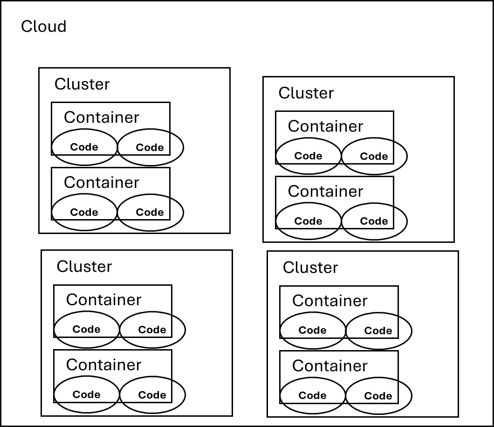
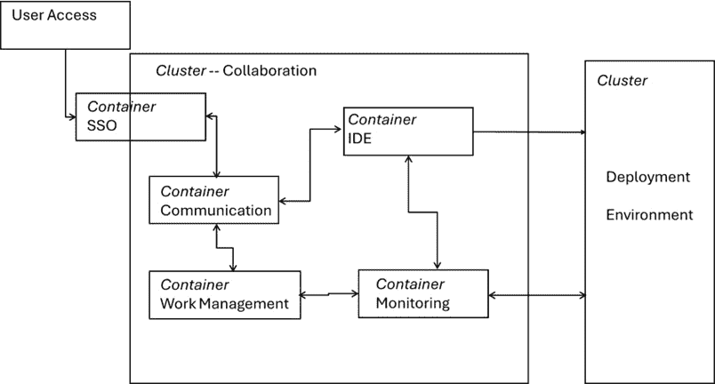
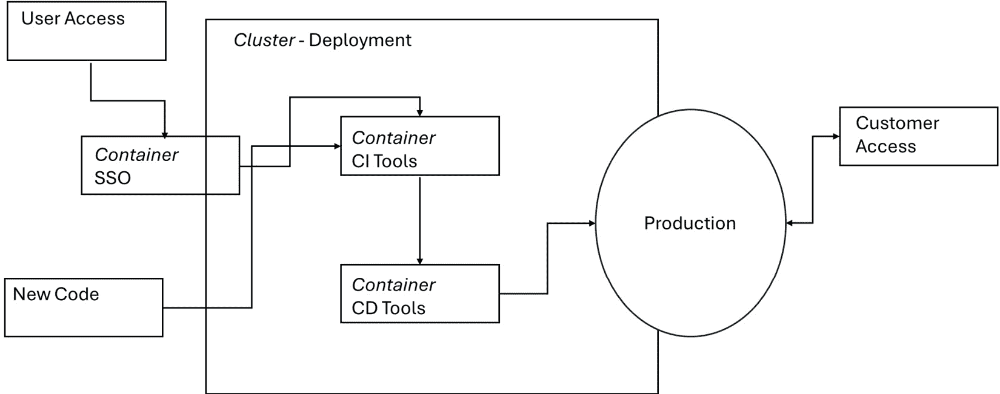
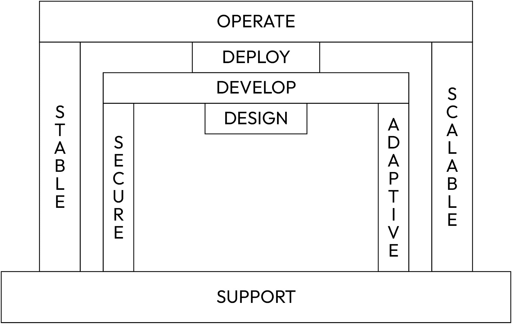
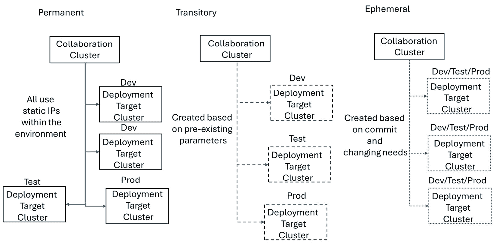

# 第二章：架构基础和策略

软件中的所有内容都遵循特定的标准，从安全到运营，运行平台也不例外。平台使用共享的数字工具和共同的基础设施来最大化价值。了解应用于平台的标准，首先要从基本的云迁移开始；从**亚马逊网络服务**（**AWS**）、Azure 或 Google 中选择云格式；然后从云结构过渡到为 Kubernetes 设置集群。基本标准允许我们在这些空间内设计和实施自定义架构，但架构也有自己的标准。本章解释了如何在云中设置一个具有实用、自定义架构的平台，从而取得成功并满足监管标准。

建立良好平台的一个类比是让别人为你建造工作室而不是自己动手。你需要建一个架子，所以你去了五金店，买了木头、工具和螺丝。回到家后，你意识到你忘记了一些东西，于是又回到了商店。项目变得复杂，花费的时间和精力比你预期的要多。这个过程需要在不同时间抓取多个项目，以满足需求。在构建架构时，你计划工作室需要什么，以便工具可用且安全，你可以完成项目而无需返回五金店。成功的平台在开始时就提供了一切，你无需返回市场，并且保持所有工具的最新状态。本章中的架构概念提供了一些设计最佳平台的选择，以满足用户需求，扩展到多个项目，并最终包括多个平台。

在本章中，我们将介绍构成现代平台基础的关键架构概念。我们将把架构分解成具体的组件，以指导实际实施，并探讨如何扩展和保障这些模型以确保更高的弹性。本章还探讨了在平衡遗留系统与云原生应用时出现的挑战，并通过概述适用于平台不同元素的多种架构模型来结束。

我们将涵盖以下主要主题：

+   核心概念和组件

+   为可扩展性、安全性和弹性而设计

+   从遗留系统到云原生应用

# 技术要求

本节没有技术要求。对架构图的基本理解以及一些基本的 Terraform 知识可能有所帮助。

# 核心概念和组件

在架构设计的初期，从通用框架开始可能有所帮助。无论你在哪里构建架构，任何基于云的战略都包含四个主要领域：

+   **云**：云是后续操作的基本框架，一个可能发生事件的空间，例如 AWS、Google Cloud、Azure 或私有云安装。许多人认为云意味着操作发生在别处，这也是正确的。当你运行私有构建时，虚拟空间就是云，只是在个人服务器上的一个私有云。云包含了在他人服务器上操作所需的所有要求和标准。以下三个组件都包含在初始云中。

+   **集群**：集群聚集了一组可以协同完成任务虚拟机。集群通常使用标准功能，如控制器节点，来整合各种任务。控制器节点管理集群中的任务，以有效确定各种功能的计算和存储。Kubernetes 和 Docker 是用于整合集群的共享服务的例子。集群被设计成像一个单一系统，提供并行处理、高可用性和在广泛功能基础上的平衡资源。

+   **容器**：容器是集群中的下一级。每个容器或容器组可以独立运行或与其他集群中的容器依赖性地运行。容器应该是打包的程序，在单个实例中执行所有依赖项。容器的另一个术语是能力单元。

+   **代码**：最后一层是代码。代码描述了用于向计算机提供指令的语言。容器是用代码编写的，然后执行。

这些区域在以下图中得到展示：



图 2.1：云计算的四个 C

多个容器在集群中运行，多个集群可以在云中交互。在设计平台时，第一个架构选择是选择云。由于平台设计优化了流线化的功能，多云功能可能仍然是一个问题。在云中，平台可以运行多个集群，并根据功能进行设计。提醒一下，平台是一组使用共享基础设施来创造价值的数字工具。一个很好的例子是在集群中有一个**协作功能**，它与为开发、测试和生产设计的其他集群交互。分离集群允许同时发生多个功能。每个集群将包含多个容器来运行特定的功能，如开发环境、版本控制、安全测试或用户管理。

在设计平台时，考虑**开放系统互联**（**OSI**）模型是另一个选项。了解平台中每个工具的需求，可以结构化交互以最大化价值。这些层级的记忆法是*All People Seem To Need Data Processing*，代表**应用层**、**表示层**、**会话层**、**传输层**、**网络层**、**数据链路层**和**物理层**。当查看平台的初始架构时，我们主要关注中间三个层级（会话层、传输层和网络层）。我们假设物理层（原始数据）和数据链路层（数据格式）由初始云处理。我们的主要目标是评估网络；在系统中传输数据；传输；审查集群、容器和会话之间的通信；并在平台内维护工作连接和端口。表示层和应用层虽然重要，但仍然位于外部，作为将可用数据以允许简单交互的格式呈现给用户的最终接口。这些基础考虑通常反映在常见的架构模式中，这些模式提供了理解系统如何交互的基准。在此基础上，本章接着介绍了更多针对现代、可扩展环境独特需求的专门平台架构。

常见的架构应提供扩展的指南。典型的架构指南是**SOLID 原则**。当我们构建平台架构时，这些原则非常重要：

+   **单一职责**：每个架构对象只有一个改变的理由。

+   **开闭原则**：每个元素都对外开放扩展，对修改封闭。

+   **里氏替换**：所有类元素都可以从父类派生，并且仍然提供相同的结果。

+   **接口隔离**：用户不应依赖于未使用的接口。

+   **依赖倒置**：对象应依赖于抽象，而不是反转。

这些原则指导了从单体系统到微服务方法的许多转变，但它们仍然是一个重要的指导方针。关于每个原则及其综合有效性的研究和资料遍布互联网，但这超出了本书的范围；希望这些通用参考能够激发你的思维或引导你找到必要的信息。

## **基本平台**

当整体审视这些原则时，它们显示了平台所需的重要因素。平台应支持各种应用，当 SOLID 基础指导它们的交互时，有助于创建一个具有弹性的架构。

当转换为平台时，我们改变我们的思维方式，从构建整个系统转变为构建部分系统，以使更广泛的设计能够运行。在平台架构中，首先需要考虑的两个重要方面是：

+   如何设计它

+   在哪里显示或实现这些设计

这些方面最好被定义为协作和部署组件。协作环境通常使用一个常见的集群和多个容器来提供功能。部署目标也将是一个集群，具有不同的一组容器，这取决于该部署目标的目的。两者都可以重复扩展以增加弹性和扩展操作，但详细讨论每个方面为更广泛的架构提供了一个起点。

在平台架构设计中，协作组件是首先要考虑的第一个要素。当我们说协作时，我们指的是可以发生协作工作的地点。这项工作包括实际部署应用程序之前的所有元素。从 DevOps 的角度来看，这些是计划、编码和构建的元素。监控应用程序也可以协作，因为它们从部署目标收集信息。任何协作中最重要的一部分发生在团队之间的讨论中，以及建立通信功能。对此的基本支持应包括一些异步聊天，如 Mattermost 或 Slack。这些通信工具为个人团队和多个团队之间的连接提供了方式。

协作的第二个要素是**集成开发环境**（**IDE**）。虽然 IDE 可能像文本编辑器或 VSCode 一样基本，但你可以根据后续平台需求提供 GitHub、GitLab 或 Anaconda 等选项。不同的 IDE 擅长不同的语言，即使在插件软件可以使 IDE 多语言的情况下，也能实现平台定制。一个基本的要求是，选择的连接应该与通信部分相连接，以便 IDE 的提交和更改对更广泛的团队可见。IDE 还应包括常见的安全方面，如模糊测试、静态分析、代码审查和依赖性检查。将这些安全方面作为一个单独的平台元素包括在内是可能的，但最有效的方法是直接与代码相关联。

通信组件和集成开发环境（IDE）与协作的第三个要素**工作管理**相连接。一些 IDE 提供作为嵌入式功能的跟踪工作的方法，但使用像 Atlassian 套件或 Aha 这样的外部工具可能更有益。这些工具通过功能标志、关键任务和与发布版本的连接，允许对元素进行高级可见性观察。此外，这些工作管理工具还应为平台提供知识管理。知识管理包括各种操作指南和自助文章。将工作和知识管理联系起来，为生成式 AI 提供了一个出色的场所，它不仅能找到标准文档，还能在聊天、规划和工作执行中的内部实例。例如，当搜索有关应用 A 的信息时，你会找到操作指南、Slack 中的提及以及 Jira 板上的任务。这些可以相互参照或时间关联，以提供上下文。

**监控**元素是协作环境的一个很好的补充，但不是必需的。监控意味着将一些运营工具链接起来，以展示哪些用户在场并活跃，各种部署目标是如何运行的，当前的更新以及各种其他数据。这些工具通过 Prometheus、Kibana、Grafana、Open Telemetry 和 Elastic Stack 等函数和软件进行链接。这些工具应该为平台用户提供可观察性。

所有这些协作元素都通过一个集成仪表板进行集中管理。这个仪表板允许你在平台上管理用户，观察运营指标，并管理权限。一旦用户建立身份，权限元素应通过一个**单点登录**（**SSO**）应用程序进行集成。这些组件还提供了多个团队之间的隔离，以建立安全性。该应用程序确保平台内的团队只能访问批准的数据。有时，你可能希望所有平台团队都能查看一切，有时，监管或合规标准可能要求在部署目标使用的编码或数据中实现分离。考虑到所有这些元素，以下图表展示了平台内的协作架构示例：



图 2.2：协作组件图

每个功能元素都表示为一个单独的容器，但根据功能需求，它们可以是多个容器或应用程序。例如，工作管理可以包括时间跟踪、项目进度和业务级报告，而集成开发环境（IDE）可能包括安全工具或替代语言。通信也可以包括知识库。

监控责任在这些工具之间共享，贯穿整个协作元素。监控可能出于多种原因，但应通过运营和开发方面受益于可观察性。在应用层面，系统可以集成 Prometheus、**Open Telemetry**（**O-TEL**）或**ElasticSearch、Logstash、Kibana**（**ELK**）堆栈等工具，以提供足够的可见性。云集成也可以使用 AWS CloudWatch、Azure Monitor 或 Datadog 等工具来组合各个部分。监控应提供有关正在使用哪些应用程序、使用程度以及平台在它们使用期间的表现的详细信息。

## **部署组件**

部署组件是指那些从平台部署代码的虚拟空间。这些目标支持测试、发布和部署的 DevOps 功能。与初始元素类似，这些集群是通过基础设施即代码（Infrastructure as Code）和明确的需求定义构建的。尽管这些工作功能遵循协作集群，但应启用单点登录（SSO）以允许直接、安全地访问这些集群。定义提供了一个安全的工作空间。常见的定义包括 Kubernetes 基线、Docker 配置、亚马逊机器接口或特定的 Linux 版本。回到工作坊隐喻的概念，部署环境作为一个受控空间，团队可以在其中安全地测试和发布他们的工作。它提供了在将更改进一步传递到交付管道之前验证所需的稳定性和隔离性，从而加强平台的可靠性并降低部署过程中的风险。

通过实施一个共同的基线来创建部署集群，通常包括仅存在于该环境中的两个功能：**持续集成（CI**）和**持续交付（CD**）功能。CI/CD 工具是平台测试和发布软件的元素。记住，构建部分作为协作环境的一部分出现。这些工具与 IDE 通信，以拉取新的代码更改或接收来自底层平台的推送。一些 DevOps 专业人士认为初始管道是 CI 的最终集成；随着我们构建共同的平台，我们在平台中使用的管道只是第一步。可用的商业 CI 工具示例包括 Jenkins、GitHub Actions、CircleCI、GitLab CI/CD 和 Harness。我更喜欢 GitLab CI/CD，因为它与协作环境中集成的 GitLab IDE 无缝集成。部署环境架构如图*2.3*所示：



图 2.3：部署环境

构建者通常会选择多个工具以防止供应商锁定。供应商锁定可能很困难，但 GitLab 的许多功能足够平滑，允许工具之间的轻松导出。最近，一家知名供应商从开源迁移到订阅模式，要求使用该模式的任何人支付许可费。同时，在平台中频繁切换供应商可能导致集成问题，这也是为什么自建平台需要如此长时间才能实现盈利的原因之一。平台工程的目标是为各种开发者构建一个共同的平台。Azure DevOps 在允许部署到多个环境方面表现出色，无论代码是在哪里构建的，或者管道在哪里执行。

CI 工具确保所有新的和批准的代码更改都能集成到新代码中。这种集成为客户提供的应用程序提供了产品化的版本控制。以下句子中的版本是通用的，并不与任何特定工具相关联。在后台，在协作环境中，你可能正在处理 7.16、7.17 和 8 版本，但发布给客户并得到支持的可能只有 7.15 版本。这是因为 7.15 是经过测试和部署的完整生产版本。在 Kubernetes 实现中，一个有效的 CI 工具可以创建每个版本的独立命名空间，以确保更改的质量。

下一步是实施 CD 工具，以向客户展示所需的版本，在这种情况下是 7.15 版本。当前版本可能有错误修复或安全问题，但不需要新的发布。这些实施通过 CD 进行。CD 自动准备提交的代码以发布到生产环境。这些工具确保每次基线代码更新时，这些更改都能立即到达客户。专注于 CD 的标准工具包括 Jenkins、GitLab、Datadog、GoCD 和 JBoss。ArgoCD 和 FluxCD 是 Kubernetes 解决方案的交付工具。

在许多情况下，找到一个只提供 CI 或 CD 的工具可能具有挑战性，因为许多公司更喜欢将 CI 和 CD 集成在一起。这些解决方案适用于更广泛的应用，但可能在平台上造成困难。在平台上，将 CI 和 CD 功能分开可以创造在多个版本和功能上工作的机会，而不会减慢开发过程。将 CI 和 CD 结合在单个工具中或拆分该功能的决定应该是深思熟虑的，并基于资源、培训和云可用性。DevOps 方法通常包括 CI 和 CD，但不能有效地扩展到单个产品或功能之外。例子可能包括需要外部测试的严格控制的行业，如制药业，或拥有多个遗留系统的大型公司。对于单个团队在一个产品上工作或多个团队在不同项目上工作，集成效果良好，但当多个团队支持单个项目的不同方面时，会变得具有挑战性。下一节将通过可扩展性、弹性和安全性的背景来探讨这些挑战。

# 为可扩展性、安全性和弹性而设计

现在你已经了解了基本平台组件，我们可以讨论这些项目如何调整以适应可扩展性、安全性和弹性。可扩展性关系到我们如何在不变更架构的情况下添加用户和平台。安全性确保只有打算使用平台的人仍在从应用程序中受益。最后，平台应展示 SOLID 原则的弹性，在允许恢复的同时消除未使用云资源上的浪费。这些方面应该是最初设计平台时的关键驱动因素。我在应用新系统时使用的思维框架如图*2**.4*所示：



图 2.4：思维框架

该框架呈现为一个表格，操作元素位于中间，思维支柱位于两侧。可扩展性和安全性被定义，而弹性形成稳定和适应性支柱。每个操作元素的大小给出了用户在这些空间中花费时间的总体趋势。例如，团队应该将三倍的工作时间花在开发上，比设计多，将四到五倍的工作时间花在运营上，比部署多。遵循良好的 DevOps 原则，所有这些功能应尽可能自动化。

## 为可扩展性而构建

我们可以将**可扩展性**定义为平台在改变大小或数量以满足客户需求时继续良好运行的能力。通常，可扩展性适用于需求的增加，但当你需要缩减功能时，你也可以考虑下降趋势。这种可扩展性在考虑具有可变用户基础的平台时尤其相关。你需要迅速改变以最大化高用户数量，但实施自动扩展以在非高峰时段或缓慢的开发期间降低云成本。

向上可扩展性创造了一个更直接的进步；你只需要更多的存储、计算和功能。数据库、消息队列和分析等函数也可能使这些进步复杂化。平台模型支持可扩展性，因为部署集群具有极高的可扩展性。你可以在云中添加更多集群以支持额外的应用开发。内部使用 Kubernetes 命名空间可以在不同的应用程序之间进行划分，但通过 Terraform 等资源进行配置使得生活极为简单。提供编码元素的生成式 AI 支持可以应用于这些任何部分以补充初始编码和解决方案。如果你有部署集群的 Terraform 基础，创建额外的集群就像以下 EKS 示例一样简单：

```py

Module "eks" {
  Source = "terraform-aws-modules/eks/aws"
  Cluster_name = "deployment-target1"
  Subnets = ["subnet-1", "subnet-2"]
  vpc_id = "vpc-54321"
 workers_desired_capacity = 10
Instance_type = "t2.large"
}
```

下一步是运行`terraform init`的命令行，并使用 AWS 应用和配置`kubectl`以响应单个集群：

```py

terraform init
terraform apply
```

这将在环境中初始化 Terraform 实例，以便可以使用工具并评估变量。然后，它将变量应用到 Terraform 代码中，并确保所有字段都支持。如果在 `apply` 过程中出现错误，这意味着变量在支持字段中不够清晰。运行这些集群的 Terraform 实例将使用先前引用的 CI/CD 函数为部署集群配置这些实例。

对于协作集群的可扩展性可能更困难。在这种情况下，可以通过创建额外的容器或更改 CPU/内存限制来扩展容器，而不是创建额外的协作实例。如果您添加额外的协作集群，挑战可能在于同步 IDE、SSO 和工作管理实例之间的工作。许多这些实例都是设计为独立工作的。当添加具有相同用户的多个协作集群时，集成成为主要挑战。然而，那些领域的许多引用工具都是设计为无需更改即可快速扩展的。

扩展的主要指南应该是单个协作集群可以支持任意数量的部署目标。只有在存在安全或基于用户挑战的情况下才应添加协作集群。基于用户的挑战意味着我可能雇用不同的承包商，并且不希望他们能够观察其他团队代码。作为旁注，这些逻辑分离类型也可以通过 SSO 功能轻松扩展和管理。在这些 SSO 功能中，您可以创建不同的权限，并使用 RBAC 防止某些用户与协作节点中某些元素或数据交互。这些考虑导致将安全功能作为平台架构的集成部分构建。

## 设计安全性

**安全性**应该是任何平台设计的首要特性。使用 SSO 已经是一个持续的概念。SSO 实现了一个会话和用户认证服务，允许用户使用一组凭证访问多个应用程序。虽然初始用户凭证通常是用户名和密码，但现代设计应结合**一次性个人识别码**（**OTP**）。OTP 功能会将一个有时间限制的数字发送到外部设备，与用户名和密码一起输入。在初始访问之后，**多因素认证**（**MFA**）提供了一个可行的替代方案。这个标准符合安全理论，即验证来自于所拥有的东西、所知道的东西以及用户内在的东西，例如生物识别。所有平台凭证都应该存储在加密账户中。

对于商业平台，一个单点登录（SSO）的例子是将**开放授权**（**OAuth**）作为一个框架来实现第三方服务之间的用户信息联邦。谷歌采用这种方法，因为一个谷歌账户可以激活多个应用程序和网站。然而，当与平台集成时，其他站点信息是内部维护的，而不是外部可用的。一个常见的例子是在平台上使用**轻量级目录访问协议**（**LDAP**），然后在整个工具之间共享身份验证。这种实现允许设计平台，使得用户可以登录到一个中央协作点，或者直接登录到平台内的应用程序。

如果你是在集成现有的 SSO 系统而不是构建一个，一些商业上可用的应用程序包括 Duo、Okta、AWS SSO、AuthPoint SSO 和 Azure Active Directory。SSO 是一个可以从他人的广泛安全知识中受益的领域。一些 SSO 功能可能仅限于某种类型的云。了解云限制在沟通安全中的重要性对于初始平台架构至关重要。

一旦用户登录，平台内还有另一个需要考虑的元素：我们如何保护数据？为了创建集成，数据必须在多个应用程序中可用，但你仍然应该保留对各种功能的某些控制。数据通常分为静态数据和传输中的数据。在两种情况下，某种类型的加密都可能是有益的。你应该加密访问信息、密码和用户名，这些功能通常集成在一个好的 SSO 系统中。

另一方面，系统中的静态数据、代码和工作管理细节也应进行加密。平台的一个优势是大多数工作都在单个集群内进行。这种基于集群的方法的优势在于内部数据可以在外部访问之前保持未加密状态。这可能有些误导，因为大多数内部数据都会位于加密层中，只是不在同一密钥结构内的用户之间加密。这种加密模型提高了通信速度并防止了延迟。例如，用户在一天中使用的数据在用户登录后会被解密，但如果没有经过批准的登录则无法访问。操作完成后，数据会被备份并存储在加密文件中。当用户第二天开始工作时，他们会登录并继续以前的工作，但任何恢复都会使用加密文件。安全实践补充了备份和灾难恢复，但最终在平台中展示了**弹性**。

## 实施弹性

平台内弹性的第一个例子应该是 SSO 链接到一个协作环境，在第一次登录时，在所有后续应用程序中创建一个工作场所。快速返回到**图 2**.2，操作将是一个初始登录，要求用户提供姓名、密码、OTP，然后将用户链接到一个组织和团队。然后，用户账户将被批准在平台的通信、IDE、工作管理和部署应用程序中工作。一个快速示例如下：

+   用户 – 约翰·史密斯

+   密码 – XXXXXX

+   OTP – 验证器 – 六位数的限时数字

+   组织 – Ostrich

+   团队 – Egg1

+   应用程序 – IDE、通信、工作管理、CI

当信息被输入时，约翰·史密斯会设置一个 OTP 验证器来验证访问权限。系统会将他注册到 Ostrich 组织和 Egg1 团队，用于 IDE、通信窗口、工作管理工具和 CI。这个系统将确保他可以访问这些区域中的团队项目。其他区域可能包括在环境中提供不同权限集的角色，因为有时 IDE 系统会区分可以查看的访客、可以编辑和创建新工作的维护者以及可以合并工作的所有者。架构应仔细详细说明这些区域。

在平台之间建立弹性意味着明确每个平台应用程序的需求，并展示角色之间的对等性。例如，在工作管理系统中的角色可能是敏捷大师或团队领导，而 IDE 角色可能是开发领导或技术审查。理解这些不同组件的限制对于在从一个应用程序移动到下一个应用程序时创建弹性至关重要。这些角色之间的理解越多，平台内应用程序的交互就越好。最佳解决方案是在所有应用程序中使用相同的角色，但与商业功能相比，这可能很困难。

弹性的一个关键方面应该是**恢复**。这种恢复可能是因为用户错误、网络中断或如龙卷风或海啸这样的灾难。恢复涉及准备就绪的备份，可以快速恢复以提供平台的功能。任何弹性平台都应该定期备份主要平台集群及其相关数据。我们必须认识到，在从 IDE 升级回滚、将版本 6.2 移回 6.1 以解决错误，然后恢复用户提交的实例数据时，操作性能之间存在脱节。版本是例子，并不参考任何特定工具。这些方面指向平台必须支持的标准恢复实践。

一个通用的备份过程是**三二一模型**。数据存储应始终发生在三个位置，两种不同的媒体存储类型，以及一个离站副本。这种做法允许多个地方验证重要数据与日常操作。一个有趣的现实世界例子是对一家重要国际船运公司的 NotPetya 网络攻击。当他们开始恢复时，船运公司已经失去了数百个系统，并意识到他们所有的备份系统也都受到了感染。只有公司的一个站点有安全数据可以进行任何恢复操作，这是因为攻击发生时他们正处于维护离线状态。你应该不惜一切代价避免这种情况，因此三二一模型用于在任何系统中生成弹性，尤其是在我们用例中的平台。

可扩展性、结合适应性、稳定性和安全性都应成为扩展到平台架构的基础。这些指南有助于塑造那些初始问题，以构建一个全面的图。下一步是将这种概念理解聚集成一个实际架构，以在组织内部构建或集成平台。

# 从遗留系统到云原生应用

构建平台有两个主要方面。第一个方面考虑你是否在使用云原生系统，第二个方面提供了将各种部署目标构建到架构中的方法。通过回顾六个 R，将简要讨论云原生操作。本节的后半部分解释了如何设计永久性、临时性或短暂性的设计来支持平台操作。

任何迁移到云或云内部的操作，都取决于对六个 R 的理解。作为一名经验丰富的开发专业人士，你可能已经遇到了其中许多，尽管对于许多架构师来说，完整的列表通常是新的。这里列出了一个列表，并且每个 R 将会被更详细地讨论：

+   **Rehost**：重部署有时被称为“提升和转移”方法。它涉及将完整当前环境移动到类似位置，除了在云上。这可能是一次快速迁移，但通常需要修改以达到成本效益或稳定性。虽然这可以帮助平台化的基础知识，但所需的集成量意味着还需要其他策略。这种策略适用于那些只想在云上而不理解其影响的公司。影响可能包括增加延迟、次优资源使用和总体性能不佳。

+   **重新平台化**：作为一个基本概念，重新平台化意味着通过整合当前流程与云服务提供的流程来适应云。正如本书所述，平台工程深入探讨并评估了多种类型的平台，以跨越多个输出。一个 DevOps 概念涉及为每个部分使用尽可能薄的平台。这意味着虽然平台整合了多种技术，但它们应该建立在可能整合独立平台的堆栈上。主要平台评估软件开发，但可以通过多次平台化来整合操作输出、安全、测试或其他功能。每个平台都应支持这些最小功能，以保持可靠性和安全性，并有助于可扩展性。

+   **重新购买**：第三种选择是重新购买，购买另一个云替代方案，或从本地服务器迁移到他人的服务器。这强制执行了迁移的所谓三个 A：

    +   **访问**：通过云服务获得更广泛的系统访问。

    +   **意识**：由于云工具和虚拟机交互，更广泛地了解空间内发生的一切。

    +   **放弃**：通过依赖云服务来执行这些功能，放弃你平台内所有元素的责任。

    重新购买通常发生在用户想要获取访问和意识，但希望放弃管理责任的情况下。

+   **保留**：这与重新购买选项相反；在这里，我们保留我们所拥有的。保留实践可能对低端有益，但在扩展平台时会产生挑战，主要是因为额外的资源并不容易获得。仅仅通过信用卡刷卡购买额外的存储和计算，以及安装新的服务器机架，这之间的复杂性是不同的。

+   **退休**：退休意味着消除一些不再需要的部分服务。它还与下一个选项相整合。

+   **重构**：这意味着重新设计和重建所需的功能。这可以通过通过可扩展性和安全性更改来提高性能。重构的一个常见例子是从遗留系统迁移到更现代的应用程序，这通常涉及容器化软件和应用程序。

平台工程通过关注特定平台所需的元素，将它们纳入一个共同框架，并在过程中消除浪费，解决了这两个挑战。重构在构建平台时可能至关重要，但在购买或租赁解决方案时则不那么重要。大多数商业平台解决方案提供各种可用的插件，支持持续的软件流。

## 重要的平台架构

在考虑了六个 R 原则以及初始云迁移的动机之后，下一步是设计平台架构。这个架构将通过创建一个有空间扩展和所有可用工具触手可及的工作坊来指导后续的设计。有三种基本设计可以开始或继续平台设计，每种设计都专注于开发尽可能薄的平台并支持最广泛的客户群。设计之间的区别主要在于所提议设计的永久性。这三种设计可以简单地标记如下：

+   永久性

+   临时性

+   临时性

下图展示了这三个初始架构模型的构建：



图 2.5：平台架构示例

让我们更详细地看看这些架构。

### 永久性平台架构

**永久性架构**是为长期设计的。目标是设计和运行多个始终为用户存在的集群。系统可能包含一个主要协作集群、至少一个开发集群和一个生产集群。在设计永久性方法时，用户将登录到协作集群，然后通过其他集群推进工作和设计。这种方法为测试和部署代码提供了一个高度稳定的环境。永久性设计通过在 VPC 中使用预定的集群大小来废弃主工具上的负载均衡器。运营管理允许我们在计算或存储成为关注点时添加集群。这种架构的主要优势是已知配置和易于维护。在流程早期就建立具有定义命名空间的固定集群，为固定的培训方法创造了机会。这些设计使用预定的位置和已知的集群进行所有操作。具有明确软件需求或静态关注点的公司可能更喜欢永久性集群。明确和稳定的实例可以帮助通过关闭非必需周期来降低公共云的账单成本。

永久性集群适用于始终需要固定数量的资源。使用已知资源构建测试平台或安全平台是绝佳的选择。永久性测试平台也拥有固定资源，可以用于测试操作或在云中运行函数。这种设计的安全集群提供了一个更受限制的地方来维护安全知识。稳定的集群设计可以证明在集群中维护 RBAC 权限、建立清晰的日志和定义一些已知指标来管理操作更为容易。

采用永久性架构设计的集群在**表示状态传输应用程序编程接口**（**REST APIs**）、无代码应用程序和强大的关系型数据库方面具有优势。由于所有数据都得到维护，集群可以通过依赖多个工具集的现有转换和配置，实现广泛潜在的实施。例如，使用 Istio 在 Pod 之间管理容器安全，或者使用 Crossplane 这样的工具。Crossplane 通过将所有基础设施调用转换为 Kubernetes 原生资源，扩展了现有 API，允许一致性的声明式方法，并减少了开发者单独解决基础设施问题的需求。这种变化减少了用户在实施过程中必须管理的端点。这些永久性平台倾向于通过维护已知良好的管道和插件库来扩展，这些库允许大量额外的应用程序。如果存在强大的依赖库，开源工具可以快速集成并在平台内被所有人使用。

永久性集群的缺点是它们难以快速改变。保持这些集群与新功能和发布保持一致需要频繁使用同一集群的不同版本。当面临系统崩溃或用户问题时，平台内部发生的功能升级可能难以访问。这些问题通常导致公司通过拥有一个与永久平台不同的开发和测试区域来维护平台。只有在你除了在平台上工作之外还在构建和运营平台时，这些崩溃才会成为一个问题。

对于永久性设计的另一个挑战是，在初始部署时将资源使用情况固定化。尽管负载均衡器可以提供帮助，但在大多数情况下，它们被禁用以保持跨集群的稳定运行。一个快速增加所需管道或在不规则时间表上拉取大量数据的设计可能会引起问题。例如，一个旨在寻找给定商品最佳销售价格的系统可能会搜索包括图像和元数据在内的多个数据库。单个应用程序的大量拉取可能会在集群内造成挑战，并减慢其他操作。这些固定设计的解决方案是实施临时设计。

### 临时平台架构

**临时平台设计**仅在需要时调用资源。这些设计在多个步骤中包含自动扩展，但重点在于创建已知的集群，然后根据需要调整这些集群。在临时设计中，另一个架构元素是限制集群，通常通过时间和使用量来限制。协作集群在临时平台设计中充当主要、稳定的运行环境，但它也提供了灵活性，允许用户在出现特定需求或工作负载时启动额外的集群。这些集群将有一个到期点，例如三个月，低于一定的计算使用量，或者在不活跃用户或类似的基于指标的决策点上。例如，当在合作设计新设计时，我可能会达到需要部署测试段的地步。然后我会使用集群启动应用程序来启动 CI/CD 功能 72 小时。这种启动可以在 72 小时内将开发推进到永久位置，但如果操作未完成，集群将回滚。当你面临众多问题时，这可能会令人沮丧。

临时设计的优势在于了解成本。您可以通过多个季度实施对启动集群和项目成本的限制。另一个优势是未使用的资源总是被消除。这些设计在创建集群时往往具有强烈的观点。限制性意味着可用的设计选项较少，但如果您已经知道定义的工作空间，这可能是有益的。想想看，就像你已经知道车间只需要生产架子一样；没有必要维护能够制作碗、鸟屋或雕塑的机器。这些限制可以限制集群，但往往也会使其更加专注。

临时设计非常适合仅需要在定义时间段内使用的项目，例如支持零售销售、活动管理或会议期间的支持的软件。一家公司可能希望能够在会议上启动许多演示，但之后不再需要这些功能。这种设计确保了那些额外的集群在不再需要时消失。第一个缺点是，在那些集群上构建的一切最终都会消失。虽然代码可能得到维护，但在操作中的特定方面将不再存在。您可以对测试集群实施临时方法；当您调用测试时，运行这些操作的集群将运行测试，传递数据，然后关闭。这些操作指南对于管理资源可能是有益的。

一个短暂的集群的第二个缺点可能在于管理操作。尽管你知道集群最终会退出，但设置这些参数可能很困难。如果参数设置得太高，你完全可以使用永久性架构；如果参数设置得太低，那么需要完成的工作将无法完成。如果所有必需的工作在最后一步消失，用户必须回到流程的开始，他们可能会非常恼火。这种恼火也可能发生在短暂的平台上，当扫描被设计从这些集群启动时。有时，如果集群在安全工具完成之前退出，这些工件就会丢失。

### 临时平台架构

第三个架构模型是**临时设计**。与短暂设计类似，它设置了一个最终会消失的集群。与短暂方法的既定指南不同，临时集群利用了灵活的负载均衡。临时集群仅设计用于在提交后构建，然后有一个设定的过期时间。无论你是使用开发、测试、运营还是安全平台，这些集群都会启动以完成一项任务，然后自行删除。这种集群创建允许任何用户在任何时候创建任意数量的集群作为部署目标，但使用活跃用户等指标来决定何时终止操作。

使用临时集群的一个关键是要确保日志功能报告给协作集群。与该集群相关的任何数据都会消失，因此任何长期指标或评估都需要在其他地方报告。你可以看到运行操作平台临时启动集群以检查性能、报告结果，然后废弃以最小化云使用的优势。这最适合预算紧张或不确定未来支出计划可能包含哪些内容的客户。

临时集群最适合经验光谱两端的用户。对于那些经验最少的人来说，使用具有临时设计的平台可以让你在不进行完全承诺的情况下探索平台属性。相反，那些确切知道他们想要什么以及持续多长时间的人可以有效地使用临时平台来控制成本。一个挑战是每个用户都必须确切知道他们想要什么。在永久方法中，运营团队设置部署目标；在短暂方法中，可能存在运营团队和单个用户之间的混合方法；在临时架构中，每个用户都设定自己的需求。通过为各种临时集群提供模板，可以减轻这一挑战。然而，设置模板过于宽泛会让我们回到设计临时集群，并以短暂方法运行这些功能的操作中。

短暂性设计最大化了许多 DevOps 概念，如创建高可用性、低耦合和易于配置更改。这些设计不适合生产环境，因为它们通常不足以持久。低耦合表现为每个临时环境都包含前进所需的所有元素。

每个架构设计都提供了一些好处和一些挑战。作为一个个人方法，我会为内部开发和运营使用永久性结构，为测试和安全使用临时设计，然后为研发使用短暂性平台。每个组织都有自己的需求和需求。理解结构之间的差异可以帮助您快速识别所需的任务。这些可以结合考虑所需的工具、入口和出口路径以及版本更改。

当通过平台实施时，这些架构的另一个有益方面是能够实现自助服务。理解基本架构，然后与生成式 AI 结构合作，允许每个用户通过平台在多个级别上支持自己的需求。架构定义得越明确，自动化助手的能力就越强，这增加了完成的工作量，并减少了必须多次完成的日常任务的辛劳。

# 摘要

本章首先解释了实施平台工程所需的关键架构概念。您从 SOLID 原则开始，然后根据平台需求扩展这些功能。平台相对简单，基本架构包括协作集群和部署目标。整合这些概念允许您最大化 DevOps 文化构建，以获得一致和重复的质量。

然后可以将初始架构定位以优化可扩展性、弹性和安全性。可扩展性便于在两个方向上调整资源使用，以最大化利润，而不是无价值地旋转集群。弹性的结构确保这些平台在面对来自有缺陷的代码、不断变化的依赖关系甚至物理灾难的外部变化时仍能正常运行。在当今数字景观中，安全平台对任何运营商都是必不可少的。信息可能希望自由，但我们还必须优先考虑保护客户数据免受不道德的使用。我们还必须能够保护我们的知识产权，以保护长期利润。

最后，所有架构概念都整合到转向云原生解决方案，然后部署永久性、临时性或短暂性结构到我们的平台。每个选项的可扩展性不同，结合了弹性和证明了安全性。这些平台可以用于开发功能、安全任务、运营需求或测试各种结构。

这些设计引导我们进入下一步：确定现有的文化是否能够支持平台转型。毕竟，DevOps 不仅仅是一个技术解决方案，而是一种文化解决方案，所以下一章将涵盖确定最适合的文化和领导策略，以充分适应平台工程的成功。

# 进一步阅读

+   Malik, U. (2024) *使用 Terraform 配置 Amazon EKS 集群*。
