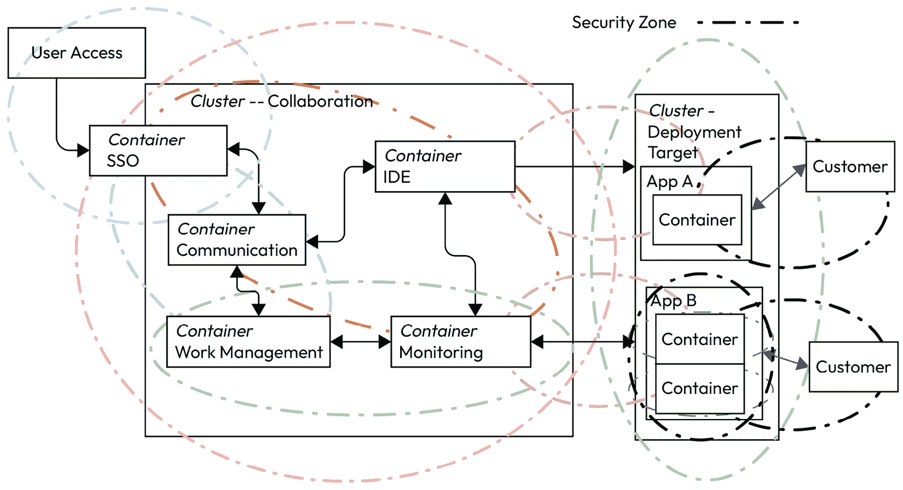
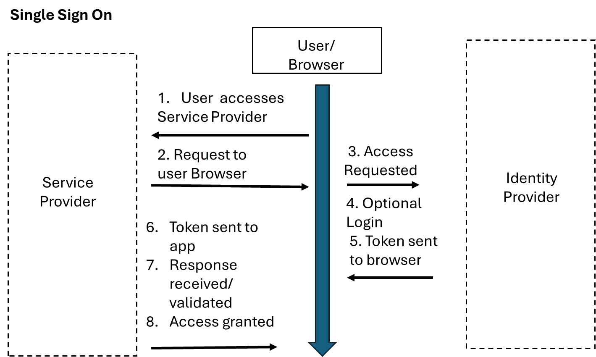
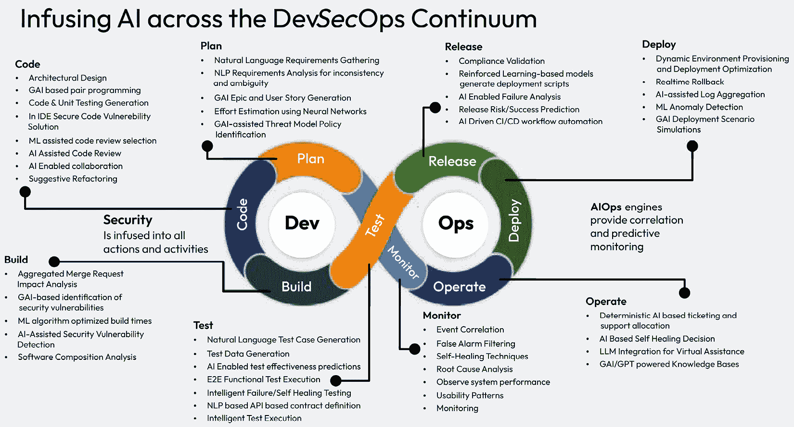

# 第七章：安全、合规性和风险管理

DevOps 通常以**DevSecOps**的形式出现，以强调安全，但任何运营解决方案都需要安全。构建平台侧重于交付价值、允许他人开发并从端到端进行保护。平台提供了提供默认安全解决方案的机会，包括漏洞跟踪、软件物料清单和补丁解决方案，在软件到达客户之前。全面的网络安全和风险管理解决方案还管理连接到平台的人员，特别是在 PaaS 和 SaaS 解决方案中。为了进一步加快交付，AI 工具可以影响安全结果，防止不可避免的手动失败，并支持全面的风险解决方案。

关于计算机和软件开发的问题通常需要提供一个安全的产品。最安全的系统是没有连接的系统。然而，虽然保险库中的硬件可能几乎无法访问，但它也没有任何用途。拥有功能性和有价值的软件意味着拥有连接，而这些链接创造了风险。本章不是关于管道或 CI/CD，而是关于使平台支持这些最终行动。

在本章中，我们回归到安全基础，以创建默认安全的基础平台并管理任何额外的风险。以下主题将得到涵盖：

+   设计默认安全平台

+   网络管理和安全实践

+   利用 AI 进行安全增强

# 技术要求

本节没有具体的技术要求。对架构概念、安全扫描器和**身份和访问管理**（**IDAM**）的基本理解将有所帮助。

# 设计默认安全平台

设计默认安全平台始于这样一个想法：保护平台考虑了内部和外部威胁。安全始于两个基本思想，所有安全工具都存在是为了发出警报表明有事情发生或防止事件发生。有时，将保护和警报结合起来，即存在警报，然后保护措施就会实施。这个想法类似于银行保险库收到警报，然后大铁栅栏迅速关闭。

这种想法随后成为平台构思。构思作为一个概念，考虑进一步形成思想或想法。今天，每个人都寻求使用 DevSecOps 和敏捷实践进行安全的软件开发，所有这些都在向左移动。尽管向左移动，但安全仍然被附加到流程中，而不是成为交付的一部分，并且没有交换来调节应用程序开发中功能和安全的价值观。 

平台整合了个人体验安全实践的想法，然后转向定义创建安全工作的指南，最后将这两个概念结合起来，以建立一个默认安全的平台。在开发平台安全时，所需的安全功能不是附加的，而是形成初始核心设计。项目经理区分了*安全*和*功能*。安全是增加合规性、访问、授权或监管要求方面的方面，而功能标准则更紧密地与项目所做的工作相关。从开发者的角度来看，所有功能都是功能；它们只是完成不同的目标。作为安全功能，向左移动的概念在*第一章*中作为平台工程的基本概念出现。

平台安全模型依赖于具有外部可观察性、内部集成和最终用户实施视角的功能。安全扫描和仪表板应该成为执行过程的一部分，而无需考虑任务。问题永远不应该是扫描是否运行，而是运行了哪个扫描以及结果是如何显示的。就像早期架构要求一样，安全始于关于*要保护什么*、*如何保护它*以及*是否存在安全*（即证明安全存在）的问题。提出这些问题开始将平台的多个任务整合到一个共同的安全框架中的元方法。这种共同集成支持软件价值链。仅仅保护初始登录、框架中的一个文件或单个漏洞是不够的。全面的平台安全通过建立围栏、增加一个门，然后在摆动的门上挂上铃铛来解决所有问题。

所有安全实践都应作为敏捷软件开发的一部分开始。上面，我们提到开发者看不到开发、运营和安全功能之间的区别。所有项目都只是一个具有特定结果集的功能。当构建默认安全平台时，部分问题应该是需要多少安全。安全专家会详细说明总是需要更多的安全，但有时安全存在于基础或第 8 层人类，而不是集成另一个工具。"第 8 层人类"指的是七层 OSI 模型，以幽默的方式指出与系统交互的人类是第 8 层。任何价值链的第一步是评估价值如何影响整体目标，以创造有利可图的产品和服务的。安全观点可以根据个人对目标的看法发生根本性的变化。这些变化需要广泛的介绍，以了解思考安全体验如何阐明对平台的了解。

过度的安全措施可能和不足的安全措施一样有害，它对用户数量的风险而非活跃用户的风险构成威胁。错误类型的安全措施，以及将动态工具添加到内部数据库中可能会增加成本并降低性能。无法在安全工具中创建可观察性可能会捕捉到问题但阻止了解决。安全理念背后的思想与实际实施同样重要。这些初始领域在团队、组织和企业层面分解为人员、流程和技术。每个领域都提供了解决方案，这些方案会影响平台的结果。

## 安全理念基础

思考思考是一个元概念，最好通过应用现象学视角来理解。现代现象学的概念，作为一种哲学实践，起源于笛卡尔，作为苏格拉底方法的后续。现象学表明，所有方面都集中在事物本身上。在这种情况下，事物（例如，安全）受到创造、观察和经验的影响，以形成层次化的理解。平台的创造通过共享开发，观察来自内部和外部用户，以及平台结合功能时的安全体验。

现象学思想表明，所有经验，以及一个人对这些事物的体验，包括概念，都始于过程观察者。只有通过理解观察者的视角，一个人才能建立理解。理解的三个核心方面是*事物的存在与缺失*，*通过表达和表达的艺术品表现出的多面性*，以及*在体验中澄清部分与整体*。现象学并不创造新的理解，而是试图澄清现有的体验作为理解。

虽然这些术语可能有些晦涩，但它们很容易应用于平台安全。在存在与缺失方面，一个人评估安全如何在不同协作或部署目标内的不同元素之间相关联。在体验中身份的根本原因反映了**单点登录**（**SSO**）、身份管理工具以及作为**基于角色的访问控制**（**RBAC**）或**基于属性的访问控制**（**ABAC**）控制一部分所表达的角色需求。最后一个元素，部分与整体，在平台安全中至关重要。一个人可以保护单个工具或多个工具，以改变各种应用程序中的平台级别。想象一个重叠的圆圈网，每个圆圈保护一个特定区域，并在穿过一条线时需要控制元素。*图 7.1*显示了从高级别看这些安全视角可能多么令人困惑。

图 7.1 – 安全控制区域：理论

每个圆圈代表不同区域可能具有的不同安全考虑。用户通常从外部访问开始，然后移动到内部和横向访问，跨越环境。在远端，客户也有对生产元素的外部访问。从左侧开始，初始访问区域需要用户和密码安全，集群需要身份和内部数据保护，监控工具可能需要与普通开发者分离，部署目标中的应用程序需要容器级别的保护，然后是来自使用网络应用程序的客户进行的监控和保护。一种常见的攻击方法，**SQL 注入**，利用将某些字符放入程序输入的能力来影响程序执行。必须在允许平台上的创建自由的同时阻止这些区域。理解这些区域需要了解您平台的概念安全模式。

扩展到概念安全时，对真实事实与假设的看法有所不同。概念安全通过去除外部观察者的视角，与“事物本身”的经验相关联。笛卡尔通过关于事物的沉思将他的信仰与物理联系起来。另一位哲学家，埃德蒙·胡塞尔，在分析观察中区分了物质内容和逻辑普遍性。只要没有使用批准的入口，外部观察者看到的是栅栏还是护城河并不重要。这些区分在构建平台安全时得以延续，通过识别已知为真实的事物、应该为真实的事物以及当整体元素为假时采取的行动。

编码允许比哲学更清晰地定义经验性的工件。我们建议这些区分在评估安全时是有效的，因为很少有人能区分安全概念和开发提供的物质表示。在较高层次上，可以快速考虑三个常见的安全区分：*合规性*、*技术护栏*和*漏洞*。每个都提供不同的构建方式，但用户都将其体验为一个默认安全的平台。

一个常见的例子是从观察物理现象开始，而不是更具挑战性的概念理解。胡塞尔使用“直观”一词作为基本概念，因此直观还原扩展了我们对核心概念的理解。当观察一张桌子时，它根据观察可能包含多个物理和概念上的直观层次。根据一个人在物理上观察桌子的位置，它可能是一个矩形、菱形，甚至三角形。从概念上讲，桌子可以是一个吃饭、会面或为以后使用保存物品的地方。一些桌子支持游戏、拼图或其他用途。直观理解可能就是桌子的本质与桌子所拥有的能力有关，无论是智力上的还是身体上的。同样的，对于安全概念：每个安全工具都必须保护或发出信号，挑战在于创造有效且相互关联的工具。

### 人员、流程和技术安全

对于安全，直观理念是从基本的具体对象或理念转向通过减少到核心组件而得到的纯粹本质。这种理念在审视安全时适用：它是否看起来像一张减少风险的舒适毯，涉及不同阶段的个体，或者是一个解决漏洞和挑战的技术解决方案？在 DevOps 视角中，人们添加观察层、管道工具和与客户、经理和产品所有者的外部互动。每个区域作为一个单独的部分，通过直观还原描述结果，并展示功能，作为一个整体运作。

安全理念始于人。没有人的描述，就无法体验（不考虑未来可能的 AI 选项）。组织从多个领域招聘具有角色、技能和才能的人。个人的背景创造了他们的经验视角，这些视角影响安全结果。每个人通过根据个人视角判断安全来创造价值和对价值的理解。

为了从深奥的理论回归到实际物理层面，公司通常使用**红队评估**来衡量安全级别。红队是一组被指定试图渗透平台、系统甚至建筑周围安全防护的个人。许多红队从要求在平台内植入软件开始。然后，会禁用可能阻止该物品正常工作的安全区域。然而，这从根本上改变了体验，因为那个根元素在初始构建中并不存在。这种想法等同于只测试前门，而忽略了院子的栅栏、看门狗和地雷。

开发者可能带着没有开发经验的安全经验，在一个经历过多次安全漏洞的公司工作，或者花费无数小时追逐漏洞。运维人员可能希望通过安全措施减少待命时间，简化修复，并最小化停机时间。产品负责人可能希望销售更多产品并建立公众形象。客户可能想知道他们的公共数据是否受到保护。每个人都带来了想法，一个领域被细致地缩小以考虑部分和整体、身份和存在与否，在解决其他层次之前。

思想可以是一个单一事件，也可以是整个过程的总和。过程将各个部分整合起来以实现最终目标。过程将多个任务整合起来，为每个任务创建代表其的工件，并构建关于如何进行保护和信号传递的理解。这些工件的存在与否定义了它们如何体验整体任务。所表达的身份反映了是否进行了安全扫描、扫描是否完成以及补丁如何影响体验。

此外，必须考虑安全过程是否构成一个整体体验，或者仅仅是构成整体元素的过程的一部分。在平台上，安全体验应该是整体的一部分。由于个人元素中存在人和技术，流程可能会加速或脱轨。

在今天的网络安全环境中，最终评估的元素必须是技术，无论是开发流程还是增强人员。技术包含物质元素，但对平台体验至关重要。在本地、云或移动系统中，特定的安全要求可能会改变个人与这些元素互动的方式。本章后面的部分将关注实施的技术组件，理解到人和流程都可以改变技术。例如，如果一个人把钥匙挂在锁上，门的安全性可能永远无关紧要。

我们常常在没有充分理解人与流程的相互作用的情况下，将技术故障归咎于技术本身。在许多方面，*DevSecOps*、*PaaS、IaaS、CI/CD、基础设施即代码*和*配置即代码*等概念都是以前以塑造用户交互的方式提出的。平台通过创建具有特定体验的特定平台来扩展这一点，这些体验是为了实现安全结果而定义的。变量仍然存在，看那些定义性术语是否能够传达与各种工具互动的经验。在某些情况下，使用一些更先进的工具和指标，可能可以检查技术如何体验用户，就像用户如何体验技术一样。理解这些体验指导了下一两个部分，即必须保护什么以及如何保护这些元素。

## 要保护什么

在理解了概念方法之后，设计我们默认安全平台的问题应该是：*我在工作空间中要保护什么*？首先需要保护的是**外部访问**。定义外部访问描述了允许平台间以及安全架构中不同圈层之间传输的过程。每个圈层都表现为一个**信任圈**，圈内的成员可以做出更改，与其他圈层通信则需要通过技术握手达成共识。这些访问与不同元素内部的**内部漏洞**相平衡，防止漏洞在部署的软件中释放。最后，必须保护**静态数据**和**动态数据**。操作工具开展业务和用户管理数据的方式都对安全结果至关重要。

### 外部访问

外部访问存在于两个地方：最初访问平台以及穿越不同的元素。这种访问还可以扩展到程序内的依赖关系，后来被称为软件物料清单。初始安全决定了谁可以登录查看平台，并决定他们可以访问哪些区域。将外部安全想象成购买游乐园的门票；初始访问允许进入游乐园，但游乐设施和游戏需要不同的门票。一个人可以在入口处或到达所需区域时购买门票。

在实施整体架构时，初始安全应该是主要协作平台，创建一个可以查看所有潜在项目但编辑属性有限的用户账户。在 RBAC（基于角色的访问控制）中，不同的用户角色如开发者、经理或管理员可以限制访问独特工具或工具内属性的能力。应根据工具类型将角色细分到不同的元素中。一个常见的初始例子通常来自 IDE。可能希望开发者能够创建分支、分叉仓库并编写代码，但限制合并权限给批准的个人。同一个人可能被批准在项目中工作，但不能创建新项目。这种安全机制会记录发生的事件，并防止潜在的错误。

在不同的元素之间进行遍历需要交换工件。一个元素之间的令牌应该赋予第二个元素权力，并允许交换受信任的数据。其中一些可能更多地成为内部漏洞，但初始结构需要设计每个元素需要哪些元素。一个典型的例子是**软件物料清单**（**SBOM**），许多生产元素都使用这个工件。这个工件编译了软件使用的所有依赖项，通常以文本格式，但详细说明了软件使用的特定链接。这些工件包括库版本、最近更新，有时还包括软件成功所需的元素。理解外部漏洞有助于将它们转换为解决工具内部漏洞的方法。

### 内部漏洞：常见漏洞与暴露和修补

内部漏洞是指软件任何元素中固有的。它们不是外部依赖的一部分，而是所需软件内部的元素。这些可以是软件中的属性，例如允许创建其他工件、存在嵌入的秘密或允许恶意或误导性转换的错误。如上所述，SQL 注入是工具内部错误的一个典型例子，即使是集成到平台中的工具。SQL 注入是指某些软件将程序内的条目视为代码，执行命令或允许未预期的功能。

平台的一个优点是，整合各种工具可以减少内部错误潜在的范围。从先前的元素中高效地设置 RBAC 可以防止不同工具之间权限的升级。例如，一个允许在 IDE 中从用户权限升级到管理权限的错误，需要不同的访问点来允许在部署或管理堆栈中实现类似的访问。这些内部控制是平台不同工具之间的一种最佳实践。

为了确保最佳性能，应关注当前的**通用漏洞和暴露**（CVEs）和所需的补丁。美国政府赞助 CVE 库（cve.mitre.org），并使用 Mitre 公司来在工具中传播错误。任何人都可以提交 CVE，大多数公司都会迅速响应以减轻任何已识别的威胁。最近的针对美国政府的 SolarWinds 黑客攻击（2023 年）之所以可能，仅仅是因为一些客户未能对系统进行必要的补丁更新（[`www.techtarget.com/whatis/feature/SolarWinds-hack-explained-Everything-you-need-to-know`](https://www.techtarget.com/whatis/feature/SolarWinds-hack-explained-Everything-you-need-to-know)）。SBOM 是初始指南，但平台维护者应努力确保所有系统都拥有最新的更新和补丁。从安全角度来看，持续开发的一个原因是为了确保潜在的黑客没有足够的时间在软件中找到并利用漏洞。如果支持这些应用程序的数据没有得到保护，即使是最优秀的补丁也无法提供帮助。

### 数据

保护数据分为两大类：静止数据和移动数据。当数据包含在部署目标或集群内部时，平台内的数据应被视为*静止*；当数据在集群之间或网络中移动时，则被视为*移动*。尽管数据在容器之间移动，但可以通过建立共享存储库和数据库来在集群内部静止地保护数据。权限共享通过令牌和前面讨论过的 RBAC 控制来实现。在集群内部共享令牌的合理性是为了最大化每个用户的易用性，以及在用户之间团队合作时。

在集群内部构建共享数据不会阻止创建个人数据站点。在某些特定点上，即使是在共享资源上，不共享团队或个人之间的数据也可能是有利的。实施 RBAC 在这些解决方案中仍然有效。实施有效的数据安全允许创建与个人之间共享的数据相关联的加密密钥。

这种模式确实为恶意内部人员打开了可能性，那些在集群上拥有权限并采取不当行动的人。一些行动是技术性的，例如锁定不同的区域，而另一些则是基于政策的。技术解决方案相当于更严格的 RBAC 控制，这可以防止平台作为 DevOps 基础运行。这些个人的首选解决方案是政策性的，不允许离职人员访问，并制定全面的用户行为规则。首选政策之一是最小权限，确保用户永远不会拥有完成工作所需之外的访问权限。然后，当发生不良行为时，可以通过技术信号来缓解政策解决方案，而不是停止可能在某些情况下是好事的事件。

## 如何保护平台

存在几种标准方法，可以通过技术手段有效地保护平台。第一种方法，如前所述，是使用经过验证的用户目录实现 SSO 工具。之后，加密方法可以大大提高数据的安全性，防止密码滥用，并保护代码，即使在生产环境中也是如此。最后，作为平台操作结构和安全工具的一部分，实施的小工具可以防止新的安全问题到达平台或在整个功能中传播。这些小工具包括平台上的扫描器、监控部署的应用程序以及防止错误到达生产的管道工具。

### 单点登录（SSO）

SSO 应用程序创建了一种身份验证方法，允许用户使用一组凭证访问多个网站。与此相反的是，需要不同通信但存储所有元素在同一位置的密码管理器。SSO 过程的示例见*图 7.2*。

图 7.2 – SSO 过程

密码管理器会在连接开始之前出现，在*阶段 4*为**可选登录**提供输入。**身份提供者**允许主要连接或根据密码验证更高级的访问。返回的令牌然后告诉服务提供商要释放哪些属性。这些身份属性通常通过身份验证协议与 SSO 对齐，通常是**轻量级目录访问协议**（**LDAP**）或**安全断言标记语言**（**SAML**）。

LDAP 提供了一种行业标准来管理目录信息。这些功能通常与建立令牌分开，但会验证特定登录是否具有使用令牌的权限。作为一个过程，一个平台可以建立包含用户名和属性的 LDAP 目录，然后每个用户都可以登录。LDAP 可以分为简单的身份验证，其中正确的用户名和密码将用户与系统连接，或者与**简单身份验证和安全层**（**SASL**）集成。SASL 解决方案需要在将用户与整体目录匹配之前进行身份验证。

LDAP 广泛可用，一些顶级程序是**OpenLDAP**或**Apache Directory Server**。然后，它们与诸如**Apache Directory Studio**、**Jxeplorer Java LDAP 浏览器**或**LDAP Admin Tool**等管理工具配对，以管理这些目录上的账户。一组工具创建初始过程，而另一组则管理这些实现的管理工具。

SAML 实现与身份提供者合作以验证用户。然后他们提供了一个 XML 身份验证交换来确认用户。与 LDAP 相比，这种方法的优点是 SAML 通常发生在域外，而 LDAP 功能是在域内进行的。在特定集群或云中建立 LDAPs 时，可能同时使用两者，同时使用 SAML 令牌进行外部访问。然后可以将 SAML 身份验证连接到目录，以验证特定位置可用的服务。

对于平台来说，最关键的问题可能是*我应该使用哪种 SSO*？答案是这取决于特定的功能，而不是平台中的任何特定软件。有多种工具可用；应该寻找在所需功能方面具有最多集成的工具。这些在协作和部署环境中的功能使用 SSO。在任何情况下，SSO 中的身份在静止或传输时都应该加密，以防止外部用户观察到密码。

### 加密基础

所有关于加密的讨论都迅速回到了基本标准。加密有三种基本形式：对称加密、非对称加密和量子密钥。**对称加密**使用单个密钥来加密和解密数据。这种模型被称为**“密钥加密”**，因为必须防止第三方看到密钥。其优点包括速度和加密强度，但缺点是在安全通信之前必须交换密钥。存在两种类型的对称加密；**块加密**，通过密钥加密设置位链，和**流加密**，在数据流中加密数据而不保留在系统内存中。一个挑战是每个密钥的使用都会泄露一些关于加密的数据。就像老式的密码学一样，编码消息越多，找到整体密钥就越容易。对称密钥不包括创建日期、用户习惯或寿命的元数据，因此需要使用**密钥管理系统**。对称系统的例子包括三重数据加密（3DES）、高级加密标准（AES）、数据加密标准（DES）和 Rivest Cipher 4（RC4）。

**非对称密钥**依赖于公钥和私钥，并在*图 7**.2 中显示，该图详细说明了单点登录（SSO）实践。这种做法也被称为公钥加密。非对称加密过程较慢，密钥的位数也更大。从高层次来看，系统使用公钥和私钥之间的配对来解码消息。**传输层安全性**（**TLS**）和**安全套接字层**（**SSL**）系统使用部分非对称方法，用户从网站获取公钥，然后将其链接到他们的私钥以保持安全性。对称密钥主要使用 128 位或 256 位函数，而非对称密钥必须是 2048 位或更多。非对称密钥的例子包括 Diffie-Hellman、**椭圆曲线密码学**（**ECC**）、El Gamal、**数字签名算法**（**DSA**）和**Rivest-Shamir-Aldeman**（**RSA**）。

**量子加密**是一个高级主题，在日常操作中仍更多是理论上的，而不是实际应用。这些方法目前存在于**量子密钥分发**（**QKD**）或**抛硬币**中。在 QKD 中，参与者交换偏振光子。独特的量子特性意味着对光子的任何观察都会改变另一个光子的特性。因此，任何窃听都会影响两端接收到的密钥并破坏序列。抛硬币使用用户之间关于偏振滤波器的协议，而不是实际状态，确保两个用户之间只有一个有效的密钥。

另一个与量子计算相关的重要考虑是其对密钥解码的潜在影响。**Grover 算法**，一种量子搜索技术，显著减少了需要检查的项目数量——从经典搜索中的典型（N/2 – 1）个项目，其中 N 是集合中的项目数量，到量子环境中的 N 的平方根个项目——这使得密钥搜索变得远更高效。这意味着如果随机尝试 1000 个可能的密钥选项，经典计算必须尝试 499 个替代方案，而量子方法只需要 37 个。这极大地减少了针对公钥或私钥进行暴力破解解码所需的时间。确保所有数据都成功加密的一种方法是在管道中放置合适的扫描器和测试工具。即使是本地平台上的最佳安全性也需要网络管理来确保那些进入平台的人是安全的。

### 扫描器和管道

管道内的安全扫描是整体 DevSecOps 概念的一部分。实施这些工具可以防止有害代码进入生产环境。管道内的典型扫描包包括静态测试以确认编码实践、功能测试以验证元素、依赖性扫描以验证所有调用的类和对象是否存在，以及运行时测试以验证代码按预期运行。

当超出初始管道时，开发者经常使用**烟雾测试**。烟雾测试起源于机械工程，当激活新设备时，它们不会起火、冒烟、震动或出现故障。扫描还可以包括定期评估已部署的代码，以确保新的 CVE 不会创建漏洞。平台操作的全部库存需要定期评估。新代码测试发生在开发过程中，但每周、季度或其它周期性的扫描可以防止错误达到基线能力。

管道应将安全扫描整合到多个阶段，不同作业配置在**构建**、**测试**、**部署**和**运营**阶段。在构建阶段，扫描器执行静态分析以验证代码和功能代码块。在测试期间，动态扫描可以评估代码调用的元素、配置的端口，并验证嵌入的秘密是否已被移除或加密。在部署期间，安全工具会验证现有依赖项的 CVE，并确保仅连接适当的和批准的网络。每个安全项都会生成用于与 diff 工具比较的工件，以确保所有安全风险都得到理解。明确地说，`diff`工具不解决问题，只是突出显示从一次管道运行到下一次的安全状态变化。

一种最佳实践是将`diff`工具直接集成到管道中。这种做法允许直接创建显示安全变化的工件，而不是在之后处理该过程。另一种最佳实践是在部署时集成生成 SBOM 文档的管道工具。SBOM 显示了部署指南中包含的所有软件和版本，并有助于平台在后续审计中获得安全认证。

可用的多种操作工具作为开源或由供应商提供，用于扫描操作库存。**OpenScap**、**Zed Attack Proxy**（**ZAP**）、**Snyk**、**Anchore 的 Syft**或**Gype**是有效的扫描工具。**Tenable 的 Nessus**和**Qualsys**专注于网络，而像**McAfee**、**Norton**和**BitDefender**这样的反病毒公司则提供对单个节点或小型网络的更详细检查。再次强调，将多个工具结合到平台结构中可以创造最佳价值。

# 网络管理和安全实践使用

保护平台不仅超越了用户体验部分，还扩展到平台所在的网络和工具。数据和信息通过渠道传输，需要采取安全措施以确保足够的安全。在这种情况下，我们不是在谈论平台上的那些人，而是在网络工具中他们到达平台的路径。这包括各种协议，如**传输控制协议**（**TCP**）、**互联网协议**（**IP**）、**超文本传输协议**（**HTTP**），这是最常见的，以及一些其他协议。通信模型可以是点对点、客户端-服务器或发布-订阅，但每种都涉及网络内的握手。

作为重要的背景，谷歌最初推动了从 HTTP 到 HTTPS 的变革，这是一个使用 SSL 的协议，然后转向 TLS。该公司从 2008 年开始使用 HTTPS，在 2014 年和 2018 年实施了全面测试，将不使用 HTTPS 协议的网站标记为“不安全”。HTTPS 使用基于公钥的 SSL 交互，浏览器之间交换证书。一旦连接得到验证，Web 服务器使用公钥访问发送一个密钥并建立安全连接。TLS 是 SSL 的一个较新和更新的版本，消除了现有的漏洞。如上所述，在修补过程中，甚至安全协议也是由利益相关者不断重新布线和重新配置，以消除漏洞。

在网络管理中，还有另一件重要的事情需要记住，那就是 SYN-ACK 握手，表示**同步**（**SYN**）和**确认**（**ACK**）。在典型的握手过程中，用户使用 TCP 或 HTTPS 功能向服务器发送一个同步消息，其中包含一个初始序列号。同步包含一个初始序列号，服务器以自己的序列号进行响应。系统增加这些数字以创建 ACK 消息。交换功能验证了两个系统之间安全路径的建立。挑战在于确保在通信时建立正确的路径。帮助确保平台用户走正确路径的网络工具包括防火墙、流量监控和零信任策略。

## 防火墙

**防火墙**是防止未经批准的流量进入服务的工具。它们是设计用来防止对现有网络的授权访问或从其访问的安全系统。在考虑一个平台时，通常，防火墙的位置会在初始用户访问之后以及任何集群集之间。防火墙在防止入侵和检测到未经批准的访问时发出信号，发挥着传统的安全作用。防火墙可以部署为硬件、软件或基于云的系统。这三个可以在不同的点进行配置，以保护不同平台方面的安全。

防火墙最常见的使用方法是防止外部用户与私有网络交互。在我们的平台设计中，防火墙将阻止未经授权的用户到达初始访问点，额外的防火墙将阻止用户在集群之间移动。与其他工具一样，最适合平台的防火墙是那个最适合您系统的防火墙。

在选择最佳的防火墙方法时，有一些元素可供选择。首先是系统是作为硬件、软件、云，还是这些位置的某种组合进行部署。对于我们平台的安装，需要考虑的一些因素包括兼容性、可扩展性、性能和可管理性：

+   **兼容性**涉及防火墙与平台系统协同工作的程度。兼容性可以在操作系统、应用程序、硬件和安全功能中找到。防火墙需要无缝集成并控制流量，无论出现哪种系统，或系统的组合。

+   **可扩展性**也是平台关注的重点之一，因为用户数量可能会迅速变化。防火墙内的可扩展性解决了在用户数量之间快速扩展的能力。防火墙必须管理大量用户，但也要能够在系统过载时切换到其他防火墙。分布式拒绝服务（DDoS）攻击通常试图发送比防火墙或服务器能处理的更多流量，导致系统关闭。网络协议在可扩展性中扮演着关键角色，允许系统自动检测限制，在防火墙元素之间进行管理，并防止系统失败。

+   **性能**始终很重要。需要评估防火墙在平台上的工作效果，它传递流量的速度，以及是否存在高可用性。这些都会因系统而异，并需要针对预期平台负载进行测试。这个流量点是使用混沌工程测试极端负载的绝佳位置。防火墙的高可用性通常评估当初始负载过高时是否会激活备用防火墙。如果防火墙负载过高，无法转移到次要位置可能会通过限制流量影响用户满意度。

+   **可管理性**，最后一个类别，反映了防火墙使用的便捷性。在云环境中，使用 PaaS 可管理性可能不是特别关注的问题，因为相同的团队总是管理那个防火墙。如果选择将平台部署到多个企业地点，这可能变得更加重要，因为需要培训他人进行操作。可管理性的最后一部分反映了所选防火墙如何有助于以下段落中描述的流量监控实践。

存在多种方式来管理这些因素。与其他领域一样，对防火墙类别进行主观和客观评分可以提供强大的比较指标。

## 流量管理

建立良好的防火墙有助于巩固**流量管理**过程。平台是为多个用户设计的，他们来自不同的地点，完成不同的目标，因此良好的流量管理是必不可少的。与流量管理相关的关键因素包括可见性、识别用户和组织习惯以及建立基线。一旦适当地设置了这些基本因素，下一步就是找到适当的补救策略。

+   在流量管理中，**可见性**应解决 OSI 七层模型中的第二层到第七层。该平台专注于第三层到第六层，但由于防火墙控制流量，可见性需要扩展到连接功能的初始层。扩展可观察的层包括云内部的南北流量以及集群到集群或云到云的东-west 流量。尽管有防火墙，但它们仍然受益于使用**测试访问点**（**TAP**）和**交换机端口分析仪**（**SPAN**）来帮助监控流量。

    +   **TAP**：一种被动设备，用于复制网络流量并将其发送到监控工具。PhanTap 是一个从 GitHub 可用作为开源的例子。

    +   **SPAN**：从现有交换机转发所有入站和出站数据包的副本到另一个端口以进行分析。例如，开源工具 WireShark 是那些刚开始学习网络集成的人的常见首选。

    这两种设备在不会干扰流量流的情况下工作，只是为次要和三级工具提供可见性。TAP 的放置发生在任何两个连接的基础设施组件之间，无论是物理的还是虚拟的，而 SPAN 通常出现在基线网络设备中。

    TAP 捕获入站和出站流量，包括所有二层和三层数据包。该设备能够完整复制多方向网络流量。SPAN 端口通常更容易访问，并且用户成本较低。SPAN 的缺点是，在高峰时段，这种流量可能不会被优先处理，并可能导致数据丢失。数据丢失可能导致可见性出现漏洞，因为系统无法达到全线路速率。结合这两个系统，为开发用户行为模式提供了一个实用的步骤。

+   建立监控可以*识别用户和组织习惯*。这些模式允许人们快速区分可能对平台发起攻击的行为和标准行为。行为的一个困难是，在开始之前必须存在大量数据。在下一节中，我们将讨论使用 AI/ML 工具来促进分析；然而，第一步是使用架构图来设想哪些项目与其他项目通信以及标准模式看起来像什么。高级监控工具如**DataDog**、**Honeycomb**和**Salt**是选项，因为它们的初始安装提供了一些基本的行为模式。许多这些工具最初可能看起来像是基础设施管理，但提供了监控所需的先进分析。随着平台的成熟，这些工具可以被修改。

+   交通管理的优先级是评估不同用户如何实施该平台。良好的监控实践显示了最常使用的工具，这些工具的使用方式以及识别平台内的瓶颈。通过虚拟工具如个人最喜欢的**Open** **Telemetry** (**OTEL**)来强调标准监控工具与内部指标的结合。

    +   **OTEL**：一个开源的可观察性框架，包括各种工具、API 和**软件开发工具包**（**SDK**）。它使团队能够进行仪表化、创建、收集，然后导出遥测数据到其他工具，以了解系统性能和行为。OTEL 是**云原生计算基金会**（**CNCF**）的一个项目，它合并了两个早期项目，OpenTracing 和 OpenCensus。作为开源工具，它免费下载，在线有广泛的文档，以及庞大的用户社区。文档和社区是我们添加开源工具到平台时始终考虑的两个基本部分。OTEL 旨在提供关于多个步骤的详细信息，这些步骤是传统交通管理可能忽略的。

+   最后的交通管理步骤应该是*建立基线*。之前提到的是使用现有供应商来贡献并创建多个收集点。基线主要来自三个来源：开发、测试和运维。首先，创建平台的人根据初始架构对流量应该如何流动有一些想法。这些基线允许创建初始模式，以建议流量监控点。在测试阶段，用例允许实验一些开发者可能忽略的用户可能遵循的模式。测试用例可以包括不良登录尝试、在工具之间移动不兼容的格式或下载数据到个人设备。

测试随后转向运营阶段，平台部署给实际用户，这些用户选择忽略开发者认为或测试过的所有内容。运营中的混沌工程实践可以帮助覆盖甚至未考虑到的尝试。一位老规划讲师曾告诉我们，直到系统已经抵御了来自火星的猫王克隆人的入侵，测试才算完成。

这自然引出了 AI 如何增强安全部署的问题。

# 利用 AI 增强安全

对于安全环境来说，AI 最重要的部分是获得另一双眼睛来帮助进行风险管理和缓解。注意力经济学是一个在商业中经常适用的概念，但在软件安全中尤其如此。这个概念详细说明了，一个人需要处理的问题区域越多，对任何单一项目的关注就越少。在 DevOps 中，注意力经济学表现为当一个人从一个任务切换到另一个任务时发生的上下文切换，需要集中精力重新调整。AI 可以成为那个永远不会分心的安全检查员，不会对重复性工作感到厌倦，而且不需要咖啡或午餐休息。下面的图示突出了 AI 在 DevSecOps 连续体中可能整合的所有潜在位置。

图 7.3 – DevSecOps 连续体中的 AI 信用：Trac Bannon，Mitre 安全专家

想想所有的日常安全输入、建议和警报。没有人有足够的时间来识别、熟悉根本原因，并解决所有这些问题。然而，AI 系统可以工作得比人脑快得多，可以帮助通过将项目过滤到需要人工干预的行动中，并通过 AI 自动化解决这些行动。选择 AI 集成需要仔细评估包括安全重点、可用性和可扩展性在内的类别。在仔细训练 AI/ML 模型后，可以提供防御或进攻性的安全方法，并应用这些功能。

## 防御领域的 AI

防御领域的 AI 意味着建立工具来保护现有的虚拟基础设施和网络连接。防御模型是目前 AI 工具最常见的使用方式。专注于防御的 AI 供应商包括**Cylance**、**SentinelOne**和**Vectra AI**。这个过程涉及使用训练好的 AI 模型来检查所有当前行为，并对异常过程发出警报。防御领域的 AI 实践侧重于端点安全和主动防御。设计端点解决方案将 AI 应用于监控用户行为、检测恶意软件和实施预防性防御方法。

在防御方面，通过分析检测不良行为和自动实施解决方案之间存在明显的区别。对于大多数 AI 设备来说，初始检测很简单，因为它们有标准的机器学习训练路径，无论是结构化还是非结构化训练模型。这种实施允许 AI 在项目超过或即将超过看似标准的使用时发出警报。下一步允许 AI 实施解决方案来修复检测到的问题。

实施阶段可能会让许多组织感到困惑。AI 自动停止有害活动的功能是实用的，但人们担心这些解决方案是否会影响业务性能。例如，如果 AI 检测到**分布式拒绝服务**（**DDoS**）攻击并关闭一个端口，那么这个端口是否会影响到客户访问产品的能力？解决这个问题应该允许 AI 采取行动，但同时也应设置警报系统通知人类管理员。这种通知确保采取的任何行动都应立即接受审查。这些内部行动应与 AI 的攻击性解决方案相匹配。

## 攻击性 AI

当使用 AI 模型生成攻击性安全时，其目的是为了防范未来的威胁并调查原因。一些公司专门从事这些方法；然而，一些法律问题仍然存在疑问。主要关注的是 AI 在调查潜在威胁方面能走多远以及如何使用检测到的信息。潜在用途可能包括保险申报、法律停止令或针对恶意行为者的刑事行为。

在攻击性 AI 安全方面，最好的公司可能是**DarkTrace**，它专注于实时威胁检测。攻击性 AI 解决方案可能更具有专有性并需要特殊知识。这意味着在当前时间，在平台上实施攻击性 AI 不应是首选方法。相反，组织应与进行攻击性 AI 实践的公司签订合同，以提供信息。这使 AI 从攻击模型转变为防御建议。这些防御性注释将输入平台的训练数据库，并限制法律责任。AI 是一个令人兴奋的工具；在未来几年内，大量工作可能会进一步推动这些选项。

# 摘要

我们的目标仍然是帮助您更好地了解如何在 DevOps 周期中处理安全问题。通过设计来确保平台的安全性需要理解设计基础。设计基础包括通过形状平台构思、身份、存在和相反因素来发现安全经验要素，以形成一个更好的心理图像。您定义问题越好，定义持续互动和展望长期解决方案的可能性就越多。

我们不仅超越了初始的安全设计，还深入到创建一个有效且安全的平台所需的网络交互。你必须理解平台在孤立状态下的行为以及这些元素如何与更广泛的世界互动。相关解决方案包括 SSO、防火墙和流量管理的最佳实践。最后，我们讨论了在平台安全结构中包含未来 AI 工具的潜在领域。

在下一章中，我们将从这些初始设计约束出发，探索一些实际的应用和与市场上平台相关的用例。

行动呼吁

+   认识到您平台设计背后的安全概念。

+   确定您的平台将如何执行行动以保护和发出针对恶意或内部事件的信号。

+   支持初始创意的模型技术，并测试这些模型。

# 加入拥有 44,000+订阅者的 CloudPro 新闻通讯

想要知道云计算、DevOps、IT 管理、网络等领域正在发生什么？扫描二维码订阅**CloudPro**，这是我们的每周新闻通讯，面向 44,000+希望保持信息灵通并走在曲线前面的技术专业人士。

[`packt.link/cloudpro`](https://packt.link/cloudpro)
