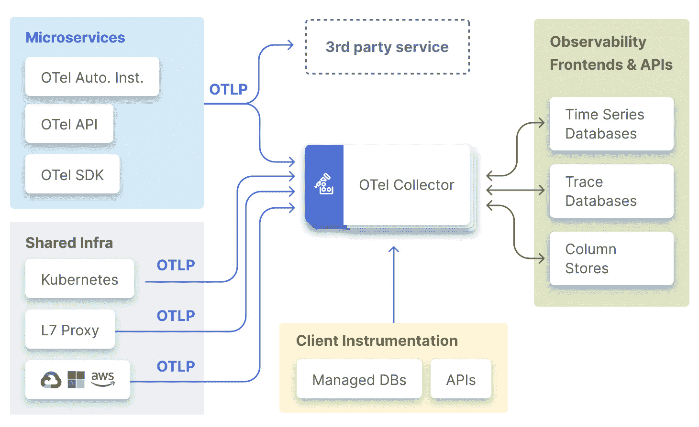
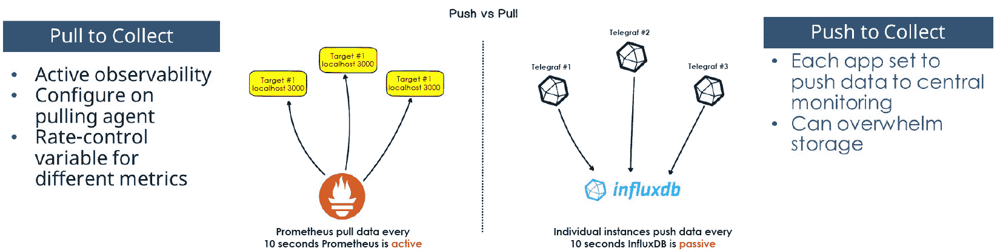

# 第九章：测试、质量保证和运营

平台解决方案在基础之上构建，提供标准化的管道和测试流程。成功实施这些流程会产生可重复的**证据体**（**BoEs**），允许将所有软件与同一标准进行衡量。证据体是文档、工件和流程，它们向外部审计师或其他感兴趣方证明安全性和质量的存在。我们常常陷入一个误区，认为因为一个应用程序执行的是独特功能，我们就应该针对不同的标准进行测试。实施最佳实践确保产品整体的质量，并允许持续的成功。

在本章中，我们将探讨如何在平台内设计和实施有效的测试策略，涵盖开发、运营、安全和性能等关键领域。我们还将学习如何创建强大的指标策略，优化平台性能及其上构建的应用程序。此外，本章还将涵盖如何构建促进弹性和可扩展性的恢复策略，确保平台能够承受中断。最后，我们将探讨如何协调事件响应操作，以增强可靠性和保持应用程序和数据的一致性。

我们将涵盖以下主要标题：

+   测试平台的最佳实践

+   指标、监控和性能优化

+   平台事件管理和恢复

# 技术要求

没有此类技术要求。熟悉测试选项，如 Robot Framework 和 SonarQube 可能很有价值。了解使用 Grafana、Prometheus 和**OpenTelemetry**（**OTel**）等工具进行指标集成也将有所帮助。

# 测试平台的最佳实践

在软件开发、商业应用甚至体育中，你都会听到测试对成功的重要性。测试可以帮助你确定计划中的解决方案是否能够满足所需的目标并执行所需的策略。在我们的基地营结构中，测试主要发生在设计、开发和部署阶段，在运营和支持阶段也有机会。

每套测试最佳实践都提供了一些已知的成功领域。这些测试实践大致与我们的整体平台愿景相一致。并非所有测试都是内部的，因为某些方法可能扩展到用户群体或运营调查。实践和指标在不同级别，如软件开发、云管理或销售（如**净推荐值**（**NPSs**））上可能略有不同。作为参考，NPS 是一个用户体验指标，通过调查问题询问客户他们推荐产品的可能性。这个 NPS 可能很有价值，但超出了正常测试范式。NPS 说明了外部实践，即收集用户反馈，如何有助于发展内部实践。

任何设计的第一步是编写测试用例。在 DevOps 中普遍存在，对于平台工程来说是必不可少的，那就是使用**测试驱动开发**。测试驱动开发意味着实现成功的第一步是开发能够证明成功的测试。例如，如果设置一个密码策略，要求包含 8 个不同的字符且总字符数不超过 20 个，你首先会创建一个包含这些参数的测试。以下列表明确了设计和执行成功测试所需元素：

1.  **设计初始测试用例**：密码必须包含 8 个不同的字符，且总字符数不超过 20 个。

1.  **分析测试需求**：定义将用于测试的应用框架。

1.  **设置测试环境**：确定测试将在哪里进行。

1.  **分析环境中的软件或硬件需求**：确保环境有足够的容量进行测试。

1.  **列出系统响应的标准**：标准至少是 8 个不同的字符，且总字符数不超过 20 个。

1.  **列出测试方法**：列出正在使用的测试方法。

1.  **设计完整的测试用例和子函数**：设计完整的使用案例，包括允许的字符类型等元素。

1.  **运行测试并研究结果**：结果可能是预期的，也可能显示错误或异常结果。一个例子是闪烁测试，由于测试过程中未包含的系统基于时间的更改导致结果不同。

我们最喜欢的测试方法之一是**Robot Framework**。Robot Framework 是一个开源自动化模型，允许进行测试自动化。它集成了众多工具和库。测试可以作为一个初始案例建立，并针对表格案例进行计算，结果可以衡量。Robot Framework 的元素不提供一系列答案或替代解决方案，只提供是否在标准下通过或失败。在我们的密码示例中，任何少于 8 个不同字符或总字符数超过 20 个的密码都会导致测试失败。使用自动化，创建随机元素字符串来测试这些标准。

测试应包括检查初始流程、收集反馈和改进结果。一个关键考虑因素是测试环境与生产环境之间的相似程度。差异越小，测试往往越有效；如果差异越大，则需要更多的测试。自动化测试持续运行并有助于加快流程。手动测试需要更多资源，并且需要更长的时间来识别问题。不要忘记康威定律对测试的影响：如果你没有仔细规划，测试将类似于更大的组织流程，你可能找不到最终解决方案。例如，验证简化消息格式的测试可能会遗漏母组织所需的高级审批。测试可能成功，但结果会跳过影响最终产品的重要步骤。这是确保通过测试交付的功能符合预期的一个提醒。以下部分包括一些最佳实践和不同测试的示例，从开发测试开始。

## 开发测试

**开发测试**是最简单和最基础的测试类型。这些测试通常在没有外部用户的情况下进行，不需要复杂的架构。成功进行开发测试的关键在于将各个部分分解到基本层面并理解每个部分。将开发测试想象成在木工车间准备制作某物的过程：你找到所有组件，布置正确的部件进行组装，并询问朋友设计是否合理。以下列表突出了一些常见开发测试：

+   **单元测试（自动化）**：单元测试评估可以逻辑上从另一个单元中隔离的最小代码片段。在多种语言中，这意味着隔离函数、子程序、库、方法和属性。单元测试可以查找正确使用的变量、代码段的复用和正确编写的代码等方面。

+   **代码质量（部分自动化）**：敏捷、DevOps 和 XP 依赖于使用代码质量检查，从配对程序员开始。自动化系统，特别是生成式 AI，可以扩展这些代码检查。质量检查是一种主观评估，确定交付的代码与团队典型代码的匹配程度。这里的测试旨在隔离最小的区域，以确定可靠性、可维护性、可测试性、可移植性、可重用性、缺陷和复杂性。

+   **代码审查（主要手动）**：代码的直接审查应少于 400 行，每小时检查率少于 500 行，永远不超过一小时。良好的代码测试建立了一个修复缺陷的过程，培养积极的代码审查文化，并实践轻量级审查。生成式 AI，如 GitHub Copilot 或 OpenAI Codex，可以通过建议代码改进的区域来协助。您可以使用具有**大型语言模型（LLM）**的角色，通过询问具有 20 年经验的程序员，来构建响应框架，询问哪些测试的代码元素可以减少。

+   **静态分析（自动化）**：静态测试是在程序运行之前执行的自动化调试测试。这确保代码位于正确的**软件开发工具包（SDK）**中，并针对编码规则进行分析。静态测试可以通过 SonarQube、Veracode 和 HP 等软件发现一些早期漏洞和错误。这些测试在最容易修复的时间消除单个安全问题，例如开放的端口和嵌入的秘密。

开发测试只能提供所需信息的一部分。一旦进行开发测试，完成的软件就会扩展到集成测试，以确保新功能在整个平台上的工作。

## 集成测试

集成实践旨在将功能元素链接在一起，并将这些单独的开发代码元素纳入进一步的构建中。一些集成可以在开发早期发生，但平台集成侧重于使各个部分单独工作，然后与其他平台元素一起工作。这些测试和实践确保信息可以在编码元素之间传输，所需的功能可以从头到尾执行，并且可以在不破坏程序的情况下回滚元素。最后，初始性能测试发生在集成测试中，特别是为了确定新代码在执行定义的功能方面是更好还是更差。

您应该旨在使每个集成测试自动化。在执行过程中设计自动化允许代码在测试验证之前执行。当代码执行时，它应该是相对简单的，以便可以启用无代码或低代码选项来执行所有集成测试。这样，测试就可以为所有潜在问题提供完整的答案，而不是要求个人不断执行测试。集成测试最好在测试或预生产环境中完成，以确保所有流程在进入生产之前都能有效运行。集成测试的最佳实践如下：

+   **数据测试（自动化）**：评估代码交互的信息。回到我们的密码示例，集成数据测试检查代码是否可以从目录中调用，然后验证代码样本与其他函数的兼容性。

+   **端到端，或 E2E（自动化）**：测试从开始到结束的应用程序工作流程。这个集成测试检查密码是否被接受，用户是否有权访问正确的程序，以及他们是否可以在该应用程序中检索或存储数据。E2E 测试通常与数据测试结合使用以获得最佳结果。

+   **回归（自动化）**：回归测试需要在变更后运行功能和非功能测试。这种做法验证了部署的变更在必要时可以返回到早期状态。回归和回滚是关键事件响应元素，但只有当它们起作用时。当发现并修复了错误时，回归也是必不可少的。

+   **性能（自动化）**：集成测试是检查代码工作得如何好的第一个地方。设置性能测试意味着查看内存使用情况、函数需要多长时间，以及程序中哪些元素运行缓慢，然后与期望的结果建立比较。性能测试使用 Apache JMeter、WebLOAD 和 BlazeMeter 等软件进行；然而，大多数都不是免费的。通过仔细的指标，你可以构建有效的分析来执行大部分免费的性能测试，但请记住，长期性能主要来自用户体验。

软件流程，在平台成功开发和集成后，可以进入交付测试。集成测试涉及审查测试和生产环境元素之间的共性。交付测试涉及验证这些共性。

## 交付测试

交付代码意味着一个功能几乎准备好进入生产阶段，但需要最后的检查。交付流程发生在管道的末端，例如在 beta 测试期间，A/B 部署或甚至金丝雀部署。这些测试通常自动化程度较低，因为某些部分需要由与开发者不同的用户群体执行。用户画像可以是自动化的——生成式 AI 可以制作出优秀的模板——但在这些测试中，实际用户仍然无法替代。以下列表突出了一些可能的交付测试：

+   **功能（部分自动化）**：以黑盒形式执行输入与输出测试。在这个阶段，代码不是作为单个项目进行测试，而是作为一个集合，其中一个输入产生一个精确的输出，并且这个输出可以追溯到输入。这种做法确保了函数的正确执行。

+   **动态（部分自动化）**：动态测试旨在代码运行时寻找错误。再次强调，交付的重点意味着你寻找的不是代码错误，而是函数的输出和输入错误。而不是有固定的用例，这个选项允许在执行过程中有各种输入。这些测试需要与功能测试紧密集成。

+   **红蓝队（混合流程）**：红队是攻击者，蓝队是防御者。这种测试设计指定一个团队来防御一个功能，另一个团队来攻击，然后在周期结束时比较结果。现代执行有时提倡紫色队作为可以执行攻击和防御的混合体。作为一种文化实践，红队往往获胜，因此不时改变团队组成可以有益于士气。雇佣经验丰富的红蓝队可能很昂贵。

+   **操作测试（手动）**：操作测试也称为用户验收测试。这些是在单个用户或一组用户尝试使用新软件的地方。操作测试是比 beta 测试或 A/B 部署更正式的动态测试的表达方式。选定的团队可能精通所需的功能，或者它可能由在那时接受培训的新用户组成。这些测试的最佳输出是关于平台性能的详细报告和用户故事。如果其他测试执行正确，则操作测试可能是不必要的，但一些客户更喜欢最终的、实际的验收测试。

一旦交付测试完成，在用户可以完全测试的软件作为有价值的产品访问之前，只剩下一个区域。

## 生产测试

传统的计算机程序员可能会说，生产测试是不必要的，因为所有缺陷都在之前被捕获。现代 DevOps 的速度意味着这一点不再成立。如果测试在开发、集成和交付过程中是一个合理的流程，那么同样的质量测试也应该在生产中进行。生产测试，尤其是在平台层面，确保用户不会将参数弯曲成新的、未经尝试的形态。以下列表突出了一些常见的生产测试：

+   **运行时安全（自动化）**：运行时安全测试是在实际部署的软件上运行的测试。关键是实施仪器来创建系统范围内的可观察性和遥测。运行时实现检查在代码达到部署后发布的**常见漏洞和暴露**（**CVEs**）等在初始生产过程中未注意到的项目。良好的运行时测试确保安全漏洞不会让软件开发或运维团队感到意外。

+   **回滚（手动或自动化）**：与回归测试类似，回滚测试确保可以在生产软件上执行完整的回滚。这确保了当错误达到生产时，整个平台可以成功返回到早期状态。此测试的关键方面包括数据完整性、用户数据库和最短停机时间。具有 A/B 测试的自动化解决方案可以设置为在自动达到某些性能指标时回滚。

从交付到生产的集成测试为高质量软件奠定了坚实的基础。每个步骤都强调不同的领域，这只有在软件达到下一个步骤时才可能实现。作为最后的最佳实践，测试应该在每个部分完成时始终运行，因为一次性修复多个错误比它们发生时修复它们更容易。如果你在错误被识别后立即修复它，那么在初始修复之后可能会出现后续的错误。例如，防止编译的代码错误必须在生产测试之前找到；如果没有早期的测试步骤，你将花费更长的时间来尝试找到最小错误。早期修复问题可以减少在它们达到生产时解决这些更改所需的时间。跟踪测试有效性的一个方法是通过指标、监控和性能优化。

# 指标、监控和性能优化

每家公司都希望更快地交付更多产品，增加客户价值，并回报股东。每个 DevOps 业务都理解核心指标。更先进的组织将具备识别指标背后的已知未知的能力。获得初始指标会导致一些理解，但可以从中得出更多细节。后续指标应紧密界定并专注于加速，提供清晰的反馈。本节强调如何通过分解以实现某些指标的小幅变化来提供高级解决方案。

有软件通过管理平台上的数据提供指标解决方案。此软件还允许你选择具有多个比较级别的先进指标。通过提出一些基本问题来定义指标，这些问题导致一些普遍的基本指标。然后，你可以制定更先进的指标，最后将这些数字转化为积极的行动。

## 第一个问题

许多人经常质疑使用指标的意义，因为流程中的所有个人都了解正在做什么以及什么尚未完成。通过衡量多个流程并推动可操作的解决方案，指标提供了一种可量化和可重复的观察来源。指标的第一个要素是要衡量的流程或行动，例如团队提交了多少代码。这些可以扩展到选择每日、每周或其他时间集成，以确保最佳的时间管理。早期指标发展的关键是评估正确的测量时间框架。例如，如果你正在查看网站流量以指示网站的成功，你可能想知道流量是否在发布新促销活动后的几小时内发生，还是全年发生。

人们可能会质疑为什么需要一个可量化的跟踪机制，尤其是在小型团队中。如果没有可量化的指标，大多数人会做出糟糕的决定。做出决策的人往往高估了自己正确预测的能力。这个问题在任务调度中经常发生；你可能会预测一个项目需要六个月，但实际上需要整整一年。人类的预测能力如此糟糕，以至于科学家发现，77%的随机生成的线性模型比个人做出的决策更好。决策的例子包括完成时间、有罪或无罪、所需的修复或提出的解决方案。指标确保决策不那么随机。

数字为线性判断提供了可重复的组成部分。如果我们知道我们开发团队上周和上周的表现，那么我们知道，在接下来的一个星期内，如果没有其他变化，将那个数字增加 100%是一个糟糕的决定。另一个类似的决策是为预期的服务增长购买更多的云空间——幸运的是，许多那些运营决策现在由负载均衡器处理。这些技术负载均衡器也使用指标；它们只是在没有人为干预的情况下做出关于指标的决策。这些路径导致使用生成式 AI 来监控关于指标的行动的选项。

所有指标都必须激发行动。如果一个指标不能导致行动，那么它就无用了。我们接下来要讨论的选项从基础开始，然后扩展到立即行动的选项。如果我们回到早期的提交问题，一个基本的指标可能查看每天的提交次数。扩展这个指标可能表明每个开发者的提交次数、每次提交的代码行数、从上次提交到这次提交的时间，或者提交提供的函数类型。这些都可以驱动更具体的行动来解决变更。你可能会指导一个进度缓慢的开发者，要求一个进度快的开发者制作更完整的解决方案并增加更多的代码行，探索团队之间的上下文切换，或者寻找更复杂的函数。这些指标中的每一个都提供了一条路径，根据组织目标和价值流来做出决策，以改进指标。基本指标允许进行更详细的调查，而高级指标则直接指向问题。

## 基本指标

每个人都应该熟悉**DevOps 研究和评估**（**DORA**）组织概述的最基本指标。这四个指标，通常用于软件开发，包括部署频率、平均变更时间、平均恢复时间和变更失败率。让我们简要介绍一下：

+   **部署频率**：新代码部署到生产中的频率。通过随时间进行的部署来衡量。

+   **平均变更时间**：新想法成为生产代码所需的时间。包括部署频率的测量。以平均时间衡量。

+   **平均恢复时间**：如果部署了不良或不稳定的代码，将生产系统恢复到稳定状态所需的时间。以平均时间衡量。

+   **变更失败率**：允许达到生产环境的坏代码元素的数量。以坏代码元素与好代码元素的比例来衡量。

这些指标最初看起来很出色，但它们是为更成熟的软件组织设计的。从这些指标开始可能会让一个组织感到困惑，不知道如何改进。有关更详细的信息，您可以查看 DORA 网站：[`dora.dev/`](https://dora.dev/)。

在这些指标中，值得注意的是，其中三个是按时间来衡量的，最后一个是按百分比来衡量的。主要点是每个指标如何推动额外的行动。每个要素的范围突出了它们是如何作为成功的宏观指标，但作为单独的指标或用于计算综合分数并不实用。

所有指标都源于最初的问题：你需要知道什么，之后会发生什么？这可能关乎安全性、生产时间或用户满意度。重要的是要考虑即使指标看起来很完整，它实际上是否回答了问题。例如，一个表示没有发生安全漏洞的指标可能只跟踪已知的漏洞或在一个狭窄的参数内定义安全漏洞。虽然指标解决了看似当前的需求，但在实施之前应仔细研究以确保真正的进步。

测量指导了指标的发展。DORA 指标提供了一种单一测量，要么是某个时间点，要么是在一定时期内。为了使这些计算有意义，您还必须设定一个期望的速率。指标将推动进一步的行动。例如，如果变更失败率是 15%，这个数字是否高于或低于组织的预期数字？在某些情况下，这些服务级别协议可以设定速率。另一种测量可以是测量测试、预生产或实际生产环境中的变更失败。在构建有效的指标时，您可能容忍测试期间的 15%失败率，预生产期间的 3%，以及实际生产环境中的低于 1%。

另一个关键因素取决于同一时期内的部署数量。如果一家公司每天向生产环境部署数百次，较高的失败次数可能更容易接受，因为这些失败很可能会在接下来的部署中被修正。如果一个团队每天部署超过 100 次，每次失败的百分比仅表示一段已部署的代码。这引发了一个关于使用原始数字与百分比的比较的常见问题。如果一个团队每月平均部署三次，变更失败率将是 0%、33%、66%或 100%。这会在你如何处理这些指标方面产生更大的差异。在这种情况下，你必须直接比较部署频率和变更失败率，以进行准确的评估。

当你考虑价值流指标时，这些讨论可能会变得更加复杂。有些人可能会建议价值流指标应该仅仅反映 DORA 指标。价值流最初源于精益制造，并考虑从材料进入流程到从客户那里获得价值的时间段。DevOps 通常认为部署的代码是购买的代码，但仅仅将代码推送到生产并不总是产生收入。这些考虑应该解决有多少用户访问生产代码，或者更广泛的运营指标，例如代码如何影响性能、用户满意度或其他因素。

一个简单的例子是，如果公司促销活动需要新的代码，那么在活动之前代码没有完成，部署时间就不重要。失败率不重要，因为活动从未启动、延迟或取消。理解指标如何影响整体价值和成功对于确定正确的测试以保证开发正确且按时完成至关重要。

我们经常收到的一个问题是，如何确保你的指标是正确的。在回答这个问题时，我们发现了一个简单的框架，这是我们情报行动时期用来推动这个讨论的。基本模型如下：

1.  **我如何知道发生了什么？** 如果需要数字进行测量，必须存在哪些元素才能观察或提供这些数字？例如，系统报告的运行时间是由服务器运行时间、网站可用性还是仅仅当软件运行时计算的吗？这些数字的差异可能需要截然不同的解决方案。

1.  **如果我已知发生了什么，接下来会发生什么？** 如果数字是准确的，下一步应该是什么？如果部署频率高，平均变更时间应该减少吗？如果部署频率增加而变更时间增加，应该采取什么行动？

1.  **假设是否正确？** 对于指标是否做出了正确的假设？分配的报告工具是否在正确的频率下提供正确的信息以贡献？例如，如果部署频率来自月度时间表，但变更时间按季度评估，那么这些项目之间的关系是否仍然成立？

1.  **结论是否遵循假设？** 你应该考虑关于事件的结论是否遵循假设的自然流程。如果结论是价值增加是因为部署频率增加，那么如果变更失败也增加，这个结论是否仍然成立？

1.  **比较苹果和苹果，而不是橙子和大象。** 你必须确保测量的项目是可以比较的。在测量部署频率时，如果一个团队必须达到安全标准，而另一个团队生产开源软件，在选择改进措施时，你能比较那些比率吗？

为每个指标提出答案可能需要一些工作。当我们开始使用这个指南时，我们会为每个问题写出答案。写出答案解决了第二、三和四个问题，为你的思考提供了视觉验证。写下来也解决了核心指标问题，即指标是可量化和可重复的。通过标准流程确保所有指标都符合要求，避免系统中出现不良指标。下一节将探讨如何使用这些指南来分解现有指标，以指导行动。

## 分解指标

分解任何指标都需要从当前情况开始。分解最重要的部分是支持平台的共同愿景和目标。虽然所需的指标可能完全是新的，但很可能现有指标已经满足了部分需求。如果不幸的是，团队目前没有任何指标，那么查看服务等级协议（SLA）可以提供关于哪些指标支持运营的指导。如果你没有 SLA，那么查看正在构建的功能的验收标准可以提供一个起点。幸运的是，我们现在知道了一些基本支柱和层次，这可以指导我们在构建平台时的基础建设。

变化需要理解那些初始元素。例如，如果我们想探索设计过程的稳定性，这将提供一个初始指标。前几章建议设计阶段应该只占用全价值流所需时间的约 10%。大多数团队在设计规划事件中进行设计，计划占用 80 小时冲刺中的 4-8 小时。这提供了一个初步的保证，即任务正在高效地完成。你可能还想通过确定开发者在票据进入其工作流程桶后花费在设计上的时间来增加这些测量。

获取分解指标所需的数据可以通过多种方式发生。你可以使用调查来突出与已知流程冲突的区域。你可以通过个别访谈或感知会议来补充这个过程。感知会议是指收集多个个人来询问特定话题。这个定性过程的关键是在多个访谈中使用相同的问题。当你跨访谈使用不同的问题时，你可以获得大量数据，但比较个人的贡献变得困难；你是在做橘子对大象的比较。在调查和访谈之间，你通常可以找到现有指标在数据不足以创建行动方面的不足。以下列表提供了一个快速了解如何编写问题来分解 DORA 指标平均变更时间的示例：

+   **完成一个动作需要多长时间？**这是如何衡量的？你是否使用故事点、史诗中完成的故事、整个史诗或交付给客户？完成的工作是否与正在进行的工作量进行比较？

+   **是否确定了约束条件？**对平均时间的初步评估通常不会显示哪些地方在减慢。将原因归咎于缺乏时间、被其他项目阻塞或未优先考虑可以显示平均时间可能发生变化的原因。

+   **谁构建了它？**如果所有任务都分配给一个团队，我们是测量团队、个人还是产品层面的更改？指标是否将复杂性作为时间需求的分母？例如，能否看到更复杂和更简单任务之间的比较时间？能否将分配给团队的知识和技能与期望的输出进行比较？

+   **如何比较不同的功能？**优先级缩放在指标中处于什么位置？你希望确保高优先级的项目比低优先级的项目完成得更快。当比较不同团队的成功率时，你是否考虑了分配问题的复杂性？

+   **永远不要忘记安全影响**。快速的平均更改时间有所帮助，但正如之前所提到的，更改失败率，更改时间是否包括后续的安全影响？你应该评估在生产管道中花费在安全上的时间有多长，以及这与整体生产时间表相比如何。

如果仔细阅读，你会看到这些分解问题如何反映了之前关于指标的问题。如果一个指标表现不佳但行动不明确，我们建议使用物理或虚拟白板向团队提问。这些问题有助于建议在何处进行分解以设计准确的指标，制定行动方案，并使平台成功。

## 监控指标

一旦建立了指标，下一步建议如何监控这些指标并提供主动警报。主要成功之处在于使用仪表板来汇总不同信息但创建可观察性。关于仪表板最重要的考虑点是它们是讨论的起点，而不是终点。许多组织使用仪表板来共享信息，但从未超越这一步。仪表板创建了一个快照，即各种数据的汇总，以及一些与所需信息相关的简单警报。下一步将集成来自 CNCF 的 OTel 等工具，构建心跳或脉搏检查，并将指标纳入 SLIs、SLOs 和 SLAs。

OTel 将工具、API 和 SDK 组合成一个开源的可观察性框架，以进行仪器化、生成、收集和导出遥测数据。大多数遥测数据由系统内的日志、跟踪和指标组成。*图 9.1*（来自 OTel 文档的示例）展示了 OTel 可能如何配置。

图 9.1：OTel 架构

您可以看到 OTel 与其他元素结合的各种元素。作为一个开源选项，OTel 是我们设计初始格式时最喜欢的工具之一。系统使用 API 对代码进行仪器化，收集 SDK 数据，通过采样分析数据以减少错误，提供所需上下文，导出数据，并允许通过已建立的后端进行更多过滤。OTel 的一个优点是将过滤后的数据导出到 Grafana、Prometheus 或 Elastic 等工具，以快速提供所需数据。OTel 实现的另一个常见解决方案是使用开源的 Jaeger 工具。

遥测解决方案可以实现质量、时间或应用指标。这些元素寻找推送作为心跳或拉取作为脉搏检查。**心跳**指的是以连续节奏和持续意识收集数据的指标，而**脉搏检查**则需要采取行动以验证进度是否继续。这两个元素的示例在*图 9.2*中提供，通过比较 Prometheus 和 InfluxDB。

图 9.2：度量推送和拉取

您可以看到 Prometheus 如何允许推送数据，而 InfluxDB 将数据拉入收集格式。这种差异允许根据平台内的计算和存储监控不同的元素。推送指标有助于在管道中贡献力量时使用，而拉取指标在 SSO 环境中可能更有效。应用推送指标解决方案意味着每次管道在平台中运行时，都会将数据推送到指标收集。另一方面，拉取数据可以通过验证用户登录是否已与更大的平台通信来评估安全工具。这种拉取数据支持所有用户都有认证令牌以及 API 调用正在使用最新补丁和升级的可观察性。

所有组合的度量数据都应在 SLA 框架内的仪表板中可观察。仪表板可以显示不同的时间段，但允许监控支持实施比较决策。仪表板设计可以快速扩展以适应不同的时间段、数据和框架。例如，您可以设置一个仪表板来显示平台可用时间，构建一个帕累托图来展示哪些应用可用，然后通过缩放指标比较单个应用和平台可用性。通过监控链接度量类型可以了解如何优化操作以及何时需要更改指标。

## 优化指标

考虑度量时的最后一个要素是意识到何时一个指标不再有价值。团队往往会对他们的指标产生依恋，即使在它们不再创造价值的情况下也会报告统计数据。指标旨在引发讨论并激发行动；当一个指标不再实现这一目标时，就是时候放弃它了。当指标看起来积极或以某种方式游戏化以实现指标而不创造额外价值时，这种区分可能特别困难。

一个很好的例子是，在 DevOps 团队的**故事点**中可以游戏化指标。故事点描述了一个问题可能有多复杂，以及潜在的完成时间。如果一个问题有两个故事点，它比一个故事点的问题复杂两倍，可能需要更长的时间。如果指标是团队完成的故事点数量，一些团队可能会使问题看起来更复杂，以便完成更多的点。优化该指标的解决方案是，而不是使用故事点，测量可以是在冲刺期间完成的计划任务数量。虽然故事点可能有助于团队管理，但计划任务与完成任务的更高百分比允许进行更准确的比较。

在优化指标时，重要的是记住没有任何指标应该孤立存在。这些指标中的每一个都可以相互关联，以改善情境意识。如果期望的 SLA 小于 1%的已发布到生产的错误，并且指标是已发布到生产的错误，数学看起来很简单。你应该考虑的次要影响是，如果所有代码都保持到无错误，那么生产时间可能会增加，因为每个元素都在等待它完美。这总结了关于详细说明不仅指标，而且围绕这些元素的假设的前述思维模式。

指标通常发布在仪表板上，在会议期间进行审查，并由员工引用。常见的指标成为文化框架，有时也表达了组织价值观。一个普遍的真理，以指标的形式表达，可以成为众所周知的事实，无论围绕该指标的其他元素如何。一位朋友过去总是引用，“引用统计数据的人中有 50%的人 100%的时间都是正确的。”这种表达方式体现了不断审查和更新指标的需求。优化最佳实践要求定期审查指标，不仅是为了包含的信息，而是为了判断指标是否仍然回答了期望的问题。

下一个部分将讨论如何使用指标来告知事件管理和恢复。

# 平台事件管理和恢复

平台是支持客户的服务操作，使事件管理和恢复成为成功的关键组成部分。事件管理应解决所有潜在的正面和负面问题，因为主要目标仍然是支持客户获得成功的平台体验。正常的交付团队在事件被注意到后支持事件管理响应，无论事件是内部还是外部，平台也不例外。关于分层支持、SRE 确保满足各种 SLA 以及安全问题的先前讨论都是管理平台事件的重要元素。每个讨论都突出了指标，以进一步定义您如何随着时间的推移处理事件解决。

任何事件流程的第一步是实施一个票务系统。这些系统可能使用诸如 Jira Service Management、ServiceNow、GitLab 问题或甚至电子表格跟踪器等软件。选择票务系统的主要关注点应该是问题的数量和可观察性的水平。如果一个系统每天接收一到两个问题，电子表格可能是实用的，但随着数量的增加，自动化变得至关重要。事件响应票务中的自动化允许快速分类、分配资源和快速解决简单问题。这里提供了一个层级的提醒：

+   **一级**：通过现有文档和改进的实践解决的问题。

+   **二级**：需要更改配置的问题，例如连接、端口、存储库或软件版本。

+   **三级**：代表一个错误，应该是工作但不工作的事情，一个问题，或者是一个期望的新功能。

一些事件通知源于对系统的可观察性，但其他事件则是通过常规报告发生的。例如，钓鱼攻击，通过垃圾邮件尝试让目标点击链接，通常由员工报告。汇总这些报告并获取对票务系统的可观察性可以揭示事件发生的地点，对安全团队来说。

平台事件响应应使用指标来突出显示重要区域。这些指标是从服务等级协议（SLAs）和服务等级指标（SLIs）中得出的，描述了有效的平台运营。当这些指标下滑时，根本原因分析可以揭示需要更广泛的干预。事件响应流程通常使用一些标准流程对齐，例如准备、识别、遏制、根除、经验教训和沟通。每一步都需要一个清单，专门针对平台运营以解决事件。

事件响应的关键是准备阶段。这个准备阶段包括团队聚集起来解决模拟问题的一些专门实践。平稳运行的事件响应需要实践。你从未见过专业运动员在没有练习的情况下参加比赛；平台运营也是如此。团队必须知道谁参与其中，有一个练习的地方，以及一组要遵循的程序。这些练习会议至少应该每季度举行一次，并且不应因实际事件而推迟或取消。当事件在真实事件恢复后不久发生时，跳过事件响应练习的诱惑很大。虽然现实世界的行动无法替代，但练习有助于为这些事件创造成功路径。

关于事件的一个重要注意事项是，即使在解决之后，工作仍未结束。直到所有系统恢复到事件前的操作状态，完整的响应才算完成。在平台上，你可能会遇到多个用户，他们拥有不同水平的信息，都需要恢复。3-2-1 口诀在这里适用，即平台数据在三个不同的媒体源上备份，在两个物理位置，以及一个离线选项。你可以通过回滚和回归测试定期测试这些备份。这些测试模型有助于在操作变得关键之前证明成功。

通常，测试被视为开发，而事件响应活动被视为运营。在平台上，你可以合并这两个元素。测试是开发的关键，但在运营中运行测试以验证活动则创造了可观察性。可观察性随后导致事件意识，早期运营以消除问题，并成功恢复。真正的学习发生在 DevOps 模型中，在多个领域创造流程、反馈和持续改进。下一章将结合所有技术 DevOps 解决方案，为创建高性能平台团队提供结构。

# 摘要

本章的平台评估从你可以用来评估平台的一些测试和实践开始。介绍了许多不同测试的样本，以及成功之路。然后，讨论了指标。指标可能很复杂，但建立指标相对简单。任何问题的基本指标框架评估了您如何知道以及围绕这些指标的所有假设，并确保指标之间的比较是准确的。

本章从那些初始指标发展到更高级的过程，包括分解、监控和优化指标以实现未来的成功。最后一步说明了如何在平台上设置事件响应。事件响应不仅包括负面结果，还包括制定一个框架来处理平台可能遇到的每一个潜在问题。良好的事件响应利用有效的测试。下一章将那些坚实的理论基础扩展到如何构建高性能平台团队。

行动呼吁

+   练习编写和执行测试用例以验证平台元素

+   检查通常使用的指标，并确定它们是否提供了足够的信息来采取纠正措施

+   为事件响应团队举办培训会议

# 第三部分：加速**交付业务价值并引领未来**

本部分侧重于将平台工程转化为战略优势。我们将把平台成果与业务价值联系起来，推动持续改进，并以前瞻性的思维方式领导。这就是掌握的重点——在这里，技术、团队和领导汇聚在一起，以产生可衡量的企业影响。

本部分包含以下章节：

+   *第十章*, *构建高性能平台团队*

+   *第十一章*, *从愿景到现实：掌握企业平台工程*
