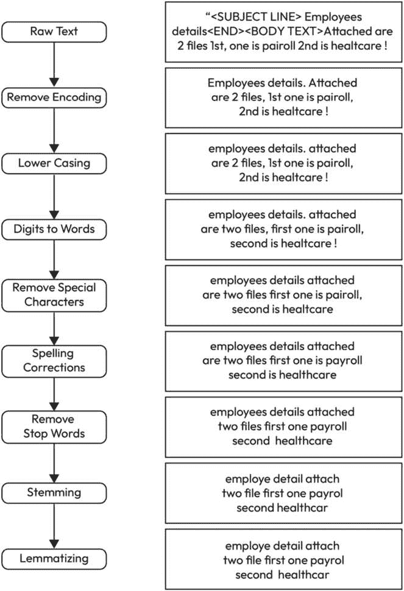
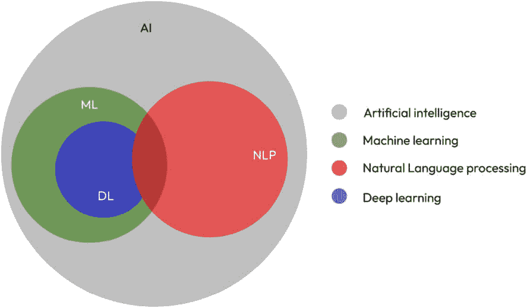

# 第一章：探索 NLP 领域：全面介绍

本书旨在帮助专业人士将**自然语言处理**（**NLP**）技术应用于他们的工作，无论他们是在从事 NLP 项目还是在其他领域（如数据科学）中使用 NLP。本书的目的是向您介绍 NLP 领域及其基础技术，包括**机器学习**（**ML**）和**深度学习**（**DL**）。全书强调数学基础的重要性，如线性代数、统计学和概率论以及优化理论，这些都是理解 NLP 中使用的算法所必需的。内容配有 Python 代码示例，以便您进行预练习、实验并生成书中展示的一些开发内容。

本书讨论了 NLP 面临的挑战，例如理解词语的上下文和含义、它们之间的关系以及需要标记数据的需求。本书还提到了 NLP 最近的进展，包括预训练语言模型，如 BERT 和 GPT，以及大量文本数据的可用性，这导致了 NLP 任务性能的改进。

本书将通过讨论语言模型对 NLP 领域的影响来吸引您，包括 NLP 任务中准确性和有效性的提高、更高级 NLP 系统的发展以及更广泛人群的易用性。

本章将涵盖以下标题：

+   什么是自然语言处理？

+   自然语言机器处理初始策略

+   NLP 和 ML 的协同效应——两者的结合

+   NLP 中的数学和统计学简介

# 本书面向对象

本书的目标受众是那些将文本作为其项目一部分的专业人士。这可能包括 NLP 实践者，他们可能是初学者，以及那些通常不处理文本的人。

# 什么是自然语言处理？

**NLP** 是一个专注于计算机与人类语言之间交互的**人工智能**（**AI**）领域。它涉及使用计算技术来理解、解释和生成人类语言，使计算机能够自然和有意义地理解和响应人类输入。

## 自然语言处理的历史和演变

自然语言处理（NLP）的历史是一段迷人的时光之旅，追溯至20世纪50年代，那时艾伦·图灵等先驱者做出了重要贡献。图灵的开创性论文《计算机与智能》引入了图灵测试，为未来在人工智能和自然语言处理领域的探索奠定了基础。这一时期标志着符号NLP的诞生，其特征是使用基于规则的系统，如1954年著名的乔治敦实验，该实验雄心勃勃地旨在通过生成俄语内容到英语的翻译来解决机器翻译问题（参见[https://en.wikipedia.org/wiki/Georgetown%E2%80%93IBM_experiment](https://en.wikipedia.org/wiki/Georgetown%E2%80%93IBM_experiment)）。尽管早期充满乐观，但进展缓慢，揭示了语言理解和生成的复杂性。

20世纪60年代和70年代见证了早期NLP系统的发展，这些系统展示了机器使用有限的词汇和知识库进行类似人类交互的潜力。这一时期也见证了概念本体的发展，这对于在计算机可理解格式中结构化现实世界信息至关重要。然而，基于规则方法的局限性导致了20世纪80年代末向统计NLP的范式转变，这一转变得益于机器学习的发展和计算能力的提升。这一转变使得从大型语料库中更有效地学习成为可能，显著推进了机器翻译和其他NLP任务。这一范式转变不仅代表了技术和方法上的进步，而且强调了NLP中语言学研究方法的概念演变。在摆脱预定义语法规则的僵化之后，这一转变接受了语料库语言学，这是一种允许机器通过广泛接触大量文本“感知”和理解语言的方法。这种方法反映了对语言的一种更经验性和数据驱动的理解，其中模式和意义是从实际语言使用中而不是从理论结构中得出的，从而使得语言处理能力更加细腻和灵活。

进入21世纪，互联网的出现提供了大量数据，催化了无监督和半监督学习算法的研究。突破随着2010年代神经NLP的出现而到来，当时深度学习技术开始占据主导地位，在语言建模和解析方面提供了前所未有的准确性。这一时期以Word2Vec等复杂模型的发展以及深度神经网络的激增为标志，推动NLP向更自然和有效的人机交互发展。随着我们继续在这些进步的基础上构建，NLP站在人工智能研究的前沿，其历史反映了不懈追求理解和复制人类语言细微差别的不懈追求。

近年来，自然语言处理（NLP）也被应用于广泛的行业，如医疗保健、金融和社交媒体，在这些行业中，它被用于自动化决策并增强人与机器之间的沟通。例如，NLP已被用于从医疗文件中提取信息，分析客户反馈，翻译不同语言之间的文档，以及搜索大量帖子。

# 自然语言机器处理中的初始策略

自然语言处理（NLP）的传统方法包括文本预处理，这与文本准备同义，然后是应用**机器学习**方法。在自然语言处理和机器学习应用中，文本预处理是一个基本步骤，它涉及清理和转换原始文本数据，使其能够被机器学习算法轻松理解和分析。预处理的目标是去除噪声和不一致性，并标准化数据，使其更适合高级自然语言处理和机器学习方法。

预处理的一个重要好处是它可以显著提高机器学习算法的性能。例如，去除像“**这**”和“**是**”这样的常见词，这些词没有太多意义，可以帮助减少数据的维度，使算法更容易识别模式。

以以下句子为例：

**我要去商店买一些牛奶** **和面包**。

在去除停用词后，我们得到以下内容：

**去商店买** **牛奶面包**。

在示例句子中，停用词“**我**”，“**是**”，“**到**”，“**这**”，“**一些**”和“**和**”并没有给句子增加任何额外的意义，并且可以去除而不改变句子的整体意义。应该强调的是，去除停用词需要根据具体目标进行定制，因为在一个上下文中省略某个词可能微不足道，但在另一个上下文中可能是有害的。

此外，**词干提取**和**词形还原**，这些方法将单词还原到其基本形式，可以减少数据中独特单词的数量，使算法更容易识别它们之间的关系，这将在本书中完全解释。

以以下句子为例：

**这些男孩跑了，跳了，并且** **游得快**。

在应用词干提取后，每个单词都被还原到其根或词干形式，不考虑词的时态或派生词缀，我们可能会得到：

**这个男孩跑了，跳了，并且** **游得快**。

词干提取简化了文本到其基本形式。在这个例子中，“**跑**”，“**跳**”和“**游**”分别被还原到“**跑**”，“**跳**”和“**游**”。请注意，“跑”和“游”没有变化，因为词干提取通常会导致单词接近其词根形式，但不是字典中的基本形式。这个过程有助于减少文本数据的复杂性，使机器学习算法更容易匹配和分析模式，而不会因为同一词的不同变体而陷入困境。

以以下句子为例：

**男孩们奔跑、跳跃，并且** **快速游泳**。

在应用词形还原后，考虑到词的形态分析，旨在将词还原到基础或词典形式，即词元，我们得到：

**男孩跑、跳，并且** **快速游泳**。

词形还原准确地将“**ran**”、“**jumped**”和“**swam**”转换为“**run**”、“**jump**”和“**swim**”。这个过程考虑了每个词的词性，确保将词还原到基本形式既符合语法也符合语境。与词干提取不同，词形还原提供了更精确的基本形式还原，确保处理后的文本在意义上和语境上保持准确。这通过使NLP模型能够更有效地理解和处理语言，减少了数据集的复杂性，同时保持了原文的完整性。

预处理的其他两个重要方面是数据归一化和数据清洗。**数据归一化**包括将所有文本转换为小写，删除标点符号，并标准化数据的格式。这有助于确保算法不会将同一单词的不同变体视为不同的实体，这可能导致结果不准确。

**数据清洗**包括删除重复或不相关的数据，以及纠正数据中的错误或不一致。这在大型数据集中尤为重要，因为手动清洗既耗时又容易出错。自动预处理工具可以帮助快速识别和删除错误，使数据更适合分析。

*图1.1* 展示了一个全面的预处理流程。我们将在 [*第4章*](B18949_04.xhtml#_idTextAnchor113) 中介绍这个代码示例：

图1.1 – 综合预处理流程

总之，预处理文本是NLP和ML应用中的一个关键步骤；它通过去除噪声和不一致性以及标准化数据来提高ML算法的性能。此外，它在为NLP任务准备数据以及数据清洗中发挥着至关重要的作用。通过在预处理上投入时间和资源，可以确保数据质量高，并准备好进行高级NLP和ML方法，从而获得更准确和可靠的结果。

当我们的文本数据准备进行进一步处理时，下一步通常涉及将机器学习模型拟合到数据上。

# 一个成功的协同效应——自然语言处理和机器学习的结合

机器学习是人工智能的一个子领域，涉及训练算法从数据中学习，使它们能够在没有明确编程的情况下做出预测或决策。机器学习正在推动许多不同领域的进步，如计算机视觉、语音识别，当然还有自然语言处理。

深入探讨ML的具体技术，NLP中使用的特定技术是**统计语言模型**，它涉及在大文本语料库上训练算法以预测给定单词序列的可能性。这被广泛应用于各种应用中，如语音识别、机器翻译和文本生成。

另一种关键技术是**深度学习（DL**），它是机器学习的一个子领域，涉及在大数据集上训练人工神经网络。深度学习模型，如**卷积神经网络（CNNs**）和**循环神经网络（RNNs**），已被证明适用于NLP任务，如语言理解、文本摘要和情感分析。

*图1.2* 描述了AI、ML、DL和NLP之间的关系：

图1.2 – 不同学科之间的关系

# NLP中的数学和统计学简介

NLP和ML的坚实基础是算法的数学基础。特别是，关键基础是线性代数、统计学和概率论以及优化理论。[*第二章*](B18949_02_split_000.xhtml#_idTextAnchor026)将概述您需要了解这些主题的关键主题。在整个书中，我们将展示各种方法和假设的证明和论证。

NLP的一个挑战是处理人类语言中产生的大量数据。这包括理解上下文，以及词语的意义及其之间的关系。为了应对这一挑战，研究人员开发了各种技术，如嵌入和注意力机制，分别以数值格式表示词语的意义并帮助识别文本中最关键的部分。

NLP的另一个挑战是需要标记数据，因为手动标注大量文本语料库既昂贵又耗时。为了解决这个问题，研究人员已经开发了无监督和弱监督方法，可以从未标记数据中学习，例如聚类、主题建模和自监督学习。

总体而言，NLP是一个快速发展的领域，有潜力改变我们与计算机和信息交互的方式。它被应用于各种应用中，从聊天机器人、语言翻译到文本摘要和情感分析。机器学习技术，如统计语言模型和深度学习，在开发这些系统中发挥了关键作用。正在进行的研究解决剩余的挑战，例如理解上下文和处理缺乏标记数据的问题。

自然语言处理（NLP）领域最显著的进步之一是预训练语言模型的发展，如**双向编码器表示的Transformer**（**BERTs**）和**生成式预训练Transformer**（**GPTs**）。这些模型在大量文本数据上进行了训练，并且可以针对特定任务进行微调，例如情感分析或语言翻译。

Transformer，BERT和GPT模型背后的技术，通过使机器更有效地理解句子中单词的上下文而彻底改变了NLP。与之前线性处理文本的方法不同，Transformer可以并行处理单词，通过注意力机制捕捉语言的细微差别。这使得它们能够辨别每个单词相对于其他单词的重要性，极大地增强了模型理解复杂语言模式和细微差别的能力，为NLP应用中的准确性和流畅性设定了新的标准。这增强了NLP应用的开发，并在广泛的NLP任务上提高了性能。

*图1.3* 详细说明了Transformer组件的功能设计。

图1.3 – 模型架构中的Transformer [架构](https://arxiv.org/abs/1706.03762)

自然语言处理（NLP）领域的另一个重要发展是大量标注文本数据的可用性增加，这允许训练更精确的模型。此外，无监督和半监督学习技术的发展使得在更少的标注数据上训练模型成为可能，使得在更广泛的场景中应用自然语言处理成为可能。

语言模型对自然语言处理（NLP）领域产生了重大影响。语言模型改变该领域的关键方式之一是通过提高自然语言处理任务的准确性和有效性。例如，许多语言模型在大量文本数据上进行了训练，使它们更好地理解人类语言的细微差别和复杂性。这导致了语言翻译、文本摘要和情感分析等任务性能的提高。

另一种语言模型改变自然语言处理（NLP）领域的方式是通过促进更高级、更复杂的NLP系统的开发。例如，一些语言模型，如GPT，可以生成类似人类的文本，这为自然语言生成和对话系统开辟了新的可能性。其他语言模型，如BERT，提高了问答、情感分析和命名实体识别等任务的性能。

语言模型通过使其对更广泛的人群更加易于访问而改变了该领域。随着预训练语言模型的出现，开发者现在可以轻松地对这些模型进行微调以适应特定任务，而无需大量标记数据或从头开始训练模型的专业知识。这使得开发者构建NLP应用变得更加容易，并导致了基于NLP的新产品和服务的大量涌现。

总体而言，语言模型通过提高现有NLP任务的性能、促进更高级NLP系统的发展以及使NLP对更广泛的人群更加易于访问，在推进NLP领域方面发挥了关键作用。

## 理解语言模型——ChatGPT示例

ChatGPT，GPT模型的变体，因其生成类似人类文本的能力而受到欢迎，这可以用于广泛的自然语言生成任务，如聊天机器人系统、文本摘要和对话系统。

它之所以受欢迎的主要原因在于其高质量的输出以及生成难以与人类书写文本区分的文本的能力。这使得它在需要自然语言的应用中非常适用，例如聊天机器人系统、虚拟助手和文本摘要。

此外，ChatGPT在大量文本数据上进行了预训练，这使得它能够理解人类语言的细微差别和复杂性。这使得它在需要深入理解语言的应用中非常适用，例如问答和情感分析。

此外，通过提供少量特定任务的数据，可以对ChatGPT进行微调以适应特定的使用场景，这使得它具有多功能性和适应性，能够广泛应用于各种应用。它在工业、研究和个人项目中得到广泛应用，包括客户服务聊天机器人、虚拟助手、自动内容创作、文本摘要、对话系统、问答和情感分析。

总体而言，ChatGPT生成高质量、类似人类文本的能力以及其能够针对特定任务进行微调的能力，使其成为各种自然语言生成应用的流行选择。

让我们继续总结本章内容。

# 摘要

在本章中，我们向您介绍了自然语言处理（NLP）领域，它是人工智能的一个子领域。本章强调了数学基础，如线性代数、统计学和概率论以及优化理论的重要性，这些是理解NLP中使用的算法所必需的。它还涵盖了NLP中面临的挑战，如理解词语的上下文和含义、它们之间的关系以及需要标记数据的需求。我们讨论了NLP的最近进展，包括预训练语言模型，如BERT和GPT，以及大量文本数据的可用性，这导致了NLP任务性能的提高。我们简要提到了文本预处理的重要性，以及您在了解数据清洗、数据归一化、词干提取和词形还原在文本预处理中的重要性。然后我们讨论了NLP和机器学习（ML）的结合如何推动该领域的进步，并成为自动化任务和改善人机交互的越来越重要的工具。

在学习本章后，您将能够理解NLP、ML和DL技术的重要性。您将能够理解NLP的最近进展，包括预训练语言模型。您还将了解文本预处理的重要性以及它在为NLP任务准备数据和数据清洗中的关键作用。

在下一章中，我们将介绍机器学习的数学基础。这些基础将贯穿整本书。

# 问答

1.  Q: 什么是自然语言处理（NLP）？

    +   Q: 在人工智能领域，什么定义了NLP？

    +   A: NLP是人工智能的一个子领域，专注于使计算机能够以自然和有意义的方式理解、解释和生成人类语言。

1.  自然语言机器处理初始策略

    +   Q: 在自然语言处理（NLP）中，预处理的重要性是什么？

    +   A: 预处理，包括去除停用词和应用词干提取或词形还原等任务，对于清洗和准备文本数据至关重要，从而提高机器学习算法在NLP任务上的性能。

1.  NLP与机器学习（ML）的协同作用

    +   Q: 机器学习如何促进NLP的进步？

    +   A: 机器学习，特别是统计语言模型和深度学习等技术，通过使算法能够从数据中学习、预测词序列以及更有效地执行语言理解和情感分析等任务，推动NLP向前发展。

1.  NLP中的数学和统计学简介

    +   Q: 为什么数学基础在NLP中很重要？

    +   A: 线性代数、统计学和概率论等数学基础对于理解和开发支撑NLP技术的算法至关重要，从基本的预处理到复杂的模型训练。

1.  NLP的进步——预训练语言模型的作用

    +   Q: 预训练模型如BERT和GPT是如何影响NLP的？

    +   A: 在大量文本数据上训练的预训练模型可以针对特定任务如情感分析或语言翻译进行微调，显著简化了NLP应用的开发并提升了任务性能。

1.  理解语言模型中的Transformer

    +   Q: 为什么Transformer被认为是NLP领域的突破性进展？

    +   A: Transformer并行处理单词，并使用注意力机制来理解句子中单词的上下文，显著提高了模型处理人类语言复杂性的能力。
