# 第二章：掌握机器学习和自然语言处理（NLP）中的线性代数、概率和统计学

**自然语言处理（NLP**）和**机器学习（ML**）是两个从数学概念中受益显著的领域，尤其是线性代数和概率理论。这些基本工具能够分析变量之间的关系，构成了许多NLP和ML模型的基础。本章提供了一个关于线性代数和概率理论的全面介绍，包括它们在NLP和ML中的实际应用。本章从向量和矩阵的概述开始，涵盖了基本操作。此外，为了理解后续章节中的概念和模型，还将解释统计学的基础。最后，本章介绍了优化的基础知识，这对于解决NLP问题和理解变量之间的关系至关重要。到本章结束时，你将具备线性代数和概率理论的良好基础，并理解它们在NLP和ML中的基本应用。

在本章中，我们将涵盖以下主题：

+   线性代数简介

+   特征值和特征向量

+   机器学习的基本概率

# 线性代数简介

让我们先从理解标量、向量和矩阵开始：

+   **标量**：标量是一个单一的数值，在大多数机器学习应用中通常来自实数域。在自然语言处理（NLP）中，标量的例子包括文本语料库中单词的频率。

+   **向量**：向量是一组数值元素。这些元素可以被称为条目、分量或维度，这些分量的数量定义了向量的维度。在NLP中，一个向量可以包含与单词频率、情感排名等元素相关的分量。NLP和ML是两个从数学学科中受益巨大的领域，尤其是线性代数和概率理论。这些基础工具有助于评估变量之间的相关性，并且是众多NLP和ML模型的核心。本部分提供了一个关于线性代数和概率理论的详细入门，以及它们在NLP和ML中的实际应用。例如，一个文本文档的三维向量表示可能被表示为一个实数数组，例如[单词频率，情感排名，复杂度]。

+   **矩阵**：矩阵可以被视为由行和列组成的数值元素的矩形集合。要从矩阵中检索一个元素，需要指定其行和列索引。在自然语言处理（NLP）领域，数据矩阵可能包括与不同文本文档对应的行和与不同文本属性（如词频、情感等）对应的列。此类矩阵的维度用符号 *n × d* 表示，其中 `n` 是行数（即文本文档数），`d` 是列数（即属性数）。

让我们继续了解标量、向量和矩阵的基本操作。

标量、向量和矩阵的基本操作——加法和减法——可以在具有相同维度的向量上执行。让我们考虑两个向量：

![]" separators="|"><mml:mrow><mml:msub><mml:mrow><mml:mi>x</mml:mi></mml:mrow><mml:mrow><mml:mn>1</mml:mn></mml:mrow></mml:msub><mml:mo>,</mml:mo><mml:msub><mml:mrow><mml:mi>x</mml:mi></mml:mrow><mml:mrow><mml:mn>2</mml:mn></mml:mrow></mml:msub><mml:mo>,</mml:mo><mml:mo>…</mml:mo><mml:mo>,</mml:mo><mml:msub><mml:mrow><mml:mi>x</mml:mi></mml:mrow><mml:mrow><mml:mi>n</mml:mi></mml:mrow></mml:msub></mml:mrow></mml:mfenced></mml:math>](img/1.png)

![]" separators="|"><mml:mrow><mml:msub><mml:mrow><mml:mi>y</mml:mi></mml:mrow><mml:mrow><mml:mn>1</mml:mn></mml:mrow></mml:msub><mml:mo>,</mml:mo><mml:msub><mml:mrow><mml:mi>y</mml:mi></mml:mrow><mml:mrow><mml:mn>2</mml:mn></mml:mrow></mml:msub><mml:mo>,</mml:mo><mml:mo>…</mml:mo><mml:mo>,</mml:mo><mml:msub><mml:mrow><mml:mi>y</mml:mi></mml:mrow><mml:mrow><mml:mi>n</mml:mi></mml:mrow></mml:msub></mml:mrow></mml:mfenced></mml:math>](img/2.png)

![]" separators="|"><mml:mrow><mml:msub><mml:mrow><mml:mi>x</mml:mi></mml:mrow><mml:mrow><mml:mn>1</mml:mn></mml:mrow></mml:msub><mml:mo>-</mml:mo><mml:msub><mml:mrow><mml:mi>y</mml:mi></mml:mrow><mml:mrow><mml:mn>1</mml:mn></mml:mrow></mml:msub><mml:mo>,</mml:mo><mml:msub><mml:mrow><mml:mi>x</mml:mi></mml:mrow><mml:mrow><mml:mn>2</mml:mn></mml:mrow></mml:msub><mml:mo>-</mml:mo><mml:msub><mml:mrow><mml:mi>y</mml:mi></mml:mrow><mml:mrow><mml:mn>2</mml:mn></mml:mrow></mml:msub><mml:mo>,</mml:mo><mml:mo>…</mml:mo><mml:mo>.</mml:mo><mml:mo>,</mml:mo><mml:msub><mml:mrow><mml:mi>x</mml:mi></mml:mrow><mml:mrow><mml:mi>n</mml:mi></mml:mrow></mml:msub><mml:mo>-</mml:mo><mml:msub><mml:mrow><mml:mi>y</mml:mi></mml:mrow><mml:mrow><mml:mi>n</mml:mi></mml:mrow></mml:msub></mml:mrow></mml:mfenced></mml:math>](img/3.png)

例如，如果我们有两个向量，a = [4,1] 和 b = [2,4]，那么 *a + b = [**6,5**]*.

让我们这样可视化：

![] 和 b = [2,4]) 意味着 a + b = [6,5]](img/B18949_02_1.jpg)

图2.1 – 添加两个向量（a = [4,1] 和 b = [2,4]）意味着 a + b = [6,5]

可以通过乘以一个标量来缩放一个向量。这个操作是通过将向量的每个分量乘以标量值来完成的。例如，让我们考虑一个n维向量，`x = [x1, x2, ..., xn]`. 缩放这个向量乘以一个因子`a`的数学表示如下：

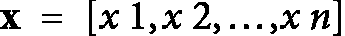

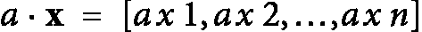

这个操作结果是一个新向量，其维度与原始向量相同，但每个分量都乘以标量值 ??。

向量之间有两种乘法类型：点积 (`·`) 和叉积 (`×`)。点积是我们常在机器学习算法中使用的。

点积是一种可以应用于两个向量（`x = [x 1, x 2, … , x n]`和`y = [y1, y2, ..., yn]`）的数学运算。它有许多实际应用，其中之一是帮助确定它们的相似性。它被定义为两个向量对应元素的乘积之和。向量 `x` 和 `y` 的点积用符号 `x · y`（中间有一个点）表示，并定义为以下内容：

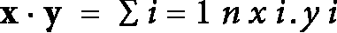

其中 `n` 代表向量的维度。点积是一个标量量，可以用来测量两个向量之间的角度，以及一个向量在另一个向量上的投影。它还在许多机器学习算法中发挥着至关重要的作用，包括线性回归和神经网络。

点积是交换律的，这意味着向量的顺序会影响结果。这意味着`x · y = y · x`. 此外，点积保持了标量乘法的分配律，意味着以下内容：

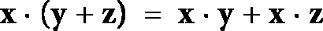

向量与其自身的点积也称为其平方范数或欧几里得范数。范数，用 *norm**(x)* 表示，表示向量的长度，并计算如下

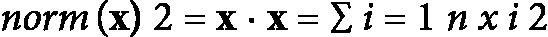

向量的归一化可以通过除以其范数（也称为欧几里得范数或向量的长度）来实现。这会得到一个单位长度的向量，记为 *x’*。归一化过程可以表示为

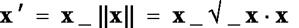

其中`x`是原始向量，而`||x||` 表示其范数。需要注意的是，归一化向量会保留其方向，同时将其长度设置为1，从而允许在不同空间中比较向量。

两个向量 `y = [y1, y2, ..., yn]` 的余弦相似度在数学上表示为归一化到单位长度后两个向量的点积。这可以表示如下：

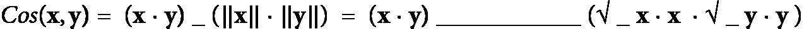

其中 `||x||`和 `||y||`分别是向量 `x` 和 `y` 的范数。此计算出的 `x` 和 `y` 之间的余弦相似度等同于这两个向量之间角度的余弦值，记为 *θ*。

点积为 `0` 的向量被认为是正交的，这意味着在存在非 `0` 向量的情况下，它们之间的角度是 90 度。我们可以得出结论，`0` 向量与任何向量都是正交的。如果一组向量中的每一对都是正交的，并且每个向量的范数为 `1`，则该组向量被认为是正交的。这种正交归一集在许多数学情境中非常有价值。例如，当在不同正交坐标系之间转换时，这种方法就会发挥作用，此时新坐标点的计算是基于修改后的方向集。这种方法被称为解析几何中的坐标变换，在线性代数领域得到了广泛的应用。

## 矩阵和向量的基本运算

**矩阵转置**是指获取矩阵的转置，这个过程涉及到交换其行和列。这意味着矩阵中原本位于 *(i, j)* 位置的元素现在占据了其转置矩阵中 *(j, i)* 位置。因此，原本大小为 *n × m* 的矩阵在转置后变成了 *m × n* 的矩阵。表示矩阵 `X` 转置的符号是`Xᵀ`。以下是一个矩阵转置操作的示例：

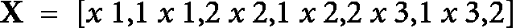

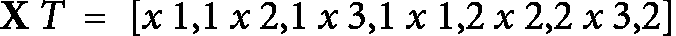

关键的是，矩阵`X`的转置`Xᵀ` 恢复到原始矩阵 `X`。此外，很明显，行向量可以转置为列向量，反之亦然。此外，以下对于矩阵和向量都成立：

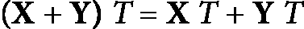

值得注意的是，矩阵和向量的点积是可交换的：

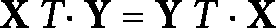

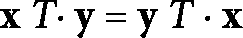

## 矩阵定义

在本节中，我们将介绍不同类型的矩阵定义：

+   **对称矩阵**：对称矩阵是一种方阵，其转置矩阵等于原矩阵。用数学术语来说，如果一个矩阵 `X` 是对称的，那么`X = Xᵀ`。例如，

    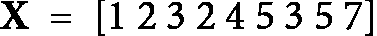

    是对称的。

+   **矩形对角矩阵**：这是一个在维度上为 *m × n* 的矩阵，其主对角线上的值非 `0`。

+   **上（或下）三角矩阵**：如果一个矩阵的所有（i,j）位置的元素（在主对角线以下或以上）都是0，则该矩阵称为上（三角）矩阵。接下来，我们将描述矩阵运算。

### 矩阵行列式

方阵的行列式提供了一个关于其乘以其坐标向量时对 `d`-维物体体积影响的观念。行列式，用 *det(A)* 表示，代表由矩阵的行向量或列向量形成的平行六面体的（有符号）体积。这种解释是一致的，因为由行和列向量确定的体积在数学上是相同的。当一个可对角化的矩阵 `A` 与一组坐标向量相互作用时，随之而来的扭曲被称为各向异性缩放。行列式有助于确定这种转换的尺度因子。方阵的行列式提供了关于通过矩阵乘法实现的线性变换的深刻见解。特别是，行列式的符号反映了变换对系统方向的影响。

计算行列式的公式如下：

1.  对于一个 *1×1* 的矩阵 `A`，其行列式等同于它内部的单个标量。

1.  对于较大的矩阵，可以通过锁定一列，`j`，然后使用该列中的元素进行展开来计算行列式。作为另一种选择，也可以固定一行，`i`，并沿着该特定行展开。无论选择固定行还是列，最终结果，即矩阵的行列式，都将保持一致。

    当 `j` 为从 `1` 到 `d` 的固定值时，

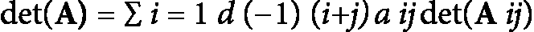

或者，固定 `i`，

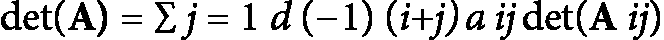

根据以下方程，我们可以看到某些情况可以很容易地计算：

+   **对角矩阵**：对于一个对角矩阵，其行列式是其对角元素之积。

+   **三角矩阵**：在三角矩阵的上下文中，行列式是通过乘以其所有对角元素得到的。如果一个矩阵的行或列的所有元素都是0，那么行列式也是0。

    对于一个 *2 × 2* 矩阵

    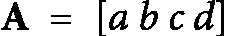

    其行列式可以计算为 *ad - bc*。如果我们考虑一个 *3 ×* `3` 矩阵，

    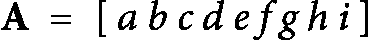

    矩阵的行列式计算如下：

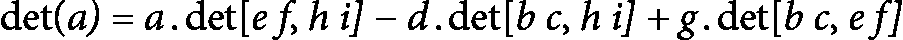

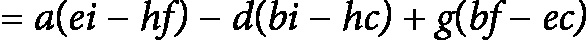

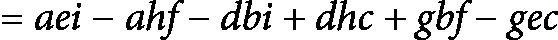

现在我们来讨论特征值和向量。

# 特征值和特征向量

一个属于 *d × d* 矩阵 `A` 的向量 `x`，如果满足方程 *Ax = λx*，其中 *λ* 代表与矩阵相关的特征值，则该向量是一个**特征向量**。这种关系界定了矩阵 `A` 和其对应的特征向量 `x` 之间的联系，这可以被视为矩阵的“拉伸方向”。在 `A` 是可以对角化的矩阵的情况下，它可以分解为一个 *d × d* 可逆矩阵 `V` 和一个对角 *d × d* 矩阵 *Δ*，使得

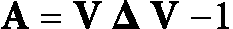

`V`的列包含`d`个特征向量，而*Δ*的对角元素包含相应的特征值。线性变换*Ax*可以通过一系列三个操作来直观理解。最初，`x`乘以`V⁻¹`计算`x`在`V`列关联的非正交基中的坐标。随后，`V⁻¹` x乘以*Δ*使用*Δ*中的因子缩放这些坐标，与特征向量的方向一致。最后，与`V`相乘将坐标恢复到原始基，从而在`d`个特征向量方向上实现各向异性缩放。

对角化矩阵表示涉及沿`d`个线性无关方向的各向异性缩放的变换。当`V`的列是正交归一向量时，`V - 1`等于其转置，`Vᵀ`，表示沿相互正交的方向进行缩放。在这种情况下，矩阵`A`总是对角化的，并且当`V`的列是正交归一向量时，表现出对称性，如以下关系所证实。

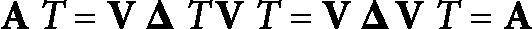

## 求特征向量的数值方法

确定矩阵 `A` 的特征向量的传统方法涉及找到方程的 `d` 个根，`λ1, ..., λd`，如下所示：

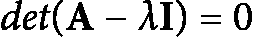

其中一些根可能是重复的。接下来的步骤涉及求解线性系统，形式为`(A - λI)x = 0`，通常使用高斯消元法实现。然而，这种方法可能并不总是最稳定或最精确的，因为多项式方程的求解器在实际应用中可能会表现出病态和数值不稳定性。确实，在工程中解决高次多项式方程的一种常见技术是构建具有与原始多项式相同特征多项式的伴随矩阵，然后确定其特征值。

## 特征值分解

特征值分解，也称为矩阵的奇异分解或对角化，是线性代数和计算数学中的一种强大数学工具。特征值分解的目标是将给定的矩阵分解为表示矩阵特征向量和特征值的矩阵的乘积。

矩阵 `A` 的特征值分解是将矩阵分解为两个矩阵的乘积：矩阵 `V` 和矩阵 `D`。

`V` 的列是矩阵 `A` 的特征向量，而 `D` 是一个对角矩阵，其对角线上包含相应的特征值。

特征值问题是要找到非零向量 `v` 和标量 *λ*，使得 *Av* = *λv*，其中 `A` 是一个方阵，因此 `v` 是 `A` 的一个特征向量。标量 *λ* 被称为矩阵 `A` 的特征值。特征值问题可以写成矩阵形式 *Av = λIv*，其中 `I` 是单位矩阵。

确定特征值的过程与矩阵 `A` 的特征方程密切相关，该特征方程是从 `det(A - λI) = 0`得到的多项式方程。特征方程可以解出特征值 *λ*，它们是方程的根。一旦找到特征值，可以通过解线性方程组`(A - λI)v = 0` 来找到特征向量。

特征值分解的一个重要特性是它允许我们将矩阵对角化，这意味着我们可以通过使用适当的特征向量矩阵将矩阵转换成对角形式。矩阵的对角形式很有用，因为它使我们能够轻松地计算矩阵的迹和行列式。

特征值分解的另一个重要特性是它能够揭示矩阵的结构。例如，对称矩阵的特征值总是实数，特征向量是正交的，这意味着它们彼此垂直。在非对称矩阵的情况下，特征值可以是复数，特征向量也不一定是正交的。

矩阵的特征值分解在数学、物理、工程和计算机科学中有着广泛的应用。在数值分析中，特征值分解用于求解线性系统、计算矩阵的特征值和找到矩阵的特征向量。在物理学中，特征值分解用于分析系统的稳定性，例如微分方程中平衡点的稳定性。在工程学中，特征值分解用于研究系统的动力学，例如机械系统的振动。

在计算机科学领域，特征值分解在多个领域都有广泛的应用，包括机器学习和数据分析。在机器学习中，特征值分解在实现**主成分分析**（PCA）中扮演着关键角色，这是一种用于大规模数据集降维的技术。在数据分析领域，特征值分解被用来计算**奇异值分解**（SVD），这是一种用于剖析和理解复杂数据集的有力工具。

## 奇异值分解

最小化问题`xᐪAx`，其中`x`是一个具有单位范数的列向量，而`A`是一个对称的*d × d*数据矩阵，是众多机器学习场景中遇到的典型问题。这种问题类型常出现在主成分分析、奇异值分解和谱聚类等应用中，这些都涉及特征工程和降维。优化问题可以表述如下：

最小化

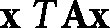

受限于

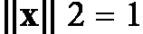

我们可以将优化问题表示为最大化或最小化形式。施加约束，使得向量 `x` 必须是单位向量，这显著改变了优化问题的本质。与上一节相比，矩阵 `A` 的正半定性质对于确定解已不再至关重要。即使 `A` 是不定矩阵，对向量 `x` 的范数约束也能确保一个明确的解，防止出现具有无界大小或平凡解（如 `0` 向量）的向量。**奇异值分解**（**SVD**）是一种数学技术，它将一个矩形矩阵 `A` 分解为三个矩阵：`U`、`S` 和`Vᐪ`。矩阵 `A` 被定义为 *n × p* 矩阵。SVD 定理表明 `A` 可以表示为三个矩阵的乘积：`U[n×n]S[n×p]V[p×p]`，其中`UᐪU = I[n×n]`，和`VᐪV = I[p×p]`，并且 `U` 和 `V` 是正交矩阵。

`U` 矩阵的列被称为左奇异向量，而 `V` 矩阵转置`Vᐪ`的行是右奇异向量。具有奇异值的 `S` 矩阵是一个与 `A` 相同大小的对角矩阵。奇异值分解将原始数据分解到一个定义向量是正交归一（既是正交又是单位）的坐标系中。奇异值分解的计算涉及识别矩阵`AAᐪ`和`AᐪA`的特征值和特征向量。矩阵 `V` 的列由`AᐪA` 的特征向量组成，而矩阵 `U` 的列由`AAᐪ` 的特征向量组成。`S` 矩阵中的奇异值是从`AAᐪ` 或`AᐪA` 的特征值的平方根得到的，并按降序排列。这些奇异值是实数。如果 `A` 是实矩阵，`U` 和 `V` 也将是实数。

为了说明奇异值分解（SVD）的计算，提供了一个示例。考虑一个 *4 × 2* 矩阵。可以通过计算`AAᵀ`和`AᵀA`来找到矩阵的特征值，然后确定这些矩阵的特征向量。`U` 的列由 `AAᵀ`的特征向量组成，而 `V` 的列由`AᵀA`的特征向量组成。`S` 矩阵由 `AAᵀ`或`AᵀA` 的特征值的平方根组成。在给定的示例中，通过求解特征方程`|w - λI| = 0`来找到特征值，其中 `W` 是矩阵，`I` 是单位矩阵，而 *λ* 是特征值。然后通过求解从特征值方程导出的方程组来找到特征向量。最终通过结合特征向量和奇异值得到最终的矩阵 `U`、`S` 和 `Vᵀ`。

应该注意的是，单个值是按降序排列的，其中`λ1 > λ2 > ...`

让我们继续讨论机器学习的基本概率。

# 机器学习的基本概率

概率提供了关于事件发生的可能性的信息。在这个领域，有几个关键术语是重要的，需要理解：

+   **试验或实验**：一个以一定可能性产生特定结果的行为

+   **样本空间**：这包括给定实验的所有潜在结果

+   **事件**：这表示样本空间的一个非空部分

因此，从技术角度讲，概率是在进行实验时事件发生的可能性的度量。

在这个非常简单的例子中，事件 `A` 有一个结果时的概率等于事件 `A` 的概率除以所有可能事件的机会。例如，在抛一个公平的硬币时，有两种相同机会的结果：正面和反面。出现正面的概率将是 *1/(1+1) = ½*。

为了计算给定事件 `A` 和样本空间 `S` 的概率，其中 `A` 有 `n` 个结果，事件 A 的概率计算如下

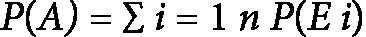

其中`E1, ..., En`表示 `A` 中的结果。假设实验的所有结果都有相同的机会，并且选择一个结果不会影响后续轮次中选择其他结果（这意味着它们在统计上是独立的），那么

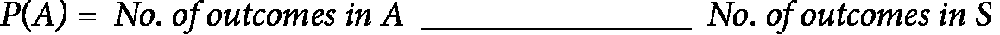

因此，概率的值从 `0` 到 `1`，样本空间代表了所有可能结果的完整集合，表示为 *P(S) =* `1`。

## 统计独立

在统计学领域，如果事件 `A` 的发生不影响事件 `B` 发生的可能性，则称这两个事件是独立的。用正式的说法，当事件 `A` 和 `B` 独立时，恰好是 *P(A and B) = P(A)P(B)*，其中 *P(A)* 和 *P(B)* 分别是事件 `A` 和 `B` 发生的概率。

考虑以下例子来阐明统计独立的概念：假设我们有两枚硬币，一枚是公平的（出现正面或反面的机会相等）和一枚是有偏的（出现正面的概率大于反面）。如果我们同时抛掷这两枚硬币，这两个事件在统计上是独立的，因为一枚硬币抛掷的结果不会改变另一枚硬币出现正面或反面的概率。具体来说，两枚硬币同时出现正面的概率是各自概率的乘积：*(1/2) * (3/4) =* *3/8*。

统计独立是统计学和概率论中的一个关键概念，在机器学习中常被用来描述数据集中变量之间的关系。通过理解这些关系，机器学习算法可以更好地发现模式并做出更精确的预测。以下我们将描述不同类型事件之间的关系：

+   **互补事件**：事件 `A` 的互补事件，表示为 *A’*，包括了样本空间中不属于 `A` 的所有可能结果的概率。重要的是要理解 `A` 和 *A’* 在统计上是独立的：

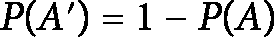

+   **并集和交集**：与`A`互补的事件，表示为*A’*，包括样本空间中不在`A`中的所有潜在结果的概率。重要的是要理解`A`和*A’*在统计学上是独立的。

+   **互斥**：当两个事件没有共同的结果时，它们被视为互斥的。换句话说，如果`A`和`B`是互斥事件，那么*P(A* *∩* *B) = 0*。这个结论可以从概率的加法规则中得出，因为`A`和`B`是互斥事件：

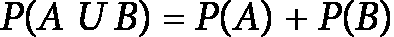

+   **独立**：当其中一个事件的发生不影响另一个事件的发生时，这两个事件被认为是独立的。如果`A`和`B`是两个独立事件，那么

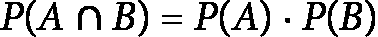

接下来，我们将描述离散随机变量、其分布以及如何使用它来计算概率。

## 离散随机变量及其分布

离散随机变量指的是可以假设有限或可数无限多个潜在结果的变量。此类变量的例子可能包括抛硬币得到的正面数量、在特定时间段内通过收费站的汽车数量，或者教室中金发学生的数量。

离散随机变量的概率分布为变量可能采用的每个潜在结果分配一定的可能性。例如，在抛硬币的情况下，概率分布将0.5的概率分配给`0`和`1`，分别代表反面和正面。对于汽车收费站场景，分布可能将*0.1*的概率分配给没有汽车通过，*0.3*的概率分配给一辆车，*0.4*的概率分配给两辆车，*0.15*的概率分配给三辆车，以及*0.05*的概率分配给四辆车或更多。

可以通过**概率质量函数**（**PMF**）来图形化表示离散随机变量的概率分布，该函数将变量的每个可能结果与其发生的可能性相关联。这个函数通常以条形图或直方图的形式表示，每个条形表示特定值的概率。

离散随机变量的概率质量函数（PMF）受两个关键原则的约束：

+   必须在随机变量的所有潜在值上都是非负的

+   所有可能结果的概率总和应等于1

离散随机变量的期望值可以揭示其中心趋势，计算为其可能结果的概率加权平均值。这个期望值表示为*E[X]*，其中`X`代表随机变量。

## 概率密度函数

**概率密度函数**（PDF）是描述连续随机变量分布的工具。它可以用来计算一个值落在特定范围内的概率。简单来说，它有助于确定连续变量`X`在区间[*a, b*]内或统计学上的值出现的概率。

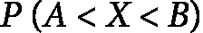

对于连续变量，单个值出现的概率始终为0，这与可以分配非`0`概率给不同值的离散变量形成对比。PDF提供了一种估计值落在给定范围内的可能性，而不是单个值。

例如，你可以使用概率密度函数来找出下一个测量的智商分数落在*100*到*120*之间的概率。

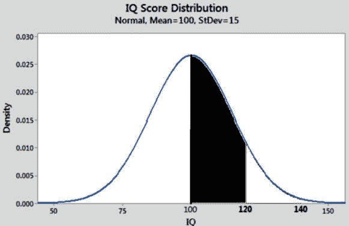

图2.2 – 智商100至120的概率密度函数

为了确定离散随机变量的分布，可以提供其概率质量函数（PMF）或**累积分布函数**（CDF）。对于连续随机变量，我们主要利用CDF，因为它已经建立。然而，PMF不适用于这些类型的变量，因为对于所有在实数集中的`x`，*P(X=x)*等于`0`，给定`X`可以取`a`和`b`之间的任何实数值。因此，我们通常定义概率密度函数。概率密度函数类似于物理学中的质量密度概念，表示概率的集中。其单位是每单位长度的概率。为了理解概率密度函数，让我们分析一个连续随机变量`X`，并建立如下函数*fX(x)*：

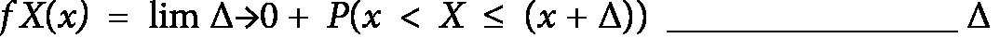

如果极限存在。

函数`fX(x)`提供了在给定点 `x` 的概率密度。这相当于区间 *(x, x + Δ]* 的概率与该区间长度的比值的极限。

让我们考虑一个具有绝对连续累积分布函数的连续随机变量 `X`，表示为`FX(x)`。如果`FX(x)`在 `x` 处可导，则函数`fX(x)` 被称为 `X` 的概率密度函数：

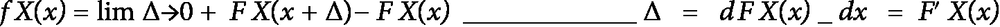

假设`FX(x)` 在 `x`处可导。

例如，让我们考虑一个具有均匀`U(a, b)`分布的连续均匀随机变量`X`。其累积分布函数（CDF）由以下公式给出：

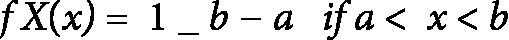

这对于任何在边界之外的x都是`0`。

通过积分，可以从概率密度函数（PDF）获得CDF：

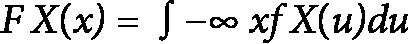

此外，我们还有

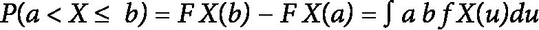

因此，如果我们对整个实数线进行积分，我们将得到1：

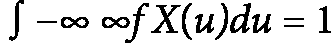

明确来说，当我们对概率密度函数在整个实数线上进行积分时，结果应该等于`1`。这意味着概率密度曲线下的面积必须等于`1`，或者*P(S) = 1*，这在均匀分布中依然成立。概率密度函数表示概率密度；因此，它必须是非负的，并且可以超过`1`。

考虑一个连续随机变量 `X`，其概率密度函数（PDF）表示为`fX(x)`. 以下性质适用：

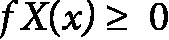

对于所有实数 x

接下来，我们将继续介绍最大似然估计。

### 最大似然估计

最大似然估计是一种统计方法，用于估计概率分布的参数。目标是确定最大化观察数据似然性的参数值，本质上确定最有可能生成数据的参数。

假设我们有一个从具有概率分布`f(x|θ)`的总体中抽取的随机样本`X = {X1, ..., Xn}`，其中 *θ* 是参数的向量。给定参数 *θ*，观察样本 `X` 的似然定义为观察每个数据点的概率的乘积：

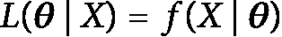

在具有独立同分布观测值的情况下，似然函数可以表示为单变量密度函数的乘积，每个函数都在相应的观测值上评估：

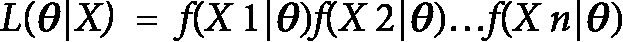

**最大似然估计**（MLE）是在参数空间中提供似然函数最大值的参数向量值。

在许多情况下，使用似然函数的自然对数，即所谓的**对数似然**，会更加方便。对数似然的峰值出现在似然函数最大值相同的参数向量值处，而达到最大值（或最小值）所需的条件是通过将每个参数的对数似然导数等于0来获得的。如果对数似然相对于参数是可微的，这些条件将导致一组方程，可以通过数值方法求解以推导出最大似然估计（MLE）。一个MLE对机器学习模型性能产生显著影响的常见用例或场景是在线性回归中。在构建线性回归模型时，MLE通常用于估计定义输入特征与目标变量之间关系的系数。MLE有助于找到系数的值，以最大化在假设的线性回归模型下观察给定数据的似然性，从而提高预测的准确性。

参数的最大似然估计（MLEs）*θ*是使似然函数最大化的值。换句话说，最大似然估计（MLEs）是使观察到的数据`X`最可能的*θ*的值。

为了找到最大似然估计（MLEs），我们通常取似然函数的自然对数，因为与乘积本身相比，处理乘积的对数通常更容易：

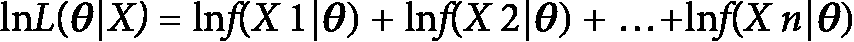

最大似然估计（MLEs）是通过将关于每个参数的似然函数对数偏导数等于`0`来确定的，然后解这些方程以找到参数：

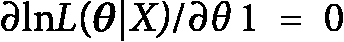

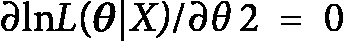

...

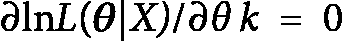

其中 `k` 是 *θ* 中的参数数量。最大似然估计器的目标是找到 *θ*，使得

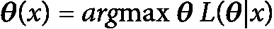

一旦找到了最大似然估计值，它们就可以用来根据样本数据对总体进行预测。最大似然在许多领域中得到广泛应用，包括心理学、经济学、工程学和生物学。它作为理解变量之间联系和基于观察数据预测结果的有力工具。例如，使用最大似然估计构建单词预测器。

接下来，我们介绍单词自动补全的问题，也称为**单词预测**，这是一个功能，其中应用程序预测用户接下来可能输入的单词。单词预测的目的是通过根据用户的先前输入和其他上下文因素预测用户可能输入的内容来节省时间和简化输入。单词预测可以在许多应用程序中以各种形式找到，包括搜索引擎、文本编辑器和移动设备键盘，旨在节省时间和提高输入的准确性。

给定用户输入的一组单词，我们该如何建议下一个单词？

如果单词是**The United States of**，那么假设下一个单词将是**America**是显而易见的。然而，对于**How are**的下一个单词，我们该怎么办？有人可能会建议几个可能的下一个单词。

通常不会只有一个明确的下一个单词。因此，我们希望提出最可能的单词，或者甚至是最可能的单词。在这种情况下，我们会对提出可能的下一个单词的概率表示感兴趣，并选择最可能的下一个单词。

最大似然估计器为我们提供了这种精确的能力。它可以告诉我们，给定用户输入的前一个单词，哪个单词最有可能。

为了计算最大似然估计（MLE），我们需要计算所有单词组合的概率函数。我们可以通过处理大量文本并计算每种单词组合出现的次数来实现这一点。

考虑审查一个具有以下出现次数的大量文本：

|  | **“****you”** | **“****they”** | **“****those”** | **“****the”** | **Any** **other word** |
| --- | --- | --- | --- | --- | --- |
| “how are …” | 16 | 14 | 0 | 100 | 10 |
| not “how are…” | 200 | 100 | 300 | 1,000 | 30,000 |

表2.1 – 文档中n-gram出现次数的样本

例如，在文本中有16次出现“how are you”的序列。有140个长度为三的序列以“how are”开头。这可以这样计算：

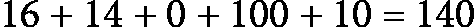

有216个长度为三的序列以单词“you”结尾。这可以这样计算：

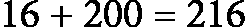

现在，让我们提出一个最可能下一个单词的公式。

基于概率变量的常见最大似然估计`W3`，公式将是为了找到一个`W3`的值，该值最大化：

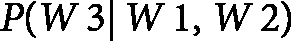

然而，这个常见的公式有几个特性，对我们应用来说并不有利。

考虑下一个公式，它具有对我们用例必要的特定优势。它是参数估计的最大似然公式，意味着估计确定性参数。它建议找到一个`W3`的值，使其最大化：

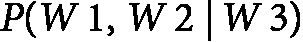

`W3`绝非一个确定性的参数，然而，这个公式适合我们的用例，因为它减少了常见的词义偏差，强调了上下文匹配，并调整了词的特定性，从而增强了我们预测的相关性。我们将在本练习的结论中进一步阐述这些特性。

让我们改进这个公式，使其更容易计算：

在我们的情况下，`W1`代表“如何”，而`W2`代表“是”。

下一个词有五个候选者；让我们计算每个候选者的概率：

+   P(“how”, “are” | “you”) = 16 / (200 + 16) = 16/216 = 2/27

+   P(“how”, “are” | “they”) = 14 / (100 +14) = 14/114 = 7/57

+   P(“how”, “are” | “those”) = 0 / 300 = 0

+   P(“how”, “are” | “the”) = 100 / (1000 + 100) = 100/1100 = 1/11

+   P(“how”, “are” | 任何其他词) = 10 / (30,000 + 10) = 10/30010 = 1/3001

在所有选项中，概率最高的是 7/57，这是当“they”是下一个词时实现的。

注意，这个最大似然估计器的直觉是建议的下一个词使得用户输入的词最有可能。有人可能会想，为什么不取给定前两个词最可能出现的词，即，概率变量的原始最大似然公式？从表中，我们看到给定“how are”这个词组，最频繁出现的第三个词是“the”，概率为 100/140。然而，这种方法不会考虑到“the”这个词在整体上极其普遍的事实，因为它在文本中是最频繁使用的。因此，它的高频率并不是由于它与前两个词的关系；而是因为它在一般情况下是一个非常常见的词。我们选择的最大似然公式正是考虑了这一点。

## 贝叶斯估计

贝叶斯估计是一种统计方法，它涉及根据新数据更新我们对感兴趣量的信念或概率。术语“贝叶斯”指的是托马斯·贝叶斯，一位18世纪的统计学家，他首先提出了贝叶斯概率的概念。

在贝叶斯估计中，我们开始于对感兴趣量的先验信念，这些信念以概率分布的形式表达。随着我们收集新的数据，这些先验信念会得到更新。更新的信念以后验分布的形式表示。贝叶斯框架提供了一种系统的方法来使用新数据更新先验信念，同时考虑到先验信念和新数据的不确定性程度。

后验分布是使用贝叶斯定理计算的，这是贝叶斯估计的基本方程。贝叶斯定理指出

其中 *Θ* 是感兴趣的量，`X` 是新的数据，*P(Θ|X)* 是后验分布，*P(X|Θ)* 是给定参数值的数据似然，*P(Θ)* 是先验分布，而 *P(X)* 是边缘似然或证据。

边缘似然的计算如下：

其中积分是在*Θ*的整个空间上进行的。边缘似然通常用作归一化常数，确保后验分布积分等于`1`。

在贝叶斯估计中，选择先验分布非常重要，因为它反映了我们在收集任何数据之前对感兴趣数量的信念。先验分布可以根据先验知识或先前研究来选择。如果没有先验知识，可以使用非信息性先验，例如均匀分布。

一旦计算出后验分布，就可以用它来对感兴趣的数量进行预测。例如，后验分布的均值可以作为点估计，而后验分布本身可以用来建立可信区间。这些区间代表了目标数量真实值可能存在的可能范围。

# 摘要

本章主要介绍了机器学习中的线性代数和概率论，涵盖了理解许多机器学习算法所必需的基本数学概念。本章从线性代数的复习开始，包括矩阵乘法、行列式、特征向量和特征值等内容。随后转向概率论，介绍了随机变量和概率分布的基本概念。我们还涵盖了统计推断中的关键概念，如最大似然估计和贝叶斯推断。

在下一章中，我们将介绍自然语言处理（NLP）的机器学习基础，包括数据探索、特征工程、选择方法和模型训练与验证等内容。

# 进一步阅读

请参考以下附加阅读内容：

+   **豪斯霍尔德反射矩阵**：豪斯霍尔德反射矩阵，或称豪斯霍尔德矩阵，是一种在数值线性代数中由于计算有效性和数值稳定性而被使用的线性变换。这种矩阵用于在平面或超平面上对给定的向量进行反射，使向量在特定维度上只具有非`0`分量。**豪斯霍尔德矩阵**（*`H`*）定义为

在这里，`I`是单位矩阵，而`u`是一个定义反射平面的单位向量。

豪斯霍尔德变换的主要目的是执行QR分解并将矩阵简化为三对角或海森伯格形式。其对称性和正交性使得豪斯霍尔德矩阵在计算上高效且数值稳定。

+   **可对角化**：如果一个矩阵可以写成`D = P⁻¹AP`的形式，其中`A`是原始矩阵，`D`是对角矩阵，而`P`是一个其列是`A`的特征向量的矩阵，那么这个矩阵被称为可对角化的。对角化简化了线性代数中的许多计算，因为对角矩阵的计算通常更为直接。为了使一个矩阵可对角化，它必须拥有足够的线性无关的特征向量来构成其空间的基，通常情况下，当所有特征值都不同时，这种情况是成立的。

+   **可逆**：可逆矩阵，也称为非奇异矩阵或非退化矩阵，是一个有逆的方阵。如果一个矩阵，`A`，是可逆的，那么存在另一个矩阵，通常表示为`A⁻¹`，当它们相乘时，会产生单位矩阵。换句话说，`AA⁻¹ = A⁻¹A = I`，其中 `I` 是单位矩阵。单位矩阵是一个特殊的方阵，其对角线上的元素为`1`，其余位置为`0`。逆矩阵的存在很大程度上取决于矩阵的行列式——一个矩阵是可逆的当且仅当其行列式不为0。可逆矩阵在数学的许多领域都非常重要，包括解线性方程组、矩阵分解以及在工程和物理中的许多应用。

+   **高斯消元法**：高斯消元是线性代数中用于解线性方程组的基本算法。它通过将系统转换为等价系统来实现，在该系统中方程更容易求解。这种方法使用一系列操作来修改方程组，目的是创建行阶梯形或简化行阶梯形。以下是高斯消元法的简化步骤：首先，交换行以移动任何带有首项系数（从左数第一个非`0`数字，也称为主元）的行，以便在顶部有`1`。然后，将任何行乘以或除以一个标量，以创建一个首项系数为`1`（如果尚未存在）。最后，通过加减行来创建主元下方的`0`和主元以上方的`0`。一旦矩阵处于行阶梯形（所有`0`行都在底部，每个首项系数都在其上方行的首项系数右侧），我们就可以使用回代法来找到变量。如果我们进一步简化矩阵到简化行阶梯形（每个首项系数是其列中唯一的非`0`项），则可以直接从矩阵中读取解。高斯消元法还可以用于找到矩阵的秩、计算行列式以及如果系统是方阵且有唯一解，则执行矩阵求逆。

+   **迹**：方阵的迹是其对角元素的和。它表示为 *Tr(A)* 或 *trace(A)*，其中 `A` 是一个方阵。例如，如果

    ![]" separators="|"><mml:mrow><mml:mtable><mml:mtr><mml:mtd><mml:mi>a</mml:mi></mml:mtd><mml:mtd><mml:mi>b</mml:mi></mml:mtd></mml:mtr><mml:mtr><mml:mtd><mml:mi>c</mml:mi></mml:mtd><mml:mtd><mml:mi>d</mml:mi></mml:mtd></mml:mtr></mml:mtable></mml:mrow></mml:mfenced></mml:math>](img/38.png)

    *Tr(A) = a + d*.

# 参考文献

+   Alter O, Brown PO, Botstein D. (2000) *全基因组表达数据处理的奇异值分解和建模*. 美国国家科学院院刊, 97, 10101-6.

+   Golub, G.H., and Van Loan, C.F. (1989) *矩阵计算*, 第二版. (巴尔的摩: 约翰霍普金斯大学出版社).

+   Greenberg, M. (2001) *微分方程与线性代数* (Upper Saddle River, N.J. : 预习出版社).

+   Strang, G. (1998) *线性代数导论* (Wellesley, MA : Wellesley-Cambridge Press).

+   Lax, Peter D. *线性代数及其应用*. 第78卷. 约翰·威利与 sons, 2007.

+   Dangeti, Pratap. *机器学习统计学*. Packt Publishing Ltd, 2017.

+   DasGupta, Anirban. *概率论与统计机器学习：基础与高级主题*. 纽约: 斯普林格, 2011.
