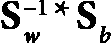
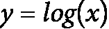
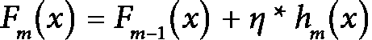

# 第三章：在自然语言处理中释放机器学习的潜力

在本章中，我们将深入研究机器学习（ML）的基本原理和预处理技术，这些技术对于自然语言处理（NLP）任务是必不可少的。机器学习是构建可以从数据中学习的模型的有力工具，而自然语言处理（NLP）是机器学习中最激动人心和最具挑战性的应用之一。

到本章结束时，你将全面了解数据探索、预处理和数据拆分，了解如何处理不平衡数据技术，并了解一些成功机器学习所需的常见机器学习模型，特别是在自然语言处理（NLP）的背景下。

本章将涵盖以下主题：

+   数据探索

+   常见机器学习模型

+   模型欠拟合和过拟合

+   数据拆分

+   超参数调整

+   集成模型

+   处理不平衡数据

+   处理相关数据

# 技术要求

本章以及本书后续章节假定你具备编程语言（尤其是Python）的先验知识。还期望你已经阅读了前面的章节，以便熟悉将在本章详细讨论的必要线性代数和统计学概念。

# 数据探索

在方法论环境中工作，数据集通常是众所周知的且已预处理，例如Kaggle数据集。然而，在现实世界的商业环境中，一项重要任务是定义来自所有可能数据来源的数据集，探索收集到的数据以找到最佳预处理方法，并最终决定最适合问题和底层数据的机器学习和自然语言模型。这个过程需要仔细考虑和分析数据，以及对当前业务问题的深入理解。

在自然语言处理（NLP）中，数据可能相当复杂，因为它通常包括文本和语音数据，这些数据可能是非结构化的且难以分析。这种复杂性使得预处理成为准备数据供机器学习模型使用的一个基本步骤。任何自然语言处理（NLP）或机器学习（ML）解决方案的第一步都是探索数据，以了解更多关于它的信息，这有助于我们决定解决问题的路径。

一旦数据预处理完成，下一步就是探索它，以便更好地理解其特性和结构。数据探索是一个迭代过程，涉及可视化和分析数据，寻找模式和关系，以及识别潜在的问题或异常值。这个过程可以帮助我们确定哪些特征对我们的人工智能模型最重要，并识别任何潜在的数据质量或偏差问题。为了通过人工智能模型简化数据并增强分析，可以采用诸如分词、词干提取和词形还原等预处理方法。在本章中，我们将概述人工智能问题的一般预处理技术。在下一章中，我们将深入探讨特定于文本处理的预处理技术。值得注意的是，采用有效的预处理技术可以显著提高人工智能模型的性能和准确性，使它们更加稳健和可靠。

最后，一旦数据预处理和探索完成，我们就可以开始构建我们的人工智能模型。没有一种神奇的解决方案适用于所有人工智能问题，因此仔细考虑哪种模型最适合当前的数据和问题是至关重要的。存在多种类型的自然语言处理模型，包括基于规则的、统计的和深度学习模型。每种模型类型都有其独特的优势和劣势，这强调了选择最适合特定问题和数据集的重要性。

数据探索是人工智能工作流程中的重要且初始步骤，涉及在构建人工智能模型之前分析和理解数据。数据探索的目标是深入了解数据，识别模式，检测异常，并为建模准备数据。数据探索有助于选择正确的人工智能算法，并确定最佳的特征集。

这里有一些在数据探索中常用的技术：

+   **数据可视化**：数据可视化涉及通过图形或图像格式来表示数据。它使数据可视化探索成为可能，提供了关于其分布、模式和关系的见解。在数据可视化中广泛使用的技术包括散点图、条形图、热图、箱线图和相关性矩阵。

+   **数据清洗**：数据清洗是预处理的一个步骤，其中我们识别错误、不一致性和缺失值并纠正它们。由于人工智能模型对数据中的错误敏感，这会影响模型的最终结果。删除重复项和填充缺失值是一些常见的数据清洗技术。

+   **特征工程**：特征工程在通过从现有数据中构建新特征来优化机器学习模型的有效性方面发挥着至关重要的作用。这个过程不仅涉及识别相关特征，还包括转换现有特征和引入新特征。包括缩放、归一化、降维和特征选择在内的各种特征工程技术有助于提高模型的总体性能。

+   **统计分析**：统计分析运用一系列统计技术来审查数据，揭示其内在属性的有价值见解。基本的统计方法包括假设检验、回归分析和时间序列分析，所有这些都有助于全面理解数据的特征。

+   **领域知识**：利用领域知识意味着应用对数据领域已有的理解来提取洞察并做出明智的决策。这种知识在识别相关特征、解释结果以及选择最适合当前任务的机器学习算法方面非常有价值。

我们将在接下来的小节中探讨这些技术的每一个。

## 数据可视化

数据可视化是机器学习的一个关键组成部分，因为它使我们能够更轻松地理解和探索复杂的数据集。这涉及到使用图表、图形和其他类型的视觉辅助工具来创建数据的视觉表示。通过视觉呈现数据，我们可以识别出在仅检查原始数据时可能不明显存在的模式、趋势和关系。

对于自然语言处理任务，数据可视化可以帮助我们深入了解文本数据中的语言模式和结构。例如，我们可以创建词云来可视化语料库中单词的频率，或使用热图来显示单词或短语的共现。我们还可以使用散点图和折线图来可视化随时间变化的情感或主题。

对于机器学习来说，散点图是一种常见的可视化类型，用于显示两个变量之间的关系。通过在X轴和Y轴上绘制两个变量的值，我们可以识别它们之间存在的任何模式或趋势。散点图在识别具有相似特征的数据点的簇或组方面特别有用。

在机器学习中经常使用的一种可视化类型是直方图，这是一种展示单个变量分布的工具。通过将数据分组到不同的区间并描绘每个区间中数据点的频率，我们可以确定在数据集中占主导地位的价值范围。直方图在检测异常值或异常情况以及识别数据可能表现出偏斜或偏差的区域方面非常有用。

除了这些基本的可视化之外，机器学习从业者经常使用更高级的技术，例如降维和网络可视化。降维技术，如**主成分分析**（**PCA**）和**t-分布随机邻域嵌入**（**t-SNE**），常用于降维以及更轻松地可视化或分析数据。另一方面，网络可视化用于显示实体之间的复杂关系，例如词语的共现或社交媒体用户之间的联系。

## 数据清洗

数据清洗，也称为数据净化或数据清理，涉及识别和纠正或消除数据集中的错误、不一致性和不准确性。在机器学习数据准备的这个关键阶段，它对模型的准确性和性能有重大影响，依赖于用于训练的数据质量。在数据清洗中采用了许多常见的技术。让我们更详细地了解一下。

### 处理缺失值

缺失数据是许多机器学习项目中常见的问题。处理缺失数据很重要，因为机器学习模型无法处理缺失数据，可能会产生错误或提供不准确的结果。

在机器学习项目中处理缺失数据有几种方法：

+   **删除行**：处理缺失数据可能涉及一种简单的方法，即丢弃包含这些值的行。然而，在采用这种方法时，谨慎行事至关重要，因为过度删除行可能会导致宝贵数据的丢失，从而影响模型的总体准确性。我们通常在数据集中只有几行，并且有几行缺失值时使用这种方法。在这种情况下，删除几行可能是训练我们的模型的一个好方法，而且最终性能不会受到显著影响。

+   **删除列**：另一种方法是删除包含缺失值的列。如果缺失值集中在少数几列，并且这些列对于分析不是很重要，那么这种方法可能是有效的。然而，删除重要的列可能会导致宝贵信息的丢失。在删除这些列之前，最好进行某种相关性分析，以查看这些列中的值与目标类别或值的关联性。

+   **均值/中位数/众数插补**：均值、中位数和众数插补涉及用从相应列中非缺失值得到的均值、中位数或众数来替换缺失值。这种方法易于实现，当缺失值很少且随机分布时可能有效。然而，它也可能引入偏差并影响数据的变异性。

+   **回归插补**：回归插补涉及根据数据集中其他变量的值预测缺失值。当缺失值与数据集中的其他变量相关时，此方法可能有效，但需要为每个具有缺失值的列构建回归模型。

+   **多重插补**：多重插补包括通过统计模型生成多个插补数据集，然后合并结果以生成最终数据集。这种方法在处理非随机分布的缺失值和数据集中大量空缺时特别有效。

+   **K最近邻插补**：K最近邻插补包括识别缺失值附近的k个最近数据点，并使用它们的值来插补缺失值。当缺失值在数据集中聚集在一起时，此方法可能有效。在这种情况下，我们可以找到与具有缺失值的数据集记录最相似的记录，然后使用这些记录的值的平均值作为该特定记录的缺失值。

从本质上讲，选择处理缺失数据的方法取决于缺失数据的性质和程度、分析目标和资源可用性。仔细评估每种方法的优缺点，并选择最适合特定项目的最合适方法至关重要。

### 移除重复项

消除重复项是一种常见的预处理措施，通过检测和删除重复记录来净化数据集。重复记录的出现可能归因于数据输入错误、系统故障或数据合并过程。重复项的存在可能会扭曲模型并导致不准确的分析。因此，识别和消除重复记录对于维护数据集的准确性和可靠性至关重要。

在数据集中移除重复项有不同的方法。最常见的方法是比较数据集的所有行以识别重复记录。如果有两个或更多行在所有列中都具有相同的值，则它们被认为是重复的。在某些情况下，如果某些列更容易出现重复，可能只需要比较列的子集。

另一种方法是使用唯一标识符列来识别重复项。唯一标识符列是包含每个记录唯一值的列，例如ID号码或唯一列的组合。通过比较唯一标识符列，可以识别并从数据集中删除重复记录。

在识别出重复记录之后，下一步是决定保留哪些记录以及删除哪些记录。一种方法是保留重复记录的第一个出现，并删除所有后续出现。另一种方法是保留信息最完整的记录，或者是最新的时间戳的记录。

认识到删除重复记录可能会导致数据集大小的减少，这可能会影响机器学习模型的表现至关重要。因此，评估删除重复记录对数据集和机器学习模型的影响是必不可少的。在某些情况下，如果重复记录包含其他记录无法获得的重要信息，可能需要保留重复记录。

### 标准化和转换数据

标准化和转换数据是准备数据用于机器学习任务的关键步骤。这个过程涉及对数据集的数值特征进行缩放和归一化，以便更容易解释和比较。标准化和转换数据的主要目标是通过对不同尺度和范围的特性影响进行缓解，从而提高机器学习模型的准确性和性能。用于标准化数据的一种广泛使用的方法被称为“标准化”或“Z分数归一化”。这种技术涉及将每个特征转换，使其具有零均值和标准差为1。标准化的公式如下所示：

在这里，`x` 代表特征，*mean(x)* 表示特征的均值，*std(x)* 表示特征的标准差，而 *x’* 表示分配给特征的新值。通过这种方式标准化数据，每个特征的取值范围被调整为以零为中心，这使得比较特征更容易，并防止具有大值的特征主导分析。

另一种转换数据的技术是“最小-最大缩放”。这种方法将数据重新缩放到一个一致的范围，通常在0到1之间。最小-最大缩放的公式如下所示：

在这个方程中，`x` 代表特征，*min(x)* 表示特征的最低值，而 *max(x)* 表示特征的最高值。Min-max缩放在数据的精确分布不是关键，但需要标准化数据以进行不同特征之间的有意义的比较时是有益的。

数据转换也可能涉及改变数据的分布。常用的转换是对数转换，它用于减轻数据中的异常值和偏斜的影响。这种转换涉及对特征值取对数，这有助于使分布正常化并减少极端值的影响。

总体而言，标准化和转换数据是机器学习数据预处理工作流程中的关键阶段。通过缩放和归一化特征，我们可以提高机器学习模型的准确性和性能，使数据更具可解释性，并有利于进行有意义的比较。

### 处理异常值

异常值是明显偏离数据集中其他观测值的数据点。它们的产生可能源于测量错误、数据损坏或真实的极端值。异常值的存在可能会对机器学习模型的输出产生重大影响，扭曲数据并破坏变量之间的关系。因此，处理异常值是机器学习数据预处理的重要步骤。

处理异常值有几种方法：

+   **移除异常值**：一种直接的方法是消除数据集中被识别为异常值的观测。然而，采用这种方法时必须谨慎，因为过度移除观测值可能会导致丢失有价值的信息，并可能引入分析结果的偏差。

+   **转换数据**：应用对数或平方根等数学函数来转换数据可以减轻异常值的影响。例如，对一个变量取对数可以减轻极端值的影响，因为对数尺度上的增长速度比原始值慢。

+   **Winsorizing**：Winsorizing是一种技术，涉及用数据集中最近的最高或最低值替换极端值。采用这种方法有助于保持样本大小和数据的整体分布。

+   **值填充**：值填充涉及用从数据集中剩余观测值中估计的值替换缺失或极端值。例如，用剩余观测值的均值或中位数替换极端值是一种常见的填充技术。

+   **使用稳健的统计方法**：稳健的统计方法对异常值的敏感性较低，即使在存在极端值的情况下也能得出更准确的结果。例如，选择中位数而不是均值可以有效地减少异常值对最终结果的影响。

强调选择异常值处理方法应针对数据的独特特性和具体问题量身定制至关重要。通常，建议采用多种方法的组合来全面处理异常值，并评估每种方法对结果的影响是必要的。此外，记录管理异常值的步骤对于可重复性和阐明决策过程非常重要。

### 纠正错误

在预处理阶段纠正错误是准备数据供机器学习使用的关键阶段。错误可能由于数据输入错误、测量差异、传感器不准确或传输故障等多种原因产生。在数据中纠正错误对于确保机器学习模型在可靠和精确的数据上训练至关重要，从而提高预测的准确性和可靠性。

存在几种纠正数据错误的技术。以下是一些广泛使用的方法：

+   **人工检查**：纠正数据错误的一种方法是对数据集进行人工检查，其中错误通过手工进行更正。这种方法经常被采用，尤其是在处理相对较小且可管理的数据集时。

+   **统计方法**：统计方法在识别和纠正数据错误方面非常有效。例如，当数据遵循已知的分布时，可以使用如Z分数这样的统计技术来检测异常值，然后可以选择删除或替换这些异常值。

+   **机器学习方法**：利用机器学习算法可以促进对数据错误的检测和纠正。例如，聚类算法在确定明显偏离更大数据集的数据点方面非常有价值。随后，这些确定的数据点可以进行进一步的检查和纠正。

+   **领域知识**：利用领域知识对于在数据中定位错误至关重要。例如，当从传感器收集数据时，考虑到传感器能够产生的预期值范围，可以识别和纠正错误。

+   **插补**：插补是一种在数据中填充缺失值的方法。这可以通过各种方式完成，包括使用均值或中位数插补等统计方法，以及k最近邻插补等机器学习算法。

选择技术取决于数据性质、数据集的大小以及您可用的资源等因素。

## 特征选择

特征选择涉及从数据集中选择最相关的特征来构建机器学习模型。目标是减少特征数量，同时不显著降低模型的准确性，从而提高性能、加快训练速度，并使模型解释更加直接。

存在多种特征选择方法。让我们看一下。

### 过滤方法

这些技术使用统计方法根据特征与目标变量的相关性对特征进行排序。常见的方法包括卡方、互信息和相关系数。然后根据预定义的阈值选择特征。

#### 卡方

卡方检验是机器学习中广泛使用的统计方法，特别适用于分类变量。此测试衡量两个随机变量之间的依赖性，提供一个P值，表示获得与实际观察结果一样或更极端结果的可能性。

在假设检验中，卡方检验用于评估收集到的数据是否与预期数据一致。卡方检验统计量较小表示匹配良好，而较大的统计量则表示匹配较弱。当P值小于或等于0.05时，会导致拒绝零假设，认为其极不可能。相反，当P值大于0.05时，结果为接受或“未能拒绝”零假设。当P值在0.05附近波动时，需要对假设进行进一步审查。

在特征选择中，卡方检验评估数据集中每个特征与目标变量之间的关系。它根据特征观察频率与预期频率之间是否存在统计上显著差异来确定显著性，假设特征与目标变量之间相互独立。具有高卡方分数的特征表现出对目标变量的更强依赖性，这使得它们在分类或回归任务中更具信息量。计算卡方的公式在以下方程中给出：

在这个公式中，`Oᵢ`表示观察值，而`Eᵢ`表示期望值。计算涉及找到观察频率与期望频率之间的差异，将结果平方，然后除以期望频率。这些值在所有特征类别上的总和给出了该特征的总体卡方统计量。

测试的自由度取决于特征中的类别数和目标变量中的类别数。

卡方特征选择的典型应用在于文本分类，特别是在文档中特定单词的存在或缺失作为特征的场景中。卡方检验有助于识别与特定类别或文档类别强烈相关的单词，从而使其在机器学习模型中作为特征使用。在分类数据中，尤其是在特征与目标变量之间关系非线性的情况下，卡方检验证明是特征选择的有价值方法。然而，对于连续或高度相关的特征，其适用性会降低，此时可能需要其他特征选择方法。

#### 互信息

互信息作为一种度量，用于衡量两个随机变量之间的相互依赖性。在特征选择的背景下，它量化了特征对目标变量提供的信息。核心方法包括计算每个特征与目标变量之间的互信息，最终选择互信息得分最高的特征。

从数学上讲，两个离散随机变量 `X` 和 `Y` 之间的互信息可以定义为以下：

在给定的方程中，*p(x, y)* 代表 `X` 和 `Y` 的联合概率质量函数，而 *p(x)* 和 *p(y)* 分别代表 `X` 和 `Y` 的边缘概率质量函数。

在特征选择的情况下，互信息计算涉及将特征视为 `X`，将目标变量视为 `Y`。通过计算每个特征的互信息得分，然后我们可以选择得分最高的特征。

为了计算互信息所需的概率质量函数，可以使用基于直方图的方法。这涉及到将每个变量的范围划分为固定数量的桶，并根据每个桶中观察到的频率来估计概率质量函数。或者，可以使用核密度估计来估计概率密度函数，然后基于估计的密度计算互信息。

在实际应用中，互信息通常与其他特征选择方法（如卡方检验或基于相关性的方法）一起使用，以增强特征选择过程的整体性能。

#### 相关系数

相关系数是两个变量之间线性关系强度和方向的指标。在特征选择领域，这些系数在识别与目标变量高度相关的特征方面非常有用，因此可以作为潜在的宝贵预测因子。

在特征选择中普遍使用的相关系数是皮尔逊相关系数，也称为皮尔逊的 `r`。皮尔逊的 `r` 衡量两个连续变量之间的线性关系，范围从 -1（表示完美的负相关）到 1（表示完美的正相关），0 表示无相关。其计算涉及将两个变量的协方差除以它们标准差的乘积，如下方程所示：

在给定的方程中，`X` 和 `Y` 代表感兴趣的两个变量，*cov()* 表示协方差函数，而 *std()* 表示标准差函数。

使用皮尔逊相关系数（Pearson’s `r`）进行特征选择涉及计算每个特征与目标变量之间的相关性。然后选择具有最高绝对相关系数的特征。高绝对相关系数表示与目标变量有强烈的关联，无论是正相关性还是负相关性。皮尔逊相关值及其相关程度的解释见 *表 3.1*：

| **皮尔逊** **相关系数** | **相关** **程度** |
| --- | --- |
| ± 1 | 完美相关 |
| ± 0.50 - ± 1 | 高度相关 |
| ± 0.30 - ± 0.49 | 中度相关 |
| < +0.29 | 低度相关 |
| 0 | 无相关 |

表 3 .1 – 皮尔逊相关值及其相关程度

值得注意的是，皮尔逊相关系数（Pearson’s `r`）仅适用于识别变量之间的线性关系。如果关系是非线性的，或者如果其中一个或两个变量是分类的，那么其他相关系数，如斯皮尔曼的`ρ`或肯德尔的相关系数`tau`可能更合适。此外，在解释相关系数时需要谨慎，因为高相关性并不一定意味着因果关系。

### 包装方法

这些技术通过迭代模型训练和测试深入到特征子集。众所周知的方法包括前向选择、后向消除和递归特征消除。虽然计算量较大，但这些方法有可能显著提高模型精度。

包装方法的具体示例是**递归特征消除**（**RFE**）。作为一种反向消除方法，RFE系统地移除最不重要的特征，直到剩余预定的特征数量。在每次迭代中，机器学习模型在现有特征上训练，并根据其特征重要性分数修剪最不重要的特征。这个过程持续进行，直到达到指定的特征数量。特征重要性分数可以从多种方法中提取，包括线性模型的系数值或从决策树中导出的特征重要性分数。RFE是一种计算成本较高的方法，但在特征数量非常大且需要减少特征空间时可能很有用。另一种方法是训练过程中的特征选择，这通常通过嵌入方法来完成。

### 嵌入方法

这些方法在模型的训练过程中选择特征。常见的方法包括LASSO和岭回归、决策树和随机森林。

### LASSO

**LASSO**，即**最小绝对收缩和选择算子**的缩写，是一种常用于机器学习特征选择的线性回归技术。其机制涉及向标准回归损失函数中引入惩罚项。这种惩罚鼓励模型将不太重要的特征的系数减少到零，从而有效地从模型中消除它们。

当处理高维数据时，特征的数量远超过样本数量，LASSO方法特别有价值。在这种情况下，区分预测目标变量的最关键特征可能具有挑战性。LASSO通过自动识别最相关的特征，同时缩小其他特征的系数，脱颖而出。

LASSO方法通过寻找以下优化问题的解来工作，这是一个最小化问题：

在给定的方程中，向量 `y` 代表目标变量，`X` 表示特征矩阵，`w` 表示回归系数向量，`λ` 是一个超参数，用于决定惩罚项的强度，而`||w||₁` 表示系数的`L₁`范数（即它们的绝对值之和）。

目标函数中包含 `L₁` 惩罚项促使模型精确地将某些系数置零，从而从模型中消除相关的特征。惩罚强度的程度由 `λ`超参数控制，这可以通过交叉验证进行微调。

与其他特征选择方法相比，LASSO具有多个优势，例如其处理相关特征的能力以及同时执行特征选择和回归的能力。然而，LASSO也有一些局限性，例如它倾向于从一组相关特征中仅选择一个特征，并且如果特征数量远大于样本数量，其性能可能会下降。

考虑LASSO在预测房价中的特征选择应用。想象一个包含关于房屋的详细信息的数据集，例如卧室数量、地块大小、建筑年份等，以及它们各自的售价。使用LASSO，我们可以确定预测售价的最关键特征，同时将线性回归模型拟合到数据集上。结果是这样一个模型，可以根据房屋的特征预测新房屋的售价。

### 岭回归

岭回归是一种适用于特征选择的线性回归方法，它与普通最小二乘回归非常相似，但引入了惩罚项以防止过拟合。

在岭回归中，成本函数通过包含一个与系数幅度的平方成正比的惩罚项而进行修改。这个惩罚项由一个超参数控制，通常表示为`λ`或`α`，它决定了正则化的强度。当`α`设置为零时，岭回归就退化为普通最小二乘回归。

惩罚项的影响体现在将系数的幅度缩小到零。这有助于减轻过拟合，阻止模型过度依赖任何单个特征。实际上，惩罚项通过减少不相关特征的重要性，充当一种特征选择的形式。

岭回归损失函数的方程如下：

这里，我们有以下内容：

+   `N` 是训练集中样本的数量。

+   `y` 是大小为 `N` 的目标值的列向量。

+   `X` 是输入特征的设计矩阵。

+   `w` 是待估计的回归系数向量。

+   ?? 是控制惩罚项强度的正则化参数。它是一个需要调整的超参数。

损失函数的第一个项衡量的是预测值与真实值之间的均方误差。第二个项是`L₂`惩罚项，它将系数缩小到零。岭回归算法找到使该损失函数最小化的回归系数值。通过调整正则化参数`α`，我们可以控制模型的偏差-方差权衡，较高的α值会导致更强的正则化和较低的过拟合。

岭回归可以通过检查模型产生的系数的幅度来进行特征选择。系数接近零或更小的特征被认为不太重要，可以从模型中删除。可以使用交叉验证调整`α`的值，以找到模型复杂性和准确性之间的最佳平衡。

岭回归的一个主要优点是它能够处理多重共线性，当自变量之间存在强相关性时会发生多重共线性。在这种情况下，普通最小二乘回归可能会产生不稳定和不可靠的系数估计，但岭回归可以帮助稳定估计并提高模型的总体性能。

### 选择LASSO或岭回归

岭回归和LASSO都是线性回归中使用的正则化技术，通过惩罚模型的系数来防止模型过拟合。虽然这两种方法都旨在防止过拟合，但它们在惩罚系数的方法上有所不同。

岭回归向**平方误差和**（**SSE**）添加一个惩罚项，该惩罚项与系数幅度的平方成正比。惩罚项由正则化参数`α`控制，它决定了应用于系数的收缩量。这个惩罚项将系数的值缩小到零，但不会将它们精确地设置为零。因此，岭回归可以用来减少模型中无关特征的影响，但不会完全消除它们。

另一方面，LASSO也向SSE添加一个惩罚项，但惩罚项与系数的绝对值成比例。与岭回归一样，LASSO也有一个正则化参数（`λ`），它决定了应用于系数的收缩量。然而，当正则化参数足够高时，LASSO具有将一些系数精确设置为零的独特属性。因此，LASSO可以用作特征选择，因为它可以消除无关特征并将它们的对应系数设置为0。

通常，如果数据集具有许多特征，其中只有少数被认为是重要的，LASSO回归是一个更好的选择，因为它会将无关特征的系数设置为0，从而得到一个更简单、更可解释的模型。另一方面，如果预计数据集中的大多数特征都是相关的，则岭回归是一个更好的选择，因为它会将系数缩小到零，但不会将它们精确地设置为零，从而保留模型中的所有特征。

然而，需要注意的是，岭回归和LASSO之间的最佳选择取决于具体问题和数据集，并且通常建议尝试两者并使用交叉验证技术比较它们的性能。

### 维度约简技术

这些方法将特征转换到低维空间，同时尽可能保留信息。常见的方法包括PCA、**线性判别分析**（**LDA**）和**t-SNE**。

#### PCA

PCA是机器学习中广泛使用的技术，用于降低大型数据集的维度，同时保留大部分重要信息。PCA的基本思想是将一组相关变量转换为一组称为主成分的不相关变量。

PCA的目标是在数据中识别最大方差的方向，并将数据投影到这些方向上，从而降低数据的维度。主成分按解释的方差量排序，第一个主成分解释了数据中最大的方差。

PCA算法包括以下步骤：

1.  **标准化数据**: PCA要求数据被标准化——也就是说，每个特征必须具有零均值和单位方差。

1.  **计算协方差矩阵**: 协方差矩阵是一个方阵，它衡量数据中成对特征之间的线性关系。

1.  **计算协方差矩阵的特征向量和特征值**: 特征向量代表数据集中最高方差的主要方向，而特征值量化了每个特征向量解释的方差程度。

1.  **选择主成分的数量**：保留主成分的数量可以通过分析特征值，并选择解释最大方差的前`k`个特征向量来确定。

1.  **将数据投影到选定的主成分上**：原始数据被投影到选定的主成分上，从而得到数据的低维表示。

主成分分析（PCA）可以通过选择解释数据中最大方差的前`k`个主成分来进行特征选择。这可以用于降低高维数据集的维度并提高机器学习模型的性能。然而，需要注意的是，PCA并不总是能带来性能的提升，特别是当数据已经是低维的或者特征之间没有高度相关性时。同时，还需要考虑所选主成分的可解释性，因为它们并不总是对应于数据中的有意义特征。

#### LDA

LDA是一种降维技术，用于机器学习中的特征选择。它通常用于分类任务，通过将特征转换到低维空间来减少特征数量，同时尽可能保留尽可能多的类区分信息。

在线性判别分析（LDA）中，目标是找到一个原始特征的线性组合，以最大化类之间的分离度。LDA的输入是一个标记示例的数据集，其中每个示例都是一个具有相应类标签的特征向量。LDA的输出是一组原始特征的线性组合，这些组合可以用作机器学习模型中的新特征。

执行LDA的第一步是计算每个类的均值和协方差矩阵。然后从类均值和协方差矩阵中计算出整体均值和协方差矩阵。目标是投影数据到低维空间，同时保留类信息。这是通过找到协方差矩阵的特征向量和特征值，按特征值降序排列，并选择与`k`个最大特征值对应的`k`个特征向量来实现的。所选特征向量构成新特征空间的基础。

线性判别分析（LDA）算法可以总结如下步骤：

1.  计算每个类的均值向量。

1.  计算每个类的协方差矩阵。

1.  计算整体均值向量和整体协方差矩阵。

1.  计算类间散布矩阵。

1.  计算类内散布矩阵。

1.  使用以下方程计算矩阵的特征向量和特征值：

这里，`S[w]`是类内散布矩阵，而`S[b]`是类间散布矩阵。

7. 选择具有最高特征值的`k`个主特征向量作为新的特征空间。

LDA在特征数量大而示例数量少时特别有用。它可以用于各种应用，包括图像识别、语音识别和NLP。然而，它假设类是正态分布的，并且类协方差矩阵是相等的，但在实际应用中这并不总是成立。

#### t-SNE

t-SNE是一种降维技术，用于在低维空间中可视化高维数据，常用于特征选择。它由Laurens van der Maaten和Geoffrey Hinton于2008年开发。

t-SNE的基本思想是在低维空间中保留数据点的成对相似性，而不是保留它们之间的距离。换句话说，它试图保留数据的局部结构，同时丢弃全局结构。这在高维数据难以可视化的情况下可能很有用，但数据点之间可能存在有意义的模式和关系。

t-SNE首先计算高维空间中每对数据点之间的成对相似性。相似性通常使用高斯核来衡量，它给附近的点更高的权重，给远离的点更低的权重。然后，使用softmax函数将相似性矩阵转换为概率分布。这个分布用于创建一个低维空间，通常是2D或3D。

在低维空间中，t-SNE再次计算每对数据点之间的成对相似度，但这次使用学生t分布而不是高斯分布。t分布的尾部比高斯分布更重，这有助于更好地保留数据的局部结构。然后t-SNE调整低维空间中点的位置，以最小化高维空间中的成对相似度与低维空间中的成对相似度之间的差异。

t-SNE是一种通过将其降低到低维空间来可视化高维数据的有力技术。然而，它通常不用于特征选择，因为其主要目的是创建复杂数据集的视觉表示。

相反，t-SNE可以用来帮助识别具有相似特征的数据点簇，这可能有助于识别对特定任务重要的特征组。例如，假设你有一个包含客户人口统计信息和购买历史的数据集，你想根据他们的购买行为识别相似的客户组。你可以使用t-SNE将高维特征空间降低到二维，然后在散点图上绘制结果数据点。通过检查图表，你可能能够识别具有相似购买行为的客户簇，这可以随后指导你的特征选择过程。以下是对MNIST数据集的t-SNE示例：

图3.1 – MNIST数据集上的t-SNE

值得注意的是，t-SNE主要是一个可视化工具，不应作为特征选择的唯一方法。相反，它可以与其他技术结合使用，例如LDA或PCA，以更全面地了解数据的潜在结构。

特征选择方法的选择取决于数据的性质、数据集的大小、模型的复杂性和可用的计算资源。在特征选择后仔细评估模型的性能，以确保没有丢失重要信息，这是一个重要的过程。另一个重要的过程是特征工程，它涉及为机器学习模型转换或选择特征。

## 特征工程

特征工程是从原始数据中选择、转换和提取特征的过程，以提高机器学习模型的表现。特征是数据中可以用来进行预测或分类的个别可测量属性或特征。

特征工程中的一种常见技术是特征选择，它涉及从原始数据集中选择一组相关特征以提高模型的准确性和降低其复杂性。这可以通过统计方法如相关分析或使用决策树或随机森林进行特征重要性排名来实现。

特征工程中的另一种技术是特征提取，它涉及将原始数据转换为可能对模型更有用的新特征集。特征选择与特征工程之间的主要区别在于它们的方法：特征选择在不修改所选特征的情况下保留原始特征的一个子集，而特征工程算法重新配置和转换数据到新的特征空间。特征选择和提取在先前的子节（3-1-3）中已详细解释。

特征缩放是特征工程中另一个重要的技术，它涉及将特征值缩放到相同的范围，通常是介于 0 和 1 或 -1 和 1 之间。这样做是为了防止某些特征在模型中主导其他特征，并确保算法在训练过程中可以快速收敛。当数据集中的特征具有不同的尺度时，这可能会导致使用某些对特征相对大小敏感的机器学习算法时出现问题时。特征缩放可以通过确保所有特征处于相似尺度来帮助解决这个问题。常见的特征缩放方法包括最小-最大缩放、Z 分数缩放和基于最大绝对值的缩放。

特征缩放有几种常见的方法：

+   **最小-最大缩放**：也称为归一化，这种技术将特征值缩放到指定的范围，通常是介于 0 和 1 之间（对于常规机器学习模型，有时对于深度学习模型是 -1 和 1）。最小-最大缩放的公式如下所示：

在这里，`x` 是原始特征值，*min(x)* 是特征的最小值，而 *max(x)* 是特征的最大值。

+   **标准化**：这种技术将特征值转换为具有 0 均值和 1 标准差。与最小-最大缩放相比，标准化受数据中异常值的影响较小。标准化的公式如下所示：

在这里，`x` 是原始特征值，*mean(x)* 是特征的平均值，*std(x)* 是特征的标准差。

+   **鲁棒缩放**: 这种技术与标准化类似，但使用中位数和**四分位距**（**IQR**）而不是平均值和标准差。当数据包含会显著影响平均值和标准差的外部值时，鲁棒缩放很有用。鲁棒缩放的公式如下：

在这里，`x` 是原始特征值，*median(x)* 是特征的中位数，*Q1(x)* 是特征的第一四分位数，*Q3(x)* 是特征的第三四分位数。

+   **对数变换**: 当数据高度偏斜或具有长尾时，使用此技术。通过对特征值取对数，可以使分布更加正常或对称，这可以提高某些机器学习算法的性能。对数变换的公式如下：

在这里，`x` 是原始特征值。

+   **幂变换**: 这种技术与对数变换类似，但允许更广泛的变换范围。最常见的幂变换是Box-Cox变换，它将特征值提升到通过最大似然估计确定的幂。Box-Cox变换的公式如下：

在这里，`x` 是原始特征值，而`λ`是通过最大似然估计得到的功率参数。

这些是机器学习中特征缩放的一些最常见方法。方法的选择取决于数据的分布、所使用的机器学习算法以及问题的具体要求。

特征工程中的最后一项技术是特征构造，它涉及通过组合或转换现有特征来创建新的特征。这可以通过多项式展开、对数变换或交互项等技术来完成。

### 多项式展开

多项式展开是一种特征构造技术，它通过将现有特征的幂组合来创建新的特征。这种技术在机器学习中常用以建模特征与目标变量之间的非线性关系。

多项式展开背后的思想是通过将现有特征提升到不同的幂次并取其乘积来创建新的特征。例如，假设我们有一个单个特征，`x`。我们可以通过取 `x` 的平方（`x²`）来创建新的特征。我们还可以通过将 `x` 提升到更高的幂次来创建更高阶的多项式特征，例如`x³`，`x⁴`，等等。一般来说，我们可以通过取原始特征的乘积和幂的所有可能组合来创建度数为 `d` 的多项式特征。

除了从单个特征创建多项式特征外，我们还可以从多个特征创建多项式特征。例如，假设我们有两个特征，`x₁`和`x₂`。我们可以通过取它们的乘积 `x₁x₂`) 并将它们提升到不同的幂次（`x₁²`,`x₂²`, 等等）来创建新的多项式特征。同样，我们可以通过取原始特征的所有可能的乘积和幂次的组合来创建任何程度的多项式特征。

在使用多项式展开时，一个重要的考虑因素是它可能会迅速导致大量特征的产生，尤其是在高次多项式的情况下。这可能会使得到的模型更加复杂且难以解释，如果特征数量没有得到适当的控制，还可能导致过拟合。为了解决这个问题，通常使用正则化技术或特征选择方法来选择最有信息量的多项式特征子集。

总体而言，多项式展开是一种强大的特征构造技术，可以帮助捕捉特征与目标变量之间的复杂非线性关系。然而，在使用时应谨慎，并采用适当的正则化或特征选择来避免过拟合并保持模型的可解释性。

例如，在一个回归问题中，你可能有一个只包含一个特征的数据集，比如说`x`，你想要拟合一个模型来捕捉`x`和目标变量`y`之间的关系。然而，`x`和`y`之间的关系可能不是线性的，一个简单的线性模型可能不足以捕捉这种关系。在这种情况下，可以使用多项式展开来创建额外的特征，以捕捉`x`和`y`之间的非线性关系。

为了说明，假设你有一个包含一个特征`x`和一个目标变量`y`的数据集，并且你想要拟合一个多项式回归模型。目标是找到一个函数*f(x*)，它最小化预测值和实际值`y`之间的差异。

可以使用多项式展开来创建基于`x`的额外特征，例如`x²`，`x³`，等等。这可以使用如`scikit-learn`这样的库来完成，它有一个`PolynomialFeatures`函数可以自动生成指定度数的多项式特征。

通过添加这些多项式特征，模型变得更加具有表现力，可以捕捉`x`和`y`之间的非线性关系。然而，重要的是要注意不要过度拟合数据，因为添加过多的多项式特征可能导致模型过于复杂，在新数据上表现不佳。

### 对数变换

对数变换是一种常见的数据预处理特征工程技术。对数变换的目标是通过应用对数函数到特征上，使数据更加对称并减少偏斜。这种技术对于具有长尾高值的偏斜特征尤其有用。

对数变换被定义为对数据进行自然对数运算的方程：

在这里，`y`是变换后的数据，`x`是原始数据。对数函数将原始数据映射到一个新的空间，其中值之间的关系得到保留，但尺度被压缩。对数变换对于具有大范围或呈指数分布的特征特别有用，例如产品的价格或个人的收入。

对数变换的一个好处是它可以帮助数据归一化，使其更适合某些假设数据正态分布的机器学习算法。此外，对数变换可以减少异常值对数据的影响，这有助于提高某些模型的表现。

重要的是要注意，对数变换并不适用于所有类型的数据。例如，如果数据包含零或负值，则不能直接应用对数变换。在这些情况下，可以使用修改后的对数变换，例如在对数之前添加一个常数。总的来说，对数变换是特征工程中的一种有用技术，可以帮助提高机器学习模型的表现，尤其是在处理偏斜或指数分布的数据时。

总结来说，特征工程是机器学习流程中的关键步骤，因为它可以显著影响最终模型的表现力和可解释性。有效的特征工程需要领域知识、创造力和测试和改进不同技术的迭代过程，直到确定最佳特征集。

### 交互项

在特征构建中，交互项指的是通过将数据集中两个或更多现有特征通过乘法、除法或其他数学运算组合来创建新的特征。这些新特征捕捉了原始特征之间的交互或关系，并且可以帮助提高机器学习模型的准确性。

例如，在一个房地产价格数据集中，你可能会有诸如卧室数量、浴室数量和房产面积等特征。单独来看，这些特征提供了一些关于房产价格的信息，但它们并没有捕捉到特征之间的任何交互效应。然而，通过在卧室数量和面积之间创建交互项，你可以捕捉到这样一个观点：具有更多卧室的大面积房产通常比具有相同卧室数量的较小房产更贵。

在实践中，交互项是通过将两个或更多特征相乘或相除来创建的。例如，如果我们有两个特征，`x` 和 `y`，我们可以通过将它们相乘来创建一个交互项：*xy*。我们也可以通过将一个特征除以另一个特征来创建交互项：*x/y*。

在创建交互项时，重要的是要考虑要组合哪些特征以及如何组合它们。以下是一些常见的技术：

+   **领域知识**：使用领域知识或专家直觉来确定哪些特征可能存在交互以及它们可能如何交互。

+   **成对组合**：通过成对组合数据集中所有特征的成对来创建交互项。这可能计算成本较高，但可以帮助识别潜在的交互效应。

+   **PCA**：使用PCA来识别最重要的特征组合，并基于这些组合创建交互项。

总体而言，交互项是特征构建中的强大工具，可以帮助捕捉特征之间的复杂关系，并提高机器学习模型的准确性。然而，在创建交互项时需要谨慎，因为过多或选择不当的项可能导致过拟合或降低模型的可解释性。

# 常见的机器学习模型

在这里，我们将解释一些最常用的机器学习模型，以及它们的优缺点。了解这些信息将帮助您选择最适合问题的模型，并能够改进所实现的模型。

## 线性回归

线性回归是一种监督学习算法，用于建模因变量和一或多个自变量之间的关系。它假设输入特征与输出之间存在线性关系。线性回归的目标是找到最佳拟合线，根据自变量预测因变量的值。

具有一个自变量的简单线性回归方程（也称为**简单线性方程**）如下：

这里，我们有以下内容：

+   `y` 是因变量（我们想要预测的变量）

+   `x` 是自变量（输入变量）

+   `m` 是直线的斜率（当`x`变化时`y`的变化量）

+   `b` 是y截距（当`x` = 0时，直线与`Y`轴的交点）

线性回归的目标是找到`m`和`b`的值，以最小化预测值与因变量的实际值之间的差异。这种差异通常使用成本函数来衡量，例如均方误差或平均绝对误差。

多元线性回归是简单线性回归的扩展，其中存在多个自变量。多元线性回归的方程如下：

这里我们有以下内容：

+   `y` 是因变量

+   `x₁, x₂, ..., xₙ`是自变量

+   `b₀`是y轴截距（当所有自变量都等于0时）

+   `b₁, b₂, ..., bₙ`是系数（当每个自变量变化时，`y`的变化量）

与简单的线性回归类似，多重线性回归的目标是找到`b₀`和`b₁, b₂, ..., bₙ`的值，以最小化预测值与依赖变量实际值之间的差异。

线性回归的优点如下：

+   它简单易懂

+   它可以用来模拟依赖变量和自变量之间广泛的多种关系

+   它计算效率高，使其快速且适用于大型数据集

+   它提供可解释的结果，允许分析每个自变量对依赖变量的影响

线性回归的缺点如下：

+   它假设输入特征与输出之间存在线性关系，这在现实世界的数据中可能并不总是如此

+   它可能无法捕捉输入特征与输出之间的复杂非线性关系

+   它对异常值和有影响力的观测值敏感，这可能会影响模型的准确性

+   它假设误差是正态分布且方差恒定，这在实践中可能并不总是成立

## 逻辑回归

逻辑回归是一种流行的机器学习算法，用于分类问题。与用于预测连续值的线性回归不同，逻辑回归用于预测离散结果，通常是二元结果（0或1）。

逻辑回归的目标是根据一个或多个输入变量估计某个结果的概率。逻辑回归的输出是一个概率分数，可以通过应用阈值值将其转换为二元类别标签。阈值值可以根据问题的具体要求进行调整，以在精确度和召回率之间取得平衡。

逻辑回归模型假设输入变量与输出变量之间的关系在 logit（对数几率）空间中是线性的。对数几率函数定义为以下：

在这里，`p` 是正结果的概率（即事件发生的概率）。

逻辑回归模型可以用以下数学公式表示：

在这里，`β₀, β₁, β₂, ..., βₙ`是模型的系数，`x₁, x₂, ..., xₙ`是输入变量，而 *logit(p)* 是正结果概率的对数几率函数。

逻辑回归模型使用带标签的示例数据集进行训练，其中每个示例由一组输入变量和一个二元标签组成，表示正结果是否发生。模型的系数通过最大似然估计来估计，该估计旨在找到使观察数据的似然性最大化的系数值。

逻辑回归的优点如下：

+   **可解释性**：模型的系数可以解释为与对应输入变量单位变化相关的正结果对数概率的变化，这使得理解每个输入变量对预测正结果概率的影响变得容易

+   **计算效率高**：逻辑回归是一个简单的算法，可以在大型数据集上快速训练

+   **适用于小型数据集**：逻辑回归即使在观察值数量较少的情况下也可以有效，只要输入变量与预测任务相关

逻辑回归的缺点如下：

+   **假设线性关系**：逻辑回归假设输入变量与正结果概率的对数之间的线性关系，但在现实世界的数据集中这并不总是成立

+   **可能存在过拟合问题**：如果输入变量的数量与观察值的数量相比很大，模型可能存在过拟合问题，导致在新数据上的泛化性能较差

+   **不适用于非线性问题**：逻辑回归是一个线性算法，不适用于输入变量与输出变量之间关系为非线性的问题

## 决策树

决策树是一种用于分类和回归分析的监督学习算法。决策树由一系列节点组成，每个节点代表一个决策点，每个节点有一个或多个分支，这些分支通向其他决策点或最终预测。

在分类问题中，树的每个叶节点代表一个类标签，而在回归问题中，每个叶节点代表一个数值。构建决策树的过程涉及选择一个属性序列，以最佳方式将数据分割成更同质化的子集，这些子集与目标变量相关。这个过程通常在每个子集上递归重复，直到满足停止标准，例如每个子集中的最小实例数或树的最大深度。

决策树的方程涉及在每个决策点计算每个潜在分割的信息增益（或另一个分割标准，如基尼不纯度或熵）。具有最高信息增益的属性被选为该节点的分割标准。信息增益的概念公式如下所示：

![]</mo></mrow></mrow></mrow></math>](img/184.png)

在这里，*熵* 是衡量系统不纯度或随机性的度量。在决策树的情况下，熵用于衡量树中节点的杂乱程度。

节点的 *熵* 计算如下：

在这里，`c` 是类的数量，而`p[i]`是属于节点类 `i` 的样本比例。

节点的熵值范围从 0 到 1，其中 0 表示纯节点（即所有样本都属于同一类），1 表示节点在所有类别之间均匀分割。

在决策树中，节点的熵用于确定树的分割标准。其思想是将节点分割成两个或更多子节点，使得子节点的熵低于父节点的熵。具有最低熵的分割被选为最佳分割。

请注意，决策树中下一个节点的选择取决于底层算法——例如，CART、ID3 或 C4.5。这里我们解释的是 CART，它使用基尼不纯度和熵来分割数据。

使用熵作为分割标准的好处是它可以处理二分类和多分类分类问题。与其他分割标准相比，它也相对计算效率高。然而，使用熵的一个缺点是它倾向于创建偏向于具有许多类别的属性的偏斜树。

下面是决策树的一些优点：

+   容易理解和解释，即使是对于非专家来说也是如此

+   可以处理分类数据和数值数据

+   可以处理缺失数据和异常值

+   可以用于特征选择

+   可以与其他模型结合使用，例如随机森林

下面是决策树的一些缺点：

+   可能容易过拟合，特别是如果树太深或太复杂

+   可能对数据或树构建方式中的微小变化敏感

+   可能会偏向于具有许多类别或高基数的特征

+   可能会与罕见事件或不平衡数据集有问题

## 随机森林

随机森林是一种灵活的集成学习方法，可以执行分类和回归任务。它通过在训练过程中生成多个决策树来操作，对于分类任务，基于多数决策树的投票结果预测目标类别，对于回归任务，基于树的平均预测值进行预测。随机森林构建算法可以总结如下步骤：

1.  **自助采样**：随机选择与原数据集相同大小的数据子集，并允许重复选择以创建新的数据集。

1.  **特征选择**：在构建决策树时，随机选择每个分割的特征（列）子集。这有助于在树之间创建多样性并减少过拟合。

1.  **树构建**：为每个自助采样和特征子集构建一个决策树。决策树通过根据选定的特征递归地分割数据来构建，直到满足停止标准（例如，最大深度或叶节点中的最小样本数）。

1.  **集成学习**：将所有决策树的预测结果结合起来进行最终预测。对于分类，决策树投票最多的类别是最终预测。对于回归，所有决策树的预测平均值是最终预测。

随机森林算法可以用以下数学公式表示。

给定一个包含 `N` 个样本和 `M` 个特征的样本集 `D`，我们通过应用前面的步骤创建 `T` 个决策树 {树1, 树2, … , 树T}。每个决策树都是使用数据集 `D` 的自助样本 *D’*（大小为 *N’*（N’ <= N））和特征子集 *F’*（大小为 `m`（m <= M））构建的。对于决策树中的每个分割，我们从 *F’* 中随机选择 `k`（k < m）个特征，并根据一个不纯度度量（例如，基尼指数或熵）选择最佳特征来分割数据。决策树会构建到满足停止标准（例如，最大深度或叶节点中的最小样本数）为止。

对于新样本 `x` 的最终预测，`y_hat`，是通过聚合所有决策树的预测得到的。

对于分类，`y_hat`是从所有决策树中获得最多投票的类别：

在这里，`y[i,j]`是第 `j` 个决策树对第 `i` 个样本的预测，而 *I()* 是指示函数，当条件为真时返回 1，否则返回 0。

对于回归，`y_hat` 是所有决策树预测的平均值：

在这里，`y[i]`是对新样本 `x` 的第 `i` 个决策树的预测。

总结来说，随机森林是一种强大的机器学习算法，可以处理高维和噪声数据集。它通过使用数据的自助样本和特征子集构建多个决策树，然后汇总所有决策树的预测来做出最终预测。该算法可扩展、易于使用，并提供特征重要性的度量，使其成为许多机器学习应用的流行选择。

随机森林的优点如下：

+   **鲁棒性**：随机森林是一个非常鲁棒的算法，可以处理各种输入数据类型，包括数值、分类和有序数据。

+   **特征选择**：随机森林可以对特征的重要性进行排序，使用户能够识别分类或回归任务中最重要的特征。

+   **过拟合**：随机森林具有一个内置的减少过拟合的机制，称为袋装（bagging），这有助于在新数据上很好地泛化。

+   **可扩展性**：随机森林可以处理具有大量特征的大型数据集，使其成为大数据应用的不错选择。

+   **异常值**：随机森林对异常值的存在具有鲁棒性，因为它基于决策树，可以有效地处理异常值。

随机森林的缺点如下：

+   **可解释性**：由于随机森林模型基于决策树的集成，因此它们可能难以解释。

+   **训练时间**：随机森林的训练时间可能比其他简单的算法长，尤其是在集成中树的数量很大时。

+   **内存使用**：由于随机森林需要存储决策树在内存中，因此它比其他一些算法需要更多的内存。

+   **偏差**：如果数据不平衡或目标变量具有高基数，随机森林可能会出现偏差。

+   **过拟合**：尽管随机森林旨在防止过拟合，但如果超参数没有适当调整，仍然可能导致模型过拟合。

总体而言，随机森林是一种强大的机器学习算法，具有许多优点，但在将其应用于特定问题之前，仔细考虑其局限性是很重要的。

## 支持向量机（SVMs）

SVMs 被认为是鲁棒的有监督学习算法，可以执行分类和回归任务。它们在具有复杂决策边界的场景中表现出色，超越了线性模型的限制。在核心上，SVMs 的目标是识别一个多维空间中的超平面，该超平面最大限度地分离了类别。这个超平面定位在最大化其与每个类中最近点的距离，这些点称为支持向量。以下是 SVMs 在二元分类问题中的工作方式。给定一组训练数据，`{(x₁, y₁), (x₂, y₂), ..., (xₙ, yₙ)}`，其中`xᵢ` 是一个 d 维特征向量，`yᵢ`是二进制类别标签（+1 或 -1），SVM 的目标是找到一个超平面，该超平面以最大的间隔分离两个类别。间隔定义为超平面与每个类中最近数据点之间的距离：

图 3.2 – SVM 边界

超平面由权重向量 `w` 和偏置项 `b` 定义，对于任何新的数据点 `x`，预测的类别标签 `y` 由以下方程给出：

+b)

在这里，*符号函数*是返回+1如果参数为正，否则返回-1的函数。

SVM 的目标函数是在最大化间隔的约束下最小化分类误差。这可以表述为一个优化问题：

这里，`||w||²`是权重向量 `w` 的欧几里得范数的平方。约束条件确保所有数据点都被正确分类，并且边缘被最大化。

这里是 SVM 的一些优点：

+   在高维空间中有效，这在特征数量大时很有用

+   可用于分类和回归任务

+   与线性可分和非线性可分数据都兼容

+   由于使用了边缘概念，可以很好地处理异常值

+   有一个正则化参数，允许你控制过拟合

这里是 SVM 的一些缺点：

+   对核函数的选择可能很敏感，这可能会极大地影响模型的表现

+   对于大数据集计算密集

+   解释 SVM 模型的结果可能很困难

+   需要仔细调整参数以实现良好的性能

## 神经网络和转换器

神经网络和转换器都是强大的机器学习模型，用于各种任务，如图像分类、自然语言处理和语音识别。

### 神经网络

神经网络从人脑的结构和功能中汲取灵感。它们代表一类机器学习模型，擅长各种任务，如分类、回归等。这些网络由称为神经元的相互连接的多层节点组成，能够熟练地处理和操作数据。每一层的输出被输入到下一层，创建了一个特征表示的层次结构。第一层的输入是原始数据，最后一层的输出是预测。一个简单的神经网络，根据一个人的身高和体重检测其性别，如图 `3`*.3* 所示：

图 3.3 – 简单神经网络

神经网络中单个神经元的操作可以用以下方程表示：

在这里，`xᵢ`是输入值，`wᵢ`是神经元之间的连接权重，`b` 是偏差项，`f` 是激活函数。激活函数将非线性变换应用于加权输入和偏差项的总和。

训练神经网络涉及调整神经元的权重和偏差以最小化损失函数。这通常是通过使用随机梯度下降等优化算法来完成的。

神经网络的优势包括它们能够学习输入和输出数据之间的复杂非线性关系，它们能够从原始数据中自动提取有意义的特征，以及它们能够扩展到大型数据集。

神经网络的缺点包括它们的高计算和内存需求，对超参数调整的敏感性，以及解释其内部表示的困难。

### 变压器

变压器是一种特别适合于序列数据（如文本或语音）的神经网络架构。它们在自然语言处理（NLP）的背景下被引入，并且自那时起已应用于广泛的任务中。

变压器的核心组件是自注意力机制，它允许模型在计算输出时关注输入序列的不同部分。自注意力机制基于查询向量、一组键向量和一组值向量之间的点积。产生的注意力权重用于加权值，然后将这些值组合起来生成输出。

自注意力操作可以用以下方程表示：

在这里，`X` 是输入序列，`w[Q]`，`w[K]`，和`w[V]`分别是查询、键和值向量的学习投影矩阵，`d[K]`是键向量的维度，而`w[Q]`是一个将注意力机制的输出映射到最终输出的学习投影矩阵。

变压器的优点包括其处理可变长度输入序列的能力、捕捉数据中长距离依赖关系的能力以及在许多NLP任务上的最先进性能。

变压器的缺点包括其高计算和内存需求、对超参数调整的敏感性以及处理需要显式建模序列动态的任务的困难。

这些只是最受欢迎的机器学习模型中的几个。模型的选择取决于手头的问题、数据的大小和质量以及期望的结果。现在我们已经探讨了最常见的机器学习模型，我们将解释训练过程中发生的模型欠拟合和过拟合。

# 模型欠拟合和过拟合

在机器学习中，最终目标是构建一个能够在未见数据上良好泛化的模型。然而，有时模型可能由于欠拟合或过拟合而无法实现这一目标。

当模型过于简单，无法正确捕捉数据中的潜在模式时，就会发生欠拟合。换句话说，模型无法正确学习特征与目标变量之间的关系。这可能导致训练和测试数据上的性能较差。例如，在 *图 3.4* 中，我们可以看到模型欠拟合，它无法很好地呈现数据。这不是我们希望在机器学习模型中看到的，我们通常希望看到一个精确的模型，如图 *图 3.5* 所示：

图 3.4 – 机器学习模型在训练数据上的欠拟合

当模型训练不当或模型复杂度不足以捕捉数据中的潜在模式时，就会发生欠拟合。为了解决这个问题，我们可以使用更复杂的模型，并继续训练过程：

图 3.5 – 机器学习模型在训练数据上的最佳拟合

当模型很好地捕捉到数据中的模式但不过拟合每个样本时，就会发生最佳拟合。这有助于模型在未见数据上更好地工作：

图 3.6 – 在训练数据上过拟合模型

另一方面，当模型过于复杂且与训练数据拟合得太紧密时，就会发生过拟合，这可能导致在新、未见数据上的泛化能力较差，如图 *图 3.6* 所示。这发生在模型学习训练数据中的噪声或随机波动，而不是潜在的模式。换句话说，模型对训练数据过于专业化，在测试数据上表现不佳。如图所示，模型过拟合，试图非常精确地预测每个样本。这个模型的问题在于它没有学习到一般模式，而是学习了每个单个样本的模式，这使得它在面对新的、未见记录时表现不佳。

理解欠拟合和过拟合之间的权衡的一个有用方法是偏差-方差权衡。偏差是指模型预测值与训练数据中实际值之间的差异。高偏差意味着模型复杂度不足以捕捉数据中的潜在模式，并且欠拟合数据（*图 3.7*）。欠拟合模型在训练和测试数据上的性能都较差：

图 3.7 – 高偏差

另一方面，方差是指模型对训练数据中微小波动的敏感度。高方差意味着模型过于复杂，过度拟合了数据，这导致在新数据上的泛化性能较差。一个过拟合的模型在训练数据上表现良好，但在测试数据上表现较差：

图3.8 – 正好合适（既不高偏差，也不高方差）

为了在偏差和方差之间取得平衡，我们需要选择一个既不太简单也不太复杂的模型。如前所述，这通常被称为偏差-方差权衡（*图3**.8*）。具有高偏差和低方差的模型可以通过增加模型的复杂性来改进，而具有高方差和低偏差的模型可以通过减少模型的复杂性来改进：

图3.9 – 高方差

减少模型中的偏差和方差有几种方法。一种常见的方法是正则化，它通过向损失函数添加惩罚项来控制模型的复杂性。另一种方法是使用集成，它通过结合多个模型来减少方差，从而提高整体性能。交叉验证也可以用来评估模型的性能，并调整其超参数以找到偏差和方差之间的最佳平衡。

总的来说，在机器学习中理解偏差和方差至关重要，因为它帮助我们选择合适的模型并识别模型中的错误来源。

偏差是指通过用一个简化的模型近似现实世界问题而引入的错误。另一方面，方差是指模型对训练数据中微小波动敏感度所引入的错误。

当一个模型具有高偏差和低方差时，它是欠拟合的。这意味着模型没有捕捉到问题的复杂性，并做出了过于简化的假设。当一个模型具有低偏差和高方差时，它是过拟合的。这意味着模型对训练数据过于敏感，并拟合了噪声而不是潜在的模式。

为了克服欠拟合，我们可以尝试增加模型的复杂性，添加更多特征，或使用更复杂的算法。为了防止过拟合，可以使用以下几种方法：

+   **交叉验证**：评估机器学习模型的性能是至关重要的。交叉验证作为一种评估机器学习模型有效性的方法，它包括在数据的一部分上训练模型，并在另一部分上测试它。通过使用不同的子集进行训练和评估，交叉验证可以降低过拟合的风险。关于这种技术的进一步阐述将在数据拆分的下一节中提供。

+   **正则化**：正则化是一种在训练过程中向损失函数添加惩罚项的技术，有助于降低模型的复杂性并防止过拟合。正则化有多种类型，包括 L1 正则化（LASSO）、L2 正则化（岭回归）和弹性网络正则化。

+   **提前停止**：提前停止是一种在验证数据的模型性能开始下降时停止训练过程的技术。这有助于通过在模型已经达到最大性能时停止其从训练数据中继续学习来防止过拟合。这种技术通常用于迭代算法，如深度学习方法，其中模型被训练多个迭代（周期）。要使用提前停止，我们通常在评估模型在训练和验证子集上的性能的同时训练模型。随着训练的增加，模型的性能通常在训练集上提高，但由于模型尚未看到验证集，验证错误通常最初会下降，并在某个时刻开始再次增加。这一点是模型开始过拟合的地方。通过在训练过程中可视化模型的训练和验证错误，我们可以识别并在此点停止模型（*图 3**.10*）：

图 3.10 – 提前停止

+   **Dropout**：Dropout 是一种在深度学习模型中使用的技巧，用于在训练过程中随机丢弃一些神经元，这有助于防止模型过度依赖一小部分特征或神经元，并避免对训练数据过拟合。在训练过程中通过降低神经元的权重，我们使模型学习一般模式，并防止它记住训练数据（过拟合）。

+   **数据增强**：数据增强是一种方法，我们可以通过应用变换，如旋转、缩放和翻转，来人工扩大现有数据集的大小，从而扩展我们的训练数据。这种策略通过为模型提供更多样化的例子来学习，有助于减轻过拟合。

+   **集成方法**：集成方法是用来结合多个模型以改进其性能和防止过拟合的技术。这可以通过使用诸如袋装、提升或堆叠等技术来实现。

通过使用这些技术，可以防止过拟合并构建对新、未见数据具有良好泛化能力的模型。在实践中，监控模型的训练和测试性能并相应地调整，以实现最佳可能的泛化性能非常重要。我们将在下一节中解释如何将数据分为训练集和测试集。

# 数据分割

在开发机器学习模型时，将数据分为训练集、验证集和测试集非常重要；这被称为数据分割。这样做是为了评估模型在新、未见过的数据上的性能，并防止过拟合。

分割数据最常见的方法是训练-测试分割，它将数据分为两个集合：训练集，用于训练模型；测试集，用于评估模型的性能。数据被随机分为两个集合，典型的分割是80%的数据用于训练，20%用于测试。使用这种方法，模型将使用大部分数据（训练数据）进行训练，然后在对剩余数据（测试集）进行测试。使用这种方法，我们可以确保模型的性能是基于新的、未见过的数据。

在机器学习模型开发的大部分时间里，我们有一组我们希望调整的模型超参数（我们将在下一小节解释超参数调整）。在这种情况下，我们希望确保我们在测试集上获得的是可靠的性能，而不是仅仅基于一组超参数的偶然性。在这种情况下，根据我们训练数据的大小，我们可以将数据分为60%、20%和20%（或70%、15%和15%）用于训练、验证和测试。在这种情况下，我们在训练数据上训练模型，并选择在验证集上给出最佳性能的超参数集。然后，我们报告测试集上的实际模型性能，该测试集在模型训练或超参数选择之前从未见过或使用过。

当我们的训练数据量有限时，分割数据的一种更高级的方法是k折交叉验证。在这个方法中，数据被分为`k`个大小相等的“折”，模型被训练和测试`k`次，每个折被用作测试集一次，其余的折用作训练集。然后，将每个折的结果平均，以获得模型性能的整体度量。K折交叉验证对于小数据集很有用，因为训练-测试分割可能会导致性能评估的大幅波动。在这种情况下，我们报告模型在每个`k`个折上的平均、最小和最大性能，如图*3.11*所示。

图3.11 – K折交叉验证

k折交叉验证的另一种变体是分层k折交叉验证，它确保目标变量的分布在整个折中是一致的。这在处理不平衡数据集时很有用，其中一个类的实例数量远小于其他类。

时间序列数据在分割时需要特别注意。在这种情况下，我们通常使用一种称为时间序列交叉验证的方法，该方法保留了数据的时序顺序。在这个方法中，数据被分割成多个段，每个段代表一个固定的时间间隔。然后，模型在历史数据上训练并在未来数据上测试。这有助于评估模型在实际场景中的性能。您可以在*图3.12*中看到一个如何分割时间序列数据示例：

图3.12 – 时间序列数据分割

在所有情况下，确保随机分割但每次使用相同的随机种子，以确保结果的再现性是很重要的。同样重要的是要确保分割代表底层数据 – 即，目标变量的分布应在所有集合中保持一致。一旦我们将数据分割成不同的子集用于训练和测试我们的模型，我们就可以尝试找到我们模型的最佳超参数集。这个过程称为超参数调整，将在下文中解释。

# 超参数调整

超参数调整是机器学习过程中的一个重要步骤，涉及为给定模型选择最佳的超参数集。超参数是在训练过程开始之前设置的值，可以显著影响模型的表现。超参数的例子包括学习率、正则化强度、神经网络中的隐藏层数量等。

超参数调整的过程涉及选择最佳的超参数组合，以实现模型的最佳性能。这通常是通过在一个预定义的超参数集中搜索并评估它们在验证集上的性能来完成的。

超参数调整有几种方法，包括网格搜索、随机搜索和贝叶斯优化。网格搜索涉及创建一个所有可能的超参数组合的网格，并在验证集上评估每个组合以确定最佳的超参数集。另一方面，随机搜索则是从预定义的分布中随机采样超参数，并在验证集上评估它们的性能。

**随机搜索**和**网格搜索**是用于在整个搜索空间或随机搜索的方法，不考虑先前超参数的结果。因此，这些方法效率低下。已经提出了一种替代的贝叶斯优化方法，该方法迭代地计算函数的后验分布，并考虑过去的评估以找到最佳的超参数。使用这种方法，我们可以通过更少的迭代找到最佳的超参数集。

贝叶斯优化利用过去的评估结果，以概率地将超参数映射到目标函数得分，如下面的方程所示：

下面是贝叶斯优化采取的步骤：

1.  它为目标函数开发了一个代理概率模型。

1.  它根据代理确定最优超参数。

1.  它将这些超参数用于实际的目标函数。

1.  它更新代理模型以整合最新的结果。

1.  它重复*步骤2*到*步骤4*，直到达到最大迭代次数或时间限制。

**基于序列模型的优化**（**SMBO**）方法是贝叶斯优化的形式化，试验一个接一个地运行，每次尝试更好的超参数并更新概率模型（代理）。SMBO方法在*步骤3*和*步骤4*上有所不同——具体来说，它们如何构建目标函数的代理以及选择下一个超参数的准则。这些变体包括高斯过程、随机森林回归和树结构帕尔森估计器等。

在具有数值超参数的低维问题中，贝叶斯优化被认为是可用的最佳超参数优化方法。然而，它仅限于中等维度的问题。

除了这些方法之外，还有一些库可以自动化超参数调整的过程。这些库的例子包括scikit-learn的`GridSearchCV`和`RandomizedSearchCV`，`Keras Tuner`和`Optuna`。这些库允许进行高效的超参数调整，并且可以显著提高机器学习模型的性能。

机器学习中的超参数优化可能是一个复杂且耗时的过程。在搜索过程中出现了两个主要的复杂性挑战：试验执行时间和搜索空间的复杂性，包括评估的超参数组合的数量。在深度学习中，这些挑战尤其相关，因为搜索空间广泛，并且使用了大量的训练集。

为了解决这些问题并减少搜索空间，可以使用一些标准技术。例如，根据统计抽样减少训练数据集的大小或应用特征选择技术可以帮助减少每个试验的执行时间。此外，确定优化中最重要的超参数以及使用除准确度之外的其他目标函数，例如操作数量或优化时间，可以帮助减少搜索空间的复杂性。

通过结合通过反卷积网络进行的可视化，研究人员已经取得了优异的结果。然而，需要注意的是，这些技术并不全面，最佳方法可能取决于具体的问题。

提高模型性能的另一种常见方法是使用多个并行模型；这些被称为集成模型。它们在处理机器学习问题时非常有用。

# 集成模型

集成建模是机器学习中的一种技术，通过结合多个模型的预测来提高整体性能。集成模型背后的理念是，多个模型可能比单个模型更好，因为不同的模型可能捕捉到数据中的不同模式。

存在多种类型的集成模型，所有这些我们将在接下来的章节中介绍。

## Bagging

**Bootstrap aggregating**，也称为 **Bagging**，是一种集成方法，通过结合在训练数据的不同子集上训练的多个独立模型来减少方差并提高模型泛化能力。

Bagging 算法可以概括如下：

1.  给定一个大小为 `n` 的训练数据集，创建 `m` 个大小为 `n` 的自助样本（即，用替换方式抽取 `n` 个实例 `m` 次）。

1.  独立地对每个自助样本训练一个基础模型（例如，决策树）。

1.  将所有基础模型的预测进行聚合以获得集成预测。这可以通过在分类的情况下进行多数投票或在回归的情况下进行平均来实现。

当基础模型不稳定（即，具有高方差）时，Bagging 算法特别有效，例如决策树，以及当训练数据集较小时。

基础模型的预测聚合方程取决于问题的类型（分类或回归）。对于分类，通过多数投票获得集成预测：

在这里，`y[ij]` 是第`i`个基础模型对第`j`个实例的预测类别，而 *I()* 是指示函数（如果 x 为真，则等于 1，否则为 0）。

对于回归，通过取平均分数来获得集成预测：

在这里，`yᵢ`是第`i`个基础模型的预测值。

套袋法的优点如下：

+   通过减少方差和过拟合来提高模型泛化能力

+   能够处理具有复杂关系的超高维数据集

+   可以与各种基础模型一起使用

套袋法的缺点如下：

+   由于使用多个基础模型，模型复杂度和计算时间增加

+   如果基础模型过于复杂或数据集太小，有时会导致过拟合

+   当基础模型高度相关或存在偏差时，效果不佳

## 提升法

提升是另一种流行的集成学习技术，旨在通过将它们组合成一个更强的分类器来提高弱分类器的性能。与bagging不同，boosting侧重于通过调整训练示例的权重来迭代地提高分类器的精度。提升背后的基本思想是从先前弱分类器的错误中学习，并更加关注在先前迭代中被错误分类的示例。

有几种提升算法，但其中最受欢迎的一种是AdaBoost（即自适应提升）。AdaBoost算法的工作原理如下：

1.  首先，它将训练示例的权重初始化为相等。

1.  然后，它在训练集上训练一个弱分类器。

1.  接下来，它计算弱分类器的加权错误率。

1.  然后，它根据其加权错误率计算弱分类器的重要性。

1.  然后，它增加被弱分类器错误分类的示例的权重。

1.  完成这一步后，它将示例的权重归一化，使它们的总和为1。

1.  它重复步骤2到6，直到达到预定的迭代次数或达到所需的精度。

1.  最后，它通过根据它们的重要性分配权重，将弱分类器组合成一个强分类器。

最终分类器是弱分类器的加权组合。每个弱分类器的重要性由其加权错误率决定，该错误率按以下方程计算：

在这里，`m` 是弱分类器的索引，`N` 是训练样本的数量，`wᵢ`是第`i`个训练样本的权重，`yᵢ` 是第`i`个训练样本的真实标签，`hₘ(xᵢ)`是第`m`个弱分类器对第`i`个训练样本的预测，并且`I(·)`是一个指示函数，如果弱分类器的预测错误则返回 1，否则返回 0。

弱分类器的重要性通过以下公式计算：

样本的权重根据其重要性进行更新：

最终分类器是通过组合弱分类器得到的：

在这里，`M` 是弱分类器的总数，`hₘ(x)` 是第 `m` 个弱分类器的预测，`sign()` 是一个函数，如果其参数为正则返回 +1，否则返回 -1。

让我们来看看增强学习的优点：

+   增强学习可以提高弱分类器的准确性，并可能导致性能的显著提升

+   增强学习相对容易实现，并且可以应用于广泛的分类问题

+   增强学习可以处理噪声数据并降低过拟合的风险

增强学习的缺点包括：

+   增强学习对异常值敏感，并且可能对噪声数据过拟合

+   增强学习在处理大数据集时可能计算成本较高

+   提升方法可能难以解释，因为它涉及到多个弱分类器的组合

## Stacking

Stacking是一种流行的集成学习技术，通过在基础模型的预测上训练一个高级模型来结合多个基础模型的预测。Stacking背后的理念是利用不同基础模型的优势，以实现更好的预测性能。

这里是如何进行Stacking的：

1.  将训练数据分为两部分：第一部分用于训练基础模型，第二部分用于创建一个由基础模型预测组成的新数据集。

1.  在训练数据的第一个部分上训练多个基础模型。

1.  使用训练好的基础模型对训练数据的第二部分进行预测，以创建一个预测的新数据集。

1.  在预测的新数据集上训练一个高级模型（也称为元模型或混合器）。

1.  使用训练好的高级模型对测试数据进行预测。

高级模型通常是一个简单的模型，例如线性回归、逻辑回归或决策树。其理念是使用基础模型的预测作为高级模型的输入特征。这样，高级模型就能学会结合基础模型的预测，以做出更准确的预测。

## 随机森林

最常见的集成模型之一是随机森林，其中模型结合了多个决策树的预测并输出预测结果。这通常更准确，但容易过拟合。我们在本章前面详细介绍了随机森林。

## 梯度提升

梯度提升是另一种可以用于分类和回归任务的集成模型。它通过获取一个弱分类器（例如简单的树），并在每一步尝试改进这个弱分类器以构建更好的模型。这里的核心理念是模型试图关注每一步中的错误，并通过纠正前一步树中犯下的错误来调整模型。

在每次迭代中，算法计算关于预测值的损失函数的负梯度，然后拟合一个决策树到这些负梯度值。然后，使用一个学习率参数（它控制每个树对最终预测的贡献）将新树的预测与先前树的预测相结合。

梯度提升模型的总体预测是通过将所有树的预测相加得到的，这些预测根据它们各自的学习率进行加权。

让我们来看看梯度提升算法的公式。

首先，我们使用一个常数值初始化模型：

在这里，`c` 是一个常数，`yᵢ` 是第 `i` 个样本的真实标签，`N` 是样本数量，`L` 是损失函数，它用于衡量预测标签和真实标签之间的误差。

在每次迭代中，`m`，算法将决策树拟合到损失函数关于预测值的负梯度值，即：

决策树预测负梯度值，然后使用以下方程更新模型的预测：

在这里，`F[m-1](x)`是模型在前一次迭代的预测，*η* 是学习率，而`hₘ(x)` 是当前迭代中决策树的预测。

模型的最终预测是通过结合所有树的预测得到的：

在这里，`M` 是模型中树的总数，`itaₘ` 和`hₘ(x)` 分别是 `m` 棵树的学习率和预测值。

让我们来看看梯度提升的一些优点：

+   高预测准确率

+   处理回归和分类问题

+   可以处理缺失数据和异常值

+   可以与各种损失函数一起使用

+   可以处理高维数据

现在，让我们来看看一些缺点：

+   对过拟合敏感，尤其是在树的数量很大时

+   训练计算量大，耗时，尤其是对于大数据集

+   需要仔细调整超参数，例如树的数量、学习率和树的最大深度

因此，我们已经回顾了可以帮助我们提高模型性能的集成模型。然而，有时我们的数据集有一些特征，在应用机器学习模型之前我们需要考虑。一个常见的情况是我们有一个不平衡的数据集。

# 处理不平衡数据

在大多数现实世界的问题中，我们的数据是不平衡的，这意味着不同类别的记录分布不同（例如，有癌症和无癌症的患者）。在机器学习中处理不平衡数据集是一个重要的任务，因为常见的情况是数据集具有不均匀的类别分布。在这种情况下，少数类通常代表性不足，这可能导致模型性能不佳和预测偏差。其背后的原因是机器学习方法试图优化其适应度函数以最小化训练集中的错误。现在，假设我们有99%的数据来自正类，1%来自负类。在这种情况下，如果模型将所有记录预测为正，错误率将是1%；然而，这个模型对我们来说没有用。这就是为什么，如果我们有一个不平衡的数据集，我们需要使用各种方法来处理不平衡数据。一般来说，我们可以有三种处理不平衡数据集的方法：

+   **下采样**：一个简单的方法是使用少数类的较少训练记录。这种方法有效，但我们需要考虑的是，通过使用较少的训练数据，我们向模型提供的信息更少，这会导致训练和最终模型不够鲁棒。

+   **重采样**：重采样方法涉及修改原始数据集以创建平衡分布。这可以通过对少数类进行过采样（创建更多少数类的样本）或对多数类进行下采样（从多数类中删除样本）来实现。过采样技术包括 **随机过采样**、**合成少数过采样技术**（**SMOTE**）和**自适应合成采样**（**ADASYN**）。下采样技术包括**随机下采样**、**Tomek 链接**和**聚类中心**。

+   **处理机器学习模型中的不平衡数据集**：例如修改代价函数，或在深度学习模型中进行修改的批量处理。

## SMOTE

SMOTE 是处理机器学习中不平衡数据集的常用算法。它是一种合成数据生成技术，通过在现有样本之间插值来创建新的、合成的少数类样本。SMOTE 通过识别少数类样本的 k 个最近邻，然后在这些邻居之间连接的线段上生成新的样本。

这里是 SMOTE 算法的步骤：

1.  选择一个少数类样本，`x`。

1.  选择其 k 个最近邻之一，*x’*。

1.  通过在 `x` 和 *x’* 之间插值来生成一个合成样本。为此，选择一个介于 0 和 1 之间的随机数，`r`，然后按照以下方式计算合成样本：

这将创建一个新的样本，它在 `x` 和 *x’* 之间，但不是两者中的任何一个。

4. 重复步骤 1 到 3，直到生成所需的合成样本数量。

这里是 SMOTE 的优缺点：

+   通过在少数类中创建合成样本，有助于解决类别不平衡的问题。

+   SMOTE 可以与其他技术结合使用，例如随机下采样或 Tomek 链接，以进一步改善数据集的平衡。

+   SMOTE 可以应用于分类数据和数值数据。

+   SMOTE 有时可能会创建出不真实或噪声的合成样本，导致过拟合。

+   SMOTE 有时会导致决策边界对少数类过于敏感，从而影响多数类的性能。

+   对于大数据集，SMOTE 可能会计算成本较高。

这里是 SMOTE 在实际应用中的例子。假设我们有一个包含两个类别的数据集：多数类（类别 0）有 900 个样本，少数类（类别 1）有 100 个样本。我们想使用 SMOTE 为少数类生成合成样本：

1.  我们选择一个少数类样本，`x`。

1.  我们选择其 k 个最近邻之一，*x’*。

1.  我们通过使用随机数 `r` 在 `x` 和 *x’* 之间进行插值来生成一个合成样本：

例如，假设 `x` 是 (*1, 2*)，*x’* 是 (*3, 4*)，而 `r` 是 *0.5*。在这种情况下，新的样本如下：

4. 我们重复 *步骤 1* 到 `3`，直到我们生成了所需的合成样本数量。例如，如果我们想生成 100 个合成样本，我们将对每个 100 个少数类样本重复 *步骤 1* 到 `3`，然后将原始的少数类样本与合成样本结合起来，创建每个类别有 200 个样本的平衡数据集。

## 近失算法

`NearMiss` 算法是一种通过下采样（移除）主要类别的记录来平衡类别分布的技术。当两个类别的记录非常接近时，从多数类中移除一些记录可以增加两个类别之间的距离，这有助于分类过程。为了避免大多数下采样方法中的信息丢失问题，近失法被广泛使用。

最近邻方法的工作基于以下步骤：

1.  找到主要类和少数类中所有记录之间的距离。我们的目标是下采样主要类的记录。

1.  从主要类中选择 `n` 个最接近少数类的记录。

1.  如果少数类中有 `k` 个记录，最近的方法将返回主要类中的 `k`n* 个记录。

我们可以使用三种 `NearMiss` 算法的变体来找到主要类中的 `n` 个最近记录：

+   我们可以选择主要类中平均距离到少数类 k 个最近记录最小的记录。

+   我们可以选择多数类别的记录，使得到少数类别的k个最远记录的平均距离最小。

+   我们可以实施两个步骤。在第一步中，对于少数类别的每个记录，将存储其`M`个最近的邻居。然后，选择多数类别的记录，使得到`N`个最近邻居的平均距离最大。

## 成本敏感学习

成本敏感学习是一种用于在不平衡数据集上训练机器学习模型的方法。在不平衡数据集中，某一类别的示例数量（通常是少数类别）远低于另一类别（通常是多数类别）。成本敏感学习涉及为模型分配基于预测类别的不同误分类成本，这可以帮助模型更多地关注正确分类少数类别。

假设我们有一个具有两个类别（正面和负面）的二分类问题。在成本敏感学习中，我们为不同类型的错误分配不同的成本。例如，我们可能将错误地将正面示例分类为负面的成本设置得更高，因为在不平衡数据集中，正面类别是少数类别，错误分类正面示例可能会对模型的性能产生更大的影响。

我们可以将成本以混淆矩阵的形式分配：

|  | **预测正面** | **预测负面** |
| --- | --- | --- |
| **实际正面** | `TP_cost` | `FN_cost` |
| **实际负面** | `FP_cost` | `TN_cost` |

表3.2 – 混淆矩阵成本

这里，`TP_cost`、`FN_cost`、`FP_cost`和`TN_cost`分别是真实正面、假阴性、假阳性和真实负面的相关成本。

为了将成本矩阵纳入训练过程，我们可以修改模型在训练期间优化的标准损失函数。一个常见的成本敏感损失函数是加权交叉熵损失，其定义如下：

在这里，`y`是真实标签（要么是0要么是1），`y_hat`是预测的正类概率，而`w_pos`和`w_neg`是分别分配给正类和负类的权重。

权重，`w_pos`和`w_neg`，可以通过混淆矩阵中分配的成本来确定。例如，如果我们对假阴性（即错误地将正例分类为负例）分配更高的成本，我们可能会将`w_pos`的值设置得比`w_neg`高。

成本敏感学习也可以与其他类型的模型一起使用，例如决策树和SVMs。将成本分配给不同类型的错误的概念可以以多种方式应用于不平衡数据集以提高模型性能。然而，根据数据集和解决问题的具体特征，仔细选择合适的成本矩阵和损失函数是非常重要的：

+   **集成技术**：集成技术通过结合多个模型来提高预测性能。在不平衡数据集中，可以针对数据集的不同子集训练模型集，确保每个模型都在少数和多数类上进行了训练。不平衡数据集的集成技术示例包括bagging和boosting。

+   **异常检测**：异常检测技术可以用来在数据集中识别少数类作为异常。这些技术旨在识别与多数类显著不同的罕见事件。然后，可以识别的样本用于在少数类上训练模型。

## 数据增强

数据增强背后的思想是通过应用变换到原始示例来生成新的示例，同时仍然保留标签。这些变换可以包括旋转、平移、缩放、翻转和添加噪声等。这对于不平衡数据集尤其有用，其中一个类别的示例数量远小于另一个类别。

在不平衡数据集的背景下，数据增强可以用来创建少数类的新示例，从而有效地平衡数据集。这可以通过对少数类示例应用相同的变换集来实现，创建一组新的示例，这些示例仍然代表少数类，但与原始示例略有不同。

数据增强中涉及到的方程相对简单，因为它们是基于对原始示例应用变换函数。例如，为了将图像旋转一定角度，我们可以使用旋转矩阵：

在这里，`x` 和 `y` 是图像中像素的原始坐标，*x’* 和 *y’* 是旋转后的新坐标，`θ`是旋转角度。

同样，为了应用平移，我们可以简单地通过一定数量的像素移动图像：

在这里，*dx* 和 *dy* 分别是水平和垂直位移。

数据增强可以是一种强大的技术，用于解决不平衡数据集，因为它可以创建代表少数类的示例，同时仍然保留标签信息。然而，在应用数据增强时需要谨慎，因为它也可能在数据中引入噪声和伪影，并且如果不当处理可能会导致过拟合。

总之，处理不平衡数据集是机器学习的一个重要方面。有几种技术可以处理不平衡数据集，每种技术都有其优缺点。技术选择取决于数据集、问题和可用资源。除了处理不平衡数据之外，在处理时间序列数据的情况下，我们可能会遇到相关数据。我们将在下一部分更详细地探讨这一点。

# 处理相关数据

在机器学习模型中处理相关时间序列数据可能具有挑战性，因为传统的技术，如随机抽样，可能会引入偏差并忽略数据点之间的依赖关系。以下是一些可以帮助的方法：

+   **时间序列交叉验证**：时间序列数据通常依赖于过去值，在模型训练和评估期间保持这种关系很重要。时间序列交叉验证涉及将数据分成多个折叠，每个折叠包含一个连续的时间块。这种方法确保模型在历史数据上训练并在未来数据上评估，这更好地模拟了模型在实际场景中的表现。

+   **特征工程**：相关时间序列数据可能难以用传统的机器学习算法进行建模。特征工程可以帮助将数据转换成更合适的格式。时间序列数据特征工程的一些例子包括在时间序列中创建滞后或差异，将数据聚合到时间桶或窗口中，以及创建滚动统计量，如移动平均数。

+   **时间序列特定模型**：有几个模型专门设计用于时间序列数据，例如**自回归积分移动平均**（**ARIMA**）、**季节性自回归积分移动平均**（**SARIMA**）、**Prophet**和**长短期记忆**（**LSTM**）网络。这些模型旨在捕捉时间序列数据中的依赖性和模式，并且可能优于传统的机器学习模型。

+   **时间序列预处理技术**：时间序列数据可以预处理以去除相关性并使数据更适合机器学习模型。例如，差分、去趋势和归一化等技术可以帮助从数据中去除趋势和季节性成分，这有助于减少相关性。

+   **降维技术**：相关的时间序列数据可能具有高维度，这可能会使建模变得困难。PCA或自动编码器等降维技术可以帮助减少数据中的变量数量，同时保留最重要的信息。

通常，使用能够保留数据中时间依赖性和模式的技术来处理时间序列数据是很重要的。这可能需要专门的建模技术和预处理步骤。

# 摘要

在本章中，我们学习了与机器学习相关的各种概念，从数据探索和预处理技术开始。然后我们探讨了各种机器学习模型，如逻辑回归、决策树、支持向量机和随机森林，以及它们的优缺点。我们还讨论了将数据分为训练集和测试集的重要性，以及处理不平衡数据集的技术。

本章还涵盖了模型偏差、方差、欠拟合和过拟合的概念，以及如何诊断和解决这些问题。我们还探讨了集成方法，如袋装法、提升法和堆叠法，这些方法可以通过结合多个模型的预测来提高模型性能。

最后，我们学习了机器学习的局限性和挑战，包括需要大量高质量数据、存在偏差和不公平的风险，以及解释复杂模型的困难。尽管存在这些挑战，机器学习仍然提供了强大的工具来解决广泛的问题，并有可能改变许多行业和领域。

在下一章中，我们将讨论文本预处理，这是使文本能够被机器学习模型使用所必需的。

# 参考文献

+   Shahriari, B., Swersky, K., Wang, Z., Adams, R.P., de Freitas, N.: *将人从循环中移除：贝叶斯优化的综述。IEEE汇刊，第104卷第1期，148–175页 (2016)。* *DOI 10.1109/JPROC.2015.2494218*.
