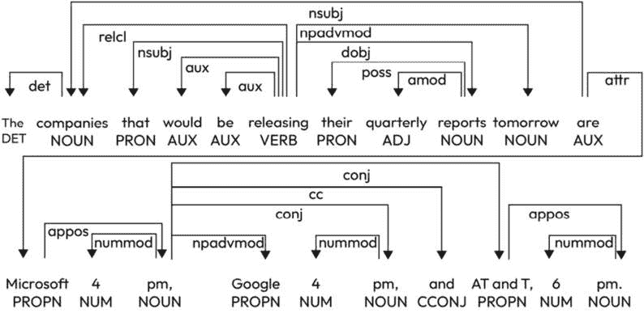

# 第四章：Streamlining Text Preprocessing Techniques for Optimal NLP Performance

文本预处理在自然语言处理（NLP）领域是一个至关重要的初始步骤。它包括将原始、未加工的文本数据转换为机器学习算法可以轻松理解的格式。为了从文本数据中提取有意义的见解，必须清理、规范化和将数据转换成更结构化的形式。本章概述了最常用的文本预处理技术，包括分词、词干提取、词形还原、停用词移除和**词性标注**（**POS**），以及它们的优缺点。

有效的文本预处理对于各种NLP任务至关重要，包括情感分析、语言翻译和信息检索。通过应用这些技术，原始文本数据可以被转换成一种结构化和规范化的格式，便于使用统计和机器学习方法进行分析。然而，选择合适的预处理技术可能具有挑战性，因为最佳方法取决于具体任务和数据集。因此，仔细评估和比较不同的文本预处理技术，以确定针对特定应用的最高效方法，这一点非常重要。

本章将涵盖以下主题：

+   NLP中的小写转换

+   移除特殊字符和标点符号

+   移除停用词

+   命名实体识别（NER）

+   词性标注

+   解释预处理流程

# 技术要求

要跟随本章关于文本预处理的示例和练习，你需要对一种编程语言（如Python）有实际操作的知识，以及一些对NLP概念的了解。你还需要安装某些库，例如**自然语言工具包**（**NLTK**）、**spaCy**和**scikit-learn**。这些库提供了强大的文本预处理和特征提取工具。建议你能够访问**Jupyter Notebook**环境或另一个交互式编码环境，以促进实验和探索。此外，拥有一个用于工作的样本数据集可以帮助你理解各种技术及其对文本数据的影响。

文本规范化是将文本转换为标准形式的过程，以确保一致性并减少变化。用于规范化文本的技术包括小写转换、移除特殊字符、拼写检查以及词干提取或词形还原。我们将详细解释这些步骤，以及如何使用它们，并附上代码示例。

# NLP中的小写转换

将文本转换为小写是一种常见的文本预处理技术，在自然语言处理（NLP）中用于标准化文本并降低词汇的复杂性。在这种技术中，所有文本都被转换为小写字符。

将文本转换为小写的主要目的是使文本统一，并避免因大写字母引起的任何差异。通过将所有文本转换为小写，机器学习算法可以将大写和非大写的相同单词视为相同，从而减少整体词汇量，使文本更容易处理。

将文本转换为小写对于文本分类、情感分析和语言建模等任务特别有用，在这些任务中，文本的意义不受单词大小写的影响。然而，它可能不适合某些任务，例如命名实体识别（NER），在这些任务中，大小写可能是一个重要的特征。

# 移除特殊字符和标点符号

移除特殊字符和标点符号是文本预处理的重要步骤。特殊字符和标点符号对文本的意义贡献不大，如果它们没有被移除，可能会给机器学习模型带来问题。执行此任务的一种方法是通过使用正则表达式，如下所示：

```py
re.sub(r"[^a-zA-Z0-9]+", "", string)
```

这将移除输入字符串中的非字符和数字。有时，我们可能希望将特殊字符替换为空格。请看以下示例：

+   竞选总统

+   正文类型

在这两个示例中，我们希望将“-”替换为空格，如下所示：

+   竞选总统

+   正文类型

接下来，我们将介绍停用词移除。

## 停用词移除

停用词是不太影响句子或文本意义的单词，因此可以安全地移除，而不会丢失太多信息。停用词的例子包括“a”、“an”、“the”、“and”、“in”、“at”、“on”、“to”、“for”、“is”、“are”等等。

停用词移除是文本预处理中常见的步骤，在执行任何文本分析任务之前进行，如**情感分析**、**主题建模**或**信息检索**。目标是减少词汇量和特征空间的维度，这可以提高后续分析步骤的效率和效果。

停用词移除的过程包括识别一组停用词（通常是预定义的或从语料库中学习得到的），将输入文本分词成单词或标记，然后移除任何与停用词列表匹配的单词。结果文本仅包含携带文本意义的单词。

停用词移除可以使用各种编程语言、工具和库来完成。例如，NLTK是一个流行的Python NLP库，它为各种语言提供停用词列表，以及从文本中移除停用词的方法。

以下是一个停用词移除的示例：

*这是一个展示停用词过滤的示例句子。*

在执行停用词移除后，我们得到以下输出：

*示例句子展示停用词过滤*

本章包含专门为此编写的Python代码。您可以参考本章中描述的每个操作。

如我们所见，原始句子中的停用词“这是”、“是”和“一个”已被移除，只留下了重要的单词。

### 拼写检查和纠错

拼写检查和纠错涉及纠正文本中的拼写错误。这很重要，因为拼写错误可能会导致数据不一致并影响算法的准确性。例如，看看以下句子：

*我要去* *面包店*

这将转换为以下内容：

*我要去* *面包店*

让我们继续讨论词形还原。

### 词形还原

**词形还原**是一种文本归一化方法，旨在将一个单词简化为其基本或词典形式，称为词元。词形还原的主要目标是聚合同一单词的各种形式，以便将它们作为一个统一术语进行分析。

例如，考虑以下句子：

*三只猫在田野里追逐老鼠，同时一只猫在观察* *一只老鼠*。

在这个句子的上下文中，“cat”和“cats”是同一单词的两种不同形式，“mouse”和“mice”也是同一单词的两种不同形式。词形还原会将这些单词还原到其基本形式：

*这只猫正在田野里追逐老鼠，同时一只猫在观察* *一只老鼠*。

在这种情况下，“cat”和“cats”都已还原到其基本形式“cat”，“mouse”和“mice”也都已还原到其基本形式“mouse”。这允许更好地分析文本，因为“cat”和“mouse”的出现现在被视为同一术语，无论其屈折变化如何。

词形还原与词干提取不同，后者涉及将一个单词还原到一个可能本身不是单词的通用词干。例如，“cats”和“cat”的词干都是“cat”。而“cats”和“cat”的词元也是“cat”。

可以使用各种NLP库和工具执行词形还原，例如NLTK、spaCy和Stanford CoreNLP。

### 词干提取

词干提取涉及将单词还原到其基本或根形式，称为“词干”。这个过程在NLP中通常用于准备文本以进行分析、检索或存储。词干提取算法通过截断单词的末尾或后缀来实现，只留下词干。

词干提取的目标是将一个单词的所有屈折或派生形式转换为一种通用词干。例如，“running”这个词的词干是“run”，“runs”这个词的词干也是“run”。

常用的词干提取算法之一是波特词干提取算法。该算法基于一系列规则，用于识别词尾并将其从单词中移除，以获得词干。例如，波特算法会将单词“leaping”转换为“leap”，通过移除“ing”后缀。

让我们通过一个示例句子来看看词干提取的实际应用：

*他们正在跑跳着穿过* *墙壁*

这里是使用Porter算法提取的词干文本：

*他们跑着跳着穿过* *墙壁*

如您所见，单词“running”和“leaping”已被转换为它们的词干形式“run”和“leap”，并且从“walls”中移除了后缀“s”。

词干提取对于文本分析任务，如信息检索或情感分析是有用的，因为它减少了文档或语料库中独特单词的数量，并有助于将相似单词分组。然而，词干提取也可能引入错误，因为它有时会产生不是实际单词的词干，或者产生不是单词预期基本形式的词干。例如，词干提取器可能会将“walk”作为“walked”和“walking”的词干，尽管“walk”和“walked”有不同的含义。因此，评估词干提取的结果以确保其产生准确和有用的结果是重要的。

# NER

命名实体识别（NER）是一种自然语言处理（NLP）技术，旨在检测和分类文本中的命名实体，包括但不限于人名、组织名、地点等。NER的主要目标是自主地从无结构化文本数据中识别和提取有关这些命名实体的信息。

命名实体识别通常涉及使用机器学习模型，如**条件随机字段**（CRFs）或**循环神经网络**（RNNs），为给定句子中的单词标记相应的实体类型。这些模型在包含带有标签实体的文本的大型标注数据集上训练。然后，这些模型使用基于上下文的规则来识别新文本中的命名实体。

命名实体识别（NER）可以识别的命名实体类别有几个，包括以下内容：

+   **人物**：一个命名个人，例如“巴拉克·奥巴马”（Barack Obama）

+   **组织**：一个命名公司、机构或组织，例如“谷歌”（Google）

+   **地点**：一个命名地点，例如“纽约市”（New York City）

+   **日期**：一个命名的日期或时间，例如“2023年1月1日”（January 1, 2023）

+   **产品**：一个命名的产品或品牌，例如“iPhone”

这里有一个命名实体识别（NER）的工作示例。看看以下句子：

*苹果公司（Apple Inc.）是一家总部位于加利福尼亚州库比蒂诺（Cupertino, California）的技术公司。*

在这里，NER会将“Apple Inc.”识别为组织，将“Cupertino, California”识别为地点。命名实体识别系统的输出可以是句子的结构化表示，如下所示：

```py
{"organization": "Apple Inc.",
"location": "Cupertino, California"}
```

命名实体识别（NER）在各个领域都有许多应用，包括**信息检索**、**问答**、**情感分析**等。它可以自动从无结构化文本数据中提取结构化信息，这些信息可以进一步分析或用于下游任务。

执行命名实体识别（NER）有不同的方法和工具，但执行NER的一般步骤如下：

1.  **数据收集**：第一步是收集用于命名实体识别（NER）的数据。这些数据可以是无结构化文本的形式，例如文章、社交媒体帖子或网页。

1.  **预处理**：下一步是预处理数据，这涉及各种步骤，如分词、停用词去除、词干提取或词形还原以及归一化。

1.  **标记**：预处理后，下一步是将数据用命名实体标签进行标记。有不同的标记方案，但最常用的一种是**内部-外部-开始**（**IOB**）标记方案。在这个方案中，文本中的每个单词都被标记为*`B`*（命名实体的开始）、*`I`*（命名实体内部）或*`O`*（命名实体外部）。

1.  **训练**：一旦数据被标记，下一步就是训练一个机器学习模型以识别新、未见过的文本中的命名实体。NER可以使用不同类型的模型，例如基于规则的系统、统计模型和深度学习模型。

1.  **评估**：在训练模型后，评估其在测试数据集上的性能非常重要。这有助于识别模型中可能存在的问题，例如过拟合、欠拟合或偏差。

1.  **部署**：最后，训练好的模型可以被部署到对新、未见过的文本执行命名实体识别（NER）。这可以实时进行，也可以批量进行，具体取决于应用程序的需求。

下面是一个如何执行NER的示例：

原始文本：

*Apple is negotiating to buy a Chinese start-up* *this year.*

预处理文本：

*apple negotiating buy Chinese* *start-up year*

标记文本：

*B-ORG O O B-LOC O O*

在这个示例中，命名实体“Apple”和“Chinese”分别被识别为组织（B-ORG）和地点（B-LOC）。在这个示例中，“this year”没有被识别为命名实体，但如果使用更复杂的标记方案或模型在促进这种识别的数据上训练，它将被识别。

根据编程语言和项目的具体需求，可以使用几个库进行NER。让我们看看一些常用的库：

+   **spaCy**：**spaCy**是一个广泛使用的开源库，旨在用于各种NLP任务，包括NER。它提供跨多种语言的预训练模型，并且还允许用户针对特定需求进行模型训练。

+   **NLTK**：这是另一个广泛使用的NLP任务库，包括NER。它提供几个预训练模型，并允许用户训练自己的模型。

+   **斯坦福命名实体识别器**（**NER**）：这是一个基于Java的NER工具，为包括英语、德语和中文在内的多种语言提供预训练模型。

+   **AllenNLP**：AllenNLP是一个流行的开源库，用于构建和评估NLP模型，包括NER。它为包括NER在内的几个任务提供预训练模型，并允许用户训练自己的模型。

+   **Flair**：Flair是一个用于最先进自然语言处理（NLP）的Python库，包括NER。它为多种语言提供预训练模型，并允许用户训练自己的模型。

+   **通用文本工程架构**（**GATE**）：这是一个用于NLP的工具套件，包括NER。它提供了一个图形界面来创建和评估NLP模型，并允许用户为特定任务开发自定义插件。

对于命名实体识别（NER），有许多其他库可供选择，库的选择将取决于编程语言、可用模型和项目的具体要求。在下一节中，我们将解释词性标注（POS tagging）以及执行此任务的不同方法。

# 词性标注

词性标注（POS tagging）是将诸如名词、动词、形容词等语法标签分配给句子中单个单词的实践。这一标注过程在包括文本分类、情感分析和机器翻译在内的各种NLP任务中是一个基础步骤。

词性标注可以使用不同的方法进行，例如基于规则的方法、统计方法和基于深度学习的方法。在本节中，我们将简要概述每种方法。

## 基于规则的方法

基于规则的方法进行词性标注涉及定义一组规则或模式，这些规则或模式可以用于自动将文本中的单词标注为相应的词性，如名词、动词、形容词等。

该过程包括定义一组规则或模式，用于识别句子中的不同词性。例如，一条规则可能声明以“-ing”结尾的任何单词都是动名词（作为名词使用的动词），而另一条规则可能声明以“a”或“an”等冠词开头的任何单词很可能是名词。

这些规则通常基于语言学知识，例如语法和句法知识，并且通常针对特定语言。它们还可以补充以词典或词汇表，这些词典或词汇表提供了关于单词意义和用法的额外信息。

基于规则的标签化过程涉及将这些规则应用于给定的文本，并为每个单词识别词性。这可以手动完成，但通常使用支持正则表达式和模式匹配的软件工具和编程语言进行自动化。

基于规则的方法的一个优点是，当规则设计得很好并且覆盖了广泛的语言学现象时，它们可以非常准确。它们还可以根据特定领域或文本类型进行定制，例如科学文献或法律文件。

然而，基于规则的方法的局限性在于，它们可能无法捕捉自然语言的全部复杂性和可变性，并且随着语言随时间演变和变化，可能需要大量努力来开发和维护规则。它们还可能难以处理歧义，例如在单词可以根据上下文具有多种可能的词性时。

尽管有这些局限性，基于规则的 POS 标注方法在 NLP 中仍然是一个重要的方法，特别是对于需要高精度和精确度的应用。

## 统计方法

POS 标注的统计方法基于使用概率模型自动为句子中的每个单词分配最可能的 POS 标签。这些方法依赖于一个已标记的语料库，其中 POS 标签已经分配给单词，以学习特定单词与每个标签关联的概率。

用于 POS 标注的两种主要统计方法是：**隐马尔可夫模型**（**HMMs**）和 CRFs。

HMMs 是一类广泛应用于处理序列数据（包括文本）的概率模型。在 POS 标注的背景下，HMMs 表示一系列单词的 POS 标签的概率分布。HMMs 假设一个句子中特定位置的 POS 标签的可能性仅取决于序列中的前一个标签。此外，它们还假设给定其标签的特定单词的可能性与其他句子中的单词无关。为了确定给定句子的最可能的 POS 标签序列，HMMs 使用 Viterbi 算法。

CRFs 是另一种常用于序列标注任务（包括 POS 标注）的概率模型。CRFs 与 HMMs 的不同之处在于，它们模型化的是给定输入序列（即单词）的输出序列（即 POS 标签）的条件概率，而不是输出和输入序列的联合概率。这使得 CRFs 能够比 HMMs 捕获输入和输出序列之间更复杂的依赖关系。CRFs 使用迭代算法，如梯度下降或 L-BFGS，来学习模型的最佳权重集。

让我们来看看统计方法的优点：

+   统计方法可以捕捉到单词的上下文以及句子中单词之间的关系，从而产生更准确的标注结果。

+   这些方法可以处理训练数据中未出现的单词和句子。

+   统计方法可以在大型数据集上训练，这使得它们能够捕捉到语言中的更多变化和模式。

现在，让我们看看缺点：

+   这些方法需要大量的标注数据用于训练，这可能既耗时又昂贵。

+   统计方法可能对训练数据的质量敏感，如果数据是嘈杂或偏颇的，可能会表现不佳。

+   统计模型通常是黑盒，这使得很难解释模型所做的决策。

## 基于深度学习的方法

基于深度学习的 POS 标注方法涉及训练一个神经网络模型来预测给定句子中每个单词的 POS 标签。这些方法可以在文本数据中学习复杂的模式和关系，以准确地为单词分配其适当的词性。

最受欢迎的基于深度学习的词性标注方法之一是使用带有LSTM单元的RNN。基于LSTM的模型可以处理单词序列并捕捉它们之间的依赖关系。模型输入是一个单词嵌入序列，这些嵌入是高维空间中单词的向量表示。这些嵌入是在训练过程中学习的。

基于LSTM的模型由三个主要层组成：输入层、LSTM层和输出层。结构涉及将单词嵌入作为输入传递到输入层。随后，LSTM层处理这些嵌入的序列，旨在掌握它们内在的相互依赖关系。最终，输出层负责预测输入序列中每个单词的词性标签。另一种流行的基于深度学习的词性标注方法是使用基于transformer的模型，例如**双向编码器表示的Transformer**（**BERT**）。BERT是一个预训练的语言模型，它使用基于transformer的架构来深入理解句子中单词之间的上下文关系。它使用大量文本数据进行训练，并且可以微调以在各种自然语言处理任务中表现出色，其中之一就是词性标注。

要使用BERT进行词性标注，输入句子必须进行分词，并且每个标记词必须分配一个初始的词性标签。然后，标记词嵌入被输入到预训练的BERT模型中，该模型为每个标记词输出上下文化的嵌入。这些嵌入随后通过前馈神经网络传递，以预测每个标记词的最终词性标签。

基于深度学习的词性标注方法在多个基准数据集上展示了前沿的性能。然而，它们的有效性需要大量的训练数据和计算资源，并且训练过程可能耗时。此外，它们可能缺乏可解释性，这使得理解模型如何进行预测变得困难。

在各种编程语言中，如Python、Java和C++，都有可用于执行词性标注的库。一些提供词性标注功能的流行自然语言处理库包括NLTK、spaCy、Stanford CoreNLP和Apache OpenNLP。

下面是使用Python中的NLTK库进行词性标注的示例：

```py
import nltk
input_sentence = "The young white cat jumps over the lazy dog"
processed_tokens = nltk.word_tokenize(input_sentence)
tags = nltk.pos_tag(processed_tokens)
print(tags)
```

输出如下：

```py
[('The', 'DT'), (young, 'JJ'), (white, 'NN'), ('cat', 'NN'), ('jumps', 'VBZ'), ('over', 'IN'), ('the', 'DT'), ('lazy', 'JJ'), ('dog', 'NN')]
```

在这个例子中，使用了`nltk.pos_tag()`函数来标注句子中的单词。该函数返回一个元组列表，其中每个元组包含一个单词及其词性标签。这里使用的词性标签基于**宾州树库标签集**。

## 正则表达式

正则表达式是一种文本模式，在现代编程语言和软件中具有多种应用。它们用于验证输入是否符合特定的文本模式，定位与模式匹配的大文本体内的文本，将匹配模式的文本替换为其他文本或重新排列匹配文本的部分，以及将文本块划分为子文本列表，但如果不正确使用，可能会导致意外的后果。

在计算机科学和数学中，术语**正则表达式**来源于数学表达式中的“规律性”概念。

正则表达式，通常称为regex或regexp，是一系列构成搜索模式的字符。正则表达式用于匹配和操作文本，通常在文本处理、搜索算法和NLP的上下文中使用。

正则表达式由字符和元字符的混合组成，共同建立用于在文本字符串中搜索的模式。正则表达式的最简单形式是精确匹配字符序列。例如，正则表达式“hello”会匹配包含“hello”字符序列的任何字符串。

元字符是正则表达式中的独特字符，具有预定义的含义。例如，“.”（点）元字符用于匹配任何单个字符，而“*”（星号）元字符用于匹配前一个字符或组的零个或多个实例。正则表达式可用于广泛的文本处理任务。让我们更深入地了解一下。

### 验证输入

可以使用正则表达式通过匹配模式来验证输入。例如，您可以使用正则表达式验证电子邮件地址或电话号码。

### 文本操作

使用正则表达式进行文本操作涉及使用模式匹配技术来查找和操作文档或数据集中的文本字符串。正则表达式是处理文本数据的强大工具，允许进行复杂的搜索和替换操作、文本提取和格式化。

可以使用正则表达式完成的一些常见文本操作任务如下：

+   **搜索和替换**：使用正则表达式在文档中搜索特定的模式或字符序列，并用其他文本或格式替换它们

+   **数据提取**：可以通过定义匹配特定数据格式的模式来使用正则表达式从文本中提取数据

这里是使用正则表达式进行数据提取的一般步骤：

1.  **定义正则表达式模式**：第一步是定义一个匹配您想要提取的数据的正则表达式模式。例如，如果您想从文本文档中提取所有电话号码，您可以定义一个匹配电话号码格式的模式。

1.  **编译正则表达式模式**：在建立正则表达式模式后，下一步是将它编译成一个正则表达式对象，然后可用于匹配目的。

1.  **在文本中搜索模式**：一旦编译了正则表达式对象，您就可以使用它来在文本中搜索该模式。您可以在单个字符串或更大的文本块中搜索该模式。

1.  **提取匹配的数据**：在您在文本中搜索到模式后，您可以提取与该模式匹配的数据。您可以提取所有匹配数据的所有出现，或者只提取第一次出现。

这里是一个使用Python中的正则表达式从字符串中提取所有电子邮件地址的示例：

```py
import re
text = "John's email is john@example.com and Jane's email is jane@example.com"
# Pattern for email addresses:
pattern = r'\b[A-Za-z0-9._%+-]+@[A-Za-z0-9.-]+\.[A-Z|a-z]{2,}\b'
regex = re.compile(pattern)
# Search for all occurrences of the pattern in the text:
matches = regex.findall(text)
print(matches)
```

这里是输出：

```py
['john@example.com', 'jane@example.com']
```

接下来，我们将介绍文本清理。

### 文本清理

文本清理意味着使用正则表达式清理和标准化文本数据，从而移除不需要的字符、空白或其他格式。

这里是一些常见的使用正则表达式的文本清理技术：

+   **移除特殊字符**：正则表达式可用于匹配并移除特定字符，例如标点符号、括号和其他特殊符号。例如，**[^a-zA-Z0-9]** 正则表达式将匹配任何非字母数字字符。

+   **移除停用词**：停用词是诸如“the”、“and”和“but”等常见单词，通常从文本中移除以关注最有意义的单词。正则表达式可用于匹配并从文本中移除这些单词。

+   **移除HTML标签**：如果您正在处理从网站抓取的文本，您可能需要在分析文本之前移除HTML标签。正则表达式可用于匹配并移除HTML标签。

+   **将文本转换为小写**：正则表达式可用于将所有文本转换为小写或大写，这可以使比较和分析更容易。

+   **文本归一化**：归一化涉及将文本转换成标准格式。正则表达式可用于执行诸如词干提取和词形还原等任务，这涉及到将单词还原到其词根形式。

通过使用正则表达式进行文本清理，您可以从文本中移除噪声和不相关信息，使其更容易分析和提取有意义的见解。

### 解析

**解析**涉及分析文本字符串以根据指定的语法识别其语法结构。正则表达式是文本解析的有力工具，尤其是在处理简单和规则的语法模式时。

要使用正则表达式解析文本，您需要为要解析的语言定义一个语法。该语法应指定句子的可能组成部分，例如名词、动词、形容词等，以及规定这些组成部分如何组合成有效句子的规则。

一旦您定义了语法，您就可以使用正则表达式来识别句子的各个组成部分及其之间的关系。例如，您可以使用正则表达式匹配句子中的所有名词或识别动词的主语和宾语。

使用正则表达式进行解析的一个常见方法是为语法中的不同词性和句子结构定义一组模式。例如，您可能为匹配名词定义一个模式，为匹配动词定义一个模式，以及为匹配由主语、动词和宾语组成的句子定义一个模式。

要使用这些模式进行解析，您需要使用正则表达式引擎将它们应用于文本字符串，该引擎会将模式与字符串的适当部分匹配。解析过程的输出将是一个解析树或其他表示句子语法结构的数据库结构。

正则表达式解析的一个局限性是它通常不适用于处理更复杂或模糊的语法。例如，处理一个词可能是名词或动词取决于上下文的情况，或者句子结构模糊的情况可能会很困难。

我们还可以使用正则表达式根据特定的模式或分隔符将较大的文本文档拆分为较小的块或词元。

要使用正则表达式进行文本操作，您通常需要定义一个匹配您想要查找或操作的文本的模式。此模式可以包括特殊字符和语法来定义构成文本字符串的特定字符序列、数字或其他元素。

例如，正则表达式模式 `\d{3}-\d{2}-\d{4}` 可能用于在更大的文本文档中搜索和提取社会保险号码。此模式匹配三个数字序列，后面跟着一个连字符，然后是两个更多数字，另一个连字符，最后是四个数字，后面跟着一个非数字字符，这些字符一起代表了美国社会保险号码的标准格式。

一旦您定义了正则表达式模式，您就可以使用它和各种文本操作工具和编程语言，如grep、sed、awk、Perl、Python等，来执行复杂的文本操作任务。

一些编程语言，如Perl和Python，内置了对正则表达式的支持。其他编程语言，如Java和C++，则需要您使用库或API来处理正则表达式。

虽然正则表达式是文本处理中的强大工具，但它们也可能很复杂，难以理解。熟悉正则表达式的语法和行为对于在代码中有效地使用它们至关重要。

## 词元化

分词是NLP中的一个过程，涉及将文本片段或句子分解成单个单词或术语，称为标记。分词过程可以应用于各种形式的数据，如文本文档、社交媒体帖子、网页等。

分词过程是许多NLP任务的重要初始步骤，因为它将非结构化文本数据转换成可以用于机器学习算法或其他技术分析的格式化格式。这些标记可以用于在文本中执行各种操作，例如统计单词频率、识别最常见的短语等。

分词有不同的方法：

+   **单词分词**：这种方法使用空格、标点符号和其他字符作为分隔符将文本片段分解成单个单词或标记。例如，看看以下句子：

    *敏捷的白色猫跳过了* *睡着的狗*

    这可以分词成以下单词列表：

    *[“The”， “nimble”， “white”， “cat”， “jumps”， “over”， “the”， “**sleepy”， “dog”]*

+   **句子分词**：这种方法使用句号、感叹号和问号等标点符号作为分隔符将文本片段分解成单个句子。例如，看看以下段落：

    *这是* *第一句话。*

    *这是* *第二句话。*

    *这是* *第三句话*。

    这可以分词成以下句子列表：

    *[“This is the* *first sentence.”,*

    *“这是* *第二句话。”,*

    *“这是* *第三句话。”]*

+   **正则表达式分词**：这种方法使用正则表达式来定义分词规则。正则表达式可以用于匹配文本中的模式，如电子邮件地址、URL或电话号码，并将它们作为单独的标记提取出来。

分词是NLP中的重要步骤，并在许多应用中使用，如情感分析、文档分类、机器翻译等。

分词也是语言模型中的重要步骤。例如，在BERT这个著名的语言模型中，分词器是一个子词分词器，意味着它将单词分解成更小的子词单元，称为标记。它使用**WordPiece**分词，这是一种基于训练文本语料库的数据驱动方法，它构建了一个包含大量子词的大词汇表。

使用分词器也是语言模型中的重要步骤。例如，BERT利用WordPiece分词器，该分词器采用将单词分为完整形式或更小的称为词元的组件的技术。这意味着单个单词可以由多个标记表示。它采用数据驱动的方法，根据训练文本语料库构建一个包含大量子词的大词汇表。这些子词单元以嵌入的形式表示，用作BERT模型的输入。

BERT分词器的一个关键特性是它可以处理**词汇表外的**（**OOV**）单词。如果分词器遇到不在其词汇表中的单词，它将单词分解成子词，并将单词表示为其子词嵌入的组合。我们将在本书的后面部分更详细地解释BERT及其分词器。在语言模型中使用分词器的优点是我们可以将输入的大小限制为我们字典的大小，而不是所有可能的输入。例如，BERT有30,000个单词的词汇量，这有助于我们限制深度学习语言模型的大小。使用更大的分词器会增加模型的大小。在下一节中，我们将解释如何使用本章中介绍的方法在完整的预处理流程中使用。

# 解释预处理流程

我们将解释作者提供的完整的预处理流程，供读者了解。

如以下代码所示，输入是一个带有编码标签的格式化文本，类似于我们可以从HTML网页中提取的内容：

```py
"<SUBJECT LINE> Employees details<END><BODY TEXT>Attached are 2 files,\n1st one is pairoll, 2nd is healtcare!<END>"
```

让我们看看将每个步骤应用到文本上的效果：

1.  解码/移除编码：

    *员工详情附上两个文件，第一个是工资单，第二个* *是医疗保险！*

1.  小写化：

    *员工详情附上两个文件，第一个是工资单，第二个* *是医疗保险！*

1.  数字转文字：

    *员工详情附上两个文件，第一个是工资单，第二个* *是医疗保险！*

1.  移除标点符号和其他特殊字符：

    *员工详情附上两个文件，第一个是工资单，第二个* *是医疗保险*

1.  拼写纠正：

    *员工详情附上两个文件，第一个是工资单，第二个* *是医疗保险*

1.  移除停用词：

    *员工详情附上两个文件，第一个是工资单，第二个* *是医疗保险*

1.  词干提取：

    *员工详情附上两个文件，第一个是工资单，第二个* *是医疗保险*

1.  词形还原：

    *员工详情附上两个文件，第一个是工资单* *第二个是医疗保险*

通过这些，我们了解了不同的预处理方法。接下来，我们将回顾一段执行NER和POS的代码。

## NER和POS的代码

对于这个例子，我们使用了Python的spaCy库来执行这些任务。我们的输入如下：

```py
The companies that would be releasing their quarterly reports tomorrow are Microsoft, 4pm, Google, 4pm, and AT&T, 6pm.
```

这是NER的输出：

*明天将发布季度报告的公司有微软 ORG ，下午4点 TIME ，谷歌 ORG ，下午4点 TIME ，以及AT&T ORG ，晚上6点* *TIME 。*

如您所见，使用命名实体识别（NER），我们能够检测到与公司名称（ORG）或日期相关的句子部分。

*图4**.1* 展示了使用spaCy进行词性标注的示例：



图4.1 – 使用spaCy进行词性标注

这是输出：

```py
[['companies', 'NOUN'],
 ['releasing', 'VERB'],
 ['quarterly', 'ADJ'],
 ['reports', 'NOUN'],
 ['tomorrow', 'NOUN'],
 ['Microsoft', 'PROPN'],
 ['pm', 'NOUN'],
 ['Google', 'PROPN'],
 ['pm', 'NOUN'],
 ['AT&T', 'PROPN'],
 ['pm', 'NOUN']]
```

以下代码示例展示了预处理的不同方面，预处理将原始文本转换为适合下游模型的形式，以便符合整体设计的用途。

# 摘要

在本章中，我们介绍了一系列文本预处理的技术和方法，包括规范化、分词、停用词去除、词性标注等。我们探讨了这些技术的不同方法，例如基于规则的方法、统计方法以及基于深度学习的方法。我们还讨论了每种方法的优缺点，并提供了示例和代码片段来说明它们的使用。

到目前为止，你应该对文本预处理的重要性以及用于清理和准备文本数据以供分析的各种技术和方法有了扎实的理解。你应该能够使用Python中流行的库和框架实现这些技术，并理解不同方法之间的权衡。此外，你应该对如何处理文本数据以在自然语言处理任务（如情感分析、主题建模和文本分类）中取得更好的结果有更深入的了解。

在下一章中，我们将解释文本分类，以及执行此任务的不同方法。
