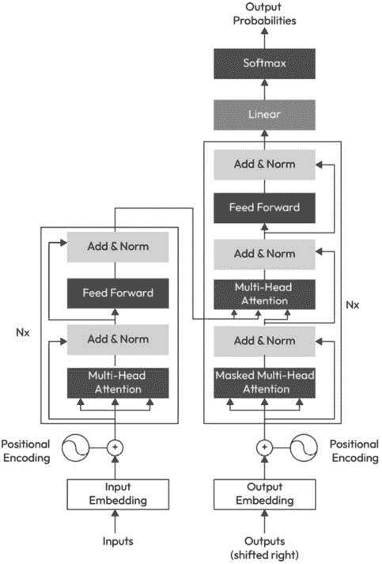

# 第六章：重新构想文本分类：深入探索深度学习语言模型

本章深入探讨深度学习（**DL**）及其在自然语言处理（**NLP**）中的应用，特别是专注于基于转换器的突破性模型，如**双向编码器表示从转换器**（**BERT**）和**生成预训练转换器**（**GPT**）。我们首先介绍深度学习的基础知识，阐述其从大量数据中学习复杂模式的能力，使其成为最先进 NLP 系统的基石。

随后，我们深入探讨转换器，这是一种新颖的架构，它通过提供比传统的**循环神经网络**（**RNNs**）和**卷积神经网络**（**CNNs**）更有效的处理序列数据的方法，从而彻底改变了 NLP。我们剖析了转换器的独特特性，包括其注意力机制，这使得它能够关注输入序列的不同部分，从而更好地理解上下文。

然后，我们将注意力转向 BERT 和 GPT，这些基于转换器的语言模型利用这些优势来创建高度细腻的语言表示。我们详细分析了 BERT 架构，讨论了其创新性地使用双向训练来生成语境丰富的词嵌入。我们将揭示 BERT 的内部运作机制，并探索其预训练过程，该过程利用大量文本语料库来学习语言语义。

最后，我们讨论了如何针对特定任务（如文本分类）微调 BERT。我们将引导你通过数据预处理、模型配置、训练和评估的步骤，提供如何利用 BERT 的力量进行文本分类的动手理解。

本章全面探讨了自然语言处理（NLP）中的深度学习（DL），从基础概念到实际应用，使你具备利用 BERT 和转换器模型的能力，以应对你的文本分类任务。

本章涵盖了以下主题：

+   理解深度学习基础知识

+   不同神经网络的架构

+   转换器

+   语言模型

+   训练神经网络的挑战

+   BERT

+   GPT

+   如何使用语言模型进行分类

+   NLP-ML 系统设计示例

# 技术要求

为了成功阅读本章，以下技术先决条件是必要的：

+   **编程知识**：对 Python 的深入了解是必不可少的，因为它是大多数深度学习和 NLP 库的主要语言。

+   **机器学习基础**：对基本机器学习概念的良好掌握，如训练/测试数据、过拟合、欠拟合、准确率、精确率、召回率和 F1 分数，将非常有价值。

+   **深度学习基础知识**：熟悉**深度学习**的概念和架构，包括神经网络、反向传播、激活函数和损失函数，将是必不可少的。了解RNN和CNN将是有益的，但不是严格必要的，因为我们将会更多地关注transformer架构。

+   **NLP基础知识**：对基本NLP概念如分词、词干提取、词形还原和词嵌入（例如**Word2Vec**或**GloVe**）的理解将大有裨益。

+   **库和框架**：对于使用**TensorFlow**和**PyTorch**构建和训练神经网络的经验至关重要。熟悉NLP库如**NLTK**或**SpaCy**也可能有益。对于专门使用BERT，了解**Hugging Face**的**transformers**库将非常有帮助。

+   **硬件要求**：深度学习模型，尤其是基于transformer的模型如BERT，计算密集，通常需要现代**图形处理单元**（**GPU**）在合理的时间内进行训练。推荐使用具有GPU能力的性能计算机或基于云的解决方案。

+   **数学**：对线性代数、微积分和概率的良好理解有助于理解这些模型的内部工作原理，但大多数章节可以在没有深入数学知识的情况下理解。

这些先决条件旨在为你提供理解和实现章节中讨论的概念所需的必要背景。有了这些，你应该为深入探索使用**BERT**进行文本分类的迷人的深度学习世界做好了充分的准备。

# 理解深度学习基础知识

在这部分，我们解释了神经网络和深度神经网络是什么，使用它们的动机，以及深度学习模型的不同类型（架构）。

## 什么是神经网络？

神经网络是人工智能（**AI**）和机器学习（ML）的一个子领域，它专注于受大脑结构和功能启发的算法。它也被称为“深度”学习，因为这些神经网络通常由许多重复的层组成，形成了一个深度架构。

这些深度学习模型能够从大量复杂、高维和无结构的数据中“学习”。术语“学习”指的是模型能够自动从经验中学习并改进，而无需为任何特定任务（或任务集）明确编程。

深度学习可以是监督的、半监督的或无监督的。它在众多应用中使用，包括自然语言处理（NLP）、语音识别、图像识别，甚至玩游戏。这些模型可以识别模式并做出基于数据的预测或决策。

深度学习（DL）的一个关键优势是它能够处理和建模各种类型的数据，包括文本、图像、声音等。这种多功能性导致了从自动驾驶汽车到复杂的网络搜索算法以及高度响应的语音识别系统等广泛的应用。

值得注意的是，尽管深度学习具有很高的潜力，但它也要求有显著的计算能力和大量高质量的数据来有效地训练，这可能是一个挑战。

从本质上讲，深度学习（DL）是一种强大且变革性的技术，它是许多当今技术进步的前沿。

### 使用神经网络的动机

在机器学习和人工智能领域，神经网络被用于各种原因。以下是一些关键动机：

+   **非线性**：神经网络通过其复杂的结构和激活函数的使用，可以捕捉数据中的非线性关系。许多现实世界现象在本质上是非线性的，神经网络提供了一种建模这些复杂性的方法。

+   **通用逼近定理**：这个定理表明，具有足够隐藏单元的神经网络可以以高精度逼近几乎任何函数。这使得它们非常灵活，能够适应广泛的任务。

+   **处理高维数据的能力**：神经网络可以有效地处理具有大量特征或维度的数据，这使得它们在图像或语音识别等高度维度的任务中非常有用。

+   **模式识别和预测**：神经网络在识别大型数据集中的模式和趋势方面表现出色，这使得它们在预测任务中特别有用，例如预测销售或预测股市趋势。

+   **并行处理**：神经网络的结构允许它们同时执行许多操作，这使得它们在现代硬件上实现时效率非常高。

+   **从数据中学习**：随着神经网络接触到更多的数据，它们可以提高自己的性能。这种从数据中学习的能力使它们在大量数据可用的任务中非常有效。

+   **鲁棒性**：神经网络可以处理输入数据中的噪声，对输入的小幅变化具有鲁棒性。

此外，由于几个原因，神经网络在自然语言处理（NLP）任务中被广泛使用。以下是一些主要动机：

+   **处理序列数据**：自然语言本质上是序列性的（单词依次排列以形成连贯的句子）。循环神经网络（RNN）及其高级版本，如**长短期记忆**（**LSTM**）和**门控循环单元**（**GRUs**），是能够通过保持关于序列中先前步骤的某种内部状态或记忆来处理序列数据的神经网络类型。

+   **上下文理解**：神经网络，尤其是循环神经网络，能够通过考虑周围的词语甚至之前的句子来理解句子中的上下文，这在NLP任务中至关重要。

+   **语义哈希**：神经网络通过使用词嵌入（如Word2Vec和GloVe）以保留其语义意义的方式对词语进行编码。具有相似意义的词语在向量空间中放置得更近，这对于许多NLP任务非常有价值。

+   **端到端学习**：神经网络可以直接从原始数据中学习。例如，在图像分类中，神经网络可以从像素级别学习特征，而不需要任何手动特征提取步骤。这是一个显著的优势，因为特征提取过程可能耗时且需要领域专业知识。

    同样，神经网络可以学习从原始文本数据中执行NLP任务，而不需要手动特征提取。这在NLP中是一个很大的优势，因为创建手工特征可能既困难又耗时。

+   **性能**：神经网络，特别是随着基于transformer架构的BERT、GPT等的出现，已经在许多NLP任务中实现了最先进的结果，包括但不限于机器翻译、文本摘要、情感分析和问答。

+   **处理大型词汇**：神经网络可以有效地处理大型词汇和连续的文本流，这在许多NLP问题中很常见。

+   **学习层次特征**：深度神经网络可以学习层次化的表示。在自然语言处理（NLP）的背景下，较低层通常学习表示简单的事物，例如n-gram，而较高层可以表示复杂的概念，例如情感。

尽管有这些优势，但值得注意的是，神经网络也面临挑战，包括其“黑盒”性质，这使得其决策过程难以解释，以及它们在训练过程中需要大量数据和计算资源。然而，它们在性能方面提供的优势以及从原始文本数据中学习并建模复杂关系的能力，使它们成为许多NLP任务的首选选择。

## 神经网络的基本设计

神经网络由多层相互连接的节点，或称为“神经元”组成，每个神经元对其接收到的数据进行简单的计算，并将输出传递给下一层的神经元。每个神经元之间的连接都有一个相关的权重，该权重在学习过程中进行调整。

基本神经网络的结构由三种类型的层组成，如图*图6.1*所示：

图6.1 – 神经网络的基本架构

在以下列表中，我们将更详细地解释模型的每一层：

+   **输入层**：这是网络接收输入的地方。例如，如果网络被设计为处理28x28像素的图像，那么输入层将有784个神经元，每个神经元代表一个像素的值。

+   **隐藏层（s）**：这些层位于输入层和输出层之间。隐藏层中的每个神经元都会接收来自前一层的神经元输出，将这些输出与各自连接的权重相乘，并将这些值相加。这个和随后通过一个“激活函数”传递，以向模型引入非线性，这有助于网络学习复杂的模式。神经网络中可以有任何数量的隐藏层，具有许多隐藏层的网络通常被称为“深度”神经网络。

+   **输出层**：这是网络中的最后一层。该层的神经元产生网络的最终输出。例如，对于分类问题，你可能设计网络使其具有一个输出神经元对应于问题中的每个类别，每个神经元输出一个值，表示输入属于其相应类别的概率。

网络中的神经元是相互连接的。这些连接的权重最初设置为随机值，代表网络在训练数据上训练后所学习的内容。

在训练过程中，使用诸如反向传播之类的算法来调整网络中连接的权重，以响应网络输出与期望输出之间的差异。这个过程会重复多次，网络逐渐提高其在训练数据上的性能。

为了提供一个简单的视觉概念，想象有三组圆圈（代表神经元）排列成列（代表层）。第一列是输入层，最后一列是输出层，任何介于两者之间的列都是隐藏层。然后，想象连接每一列中每个圆圈到下一列中每个圆圈的线条，代表神经元之间的加权连接。这就是神经网络的基本视觉表示。

在下一部分，我们将描述与神经网络相关的常见术语。

## 神经网络常见术语

在以下小节中，我们将探讨神经网络中最常用的术语。

### 神经元（或节点）

这是神经网络中的基本计算单元；通常，简单的计算涉及输入、权重、偏差和激活函数。神经元，也称为节点或单元，是神经网络的基本元素。它从其他节点或外部源接收输入，如果神经元位于输入层，则从外部源接收。然后，神经元根据这个输入计算输出。

每个输入都有一个相关的权重（*w*），这个权重是根据其与其他输入的相对重要性分配的。神经元将权重应用于输入，将它们加起来，然后对总和加上偏置值（*b*）应用激活函数。

下面是逐步分解：

1.  **加权求和**：每个输入（*x*）到神经元的乘以相应的权重（*w*）。这些加权输入然后与偏置项（*b*）相加。偏置项允许激活函数向左或向右移动，有助于神经元模拟更广泛的模式。从数学上讲，这一步可以表示如下：

    

1.  **激活函数**：加权求和的结果随后通过激活函数。激活函数的目的是将非线性引入神经元的输出。这种非线性使得网络能够从错误中学习并做出调整，这对于执行复杂任务（如语言翻译或图像识别）至关重要。常见的激活函数选择包括 sigmoid 函数、双曲正切（**tanh**）和修正线性单元（**ReLU**）等。

    神经元的输出是激活函数的结果。它作为网络下一层神经元的输入。

    神经元中的权重和偏置是可学习的参数。换句话说，它们的值是在神经网络在数据上训练的过程中逐渐学习的：

    +   **权重**：两个神经元之间连接的强度或幅度。在训练阶段，神经网络学习正确的权重，以便更好地将输入映射到输出。权重在神经元中，如前所述使用。

    +   **偏置**：神经元中的一个附加参数，允许激活函数向左或向右移动，这对于成功学习至关重要（也用于神经元）。

### 激活函数

确定神经元应产生给定其输入的输出的函数（在每个神经元中）称为激活函数。常见的例子包括 sigmoid、ReLU 和 tanh。

这里是一些最常见的激活函数类型：

+   **Sigmoid 函数**：这里我们基本上是将输入分类为 0 或 1。Sigmoid 函数将实值输入压缩到 0 到 1 之间。它通常用于二元分类网络的输出层：

    

    然而，它有两个主要缺点：**梯度消失问题**（对于大的正或负输入，梯度非常小，这可能会在反向传播期间减慢学习速度）和**输出不是** **零中心**。

+   **双曲正切函数**：tanh函数也接受实数值输入并将其压缩到-1和1之间。与sigmoid函数不同，其输出以零为中心，因为其范围在原点周围是对称的：

    

    它也受到梯度消失问题的影响，与sigmoid函数一样。

+   **ReLU函数**：ReLU函数在近年来变得非常流行。其计算方式如下：

    

    换句话说，如果输入是正的，激活就是输入本身；否则，它是零。

    它不会同时激活所有神经元，这意味着只有当线性变换的输出小于0时，神经元才会被关闭。这使得网络稀疏且高效。然而，ReLU单元在训练期间可能很脆弱，如果通过它们的大梯度流动，它们可能会“死亡”（完全停止学习）。

+   **Leaky ReLU**：Leaky ReLU是ReLU的一种变体，它解决了“dying ReLU”问题。我们不是将函数定义为负*x*的*0*，而是将其定义为*x*的一个小的线性分量：

    

    这允许函数在输入为负时“泄露”一些信息，有助于缓解dying ReLU问题。

+   **指数线性单元（ELU）**：ELU也是ReLU的一种变体，它修改了函数，使其对于负*x*具有非零值，这有助于学习过程：

    f(x) = x if x > 0, else

    α(exp(x) − 1)

    在这里，alpha (*α*) 是一个常数，它定义了当输入为负时函数的平滑性。ELU倾向于更快地将成本收敛到零并产生更准确的结果。然而，由于使用了指数运算，它可能计算得较慢。

+   **Softmax函数**：softmax函数常用于分类器的输出层，其中我们试图将输入分配到几个可能的类别之一。它给出了任何给定输入属于每个可能类别的概率：

分母将概率归一化，因此它们在所有类别中加起来等于1。softmax函数也用于多项式逻辑回归。

这些激活函数各有优缺点，激活函数的选择可能取决于具体的应用和问题的具体背景。

#### 层

一组在同一抽象级别处理信号的神经元。第一层是输入层，最后一层是输出层，介于两者之间的所有层都称为隐藏层。

### Epoch

在训练神经网络的背景下，epoch是一个术语，用来表示对整个训练数据集的一次完整遍历。在一个epoch期间，神经网络会更新其权重，试图最小化损失函数。

超参数“epoch”的数量决定了深度学习算法处理整个训练数据集的次数。epoch过多可能导致过拟合，即模型在训练数据上表现良好，但在新数据上表现较差。相反，epoch过少可能意味着模型欠拟合——它可能需要进一步训练来改进。

还需要注意的是，epoch的概念在批量和迷你批量的梯度下降变体中更为相关。在随机梯度下降中，模型在看到每个单独的例子后更新其权重，因此epoch的概念就不那么直接了。

### 批量大小

在一次迭代中使用的训练实例数量。批量大小指的是在一次迭代中使用的训练示例数量。

当你开始训练一个神经网络时，你有几种选择来决定如何将数据输入到模型中：

+   **批量梯度下降**：在这里，整个训练数据集被用来计算优化器每个迭代的损失函数的梯度（就像梯度下降一样）。在这种情况下，批量大小等于训练数据集中示例的总数。

+   **随机梯度下降（SGD）**：SGD在每个优化器的迭代中使用单个例子。因此，SGD的批量大小为*1*。

+   **小批量梯度下降法**：这是批梯度下降法和随机梯度下降法之间的折中方案。在小批量梯度下降法中，批量大小通常在10到1,000之间，具体取决于你拥有的计算资源。

批量大小可以显著影响学习过程。较大的批量大小在训练中进展更快，但并不总是收敛得那么快。较小的批量大小频繁更新模型，但训练进展较慢。

此外，较小的批量大小具有正则化作用，可以帮助模型更好地泛化，从而在未见过的数据上获得更好的性能。然而，使用过小的批量大小可能导致训练不稳定，梯度估计不准确，最终导致模型性能更差。

选择合适的批量大小是一个试错的过程，并且取决于具体问题和可用的计算资源：

+   **迭代次数**：算法看到的批量数据数量（或它在数据集上进行的遍历次数）。

+   **学习率**：一个超参数，通过根据损失梯度调整权重更新率来控制学习算法的收敛速度。

+   **损失函数（代价函数）**：损失函数评估神经网络在数据集上的性能。预测值与实际结果之间的偏差越大，损失函数的输出就越大。目标是使这个输出最小化，这将使模型做出更准确的预测。

+   **反向传播**：在神经网络上执行梯度下降的主要算法。它计算输出层的损失函数梯度，并将其分布回网络的各层，通过更新权重和偏置以最小化损失。

+   **过拟合**：一种情况，其中模型学习训练数据中的细节和噪声，以至于它在新的、未见过的数据上的表现较差。

+   **欠拟合**：一种情况，其中模型过于简单，无法学习数据的潜在结构，因此训练数据和新的数据上的表现都较差。

+   **正则化**：一种通过向损失函数添加惩罚项来防止过拟合的技术，这反过来又限制了网络的权重。

+   **Dropout**：一种正则化技术，在训练期间忽略随机选择的神经元，这有助于防止过拟合。

+   **CNN**：一种非常适合图像处理和计算机视觉任务的神经网络类型。

+   **RNN**：一种旨在识别数据序列中模式（如时间序列或文本）的神经网络类型。

让我们继续探讨不同神经网络的架构。

# 不同神经网络的架构

神经网络有多种类型，每种类型都有适合不同任务的特定架构。以下列表包含了一些最常见类型的通用描述：

+   **前馈神经网络 (FNN)**: 这是最直接的一种神经网络。在这个网络中，信息仅沿一个方向移动，从输入层通过任何隐藏层到输出层。网络中没有循环或环路；它是一条直线，“前馈”路径。

图6.2 – 前馈神经网络

+   **多层感知器 (MLP)**: MLP是一种前馈网络，除了其输入和输出层外，至少还有一个隐藏层。层之间是完全连接的，这意味着层中的每个神经元都与下一层的每个神经元相连。MLP可以模拟复杂模式，并被广泛用于图像识别、分类、语音识别和其他类型的机器学习任务。MLP是一种前馈网络，具有按顺序排列的神经元层。信息从输入层通过隐藏层流向输出层，方向单一：

图6.3 – 多层感知器

+   **CNN**: CNN特别适合涉及空间数据的任务，如图像。其架构包括三种主要类型的层：卷积层、池化层和全连接层。卷积层对输入应用一系列过滤器，这使得网络能够自动和自适应地学习特征的空间层次结构。池化层减少表示的空间大小，从而减少网络中的参数和计算，以控制过拟合并降低后续层的计算成本。全连接层获取池化层的输出，并在输出上进行高级推理。

图6.4 – 卷积神经网络

+   **循环神经网络 (RNN)**: 与前馈网络不同，RNNs具有形成有向循环的连接。这种架构允许它们使用先前输出的信息作为输入，这使得它们非常适合涉及序列数据的任务，例如时间序列预测或自然语言处理。RNNs的一个重要变体是LSTM网络，它除了标准单元外还使用特殊单元。RNN单元包括一个“记忆细胞”，可以在长时间内保持信息在内存中，这对于需要从数据中的长距离依赖关系学习的任务特别有用，例如手写识别或语音识别。

图6.5 – 循环神经网络

+   **自动编码器 (AE)**: AE 是一种用于学习输入数据有效编码的神经网络。它具有对称架构，并设计用于应用反向传播，将目标值设置为等于输入。自动编码器通常用于特征提取、学习数据的表示和降维。它们还用于生成模型、噪声去除和推荐系统。

图 6.6 – 自动编码器架构

+   **生成对抗网络 (GAN)**: GAN 由两部分组成，一个生成器和一个判别器，它们都是神经网络。生成器创建数据实例，旨在与训练数据集的分布相同。判别器的目标是区分来自真实分布的实例和来自生成器的实例。生成器和判别器一起训练，目标是随着训练的进行，生成器产生更好的实例，而判别器则变得更好地区分真实实例和生成实例。

图 6.7 – 计算机视觉中的生成对抗网络

这些只是神经网络架构的几个例子，存在许多变体和组合。你为任务选择架构将取决于任务的具体要求和限制。

# 神经网络训练的挑战

训练神经网络是一项复杂的工作，在训练过程中会面临挑战，如局部最小值和梯度消失/爆炸，以及计算成本和可解释性。所有挑战都在以下各点中详细解释：

+   **局部最小值**: 训练神经网络的目的是找到使损失函数最小化的权重集。这是一个高维优化问题，存在许多点（权重集）的损失函数具有局部最小值。次优局部最小值是损失低于附近点的点，但高于全局最小值，全局最小值是整体可能的最小损失。训练过程可能会陷入这种次优局部最小值。重要的是要记住，即使是在凸损失函数中，由于数字计算中的一部分离散表示，局部最小值问题也存在。

+   **梯度消失/爆炸**：这是在训练深度神经网络时遇到的一个困难。在反向传播过程中，损失函数的梯度可能在网络的深层中变得非常小（消失）或非常大（爆炸）。梯度消失使得网络难以从数据中学习，因为权重更新变得非常小。梯度爆炸可能导致训练过程失败，因为权重更新变得过大，损失变得未定义（例如，NaN）。

+   **过拟合**：在训练机器学习模型时，一个常见的问题是我们的模型过于复杂，训练过度。在这种情况下，模型甚至学习了训练数据中的噪声，在训练数据上表现良好，但在未见过的测试数据上表现不佳。

+   **欠拟合**：相反，当模型过于简单，无法捕捉数据的潜在结构时，就会发生欠拟合。通过使用适当的模型复杂度、正则化技术和足够数量的训练数据，可以减轻过拟合和欠拟合。

+   **计算资源**：训练神经网络，尤其是深度网络，需要大量的计算资源（CPU/GPU功率和内存）。它们通常还需要大量的训练数据才能表现良好，当这些数据不可用时，这可能成为一个问题。

+   **缺乏可解释性**：虽然这不是一个严格意义上的训练问题，但神经网络缺乏可解释性是一个重大问题。它们通常被称为“黑盒”，因为很难理解它们为什么会做出这样的预测。

+   **选择适当架构和超参数的困难**：有众多类型的神经网络架构可供选择（例如CNN和RNN），每种架构都有一组需要调整的超参数（例如学习率、批量大小、层数和每层的单元数）。为特定问题选择最佳架构并调整这些超参数可能是一个具有挑战性和耗时的工作。

+   **数据预处理**：神经网络通常需要输入数据以特定格式。例如，数据可能需要归一化，分类变量可能需要独热编码，缺失值可能需要填充。这个预处理步骤可能既复杂又耗时。

这些挑战使得训练神经网络成为一个非平凡的任务，通常需要技术专长、计算资源和试错法的结合。

# 语言模型

语言模型是NLP中的一种统计模型，旨在学习和理解人类语言的结构。更具体地说，它是一种概率模型，经过训练可以估计在给定一个单词场景的情况下单词的可能性。例如，语言模型可以被训练来预测句子中的下一个单词，给定前面的单词。

语言模型是许多NLP任务的基础。它们被用于机器翻译、语音识别、词性标注和命名实体识别等任务。最近，它们还被用来创建对话式AI模型，如聊天机器人和个人助手，以及生成类似人类的文本。

传统的语言模型通常基于显式的统计方法，例如n-gram模型，这些模型在预测下一个词时只考虑前n个词，或者**隐藏马尔可夫模型**（HMMs）。

最近，神经网络在创建语言模型方面变得流行，导致了神经语言模型的兴起。这些模型利用神经网络的强大功能来考虑每个词的上下文，从而实现更高的准确性和流畅性。神经语言模型的例子包括RNN、Transformer模型以及各种基于Transformer的架构，如BERT和GPT。

语言模型在计算环境中理解、生成和解释人类语言是必不可少的，它们在许多自然语言处理（NLP）的应用中扮演着至关重要的角色。

这里是使用语言模型的一些动机：

+   **机器翻译**：语言模型是翻译系统中的一个关键组件，它们可以评估翻译句子的流畅性，并帮助在多种可能的翻译中选择。

+   **语音识别**：语言模型在语音识别系统中被用来帮助区分听起来相似的单词和短语。通过预测句子中可能出现的下一个词，它们可以提高转录的准确性。

+   **信息检索**：当你在互联网上搜索某物时，语言模型有助于确定哪些文档与你的查询相关。它们可以理解你的搜索词与潜在结果之间的语义相似性。

+   **文本生成**：语言模型可以生成类似人类的文本，这在聊天机器人、写作助手和内容创作工具等应用中非常有用。例如，聊天机器人可以使用语言模型来生成对用户查询的适当响应。

+   **情感分析**：通过理解语言结构，语言模型可以帮助判断一段文本的情感是积极、消极还是中性。这在社交媒体监控、产品评论和客户反馈等领域非常有用。

+   **语法检查**：语言模型可以预测句子中下一个词应该是什么，这有助于识别语法错误或表达不当。

+   **命名实体识别**：语言模型可以帮助识别文本中的命名实体，如人名、组织、地点等。这对于信息提取和自动摘要等任务非常有用。

+   **理解上下文**：语言模型，尤其是基于**深度学习（DL**）的最近模型，如transformers，在理解单词和句子的上下文方面非常出色。这种能力对于许多**自然语言处理（NLP**）任务至关重要，例如问答、摘要和对话系统。

所有这些动机都源于一个中心主题：语言模型帮助机器更有效地理解和生成人类语言，这在当今数据驱动的世界中对于许多应用至关重要。

在下一节中，我们将介绍不同类型的学习，然后解释如何使用自监督学习来训练语言模型。

## 半监督学习

半监督学习是一种机器学习方法，它利用标记数据和未标记数据来训练。当你只有少量标记数据而大量未标记数据时，这种方法特别有用。这里的策略是使用标记数据来训练一个初始模型，然后使用这个模型来预测未标记数据的标签。然后，使用新标记的数据重新训练模型，从而提高其准确性。

## 无监督学习

另一方面，无监督学习涉及完全基于未标记数据进行模型训练。这里的目的是在数据中找到潜在的规律或结构。无监督学习包括诸如聚类（目的是将相似实例分组在一起）和降维（目的是简化数据而不丢失太多信息）等技术。

### 使用自监督学习来训练语言模型

自监督学习是一种无监督学习形式，其中数据提供监督。换句话说，模型学会从同一输入数据的其他部分预测输入数据的一部分。它不需要人类提供的显式标签，因此称为“自监督”。

在语言模型的背景下，自监督通常通过预测句子的一部分来实现，当给出其他部分时。例如，给定句子“The cat is on the __”，模型将被训练来预测缺失的单词（在这种情况下是“mat”）。

接下来，让我们看看一些流行的自监督学习策略，用于训练语言模型。

#### 掩码语言模型（MLM）

这种策略在BERT的训练中使用，随机掩盖输入标记的一部分，并要求模型根据未掩盖的词提供的上下文预测掩盖的单词。例如，在句子“The cat is on the mat”中，我们可以掩盖“cat”，而模型的任务就是预测这个单词。请注意，也可以掩盖多个单词。

从数学上讲，多标签学习（MLM）的目标是最大化以下似然函数：

其中 *w*_i 是一个掩码词，*w*_{-i} 是非掩码词，而 *θ* 代表模型参数。

#### 自回归语言模型

在自回归语言模型中，如 GPT 模型所使用的，模型根据句子中所有前面的词预测句子中的下一个词。它被训练以最大化给定句子中先前词的词的概率。

自回归语言模型的目标是最大化

其中 *w_*i 是当前词， 是前面的词，而 *θ* 代表模型参数。

这些策略使语言模型能够直接从原始文本中获得对语言语法和语义的丰富理解，而无需显式标签。然后，这些模型可以通过各种任务进行微调，例如文本分类、情感分析等，利用从自监督预训练阶段获得的语言理解。

## 迁移学习

迁移学习是一种机器学习技术，其中预训练模型被重新用作不同但相关问题的起点。与传统机器学习方法相比，传统方法是从随机权重初始化模型开始，迁移学习有从相关任务学习到的模式中启动学习过程的优势，这既可以加快训练过程，也可以提高模型的性能，尤其是在你有有限的标记训练数据时。

在迁移学习中，一个模型通常是在一个大规模任务上训练的，然后使用模型的一部分作为另一个任务的起点。这个大规模任务通常选择得足够广泛，以至于学习到的表示对许多不同的任务都有用。当两个任务的输入数据类型相同且任务相关时，这个过程特别有效。

应用迁移学习有几种方法，最佳方法可能取决于你任务的数据量以及你的任务与模型训练的原任务相似程度。

### 特征提取

预训练模型充当特征提取器。你移除模型的最后一层或几层，保留网络的其他部分。然后，你将数据通过这个截断的模型传递，并使用输出作为训练用于你特定任务的新、更小模型输入。

### 微调

你使用预训练模型作为起点，并更新模型的所有或部分参数以适应你的新任务。换句话说，你继续从上次停止的地方训练，允许模型从通用的特征提取调整到更具体于你任务的特性。在微调期间，通常使用较低的学习率，以避免在训练过程中完全覆盖预学习的特征。

迁移学习是一种强大的技术，可以用来提高机器学习模型的性能。它在有少量标记数据可用的任务中特别有用。它通常在深度学习应用中使用。例如，在图像分类问题中，几乎已经成为标准，即使用在ImageNet（一个大规模标注图像数据集）上预训练的模型（ResNet、VGG、Inception等）作为起点。这些模型学习到的特征对图像分类来说是通用的，并且可以在包含更少数据的具体图像分类任务上进行微调。

这里有一些迁移学习应用的例子：

+   一个用于分类猫和狗图像的模型可以被用来微调一个模型，以分类其他动物的图像，如鸟类或鱼类。

+   一个用于将英语翻译成西班牙语的文本模型可以被用来微调一个模型，以将西班牙语翻译成法语。

+   一个用于预测房价的模型可以被用来微调一个模型，以预测汽车的价格。

类似地，在自然语言处理中，大型预训练模型，如BERT或GPT，通常被用作广泛任务（如文本分类、情感分析、问答等）的起点。这些模型在大量文本语料库上预训练，并学习到丰富的语言表示，可以针对特定任务进行微调。

# 理解Transformer

Transformer是一种由Ashish Vaswani、Noam Shazeer、Niki Parmar、Jakob Uszkoreit、Llion Jones、Aidan N. Gomez、Łukasz Kaiser和Illia Polosukhin在论文《Attention is All You Need》中提出的神经网络架构（*Advances in neural information processing systems 30* (2017), Harvard）。它们在NLP领域产生了深远的影响，并成为BERT和GPT等最先进模型的基础。

Transformer的关键创新是自注意力机制，它允许模型在生成输出时权衡输入中每个词的相关性，从而考虑每个词的上下文。这与之前的模型（如RNN或LSTM）不同，这些模型按顺序处理输入，因此更难捕捉词之间的长距离依赖关系。

## Transformer的架构

Transformer由一个编码器和解码器组成，它们都由几个相同的层组成，如图*图6.8*所示。编码器中的每一层包含两个子层：一个自注意力机制和一个位置感知的全连接前馈网络。在每个子层周围都采用了残差连接，然后是层归一化：

图6.8 – 自注意力机制

同样，解码器中的每一层也有三个子层。第一个是自注意力层，第二个是跨注意力层，它关注编码器堆栈的输出，第三个是位置感知的全连接前馈网络。与编码器一样，这些子层周围都有残差连接，然后是层归一化。请注意，在图中只显示了一个头，我们可以有多个头并行工作（*N*个头）。

### 自注意力机制

自注意力机制，或缩放点积注意力，计算序列中每个词对当前正在处理的词的相关性。自注意力层的输入是一个词嵌入序列，每个嵌入通过分别学习的线性变换被分割成一个**查询**（*Q*）、一个**键**（*K*）和一个**值**（*V*）。

每个词的注意力分数计算如下：

其中*d_k*是查询和键的维度，用于缩放点积以防止其变得过大。softmax操作确保注意力分数是归一化的并且总和为1。这些分数代表在产生当前单词的输出时，对每个单词值的赋予的权重。

自注意力层的输出是一个新的向量序列，其中每个单词的输出是所有输入值的加权总和，权重由注意力分数决定。

### 位置编码

由于自注意力机制没有考虑序列中单词的位置，因此Transformer在编码器和解码器堆栈的底部添加了位置编码到输入嵌入中。这种编码是位置的固定函数，允许模型学习使用单词的顺序。

在原始的Transformer论文中，位置编码是位置和维度的正弦函数，尽管也有效地使用了学习位置编码。

## Transformer的应用

自从它们被引入以来，Transformer已被用于在包括机器翻译、文本摘要、情感分析等在内的广泛NLP任务上实现最先进的结果。它们也被应用于其他领域，如计算机视觉和强化学习。

Transformer的引入导致了NLP领域向在大型文本语料库上预训练大型Transformer模型，然后在特定任务上进行微调的转变，这是一种有效的迁移学习方法。这种方法已被用于BERT、GPT-2、GPT-3和GPT-4等模型。

# 了解更多关于大型语言模型

大型语言模型是一类在广泛互联网文本上训练的机器学习模型。

“大型语言模型”中的“大型”一词指的是这些模型所拥有的参数数量。例如，GPT-3有1750亿个参数。这些模型使用自监督学习在大量的文本语料库上进行训练，这意味着它们预测句子中的下一个单词（例如GPT）或基于周围单词的单词（例如BERT，它也被训练来预测一对句子是否连续）。由于它们接触到了如此大量的文本，这些模型学习了语法、关于世界的知识、推理能力，以及它们在训练数据中存在的偏见。

这些模型基于转换器架构，这意味着它们利用了转换器架构，该架构使用自注意力机制来衡量输入数据中单词的重要性。这种架构使得这些模型能够处理文本中的长距离依赖关系，使它们在广泛的自然语言处理任务中非常有效。

大型语言模型可以通过在特定任务上进行微调来实现高性能。微调涉及在较小的、特定任务的语料库上进行额外的训练，这使得模型能够将其通用的语言理解能力适应到任务的特定细节。这种方法已被用于在许多自然语言处理基准测试中实现最先进的结果。

尽管大型语言模型展示了令人印象深刻的能力，但它们也提出了重要的挑战。例如，由于它们是在互联网文本上训练的，它们可以复制和放大数据中存在的偏见。它们还可以生成有害或误导性的输出。此外，由于它们的规模，这些模型在训练和部署时需要大量的计算资源，这引发了成本和环境影响的问题。

尽管存在这些挑战，大型语言模型在人工智能领域代表了重大进步，并且是广泛应用于翻译、摘要、内容创作、问答等众多领域的强大工具。

# 训练语言模型的挑战

训练大型语言模型是一项复杂且资源密集型的工作，面临着诸多挑战。以下是其中一些关键问题：

+   **计算资源**：大型语言模型的训练需要大量的计算资源。这些模型拥有数十亿个参数，需要在训练过程中进行更新，这涉及到在庞大的数据集上执行大量的计算。这种计算通常在高性能GPU或**张量处理单元**（**TPUs**）上执行，相关的成本可能非常昂贵。

+   **内存限制**：随着模型大小的增加，存储模型参数、训练过程中的中间激活和梯度的内存需求也增加。这可能导致即使在最先进的硬件上也会出现内存问题。可以使用模型并行化、梯度检查点和卸载等技术来减轻这些问题，但它们会增加训练过程的复杂性。

+   **数据集大小和质量**：大型语言模型是在广泛的文本语料库上训练的。找到、清理和结构化组织如此庞大的数据集可能具有挑战性。此外，数据集的质量直接影响模型的表现。由于这些模型从它们训练的数据中学习，数据中的偏差或错误可能导致偏差或易出错的模型。

+   **过拟合**：虽然大型模型具有学习复杂模式的高容量，但它们也可能过度拟合训练数据，尤其是在可用数据量与模型大小相比有限的情况下。过拟合会导致未见数据泛化能力差。可以使用正则化技术，如权重衰减、dropout和提前停止，来对抗过拟合。

+   **训练稳定性**：随着模型变大，稳定训练它们变得更加困难。挑战包括管理学习率和批量大小，以及处理梯度消失或爆炸等问题。

+   **评估和微调**：由于这些模型的大小，评估它们的性能也可能具有挑战性。此外，在特定任务上对这些模型进行微调可能很棘手，因为这可能导致“灾难性遗忘”，即模型忘记了预训练的知识。

+   **伦理和安全问题**：大型语言模型可以生成有害或不适当的内容。它们还可以传播和放大训练数据中存在的偏见。这些问题需要开发强大的方法来控制模型的行为，无论是在训练期间还是在运行时。

尽管存在这些挑战，大型语言模型领域仍在继续取得进展。研究人员正在开发新的策略来减轻这些问题，并更有效地、负责任地训练大型模型。

## 语言模型的特定设计

在这里，我们将详细解释两种流行的语言模型架构，BERT和GPT。

### BERT

我们之前提到的BERT，现在将进一步展开介绍，它是一种基于转换器的NLP任务机器学习技术。由谷歌开发，并在Jacob Devlin、Ming-Wei Chang、Kenton Lee和Kristina Toutanova合著的论文《Bert: Pre-training of deep bidirectional transformers for language understanding》，arXiv预印本arXiv:1810.04805（2018）中提出。

BERT的设计是为了通过在所有层中对左右上下文进行联合条件预训练，从未标记的文本中预训练深度双向表示。这与之前的方法，如GPT和ELMo，不同，它们只从左上下文或分别从左右上下文中预训练文本表示。这种双向性允许BERT更准确地理解上下文和单词的语义意义。

#### BERT的设计

BERT基于Transformer模型架构，如*图6*所示，最初由Vaswani等人发表在论文*Attention is All You Need*中提出。模型架构由堆叠的自注意力层和逐点全连接层组成。

BERT有两种大小：**BERT Base**和**BERT Large**。BERT Base由12个Transformer层组成，每个层有12个自注意力头，总共有1100万个参数。BERT Large更大，有24个Transformer层，每个层有16个自注意力头，总共有3400万个参数。

BERT的训练过程包括两个步骤：**预训练**和**微调**。

训练或使用语言模型的第一步是创建或加载其字典。我们通常使用分词器来实现这一目标。

#### 分词器

为了高效地使用语言模型，我们需要使用一个分词器，将输入文本转换为有限数量的标记。子词分词算法，如**字节对编码**（**BPE**）、**一元语言模型**（**ULM**）和**WordPiece**，将单词分割成更小的子词单元。这对于处理词汇表外的单词很有用，并允许模型学习对子词部分的有意义表示，这些部分通常携带语义意义。

BERT分词器是BERT模型的一个关键组件，执行模型输入所需文本数据的初始预处理。BERT使用WordPiece分词，这是一种子词分词算法，将单词分解成更小的部分，允许BERT处理词汇表外的单词，减少词汇表的大小，并处理语言的丰富性和多样性。

下面是BERT分词器工作原理的详细分解：

1.  **基本分词**：首先，BERT分词器执行基本分词，通过在空白和标点符号处分割文本来将文本分解成单个单词。这与其他分词方法中可能找到的方法类似。

1.  **WordPiece分词**：在基本分词之后，BERT分词器应用WordPiece分词。这一步将单词分解成更小的子词单元或“WordPieces”。如果一个单词不在BERT词汇表中，分词器将迭代地将单词分解成更小的子词，直到在词汇表中找到匹配项，或者直到不得不求助于字符级表示。

    例如，单词“unhappiness”可能被分解成两个WordPieces：“un”和“##happiness”。符号“##”用于表示是更大单词的一部分的子词，而不是一个完整的单词。

1.  **特殊标记添加**：BERT分词器随后添加了必要的特殊标记，以支持特定的**BERT**功能。每个句子的开头都附加了[**CLS**]标记，作为分类任务的聚合表示。每个句子的结尾添加了[**SEP**]标记，以表示句子边界。如果输入了两个句子（对于需要句子对的任务），它们将通过这个[**SEP**]标记分开。

1.  **标记到ID的转换**：最后，每个标记都被映射到一个整数ID，这个ID对应于它在**BERT**词汇表中的索引。这些ID是**BERT**模型实际使用的输入。

总结来说，BERT分词器的工作原理是首先将文本分词成单词，然后（如果需要）进一步将这些单词分解成WordPieces，添加特殊标记，最后将这些标记转换成ID。这个过程使得模型能够理解和生成对各种单词和子词的有意义的表现，从而有助于BERT在多种NLP任务上表现出强大的性能。

#### 预训练

在预训练期间，**BERT**在大量的文本语料库上进行了训练（原始论文中使用了整个英文维基百科和BooksCorpus）。模型被训练去预测句子中的掩码单词（掩码语言模型），以及区分文本中两个句子是否按顺序出现（下一句预测），如这里所解释的：

+   **掩码语言模型**：在这个任务中，一个句子中的15%的单词被一个[**MASK**]标记所替换，模型被训练去预测由非掩码单词提供的上下文中的原始单词。

+   **下一句预测**：当模型被给出一对两个句子时，它也被训练去预测句子B是否是句子A之后的下一句。

#### 微调

预训练后，BERT可以在具有显著较少训练数据的具体任务上进行微调。微调涉及向BERT添加一个额外的输出层，并在特定任务上端到端地训练整个模型。这种方法已经在包括问答、命名实体识别、情感分析等多种NLP任务上实现了最先进的结果。

BERT的设计及其预训练/微调方法彻底改变了NLP领域，并导致了在广泛的数据上训练大型模型，然后在特定任务上进行微调的趋势。

#### 如何微调BERT进行文本分类

正如之前提到的，BERT已经在大量的文本数据集上进行了预训练，学习到的表示可以针对特定任务进行微调，包括文本分类。以下是如何逐步微调BERT进行文本分类的步骤：

1.  **预处理输入数据**：BERT需要特定的输入数据格式。句子需要使用BERT自己的分词器将句子分词成子词，并添加特殊标记，如[CLS]（分类）和[SEP]（分隔）。[CLS]标记添加在每个示例的开头，用作分类任务的聚合序列表示。[SEP]标记添加在每个句子的末尾，以表示句子边界。然后，所有序列都填充到固定长度，以形成一个统一的输入。

1.  **加载预训练BERT模型**：BERT有多个预训练模型，应根据任务选择正确的模型。这些模型在模型大小和预训练数据的语言方面有所不同。一旦加载预训练BERT模型，就可以用它为输入数据创建上下文化的词嵌入。

1.  **添加分类层**：在预训练BERT模型之上添加一个分类层，也称为分类头。这个层将被训练以对文本分类任务进行预测。通常，这个层是一个全连接神经网络层，它以对应于[CLS]标记的表示作为输入，并输出类别的概率分布。

1.  **微调模型**：微调涉及使用标记数据在特定任务（在这种情况下，文本分类）上训练模型。这个过程可以通过多种方式完成。更常见的方法是更新预训练BERT模型和新添加的分类层权重，以最小化损失函数，通常是分类任务的交叉熵损失。在微调期间使用较低的学习率很重要，因为较大的学习率可能会使预学习的权重不稳定。此外，建议的epoch数通常是两到四个，这样模型就能学习任务但不会过拟合。这种方法的好处是模型权重将被调整以在特定任务上表现良好。或者，我们可以冻结BERT层，只更新分类层权重。

1.  **评估模型**：一旦模型经过微调，就可以在验证集上评估其性能，以评估其性能。这包括计算准确率、精确率、召回率和F1分数等指标。在训练和评估任务期间，与其他ML和DL模型类似，我们可以执行超参数调整。

1.  **应用模型**：经过微调的模型现在可以用于对新、未见过的文本数据进行预测。与训练数据一样，这些新数据也需要预处理成BERT期望的格式。

重要注意事项

注意，与**BERT**一起工作需要相当的计算资源，因为该模型具有大量的参数。通常建议使用GPU进行微调和应用BERT模型。有一些模型比BERT轻量，性能略低，例如DistilBERT，在计算或内存资源受限的情况下可以使用。此外，BERT能够处理512个标记，这限制了我们的输入文本长度。如果我们想处理更长的文本，Longformer或BigBird是不错的选择。这里所解释的内容适用于类似的语言模型，如RoBERTa、XLNet等。

总结来说，对BERT进行文本分类的微调涉及预处理输入数据，加载预训练的BERT模型，添加分类层，在标记数据上微调模型，然后评估和应用模型。

我们将演示先前的BERT微调范式，然后在本章末尾应用它。您将有机会亲自使用它并调整以满足您的需求。

### GPT-3

**GPT-3**，即**生成****预训练Transformer 3**，是由OpenAI开发的一种自回归语言模型，它使用深度学习技术生成类似人类的文本。它是GPT系列的第三个版本。GPT系列的后续版本，GPT-3.5和GPT-4，将在下一章中介绍，因为我们将扩展关于大型语言模型的内容。

#### GPT-3的设计和架构

GPT-3的架构扩展了其前辈使用的transformer模型架构。该架构基于一个使用Transformer块的Transformer模型，其中每个块由自注意力层和前馈神经网络层组成。

与之前的版本相比，GPT-3规模庞大。它由1750亿个ML参数组成。这些参数在训练阶段学习，模型学习预测一系列单词中的下一个单词。

GPT-3的Transformer模型旨在处理数据序列（在这种情况下，文本中的单词或标记序列），使其非常适合语言任务。它从左到右顺序处理输入数据，并为序列中的下一个项目生成预测。这是BERT和GPT之间的区别，在BERT中，使用两侧的单词来预测掩码词，但在GPT中，仅使用前面的单词进行预测，这使得它成为生成任务的不错选择。

#### 预训练和微调

与BERT和其他基于Transformer的模型类似，GPT-3也涉及两个步骤的过程：**预训练**和**微调**。

#### 预训练

在这个阶段，GPT-3在大量的文本数据语料库上进行训练。它学习预测句子中的下一个单词。然而，与BERT使用双向上下文进行预测不同，GPT-3仅使用左侧上下文（即句子中的前面的单词）。

#### 微调

在预训练阶段之后，GPT-3 可以使用较少的任务特定训练数据在特定任务上进行微调。这可以是任何 NLP 任务，例如文本补全、翻译、摘要、问答等。

#### 零样本、一样本和少样本学习

GPT-3 令人印象深刻的特点之一是其执行少样本学习的能力。当被赋予一个任务和该任务的几个示例时，GPT-3 通常能够准确地学习执行该任务。

在零样本设置中，模型被赋予一个任务而没有任何先前的示例。在一样本设置中，它被赋予一个示例，在少样本设置中，它被赋予几个示例来学习。

# 使用 GPT-3 的挑战

尽管GPT-3拥有令人印象深刻的性能，但也存在一些挑战。由于其规模庞大，它需要大量的计算资源来训练。它有时会生成不正确或无意义的响应，并且可能会反映训练数据中存在的偏差。它还难以处理需要深入理解世界或超越从文本中学习到的常识推理的任务。

## 回顾我们的用例 - 在 Jupyter Notebook 中为 NLP 分类设计的 ML/DL 系统设计

在本节中，我们将处理一个现实世界的问题，并看看我们如何可以使用 NLP 管道来解决它。这部分代码以 Google Colab 笔记本的形式共享，网址为 [Ch6_Text_Classification_DL.ipynb](https://colab.research.google.com/drive/1HVD2fvxHup6OsPi2mKxNS_nfCRZ0iGCw?usp=sharing)。

## 业务目标

在这种情况下，我们处于医疗保健行业。我们的目标是开发一个与医疗保健领域最新发现非常同步的通用医学知识引擎。

## 技术目标

技术总监从业务目标中推导出几个技术目标。其中一个目标是针对 ML 团队：鉴于与医学出版物相对应的结论集合不断增长，识别出代表建议的结论。这将使我们能够识别出源于基础研究的医学建议。

## 管道

让我们回顾一下管道的各个部分，如图 *图 6**.9* 所示：

图 6.9 – 典型探索和模型管道的结构

注意这个设计与我们在 *图 5**.2* 中看到的设计有何不同。在那里，探索和评估部分利用了后来由 ML 模型使用的相同特征工程技术。在这里，使用 LMs，特征工程不是建模准备的一部分。预训练模型，特别是分词器，执行特征工程，这产生了与二进制、BoW 或 TF-IDF 特征非常不同且难以解释的特征。

注意

代码部分：从“设置”到“生成传统 ML 模型的结果”。

这些部分在本质上与第[*第5章*](B18949_05_split_000.xhtml#_idTextAnchor130)中讨论的模拟部分相同。唯一的区别与数据的不同有关。

### 深度学习

在这段代码中，我们使用了一个深度学习语言模型。

当考虑通过LM应用迁移学习并针对我们的目标和数据进行微调时，有多个堆栈可供选择。最突出的是Google的TensorFlow和Meta的PyTorch。一个名为**Transformers**的包被构建为这些堆栈的包装器，以允许代码的更简单实现。在这个例子中，我们利用了transformers模型的简洁性和丰富性。

值得强调的是构建并支持Transformers包的公司：Hugging Face。Hugging Face承担起创建一个围绕免费、开源DL模型收集和共享的整个生态系统，这包括许多适应实现这些模型的组件。最实用的工具是Transformers包，这是一个Python包，致力于选择、导入、训练和部署一个庞大且不断增长的DL模型集合。

我们在这里审查的代码不仅提供了一个现实世界中的ML/DL系统设计的示例；还展示了Hugging Face的Transformers。

### 数据格式化

在这里，我们将数据设置成适合Transformers库的格式。列名必须非常具体。

### 评估指标

我们决定要优化的指标，并将其插入到训练过程中。对于这个二元分类问题，我们优化了准确率，并将我们的结果与数据集的基线准确率进行了比较，也称为先验。

### 训练器对象

这是用于在Transformers中训练LM的核心对象。它包含一组预定义的配置。一些关键的训练配置如下：

+   神经网络的数学学习超参数，例如以下：

    +   学习率

    +   梯度下降设置

+   训练轮数

+   计算硬件使用情况

+   训练过程中记录目标指标进度的日志设置

#### 微调神经网络参数

关于微调语言模型的基本概念是迁移学习。神经网络非常适合迁移学习，因为可以从结构的末端简单地剥离任意数量的层，并用未训练的层替换它们，这些层将基于底层问题进行训练。未移除且未训练的其余层将继续以与语言模型最初训练时（当它最初构建时）完全相同的方式运行。如果我们替换最后一层但保留其余的原始层，那么我们可以将这些层视为监督特征工程，或者相反，作为嵌入机制。这种特性反映了迁移学习的概念。理想情况下，模型预计将很好地适应我们的底层问题，因此我们将选择保留绝大多数的原始层，只有一小部分会被替换并训练。这样，一个需要几周时间预训练的大型深度学习模型可以在几分钟内迁移和适应新的问题。

在我们的代码中，我们以这种方式设置模型，即我们确切地指定我们想要微调其哪些层。这是我们的设计选择，基于性能和计算资源。一个选择是微调紧接最终输出的最后一层，也称为分类头。另一种选择是微调所有层。在我们的代码中，我们明确调用模型的配置，该配置控制哪些层被微调，因此代码可以以任何适合设计的方式更改。

我们将训练器配置为实时记录训练性能。它将这些日志以表格形式打印出来，以便我们观察和监控。当训练完成后，我们绘制训练和评估的进度。这有助于我们了解训练结果和评估结果之间的关联。由于训练器使用的评估集可以被视为训练器上下文中的保留集，这个图表使我们能够研究欠拟合和过拟合。

#### 生成训练结果——用于设计选择

我们回顾了训练集的结果，以及训练器打印出的日志。我们将它们与基线准确率进行了比较，并观察到准确率的提高。通过迭代多个不同的设计选择并进行比较，我们了解了我们设计的质量。将这个过程自动化为代码，以便对最佳设置进行系统评估。我们只是在笔记本中这样做，以保持示例的简单性。一旦我们相信我们已经找到了最佳设置，我们就可以说这个过程已经完成。

#### 生成测试结果——用于展示性能

就像 [*第 5 章*](B18949_05_split_000.xhtml#_idTextAnchor130) 中的代码一样，在这里，我们也以回顾测试结果结束。值得注意的是评估集和测试集之间的差异。有人可能会建议，由于训练者没有使用评估集进行训练，它可以作为一个保留的测试集，从而节省了从训练中排除许多观察结果的需要，并为模型提供更多标记数据。然而，尽管训练者没有使用评估集，我们确实使用了它来做出我们的设计决策。例如，我们观察了前一个部分的图表，并判断哪个数量的周期数是达到最佳拟合的最优选择。在 [*第 5 章*](B18949_05_split_000.xhtml#_idTextAnchor130) 中也使用了评估集，但我们不需要明确定义它；它是作为 K 折交叉验证机制的一部分执行的。

# 摘要

在这一启发性的章节中，我们全面探索了深度学习及其在文本分类任务中通过语言模型应用的显著应用。我们从深度学习的概述开始，揭示了其从大量数据中学习复杂模式的能力，以及在推进最先进自然语言处理系统中的无可争议的作用。

然后，我们深入到变换器模型的变革性世界，这些模型通过提供传统 RNN 和 CNN 处理序列数据的有效替代方案，已经彻底改变了自然语言处理。通过解开注意力机制——变换器中的一个关键特性——我们突出了其专注于输入序列不同部分的能力，从而促进了上下文理解的更好。

我们的旅程继续深入探索 BERT 模型。我们详细介绍了其架构，强调其开创性地使用双向训练来生成语境丰富的词嵌入，并突出了其预训练过程，该过程从大量文本语料库中学习语言语义。

然而，我们的探索并未就此结束；我们还介绍了 GPT，另一个利用变换器能力以略有不同方式变革的模型——专注于生成类似人类的文本。通过比较 BERT 和 GPT，我们阐明了它们的独特优势和用例。

本章以一个关于如何使用这些高级模型设计和实现文本分类模型的实用指南结束。我们引导您经历了这个过程的各个阶段，从数据预处理和模型配置到训练、评估，最后是在未见过的数据上做出预测。

本质上，本章提供了对自然语言处理中深度学习的全面理解，从基本原理过渡到实际应用。凭借这些知识，您现在可以充分利用变压器模型、BERT和GPT的能力来处理您的文本分类任务。无论您是想进一步深入研究自然语言处理的世界，还是在实际环境中应用这些技能，本章都为您奠定了坚实的基础。

在本章中，我们向您介绍了大型语言模型。在下一章中，我们将更深入地探讨这些模型，以了解更多关于它们的信息。
