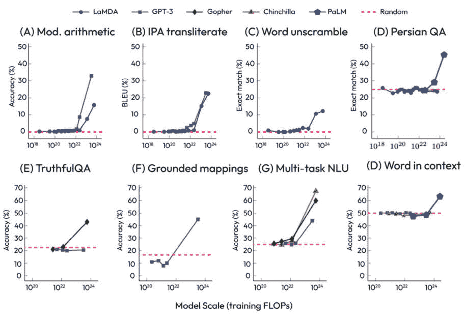
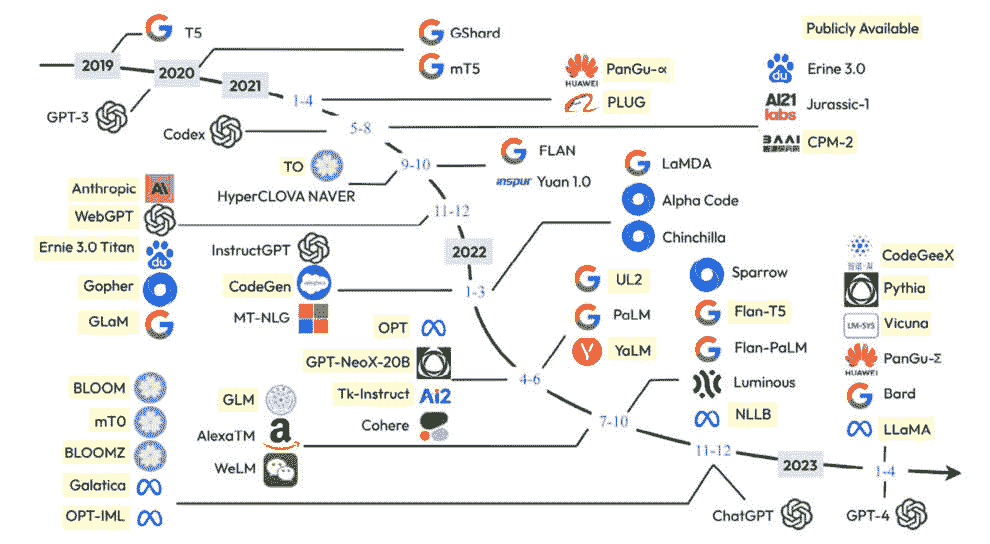
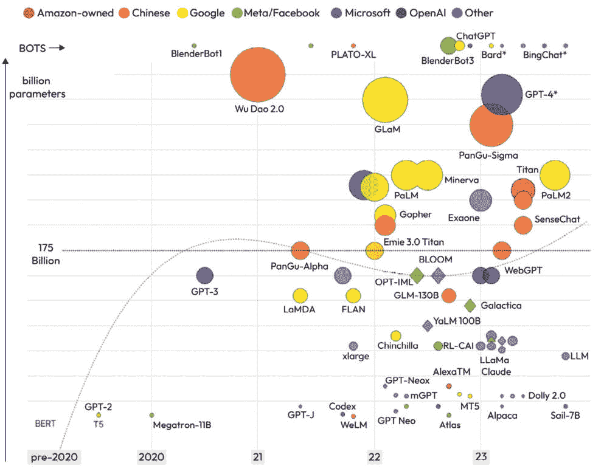
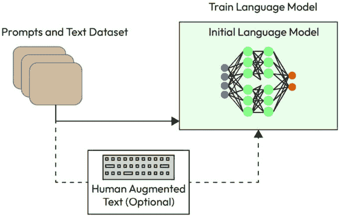
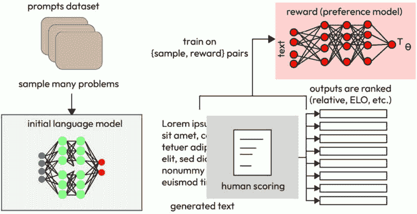
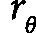
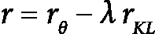
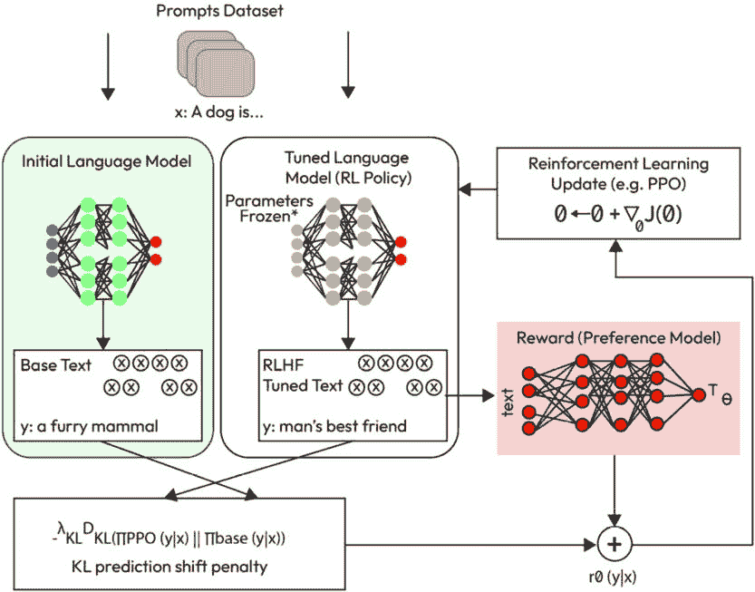

# 第七章：揭秘大型语言模型：理论、设计和Langchain实现

在本章中，我们深入探讨了**大型语言模型**（LLMs）错综复杂的领域及其性能背后的数学概念。这些模型的出现彻底改变了**自然语言处理**（NLP）领域，提供了无与伦比的理解、生成和与人类语言互动的能力。

LLMs是**人工智能**（AI）模型的一个子集，可以理解和生成类似人类的文本。它们通过在多样化的互联网文本上进行训练来实现这一点，从而学习到关于世界的广泛事实。它们还学会了预测文本中的下一个内容，这使得它们能够生成富有创意、流畅且上下文一致的句子。

随着我们探索大型语言模型（LLMs）的操作，我们将介绍关键指标**困惑度**，这是衡量不确定性的一个关键指标，对于确定这些模型的性能至关重要。较低的困惑度表明**语言模型**（LM）在预测序列中的下一个单词时的信心，从而展示了其熟练程度。

本章借鉴了多篇深入探讨LLMs数学洞察力的有见地出版物。其中一些包括《神经概率语言模型》、《Attention is All You Need》和《PaLM：通过路径扩展语言建模》。这些资料将指导我们理解支撑LLMs及其卓越能力的稳健机制。

我们还将探讨在LMs背景下新兴的**人类反馈强化学习**（RLHF）领域。RLHF已被证明是微调LLMs性能的强大工具，从而导致了更准确和有意义的生成文本。

通过对LLMs数学基础的全面理解和对RLHF的深入研究，我们将获得这些先进AI系统的稳健知识，为该领域的未来创新和进步铺平道路。

最后，我们将讨论最近模型（如**Pathways语言模型**（PaLM）、**大型语言模型Meta AI**（LLaMA）和GPT-4）的详细架构和设计。

现在，让我们看看本章涵盖的主题：

+   什么是LLMs，它们与LMs有何不同？

+   开发和使用LLMs的动机

+   开发LLMs的挑战

# 技术要求

对于本章，你应具备**机器学习**（ML）概念的坚实基础，特别是在**Transformer**和**强化学习**领域。理解基于Transformer的模型至关重要，这些模型是许多当今LLMs的基础。这包括对诸如自注意力机制、位置编码和解码器架构结构等概念的了解。

理解强化学习原理也是必不可少的，因为我们将会深入探讨在LM微调中RLHF的应用。熟悉诸如策略梯度、奖励函数和Q学习等概念将大大提高你对这些内容的理解。

最后，编程能力，特别是Python，至关重要。这是因为许多概念将通过编程的角度进行演示和探索。熟悉PyTorch或TensorFlow等流行的机器学习库，以及Hugging Face的Transformers库（用于处理Transformer模型的关键资源）也将大有裨益。

然而，如果你觉得自己在某些领域有所欠缺，请不要气馁。本章旨在引导你了解这些主题的复杂性，并在过程中填补任何知识空白。因此，带着学习的心态做好准备，让我们深入探索LLMs的迷人世界！

# LLM是什么？它们与LM有何不同？

LM是一种机器学习模型，它被训练来预测给定之前单词（或在某些模型中，周围单词）的序列中的下一个单词（或字符或子词，具体取决于模型的粒度）。它是一个概率模型，能够生成遵循某种语言风格或模式的文本。

在Transformer模型（如**生成预训练Transformer**（GPTs）和**双向编码器表示来自Transformer**（BERT））出现之前，NLP任务中广泛使用了其他几种类型的LM。以下小节将讨论其中的一些。

## n-gram模型

这些是一些最简单的LM。一个*n*-gram模型使用前*n-1*个词来预测句子中的第*n*个词。例如，在二元（2-gram）模型中，我们会使用前一个词来预测下一个词。这些模型易于实现且计算效率高，但它们通常不如更复杂的模型表现得好，因为它们无法捕捉到词之间的长距离依赖关系。随着*n*的增加，它们的性能也会下降，因为它们受到数据稀疏性问题的影响（没有足够的数据来准确估计所有可能的*n*-gram的概率）。

## 隐藏马尔可夫模型（HMMs）

这些模型考虑了生成观察数据的“隐藏”状态。在语言建模的背景下，每个词都是一个观察状态，而“隐藏”状态则是一种某种类型的语言特征，它不是直接可观察的（例如，词的词性）。然而，与*n*-gram模型一样，HMMs也难以捕捉到词之间的长距离依赖关系。

## 循环神经网络（RNNs）

这些是一种神经网络，其中节点之间的连接形成了一个沿着时间序列的定向图。这使得它们能够使用它们的内部状态（记忆）来处理输入序列，使它们非常适合语言建模。它们可以捕捉单词之间的长距离依赖关系，但它们在所谓的梯度消失问题上挣扎，这使得在实践中学习这些依赖关系变得困难。

### 长短期记忆（LSTM）网络

LSTM网络是一种特殊的RNN，旨在学习长期依赖关系。它们通过使用一系列“门”来控制信息在网络记忆状态中的流入和流出。LSTMs在语言建模的先进技术中迈出了重要一步。

#### 门控循环单元（GRU）网络

这些是LSTM的一种变体，它们的架构中使用了略微不同的门。它们通常比LSTMs更简单、训练更快，但它们是否比LSTMs表现更好或更差，往往取决于具体任务。

每个这些模型都有其自身的优点和缺点，并且它们之间没有一个是本质上比另一个更好或更差的——这完全取决于具体任务和数据集。然而，基于Transformer的模型在广泛的任务中通常优于所有这些模型，这导致了它们在NLP领域的当前流行。

# LLMs如何脱颖而出

LLMs，例如GPT-3和GPT-4，仅仅是训练在大量文本上并且拥有大量参数的LMs。模型（就参数和训练数据而言）越大，它理解和生成复杂多变文本的能力就越强。以下是LLMs与较小LMs不同的几个关键方式：

+   **数据**：LLMs在大量数据上训练。这使得它们能够从广泛的语用模式、风格和主题中学习。

+   **参数**：LLMs拥有巨大的参数数量。ML模型中的参数是从训练数据中学习到的模型的部分。模型拥有的参数越多，它能够学习的复杂模式就越多。

+   **性能**：由于它们在更多数据上训练并且拥有更多参数，LLMs通常比较小的LLMs表现更好。它们能够生成更连贯、多样化的文本，并且更好地理解上下文、进行推理，甚至能够在广泛的主题上回答问题或生成文本。

+   **计算资源**：LLMs在训练过程中需要大量的计算资源，包括处理能力和内存。它们的训练时间也更长。

+   **存储和推理时间**：大型模型也需要更多的存储空间，生成预测所需的时间更长（尽管在现代硬件上，这个推理时间通常仍然相当快）。

因此，我们可以这样说，LLMs实际上是小型LMs（语言模型）的扩展版本。它们在更多数据上进行训练，具有更多参数，并且通常能够产生更高品质的结果，但它们也需要更多资源来训练和使用。除此之外，LLM的一个重要优势是，我们可以在大量数据语料库上无监督地训练它们，然后使用有限的数据对不同的任务进行微调。

# 开发和使用LLMs的动机

开发和使用LLMs的动机源于与这些模型的能力相关的几个因素，以及它们在多样化应用中可能带来的潜在好处。以下小节详细介绍了这些关键动机之一。

## 性能提升

当LLMs（大型语言模型）在充足的数据上进行训练时，通常比小型模型表现出更好的性能。它们更擅长理解上下文，识别细微差别，并生成连贯且与上下文相关的响应。这种性能提升适用于NLP（自然语言处理）的广泛任务，包括文本分类、命名实体识别、情感分析、机器翻译、问答和文本生成。如*表7.1*所示，BERT（第一个广为人知的LLMs之一）和GPT的性能与之前的模型在**通用语言理解评估**（**GLUE**）基准上进行了比较。GLUE基准是一系列多样化的**自然语言理解**（**NLU**）任务集合，旨在评估模型在多个语言挑战中的性能。基准涵盖了诸如情感分析、问答和文本蕴涵等任务。它是NLU领域广泛认可的标准，为比较和改进语言理解模型提供了一个全面的套件。可以看出，它在所有任务中的表现都更好：

| **模型** | **所有任务平均（**） | **情感分析** | **语法** | **相似度** |
| --- | --- | --- | --- | --- |
| BERT large | 82.1 | 94.9 | 60.5 | 86.5 |
| BERT base | 79.6 | 93.5 | 52.1 | 85.8 |
| OpenAI GPT | 75.1 | 91.3 | 45.4 | 80.0 |
| 预开AI **艺术状态**（**STOA**） | 74.0 | 93.2 | 35.0 | 81.0 |
| 双向长短期记忆（BiLSTM）+ 语言模型（ELMo）嵌入 + 注意力 | 71.0 | 90.4 | 36.0 | 73.3 |

表7.1 – 比较不同模型在GLUE上的性能（此比较基于BERT和GPT发布时的2018年）

## 广泛泛化

在多样化数据集上训练的LLMs可以在不同的任务、领域或语言风格之间更好地泛化。它们可以从训练数据中有效地学习，以识别和理解广泛的语言模式、风格和主题。这种广泛的泛化能力使它们适用于各种应用，从聊天机器人到内容创作到信息检索。

当LM更大时，这意味着它有更多的参数。这些参数允许模型捕捉和编码数据中的更复杂关系和细微差别。换句话说，更大的模型可以从训练数据中学习并保留更多信息。因此，它在训练后能够更好地处理更广泛的任务和上下文。正是这种增加的复杂性和容量使得更大的LLM在不同任务上具有更强的泛化能力。正如我们在*图7.1*中可以看到的，更大的LLM在不同任务上的表现更好。

图7.1 – 基于大小和训练的LLM性能

我们还可以在*图7.2*中看到过去三年LLM发展的进展。

图7.2 – 2019年至2023年间发布的LLM（公开可用的模型已突出显示）

然而，需要注意的是，虽然较大的模型往往具有更强的泛化能力，但它们也带来了挑战，例如计算需求增加和过拟合的风险。同时，确保训练数据能够代表模型预期执行的任务和领域也是至关重要的，因为模型可能会继承训练数据中存在的任何偏差。

## 少样本学习

GPT-3、GPT-3.5和GPT-4等LLM展示了令人印象深刻的少样本学习能力。给定几个示例（“样本”），这些模型可以有效地泛化到完成类似任务。这使得在实际应用中调整和部署这些模型更加高效。提示可以设计为包含模型可以参考的信息，例如示例问题和相应的答案。

模型会从给定的示例中临时学习，并将给定信息作为额外来源。例如，当将LLM用作个人助理或顾问时，可以将有关用户背景的信息附加到提示中，使模型能够“了解你”，因为它使用你的个人信息提示作为参考。

## 理解复杂上下文

由于LLM在广泛的数据上进行大量训练，包括各种主题、文学风格和细微差别，以及其深度架构和大型参数空间，它们具有理解复杂上下文的优势。这种能力使它们即使在复杂或细微的情况下也能理解和生成适当的回应。

例如，考虑一个用户要求模型总结一篇复杂科学文章的场景。LLM可以理解文章的上下文和使用的专业技术语言，并生成连贯且简化的摘要。

## 多语言能力

LLM可以有效地处理多种语言，使其适用于全球应用。以下是一些著名的多语言LLM。

### mBERT（多语言BERT）

mBERT（多语言BERT）是对BERT的一种扩展，它使用掩码语言模型目标在拥有最大维基百科的104种主要语言上进行预训练。

### 跨语言语言模型（XLM）

它在100种语言上进行训练。它将BERT模型扩展到包括几种跨语言模型训练方法。

### XLM-RoBERTa

XLM-RoBERTa扩展了RoBERTa，而RoBERTa本身是BERT的一个优化版本，并在一个覆盖更多语言的更大多语言语料库上进行了训练。

### MarianMT

Hugging Face的Transformers库的一部分，MarianMT是一个针对翻译任务优化的最先进的基于Transformer的模型。

### DistilBERT 多语言

这是通过蒸馏过程实现的mBERT的一个较小且更快的版本。

### T2T（T5）多语言

这是一种**文本到文本迁移转换器**（**T5**）模型的变体，它针对翻译任务进行了微调。

这些模型在各种任务中取得了显著成果，例如翻译、命名实体识别、词性标注和多种语言中的情感分析。

## 人类似文本生成

LLMs在生成类似人类的文本方面表现出非凡的能力。它们可以在对话中创建上下文适当的回应，撰写文章，并生成诗歌和故事等创意内容。GPT-3、ChatGPT和GPT-4等模型在文本生成任务中取得了良好的结果。

虽然优势很多，但重要的是要注意，使用LLMs（大型语言模型）也存在挑战和潜在风险。它们需要大量的计算资源来训练和部署，并且持续存在有关它们可能生成有害或偏见内容、可解释性和环境影响的相关担忧。研究人员正在积极研究减轻这些问题同时利用这些模型强大功能的方法。

由于这些原因，公司正在尝试实施和训练更大的LMs（*图7**.3*）：

图7.3 – 新的LMs及其大小，以及开发者

# 开发LLMs的挑战

开发LLMs带来了一系列独特的挑战，包括但不限于处理大量数据、需要巨大的计算资源以及引入或持续偏见的风险。以下小节概述了这些挑战的详细解释。

## 数据量

LLMs require enormous amounts of data for training. As the model size grows, so does the need for diverse, high-quality training data. However, collecting and curating such large datasets is a challenging task. It can be time-consuming and expensive. There’s also the risk of inadvertently including sensitive or inappropriate data in the training set. To have more of an idea, BERT has been trained using 3.3 billion words from Wikipedia and BookCorpus. GPT-2 has been trained on 40 GB of text data, and GPT-3 has been trained on 570 GB of text data. *Table 7.2* shows the number of parameters and size of training data of a few recent LMs.

| **Model** | **Parameters** | **Size of** **training data** |
| --- | --- | --- |
| GPT-3.5 | 175 B | 300 billion tokens |
| GPT-3 | 175 B | 300 billion tokens |
| PaLM | 540 B | 780 billion tokens |
| LLaMA | 65 B | 1.4 trillion tokens |
| Bloom | 176 B | 366 billion tokens |

表7.2 – 一些最近LM的参数数量和训练数据

## 计算资源

Training LLMs requires substantial computational resources. These models often have billions or even trillions of parameters and need to process vast amounts of data during training, which requires high-performance hardware (such as GPUs or TPUs) and a significant amount of time. This can be costly and could limit the accessibility of developing such models to only those who have these resources. For example, training GPT-3 took 1 million GPU hours, which cost around 4.6 million dollars (in 2020). *Table 7.3* shows the computational resources and training time of a few recent LMs.

| **Model** | **Hardware** | **Training time** |
| --- | --- | --- |
| PaLM | 6144 TPU v4 | - |
| LLaMA | 2048 80G A100 | 21 days |
| Bloom | 384 80G A100 | 105 days |
| GPT-3 | 1024x A100 | 34 days |
| GPT-4 | 25000 A100 | 90–100 days |

表7.3 – 一些最近LM的硬件和训练时间

## 偏差风险

LLMs can learn and perpetuate biases present in their training data. This could be explicit bias, such as racial or gender bias in the way language is used, or more subtle forms of bias, such as the underrepresentation of certain topics or perspectives. This issue can be challenging to address because bias in language is a deeply rooted societal issue, and it’s often not easy to even identify what might be considered bias in a given context.

## 模型鲁棒性

It’s challenging to ensure that LLMs will perform well in all possible scenarios, particularly on inputs that differ from their training data. This includes dealing with ambiguous queries, handling out-of-distribution data, and ensuring a level of consistency in the responses. Making sure that the model is not overtrained can help to have a more robust model, but much more is needed to have a robust model.

## 可解释性和调试

LLMs，就像大多数**深度学习**（**DL**）模型一样，通常被描述为“黑盒”。理解它们为何做出特定的预测或如何得出结论并不容易。如果模型开始产生错误或不适当的输出，这会使调试变得具有挑战性。提高可解释性是一个活跃的研究领域。例如，一些库试图通过采用诸如特征重要性分析等技术来阐明LM的决策过程，这些技术涉及移除一些单词并分析梯度变化。

其中一种方法是输入扰动技术。在这种方法中，从输入文本中扰动或移除一个单词（或多个单词），并分析模型输出的变化。背后的原理是了解特定输入单词对模型输出预测的影响。如果移除某个单词显著改变了模型的预测，可以推断模型认为这个单词对其预测很重要。

分析梯度变化是另一种流行的方法。通过研究当移除某个单词时，输出相对于输入的梯度如何变化，可以深入了解模型决策过程如何受到该特定单词的影响。

这些解释技术为LLMs复杂的决策过程提供了更透明的视角，使研究人员能够更好地理解和改进他们的模型。LIME和SHAP等库提供了模型解释任务的工具，从而使这个过程对研究人员更加容易访问。

## 环境影响

训练LLMs所需的强大计算资源可能对环境产生重大影响。这些模型训练所需的能量可能有助于碳排放，这是一个从可持续性的角度来看的担忧。

此外，人们对LLMs中的隐私和安全问题表示担忧。例如，建议不要分享使用患者医疗信息训练的模型，或者不要将敏感信息输入到公开可用的LLMs，如ChatGPT，因为它可以将这些信息作为其他用户问题的答案返回。

# 不同类型的LLMs

LLMs通常是训练在大量文本数据上的神经网络架构。术语“大”指的是这些模型在参数数量和训练数据规模方面的规模。以下是一些LLMs的例子。

## Transformer模型

Transformer模型在最近的LLMs浪潮中处于前沿。它们基于“Transformer”架构，该架构在Vaswani等人撰写的论文《Attention is All You Need》中引入，它使用自注意力机制在预测时权衡输入中不同单词的相关性。Transformers是一种神经网络架构，由Vaswani等人引入的论文《Attention is All You Need》中提出。它们的一个显著优势，尤其是对于LLMs的训练，是它们适合并行计算。

在传统的RNN模型中，例如LSTM和GRU，文本中的标记（单词、子词或字符）必须按顺序处理。这是因为每个标记的表示不仅取决于标记本身，还取决于序列中的前一个标记。这些模型的内在顺序性质使得它们的操作难以并行化，这可能会限制训练过程的速度和效率。

与之相反，Transformer通过使用称为自注意力的机制（或缩放点积注意力）消除了顺序处理的需要。在自注意力过程中，每个标记的表示被计算为序列中所有标记的加权总和，权重由注意力机制确定。重要的是，这些针对每个标记的计算与其他标记的计算是独立的，因此可以并行执行。

这种并行化能力为训练LLM带来了几个优势，我们将在下面讨论。

### 速度

通过并行计算，Transformers可以比RNN更快地处理大量数据。这种速度可以显著减少LLM的训练时间，因为LLM通常需要处理大量数据。

### 可扩展性

Transformer的并行化使得扩大模型规模和训练数据量变得更加容易。这种能力对于开发LLM至关重要，因为这些模型通常从在大数据集上训练和拥有更多参数中受益。

### 长距离依赖

Transformer能够更好地捕捉标记之间的长距离依赖关系，因为它们同时考虑序列中的所有标记，而不是逐个处理。这种能力在许多语言任务中非常有价值，可以提高LLM的性能。

这些模型各有其优势和劣势，最佳模型的选择可能取决于具体任务、可用训练数据量和计算资源。

# 最先进的LLM的示例设计

在本部分，我们将深入探讨在撰写本书时一些最新LLM的设计和架构。

## GPT-3.5和ChatGPT

ChatGPT的核心是一个Transformer，这是一种使用自注意力机制来衡量输入中不同单词相关性的模型架构。它允许模型在生成响应时考虑输入的完整上下文。

### GPT模型

ChatGPT基于Transformer的GPT版本。GPT模型被训练来预测给定所有先前单词的序列中的下一个单词。它们从左到右处理文本（单向上下文），这使得它们非常适合文本生成任务。例如，ChatGPT所基于的GPT版本之一，GPT-3，包含1750亿个参数。

### 两步训练过程

ChatGPT的训练过程分为两个步骤：预训练和微调。

#### 预训练

在这一步，模型在互联网上公开可用的文本的大量语料库上进行训练。然而，值得注意的是，它并不知道其训练集中具体有哪些文档，也无法访问任何特定的文档或来源。

#### 微调

在预训练之后，基础模型在OpenAI创建的定制数据集上进行进一步训练（微调），这些数据集包括正确行为的演示以及不同响应的排序比较。一些提示来自Playground和ChatGPT应用的用户，但它们被匿名化，并去除了个人身份信息。

### RLHF

微调过程的一部分涉及RLHF，其中人类AI训练师对一系列示例输入的模型输出提供反馈，并将此反馈用于改进模型的响应。RLHF是用于训练ChatGPT的微调过程中的一个关键组件。这是一种通过学习来自人类评估者的反馈来细化模型性能的技术。在这里，我们首先解释RLHF的一般概念，在下一节中，我们将逐步解释。

RLHF的第一步是收集人类反馈。对于ChatGPT来说，这通常涉及让人类AI训练师参与对话，在其中他们扮演双方（用户和AI助手）。训练师还可以访问模型撰写的建议，以帮助他们撰写响应。这种对话，其中AI训练师实际上是在与自己进行对话，被添加到数据集以进行微调。

除了对话之外，还创建了比较数据，其中多个模型响应根据质量进行排序。这是通过采取一个对话轮次，生成几个不同的完成（响应），并让人类评估者对它们进行排序来完成的。评估者不仅对响应的事实正确性进行排序，还根据他们认为响应的有用性和安全性进行排序。

然后使用**近端策略优化**（**PPO**）算法对模型进行微调，这是一种强化学习算法。PPO试图根据人类反馈改进模型的响应，通过对模型参数进行小幅度调整，增加获得好评响应的可能性，并减少获得差评响应的可能性。

RLHF是一个迭代过程。收集人类反馈、创建比较数据和使用PPO微调模型的过程重复多次，以逐步改进模型。接下来，我们将更详细地解释PPO的工作原理。

PPO是一种用于优化代理π策略的强化学习算法。策略定义了代理如何根据其当前状态选择动作。PPO旨在优化此策略，以最大化预期的累积奖励。

在深入研究PPO之前，定义奖励模型非常重要。在强化学习的背景下，奖励模型是一个`R`(`s`, `a`)函数，它为每个状态-动作对(`s`, `a`)分配一个奖励值。代理的目标是学习一个策略π，该策略最大化这些奖励的期望总和。

强化学习的目标可以从以下方面进行数学定义：

![<mml:math xmlns:mml="http://www.w3.org/1998/Math/MathML" xmlns:m="http://schemas.openxmlformats.org/officeDocument/2006/math" display="block"><mml:mi>J</mml:mi><mml:mfenced separators="|"><mml:mrow><mml:mi>π</mml:mi></mml:mrow></mml:mfenced><mml:mo>=</mml:mo><mml:msub><mml:mrow><mml:mi>E</mml:mi></mml:mrow><mml:mrow><mml:mi>π</mml:mi></mml:mrow></mml:msub><mml:mfenced separators="|"><mml:mrow><mml:mrow><mml:munder><mml:mo stretchy="false">∑</mml:mo><mml:mrow><mml:mi>t</mml:mi></mml:mrow></mml:munder><mml:mrow><mml:mi>R</mml:mi><mml:mo>(</mml:mo><mml:msub><mml:mrow><mml:mi>s</mml:mi></mml:mrow><mml:mrow><mml:mi>t</mml:mi></mml:mrow></mml:msub><mml:mo>,</mml:mo><mml:msub><mml:mrow><mml:mi>a</mml:mi></mml:mrow><mml:mrow><mml:mi>t</mml:mi></mml:mrow></mml:msub><mml:mo>)</mml:mo></mml:mrow></mml:mrow></mml:mrow></mml:mfenced></mml:math>](img/307.png)

在这个公式中，*E*π[.]是遵循策略*π*生成的轨迹（状态-动作对的序列）的期望，*s*_t是时间*t*的状态，*a*_t是时间*t*采取的动作，而*R(s*_t*, a*_t*)*是时间*t*收到的奖励。

PPO通过引入一个比率，*r*_t(θ)，来修改这个目标，以鼓励策略空间的探索，同时防止在每次更新时策略发生太大变化。这个比率*r*_t(θ)表示当前策略*π*_θ与旧策略*π_θ_old*的概率比：

![<math xmlns="http://www.w3.org/1998/Math/MathML" display="block"><mrow><mrow><mrow><msub><mi>r</mi><mi>t</mi></msub><mo>(</mo><mi>θ</mi><mo>)</mo><mo>=</mo><mfrac><mrow><msub><mi>π</mi><mi>θ</mi></msub><mo>(</mo><msub><mi>a</mi><mi>t</mi></msub><mo>|</mo><msub><mi>s</mi><mi>t</mi></msub><mo>)</mo></mrow><mrow><msub><mi>π</mi><mrow><mi>θ</mi><mi>o</mi><mi>l</mi><mi>d</mi></mrow></msub><mo>(</mo><msub><mi>a</mi><mi>t</mi></msub><mo>|</mo><msub><mi>s</mi><mi>t</mi></msub><mo>)</mo></mrow></mfrac></mrow></mrow></mrow></math>](img/308.png)

PPO的目标随后定义为以下：

![<math xmlns="http://www.w3.org/1998/Math/MathML" display="block"><mrow><mrow><msub><mi>J</mi><mrow><mi>P</mi><mi>P</mi><mi>O</mi></mrow></msub><mfenced open="(" close=")"><mi>π</mi></mfenced><mo>=</mo><msub><mi>E</mi><mrow><mi>π</mi><mi>o</mi><mi>l</mi><mi>d</mi></mrow></msub><mfenced open="(" close=")"><mrow><mi mathvariant="normal">m</mi><mi mathvariant="normal">i</mi><mi mathvariant="normal">n</mi><mo>(</mo><msub><mi>r</mi><mi>t</mi></msub><mfenced open="(" close=")"><mi>θ</mi></mfenced><msub><mi>A</mi><mi>t</mi></msub><mo>,</mo><mi>c</mi><mi>l</mi><mi>i</mi><mi>p</mi><mo>(</mo><msub><mi>r</mi><mi>t</mi></msub><mfenced open="(" close=")"><mi>θ</mi></mfenced><mo>,</mo><mn>1</mn><mo>−</mo><mi>ϵ</mi><mo>,</mo><mn>1</mn><mo>+</mo><mi>ϵ</mi><mo>)</mo><msub><mi>A</mi><mi>t</mi></msub></mrow></mfenced></mrow></mrow></math>](img/309.png)

在这里，*A_t* 是一个优势函数，它衡量采取行动 *a_t* 相比于状态 *s_*t 的平均行动有多好，而 *clip(r_*t*(θ), 1 - ε, 1 + ε)* 是 *r_*t*(θ)* 的裁剪版本，旨在阻止策略更新过大。

算法随后使用随机梯度上升优化这个目标，调整策略参数 *θ* 以增加 *J_*PPO*(π)*。

在 ChatGPT 和 RLHF 的背景下，状态对应于会话历史，动作对应于模型生成的消息，奖励对应于对这些消息的人类反馈。PPO 被用来调整模型参数，以提高人类反馈判断的生成消息质量。

人类排名被用来创建奖励模型，该模型量化了每个响应的好坏。奖励模型是一个函数，它接受一个状态和一个动作（在这种情况下，是会话上下文和模型生成的消息），并输出一个标量奖励。在训练过程中，模型试图最大化其期望累积奖励。

RLHF 的目标是使模型的行为与人类价值观保持一致，并提高其生成有用和安全响应的能力。通过学习人类反馈，ChatGPT 可以适应更广泛的会话上下文，并提供更合适、更有帮助的响应。值得注意的是，尽管有这些努力，系统仍然可能会犯错误，处理这些错误和改进 RLHF 流程是一个持续研究的领域。

### 生成响应

当生成响应时，ChatGPT 以会话历史为输入，包括会话中的先前消息以及最新的用户消息，并生成一个模型生成的消息作为输出。会话历史被标记化并输入到模型中，模型生成一系列标记作为响应，然后这些标记被反标记化以形成最终的输出文本。

### 系统级控制

OpenAI还实施了一些系统级控制，以减轻ChatGPT的有害或不真实输出。这包括一个 moderation API，它会警告或阻止某些类型的不安全内容。

### ChatGPT中RLHF的逐步过程

由于RLHF是ChatGPT和其他许多**最先进**（**SOTA**）模型的重要组成部分，更好地理解它对您是有用的。近年来，LM已经展示了非凡的能力，根据人类生成的提示创建出多样化和引人入胜的文本。尽管如此，由于它本质上是主观的并且取决于上下文，精确地定义“好的”文本仍然具有挑战性。例如，在创作故事时需要创造力，信息性文章需要准确性，而代码片段需要可执行性。

定义一个损失函数来封装这些属性似乎几乎是不可能的，因此大多数LM都是使用基本的下一个标记预测损失进行训练，例如交叉熵。为了克服损失函数的限制，个人已经开发了与人类偏好更好地对齐的指标，例如BLEU或**ROUGE**。**BLEU**分数，或双语评估助手，是一个用于衡量机器翻译文本与一组参考翻译相比有多好的指标。尽管这些指标在评估性能方面更有效，但它们本质上是有局限性的，因为它们仅仅使用基本规则将生成的文本与参考进行比较。

如果我们能将人类对生成文本的反馈作为性能指标，甚至更好的是作为优化模型的损失，那将会产生变革性的影响吗？这就是RLHF背后的概念——利用强化学习技术直接使用人类反馈来优化LM。RLHF已经开始使LM能够将基于通用文本语料库训练的模型与复杂的人类价值观对齐。

RLHF最近在ChatGPT的开发中取得了成功应用。

RLHF的概念由于其多方面的模型训练过程和不同的部署阶段，提出了一个巨大的挑战。在这里，我们将训练过程分解为其三个基本组成部分：

+   LM的初始预训练

+   数据收集和奖励模型训练

+   使用强化学习精炼LM

我们将首先检查LM的预训练阶段。

## LM预训练

作为基础，RLHF使用了一个已经使用传统预训练目标进行预训练的LM，这意味着我们根据训练数据创建分词器，设计模型架构，然后使用训练数据预训练模型。对于其最初受到好评的RLHF模型InstructGPT，OpenAI使用了GPT-3的小型版本。另一方面，Anthropic使用了从1000万到520亿参数的transformer模型进行这项任务，而DeepMind则使用了其2800亿参数的模型Gopher。

这个初步模型可以在额外的文本或特定条件下进一步细化，尽管这并不总是必要的。例如，OpenAI选择使用被标记为“更可取”的人类生成的文本来细化其模型。这个数据集被用来进一步微调模型，使用RLHF模型，基于人类提供的上下文提示来提炼原始LM模型。

通常来说，关于“哪种模型”作为RLHF的最佳起点的问题并没有一个确定的答案。可供RLHF训练的选项尚未得到充分探索。

接下来，一旦LLM就位，就需要生成数据来训练奖励模型。这一步对于将人类偏好整合到系统中至关重要。

图7.4 – 预训练LM

## 训练奖励模型

在新提出的方法中，RLHF被用作RM，这同样被称为偏好模型。这里的核心理念是获取一段文本并返回一个反映人类偏好的标量奖励。这种方法可以有两种实现方式。首先，实现一个端到端的LLM，它给出我们想要的输出。这个过程可以通过微调一个LLM或从头开始训练一个LLM来完成。其次，有一个额外的组件，它对LLM的不同输出进行排序，并返回最佳输出。

用于训练RM的数据集是一组提示生成对。提示从预定的数据集（Anthropic的数据）中采样。这些提示通过初始LM进行处理，以生成新的文本。

人类标注员对LM生成的文本输出进行排名。直接为每个文本片段分配标量分数以生成奖励模型似乎很直观，但在现实中这很具挑战性。不同的价值观使得这些分数无法标准化且不可靠。因此，排名被用来比较多个模型输出，从而创建一个大大改善的正则化数据集。

文本排名有几种策略。一种成功的方法是让用户比较两个LLM在相同提示下产生的文本。通过直接比较模型输出，可以生成一个**Elo评分系统**，我们将在下面描述，它可以生成模型和输出之间的排名。然后，这些不同的排名方法被归一化成一个标量奖励信号用于训练。最初为国际象棋开发的Elo评分系统也适用于LM的RLHF。

在LM的背景下，每个模型或变体（例如，不同训练阶段的模型）可以被视为一个“玩家”。它的Elo评分反映了它在生成人类偏好输出方面的表现。

Elo评分系统的基本机制保持不变。以下是它如何适应LM中的RLHF：

+   **初始化**：所有模型都以相同的Elo评分开始，通常是1,000或1,500。

+   **比较**：对于给定的提示，两个模型（A和B）生成它们的输出。然后，人类评估者对这些输出进行排名。如果评估者认为模型A的输出更好，则模型A“赢得”比赛，而模型B“失败”。

每次评估后，Elo评分以这种方式更新。随着时间的推移，它们根据人类偏好提供模型的持续、动态排名。这对于跟踪训练过程中的进度以及比较不同的模型或模型变体非常有用。

成功的RLHF系统使用了不同大小的奖励语言模型相对于文本生成。例如，OpenAI使用了一个175B的语言模型和一个6B的奖励模型，Anthropic使用了从10B到52B的语言模型和奖励模型，而DeepMind为语言模型和奖励模型都使用了70B的Chinchilla模型。这是因为偏好模型必须与模型生成文本所需的容量相匹配。在RLHF的此阶段，我们拥有一个能够进行文本生成的初始语言模型和一个根据人类感知对任何文本进行评分的偏好模型。接下来，我们应用强化学习来优化原始语言模型以适应奖励模型。

图7.5 – 强化学习的奖励模型

## 如何使用强化学习微调模型

在相当长的一段时间里，由于技术和算法上的挑战，使用强化学习训练语言模型被认为是不可能的。然而，一些组织已经通过策略梯度强化学习算法——即PPO，成功地对初始语言模型副本的一些或所有参数进行了微调。由于使用10B或100B+参数的整个模型进行微调的成本过高（更多细节请参阅针对语言模型的**低秩自适应**（LoRA）或DeepMind的Sparrow语言模型），因此语言模型的参数保持静态。PPO作为一种已经存在一段时间的方法，有大量的指南解释其工作原理。这种成熟度使其成为扩展到RLHF新型应用（分布式训练）的吸引人选择。似乎通过确定如何使用已知算法更新如此庞大的模型，RLHF已经取得了重大进展（更多内容将在后面介绍）。

我们可以将这个微调任务表述为一个强化学习问题。最初，策略是一个接受提示并生成一系列文本（或仅仅是文本的概率分布）的LM。这个策略的动作空间是与LM词汇表相匹配的所有标记（通常约为50 K个标记），而观察空间是可能的输入标记序列的分布，鉴于强化学习之前的用途（维度近似于输入标记序列词汇大小的幂(`^`)长度）。奖励函数将偏好模型与策略转移的约束结合起来。

奖励函数是系统将所有讨论过的模型整合到单个强化学习与人类反馈（RLHF）过程中的交汇点。给定数据集中的提示*x*，文本*y*由当前迭代的微调策略创建。这个文本与原始提示一起传递给偏好模型，该模型返回一个表示“偏好度”的标量度量。

此外，强化学习策略的每个标记的概率分布与初始模型中的概率分布进行对比，以计算它们差异的惩罚。在OpenAI、Anthropic和DeepMind的几篇论文中，这个惩罚被构建为这些分布序列之间的**Kullback–Leibler**（**KL**）散度的缩放版本。KL散度项惩罚强化学习策略在每次训练批次中显著偏离初始预训练模型，确保生成合理连贯的文本片段。

没有这种惩罚，优化过程可能会开始生成一些胡言乱语，这些胡言乱语可能会以某种方式欺骗奖励模型，使其给予高奖励。在实践中，KL散度通过从两个分布中进行采样来近似。最终传递给强化学习更新规则的奖励如下：

一些RLHF系统已经将额外的术语纳入奖励函数。例如，OpenAI的InstructGPT成功尝试将额外的预训练梯度（来自人类标注集）融合到PPO的更新规则中。预计随着RLHF的继续研究，这个奖励函数的公式将继续演变。

最后，更新规则是PPO从当前数据批次中优化奖励指标参数的更新（PPO是按策略的，意味着参数只更新当前批次的提示生成对）。PPO是一种信任域优化算法，它通过约束梯度来确保更新步骤不会破坏学习过程。DeepMind为Gopher采用了类似的奖励设置，但使用了同步优势演员。

图7.6 – 使用强化学习微调模型

前面的图表可能表明，两个模型对相同的提示产生了不同的响应，但实际上，强化学习策略生成文本，然后将其提供给初始模型以推导其相对概率，用于KL惩罚。

可选地，RLHF可以通过周期性地更新奖励模型和政策来从这一阶段进一步发展。随着强化学习策略的演变，用户可以保持这些输出与模型先前版本的排名。然而，大多数论文尚未解决这一操作的实现，因为收集此类数据所需的部署模式仅适用于能够访问活跃用户基础的对话代理。Anthropic将这种替代方案称为**迭代在线RLHF**（如原文所述），其中策略的迭代被纳入模型之间的Elo排名系统。这带来了策略和奖励模型演变的复杂动态，代表了一个复杂且未解决的问题。在下一节中，我们将解释一些RLHF的知名开源工具。

## GPT-4

在撰写本书时，我们对GPT-4模型设计所知甚少。由于OpenAI缓慢地透露信息，我们假设GPT-4不是一个单一模型，而是八个220亿参数模型的组合，这一假设得到了AI社区关键人物的证实。这一假设表明OpenAI使用了“专家混合”策略，这是一种ML设计策略，其历史甚至可以追溯到LLMs之前。然而，尽管我们，作为作者，支持这一假设，但它尚未得到OpenAI的官方确认。

尽管存在猜测，但GPT-4令人印象深刻的性能是无可否认的，无论其内部结构如何。它在写作和编码任务上的能力是显著的，而它是一个模型还是八个捆绑在一起，并不改变其影响。

一种常见的说法是，OpenAI巧妙地管理了人们对GPT-4的期望，专注于其能力，并因竞争压力而未披露规格。围绕GPT-4的保密性使许多人相信它是一个科学奇迹。

## LLaMA

Meta 已公开发布 LLaMA，这是一个高性能的大型语言模型（LLM），旨在帮助 AI 研究人员。这一举措使得那些有限访问广泛基础设施的个人能够检查这些模型，从而扩大了在这个快速发展的领域的访问。

LLaMA 模型之所以吸引人，是因为它们需要的计算能力和资源显著减少，这使得探索新的方法和用例成为可能。这些模型有多种尺寸，旨在针对各种任务进行微调，并且是在负责任的 AI 实践中开发的。

尽管大型语言模型（LLMs）取得了进步，但由于训练和运行它们所需的资源有限，它们的研究可访问性有限。在更多标记上训练的较小模型，如 LLaMA，更容易重新训练和调整以适应特定用例。

与其他模型类似，LLaMA 以一系列单词作为输入来预测下一个单词并生成文本。尽管它具有强大的功能，但 LLaMA 在偏见、有害评论和幻觉方面与其他模型面临相同的挑战。通过共享 LLaMA 的代码，Meta 使研究人员能够测试在大型语言模型（LLMs）中解决这些问题的新的方法。

Meta 强调了在 AI 社区内部建立关于负责任 AI 和 LLMs 的指导方针的必要性。他们预计 LLaMA 将促进该领域的新的学习和开发。

## PaLM

PaLM 是一个拥有 5400 亿参数、密集激活的 Transformer 语言模型（LM），它使用 Pathways 这个新的机器学习系统在 6144 个 TPU v4 芯片上进行了训练，该系统使得跨多个 TPU pod 的训练效率极高。

已有研究表明，PaLM 在各种自然语言任务上实现了突破性的性能，包括以下方面：

+   多步骤推理任务

+   最近发布的 **超越模仿游戏** 基准（**BIG-bench**）

+   多语言任务

+   源代码生成

BIG-bench基准测试值得进一步探讨，因为它作为公认的基准测试集合，用于衡量各种性能。BIG-bench是一个专门为大规模语言模型设计的广泛评估机制。它是一个基于广泛、社区关注的基准，提供了各种任务来评估模型在不同学科中的性能，以及其在自然语言理解、问题解决和推理方面的能力。总共有来自132个机构的450位贡献者提交的204个任务，BIG-bench涵盖了包括语言学、儿童发展、数学、常识推理、生物学、物理学、软件开发甚至社会偏见在内的多种主题。它专注于被认为目前超出现有语言模型能力范围的问题。BIG-bench的主要目标超越了简单的模仿或图灵测试风格的评估，而是旨在对大型模型的能力和限制进行更深入、更细致的评价。这一倡议基于这样的信念：一种开放、协作的评估方法为更全面地理解这些语言模型及其潜在的社会影响铺平了道路。

PaLM 540B在多种多步推理任务上超越了经过微调的最先进状态，并在BIG-bench基准测试中超越了平均人类表现。随着PaLM扩展到其最大规模，许多BIG-bench任务在性能上实现了显著飞跃，显示出从模型规模到性能的连续改进。PaLM在多语言任务和源代码生成方面也具有强大的能力。例如，PaLM可以在50种语言之间进行翻译，并且可以生成多种编程语言的代码。

PaLM论文的作者还讨论了与大型语言模型相关的伦理考量，并讨论了潜在的缓解策略。例如，他们建议，了解大型语言模型中潜在的偏见是很重要的，并且开发检测和缓解偏见的技术的也很重要。

### PaLM架构

PaLM采用传统的Transformer模型架构，在解码器专用设置中，允许每个时间步只关注自身和前一时间步。对此设置进行了以下几项修改：

+   **SwiGLU激活函数**：与标准的ReLU、GeLU或Swish激活函数不同，PaLM使用SwiGLU激活函数（*Swish(xW) · xV*）作为**多层感知器**（**MLP**）的中间激活函数，因为它们在提升质量方面表现出更优越的性能。然而，这种方法在MLP中需要三个矩阵乘法，而传统方法只需要两个。

+   **并行层**：不同于典型的“序列化”方法，PaLM为每个Transformer块使用“并行”公式。

    标准结构如下：

    ![<math xmlns="http://www.w3.org/1998/Math/MathML" display="block"><mrow><mrow><mrow><mi>y</mi><mo>=</mo><mi>x</mi><mo>+</mo><mi>M</mi><mi>L</mi><mi>P</mi><mo>(</mo><mi>L</mi><mi>a</mi><mi>y</mi><mi>e</mi><mi>r</mi><mi>N</mi><mi>o</mi><mi>r</mi><mi>m</mi><mo>(</mo><mi>x</mi><mo>+</mo><mi>A</mi><mi>t</mi><mi>t</mi><mi>e</mi><mi>n</mi><mi>t</mi><mi>i</mi><mi>o</mi><mi>n</mi><mo>(</mo><mi>L</mi><mi>a</mi><mi>y</mi><mi>e</mi><mi>r</mi><mi>N</mi><mi>o</mi><mi>r</mi><mi>m</mi><mo>(</mo><mi>x</mi><mo>)</mo><mo>)</mo><mo>)</mo></mrow></mrow></mrow></math>](img/313.png)

    并行结构如下：

    ![<math xmlns="http://www.w3.org/1998/Math/MathML" display="block"><mrow><mrow><mrow><mi>y</mi><mo>=</mo><mi>x</mi><mo>+</mo><mi>M</mi><mi>L</mi><mi>P</mi><mo>(</mo><mi>L</mi><mi>a</mi><mi>y</mi><mi>e</mi><mi>r</mi><mi>N</mi><mi>o</mi><mi>r</mi><mi>m</mi><mo>(</mo><mi>x</mi><mo>)</mo><mo>)</mo><mo>+</mo><mi>A</mi><mi>t</mi><mi>t</mi><mi>e</mi><mi>n</mi><mi>t</mi><mi>i</mi><mi>o</mi><mi>n</mi><mo>(</mo><mi>L</mi><mi>a</mi><mi>y</mi><mi>e</mi><mi>r</mi><mi>N</mi><mi>o</mi><mi>r</mi><mi>m</mi><mo>(</mo><mi>x</mi><mo>)</mo><mo>)</mo></mrow></mrow></mrow></math>](img/314.png)

    由于MLP和注意力输入矩阵乘法的融合，这在大规模上导致大约15%的训练速度提升。

+   **多查询注意力**：在传统的Transformer公式中，使用*k*个注意力头。对于每个时间步，输入向量被线性投影到查询、键和值张量，这些张量的形状为[*k, h*]*，其中*h*表示注意力头的大小。在新方法中，“键”和“值”的投影在所有头之间共享，这意味着“键”和“值”被投影到[*1, h*]，而“查询”保持[*k, h*]的形状。作者声称，这种方法不会显著影响模型质量或训练速度，但在自回归解码期间它确实导致了显著的成本降低。原因在于标准多头注意力在加速器硬件上的低效，因为在自回归解码期间，键/值张量没有在示例之间共享，并且每次只解码一个标记。

+   **旋转位置嵌入（RoPE）嵌入**：RoPE嵌入在较长的序列长度上表现出更好的性能，因此比绝对或相对位置嵌入更受欢迎。

+   **共享输入-输出嵌入**：输入和输出嵌入矩阵是共享的，这种做法在先前的工作中很常见，尽管并非普遍存在。

+   **无偏差**：该模型避免在任何密集核或层归一化中使用偏差，这增强了大型模型的训练稳定性。

+   **词汇表**：PaLM使用256k-token SentencePiece词汇表，该词汇表专为训练语料库中的多种语言设计，确保高效训练而不会过度标记化。这保留了所有空白字符和词汇表外的Unicode字符，同时将数字拆分为单个数字标记以提高清晰度。

总体而言，PaLM是一个功能强大的LM，具有广泛应用的潜力。它仍在开发中，但已经证明了在多个任务上实现突破性性能的能力。

## 用于RLHF的开源工具

OpenAI在2019年发布了第一个用于执行RLHF的开源代码。他们已经实施了这种方法来改进GPT-2，用于不同的用例，如摘要。根据人类反馈，该模型经过优化，其输出与人类相似，例如复制笔记的部分内容。有关此项目的更多信息，请参阅以下链接：[https://openai.com/research/fine-tuning-gpt-2](https://openai.com/research/fine-tuning-gpt-2).

代码也可以在以下链接找到：[https://github.com/openai/lm-human-preferences](https://github.com/openai/lm-human-preferences).

**Transformer强化学习**（**TRL**）是一个为在Hugging Face生态系统中使用PPO微调预训练LM的工具。由CarperAI开发的增强分支TRLX能够处理在线和离线训练的大规模模型。目前，TRLX配备了支持RLHF的PPO和**隐式语言Q学习**（**ILQL**）的生产就绪API，可用于部署高达330亿参数的LLMs。TRLX的未来版本旨在适应高达2000亿参数的LLMs，使其成为在如此规模上工作的ML工程师的理想选择。

+   TRL的代码可以在以下链接找到：[https://github.com/lvwerra/trl](https://github.com/lvwerra/trl)

+   TRLX的代码可以在以下链接找到：[https://github.com/CarperAI/trlx](https://github.com/CarperAI/trlx).

另一个很好的库是**语言模型强化学习**（**RL4LMs**）。RL4LMs项目旨在解决训练LLMs以符合人类偏好指标所面临的挑战。它认识到许多NLP任务可以被视为序列学习问题，但由于强化学习训练不稳定、自动NLP指标的高方差和奖励黑客等问题，其应用受到限制。该项目通过以下方式提供解决方案：

+   通过一个持续更新的基准GRUE提供关于何时使用强化学习的指南，并建议合适的NLP任务/指标

+   引入一种新的强化学习算法，**自然语言策略优化**（**NLPO**），旨在更好地处理大型语言动作空间和奖励方差

+   提供高质量的实现和强化学习以及其他强化学习算法的超参数，用于在Hugging Face库中训练Transformers。

该项目的代码可以在以下链接找到：[https://github.com/allenai/RL4LMs](https://github.com/allenai/RL4LMs)。

# 摘要

在本章中，我们深入探讨了最先进语言模型的动态和复杂世界。我们讨论了它们的出色泛化能力，使它们成为广泛任务的通用工具。我们还强调了理解复杂背景的重要性，在这些模型中，它们通过掌握语言的细微差别和各种主题的复杂性而表现出色。

此外，我们还探讨了RLHF范式及其如何被用于增强语言模型。RLHF通过模拟人类判断来利用标量反馈改进语言模型，从而帮助减轻在NLP任务中遇到的常见陷阱。

我们讨论了与这些模型一起工作的技术要求，强调了在Transformers、强化学习和编码技能等领域拥有基础知识的重要性。

本章还涉及了一些突出的语言模型，如GPT-4和LLaMA，讨论了它们的架构、方法和性能。我们强调了某些库在解释语言模型预测时采用的策略，例如删除某些单词和分析梯度变化。

总结来说，本章全面概述了当前语言模型的状态，探讨了它们的性能、挑战、用于改进它们的方法，以及用于评估和解释它们的不断发展的工具和措施。

# 参考文献

+   *Hugging* *Face*: [huggingface.co](http://huggingface.co)

+   *大型语言* *模型*: [https://zh.m.wikipedia.org/wiki/大型语言模型#](https://zh.m.wikipedia.org/wiki/大型语言模型#)

+   *Zhao, Wayne Xin, Kun Zhou, Junyi Li, Tianyi Tang, Xiaolei Wang, Yupeng Hou, Yingqian Min等。“大型语言模型综述。”arXiv预印本arXiv:2303.18223（2023）。

+   *介绍LLaMA：一个基础，65亿参数的大型语言* *模型*: [https://ai.facebook.com/blog/large-language-model-llama-meta-ai/](https://ai.facebook.com/blog/large-language-model-llama-meta-ai/)

+   *模型* *详细信息*: [https://github.com/facebookresearch/llama/blob/main/MODEL_CARD.md](https://github.com/facebookresearch/llama/blob/main/MODEL_CARD.md)

+   *Touvron, Hugo, Thibaut Lavril, Gautier Izacard, Xavier Martinet, Marie-Anne Lachaux, Timothée Lacroix, Baptiste Rozière等。“Llama：开放且高效的基座语言模型。”arXiv预印本arXiv:2302.13971（2023）。

+   *Elo评级* *系统*: [https://zh.wikipedia.org/wiki/Elo评级系统](https://zh.wikipedia.org/wiki/Elo_rating_system)

+   *Chowdhery, Aakanksha, Sharan Narang, Jacob Devlin, Maarten Bosma, Gaurav Mishra, Adam Roberts, Paul Barham 等人。“Palm: 通过路径扩展语言模型。”* arXiv 预印本 arXiv:2204.02311 (2022).

+   *BIG-bench*: [https://github.com/google/BIG-bench](https://github.com/google/BIG-bench)

+   *Srivastava, Aarohi, Abhinav Rastogi, Abhishek Rao, Abu Awal Md Shoeb, Abubakar Abid, Adam Fisch, Adam R. Brown 等人。“超越模仿游戏：量化并外推语言模型的能力。”* arXiv 预印本 arXiv:2206.04615 (2022).
