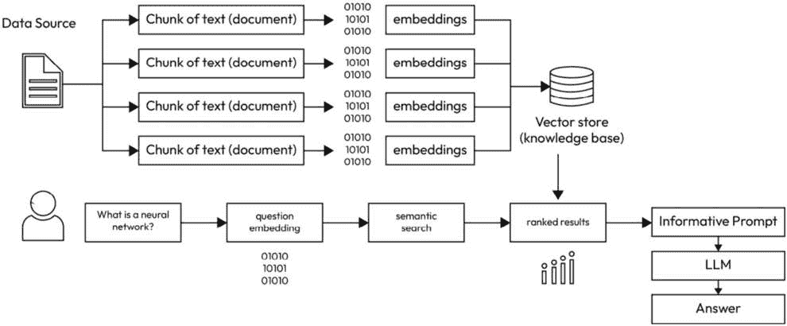

# 第八章：访问大型语言模型的力量：高级设置和与RAG的集成

在这个充满活力的**人工智能**（**AI**）和**机器学习**（**ML**）时代，理解可用的各种资源并学习如何有效地利用它们至关重要。**大型语言模型**（**LLMs**）如GPT-4通过在从内容生成到复杂问题解决的各种任务中展现出前所未有的性能，彻底改变了**自然语言处理**（**NLP**）领域。它们的巨大潜力不仅体现在理解和生成类似人类的文本上，还体现在弥合机器与人类之间的差距，无论是在通信还是任务自动化方面。拥抱LLMs的实际应用能够赋予企业、研究人员和开发者创建更直观、智能和高效的系统，以满足广泛的业务需求。本章将为您提供一个指南，介绍如何设置访问LLMs，并指导您如何使用它们以及如何构建与它们相关的管道。

我们的旅程从深入研究使用**应用程序编程接口**（**APIs**）的封闭源模型开始，以OpenAI的API作为一个典范示例。我们将通过一个实际场景向您展示，如何使用Python代码中的API密钥与该API交互，并展示此类模型在现实世界中的应用潜力。

随着我们不断前进，我们将把焦点转向开源工具的领域，向您介绍一些广泛使用的开源模型，这些模型可以通过Python进行操作。我们的目标是让您了解这些模型提供的力量和多功能性，强调开源开发的社区驱动优势。

随后，我们将向您介绍检索增强生成，特别是LangChain，这是一个专门为与LLMs交互而设计的强大工具。LangChain对于LLMs的实际应用至关重要，因为它提供了一个统一和抽象的接口，以及一系列工具和模块，这些工具和模块简化了LLM驱动应用程序的开发和部署。我们将引导您了解LangChain的基础概念，突出其独特的解决LLMs固有挑战的方法。

这种方法的基石是将数据转换为嵌入。我们将阐明**语言模型**（**LMs**）和LLMs在这次转换中扮演的关键角色，展示它们如何参与创建这些嵌入。随后，我们将讨论建立本地向量数据库的过程，为您简要概述向量数据库及其在管理和检索这些嵌入中的关键作用。

然后，我们将讨论用于提示的LLM的配置，这可能与用于嵌入过程的LLM相同。我们将逐步引导您进行设置过程，详细说明这种策略的优势和潜在应用。

在最后一部分，我们将涉及将LLM部署到云的话题。云服务的可扩展性和成本效益导致了托管AI模型采用率的增加。我们将概述领先的云服务提供商，包括**Microsoft Azure**、**Amazon Web Services**（**AWS**）和**Google Cloud Platform**（**GCP**），并为您提供关于他们的服务提供方式和如何利用它们进行LLM部署的见解。

在我们开始探索LLM的过程中，承认这些模型运行在其内的数据景观的持续演变至关重要。数据的动态特性——其体积、多样性和复杂性的增长——需要我们采取前瞻性的方法来开发、部署和维护LLM。在随后的章节中，特别是[第10章](B18949_10.xhtml#_idTextAnchor525)，我们将深入探讨这些演变数据景观的战略影响，为您准备应对它们带来的挑战和机遇。这种基础理解不仅将增强您与LLM的即时工作，还将确保您的项目在面对快速的技术和数据驱动变化时保持韧性和相关性。

让我们回顾本章涵盖的主要主题：

+   设置LLM应用 – 基于API的闭源模型

+   提示工程和初始化GPT

+   设置LLM应用 – 本地开源模型

+   通过Python使用Hugging Face的LLM

+   探索高级系统设计 – RAG和LangChain

+   在Jupyter笔记本中回顾简单的LangChain设置

+   云端LLM

# 技术要求

对于本章，以下将是必需的：

+   **编程知识**：熟悉Python编程是必需的，因为开源模型、OpenAI的API和LangChain都是使用Python代码进行说明的。

+   **访问OpenAI的API**：探索闭源模型需要OpenAI的API密钥。这可以通过在OpenAI创建账户并同意他们的服务条款来获得。

+   **开源模型**：需要访问本章中提到的特定开源模型。这些模型可以通过各自的存储库或通过包管理器如**pip**或**conda**访问和下载。

+   **本地开发环境**：需要一个安装了Python的本地开发环境。可以使用**集成开发环境**（**IDE**）如PyCharm、Jupyter Notebook或简单的文本编辑器。请注意，我们推荐使用免费的Google Colab笔记本，因为它将这些要求封装在一个无缝的网页界面中。

+   **安装库的能力**：你必须有权安装所需的Python库，例如NumPy、SciPy、TensorFlow和PyTorch。请注意，我们提供的代码中包含了所需的安装，你不需要事先安装它们。我们只是强调你应该有权这样做，我们预期你会这样做。具体来说，使用免费的Google Colab笔记本就足够了。

+   **硬件要求**：根据你正在处理的模型复杂性和大小，你需要一台具有足够处理能力（可能包括用于机器学习任务的优秀GPU）和充足内存的计算机。这仅在你选择不使用免费的Google Colab时相关。

现在我们已经了解了LLM的变革潜力以及可用的各种工具，让我们更深入地探讨如何有效地使用API设置LLM应用程序。

# 设置LLM应用程序 - 基于API的闭源模型

当考虑使用模型（特别是LLM）时，有各种设计选择和权衡。一个关键的选择是是否在本地环境中托管模型，还是通过通信渠道远程使用它。本地开发环境将是你代码运行的地方，无论是你的个人电脑、本地服务器、云环境，等等。你的选择将影响许多方面，如成本、信息安全、维护需求、网络过载和推理速度。

在本节中，我们将介绍一种快速简单的方法，通过API远程使用LLM。这种方法快速简单，因为它免除了我们为本地托管LLM而分配不寻常的计算资源的需求。LLM通常需要大量的内存和计算资源，这在个人环境中并不常见。

## 选择远程LLM提供商

在深入实施之前，我们需要选择一个与我们的项目需求相匹配的合适的LLM（大型语言模型）提供商。例如，OpenAI提供了GPT-3.5和GPT-4的多个版本，并配有全面的API文档。

### 通过API在Python中访问OpenAI的远程GPT

要获取OpenAI的LLM API访问权限，我们需要在他们的网站上创建一个账户。这个过程包括注册、账户验证和获取API凭证。

OpenAI的网站提供了这些常见操作的指导，你将能够快速设置好。

注册后，我们应该熟悉OpenAI的API文档。这份文档将指导我们了解与LLM交互的各种端点、方法和参数。

我们将要进行的第一个动手实践将是通过 Python 使用 OpenAI 的 LLMs。我们准备了一个笔记本，展示了通过 API 使用 OpenAI 的 GPT 模型的简单步骤。请参考 `Ch8_Setting_Up_Close_Source_and_Open_Source_LLMs.ipynb` 笔记本。这个名为 *设置近源和开源 LLMs* 的笔记本将在当前关于 OpenAI API 的章节中使用，也将在后续关于设置本地 LLMs 的章节中使用。

让我们逐步分析代码：

1.  我们首先安装所需的 Python 库。特别是，为了与 LLM API 进行通信，我们需要安装必要的 Python 库：

    ```py
    !pip install --upgrade openai
    ```

1.  **定义 OpenAI 的 API 密钥**：在向 LLM API 发送请求之前，我们必须将我们的个人 API 密钥嵌入到库的配置中。当你注册 OpenAI 时，API 密钥会在 OpenAI 的网站上提供给你。这可以通过将密钥的字符串明确粘贴到我们的代码中以硬编码，或者从包含该字符串的文件中读取它来完成。请注意，前者是展示 API 的最简单方式，因为它不需要设置额外的文件，但在共享开发环境中工作时可能不是最佳选择：

    ```py
    openai.api_key = "<your key>"
    ```

1.  **设置 – 设置模型的配置**。在这里，我们设置控制模型行为的各种参数。

在为通过 API 连接到 LLMs 奠定基础后，将我们的注意力转向同样重要的一个方面——提示工程和预处理，这是与这些模型有效沟通的艺术。

# 提示工程和 GPT 预处理

在返回讨论代码的下一部分之前，让我们暂停并提供一些背景信息。

提示工程是 NLP 中用于设计有效提示或指令的技术，当与 LLMs 交互时使用。它涉及精心设计提供给模型的输入，以产生期望的输出。通过在提示中提供特定的提示、上下文或约束，提示工程旨在引导模型的行为，并鼓励生成更准确、相关或针对性的响应。这个过程通常涉及迭代优化、实验，并理解模型的优势和局限性，以优化提示，提高在各种任务（如问答、摘要或对话生成）中的性能。有效的提示工程在利用 LMs 的能力以及塑造其输出以满足特定用户需求方面发挥着至关重要的作用。

让我们回顾一下提示工程中最具影响力的工具之一，**启动**。通过API启动GPT涉及在生成响应之前向模型提供初始上下文。启动步骤有助于设定生成内容的方向和风格。通过提供与所需输出相关的相关信息或示例，我们可以引导其理解并鼓励更专注和连贯的响应。启动可以通过包含特定指令、上下文，甚至与预期结果一致的片段句子来实现。有效的启动可以增强模型生成与用户意图或具体要求更匹配的响应的能力。

通过引入GPT和几种类型的信息来进行启动：

+   主要信息是**系统提示**。这条信息指导模型关于可能扮演的*角色*，它应该如何回答问题，可能面临的约束等等。

+   第二种信息类型是**用户提示**。用户提示在启动阶段发送给模型，它代表一个示例用户提示，就像您可能在ChatGPT的网页界面中输入的提示一样。然而，在启动时，这条消息可以展示给模型作为如何处理此类提示的示例。开发者将引入某种用户提示，然后展示模型如何预期回答该提示。

    例如，观察以下启动代码：

    ```py
    response = client.chat.completions.create(
        model="gpt-3.5-turbo",
        messages=[
               {"role": "system",
                   "content": "You are a helpful assistant. You provide short answers and you format them in Markdown syntax"},
                  {"role": "user",
                   "content": "How do I import the Python library pandas?"},
                  {"role": "assistant",
                   "content": "This is how you would import pandas:  \n```\nimport pandas as pd\n```py"},
                  {"role": "user",
                   "content": "How do I import the python library numpy?"}
            ])
    text = response.choices[0].message.content.strip()
    print(text)
    )
    ```

    这是输出：

    ```py
    To import numpy, you can use the following syntax: 
    ```python

    import numpy as np

    ```py
    ```

您可以看到我们启动模型以提供Markdown格式的简洁答案。用于教导模型的示例是问题和答案的形式。问题是通过用户提示，而我们告诉模型潜在答案的方式是通过助手提示。然后我们向模型提供另一个用户提示；这是我们要模型为我们处理的实际提示，如输出所示，它回答正确。

通过查看OpenAI关于提示工程的文档，你会发现还有其他类型的提示可以用来启动GPT模型。

回到我们的笔记本和代码，在这个部分，我们利用*GPT-3.5 Turbo*。我们以最简单的方式启动它，只给它一个系统提示来提供方向，以展示系统提示如何产生额外的功能。我们告诉模型通过提醒我们提示中的错误并纠正它们来完成响应。

然后我们在用户提示部分提供我们想要的提示，并在其中插入一些错误。运行那段代码并尝试一下。

## 尝试OpenAI的GPT模型

在这个阶段，我们向模型发送我们的提示。

以下简单的示例代码在*设置近源和开源LLMs*笔记本中运行一次。您可以将它封装在一个函数中，并在自己的代码中重复调用它。

值得注意的一些方面如下：

+   **解析和处理模型返回的输出**：我们以连贯的方式结构化输出响应，以便用户阅读：

    ```py
    print(f"Prompt: {user_prompt_oai}\n\n{openai_model}'s Response: \n{response_oai}")
    ```

+   **错误处理**：我们设计代码允许在接受API使用失败之前进行多次尝试：

    ```py
    except Exception as output:
        attempts += 1
        if attempts >= max_attempts:
            […]
    ```

+   **速率限制和成本缓解**：我们在这里没有实施此类限制，但在实验设置中，也许在生产环境中，同时拥有这两者将是理想的。

    以下代码的结果展示如下：

    ```py
    Prompt: If neuroscience could extract the last thoughts a person had before they dyed, how would the world be different?
    gpt-3.5-turbo's Response:
    If neuroscience could extract the last thoughts a person had before they died, it would have profound implications for various aspects of society.
    This ability could potentially revolutionize fields such as psychology, criminology, and end-of-life care.
    Understanding a person's final thoughts could provide valuable insights into their state of mind, emotional well-being, and potentially help unravel mysteries surrounding their death.
    It could also offer comfort to loved ones by providing a glimpse into the innermost thoughts of the deceased.
    However, such technology would raise significant ethical concerns regarding privacy, consent, and the potential misuse of this information.
    Overall, the world would be both fascinated and apprehensive about the implications of this groundbreaking capability.
    Typos in the prompt:
    1\. "dyed" should be "died"
    2\. "diferent" should be "different"
    Corrections:
    If neuroscience could extract the last thoughts a person had before they died, how would the world be different?
    ```

模型为我们提供了一个合法、简洁的响应。然后它通知我们有关错别字，这与我们提供给它的系统提示完全一致。

那是一个展示远程、场外、闭源LLM应用的例子。虽然利用像OpenAI提供的付费API的强大功能提供了便利和尖端性能，但挖掘免费开源LLM的潜力同样巨大。让我们接下来探索这些成本效益高的替代方案。

# 设置LLM应用程序 - 本地开源模型

现在，我们将讨论闭源实现的补充方法，即开源、本地实现。

我们将看到您如何在不注册账户、付费或与第三方供应商（如OpenAI）共享可能包含敏感信息的提示的情况下，实现与上一节中我们审查的类似的功能结果。

## 关于区分开源和闭源的不同方面

在选择开源LLM（如LLaMA和GPT-J）和闭源、基于API的模型（如OpenAI的GPT）之间时，必须考虑几个关键因素。

首先，成本是一个主要因素。开源LLM通常没有许可费用，但它们需要大量的计算资源进行训练和推理，这可能很昂贵。闭源模型虽然可能收取订阅费或按使用付费的费用，但消除了对大量硬件投资的必要性。

处理速度和维护与计算资源密切相关。如果部署在足够强大的系统上，开源LLM可以提供高速处理，但需要实施团队持续维护和更新。相比之下，由提供商管理的闭源模型确保持续的维护和模型更新，通常效率更高，停机时间更短，但处理速度可能取决于提供商的基础设施和网络延迟。

关于模型更新，开源模型提供了更多控制权，但需要主动方法来整合最新的研究和改进。然而，闭源模型由提供商定期更新，确保用户无需额外努力即可访问最新的进展。

在这两种情况下，安全和隐私都是至关重要的。开源模型可能更安全，因为它们可以在私有服务器上运行，确保数据隐私。然而，它们需要强大的内部安全协议。由外部提供商管理的闭源模型通常带有内置的安全措施，但由于第三方处理数据，可能存在潜在的隐私风险。

总体而言，开源和闭源语言模型（LLM）之间的选择取决于成本、控制和便利性之间的权衡，每种选择都有一套自己的优势和挑战。

考虑到这一点，让我们重新审视 Hugging Face，这家公司汇集了最大的、最易于访问的免费语言模型（LM）中心。在下面的示例中，我们将利用 Hugging Face 简便且免费的库：transformers。

## Hugging Face 的模型中心

当我们寻找为我们任务选择一个 LLM 时，我们建议参考 Hugging Face 的在线模型页面。他们提供了大量的基于 Python 的开源 LLM。每个模型都有一个专门的页面，您可以在这里找到有关它的信息，包括在您的个人环境中通过 Python 代码使用该模型所需的语法。

应该注意的是，为了在本地实现模型，您必须从运行 Python 代码的机器上拥有互联网连接。然而，由于这个要求在某些情况下可能成为瓶颈——例如，当开发环境受到公司内部网络的限制或由于防火墙限制而有限的互联网访问时——存在其他方法。我们推荐的方法是从 Hugging Face 的域名克隆模型仓库。这是一个不那么简单且不太常用的方法。Hugging Face 在每个模型的网页上提供了必要的克隆命令。

### 选择模型

当寻找模型时，可能会有几个因素需要考虑。根据您的意图，您可能关心配置速度、处理速度、存储空间、计算资源、法律使用限制等。另一个值得注意的因素是模型的流行度。它证明了该模型在社区中其他开发者中被选择的频率。例如，如果您寻找标记为零样本分类的 LMs，您将找到一个非常大的可用模型集合。但是，如果您进一步缩小搜索范围，以便只剩下在新闻文章数据上训练的模型，您将只剩下更小的可用模型集合。在这种情况下，您可能需要参考每个模型的流行度，并从使用最频繁的模型开始您的探索。

其他可能引起你兴趣的因素可能包括关于该模型的出版物、模型的开发者、发布该模型的公司或大学、模型训练所使用的数据集、模型设计的架构、评估指标，以及在每个模型在Hugging Face网站上网页上可能存在的其他潜在因素。

# 通过Python使用Hugging Face的LLMs

现在，我们将回顾一个代码笔记本，它展示了如何使用Hugging Face的免费资源在本地实现开源LLM。我们将继续使用上一节中相同的笔记本，*设置近源和开源LLMs*：

1.  在终端上使用`pip`，我们将运行以下命令：

    ```py
    pip install –upgrade transformers
    ```

    如果直接从Jupyter笔记本运行，请在命令的开头添加`!`。

1.  **实验Microsoft的DialoGPT-medium**：这个LLM专注于对话应用。它由Microsoft生成，在与其他LLMs的常见基准比较中取得了高分。因此，它在Hugging Face平台上也非常受欢迎，从ML开发者的角度来看，它经常被下载。

1.  在笔记本中的**设置**代码部分，我们将定义此代码的参数并导入模型及其分词器：

    ```py
    hf_model = "microsoft/DialoGPT-medium"
    max_length = 1000
    tokenizer = AutoTokenizer.from_pretrained(hf_model)
    model = AutoModelForCausalLM.from_pretrained(hf_model)
    ```

    注意，此代码需要访问互联网。即使模型是本地部署的，也需要互联网连接来导入它。再次提醒，如果你愿意，你可以从Hugging Face克隆模型的repo，然后不再需要访问互联网。

1.  **定义提示**：如以下代码块所示，我们在这里选择了简单的提示，类似于GPT-3.5-Turbo模型的用户提示。

1.  **实验模型**：在这里，我们有适合此代码的语法。如果你想与该模型进行滚动对话，你可以将此代码包裹在一个函数中，并实时收集用户的提示。

1.  **结果**：生成的提示是，**如果恐龙今天还活着，它们会对人类构成威胁吗**？

    ```py
    microsoft/DialoGPT-medium's Response:
    I think they would be more afraid of the humans
    ```

本节确立了LLMs可以带来的巨大价值主张。我们现在有了学习和探索高效LLM应用开发新前沿的必要背景——使用LangChain等工具构建管道。让我们深入了解这种方法。

# 探索高级系统设计——RAG和LangChain

**检索增强生成**（**RAG**）是一个专为与LLMs无缝交互而设计的开发框架。由于LLMs具有通用性，它们能够胜任大量任务。然而，它们的通用性往往阻止它们对需要特定知识或深入领域专业知识的问题提供详细、细微的响应。例如，如果你希望使用LLM来回答有关特定学科（如法律或医学）的查询，它可能能够满意地回答一般性查询，但可能无法准确回答需要详细见解或最新知识的问题。

RAG设计为LLM处理中通常遇到的限制提供了一个全面的解决方案。在RAG框架中，文本语料库经过初步预处理，被分割成摘要或独立的块，然后嵌入到向量空间中。当提出查询时，模型识别出这些数据中最相关的部分，并利用它们来形成响应。这个过程涉及离线数据预处理、在线信息检索以及应用LLM进行响应生成的应用。这是一个灵活的方法，可以适应各种任务，包括代码生成和语义搜索。RAG模型作为一个抽象层，协调这些过程。这种方法的有效性正在不断提高，其应用范围随着LLMs的发展而扩大，在提示处理过程中需要更多上下文丰富的数据。在[*第10章*](B18949_10.xhtml#_idTextAnchor525)中，我们将更深入地讨论RAG模型及其在LLM解决方案未来中的作用。

现在我们已经介绍了RAG模型的前提和功能，让我们专注于一个特定的例子，称为LangChain。我们将回顾其设计原则的细节以及它是如何与数据源交互的。

## LangChain的设计理念

在本节中，我们将剖析使LangChain脱颖而出的核心方法和架构决策。这将使我们深入了解其结构框架、数据处理效率以及其将LLMs与各种数据源集成的创新方法。

## 数据源

LangChain最显著的优点之一是能够将任意LLM连接到定义好的数据源。这里的“任意”意味着它可以是任何*现成的*LLM，这些LLM的设计和训练没有针对我们想要连接的数据进行特定的考虑。使用LangChain允许我们根据我们的领域进行定制。数据源在构建用户提示的答案时用作参考。这些数据可能是公司拥有的专有数据，也可能是个人机器上的本地个人信息。

然而，当涉及到利用特定的数据库时，LangChain所做的不仅仅是将LLM指向数据；它采用特定的处理方案，使其快速高效。它创建一个向量数据库。

对于原始文本数据，无论是`.txt`文件中的自由文本、格式化文件还是其他各种文本数据结构，通过将文本分割成适当长度并使用指定的模型创建数值文本嵌入，创建一个向量数据库。请注意，如果指定的嵌入模型选择为LLM，它不需要与用于提示的LLM相同。例如，嵌入模型可以选择为免费、次优的开源LLM，而提示模型可以是具有最佳性能的付费LLM。这些嵌入随后存储在向量数据库中。您可以看到，这种方法非常节省存储空间，因为我们将文本和可能的编码文本转换成有限的一组数值，其本质上是密集的。

当用户输入提示时，搜索机制会在嵌入的数据源中识别相关的数据块。提示使用相同的指定嵌入模型进行嵌入。然后，搜索机制应用相似度度量，例如余弦相似度，并找到定义的数据源中最相似的文字块。然后，检索这些块的原文本。然后将原始提示再次发送，这次发送到提示LLM。区别在于，这次提示不仅包括原始用户的提示，还包括作为参考检索到的文本。这使得LLM能够获得问题和丰富的文本补充作为参考。然后，LLM可以参考添加的信息作为参考。

如果没有这个设计，当用户想要找到他们问题的答案时，他们需要阅读大量的材料并找到相关的部分。例如，这些材料可能是一家公司整个产品方法，包括许多PDF文档。这个过程利用了自动智能搜索机制，将相关材料缩小到可以放入提示中的文本量。然后，LLM构建问题的答案并立即呈现给用户。如果您愿意，可以将管道设计为引用构建答案时使用的原始文本，从而实现透明度和验证。

这个范式在*图8.1*中展示：

.



图8.1 – 典型LangChain管道的范式

为了解释LangChain管道背后的提示工程，让我们回顾一个金融信息用例。您的数据源是美国上市公司的**证券** **&** **交易所** **委员会**（**SEC**）的文件集合。您正在寻找向股东发放股息的公司及其年份。

你的提示如下：

```py
Which filings mention that the company gave dividends in the year 2023?
```

流水线随后将这个问题嵌入其中，寻找具有相似上下文的文本块（例如，讨论派息的）。它识别了许多这样的块，如下所示：

```py
"Dividend Policy. Dividends are paid at the discretion of the Board of Directors. In fiscal 2023, we paid aggregate quarterly cash dividends of $8.79 per share […]"
```

LangChain流水线随后形成一个新的提示，其中包含已识别块的文字。在这个例子中，我们假设被提示的LLM是OpenAI的GPT。LangChain将信息嵌入到发送给OpenAI GPT模型的系统提示中：

```py
"prompts": [
    "System: Use the following pieces of context to answer the user's question. \nIf you don't know the answer, just say that you don't know, don't try to make up an answer.\n----------------\n Dividend Policy. Dividends are paid at the […]"
]
```

如我们所见，系统提示用于指导模型如何行动，并提供上下文。

既然我们已经了解了LangChain的基础方法和好处，让我们更深入地探讨其复杂的设计概念，从它如何高效地将LLMs与各种数据源桥接开始。

## 未预先嵌入的数据

虽然前面的描述是关于预处理成向量数据库形式的数据，但另一种方法是设置访问尚未处理成嵌入形式的外部数据源。例如，你可能希望利用SQL数据库来补充其他数据源。这种方法被称为**多个****检索源**。

我们现在已经探讨了LangChain如何高效地与各种数据源接口；现在，理解其功能的核心结构元素至关重要——链和代理。

## 链

LangChain内部的原子构建块被称为组件。典型的组件可能包括提示模板、访问各种数据源以及访问LLMs。当将各种组件组合成系统时，我们形成了一个链。一个链可以代表一个完整的由LLM驱动的应用程序。

现在，我们将介绍代理的概念，并通过一个代码示例展示链和代理如何结合在一起，创建出不久前相当复杂的功能。

## 代理

在链之上，下一层复杂性是代理。代理通过使用链并辅以额外的计算和决策来利用链。虽然链可能对简单的请求提示产生响应，但代理会处理响应并根据规定的逻辑进行进一步的下层处理。

你可以将代理视为一种推理机制，它使用我们所说的工具。工具通过将LLMs与其他数据或功能连接起来来补充LLMs。

由于典型的LLM缺陷阻止了LLMs成为完美的多任务执行者，代理以规定和监控的方式使用工具，使它们能够检索必要的信息，将其作为上下文，并使用指定的现有解决方案执行操作。然后代理观察结果并使用规定的逻辑进行进一步的下层处理。

例如，假设我们想要计算我们地区一名普通初级程序员的薪资轨迹。这个任务由三个关键子任务组成——找出平均起薪是多少，确定薪资增长的因素（例如，生活成本的变动或典型的绩效提升），然后进行预测。一个理想的LLM能够独立完成整个过程，不需要比一个连贯的提示更多的东西。然而，考虑到典型的缺陷，如幻觉和有限的训练数据，当前的LLM无法达到可以在商业产品中商业化的水平。一种最佳实践是将任务分解，并通过代理监控思维过程。

在其最简单的设计中，这需要以下步骤：

1.  定义一个可以访问互联网并能根据增长因子计算时间序列未来值的代理

1.  为代理提供全面的提示

1.  代理将提示分解为不同的子任务：

    1.  从互联网上获取平均工资

    1.  获取增长因子

    1.  通过应用增长因子到起始薪资并创建薪资值的未来时间序列来使用计算工具

为了说明代理方法，让我们回顾一个简单的任务，该任务涉及从网络上获取特定细节，并使用它来进行计算。

1.  首先，安装以下包：

    ```py
    !pip install openai
    !pip install wikipedia
    !pip install langchain
    !pip install langchain-openai
    ```

1.  然后，运行以下代码：

    ```py
    from langchain.agents import load_tools, initialize_agent
    from langchain_openai import OpenAI
    import os
    os.environ["OPENAI_API_KEY"] = "<your API key>"
    llm = OpenAI(model_name='gpt-3.5-turbo-instruct')
    tools = load_tools(["wikipedia", "llm-math"], llm=llm)
    agent = initialize_agent(tools, llm=llm, agent="zero-shot-react-description", verbose=True)
    agent.run("Figure out how many pages are there in the book Animal Farm. Then calculate how many minutes would it take me to read it if it takes me two minutes to read one page.")
    ```

    输出结果如下所示：

    ```py
    > Finished chain.
    'It would take me approximately 224 minutes or 3 hours and 44 minutes to read Animal Farm.'
    ```

注意，我们没有应用任何方法来固定LLM以重现这个确切响应。再次运行此代码将产生略微不同的答案。

在下一章中，我们将更深入地探讨几个带有代码的示例。特别是，我们将编写一个多代理框架，其中一组代理正在共同完成一个项目。

## 长期记忆和引用先前对话

另一个非常重要的概念是长期记忆。我们讨论了LangChain如何通过附加额外的数据源来补充LLM的知识，其中一些可能属于专有数据，使其针对特定用例高度定制化。然而，它仍然缺少一个非常重要的功能，即引用先前对话并从中学习的能力。例如，你可以为项目经理设计一个助手。随着用户与之互动，他们理想情况下会每天更新工作进度、互动、挑战等内容。如果助手能够消化所有这些新积累的知识并保持其持续性，那就更好了。这将允许出现以下场景：

+   **用户**：“关于吉姆团队的任务，我们目前处于什么位置？”

+   **助手**：“根据原始路线图，吉姆团队应该处理客户对原型设计的反馈。根据上周的更新，客户只提供了部分反馈，您认为这还不足以让吉姆团队开始工作。”

我们将在下一章中更深入地探讨记忆的概念。

## 通过增量更新和自动化监控确保持续的相关性

为了在动态信息环境中保持 LLM 输出的准确性和相关性，实施持续更新和维护向量数据库的策略至关重要。随着知识库的持续扩展和演变，作为 LLM 响应基础的嵌入也必须如此。采用增量更新技术允许这些数据库在新的信息可用时刷新其嵌入，确保 LLMs 可以提供最准确和最新的响应。

增量更新涉及定期重新嵌入现有数据源的最新信息。这个过程可以自动化，以扫描数据源中的更新，重新嵌入新的或更新的内容，然后将这些更新的嵌入集成到现有的向量数据库中，无需进行全面的重构。通过这样做，我们确保数据库反映了最当前的知识，增强了 LLM 提供相关和细微响应的能力。

自动监控在这个生态系统中发挥着关键作用，它通过持续评估 LLM 输出的质量和相关性。这涉及到建立跟踪 LLM 性能的系统，识别由于信息过时或缺失上下文而导致响应可能不足的区域。当发现这些差距时，监控系统可以触发增量更新过程，确保数据库始终是当前知识格局的稳健和准确反映。

通过采用这些策略，我们确保 LangChain 和类似的 RAG 框架能够随着时间的推移保持其有效性。这种方法不仅增强了 LLM 应用程序的相关性，还确保它们能够适应信息快速发展的格局，保持其在 NLP 技术前沿的位置。

我们现在可以亲身体验 LangChain。

# 在 Jupyter 笔记本中回顾简单的 LangChain 设置

现在，我们已经准备好设置一个完整的管道，该管道可以后来用于各种 NLP 应用程序。

请参阅 `Ch8_Setting_Up_LangChain_Configurations_and_Pipeline.ipynb` 笔记本。这个笔记本实现了 LangChain 框架。我们将一步一步地走过它，解释不同的构建块。在这里，我们选择了一个简单的用例，因为这段代码的主要目的是展示如何设置 LangChain 管道。

在这个场景中，我们处于医疗保健行业。我们有许多护理者；每位护理者都有许多他们可能看到的病人。首席医师代表医院内的所有医师提出请求，希望能够跨他们的笔记进行智能搜索。他们了解到 LLMs 的新兴功能，并希望拥有一个工具，可以在他们编写的医疗报告中进行搜索。

例如，一位医生说了以下内容：

“*我经常遇到可能与几个月前看过的患者相关的科研，但我记不起那个人是谁。我希望有一个工具，我可以问，‘那个抱怨耳朵疼痛并且有偏头痛家族史的患者是谁？’，然后它会找到那个患者。’*

因此，这里的商业目标是以下内容：

“*CTO要求我们快速构建一个以Jupyter笔记本形式的原型。我们将从医院的数据库中收集几份临床报告，并使用LangChain以示例中描述的医生的方式进行搜索。”*

让我们直接进入设计解决方案的Python实现。

## 使用Python设置LangChain管道

深入LangChain的实际应用，本节将逐步指导您使用Python设置LangChain管道，从安装必要的库到执行复杂的相似性搜索。

### 安装所需的Python库

和往常一样，我们有一个需要安装的库列表。由于我们将在Jupyter笔记本中编写代码，我们可以从代码中安装它们：

1.  **加载带有模拟医生笔记的文本文件**: 在这里，我们准备了一些模拟医生笔记。我们加载并按照LangChain范式处理它们。我们强调，这些不是真实的医疗笔记，那里描述的人并不存在。

1.  **处理数据以便准备嵌入**: 在这里，我们根据嵌入模型的要求分割文本。正如我们在前面的章节中提到的，像用于嵌入的LMs这样的模型有一个有限的输入文本窗口，它们可以在单个批次中处理。这个大小是硬编码在其设计架构中，并且对于每个特定模型是固定的。

1.  **创建将存储在向量数据库中的嵌入**: 向量数据库是LangChain范式的重要支柱之一。在这里，我们将文本转换为每个项目的嵌入。这些嵌入随后存储在一个专门的向量数据库中。LangChain库允许您使用几个不同的向量数据库。虽然我们选择了一个特定的数据库，但您可以参考**向量存储**页面了解更多关于不同选择的信息。

1.  **创建向量数据库**: 在这里，我们创建向量数据库。这个过程可能因数据库选择的不同而略有不同。然而，这些数据库的创建者确保移除所有困难的工作，并留下一个简单的现成函数，在给定适当的向量形式嵌入的情况下为您创建数据库。我们利用Meta的**Facebook AI相似性搜索**（**FAISS**）数据库，因为它简单、部署快速且免费。

1.  **基于我们内部文档进行相似度搜索**：这是流程中的关键部分。我们提出几个问题，并使用LangChain的相似度搜索来识别最能回答我们问题的医生笔记。

如我们所见，相似度搜索功能能够很好地处理大多数问题。它将问题嵌入并寻找嵌入相似的报告。

然而，当正确回答问题时，相似度搜索只能走这么远。很容易想到一个问题，讨论的是与笔记非常相似的事情，但微小的差异却使相似度搜索机制困惑。例如，相似度搜索过程实际上在第二个问题中犯了一个错误，错误地将不同的月份混淆，从而提供了错误的答案。

为了克服这个问题，我们不仅想要进行相似度搜索。我们希望一个LLM能够审查相似度搜索的结果并应用其判断。我们将在下一章中看到这是如何实现的。

在为LangChain在Python中的实际应用打下基础后，现在让我们继续了解云在其中的关键作用，尤其是在利用当代计算范式中的LLM真正潜力时。

# 云中的LLM

在大数据和计算时代，云平台已成为管理大规模计算的重要工具，提供可快速部署和释放的基础设施、存储和服务，同时管理努力最小化。

本节将专注于云中的计算环境。这些已成为许多领先公司和机构的首选。作为一个组织，拥有云中的计算环境而不是本地环境，会带来重大差异。它影响资源共享和管理分配、维护和成本的能力。使用云服务而不是拥有物理机器有许多权衡之处。你可以通过在线搜索或甚至询问一个聊天LLM来了解它们。

与云计算相比，一个显著的不同点是提供商围绕其构建的生态系统。当你选择一个云提供商作为你的计算中心时，你将接入一系列额外的产品和服务，开启一个全新的能力世界，这些能力在其他情况下可能无法轻易获得。

在本节中，我们将重点关注这些服务中的LLM（大型语言模型）方面。

三个主要的云平台是AWS、Microsoft Azure和GCP。这些平台提供了一系列服务，满足企业和开发者的不同需求。当涉及到NLP和LLM时，每个平台都提供专门资源和服务，以促进实验、部署和生产。

让我们探索这些平台中的每一个，看看它们如何满足我们的特定需求。

## AWS

AWS在云计算领域仍然是一个主导力量，提供了一套全面且不断发展的服务，以满足机器学习和人工智能开发的需求。AWS以其强大的基础设施、广泛的服务提供以及与机器学习工具和框架的深度集成而闻名，使其成为寻求使用LLM进行创新的开发者和数据科学家的首选平台。

### 在AWS上实验LLM

AWS提供了一套丰富的工具和服务，旨在促进LLM的开发和实验，确保研究人员和开发者能够访问最先进的机器学习能力：

+   **Amazon SageMaker**：AWS上机器学习的基础，SageMaker是一个全托管服务，它简化了整个机器学习工作流程。它提供Jupyter笔记本实例进行实验，支持广泛的框架，包括TensorFlow和PyTorch，以及一系列用于模型构建、训练和调试的工具。SageMaker的能力不断得到增强，以支持训练和微调LLM的复杂性，提供可扩展的计算选项和优化的机器学习环境。

+   **AWS深度学习容器和深度学习AMIs**：对于那些希望定制他们的机器学习环境的人来说，AWS提供了预装了流行机器学习框架的深度学习容器和**Amazon Machine Images（AMIs**）。这些资源简化了LLM实验的设置过程，使得开发者能够专注于创新而不是基础设施配置。

+   **预训练模型和SageMaker JumpStart**：AWS通过SageMaker JumpStart扩展了其可访问的预训练模型库，简化了各种自然语言处理任务中LLM的快速实验。JumpStart还提供了解决方案模板和可执行的示例笔记本，使得开发者更容易开始和扩展他们的机器学习项目。

### 在AWS上部署和产品化LLM

AWS提供了一套旨在高效部署和管理大规模LLM的服务，确保模型在各种负载下易于访问且性能出色：

+   **SageMaker端点**：为了部署LLM，SageMaker端点提供具有自动扩展功能的全托管托管服务。这项服务允许开发者快速将训练好的模型部署到生产环境中，同时基础设施会自动调整以适应应用程序的需求。

+   **弹性推理和Amazon EC2 Inf1实例**：为了优化推理成本，AWS提供了弹性推理服务，它为SageMaker实例增加了GPU驱动的推理加速功能。为了获得更高的性能和成本效率，由AWS Inferentia芯片驱动的Amazon EC2 Inf1实例为深度学习模型提供了高吞吐量和低延迟的推理服务。

+   **AWS Lambda和Amazon Bedrock**：对于无服务器部署，AWS Lambda支持在无需配置或管理服务器的情况下运行推理，非常适合需求可变的应用程序。Amazon Bedrock代表了向前迈出的重要一步，通过API、模型定制和无缝集成到组织网络中，提供无服务器访问基础模型，确保数据隐私和安全。

让我们继续下一个主题，微软Azure。

## 微软Azure

微软Azure处于云计算服务的最前沿，为ML和LLMs的开发、部署和管理提供了一个强大的平台。借助其与OpenAI的战略合作伙伴关系，Azure提供了对GPT模型的独家云访问，使其成为旨在利用高级NLP技术的开发人员和数据科学家的重要资源。最近的增强功能扩展了Azure的能力，使其成为那些希望推动AI和ML应用边界的人的更具吸引力的选择。

### 在Azure上实验LLMs

Azure显著丰富了其产品，以支持LLMs的研究和实验，提供各种工具和平台，满足AI开发社区的多样化需求：

+   **Azure OpenAI服务**：直接将OpenAI的尖端模型，包括最新的GPT版本、DALL·E和Codex，集成到Azure生态系统中。此服务使开发者能够轻松地将复杂的AI功能集成到他们的应用程序中，同时享有Azure的可伸缩性和管理工具的额外好处。

+   **Azure机器学习（Azure ML）**：这提供了一个高级环境，用于在特定数据集上对LLMs进行定制培训和微调，从而在特定任务上提高了模型性能。Azure ML Studio的预构建和可定制的Jupyter笔记本模板支持广泛的编程语言和框架，简化了实验过程。

+   **Azure认知服务**：这提供了一系列预构建的AI服务，包括文本分析、语音服务和由LLMs驱动的决策能力。这些服务使开发者能够快速地将复杂的AI功能添加到应用程序中，无需深厚的ML专业知识。

### 在Azure上部署和商业化LLMs

Azure的基础设施和服务为LLM应用程序的部署和商业化提供了全面的解决方案，确保了可伸缩性、性能和安全性：

+   **部署选项**：Azure通过**Azure容器实例（ACI**）支持各种部署场景，适用于轻量级部署需求，以及**Azure Kubernetes服务（AKS**）支持更大、更复杂的应用程序，这些应用程序需要高可伸缩性。这些服务允许高效地扩展LLM应用程序以满足用户需求。

+   **模型管理**：通过 Azure ML，开发者可以管理其模型的生命周期，包括版本控制、审计和治理。这确保了部署的模型不仅性能出色，而且符合行业标准和管理要求。

+   **安全和合规性**：Azure 强调在其所有服务中实现安全和合规性，提供数据加密、访问控制和全面的合规性认证等功能。这种承诺确保在 Azure 上构建和部署的应用程序符合数据保护和隐私的最高标准。

## GCP

GCP 继续在云计算领域保持领先地位，提供了一套广泛的服务，以满足人工智能（AI）和机器学习（ML）发展的不断变化的需求。以其在 AI 和 ML 领域的尖端创新而闻名，GCP 提供了一个丰富的工具和服务生态系统，简化了 LLMs 的开发、部署和扩展，使其成为开发者和研究人员利用最新 AI 技术的理想平台。

### 在 GCP 上实验 LLMs

GCP 进一步增强了其用于实验和开发 LLMs 的功能，提供了一套全面的支持整个 ML 工作流程的工具，从数据摄取和模型训练到超参数调整和评估：

+   **Vertex AI**：作为 GCP 机器学习产品线的核心，Vertex AI 提供了一套集成的工具和服务，简化了机器学习工作流程。它为训练和微调 LLMs 提供了高级功能，包括用于自动化选择最佳模型架构和超参数的 AutoML 功能。Vertex AI 与 GCP 强大的数据和数据分析服务的集成使得管理对训练 LLMs 至关重要的大数据集变得更加容易。

+   **集成开发环境（IDE）**：Vertex AI 内置的笔记本服务提供了一个完全管理的 JupyterLab 环境，使开发者能够无缝地编写、运行和调试机器学习（ML）代码。此环境针对 ML 开发进行了优化，支持 TensorFlow 和 PyTorch 等流行框架，这些框架对于构建和实验大型语言模型（LLMs）至关重要。

+   **AI 和 ML 库**：GCP 继续扩展其预训练模型和机器学习 API 的库，包括专门为自然语言处理（NLP）和理解设计的那些。这些工具允许开发者快速将高级 NLP 功能集成到他们的应用程序中。

### 在 GCP 上部署和产品化 LLMs

GCP 为部署和产品化 LLMs 提供了强大且可扩展的解决方案，确保在其平台上构建的应用程序能够满足现实世界使用的需求：

+   **Vertex AI 预测**：一旦 LLM 被训练，Vertex AI 的预测服务允许轻松地将模型作为完全管理的、自动扩展的端点进行部署。此服务简化了使 LLMs 可用于应用程序的过程，同时基础设施会自动调整以适应工作负载需求。

+   **Google Kubernetes Engine (GKE)**：对于需要高可用性和可扩展性的复杂部署场景，GKE 提供了一个托管环境来部署容器化的 LLM 应用程序。GKE 的全球基础设施确保您的模型具有高可用性，并且可以扩展以满足企业级应用程序的需求。

## 云服务总结

云计算领域持续快速发展，AWS、Azure 和 GCP 各自为 LLM 的开发和部署提供了独特的优势。AWS 以其广泛的基础设施和与 ML 工具的深度集成而突出，使其成为各种 ML 和 AI 项目的理想选择。Azure 通过其对 OpenAI 模型的独家访问和在微软生态系统中的深度集成，为企业利用 AI 技术的尖端提供了无与伦比的机会。GCP 以其在 AI 和 ML 领域的创新而闻名，提供与谷歌内部 AI 进步相匹配的工具和服务，吸引那些寻求最新 AI 研究和开发的人。随着这些平台功能的不断扩展，选择它们之间的差异将越来越多地取决于具体项目需求、组织协调和战略伙伴关系，这突显了基于当前和未来基于云的 AI 和 ML 环境进行深思熟虑评估的重要性。

# 摘要

随着自然语言处理和 LLM 领域的快速增长，系统设计的各种实践也在增加。在本章中，我们回顾了 LLM 应用和管道的设计过程。我们讨论了这些方法的组成部分，涉及基于 API 的封闭源代码和本地开源解决方案。然后，我们通过代码让您亲身体验。

我们后来更深入地探讨了系统设计过程，并介绍了 LangChain。我们回顾了 LangChain 包含的内容，并在代码中进行了示例管道的实验。

为了补充系统设计过程，我们调查了领先的云服务，这些服务允许您进行实验、开发和部署基于 LLM 的解决方案。

在下一章中，我们将重点关注特定的实际用例，并伴随代码。
