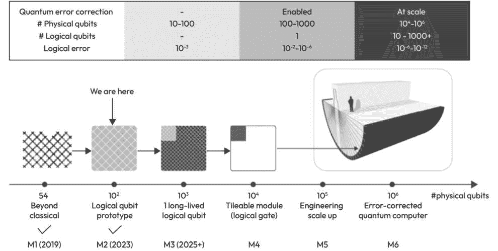

# 第十章：乘浪而行：分析由LLMs和AI塑造的过去、现在和未来趋势

**自然语言处理**（**NLP**）和**大型语言模型**（**LLMs**）位于语言学和人工智能的交汇点，是我们理解人机交互的里程碑。它们的故事始于基本的基于规则的系统，虽然在当时具有创新性，但由于人类语言的复杂性和庞大性，往往陷入困境。这些系统的局限性凸显了转变的需求，为**机器学习**（**ML**）时代的到来铺平了道路，其中数据和模式识别规定了设计和模型。

在本章中，我们将回顾在自然语言处理和大型语言模型中出现的几个关键趋势，其中一些趋势足够广泛，可以捕捉到人工智能整体的方向。我们将从定性的角度讨论这些趋势，旨在突出它们的宗旨、价值和影响。在接下来的章节中，我们将分享我们对未来的看法。我们希望激发你的好奇心，并激励你与我们一同探索这些新兴路径。

让我们回顾本章涵盖的主要主题：

+   大型语言模型和人工智能的关键技术趋势

+   计算能力 - LLMs背后的引擎

+   大型数据集及其对自然语言处理和大型语言模型的不可磨灭的影响

+   大型语言模型的演变 - 宗旨、价值和影响

+   自然语言处理和大型语言模型中的文化趋势

+   商业世界中的自然语言处理和大型语言模型

+   由人工智能和大型语言模型引发的行动趋势 - 社会方面

让我们深入探讨我们看到的许多趋势，从技术趋势开始。

# 大型语言模型和人工智能的关键技术趋势

在本节中，我们涵盖了我们在自然语言处理和大型语言模型领域识别出的关键趋势。

我们将首先探讨技术趋势，稍后，我们将触及一些较软的文化趋势。

## 计算能力 - LLMs背后的引擎

随着技术的进步，尤其是在计算领域，科技领域的许多领域都蓬勃发展，尤其是自然语言处理（NLP）和大型语言模型（LLMs）。这不仅仅关乎更快的计算和更大的参数空间；这关乎新的可能性以及重塑我们的数字世界。在本节中，我们将探讨计算领域的这种增长如何成为今天NLP和LLMs的基础，重点关注它们的宗旨、价值和影响。

### 目的 - 为进步铺路

在人工智能和机器学习的初期，模型是基础的——不是因为缺乏想象力或意图，而是因为受限于计算边界。我们现在认为基本任务，如简单的模式识别，是重大的工作，因为它们需要高度算法的复杂性以实现低复杂性。在计算机科学课程中，我们被教导，具有超出线性的复杂性的算法具有较差的可持续性和不切实际的扩展性。

随着计算能力的增长，研究者的雄心也日益增长。他们不再局限于玩具问题或理论设置。计算进化意味着他们现在可以设计和测试相当复杂和深入的模型，这是我们今天认为高级NLP和LLMs的先决条件。

并行处理的出现和**图形处理单元（GPU**）的发展标志着根本性的转变。由于它们被设计为同时处理多个操作，这些创新似乎是为NLP的需求量身定制的，允许训练广泛的计算任务，如神经网络，并促进实时处理。

### 价值 - 放大潜力和效率

计算能力的提升不仅改善了可能性的范围，还改变了实际可行的范围。训练大型模型变得经济可行，确保研究机构和公司能够在没有高昂成本的情况下进行实验、迭代和优化他们的模型。

数字时代引入了数据泛滥。有效地处理、解析和从这信息海洋中提取洞察力变得可行，这主要得益于计算能力的指数级增长。这对于LLMs在大量数据集上进行自我训练的能力至关重要，它提取细微的语言模式并将它们作为预测和辅助等下游任务的信号。

今天的用户越来越习惯于不断增长的处理速度，并要求即时互动。无论是提供建议的数字助手还是AI驱动的客户服务平台，实时响应已成为标准。增强的计算能力确保了复杂的NLP任务，在过去可能需要几分钟甚至几小时，现在在终端设备上只需几秒钟就能完成。

### 影响 - 重新塑造数字互动和洞察

计算能力的提升使得AI驱动的界面成为常态。从网站上的聊天机器人到语音激活的家庭助手，NLP和LLMs，凭借先进的处理能力，已经成为日常生活的一部分。

艺术、文学和娱乐领域已经见证了人工智能的进入，得益于自然语言处理/大型语言模型（NLP/LLMs）与计算能力的紧密关系，AI驱动的内容创作者和音乐生成器等工具成为可能。

通过处理各种语言数据的计算手段，NLP模型现在提供多语言支持，打破语言障碍，促进全球数字包容性。在2023年，我们见证了Meta发布了SeamlessM4T，这是一个多语言LLM，是一个单一模型，能够执行多达100种语言的语音转文本、语音转语音、文本转语音和文本转文本翻译；您可以在此处了解更多信息：[https://about.fb.com/news/2023/08/seamlessm4t-ai-translation-model/#:~:text=SeamlessM4T%20is%20the%20first%20all,languages%20depending%20on%20the%20task](https://about.fb.com/news/2023/08/seamlessm4t-ai-translation-model/#:~:text=SeamlessM4T%20is%20the%20first%20all,languages%20depending%20on%20the%20task)。

总结来说，计算能力及其与NLP和大型语言模型（LLMs）的关系是一个相互增长和演变的故事。这是一个强调硬件进步和软件创新之间联系的故事。展望未来，随着量子计算和神经形态芯片预示着计算跃进的下一个前沿，人们只能想象NLP和LLMs将迎来进一步的革命。我们所见证的计算进步的目的、价值和影响是它作为人工智能驱动语言革命基石作用的证明。

现在，让我们看看事情将走向何方。

## 自然语言处理（NLP）计算能力的未来

我们确定了将发生的一些进步，并将推动计算能力，这些能力将被人工智能和特别是NLP所利用。

### 速度的指数级增长

摩尔定律传统上认为，每两年微芯片上的晶体管数量大约翻一番。尽管有人对其在传统意义上的可持续性表示怀疑，但它为估计计算能力的增长提供了一个有用的指南。芯片架构的进步，如3D堆叠和创新的晶体管设计，可能有助于维持甚至加速这种增长。

对于实时NLP应用的需求，从翻译服务到语音助手，将继续推动对更快计算速度的需求。我们正在见证一个新的趋势，即AI专用硬件。谷歌在2015年发布了Tensor Processing Unit（[https://spectrum.ieee.org/google-details-tensor-chip-powers](https://spectrum.ieee.org/google-details-tensor-chip-powers)），自那时起，我们看到了更多这样的专用硬件，无论是来自大公司如Meta和Nvidia，还是来自小型新兴初创公司。

### 规模经济和成本效益

随着人工智能和NLP的日益普及，科技巨头和初创公司都有显著的动机投资于更高效、可扩展和成本效益的计算基础设施。

云计算向的转变已经使大量计算资源对即使是小型初创公司也变得可访问。这一趋势很可能会持续下去，预计每项计算的成本将降低，使自然语言处理应用更加可访问和负担得起。

### 量子计算 – 下一个前沿

量子计算代表了我们在理解和利用计算能力方面的一个范式转变。量子比特，或称为量子位，可以通过叠加现象同时表示0和1，这可能会为特定问题提供指数级的加速。

尽管量子计算还处于发展阶段，但其对自然语言处理的潜在影响是深远的。训练复杂模型，目前可能需要几天或几周，可能缩短到几小时甚至几分钟。

谷歌已经在量子计算领域确立了自己作为重要先锋的地位（以下引用来自此处：[https://quantumai.google/learn/map](https://quantumai.google/learn/map)）：

*从大约100个物理量子比特开始，我们可以研究构建逻辑量子比特的不同方法。一个逻辑量子比特允许我们存储量子数据，而不会出错，足够长的时间，以至于我们可以用它们进行复杂计算。之后，我们将达到量子计算的分立时刻：即我们证明这项技术已经准备好进行扩展和商业化的那一刻* *。

谷歌制定了一个里程碑路线图，概述了关键成就的未来预测。见*图10*.*1*。值得注意的是，谷歌一直在坚持这一路线图，这对于这样一个雄心勃勃的研究领域来说是非常惊人的：

图10.1 – 构建纠错量子计算机的关键里程碑

密码学，作为安全数据传输的关键组成部分，对于基于云的自然语言处理服务至关重要，也将经历巨大的变化，鉴于量子计算有可能破解几种现有的加密方法。因此，量子安全加密方法的出现将至关重要。

### 能源效率和可持续性

随着对计算能力的需求增长，数据中心能耗也在增加。将会有一个双重驱动，即向更节能的计算和可持续能源来源转变，以支持这些计算工作。

在自然语言处理的背景下，这可能意味着更高效的模型架构，需要更少的能量来训练和运行，以及最大化每瓦特操作的硬件创新。

### 专门用于NLP的硬件

我们已经见证了专门用于深度学习的**张量处理单元**（**TPUs**）的兴起。展望未来，可能会有针对自然语言处理（NLP）任务的专用硬件，确保更快速和高效的模型操作。

神经形态计算，它试图模仿人脑的架构，可能在需要逻辑和直觉结合的任务，如自然语言处理（NLP）中，提供独特的优势。Davies等人在其出版物“*通过Loihi推进神经形态计算：结果概述*”中回顾了一些关键机遇。

### 高端计算的民主化

随着边缘计算的发展以及日常设备中强大处理器的丰富，高端NLP任务可能并不总是需要连接到集中的数据中心。潜在地，高级NLP能力可能成为智能手机、智能家居设备和甚至智能手表的标准。你将能够在个人设备上获得一个LLM，它本地运行并立即响应，就像你的计算器一样。

### 云计算 - NLP和LLMs演变的催化剂

云平台在计算资源方面提供了前所未有的灵活性，使得训练更大、更复杂的NLP模型变得更加容易。

如AWS的SageMaker、Microsoft的Azure机器学习工作室和Google的Vertex AI等平台，促进了协作精神，为研究人员和开发者提供了无缝共享模型、数据集和工具的工具。

本地、边缘和云计算的组合确保了NLP任务的高效处理，平衡了延迟和计算能力。

云平台正在演变，使高端计算能力更加易于获取，定价模式反映了实际使用情况，并在降低成本的情况下提供临时的高性能计算访问。

要总结我们对计算能力未来的看法，特别是与NLP相关，它显然是呈上升趋势的。尽管挑战依然存在，尤其是在能耗和传统芯片扩展的潜在障碍领域，但量子计算等创新有望开启通往具有自己份额的专著的能力。

计算能力的未来，即NLP运行的引擎，看起来前景光明，因此让我们讨论另一个关键组件：数据。

# 大型数据集及其对NLP和LLMs不可磨灭的影响

大数据时代以及随之而来的NLP和LLMs的崛起紧密相连。没有提及可用的庞大数据集，就无法讨论NLP和LLMs转变为今天强大发展的过程。让我们探讨这种关系。

## 目的 - 训练、基准测试和领域专业知识

在本质上，大型数据集的出现为训练日益复杂的模型提供了所需的原始材料。通常，数据集越大，模型可以学习的信息就越全面和多样化。

大型数据集不仅作为训练场地，还为评估模型性能提供了基准。这导致了标准化措施的出现，为研究人员提供了明确的目标，并允许在模型之间进行苹果对苹果的比较。有一系列常见的基准可以用来评估LLMs。谷歌创建了一个著名且非常全面的基准，即超越模仿游戏基准（BIG-bench）。这是一个旨在评估LLMs的响应并推断其未来能力的基准。它包含了超过200个任务，如阅读理解、摘要、逻辑推理，甚至社会推理。

覆盖特定领域的大型数据集，例如医疗保健或法律文本，为能够以高精度理解和操作特定领域的专业模型铺平了道路。例如，BERT是由谷歌开发的，后来由Hugging Face免费提供。BERT的设计采用了迁移学习；因此，它非常适合定制和创建一个针对特定领域的模型的新版本。其中一些最成功的版本包括BERT-base-japanese，它是在日本数据上预训练的；BERTweet，它是在英语推文上预训练的；以及FinBERT，它是在金融数据上预训练的。

## 价值 - 坚固性、多样性和效率

随着数据的增加，模型可以捕捉到人类语言更多细微之处和微妙之处。这种信息量的丰富使得模型能够更好地泛化到各种任务中。

大量且多样化的数据集的可用性确保了模型在多种语言、方言和文化背景下进行训练。这推动了NLP向更具包容性的方向发展，能够识别和回应更广泛的受众。

大型数据集在一定程度上消除了对大量手动标记的需求。本书前面提到的无监督和自监督学习模型利用了这种丰富性，节省了时间和金钱。

## 影响 - 民主化、熟练度和新的担忧

通过对大型数据集的开放访问，NLP研究领域的许多进入障碍已经降低。这导致了NLP的民主化，更多的人和组织能够进行创新。

GPT-3和BERT等LLMs的熟练程度归功于它们所训练的广泛数据。这些被认为是当前最先进的模型，在各种NLP任务中设定了新的基准，所有这些都得益于它们所训练的丰富数据集。

由于NLP多年来主要是一个研究领域，一些适用于商业领域的法律方面并不适用。然而，随着这些模型的大量使用和商业化，它们所反映的大型数据集引起了严重的担忧。这些数据集通常是从网络中抓取的，引发了关于隐私、数据所有权和潜在偏差的伦理问题。这导致监管机构着手制定有关如何道德地获取和使用数据的指南。例如，在撰写本书时，我们注意到不同国家采取了不同的行动。日本迅速采取了一种非常自由的政策，允许模型在可在线获取的数据上进行训练，而欧盟则表现出更为限制性的方法。美国的官方指南似乎避免涉及版权争议。

我们现在可以阐述一些关于数据和其在LLMs发展中作用的未来预测。

### NLP中数据可用性的未来

未来，我们将看到数据如何继续增长，同时解决各种方面和挑战。以下是关键点。

#### 领域专业知识和专业化

随着大型语言模型（LLMs）证明其能力和受欢迎程度，人们越来越重视使它们精通。我们可以通过多种方式提高LLM的熟练度，其中一种方式是向其提供捕捉特定领域数据的数据集，并利用LLM在该特定领域的专业知识。未来，我们预计将培养更多细分、特定领域的专业数据集。无论是医疗保健、法律、金融还是任何专业领域，重点都将放在数据的丰富性和特异性上，使模型能够实现无与伦比的领域专业知识。自LLMs出现和日益流行以来，我们已经看到了许多针对特定商业领域定制LLM的商业案例，医疗保健和金融领域受到了很多关注。

相反，随着不同领域的重叠，综合数据集出现。这些数据集结合了多个领域的专业知识。例如，一个数据集可能将法律和人工智能伦理交织在一起，试图提出促进人工智能监管的新见解。另一个例子是为了形成算法交易方案，将计算机代码和股票交易联系起来。

#### 追求多样性

随着技术的扩展，数据集将越来越多地涵盖不太为人所知的语言和地方方言。这将使NLP能够满足更广泛的全球受众，使数字通信更具包容性。我们在本章 earlier 讨论的 Meta 的 SeamlessM4T 是一个能够通过LLM进行跨语言对话的优秀例子。

除了语言本身，语言的文化方面也很重要，比如行话或仅仅是词语的选择。捕捉文化细微差别和语境将成为未来文本生成中的关键。这将导致更具文化意识和情境感知的模型。

#### 消除偏见

在认识到我们数字内容中存在的隐含偏见时，将出现大量工具和方法来审计数据集的偏见。社区将努力实现既大又公平的数据集。而不是盲目地从网络中抓取数据，更多的努力将用于数据整理，确保其具有代表性且无明显的偏见。这可能包括积极寻找代表性不足的声音或过滤掉可能有害的偏见。

#### 监管环境

随着对数据隐私的关注日益增加，尤其是在欧盟的GDPR和加州的CCPA，我们可以期待对数据集的收集和利用有更严格的指导方针。

除了隐私之外，还将推动更多道德的方式来收集数据。这意味着确保数据收集不涉及剥削，有适当的同意，并尊重个人和群体的权利。

在可重复研究的精神下，可能会推动使数据集，尤其是用于基准测试和主要模型的数据集，更加透明和开放。当然，这需要与隐私问题相平衡。

#### 增强数据集

在一个数字环境中，创造真正新颖和独特的数据是一项非凡的任务，增强数据集提供了一个替代解决方案。通过人工扩展和修改现有数据集，增强可以迅速满足对多样化数据的日益增长的需求，而无需进行繁琐的新数据收集过程。增强数据集有助于解决以下四个数据集挑战：

+   **增强领域专业知识**：虽然特定领域的数据集可以满足领域特定性，但它们的大小往往受到限制。增强数据集可以填补这一差距，人为地扩展特定领域的数据集，从而提供深度和广度。例如，可能只有有限真实世界数据的罕见医疗状况可以通过增强来训练稳健的模型。

+   **多样性放大**：捕捉全球语言和文化的众多细微差别是一项艰巨的任务，但可以通过增强来显著缓解。诸如回译或同义词替换等技术可以引入语言多样性，基于上下文的修改可以模拟文化细微差别，从而推动模型向真正的全球理解发展。

+   **偏差校正**：数据增强的一个突破性应用在于其平衡偏差的潜力。通过识别数据集中代表性不足的声音或主题，增强可以人为地提升它们，确保更平衡的代表性。可以采用对抗性训练等技术，故意向模型展示具有挑战性或矛盾的数据，以消除偏差。

+   **合规性监管**：在一个不断加强数据监管的世界中，增强数据集提供了宝贵的优势。此外，可以设计技术来确保增强数据遵守隐私规范，从而为模型提供充足的学习数据，同时不越过监管边界。例如，想想我们的医疗代码示例，我们实现了一个内部搜索引擎，可以根据医生的查询找到医疗记录。为了给它提供数据库，我们通过提示ChatGPT生成了模拟的医疗记录。

尽管增强数据集为许多数据相关挑战提供了创新解决方案，但它们并非没有缺点。原则上，过度依赖增强可能导致模型擅长识别人工模式，但在现实世界的变异性上却失败。如果原始数据集存在未考虑的偏差，还存在无意中放大偏差的风险。此外，并非所有增强技术都普遍适用；对某个数据集有效可能对另一个数据集造成扭曲。最后，关于创建合成数据的伦理辩论也是一个问题，特别是在敏感领域，其中真实和增强之间的区别可能会模糊基本真相。

为了总结我们在NLP和AI背景下对数据的讨论，我们观察到大型数据集的可用性如何彻底改变了NLP领域以及大型语言模型（LLMs）的发展。它们为现代NLP的辉煌建立提供了基础，塑造了其目的，放大了其价值，并对研究、应用以及整个社会产生了持久的影响。

在可预见的未来，随着大型数据集继续塑造NLP的世界，我们正展望一个不仅数据丰富，而且具有道德意识、特定领域和全球包容性的未来。这些趋势源自当前网络文章和出版物中的集体智慧，描绘了NLP数据驱动旅程的美好前景。

现在我们已经讨论了驱动算法创建的计算能力和指导LLMs智能的数据，我们可以考虑LLMs本身。

# 大型语言模型的演变——目的、价值和影响

LLMs的兴起和发展是我们不懈追求更先进算法的见证。这些巨大的计算语言学模型从其最初的形式已经走了很长的路，不仅在规模上增长，而且在能力上也增长。当我们深入研究这些强大工具的目的、价值和影响时，很明显，它们的演变与我们利用机器驱动通信和认知的真正潜力的愿望紧密相连。

## 目的——为什么追求更大、更好的LLMs？

LLMs发展的背后逻辑围绕着弥合人类与机器通信差距的追求，其中人类语言将被输入机器进行下游处理。随着数字时代的开始，对流畅、上下文感知和智能系统的需求变得明显，这些系统能够以细微的方式理解人类语言。正如前几章所广泛讨论的，深度学习（DL）是LLMs的基础。随着计算能力的提升，DL模型在深度和复杂性上增长，在各种任务中，尤其是在自然语言处理（NLP）任务中，性能得到了提升。

传统深度学习模型的训练依赖于需要标注数据的监督学习，这反过来又既资源密集又限制性。自监督学习和如**从人类反馈中进行强化学习**（**RLHF**）等方法的出现拓宽了视野。这些方法不仅最小化了显式标注的需求，还为模型以更有机的方式学习打开了大门，模仿人类的学习过程。

早期的自然语言处理模型能够针对狭窄的焦点回答问题或执行任务。大型语言模型（LLMs）的演变带来了范式转变，其中模型开始表现出推理能力，遵循思维链，并产生连贯、较长的响应。这是朝着复制类似人类对话的重大一步。早期模型的通用方法有其局限性。随着技术的成熟，出现了将LLMs定制到特定任务的能力。例如，设置检索数据集或微调预训练模型等技术，使企业和研究人员能够将通用的LLMs塑造成专业工具，提高准确性和实用性。

## 价值——LLMs的优势

LLMs随着其演变，在多个领域带来了前所未有的价值。它们变得更加准确、高效、适应性强和可定制。

更大的模型展示了内在的把握上下文的能力，减少了解释和输出的错误。这种准确性转化为在各种应用中的效率，如聊天机器人和内容创作。它们通过利用如RLHF等卓越技术来适应，这些技术使它们能够从交互和反馈中学习，使它们随着时间的推移变得更加有弹性和动态。由于可定制，LLMs可以满足利基行业和任务的需求，成为各个行业中的宝贵资产。

另一个我们可以看到正在增长的价值是打破语言障碍的能力，因为模型能够理解和生成多种语言，满足了全球对通用通信的渴望。

## 影响——改变格局

LLM的兴起和演变在技术格局和人与机器的互动中留下了永久的印记。从医疗保健和金融到娱乐和教育，LLM正在革新运营、客户互动和数据分析。有趣的是，随着这些模型变得更加复杂，它们的使用变得更加简单。技术敏锐度成为一个更低的要求，因为随着更直观和自然语言界面的出现，无论技术知识如何，更广泛的受众现在都可以利用高级计算工具的力量。

这些影响元素是数字生态系统协同发展的一个部分。随着LLM在各个平台和服务中整合，我们正在见证更多有组织、同步的数字生态系统的创建，这些系统提供无缝的用户体验。

想象LLM下一步将走向何方，令人兴奋。

### LLM设计的未来

LLM的快速进化预示着一个充满创新的未来。从当前的研究趋势、在线出版物和专家预测中汲取灵感，我们可以预测LLM设计可能走向的几个方向。

#### 学习方案和深度学习架构的优化

正如我们所见，自监督学习和RLHF已经改变了LLM的游戏规则。下一个前沿可能涉及结合各种学习范式或引入新的范式。随着深度学习技术的进步，我们可能会看到更多混合模型，这些模型整合了不同架构的最佳特性，以提高性能、泛化能力和效率。

Palantir的首席技术官Shyam Sankar提出的一个同时使用多个LLM的例子，他描述了他们的K-LLMs方法。他将LLM比作专家，并问为什么只用一个专家来回答问题，而可以组建一个委员会来共同回答这个问题？他建议使用不同LLM的集合，每个LLM可能具有互补的优势，以便能够综合出一个更加周全的答案。应该强调的是，在这个想法中，每个LLM都被分配了相同任务。这并不一定非得如此，在下一个方法中，我们将讨论相反的情况。请在此处查看完整视频：[https://youtu.be/4aKN5mCPF5A?si=kThpx8hOok1i0QWC&t=327](https://youtu.be/4aKN5mCPF5A?si=kThpx8hOok1i0QWC&t=327)。

另一种吸收专家团队的方法是通过模拟一个专业团队。在这里，为LLM分配了指定的角色。然后，任务由指定的每个角色依次处理。每个角色不仅处理任务，还处理之前其他角色完成的工作的遗留问题。这样，就有了一种迭代的方法来构建对复杂问题的深思熟虑的解决方案。我们在[*第9章*](B18949_09.xhtml#_idTextAnchor506)的例子中看到了这个迷人的过程，我们利用了Microsoft的Autogen。

#### 提示工程的兴起

有效提示LLM已经成为一门微妙的艺术和科学，被称为**提示工程**。随着模型的发展，手动制作每一个查询可能变得不可行。未来可能会看到自动化或半自动的方法来生成提示，以确保一致和期望的输出。推动的方向是使LLM更加用户友好，最小化有效与之交互所需的专门知识。

在[*第8章*](B18949_08.xhtml#_idTextAnchor440)中，我们讨论了提示工程的一些关键方面。我们解释了如何利用OpenAI的GPT模型，通过一个技术特性，如系统提示。有趣的是，提示工程中还有一些非技术方面，对于实现最佳LLM结果同样有价值。当我们说非技术时，我们指的是在提示中提供连贯的请求描述，就像我们提供给寻求帮助我们的人类一样。

我们期待看到在提示中进一步出现微妙的技术，就像提示链和软提示一样。提示链是将复杂任务分解成小任务并反映在每个小提示中的提示迭代。这允许有更高的遵守度、正确性和监控。软提示是一种算法技术，旨在微调表示提示的向量。

一个这样的迷人例子是C[. 杨等人的**大型语言模型作为优化器**](https://arxiv.org/abs/2309.03409)；参见**Arxiv**上的出版物：[https://arxiv.org/abs/2309.03409](https://arxiv.org/abs/2309.03409)。他们发现，鼓励LLM在解决方案上给予深思熟虑的关注，可以带来更好的性能。如果我们假设LLM只有一个继承的过程来解决每一个特定问题，这可能会让人感到惊讶。例如，如果我们要求它解一个方程，人们可能会假设LLM会采用一种特定的数学技术，但面对需要分解成一系列逐步任务且这些任务的结构非平凡、每个任务的解决方案方法也非显而易见的复杂问题时，该怎么办呢？通过命令LLM不仅优化结果，还优化推导过程，这个过程可以改善结果。这是通过添加如下请求来实现的：

+   “让我们仔细思考这个问题，一起解决它。”

+   “让我们一步步计算出解决方案！”

+   “让我们一步步解决这个问题。”

这些都是从出版物中摘录的。其中最引人注目的是这个：

+   “深呼吸，一步步解决这个问题。”

他们的研究表明，虽然大型语言模型（LLM）显然不会呼吸，但它理解这个提示的增加是对推导过程重要性的强调。

#### 检索增强生成模型 - RAGs

我们借此机会再次讨论，我们预计将在明年继续出现的一个重要新范式：RAGs。

正如我们所见证的，由LLM驱动的生成式AI擅长根据对大量数据语料库的广泛训练，产生详细且易于理解的文本响应。然而，这些响应仅限于AI的训练数据。如果LLM的数据过时或缺乏关于某个主题的特定细节，它可能不会产生准确或相关的答案。

#### 重新审视RAG

**检索增强生成**（Retrieval-augmented generation），也称为**RAG**，通过整合有针对性的、当前的，甚至可能是动态的信息来增强LLM的能力，而不改变LLM本身。这种方法是在P. Lewis等人于2020年发表的一篇名为《Retrieval-Augmented Generation》（*for Knowledge-Intensive NLP Task*）[*see on *Arxiv*: [https://arxiv.org/abs/2005.11401](https://arxiv.org/abs/2005.11401)]的论文中提出的。

在第8章和第9章中，我们从实际的角度研究了RAGs，为读者提供了必要的工具和知识，以便进行实际实验和实施。当我们重新审视RAGs时，我们的重点转向了检查它们在NLP和LLM发展更广泛叙事中的重要性。这次讨论是在一个定性的、概念性的背景下进行的，探讨了算法进步的演变趋势和未来方向。我们的目标是使RAGs不仅仅作为一个技术工具，而且作为一个关键组成部分，在LLM持续演化的过程中发挥重要作用，突出它们在塑造下一代AI解决方案中的作用。这次探索旨在将技术与理论相结合，提供关于RAGs如何贡献并受到AI研究和应用动态景观影响的见解。

为了直观理解，考虑以下例子。让我们以某种编程语言为例；它可以是Python、R、C++或其他任何通用语言。它自带了继承的“知识”，即内置的库和函数。如果你编写代码来执行基本的数学运算或形成有序列表，你会发现当前编程语言的状态适合你，因为它有内置的代码库，包含了所有你需要的函数。然而，当你想要执行一些与常见库和函数集非常不同的操作时怎么办？例如，将外语翻译成英语，计算傅里叶变换或进行图像分类。从理论上讲，人们可以寻求开发一种全新的专用编程语言，其中内置库集包含了他们需要的所有功能。相反，人们可能只是构建一个专用库并将其导入到编程语言的环境中。这样，你的代码只需检索必要的函数。显然，这就是通用编程语言的工作方式，这是两种解决方案中最简单、最可扩展的。这就是RAGs在LLM环境中试图实现的目标。LLM相当于编程语言，从外部数据源检索信息相当于导入一个专用库。

让我们观察**图10.2**，在我们更深入地回顾RAGs时。

图10.2 – 典型RAG的流程图

RAGs是如何工作的

以下是RAG功能的基础：

+   **数据集成**：组织拥有各种数据类型，包括数据库、文件以及内部和外部通信流。RAG会将这些数据编译成统一格式，创建一个知识库。

+   **数据转换**：通过使用嵌入LM/LLM，知识库中的数据被转换成存储在向量数据库中的数值向量，以便快速检索。

+   **用户交互**：当用户提出问题时，查询被转换成一个向量。这个向量用于根据嵌入向量空间中的度量邻近性从数据库中识别相关信息。这些信息被检索并与LLM的知识结合，以构建一个全面的回答。

这种机制可能对你来说很熟悉。我们在第8章和第9章中实现了这种范式，当时我们介绍了LangChain的功能并设计了从外部文件检索文本的管道。

通过回顾它们的优缺点，让我们对RAGs有更多的了解。

#### RAGs的优势

让我们通过以下列表来了解RAGs的优势：

+   正如我们强调的，RAGs提供的数据比通用的LLM更**具有上下文相关性**。

+   RAGs可以提供访问比LLM通过其训练内在可用的数据**更新**。

+   RAGs 允许知识库**持续更新**，而无需高昂的成本。RAG 不仅可以利用新数据，而且可以频繁地对其进行更改。

+   由于用户控制 LLM 可以访问的数据，可以开发出用于**监控结果正确性**的专用模式。这减少了幻觉和错误，这两者是 LLM 的两个主要缺点，因此使 RAGs 成为一种潜在的解决方案。

+   RAGs 非常**简单且易于启动**。可以使用公共代码免费构建 RAG，使用的存储空间可能与你笔记本电脑上的存储空间一样少。从概念上讲，在其基本形式中，RAG 是一组现有计算和数据资源之间的连接。

#### RAGs 的挑战

由于 RAGs 是建立在 LLM 之上的新技术，而 LLM 本身也是一种新技术，这带来了各种挑战。

其中一个挑战是检索数据结构设计的选择，这对 RAG 的功能至关重要。通常的做法是在使用 LLM 之前，批量处理原始数据，以便数据已经以适合检索过程的格式存在。因此，这个离线过程在以检索次数或提示信息数量为函数时，其复杂度为 O(1)。向量数据库正在成为这一目的的首选设计。它们是数值数据库，旨在以类似于 LLM 处理提示信息时使用的格式捕捉数据的最小表示。这种格式就是我们全书所讨论的嵌入。应该补充的是，嵌入是一种有损压缩机制。虽然嵌入空间针对预定义的目的进行了优化，但在两个方面并不完美。首先，它优化了一个特定的损失函数，可能比另一个目的更适合，其次，它在权衡其他方面（如存储和运行时间）的同时进行优化。我们观察到嵌入空间中存在一个趋势，即维度——嵌入向量的尺寸——正在增加。更高的维度可以容纳每个向量更广泛的上下文，从而为更好的检索机制打开大门，这些机制反过来又适应了需要深入和复杂洞察的领域，例如法律或新闻业。

另一个缺点是，为了适应外部数据源提供的信息，发送给 LLM 的提示信息需要增加其大小。现在，提示信息并不需要包含整个数据库的文本。首先，会应用一个初步机制来缩小可能相关的文本范围，正如我们在医疗保健领域的代码示例中所看到的。然而，仍然需要对提示信息中发送的数据量进行限制，从而在 LLM 需要参考的上下文数量和提示信息的数据量之间进行权衡。

#### RAGs 的应用

RAG的即时用例与拥有针对特定需求的引擎相关。以下是一些例子：

+   **客户服务聊天机器人**：这些对寻求满足其客户需求的公司有吸引力。

+   **公司知识库**：这为公司员工提供内部服务。典型的公司管理几个不同的内部引擎，每个引擎都针对特定的需求。例如，内部网站、工资应用、服务请求应用、前端数据探索器（通常有多个）、培训服务、法律和合规资源等等。RAG可以作为公司聊天机器人的后端，整合各种信息。员工可以针对他们需要的各种需求进行提示。以下是一些例子：

    +   “全职员工的带薪休假政策是什么？”

    +   “哪个SQL表映射客户名称和唯一的客户标识符，谁提供对这个表的访问权限？”

+   **特定领域的LLM**：这可以设计成RAG的形式，从而消除在特定领域数据上训练的需求。这可以服务于研究、营销和教育等领域。例如，想象你从特定的书籍或研究论文中学习一个特定主题；使这些文档可用于检索，并要求LLM进行搜索、总结、回答特定问题，并简化是很简单的。

随着我们确定RAG是可能主导内部定制开发的关键技术，让我们讨论定制LLM本身的更重和更全面的方法。

#### 定制LLM

定制趋势将继续加强，因为定制的LLM提供了一个完全整体的产品，这是其制造商专有的。我们可能会看到行业或任务特定的LLM成为常态。从针对法律术语量身定制的LLM到擅长医学诊断的LLM，未来将是专业化的。这将涉及各种模型预训练、模型微调和基于检索的设计的设计选择，这些设计利用了专用数据集。

虽然典型的RAG旨在利用内部和非公开数据，但定制的LLM适合需要学习和掌握整个领域的情况。例如，如果我们想选择这两种方法之一作为构思和综合NLP和AI解决方案的工具，我们会选择在相关数据上训练的LLM，例如出版物、学习材料和专利，而不是仅仅使这些数据对通用LLM可用的RAG。定制的LLM将提供从其训练数据继承的思维链。RAG将利用具有通用思维链的通用LLM，其中它将参考额外的数据。

我们现在已经触及了提升LLMs性能的四个支柱。从优化提示到构建专门的LLM，必须权衡性能潜在改进与过程成本和复杂性的关系。*图10.3*展示了这一概念：

图10.3 – 复杂性范围

#### 使用LLMs作为代码生成器的编程

英语成为了新的编程语言。在编码领域的LLMs（大型语言模型）前景特别吸引人。传统上，编码被视为一种专业技能，需要细致入微的注意力和广泛的培训。但随着LLMs的发展，软件开发的民主化潜力正在逐渐增长。我们正在见证一个长期愿景的实现，在这个愿景中，开发者不再需要逐行审查代码，而是可以向LLM提供高级指令，LLM随后生成所需的代码。这就像拥有一个能够轻松将人类意图转化为机器可读指令的流畅翻译者。我们已经在[*第9章*](B18949_09.xhtml#_idTextAnchor506)中看到了一个例子，其中LLM承担了多个专业角色，并为用户完成了一个编程项目。

这样的转变不仅会简化编码过程，还可能从根本上改变谁能够创建软件。非技术人士可以更直接地参与软件开发，弥合从想法生成到执行之间的差距。例如，初创公司可以迅速将他们的愿景转化为原型，加快创新周期，并促进更具包容性的技术生态系统。我们预计这将彻底改变几个商业领域，例如技术产品管理。当然，这并不意味着传统的编码技能会变得过时。相反，理解编程语言的复杂性始终有其价值，尤其是在需要精确和细微差别的工作中。然而，LLMs可以作为无价助手，捕捉错误，提出优化建议，甚至帮助处理日常和重复性任务。这种人类开发者和LLMs之间的协同作用可能会导致软件开发的黄金时代，其中创造力成为焦点，技术障碍降低。此外，随着LLMs在理解和生成代码方面变得更加熟练，我们可能会看到新型算法、框架和工具的开发增加。这些进步可能会受到机器在解决问题的独特视角的推动，以及它所训练的大量数据和模式的支持。

总结来说，LLMs在编码世界的未来充满了合作、包容性和创新的承诺。虽然无疑会面临挑战，但这对经验丰富的开发者和新进入该领域的人的好处是巨大的。

#### 使用LLMOps进行运营和维护

正如DevOps革命了软件开发一样，**LLM运营**（**LLMOps**）正成为LLM可扩展部署、监控和维护的关键。随着企业越来越依赖LLM，确保其平稳运行、持续学习和及时更新将变得至关重要。LLMOps可能会引入一些实践来简化这些流程，确保LLM保持高效和相关性。我们正在看到大量针对这一目标付出的努力，这些努力以付费工具和服务的形式出现。公司正在设计覆盖运营和监控全谱系的解决方案。在这一端，有提供LLM功能基本监控的工具，而在另一端，则有提供对输入数据、输出数据和模型特性的可视化和统计洞察的工具。

LLMOps领域的一个新趋势是从监控流到模型调整机制的反馈循环。这模仿了实时自适应模型的概念，例如卡尔曼滤波器，它负责将阿波罗11号送上月球。监控流识别出不断增长的偏差，然后将这些偏差反馈到训练机制中，调整模型的参数。通过这样做，不仅用户会收到模型变得次优时的警报，而且还会对模型进行适当的调整。

总结这篇评论，LLM的旅程，由深度学习（DL）的飞跃、创新的学习技术和定制能力所标记，触及了人类更广泛的抱负：创造能够理解和增强我们世界的机器。LLM的演变体现了这一追求，随着它们继续成熟，它们的目的、价值和影响无疑将塑造我们的数字未来的轮廓。

LLM设计的未来正处于技术创新、以用户为中心的设计和伦理考量的交汇点。随着研究的进展和用户需求的演变，明天的LLM可能会与我们今天想象的截然不同，功能更强大，集成度更高。

我们已经讨论了围绕LLM的各种技术趋势，这些趋势是其出现和增长的核心。现在，我们将触及更远离核心的趋势，这些趋势反映了这些模型产生的影响以及预期将产生的影响。

.自然语言处理和LLM的文化趋势

在本节中，我们将讨论LLM和AI对商业和社会产生的一些趋势和影响点。我们将触及一些我们认为最有可能繁荣的行业，因为LLM和AI带来的价值。我们将讨论公司内部正在发生的变化，因为它们寻求获得优势并保持领先。最后，我们将触及围绕LLM和AI的一些文化方面。

# 商业世界中的自然语言处理和LLM

NLP和LLMs正在证明自己在商业领域具有变革性。从提高效率到启用新的商业模式，NLP的能力已被利用来自动化日常任务、从数据中提取见解以及提供高级客户支持。

初始时，NLP主要局限于学术界和特定领域。然而，随着数字化的兴起、数据的爆炸式增长以及开源机器学习（ML）的进步，企业开始认识到其潜力。计算能力的可负担性和对大量数据集的访问使得LLMs在企业中的实施变得可行，从而允许更复杂的NLP应用。我们观察到，NLP向商业世界的转变发生在2018-2019年间。首先，NLP和传统ML模型结合用于有限任务（如文本分类）的目的，开始渗透到商业运营和分析中。2019年，Hugging Face发布了谷歌BERT的免费版本，这是其开创性的LM，我们已在之前的章节中讨论过（更多关于该模型的信息请参阅模型页面：[https://huggingface.co/bert-base-uncased](https://huggingface.co/bert-base-uncased)）。BERT通过迁移学习的方式，在相对较少的标记数据的情况下实现了强大的分类能力，并迅速成为许多以文本为驱动的商业模型的首选模型。

一些行业继承了使其更有可能采用基于NLP的自动化并从中繁荣发展的特性。在评估NLP对某个行业或特定业务可能产生的潜在影响时，考虑以下这些特征：

+   **数据丰富**：该行业应能够访问大量数据，尤其是文本形式的数据，因为NLP主要处理理解和生成人类语言。

+   **数字化准备**：数据应数字化和结构化。已经拥有数字化文化的行业更容易利用AI和NLP。

+   **计算基础设施**：处理高计算工作负载的能力是必不可少的，无论是通过内部基础设施还是基于云的解决方案，因为NLP模型，尤其是LLMs，需要大量的计算能力。

+   **重复性任务**：在客户服务查询或文档审查等大量手动、重复性任务中进行的行业，可以从使用NLP的自动化中受益显著。

+   **依赖洞察力的决策**：如果决策通常基于从文本数据（例如，社交媒体的市场情绪）中得出的见解，那么NLP可以简化并增强决策过程。

+   **高客户互动**：直接与客户互动的行业，尤其是通过数字渠道，可以使用NLP进行聊天机器人、反馈分析和个性化营销。

+   **个性化需求**：如果需要根据用户偏好和反馈提供个性化服务或产品，自然语言处理（NLP）可以帮助定制满足个人需求的产品。

+   **持续学习和更新**：需要保持最新信息、研究或趋势的行业可以利用自然语言处理（NLP）进行自动内容聚合、摘要和分析。

+   **多语言互动**：在全球或多语言地区运营的行业可以从自然语言处理（NLP）驱动的翻译服务和多语言客户互动中受益。

+   **合规性和文档管理**：如果需要定期审查和遵守法规、标准或维护文档，自然语言处理（NLP）可以帮助进行自动合规检查和文档生成。

+   **管道扩展的灵活性**：由于自然语言处理（NLP）需要处理时间和计算资源，它只有在实时流程能够适应这些要求的情况下才能产生效益。

让我们探讨具体的商业领域，看看人工智能（AI）和大型语言模型（LLMs）是如何在各个领域产生影响的。

## 商业领域

医疗保健是一个高度依赖自由文本的行业。在医疗保健领域，任何与患者治疗互动的企业，无论是诊所、医院，甚至是保险公司，都有一个涉及自由文本的数据流。这可能包括医疗记录的转录、患者查询响应、药物相互作用以及其他信息来源。其中绝大多数都是数字化的，因此是机器可读的，这使得下游处理成为可能。这些流程可能包括从放射学报告中识别诊断、根据医生笔记对病人细节进行分类、基于患者报告发出潜在风险警报，以及许多其他用例。

在医疗保健领域，另一个正在出现的重大用例是患者从生成式AI工具（如ChatGPT）寻求医疗建议。由于大型语言模型（LLMs）可以访问海量数据，患者发现大型语言模型（LLMs）可能会对一个医疗问题提出答案。虽然潜力巨大，但风险同样巨大。

在接下来的几年里，我们预计在大型语言模型（LLMs）支持医疗保健需求方面的能力将取得重大改进。特别是在患者护理方面，我们将看到核心医疗能力的增强。不同层级的医疗建议、诊断和预后将分配不同比例的专业建议和AI建议。例如，纵观历史，我们看到患者自我诊断轻微疾病，如皮疹或疼痛，或从其他非专业人士那里寻求建议。此外，如今我们看到患者在网上文章和帖子中寻求建议。我们预计对于这些被视为低风险的相同条件，患者将采用大型语言模型（LLMs）寻求建议。至于官方政策，我们将看到临床系统制定指南，说明哪些案例将由AI处理以及到何种程度。

金融是一个高度依赖文本信息的广泛行业。从财务报告到收益电话会议，新闻流到监管更新，交易细节到信用报告，等等。金融部门被视为其他行业随着AI的兴起可能如何演变的先驱。其对数据处理的高度依赖使其成为AI的理想选择，并作为其他地方可能发生的事情的案例研究。

我们看到自然语言处理（NLP）和大型语言模型（LLMs）被应用于金融领域的各个角落。我们注意到的一个新趋势是为特定主题甚至个别公司构建专门的聊天机器人，因为它们寻求以交互式聊天机器人的形式向客户展示其专有服务。

我们对金融未来的总体预期是一个协作环境，其中AI驱动的模型与行业专家无缝协作。我们用来类比这一愿景的最佳历史例子是微软在Excel和金融分析师之间创造的协同效应。设想一个环境，其中传统的AI模型绘制出财务预测，其生成式对应物则深入数据，不仅突出差异，还基于多种预测模型提出战略选择。

电子商务是一个始终处于客户和技术交汇点的行业。电子商务领域的一个用例是个性化的购物体验。随着自然语言处理技术的日益复杂，电子商务平台可以预测新兴趋势，根据用户情绪提供实时个性化折扣，并增强交叉销售和升级销售策略。从产品搜索的角度来看，LLMs理解自然语言查询，使用户能够更有效地找到产品。

电子商务的未来格局预计将经历一次转型性转变。随着AI赋能的元宇宙购物时代的到来，虚拟领域正在扩展，结合了视觉AI、增强现实和虚拟现实技术。这将给消费者提供尝试产品的激动人心的机会，从服装到家具，提供尽可能接近现实的购物体验。此外，供应链管理的复杂性将继续通过AI驱动的预测分析得到解决，优化库存流程。AI承诺将成为塑造电子商务行业动态和高效未来的基石。

我们想要提到的倒数第二个行业是教育。在这里，我们也看到了个性化趋势。自然语言处理（NLP）允许建立适应个别学生需求的自适应学习平台，根据他们的学习节奏和风格提供资源和测验。由NLP驱动的平台可以分析学生的输入、论文和反馈，提供定制化的学习路径。另一个趋势是语言学习。大型语言模型（LLMs）提供实时翻译、纠正甚至文化背景，使语言学习更加沉浸式。

随着生成式人工智能工具的快速发展日益渗透教育领域，传统的教学和学习模式正准备发生重大变革。我们期待一个未来，在那里人工智能无缝地融入课堂，以前所未有的方式增强教学效果并个性化学习体验。同时，我们将看到个性化方面的进步，学生可以享受到一种最佳描述为计算机化私人辅导的学习体验。它将根据学生的节奏和感知调整教学内容和传达方式。对于当今出生的孩子来说，我们期望教育体验将是创新、无限且绝不无聊的。

娱乐和内容消费行业被赋予了最后但同样重要的位置。近年来，人工智能与媒体行业之间的相互关系变得日益明显。随着大型语言模型（LLMs）和人工智能技术的不断进步，媒体平台已经利用它们来优化内容创作、分发和消费。

音乐景观正在被重塑。深度学习模型（DL models）在从现有音乐模式中学习后生成独特的作品。例如，Spotify等平台通过机器学习驱动的推荐个性化播放列表，分析收听历史和偏好。传统上需要专业技能的音频母带制作过程现在结合了人工智能解决方案，如LANDR，使音乐制作民主化并加速了音乐制作过程。

电影制作者利用大型语言模型（LLMs）进行剧本创作，同时评估剧本中的潜在不确定性。华纳兄弟、二十世纪福克斯和索尼影业等公司展示了人工智能的预测能力，它们分别使用Cinelytic、Merlin和ScriptBook等平台。

人工智能通过模拟真实非玩家角色行为和动态生成内容来丰富游戏体验。它提供个性化的游戏推荐，根据玩家的偏好定制体验。自适应难度系统分析实时玩家行为，调整挑战以确保平衡的游戏体验。

在图书出版领域，人工智能简化了稿件提交流程，自动化筛选并预测市场潜力。人工智能驱动的工具通过确保清晰度、连贯性和遵循风格指南来加强编辑阶段。大型语言模型（LLMs）通过提供关于人物和情节结构的见解，帮助作者创作引人入胜的叙事。平台中的个性化算法根据用户的口味定制内容推荐，增强用户参与度。例如，Google AdSense这样的平台利用人工智能精确地定位在线广告，优化营销活动的覆盖范围。人工智能还扮演着监管角色，根据用户人口统计数据过滤内容，并确保符合广播指南。最后，流媒体平台利用人工智能进行内容分类，为用户提供无缝的内容发现体验。

这些在娱乐行业中人工智能和LLMs的超级创新应用将不断增长并塑造它们所触及的创造。创作过程将变得更短、更快。越来越频繁的问题是，由计算机模型编排的艺术创作是否会削弱其魅力。

接下来，我们将从商业领域退一步，讨论一个在所有面向客户的商业中普遍存在的特定用例。

## 客户互动与服务 - 早期采用者

自然语言处理（NLP）在商业中最明显的影响之一是在客户互动方面。LLMs使聊天机器人能够做出响应，协助情感分析，并提供实时解决方案，从而提升用户体验。早期的聊天机器人是基于规则的，只能处理有限的查询。有了LLMs，聊天机器人能够理解上下文，处理复杂的查询，甚至参与轻松的对话。这种进步导致了客户满意度的提高，减少了等待时间，并为企业节省了大量的成本。

在接下来的几年里，我们可以期待继续看到人工智能和LLMs在广泛的客户服务应用中使用，包括聊天机器人、推荐系统、主动客户参与系统和客户服务分析系统。这些由人工智能和LLMs驱动的应用将为企业和客户带来多方面的好处。我们将看到聊天机器人变得更加全面，以至于能够处理目前需要人工代理介入的那些案例。推荐系统将进一步个性化，并捕捉个别客户的兴趣，并吸收目前只有一小部分人口才能享有的个人人类助手。从宏观层面来看，客户服务分析系统将用于分析客户数据，并识别可用于改进客户服务运营的趋势和模式。

总体而言，人工智能和大型语言模型在客户服务领域的潜力非常巨大。这些技术正处于准备改变商业客户互动的状态，提供更加定制化、预见性和沉浸式的服务体验。

在探讨了人工智能和大型语言模型在客户服务中的变革性作用之后，现在让我们转向另一个关键维度：组织结构。随着公司为人工智能时代做准备，了解它们如何重塑内部框架以整合这些技术进步至关重要。

## 由人工智能影响驱动的变革管理

随着人工智能，尤其是大型语言模型的能力的飞速发展，全球的企业都在感受到其连锁反应。为了保持竞争力并充分利用这些技术奇迹的潜力，许多组织正在经历其内部结构和运营的转型性转变。这些变化从重新构想工作流程动态到引入如首席人工智能官等关键角色。我们现在将探讨人工智能的深远影响如何重塑当代商业范式的基础。

### 内部商业结构和运营的转变

除了外部客户互动之外，大型语言模型对企业的内部运营产生了深远的影响。从自动化电子邮件到处理人力资源查询，自然语言处理简化了运营。最初，企业使用简单的自动化工具来处理重复性任务。随着大型语言模型的出现，可自动化任务的范畴得到了扩展。无论是起草报告、分析员工反馈还是预测市场趋势，自然语言处理都发挥着关键作用。

我们在组织景观中看到的一个特定转变是技术栈结构。传统上，一家公司的技术栈可以被视为一个层次蛋糕，每一层都有其独特的角色：

+   **决策层**，它推动公司的业务

+   **数据层**作为骨架，包括以下内容：

    +   数据存储库和存储

    +   运营数据

    +   数据摄取和分发服务

+   **核心交易层**将基础设施层的数据映射到数据层

+   **基础设施层**和**基础层**提供可能存在于本地或云端的计算资源和能力

随着人工智能的发展，新的层次和组件正在被引入，重塑了技术栈：

+   一个经过修订的决策层正在演变，并将由利用人工智能处理多模态内容的应用程序组成，例如以下内容：

    +   文本和请求

    +   视觉

    +   音频

    +   代码

+   栈中的新层，即AI层，包括以下内容：

    +   **人工智能产品**：这些是基于人工智能构建的工具和平台，可以是面向内部或外部的

    +   **可观测性和监控**：这确保了人工智能的道德和正确使用，以及性能控制

+   **修订后的数据层**：由于数据仍然处于核心地位，它将包括满足上述基于人工智能要求的更新组件

让我们回顾这些新增功能。

#### 深入探讨人工智能驱动的技术栈

这些变化是人工智能驱动的快速创新的结果。例如，多模态能力正在出现并使我们能够处理文本、图像、视频、音频和音乐以及代码等信号。此外，人工智能产品，如聊天机器人、推荐系统和预测分析工具，正成为企业不可或缺的组成部分。

修订后的决策层现在由人工智能应用驱动。与传统的软件不同，人工智能应用具有“思考”和“学习”的能力。它们以曾经被认为不可能的方式处理多媒体内容，如图像、视频和音乐。例如，通过图像识别，人们可以在照片中识别和分类对象，而视频分析可以实时分析实时视频中的模式和异常。更有趣的是，一些应用程序能够生成新的音乐作品或艺术品，弥合了技术与艺术之间的差距。

下一个新层是人工智能层。其关键组件是人工智能产品。当我们谈论人工智能产品时，我们指的是建立在人工智能基础之上的各种工具和平台。这些从提供实时客户支持的聊天机器人到个性化电子商务平台用户体验的推荐系统不等。预测分析作为人工智能产品的另一个支柱，允许企业预测趋势并做出明智的决策。这些产品共同代表了一种从被动到主动的商业策略范式转变，确保企业始终领先一步。

可观测性和监控通过降低风险和实施质量控制来补充上述新增功能。尽管人工智能非常强大，但它也带来了伦理和运营上的挑战。人工智能的护栏可以通过确保人工智能在定义的伦理边界内运行，促进公平、透明和隐私来解决这些担忧。例如，一个人工智能护栏可能阻止算法基于有偏见的数据进行决策，或者它可以为人工智能系统做出的决策提供解释。在技术信任至关重要的时代，这些护栏对于确保人工智能不仅聪明，而且负责任至关重要。与此同时，对数据和模型输出的传统生产监控也被应用于确保一致性和质量。

总结我们对技术栈转变的讨论，我们预计人工智能将不仅仅是一个技术推动的趋势，而更是一个推动新技术趋势的推动者。因此，我们预计数据和技术的范式将发生变化，并将人工智能置于中心。我们相信那些适应并进化其技术栈以利用这些新能力的企业将更好地定位在新的数字时代取得成功。

当我们回顾现代组织不断演变和重塑的过程时，让我们回顾一下企业界的一个特定新增职位：首席人工智能官。这是一个强调人工智能在现代企业领域至关重要的职位。

#### 首席人工智能官的兴起

随着人工智能预计将对商业产生影响，它也将重塑商业。在前一节中，我们详细阐述了我们对将改变并给纯人工智能组件留下空间的常见组织技术堆栈的预期。遵循类似的路径，领导结构也预计将发生变化，为新角色腾出空间：**首席人工智能官**（**CAIO**）。本节将深入探讨CAIO的角色、职责以及他们为组织带来的独特价值。

#### 为什么公司需要一个首席人工智能官

人工智能不再是遥远的技术奇迹；它现在与我们的日常生活紧密相连。随着OpenAI的ChatGPT和谷歌的Bard等生成工具的创建，人工智能的能力现在对所有性质的企业都是可访问的。人工智能的变革潜力从创造创新服务、提高运营效率到彻底改变整个行业。

考虑到人工智能的深远影响，将其融入核心商业战略是至关重要的。首席人工智能官（CAIO）的必要性源于将人工智能嵌入战略决策的重要性，确保公司能够充分利用它带来的机遇。

#### 首席人工智能官的核心职责和特质

首席人工智能官的核心职责是引导组织的AI战略，使其与整体商业目标保持一致。这包括以下内容：

+   **战略人工智能愿景**：领导创建一个人工智能愿景，它不仅融入组织的运营，而且识别关键领域，如客户体验或供应链改进，人工智能可以推动变革性变革。这个愿景必须与组织的更广泛目标无缝对接。

+   **机会识别**：精准定位并利用将人工智能整合到现有流程中的机会，发现由人工智能驱动的创新商业方向，并确定哪些工作流程适合自动化。

+   **实施人工智能战略**：在构思之外，通过促进跨部门合作，确保人工智能愿景的实际执行。这包括确保与人工智能的角色、潜力以及有效扩展其部署的手段保持一致。

+   **人才和资源管理**：确保组织拥有部署和管理人工智能项目所需的能力、人员和资源。

+   **推广人工智能理解**：作为组织的主要人工智能教育者和倡导者，消除误解，并在所有组织层级培养对人工智能益处和细微差别的深入理解。

+   **培养以AI为先的文化**：倡导以人工智能为中心的创新文化，鼓励持续探索和应用尖端人工智能研究、工具和实践。

+   **在人工智能演变中保持领先**：在快速发展的AI领域，积极吸收最新的研究、工具和实践。确保组织在人工智能创新的前沿，以保持竞争优势。

+   **参与利益相关者**：定期与多样化的组织利益相关者沟通，确保一致，解决担忧，并强调人工智能倡议的切实优势。

+   **道德人工智能使用的守护者**：保护组织免受潜在的人工智能陷阱，确保人工智能实践符合用户期望，从而赢得客户和利益相关者的信任。

+   **道德监督和合规性**：在人工智能部署方面，作为组织的护栏。确保人工智能解决方案符合道德标准，尊重用户隐私，无偏见，并遵守不断变化的科技法规。

技术敏锐度和软技能的平衡至关重要，CAIO应熟练掌握人工智能工具和基础设施，并在沟通、团队合作、问题解决和时间管理方面表现出色。

他们必须熟悉人工智能的商业影响，了解其当前格局，并预测未来的发展。他们必须对特定人工智能技术可能对其行业产生的后果保持警觉。

在人工智能的道德考量至关重要的时代，CAIO必须成为道德支柱，应对与偏见、隐私和社会影响相关的挑战。预期公司合规团队和法律团队之间将形成直接而流畅的沟通渠道，以帮助识别和预测CAIO可能涉足的敏感领域。

总结来说，随着企业越来越多地将人工智能融入其运营结构，首席人工智能官（CAIO）的角色变得不可或缺；他们作为引路人，为组织照亮了利用人工智能全部潜力、道德和有效性的道路。随着人工智能在商业领域的意义日益增强，CAIO正准备成为现代C级管理层的一个基石。

尽管人工智能和大型语言模型无疑正在改变商业格局，但它们的影响范围远超企业领域。在我们过渡到下一节时，我们将探讨这些技术带来的深刻社会和行为影响，影响我们社会的本质。

# 由人工智能和大型语言模型引发的行为趋势——社会方面

人工智能（AI）的普及，尤其是像LLMs这样的高级模型，对社交行为产生了深远的影响。这种影响从日常任务到更广泛的沟通趋势都有所体现。随着AI融入日常生活，它塑造了行为，引入了新的规范，并偶尔引发担忧。在这里，我们将深入探讨这些行为变化。

## 个人助理变得不可或缺

随着Siri、Alexa和Google Assistant等AI驱动的虚拟助手的增加，人们越来越依赖这些工具来完成日常任务。无论是安排约会、查看天气还是控制智能家居设备，AI助手正成为许多人的首选，改变了我们与技术互动的方式，有时甚至导致我们将这些工具拟人化。

在未来，我们将看到AI个人助理成为我们生活中完全沉浸式且不可分割的一部分。我们将它类比为数字日历在我们生活中的狭窄和有限角色。通过允许我们高效地安排和调度事件，保持日历确保我们履行承诺，并在个人和职业活动中保持平衡。此外，自动提醒和跨设备同步减轻了记住每个约会的压力，让我们能够安心地专注于更紧迫的事情。无论是AI驱动的还是人工的，个人助理都将事情提升到下一个层次。它与其他个人同步，优先排序，提供建议，收集信息，并执行其他日常任务。直到最近，只有人工助手能够以高信心完成这项功能。我们很快将看到自动化模型以低成本和少量监管来完成这项工作。如果你戴处方眼镜，你就知道我们与个人AI助手的关系将是什么样的，而且更重要的是，如果你失去了访问它，会是什么样子。

## 沟通便利和跨越语言障碍

大型语言模型（LLMs）已经改进了我们的沟通方式，尤其是在书面内容方面。人们使用它们进行语法检查、内容建议，甚至生成整个文本。这可能导致沟通更加精致，但也引发了关于真实性的问题。

由AI驱动的实时翻译工具正在改变我们跨文化交流的方式。像Google Translate这样的平台使得个人能够无缝互动，促进全球联系。然而，对这些工具的过度依赖可能会减少某些人学习新语言的动力。

在不久的将来，随着高级LLM和AI创新的融合，沟通的边界预计将进一步扩大。我们很快将看到实现这一愿景，即两个人进行通话，每个人说不同的母语，并且可以无缝地进行对话，AI无形中并即时地将他们的 spoken words 翻译。这意味着，当一个人用普通话说话时，他们的对方可能会实时听到西班牙语，延迟最小化。这样的进步可以有效地消除语言障碍，实现真正全球的人际连通性。

此外，沟通的领域并不仅限于口头语言。前沿研究正在深入探索将神经信号直接转换为语音的可能性。神经传感器将检测并解释大脑活动，使个体能够在不移动嘴唇的情况下“说话”。这可能会是一项突破性的进步，特别是对于那些有言语障碍或沟通障碍的人来说，以他们从未体验过的方式给予他们声音。

除了这些能力之外，沟通的触觉维度也可能看到创新。我们预计将出现可穿戴设备，使人们能够“感受”信息，将词语或情感转化为特定的触觉感觉。这将开辟新的理解渠道，特别是对于视觉或听觉受损的人。

AR与AI的结合将重新定义我们对“存在”的概念。当Meta的元宇宙还在努力巩固其地位时，通过虚拟存在进行互动的观念将出现并受到需求。你将能够将你的虚拟形象投射到遥远的位置，与他人进行交流，就像你真的在那里一样。面部表情、肢体语言和手势的细微差别将被捕捉并传达，为远程对话增添深度。

## 委托决策的伦理影响

随着人们对AI推荐的适应，从购物到阅读，存在过度委托决策的风险。这可能导致批判性思维减少，使个体更容易受到算法偏见或操纵的影响。

随着我们进一步进入AI驱动的时代，个人对自动化系统过度信任的可能性越来越大，这可能导致个人责任和能动性的侵蚀。随着更多决策的自动化，社会可能会看到个人在没有算法输入的情况下做出知情判断的能力下降。此外，随着行业越来越多地依赖AI做出关键决策，这些算法的透明度和理解将变得至关重要，以防止无意中的系统性偏差。AI持续或甚至放大现有社会偏差的可能性——无论是通过数据还是设计——提出了深刻的伦理影响。作为回应，我们预计对AI伦理课程、透明算法框架和监管监督的需求将激增，以确保AI系统与人类价值观和社会规范保持一致。

总结我们对这些各种社会趋势的回顾，AI和LLMs正在以多方面的方式重塑社会景观。虽然它们带来了便利和新的体验，但也提出了社会必须应对的挑战。在AI在日常生活中作用的持续演变中，平衡利益与潜在的风险将至关重要。

现在，我们将重点转向AI的两大方面，这些方面可能对每个寻求使用AI的个人和实体都越来越感兴趣，即伦理和风险。

## 伦理与风险 - 对AI实施日益增长的担忧

在整本书中，我们讨论了关于AI的一般性和LLMs的各个方面。我们简要地提到了不同新兴的担忧，在本节中，我们将重点关注两个最大的讨论主题：伦理和风险。

AI，尤其是LLMs的整合，给我们的生活带来了前所未有的便利和潜力。然而，随着这些进步的到来，一系列不断演变的伦理担忧和风险从个人层面扩展到社会层面。随着这些技术的成熟，理解和应对这些领域变得至关重要。

AI伦理指的是指导AI设计、部署和使用的道德原则。它围绕确保AI系统中的公平性、透明度、隐私和问责制展开。早期的AI应用较为基础，因此引发的伦理困境较少。随着AI的复杂性增加，其决策的后果也随之增加，将伦理问题推到了前沿。LLMs的出现，凭借其生成类似人类文本的能力，进一步加剧了这些担忧。

关键的伦理担忧如下；

+   **偏差与公平性**：AI模型可能会无意中学习到训练数据中存在的偏差。这可能导致歧视性输出，对个人或整个群体产生不利影响。

+   **透明度和可解释性**：随着AI模型变得复杂，其决策过程变得不那么透明。某些模型的“黑盒”性质在问责制方面提出了挑战。

+   **隐私**：人工智能处理大量数据的能力引发了关于数据隐私和滥用的担忧。这延伸到可能无意中生成揭示敏感信息的输出的LLMs。

+   **依赖与自主性**：过度依赖人工智能可能会侵蚀人类的自主性。例如，盲目跟随人工智能推荐而不进行批判性评估可能会造成问题，甚至损害道德方面。

关键风险如下：

+   **安全**：人工智能系统可能成为对抗性攻击的目标，恶意行为者提供欺骗性输入以获取期望的输出。

+   **幻觉与虚假信息**：LLMs可以生成令人信服但虚假的信息，放大虚假信息的传播。

+   **社会经济**：过度自动化可能导致各种下游后果，例如某些行业的就业岗位流失，影响经济稳定。

随着人工智能的快速发展，这些担忧正在迅速增长。虽然快速进步标志着进步和新可能性，但也给政策制定者和伦理学家带来了挑战。随着人工智能系统变得更加复杂和强大，它们往往超过了道德指南和监管措施的发展。这意味着，当我们利用最新的AI突破时，我们可能正在进入没有道德指南或安全网的不熟悉领域。人工智能进化的敏捷性也给企业和政府带来了挑战。他们必须不断适应，以确保他们的实践、法规和标准与最新发展保持一致。

另一个看待这些担忧的角度是社会规模。一端是个体层面，其中担忧围绕隐私、数据滥用和个人偏见。个人发现自己难以区分人工智能生成内容和人类生成内容。我们一直在见证的一个日益严重的问题是虚假信息的传播，无论是故意的还是偶然的。这种现象威胁到个人对选举官员、法律程序和社会其他支柱的信心。

在公司层面，组织面临确保其人工智能系统公平、透明并符合法规的挑战。他们还可能因偏见或有问题的AI输出而遭受声誉损害。

在宏观层面，社会必须解决人工智能的更广泛影响，从自动化导致的潜在失业到人工智能歧视性决策可能引发的社会分裂。

#### 未来展望——道德、法规、意识和创新的结合。

当我们站在一个时代的前沿，人工智能的影响几乎渗透到我们生活的方方面面，几个关键趋势塑造了我们的共同未来。首先，对人工智能开发和部署中的伦理指南和框架的呼声从未如此强烈。在认识到在这个数字时代人类福祉的首要重要性时，围绕创建优先考虑和保护人类利益的AI系统的势头正在显著增强。这不仅仅是对合规或经济考量的简单遵守；这是确保未来的AI系统与我们的共同人类价值观产生共鸣，并为更大的善作出贡献。

与对伦理的强调并行，各国政府和全球实体正在为更直接的方法做准备。对人工智能采取自由放任或袖手旁观态度的时代正在消退。相反，人们期待着有力的法规，这些法规不仅能够跟上人工智能的进步，还能确保其负责任和公平的使用。这样的法规可能会涵盖一系列关注点，从数据隐私和安全到透明度和公平性，从而确保公司和个人都遵守一套全球公认的最佳实践。

2023年，OpenAI的首席执行官山姆·奥特曼在美国国会面前分享了他对监管不断扩大的AI领域的看法。他强调了谨慎的重要性，指出人类历史上如此有影响力的转变需要适当的保障措施，以确保其负责任和有益的实施。奥特曼的论点核心是他的信念，即AI模型的力量将很快超过我们的最初预期，使它们成为无价之工具和前所未有的挑战的潜在来源。他热情地倡导政府采取积极的监管干预，断言这些措施对于解决和减轻这些日益复杂的模型相关的风险至关重要。

哥伦比亚大学名誉教授加里·马库斯提出了另一个观点，建议建立一个更稳健的监管机制。他提议建立一个专门负责审查人工智能项目的新的联邦机构。该机构的作用是在这些项目公开之前对其进行审查，确保它们的安全性、伦理考虑和有效性。马库斯关注到人工智能的快速演变，警告说，未来还会有更多未预见的进步，他比喻说：“还有更多的精灵将从更多的瓶子中释放出来。”

我们期待看到以护栏形式出现的主要行动，无论是市政还是组织治理，将决定要执行和维护的界限，这还有待观察。这将解决敏感领域，例如使用大型语言模型（LLMs）处理与医疗相关的事务、财务决策、未成年人使用以及其他需要高度责任感的事项。特别是，我们期待关于允许用于训练模型的数据以及何种情况下可以使用这些数据的明确性。

然而，尽管法规和伦理框架至关重要，但它们只是方程的一部分。最终用户——公众——在塑造人工智能轨迹方面发挥着关键作用。随着人工智能技术成为日常生活的一部分，从智能家居到个性化医疗保健，围绕其伦理考量和相关风险的公共讨论变得迫切需要。这种对话将培养一个更加知情和有能力的用户群体，能够对所使用的AI工具做出明智的选择。教育运动、研讨会和公共辩论可能会激增，创造一个每个人不仅是被动消费者，而且是知情利益相关者的环境。

最后，技术前沿将见证某种形式的复兴。那些只关注创建最强大或最高效人工智能模型的年代已经过去了。研究人员和开发者现在越来越多地将他们的努力投入到创建本质上更加透明、公平且对潜在威胁具有抵抗力的AI系统中。愿景是清晰的：AI模型不仅在其任务上表现出色，而且是以一种可理解、公平且不受恶意攻击的方式做到这一点。

从本质上讲，人工智能的未来不仅仅是关于技术奇迹；它是将创新与责任、力量与透明度、进步与道德相结合。随着我们迈向这个未来，这些趋势的交汇预示着一个世界，其中人工智能丰富了生活，维护了价值观，并为社会的共同福祉服务。

总结来说，人工智能、伦理和风险之间的关系是多方面的。虽然人工智能，尤其是大型语言模型（LLMs）具有巨大的潜力，但认识到并解决随之而来的伦理困境和风险至关重要。只有通过平衡的方法，我们才能利用人工智能的好处，同时保护个人和社会的利益。

# 总结

在本章中，我们开始了一次全面之旅，探索塑造人工智能世界的关键趋势，特别强调大型语言模型（LLMs）。这些模型的核心是计算能力，它作为驱动引擎，推动突破并放大其潜力。随着计算能力的进步，我们不仅进展得更快，而且解锁了新的效率，重新定义了可能性的领域。

与这种计算能力相辅相成的是庞大的数据集，在自然语言处理（NLP）和大型语言模型（LLM）上留下了不可磨灭的印记。我们在本章中探讨了它们的重要性，并了解到它们发挥着关键作用。展望未来，NLP 中数据可用性的未来将是一个动态的领域，不断演变以应对这些挑战。

LLMs 本身已经经历了显著的演变；每一次迭代都旨在实现更大的规模和更强的能力。我们回顾了这些模型所具有的影响，并了解到它们无疑已经改变了各种领域，从商业到社交互动，为尚未到来的创新铺平了道路。

自然语言处理（NLP）和大型语言模型（LLM）的文化足迹在商业世界中显而易见，正在重塑客户互动、重新定义内部商业结构，甚至导致出现如首席人工智能官（CAIO）等专门角色的出现。这些进步虽然令人印象深刻，但也预示着一个新的行为转变时代。从日常任务到高级商业决策，AI 对社会结构的影响是深远的。

然而，与这些进步交织在一起的是对 AI 伦理实施及其相关风险的日益增长的担忧。AI 进步的快速步伐、决策过程的透明度以及数据滥用的可能性，都强调了制定伦理准则、制定强有力的法规和增强公众意识紧迫性的必要性。最后，随着 AI 继续其不懈的前进步伐，我们必须既对其潜力充满热情，又对其挑战保持谨慎，确保技术以最负责任和最有益的方式服务于人类。
