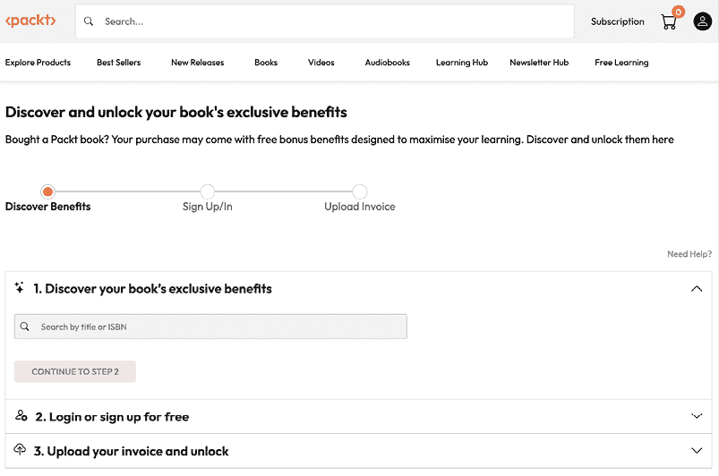

# 前言

使用 PowerPoint 是许多人在他们的商业生涯中某个时刻都做过的事情，甚至在学生时代也是如此。但创建引人入胜且具有影响力的演示文稿却是许多用户面临的挑战。

对于我来说，撰写关于 PowerPoint 应用程序的文章意味着不仅仅包括工具和功能。超过 20 年来，我见证了客户因为不了解行业最佳实践而没有接受过正规培训，无法发现和使用一些更高级且非常有帮助的功能而感到困扰。我所培训的所有人员或我合作过的客户都面临另一个重大挑战：他们都希望节省创建演示文稿的时间。

正因如此，这本书与大多数 PowerPoint 书籍不同。你可以选择跟随本书的引导，了解帮助你规划演示文稿、创建视觉吸引力和意义内容的最重要的工具，并以更灵活和有影响力的方式呈现你的演示文稿。或者，你也可以选择阅读任何章节或主题，以帮助你了解你尚未知晓的功能和工具。对于本书的第一版，我甚至收到了一些创意机构购买本书作为团队参考工具的评论！

无论你采用何种阅读方法，我都可以保证你将更加了解演示文稿的最佳实践、有助于你更高效地创建优质演示文稿的 PowerPoint 功能，以及如何提高你的演示文稿呈现效果。

# 本书面向的对象

本书首先针对那些没有正规设计培训或经验，但希望更快地创建更具影响力和吸引力的内容的商业专业人士。但那些偶尔需要创建几个演示文稿的人也会发现很多有价值的、可以快速应用的内容。这些专业人士在过去可能接受过一些非常简短的 PowerPoint 培训，但许多人都是自学成才。大多数人之前都使用过 PowerPoint，因此已经熟悉了基础知识。

# 本书涵盖的内容

*第一章* ，*分析你的受众和演示文稿呈现需求*，涵盖了帮助你规划和构建演示文稿内容的问题。

*第二章* ，*利用行业最佳实践设计更佳视觉元素*，帮助你了解字体、对比度、整理幻灯片以及视觉一致性。

*第三章* ，*利用 PowerPoint 的幻灯片母版加速你的设计流程*，讨论了幻灯片母版如何成为设计自动化工具。

*第四章* ，*利用 PowerPoint 的备注和文档母版创建讲义和演讲者备注*，介绍了如何利用母版来帮助你使演示文稿文件既适用于屏幕视觉，也适用于讲义，同时保持高效和有影响力。

*第五章* ，*使用 M365 Copilot 开始您的演示*，帮助您了解 PowerPoint 中的 M365 Copilot 能做什么以及如何进行提示。

*第六章* ，*使用人工智能提升您的视觉效果*，帮助您了解设计师功能如何节省您一些设计时间。

*第七章* ，*在您的内容中添加和修改视觉元素*，讨论了如何使用图形元素并自定义它们以替换文本和项目符号。

*第八章* ，*在您的内容中添加和修改多媒体元素*，讨论了通过使用和格式化音频和视频元素来改进您的内容。

*第九章* ，*使用过渡和动画*，帮助您了解如何通过有目的的移动来改善您的内容节奏和观众理解。

*第十章* ，*在您的演示中构建灵活性和交互性*，涵盖了如何通过使用导航元素来适应他们的需求或展示特殊内容来吸引您的观众。

*第十一章* ，*使用第三方插件*，讨论了几种提高您内容创作生产力和演示管理可能性的方法。

*第十二章* ，*练习您的演示交付*，提出了一些 PowerPoint 的内置工具，这些工具可以帮助您练习，以便在观众中留下难忘的印象。

*第十三章* ，*使用演示者视图*，讨论了该功能及其众多工具如何帮助您提供更具吸引力的演示并拥有更多控制权。

*第十四章* ，*在 Teams 中使用 PowerPoint Live 进行远程演示*，帮助使用 Teams 的虚拟演示者发现许多有助于创建互动性的功能。

# 要充分利用本书

本书将为您提供逐步说明，帮助您找到功能和工具并使用它们。要充分利用本书，在阅读有关它们的内容时尝试您不熟悉的功能。这是学习、记忆和快速应用技巧和最佳实践的最佳方式。如果您的目标是学习如何实施更好的演示创建流程，您应该按顺序阅读章节。但如果您是更高级的用户，按任何顺序阅读章节或主题也可能很有价值。

| 本书涵盖的软件/硬件 | **操作系统要求** |
| --- | --- |
| PowerPoint | Windows |
| PowerPoint Live/Teams | macOS，大多数情况下兼容 |
| BrightSlide |  |
| BrandIn |  |
| WeCompress/NXPowerLite |  |
| Slidewise |  |
| Build-a-Graphic |  |
| THOR |  |
| PPTMerge |  |

如果您在拥有 IT 管理团队的机构工作，如果您发现您的 M365 PowerPoint 版本缺少一些功能，或者您想安装本书中讨论的任何第三方插件，您可能需要与他们确认。请注意，由于 PowerPoint 的订阅版本持续更新，本书中显示的截图可能与您的应用程序版本不同。

阅读这本书后，如果您需要一点支持或有一些问题，请考虑在 LinkedIn 上关注我，我在那里发布并回答关于演示和 M365 应用程序的许多问题：[`www.linkedin.com/in/chantalbosse/`](https://www.linkedin.com/in/chantalbosse/)。

## 下载彩色图像

我们还提供包含本书中使用的截图/图表彩色图像的 PDF 文件。您可以从这里下载：[`packt.link/gbp/9781835882245`](https://packt.link/gbp/9781835882245)。

## 使用的约定

本书使用了多种文本约定。

`CodeInText`：表示文本中的代码单词、数据库表名、文件夹名、文件名、文件扩展名、路径名、虚拟 URL、用户输入和 X/Twitter 用户名。例如：“如果您不熟悉 QAT，请在任何 Office 应用程序标题栏的**搜索**框中键入`快速访问工具栏`以获取帮助。”

**粗体**：表示新术语、重要单词或您在屏幕上看到的单词。例如，菜单或对话框中的单词在文本中显示如下。例如：“您可以通过在**幻灯片母版**选项卡中使用**关闭母版视图**按钮并添加一个带有您新自定义布局的新幻灯片来查看您的布局将如何显示。”

警告或重要提示看起来像这样。

技巧和窍门看起来像这样。

# 联系我们

我们始终欢迎读者的反馈。

**一般反馈**：如果您对本书的任何方面有疑问或有任何一般反馈，请通过电子邮件发送至`customercare@packt.com`，并在邮件主题中提及书籍的标题。

**勘误**：尽管我们已经尽最大努力确保内容的准确性，但错误仍然可能发生。如果您在这本书中发现了错误，如果您能向我们报告，我们将不胜感激。请访问[`www.packt.com/submit-errata`](http://www.packt.com/submit-errata)，点击**提交勘误**，并填写表格。

**盗版**：如果您在互联网上发现我们作品的任何形式的非法副本，如果您能提供位置地址或网站名称，我们将不胜感激。请通过电子邮件发送至`copyright@packt.com`，并附上材料的链接。

**如果您有兴趣成为作者**：如果您在某个主题上具有专业知识，并且您有兴趣撰写或为书籍做出贡献，请访问[`authors.packt.com/`](http://authors.packt.com/)。

# 您的书籍附带独家优惠 - 这是解锁它们的方法

|

#### 现在解锁这本书的独家优惠

扫描此二维码或访问`packtpub.com/unlock`，然后通过名称搜索这本书。确保它是正确的版本。 |  |

| **注意** *：在开始之前准备好您的购买发票。* |
| --- |

使用我们的下一代 Reader 增强阅读体验：

 **多设备进度同步**：在任何设备上学习，实现无缝进度同步。

 **高亮和笔记**：将您的阅读转化为持久的知识。

 **书签**：随时回顾您最重要的学习内容。

 **深色模式**：通过切换到深色或棕褐色模式，以最小的眼部疲劳来集中注意力。

使用我们的 AI 助手（Beta）更智能地学习：

 **总结**：总结关键部分或整章内容。

 **AI 代码解释器**：在下一代 Packt Reader 中，点击每个代码块上方的**解释**按钮，获取 AI 驱动的代码解释。

**注意**：AI 助手是下一代 Packt Reader 的一部分，目前仍处于测试阶段。

任何时间、任何地点学习：

  使用免版税的 PDF 和 ePub 版本离线访问您的内容——与您最喜欢的电子阅读器兼容。

# 解锁您书籍的专属好处

您的这本书包含以下专属好处：

 下一代 Packt Reader

 AI 助手（Beta）

 免版税 PDF/ePub 下载

如果您还没有解锁，请使用以下指南解锁。这个过程只需几分钟，并且只需完成一次。

# 如何通过三个简单步骤解锁这些好处

## 第一步

准备好这本书的购买发票，因为在**第三步**您将需要它。如果您收到了实体发票，请用手机扫描它，并准备好作为 PDF、JPG 或 PNG 格式。

如需更多关于查找发票的帮助，请访问`www.packtpub.com/unlock-benefits/help`。

**注意**：您是从 Packt 直接购买这本书的吗？您不需要发票。完成第二步后，您可以直接跳转到您的专属内容。

|

## 第二步

扫描此二维码或访问`packtpub.com/unlock`。 |  |

| 在打开的页面（如果您在桌面电脑上，页面将类似于图 0.1），通过名称搜索这本书。确保您选择了正确的版本。图 0.1：桌面电脑上的 Packt 解锁登录页面 |
| --- |

## 第三步

登录您的 Packt 账户或免费创建一个新账户。登录后，上传您的发票。它可以是以 PDF、PNG 或 JPG 格式，且大小不能超过 10 MB。按照屏幕上的其余说明完成此过程。

|

## 需要帮助？

如果你遇到困难需要帮助，请访问`www.packtpub.com/unlock-benefits/help`获取如何查找你的发票等详细 FAQ。以下二维码将直接带您到帮助页面：|  |

**注意**：如果你仍然遇到问题，请联系 customercare@packt.com。

# 分享你的想法

一旦你阅读了《Microsoft PowerPoint Mastery》，我们很乐意听听你的想法！请[点击此处直接进入此书的亚马逊评论页面](https://packt.link/r/1835882250)并分享你的反馈。

你的评论对我们和科技社区都很重要，并将帮助我们确保我们提供高质量的内容。
