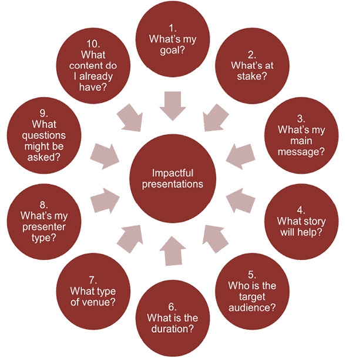
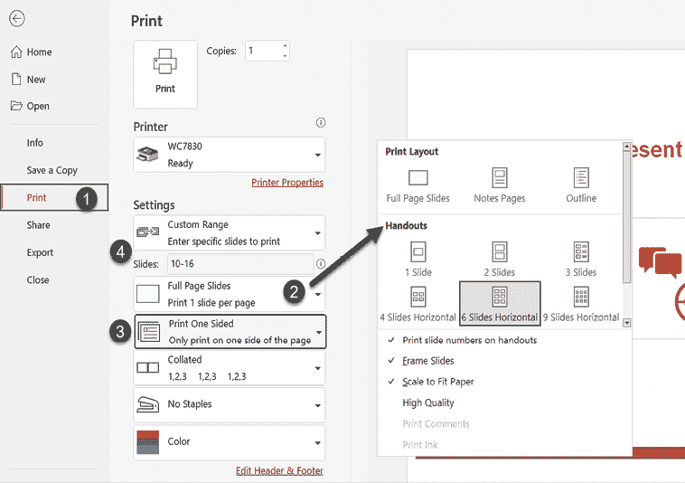
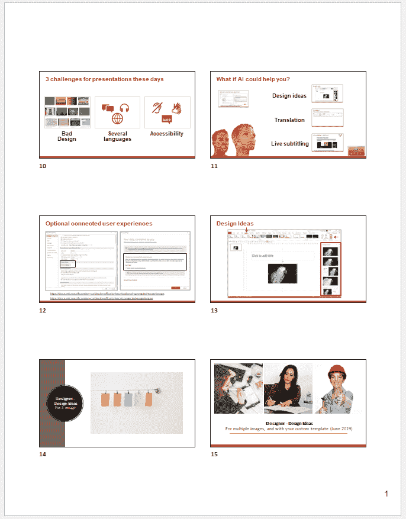
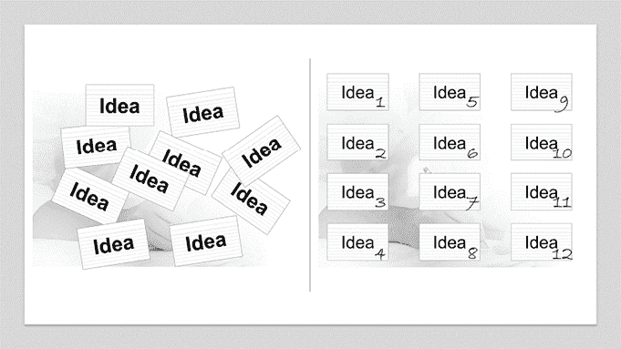
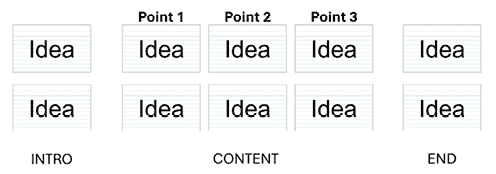
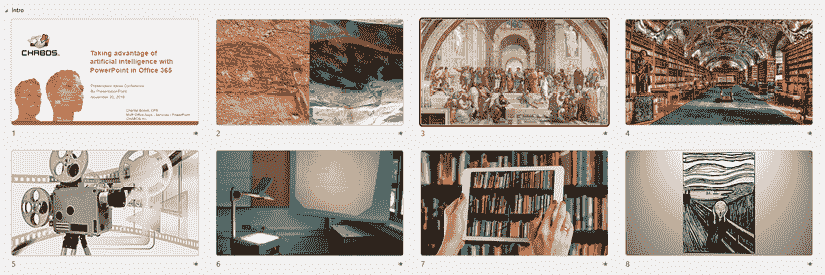

# 第一章：分析你的受众和演示需求

读者可能会觉得，以如何分析受众和演示需求的信息开始一本 PowerPoint 书很奇怪。作为一名多年的演示专家和公开演讲教练，我可以向你保证，创建有影响力的 PowerPoint 演示的第一步是无论如何都要避免打开应用程序！

和大多数商业专业人士一样，你可能参加过很多需要使用 PowerPoint 演示的演示和会议。当你回忆起作为参会者的经历时，你有多少次想过内容有多无聊？或者你开始从智能手机上查看电子邮件或社交媒体，开始分心？

作为一名演讲者，你可能已经几次让你的观众遭受了 PowerPoint 的死亡。如果你的主要原因总是缺乏准备时间，那么我建议你尝试回顾你的准备时间表。无论演示的持续时间有多长，没有人能在几天内计划、准备和交付一个有影响力的演示。

在过去的几年里，我多次听到的一个重要的原因，就是没有花更多的时间来准备演示：*我不知道从哪里开始*。这就是我选择将这个主题作为我的 PowerPoint 书的第一章的主要原因。通过遵循本章的三个主要部分，你将知道如何更好地规划演示：

+   10 个问题帮助你规划你的演示

+   分析和整理你的内容

+   构建和发展你的信息

# 10 个问题帮助你规划你的演示

在分享我帮助你规划下一次演示的顶级 10 个问题之前，让我问你我在我的所有客户开始正式规划过程之前都会问的第一个问题：*在你的演示之后，观众需要记住或采取行动的三个最重要的要素是什么？*

这个问题通常会引起一段长时间的沉默，主要是因为太多演讲者不清楚他们希望观众记住什么。如果你对下一次演示有同样的反应，那么在你深入下一个问题之前，花点时间思考一下，在深入下一个问题之前，观众需要记住或采取行动的三个要素是什么。这将使你的规划任务更加高效。

在你创建演示之前，这里是一个你应该经历的 10 个问题的总结图：

图 1.1 – 规划问题总结图

为什么这个图是圆形表示的？因为它是一个持续的过程，旨在创造更有影响力的演示。

## 问题 1 – 我的演示目标是什么？

举办一个信息会议并不等同于项目更新、培训课程或投资者演示文稿的目标。这就是为什么你需要仔细思考你下一次演示的实际目标。这不仅会提升观众的满意度，而且当你清楚自己想要达到的目标时，你还能为你的内容找到更有效的视觉元素。

让我们看看一些例子。

### 信息会议

即使你认为你的任务“仅仅”是告知观众，也要确保他们离开时能带走明确的收获。许多年前，我记得参加过一次学校旅行项目的信息会议。是的，它充满了孩子们将要访问的城市中美好迷人的照片，但旅行协调员确保我们有了三个明确的行动步骤：

1.  按时支付款项

1.  按时完成护照验证

1.  在指定日期参加疫苗接种诊所

因此，尽管这是一个信息会议，但我们都知道我们有一些具体的任务要完成，并且每个任务都有截止日期。这个例子可以很容易地应用到任何商业信息会议中。你只需要在准备演示时记住观众需要完成的任何行动步骤。

### 项目更新演示

这种类型的演示在商业中通常被认为是非常重复和无聊的。主要原因在于，大多数演讲者只是反复重复相同类型的信息。与其简单地陈述进展的百分比或团队是否在预算范围内，不如找出自上次更新以来三个突出的关键要素。例如，如果团队成员找到了一种改进流程和避免延误的新方法，就将这一信息纳入你的项目更新演示中。花点时间反思一下你为什么取得了成功或甚至失败。这将比简单地陈述数据更有趣。

### 客户或投资者演示文稿

这种类型的演示同时满足了帮助观众了解你的产品或服务，并说服他们投资你的业务或购买你的产品/服务的双重需求。如果你需要准备这种类型的演示，考虑一下你产品或服务的优势，并确定它们的感知价值。在任何人购买你的产品或服务之前，你需要赢得并建立观众的信任，仅仅列出特性和流程是不够的。当然，如果你向投资者演示，你的财务预测需要是现实的！

### 企业培训课程

提供企业培训需要明确培训课程的目标。你是被要求为新员工创建培训课程，还是因为现有员工无法完成高质量的工作？也可能是因为有全新的操作系统或新应用，人们需要熟悉这些以完成日常任务。花时间反思你要培训的对象、原因以及管理层期望，将帮助你选择重要主题并决定你将创建哪种类型的内容来帮助学习者达到预期目标。

## 问题 2 - 存在的风险是什么？

时间是企业中最宝贵的资源。因此，我们需要知道我们绝对需要在哪些方面投入更多的时间和精力以获得最佳的投资回报。这就是为什么你需要问自己：如果你的演示缺乏准备和实践，会产生什么影响？如果你正在准备一个双周更新，其风险不如你准备一个可能为你赢得 1000 万美元项目资助的提案高。如果你在项目更新上时间紧张，你可以在下一次做得更好。但如果你不为提案投入更多的时间和精力，你可能会怀疑如果你没有得到资助，你的演示是否让你失去了它。

在企业培训环境中，风险可能也非常高。你需要反思如果培训内容不符合要求会发生什么。如果员工无法完成预期任务，公司的底线会受到什么影响？即使很难精确地用美元价值来衡量这一点，你可以从提高完成某些任务所需时间的效率来思考。如果你估计你的培训将帮助员工每周节省 1 小时，那么你可以通过将整个团队节省的时间相加并乘以他们的工资来估算一个美元金额，以帮助管理层看到培训的价值。

## 问题 3 - 我的主要信息是什么？

当你准备一个将成为你通常演示内容的子集或简短版本时，这个问题尤为重要。了解你的主要信息有助于你决定哪些内容需要保留，哪些内容需要删除以进行实际演示。我认识的每个演讲者都处理大量的内容，通常认为每件事都很重要。但当我们把观众的需

如果你正在创建培训内容，你的主要信息也需要非常清晰。确保学习者看到培训对他们来说的价值。我建议你考虑企业培训会议的两个主要信息：一个符合管理层对生产率或效率的期望，另一个符合学习者的期望，无论他们是否想在某些任务上节省时间，或者更好地理解他们的角色。没有魔法棒能帮助你制定出既能吸引学习者又能吸引管理层的消息。你需要花些时间询问双方对他们的期望和痛点。

## 问题 4 - 哪个故事能帮助观众理解信息？

人类喜欢故事。当我们仔细观察时，我们甚至可以说，我们的大部分决定都受到故事的影响。你有没有仔细观察过流行的广告？它们都有故事与之相关，就像电影一样。

这就是为什么你需要找到一个支持性的故事来增强你的演示效果。我并不是要你编织一个复杂的情节。只需看看一个个人或客户故事，它支持你的内容。例如，如果你在面向一群潜在客户的房间里进行演示，你可以讲述一个过去客户带着特定挑战来找你的故事。告诉听众，在使用你的产品或服务后，客户如何能够提高他们的整体生产率或收入。如果你有权限提及你的过去客户，或者甚至得到你可以使用的推荐信，那就更好了。重要的是要确保你选择的任何故事都支持你演示的主要目标。

在企业培训环境中，你可以尝试围绕员工在培训前后的旅程来编织一个故事。或者，你也可以简单地陈述工作环境中实际的情况与培训后的情况相比，以及这将如何服务于学习者。当我是一家大型电信公司客户服务部门的培训师时，我通常会使用我在工作中的一些客户经验，这样他们就能联系起来，意识到为什么某些内容极其重要。在企业培训中使用故事是完全可以接受的，只要它们能说明你的教学重点为什么重要，以及它们在工作中的价值。

## 问题 5 - 我的目标受众是谁？

了解你的听众将肯定帮助你制作出更好的演示文稿。你使用的语言和例子需要与听众对主题可能拥有的知识水平相一致。例如，如果你在向同行或行业专家演讲，可以使用常用的技术术语。但如果你在一个可能来自不同背景的听众的会议上演讲，语言需要更简单。此外，要意识到任何缩写或行业行话可能对某些人来说太多。我并不是说完全不用它们。但针对那些没有相关背景的人，首先介绍这些术语可能有助于他们理解高层次的意义。

当你在公司内部进行演讲，并且你知道这个话题可能会引起争议或不会被某些同事接受时，确保思考他们可能有的反对意见。这将让你准备出有助于他们理解你的观点的内容，即使他们仍然不同意。

在准备企业培训课程时，想想谁会参加培训。如果他们是新员工，提供更详细的信息，并确保你在没有给出适当定义的情况下避免使用行话。当内容是为现有员工准备的，考虑他们在会前的实际知识水平以及你期望培训后的知识水平。

## 问题 6 - 我的演讲时长是多少？

我要求所有客户遵守的一条规则是：**永远不要超过规定的时间**。遵守这一点，你是在尊重你的听众的时间，如果你在活动中发言，也是在尊重你之后的演讲者。还记得我之前说过的话吗？信息量并不总是越多越好。高质量和针对性的信息在长期来看更有价值，也更有影响力。

因此，考虑到你的演讲时长也将帮助你估计你可以在内容中包含多少细节。此外，总是要留出足够的时间，以便参与者可以提问并与你互动。

你可能想知道有没有一种简单的方法来确定你可以根据规定的时间规划多少内容。多年来，我向客户分享了这个经验法则，以帮助他们。这并不是一门精确的科学，但每次我使用它都有效：

**内容规划规则**

规划内容占规定时间的 75%。这意味着如果你的演讲安排为 1 小时，就规划 45 分钟的内容。你永远不知道技术故障何时会出现，或者活动是否会有调度延迟。如果你想知道这个规则如何转化为幻灯片的数量，我们将在*第二章*中解答这个热门问题，讨论行业最佳实践。

根据你的主题，你甚至可以考虑减少内容，并留出更多的时间进行互动。当观众有机会真正参与时，这将使你的演示文稿更加难忘和有意义。不要害怕提前结束，因为观众没有像你想象的那样积极参与。在我的超过 25 年的行业生涯中，我从未见过有人因为演示文稿提前结束而抱怨。有些人会利用额外的时间在他们下一个义务之前的休息，而其他人则会抓住这个机会问你更多的问题。在两种情况下，每个人都感到高兴。

## 问题 7 - 我将在哪种类型的场所进行演示？

你将如何呈现你的演示文稿是一个非常重要的问题。你的内容设计需要考虑你是在为 1,000 名参会者的巨大场馆进行演示——这通常意味着非常大的屏幕和一些人离得很远——一个小会议室，或者甚至是一个可能通过普通电脑屏幕、平板电脑或手机观看的远程虚拟演示。

当你在大型场馆进行演示时，你需要了解房间和屏幕的大小，以及场馆的照明。这将使你能够使用最佳的字体大小和对比度，确保房间里的每个人都能阅读你幻灯片上的任何文字，即使是从房间后面也能看清楚。如果你将进行虚拟演示，请记住你的演讲将被观看的各种屏幕大小。屏幕越小，你可以在幻灯片上放置的内容就越少，以保持其可读性。

考虑你的演示文稿将在哪里呈现，也允许你计划将使用哪种类型的设备。当你为活动进行演示时，你可能不得不使用场馆的电脑而不是你自己的。这意味着确保你设计的演示文稿与场馆的电脑兼容——它是 Windows 还是 Mac？询问场馆的电脑上使用的是哪个 PowerPoint 版本将帮助你避免演示文稿文件与你的演示文稿不兼容的问题。

## 问题 8 - 我是什么样的演讲者？

这个问题通常会引发一些惊讶的表情！我认为这个问题之所以重要，是为了帮助演讲者反思他们对技术和设备的舒适程度，并让他们考虑自己是否受到各种程度的公众演讲恐惧的影响。

对我们的恐惧或技术和设备知识的缺乏保持诚实是很重要的。这允许演讲者采取行动并完善将提高其演讲效果的因素，使他们更具影响力。学习如何在活动期间站在舞台上使用演示文稿遥控器，将使你能够更接近观众，而不是站在讲台后面。更熟悉 PowerPoint 的内置工具，如**演示者视图**、**PowerPoint Live**和**演示者教练**，将提高你的表现力并减少你公开演讲的恐惧。这就是为什么我把这本书的最后一部分奉献给了使用 PowerPoint 的高级演示工具来制作更好的演示。演示的成功远不止你的视觉元素！

## 第 9 个问题——观众可能会提出哪些问题？

多年来，这个问题激发了我与客户之间的许多讨论。许多人没有看到从他们的观众那里思考潜在问题的任何价值。我通常回答说，你准备得越充分，你被那些本可以提前准备好的问题搞得措手不及的机会就越小。

例如，如果你必须展示一个影响工人日常任务的新工作流程，问问自己他们可能对这个变化有什么阻力。能够承认他们的恐惧并迅速安慰他们，比告诉他们你需要检查并回来回答要好得多。如果你在展示你最新的革命性产品，请准备好回答关于你的产品与竞争对手的产品相比可能有哪些优势的问题。

准备充分将使你对自己的演示效果有更多的控制。这并不意味着你需要对每个问题都有答案。告诉某人你需要检查更多细节，并在回答后回复他们，这证明了你是专业人士。你只需要避免在演示过程中回答大多数问题，这样你就不会失去信誉。

## 第 10 个问题——我已经有什么内容可用？

在我的前十大问题中，这个问题对于想要提高效率的人来说是至关重要的。多年来，我见过许多人从头开始重复创建内容。即使你以前没有这样做过，也请花些时间回顾一下你之前创建的演示文稿，并创建一个你可以随时查阅的图像和图形库，而不是每次创建演示文稿时都从头开始整个过程。了解你手头有什么，或者你的组织可能在共享驱动器上存储了哪些内容，这样你可以使你的内容制作更加高效。

在创建任何幻灯片之前阅读我的前十大问题列表可能让你有些慌张。如果是这样，深呼吸，放松！只需将*图 1.1*作为你下一次演示计划时的参考。即使你一次只迈出一小步，你的演示也会有所改进。

现在你已经规划了你的内容，是时候分析并整理它了。这就是你将在下一节中学到的内容。

# 分析和整理你的内容

确保你的内容有一个良好的结构和清晰的信息，需要你花一些时间分析你已经拥有的内容。通过内容，我并不是指你之前可能创建的其他 PowerPoint 文件。任何为其他公司文件或甚至你的网站创建的照片或图形，都需要被视为可能可重复使用的内容。在本节中，你将学习如何开始这个过程，并使用 PowerPoint 中的一个打印功能进行排序步骤。

## 最好的开始方式是什么？

我再重复一遍：*最后一个开始的地方是在 PowerPoint 应用程序的空白幻灯片上*。如果你知道你有其他 PowerPoint 文件中的内容可以重复使用，你应该打开你的文件，并按每页六个幻灯片的格式打印相关幻灯片。

如果你从未这样做过，以下是操作方法。以下每个步骤在*图 1.2*中都有相同的数字气泡表示：

1.  从 PowerPoint 的**文件**选项卡转到**打印**。

1.  从下拉列表中的**讲义**布局中选择**6 幻灯片横向**布局。

1.  确保你不会在页面的两面都打印。

图 1.2 – 每页打印六个幻灯片的设置

1.  如果你不需要文件中的所有幻灯片，不要忘记在幻灯片范围字段中选择你想要打印的幻灯片。在我们的例子*图 1.2*中，我们将打印幻灯片 10 到 16（**10-16**）。如果你需要打印一个范围和一些特定的幻灯片，可以通过在幻灯片编号之间添加逗号来完成。例如，要打印幻灯片 1、幻灯片 3 和幻灯片 10 到 16，它将在字段中输入如下：`1,3,10-16`。创建更具影响力的演示文稿不需要在这个过程中砍伐太多树木。

一旦你的页面打印完成，将小幻灯片（*图 1.3*）裁剪下来，这样你就可以使用它们来调整你的内容顺序：

图 1.3 – 六幻灯片布局的打印输出

如果你发现任何其他类型的内容可以帮助你使你的演示文稿更加视觉化，那么就创建一个空白 PowerPoint 文件，在其中你可以添加视觉元素，每个元素都在自己的幻灯片上，这样你就可以再次使用之前的打印技巧。

如果你规划内容时想到了其他想法，但没有现有内容，只需使用一些普通的索引卡或任何其他类型的纸张，你可以在上面快速绘制或添加关键词。

## 整理内容

现在你有了视觉和索引卡片的打印件，你可以开始组织和分组你的想法（见*图 1.4*）。很多时候，人们问我是否可以使用思维导图软件代替打印件和索引卡片；答案是肯定的。然而，使用你可以操作的物理元素将有助于你的创造力。这通常使得玩转分组和开始优先考虑哪些内容重要变得更容易：

图 1.4 – 组织和分组你的想法

如果你已经通过了规划问题，你应该已经能够开始看到哪些想法或内容将支持你的信息。现在是时候开始将想法分为两类：*需要知道*和*希望有*。也许你有一些有趣的内容并不完全符合你演示的实际目的，但可以是额外内容的一部分，可以在需要时展示。始终牢记我在本章开头分享的最重要的问题：*在你的演示之后，你的观众需要记住或采取行动的三个最重要的元素是什么？*这将帮助你确定哪些内容对你的演讲很重要。

即使你感觉你没有时间做这件事，相信我——当你开始构建内容时，它将为你节省很多时间。很多时候，我不得不告诉人们他们需要从他们的演示文稿中删除一些无关的幻灯片。他们中的大多数人都回答说他们不想这样做，因为他们已经花费了很多小时来构建这些幻灯片。在 PowerPoint 之外花时间规划、整理、结构化和开发你的信息，这样你就可以避免花费数小时创建无关的幻灯片。

# 结构化和开发你的信息

如果你已经完成了前几节中的规划和分析任务，你现在处于一个很好的位置，可以在比你想的更短的时间内创建一个更有影响力的演示。摒弃或甚至丢弃那些作为幻灯片打印件或索引卡片的想法，比删除你花费数小时创建的幻灯片要容易得多。

现在，你需要结构化你的信息和内容。有许多方法可以实现这一点，你可能甚至听说过其他可以使用的模型。由于我想让这部分对任何商业环境尽可能简单，我将向你介绍三部分模型。

## 三部分模型

三部分模型可能看起来很熟悉。这是因为它被电影、小说甚至一些广告所采用的结构。它从介绍开始，通过三个重要元素流动，然后结束，如*图 1.5*所示：

图 1.5 – 三部分模型内容结构

如果你还没有意识到，这也是我用于这本 PowerPoint 书籍的模型。我开始介绍我们在商业演示中看到的主要问题以及它们如何影响你的演示的影响力、你的可信度，甚至成功水平，无论是通过评论还是销售来衡量。本书的内容分为三个部分：规划和准备、创建视觉吸引力的内容，以及通过利用 PowerPoint 的高级演示工具来提供更好的演示。至于我的结论，你可以在书的结尾阅读到它！

通过使用这个模型，你将能够按照以下三个步骤创建你的演示：

1.  制定一个能够吸引观众注意力的开场白：

    +   考虑一个与你要展示的主题相关的个人故事，增加价值。也许你经历了一个挑战，并使用你将在演示中讨论的元素克服了它。

    +   也许你有一个客户案例研究，展示了他们在来找你之前的情况是多么具有挑战性，以及你的解决方案是如何帮助他们。

    +   考虑你所在行业中的任何令人惊讶的统计数据，这些数据表明找到解决方案是多么重要。

    +   提出一个颠覆性的问题，知道这将吸引观众的注意力，并在你的谈话中向他们展示看待事物的一种不同方式。

    +   使用任何可以帮助你向观众展示你的信息或解决方案与日常问题或他们自己的生活相关联的东西。确保解决他们可能遇到的问题或令人烦恼的情况，它对他们的影响，以及可以采取什么措施来解决它。

1.  在你的演示中，选择你想要讨论的三个最重要的要点：

    +   你的内容是你向观众展示你可以在他们的问题或挑战上产生差异的地方。

    +   为什么是三个？简单来说，因为人类很容易记住三个主要点。当我们思考时，我们在生活中看到许多使用数字三的例子，无论是儿童故事（三只瞎老鼠，三个火枪手）还是快餐店的*套餐*，它们由三个部分组成。增加你的记忆度，并避免在谈话中包含超过三个主要点。

1.  制定一个有影响力的结论：

    +   你可以再次总结你的三个最重要的要点，这样观众就会再次提醒自己。

    +   确保有一个具体的行动号召，帮助观众意识到，如果他们使用你在谈话中教给他们的东西，他们也可以克服挑战或解决问题。

我故意将三部分模型描述得简单，这样你就不会感到不知所措，或者觉得自己无法独立应用它。如果你在下次演示之前给自己足够的时间，你将能够重现这些步骤来改进你的内容。

## 讲述你的故事

在结束这一章之前，我想再谈谈在演示中使用故事的重要性。如果我问你思考一下你长时间后仍然记得看到或听到的任何事情，有没有与之相关的故事？当你想起它时，有没有一种特定的情感回来？我打赌这是真的。当故事与他们的日常生活产生共鸣或让他们有特别的感觉时，人们会记得事情更长。

有些人通过找到完美的故事来帮助他们的潜在客户意识到他们的产品或服务可能有多么重要，从而挽救了他们的企业。我有一些研讨会参与者告诉我，他们的主题太严肃，不能包含故事。所有的人类都会对情感做出反应，而情感最好通过相关的故事来激发。除非你是在向机器人做演示，否则没有理由你应该避免使用故事。当然，确保你的故事与你的听众相关，并适应他们的专业知识水平或需求。

当你找到了传达你信息的正确故事时，还有另一个你必须实践的元素：*使用视觉，而不是无穷无尽的要点*。

让我给你举一个例子。几年前，我被要求就如何利用最新版 PowerPoint 中的人工智能来制作更好的演示进行演讲。我的开场白剧本如下：

+   自从洞穴人的绘画以来，人类交流的方式已经发生了巨大的变化。

+   从第一所艺术学校开始，教学主要基于公共演讲的艺术。

+   然后是创建大型、壮丽的图书馆，里面装满了各种书籍。

+   之后出现了第一批电影。

+   然后是投影仪作为教学手段的引入。

+   随后，桌面软件、投影仪、Apple TV、平板电脑甚至智能手机等技术接管了市场。

+   但为什么人们还在如此津津乐道于无聊的演示和 PowerPoint 导致的死亡？

假设我把那个剧本放在幻灯片上作为要点。首先，要求我的听众听我说话并阅读幻灯片不会给我带来很好的效果。人们通常阅读速度比说话快，所以他们会在没有太多注意我如何呈现内容的情况下就到达了要点列表的末尾。我实际上做的是寻找一系列与我的剧本相关的精美照片，并在谈话时浏览它们。

这是我演示开场屏幕截图（见图 1.6）。在标题幻灯片之后，上一个列表中的每个要点都与一张照片幻灯片相匹配。看看每一张幻灯片并阅读前面的相关要点：

图 1.6 – 使用照片的演示开场

你能想象听众的经验会有多不同吗？他们不是被迫阅读幻灯片上的句子，而是在听我说话，并让他们的眼睛吸收视觉信息，这比单纯的文字更容易记住。

我现在挑战你回到你为未来的 PowerPoint 演示文稿的想法，开始思考可以替代你演示文稿中的句子和项目符号的视觉元素。然后你将有一个起点，当你阅读讨论 PowerPoint 功能的章节时，这些章节将帮助你创建视觉上吸引人的内容。如果你需要视觉灵感，你应该考虑来自我的 MVP 同事诺兰·海姆斯的《更好的演示文稿》工具。相关信息可以在进一步阅读部分找到。

# 摘要

在本章中，我们讨论了帮助你规划演讲的十大问题，考虑了如何分析和整理你的内容，并讨论了如何构建和开发你的信息。你现在对如何通过关注关键信息、故事和结构来提高演讲的影响力有了更好的理解。

当然，第一次使用这个章节的内容时，你可能不会完全适应这个过程。你甚至可能会经历一个认为这需要太多时间且不值得的阶段。我的愿望是，即使每次只改进规划阶段的一个元素，你也能继续尝试。你的整体成功不会由你在一次演讲中做了多少改变来决定，而是由你为了持续改进演讲所采取的多少小步骤来决定。

我将把不久前一位客户给我的评论留给你：“这个过程让我眼界大开。它让我思考了那些能为我信息增值的重要信息。我现在意识到这个过程是多么高效，它让我在创作过程中节省了时间。花额外的时间来规划和结构化内容也帮助我更好地掌握我的内容，并使我的演讲练习非常高效。”

在下一章中，我们将继续我们的旅程，通过学习关于字体选择和大小、对比规则以及如何避免不必要的视觉元素等方面的行业最佳实践，来提高你的演讲影响力。这样你可以改善幻灯片的视觉效果和感觉。

# 进一步阅读

为了帮助你了解更多本章中涉及的主题，以下是一份你可以阅读的参考文献列表：

+   如果你想要深入了解本章中讨论的三步模型，你应该阅读我杰出的同事南希·杜尔特的《共鸣》。她出色地研究了最具影响力的演讲应该如何构建。你可以在她的网站上找到电子书：[`www.duarte.com/resonate/`](https://www.duarte.com/resonate/)。

+   如果您想要获得视觉灵感以避免使用项目符号列表，您应该看看我的创意同事 Nolan Haims 的*更好的牌组*。他开发了这套启发性的卡片，以帮助演示创建者避免无穷无尽的文本列表。您可以在他的网站上找到相关信息：[`www.nolanhaimscreative.com/shop`](https://www.nolanhaimscreative.com/shop)。

|

#### 现在解锁这本书的独家优惠

扫描此二维码或访问 [`packtpub.com/unlock`](https://packtpub.com/unlock)，然后通过书名搜索此书。 |  |

| **注意** *：开始之前，请准备好您的购买发票。* |
| --- |
