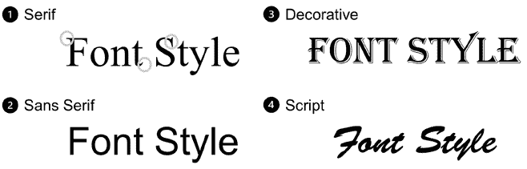
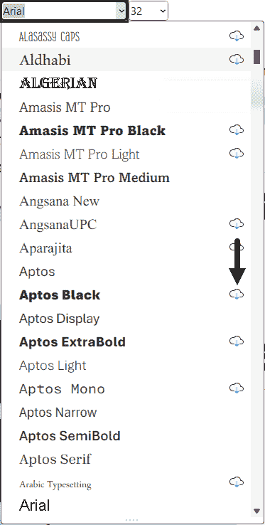
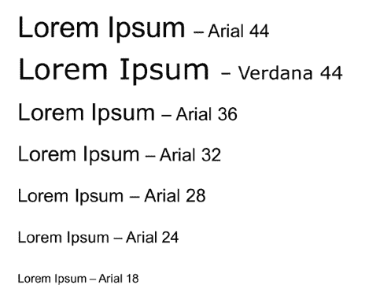
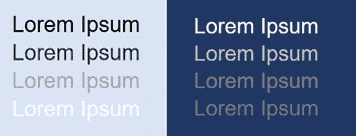
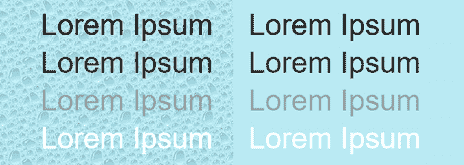
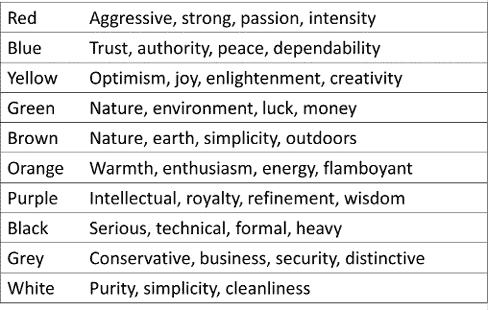
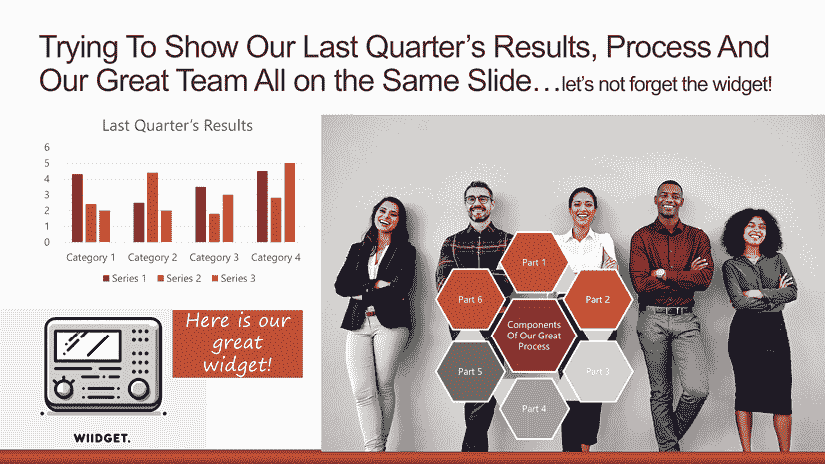
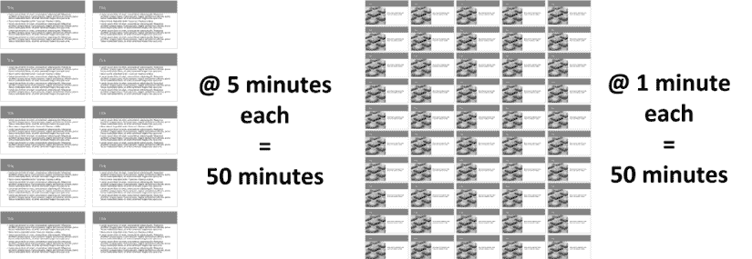
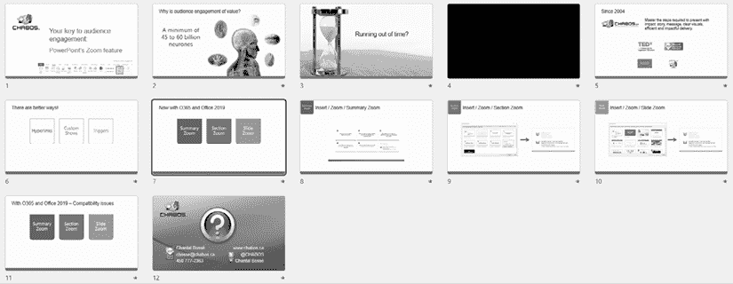

# 第二章：使用行业最佳实践来设计更好的视觉元素

尽管自 1990 年 PowerPoint 首次发布以来，已经创建了数百万个演示文稿，但演示文稿行业却相对较年轻。在许多人发展出关于对观众和演讲者有效的方法的专长之前，已经过去了很多年。由于借助 PowerPoint 对演示文稿的具体主题的研究也起步较慢，我们不得不在一段时间内主要依靠试错。

幸运的是，演示文稿行业已经成熟，我们现在有可靠的专家帮助我们定义最佳实践。此外，**演示文稿协会**，一个由行业专家于 2015 年创建的组织，已经建立了行业普遍接受的专业演示文稿标准。他们指导九个类别的演示文稿工匠：视听、品牌、色彩、数据可视化、功能、图像、布局、动画和排版（请参阅本章末尾的*进一步阅读*部分）。

当然，今天的最佳实践也受到使演示文稿对残疾人士更易于访问的要求的影响。当您是负责计划和创建所有演示文稿的人，而且没有任何正式的设计培训或了解什么使内容易于访问时，这可能会变得具有挑战性和压力。

这也是为什么我在深入到以下章节和部分的所有内容创作和交付功能之前，先包括了这个章节。我想帮助任何想要创建更好演示文稿的商业专业人士。本章的目标不是帮助你成为演示文稿设计师的专家。它旨在帮助普通商业人士应用基本最佳实践，以便他们可以创建更好的视觉元素和看起来更专业的演示文稿。

即使您没有很多时间，您也能根据本章五个部分的共享主题来审查您的幻灯片：

+   选择字体

+   使用合适的字体大小

+   了解对比度

+   清理您的幻灯片内容

+   标准化您的幻灯片的外观和感觉

# 技术要求

本章讨论的主题可以应用于您使用的任何版本的 PowerPoint。当某些功能仅在新版本中可用时，我会通知您。

# 选择字体

字体选择在多年间发生了很大的变化。对于那些长期在**Microsoft Office**中工作的人来说，我敢肯定你们还记得**Arial**和**Times New Roman**！这些字体已经存在了很长时间，以至于用户开始使用任何感觉新颖、漂亮或有趣的东西，仅仅是因为他们感到无聊。我必须说，这并不总是符合他们观众的最佳利益。在创建内容时，您需要确保您的字体无论观众坐在什么场合都能阅读，并且无论他们使用什么设备观看演示文稿。

在深入基础知识之前，让我们澄清一下行业专业人士使用的几个术语：

+   **排版**：这指的是字母的排列方式，使其文本看起来更具视觉吸引力。

+   **字体**：这通常指的是在字体中发现的多种重量、宽度和样式。一个例子就是**粗体**或**斜体**。

+   **字体族**：这是为一系列相关字体设计的风格。例如，**Arial**是一种由许多字体组成的字体族，如**Arial Black**和**Arial Narrow**。

由于这本书的目标是帮助没有正式设计背景的普通商业用户，从现在起我将主要使用“字体”这个词。毕竟，大多数演示创建者都会提到字体，而不是字体族。

## 你应该使用哪种字体类别？

如果你已经滚动过 PowerPoint 中可用的字体列表，你可能已经注意到有很多可供选择，尤其是如果你在**Microsoft 365** **(M365)**中使用 PowerPoint。以下是你将在该列表中找到的四个常见类别，所有这些类别都在*图 2.1*中有所展示：

1.  **衬线字体**：这个字体类别最初用于印刷；它以延伸字母的小线条（*衬线*）为特征。字母的笔画，或线条的粗细，会在字母内部以及不同字母之间有所变化。

1.  **无衬线字体**：正如其名所示，没有延伸的线条，通常线条的粗细对所有字母都是相同的。

1.  **装饰性字体**：这些字体使用装饰性和风格化的字母。

1.  **手写体**：这种字体设计得看起来像手写书法。

图 2.1 – PowerPoint 中的常见字体类别

字体专家可能会说还有其他类别。再次强调，为了使这本书对商人来说相关，我已将之前的列表保持得很简单，这样更容易决定你下次演示应该使用哪种字体。

现在你已经了解了四种字体类别，让我们讨论一下应该使用哪些。当衬线字体首次用于印刷时，由于衬线，它们被认为更容易阅读。关于可读性的研究已经进行了更多，似乎患有不同视觉障碍的人，如阅读障碍，可能难以阅读衬线字体。这就是无衬线字体变得更为流行的原因之一，另一个原因是这种字体类别似乎也更容易阅读屏幕上呈现的内容。

在创建你的演示文稿时，尽量大部分时间使用无衬线字体。如果你必须使用只包含衬线字体的公司模板，尽量限制你使用的文本，并在下一节中讨论的，使用更大的字体大小，以便你的文本易于阅读。如果你的公司模板使用衬线字体和无衬线字体，尽量使用无衬线字体作为正文文本。

如果您觉得必须使用装饰性或手写体字体来传达特定的情绪或情感，请尽量只用于几个关键词，而不是完整的句子。这是您确保文本易于阅读的唯一方法。

## 字体兼容性问题

在过去的几年里，许多用户在从其他电脑上展示他们的演示文稿时遇到了演示文稿格式问题。大多数情况下，这些问题是由使用在 PowerPoint 的所有版本中都不存在的字体引起的。最好的解决方案是使用 M365 许可证，但由于这可能不是每个人的可能性，这些问题导致我的朋友和同事 Julie Terberg，来自*Terberg Design*，广泛地发表了关于**安全字体**的文章（在*进一步阅读*部分中提供链接）。这个术语基本上意味着，如果您想确保您的演示文稿在其他使用其他 PowerPoint 版本或操作系统的电脑上看起来很好，您需要坚持使用可以嵌入或存在于旧版本中的字体列表。

**字体可嵌入性**指的是在演示文稿中包含字体的能力，这样文本就可以在字体未安装的设备上正确显示。

然而，除非您使用 M365 或使用 PowerPoint for Mac 版本 16.17 或更高版本，否则在 Office for Mac 中无法识别嵌入的字体。

幸运的是，对于用户来说，M365 中**云字体**的引入使每个人的生活都变得更简单。是的，这意味着只有拥有 M365 订阅的用户才能选择和插入云字体，这些字体在*图 2.2*中的字体下拉列表中由一个带有箭头的小云图标表示：

图 2.2 – 云字体通过云图标识别

但由于云字体可以嵌入，您的演示文稿可以在没有问题的前提下在较新的独立 Office 2021 和 2024 版本的 PowerPoint 中查看。

Office 2019 的支持将在 2025 年 10 月停止。

如果您经常创建使用各种字体样式的演示文稿，那么您应该注意的细节还有很多。由于本书的目标不是深入讨论字体，我鼓励您访问*进一步阅读*部分中提到的 Julie Terberg 的网站。她有一篇关于云字体的优秀文章，以及一份新的白皮书，*为 PowerPoint 模板选择字体*，这将帮助您在字体选择上得到指导，从而降低因兼容性问题导致的渲染问题风险。

## 帮助您审查字体选择的清单

我知道讨论字体样式和兼容性可能不足以让您在为下一次演示文稿选择字体时感到舒适。因此，我将与您分享一个简短的清单，您可以使用它来审查您的字体选择：

+   避免在标题和内容文本中使用风格化和难以阅读的字体。

+   在你的演示中最多使用两种字体样式。这将使你的内容更加一致。例如，使用一种样式用于标题，另一种用于内容。

+   检查潜在的字体兼容性问题，特别是如果你是为他人创建演示，或者演示将在不同的计算机上展示时。

+   避免使用标题格式。你应该使用句子格式来提高可读性。

    +   **标题格式**意味着每个单词的首字母都大写。

    +   **句子格式**只对第一个字母使用大写字母。

+   在所有地方都使用大写字母会使阅读更困难。只有在你需要阅读的单词较少时才使用大写字母。

+   仅使用粗体来强调。

+   适度使用斜体；我个人的选择是完全避免使用斜体。斜体字母在演示中显示不佳，会使你的内容更难阅读。

现在你对字体样式和如何更合适地选择有了更多的了解，我们可以继续讨论如何考虑字体大小，以便使你的演示更容易阅读并更具影响力。

# 使用合适的字体大小

当 PowerPoint 演示在会议室和活动中变得更为常见时，我们经常听到人们抱怨因为文本太小而难以阅读。这也突出了另一个问题：幻灯片上文本过多！这个问题产生的原因是许多演讲者害怕忘记他们要说的内容。这就是为什么我们有*第十三章*，“使用演示者视图”，和*第十四章*，“在 Microsoft Teams 中使用 PowerPoint Live”。你将不再有理由将所有文本都放在你的幻灯片上了。

但回到我们的字体大小话题。当你进行演示时，你的主要目标应该是让你的观众能够快速抓住屏幕上的内容，以便他们可以快速将注意力转回到你身上。人类与人类相关，而不是与幻灯片上的文字相关。此外，要求观众在大场合阅读你的幻灯片并不需要与你在会议室或在线演示时相同的字体大小。这就是为什么字体大小很重要。

选择合适的字体大小多年来一直引发了许多争论。但最终，目标始终应该是让所有参加你演示的人尽可能容易地阅读你幻灯片上的任何文本。我个人的经验法则，无论是为他人还是为自己制作幻灯片，如下：

+   **标题字体大小**：介于 32 到 44 点之间

+   **内容字体大小**：介于 28 到 32 点之间

我发现这些范围很好地适应了大多数演示需求，尽管我通常在场地或虚拟测试运行中调整大小。如果你主要在大场地和会议室进行演示，我建议你查看我的朋友 Dave Paradi 在*进一步阅读*部分中关于字体大小的帖子。他整理了表格，减少了猜测，使得根据房间大小和屏幕大小选择字体大小变得容易。

如果你对我的大小规则有疑问，可以看看在*图 2.3*中不同大小相互比较时的样子。当然，图片已经缩小以适应书籍。但它很好地展示了在小屏幕上查看演示时阅读**Arial 18**号字体有多困难。

这也表明，使用不同的字体样式也可以改变其大小感知方式。

图 2.3 – 字体大小比较

在你的演示之前，花一些时间测试字体大小。如果你是在混合模式下进行演示，比如有些参与者在场，而其他人从不同屏幕大小的远程观看，那么你需要花费更多的时间。现在我们已经讨论了字体样式和大小，下一节关于对比度的内容将帮助我们得出与字体相关的重要最佳实践。

# 了解对比度

**对比度**使我们能够轻松地看到不同的元素，例如在彩色背景上的文本，或者彼此靠近的各种形状。我们都有一些我们想要使用或必须尊重的标志性颜色，但最终，这总是归结于确保我们的观众能够看到并理解我们的内容。

一些在线工具可以帮助你计算背景颜色和文本颜色之间的对比度比率，尤其是在许多国家已经制定出组织应遵循的规则，以使他们的内容更具可访问性之后。你只需用“对比度检查器”作为关键词进行在线搜索，你将得到一个提供该工具的网站列表。在*第四章*中，有一个讨论 PowerPoint 可访问性检查器的部分，其中包括对比度验证。在*第十一章*中，关于**BrightCarbon**的部分提供了他们的一款插件的信息，该插件也包括对比度验证。

你也可以直接应用以下基本规则：

+   如果你使用的是浅色背景，请尽可能使用深色的文本

+   如果你使用的是深色背景，请尽可能使用浅色的文本

为了测试演示文稿中的对比度，我通常会打开我的幻灯片并离开电脑屏幕，以评估文本的可读性。我还尝试不同的光照条件，看看它是否会影响文本的显示效果。尽管*图 2.4*中的对比度示例是灰度的，但我们很容易看出，最佳的对比度是在文本的第一行，无论背景是浅色还是深色：

图 2.4 – 带浅色和深色背景的对比度示例

在选择背景和文本颜色时，始终确保在背景和文本之间使用最暗和最亮的色调。如果你使用这个经验法则，你将能够通过简单地测试它们在不同阅读距离下的可读性来快速选择对比色。如果你想使用对比度较小的颜色，我建议你花些时间使用对比度检查工具。

在评估对比度时，你还需要考虑的一个因素是背景图形或纹理的使用。如图*图 2.5*所示，即使在两种背景颜色相同的情况下，在文本后面使用纹理也会降低可读性：

图 2.5 – 带纹理的背景降低了文本的可读性

如果你的幻灯片背景必须包含某种图形，因为公司模板的要求，请确保它非常微妙。你幻灯片上的重要元素是你的内容，而不是背景纹理或图形。

## 聪明地选择颜色

人类对颜色有反应。它甚至可以影响你的观众对你的内容的反应。多年来，我多次参考[Colormatters.com](http://Colormatters.com)和[Colorcom.com](http://Colorcom.com)网站以获取指导（见*进一步阅读*部分）和有价值的信息。事实上，正是在那里我找到了基于研究的信息，提到颜色在我们的生活中如此重要，以至于我们的潜意识根据颜色来判断许多事情。这就是你应该为你的演示文稿明智地选择颜色的主要原因。

为了帮助你，这里有一个颜色可以传达的含义或情感的样本（见*图 2.6*）。它应该指导你选择在演示文稿中应该使用哪些颜色。例如，希望被视为值得信赖的企业通常使用蓝色，而面向自然的企业可能希望使用绿色和棕色。

图 2.6 – 一些颜色含义的样本列表

如果需要在多个国家进行演示，深入研究颜色含义将非常有价值。确实，颜色的象征意义可能在不同文化间有着完全不同的含义。如果我们以红色为例，它在北美股市中意味着股价下跌，而在东亚股市中则表示股价上涨。

无论颜色赋予的意义如何，你还需要记住，某些颜色组合必须不惜一切代价避免。以下是一个简短的避免颜色组合列表及其原因：

+   **红色和绿色**：它们难以阅读，对于色盲患者来说是个问题。

+   **红色和蓝色**：它们缺乏对比，放在一起效果不佳。

红色、蓝色和绿色并不是唯一有问题的颜色。要讨论所有这些颜色，可能需要更多页面的颜色研究信息，但这不是本书的主要目标。但根据你目前所拥有的信息，你可以创建避免使用最有问题颜色的演示文稿，并使用对你内容最有意义的颜色。

现在，让我们继续下一个主题，讨论如何从你的幻灯片中移除不必要的多余内容，以便你的观众能够快速理解你的信息并记住更多。

# 清理你的幻灯片内容

不幸的是，大多数人都有过看到内容过多且杂乱的幻灯片的经历。尽管我们都讨厌这种情况，但我们却反复遇到。我有时有一种感觉，演讲者害怕如果使用过多的幻灯片，PowerPoint 应用程序会 *爆炸*。我也曾有一些客户告诉我，他们被限制在一定的幻灯片数量内！这真是太遗憾了，因为我们最终不得不阅读满是内容和文字的幻灯片。

让我与你分享一个秘密：*幻灯片上的内容越多，可读性越差，使得信息非常难以记住*。通常，内容丰富的幻灯片也会导致使用非常小的字体。你可能至少听说过一次：“我不知道你是否能看懂这个表格中的数字，但....”。如果你自己都难以阅读内容，为什么还要费心展示给观众呢？

那么，我所说的“杂乱无章的幻灯片”是什么意思呢？最简单的方法就是通过使用关键词“糟糕的 PowerPoint 演示”进行快速谷歌搜索。结果将非常类似于你在 *图 2.7* 中看到的内容。

这是一个我在培训课程中使用的例子，展示了一个内容过多且文字难以阅读的幻灯片。这几乎违反了迄今为止讨论的所有最佳实践。

图 2.7 – 一个糟糕的 PowerPoint 幻灯片示例

任何时候，如果你的幻灯片无法通过“一瞥测试”，也就是说，如果人们不能在 3 秒内抓住你讨论的主要观点，你的视觉元素就失败了。你的主要目标应该是每次只限制幻灯片内容为一个观点。将需要讨论的内容分散到多个幻灯片中，对观众来说将更加高效。

当客户向我寻求帮助进行演示设计时，他们最初的 25 张幻灯片文件最终可能变成 60 或 70 张。是的，当我告诉他们他们的演示可能有多少张幻灯片时，他们中的许多人几乎晕倒了！让我们做一些数学计算来展示为什么这不会以负面方式影响你的演示长度（*图 2.8*）：

图 2.8 – 演示中使用 10 张幻灯片与 50 张幻灯片的比较

如果你有一个 10 张幻灯片的演示，并且每张幻灯片花费 5 分钟，你将有 50 分钟的演讲内容。问题是，当你每张幻灯片花费超过 1 或 2 分钟时，观众会很快失去兴趣。当你将每个内容要点单独展示在幻灯片上，并添加相关的视觉元素，你将每张幻灯片花费的时间会更少，从而创造一个更有趣的节奏。回到我的*图 2.8*例子，如果我们把内容分成 50 张幻灯片，每张大约花费 1 分钟，我们仍然有 50 分钟的内容，但我们创造视觉变化的节奏将更加有趣。开始像制作电影一样思考你的幻灯片。每张幻灯片花费的时间越少，你的演示就越具有视觉吸引力且令人难忘。

这里有一份你可以使用的快速步骤列表，帮助你从幻灯片中移除内容：

1.  首先，将你的内容分成更多的幻灯片，并确保每张幻灯片只有一个主要观点或想法。

1.  从幻灯片上移除任何在多个地方出现的信息。例如，如果你的幻灯片标题与图表标题相同，请移除图表的标题。当你有重复的词语时，尝试改变内容呈现方式，以确保只有一个相同的词语实例。

1.  如果可能的话，从你的内容幻灯片中移除幻灯片编号、日期和演讲者姓名。将这些信息放在标题幻灯片和最后一张幻灯片上。这将腾出一些空间，让你的内容更加突出。

1.  如果公司标志和法律信息需要在每张幻灯片上显示，这可能会分散观众的注意力，因为它是额外的杂乱。如果这是由于幻灯片将被打印，那么在*第三章*和*第四章*中有一个潜在的解决方案，我将向你展示如何与你的市场和法律部门保持一致，同时还能减少幻灯片上的杂乱。

如果我必须用一句话来总结这一节关于整理的内容，那将是：*少即是多*。如果你花时间减少幻灯片上的内容，但确保它增加了价值，你会得到更好的结果。你失去观众兴趣和他们在智能手机上喜欢的应用程序的机会会减少，你成功的可能性也会增加。

从你的幻灯片中移除不必要的元素现在应该更容易做到了。现在是时候讨论如何使你的演示文稿的外观和感觉更加一致和专业了。

# 使你的幻灯片外观和感觉保持一致

人类眼睛有看到甚至最微小细节的超能力，这可能会分散我们的注意力。如果你的标题似乎在幻灯片之间跳跃，你的观众会注意到。如果你在演示文稿中为标题或内容使用了不同的字体大小，或者如果你在整个演示文稿中使用了各种对齐样式，也存在同样的问题。

一致性看起来是什么样子？以下是一个帮助你实现一致性的元素列表：

+   对于标题和内容，最多使用两种字体样式

+   对于相同的布局，将标题和内容占位符放置在相同的位置

+   在整个演示文稿中应用一致的颜色方案

+   使用相同的字体大小、字体类型和相同的对齐方式格式化标题和内容元素

+   在你的幻灯片上保留足够的空白或空白区域有助于观众理解你的内容

我还分享了一张我几年前做的简短演示的截图，以展示幻灯片如何保持一致性的一个示例（见*图 2.9*）。正如你所看到的，标题在所有类似的幻灯片布局中放置在相同的位置，使用相同的字体样式和大小。在每个幻灯片的底部使用一个细长的矩形，以回忆我的公司颜色，而不需要在所有幻灯片上使用我的标志。

图 2.9 – 幻灯片如何保持一致外观的示例

使你的幻灯片保持一致还意味着创建可以用于类似类型内容的布局。你可以计划拥有包含简短项目符号列表的幻灯片，一些包含一张图片和文字，其他包含带有横幅的全屏图片，等等。如果你给创意一个机会，可能性是无限的。当然，你可能开始认为如果你必须一个接一个地创建幻灯片，你永远不会有足够的时间来创建一致的幻灯片。不用担心，这就是为什么第三章是下一个。你将熟悉我所说的 PowerPoint 中最好的设计自动化功能。

# 摘要

在本章中，我们介绍了如何选择字体样式和大小以帮助您使内容易于阅读，以及如何确保背景与文本对比度良好。我们还讨论了如何在幻灯片中删除不必要的内容以及如何使它们看起来更一致。

我在本章中没有讨论每个设计最佳实践。但您已经了解了可以快速使用以极大地改善您内容的最重要元素。正如我在关于规划和结构化您的内容的前一章中提到的，最重要的是不要让恐惧阻碍您。制作更好的演示文稿是一个持续的过程。对于现有的演示文稿，每次在活动或会议之前审查内容时，都从更改一个或两个设计元素开始。对于新的演示文稿，计划更多时间，这样您在创建内容时就可以使用您所学到的知识；您不妨第一次就做得更好！

在下一章中，我们将亲自动手使用 PowerPoint。您将了解布局、占位符、主题字体和颜色，以及配置您的布局。通过了解**幻灯片母版**，您将能够自动化幻灯片的大部分设计部分。

# 进一步阅读

+   要获取更多关于演示文稿协会的信息：[`presentationguild.org/`](https://www.presentationguild.org/)

+   如果你使用的是比 Microsoft 365 或 Office 2019 更早的 PowerPoint 版本，朱莉·特伯格的以下帖子将有所帮助：[`designtopresent.com/2018/06/14/an-update-on-safe-fonts-for-powerpoint/`](https://designtopresent.com/2018/06/14/an-update-on-safe-fonts-for-powerpoint/)

+   朱莉·特伯格关于云字体的文章，以及她的 PDF 指南访问链接：[`designtopresent.com/2019/03/31/a-guide-to-cloud-fonts-in-microsoft-office-365/`](https://designtopresent.com/2019/03/31/a-guide-to-cloud-fonts-in-microsoft-office-365/)

+   朱莉·特伯格关于在 PDF 格式中选择字体的白皮书：[`designtopresent.com/2024/07/31/choosing-fonts-for-powerpoint-templates-august-2024/`](https://designtopresent.com/2024/07/31/choosing-fonts-for-powerpoint-templates-august-2024/)

+   大卫·帕拉迪关于根据场地和屏幕大小选择字体大小的表格：[`www.thinkoutsidetheslide.com/selecting-the-correct-font-size/`](https://www.thinkoutsidetheslide.com/selecting-the-correct-font-size/)

+   要了解更多关于色彩象征意义的信息，或者它在设计或营销中的重要性，请查看 Color Matters 网站：[`colormatters.com/`](https://colormatters.com/)

+   如果你对为什么颜色在你的演示文稿中很重要感兴趣，请访问 Colorcom 网站了解有关营销的有趣统计数据：[`www.colorcom.com/research/why-color-matters`](https://www.colorcom.com/research/why-color-matters)

|

#### 现在解锁这本书的独家优惠

扫描此二维码或访问 [`packtpub.com/unlock`](https://packtpub.com/unlock)，然后通过书名搜索此书。 |  |

| **注意** *：开始之前请准备好您的购买发票。* |
| --- |
