# 第三章：利用 PowerPoint 的幻灯片母版进行设计

PowerPoint 的**幻灯片母版**是一个被许多演示文稿创建者和演讲者忽视的设计功能。这就是为什么我见过这么多演示文稿文件，其内容是在每张幻灯片上手动创建的。难怪人们一直抱怨幻灯片创建花费了这么多时间！

因此，在培训课程中，我首先讲解的是幻灯片母版的使用。如果您仍然通过删除空白幻灯片上看到的占位符，并手动添加文本框和其他类型的内容来创建幻灯片，这一章节将帮助您找回数小时的生命。我通常还会对用户做出这样的明确声明：如果您使用幻灯片母版功能，您将自动化高达 90%的演示文稿设计任务。您将停止在每个幻灯片上重新创建基本设计，以便专注于添加内容。

这里的目标不是向您展示如何构建一个健壮的企业模板。如果您需要这样的模板，您可以在我的朋友 Echo Swinford 和 Julie Terberg 的*进一步阅读*部分找到资源——*他们*是我们行业中的模板大师，如果您需要为您的组织创建功能模板，您应该阅读他们的书籍。相反，我将专注于幻灯片母版功能中的主要功能，这将帮助您在没有企业模板或需要调整现有模板时快速创建演示文稿。

在本章中，我们将关注以下主题：

+   理解**版式**和**占位符**

+   选择字体和颜色

+   配置标准版式

+   添加自定义版式

+   使您的幻灯片母版兼容 AI 服务

# 技术要求

PowerPoint 的幻灯片母版功能可在所有桌面版本的应用程序中找到。除了本章的最后部分，讨论的主题可以应用于您使用的 PowerPoint 的任何版本，尽管如果您不是在**Microsoft 365**订阅模式下使用 PowerPoint，您可能会遇到一些差异。*使您的幻灯片母版兼容 AI 服务*这一主题适用于订阅 Copilot for M365 的用户。

# 理解版式和占位符

几年来，我见过很多人开始制作新的演示文稿，并告诉我他们不喜欢第一张幻灯片上的文本框，所以他们直接删除它们从头开始。不幸的是，他们不知道这样做会使他们比必要的多付出很多努力来创建幻灯片。如果他们决定改变演示文稿的整体外观，这也会变得更加困难。这个巨大的错误通常发生是因为用户不知道 PowerPoint 中的两个基本功能：**版式**和**占位符**。所以，让我们向您展示它们是什么，以及它们将如何帮助您更快地创建内容。

## 版式

当你使用 PowerPoint 的空白默认模板开始一个新的演示文稿时，你的新文件已经包含了一个**标题幻灯片**。但在**主页**选项卡（**1**）中还有更多布局可用。要访问这些，在**幻灯片**组（**2**）中，点击**幻灯片布局**（**3**）下拉列表（*图 3.1*）：

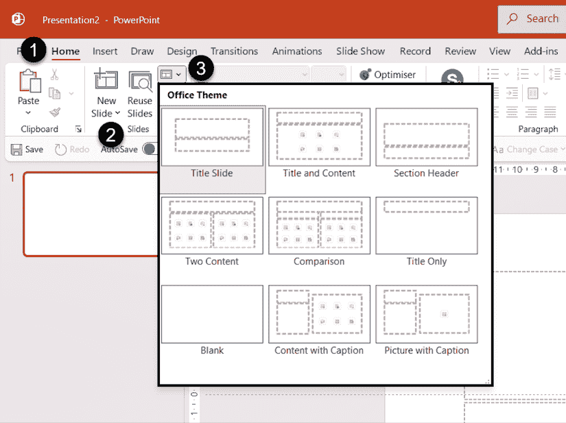

图 3.1 – 在 PowerPoint 的主页选项卡中找到幻灯片布局按钮

 **快速提示**：需要查看此图像的高分辨率版本？在下一代 Packt Reader 中打开此书或在其 PDF/ePub 副本中查看。

 **下一代 Packt Reader**是随本书免费赠送的。扫描二维码或访问[`packtpub.com/unlock`](https://packtpub.com/unlock)，然后使用搜索栏通过名称查找此书。请仔细检查显示的版本，以确保你得到正确的版本。

正如你在*图 3.1*中可以看到的，一个新的空白演示文稿文件已经包含了九种默认布局，你可以从中选择以快速组织幻灯片内容：

+   **标题幻灯片**

+   **标题和内容**

+   **章节标题**

+   **双内容**

+   **比较**

+   **仅标题**

+   **空白**

+   **带标题的内容**

+   **带标题的图片**

无论何时你处于想要以不同方式组织内容的幻灯片上，你的第一步应该是转到**幻灯片布局**按钮来更改幻灯片的布局。通过使用现有布局，你确保你的幻灯片上相似元素将在所有幻灯片中放置在相同的位置，从而创建一个更一致的外观，如*第二章*中讨论的那样。如果标准布局不符合你的需求，请继续阅读，因为我们将在一个关于**自定义布局**的即将到来的部分中解决这个需求。

如果你想要添加一个与上一个不同的布局的幻灯片，那么从**主页**选项卡（**1**）的**新建幻灯片**（**2**）下拉列表（*图 3.2*）中选择你想要的布局将会更高效：

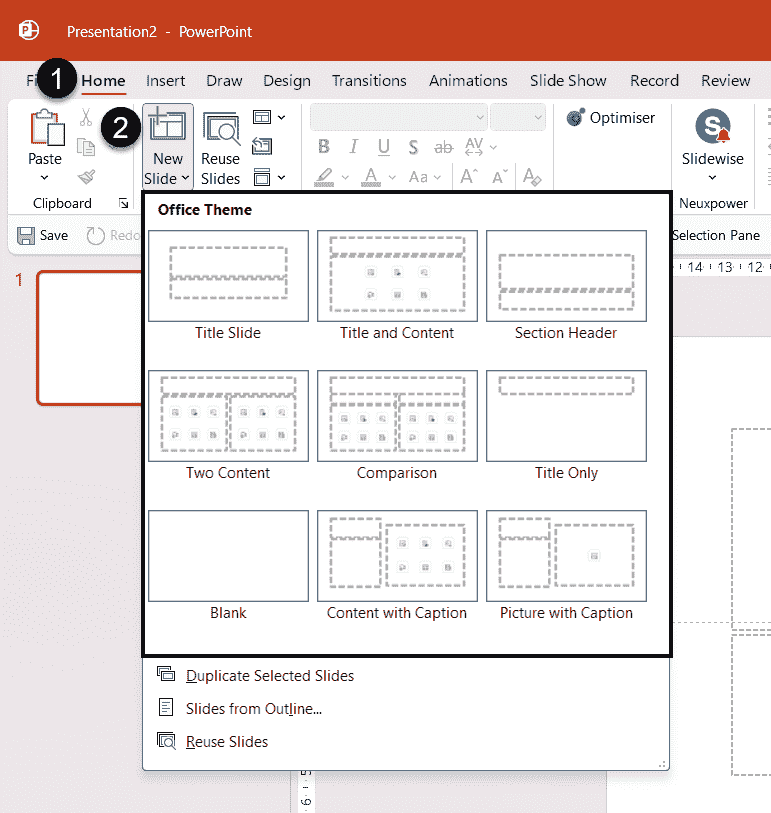

图 3.2 – 使用“新建幻灯片”按钮选择特定布局

当将新的布局应用到现有幻灯片上时，如果你的内容没有按预期改变，可能是因为该幻灯片是使用文本框而不是下一节中描述的占位符创建的。如果是这种情况，只需从文本框中复制文本并将其粘贴到正确的占位符中。然后你可以删除文本框，并继续进行布局更改，以获得更好的结果。

## 占位符

没有占位符，布局将没有用；这些是在您应用布局时在幻灯片上看到的默认框。乍一看，它们可能看起来像常规文本框，但并非如此。占位符由 PowerPoint 以不同于其他幻灯片元素的方式编码和管理。区分它们的第一种方法是我们在添加任何内容之前看到的提示文本（*图 3.3*）：

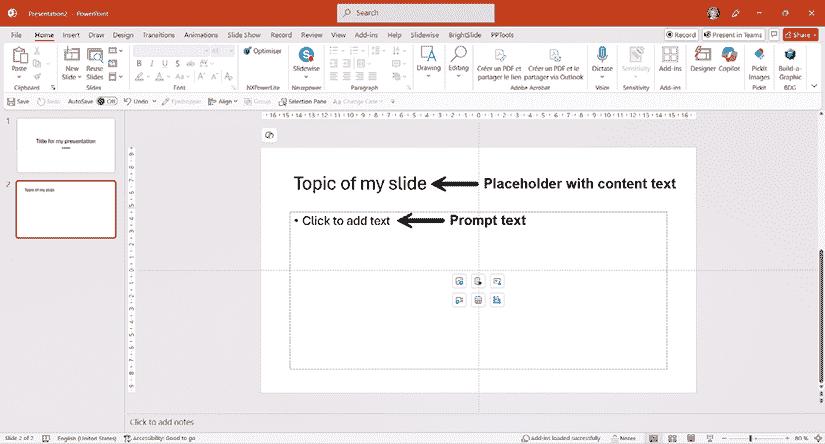

图 3.3 – 在添加内容之前占位符有提示文本

需要注意的是，用文本框替换占位符可能会使使用屏幕阅读器的人无法访问演示文稿。了解占位符是帮助您导航我们在下一节中将要介绍的幻灯片母版功能中找到的功能的第一步。

## 通过幻灯片母版访问布局和占位符

现在您对布局及其占位符有了更好的理解，我们可以介绍幻灯片母版功能，这是本书中讨论的三种母版类型中的第一种（文档母版和笔记母版将在*第四章*中讨论）。多年来我一直这样描述幻灯片母版功能：PowerPoint 的设计自动化工具，允许您确定演示文稿的整体外观和感觉。它允许您创建一个视觉上一致的外观，而无需在每个幻灯片上创建每个元素。

访问幻灯片母版的方式是点击**视图**选项卡（**1**），然后在**母版视图**组中点击**幻灯片母版**按钮（**2**）（*图 3.4*）：

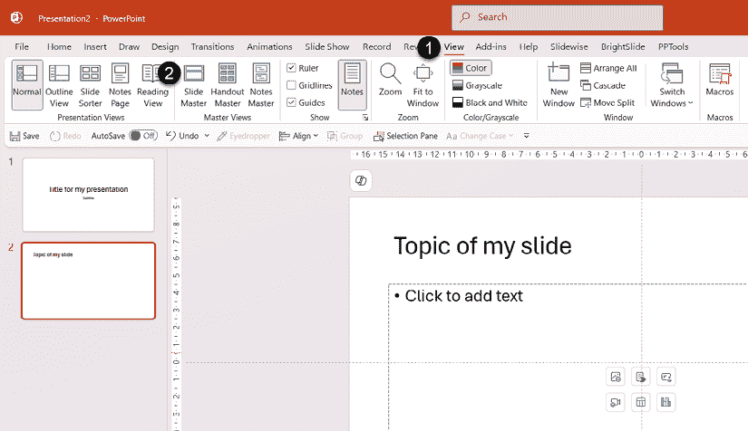

图 3.4 – 通过“视图”选项卡访问幻灯片母版功能

点击**幻灯片母版**按钮后，您将看到一个全新的选项卡，也称为**幻灯片母版**（**1**）（*图 3.5*）：

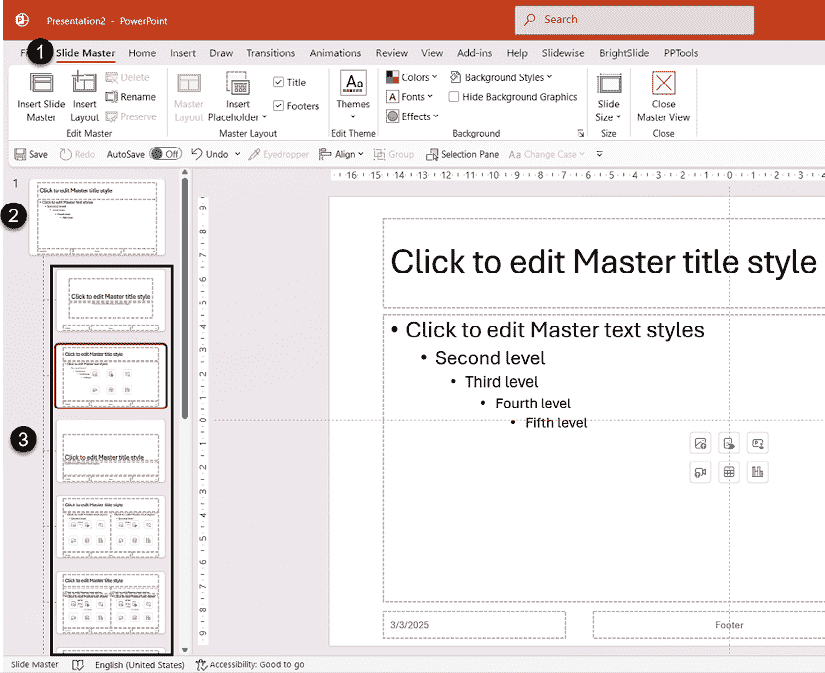

图 3.5 – 显示母版和布局的幻灯片母版视图

这个视图可以被认为是您演示文稿的后端。把它想象成创建所有幻灯片视觉标准的地方，无论是占位符位置、所有幻灯片上需要的图形元素，甚至是将在下一节讨论的字体样式和颜色。您想在所有幻灯片上找到的任何视觉元素都可以在**幻灯片母版**（**2**）中进行自定义。然后，您可以在布局（**3**）中调整这些元素，布局以较小的缩略图的形式显示，并与**幻灯片母版**功能相关联。我们将在名为*配置标准布局*和*添加自定义布局*的章节中讨论如何做到这一点。

当你进入**幻灯片母版**视图时，别忘了你需要点击**关闭母版视图**按钮才能回到 PowerPoint 的正常视图，以便向幻灯片中添加内容。任何你想对幻灯片母版或布局的整体外观进行更改的时候，回到**视图**选项卡，然后点击**幻灯片母版**。

现在我们已经探讨了布局和占位符是什么，以及我们知道了如何访问幻灯片母版，我们将探索幻灯片母版的一些功能，从如何选择字体和颜色开始。

# 选择字体和颜色

自从**Office 2007**推出以来，用户开始在他们应用程序中看到**主题**的存在。为了使描述简短，我们可以这样说，主题有助于定义*文档*的整体外观，包括颜色、字体、应用于形状的效果等。正如你可能已经注意到的，我在*文档*这个词上加了强调。那是因为一个主题可以被应用到你的 Office 应用程序中，使你的**Word**、**Excel**和**PowerPoint**文档看起来更加一致。微软提供了一些免费的主题，可以在**幻灯片母版**视图中的**主题**列表中找到。如果你想了解更多关于主题的信息，你应该查看 Echo Swinford 和 Julie Terberg 的书籍*Building PowerPoint Templates v2*，该书籍列在**进一步阅读**中。

使用微软的主题之一来创建你的演示文稿可以加快设计过程，如果其中一种符合你的需求。但我仍然建议你做一些修改，以便你的演示文稿将与你的组织外观更加一致。当你使用微软的主题之一时，你可能想要做的一件事是更改颜色和字体搭配。如果你决定从一个模板或一个新的空白演示文稿开始，这个过程是相同的。

## 选择颜色调板

由于我通常在**幻灯片母版**选项卡中开始我的演示文稿过程，因此我也在那里设置我的颜色。从**幻灯片母版**选项卡（**1**），只需点击**颜色**按钮（**2**）即可打开由微软提供的 Office 颜色调板列表（**3**），如图 3.6 所示：

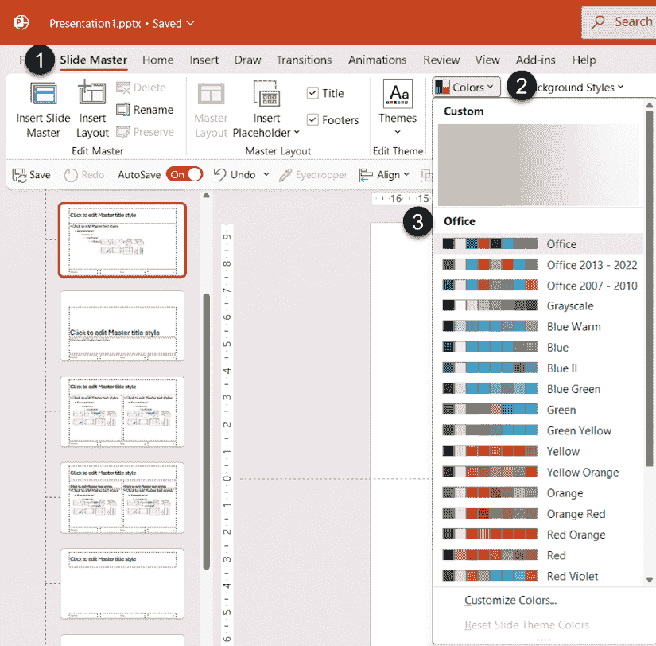

图 3.6 – 从幻灯片母版选项卡选择颜色调板的步骤

在 PowerPoint 中访问颜色调板的另一种方式是通过**设计**选项卡（**1**），使用背景变体的下拉菜单（**2**），然后选择**颜色**（**3**），如图 3.7 所示：

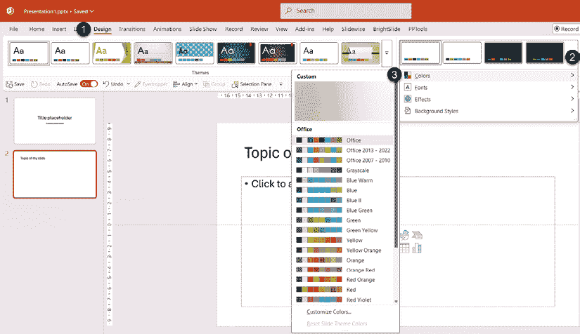

图 3.7 – 通过设计选项卡访问颜色调板

选择任何调板将帮助您在整个内容中创建一致的外观，因为您将拥有可用于字体颜色、形状填充和轮廓的颜色色卡。尽管 Microsoft 提供了一系列不错的颜色调板，但如果标准的 Office 选择与您的公司颜色不完全匹配，您可以自定义它们。这就是我们将在下一节中讨论的内容。

## 如何自定义颜色调板

如果您需要自定义调板中的某些颜色，您需要首先打开**颜色**下拉列表（**1**）并点击**自定义颜色...**（**2**）（*图 3.8*）：

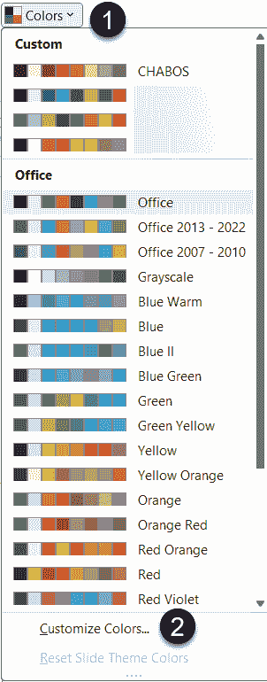

图 3.8 – 访问自定义颜色...功能

您将获得**创建新主题颜色**窗口（*图 3.9*）：

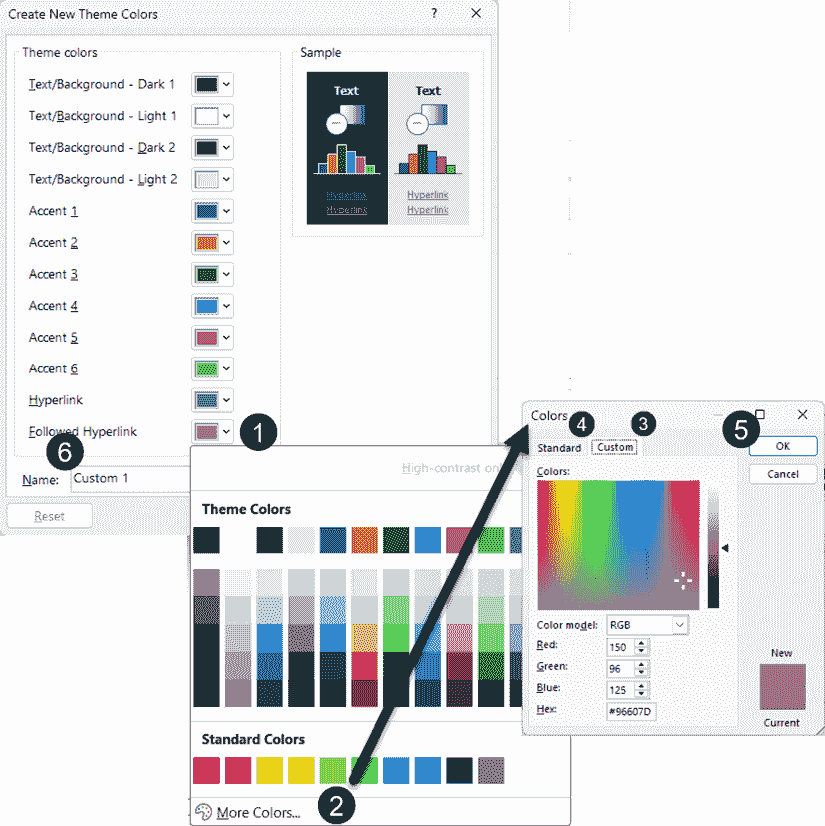

图 3.9 – 创建新颜色调板的步骤

*图 3.9*中的窗口允许您通过点击主题中的任何颜色来调整任何颜色，然后选择**更多颜色...**选项（**2**）以进入新的**颜色**窗口。这就是您将能够从颜色模型（RGB 和 HSL）、十六进制代码或**标准**选项卡中的色卡中选择**自定义**颜色（**3**）的地方。

当您完成调整颜色后，点击**确定**按钮（**5**）以确认您的选择，并重复此过程以更改任何其他颜色。完成所有颜色更改后，您需要填写**名称**（**6**）以确认您的新自定义颜色调板，然后点击**保存**以确认。确认后，您可以在**颜色**下拉列表的**变体**组中看到您的新自定义颜色调板（**1**）（*图 3.10*）：

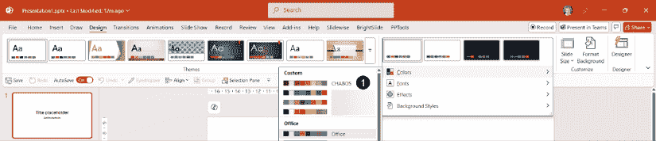

图 3.10 – 在颜色中自定义部分列出的自定义颜色调板

### 在调板中更改颜色时需要注意的事项

PowerPoint 的颜色调板始终设置为三组（*图 3.11*）：

1.  四种标签为**文本/背景 - 深色 1**、**文本/背景 - 深色 2**、**文本/背景 - 浅色 1**和**文本/背景 - 浅色 2**的色卡。

1.  六种**强调**颜色。

1.  两种颜色用于**超链接**和**已访问超链接**。

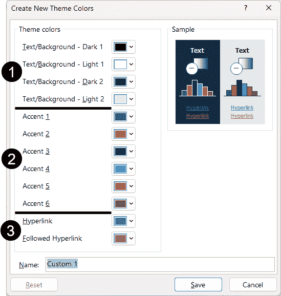

图 3.11 – 文本/背景、强调和超链接颜色类别

由于我的目标是帮助商业用户更快地创建演示文稿，因此我将向您提供您需要了解的基本元素，以便在演示文稿中使用颜色。有关详细信息，我再次将您推荐到*构建 PowerPoint 模板 v2*，列在*进一步阅读*中。

对于标记为**文本/背景 - 深色 1**和**深色 2**，以及**浅色 1**和**浅色 2**的前四种颜色，你需要记住它们被用来自动将文本颜色更改为背景样式，以实现最佳对比度。当模板或主题正确构建时，你通常会将**文本/背景 - 深色 1**设置为黑色，将**文本/背景 - 浅色 1**设置为白色，从而在文本和背景之间提供最佳对比度。对于**深色 2**/**浅色 2**颜色，你需要确保它们在**样本**预览中的对比度水平看起来不错，如图 3.11 中所示。

如果你更改了文本/背景颜色，你应该测试更改背景样式后你的内容看起来如何。为此，你可以使用**幻灯片母版**选项卡中的**背景样式**按钮（**1**）或转到**设计**选项卡（**2**），然后点击**变体**组以访问**背景样式**选项（图 3.12）：

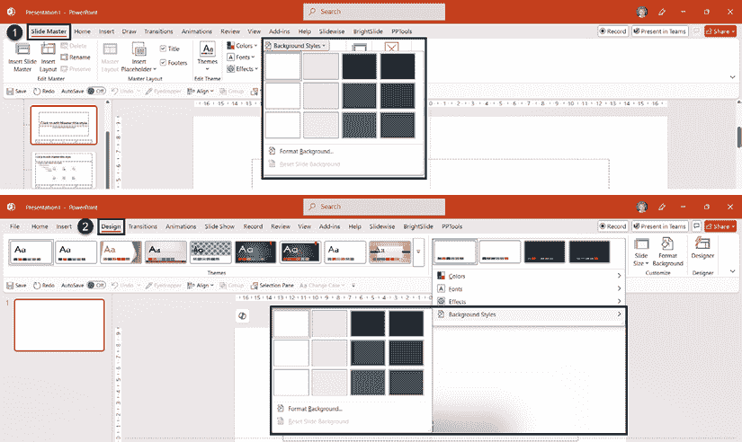

图 3.12 – 从幻灯片母版和设计选项卡访问背景样式

对于强调色和超链接颜色，进行必要的更改，并查看样本预览以确保你的颜色与深色和浅色背景都有足够的对比度。你还应该查看你的对比色并排效果，特别是如果你将在演示文稿中添加图表并使用彩色风格的话。如果你想了解你的颜色调色板对你的观众看起来如何，创建几个内容幻灯片，打开幻灯片放映视图，然后从你的电脑屏幕后退一步查看它们。

你可以通过使用你喜欢的工具开始一个虚拟会议并查看共享屏幕时几个内容幻灯片的外观来对你的虚拟演示做同样的事情。想象你处于观众的位置来查看你的内容将帮助你纠正对比度问题或渲染不佳的颜色。

在*第四章*中，有一个关于使你的演示文稿更具可访问性的主题，我们将查看**可访问性检查器**，其中包括颜色和对比度工具。

## 选择标题和正文字体

你是否遇到过每次在幻灯片上创建新元素时，都必须手动将字体设置为已选择的公司字体的问题？这通常是因为你没有在你的文件或模板中设置主题字体，PowerPoint 使用其默认主题字体，或者之前设置的默认字体。以下是如何解决这个问题并帮助你节省大量时间的步骤。

当在**幻灯片母版**选项卡（**1**）时，点击**字体**按钮（**2**）以打开列表（图 3.13）：

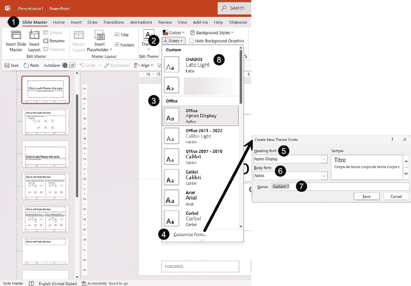

图 3.13 – 在幻灯片母版选项卡中选择主题字体

有一个**Office**类别（**3**）显示了标题（较大文本）和正文文本（较小文本）的外观。您可以通过在底部选择**自定义字体...**（**4**）来创建自己的自定义主题字体。然后您可以选择**标题字体**（**5**）和**正文字体**（**6**）以匹配您组织的选项。完成之后，您还可以填写**名称**（**7**）并点击**保存**。这将使其在**字体**列表顶部的**自定义**类别（**8**）中可用。您也可以在**设计**选项卡中访问主题字体，通过在**变体**组中点击更多箭头。

为了帮助您选择字体，您可能需要回顾*第二章*中的*选择字体*部分。

尽管您需要更多的信息才能成为颜色和字体专家，但本节所涵盖的内容已经足够您理解基础知识，以帮助您以更有效的方式创建更好的演示文稿。现在我们可以继续配置幻灯片母版功能中找到的标准布局。

# 配置标准布局

我们已经提到，在**幻灯片母版**视图中，幻灯片母版是较大的缩略图，而跟在其后的较小缩略图是布局。您还需要注意的一个元素是高亮显示的缩略图（**1**），它显示了您打开**幻灯片母版**功能时所在的幻灯片的布局（*图 3.14*）。您可以将鼠标悬停在任何缩略图上以显示一个工具提示（**2**），它会告诉您布局在哪些幻灯片中正在使用。

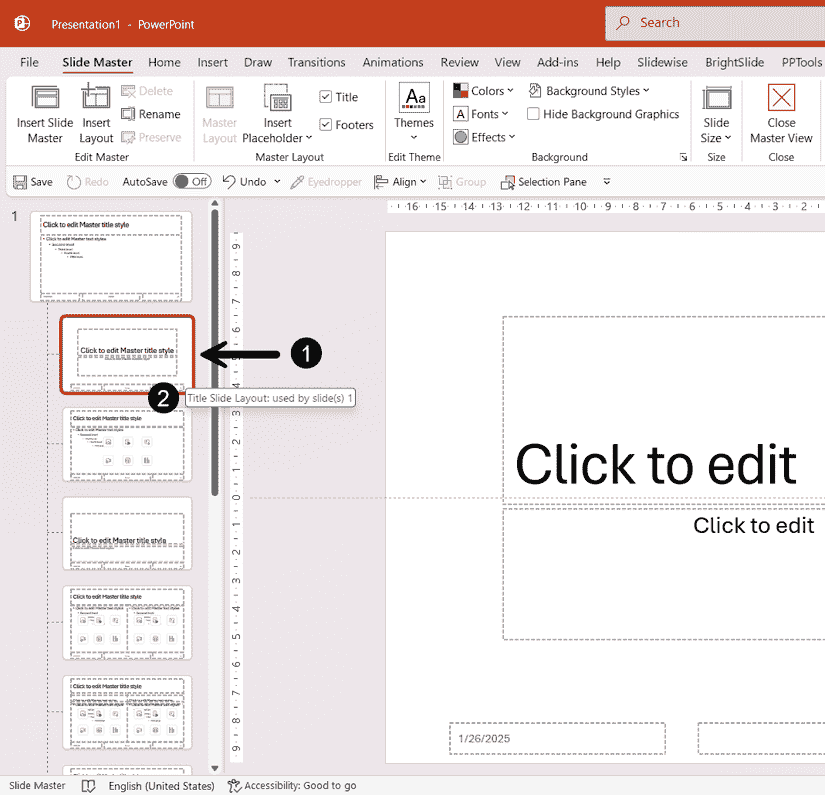

图 3.14 – 显示应用于当前幻灯片的布局的幻灯片母版视图

在对任何布局进行更改之前，您应该对您希望在**幻灯片母版**（**1**）（*图 3.15*）中应用的所有布局的标题和内容占位符进行格式更改和位置调整。这样做会将更改复制到布局中。

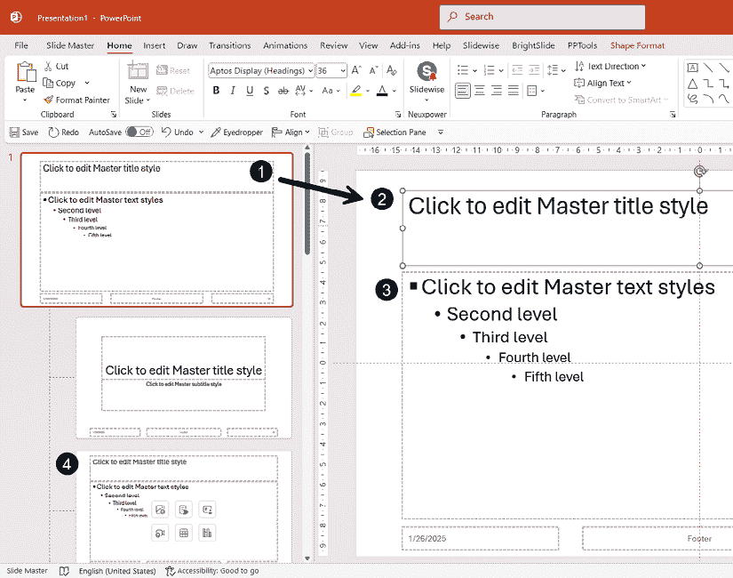

图 3.15 – 在幻灯片母版中进行的格式更改在布局中复制

我创建了一个示例，我在我的幻灯片母版的标题占位符中更改了字体颜色和大小，并修改了文本的垂直对齐方式到顶部（**2**）。我还更改了三个级别的项目符号大小，并修改了第一级的项目符号（**3**）。在标题和内容布局中，我的更改被自动复制（**4**）。

一些布局可能不会获得完全相同的变化，因为它们的使用方式。例如，标题幻灯片的布局将获得相同的字体样式和颜色，但不会获得与常规标题相同的字体大小，因为通常在标题幻灯片上使用更大的字体。完成幻灯片母版后，可以对其他占位符进行调整。只需记住，这样做会断开占位符与幻灯片母版之间的关联，这意味着下次你在幻灯片母版中进行更改时，它不会在布局上修改过的占位符中复制。

**亲自尝试**

理解之前的解释的最佳方式是亲自尝试。按照以下步骤操作：

1.  打开一个新的空白演示文稿并切换到**幻灯片母版**视图。

1.  更改幻灯片母版中标题占位符的字体大小和颜色。

1.  选择一个布局并更改标题占位符中的字体颜色。

1.  返回到**幻灯片母版**并再次更改标题的字体颜色。

1.  现在，看看你修改后的布局。新的颜色更改没有复制。

你需要记住，每次决定在幻灯片母版中更改内容时，都应该审查所有布局，以确保更改看起来符合你的预期。

## 应该避免的更改

无论是在幻灯片母版还是布局中，我们之前已经提到，我们可以在占位符内调整字体大小、字体颜色和文本对齐方式。确保你始终牢记我们在上一章中讨论的最佳实践。你还可以调整占位符的大小和位置，以创建适合你组织需求的样式，你还可以添加你希望在所有幻灯片上或仅在特定布局上看到的任何形状或图形元素。

但根据你的情况，有一系列事情可能会造成比你预期的更多问题：

+   **在** **幻灯片母版** **中删除占位符**：这样做会断开与布局的链接，并阻止在单个位置进行字体大小和颜色更改的可能性。所以，请千万不要这样做！

+   **在标准布局中删除占位符**：这样做在将来自另一个演示文稿的具有相同布局的一些幻灯片合并在一起，或者当将模板应用于另一个演示文稿时，可能会引起很多问题。PowerPoint 将无法映射占位符，这会让你更努力地将所有内容放置到位。

+   **删除未使用的标准布局**：这可能会引起与之前提到的问题类似的问题，尤其是在处理不使用相同模板的文件中的内容时。

+   **重命名标准布局**：这样做会在 PowerPoint 尝试将来自具有标准名称的布局的内容映射到不再具有该布局的模板时引起问题。

当你决定对你的布局进行一些清理时，你也会意识到一些元素不能被删除，例如已被某些幻灯片使用的布局，或者文件中幻灯片使用的布局上的占位符；这是设计上的原因。

因此，如果你对 PowerPoint 中提供的某些标准布局不满意，下一步应该怎么做？简单添加一些自定义布局，这是下一节的主题，包括帮助你创建它们的技巧。

# 添加自定义布局

虽然可以在任何时候添加自定义布局，但我更喜欢在花时间配置和格式化标准布局之后进行。原因很简单：这样你可以简单地复制一个标准布局作为起点，重命名它，并对它进行所有必要的更改。以下是操作步骤：

+   右键点击你想要开始的布局并选择**复制布局**（*图 3.16*）：

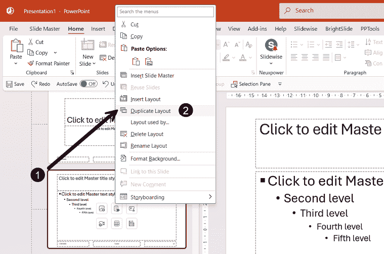

图 3.16 – 复制现有布局

+   右键点击创建的第二个布局（**1**）并选择**重命名布局**（**2**）以进入重命名窗口（**3**）。将名称改为描述你正在创建的布局的名称，然后点击**重命名**按钮（**4**）（*图 3.17*）：

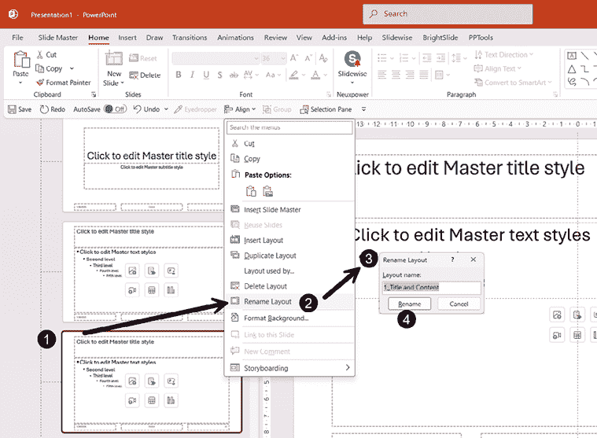

图 3.17 – 重命名布局

你现在有一个新的布局，它已经具有与你的其他布局相同的标题和内容占位符。让我们看看一个自定义布局的例子，我经常在演示中用它，当我想要一个全屏图像以及一个半透明的占位符来放置我的标题或标题时：

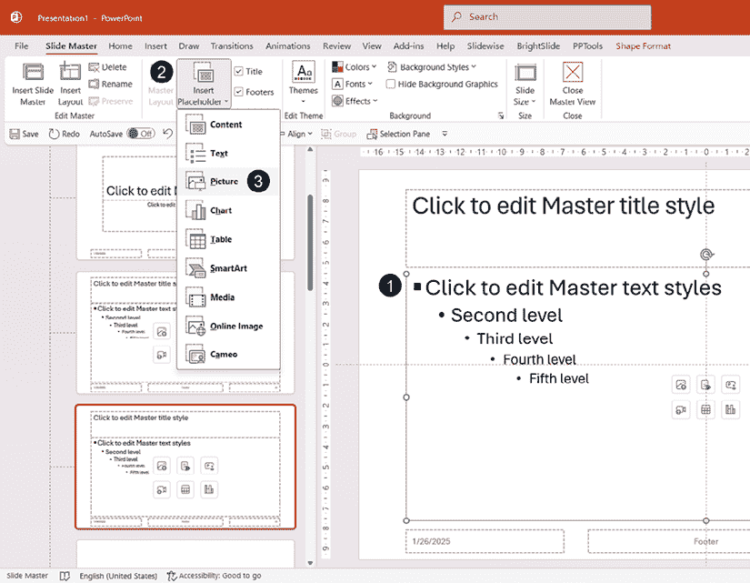

图 3.18 – 删除内容占位符并插入图片占位符

从新建的布局（*图 3.18*）中，你需要执行以下操作：

+   选择内容占位符并按键盘上的*删除*键来移除它（**1**）。

+   点击**插入占位符**按钮以打开可用的占位符类型列表（**2**）。

+   选择**图片**占位符（**3**）。你的鼠标光标将看起来像一个*加号*，这意味着你可以像在幻灯片上绘制任何形状或文本框一样绘制占位符。

    如果您将图片插入到**内容**占位符中，它将被调整大小以保持图片的宽高比，要么保持原始高度，要么保持宽度。**图片**占位符将保持其大小并调整图片以适应空间，这使得无论图片方向或大小如何，都能更容易地根据您的需求设计幻灯片。如果您使用**在线图片**占位符，它将保持整个图片并将宽度或高度调整以保持图片的宽高比。正如我的朋友和 MVP 同事 Echo Swinford 提到的，这个占位符的行为在布局中作为标志占位符是完美的，以避免处理内容占位符的提示文本。在以下图中，您可以看到相同的图片根据占位符类型进行缩放或裁剪：

    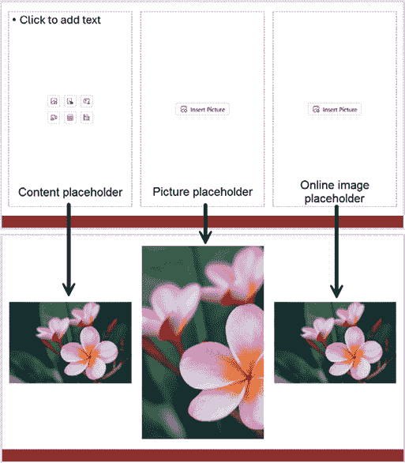

    图 3.18A – 比较内容、图片和在线图片占位符的行为

    您需要了解各种行为，以便根据您期望的结果选择占位符类型。

确保占位符的大小与幻灯片相同（**1**）（*图 3.19*）：

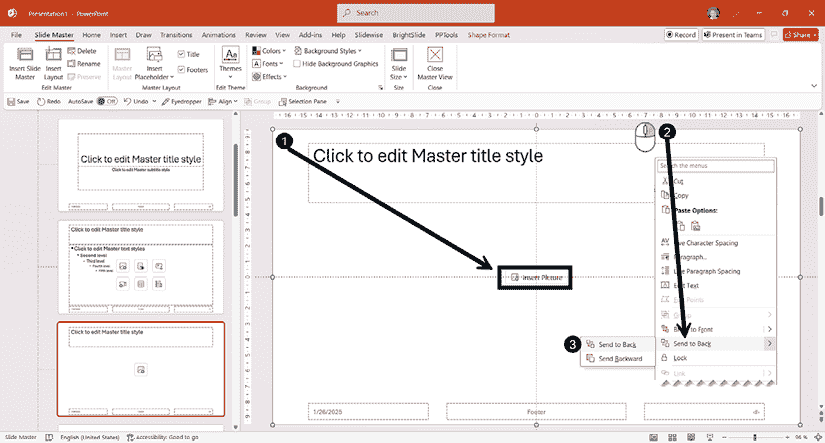

图 3.19 – 全屏图片占位符发送到背面

右键点击占位符（**2**），通过使用**发送到背面**（**3**）来更改其顺序。这样，您可以确保您有权访问标题占位符。插入占位符还会弹出**形状格式**上下文选项卡，您可以通过它访问**向后发送**按钮。

然后，您可以继续调整标题占位符的大小。我喜欢让它与幻灯片宽度相同，以使其看起来像横幅（**1**）（*图 3.20*）：

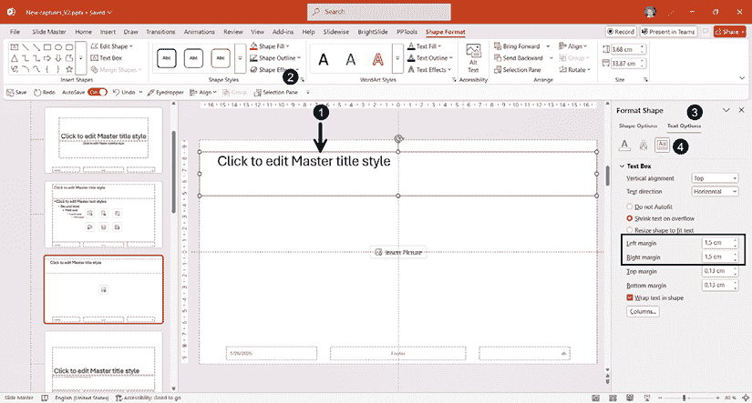

图 3.20 – 调整标题占位符及其边距

然后点击对话框启动器（**2**），即**形状样式**组右下角的小箭头。它打开**格式形状**（**3**）面板。请确保选择**文本选项**选项卡。

点击**文本框**（**4**）图标，以便您可以调整边距。左右边距可以大约为半英寸（**1.5 厘米**）。上下边距可以在您知道占位符中有多少文本后，在幻灯片上调整。

点击面板的**形状选项**选项卡（**1**），然后点击**填充和线条**图标（**2**），并打开**填充**部分（**3**）（*图 3.21*）：

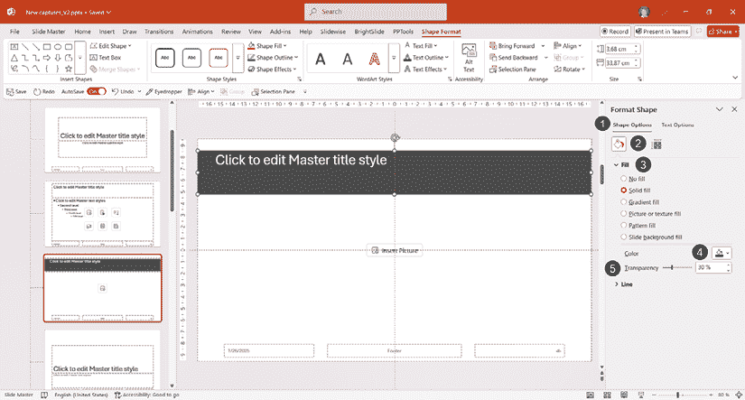

图 3.21 – 向标题占位符添加半透明填充

选择一个实色填充颜色——通常，黑色或深灰色在任何图片上看起来都很不错（**4**）。之后，调整透明度（**5**）。我通常从大约**30%**开始，并确保我的字体颜色是对比的（例如，白色）。

你可以通过在“幻灯片母版”选项卡中使用“关闭母版视图”按钮，添加一个带有你新自定义布局的新幻灯片来查看你的布局将如何看起来。将你的标题或标题添加到幻灯片中，然后点击中间的图片图标来浏览你想要添加的图片。在*图 3.22*中，你会看到一个带有标题和图像的新自定义布局的示例：

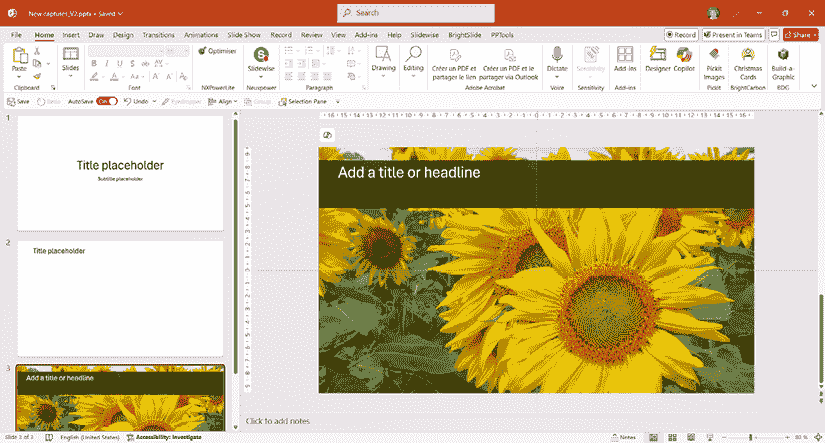

图 3.22 – 带有标题横幅的全幻灯片图像

如果你已经完成了演示文稿的规划阶段，你可能对哪些布局可能适合你的内容有一些想法。只需创建目前看起来合理的布局即可。你总是可以回到你的幻灯片母版，随着你的进行更改或添加额外的布局。我知道这个技巧可能不符合某些设计实践，但我给你提供的是一些有助于你在通常的商业环境中的步骤，这意味着你可能面临着不可能的截止日期。完美的演示或设计是不存在的，因为我们总是在之前的演示中找到可以改进的地方。正如我之前提到的：一步一步来总比没有任何改进要好。

如果你使用的是包含许多未在演示文稿中使用自定义布局的模板，如果你需要管理文件大小，删除它们是可以的。你的模板中包含的布局越多，文件大小就越大。当你从文件中删除未使用的自定义布局时，请记住，你需要从原始模板开始你的下一个演示文稿才能恢复它们。

当你没有从公司模板开始，并且对从空白演示文稿开始感到不知所措时，请查看在**文件** | **新建**中提供的 Microsoft 模板。浏览列表或使用与你的主题相关的关键词，打开几个模板来探索它们的幻灯片母版。从可能适合你的布局中汲取灵感。不幸的是，许多模板提供的布局违反了一些最佳实践规则，但如果它帮助你有一个起点，你将能够修复你可能会遇到的一些问题。

我还可以建议一种低技术手段来激发你的幻灯片布局灵感：我的朋友诺兰·海姆斯的《更好的牌组》。你可以在“进一步阅读”部分找到相关信息。

本节剩余部分将重点介绍一些技巧和窍门，帮助你解决常见的幻灯片母版问题。

## 重新排列幻灯片布局

当你经常使用布局时，列表可能不会以最佳顺序呈现。你可以简单地通过在“幻灯片母版”视图中点击并拖动布局来重新排列它们（**1**），这样你就可以以更有效的方式排序（*图 3.23*）：

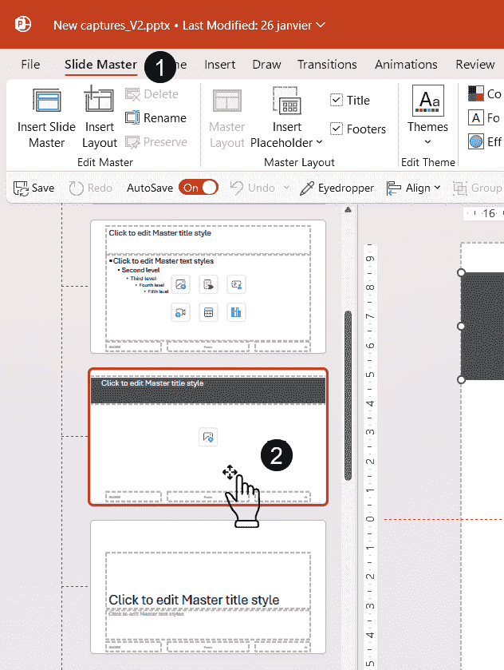

图 3.23 – 在幻灯片母版功能中重新排序布局

点击并拖动任何布局到最佳位置（**2**）。根据 Microsoft 提供的可用于创建演示文稿的快捷键列表，您应该能够使用*Ctrl* + *上*或*下*箭头键来移动缩略图。如果您使用的是非英语语言的操作系统，这些可能不起作用。请参阅*进一步阅读*部分以获取 Microsoft 文章的链接。

**新建幻灯片**和**布局**列表将按照您希望的方式排序（*图 3.24*）：

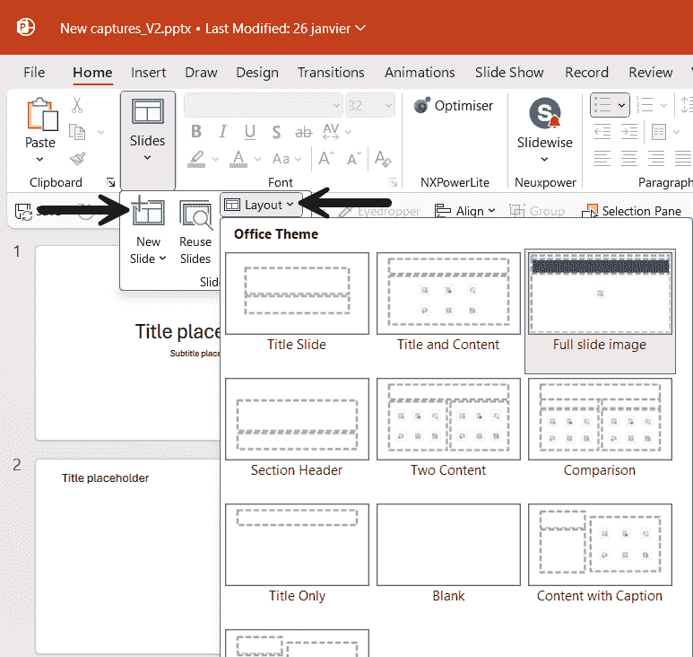

图 3.24 - 重新排序的幻灯片布局列表

这不是您应该在所有模板上都做的事情。但如果您发现自己在非常长的布局列表上浪费了大量的时间，请考虑这个技巧以帮助您在设计时节省一些时间。

## 重命名模板以避免 Office Theme 标签

如果您是从一个新的空白演示文稿开始创建模板，那么您的幻灯片母版将被命名为**Office Theme**。这并不是一个大问题，尽管它可能会让使用您创建的模板的其他人感到困惑。您只需通过右键单击并选择**重命名母版**来重命名母版。您可以为母版命名您公司或部门的名字（*图 3.25*）：

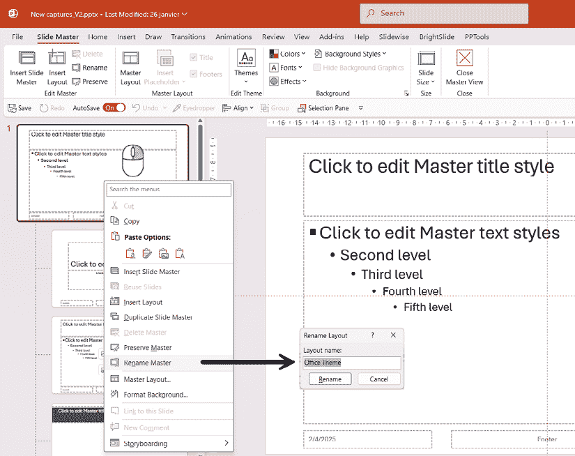

图 3.25 – 重命名幻灯片母版

如果您使用了 Microsoft 提供的列表中的模板，您还应考虑重命名您的幻灯片母版以避免更多的混淆。

## 使用“隐藏背景图形”功能

在创建模板时，我们讨论过您需要首先格式化幻灯片母版，然后是布局。根据您添加到幻灯片母版中的图形元素，您可能会遇到一些问题，例如形状或标志已经添加到幻灯片母版中，但并未正确放置在您所设想的标题幻灯片布局设计或其他任何布局中。这时，“隐藏背景图形”复选框就能派上用场：

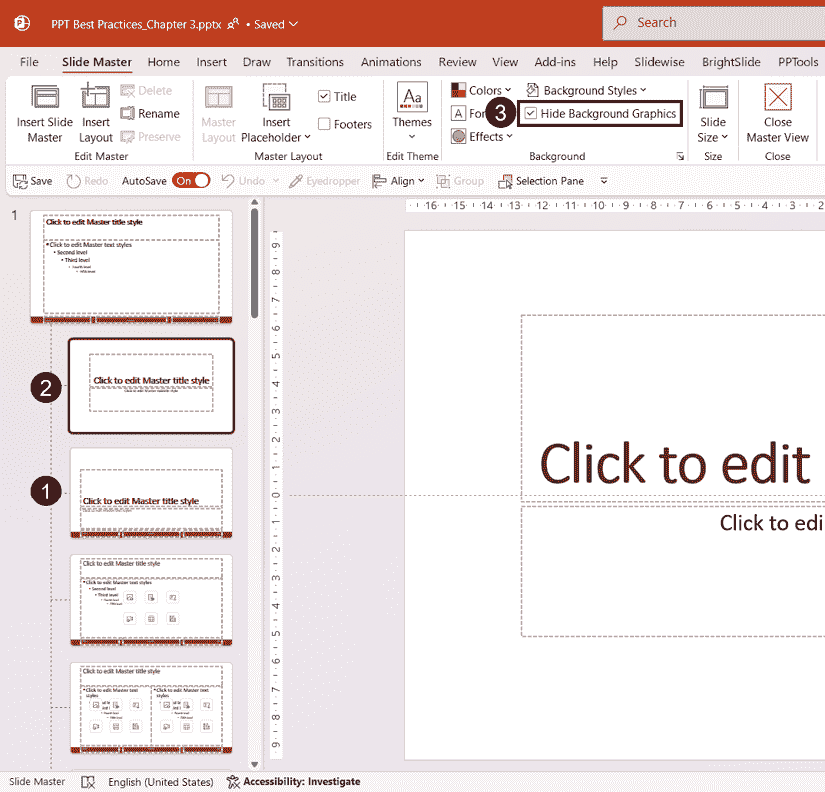

图 3.26 – 使用“隐藏背景图形”复选框

在*图 3.26*中，您可以看到部分布局在底部有一个彩色形状（**1**），而标题布局则没有（**2**）。这种差异的唯一原因是使用了**隐藏背景图形**复选框（**3**）。

因此，下次您在幻灯片母版中遇到不需要的图形元素时，请使用“隐藏背景图形”复选框来帮助您更改布局设计，而无需先手动隐藏它们。

## 在占位符中使用改进的插入图片体验

微软最近在各个占位符中引入了一个新的**插入图片**图标，这有助于用户选择存储源。这是一个改进，因为在此之前，当使用图片占位符时，我们只能通过点击图标浏览电脑中的图片，当我们想要使用微软的库存图片时，需要额外的步骤。

在新的体验中，点击任何占位符中的**插入图片**图标会给我们相同的选项（*图 3.27*）：

+   **从设备**

+   **库存图片**

+   **在网络上搜索**

+   **移动设备**

+   **图标**

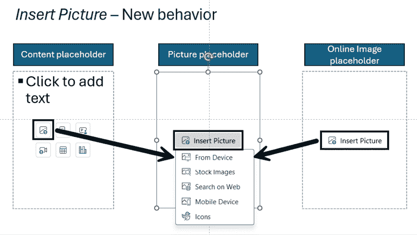

图 3.27 – 使用占位符中的改进插入图片图标

只需记住，根据你在母版布局中使用的占位符类型，你的图片可能要么被裁剪以填充占位符，要么在占位符调整大小时保持相同的宽高比。

这里有一个最后的技巧，可以帮助你快速在演示文稿中替换图片。右键点击一张图片（**1**），然后使用**更改图片**（**2**）来访问可以使用的各种来源列表（**3**）（*图 3.28*）。

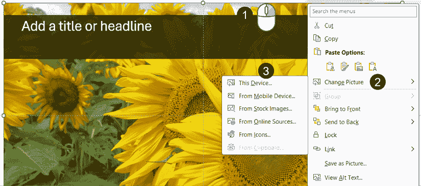

图 3.28 – 使用更改图片功能

**重要信息**

作为授权的 Microsoft 365 用户，如果你使用的是演示文稿文件或任何其他 Microsoft Office 文件类型中提供的库内容，你可以使用任何库存内容。所有内容都是免版税的，无需署名。你不能单独重用任何内容。请查看“进一步阅读”中列出的 Microsoft 的使用条款。

使用图片是让你的演示文稿更具影响力的好方法，无论你使用的是自己的图片还是微软的库存图片。让我们继续到下一节中缺失的页脚占位符主题。

## 恢复缺失的页脚占位符

如果你打开演示文稿文件的幻灯片母版，发现页脚占位符（如日期、页脚和幻灯片编号）已被删除，你可以也应该将它们添加回来，以便更有效地控制它们的显示。

当你在**幻灯片母版**选项卡上时，你可以右键点击幻灯片母版（**1**）并选择**母版布局...**（**2**）来显示**母版布局**窗口。然后你可以通过勾选复选框（**3**）将所有页脚占位符添加回来。或者，如果你首先选择了幻灯片母版，你可以通过选项卡上的**母版布局**来访问此窗口（*图 3.29*）：

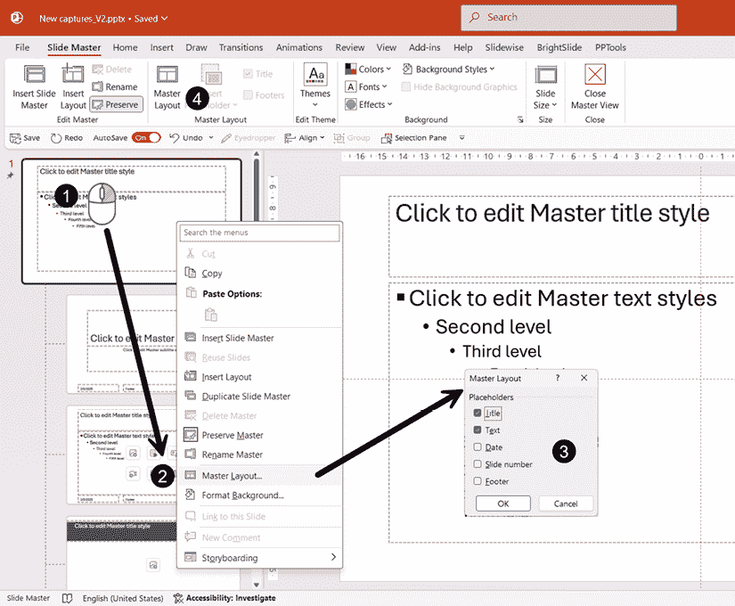

图 3.29 – 向幻灯片母版添加页脚占位符

如果这不能解决某些布局中页脚占位符缺失的问题（**1**），那么你需要检查特定布局上的**页脚**复选框（**2**）（*图 3.30*）：

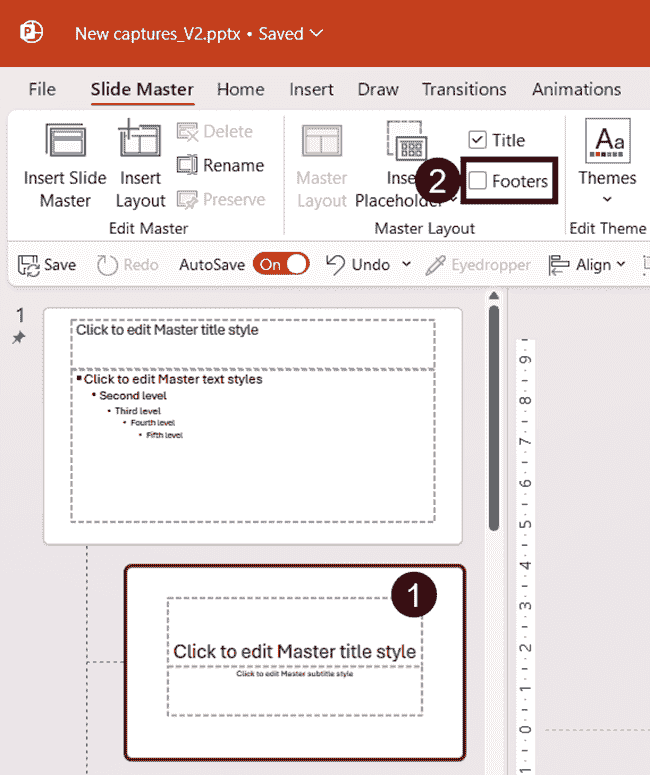

图 3.30 – 向布局中添加页脚占位符

现在你已经知道了如何检索页脚占位符，让我们继续介绍一个帮助你锁定对象或占位符的新功能。

## 使用占位符或对象的锁定功能

在**幻灯片母版**视图中添加到布局中的任何图形元素或常规文本框，当你回到**正常**视图时将不可编辑。这是为了保护需要在幻灯片上显示且不可编辑的内容。但是，多年来，用户们一直要求一个功能，允许他们锁定模板中的占位符，以避免用户移动它们。2021 年 5 月引入了锁定功能，以帮助用户锁定幻灯片对象。它确实有助于保护添加到布局中的任何元素在**幻灯片母版**视图中不被移动，但这并不意味着它们在**正常**视图中也被锁定。让我们看看如何使用这个功能，以便你得到期望的结果。

当你在幻灯片母版视图中时，你可以通过在幻灯片母版或布局上的任何对象上右键单击并然后在上下文菜单中点击**锁定**或**解锁**来访问锁定功能。然而，我认为从**选择面板**来做会更有趣，这是许多用户不知道的功能，它提供了一些你应该知道的技巧。要在幻灯片母版视图中显示**选择面板**，你可以选择**开始**选项卡（**1**）| **绘图**组，**排列**（**2**）| **选择面板...**（**4**）选项（*图 3.31*）：

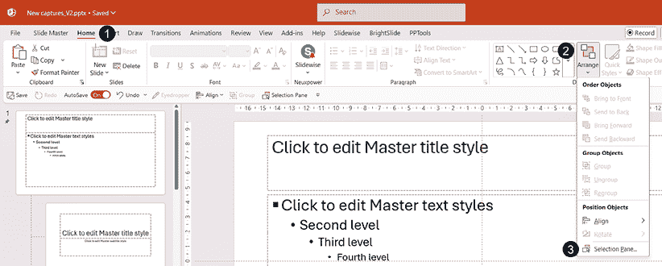

图 3.31 – 显示选择面板的步骤

一旦显示，你将能够访问幻灯片上对象的列表，这些对象被 PowerPoint 创建的通用名称标记。在*图 3.32*的例子中，我们可以看到标题和内容布局有五个占位符（**1**）：

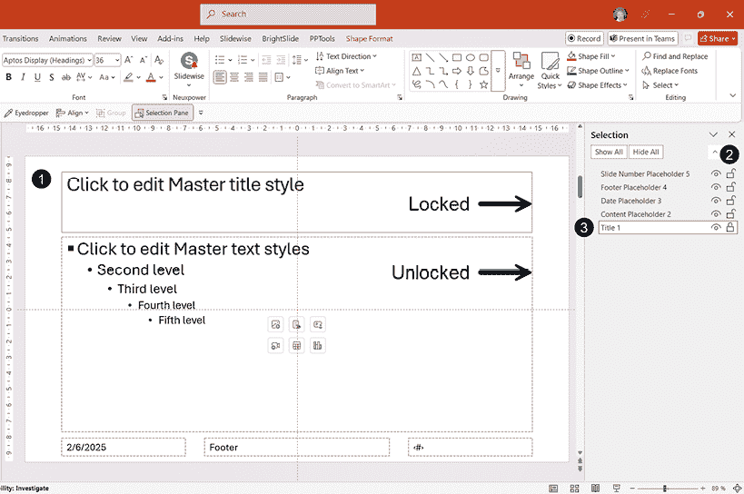

图 3.32 – 选择面板中可用的锁定功能

要锁定一个对象，你只需点击*锁定*图标来关闭它（**2**）。正如你在图中可以看到的，标题占位符（**3**）已经被锁定。如果我们尝试在幻灯片上选择它，其边框将完全封闭，没有任何手柄允许调整大小或移动。

这是你应该使用锁定功能的地方，如果你想确保占位符，或任何其他添加到幻灯片母版和布局中的对象不会在模板中意外移动。换句话说，当你回到**正常**视图时，它不会锁定幻灯片对象。

如果你保持**选择**面板打开并进入**正常**视图，它将显示相同的锁定可能性，但正如我们在*图 3.33*（**1**）中看到的，我们在**幻灯片母版**视图中锁定的标题占位符现在已解锁，幻灯片上的占位符可以使用选择和旋转手柄进行移动或调整大小（**2**）。你需要在幻灯片上的**正常**视图中再次使用**锁定**功能，以防止任何元素被移动到那里。

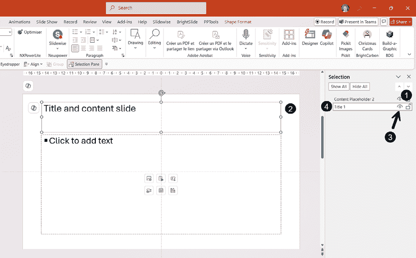

图 3.33 – 正常视图中的未锁定占位符

因此，如果你想保护占位符在编辑模板时不会被移动或调整大小，请在**幻灯片母版**视图中锁定它们。如果你想保护对象在添加内容时不会意外地移动到幻灯片上，那么请从**正常**视图中锁定它们。

既然我们在谈论**选择**面板，那么让我们探索一下那里的一些其他功能，这些功能在我们讨论第*第九章*中的动画时将会变得很有用。如果你回顾一下*图 3.33*，你会看到一个小的眼睛图标（**3**），它允许你隐藏或显示你的幻灯片上的对象。当我们想要创建更复杂的动画效果时，通常会在多个对象上叠加，这使得只选择一个对象变得非常困难——这就是这个隐藏功能能帮上忙的时候。如果你双击一个对象的名字（**4**），你将能够重命名它。如果你想保持对复杂动画的理智，重命名对象应该成为一种标准程序——这是找到需要特殊动画的对象的最快方式。

**关于快速访问工具栏的一词**

**快速访问工具栏**（**QAT**）功能可以在所有 Microsoft Office 应用程序中找到。这是一种自定义你经常使用的工具列表的绝佳方式。在 PowerPoint 中，**选择**面板是一个很好的工具，可以添加到你的 QAT 中。要这样做，只需右键单击该功能，然后点击**添加到快速访问工具栏**。如果你不熟悉 QAT，可以在任何 Office 应用程序标题栏的**搜索**框中键入`quick access toolbar`以获取帮助。

使用这个简短的技巧列表来帮助你处理幻灯片母版及其布局时的常见问题，以及如何创建自定义布局，你将能够自动化你的内容创建以节省一些宝贵的时间。如果你想知道你将如何创建既适用于演示又适用于打印的布局，那么你需要阅读*第四章*。有一些方法可以使你的 PowerPoint 文件更加努力工作，而不会让幻灯片做所有的工作。由于 AI 服务越来越频繁地被使用，现在让我们讨论如何规划幻灯片母版中的布局，以便它们可以被 AI 用于更好的结果。

# 使你的幻灯片母版与 AI 服务兼容

如果您计划使用 Microsoft 的 Copilot M365 AI 助手与 PowerPoint 模板一起使用，本章中讨论的每件事仍然适用。但您必须采取额外步骤，以便 Copilot 可以使用品牌布局创建新的演示文稿和幻灯片。本节适用于您已购买附加 Copilot for M365 许可证以添加到常规 M365 订阅的情况。

在*第五章*中，我们将讨论如何利用这个 AI 助手的特性。目前，我们将关注如何更新幻灯片母版以优化您的结果。

## Microsoft 的建议

尽管 Microsoft 在 2023 年 3 月正式发布了 PowerPoint 中的 M365 Copilot，但仅支持品牌企业模板的功能直到 2024 年 11 月才可用。那时，他们还提出了关于如何更新企业模板的建议，以便用户能够获得与品牌更一致的 AI 结果。

由于这些推荐在我撰写本书时仍然相当新颖，我将专注于为您提供高级信息，并在*进一步阅读*部分引用 Microsoft 的文档，以便您能够访问他们未来的任何更新。

当使用 Copilot 创建演示文稿内容时，它将查看您的模板中的布局。它将尝试使用最适合从您的提示中创建内容的布局。以下是需要考虑的三个元素类别，每个类别都有简短的说明。

### 占位符大小多样性

由于您的 Copilot 助手将寻找占位符以添加其建议的内容，如果您的模板布局中只有相同大小的占位符，文本内容可能会显得杂乱。

这是我对 AI 创建的幻灯片的第一个痛点：通常有**太多文本**。我的建议是按照 Microsoft 的建议规划各种占位符大小，这样您的企业模板就可以被 Copilot 使用，但请计划在 AI 幻灯片创建后进行一些文本减少工作。

### 幻灯片布局多样性

为了适应大小多样性建议，您不可避免地需要创建更多布局。如果您只使用标准布局，Copilot 创建多样化内容也会很困难。您应该计划为每个布局创建多个版本。例如，如果您自定义了*双内容*标准布局，请复制它并将其中一个内容占位符更改为图片占位符。对于您的*标题幻灯片*布局也是如此：添加带有或不带有图像或图形元素的版本。

### 命名布局

最后一个推荐类别是使用清晰的命名约定来命名您的布局。这意味着清楚地说明创建布局的原因。Copilot 会理解诸如**标题**、**议程**、**章节**、**内容**和**结论**等词语，所以请确保使用它们。

您可以在**进一步阅读**部分找到指向微软博客文章的链接，“使用 Copilot 在 PowerPoint 中保持演示文稿的品牌一致性”。他们还提供了一些示例，说明了每个建议。

## 使用 Copilot PowerPoint Starter Template

在微软博客文章的底部，您还可以找到名为“Copilot PowerPoint Starter Template Nov 2024”的 PowerPoint 文件的下载链接。我应该补充一点，您必须滚动到文章的**反馈**部分之后，才能找到允许下载的灰色框。

起始模板包括九个幻灯片，解释了尺寸建议，并提供了您在自身文件中复制和粘贴起始布局所需的步骤。您还可以在最后一页找到指向附加资源的链接。

提醒您，满足 Copilot 对各种尺寸和布局的需求将向您的实际模板中添加**43 个布局**。这是一个快速添加布局的起点，具有有助于 Copilot 的命名约定，但您还需要使用自己的品牌进行定制。

如您现在可能意识到的，使您的模板与 Copilot 兼容不仅仅是鼠标点击几个额外按钮的问题；然而，在这里投入的时间将帮助您在使用 Copilot 创建内容时获得更好的结果。是的，我提到了**更好的结果**，而不是**准备交付的令人印象深刻的内容**。我们将在*第五章*中讨论 Copilot 的其他限制。

# 摘要

在本章中，我们讨论了布局和占位符，以便您了解它们在幻灯片母版中的作用。我们还介绍了如何选择主题字体和颜色，以及如何格式化您的标准布局并创建新的布局。最后，我们介绍了微软的建议，帮助您在计划在 M365 中使用 Copilot 时保持模板的品牌一致性。

当然，如果本章的主要目标是创建一个强大的企业模板，那么可以包含更多主题。凭借您所学的知识，您将能够拥有一个不错的模板来工作，并在之后创建幻灯片时节省大量时间。即使您觉得这会花费您太多时间，我也可以向您保证，这一切都是值得的。您将能够在第二次使用时快速重用幻灯片并创建新的演示文稿。

在下一章中，您将了解讲义和备注母版，这样您就可以在不使幻灯片过于拥挤的情况下使您的 PowerPoint 文件服务于多个目的。我们还将探讨帮助您使演示文稿更易于访问的工具以及从您的文档中打印或创建 PDF 的各种方法。

# 进一步阅读

+   要了解如何构建强大的 PowerPoint 模板，请参阅 Echo Swinford 和 Julie Terberg 合著的书籍《Building PowerPoint Templates v2》。

+   关于 Nolan Haims 的《The Better Deck Deck》，获取更多信息：[`thebetterdeckdeck.com/`](http://thebetterdeckdeck.com/)

+   微软关于 PowerPoint 键盘快捷键的文章：[`support.microsoft.com/en-us/office/use-keyboard-shortcuts-to-create-powerpoint-presentations-ebb3d20e-dcd4-444f-a38e-bb5c5ed180f4`](https://support.microsoft.com/en-us/office/use-keyboard-shortcuts-to-create-powerpoint-presentations-ebb3d20e-dcd4-444f-a38e-bb5c5ed180f4)

+   微软关于股票图片使用条款的文章：[`support.microsoft.com/en-us/topic/what-am-i-allowed-to-use-premium-creative-content-for-0de69c76-ff2b-473e-b715-4d245e39e895`](https://support.microsoft.com/en-us/topic/what-am-i-allowed-to-use-premium-creative-content-for-0de69c76-ff2b-473e-b715-4d245e39e895)

+   微软关于使用 Copilot 保持演示文稿品牌一致性的博客文章：[`techcommunity.microsoft.com/blog/microsoft365insiderblog/keep-your-presentations-on-brand-with-copilot-in-powerpoint/4295913`](https://techcommunity.microsoft.com/blog/microsoft365insiderblog/keep-your-presentations-on-brand-with-copilot-in-powerpoint/4295913)

    |

    #### 现在解锁这本书的独家优惠

    扫描此二维码或访问 [`packtpub.com/unlock`](https://packtpub.com/unlock)，然后通过书名搜索这本书。 |  |

    | **注意** *：在开始之前，请准备好您的购买发票。* |
    | --- |
