# 第九章：与转换和动画一起工作

到目前为止，你已经了解了可以创建的视觉效果和可以使用的多媒体元素，以创建更好的演示文稿。如果你在阅读前几章时开始创建新的演示文稿或修改现有的演示文稿，现在是时候学习如何在演示过程中创建更好的视觉流程了。使用转换和动画可以使复杂主题更容易理解。

我应该补充的是，你将学习如何创建有目的的动态。我们不会为了动态而让内容在屏幕上移动和飞来飞去！目标是讲述更好的故事，并让内容对观众来说难忘。

在本章中，我们将讨论以下主题：

+   智能使用幻灯片转换

+   利用形态转换

+   使用高级动画序列

+   使用触发器进行按需动画

# 技术要求

本章讨论的大部分主题不需要拥有**M365 订阅**，因为工具和功能已经在 PowerPoint 的先前版本中介绍过了。我将标识出哪些功能在 M365 或更新的版本中。此外，请注意，由于 PowerPoint 的订阅版本持续更新，某些功能可能不会在你的应用程序版本中完全相同。

# 智能使用幻灯片转换

使用幻灯片转换可以帮助你创建帮助观众跟随的动态。重要的是要记住，不要仅仅因为可以而使用转换，而要使用它因为它增加了你内容的价值。在常规的商业环境中，你可以使用一些可用的转换，你的演示文稿总是会看起来专业。让我们从下一节讨论转换的工作原理开始。

## 理解转换基础

要访问转换库，你只需点击**转换**选项卡（**1**）。在**转到此幻灯片**组（**2**）中，点击**更多**按钮（**3**）以打开转换库（**4**）（*图 9.1*）：

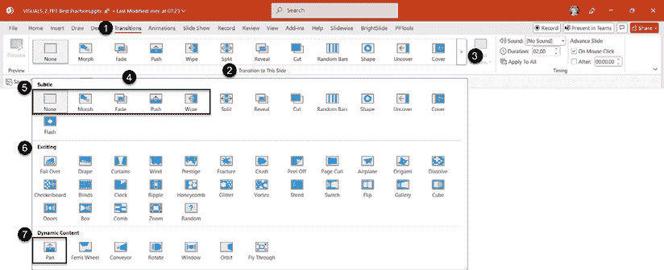

图 9.1 – PowerPoint 的幻灯片转换库

你有很多转换可供选择，它们被分为三类**：微妙**、**激动人心**和**动态内容**。无论你对所有选择感到不知所措还是兴奋，让我先说，你可以用没有转换或在你余生的商业生活中使用简单的**淡入**转换来创建所有的演示文稿，没有人会抱怨。话虽如此，以下是一些有用的转换及其使用时机：

+   在**微妙**（**5**）类别中，我挑选出我认为最适合商业演示文稿的：

    +   **无**：如前所述，没有转换不会分散注意力。这是创建新演示文稿文件时的默认设置。

    +   **形状**：这个过渡效果非常有用，将在本章后面单独介绍。如果你使用的是 2019 年之前的 PowerPoint 版本，你将无法访问这个过渡效果。请注意，2025 年 10 月之后，Microsoft 将不再支持 Office 2016 和 2019。

    +   **淡入**：这是一种将一张幻灯片柔和地过渡到下一张的过渡效果，给出内容正在改变的信息提示。这是我所有幻灯片个人最喜欢的过渡效果。

    +   **推进**：根据我们给出的方向以及幻灯片的创建方式，它可以帮助你创建向前移动的错觉。

    +   **擦除**：这也取决于方向和内容的创建方式，它可以帮助创建新内容覆盖现有内容的错觉。

+   在**激动人心**（**6**）类别中，这里有两个个人评论：

    +   在大多数常规商务环境中，我会避免使用这个类别，因为这些过渡效果可能会非常分散注意力。

    +   我以前是否使用过这些过渡效果中的任何一个？是的。在自运行的展会演示中，观众需要一些能吸引眼球的东西。例如，每次内容移动到新部分时，我都可以使用特定的一个。目的是避免对新酷炫的过渡效果产生期待。我们希望让观众知道我们正在转换到新的主题。

+   在**动态内容**（**7**）类别中，让我们定义它所做的是什么，以及哪一个是最有用的：

    +   让我们先定义一下动态内容是什么意思。当使用本类别中的过渡效果时，幻灯片背景中的任何内容在过渡期间都不会移动。这适用于你已经在幻灯片背景中填充了图片或任何添加到幻灯片母版的图形元素。

    +   **平移**：这是我唯一在常规商务环境中使用的动态过渡效果，帮助我在**形状**过渡效果可用之前为时间线创建前进感。对于常规商务演示，所有其他过渡效果都比使用动态内容的附加值更具干扰性。但如果你需要制作包含照片或将成为视频剪辑的内容的幻灯片，请考虑测试这些过渡效果。

如果你很少使用幻灯片过渡效果，重要的是要记住，效果是在我们移动到那个幻灯片进行演示时应用的。

## 查看幻灯片过渡效果

在**普通视图**中有工具可以帮助你预览过渡效果并调整各种选项，例如效果和计时（*图 9.2*）：

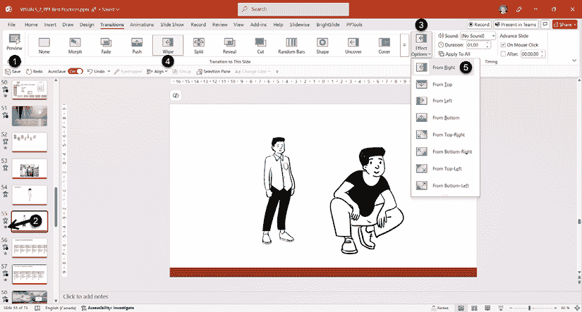

图 9.2 – 幻灯片过渡选项和计时

+   您可以通过点击功能区中的**预览**按钮（**1**）或前一个示例中幻灯片缩略图旁边的**星形图标**（**2**）来预览您刚刚应用的幻灯片过渡效果。

+   根据你选择的幻灯片过渡效果，你将在“效果选项”中（**3**）获得各种选项。在之前的例子中，**擦除**过渡效果（**4**）有一个名为**从右**（**5**）的效果。

**自己试试**

熟悉效果选项的最好方法是应用不同的过渡效果到幻灯片上，并查看列表以测试每个选项。如果你以前很少使用过渡效果，现在应该花些时间尝试一下。你可以使用现有的演示文稿，或者只需在新文件中创建几个幻灯片，然后为每个幻灯片添加不同的过渡效果。最后，探索每个过渡效果可用的**效果选项**列表。

## 调整时间选项

仍然在“过渡”选项卡中，**时间**组（**1**）有一些可以更改的设置（*图 9.3*）：

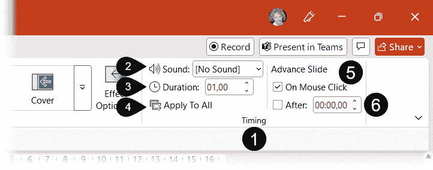

图 9.3 – 在“过渡”选项卡中，可以调整“时间”组设置

+   在过渡过程中可以添加**声音**（**2**）。由于我们正在讨论如何使商业演示更具影响力，因此你应该避免此选项以保持专业性，除非你有特殊的演示需求。

+   **持续时间**设置（**3**）是幻灯片过渡效果改变幻灯片所需的时间（秒数）。通常，默认设置适用于大多数演示，但如果你想创造特定的氛围，可以尝试更长的或更短的时间。在我们的例子中，应用了一个淡入淡出过渡效果，其持续时间为 01,00 秒。

+   **应用至所有**设置（**4**）允许你一键将选定的过渡效果应用到所有幻灯片。例如，你可以选择一个简单的淡入淡出过渡效果，调整“时间”组中的任何其他选项，然后将它应用到演示中的所有幻灯片上。

+   在“时间”组中有一个名为**前进幻灯片**的子组（**5**）。默认情况下，**鼠标点击**复选框被选中，这意味着在幻灯片放映过程中，你可以通过点击鼠标或使用键盘导航键来切换幻灯片。如果你不熟悉在演示过程中可以使用哪些键盘键，它们将在*第十二章*中讨论。

+   如果你取消选中**鼠标点击**复选框，它将允许你在幻灯片放映模式下移除使用鼠标或键盘导航的可能性。那时，唯一导航幻灯片的方法是使用内置的带有超链接的导航元素。这在创建自动运行的演示文稿时很有用，例如在展台。如果你不熟悉 PowerPoint 中的超链接，它们将在*第十章*中讨论。

+   在 **高级幻灯片** 子组中的最后一个设置是 **之后** 复选框（ **6** ）。勾选此选项允许您选择在 PowerPoint 自动切换到下一张幻灯片之前显示幻灯片的持续时间。格式为 `分钟:秒，十分之一秒`（ **00:00,00** ）。此选项可用于您想要创建自动运行的演示文稿时，或者只是因为您想要幻灯片短暂显示，而不需要点击才能进入下一张幻灯片。

现在你已经更好地理解了幻灯片过渡的工作原理，让我们在下一节中更详细地看看 **Morph** 过渡效果。

# 利用 Morph 过渡效果

当微软推出了 **Morph** 过渡效果时，它为演示文稿制作者带来了惊人的变革！现在，在切换到另一张幻灯片时，可以创建真正的运动效果，而无需花费数小时调整动画效果或使用自动过渡。简而言之，**Morph** 允许您平滑地将对象从一个幻灯片移动到另一个幻灯片。

让我们看看以下步骤，帮助您在 *图 9.4* 的帮助下创建第一个 **Morph** 过渡效果：

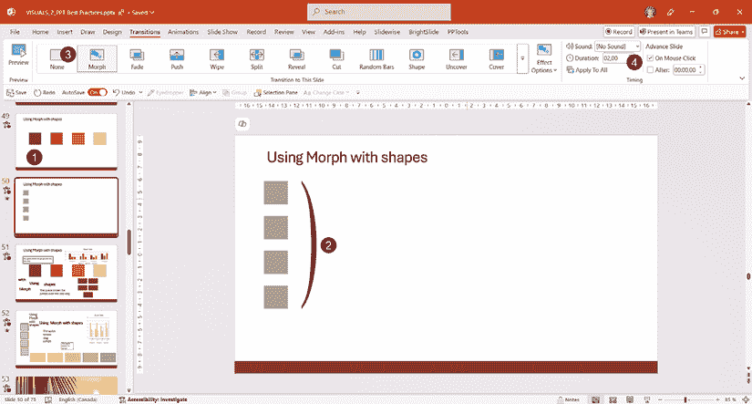

图 9.4 – 使用 Morph 过渡效果创建运动效果

+   创建一个类似于图 9.4 中幻灯片 **49** 的幻灯片，使用四种不同颜色的方块。然后复制幻灯片——使用键盘上的 *Ctrl* + *D*（ **1** ）。这一步对于使过渡效果工作至关重要，因为 PowerPoint 需要具有相同的对象名称来计算形状的起始位置和结束位置。您也可以从一张幻灯片复制并粘贴对象到另一张幻灯片上，但复制幻灯片的好处是无需选择所有要复制和粘贴的对象——所有操作都在一个高效的快捷键中完成。

+   在新复制的幻灯片（幻灯片 **50** ）上，移动方块，使它们变小，并将它们的颜色（ **2** ）改为与之前选择的不同颜色。

+   将 **Morph** 过渡效果应用到第二张幻灯片（ **3** ）上，并使用 **预览** 按钮查看效果。

+   **Morph** 的默认持续时间是 2 秒（ **4** ）。这允许四个形状在缩小并改变颜色时平滑地移动到它们的新位置。

我只能对负责这个过渡效果的计算和渲染的伟大工程魔法师表示赞赏！之前的例子是用基本形状完成的，但 **Morph** 还有一些额外的技巧。首先，让我们看看如何在下一节中使用 **Morph** 效果选项。

## 使用 Morph 效果选项

我们看到了如何轻松地将 **Morph** 过渡效果应用到复制的幻灯片上。我们还没有看到的是，这个过渡效果也有 **效果选项**（ **1** ），可以根据我们想要实现的结果进行更改（ *图 9.5* ）：

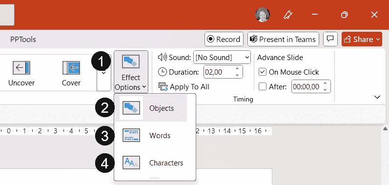

图 9.5 – 使用 Morph 效果选项

+   当你首次将**Morph**过渡应用到幻灯片上时，默认选项是**对象**（**2**）。这意味着幻灯片上的任何对象都可以移动、调整大小或重新着色。当使用文本框或带有文本的形状时，整个对象会移动，而文本本身不受影响。

+   当使用**文字**选项（**3**）时，你从初始幻灯片到复制幻灯片所做的任何文本更改都会重新排列单词本身。例如，你可以有一个句子，从中删除和添加单词。**Morph**过渡将显示单词消失、移动并在最终位置出现。例如：在一个文本框中尝试输入`Live to work`。然后，复制幻灯片并将文本框中的文本更改为`Work to live`。使用带有**文字**选项的**Morph**过渡。

+   **字符**选项（**4**）与之前的选项类似，不同之处在于字母会移动以重现最终状态。微软将其称为*创建字母表效应*，这是一个很好的名字，可以激发你在幻灯片上对文字的创造性使用。例如：在一个文本框中尝试输入`Live`。然后，复制幻灯片并将文本框中的文本更改为`Love`。使用带有**文字**选项的**Morph**过渡。

再次强调，你可以调整过渡的持续时间来创建你想要的效果。但请记住，如果你将持续时间设置得太短，动作可能会过于剧烈，甚至可能让一些人感到头晕。

要创建无缝的文本效果，无论你是在使用占位符、文本框还是带有文本的形状，别忘了更改**效果选项**。形状、图像、视频和智能艺术对象可以很好地进行变形，改变大小、形状或颜色。至于图表，对象可以调整大小，系列颜色可以更改，但你不能变形图表类型。

如果你还没有尝试过**Morph**过渡，我建议你花些时间自己测试一下。接下来，让我们看看如何利用**Morph**过渡来帮助你移动时间轴。

## 使用 Morph 创建动态时间轴

几年来，我一直希望能使时间轴更大，并且能够无缝地从一张幻灯片移动到下一张。这并非不可能，但我们需要仔细思考，有时需要使用动态内容过渡来帮助实现。使用**Morph**过渡，事情变得简单多了。

我创建了一个时间轴示例来展示如何操作（*图 9.6*）：

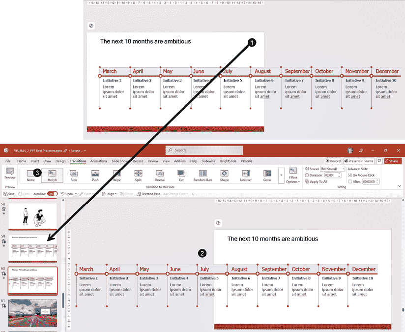

图 9.6 – 使用 Morph 创建动态时间轴

如果你还没有注意到，当你转到**文件 | 新建**时，Microsoft 提供的不仅仅是演示文稿模板。在这个例子中，只需在搜索框中输入`时间线`关键词。然后你可以选择一个你喜欢的来跟随这个例子。所有的时间线通常都是创建来适应幻灯片的。如果你选择的模板在幻灯片母版中有时间线，首先将其剪切并粘贴到幻灯片上。然后确保复制幻灯片内容，以便时间线可以延伸到画布/幻灯片外的灰色区域。

让我们看看你如何使用时间线来复制这个效果：

+   确保整个时间线都在幻灯片上（**1**）。确保它足够大，以便你的文本易于阅读。根据需要将其扩展到幻灯片的右侧。然后使用*Ctrl* + *D*复制你的幻灯片。

+   将你的时间线向左移动，以便在第二幻灯片上获得剩余内容的最终位置（**2**）。为了帮助你看到整个时间线，你可以从幻灯片中缩小视图 - 一个快速快捷键是使用*Ctrl* + 鼠标滚轮。

+   将**Morph**转换应用到幻灯片上（**3**）。

下次你需要时间线时，没有必要试图将所有内容都放在一张幻灯片上。尽量让它尽可能大，并使用**Morph**。当你保持相同的标题时，你的观众只会看到时间线的无缝移动。如果你的时间线或流程非常长，它可以被多次使用。只需从最后一页开始重新开始流程，并将对象移动第二次。我也有使用这个技巧来展示一个非常长的网页，给我的观众一种我正在从顶部滚动到底部的错觉。

**Morph**也可以非常有用，用于创建缩放效果，这是下一节的主题。

## 使用 Morph 创建运动和缩放效果

由于到达**Morph**转换的步骤已经在前面的章节中描述过了，所以我们在这里将重点放在画布和幻灯片缩略图上，以使用图像创建缩放效果。我建议你在阅读时尝试 PowerPoint 中的步骤。

我选择的例子包括一张道路和三个路标的图片。**Morph**转换将被用来创造一种错觉，即我们在道路上行驶，并在前进的过程中看到三个标志。创意内容来自**Stock Images**。

### 创建第一个幻灯片

首先将你的图像插入到幻灯片中，确保它与幻灯片大小相同。如果**设计师**给你一个图像填充幻灯片的设计想法，请使用它。在*图 9.7*中，你有创建缩放效果所需的各种组件：

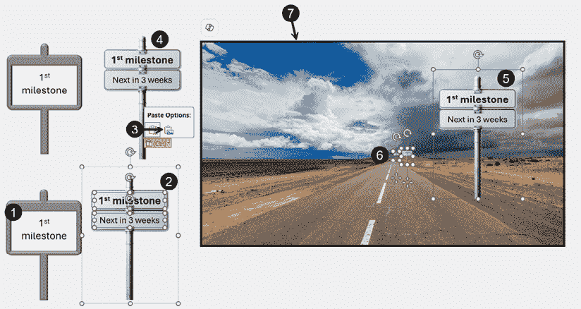

图 9.7 – 使用图像创建 Morph 缩放效果的第一个幻灯片

+   在 **图标** 中搜索与示例中使用的路标相似的图标（**图 9.7* 中的 **1**）。您可以将原始的黑色颜色改为浅灰色，并使用斜面效果，使其模仿真实的路标结构。我添加了一个白色矩形，以便文本可以在图像上可见。

要给图标添加斜面效果，您首先需要在插入后右键单击它并选择转换为形状选项。

+   或者，您可以使用 Copilot 的聊天面板创建您的标志（**2**）并在其上方添加一个文本框。在我的例子中，我添加了两个并将文本框与图像分组。

如果您拥有 Copilot 许可证或拥有带有 **Designer** 的免费 Microsoft 账户，您可以尝试创建您的路标。您可以使用如下提示作为起点：“创建一个路标，其柱子为金属灰色，并有一个矩形白色空间，我可以在其上叠加内容”。然后要求它根据您的需求改进图像。要求去除背景将为您提供没有繁忙背景的选项，但不会使背景透明。如果对比度良好，您可以使用 PowerPoint 中的 **去除背景** 工具或复制图像并将其粘贴到 Windows Paint 中——它现在有一个免费的 Copilot 功能，可以去除背景图像，效果出奇地好。

+   当我们需要调整对象以创建透视效果时，使用带文本的形状有一个很大的缺点：文本不会调整大小。因此，最好的做法是复制并粘贴路标和文本框（*Ctrl* + *C*，然后 *Ctrl* + *V*）并使用 **粘贴选项**（**3**）将对象转换成一张图片（**4**）。*注意*：在创建图像之前，别忘了为每个路标更改文本！

+   在重复之前的步骤创建三个带有自己文本的路标后，将更容易将图像放置在道路图片上（**5**）并调整它们的大小（**6**）以创建所需的透视效果。

+   确保在幻灯片上添加一个没有填充的矩形（**7**），这样您可以在下一步中轻松地看到其边缘。

现在第一个幻灯片已经创建，我们可以继续创建使用 **Morph** 的缩放效果。

### 使用第二和第三张幻灯片创建缩放效果

在创建第一个幻灯片后，我们可以开始使用 **Morph** 过渡创建移动和缩放效果。如前所述，最快的方法是使用 *Ctrl* + *D*（**1**）（*图 9.8*）复制幻灯片：

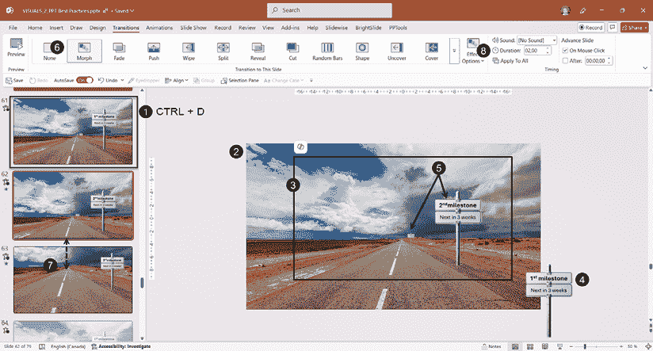

图 9.8 – 使用 Morph 创建移动和缩放效果

+   在您的第二个幻灯片中，现在您需要增加图片的大小（**2**），使其超出幻灯片区域。即使您在调整图片大小时可以看到幻灯片的边缘，一个没有填充的矩形（**3**）也成为一个很好的指南，帮助您移动和调整对象。

+   你可以将你的第一个路标以对角线方向移出幻灯片区域（**4**）以产生经过它的错觉。移动和调整其他两个路标的大小（**5**），使它们看起来在你靠近它们时在生长。将**变形**过渡应用到幻灯片（**6**）。默认应用**对象**效果选项。

+   重复之前的步骤以创建第三个幻灯片（**7**），确保当你查看幻灯片缩略图时，你的道路仍然与上一个幻灯片对齐。你可能需要将道路图片向上移动以使运动更逼真。

+   如果你需要创建快速动画，你可以更改**持续时间**组中的**变形**过渡的**持续时间**（**8**）。默认为`2,00`秒，适用于大多数需求。只需测试并调整以创建你想要的效果。

预览你的工作，并对任何可以改善运动或缩放效果的改变进行修改。当你满意时，确保移除没有填充的矩形，这样在幻灯片放映模式下你不会看到幻灯片边框。

你可以将这个例子应用于许多商业场景，例如在缩放进出的过程中展示一个大的计划。唯一的限制是你的创造力。下次当你难以将所有信息都放在一个幻灯片上，并且需要在仔细查看元素之间进行某种导航时，考虑尝试这个**变形**过渡技巧。

我不能不讨论**变形**所具有的令人兴奋的功能，即允许我们将一个对象变形为另一个对象——这是我们下一节的主题。

## 使用!!命名方案将一个对象变形为另一个对象。

微软内置了**变形**功能，使各种对象能够转换成其他对象。在本书编写时，以下是可转换的对象类型：

+   将一个形状转换为另一个形状，例如正方形变成圆形。

+   将包含不同文本的相同形状从一个幻灯片转换为另一个幻灯片。

+   变形两个不同的图像。

+   在任何两个相似的对象之间进行变形，例如一个表格变成另一个表格，或者一个 SmartArt 对象变成另一个 SmartArt 对象。它不适用于图表，尽管你可以调整系列的大小和颜色。

+   为了控制你的对象如何变形，引入了!!命名方案。由于我们正在讨论幻灯片对象的名称，你可能还记得我们在*第三章*中讨论了**选择面板**功能。我们现在将使用它将**变形**过渡提升到一个全新的水平。

我们将创建一个简单的幻灯片，其中包含一个矩形和一个椭圆形，它们将变形为更小的三角形和更大的五边形（*图 9.9*）：

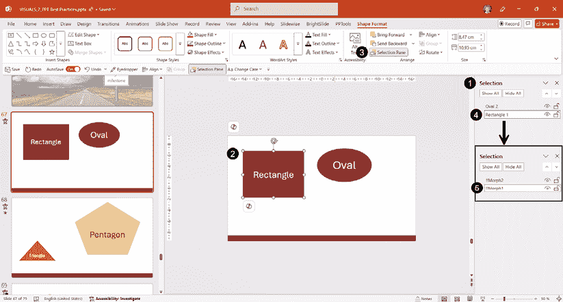

图 9.9 – 使用命名方案进行形状变形

+   创建两张幻灯片后，打开**选择**面板（**1**）。最简单的方法是选择一个形状（**2**），然后点击**形状格式**选项卡中的**选择面板**按钮（**3**）。除非你将其添加到**快速访问工具栏**中。

+   在形状的名称字段（**4**）上点击两次，首先输入两个感叹号（`!!`），然后给它起一个名字，例如`Morph1`（**5**）。无论你使用什么名字，都要保持简短且相关，因为我们还需要在下一张幻灯片上再次使用它。

在下一张幻灯片上，我们需要使用与上一张幻灯片相同的命名方案重命名对象，这样**形状变化**过渡就可以施展其魔法（*图 9.10*）：

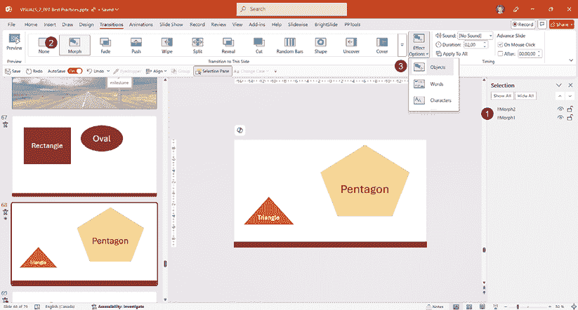

图 9.10 – 在第二张幻灯片上使用命名方案来变形对象

+   在我的例子中，三角形被重命名为`!!Morph1`，因此它从矩形形状变形，五边形被重命名为`!!Morph2`，因此它从椭圆形（**1**）变形。

+   完成后，将**形状变化**过渡（**2**）应用到幻灯片上，并随意使用效果选项（**3**）来使用字母创建你想要的效果。预览你的工作。

使该功能正常工作的唯一方法是确保对象的名称以`!!`开头，并确保你想要变形的两个对象的名称相同。同时，确保你的命名方案在幻灯片上是唯一的。例如，你不可能在同一个幻灯片上有两个名为`!!Shape`的对象——这就是为什么我通常将对象命名为`Morph1`、`Morph2`等等，这样可以直接在**选择**面板中看到哪些对象使用了**形状变化**。

当使用自定义形状或支持`!!`命名方案的 PowerPoint 版本时，还有其他元素需要考虑。你应该查看在*进一步阅读*中提到的 Microsoft 支持文章以获取更多详细信息。

**形状变化**过渡可能非常令人兴奋，但它可能不适合你在演示文稿中可能需要的每个动画运动需求。这时，了解高级动画序列可能是有帮助的，这正是我们下一节的主题。

# 使用高级动画序列

尽管本节的目的是讨论更高级的动画，但让我们先简要回顾一下**动画**选项卡（**1**）（*图 9.11*）：

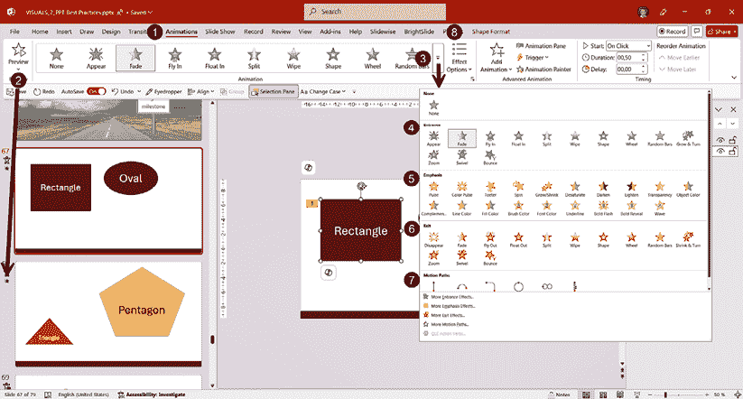

图 9.11 – 动画选项卡回顾

如果**动画**选项卡中的动画样式变灰，请确保选择幻灯片上的一个对象以使它们可用。

正如我们在本章第一节的**过渡**中看到的那样，你可以通过使用功能区上的**预览**按钮（*图 9.11*中的**2**）或点击幻灯片缩略图旁边的*星形图标*来预览幻灯片上的动画。点击**更多**箭头（**3**）将打开动画库，在那里你可以找到四类动画：

+   **进入**（**4**）：这应用了一个效果，使对象出现在幻灯片上

+   **强调**（**5**）：这将对幻灯片上的对象应用一个效果

+   **退出**（**6**）：这应用了一个效果，使对象从幻灯片中消失

+   **运动路径**（**7**）：这会移动幻灯片上已经存在的对象

在列表底部，当你点击其中一个链接时，你会找到完整的效果和路径列表。在你对一个对象应用动画后，你也可以通过使用**效果选项**按钮（**8**）来配置效果如何播放；可用的效果将取决于你选择的效果，就像幻灯片过渡的效果一样。

关于动画，我有一个大大的警告：仅仅因为有一长串效果列表，并不意味着你应该在一张幻灯片上使用它们所有。任何动画都应该在理解你的内容或帮助你一步一步描述复杂过程时带来价值，同时你正在讲话。你应该始终有目的地进行动画。

正如我们提到的关于明智地使用过渡，你可能会在接下来的职业生涯中用没有动画或简单的淡入淡出效果来创建所有的商业演示。如果你在创建每张幻灯片只传达一个想法的内容方面做得很好，没有人会抱怨。

话虽如此，有时使用动画是一个明智的选择，可以帮助我们的观众更好地理解我们的概念和想法。让我们看看我们如何结合动画并使用下一节中的**动画面板**选项。

## 使用动画面板选项回顾动画基础

我们之前讨论了**选择面板**如何帮助你查看和重命名所有幻灯片对象 – **动画面板**有类似的功能，但针对幻灯片上的所有动画。为了介绍更复杂的动画并学习如何使用**动画面板**（**1**），让我们从一个简单的**SmartArt**对象（**2**）开始，该对象添加了一个**淡入**进入动画（**3**）（*图 9.12*）：

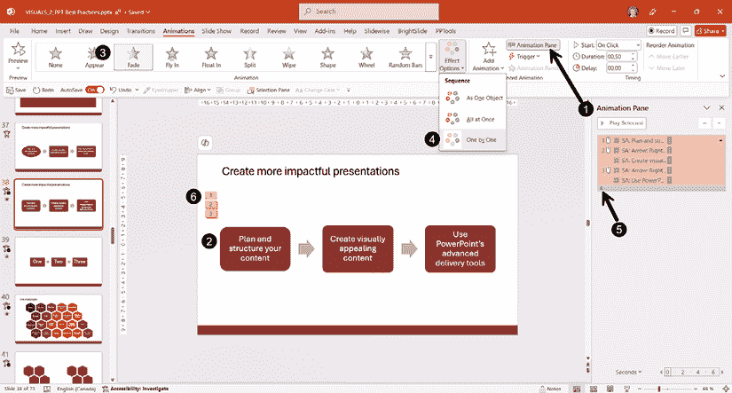

图 9.12 – 在动画面板中带有淡入效果的 SmartArt 动画

选择的效果选项是**逐个**（**4**），在动画面板中，点击了小的**点击展开/隐藏内容**箭头（**5**）以展开应用于 SmartArt 对象的动画列表。使用**逐个**效果创建了一个三步动画序列，如动画面板中列出并显示在 SmartArt 对象旁边的编号矩形（**6**）所示。

在对动画序列进行更改之前，让我们简要回顾一下我们可用的**计时**选项（*图 9.13*）：

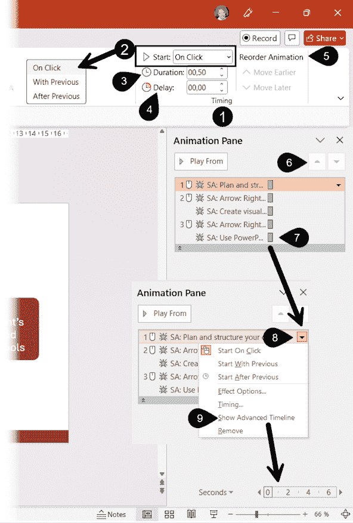

图 9.13 – 动画开始选项定义

在**计时**组（**1**）中，我们首先有的选项是如何开始动画（**2**），这里有三种选择：

+   **点击开始**：当你点击鼠标、使用键盘或遥控器来推进你的演示时，对象的动画将开始（进入、强调、退出或路径）

+   **与上一个动画同时开始**：对象的动画与上一个动画同时开始，无需再次点击

+   **在上一个动画之后开始**：对象的动画在之前的动画结束后立即开始，无需再次点击

**持续时间**选项（**3**）与之前讨论的幻灯片切换效果相同，意味着你可以根据预期的效果将其设置得更短或更长。**延迟**选项（**4**）允许你在动画开始前添加一个延迟时间。我建议不要与**点击开始**一起使用，因为这会让你在演示过程中觉得你的点击没有起作用。但与其他两个选项一起使用时，它可以用来创建连续的运动。

**重新排序动画**子组（**5**）可以帮助你改变动画的顺序，其效果与动画窗格中的**小箭头**（**6**）相同。由于我们例子中的对象是 SmartArt 对象，因此无法重新排序动画。动画的持续时间也会在动画窗格中用**高级时间轴**标记（**7**）显示；每个矩形都显示了开始和结束时间。如果你看不到时间轴，可以右键单击其中一个动画，或者单击其右侧的箭头（**8**）并选择**显示高级时间轴**（**9**）。

现在我们已经回顾了一些重要功能，让我们继续修改并添加我们的 SmartArt 示例动画。

## 修改现有动画和创建高级序列

当我们将**淡入**动画应用到 SmartArt 对象上时，PowerPoint 会将相同的动画效果应用到其所有组件上。在我们的例子中，从左到右创建一个动画序列会更好，这样可以帮助观众理解整个过程。如果箭头在每个矩形之后出现，这将使运动看起来更加自然。

许多人可能会倾向于在幻灯片上的所有对象上只使用**点击开始**动画。虽然这确实可行，但我看到许多演讲者忘记他们用来动画幻灯片的点击次数，然后被他们的内容交付所分散。让我们看看一种更好的方法来创建序列，同时减少点击次数（*图 9.14*）：

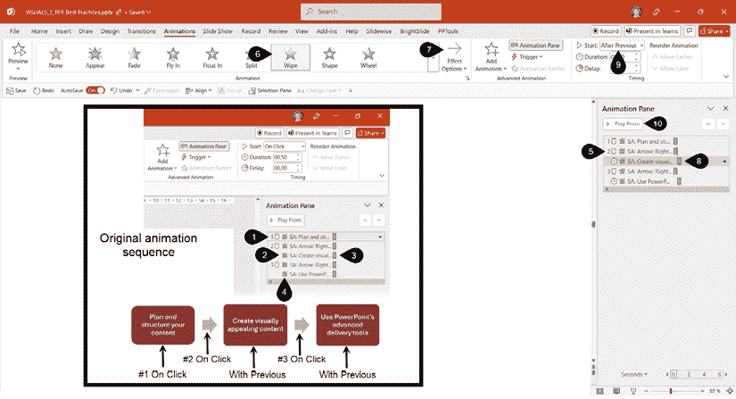

图 9.14 – 创建高级动画序列

在原始动画序列（*图 9.14*中的叠加矩形）中，我们看到**点击**动画，由**鼠标图标**（**1**）表示，以及**与上一事件**（**2**）动画；在动画面板中确认此选项的唯一视觉线索是右侧显示与上一个对象相同开始时间的**时间标记**（**3**）。**星形图标**（**4**）表示应用于每个对象的动画效果。您还可以将鼠标悬停在每个动画上以获取包含完整信息的工具提示。

要为 SmartArt 重现从左到右的动画过程，我们必须修改动画效果及其开始方式。以下是您需要执行的操作：

+   点击第二个动画（**5**），它应用于第一个箭头，并通过在图库中点击将其更改为**擦除**效果（**6**）。在**效果选项**（**7**）中，选择**从左**。

+   点击第三个动画（**8**），它应用于第二个矩形，并将**开始**选项更改为**上一事件后**（**9**）——这将在左侧添加一个**时钟图标**。

+   重复前面的步骤，以便第二个箭头和第三个矩形获得相同的最终动画。

+   要测试您的动画序列，请选择列表中的第一个动画，并点击**从**按钮（**10**）。

在这个 SmartArt 示例中您所学的所有内容都可以应用于您想要在幻灯片上动画化的任何对象。在您感到舒适地创建自然且看起来专业的序列之前，需要练习。我的建议是首先想象您的动画序列应该是什么样子，甚至将其写下来。就像在 PowerPoint 之外规划演示可以帮助我们的演示更具影响力一样，规划动画可以节省我们很多时间。

现在我们来看看如何为我们的 SmartArt 示例添加一些强调动画，以便当新对象出现在幻灯片上时，每个组件都会变为灰色。

## 向已动画化的对象添加新动画

当您在幻灯片对象上使用多个动画时，可以创建很好的效果，但如果您没有很好地组织，可能会很棘手。如果您决定创建一个更复杂的动画序列，您应该做的第一件事是像本章前面所看到的那样，在**选择**面板中重命名您的幻灯片对象。不幸的是，当使用 SmartArt（如我们的示例所示）时，您只能重命名整个对象，而不是其组件。如果您正在使用 SmartArt 示例进行下一步，我建议您将对象重命名为简短的名字，例如`SA`，这是*SmartArt*的首字母缩写。

当我们为 SmartArt 自定义动画时，将显示**多个**动画按钮（**1**）。如果我们想添加额外的动画，我们需要点击**添加动画**按钮（**2**）。选择**强调**动画，如**去饱和**（**3**），将帮助我们一旦移动到第二个形状（*图 9.15*），就创建出一种褪色效果：

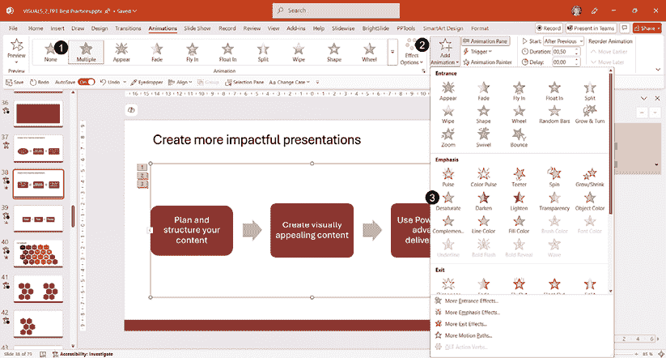

图 9.15 – 向动画 SmartArt 对象添加新动画

应用附加动画后，它将添加到动画窗格中（**1**），我们需要点击**展开内容**箭头（**2**）以查看每个添加的动画（*图 9.16*）：

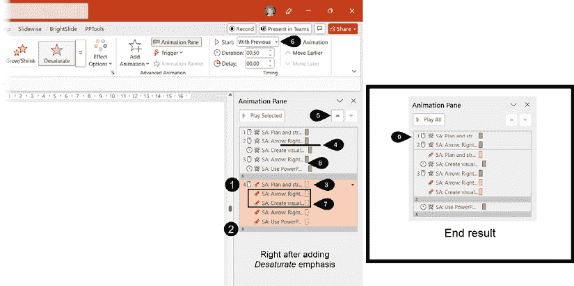

图 9.16 – 在时间轴中排序新动画

如我们所见，一个**强调**动画被添加到 SmartArt 对象的全部组件中。如果我们将它们留在实际序列中，颜色变化将在第一个序列之后发生，使所有形状变成灰色。我们想要的是在点击以进行第二个动画后立即开始强调。以下是我们将如何实现这一点：

+   点击第一个强调动画（**3**）。名称**SA: 计划和…**与顶部的第一个动画相同。这就是我们如何更容易地确定它将被移动到何处。

+   知道我们希望在点击以使第一个箭头和第二个矩形出现在幻灯片上时，第一个圆角矩形淡出，我们可以点击并拖动动画到第二个动画的下方（**4**），或者我们可以选择它并使用小箭头将其向上移动（**5**）。当它被移动时，您需要将动画的开始时间更改为**与上一个动画同时开始**（**6**），这样第一个矩形就会在箭头和第二个矩形出现时淡出。

+   在第三次点击时，我们希望第一个箭头和第二个矩形淡出，因此我们需要将第二个和第三个强调动画（**7**）移动到动画窗格中第三个**点击**动画的下方（**8**）。您不需要更改这些动画的开始时间，因为它们已经设置为**与上一个动画同时开始**。

+   剩下两个强调动画。您可以简单地选择并删除它们。

+   您可以通过前一个图中的右侧的最终结果的可视化（**9**）验证您的时间轴，并预览您的动画序列。

您可能会觉得所有这些步骤让人感到不知所措，这是正常的！如果您是第一次尝试动画，动画 SmartArt 对象可能是一项相当具有挑战性的任务。但我也觉得这是一个很好的复杂示例，它也会帮助您通过其他类型对象的任何简单动画需求。最好的做法是首先规划您的动画和复杂序列，然后尝试使用简单形状来创建它们，以帮助您练习。

当然，您还可以进行许多其他的动画组合。如果您想知道为什么我没有讨论运动路径，那是因为 M365、Office 2024 和 Office 2021 用户有一个更简单的方法来创建运动，即使用**形状变化**过渡，正如我们在前面的部分所讨论的。如果您使用的是较旧版本，您应该查看“进一步阅读”部分中关于运动路径的 Microsoft 支持文章。

既然我们已经讨论了动画的工作原理，你可能想知道是否有方法可以在需要时显示内容，当你选择显示时，而不是将其包含在动画序列中。这正是我们将在下一节关于触发器的讨论中要讨论的内容。

# 使用触发器进行按需动画

在您的演示文稿中使用触发器可以让您完全控制您要显示的内容以及何时显示。例如，我在我的演示文稿中使用触发器来讨论颜色的含义，我可以一次显示一个含义，没有特定的顺序。我只需在幻灯片模式下点击其中一个形状，就可以显示或隐藏一个定义（*图 9.17*）：

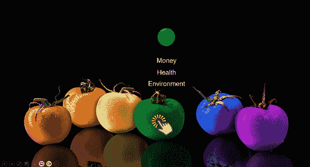

图 9.17 – 触发器如何用于显示颜色含义列表的示例

 **快速提示**：需要查看此图像的高分辨率版本？请在下一代 Packt Reader 中打开此书或在其 PDF/ePub 版本中查看。

 **下一代 Packt Reader** 随本书免费赠送。扫描二维码或访问 [`packtpub.com/unlock`](https://packtpub.com/unlock)，然后使用搜索栏通过名称查找此书。请仔细检查显示的版本，以确保您得到正确的版本。

由于在黑白书中讨论颜色不太方便，我们将在下一节中创建一个使用形状的简单示例。

## 使用触发器与形状和图像结合

为了帮助您跟随这种技术，您应该创建一个包含三个标记为 **事件 1**、**事件 2** 和 **事件 3**（**1**） 的形状的幻灯片，并添加三个用于描绘每个事件的图片（**2**）。然后，确保您打开 **选择** 面板（**3**）（*图 9.18*）：

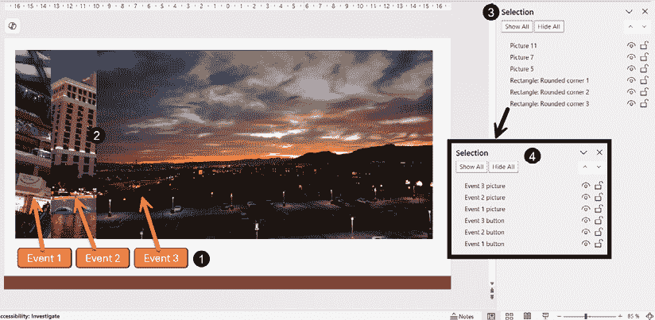

图 9.18 – 使用选择面板创建包含三个事件按钮和三个图像的幻灯片

为了使您对触发器的使用更简单，您需要重命名所有对象，这样您就可以轻松地识别 **事件 1**、**事件 2** 和 **事件 3**（**4**） 的按钮和图片。请相信我，您以后会感谢我的。

在重命名它们之后，您可以通过使用触发器来对图片进行动画处理。在添加动画之前，选择所有图片可以快速同时为三张图片添加 **淡入** 动画（*图 9.19*）：

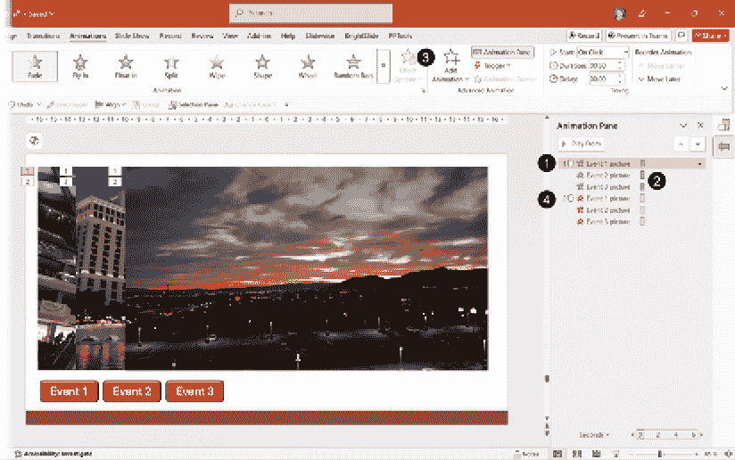

图 9.19 – 在使用触发器之前对图片应用进入和退出淡入淡出动画

这将创建第一个动画，**点击时**（**1**），然后是其他两个**从上一个开始**（**2**）。使用**添加动画**按钮（**3**）将**退出淡出**添加到所有三张图片，这样你就有了一组动画在动画窗格（**4**）中。

我们希望的结果是能够点击**事件 1**按钮使第一张图片淡入并隐藏，当我们再次点击同一按钮时隐藏它。配置这种方法是通过在**动画窗格**（**1**）中选择第一张图片的进入和退出动画来实现的 – 进入动画的星号是绿色的，退出动画的星号是红色的（*图 9.20*）：

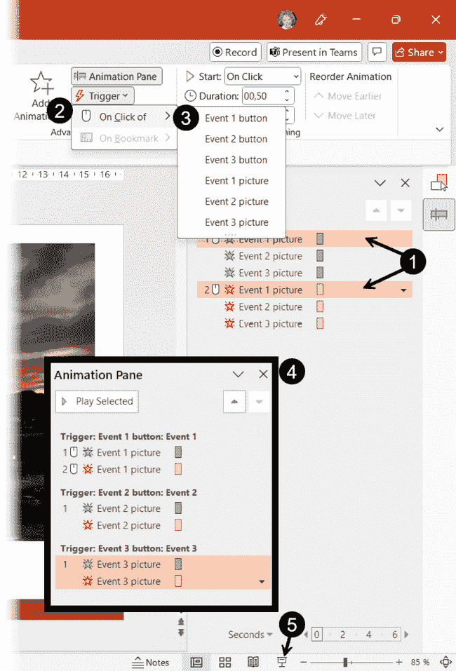

图 9.20 – 配置触发动画

+   点击**触发**按钮（**2**），然后在下拉列表中选择**点击时**，并从列表中选择**事件 1** **按钮**（**3**），因为我们希望点击此按钮时第一张图片能够进出动画。这就是为什么给对象重命名可以节省时间。你不必记住从哪个通用名称中选择。

+   对第二张和第三张图片重复相同的步骤。

+   当你完成时，动画窗格现在将有三组触发动画（**4**）。它们被标识为*触发：我们点击的对象名称：被动画化的对象名称*。只需确保将它们的动画更改为所有都**点击时**开始。

+   将图片对齐到相同的位置，并通过使用状态栏中的**幻灯片放映**按钮（**6**），或按键盘上的*Shift* + *F5*来启动实际幻灯片上的幻灯片放映。按键盘上的*Esc*键退出幻灯片放映。

现在，你已经配置了你的第一个触发动画。它们在商业演示中可以以多种方式使用，例如，可以按需显示隐藏的图形，或者可以按需一次只显示幻灯片的一部分。触发器还可以与视频书签一起使用，这将是本章下一节最后讨论的主题。

## 使用视频书签与触发器

在*第八章*中，我们提到我们可以向视频添加书签。现在，是时候看看我们如何使用它们在视频的特定时刻在幻灯片上动画化对象了。

在*图 9.21*中，我们看到一个插入的视频（**1**）和一个带有**进入淡入**动画（**3**）的标注（**2**）。由于有暂停视频的选项，因此存在**触发：视频 5**（**4**）动画，并且当视频插入时自动添加：

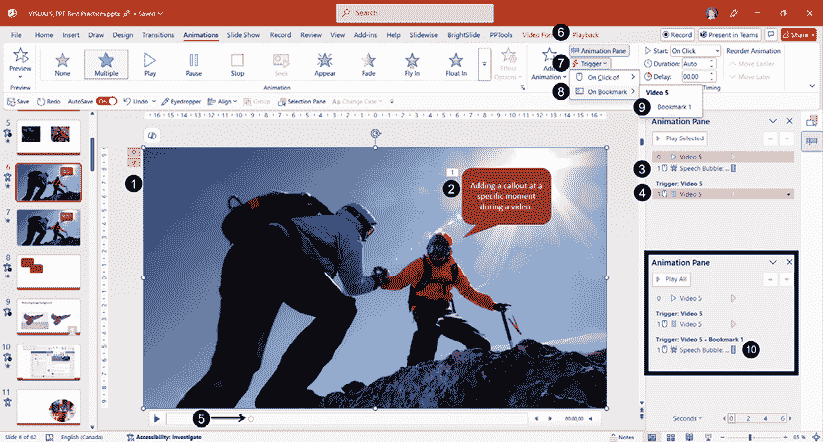

图 9.21 – 向视频书签上的标注添加触发动画

+   在**视频播放**选项卡（**6**）中，从视频中添加了一个书签（**5**），由播放工具上的圆圈表示。当你将鼠标光标悬停在书签上时，你会看到一个带有书签名称的工具提示。

+   要在视频播放时对书签处的调用动画进行动画处理，你需要选择调用动画，然后点击**触发器**（**7**）| **在书签上**（**8**）| **书签 1**（**9**）。

+   完成后，动画窗格将显示一个当视频达到书签时播放的调用动画的第二触发器（**10**）。

在商业环境中，你可以非常巧妙地使用这个功能。例如，你可以有一个展示你组织特定操作的视频，在视频的不同时刻添加并淡出调用动画。你只需要在使用它们作为触发器之前计划好如何放置书签在正确的位置。

# 摘要

在本章中，我们看到了如何明智地使用幻灯片转换，讨论了如何利用**Morph**转换在幻灯片之间创建各种类型的移动，并学习了如何使用高级动画时间轴创建复杂的动画序列或使用触发器来控制我们的动画。

如果你没有在尝试创建复杂序列之前计划好你想要达到的目标，使用动画可能会非常耗时。就像我们在本书中迄今为止涵盖的大多数主题一样，在创建动画时，你的前几次尝试将需要更多时间，尤其是更复杂的动画。记住，如果你不需要，使用简单的动画，或者根本不使用动画，是没有问题的。

我希望本章中的主题将为你的下一次演示打开新的可能性，帮助你决定它们是否可以帮助你更有效地讲述你的故事，同时帮助你的观众更长时间地记住你的内容。记住，尽管有许多动画效果可供选择，但你不必使用它们全部！

在下一章中，我们将讨论如何将更多灵活性和交互性融入你的演示文稿，以便你能够更多地吸引你的观众。能够让他们选择或展示你能够轻松导航整个内容是非常有影响力的。

# 进一步阅读

+   关于使用**Morph**转换的 Microsoft 支持文章：[`support.microsoft.com/en-us/office/use-the-morph-transition-in-powerpoint-8dd1c7b2-b935-44f5-a74c-741d8d9244ea`](https://support.microsoft.com/en-us/office/use-the-morph-transition-in-powerpoint-8dd1c7b2-b935-44f5-a74c-741d8d9244ea)

+   关于**Morph**技巧和窍门的 Microsoft 支持文章：[`support.microsoft.com/en-us/office/morph-transition-tips-and-tricks-bc7f48ff-f152-4ee8-9081-d3121788024f`](https://support.microsoft.com/en-us/office/morph-transition-tips-and-tricks-bc7f48ff-f152-4ee8-9081-d3121788024f)

+   微软支持关于动作路径的文章：[`support.microsoft.com/en-us/office/add-a-motion-path-animation-effect-f3174300-0d24-4671-a1c2-e286b41efba6`](https://support.microsoft.com/en-us/office/add-a-motion-path-animation-effect-f3174300-0d24-4671-a1c2-e286b41efba6)

|

#### 现在解锁此书的独家优惠

扫描此二维码或访问 [`packtpub.com/unlock`](https://packtpub.com/unlock)，然后通过书名搜索此书。 |  |

| **注意** *：开始之前，请准备好您的购买发票。* |
| --- |
