# 第十一章：使用 PowerPoint 第三方外加组件

到目前为止，你可能已经意识到 PowerPoint 已经成为一个非常强大的创意应用。它拥有符合大多数创作者需求的功能和工具，但如果你对 PowerPoint 的使用变得密集，你可能会发现一些工作流程可以改进，以使你的日子更加高效。这就是你可以考虑使用第三方外加组件的时候。如果你是大型组织的一部分，在安装任何外加组件之前，请确保与你的 IT 部门联系。一些 IT 设置会阻止第三方安装。

市面上有大量的 PowerPoint 外加组件——其中一些是免费的，而另一些则需要购买。当我反思我应该包括哪些外加组件在本章中时，我决定以信任和安全作为我的标准。我想确保开发者是值得信赖的，并且他们的外加组件对您的电脑是安全的。

因此，本章中建议的所有外加组件都是我认识的人——我甚至在他们现实生活中见过！他们没有付钱让我谈论他们的产品，但他们确实给了我一个许可证或与我分享了他们付费产品的某些视觉元素，而这些产品我之前并没有使用。我知道他们的产品在演示设计行业中非常受欢迎。我选择在本章中介绍的外加组件创作者如下：

+   BrightCarbon

+   Neuxpower

+   Billion Dollar Graphics

+   PPTools

# 技术要求

本章中介绍的外加组件已知与许多 Windows 和 macOS 桌面版本的 PowerPoint 兼容。我建议您访问开发者的网站以获取更多兼容性详情（见*进一步阅读*）。请注意，由于 PowerPoint 的订阅版本持续更新，因此本章中显示的截图可能与您的应用程序版本不同。

# BrightCarbon

BrightCarbon 是一家成立于英国，在英国设有曼彻斯特、布里斯托尔和伦敦办公室，在美国设有波士顿办公室的演示和电子学习机构。我在多次参加演示峰会时见过其总监 Richard Goring 和主要技术顾问 Jamie Garroch——我们都是作为专注于 PowerPoint 和其他 M365 应用的 Microsoft MVP，在我们的社区中努力做出贡献。

他们有以下两个产品可以帮助个人、团队和公司，接下来章节将进行讨论：

+   **BrightSlide**是一个免费外加组件，帮助你提高生产力

+   **BrandIn**是一个付费外加组件，帮助组织创建符合品牌内容

## 使用 BrightSlide（免费）

这个插件最初是为了帮助 BrightCarbon 设计师使他们的设计工作流程更加高效而创建的，添加了用户需要的快捷键和功能，但这些功能在 PowerPoint 中不可用。他们的第一个核心价值观是“*分享我们的知识和时间*”，因此他们很快决定将他们宝贵的插件与世界分享。不用说，我们的行业专家迅速将消息传播给所有演示文稿创建者和设计师。您可以通过提供的链接在他们的产品页面找到 BrightSlide。

BrightSlide 插件可能被选为我们行业中免费提供的最完整的工具。它包含九个工具类别，每个类别都包含许多功能。在撰写本书时，该插件已超过 60 个不同的功能，用于提高您的工作流程和生产力。当您尝试使用 BrightSlide 时，这可能会不同，因为 Jamie 和 BrightCarbon 产品团队会根据设计师或插件用户的需求定期添加功能。

要使用 BrightSlide，首先，您需要从产品页面（[`www.brightcarbon.com/products/`](https://www.brightcarbon.com/products/)）下载 Windows 或 macOS 安装程序，并在您的计算机上安装它。当您打开 PowerPoint 应用程序时，您将看到一个新的**BrightSlide**（**1**）选项卡（*图 11.1*）：

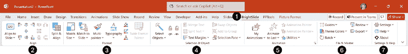

图 11.1 – PowerPoint 中的 BrightSlide 插件选项卡

让我们探索您在新选项卡中会发现的主要功能类别：

+   **对齐**（**2**）：这个类别包含了一些工具，可以为您提供更多控制和选项来对齐您的幻灯片对象，而不仅仅是 PowerPoint 中标准对齐工具所能提供的。例如，您只需点击几下就可以创建一个形状网格。您甚至可以选择将对象对齐到第一个或最后一个选定的对象。

+   **格式**（**3**）：这个类别中的工具将帮助您一次性编辑多个对象或复制复杂的格式。这个类别可以帮助您将大小、位置、格式、调整和动画从一个对象复制到任何其他对象。

+   **选择与对象**（**4**）：这个类别旨在使您的生活更加便捷。根据特定的特征选择对象，例如填充或轮廓颜色，隐藏或显示幻灯片对象而无需滚动到您的**选择**面板，以及交换对象，这只是这个组中的一些亮点。您激动了吗？

+   **动画**（**5**）：这个类别中的工具在尝试重新创建复杂动画时可以为您节省大量时间。您可以使用 BrightSlide 的一些起始序列，或者将您自己的添加到库中。

+   **文件与母版**（**6**）：这个类别包含许多工具，可以帮助您设置模板，例如设置参考线、编辑您的主题颜色、设置自定义颜色、批量分配布局、比较多个演示文稿等等。这些功能可以处理大多数重复性任务。

+   **设置 & 帮助**（**7**）：在这里您可以找到功能区添加自定义选项和快捷键。您还可以访问两个功能子类别：

    +   **设置** – 被动功能：这些功能不会出现在功能区中，并且会修改默认的 PowerPoint 行为，您可以选择开启或关闭它们。例如，在复制幻灯片时可以复制注释，或者一次性调整多行的大小。

    +   **帮助** – 上下文工具：当您在幻灯片对象（如表格或线条）上右键单击时，这些工具将变得可用，允许您在演示文稿中移动部分内容，并轻松检查文本和填充颜色之间的对比度。

如果您想了解完整的详细信息，他们网站上有一个**帮助**部分，列出了功能及其描述，但我将分享一些我知道的工具，即使是兼职演示文稿设计师也应该使用这些工具来节省时间。为了帮助您找到它们，我将在以下子节中引用功能区上的组名。

### 对齐组

这个组有如此多的对齐功能，以至于几乎不可能在它们之间做出选择。我最终选择了三个我认为特别有趣的功能，以帮助您快速将多个对象叠加在一起，一个压一个，将它们分布到网格中，或者创建一个新的网格。

第一个功能帮助我们叠加所有选定的对象，并命名为**对齐对象中心与中间**（**1**）（*图 11.2*）：

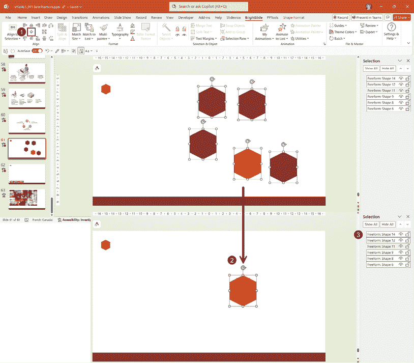

图 11.2 – 对齐组中的“对齐对象中心与中间”功能

在选择多个对象（以我们的例子中的六边形为例）后，只需在功能区中单击该功能，就可以一次性将所有对象叠加（**2**）。正如您在**选择**面板（**3**）中可以看到的，所有形状都出现在幻灯片上。您可以使用这种类型的对齐方式来制作动画，每次只显示一个形状，始终保持在同一位置。

现在，让我们在幻灯片上使用六个没有特定对齐方式的散布六边形，并使用这次的对齐组中的**分布到网格**工具（**1**）。BrightSlide 将对齐并分布它们（**2**），并打开**分布到网格**对话框（**3**），在其中您可以调整网格（*图 11.3*）：

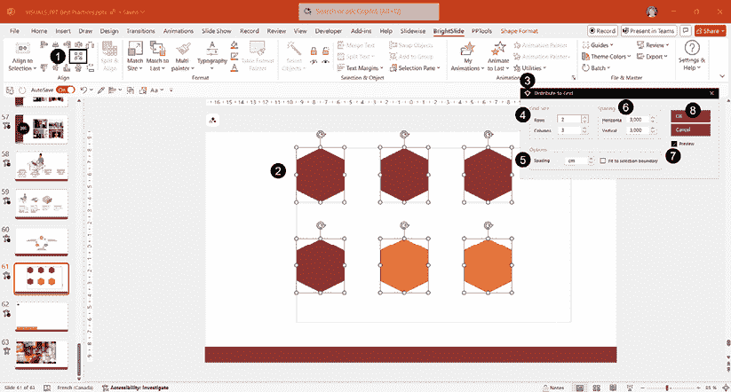

图 11.3 – 对齐组中的“分布到网格”功能

您可以调整**行数**和**列数**（**4**），设置**间距**单位（**5**）为英寸、厘米或像素，并调整幻灯片对象之间的**水平**和**垂直**间距（**6**）。**预览**复选框（**7**）默认选中，在点击**确定**按钮（**8**）确认选择之前查看您的网格外观非常有帮助。在撰写此章节时，此功能只能用于相同大小的对象。

尽管 PowerPoint 的**智能参考线**工具已经帮助我在网格上对齐和分布形状很长时间了，但这个 BrightSlide 功能每天可以节省很多点击，使其更加高效。

我想要向您展示的**对齐**组的第三个功能要求您从幻灯片上的单个对象或一组对象开始（**1**）并使用**分割与对齐**功能（**2**）（*图 11.4*）：

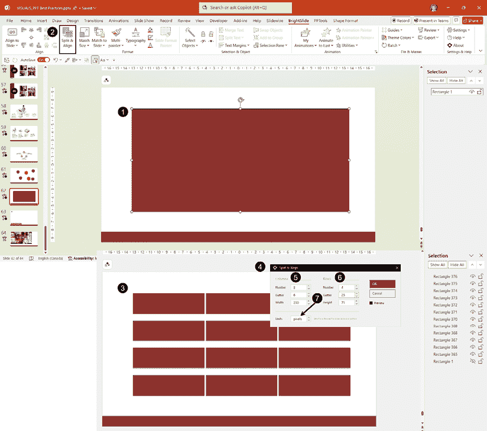

图 11.4 – 对齐组中的分割与对齐功能

此功能创建了一个由大小均匀且间隔均匀的组或选定对象的副本组成的网格。在我的例子中，它创建了一个大小均匀且间隔均匀的矩形网格（**3**），同时打开**分割与对齐**对话框（**4**）。您可以根据需要调整**列**（**5**）和**行**（**6**）的设置。您看到的**间距**（对象之间的间隔）、**宽度**和**高度**（**7**）的数字受您为**单位**选择的设置的影响。在测试此功能时，我发现使用英寸或厘米不如使用像素灵活，像素是更小的单位。我最好的建议是在第一次尝试时进行几次测试。这将是一次明智的投资，因为 BrightSlide 会记住您之前的设置，并在您下次使用**分割与对齐**功能时使用它们。

**对齐**组中提供了许多更多功能。要了解哪些功能对您的演示文稿工作类型有用，最好的方法是尝试使用它们，或者至少查看 BrightSlide 网站上的**帮助**部分。

### **格式**组

此类别也有一个很棒的特性列表可供使用，但由于空间有限，我只想指出**匹配大小**功能（**1**），它允许您通过单次点击快速将幻灯片上选定的对象（或两个中的任意一个）的**宽度**和**高度**设置为相同（**2**）（*图 11.5*）：

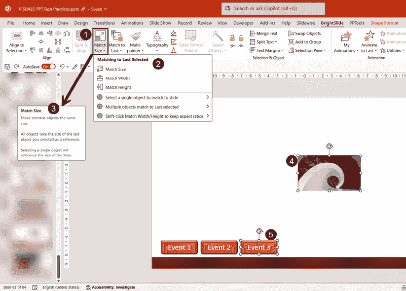

图 11.5 – 格式组中的匹配大小功能

为了确保您获得期望的结果，当您将鼠标悬停在功能按钮上时（**3**），请注意提示信息。正如我们所见，仅选择一个对象将参考幻灯片的尺寸——想象一下您能多快地裁剪并制作一个全幻灯片图像！

默认情况下，最后选定的对象成为之后创建的任何对象的尺寸参考。在我的例子中，如果我先选择图像（**4**）然后选择**事件 3**按钮（**5**），**匹配大小**功能将使图像与动作按钮大小相同。请注意，使用此功能调整大小的图像将被扭曲，而不是裁剪以适应大小，并且将保持相同的**宽高比**。

### **选择**与**对象**和**动画**组

这两个类别充满了所有设计师都可以利用的生产力工具。为了节省空间，我将只对几个功能给出一个高级定义，以便您了解它们可能有多么强大（*图 11.6*）：

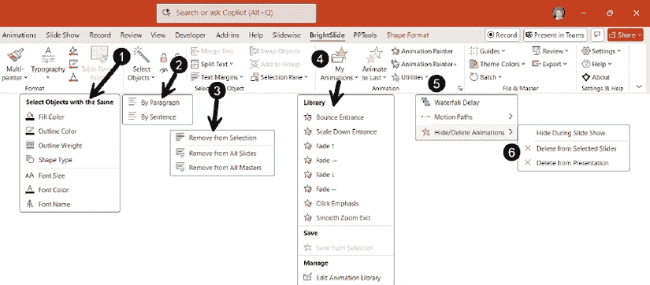

图 11.6 – 选择对象和动画组的高亮

+   **选择对象** ( **1** )：此功能允许根据某种格式样式选择幻灯片上的所有对象，这样您可以轻松地一次性更改它们的格式。

+   **拆分文本** ( **2** )：此功能允许您通过段落或句子将文本内容拆分为多个对象。

+   **文本边距** ( **3** )：此功能允许您一键删除所有文本边距。无论您只想修复一个对象，还是所有幻灯片上的对象，或者是母版上的对象，都能满足您的需求。

+   **我的动画** ( **4** )：此功能允许您保存并重复使用自己的动画库。在为对象创建复杂的动画方案后，您可以将其从所选对象保存下来以供将来使用。

+   **实用工具** ( **5** )：在这个列表中，您将找到创建瀑布延迟、更有效地管理运动路径以及删除所选幻灯片或演示文稿中所有动画的功能（**6**）。当您意识到动画是从各种来源被引入您的演示文稿时，最后一个功能可以节省大量时间。

了解这些功能的最佳方式是通过在您的演示文稿文件中尝试它们。花时间阅读在功能上悬停时出现的工具提示也会对您有很大帮助。

### 文件和母版组

尽管文件和母版组可能不像其他组那样有趣，但我必须说，这是我找到的一些我最珍视的功能的地方，这些功能适合我从事的工作类型。

我将突出显示对我非常有用的那些（*图 11.7*）：

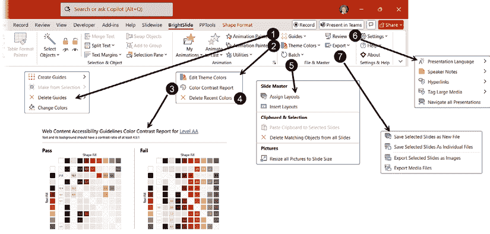

图 11.7 – 文件和母版组的高亮

+   **参考线** ( **1** )：当我收到带有太多参考线的文件，或者当我创建临时参考线时，**删除参考线**功能可以节省大量宝贵的时间。我们可以用它来选择我们想要删除的参考线（母版、布局或正常视图），或者删除所有参考线。

+   **主题颜色** ( **2** )：在这个列表中，我最常用的两个功能是：

    +   **颜色对比报告** ( **3** ) 创建一个新的幻灯片，允许我根据形状填充评估文本对比度可访问性。

    +   **删除最近颜色**功能（**4**）从最近列表中删除所有颜色样本。在测试一些非品牌颜色或清理模板文件以发送给客户之前，这非常有价值。

+   **批量**（**5**）：此列表中的每个功能都很宝贵。我特别喜欢的是当你必须处理复杂演示文稿时，布局被误用的情况，即**分配布局**。从 *一个* 窗口中，你将能够更改文件中的任何幻灯片的母版或布局。然而，这意味着你必须熟悉母版和布局使用的名称。你仍然可以在做出任何更改之前通过幻灯片导航来查看它们的内容。

+   **审查**（**6**）：此列表中的两个功能特别有价值：

    +   而不是试图绝望地使用 PowerPoint 的原生工具更改文件的语言，有时效果可疑，我使用 **演示文稿语言**。只需 *一个* 点击，它就会更改 *整个* 演示文稿的语言。

    +   至于 **演讲者备注**，它允许你为所有演讲者备注获得可靠的字数统计，并且可以一键删除所有备注。

+   **导出**（**7**）：此列表中的功能解决了 PowerPoint 的一些重要缺失功能。从所选幻灯片中创建新的演示文稿文件可以节省大量时间。同样，将所选幻灯片导出为图像或导出演示文稿中的所有媒体文件也是如此。

BrightSlide 插件是任何使用 PowerPoint 创建视觉效果的宝藏。我最好的建议是下载此插件并尝试一下。你没有任何损失（它是免费的！），但你可以在效率和生产力方面获得很多收益。如果你想知道为什么 BrightCarbon 将此免费提供给所有用户，那是因为他们的公司文化，他们相信与社区分享。

让我们看看他们的 BrandIn 插件的概述，它帮助组织中的用户保持品牌一致性。

## 使用 BrandIn（免费增值和付费）

许多组织在保持品牌一致性方面感到困难。大多数情况下，他们已经投资于创建一个使用公司颜色的品牌 PowerPoint 模板，在示例幻灯片中提供图形元素，并使用一组标准布局进行规划——但用户往往没有足够的 PowerPoint 技能来正确地导航整个模板，或者没有时间阅读数十页的品牌指南。

正因如此，才创建了 BrandIn。它帮助组织提供对资产库的便捷访问，同时帮助用户保持品牌一致性，所有这些都在 PowerPoint 内完成。而且这里有一个巨大的好处：你可以在 PowerPoint 和 Word 中使用它，在 Windows、macOS 和在线上使用。

此插件解决了组织中许多最令人烦恼的演示文稿创建问题，例如以下问题：

+   用户浪费了数小时试图制作符合品牌规范的幻灯片，或者甚至只是寻找相关内容

+   用户添加了非品牌和/或受版权保护的图片，而不是来自品牌库的图片

+   存在着从其他演示文稿复制幻灯片、臃肿的模板和母版的问题

BrandIn 可在 Microsoft AppSource 商店找到，并且也可以从 **M365 管理中心** 向组织用户提供。许可模式是按年订阅，根据你拥有的用户数量付费，类似于 M365 许可证。提供不同级别的许可证，具有不同的功能集，包括一个为一到四人团队提供的免费计划。有关更多信息，请参阅 *进一步阅读* 部分，其中包含其网站的链接，并联系他们讨论您的许可需求。

如前所述，如果你无法访问 PowerPoint 或 Word 的 **首页** 选项卡中的 **添加组件** 商店，你可能需要从你的 IT 管理员那里获得支持以在你的组织中部署添加组件。部署后，有一些初始设置任务需要完成，以便 BrandIn 的魔法发挥作用：

1.  创建一个专门用于所有创意企业资产的新的 SharePoint 网站，并决定谁将负责内容维护。你也可以使用现有的网站或 **组织资产库**（**OAL**）。

1.  精选你的实际内容，并将其分类到以下类别中：`模板`、`幻灯片`、`图片`、`图标` 和 `图形`。

1.  在您的新 SharePoint 网站中为每个类别创建一个文档库，并将您整理好的内容添加到每个库中，按命名文件夹组织。

1.  在 BrandIn 中创建一个新的工作空间，并链接文档库。

如你或许已经意识到，你首先需要投入一些时间，这样你的团队能够节省大量的创作和设计时间，并保持品牌一致性，从而获得投资的最佳回报。

我可以说，最耗时的不是创建 SharePoint 网站和文档库，尤其是如果你并不真正关心拥有一个品牌网站的话——仅仅因为我已经很久没有这样做，这花了大约 15 分钟。最耗时的部分是收集你已有的内容，整理它们，以确保你只提供与你的品牌一致的内容，然后在 BrandIn 中连接库。当然，确保定期维护资产，以保持它们与品牌的一致性。我的建议是为这项任务指定你团队中的某个人。

在添加组件部署后，创建了一个工作空间，并连接了内容库，PowerPoint 中 **首页** 选项卡（**1**）的右侧将出现一个新的 **BrandIn** 按钮（*图 11.8*）：

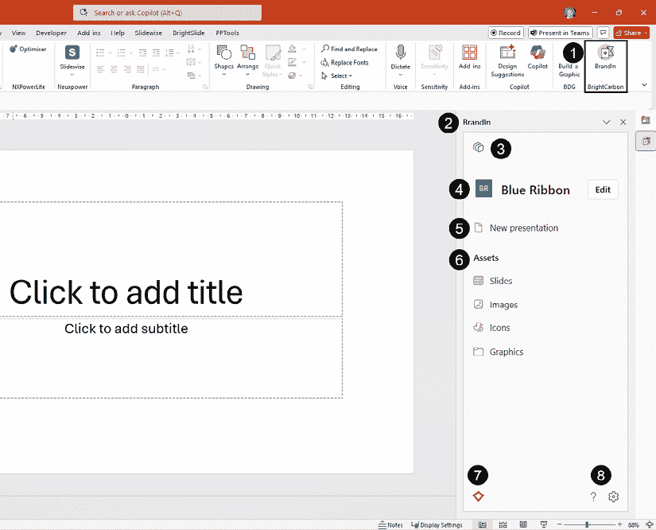

图 11.8 – PowerPoint 中的 BrandIn 按钮 和面板

点击按钮将打开 **BrandIn** 任务面板（**2**），用户将在此访问添加到 SharePoint 网站中的品牌资产。以下是此任务面板中工具的简要描述：

+   **工作空间与账户** 图标（**3**）：大多数计划允许创建最多两个工作空间，从而可以创建特定于品牌、团队或部门的资产库。企业计划提供无限的工作空间。

+   **工作区**（**4**）：您所在的工作区名称显示在任务面板的顶部。**编辑**按钮仅对 BrandIn 管理员可用。

+   **新建演示文稿**（**5**）：您可以直接从任务面板开始一个新的演示文稿，允许您选择添加到 SharePoint 网站的企业模板。如果可用多个模板，它们都将列出。这使得品牌管理员发布新模板并保持现有模板更新变得非常容易。

+   **资产**（**6**）：此部分允许在 SharePoint 网站上添加的各种资产类别之间进行选择。

+   BrightCarbon 网站访问（**7**）。

+   **知识库**、**支持**、**反馈**和**设置**（**8**）。

让我们看看您能多快从**BrandIn**任务面板（*图 11.9*）创建一个新的演示文稿：

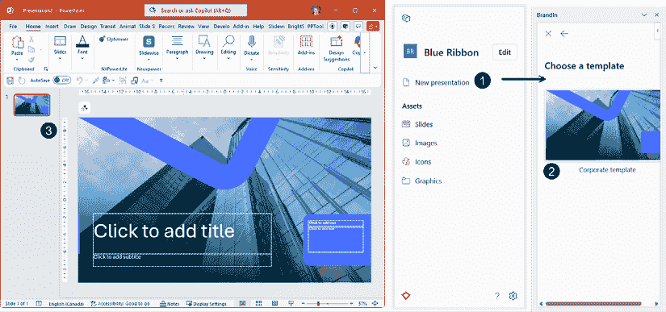

图 11.9 – 从 BrandIn 任务面板创建新的演示文稿

+   点击**新建演示文稿**选项（**1**），以便面板显示您组织的模板。

+   点击模板缩略图（**2**）。在这个例子中，只有一个模板。

+   您的新演示文稿文件已创建（**3**）。

剩下的唯一事情就是给您的文件命名并保存在适当的存储位置。考虑到通常需要多少次点击才能到达模板，这是一个简单且非常高效的过程。

添加幻灯片也是一个非常简单且直观的过程，*如果*您之前花时间创建了样本幻灯片并将它们添加到企业资产 SharePoint 网站上。

到这本书的这一版发布时，您应该能够访问新的添加功能，这些功能将帮助您自动化发布单个幻灯片作为单独资产的任务。BrightCarbon 开发团队始终在创新！这就是基于云的添加组件的美妙之处：您会不时看到新功能的出现，而无需手动更新添加组件。

再次，这是一个快速的过程（*图 11.10*）：

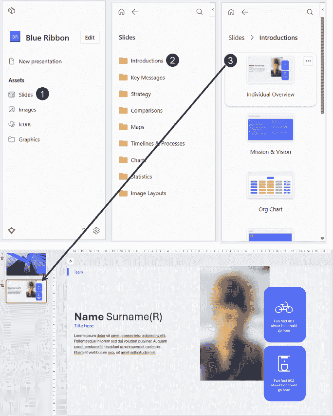

图 11.10 – 从 BrandIn 任务面板添加幻灯片

+   点击**幻灯片**（**1**）。

+   在**幻灯片**面板（**2**）中，选择一个符合您要添加的幻灯片主题的分类。这种文件夹结构应该是您设置资产库时的最佳实践之一，有助于用户更有效地找到内容。

+   在示例中，选择了**简介**分类（**3**），并列出了可供选择的样本文件。只需简单点击缩略图，即可将其添加到您的演示文稿文件中。

对于创建大量演示文稿的团队来说，BrandIn 可以是一个改变生活的解决方案，它可以帮助提升你的沟通能力，同时增强你的品牌形象，并节省大量时间。为了实现这一点，意味着你需要花时间创建足够的样本幻灯片，以便团队成员可以快速利用它们，而不是在空白幻灯片上创建文本框和形状。如果你在部署之前投入时间和精力，并且不断添加适合团队需求的内容，这个插件就像魔法一样有效。

添加其他资产的过程与之前的示例一样简单。当添加图片和图标时，如果存在兼容的空占位符，它们会出现在所选幻灯片上。添加图表和表格等图形内容时，会添加一个新的幻灯片。知道创建符合品牌风格的表格和图表有多令人沮丧，BrandIn 就是解决一次性创建它们并在几秒钟内重复使用的解决方案！

之前的示例应该给你一个关于 BrandIn 可以为你所在的组织做什么的想法。访问 BrightCarbon 网站的 产品页面 获取更多信息及定价。

如果你不确定是否要在第一天就承诺订阅，可以尝试免费增值计划几个月，看看你的内容工作流程可以变得多么高效，体验质量提升和品牌合规性的提升，并看看在这个过程中你可以节省多少时间和金钱。在我看来，这是一个可以帮助你在组织中花更多时间在其他高价值任务上的投资。你可以从免费计划开始，在你的组织中用一小部分人测试这个插件。我确信他们会像我一样兴奋，并推动整个团队部署。

我想要向 BrightCarbon 团队表示所有我的感激之情，因为他们允许我使用他们的演示资产。作为一个通常为他人创建内容的两人公司，我没有自己的资产库。但这一切即将改变！

现在让我们进入下一节，介绍 Neuxpower 的另外两个插件。

# Neuxpower

**Neuxpower** 团队已经开发了超过 25 年的软件——而且我有幸认识了老板 Mike Power，已经超过 18 年了！

他的团队热衷于开发高质量、有帮助的软件工具。Neuxpower 有一个创新的 PowerPoint 插件和强大的文件压缩工具（[`neuxpower.com/products`](https://neuxpower.com/products)），我们将在接下来的章节中介绍。

在第一部分，我想讨论的 Neuxpower 产品是一个插件，它可以帮助你在演示文稿文件中管理关键资源，同时标记和修复潜在问题。

## 使用 Slidewise（付费）

演示文稿文件中存在许多痛点。用户多年来一直在抱怨检查文件中的字体并替换它们很困难。同样，试图弄清楚哪些布局用于哪些幻灯片——如果你有一个包含大量幻灯片的演示文稿，这可能需要很长时间。这些元素是 Slidewise 解决的一些痛点。

安装 Slidewise 后，您的**主页**选项卡（**1**）将出现一个新的**Slidewise**按钮（**2**）（*图 11.11*）：

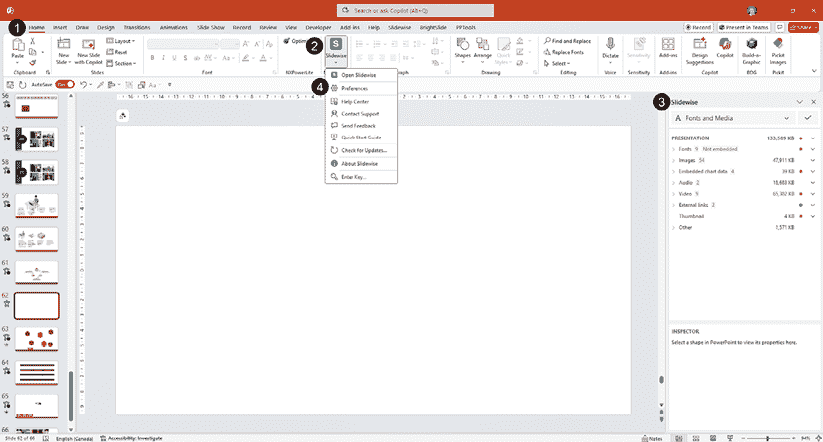

图 11.11 – 主选项卡上的 Slidewise 插件

当您点击**Slidewise**按钮（**1**）时，它将自动显示或隐藏**Slidewise**任务窗格（**3**）。如果您点击按钮底部的箭头以打开功能列表（**4**），您可以设置插件的**首选项**，打开**帮助中心**网页，并访问与插件本身相关的功能，例如**检查更新**。

标题栏上方的**Slidewise**选项卡（**1**）提供对相同的帮助和设置功能，并具有其他有价值的特性（*图 11.12*）：

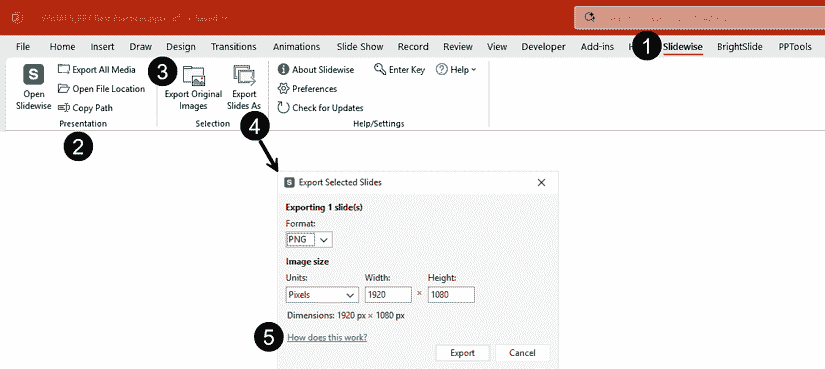

图 11.12 – 标题栏上方的 Slidewise 选项卡

+   在**演示文稿**组（**2**）中，您将可以访问仅在您的演示文稿文件在文件资源管理器中有路径时才激活的功能。这意味着任何保存在 OneDrive 或 SharePoint 存储中且未设置为同步到文件资源管理器的文件，将看到以下功能不可用：

    +   **导出所有媒体**：将图像、音频和视频文件导出到您选择的文件夹

    +   **打开文件位置**：在文件资源管理器中显示文件位置

    +   **复制路径**：将文件位置路径复制到剪贴板

+   在**选择**组中，您将可以访问以下内容：

    +   **导出原始图像** ( **3** )：此功能允许您从所选对象导出未修改的图像。如果您已应用图像格式化或裁剪，并希望将来轻松访问原始图像，这将非常有价值。

    +   **导出幻灯片为** ( **4** )：此功能允许您将所选幻灯片导出为图像（PNG 或 JPEG）、PDF 和 PowerPoint 文件。此功能的附加价值在于可以从各种单位（像素、百分比、厘米或英寸）的列表中选择图像大小。您可以通过**如何操作？**链接（**5**）访问视频教程。

让我们现在看看**Slidewise**窗格（*图 11.13*）中可用的部分和视图列表：

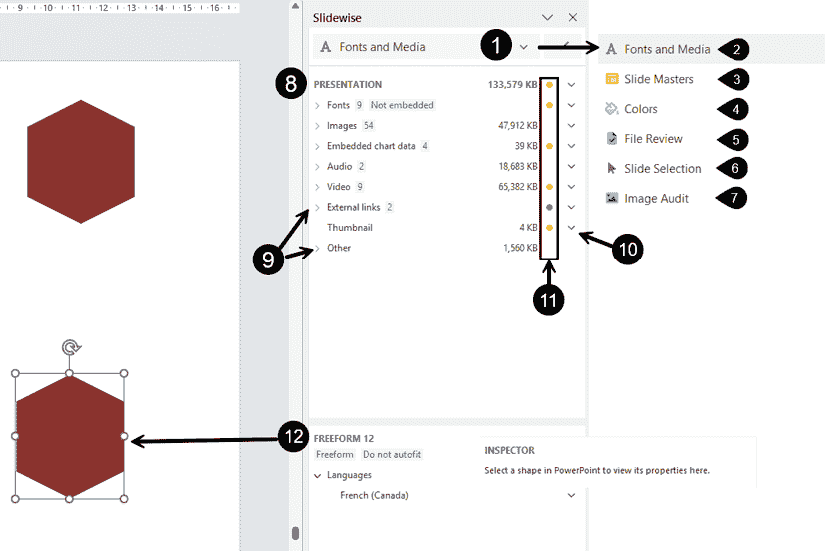

图 11.13 – Slidewise 中的字体和媒体视图

+   工具下拉列表（**1**）：

    +   **字体和媒体** ( **2** )：此工具允许您管理演示文稿文件中找到的各种元素类别，例如字体、图像、嵌入的图表数据、音频、视频等。只需几点击，您就可以看到元素在文件中的位置，并完成嵌入字体、导出图像、音频和视频，或删除嵌入数据等任务。如果您曾经试图在文件中找到奇特的字体并替换它们，这是一个非常有帮助的功能，可以帮助您节省宝贵的时间。

    +   **幻灯片母版** ( **3** )：此工具允许您查看文件中的所有母版和布局，并找出哪些幻灯片使用它们。此视图的优点在于它具有允许您合并母版、删除未使用的母版和布局，甚至在不同布局之间重新分配幻灯片的功能。这消除了清理因过多母版和布局而杂乱无章的文件所需的所有手动工作。

    +   **颜色** ( **4** )：此功能显示所有调色板并标识了所有非主题颜色使用的地方 - 即，对于所有母版，无论是幻灯片、备注还是讲义。它还列出了主题调色板中颜色的 RGB 值，比在 PowerPoint 界面中挖掘值要好得多。您可以替换不符合规定的颜色，甚至可以轻松地查看/清除最近使用的颜色列表。

    +   **文件审阅** ( **5** )：此工具具有许多有用的功能。它有一个**内容**部分，可以帮助您找到空占位符、隐藏的对象和幻灯片、调整文本框自动调整设置，以及查看文件中使用的所有语言 - 正是通过这种方式，我发现一个时间线模板将俄语引入了文件！在**元数据**部分，您可以轻松找到评论列表、文档属性以及您放置演讲者备注的位置。任何列出的项目都可以轻松修复或查看在 PowerPoint 文件中。

    +   **幻灯片选择** ( **6** )：在审查此章节时，此工具有两个视图 - **主/布局**，和**过渡**。第一个视图有一个表格，列出所有幻灯片的编号以及正在使用的幻灯片母版和布局，以及幻灯片是否可见。**过渡**视图列出所有幻灯片的编号，以及使用的过渡名称、其时间设置以及是否为自动过渡。我被告知**主/布局**视图可能会在未来移动到**幻灯片母版**部分，并将此部分的名称改回**过渡**。

    +   **图像审核** ( **7** )：此工具允许您扫描具有大小或质量问题图像。当您打开它时，此功能会自动开启，当您离开时自动关闭，以避免添加插件性能问题。它将帮助您找到图像太大或太小、被裁剪，以及当它们变形或损坏的情况。

+   **演示文稿** ( **8** )：当鼠标悬停在单词上时，您会看到一个工具提示，列出文件的名称、位置和幻灯片大小。在其右侧，您可以看到总文件大小。

+   在任何视图中点击左侧的箭头（ **9** ）之一将展开元素列表，按类型或幻灯片编号列出它们。

+   点击右侧的箭头（ **10** ）将打开一个操作列表，您可以选择嵌入或替换字体，使用**在 PowerPoint 中显示**操作来导航到幻灯片，等等。

+   突出的内容将有一个点（ **11** ），绿色或黄色表示补充信息或提示。当内容被标记为有问题时，文本将显示橙色字体并带有标志图标。

+   在窗格底部，您有**检查器**工具（**12**），显示您在幻灯片上选定的对象的详细信息。

不要因为我没有单独介绍每个功能就害怕这个插件有问题。当您安装 Slidewise 时，它会打开一个`Slidewise.pptx`文件（**1**）（*图 11.14*）：

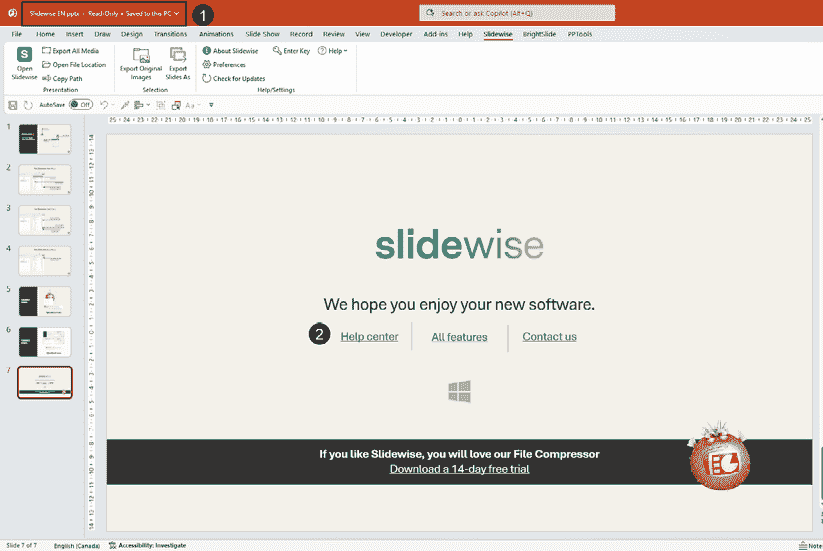

图 11.14 – Slidewise 入门指南

幻灯片显示了重要元素，在最后一页，您有链接到他们的帮助和支持中心，以及他们的联系表单（**2**）。

您真的应该去 Neuxpower 的产品页面（[`neuxpower.com/products`](https://neuxpower.com/products)）下载 Slidewise，这样您就可以免费试用 30 天。这是了解它是否值得您日常演示工作投资的最佳方式。30 天试用期后，插件将回退到免费模式，让您可以免费继续使用一组有限的特性。Slidewise 可以通过年度订阅购买，在我看来，您在使用演示文稿文件的一周或两周后就能收回投资。而且好消息是，对于那些不只在英语环境中工作的人来说！如果您的 Windows 和 PowerPoint 语言设置为德语、法语或西班牙语，该插件将安装为这些语言之一。

## 使用 Neuxpower 的压缩工具

我记得当我与演示文稿或任何其他 Microsoft Office 文件最大的挑战是文件大小巨大。第一次使用 Neuxpower 的压缩工具，大概 18 年前，我被它如何高效地减小文件大小同时确保图像保持足够高的质量而震惊，以至于观众无法察觉到差异。

从那时起，该产品已发展成为五个不同的产品，您可以在他们网站的产品页面上看到（[`neuxpower.com/products`](https://neuxpower.com/products)）。在本节中，我将向您介绍**WeCompress**（免费）和**NXPowerLite**（付费）。尽管本章是关于 PowerPoint 插件，但我认为任何创建内容的人都应该了解他们的压缩工具。

如果您在文件压缩方面没有太大需求，并且您的文件最大大小为 50 MB，那么您可以前往[wecompress.com](http://wecompress.com)网站，或者在 Neuxpower 产品页面上点击产品名称（*图 11.15*）：

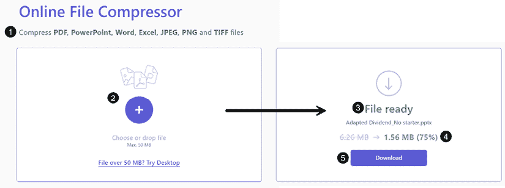

图 11.15 – Neuxpower 的 WeCompress 在线文件压缩工具

如您所见，您可以压缩当今组织中最常用的文件类型：**PDF**、**PowerPoint**、**Word**、**Excel**、**JPEG**、**PNG** 和 **TIFF** 文件（**1**）。您只需点击**+**号（**2**）浏览文件并添加一个，或者您可以直接将文件拖放到浏览器页面。当在线应用程序处理完您的文件后，您将收到**文件就绪**的消息（**3**）。在我们的例子中，初始文件大小为**6.26 MB**，降至**1.56 MB**（**4**）。剩下的唯一操作就是点击**下载**按钮（**5**），将压缩文件移动到您计算机的`下载`文件夹中。

在上一个例子中测试的文件显示，所有幻灯片上的照片质量与我的原始文件相同。似乎受此过程影响的是由缩放功能创建的小图像，用于我的交互式菜单。正如您所看到的，它非常易于使用，而且完全免费。

如果您有更频繁的需求，或者您的文件大多数时候超过 50 MB，我建议您投资 NXPowerLite 桌面版本（*图 11.16*）：

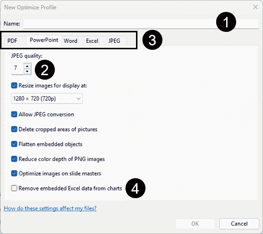

图 11.16 – NXPowerLite 桌面压缩应用程序中可用的自定义设置

您可以创建并命名各种优化配置文件（**1**），这将允许您对特定的压缩设置有更多的控制，例如您在演示文稿文件中想要的**JPEG 质量级别**（**2**），或者为**PDF**、**PowerPoint**、**Word**、**Excel** 和 **JPEG** 文件创建各种自定义设置（**3**）。一个新的设置允许在强压缩配置文件中使用时从图表中删除 Excel 数据（**4**）。

NXPowerLite 还与 Windows 的文件资源管理器、Mac 的 Finder、Outlook 等集成。许可证是一次性购买，每位用户价格实惠，且在其网站上提供 14 天试用期。桌面版本会在您的办公应用程序的**主页**标签中安装一个 NXPowerLite 组，帮助您在创建文件时优化文件。

即使文件压缩工具本身不是 PowerPoint 插件，我相信您在处理大型演示文稿时也会发现它们很有用。

到目前为止，我们已经涵盖了生产力、演示文稿管理和清理工具。让我们继续介绍一个可以帮助您创建或访问图形以更直观方式表达自己的插件。

# 十亿美元级图形

**Billion Dollar Graphics** 由迈克·帕克森创立，他是一位非常有才华的视觉沟通者，我认识他很多年了。凭借他超过 25 年的专业经验，他创作了如何书籍、培训研讨会，以及一个名为 **Build-a-Graphic** 的非常实用的插件。它允许用户使用插件内提供的成千上万张图形中的任何一张来构建内容，或者使用预构建的图形来加快流程。

## 使用 Build-a-Graphic（付费）

Build-a-Graphic 是一个采用年度订阅模式的插件，您有机会使用具有有限功能的试用版。对于团体或企业，有本地图书馆的许可证。本节将重点介绍订阅插件，但您可以在 Build-a-Graphic 网站上找到所有信息（[`billiondollargraphics.com/build-a-graphic/`](https://billiondollargraphics.com/build-a-graphic/)）。

您可以使用两种方式使用 Build-a-Graphic 插件：

+   从您自己的项目符号列表或文本幻灯片开始，借助插件提供的成千上万创意资源，构建您自己的视觉元素

+   在库中搜索带有关键词的预构建图形，并将您自己的文本内容添加到文本框中

无论您选择自己构建还是使用预构建的图形，最大的优势是一切都是完全可定制的。几乎您添加的每一项都是矢量图形，这使得它可以 100%可编辑。

您可以更改颜色、移除填充颜色、保留轮廓和取消组合形状。您可以在 PowerPoint 的 **形状格式** 选项卡中进行的任何操作都可以用于 Build-a-Graphic 资源。如果您觉得自己缺乏构建自己图形的技能，尤其是如果您想通过不花太多时间创建自己的图形来明智地工作，您应该考虑投资这个插件。

值得一提的是，Build-a-Graphic 插件是与 Neuxpower 团队合作从头开始重建的。这个令人惊叹的版本是 -

+   兼容 Windows、Mac 和 PowerPoint 的网络版本。

+   总是与完整的图形库保持连接。

安装插件后，您将在 **首页** 选项卡中看到一个新的 **Build-a-Graphic** 按钮（**1**）（*图 11.17*）：

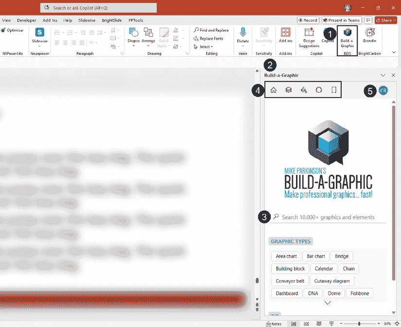

图 11.17 – 首页选项卡和任务窗格中的 Build-a-Graphic 按钮

点击按钮将打开 **Build-a-Graphic** 窗格（**2**），在那里您可以从超过 10,000 张图形的日益增长的库中进行搜索（**3**），使用各种工具帮助您进行设计（**4**），并管理您的账户（**5**），在那里您可以访问许可信息、协议、教程、请求图形以及联系支持的方式。

让我们在下一节中通过一个示例来展示您如何从幻灯片上的项目符号列表中创建自己的图形。

### 从文本幻灯片中创建图形

以下示例由 Copilot 创建，要求它为四个步骤的成功培训过程创建一个新的幻灯片。如果您手头没有文本幻灯片，只需使用标题和内容布局创建一个新的空白幻灯片，并添加四个句子的列表。

当您想测试文本在布局上的外观时，您可以使用 Office 应用程序中的一个隐藏功能来创建填充文本。要创建看起来像拉丁文的文本，您需要输入 `=lorem(x,y)` ，其中 `x` 是段落/项目符号的数量，`y` 是每行的句子数量，然后按 *Enter* 键。

如果您想生成可读的文本，可以使用 `=rand(x,y)` ，这将生成句子 **The quick brown fox jumps over the lazy dog**，并重复应用于所有段落/项目符号和句子。为什么是这个句子？因为它使用了字母表中的所有字母，让您可以看到您的字体如何显示。请注意，在 PowerPoint 中，即使您使用的是另一种用户界面语言，随机文本也可能相同——这就是我在法语中的情况。但在法语 Word 中，生成的随机文本讨论的是 Word 功能。

要在文本幻灯片上开始使用 Build-a-Graphic，首先选择文本占位符（**1**）（*图 11.18*）：

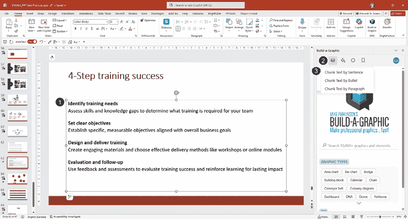

图 11.18 – 使用块文本工具与列表

当您点击 **块文本** 按钮（**2**）时，您会看到三个选项（**3**）来帮助您将列表分离成单独的文本框：

+   **按句子分块文本**

+   **按项目符号分块文本**

+   **按段落分块文本**

幻灯片上的文本格式如何并不重要，因为这三个选项涵盖了所有内容。

对于我的示例，通过项目符号或段落进行分块的结果是看起来像 *图 11.19* 的幻灯片：

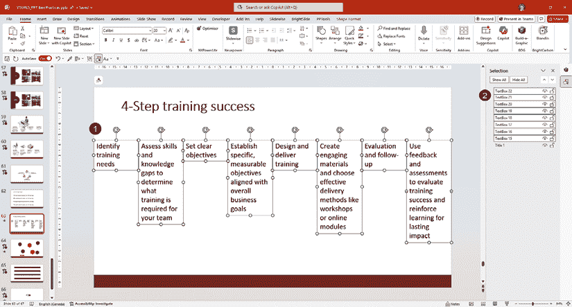

图 11.19 – 使用块文本工具后的分割文本

原始占位符被删除，并替换为八个文本框（**1**），每个文本框对应一个项目符号或段落，如图 **选择** 面板（**2**）所示。您的幻灯片布局仍然会显示 **标题** 和 **内容**，所以我建议您转到 **主页** | **布局** 并选择 **仅标题** 布局。这将在将来应用新模板或复制粘贴幻灯片到另一个文件时有所帮助。

在开始向幻灯片插入图形之前，我建议您根据需要格式化文本框，并将它们垂直对齐在幻灯片中间下方，并均匀地水平分布。

现在我们使用 **搜索** 框和关键词 `评估` 。从搜索结果中，点击列表中的图形以访问预览（**1**）（*图 11.20*）：

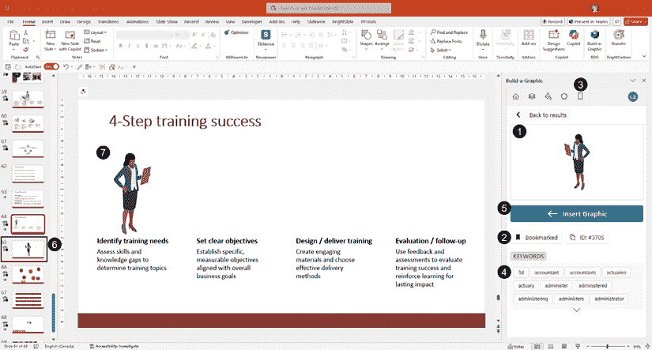

图 11.20 – 搜索并插入图形

+   **书签**按钮（**2**）是一个很好的方法，可以将您经常需要的图形保存在**书签**视图中（**3**）。当按钮已添加到您的列表中时，按钮的名称将更改为**已书签**。

+   相关的**关键词**列表（**4**）是了解图形在插件中如何标记的好方法。

+   单击**插入图形**按钮（**5**）将其添加到新幻灯片（**6**）。我简单地将其复制并粘贴到我的幻灯片上，并调整了大小。我还翻转了图形，使人物的正面不会对着幻灯片的边缘（**7**）。

如您在*图 11.21*中看到的，插入的图形是一组可以使用**形状格式**选项卡中的任何工具进行格式化的形状：

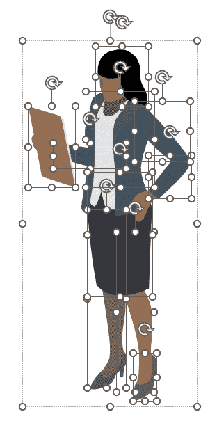

图 11.21 – 插入的图形可以使用格式化工具完全编辑

您可以重复此过程，并为您的幻灯片包含所需的任何数量的图形，根据您的需求移动和调整它们的大小。如果您有非常具体的需求，这可能是一种组装看起来专业的幻灯片的好方法，而无需花费数天时间在网上图书馆搜索、购买多个许可证或从头开始创建一切。

您可以访问数千个图形元素，您可以使用这些元素制作几乎任何您能想象到的图形。将其视为构建完美图形的部件套件（*图 11.22*）：

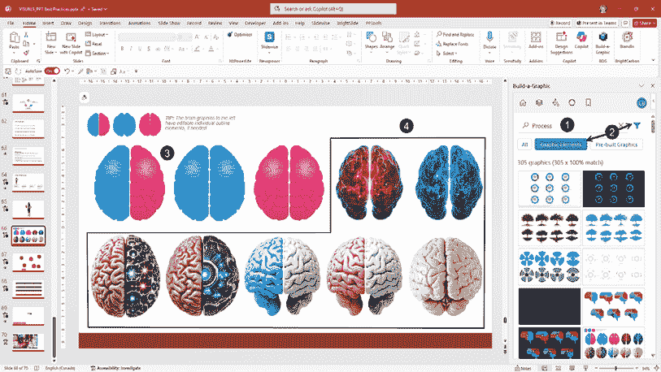

图 11.22 – Build-a-Graphic 拥有数千个图形元素

+   输入您的关键词（**1**）

+   通过**图形元素**筛选（**2**）

+   获取矢量图形（**3**）或，根据您的关键词，PNG 格式的优质图像（**4**），以便它们可以叠加在深色背景上而不出现白色矩形。

您可能还希望直接在 Build-a-Graphic 库中进行搜索，并使用完整的图形，这是下一节的主题。

### 使用 Build-a-Graphic 库

如果您正在创建针对常见商业主题的内容，您可能会在 Build-a-Graphic 库中找到您所需的内容。要查找图形，像平常一样搜索，单击**筛选**工具（**1**），然后从菜单中选择**预置图形**（**2**）（*图 11.23*）：

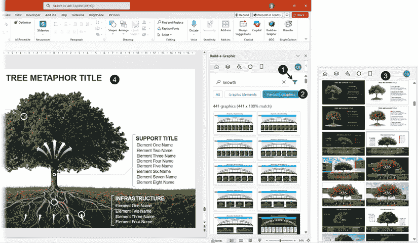

图 11.23 – 使用预置图形

滚动列表，直到您看到符合您需求的图形（**3**），然后单击**插入图形**按钮将其添加到新幻灯片（**4**）。

Build-a-Graphic 任务窗格中还有两个其他工具您可能会觉得很有用（*图 11.24*）：

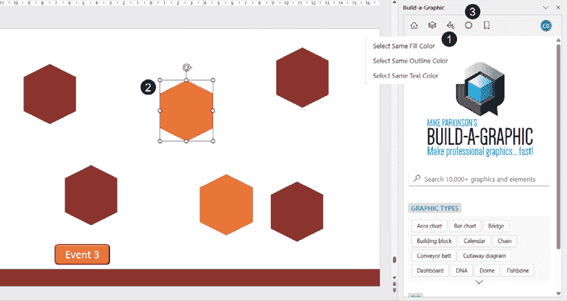

图 11.24 – 选择相同颜色的对象和“新增功能”

+   **选择相同颜色的对象**（ **1** ）：点击此图标将打开一个选择可能性的列表，允许您通过 **相同填充颜色**、**相同轮廓颜色** 或 **相同文本颜色**（与您在幻灯片上选择的形状相同）快速选择幻灯片上的所有形状（ **2** ）。

+   **新增功能**（ **3** ）：点击此图标将打开带有所有标记为 **#New** 的图形的搜索结果视图。新图形几乎每周都会添加。考虑不时浏览一下列表。

如您所见，您可以从您的投资中获得很多价值。我甚至可以说，如果您曾经支付过一位有才华的图形设计师，您为他们的几个小时所支付的费用与您每年为 Build-a-Graphic 投资的费用相似，这样您只需点击几下就可以获得数千个资产。

现在，我们将继续本章关于插件的最后一个部分，探讨来自 PPTools 的两个生产力插件。

# PPTools

为什么在讨论设计插件之后，我会回到生产力工具上来？简单来说，因为 **PPTools** 背后的这位人物在我们行业中备受尊敬。Steve Rindsberg 自 1997 年以来一直在创建 PowerPoint 插件和帮助文章！2005 年在一场会议中第一次见到他时，我就交了一个好朋友。

他的网站（ [`www.pptools.com/products.htm`](http://www.pptools.com/products.htm) ）上有许多年来为满足用户特定需求而创建的插件，这些需求是 PowerPoint 本身功能无法满足的。您还可以在他的网站上找到一篇关于插件及其类型的文章 – 我已在 *进一步阅读* 中添加了链接。而不是试图确定哪些要包含在本章中，我只是请 Steve 告诉我他的两个最受欢迎的插件，一个是免费的，一个是付费的。我们将在下一节中首先介绍免费的插件。

## 使用 THOR（免费）

**THOR** 插件有一个简单的焦点：记住幻灯片上对象的大小和位置，这样您就可以将其应用 – 或者像 Steve 会说的那样“锤击” – 到您的演示文稿中其他一个或多个选定的对象上。至于名称，是的，他指的是北欧神话中挥舞锤子的神，这反映了他极大的幽默感和他的文化素养。

要安装此插件，只需导航到网站上的 **免费 PPTools 插件** 部分（见 *进一步阅读* ）并从列表中选择 **THOR - 锤子**。然后，按照 **下载和安装 THOR** 部分的说明操作。安装完成后，您将在功能区看到一个新的 **PPTools** 选项卡（ **1** ）（见 *图 11.25* ）:

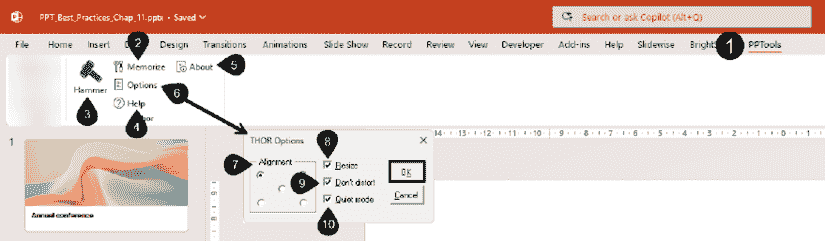

图 11.25 – 带有锤子工具的 PPTools 选项卡

**Thor** 组有一组简单的按钮。以下是每个按钮的简要说明：

+   **记忆**（ **2** ）：这是您想要记住幻灯片对象的大小和位置时需要点击的第一个按钮

+   **Hammer**（**3**）：这是在选择了想要应用相同大小和位置的另一个或多个对象后要点击的按钮。

+   **帮助**（**4**）：此按钮打开一个 `.pdf` 文件，提供您所需的所有关于插件的信息，而无需返回网站。

+   **关于**（**5**）：这提供了访问常规许可信息、支持链接和诊断功能。

+   **选项**（**6**）：此按钮允许您通过更改**THOR 选项**对话框中的选项来配置 THOR 的工作方式。

    +   **对齐**（**7**）：点击单选按钮选择要使用的参考点。在这个例子中，THOR 将记住对象的左上角位置。

    +   **调整大小**（**8**）：此选项允许您记住对象的位置（如果复选框未选中）或记住如何调整对象的大小，以及如何将它们移动到相同的位置。

    +   **不变形**（**9**）：当您决定调整幻灯片对象的大小以避免变形时，此选项非常重要。

    +   **静音模式**（**10**）：此选项仅避免弹出对话框，显示已记住的对象的确切位置和大小。如果您想了解更多信息，请参阅**帮助**文档。

    +   当然，还有一个**确定**按钮来确认您的设置。

让我们通过以下示例来看看 THOR 是如何工作的，在这个示例中，我们想要记住幻灯片 **2**（**1**）上圆的大小和位置，并将其应用到幻灯片 **3**（**2**）上的矩形（*图 11.26*）：

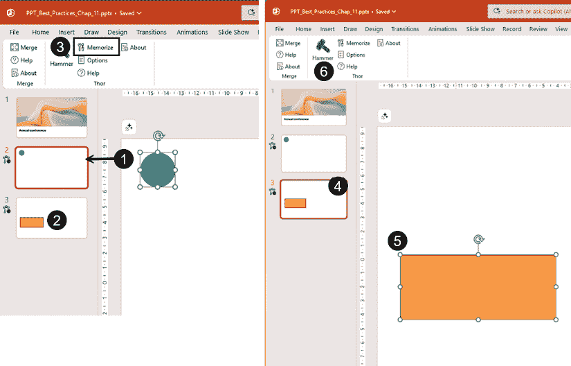

图 11.26 – 使用 THOR 记住对象的位置和大小

我选择该形状并点击**记住**（**3**）- 然后，我将视图切换到幻灯片 **3**（**4**）并选择正方形（**5**）。剩下要做的就是点击**Hammer**按钮（**6**）。

最终结果是调整大小的矩形（**1**），移动到与幻灯片 **2**（**2**）上圆相同的位置。**不变形**设置是开启的，所以我们仍然保持矩形形状（*图 11.27*）：

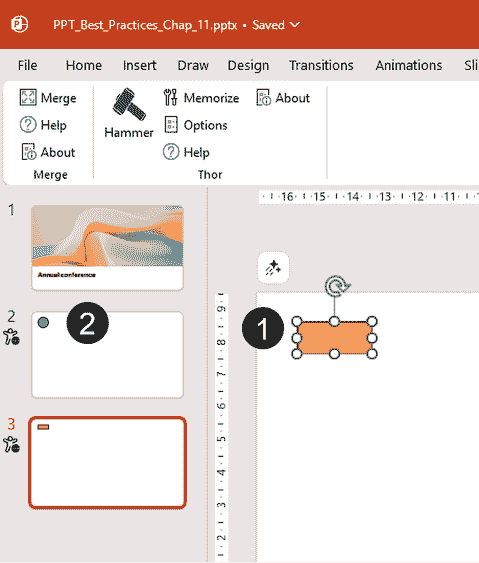

图 11.27 – 使用 Hammer 对图像进行处理的结果

THOR 是一个非常简单但也很强大的插件。如果您需要在演示文稿的多个幻灯片上快速调整和定位许多对象，这是您工具箱中必备的工具，而且不会花费您任何费用。

现在，让我们继续讨论本章将要讨论的最后一个插件，它将帮助您在 PowerPoint 文件中合并数据，就像在 Word 中使用邮件合并一样。

## 使用 PPTMerge（付费）

**PPTMerge** 插件是一个非常有用的工具，可以帮助您从 Excel 文件中合并数据，创建定制的单个幻灯片或完整的演示文稿。如果您想知道这如何有帮助，这里有一些例子：

+   创建包含每张幻灯片上特定人员名称的演示文稿文件。

+   使用证书 PowerPoint 模板。然后你可以合并要在每个证书上显示的名称列表。

+   通过将一些关键元素合并到 PowerPoint 中创建的视觉模板中，创建你的社交媒体帖子。这个令人惊叹的创意归功于来自 My TechGenie 的 Catharine Richardson（见*进一步阅读*）。

这个节省时间的插件在 PPTools 网站的产品列表中作为一次性购买提供。Steve 的 PPTMerge 页面上的一个客户评价说他们每年只使用一次，但仍物有所值。

安装后，你可以在功能区中的**PPTools**标签页找到 PPTMerge（**1**）（*图 11.28*）：

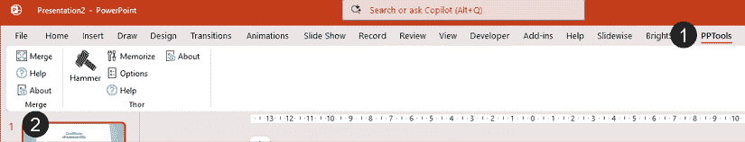

图 11.28 – 从 PPTools 标签页访问 PPTMerge

我们可以看到一个简单的**合并**组（**2**），由于我已经安装了 THOR 插件，它也在同一个标签页中可用。**帮助**和**关于**按钮的工作方式与之前描述的 PPTools 插件相同。

假设我们想要创建一个包含每个接收者名称的证书——你可以在 Microsoft 的模板中找到一些示例（*图 11.29*）：

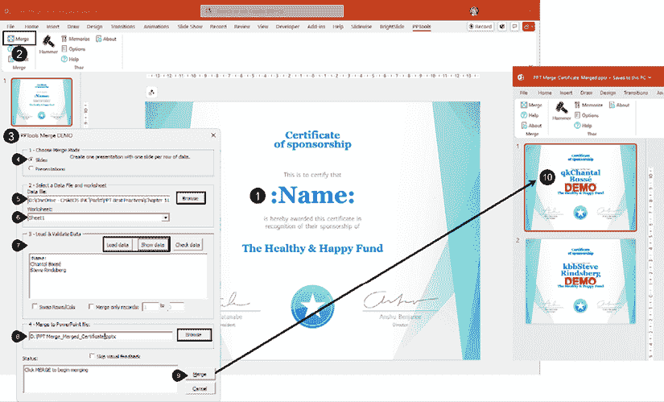

图 11.29 – 使用 PPTMerge 创建个性化证书

+   在 PowerPoint 幻灯片中，将`:Name:`（**1**）添加到应添加名称的文本框中。

+   在你的 Excel 文件中创建，单元格**A1**有相同的`:Name:`标题，这样插件就会知道在数据文件中查找什么。在下面的行中添加所有需要的名称。

+   现在，你可以点击**合并**按钮（**2**）。

+   **PPTools 合并**对话框打开（**3**）：

    +   在**1 - 选择合并模式**部分（**4**），我们可以保持**幻灯片**的默认设置，这样我们就可以创建一个包含每行数据一个幻灯片的单个演示文稿文件。

    +   在**2 - 选择数据文件和电子表格**部分（**5**），使用**浏览**按钮选择你的 Excel 文件。如果你决定使用包含许多工作表的 Excel 工作簿，你可以从**工作表**下拉列表（**6**）中选择要使用的工作表。

    +   在**3 - 加载和验证数据**部分（**7**），点击**加载数据**按钮，然后点击**显示数据**按钮以查看你的字段和数据。在我的例子中，你可以看到我的名字和 Steve 的名字将被添加到证书上。

    +   在**4 - 合并到 PowerPoint 文件**部分（**8**），点击**浏览**按钮选择合并文件的位置和名称。

    **重要**

    选择一个本地驱动器以避免错误信息。SharePoint 和 OneDrive for Business 存储可能会引起错误信息。

    +   点击**合并**按钮（**9**）来创建你的文件。

+   你的合并文件快速创建且易于使用，无论你需要将幻灯片打印成证书还是带有自定义字段的演示，都是如此。当你使用试用版时，会添加单词**DEMO**，并在合并字段中显示一些额外的字母（**10**）。你需要购买你的许可证才能获得完美的合并文件。

这可能不是每个人都需要插件，但如果你需要将信息合并到 PowerPoint 文件中，这值得投资。只需想想你将节省多少时间！

# 摘要

本章关于 PowerPoint 插件的讨论帮助你发现了可以提升你效率的工具——无论是帮助你内容创作阶段，清理你的演示文件并减小其大小，还是在极短的时间内创建美丽的图形，并给你的 PowerPoint 应用程序添加有价值的功能。

如果你一直在与重复性任务作斗争，或者曾经想过你在内容创作上花费了太多的时间，那么可能是时候仔细看看那些可以帮助你提高 PowerPoint 效率的插件了。我只介绍了我所熟悉的一些插件及其工具和功能样本，但市场上还有许多其他插件等待你去发现。搜索你的特定需求，并确保在考虑任何新的插件或工具时，了解其他用户的使用体验。

如果你想与他人交流，讨论关于演示设计、PowerPoint 以及任何其他帮助你创建内容的工具的任何话题，我建议你查看演示联盟网站（见*进一步阅读*）并考虑成为会员。我是创始人之一和过去的董事会成员，我可以向你保证这是一个充满活力且有帮助的社区。

在下一章中，我们将讨论如何使用 PowerPoint 内提供的工具练习你的演示演讲，因为如果不练习，演示就不会有影响力。

# 进一步阅读

+   BrightCarbon 插件：[`www.brightcarbon.com/products/`](https://www.brightcarbon.com/products/)

+   Neuxpower 插件：[`neuxpower.com/products`](https://neuxpower.com/products)

+   百亿级图形（Build-a-Graphic）：[`billiondollargraphics.com/build-a-graphic/`](https://billiondollargraphics.com/build-a-graphic/)

+   PPTools 插件：[`www.pptools.com/products.htm`](http://www.pptools.com/products.htm)

+   在 PPTools 上关于 PowerPoint 插件类型的文章：[`www.pptools.com/FAQ00179.htm`](http://www.pptools.com/FAQ00179.htm)

+   PowerPoint 常见问题解答：[`www.rdpslides.com/pptfaq/`](https://www.rdpslides.com/pptfaq/)

+   Catharine Richardson：[`mytechgenie.ca/`](http://mytechgenie.ca/)

+   演示联盟：[`presentationguild.org/`](https://presentationguild.org/)

|

#### 现在解锁这本书的独家优惠

扫描此二维码或访问 [`packtpub.com/unlock`](https://packtpub.com/unlock)，然后通过书名搜索此书。 |  |

| **注意** *：开始之前请准备好您的购买发票。* |
| --- |
