# 第十二章：练习你的演示文稿交付

您在本书的第一个部分学习了如何规划和构建您的内 容。然后，我们讨论了如何使用 PowerPoint 中可用的工具和功能或第三方插件创建更好的视觉效果。现在，我们进入了交付部分。

为您的观众创造难忘的体验需要比仅仅规划内容和创建专业视觉更多的东西。您需要练习。

幸运的是，微软的 PowerPoint 开发团队在过去几年中一直在添加工具来帮助演讲者提高他们的交付效果。以下是本章将涵盖的主题：

+   查看和调整**幻灯片放映**选项

+   利用**演讲教练**帮助你练习你的演讲

+   排练时间并创建录制练习

+   使用新的**录制**功能进行练习

# 技术要求

本章中讨论的一些功能需要**Microsoft 365**订阅。当它们被解释时，将会被标识出来。请注意，由于 PowerPoint 的订阅版本正在持续更新，因此本章中显示的截图可能与您的应用程序版本不同。

# 查看和调整幻灯片放映选项

许多用户并不了解他们可以控制的 PowerPoint 所有选项，其中有一些是针对演示文稿交付的。要访问这些选项，您需要转到**文件** | **选项** | **高级**（**1**）并向下滚动到**幻灯片放映**部分（**2**）（*图 12.1*）：

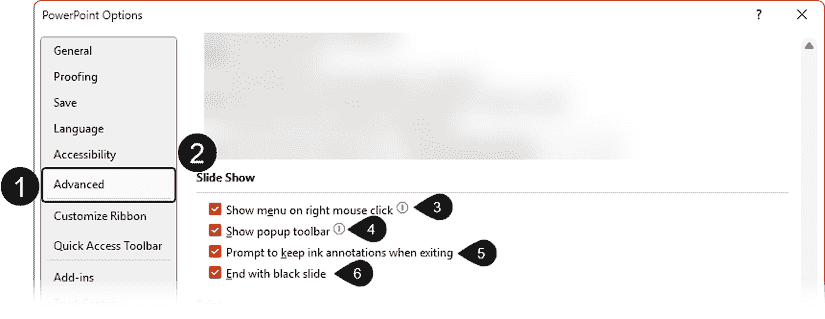

图 12.1 – PowerPoint 中的高级幻灯片放映选项

在本节中 -

+   所有选项默认开启，因此您可能需要根据您的演示文稿交付计划修改可用的选项。

+   **右键单击时显示菜单**选项（**3**）可以通过取消选中复选框来关闭，如果您不希望不小心点击右键时出现上下文菜单。这并不一定是一个坏选项，但我确实认为使用**演示者视图**功能——下一章的主题——要好得多。

+   **显示弹出工具栏**选项（**4**）与您在演示过程中屏幕左下角可以看到的半透明工具栏相关。尽管它在几秒钟后会自动隐藏，但我通常发现它很分散注意力，因为我大部分时间都在使用**演示者视图**。因此，我个人的偏好是将其关闭。

+   如果您是常规墨迹用户，您可能希望保留**退出时提示保留墨迹注释**选项（**5**）。它允许您在演示文稿结束后保留它们以供参考。

+   该部分的最后一个选项，**以黑屏结束**（**6**），本应用于避免不小心结束您的幻灯片放映。如果您使用**演示者视图**，幻灯片将是黑色的，但如果不使用它，您将不幸地看到屏幕顶部显示的文本**幻灯片放映结束，点击退出**，这让我感到分心。我通常建议我的客户让他们的最后一张幻灯片总是列出他们的联系信息、总结或行动号召，使其成为他们在演示最后一张幻灯片的明显提醒。

尽管我分享了一些对**幻灯片放映**选项的个人偏好，但我建议您在开启和关闭它们的情况下练习您的演示，以了解哪些更适合您。主要目标是让您在演示时更加舒适，因此我的偏好可能并不一定最适合您。

现在让我们继续到下一个部分，在 PowerPoint 应用中直接使用一个优秀的练习功能。

# 利用演讲教练帮助您练习您的演讲

**演讲教练**功能是微软云增强功能的一部分，这意味着您需要连接到互联网才能使用它。它最初在网页版 PowerPoint 中推出，如果您拥有 M365 许可证，现在也适用于桌面版本。任何使用微软账户（例如，[outlook.com](http://outlook.com) ， [hotmail.com](http://hotmail.com) ， [live.com](http://live.com) ， [msn.com](http://msn.com) ，或 [windowslive.com](http://windowslive.com) 电子邮件）但没有 M365 订阅的人都可以在网页版 PowerPoint 中访问它。

另一个重要元素是，截至本书编写时，**演讲教练**只支持英语。只有当您的 Office 用户界面设置为英语时，该功能才会可见。如果您不知道如何更改用户界面的语言，请查看*进一步阅读*部分中的微软支持文章。

微软总是首先在网页版中测试**演讲教练**的增强功能，在收集到网页版 PowerPoint 用户的反馈后，再将它们添加到桌面版本。这意味着如果您想使用最新功能进行练习，您需要将您的演示打开在网页版 PowerPoint 中。

## 开始演讲教练

要在网页版 PowerPoint（**1**）或桌面应用程序（**2**）中开始使用**演讲教练**，您可以转到**幻灯片放映**选项卡（**3**）（*图 12.2*）：

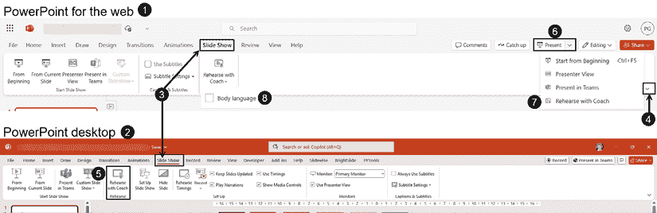

图 12.2 – 从网页和桌面应用程序启动演讲教练

在网页版中，如果你看不到功能图标在功能区，你可以点击功能区显示选项箭头（**4**）并选择**经典**功能区。应用程序的两个版本都将有一个**与教练排练**按钮（**5**）来启动应用程序。在网页版中，你还可以在列表底部的**演示**下拉菜单（**6**）中找到该功能（**7**）。在撰写本书时，网页版 PowerPoint 有一个可选的**肢体语言**分析功能（**8**），在练习演示时需要打开摄像头。

点击**与教练排练**按钮后，你的演示文稿进入幻灯片放映视图，并在幻灯片底部右角（**1**）打开一个对话框（*图 12.3*）：

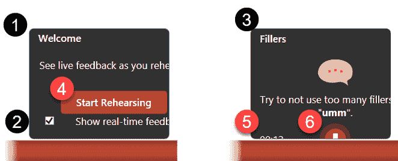

图 12.3 – 演讲教练对话框

默认情况下，**显示实时反馈**功能（**2**）是开启的，这意味着你可以在练习时在**填充词**部分（**3**）看到关于填充词、重复词或语言缺乏包容性的评论。你需要测试你是否觉得它太分散注意力。当你准备好开始时，确保你的麦克风已开启，并点击**开始排练**按钮（**4**）。

在撰写本章时，叠加的对话框被裁剪，使得以下元素不太可见或完全不可见：计时器（**5**），一个闪烁的麦克风图标（**6**），可以用来暂停排练，以及一个铃铛图标，允许你在排练时关闭实时反馈。当你完成时，只需按下*Esc*键即可结束你的幻灯片放映，同时结束排练。

如果你正在使用网页版 PowerPoint，你也可以使用你的摄像头并测试**肢体语言**反馈。它可以让你了解你与摄像头的距离（**1**）以及你的距离刚刚好时（**2**）。这应该有助于与摄像头的眼神交流，尽管我在测试中未能触发不良的眼神交流（*图 12.4*）：

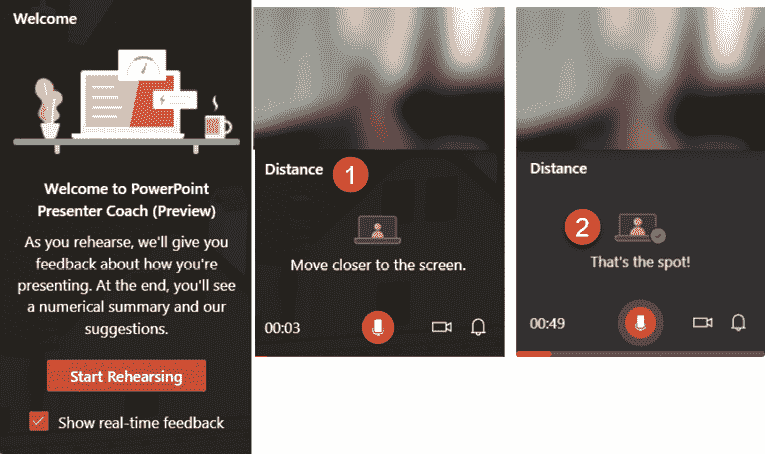

图 12.4 – 网页版 PowerPoint 中演讲教练的肢体语言反馈

此功能目前处于预览阶段。它可能会在未来继续改进。当你结束排练，无论是网页版还是桌面版，你都会得到一个排练报告——这是我们下一节的主题。

## 分析你的排练报告

排练报告（**1**）为你提供了关于你的练习运行情况非常有趣的见解（*图 12.5*）：

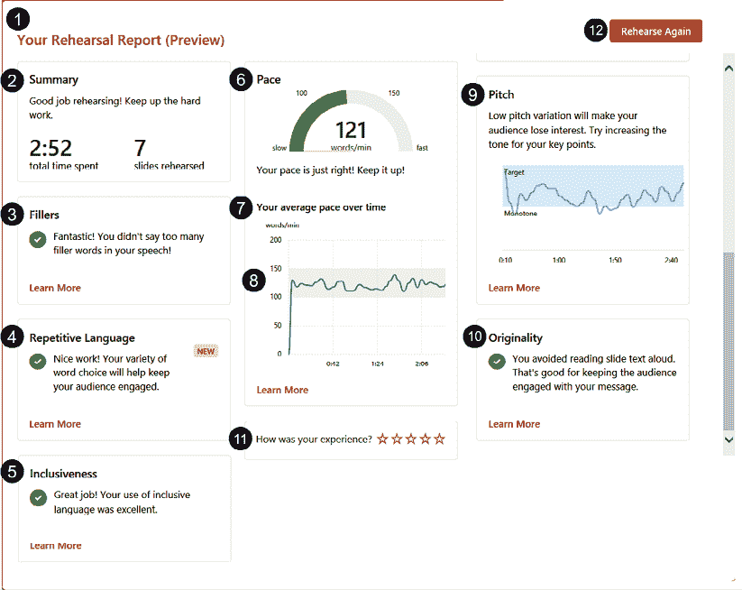

图 12.5 – 演讲教练排练报告

+   你会得到一个总结（**2**）关于你排练的总时间和你排练的幻灯片数量。

+   它有一个**填充词**部分（**3**），告诉你你是否经常使用填充词。这对于我多年来合作过的许多演讲者来说是一个大挑战。知道你使用了太多的填充词是帮助你减少使用的第一步。

+   人工智能甚至可以分析你的演示中的重复性语言（**4**）。由于语音识别仍在进行中，这仍然被认为是一个新功能。我必须说，它在过去几年里已经有所改进。

+   语言的可接受性（**5**）也被分析，帮助演讲者意识到他们可以改进的地方。一个例子是许多人使用表达“你们这些人”，这并不被认为是性别中立的。根据上下文，它可以被替换为“你们所有人”或“每个人”。

+   **节奏**部分（**6**）和随后的**你的平均节奏随时间变化**部分（**7**）是帮助你调整说话速度快慢的绝佳指标。图表中 100 到 150 字每分钟的阴影区域（**8**）表示你应该保持的最佳节奏，以吸引听众的注意力。

+   报告还包括有关你的声音音调（**9**）的信息。当你说话时，音调缺乏变化将不可避免地使你的听众感到厌烦。换句话说，你会变得无聊！你越是在音调的变化上下功夫，比如在重要观点上提高你的声音音调，就越能吸引听众的注意力。

阴影区域是你保持听众注意力的目标。

+   在**原创性**部分（**10**），**演讲教练**会检测你是否在逐字阅读幻灯片上的内容。如果你开始使用文本和项目符号的替代方案（正如我们在介绍最佳实践或视觉替代方案时讨论的那样），你在这个报告类别中应该看不到很多建议。有时我认为在幻灯片上阅读文本仍然是可行的——例如，当你使用引语时。这样做的方式是慢慢地、清楚地阅读，然后给听众几秒钟的时间来吸收它。

+   为了帮助微软的开发者和工程师微调**演讲教练**，你应该花时间对你的体验进行评分（**11**）。

+   最后，如果你准备好重新开始，只需点击**再次排练**按钮（**12**）。

在本书撰写时，当你在网页版 PowerPoint 中使用**演讲教练**时，还有两个其他功能可用：**发音**（**1**）和**肢体语言**（**2**）（*图 12.6*）：

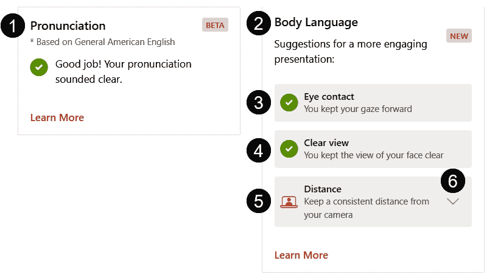

图 12.6 – 网页版 PowerPoint 中演讲教练的两个功能

**发音**反馈基于美式英语，并将随着更多语言的可用性而发展。微软已经提到，它正在努力将**演讲教练**扩展到新的语言，包括西班牙语、法语和日语。

**肢体语言**功能将提供关于**眼神接触**（**3**）、你的面部是否始终在**清晰视图**（**4**）中可见，以及你与摄像头的距离是否一致（**5**）的反馈。如果某个类别的复选标记缺失，当你点击右侧的小箭头时，你会找到如何改进的建议（**6**）。

如果你主要进行虚拟演示，这种类型的反馈将很有用，帮助你养成控制与摄像头互动习惯。

**演讲教练**应该是你练习演讲的首选功能，帮助你改善语速和措辞选择，减少填充词，并改善你的肢体语言。根据需要使用**演讲教练**练习，以帮助你更好地控制你的演讲。尽管在过去几年中微软被要求保存报告，但目前你无法保存报告，所以如果你想跟踪你的进步，需要截图。

如果你需要更好地了解你在每个幻灯片上花费了多少时间，并跟踪你的进步，你需要利用**排练计时**功能——这是下一节的主题。

# 排练计时和创建录制练习

如果你发现自己在某些幻灯片上难以保持主题，导致演示超时，你应该打开**幻灯片放映**选项卡（**1**），并考虑使用**排练计时**功能（**2**）（*图 12.7*）：

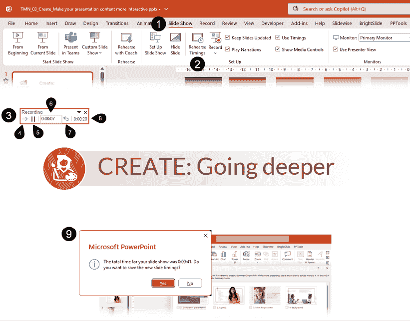

图 12.7 – 开始和使用排练计时

当你点击**排练计时**时，它将以**幻灯片放映**模式开始你的演示，并在屏幕左上角显示小**录制**工具（**3**）。你可以用鼠标浏览你的幻灯片，使用键盘，或在**录制**工具中点击**下一张**箭头按钮（**4**）。如果你需要停止，只需点击工具栏中的暂停按钮（**5**）。

第一个计时器（**6**）显示你在幻灯片上花费了多少时间。如果你需要重复录制，可以点击小重复箭头（**7**）。第二个计时器（**8**）显示你说话的时间。如果你想快速结束**排练计时**工具，只需按下键盘上的*Esc*键。它将弹出一个对话框（**9**），显示你的幻灯片演示时长，并询问你是否想保存幻灯片计时。

如果你保留幻灯片计时，那么你将自动为你在排练中使用的幻灯片添加**自动切换**（*图 12.8*）：

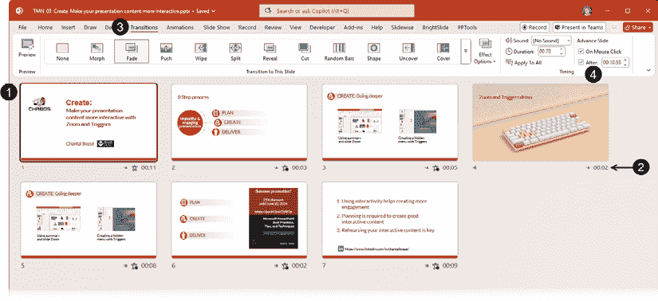

图 12.8 – 查看排练计时添加的幻灯片计时

查看计时最简单的方法是切换到**幻灯片排序器**视图（**1**）以在缩略图下方查看它们（**2**）。你还可以通过单击**切换**选项卡（**3**）然后查看**计时**组中的**之后**（**4**）来查看它们。

每次你练习和使用这个功能时，你都会看到你是如何提高每张幻灯片的计时。使用演讲者笔记添加关键词以帮助你保持进度。在*第十三章*中，我们将讨论如何在演讲时使用这些笔记。

你可以选择使用计时来为你的下一次演讲制作一个自动运行的演示文稿，但我建议你避免这样做，这样你可以随着观众互动的自然流程进行，而不用担心你的幻灯片会自动更改。

为了确保你不会被计时卡住，只需转到**幻灯片放映**选项卡（**1**）并取消**使用计时**（**2**）的勾选（*图 12.9*）：

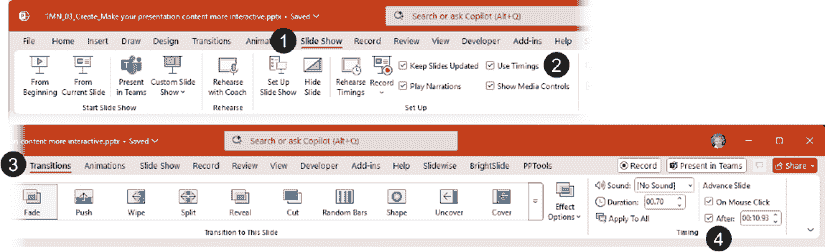

图 12.9 – 移除幻灯片演示的计时

你还可以转到**切换**选项卡（**3**）并取消**之后**框中的勾选（**4**）。两种方法都会让你完全控制演示文稿的计时。

如果你已经依赖笔记，你可能会发现**排练计时**并不那么方便，因为它不允许使用**演示者视图**。微软在 2022 年初引入了一个改进的、功能丰富的**录制**功能，这可能正是你需要的，这将在下一节中讨论。请注意，这个改进的功能在 M365 中可用。在之前的版本中，用户有经典的**录制**体验，它具有较少的功能。

# 使用增强的录制功能进行练习

虽然早在 Office 2013 中就可以录制幻灯片演示，但微软引入的增强**录制**功能提供了许多优秀的工具来帮助你练习。是的——它的主要目标是帮助演讲者创建用于分发的内容视频，但用它来查看你的外观和听你的讲话是提高你演讲的最佳方式。你可能会在前几次看到和听到自己时感到讨厌——我们都会这样！——但这类反馈甚至比仅仅使用**演讲教练**更真实。当你周围没有人可以作为你的测试观众时，同时使用两者是你可以采取的最佳实践。

**录制**功能将从练习你的演讲的角度进行展示，而不是生产作为视频文件分发的内容。这意味着不会解释所有功能。如果你想跟上，请确保打开一个包含笔记的 PowerPoint 文件，并准备好你的麦克风和摄像头。我的例子将使用我为*2024 年演示峰会*活动提供的演示内容，这样你可以看到笔记。

有三种方法可以启动**录制**功能并访问 PowerPoint 开发者所称的*录制工作室*（*图 12.10*）：

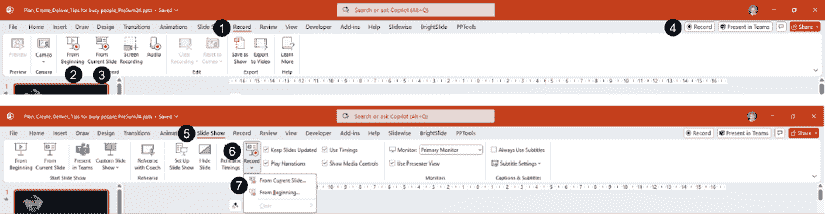

图 12.10 – 访问录制功能

+   点击**录制**选项卡（**1**）并决定你是否想从开头（**2**）或从当前幻灯片（**3**）开始录制。

+   点击选项卡右侧的**录制**按钮（**4**）以从当前幻灯片开始录制。

或者，在**幻灯片放映**选项卡（**5**）中，点击**录制**按钮（**6**）以选择**从当前幻灯片…**或**从开头…**（**7**）。

无论你选择哪种方法，它都会启动你的幻灯片放映，并打开录制工作室，在那里我们将介绍与练习你的演示文稿最相关的功能（*图 12.11*）：

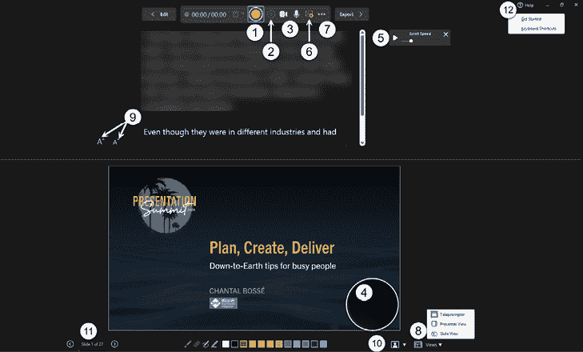

图 12.11 – 录制工作室功能

+   窗口打开时，会高亮显示开始录制/停止录制按钮（**1**）。准备好后，点击它开始录制你的排练。你还可以在录制过程中使用暂停录制按钮（**2**）。

+   当录制工作室打开时，你的摄像头和麦克风默认开启（**3**），但点击图标可以关闭它们。这也会在录制过程中在你的幻灯片上创建一个 Cameo 对象。在正常视图中，它变成一个视频对象（**4**）。

为了在书中提高可见性，截图周围添加了圆圈边界。在录制过程中，Cameo 形状没有边界。

+   当你开始录制时，你的笔记会自动滚动。但如果你更喜欢，你可以调整**滚动速度**（**5**）或**禁用自动滚动**（**6**）。

+   工具栏中的**选择更多选项**省略号（**…**）（**7**）可以让你访问你的麦克风和摄像头设置。

+   当你启动**录制**功能时，默认情况下，**视图**（**8**）设置为**提词器**视图。这就是你如何看到位于幻灯片上方的笔记，以帮助你将目光投向摄像头。你可以增加或减少（**9**）笔记的大小，以帮助你录制时阅读。如果你有比窗格允许你看到的更多笔记，使用鼠标滚轮向下滚动可能是最好的选择，尽管右侧有一个滚动条。

在你的笔记中包含完整的句子可能并不总是好主意。如果你是在面对人群或虚拟活动中进行演示，考虑只列出你需要记住的关键点，以避免有读出来并听起来单调的冲动。如果你正在编写演示文稿脚本，因为演示文稿将以解说视频的形式提供，那么考虑更加练习你的脚本，以便听起来更自然。

+   选择摄像头模式图标（**10**）默认设置为**模糊背景**，但可以更改为**显示背景**。

+   你可以通过点击鼠标、使用幻灯片放映期间可用的任何键盘键或使用工作室底部的箭头图标（**11**）来浏览你的幻灯片。

+   如果你想要了解更多关于键盘快捷键的信息，可以选择**帮助**图标（**12**）。

当你在录制排练时，你需要记住这是基于每张幻灯片的。这意味着你需要在幻灯片转换时停止说话。微软还提到，每个幻灯片的开始和结束都有一个短暂的静默缓冲区，这意味着你应该在开始幻灯片的叙述前等待 1 或 2 秒，在你说话结束后等待 1 或 2 秒再切换幻灯片。

在点击停止录制按钮或在键盘上按*Esc*键后，幻灯片预览（**1**）变成一个带有播放选项的视频，视频的右下角显示你的摄像头画面（*图 12.12*）：

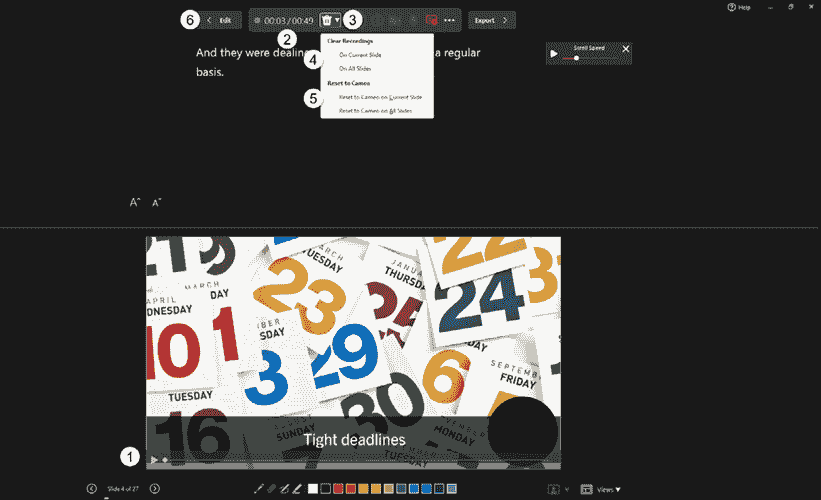

图 12.12 – 在录制幻灯片后使用工作室功能

+   你将看到你在幻灯片上花费的时间以及你录制会话的总时长（**2**）。

+   **删除录制**按钮（**3**）会打开一个动作列表。如果你决定重录录制或简单地在你演示之前删除所有视频，你可以清除当前幻灯片或所有幻灯片上的录制（**4**）。如果你想在幻灯片上保留 Cameo 对象而不保留视频录制，可以使用当前幻灯片或所有幻灯片上的**重置到 Cameo**（**5**）。

+   要返回你的幻灯片，你可以点击**编辑**按钮（**6**）或在键盘上按*Esc*键。

由于我们正在讨论为排练目的录制演示文稿，摄像头画面阻塞幻灯片上的信息不是一个问题。但如果你决定使用此功能创建演示文稿的有声视频，并打算分发或发布它们，你需要提前计划你的内容如何在幻灯片上显示，以避免被视频画面阻塞。

当你回到**普通**幻灯片视图时，你的录制作为视频添加到你的幻灯片上（**1**），你也可以从那里播放它（**2**）（*图 12.13*）：

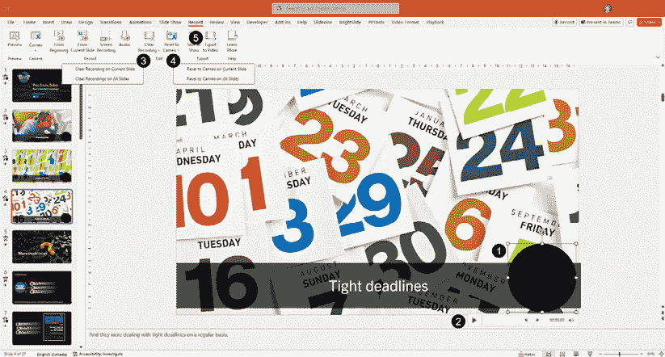

图 12.13 – 在幻灯片上可用的排练录制视频

如果你点击**清除录制**按钮（**3**），你还可以选择清除当前幻灯片上的录制或清除所有幻灯片上的录制。除非你决定使用你的录制来制作有声视频，否则请记住在演示之前使用此功能删除视频。

**重置到 Cameo**按钮（**4**）也允许你将视频重置为当前幻灯片或所有幻灯片上的 Cameo 对象。

如果你想了解如何从你的演示文稿中制作旁白视频，请点击**导出为视频**按钮（**5**），并遵循导出窗口中提供的信息。

尽管**记录**功能可能旨在帮助用户更轻松地制作旁白视频，但我还是建议所有演讲者使用它来提高他们的演讲表现。看到并听到自己可以帮助我们大大提高。

当然，在会议室或大型场馆的观众面前演讲需要走上舞台以帮助保持人们的兴趣，而使用**记录**功能进行练习是困难的，因为你需要靠近屏幕来使用工作室中的各种工具。这时，你应该依靠**演讲教练**来设置你的摄像头，至少从头部到腰部都能被捕捉到，并看到你收到的反馈。

# 摘要

在本章中，我们讨论了如何调整 PowerPoint 中可用的各种**幻灯片放映**选项，以及如何利用**演讲教练**、**排练计时**和**记录**功能来帮助你排练演示文稿并提高你的演讲技巧。

当然，仅仅依赖技术进行排练可能不足以应对所涉及的风险。如果你的下一次演讲可能会为你赢得一个价值百万美元的项目，那么首先确保有足够的时间来计划、创建和排练你的演示文稿，使用本章中介绍的工具。然后，选择一些能够提供良好批评的人，尽可能多次在他们面前进行演讲。技术可以完成很多事情，但人类的反馈是无价的！

在下一章中，我们将讨论如何在演讲过程中使用**演讲者视图**来帮助你增强自信，并利用工具来帮助你导航内容，即使没有计划导航元素。

# 进一步阅读

+   更改 Office 用户界面语言：[`support.microsoft.com/en-us/office/change-the-language-office-uses-in-its-menus-and-proofing-tools-f5c54ff9-a6fa-4348-a43c-760e7ef148f8`](https://support.microsoft.com/en-us/office/change-the-language-office-uses-in-its-menus-and-proofing-tools-f5c54ff9-a6fa-4348-a43c-760e7ef148f8)

|

#### 现在解锁本书的独家优惠

扫描此二维码或访问[`packtpub.com/unlock`](https://packtpub.com/unlock)，然后通过名称搜索此书。 |  |

| **注意** *：在开始之前准备好您的购买发票。* |
| --- |
