# 第十三章：使用演示者视图

我经常从演讲者那里听到，他们希望幻灯片上显示所有文本，因为他们害怕忘记要说的话。缺乏练习通常是问题所在，但有些演讲者对公开演讲的恐惧如此之大，以至于他们需要在使用主要视觉幻灯片时获得更多支持。

正因如此，演讲者需要学习如何利用技术来帮助他们减轻恐惧。PowerPoint 已经提供 **演示者视图** 一段时间了，帮助演讲者在观众只能看到他们的幻灯片时看到他们的笔记。现在是时候学习如何通过本章讨论的主题来利用其全部功能了：

+   定义和启动演示者视图

+   使用显示和导航工具

+   使用注释工具

+   使用其他工具

+   使用实时字幕使您的演示更易于访问

# 技术要求

演示者视图功能在 PowerPoint 的所有版本中均可用，但根据您使用的版本，可用的工具可能会有所不同。请注意，由于 PowerPoint 的订阅版本会持续更新，因此本章中显示的截图可能与您的应用程序版本不同。

# 定义和启动演示者视图

演示者视图是 PowerPoint 的一个功能，允许演讲者在他们的电脑上看到他们的演讲笔记和各种工具，而观众只能看到他们演示中的幻灯片。我们将看到设置演示者视图有多容易，并描述演示者视图窗口的各个部分。

如果您正在使用任何较新版本的 PowerPoint，一旦您将计算机连接到第二个显示器、投影仪或电视屏幕，PowerPoint 应该会自动为您设置演示者视图。当您永久连接到计算机的两个显示器上工作时，可能会有时候您不想使用它，所以让我们看看演示者视图可以在哪里打开或关闭。

从 **幻灯片放映** 选项卡（**1**）转到 **监视器** 组（**2**），根据您的需要勾选或取消勾选 **使用演示者视图** 复选框（**3**）（*图 13.1*）：

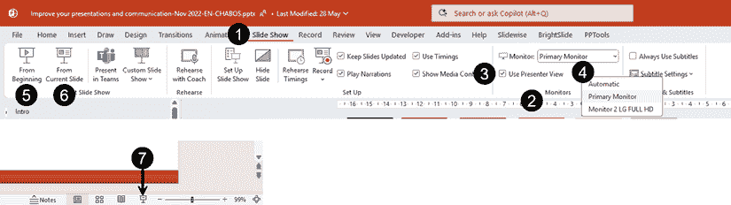

图 13.1 – 在幻灯片放映选项卡中激活或停用演示者视图

**监视器**下拉列表（**4**）允许您选择您想在哪个显示器上查看演示者视图。**自动**设置通常是默认设置，允许 PowerPoint 自动选择显示器。如果演示者视图不合适，我们将在演示者视图中看到一个选项来更改显示器。

启动幻灯片放映可以直接在**幻灯片放映**选项卡中通过使用**从头开始**按钮（**5**），从第一张幻灯片开始你的演示，或者使用**从当前幻灯片**按钮（**6**）。你还可以使用状态栏最右侧的**幻灯片放映**按钮（**7**）从所选幻灯片开始幻灯片放映。你还可以使用以下键盘快捷键来开始你的幻灯片放映：

+   从第一张幻灯片开始：*F5*

+   从当前幻灯片开始：*Shift* + *F5*

    你可能需要在某些外部键盘上按下*fn*（功能）键 + *F5*。

一旦开始幻灯片放映，你将在主显示器上看到演示者视图，并在第二显示器上显示幻灯片。如果你想要使用演示者视图练习你的演示，但没有第二个显示器、投影仪或电视，你首先需要开始你的幻灯片放映，然后右键点击鼠标以获取包含**显示演示者视图**选项的上下文菜单（**1**）（*图 13.2*）：

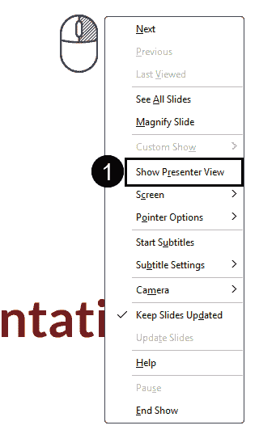

图 13.2 – 使用单个显示器访问演示者视图

现在我们已经了解了如何启动演示者视图，让我们回顾一下窗口中的主要部分（*图 13.3*）：

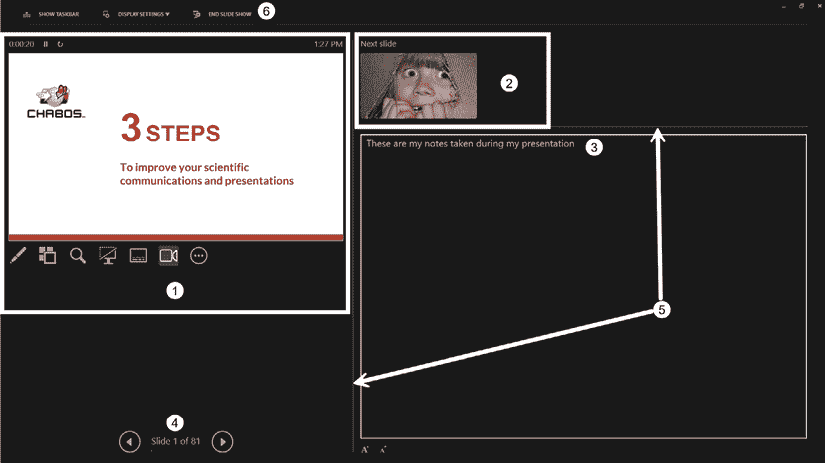

图 13.3 – 探索演示者视图的各个部分

+   第一个部分显示你的实际幻灯片以及你可以访问的各种交付工具（**1**）。

+   第二个部分显示了下一个动画或下一张幻灯片的预览（**2**），让你可以看到接下来会发生什么。

+   在第三个部分，如果你在内容创建阶段添加了任何备注，你将看到你的演讲备注（**3**）。现在，在演示过程中，你可以在这一部分添加备注。关于这一点，本章后面将有更多介绍。

+   你还可以在幻灯片预览下方找到导航按钮（**4**），显示当前幻灯片的幻灯片编号以及演示中幻灯片的总数。

+   窗口中的主要部分可以通过点击并拖动实际幻灯片和**下一张幻灯片**/备注之间的线，或者**下一张幻灯片**和备注之间的线（**5**）来调整大小。

+   在窗口顶部，有一个用于管理你的显示的选项卡（**6**）。

之前的例子显示了我自己调整大小的部分显示。默认显示通常显示一个更大的**下一张幻灯片**缩略图，这可能会让大多数演示者感到困惑，因为它就在当前幻灯片的演讲备注上方。

许多时候，当我帮助演讲者使用演示者视图排练时，我发现大多数人都感到困惑，因为他们的备注与上面的幻灯片不匹配——我必须说这仍然会发生在我的身上，所以我总是将下一张幻灯片缩小。我建议你调整**下一张幻灯片**部分的大小，使其变得非常小，这样你的眼睛可以理解即将出现的视觉内容，你还有更多的空间来写备注。

现在我们已经了解了演示者视图中的各个部分，让我们继续了解如何使用显示和导航工具。

# 使用显示和导航工具

当你使用演示者视图开始幻灯片放映时，你可能需要更改其显示方式，因此我们将首先查看显示工具（*图 13.4*）：

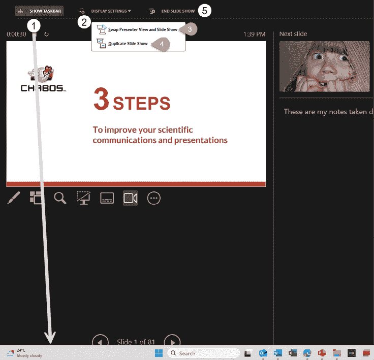

图 13.4 – 在演示者视图中使用显示工具

如果你需要在幻灯片放映时在电脑上的另一个窗口中查找某些内容，你很快就会意识到在使用演示者视图时看不到任务栏，因此使用**显示任务栏**工具（**1**）可能会有所帮助。它像一个切换按钮，你可以点击来显示或隐藏任务栏。请注意，它默认在主显示器上显示任务栏。如果你不想在观众看到的幻灯片下方显示任务栏，你需要使用**显示设置**工具。

**显示设置**工具（**2**）允许你通过使用**交换演示者视图和幻灯片放映**设置（**3**）来更改你想要显示演示者视图的设备。

如果你开始演示，但演示者视图在错误的屏幕上打开，不要慌张。只需通过点击**交换演示者视图和幻灯片放映**来切换。我在培训课程中多次使用它，以便人们可以在大屏幕上看到演示者视图，帮助他们了解这个功能。

**复制幻灯片放映**设置（**4**）将只显示你电脑和观众屏幕上的幻灯片。

你可以从显示工具中选择**结束演示文稿**（**5**），或者简单地按键盘上的*Esc*键。

为了帮助你进行演示，现在让我们更仔细地看看实际的幻灯片部分及其工具，这些工具可以帮助你保持进度并导航幻灯片（*图 13.5*）：

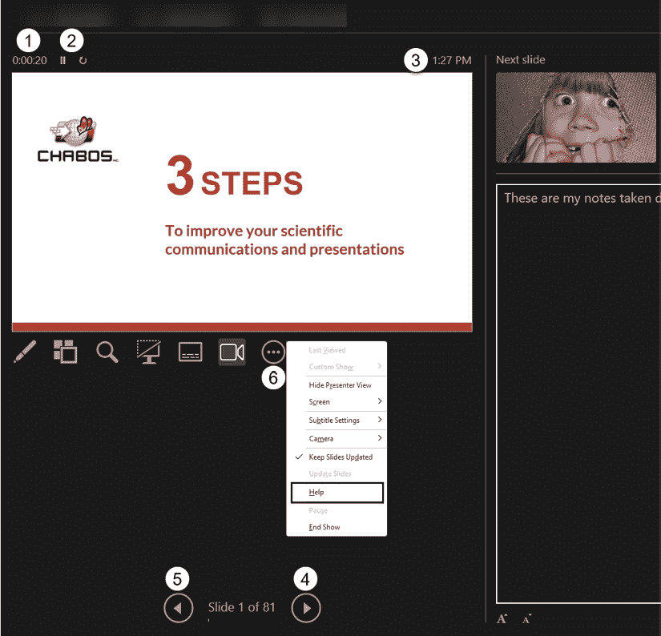

图 13.5 – 演示者视图工具，帮助你保持进度并导航幻灯片

在幻灯片预览的上方，你可以看到一个计时器（**1**）显示你的演示文稿的时长。它在你打开演示者视图时开始计时，这意味着在你准备开始与观众一起进行演示时，它将持续计时。

如果你想要依靠计时器来知道你已经演示了多久，你可能会欣赏它旁边的**暂停计时器**和**重置计时器**工具（**2**）。但你在幻灯片预览的右上角也可以看到当前时间（**3**）。例如，在培训课程中，我发现跟踪需要给人们休息的时间时，查看一天中的时间很方便。

要在幻灯片之间导航，你可以使用**转到下一个动画或幻灯片**按钮（**4**）或**返回到上一个动画或幻灯片**按钮（**5**），尽管我认为一个更有效的方法是使用键盘快捷键或演示遥控器。如果你需要键盘快捷键的刷新，点击**更多幻灯片放映选项**按钮（**6**）并选择**帮助**以访问整个列表。

你应该了解的最后一个导航工具是**查看所有幻灯片**按钮（**1**），它允许你在一个新窗口（**2**）中访问你所有的幻灯片（*图 13.6*）：

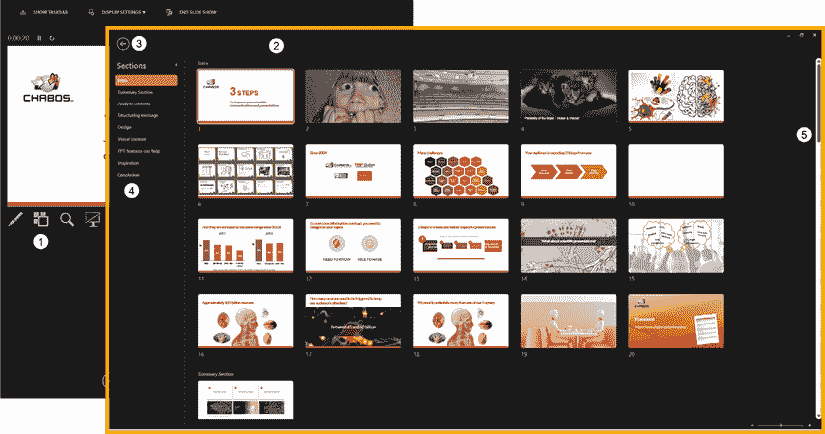

图 13.6 – 在演示者视图中使用查看所有幻灯片工具

新窗口将完全覆盖你的原始窗口，所以首先要知道的是，点击**后退**箭头（**3**）会带你回到演示者视图。在我的例子中，文件中创建的章节显示在窗口的左侧面板（**4**），这有助于比仅使用右侧的滚动条更快地找到特定内容。点击任何幻灯片缩略图都会带你回到演示者视图。如果你决定不想切换到另一个幻灯片，只需点击**后退**箭头（**3**）。

如你所见，使用演示者视图可以帮助你更轻松地管理你的显示，并通过能够快速导航整个演示来提高你对观众提问或评论的灵活性，即使你没有在你的演示中计划任何导航元素。现在让我们继续介绍另一组可以帮助你提供更具吸引力的演示的工具——注释工具。

# 使用注释工具

当你在演示者视图下幻灯片预览下方点击**笔**和**激光笔**工具按钮（**1**）时，你可以访问一些方便的注释工具，这些工具可以直接在幻灯片预览缩略图上使用（*图 13.7*）：

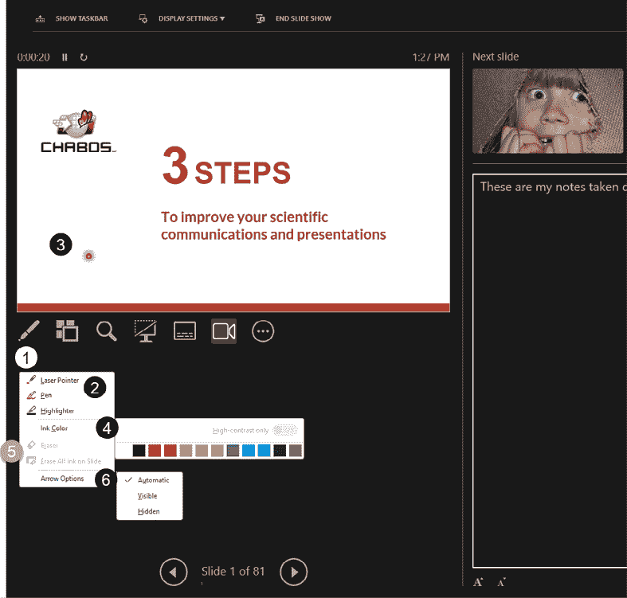

图 13.7 – 在演示者视图中访问注释工具

选择**激光笔**、**笔**或**高亮笔**工具选项（**2**）会将鼠标光标更改为所选类型，例如在我的例子中是**激光笔**（**3**），这使得观众更容易跟随你的光标。你可以用激光笔在你的幻灯片上绘制元素以短暂吸引注意力。如果你使用笔或高亮笔，你的绘制将保留在幻灯片上。

在将光标更改为任何工具之后，你可以在将其用于幻灯片之前更改其颜色（**4**）。你可以使用**橡皮擦**和**擦除幻灯片上所有墨迹**（**5**）工具来移除部分注释或一次性移除所有注释——这些工具仅在你在幻灯片上有注释时才有效。

**箭头选项**（**6**）只有在计划将鼠标光标移至观众所看到的内容上时才有帮助。当你使用演讲者视图在幻灯片放映模式下时，它在后台所做的操作是扩展你的屏幕视图，就像你有一个非常大的显示器一样，其中左侧用于显示演讲者视图，而右侧用于全屏幻灯片供观众观看。我建议你将设置保留为**自动**，并在需要时使用注释工具来突出幻灯片上的内容。这将比仅仅让常规鼠标指针在幻灯片上移动更容易让观众跟随。

如果你使用了任何注释工具，你需要回到列表并点击你激活的工具来关闭它。当你完成演示后，任何留在幻灯片上的注释都会触发一个对话框，询问你是否想保留或丢弃它们。如果你在演示结束后需要参考它们，请保留它们，它们将作为可编辑墨迹对象显示在你的幻灯片上。

现在我们已经看到了如何在演示过程中注释幻灯片，在下一节中，我们将看到其他你可能觉得在演示时有帮助的工具。

# 使用其他工具

我们不一定需要浏览演示视图中的所有剩余工具和设置。相反，我们将专注于你在演示时**缩放幻灯片**（**1**）、**黑白幻灯片放映**（**2**）和**点击添加笔记**（**3**）（*图 13.8*）：

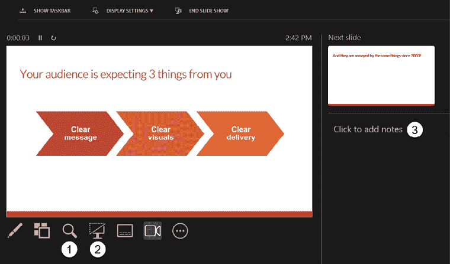

图 13.8 – 演讲者视图中额外的有用工具

如果你想让观众更仔细地查看幻灯片上的某个特定元素，使用**缩放幻灯片**功能（**1**）是一个很好的方法（*图 13.9*）：

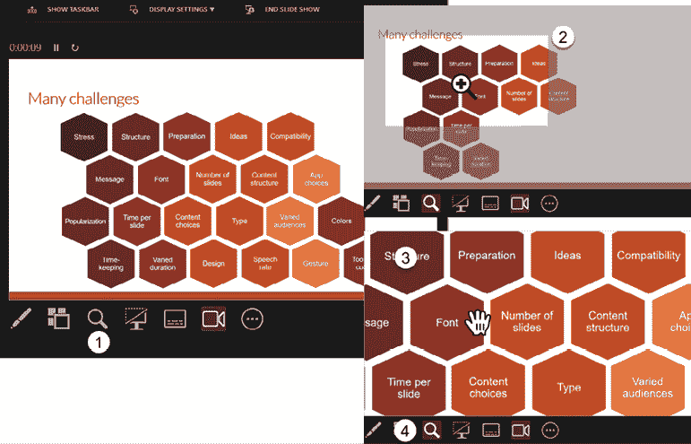

图 13.9 – 演讲者视图中缩放幻灯片的功能

+   点击放大镜图标（**1**）后，将光标移至幻灯片上，会显示一个带有放大镜图标的矩形，帮助你决定要缩放的区域（**2**）。

+   当你点击时，幻灯片会放大（**3**），显示一只手而不是常规的鼠标光标。如果你用鼠标左键点击并保持，你可以拖动图片来在幻灯片上移动缩放效果。你可以使用*Ctrl*键加鼠标滚轮上下滚动来改变缩放级别。

+   当你想回到整个幻灯片视图时，只需再次点击放大镜图标（**2**）或键盘上的*Esc*键。

这个功能易于使用，并创建了一个简单但有效的缩放效果，有助于提高观众的理解。

有时，帮助我们的观众理解我们在说什么意味着帮助他们集中注意力在我们身上，不受干扰，这时您就可以利用**黑色或非黑色幻灯片放映**功能（**1**）（*图 13.10*）：

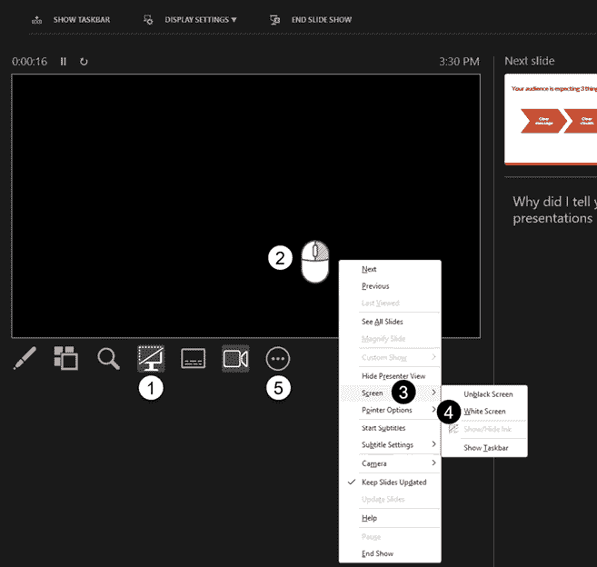

图 13.10 – 使用黑色或非黑色幻灯片放映功能来提高观众的注意力

当您点击监视器图标（**1**）时，它会被突出显示，幻灯片预览变为黑色。我建议在您需要讲话而幻灯片视觉内容与您要说的内容不相关时使用此功能。您会看到人们的目光重新回到您身上，帮助他们集中注意力在您的话上。

这里有一些将黑色屏幕改为白色的方法：

+   右键点击黑色幻灯片（**2**），然后转到**屏幕**（**3**），接着选择**白色屏幕**（**4**）。

+   点击**更多幻灯片放映选项**（**5**），然后选择**屏幕**和**白色屏幕**。

+   在您的键盘上连续按两次*W*键。它将首先移除黑色屏幕，然后应用白色屏幕。

将您的幻灯片预览设置为白色可以成为一个很好的画布，使用注释工具绘制一些东西来帮助观众理解。如果您尝试这个技巧，请注意，您的注释无法保存，因为您是在隐藏的幻灯片上绘制的。

当您想要继续演示时，再次点击**黑色或非黑色幻灯片放映**图标（**1**）——您也可以按键盘上的*B*键或*Esc*键。如果您已经使用了白色屏幕，它不会保留到下一次。您需要回到选项设置中再次更改它。

如果您在一个带有投影仪的房间中演示并使用白色屏幕，可能会有一束白光照在您的脸上。在您的演示之前，请先过一遍您的演示，以便您可以测试设置和设备，确保一切按计划进行。

如果您在演示时需要做些笔记，演示者视图已经得到了很好的升级，允许 M365 用户在演示时添加笔记。您可以通过在幻灯片上没有演讲备注时看到**点击添加备注**文本（**1**）来知道这个功能在您的版本中是可用的（*图 13.11*）：

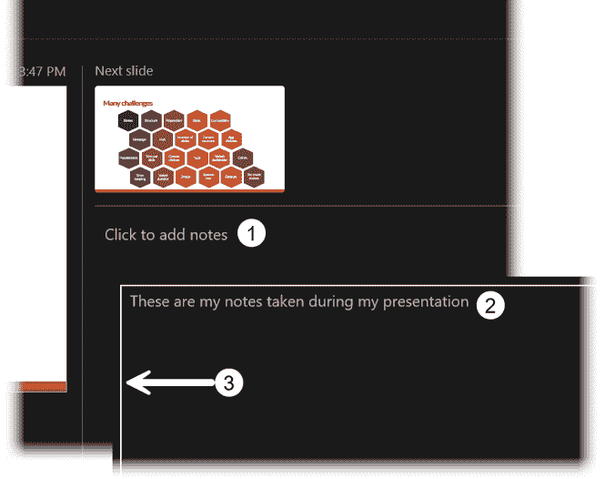

图 13.11 – 在演示者视图中为您的幻灯片添加备注

要添加备注，只需在备注部分点击并输入您的文本（**2**）。您还会看到一个白色轮廓（**3**）表示该部分。完成您的演示后，您的备注将出现在幻灯片下方的备注窗格中。

现在我们已经介绍了许多可以帮助您进行演示的工具，让我们看看最后一个可以帮助您制作更易于访问的演示的功能。

# 使用实时字幕使您的演示更易于访问

如果您是 M365 用户并想使用此功能，请确保您使用的是连接到计算机的优质麦克风，并确保您有互联网连接来交付您的演示文稿。使用实时字幕不仅可以让您的演示文稿更具可访问性，还可以让您的演示文稿对您的观众更容易理解。

如果您想在所有演示文稿中使用字幕，您只需在**幻灯片放映**选项卡（**1**）中勾选**始终使用字幕**复选框（**2**）即可（*图 13.12*）：

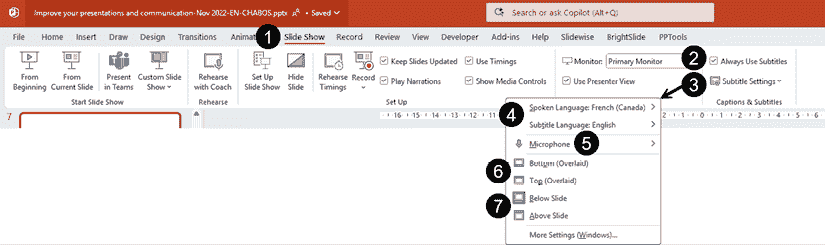

图 13.12 – 在所有演示文稿中使用字幕

访问**字幕设置**（**3**）将允许更改字幕的设置：

+   ** spoken language**和**字幕语言**（**4**）：您需要从微软提供的列表中选择您将使用的语言，以及您希望字幕显示的语言。

仅支持 M365 商业、企业和教育许可证使用其他语言的字幕。在商业基础版和教育 A1 版中，某些功能可能有限。

+   **麦克风**（**5**）：如果您计划使用笔记本电脑的内置麦克风，请确保先对其进行测试。我见过不少笔记本电脑麦克风没有达到生成高质量实时字幕所需的质量水平。如果您使用的是外置麦克风，请确保在开始演示之前选择您的设备。

+   选择您字幕的位置：

    +   前两个选项，**底部（叠加）**和**顶部（叠加）**（**6**），将在您的幻灯片底部或顶部添加半透明形状的标题。我建议您避免这些选项，因为它们在创建内容时需要额外的规划以避免覆盖重要信息；这也意味着幻灯片上您的内容空间更少。

    +   以下两个选项，**在幻灯片下方**和**在幻灯片上方**（**7**），是最佳选择。是的，这会减小您投影幻灯片的尺寸，但您的内容永远不会被字幕隐藏。如果您在一个大房间中做演示，并且投影屏幕的底部可能会被坐在房间前面或舞台上的观众遮挡，您可能需要考虑使用**在幻灯片上方**设置而不是默认的**在幻灯片下方**设置。

在**演示者视图**中，您可以点击**切换字幕**（**1**）图标来停止或启动该功能。在幻灯片预览区域，您的讲话将被捕捉并添加到您选择的位置。在以下示例中，它位于幻灯片下方（**2**）（*图 13.13*）：

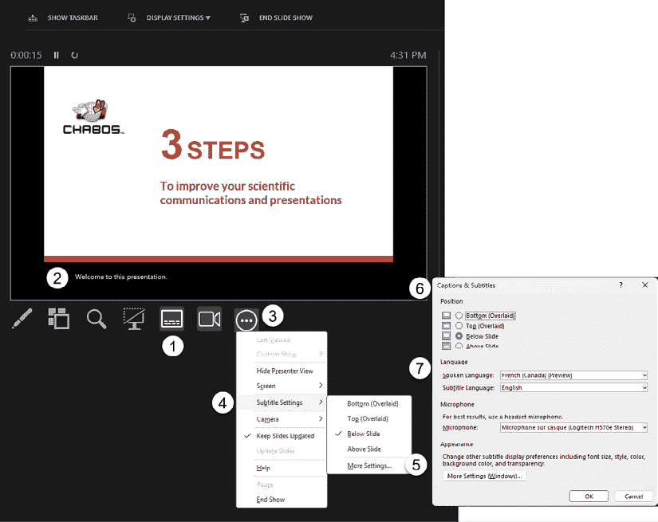

图 13.13 – 在演示中使用字幕

+   如果你在演示者视图中需要更改字幕设置，请点击**更多幻灯片选项**（**3**）图标，然后点击**字幕设置**（**4**）。这是在演示过程中快速更改字幕位置的方法。

+   点击**更多设置…**（**5**）将打开**字幕与字幕**对话框（**6**）。如果你在演示过程中想要更改**语言**，这将非常有用。

注意，如果你的口语语言列在**预览**部分，这意味着 AI 的准确性不会像对完全支持的语言那样精确。

在演示过程中使用字幕时，你需要注意你的语速和发音，以获得更精确的字幕结果。

使用字幕可能需要额外的设备，这取决于你是在线上演示还是在现场演示。如果你需要帮助，可以考虑寻求技术专家的帮助。这值得花费时间和投资，并将极大地提高你对观众的影响。

# 摘要

在本章中，你已经了解了如何使用演示者视图并利用其许多优秀工具来改善你的演讲表现，以及如何通过使用字幕使你的演示更具可访问性和包容性。

使用演示者视图帮助你减少忘记要说什么的恐惧，是提高演讲表现的一种好方法。只是确保你不在笔记中放入非常长的脚本。这样做可能会增加你的压力水平，因为你必须滚动查看笔记，或者甚至可能使你的目光从观众身上转移到电脑上。此外，如果你有一个很长的脚本，阅读它可能会让你听起来没有准备，也不自然。我能给出的最好建议是，在演讲练习结束时，尽量将笔记缩减为非常简短的句子或关键词。这样，你的笔记就变成了你想要讨论的点的提醒。

虽然我认为演示者视图可以非常出色，但如果认为它将解决你所有的演讲问题，那你就错了！没有任何工具可以取代高质量的练习时间；它只能帮助你提高表现，因为你已经彻底练习了你的演讲。

在本书的最后一章中，我们将讨论如何使用 Microsoft Teams 中的**PowerPoint Live**功能。如果你经常使用 Teams 进行远程或虚拟演示，这将帮助你更有效地管理你的演讲。

|

#### 现在解锁这本书的独家优惠

扫描此二维码或访问[`packtpub.com/unlock`](https://packtpub.com/unlock)，然后按书名搜索。 |  |

| **注意**：在开始之前，请准备好您的购买发票。 |
| --- |
