# 第十四章：Microsoft Teams 中的 PowerPoint Live 和交互式功能

如果您进行虚拟演示，在尝试确定最佳方式来共享您的 PowerPoint 演示文稿时可能会遇到挑战。是的，您可以直接共享整个屏幕并使用**演示者视图**，如前一章所述。但这样您可能很难看到会议控制，尤其是如果您只使用一台显示器。

随着虚拟演示现在成为我们商业生活的一部分，我想包含一个章节，介绍如何利用 Microsoft Teams 的 PowerPoint Live 和其他功能来创造更多的互动和参与。为什么选择 Teams 而不是其他虚拟会议工具？简单来说，因为它是我自 2017 年推出以来一直在使用并看到其发展的应用程序，以及它利用 Microsoft 365 中包含的更多功能的能力。

为了帮助您在 Teams 中使用 PowerPoint Live 将演示文稿提升到新的水平，本章讨论了以下主题：

+   开始使用并使用 PowerPoint Live

+   创建和使用分组会议室

+   使用问答和投票来创造更多互动

+   创建和使用头像

+   改善摄像头、照明和麦克风设置

# 技术要求

您需要使用带有 Microsoft 365 工作或学校许可证的 Microsoft Teams 才能访问 PowerPoint Live。请注意，由于 Microsoft Teams，就像 PowerPoint 的订阅版本一样，会持续更新，因此本章中显示的截图可能与您应用程序的版本不同。

*创建和使用头像*部分有额外的要求：

+   Teams Essentials 或 M365 Business / Enterprise 许可证

+   Teams 桌面应用程序

+   一台运行 Windows 或 macOS 的相当强大的计算机

+   需要由 IT 在 Teams 管理中心允许使用 Avatars 应用

# 开始使用并使用 PowerPoint Live

尝试在 Microsoft Teams 中管理您的 PowerPoint 演示文稿、参与者、反应和聊天窗口可能会相当具有挑战性，尤其是如果您只连接了一台显示器到您的计算机。即使您有两台显示器，处理各种重叠的窗口也可能令人不知所措。

此时，PowerPoint Live 功能可以帮助您。您可以在点击 Teams 会议窗口中的 **共享** 按钮（**1**）时找到它（*图 14.1*）：

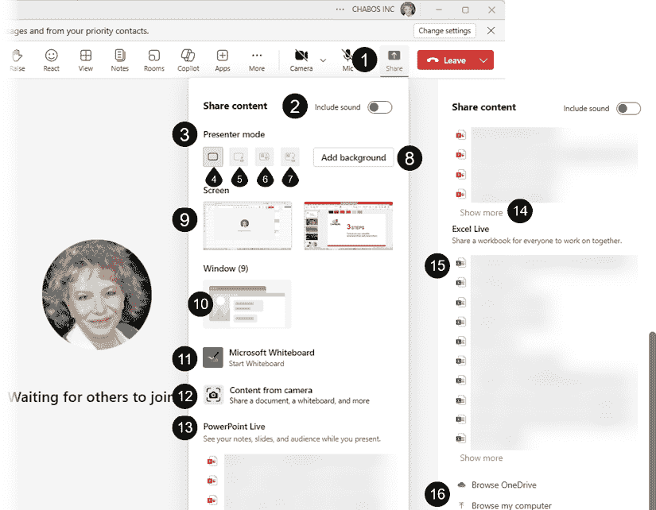

图 14.1 – 从 Teams 的共享屏幕功能启动 PowerPoint Live

让我们先定义一下可用的共享选项：

+   **包含声音**（**2**）：如果您演示文稿中包含声音，请确保切换此选项。这是与会者能够听到声音的唯一方式。

+   **演示者模式**部分（**3**）：

    +   **仅内容**（**4**）将仅显示共享内容。

    +   **突出显示**模式（**5**）将视频流叠加在幻灯片上方。

    +   **并排** ( **6** )显示你的视频流在你的幻灯片或内容旁边。

    +   **报告者** ( **7** )模式将你的幻灯片显示在视频流的左侧角度，就像我们看到的新闻报道者一样。

当通过 PowerPoint Live 共享演示文稿时，你不能使用**突出显示**、**并排**或**报告者**模式。

+   **添加背景**按钮 ( **8** )让你可以选择模糊或选择背景图片。

+   **屏幕** ( **9** )部分允许你共享整个屏幕，这样你可以在共享屏幕的同时轻松地在不同的窗口之间切换。如果你只有一个显示器，则只有一个缩略图视图可用。

    **警告**：这种类型的屏幕共享会将你的屏幕上的所有内容显示给你的参会者。在开始会议之前，请确保你已经关闭了任何机密内容。

+   **窗口** ( **10** )部分允许你选择要共享的特定窗口。括号中的数字显示你可以从多少个单个窗口中进行选择。点击窗口插图将显示所有窗口的预览，以便你可以选择所需的窗口。

+   **Microsoft Whiteboard** ( **11** )允许共享现有的或新的虚拟白板，以便每个人都可以在上面绘制和头脑风暴。

+   **来自摄像头的** ( **12** )内容允许你通过摄像头或从更复杂的设备设置共享外部内容。

+   **PowerPoint Live** ( **13** )部分将显示你的最近 PowerPoint 文件列表，如果它们存储在你的 OneDrive for Business 或 SharePoint 站点上。点击其中一个文件将开始使用 PowerPoint Live 共享你的内容，我们将在后面进行描述。你可能需要滚动列表以查看**显示更多**选项 ( **14** )。

+   **Excel Live** ( **15** )部分允许你在会议期间共享和协作 Excel 文件。有一些限制，例如最多 25 名参会者和组织外的人无法获得访问权限。请参阅*进一步阅读*以获取完整的支持文章。

+   如果你 PowerPoint Live 列表中没有文件，或者你需要的是不在那里的文件，你可以使用**浏览 OneDrive**或**浏览我的电脑** ( **16** )来加载你的演示文稿并使用它。

如果你浏览计算机或网络驱动器以上传演示文稿文件，它将被添加到会议文件中。如果你创建一个个人会议，文件将在参与者打开日历中的 Teams 会议详细信息时对会议参与者可用，并保存在你的 OneDrive 空间中。如果你创建一个频道会议，文件将在团队文件中对所有团队成员可用。

在从 PowerPoint Live 列表中选择 PowerPoint 文件后，将出现一个加载屏幕，直到应用程序准备就绪。你的 Teams 会议屏幕将调整以包括 PowerPoint Live 功能 ( **1** )，这些功能与上一章中看到的演示者视图布局相似，同时保持你的会议管理工具可用 (*图 14.2*)：

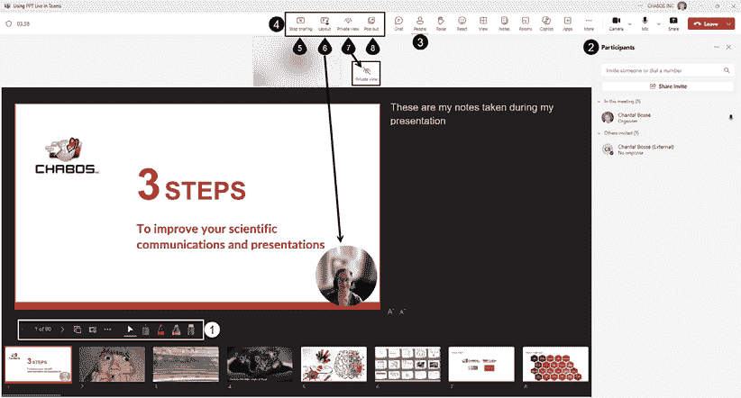

图 14.2 – PowerPoint Live 功能集成到您的 Teams 会议窗口

我还打开了**参与者**面板（**2**），在会议工具中标记为**人员**（**3**），以向您展示管理演示和您的与会者有多容易。

在会议工具栏中，会议窗口上方出现了一类新的工具（**4**）：

+   **停止共享**（**5**）是您想要停止共享演示时必须点击的地方。

+   **布局**（**6**）：当检测到幻灯片上的 Cameo 对象时，此按钮会在**轮廓**和**仅内容**之间切换焦点。

+   **私密视图**（**7**）是一个必须了解的功能！默认情况下，与会者可以在您演示时浏览您的幻灯片，即使是没有被覆盖的幻灯片。要禁用浏览即将到来的幻灯片，请点击**眼睛**图标。

+   **弹出**（**8**）允许将 PowerPoint Live 放在一个单独的窗口中。如果您只有一个显示器，我建议您避免使用它，因为它会使您的会议管理更加复杂。

当使用 PowerPoint Live 共享功能时，后台有一些操作解释了加载图标。如果您的文件尚未存储在云端存储中，那么如果是个人会议，它首先会被上传到您的 OneDrive；如果是频道会议，则上传到 SharePoint。然后文件会被处理和优化，以便在 Teams 中作为基于网页的体验运行。这一步骤允许 Teams 向每个参与者流式传输相同的云端托管版本，同时使实时字幕和翻译成为可能。PowerPoint Live 使用比屏幕共享更少的带宽。

PowerPoint Live 使您轻松浏览幻灯片变得容易，因为大多数工具都类似于我们在上一章中在演示者视图中描述的工具。让我们回顾一下您可以使用的内容（*图 14.3*）：

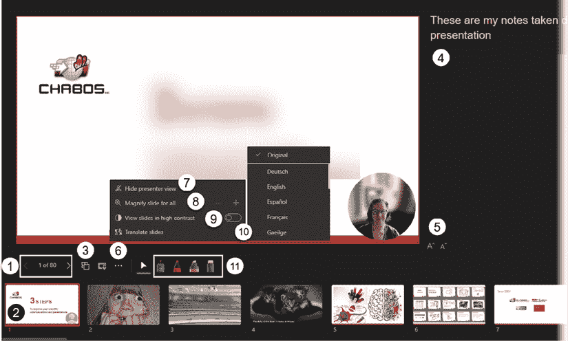

图 14.3 – 在您的演示中使用 PowerPoint Live 工具

+   您有箭头、当前幻灯片的编号以及幻灯片总数，用于幻灯片导航（**1**）。

+   **缩略图条**（**2**）用于快速访问另一张幻灯片。

+   您所有幻灯片的列表在**网格视图**（**3**）中显示，以便按需轻松展示。

+   **笔记**面板（**4**）显示您的笔记，但在您的演示过程中不允许添加或更改它们，至少在审查这一章节时是这样的。但您确实有工具可以增加或减少字体大小（**5**）。

+   在**更多操作（…）**（**6**）中：

    +   您可以使用**隐藏演示者视图**（**7**）来移除您的笔记和幻灯片缩略图条，同时保留幻灯片预览下方的工具行。

    +   您可以使用**放大所有幻灯片**工具（**8**），这需要点击**+**号。如果您习惯使用*Ctrl* + *鼠标滚轮*技巧来缩放，那么您可能不需要它，这在演示者视图中已经讨论过。

    +   **以高对比度查看幻灯片**（**9**）是参会者侧的一个辅助功能。它帮助有视觉对比度或颜色问题的参会者。

    +   **翻译幻灯片**（**10**）允许参会者选择语言以机器翻译您幻灯片上的文本。请注意，机器翻译并不完美，它可能会引入格式变化。

+   注释工具（**11**）与用于演示者视图讨论的工具类似。点击其中一个工具，可以将鼠标光标转换为激光指针、笔或荧光笔。点击图标第二次时，会弹出设置，如颜色或粗细（如有适用）。使用橡皮擦删除注释，或点击第二次以访问清除幻灯片上所有注释的设置。

在您的虚拟会议中使用 PowerPoint Live 是一种保持对演示和参会者互动控制的绝佳方式。您还可以将其用作自己的练习工具，记录您的会议，然后回顾它们以检查时间安排和您看摄像头的方式。提前练习您的虚拟演示是一种不断提高您表现力的好方法。

我们将在下一节中简要讨论您如何调整会议视图。

## 调整您的会议视图

在 Teams 中使用 PowerPoint Live 时，您会自动看到参会者以及您自己的摄像头流或瓷砖，它们显示在幻灯片预览上方（**1**）。您可以根据需要更改此视图（*图 14.4*）：

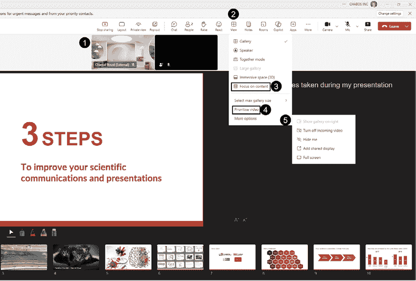

图 14.4 – 使用 PowerPoint Live 时更改视频摄像头的显示方式

我们将在下一节中讨论一些从**查看**菜单（**2**）中考虑的有趣设置：

+   **聚焦内容**（**3**）：激活此功能将移除您的幻灯片预览上方的摄像头流和瓷砖。如果没有人使用摄像头，那么使用它可能值得，这样您的内容就可以填满整个空间。

+   **优先显示视频**（**4**）：首先在参会者列表中排列视频流。关闭摄像头的参会者将被列在最后。

+   **更多选项** | **在右侧显示图库**（**5**）：当至少有四个参会者开启视频时，此功能处于活动状态，并允许在 PowerPoint Live 视图的右侧垂直移动图库。

您必须在 Teams 桌面上的**图库**视图中，并且应用程序窗口足够宽，以支持并排布局。

您可以探索许多查看选项。讨论的这些选项与我们的话题最相关，涵盖了在 Teams 中使用 PowerPoint Live。

如果您在 PowerPoint 中使用字幕来使您的演示更易于访问，那么您必须了解 Teams 中的功能，以便使使用 PowerPoint Live 的演示更易于访问，这是下一节的主题。

## 使 PowerPoint Live 演示更易于访问

当在 Teams 中使用 PowerPoint Live 时，它不会显示 PowerPoint 中配置的字幕；因此，您需要在 Teams 中将其打开（*图 14.5*）：

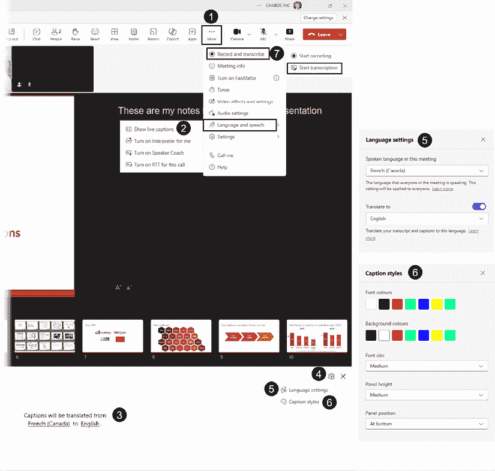

图 14.5 – 在 Teams 中开启字幕

+   前往**更多**（**…**）（**1**）菜单并打开**语言和语音**功能（**2**）。点击**显示实时字幕**。

+   在 PowerPoint Live 视图的底部，将显示一个**字幕**面板（**3**），如果之前使用过，将提及翻译设置。

+   点击**打开字幕设置**图标（**4**），然后选择**语言设置**以打开**语言****设置**面板（**5**）。您将能够选择口语语言，激活字幕翻译，并选择翻译语言。翻译选项将适用于 M365 商业高级版、E3 和 E5 许可证。

+   要更改字幕样式，请返回到**打开字幕设置**图标（**4**），然后选择**字幕样式**（**6**） – 将打开一个新的面板。您可以更改字体和背景颜色、字体大小、面板高度及其位置，在底部或顶部。

+   您可以考虑的另一个选项是**开始转录**（**7**），在**更多**（**…**）（**1**）菜单中的**录制和转录**中可用。启动此功能将在您的会议屏幕右侧打开一个面板，并捕捉每个参与者所说的话，要么用他们的名字，要么匿名，这取决于他们选择的 Teams 设置。它可以是会议中的一个富有成效的功能，因为它可以记录您的讨论。转录还可以帮助您重新利用虚拟演示，因为您可以将转录内容下载为 Word 文件或 `.vtt` 文件以添加到您的视频中。此功能仅限于 Teams 的桌面版本和选定的一组许可证。有关详细信息，请参阅“进一步阅读”中的支持文章。

现在我们已经看到了在使用 PowerPoint Live 共享演示时可以使用的最重要的功能，让我们看看如何从您的会议窗口中使用分组讨论室来创造更多的参与度。

# 创建和使用分组讨论室

在 Teams 会议中，您可以使用分组讨论室的场景有很多。创建和使用这些房间的方法也有很多！由于我想保持关注如何使用此功能来保持演示参与者参与，以下示例中我将只讨论一个场景。如果您想了解更多关于创建和使用分组讨论室的各种方法，请参阅“进一步阅读”中列出的支持文章。

假设你正在使用 Teams 会议进行工作坊。如果你在一个房间里与你的参会者在一起，你可能会要求他们分成小组讨论一个特定的话题，每个小组将向整个小组展示。

要从你的会议窗口重现这个团队练习，你需要点击 **会议室** 图标（**1**）以访问 **创建分组会议室** 面板（**2**）（*图 14.6*）：

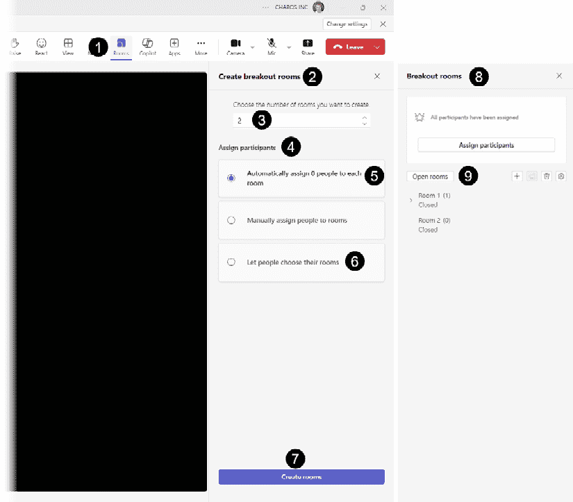

图 14.6 – 在 Teams 中创建和使用分组会议室

+   第一部分，**选择你想要创建的会议室数量**（**3**），有一个下拉列表来选择你想要创建的会议室数量；最多可以创建 50 个分组会议室。在我们的例子中，我将保持 **2** 作为要创建的会议室数量。

+   在 **分配参与者** 部分（**4**），默认选项是 **自动将人员分配到每个会议室**（**5**），在这里你会看到已经参加会议的人数。**让人员选择他们的会议室**（**6**）选项在你创建由引导者领导的多种练习时可能非常有趣，允许参与者选择他们偏好的话题。

+   剩下的唯一事情就是点击 **创建会议室** 按钮（**7**），将右侧面板更改为 **分组会议室**（**8**），它有一套自己的工具和一个 **打开会议室**（**9**）按钮。

当你需要即时创建分组会议室时，自动分配人员既快又简单。如果你需要将特定人员分配到特定的小组，请参考 *进一步阅读* 中的 Microsoft 支持文章，了解如何在活动之前创建你的分组会议室。当结构至关重要且参与者众多时，这是一种更有效的方法。

打开你的会议室后，你可以从 **分组会议室** 面板中管理它们。在我的例子中，有一个会议室保持关闭状态（**1**），因为没有参与者可以添加到其中（*图 14.7*）：

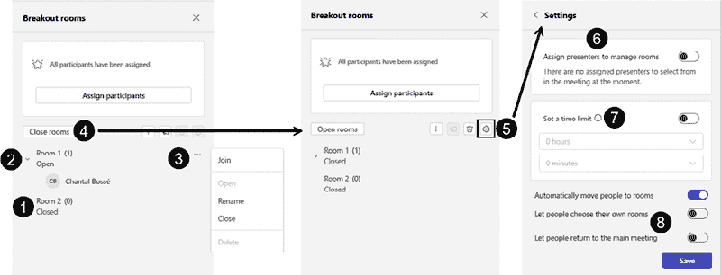

图 14.7 – 管理分组会议室和设置

+   点击打开的会议室左侧的 **小箭头** 打开参与者列表（**2**）。

+   将鼠标悬停在会议室上会显示选项（**…**）（**3**），允许你加入、重命名或关闭会议室。

+   **关闭会议室** 按钮（**4**）一次性关闭所有会议室，并将参与者带回你的主要 Teams 会议。

+   当你的会议室关闭时，你可以访问 **设置**（**5**），这允许分配人员来管理会议室（**6**），切换 **设置时间限制**（**7**）功能为激活状态，并在 **小时** 和 **分钟** 列表中选择持续时间，并决定人们是否可以选择他们的会议室或自行返回主会议。在做出任何更改后，请始终点击 **保存** 按钮。

使用分组室可以帮助在演示过程中改变节奏，同时帮助与会者之间进行更多互动，在你继续演示之前让他们充满活力。熟悉各种分组室功能和设置，以便你可以尝试适合你内容类型的场景。

现在我们来谈谈在 Teams 会议中你可以使用的另外两个交互功能，这些功能可以帮助你增加与会者的互动，同时收集他们的反馈以帮助你调整你的演讲。

# 使用问答和投票来创建更多互动

虚拟演示需要更多的互动来保持观众的参与度。原因很简单：你正在与电子邮件、新闻源、短信和社交媒体竞争，因此你绝对需要找到吸引每个人注意力的方法。

当使用 Microsoft Teams 时，你有一些很好的工具可以帮助你，我们将在接下来的几节中讨论其中两个。

## 使用问答

**问答**是 Teams 会议的一个很好的补充，允许你将问题和重要讨论从常规聊天面板中分离出来。不幸的是，它默认不激活，并且首先需要在会议选项中激活。这可以在创建会议邀请时完成，也可以在会议期间完成（*图 14.8*）：

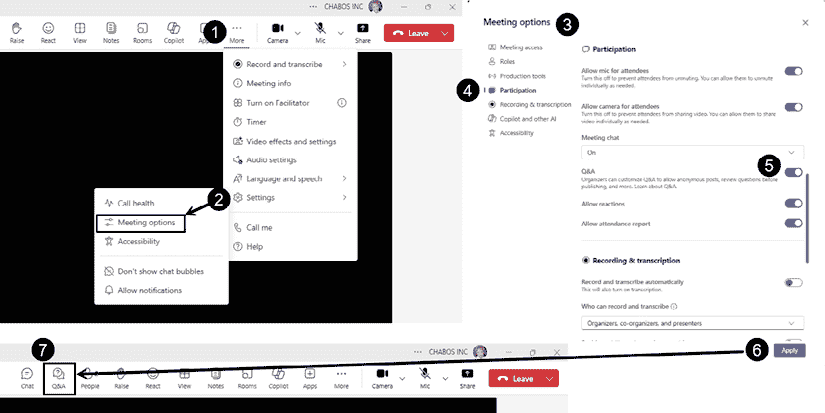

图 14.8 – 在会议中启用问答

+   点击**更多**（**…**）（**1**），转到**设置**（**2**），然后点击**会议选项**。

+   在新的**会议选项**窗口（**3**）中，转到**参与**部分（**4**），并将**问答**开关切换到激活状态（**5**）。

+   点击**应用**按钮（**6**），以便你的 Teams 会议更新为包含**问答**应用（**7**）。

前面的步骤仅适用于你是 Teams 会议的组织者，或者如果你被指定为会议的共同组织者。如果会议是由其他人为你安排的，并且他们没有让你成为共同组织者，你需要要求他们进行更改。他们可以回到他们的日历中的会议并更改会议选项，或者他们可以开始会议并按照前面的步骤更改选项。如果你不熟悉 Teams 会议中的不同角色，请查看“进一步阅读”中的 Microsoft 支持文章。 

当你在会议窗口工具栏中确实有**问答**可用时，点击其图标（**1**），以便**问答**面板（**2**）在右侧显示（*图 14.9*）：

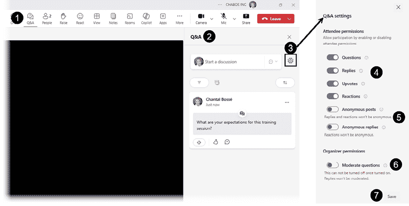

图 14.9 – 打开问答并管理其设置

+   如果你从未使用过这个功能，首先应该点击齿轮图标（**3**）来访问**问答设置**面板。

+   你可以决定你给予参会者的权限，例如提问、回复、点赞或对问题做出反应（**4**）。由于我们的目标是提高与参会者的互动，允许他们提问和回复，而不是仅用问答来提问。

+   下一个设置是允许参会者使用匿名帖子或回复（**5**）——有一个重要说明提到回复和反应将不会是匿名的。

+   最后，你可以激活**审阅问题**切换按钮（**6**），使其在审阅后才可用。如果你是独自主持会议，我建议不要使用它，以免给你带来额外的任务。

+   你所做的任何更改都会激活**保存**按钮（**7**）。

你或你的参会者可以通过点击**开始讨论**字段（**1**）快速输入问题，以访问**发布为**对话框（**2**）（*图 14.10*）：

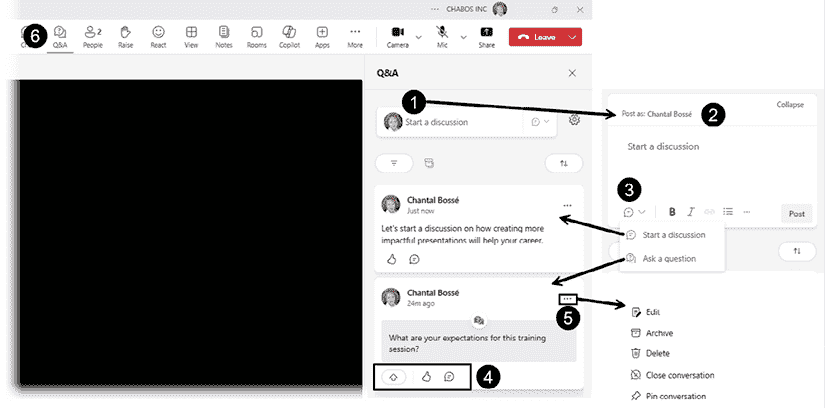

图 14.10 – 在问答中添加和管理问题

+   有两种类型的帖子可供选择（**3**）：**开始讨论**和**提问**。两者之间没有太多区别，除了一个问题被一个彩色矩形阴影覆盖，并且它有三种而不是两种交互类型（**4**）：**点赞**、**反应**和**评论**。

+   如果你想要管理问答消息列表，你可以点击省略号（**…**）（**5**）来访问**编辑**、**存档**、**删除**、**关闭对话**或**固定对话**功能。

+   当你在会议中的问答部分有新活动时，你会在**问答**图标（**6**）上方看到一个小的圆圈来通知你。

要熟悉这个功能，最好的方法是计划一次与少数人进行的练习会议，并决定对你来说什么是有用的。再次强调，问答可以在创建会议邀请时提前计划。

使用问答来提出任何正式问题的优点是避免在用于所有内容时搜索聊天面板。为了使这起作用，你确实需要在会议开始时告诉你的参会者你的期望。如果你更喜欢问答来提问和特定主题，而聊天用于更非正式的对话，向他们展示如何找到那些面板并使用它们。

尽管问答可能是一个添加你自己的问题给参会者的好地方，但你可能想考虑**投票**，这是下一节的主题。

## 在会议中使用投票

**投票**是一个可以快速添加到你的 Teams 会议中的应用程序，这样你可以提出各种问题并让参会者参与（*图 14.11*）：

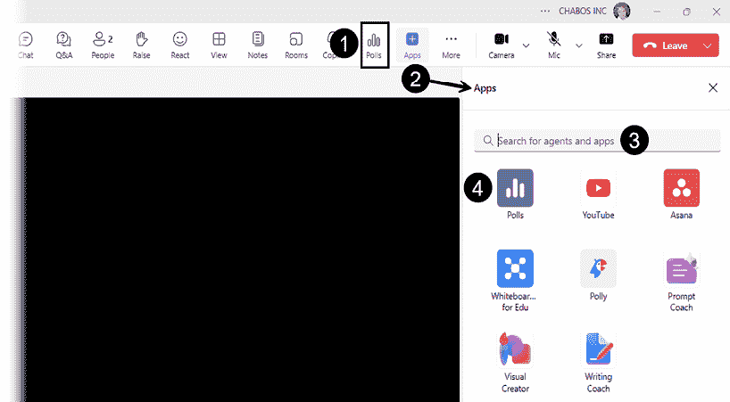

图 14.11 – 查找和添加投票应用

如果您在 Teams 会议工具栏中没有看到**投票**图标（**1**），请点击**应用**图标（**2**）。使用搜索框（**3**）并添加`Polls`关键字。当您在列表中看到**投票**时，点击它（**4**）。

在您的演示过程中，您可以通过点击其图标（**1**）来快速启动投票应用，以打开**投票**面板（**2**）并查看**建议**（**3**）（*图 14.12*）：

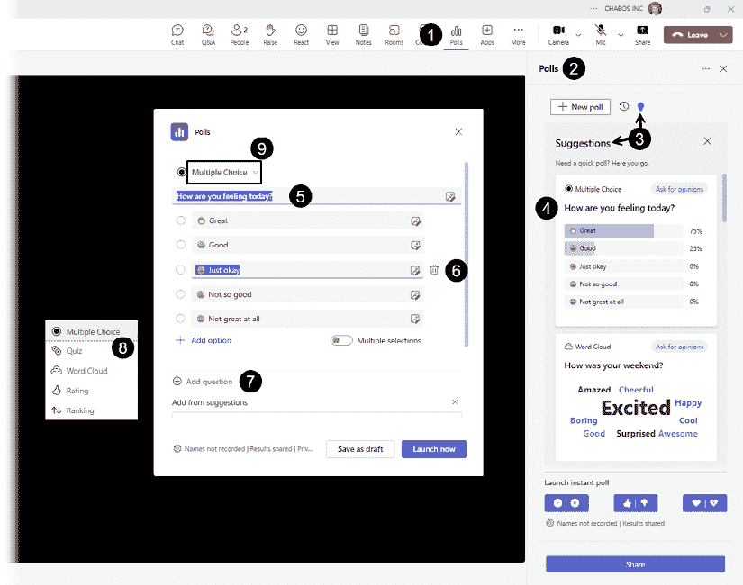

图 14.12 – 启动投票和使用建议

+   列表中有很多快速投票，您可以轻松地即时自定义。例如，点击**你今天感觉怎么样？**（**4**）将打开一个新窗口。

+   在新的**投票**窗口中，您可以通过点击任何字段来简单地编辑问题或答案（**5**）。

+   如果您想删除一个选项，请点击该字段，然后选择**删除**图标（**6**）。

+   如果需要，点击**添加问题**（**7**），然后从列表中选择您想要创建的问题类型（**8**）。

+   当您点击问题类型旁边的箭头（**9**）以更改问题类型时，也会显示问题类型列表。

接下来，您应该查看从**投票**创建窗口底部链接提供的投票设置（**1**）（*图 14.13*）：

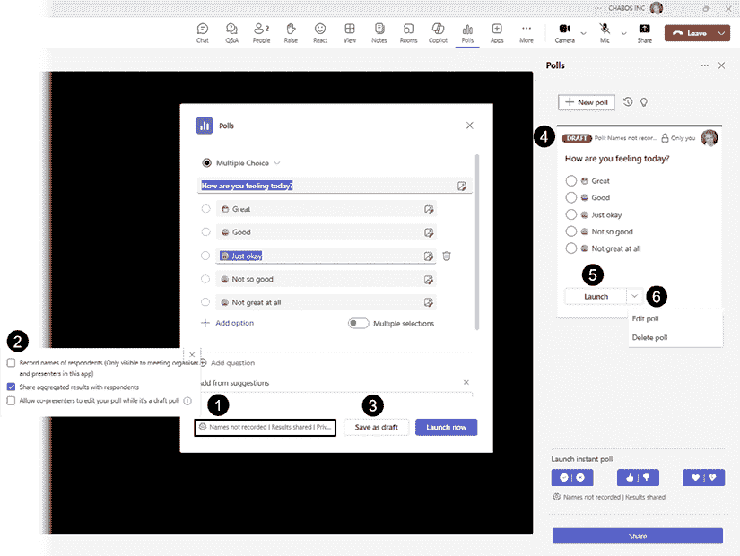

图 14.13 – 更改投票设置并保存或启动

+   默认情况下，投票的汇总结果会与您的与会者共享（**2**），但您可以选择记录他们的名字作为组织者或演讲者，或者允许您的共同演讲者编辑已保存为草稿的投票。

+   当您点击**保存为草稿**按钮（**3**）时，您的投票将在**投票**面板（**4**）中列出为**草稿**。

+   当您准备好将其设置为直播时，可以点击**启动**按钮（**5**），或者点击其旁边的箭头（**6**）来编辑或删除您的投票。

当您直接从创建窗口启动投票时，它将覆盖会议窗口（**1**）并显示给会议中的每个人，并在**投票**面板中标记为**直播**（**2**）（*图 14.14*）：

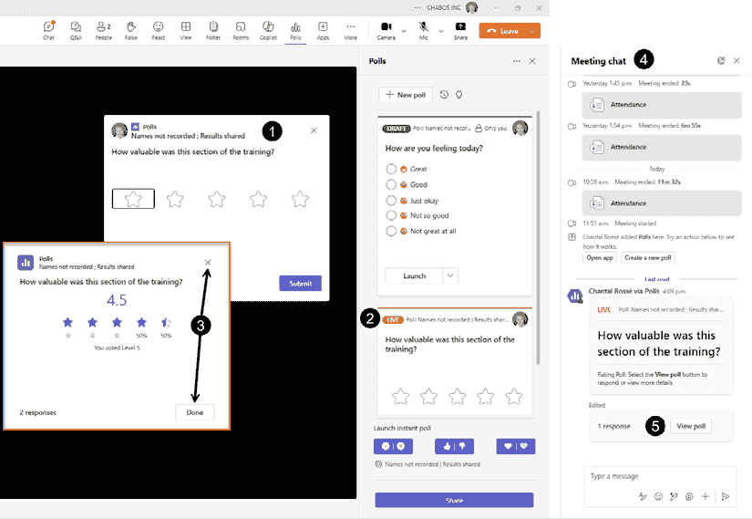

图 14.14 – 启动投票并在会议聊天中检索

+   人们可以从覆盖窗口回答并提交他们的回复，并查看总体结果（**3**）。点击**X**或**完成**按钮关闭窗口。

+   投票也会显示在**会议聊天**面板的流中（**4**），任何人都可以点击**查看投票**按钮（**5**）来回答如果他们之前还没有做，或者查看问题的总体结果。

快速投票可能会有所帮助，但最好在您的演示日期之前规划这些投票或互动。在这本书的第一章中，我们讨论了规划对您的演示内容的重要性。对于您的交付，规划您希望使用的互动类型也同样重要。

要规划您的投票并在活动前将其保存为草稿，请转到您的 Teams 日历并点击您计划中的会议（**1**），然后点击**聊天**按钮（**2**）（*图 14.15*）：

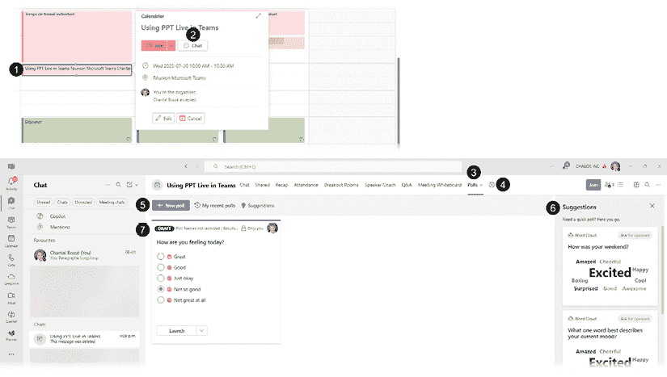

图 14.15 – 在会议详情中的投票标签页规划您的投票

+   您现在可以访问所有会议标签和应用程序。如果您看不到**投票**标签（**3**），请使用**+**号（**4**）添加应用程序，如之前在 Teams 会议窗口中所述。

+   使用**+新建投票**按钮（**5**）提前创建所有您的投票。**建议**面板中有一份您可以使用的快速投票列表（**6**）。

+   只需将它们保留在草稿模式（**7**）中，直到您在会议中启动。

如果您想了解更多关于投票的信息，请查看“进一步阅读”中的 Microsoft 支持文章。

您现在已经看到了一些工具，可以帮助您在虚拟演示中改善互动。当您通过 PowerPoint Live 共享演示文稿文件时，您可以在同一会议窗口中轻松访问它。

在下一节中，我们将讨论一种创造性的方法，在 Teams 中使用头像在您的虚拟演示中创建有趣的互动。

# 创建和使用头像

尽管头像本身不是交互式功能，但它们确实有一种方式可以增加会议的趣味性并减少虚拟疲劳。我也认为这可能是一种鼓励害羞的人参与的方式。

如果您需要更多信息，请参阅“进一步阅读”中列出的 Microsoft Learn 文章。

开始创建您的第一个头像并验证您同时可以访问该应用的最简单方法是在您的 Teams 界面中打开应用（*图 14.16*）：

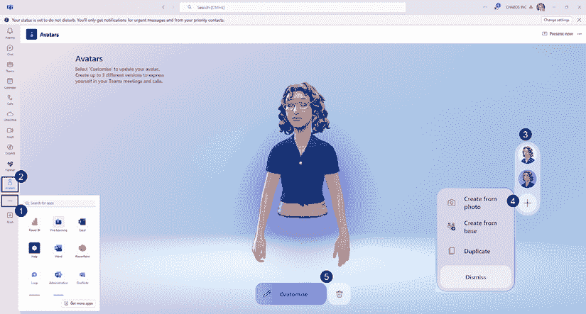

图 14.16 – 在 Teams 中打开头像应用

+   点击**查看更多应用**省略号（**…**）（**1**）并搜索带有`头像`关键词的应用。

+   它将打开**头像**应用（**2**），在那里您可以开始创建您的头像或查看您已经创建的头像（**3**）——最多可以创建三个版本。

+   点击**+**号（**4**）让您可以从照片、列表（**从基础创建**）或复制一个您已经创建的头像来创建头像。

+   现有的头像可以轻松地进行自定义或删除（**5**）。

在创建或自定义过程中，您可以调整一系列功能，使您的头像更符合您的个人形象（*图 14.17*）：

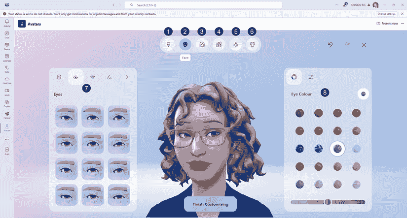

图 14.17 – 创建或自定义您的头像

+   **肤色** ( **1** )

+   **面部** ( **2** )

+   **头发** ( **3** )

+   **化妆** ( **4** )

+   **身体** ( **5** )

+   **服装** ( **6** )

如您在 **面部** 类别（ **2** ）中看到的，面部的所有部分都可以单独调整（ **7** ），有时还会添加另一个颜色选择面板，例如眼睛（ **8** ）。

熟悉应用程序的最佳方式是通过尝试使用它。根据您想要达到的相似度水平，创建第一个头像可能需要一些时间。但一旦创建了一个，就复制它以便有一个起点。

您可以在 **加入会议** 窗口（ *图 14.18* ）中选择您的头像：

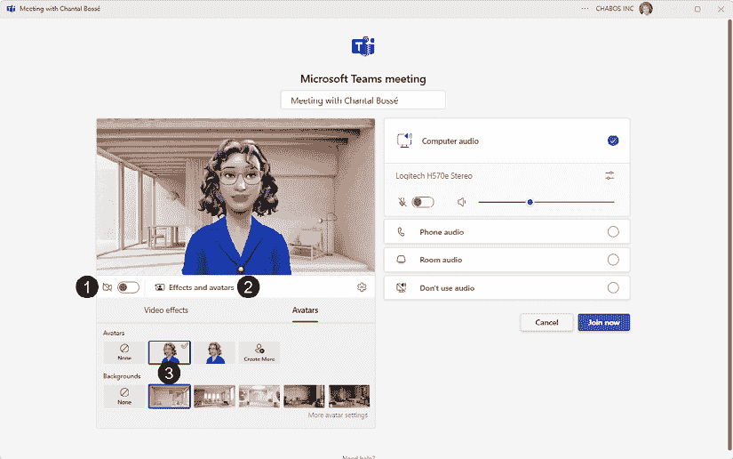

图 14.18 – 在加入会议窗口中使用您的头像

+   关闭您的摄像头（ **1** ）并点击 **效果和头像**（ **2** ）。

+   选择您想要使用的头像，如果您想要的话可以添加背景（ **3** ）。

您可以通过使用摄像头图标旁边的箭头并选择 **头像** 效果类别来在加入会议后选择您的头像。

我非常喜欢头像的一点是它们可以移动并表达自己。当我们说话时，我们看到眼睛和嘴唇的动作，以及与会议中的 **举手** 或 **反应** 功能对齐的手部动作。

请不要误解。我并不是说所有会议都应该使用头像！但在某些场合，比如人们身体不适但仍参加会议，或者对于特定类型的演示，如虚拟游戏或轻松会议，可以考虑使用它们。明确您团队允许使用头像的情况和时机。明确何时可以使用头像可以增加多样性并创造不同类型的观众参与。

在本章的最后部分，我们将讨论一些方法，帮助您在虚拟会议中改善您的外观和声音。

# 改善摄像头、照明和麦克风设置

我在本节中的目标不是涵盖市场上所有最新和最先进的设备，而是分享一些可以帮助您的功能和技巧，即使您没有访问到高端设备。

## 检查 Microsoft Teams 设备设置

当 Microsoft 推出了改进和更轻量级的 Teams 版本时，他们最终使访问摄像头和麦克风设置变得更容易。它们可以在 **加入会议** 窗口中访问，但我们将看到如何在 Teams 会议中访问它们。

让我们从摄像头设置开始（ *图 14.19* ）：

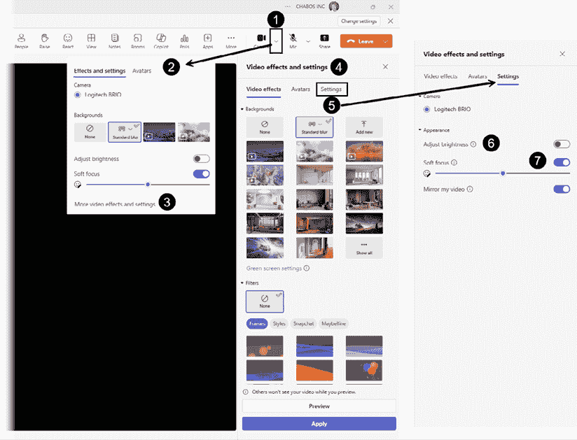

图 14.19 – 在 Teams 会议中访问摄像头设置

+   点击摄像头图标旁边的箭头（ **1** ）以打开 **效果和设置** 窗口（ **2** ），然后点击 **更多视频效果和设置**（ **3** ）。

+   **视频效果和设置**面板将在右侧显示（**4**）。

+   点击**设置**标签（**5**）：

+   **亮度**工具（**6**）将在光线不足的条件下提高视频质量。

+   **柔焦**工具（**7**）通过调整滑块来平滑你的外观，当它开启时。只需小心不要过度使用，因为它可能会让你看起来不自然。

尽管这些设置不能解决所有问题，但它们可以帮助提高你的视频质量。

通过点击**麦克风**图标旁边的箭头（**1**）可以轻松访问音频设置（*图 14.20*）：

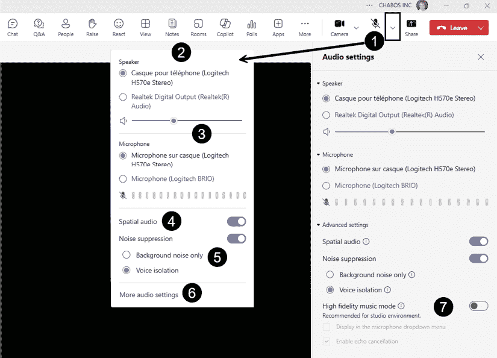

图 14.20 – 在 Teams 会议中访问音频设置

+   在设置窗口（**2**），如果你在电脑上检测到多个设备，你可以选择你的扬声器或麦克风（**3**）。

+   **空间音频**（**4**）是一个会改变你的音频体验的功能。在会议中，你将听到屏幕上说话人所在位置的声音。目前不支持无线耳机。

+   **噪音抑制**（**5**）默认开启，大大减少了环境噪音。这是一个基于 AI 的功能，分析背景噪音。Teams 会监控你的背景噪音，并调整抑制级别以移除不被识别为你的声音的噪音。有两个辅助设置可用：

    +   **仅背景噪音**，通过仅移除背景噪音来提高你的音频质量。

    +   **声音隔离**，它可以将你的声音从背景噪音和其他声音中隔离出来。如果你决定使用此功能，请按照 Teams 中的说明在应用程序设置的**识别**部分添加声音样本。

+   点击**更多音频设置**（**6**）将打开**音频设置**面板，其中唯一的新设置选项是**高保真音乐模式**（**7**），如果你在会议中播放音乐，这将很有用。

如果你想知道噪音抑制功能的有效性，我可以分享我曾在地下室的一个房间里进行虚拟培训，而工人们在我面前钻我们的房屋地基——参与者确认他们什么都没听到。幸运的是，我集中注意力有困难！但我还会补充说，该功能的可靠性可能取决于你使用的麦克风类型。请用你自己的设备测试它。

现在我们已经看到了 Teams 设置如何帮助你在会议中改善外观和声音，接下来让我们看看下一节中的最佳实践技巧。

## 帮助你改善外观和声音的技巧

尽管我不会讨论任何特定的设备，但很明显，如果你想在你虚拟演示中看起来更专业，你需要避免使用笔记本电脑的内置摄像头和麦克风。你根本无法很好地控制它们。

尝试寻找一个单独的网络摄像头，理想情况下是带有麦克风的优质耳机。当你添加这些设备时，制造商通常会提供一些小应用程序，可以帮助你调整设置。

为了帮助你看起来最好，确保你的网络摄像头在你面前，与眼睛水平。这也帮助你看向你的听众，这会更有吸引力（*图 14.21*）：

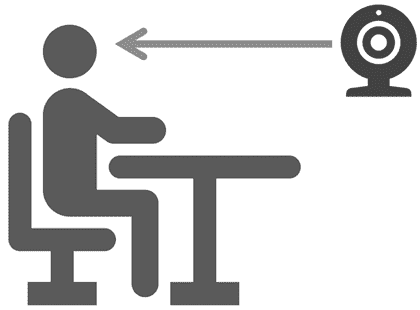

图 14.21 – 将你的网络摄像头放在你面前，与眼睛水平

对于照明，理想情况下，你应该在一个有自然光在前方或如果没有窗户，可以使用 LED 或环形灯的房间里进行展示。永远不要在背后有灯光的情况下进行展示，因为你会看起来像没有脸部的剪影（*图 14.22*）：

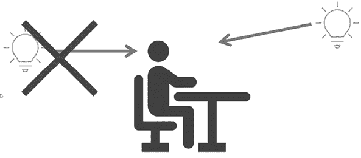

图 14.22 – 将自己放置在光线前方的位置

在你的虚拟演示过程中，如果你使用的房间相当昏暗，尝试在脸的两侧各添加一个角度的光源，以避免产生阴影（*图 14.23*）：

图 14.23 – 在昏暗环境中在两侧添加光源

当然，改善你在虚拟演示中的外观意味着清理你的背景。还有使用诸如模糊背景或添加虚拟背景等功能的可能性。请注意，如果在你的演示过程中有人从你身后走过，如果他们走得足够近，看起来就像你背后有人的身体部分漂浮。

如果你像我一样有卷发，虚拟背景有时会创造出欺骗性的效果。我经常发现自己的一部分脸在移动时消失了。我决定购买可以夹在我背后柱子上的会议背景，或者如果我是作为承包商为其他组织提供内容，就只使用一块简单的窗帘。现在，我的脸在整个课程或会议期间都保持完整！

我在这个部分分享的技巧可以称为快速修复。如果你打算定期进行虚拟演示，你应该投资于好的设备和照明。在了解选择什么方面，你最好的选择是询问其他演示者他们使用什么以及他们推荐什么。

# 摘要

本章主要介绍了如何使用 Microsoft Teams 中的工具来帮助你提供更好的虚拟演示文稿。我们讨论了 PowerPoint Live 如何帮助你在一个窗口中管理你的演示文稿和会议。我们还了解了一些可以帮助你保持与会者参与度的功能，例如分组讨论室、问答和投票。我们还简要介绍了如何创建和使用头像来提高参与度。最后，我们讨论了如何改进你的摄像头、照明和麦克风设置，分享了一些你可以轻松尝试的快速技巧。

我的愿望是让你意识到虚拟演示文稿需要与你在会议室或大型场所进行的演示一样多的练习。在我看来，它们甚至更复杂，因为你通常需要更多地了解可以帮助你保持人们参与度的功能，并自己处理技术问题。确保你继续学习你可以使用的虚拟工具。 

# 结论

如果你从头到尾阅读了这本书，你可能记得我们在章节中的内容结构，你的内容应该有一个引言、你的主要要点和一个结论。

在这本书中，我的引言全部关于在创建内容时遇到的挑战。然后我继续帮助你学习如何利用 PowerPoint 中的许多高级工具和功能来计划、创建和提供更具影响力的演示文稿。

现在你已经了解了如何创建更好的演示文稿，这里是我的挑战：在你的日程中安排更多的时间来将你的所学付诸实践。你的目标不应该是为了你下一次的演示文稿而改变一切。只需决定几个可以改进的元素并专注于它们。之后，你可以专注于未来演示文稿的其他改进。一步一步来，总比没有任何改进要好。

祝你在即将到来的演示文稿中取得巨大成功！

# 进一步阅读

+   Microsoft 支持关于在 Teams 会议中共享幻灯片的文章：[`support.microsoft.com/en-us/office/share-slides-in-a-teams-meeting-with-powerpoint-live-fc5a5394-2159-419c-bc59-1f64c1f4e470`](https://support.microsoft.com/en-us/office/share-slides-in-a-teams-meeting-with-powerpoint-live-fc5a5394-2159-419c-bc59-1f64c1f4e470)

+   Microsoft 支持关于 Excel Live 的文章：[`support.microsoft.com/en-us/office/excel-live-in-microsoft-teams-meetings-a5790e42-7f75-4859-8674-cc3d07c86ede`](https://support.microsoft.com/en-us/office/excel-live-in-microsoft-teams-meetings-a5790e42-7f75-4859-8674-cc3d07c86ede)

+   Microsoft 支持关于实时字幕的文章：[`support.microsoft.com/en-us/office/use-live-captions-in-a-teams-meeting-4be2d304-f675-4b57-8347-cbd000a21260`](https://support.microsoft.com/en-us/office/use-live-captions-in-a-teams-meeting-4be2d304-f675-4b57-8347-cbd000a21260)

+   Microsoft 支持文章关于实时转录：[`support.microsoft.com/en-us/office/view-live-transcription-in-a-teams-meeting-dc1a8f23-2e20-4684-885e-2152e06a4a8b`](https://support.microsoft.com/en-us/office/view-live-transcription-in-a-teams-meeting-dc1a8f23-2e20-4684-885e-2152e06a4a8b)

+   Microsoft 支持文章关于 Teams 会议中的分组讨论室：[`support.microsoft.com/en-us/office/use-breakout-rooms-in-teams-meetings-7de1f48a-da07-466c-a5ab-4ebace28e461`](https://support.microsoft.com/en-us/office/use-breakout-rooms-in-teams-meetings-7de1f48a-da07-466c-a5ab-4ebace28e461)

+   Microsoft 支持文章关于 Teams 会议中的不同角色：[`support.microsoft.com/en-us/office/roles-in-a-teams-meeting-c16fa7d0-1666-4dde-8686-0a0bfe16e019`](https://support.microsoft.com/en-us/office/roles-in-a-teams-meeting-c16fa7d0-1666-4dde-8686-0a0bfe16e019)

+   Microsoft 支持文章关于 Teams 会议中的投票：[`support.microsoft.com/en-us/office/poll-attendees-during-a-teams-meeting-9923b7d4-ea97-4aa2-b8b8-b45fefe7d454`](https://support.microsoft.com/en-us/office/poll-attendees-during-a-teams-meeting-9923b7d4-ea97-4aa2-b8b8-b45fefe7d454)

+   Microsoft Learn 文章关于管理 Teams 中的头像应用：[`learn.microsoft.com/en-us/microsoftteams/meeting-avatars`](https://learn.microsoft.com/en-us/microsoftteams/meeting-avatars)

|

#### 现在解锁本书的独家优惠

扫描此二维码或访问 [`packtpub.com/unlock`](https://packtpub.com/unlock) ，然后通过书名搜索此书。 |  |

| **注意** *：在开始之前，请准备好您的购买发票。* |
| --- |

[packtpub.com](https://www.packtpub.com)

订阅我们的在线数字图书馆，全面访问超过 7,000 本书和视频，以及领先的行业工具，帮助您规划个人发展并推进职业生涯。更多信息，请访问我们的网站。

# 为什么订阅？

+   使用来自 4,000 多位行业专业人士的实用电子书和视频，节省学习时间，更多时间编码

+   通过为您量身定制的技能计划提高学习效果

+   每月免费获得一本电子书或视频

+   完全可搜索，便于轻松访问关键信息

+   复制粘贴、打印和收藏内容

在 [www.packtpub.com](https://www.packtpub.com) ，您还可以阅读一系列免费的技术文章，订阅各种免费通讯，并享受 Packt 书籍和电子书的独家折扣和优惠。

# 您可能还会喜欢的其他书籍

如果您喜欢这本书，您可能还会对 Packt 的以下其他书籍感兴趣：

[(https://www.amazon.com/Ultimate-Zoom-Cookbook-recipes-communication/dp/1804616990/ref=sr_1_1?crid=3LHJGC4QG6JS1&dib=eyJ2IjoiMSJ9.hSNpO8cJTY28f_4ugHcmwChvxo8fCeFDhfwbwiZ_Us7Bi7noDSP1_5Eun1XShoqXhUb4TrhVDyl6x9ZCzCMSmYkjPkbOwem3gRPGIZ1ov751MasxsDetO_KtHBjJEk9uJn5rXpvN227bZNuZeaBikEM5uBL0V2nYlrY7emQnh07DdLvNUVxtbk8u5XvjQLPC2xUakYd_hK_MMa5nVWk3NL_Xlsuh5phpr8oc0DmmBWU.3MFD2jtgu7ekVsh1_scR8KtoEv4QGdNNi-YnPC4JEac&dib_tag=se&keywords=The+Ultimate+Zoom+Cookbook&qid=1759148330&s=books&sprefix=the+ultimate+zoom+cookbook%2Cstripbooks-intl-ship%2C569&sr=1-1)]

**《终极 Zoom 烹饪书**》

Patrick Kelley

ISBN: 978-1-80461-699-4

+   利用 Zoom 的功能和功能，而不仅仅是视频会议

+   了解如何使用 Zoom 进行多种通信模式

+   发现有效展示内容的高级技巧

+   了解如何从管理员门户配置用户和功能

+   通过 Zoom 电话、聊天、电子邮件和日历亲身体验

+   有效地配置 Zoom 硬件和软件

+   使用安全和隐私技术确保 Zoom 的安全

+   使用 AI 伴侣更高效、更有效地工作

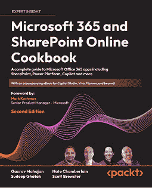[(https://www.amazon.com/Microsoft-Office-SharePoint-Online-Cookbook/dp/1803243171/ref=sr_1_1?crid=2NXDZTIMY4WV5&dib=eyJ2IjoiMSJ9.6sZqhuPoCclTyO38qSSU_k2h6EZ9NkNiCkemJ5Jhm8OjL1fQoT_gCHUUmxx6GpNObua1qVQPBZCp7vB9kvfldUhbLYyD5YBtrtXi3MbWy7k.EI3rEV9tUNbjdR8Kwi05BbCJVAMUeiknIR_hOZFtEUs&dib_tag=se&keywords=Microsoft+365+and+SharePoint+Online+Cookbook&qid=1759148378&s=books&sprefix=microsoft+365+and+sharepoint+online+cookbook%2Cstripbooks-intl-ship%2C579&sr=1-1)]

**《Microsoft 365 和 SharePoint Online 烹饪书**》

Gaurav Mahajan, Sudeep Ghatak, Nate Chamberlain, Scott Brewster

ISBN: 978-1-80324-317-7

+   使用 SharePoint、Teams、OneDrive、Delve、搜索和 Viva 进行有效协作

+   使用 Microsoft Copilot 提高创造力和生产力

+   使用 Power Apps 开发和部署自定义应用程序

+   使用 Power Virtual Agents (Copilot Studio) 创建自定义机器人

+   与其他应用程序集成，使用 Power Automate/Desktop (RPA) 自动化工作流程和重复性流程

+   使用 Power BI 设计报告和引人入胜的仪表板

+   在 Microsoft Forms 中使用计划、待办事项，并通过投票和调查收集反馈

+   在移动平台上体验无缝集成

# Packt 正在寻找像你这样的作者

如果你对成为 Packt 的作者感兴趣，请访问 [authors.packt.com](https://authors.packt.com/) 并今天申请。我们与成千上万的开发者和技术专业人士合作，就像你一样，帮助他们将见解分享给全球技术社区。你可以提交一般申请，申请我们正在招募作者的特定热门话题，或者提交你自己的想法。

# 分享你的想法

现在你已经完成了 *Microsoft PowerPoint Mastery*，我们非常想听听你的想法！如果你从亚马逊购买了这本书，请[点击此处直接跳转到该书的亚马逊评论页面](https://packt.link/r/1835882250)并分享你的反馈或在该购买网站上留下评论。

你的评论对我们和科技社区都非常重要，并将帮助我们确保我们提供高质量的内容。
